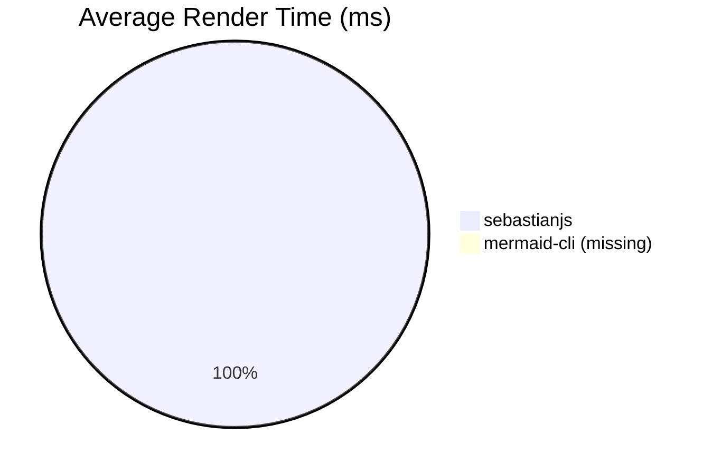

# SebastianJS

SebastianJS is a mermaid wrapper designed to make it able to perform server-side svg renderers without needing a headless browser.

Sebastian :crab: is the little mermaid :mermaid: buttler/friend/assistant. And it's a catchy name so be it sebastianJS.

## Initial use case

I was tired of needing to use a headless browser in order to render mermaid diagrams. I tried different ways including mermaidjs-cli that still requires puppeter and a headless browser.

Browsing some of mermaidjs requests I found some that are demanding exactly this. So this is an attempt at fixing a problem not a lot of people have.

## Goal

Use default mermaidjs implementation, this is not a fork. It is designed to remain a wrapper.

Focus is made on implementing SVG exports.

As this doesn't require a headless browser, it should be faster to render.

## Installation

```bash
npm install sebastianjs
```

## Usage

### API

```js
import { render } from 'sebastianjs';

const def = `graph TD; A[Start] --> B{OK?}; B -- Yes --> C[Done]; B -- No --> A;`;

const svg = await render(def, {
    theme: 'dark',
    themeVariables: { primaryColor: '#3366ff' },
    themeCSS: '.node rect{ rx:4; ry:4 }',
    normalizeViewBox: true,
    viewBoxMargin: 6,
    width: 1000,        // optional container / final svg width
    height: 600,        // optional container / final svg height
});

// svg is a <svg …> string
```

### CLI

```bash
# From a file
sebastianjs input.mmd -o output.svg --normalize-viewbox

# From stdin
echo 'graph TD; A-->B' | sebastianjs - > out.svg

# With theme options
sebastianjs input.mmd -o output.svg -t dark \
    --theme-vars '{"primaryColor":"#3366ff"}' \
    --theme-css '.node rect{rx:4;ry:4}' \
    --normalize-viewbox --viewbox-margin 6

# Set explicit width / height (influences layout + final svg size)
sebastianjs input.mmd -o out.svg -W 1200 -H 700 --normalize-viewbox
```

## Demos

Prebuilt comparison demos are located in the github pages: https://creadri.github.io/sebastianjs/


```bash
npm run fetch:samples
npm run build:site
```

## Roadmap

- [x] Make structure of render method
- [x] Implement tests for all known mermaidjs diagrams (excluding beta ones)
- [x] Make first render implementation with minimal DOM support for basic flowchart
- [x] Make a tiny CLI
- [x] Mermaid theme support
- [ ] Fix positioning and sizing issues
- [ ] Release First viable option
- [ ] Analyze the feasability of PNG/GIF/JPEG exports and if reasonable implement it
- [ ] Create a benchmark to assess the difference in performance compared to mermaid-cli


## Limitations

Note on accuracy
: SebastianJS requires node-canvas for accurate, browserless text measurement (no headless browser).

## Dependencies

Canvas package is required.

## Licence

[MIT License](./LICENSE)

Demo files where taken from mermaid-js/mermaid repository
: [Mermaid MIT License](https://github.com/mermaid-js/mermaid?tab=MIT-1-ov-file)

<!-- BENCHMARK_START -->
## Benchmark

_Last updated: 2025-09-04T11:12:55.857Z_

Rendering all sample diagrams (count: 228).

**Note:** mermaid-cli (mmdc) not found in PATH; its results are omitted.

### Summary Table

| Metric | sebastianjs | mermaid-cli |
| --- | --- | --- |
| Samples | 228 | — |
| Successful | 199 | — |
| Avg ms | 93.97 | — |
| Total ms | 21426.00 | — |
| Min ms | 6.00 | — |
| Max ms | 1751.00 | — |

### Mermaid Graph




<!-- BENCHMARK_END -->
