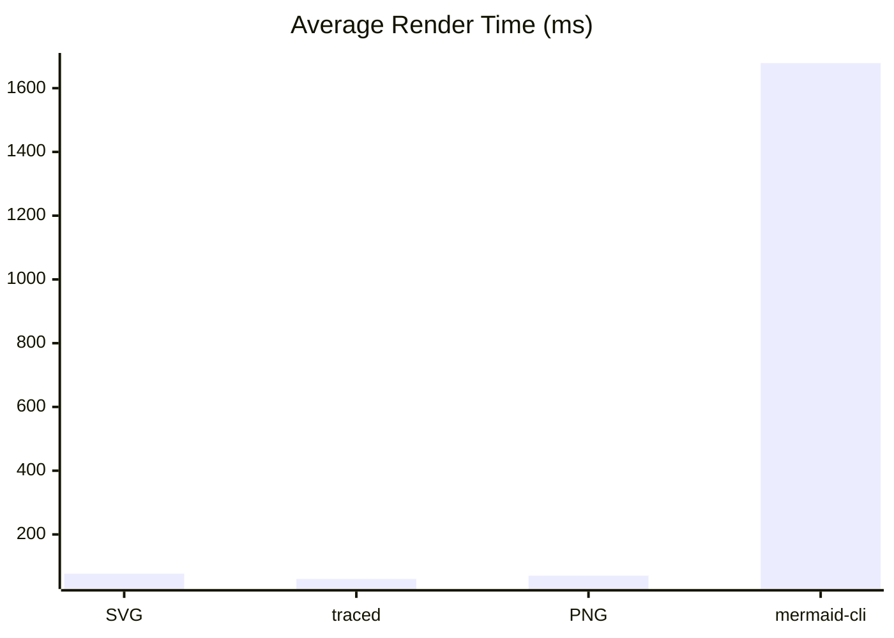

# SebastianJS

SebastianJS is a *mermaidjs* wrapper designed to make it able to perform server-side svg renderers without needing a headless browser.

Sebastian :crab: is the little mermaid :mermaid: buttler/friend/assistant. And it's a catchy name so be it sebastianJS.

## Initial use case

I like documentation-as-code for projects. MermaidJS is widely supported and is good enough for most use-cases. A problem arose quickly: the need of a real browser to render the diagrams and it's painfully slow and memory hungry.

## Goal

Use default *mermaidjs* implementation, this is not a fork. It is designed to remain a `wrapper`.

It should be fast as it doesn't require a headless browser. Most of the gain is in the initial load though. The rendering engine might be a bit slower but overall it's fast.

> As of version 0.4.0, SebastianJS offers what it has promised. It's almost pixel perfect, renders SVG fast, makes SVG that are actually usable by most common tools, renders PNG. All without much dependencies.

## Demos

Prebuilt comparison demos are located in the github pages: https://sebastianjs.otterit.be

## Installation

```bash
npm install sebastianjs
```
## Usage

### CLI

```bash
# From a file
sebastianjs input.mmd -o output.svg

# From stdin
echo 'graph TD; A-->B' | sebastianjs - > out.svg

# With theme options
sebastianjs input.mmd -o output.svg -t dark \
  --theme-vars '{"primaryColor":"#3366ff"}' \
  --theme-css '.node rect{rx:4;ry:4}'

# Render for a non-browser rasterizer or viewer (Okular, resvg, librsvg)
sebastianjs input.mmd -o output.svg -p

# PNG. An output path ending in .png is rasterized.
sebastianjs input.mmd -o output.png --scale 2 --background white

# Set the viewport the diagram is laid out on. Like mermaid-cli's -w/-H these
# are layout hints; the emitted SVG still sizes itself from its own bounding box.
sebastianjs input.mmd -o out.svg -W 1200 -H 700
```

### API

```js
import { render } from 'sebastianjs';

const def = `graph TD; A[Start] --> B{OK?}; B -- Yes --> C[Done]; B -- No --> A;`;
const svg = await render(def, {
  theme: 'dark',
  themeVariables: { primaryColor: '#3366ff' },
  themeCSS: '.node rect{ rx:4; ry:4 }',
  // Viewport hints only — the size of the "page" the diagram is laid out on.
  // The rendered SVG sizes itself from its own bounding box (width="100%" plus
  // a max-width style and a viewBox), exactly as mermaid does in a browser and
  // as mermaid-cli emits.
  width: 800,        // optional (defaults to 800)
  height: 600,       // optional (defaults to 600)
});

// svg is a <svg …> string
```

## PNG

```js
import { renderPng } from 'sebastianjs';

const { data, width, height } = await renderPng(def, { scale: 2, background: 'white' });
```

Rasterizing is delegated to [resvg](https://github.com/linebender/resvg) as WebAssembly rather than a native binding, so no building step required.

## SVG

By default, mermaid generates SVG using ForeignObjects and Styles. Those two features are not widely supported in the rasterizing engines shiped with common tools like Krita, Gwenview, Microsoft Office and many more.

The ´-p´ option traces the font and gets rid of styles.

ForeignObjects are flattened by default.

## Roadmap

- [x] Make structure of render method
- [x] Implement tests for all known mermaidjs diagrams (excluding beta ones)
- [x] Make first render implementation with minimal DOM support for basic flowchart
- [x] Make a tiny CLI
- [x] Create a benchmark to assess the difference in performance compared to mermaid-cli
- [x] Mermaid theme support
- [x] Fix positioning and sizing issues
- [x] Release First viable option
- [ ] Font Awesome support
- [ ] Katex support
- [x] Analyze the feasability of PNG/GIF/JPEG exports and if reasonable implement it.
- [x] Implementing PNG export, GIF & JPEG out and not planned.

## Limitations

- **Fonts must be available locally — twice, if you rasterize.** Text is measured
  from real font files, so a family that is not registered falls back to a
  bundled one and measures differently from a machine that has it installed.
  Open Sans and Noto Sans ship with the package. That covers measurement only:
  nothing is embedded in the SVG, so the emitted `font-family` has to be
  resolvable by whatever draws the file too, or it substitutes one with different
  metrics and the glyphs no longer fill the boxes they were measured into.
  `textAsPaths: true` removes that second requirement, and `renderPng` hands the
  rasterizer the measured files directly.
- **Math labels are not typeset.** Mermaid renders `$$...$$` with KaTeX; We don't support KaTeX yet.
- **Line breaking implements a subset of UAX #14.** Labels wrap at spaces,
  hyphens, slashes, close punctuation and between CJK characters. Rare cases can land on a different line count than a browser.
- **Not every diagram type is verified.** The parity suite covers flowchart,
  sequence, class, state, ER and the other stable types; beta diagrams are
  rendered but unmeasured.
- **One diagram type does not render yet.** `zenuml` needs its plugin
  registered; mermaid-cli bundles it and we do not, so those two samples are
  ours to fix.

## Dependencies

No native build step and no headless browser. Text is measured with
[fontkit](https://github.com/foliojs/fontkit) and geometry with a vendored copy
of [svgdom](https://github.com/svgdotjs/svgdom)'s maths, both pure JavaScript.

PNG output adds [@resvg/resvg-wasm](https://github.com/thx/resvg-js) —
WebAssembly, so still no build step and no per-platform binaries. It has no
dependencies and no install scripts of its own. It is MPL-2.0 where the rest of
this package is MIT; as an unmodified dependency that puts no condition on your
code, but a bundle that redistributes it carries the notice.

## Licence

[MIT License](./LICENSE)

Demo files where taken from mermaid-js/mermaid repository
: [Mermaid MIT License](https://github.com/mermaid-js/mermaid?tab=MIT-1-ov-file)

Thanks for the fonts under `fonts/` with their licenses:
- Noto Sans: [OFL](./fonts/Noto_Sans/OFL.txt)
- Open Sans: [OFL](./fonts/Open_Sans/OFL.txt)

<!-- BENCHMARK_START -->
## Benchmark

_Last updated: 2026-09-02T07:07:30.299Z_ · Node v22.23.2

Rendering 12 sample diagrams from `samples/mermaid-demos`, every renderer on
the same mermaid config (Open Sans, default HTML labels). Regenerate with
`npm run benchmark`.

- **sebastianjs SVG** — the default output, HTML labels and all
- **sebastianjs traced** — `portable` plus `textAsPaths`: no foreignObject, no stylesheet, no font
- **sebastianjs PNG** — a render plus rasterization by resvg
- **mermaid-cli** — a fresh Node and headless Chromium per invocation

The comparison is library-versus-CLI, which is what you would actually choose
between: SebastianJS renders in-process, while mermaid-cli starts Node and a
headless Chromium for each invocation. That process startup is most of the gap.


SebastianJS is **22x faster** per diagram, and **24x** even counting the rasterizer.

### Summary

| Metric | sebastianjs SVG | sebastianjs traced | sebastianjs PNG | mermaid-cli |
| --- | --- | --- | --- | --- |
| Samples | 12 | 12 | 12 | 12 |
| Successful | 12 | 12 | 12 | 12 |
| Avg ms | 76.92 | 60.25 | 70.67 | 1678.75 |
| Total ms | 923.00 | 723.00 | 848.00 | 20145.00 |
| Min ms | 18.00 | 24.00 | 23.00 | 1635.00 |
| Max ms | 381.00 | 100.00 | 126.00 | 1752.00 |

### Average render time


```mermaid
xychart-beta
  title "Average Render Time (ms)"
  x-axis ["SVG", "traced", "PNG", "mermaid-cli"]
  bar [76.92, 60.25, 70.67, 1678.75]
```

<!-- BENCHMARK_END -->

## Dev Notes

### Mermaid is pinned, deliberately

`mermaidjs`' version is deliberately pinned to the same version as current mermaid-cli. This is done in order to be able to measure the drift between the same version.

It matters more than it sounds. Mermaid reaches into the DOM as it renders, and
this package supplies that DOM: mermaid 11.17 began building its styles with
`new CSSStyleSheet()`, which threw on every render against a global that was
never forwarded. A floating range shipped that to users while the suite stayed
green on an older locked copy.

The sample corpus is pinned the same way -- `npm run fetch:samples` clones the
`mermaid@<version>` tag rather than the default branch, so demos never use
syntax the pinned mermaid cannot parse.

To move to a newer mermaid, upgrade mermaid-cli and follow it:

```bash
npm install -D @mermaid-js/mermaid-cli@latest
npm run sync:mermaid      # pin mermaid to whatever that release locks
npm install
npm run fetch:samples     # refresh the corpus at the matching tag
npm test && npm run deviation
```

`npm run check:mermaid` verifies the pin still matches without changing it, and
`__tests__/versions.test.js` fails offline if a range ever creeps back in.

## Demos

```bash
npm run fetch:samples
npm run build:site
npm run benchmark

# Optional: Run deviation comparison tests (mermaid-cli is a devDependency)
DEVIATION_TESTS=1 npm test -- __tests__/samples-deviation.test.js --runInBand

# Run deviation on a single sample
# Using env var (matches by basename or relative path under samples folder):
DEVIATION_TESTS=1 DEVIATION_SAMPLE=flowchart__1.mmd npm test -- __tests__/samples-deviation.test.js --runInBand

# Direct CLI for ad-hoc runs:
node scripts/deviation-suite.mjs -f samples/mermaid-demos/flowchart__1.mmd
```

## AI assisted project

A note on this part: While being somewhat a decent developer, I was not able to tackle this project without an AI assistant. Investigating how chrome handles calculation for DOM calls that mermaid does was hell without it.

## How are things so far

### August 2026

The rewrite landed. Instead of letting a hollow DOM compute a wrong layout and
patching the SVG afterwards, the DOM now measures correctly in the first place:
jsdom hosts the document and svgdom's geometry engine (vendored, driven by
fontkit) answers `getBBox`, `getComputedTextLength`, `getCTM` and friends.

Layout in mermaid is pure JS (dagre/ELK) — it was always correct, it was just
being fed wrong measurements. Fixing the measurements fixed the layout, which
post-processing structurally could not do: by the time you have the SVG, nodes
have already been placed from the wrong sizes.

Measured against real Chrome via mermaid-cli, both pinned to `htmlLabels: false`
and Open Sans:

| diagram | sebastianjs | chrome | Δ width |
| --- | --- | --- | --- |
| flowchart TD | 127.3 x 383.3 | 127.4 x 383.4 | 0.08% |
| flowchart LR | 1050.7 x 170.0 | 1052.1 x 170.0 | 0.13% |
| sequence | 500.0 x 333.0 | 500.0 x 333.0 | 0.00% |
| class | 299.2 x 367.0 | 299.7 x 367.0 | 0.17% |
| state | 121.5 x 358.0 | 121.9 x 358.0 | 0.26% |
| er | 449.1 x 474.0 | 449.3 x 474.0 | 0.05% |

Individual text runs match Chrome exactly (Δy 0.00, Δx ≤ 0.02, Δheight 0.00).
Across the full sample corpus — 84 diagrams compared against real Chrome — the
average absolute node-position deviation is **0.016px**, excluding nine diagrams
with two documented causes (KaTeX math labels, and one line-breaking case listed
in `KNOWN_DEVIATIONS`). Regenerate with `node scripts/compare-chrome.mjs` or
`node scripts/deviation-suite.mjs`.

**Labels use HTML in `<foreignObject>`, as mermaid does by default.** Measuring
that means modelling the small slice of CSS mermaid actually emits — the label
markup is 8 tags and 6 properties, and reduces to `width = widest line advance`,
`height = lines x line-height`. Raw HTML, entities and `` in labels all work.

Set `htmlLabels: false` to emit SVG `<text>` instead:

```js
const svg = await render(def, { htmlLabels: false });
```

That matters for **portability**: `<foreignObject>` is not supported by librsvg
or resvg and only partly by Inkscape, so HTML labels render correctly in a
browser but can lose every label in a non-browser rasterizer pipeline. The
`<text>` path renders anywhere, at the cost of showing raw HTML, HTML entities
and `fa:` icons as literal text — and because mermaid measures that label
differently, the whole diagram is laid out differently too.

`flattenLabels: true` is the better answer for a rasterizer pipeline:

```js
const svg = await render(def, { flattenLabels: true });   // or --flatten-labels
```

It renders with HTML labels as usual, then rewrites them as SVG `<text>` from
the line boxes the measurement already produced. Nothing is re-measured, so the
diagram keeps exactly the geometry it was laid out with — across the sample
corpus every deterministic diagram is byte-identical outside the labels — and
markdown emphasis, entities and raw HTML survive as real styled text rather than
as literal characters. Each line becomes one `<tspan>` anchored on its own
baseline, `<b>`/`<i>` become nested `<tspan>`s, an `` becomes an `<image>`
placed from its offset along the line and its CSS `vertical-align`, and the HTML
background behind an edge label becomes a `<rect>`.

A label is left as `<foreignObject>` in two cases: it holds a box with no SVG
equivalent at all (`<canvas>`, `<video>`, `<iframe>`), or it holds an image whose
size never resolved — emitting nothing for it would silently drop the label,
where leaving the HTML at least still renders in a browser.

### Rendering outside a browser

`foreignObject` is not the only thing a simple renderer cannot do. Mermaid keeps
essentially all of its paint in the `<style>` block and addresses it by class — a
node is emitted as `<rect class="basic label-container">` with no fill and no
stroke of its own — and its arrowheads are `<marker>` references. Renderers built
on SVG Tiny (QtSvg, and so Okular) implement neither, so they fall back to the
SVG initial values and draw the whole diagram as black boxes with no strokes and
no arrows.

`portable: true` turns on all three passes that fix this:

```js
const svg = await render(def, { portable: true });   // or -p / --portable
```

| pass | what it resolves |
| --- | --- |
| `flattenLabels` | `<foreignObject>` labels become `<text>` |
| `inlineStyles` | the stylesheet becomes SVG presentation attributes |
| `bakeMarkers` | `marker-end` references become drawn geometry |

Each is settable on its own, and setting one alongside `portable` overrides it.

**The passes only ever add.** The `<style>` block stays exactly as it was, and so
do the `marker-*` attributes — CSS beats a presentation attribute, and a renderer
that implements markers paints the definition over the baked copy in the same
place. So nothing that renders correctly today can regress; renderers that were
drawing nothing now have something to draw. Across the sample corpus, every
diagram rendered with `portable` has a fill or a stroke on every shape *with the
stylesheet deleted*, and node placement is byte-identical to a plain render.

The cost is time and size: over the 226-sample corpus, plain is 49.0s / 3.4 MB,
and all three passes together are 65.7s / 3.6 MB plus the baked arrowheads.

`marker-mid` is not baked — it needs a position per intermediate vertex rather
than per endpoint, and no mermaid diagram emits one.

### Text without a font

`portable` still leaves one thing for the renderer to find: the font.
`<text font-family="Open Sans">` only draws if Open Sans is installed, and nothing
is embedded in the SVG, so a rasterizer without it substitutes a face with
different metrics and the glyphs stop fitting the boxes they were measured into.

```js
const svg = await render(def, { textAsPaths: true });   // or --text-as-paths
```

Every run becomes a `<path>` drawn from the very font file fontkit measured it
with, so the file renders identically anywhere and needs no font at all. It
covers the text mermaid draws itself, not only flattened labels — across the
sample corpus not one `<text>` element is left. It implies `inlineStyles`,
because a rule like `.label text { fill: #333 }` selects on the element name and
stops matching the moment its `<text>` becomes a `<g>`.

This is the tier above `portable` rather than part of it, because it costs: the
corpus grows 5.4x, and the text can no longer be selected or searched.

Images in labels are sized from `data:` URIs and local files. Pass
`allowRemoteImages: true` to fetch `http(s)` sources — off by default so
rendering never performs network I/O unasked. Pass `iconPacks` (Iconify JSON,
e.g. from `@iconify-json/fa6-solid`) to make `fa:` labels resolve to real icons
instead of literal text.

### November 2025

Not Great, mermaid uses a lot of DOM features to perform the layout. So far the goal was to: let an empty shell of a DOM do the math wrongly and get a very wrong layout. Then post process the results and try to mimic the looks. It worked for some demos but I don't think it's the right approach. Looking into svgdom project in order to have a more detailled and implemented DOM.

### August 2025

Doing great, already got some results and the benchmarks are showing obvious benefits in rendering with sebastianjs instead of mermaid-cli.
