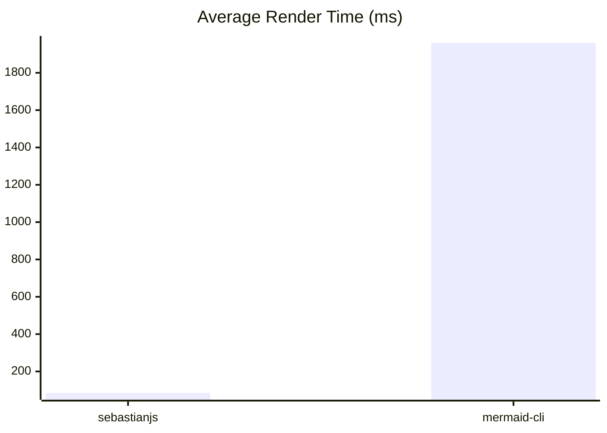

# SebastianJS

SebastianJS is a mermaid wrapper designed to make it able to perform server-side svg renderers without needing a headless browser.

Sebastian :crab: is the little mermaid :mermaid: buttler/friend/assistant. And it's a catchy name so be it sebastianJS.

## Initial use case

I was tired of needing to use a headless browser in order to render mermaid diagrams. I tried different ways including mermaidjs-cli that still requires puppeter and a headless browser.

Browsing some of mermaidjs requests I found some that are demanding exactly this. So this is an attempt at fixing a problem not a lot of people have.

## Goal

Use default mermaidjs implementation, this is not a fork. It is designed to remain a wrapper.

Focus is made on implementing SVG exports.

As this doesn't require a headless browser, it should be faster to render.

## Installation

```bash
npm install sebastianjs
```

## Usage

### API

```js
import { render } from 'sebastianjs';

const def = `graph TD; A[Start] --> B{OK?}; B -- Yes --> C[Done]; B -- No --> A;`;

const svg = await render(def, {
  theme: 'dark',
  themeVariables: { primaryColor: '#3366ff' },
  themeCSS: '.node rect{ rx:4; ry:4 }',
  width: 800,        // optional (defaults to 800)
  height: 600,       // optional (defaults to 600)
});

// svg is a <svg …> string
```

### CLI

```bash
# From a file
sebastianjs input.mmd -o output.svg

# From stdin
echo 'graph TD; A-->B' | sebastianjs - > out.svg

# With theme options
sebastianjs input.mmd -o output.svg -t dark \
  --theme-vars '{"primaryColor":"#3366ff"}' \
  --theme-css '.node rect{rx:4;ry:4}'

# Set explicit width / height (influences layout + final svg size)
sebastianjs input.mmd -o out.svg -W 1200 -H 700
```

## Demos

Prebuilt comparison demos are located in the github pages: https://creadri.github.io/sebastianjs/


```bash
npm run fetch:samples
npm run build:site
npm run benchmark

# Optional: Run deviation comparison tests (requires mermaid-cli in PATH)
DEVIATION_TESTS=1 npm test -- __tests__/samples-deviation.test.js --runInBand

# Run deviation on a single sample
# Using env var (matches by basename or relative path under samples folder):
DEVIATION_TESTS=1 DEVIATION_SAMPLE=flowchart__1.mmd npm test -- __tests__/samples-deviation.test.js --runInBand

# Direct CLI for ad-hoc runs:
node scripts/deviation-suite.mjs -f samples/mermaid-demos/flowchart__1.mmd
```

## Roadmap

- [x] Make structure of render method
- [x] Implement tests for all known mermaidjs diagrams (excluding beta ones)
- [x] Make first render implementation with minimal DOM support for basic flowchart
- [x] Make a tiny CLI
- [x] Mermaid theme support
- [ ] Fix positioning and sizing issues
- [ ] Release First viable option
- [ ] Analyze the feasability of PNG/GIF/JPEG exports and if reasonable implement it
- [ ] Create a benchmark to assess the difference in performance compared to mermaid-cli


## Limitations

Note on accuracy
: SebastianJS requires node-canvas for accurate, browserless text measurement (no headless browser).

## Dependencies

### Install dependencies for Canvas (Ubuntu/Debian)
```bash
sudo apt-get install -y build-essential libcairo2-dev libpango1.0-dev libjpeg-dev libgif-dev librsvg2-dev
```

Src: https://www.npmjs.com/package/canvas

## Licence

[MIT License](./LICENSE)

Demo files where taken from mermaid-js/mermaid repository
: [Mermaid MIT License](https://github.com/mermaid-js/mermaid?tab=MIT-1-ov-file)

<!-- BENCHMARK_START -->
## Benchmark

_Last updated: 2025-09-25T12:26:58.647Z_

Rendering all sample diagrams (count: 228).


### Summary Table

| Metric | sebastianjs | mermaid-cli |
| --- | --- | --- |
| Samples | 228 | 228 |
| Successful | 199 | 224 |
| Avg ms | 84.81 | 1960.71 |
| Total ms | 19336.00 | 447043.00 |
| Min ms | 8.00 | 1750.00 |
| Max ms | 1325.00 | 2659.00 |

### Mermaid Graph




<!-- BENCHMARK_END -->
