# block

## Example 1

**SebastianJS (SVG):**

> Render failed: TypeError: DOMPurify.sanitize is not a function

**Mermaid Code (Browser Rendered):**

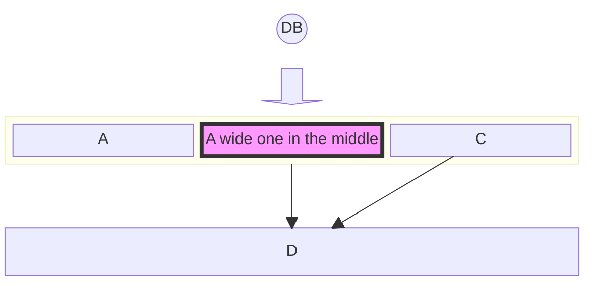

## Example 2

**SebastianJS (SVG):**

> Render failed: TypeError: DOMPurify.sanitize is not a function

**Mermaid Code (Browser Rendered):**

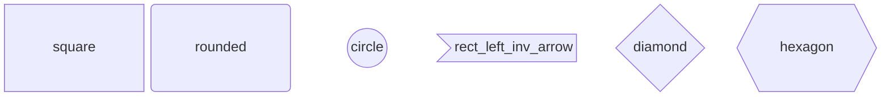

## Example 3

**SebastianJS (SVG):**

> Render failed: TypeError: DOMPurify.sanitize is not a function

**Mermaid Code (Browser Rendered):**

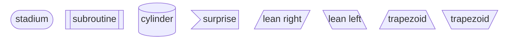

## Example 4

**SebastianJS (SVG):**

> Render failed: TypeError: DOMPurify.sanitize is not a function

**Mermaid Code (Browser Rendered):**

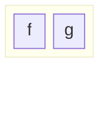

## Example 5

**SebastianJS (SVG):**

> Render failed: TypeError: DOMPurify.sanitize is not a function

**Mermaid Code (Browser Rendered):**

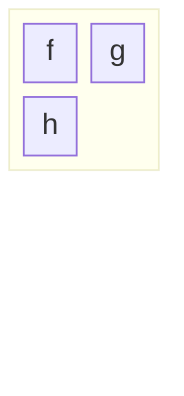

## Example 6

**SebastianJS (SVG):**

> Render failed: TypeError: DOMPurify.sanitize is not a function

**Mermaid Code (Browser Rendered):**

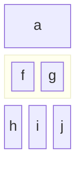

## Example 7

**SebastianJS (SVG):**

> Render failed: TypeError: DOMPurify.sanitize is not a function

**Mermaid Code (Browser Rendered):**

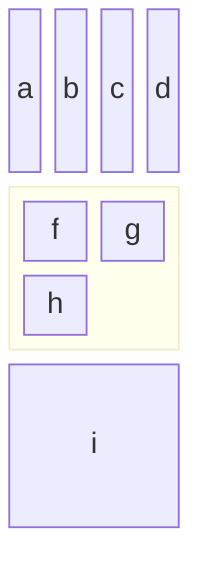

## Example 8

**SebastianJS (SVG):**

> Render failed: TypeError: DOMPurify.sanitize is not a function

**Mermaid Code (Browser Rendered):**

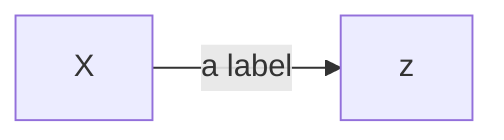

## Example 9

**SebastianJS (SVG):**

> Render failed: TypeError: DOMPurify.sanitize is not a function

**Mermaid Code (Browser Rendered):**

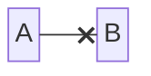

## Example 10

**SebastianJS (SVG):**

> Render failed: TypeError: DOMPurify.sanitize is not a function

**Mermaid Code (Browser Rendered):**

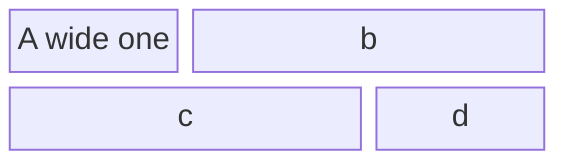

## Example 11

**SebastianJS (SVG):**

> Render failed: TypeError: DOMPurify.sanitize is not a function

**Mermaid Code (Browser Rendered):**

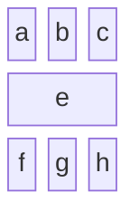

## Example 12

**SebastianJS (SVG):**

> Render failed: TypeError: DOMPurify.sanitize is not a function

**Mermaid Code (Browser Rendered):**

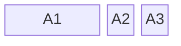

