# block

## Example 1

**SebastianJS (SVG):**

<svg id="graph" xmlns="http://www.w3.org/2000/svg" xmlns:xlink="http://www.w3.org/1999/xlink" style="max-width: 648px;" viewBox="-4 -112 646 232" role="graphics-document document" aria-roledescription="block"><g/><marker id="graph_block-pointEnd" class="marker block" viewBox="0 0 10 10" refX="6" refY="5" markerUnits="userSpaceOnUse" markerWidth="12" markerHeight="12" orient="auto"><path d="M 0 0 L 10 5 L 0 10 z" class="arrowMarkerPath" style="stroke-width: 1; stroke-dasharray: 1,0;"/></marker><marker id="graph_block-pointStart" class="marker block" viewBox="0 0 10 10" refX="4.5" refY="5" markerUnits="userSpaceOnUse" markerWidth="12" markerHeight="12" orient="auto"><path d="M 0 5 L 10 10 L 10 0 z" class="arrowMarkerPath" style="stroke-width: 1; stroke-dasharray: 1,0;"/></marker><marker id="graph_block-circleEnd" class="marker block" viewBox="0 0 10 10" refX="11" refY="5" markerUnits="userSpaceOnUse" markerWidth="11" markerHeight="11" orient="auto"><circle cx="5" cy="5" r="5" class="arrowMarkerPath" style="stroke-width: 1; stroke-dasharray: 1,0;"/></marker><marker id="graph_block-circleStart" class="marker block" viewBox="0 0 10 10" refX="-1" refY="5" markerUnits="userSpaceOnUse" markerWidth="11" markerHeight="11" orient="auto"><circle cx="5" cy="5" r="5" class="arrowMarkerPath" style="stroke-width: 1; stroke-dasharray: 1,0;"/></marker><marker id="graph_block-crossEnd" class="marker cross block" viewBox="0 0 11 11" refX="12" refY="5.2" markerUnits="userSpaceOnUse" markerWidth="11" markerHeight="11" orient="auto"><path d="M 1,1 l 9,9 M 10,1 l -9,9" class="arrowMarkerPath" style="stroke-width: 2; stroke-dasharray: 1,0;"/></marker><marker id="graph_block-crossStart" class="marker cross block" viewBox="0 0 11 11" refX="-1" refY="5.2" markerUnits="userSpaceOnUse" markerWidth="11" markerHeight="11" orient="auto"><path d="M 1,1 l 9,9 M 10,1 l -9,9" class="arrowMarkerPath" style="stroke-width: 2; stroke-dasharray: 1,0;"/></marker><g class="block"><g class="node default default flowchart-label" id="db" transform="translate(319, -96)"><circle style="" rx="0" ry="0" r="17" width="34" height="32"/><g class="label" style="" transform="translate(0, -12)"><rect/><text style=""><tspan xml:space="preserve" dy="1em" x="0" class="row">DB</tspan></text></g></g><g class="node default default flowchart-label" id="blockArrowId6" transform="translate(319, -48)"><polygon points="29,0 0,-4 20,-4 20,-36 38,-36 38,-4 58,-4" class="label-container" transform="translate(-29,20)" style=""/><g class="label" style="" transform="translate(0, -12)"><rect/><text style=""><tspan xml:space="preserve" dy="1em" x="0" class="row"/></text></g></g><g class="node default default flowchart-label" id="ID" transform="translate(319, 0)"><rect class="basic cluster composite label-container" style="" rx="0" ry="0" x="-319" y="-20" width="638" height="40"/><g class="label" style="" transform="translate(0, -12)"><rect/><text style=""><tspan xml:space="preserve" dy="1em" x="0" class="row"/></text></g></g><g class="node default default flowchart-label" id="A" transform="translate(109, 0)"><rect class="basic label-container" style="" rx="0" ry="0" x="-101" y="-12" width="202" height="24"/><g class="label" style="" transform="translate(0, -12)"><rect/><text style=""><tspan xml:space="preserve" dy="1em" x="0" class="row">A</tspan></text></g></g><g class="node default default flowchart-label" id="B" transform="translate(319, 0)"><rect class="basic label-container" style="fill:#f9F;stroke:#333;stroke-width:4px;" rx="0" ry="0" x="-101" y="-12" width="202" height="24"/><g class="label" style="" transform="translate(0, -12)"><rect/><text style=""><tspan xml:space="preserve" dy="1em" x="0" class="row">A wide one in the middle</tspan></text></g></g><g class="node default default flowchart-label" id="C" transform="translate(529, 0)"><rect class="basic label-container" style="" rx="0" ry="0" x="-101" y="-12" width="202" height="24"/><g class="label" style="" transform="translate(0, -12)"><rect/><text style=""><tspan xml:space="preserve" dy="1em" x="0" class="row">C</tspan></text></g></g><g class="node default default flowchart-label" id="D" transform="translate(319, 96)"><rect class="basic label-container" style="" rx="0" ry="0" x="-319" y="-20" width="638" height="40"/><g class="label" style="" transform="translate(0, -12)"><rect/><text style=""><tspan xml:space="preserve" dy="1em" x="0" class="row">D</tspan></text></g></g><path d="M319,12L319,18C319,24,319,36,319,47.333C319,58.667,319,69.333,319,74.667L319,80" id="1-ID-D" class="  edge-thickness-normal edge-pattern-solid flowchart-link LS-a1 LE-b1" marker-end="url(#graph_block-pointEnd)"/><path d="M524,2.286L507.333,9.905C490.667,17.524,457.333,32.762,424.606,47.723C391.879,62.684,359.759,77.367,343.698,84.709L327.638,92.051" id="1-C-D" class="  edge-thickness-normal edge-pattern-solid flowchart-link LS-a1 LE-b1" marker-end="url(#graph_block-pointEnd)"/></g></svg>

**Mermaid Code (Browser Rendered):**

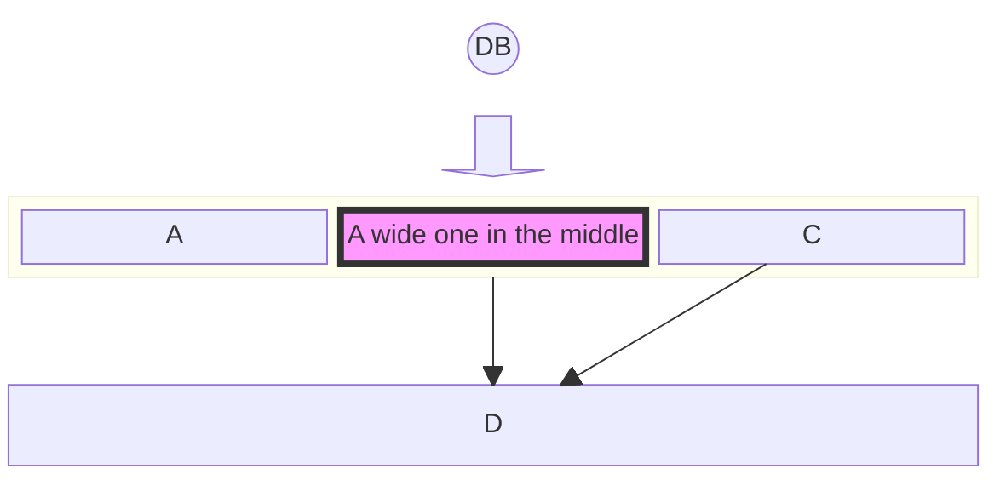

## Example 2

**SebastianJS (SVG):**

<svg id="graph" xmlns="http://www.w3.org/2000/svg" xmlns:xlink="http://www.w3.org/1999/xlink" style="max-width: 1022px;" viewBox="-4 -16 939 32" role="graphics-document document" aria-roledescription="block"><g/><marker id="graph_block-pointEnd" class="marker block" viewBox="0 0 10 10" refX="6" refY="5" markerUnits="userSpaceOnUse" markerWidth="12" markerHeight="12" orient="auto"><path d="M 0 0 L 10 5 L 0 10 z" class="arrowMarkerPath" style="stroke-width: 1; stroke-dasharray: 1,0;"/></marker><marker id="graph_block-pointStart" class="marker block" viewBox="0 0 10 10" refX="4.5" refY="5" markerUnits="userSpaceOnUse" markerWidth="12" markerHeight="12" orient="auto"><path d="M 0 5 L 10 10 L 10 0 z" class="arrowMarkerPath" style="stroke-width: 1; stroke-dasharray: 1,0;"/></marker><marker id="graph_block-circleEnd" class="marker block" viewBox="0 0 10 10" refX="11" refY="5" markerUnits="userSpaceOnUse" markerWidth="11" markerHeight="11" orient="auto"><circle cx="5" cy="5" r="5" class="arrowMarkerPath" style="stroke-width: 1; stroke-dasharray: 1,0;"/></marker><marker id="graph_block-circleStart" class="marker block" viewBox="0 0 10 10" refX="-1" refY="5" markerUnits="userSpaceOnUse" markerWidth="11" markerHeight="11" orient="auto"><circle cx="5" cy="5" r="5" class="arrowMarkerPath" style="stroke-width: 1; stroke-dasharray: 1,0;"/></marker><marker id="graph_block-crossEnd" class="marker cross block" viewBox="0 0 11 11" refX="12" refY="5.2" markerUnits="userSpaceOnUse" markerWidth="11" markerHeight="11" orient="auto"><path d="M 1,1 l 9,9 M 10,1 l -9,9" class="arrowMarkerPath" style="stroke-width: 2; stroke-dasharray: 1,0;"/></marker><marker id="graph_block-crossStart" class="marker cross block" viewBox="0 0 11 11" refX="-1" refY="5.2" markerUnits="userSpaceOnUse" markerWidth="11" markerHeight="11" orient="auto"><path d="M 1,1 l 9,9 M 10,1 l -9,9" class="arrowMarkerPath" style="stroke-width: 2; stroke-dasharray: 1,0;"/></marker><g class="block"><g class="node default default flowchart-label" id="A1" transform="translate(81, 0)"><rect class="basic label-container" style="" rx="0" ry="0" x="-81" y="-12" width="162" height="24"/><g class="label" style="" transform="translate(0, -12)"><rect/><text style=""><tspan xml:space="preserve" dy="1em" x="0" class="row">square</tspan></text></g></g><g class="node default default flowchart-label" id="B1" transform="translate(251, 0)"><rect class="basic label-container" style="" rx="5" ry="5" x="-81" y="-12" width="162" height="24"/><g class="label" style="" transform="translate(0, -12)"><rect/><text style=""><tspan xml:space="preserve" dy="1em" x="0" class="row">rounded</tspan></text></g></g><g class="node default default flowchart-label" id="C1" transform="translate(421, 0)"><circle style="" rx="0" ry="0" r="33" width="66" height="32"/><g class="label" style="" transform="translate(0, -12)"><rect/><text style=""><tspan xml:space="preserve" dy="1em" x="0" class="row">circle</tspan></text></g></g><g class="node default default flowchart-label" id="A2" transform="translate(591, 0)"><polygon points="-16,0 170,0 170,-32 -16,-32 0,-16" class="label-container" transform="translate(-85,16)" style=""/><g class="label" style="" transform="translate(0, -12)"><rect/><text style=""><tspan xml:space="preserve" dy="1em" x="0" class="row">rect_left_inv_arrow</tspan></text></g></g><g class="node default default flowchart-label" id="B2" transform="translate(761, 0)"><polygon points="53,0 106,-53 53,-106 0,-53" class="label-container" transform="translate(-53,53)" style=""/><g class="label" style="" transform="translate(0, -12)"><rect/><text style=""><tspan xml:space="preserve" dy="1em" x="0" class="row">diamond</tspan></text></g></g><g class="node default default flowchart-label" id="C2" transform="translate(931, 0)"><polygon points="8,0 82,0 90,-16 82,-32 8,-32 0,-16" class="label-container" transform="translate(-45,16)" style=""/><g class="label" style="" transform="translate(0, -12)"><rect/><text style=""><tspan xml:space="preserve" dy="1em" x="0" class="row">hexagon</tspan></text></g></g></g></svg>

**Mermaid Code (Browser Rendered):**

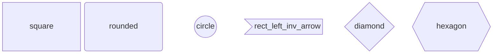

## Example 3

**SebastianJS (SVG):**

<svg id="graph" xmlns="http://www.w3.org/2000/svg" xmlns:xlink="http://www.w3.org/1999/xlink" style="max-width: 786px;" viewBox="0 -20 735 40" role="graphics-document document" aria-roledescription="block"><g/><marker id="graph_block-pointEnd" class="marker block" viewBox="0 0 10 10" refX="6" refY="5" markerUnits="userSpaceOnUse" markerWidth="12" markerHeight="12" orient="auto"><path d="M 0 0 L 10 5 L 0 10 z" class="arrowMarkerPath" style="stroke-width: 1; stroke-dasharray: 1,0;"/></marker><marker id="graph_block-pointStart" class="marker block" viewBox="0 0 10 10" refX="4.5" refY="5" markerUnits="userSpaceOnUse" markerWidth="12" markerHeight="12" orient="auto"><path d="M 0 5 L 10 10 L 10 0 z" class="arrowMarkerPath" style="stroke-width: 1; stroke-dasharray: 1,0;"/></marker><marker id="graph_block-circleEnd" class="marker block" viewBox="0 0 10 10" refX="11" refY="5" markerUnits="userSpaceOnUse" markerWidth="11" markerHeight="11" orient="auto"><circle cx="5" cy="5" r="5" class="arrowMarkerPath" style="stroke-width: 1; stroke-dasharray: 1,0;"/></marker><marker id="graph_block-circleStart" class="marker block" viewBox="0 0 10 10" refX="-1" refY="5" markerUnits="userSpaceOnUse" markerWidth="11" markerHeight="11" orient="auto"><circle cx="5" cy="5" r="5" class="arrowMarkerPath" style="stroke-width: 1; stroke-dasharray: 1,0;"/></marker><marker id="graph_block-crossEnd" class="marker cross block" viewBox="0 0 11 11" refX="12" refY="5.2" markerUnits="userSpaceOnUse" markerWidth="11" markerHeight="11" orient="auto"><path d="M 1,1 l 9,9 M 10,1 l -9,9" class="arrowMarkerPath" style="stroke-width: 2; stroke-dasharray: 1,0;"/></marker><marker id="graph_block-crossStart" class="marker cross block" viewBox="0 0 11 11" refX="-1" refY="5.2" markerUnits="userSpaceOnUse" markerWidth="11" markerHeight="11" orient="auto"><path d="M 1,1 l 9,9 M 10,1 l -9,9" class="arrowMarkerPath" style="stroke-width: 2; stroke-dasharray: 1,0;"/></marker><g class="block"><g class="node default default flowchart-label" id="A1" transform="translate(45, 0)"><rect style="" rx="16" ry="16" x="-41" y="-16" width="82" height="32"/><g class="label" style="" transform="translate(0, -12)"><rect/><text style=""><tspan xml:space="preserve" dy="1em" x="0" class="row">stadium</tspan></text></g></g><g class="node default default flowchart-label" id="A2" transform="translate(143, 0)"><polygon points="0,0 98,0 98,-32 0,-32 0,0 -8,0 106,0 106,-32 -8,-32 -8,0" class="label-container" transform="translate(-49,16)" style=""/><g class="label" style="" transform="translate(0, -12)"><rect/><text style=""><tspan xml:space="preserve" dy="1em" x="0" class="row">subroutine</tspan></text></g></g><g class="node default default flowchart-label" id="B1" label-offset-y="9.903381642512079" transform="translate(241, 0)"><path style="" d="M 0,9.903381642512079 a 41,9.903381642512079 0,0,0 82 0 a 41,9.903381642512079 0,0,0 -82 0 l 0,41.90338164251208 a 41,9.903381642512079 0,0,0 82 0 l 0,-41.90338164251208" transform="translate(-41,-30.855072463768117)"/><g class="label" style="" transform="translate(0, -12)"><rect/><text style=""><tspan xml:space="preserve" dy="1em" x="0" class="row">cylinder</tspan></text></g></g><g class="node default default flowchart-label" id="C1" transform="translate(339, 0)"><polygon points="-16,0 82,0 82,-32 -16,-32 0,-16" class="label-container" transform="translate(-41,16)" style=""/><g class="label" style="" transform="translate(0, -12)"><rect/><text style=""><tspan xml:space="preserve" dy="1em" x="0" class="row">surprise</tspan></text></g></g><g class="node default default flowchart-label" id="A3" transform="translate(437, 0)"><polygon points="-10.666666666666666,0 92.66666666666667,0 108.66666666666667,-32 5.333333333333333,-32" class="label-container" transform="translate(-49,16)" style=""/><g class="label" style="" transform="translate(0, -12)"><rect/><text style=""><tspan xml:space="preserve" dy="1em" x="0" class="row">lean right</tspan></text></g></g><g class="node default default flowchart-label" id="B2" transform="translate(535, 0)"><polygon points="10.666666666666666,0 95.33333333333333,0 79.33333333333333,-32 -5.333333333333333,-32" class="label-container" transform="translate(-45,16)" style=""/><g class="label" style="" transform="translate(0, -12)"><rect/><text style=""><tspan xml:space="preserve" dy="1em" x="0" class="row">lean left</tspan></text></g></g><g class="node default default flowchart-label" id="C2" transform="translate(633, 0)"><polygon points="-10.666666666666666,0 100.66666666666667,0 84.66666666666667,-32 5.333333333333333,-32" class="label-container" transform="translate(-45,16)" style=""/><g class="label" style="" transform="translate(0, -12)"><rect/><text style=""><tspan xml:space="preserve" dy="1em" x="0" class="row">trapezoid</tspan></text></g></g><g class="node default default flowchart-label" id="D2" transform="translate(731, 0)"><polygon points="5.333333333333333,0 84.66666666666667,0 100.66666666666667,-32 -10.666666666666666,-32" class="label-container" transform="translate(-45,16)" style=""/><g class="label" style="" transform="translate(0, -12)"><rect/><text style=""><tspan xml:space="preserve" dy="1em" x="0" class="row">trapezoid</tspan></text></g></g></g></svg>

**Mermaid Code (Browser Rendered):**

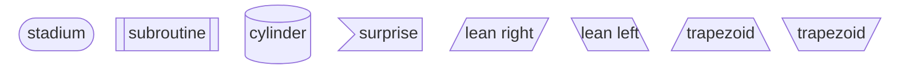

## Example 4

**SebastianJS (SVG):**

<svg id="graph" xmlns="http://www.w3.org/2000/svg" xmlns:xlink="http://www.w3.org/1999/xlink" style="max-width: 166px;" viewBox="-4 -96 164 48" role="graphics-document document" aria-roledescription="block"><g/><marker id="graph_block-pointEnd" class="marker block" viewBox="0 0 10 10" refX="6" refY="5" markerUnits="userSpaceOnUse" markerWidth="12" markerHeight="12" orient="auto"><path d="M 0 0 L 10 5 L 0 10 z" class="arrowMarkerPath" style="stroke-width: 1; stroke-dasharray: 1,0;"/></marker><marker id="graph_block-pointStart" class="marker block" viewBox="0 0 10 10" refX="4.5" refY="5" markerUnits="userSpaceOnUse" markerWidth="12" markerHeight="12" orient="auto"><path d="M 0 5 L 10 10 L 10 0 z" class="arrowMarkerPath" style="stroke-width: 1; stroke-dasharray: 1,0;"/></marker><marker id="graph_block-circleEnd" class="marker block" viewBox="0 0 10 10" refX="11" refY="5" markerUnits="userSpaceOnUse" markerWidth="11" markerHeight="11" orient="auto"><circle cx="5" cy="5" r="5" class="arrowMarkerPath" style="stroke-width: 1; stroke-dasharray: 1,0;"/></marker><marker id="graph_block-circleStart" class="marker block" viewBox="0 0 10 10" refX="-1" refY="5" markerUnits="userSpaceOnUse" markerWidth="11" markerHeight="11" orient="auto"><circle cx="5" cy="5" r="5" class="arrowMarkerPath" style="stroke-width: 1; stroke-dasharray: 1,0;"/></marker><marker id="graph_block-crossEnd" class="marker cross block" viewBox="0 0 11 11" refX="12" refY="5.2" markerUnits="userSpaceOnUse" markerWidth="11" markerHeight="11" orient="auto"><path d="M 1,1 l 9,9 M 10,1 l -9,9" class="arrowMarkerPath" style="stroke-width: 2; stroke-dasharray: 1,0;"/></marker><marker id="graph_block-crossStart" class="marker cross block" viewBox="0 0 11 11" refX="-1" refY="5.2" markerUnits="userSpaceOnUse" markerWidth="11" markerHeight="11" orient="auto"><path d="M 1,1 l 9,9 M 10,1 l -9,9" class="arrowMarkerPath" style="stroke-width: 2; stroke-dasharray: 1,0;"/></marker><g class="block"><g class="node default default flowchart-label" id="e" transform="translate(78, -72)"><rect class="basic cluster composite label-container" style="" rx="0" ry="0" x="-78" y="-20" width="156" height="40"/><g class="label" style="" transform="translate(0, -12)"><rect/><text style=""><tspan xml:space="preserve" dy="1em" x="0" class="row"/></text></g></g><g class="node default default flowchart-label" id="f" transform="translate(41, -72)"><rect class="basic label-container" style="" rx="0" ry="0" x="-33" y="-12" width="66" height="24"/><g class="label" style="" transform="translate(0, -12)"><rect/><text style=""><tspan xml:space="preserve" dy="1em" x="0" class="row">f</tspan></text></g></g><g class="node default default flowchart-label" id="g" transform="translate(115, -72)"><rect class="basic label-container" style="" rx="0" ry="0" x="-33" y="-12" width="66" height="24"/><g class="label" style="" transform="translate(0, -12)"><rect/><text style=""><tspan xml:space="preserve" dy="1em" x="0" class="row">g</tspan></text></g></g></g></svg>

**Mermaid Code (Browser Rendered):**

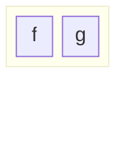

## Example 5

**SebastianJS (SVG):**

<svg id="graph" xmlns="http://www.w3.org/2000/svg" xmlns:xlink="http://www.w3.org/1999/xlink" style="max-width: 166px;" viewBox="-4 -160 164 80" role="graphics-document document" aria-roledescription="block"><g/><marker id="graph_block-pointEnd" class="marker block" viewBox="0 0 10 10" refX="6" refY="5" markerUnits="userSpaceOnUse" markerWidth="12" markerHeight="12" orient="auto"><path d="M 0 0 L 10 5 L 0 10 z" class="arrowMarkerPath" style="stroke-width: 1; stroke-dasharray: 1,0;"/></marker><marker id="graph_block-pointStart" class="marker block" viewBox="0 0 10 10" refX="4.5" refY="5" markerUnits="userSpaceOnUse" markerWidth="12" markerHeight="12" orient="auto"><path d="M 0 5 L 10 10 L 10 0 z" class="arrowMarkerPath" style="stroke-width: 1; stroke-dasharray: 1,0;"/></marker><marker id="graph_block-circleEnd" class="marker block" viewBox="0 0 10 10" refX="11" refY="5" markerUnits="userSpaceOnUse" markerWidth="11" markerHeight="11" orient="auto"><circle cx="5" cy="5" r="5" class="arrowMarkerPath" style="stroke-width: 1; stroke-dasharray: 1,0;"/></marker><marker id="graph_block-circleStart" class="marker block" viewBox="0 0 10 10" refX="-1" refY="5" markerUnits="userSpaceOnUse" markerWidth="11" markerHeight="11" orient="auto"><circle cx="5" cy="5" r="5" class="arrowMarkerPath" style="stroke-width: 1; stroke-dasharray: 1,0;"/></marker><marker id="graph_block-crossEnd" class="marker cross block" viewBox="0 0 11 11" refX="12" refY="5.2" markerUnits="userSpaceOnUse" markerWidth="11" markerHeight="11" orient="auto"><path d="M 1,1 l 9,9 M 10,1 l -9,9" class="arrowMarkerPath" style="stroke-width: 2; stroke-dasharray: 1,0;"/></marker><marker id="graph_block-crossStart" class="marker cross block" viewBox="0 0 11 11" refX="-1" refY="5.2" markerUnits="userSpaceOnUse" markerWidth="11" markerHeight="11" orient="auto"><path d="M 1,1 l 9,9 M 10,1 l -9,9" class="arrowMarkerPath" style="stroke-width: 2; stroke-dasharray: 1,0;"/></marker><g class="block"><g class="node default default flowchart-label" id="e" transform="translate(78, -120)"><rect class="basic cluster composite label-container" style="" rx="0" ry="0" x="-78" y="-36" width="156" height="72"/><g class="label" style="" transform="translate(0, -12)"><rect/><text style=""><tspan xml:space="preserve" dy="1em" x="0" class="row"/></text></g></g><g class="node default default flowchart-label" id="f" transform="translate(41, -136)"><rect class="basic label-container" style="" rx="0" ry="0" x="-33" y="-12" width="66" height="24"/><g class="label" style="" transform="translate(0, -12)"><rect/><text style=""><tspan xml:space="preserve" dy="1em" x="0" class="row">f</tspan></text></g></g><g class="node default default flowchart-label" id="g" transform="translate(115, -136)"><rect class="basic label-container" style="" rx="0" ry="0" x="-33" y="-12" width="66" height="24"/><g class="label" style="" transform="translate(0, -12)"><rect/><text style=""><tspan xml:space="preserve" dy="1em" x="0" class="row">g</tspan></text></g></g><g class="node default default flowchart-label" id="h" transform="translate(41, -104)"><rect class="basic label-container" style="" rx="0" ry="0" x="-33" y="-12" width="66" height="24"/><g class="label" style="" transform="translate(0, -12)"><rect/><text style=""><tspan xml:space="preserve" dy="1em" x="0" class="row">h</tspan></text></g></g></g></svg>

**Mermaid Code (Browser Rendered):**

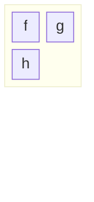

## Example 6

**SebastianJS (SVG):**

<svg id="graph" xmlns="http://www.w3.org/2000/svg" xmlns:xlink="http://www.w3.org/1999/xlink" style="max-width: 134px;" viewBox="-4 -72 132 144" role="graphics-document document" aria-roledescription="block"><g/><marker id="graph_block-pointEnd" class="marker block" viewBox="0 0 10 10" refX="6" refY="5" markerUnits="userSpaceOnUse" markerWidth="12" markerHeight="12" orient="auto"><path d="M 0 0 L 10 5 L 0 10 z" class="arrowMarkerPath" style="stroke-width: 1; stroke-dasharray: 1,0;"/></marker><marker id="graph_block-pointStart" class="marker block" viewBox="0 0 10 10" refX="4.5" refY="5" markerUnits="userSpaceOnUse" markerWidth="12" markerHeight="12" orient="auto"><path d="M 0 5 L 10 10 L 10 0 z" class="arrowMarkerPath" style="stroke-width: 1; stroke-dasharray: 1,0;"/></marker><marker id="graph_block-circleEnd" class="marker block" viewBox="0 0 10 10" refX="11" refY="5" markerUnits="userSpaceOnUse" markerWidth="11" markerHeight="11" orient="auto"><circle cx="5" cy="5" r="5" class="arrowMarkerPath" style="stroke-width: 1; stroke-dasharray: 1,0;"/></marker><marker id="graph_block-circleStart" class="marker block" viewBox="0 0 10 10" refX="-1" refY="5" markerUnits="userSpaceOnUse" markerWidth="11" markerHeight="11" orient="auto"><circle cx="5" cy="5" r="5" class="arrowMarkerPath" style="stroke-width: 1; stroke-dasharray: 1,0;"/></marker><marker id="graph_block-crossEnd" class="marker cross block" viewBox="0 0 11 11" refX="12" refY="5.2" markerUnits="userSpaceOnUse" markerWidth="11" markerHeight="11" orient="auto"><path d="M 1,1 l 9,9 M 10,1 l -9,9" class="arrowMarkerPath" style="stroke-width: 2; stroke-dasharray: 1,0;"/></marker><marker id="graph_block-crossStart" class="marker cross block" viewBox="0 0 11 11" refX="-1" refY="5.2" markerUnits="userSpaceOnUse" markerWidth="11" markerHeight="11" orient="auto"><path d="M 1,1 l 9,9 M 10,1 l -9,9" class="arrowMarkerPath" style="stroke-width: 2; stroke-dasharray: 1,0;"/></marker><g class="block"><g class="node default default flowchart-label" id="a" transform="translate(62, -48)"><rect class="basic label-container" style="" rx="0" ry="0" x="-62" y="-20" width="124" height="40"/><g class="label" style="" transform="translate(0, -12)"><rect/><text style=""><tspan xml:space="preserve" dy="1em" x="0" class="row">a</tspan></text></g></g><g class="node default default flowchart-label" id="e" transform="translate(62, 0)"><rect class="basic cluster composite label-container" style="" rx="0" ry="0" x="-62" y="-20" width="124" height="40"/><g class="label" style="" transform="translate(0, -12)"><rect/><text style=""><tspan xml:space="preserve" dy="1em" x="0" class="row"/></text></g></g><g class="node default default flowchart-label" id="f" transform="translate(33, 0)"><rect class="basic label-container" style="" rx="0" ry="0" x="-25" y="-12" width="50" height="24"/><g class="label" style="" transform="translate(0, -12)"><rect/><text style=""><tspan xml:space="preserve" dy="1em" x="0" class="row">f</tspan></text></g></g><g class="node default default flowchart-label" id="g" transform="translate(91, 0)"><rect class="basic label-container" style="" rx="0" ry="0" x="-25" y="-12" width="50" height="24"/><g class="label" style="" transform="translate(0, -12)"><rect/><text style=""><tspan xml:space="preserve" dy="1em" x="0" class="row">g</tspan></text></g></g><g class="node default default flowchart-label" id="h" transform="translate(18, 48)"><rect class="basic label-container" style="" rx="0" ry="0" x="-18" y="-20" width="36" height="40"/><g class="label" style="" transform="translate(0, -12)"><rect/><text style=""><tspan xml:space="preserve" dy="1em" x="0" class="row">h</tspan></text></g></g><g class="node default default flowchart-label" id="i" transform="translate(62, 48)"><rect class="basic label-container" style="" rx="0" ry="0" x="-18" y="-20" width="36" height="40"/><g class="label" style="" transform="translate(0, -12)"><rect/><text style=""><tspan xml:space="preserve" dy="1em" x="0" class="row">i</tspan></text></g></g><g class="node default default flowchart-label" id="j" transform="translate(106, 48)"><rect class="basic label-container" style="" rx="0" ry="0" x="-18" y="-20" width="36" height="40"/><g class="label" style="" transform="translate(0, -12)"><rect/><text style=""><tspan xml:space="preserve" dy="1em" x="0" class="row">j</tspan></text></g></g></g></svg>

**Mermaid Code (Browser Rendered):**

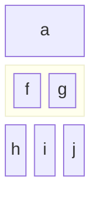

## Example 7

**SebastianJS (SVG):**

<svg id="graph" xmlns="http://www.w3.org/2000/svg" xmlns:xlink="http://www.w3.org/1999/xlink" style="max-width: 166px;" viewBox="-4 -120 164 240" role="graphics-document document" aria-roledescription="block"><g/><marker id="graph_block-pointEnd" class="marker block" viewBox="0 0 10 10" refX="6" refY="5" markerUnits="userSpaceOnUse" markerWidth="12" markerHeight="12" orient="auto"><path d="M 0 0 L 10 5 L 0 10 z" class="arrowMarkerPath" style="stroke-width: 1; stroke-dasharray: 1,0;"/></marker><marker id="graph_block-pointStart" class="marker block" viewBox="0 0 10 10" refX="4.5" refY="5" markerUnits="userSpaceOnUse" markerWidth="12" markerHeight="12" orient="auto"><path d="M 0 5 L 10 10 L 10 0 z" class="arrowMarkerPath" style="stroke-width: 1; stroke-dasharray: 1,0;"/></marker><marker id="graph_block-circleEnd" class="marker block" viewBox="0 0 10 10" refX="11" refY="5" markerUnits="userSpaceOnUse" markerWidth="11" markerHeight="11" orient="auto"><circle cx="5" cy="5" r="5" class="arrowMarkerPath" style="stroke-width: 1; stroke-dasharray: 1,0;"/></marker><marker id="graph_block-circleStart" class="marker block" viewBox="0 0 10 10" refX="-1" refY="5" markerUnits="userSpaceOnUse" markerWidth="11" markerHeight="11" orient="auto"><circle cx="5" cy="5" r="5" class="arrowMarkerPath" style="stroke-width: 1; stroke-dasharray: 1,0;"/></marker><marker id="graph_block-crossEnd" class="marker cross block" viewBox="0 0 11 11" refX="12" refY="5.2" markerUnits="userSpaceOnUse" markerWidth="11" markerHeight="11" orient="auto"><path d="M 1,1 l 9,9 M 10,1 l -9,9" class="arrowMarkerPath" style="stroke-width: 2; stroke-dasharray: 1,0;"/></marker><marker id="graph_block-crossStart" class="marker cross block" viewBox="0 0 11 11" refX="-1" refY="5.2" markerUnits="userSpaceOnUse" markerWidth="11" markerHeight="11" orient="auto"><path d="M 1,1 l 9,9 M 10,1 l -9,9" class="arrowMarkerPath" style="stroke-width: 2; stroke-dasharray: 1,0;"/></marker><g class="block"><g class="node default default flowchart-label" id="a" transform="translate(16.5, -80)"><rect class="basic label-container" style="" rx="0" ry="0" x="-16.5" y="-36" width="33" height="72"/><g class="label" style="" transform="translate(0, -12)"><rect/><text style=""><tspan xml:space="preserve" dy="1em" x="0" class="row">a</tspan></text></g></g><g class="node default default flowchart-label" id="b" transform="translate(57.5, -80)"><rect class="basic label-container" style="" rx="0" ry="0" x="-16.5" y="-36" width="33" height="72"/><g class="label" style="" transform="translate(0, -12)"><rect/><text style=""><tspan xml:space="preserve" dy="1em" x="0" class="row">b</tspan></text></g></g><g class="node default default flowchart-label" id="c" transform="translate(98.5, -80)"><rect class="basic label-container" style="" rx="0" ry="0" x="-16.5" y="-36" width="33" height="72"/><g class="label" style="" transform="translate(0, -12)"><rect/><text style=""><tspan xml:space="preserve" dy="1em" x="0" class="row">c</tspan></text></g></g><g class="node default default flowchart-label" id="d" transform="translate(139.5, -80)"><rect class="basic label-container" style="" rx="0" ry="0" x="-16.5" y="-36" width="33" height="72"/><g class="label" style="" transform="translate(0, -12)"><rect/><text style=""><tspan xml:space="preserve" dy="1em" x="0" class="row">d</tspan></text></g></g><g class="node default default flowchart-label" id="e" transform="translate(78, 0)"><rect class="basic cluster composite label-container" style="" rx="0" ry="0" x="-78" y="-36" width="156" height="72"/><g class="label" style="" transform="translate(0, -12)"><rect/><text style=""><tspan xml:space="preserve" dy="1em" x="0" class="row"/></text></g></g><g class="node default default flowchart-label" id="f" transform="translate(41, -16)"><rect class="basic label-container" style="" rx="0" ry="0" x="-33" y="-12" width="66" height="24"/><g class="label" style="" transform="translate(0, -12)"><rect/><text style=""><tspan xml:space="preserve" dy="1em" x="0" class="row">f</tspan></text></g></g><g class="node default default flowchart-label" id="g" transform="translate(115, -16)"><rect class="basic label-container" style="" rx="0" ry="0" x="-33" y="-12" width="66" height="24"/><g class="label" style="" transform="translate(0, -12)"><rect/><text style=""><tspan xml:space="preserve" dy="1em" x="0" class="row">g</tspan></text></g></g><g class="node default default flowchart-label" id="h" transform="translate(41, 16)"><rect class="basic label-container" style="" rx="0" ry="0" x="-33" y="-12" width="66" height="24"/><g class="label" style="" transform="translate(0, -12)"><rect/><text style=""><tspan xml:space="preserve" dy="1em" x="0" class="row">h</tspan></text></g></g><g class="node default default flowchart-label" id="i" transform="translate(78, 80)"><rect class="basic label-container" style="" rx="0" ry="0" x="-78" y="-36" width="156" height="72"/><g class="label" style="" transform="translate(0, -12)"><rect/><text style=""><tspan xml:space="preserve" dy="1em" x="0" class="row">i</tspan></text></g></g></g></svg>

**Mermaid Code (Browser Rendered):**

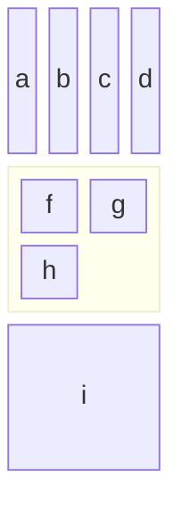

## Example 8

**SebastianJS (SVG):**

<svg id="graph" xmlns="http://www.w3.org/2000/svg" xmlns:xlink="http://www.w3.org/1999/xlink" class="flowchart" style="max-width: 27330px;" viewBox="-30 -11 212 62" role="graphics-document document" aria-roledescription="flowchart-v2"><g><marker id="graph_flowchart-v2-pointEnd" class="marker flowchart-v2" viewBox="0 0 10 10" refX="5" refY="5" markerUnits="userSpaceOnUse" markerWidth="8" markerHeight="8" orient="auto"><path d="M 0 0 L 10 5 L 0 10 z" class="arrowMarkerPath" style="stroke-width: 1; stroke-dasharray: 1,0;"/></marker><marker id="graph_flowchart-v2-pointStart" class="marker flowchart-v2" viewBox="0 0 10 10" refX="4.5" refY="5" markerUnits="userSpaceOnUse" markerWidth="8" markerHeight="8" orient="auto"><path d="M 0 5 L 10 10 L 10 0 z" class="arrowMarkerPath" style="stroke-width: 1; stroke-dasharray: 1,0;"/></marker><marker id="graph_flowchart-v2-circleEnd" class="marker flowchart-v2" viewBox="0 0 10 10" refX="11" refY="5" markerUnits="userSpaceOnUse" markerWidth="11" markerHeight="11" orient="auto"><circle cx="5" cy="5" r="5" class="arrowMarkerPath" style="stroke-width: 1; stroke-dasharray: 1,0;"/></marker><marker id="graph_flowchart-v2-circleStart" class="marker flowchart-v2" viewBox="0 0 10 10" refX="-1" refY="5" markerUnits="userSpaceOnUse" markerWidth="11" markerHeight="11" orient="auto"><circle cx="5" cy="5" r="5" class="arrowMarkerPath" style="stroke-width: 1; stroke-dasharray: 1,0;"/></marker><marker id="graph_flowchart-v2-crossEnd" class="marker cross flowchart-v2" viewBox="0 0 11 11" refX="12" refY="5.2" markerUnits="userSpaceOnUse" markerWidth="11" markerHeight="11" orient="auto"><path d="M 1,1 l 9,9 M 10,1 l -9,9" class="arrowMarkerPath" style="stroke-width: 2; stroke-dasharray: 1,0;"/></marker><marker id="graph_flowchart-v2-crossStart" class="marker cross flowchart-v2" viewBox="0 0 11 11" refX="-1" refY="5.2" markerUnits="userSpaceOnUse" markerWidth="11" markerHeight="11" orient="auto"><path d="M 1,1 l 9,9 M 10,1 l -9,9" class="arrowMarkerPath" style="stroke-width: 2; stroke-dasharray: 1,0;"/></marker><g class="root"><g class="clusters"/><g class="edgePaths"><path d="M18,20L27.667,20C37.333,20,56.667,20,75.333,20C94,20,112,20,121,20L130,20" id="L_X_z_0" class=" edge-thickness-normal edge-pattern-solid edge-thickness-normal edge-pattern-solid flowchart-link" style="" marker-end="url(#graph_flowchart-v2-pointEnd)"/></g><g class="edgeLabels"><g class="edgeLabel" transform="translate(76, 20)"><g class="label" transform="translate(-33, -12)"><g><rect class="background" style="" x="-2" y="-2" width="70" height="28"/><text y="-10.1" style=""><tspan class="text-outer-tspan" x="0" y="-0.1em" dy="1.1em"><tspan font-style="normal" class="text-inner-tspan" font-weight="normal">a</tspan><tspan font-style="normal" class="text-inner-tspan" font-weight="normal"> label</tspan></tspan></text></g></g></g></g><g class="nodes"><g class="node default  " id="flowchart-X-0" transform="translate(13, 20)"><rect class="basic label-container" style="" x="-39" y="-27" width="78" height="54"/><g class="label" style="" transform="translate(0, -12)"><rect/><g><rect class="background" style="stroke: none"/><text y="-10.1" style=""><tspan class="text-outer-tspan" x="0" y="-0.1em" dy="1.1em"><tspan font-style="normal" class="text-inner-tspan" font-weight="normal">X</tspan></tspan></text></g></g></g><g class="node default  " id="flowchart-z-1" transform="translate(139, 20)"><rect class="basic label-container" style="" x="-39" y="-27" width="78" height="54"/><g class="label" style="" transform="translate(0, -12)"><rect/><g><rect class="background" style="stroke: none"/><text y="-10.1" style=""><tspan class="text-outer-tspan" x="0" y="-0.1em" dy="1.1em"><tspan font-style="normal" class="text-inner-tspan" font-weight="normal">z</tspan></tspan></text></g></g></g></g></g></g></svg>

**Mermaid Code (Browser Rendered):**

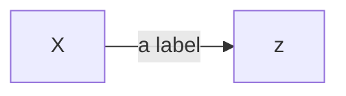

## Example 9

**SebastianJS (SVG):**

<svg id="graph" xmlns="http://www.w3.org/2000/svg" xmlns:xlink="http://www.w3.org/1999/xlink" style="max-width: 80px;" viewBox="-4 -16 78 32" role="graphics-document document" aria-roledescription="block"><g/><marker id="graph_block-pointEnd" class="marker block" viewBox="0 0 10 10" refX="6" refY="5" markerUnits="userSpaceOnUse" markerWidth="12" markerHeight="12" orient="auto"><path d="M 0 0 L 10 5 L 0 10 z" class="arrowMarkerPath" style="stroke-width: 1; stroke-dasharray: 1,0;"/></marker><marker id="graph_block-pointStart" class="marker block" viewBox="0 0 10 10" refX="4.5" refY="5" markerUnits="userSpaceOnUse" markerWidth="12" markerHeight="12" orient="auto"><path d="M 0 5 L 10 10 L 10 0 z" class="arrowMarkerPath" style="stroke-width: 1; stroke-dasharray: 1,0;"/></marker><marker id="graph_block-circleEnd" class="marker block" viewBox="0 0 10 10" refX="11" refY="5" markerUnits="userSpaceOnUse" markerWidth="11" markerHeight="11" orient="auto"><circle cx="5" cy="5" r="5" class="arrowMarkerPath" style="stroke-width: 1; stroke-dasharray: 1,0;"/></marker><marker id="graph_block-circleStart" class="marker block" viewBox="0 0 10 10" refX="-1" refY="5" markerUnits="userSpaceOnUse" markerWidth="11" markerHeight="11" orient="auto"><circle cx="5" cy="5" r="5" class="arrowMarkerPath" style="stroke-width: 1; stroke-dasharray: 1,0;"/></marker><marker id="graph_block-crossEnd" class="marker cross block" viewBox="0 0 11 11" refX="12" refY="5.2" markerUnits="userSpaceOnUse" markerWidth="11" markerHeight="11" orient="auto"><path d="M 1,1 l 9,9 M 10,1 l -9,9" class="arrowMarkerPath" style="stroke-width: 2; stroke-dasharray: 1,0;"/></marker><marker id="graph_block-crossStart" class="marker cross block" viewBox="0 0 11 11" refX="-1" refY="5.2" markerUnits="userSpaceOnUse" markerWidth="11" markerHeight="11" orient="auto"><path d="M 1,1 l 9,9 M 10,1 l -9,9" class="arrowMarkerPath" style="stroke-width: 2; stroke-dasharray: 1,0;"/></marker><g class="block"><g class="node default default flowchart-label" id="A" transform="translate(9, 0)"><rect class="basic label-container" style="" rx="0" ry="0" x="-9" y="-12" width="18" height="24"/><g class="label" style="" transform="translate(0, -12)"><rect/><text style=""><tspan xml:space="preserve" dy="1em" x="0" class="row">A</tspan></text></g></g><g class="node default default flowchart-label" id="B" transform="translate(61, 0)"><rect class="basic label-container" style="" rx="0" ry="0" x="-9" y="-12" width="18" height="24"/><g class="label" style="" transform="translate(0, -12)"><rect/><text style=""><tspan xml:space="preserve" dy="1em" x="0" class="row">B</tspan></text></g></g><path d="M14,0L17.5,0C21,0,28,0,35,0C42,0,49,0,52.5,0L56,0" id="1-A-B" class="  edge-thickness-normal edge-pattern-solid flowchart-link LS-a1 LE-b1" marker-end="url(#graph_block-crossEnd)"/></g></svg>

**Mermaid Code (Browser Rendered):**

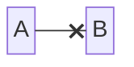

## Example 10

**SebastianJS (SVG):**

<svg id="graph" xmlns="http://www.w3.org/2000/svg" xmlns:xlink="http://www.w3.org/1999/xlink" style="max-width: 296px;" viewBox="-4 -32 294 64" role="graphics-document document" aria-roledescription="block"><g/><marker id="graph_block-pointEnd" class="marker block" viewBox="0 0 10 10" refX="6" refY="5" markerUnits="userSpaceOnUse" markerWidth="12" markerHeight="12" orient="auto"><path d="M 0 0 L 10 5 L 0 10 z" class="arrowMarkerPath" style="stroke-width: 1; stroke-dasharray: 1,0;"/></marker><marker id="graph_block-pointStart" class="marker block" viewBox="0 0 10 10" refX="4.5" refY="5" markerUnits="userSpaceOnUse" markerWidth="12" markerHeight="12" orient="auto"><path d="M 0 5 L 10 10 L 10 0 z" class="arrowMarkerPath" style="stroke-width: 1; stroke-dasharray: 1,0;"/></marker><marker id="graph_block-circleEnd" class="marker block" viewBox="0 0 10 10" refX="11" refY="5" markerUnits="userSpaceOnUse" markerWidth="11" markerHeight="11" orient="auto"><circle cx="5" cy="5" r="5" class="arrowMarkerPath" style="stroke-width: 1; stroke-dasharray: 1,0;"/></marker><marker id="graph_block-circleStart" class="marker block" viewBox="0 0 10 10" refX="-1" refY="5" markerUnits="userSpaceOnUse" markerWidth="11" markerHeight="11" orient="auto"><circle cx="5" cy="5" r="5" class="arrowMarkerPath" style="stroke-width: 1; stroke-dasharray: 1,0;"/></marker><marker id="graph_block-crossEnd" class="marker cross block" viewBox="0 0 11 11" refX="12" refY="5.2" markerUnits="userSpaceOnUse" markerWidth="11" markerHeight="11" orient="auto"><path d="M 1,1 l 9,9 M 10,1 l -9,9" class="arrowMarkerPath" style="stroke-width: 2; stroke-dasharray: 1,0;"/></marker><marker id="graph_block-crossStart" class="marker cross block" viewBox="0 0 11 11" refX="-1" refY="5.2" markerUnits="userSpaceOnUse" markerWidth="11" markerHeight="11" orient="auto"><path d="M 1,1 l 9,9 M 10,1 l -9,9" class="arrowMarkerPath" style="stroke-width: 2; stroke-dasharray: 1,0;"/></marker><g class="block"><g class="node default default flowchart-label" id="a" transform="translate(45, -16)"><rect class="basic label-container" style="" rx="0" ry="0" x="-45" y="-12" width="90" height="24"/><g class="label" style="" transform="translate(0, -12)"><rect/><text style=""><tspan xml:space="preserve" dy="1em" x="0" class="row">A wide one</tspan></text></g></g><g class="node default default flowchart-label" id="b" transform="translate(192, -16)"><rect class="basic label-container" style="" rx="0" ry="0" x="-94" y="-12" width="188" height="24"/><g class="label" style="" transform="translate(0, -12)"><rect/><text style=""><tspan xml:space="preserve" dy="1em" x="0" class="row">b</tspan></text></g></g><g class="node default default flowchart-label" id="c" transform="translate(94, 16)"><rect class="basic label-container" style="" rx="0" ry="0" x="-94" y="-12" width="188" height="24"/><g class="label" style="" transform="translate(0, -12)"><rect/><text style=""><tspan xml:space="preserve" dy="1em" x="0" class="row">c</tspan></text></g></g><g class="node default default flowchart-label" id="d" transform="translate(241, 16)"><rect class="basic label-container" style="" rx="0" ry="0" x="-45" y="-12" width="90" height="24"/><g class="label" style="" transform="translate(0, -12)"><rect/><text style=""><tspan xml:space="preserve" dy="1em" x="0" class="row">d</tspan></text></g></g></g></svg>

**Mermaid Code (Browser Rendered):**

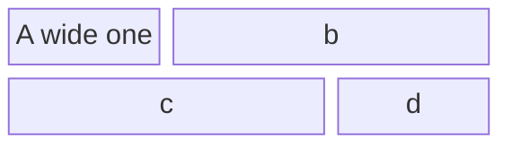

## Example 11

**SebastianJS (SVG):**

<svg id="graph" xmlns="http://www.w3.org/2000/svg" xmlns:xlink="http://www.w3.org/1999/xlink" style="max-width: 80px;" viewBox="-4 -48 78 96" role="graphics-document document" aria-roledescription="block"><g/><marker id="graph_block-pointEnd" class="marker block" viewBox="0 0 10 10" refX="6" refY="5" markerUnits="userSpaceOnUse" markerWidth="12" markerHeight="12" orient="auto"><path d="M 0 0 L 10 5 L 0 10 z" class="arrowMarkerPath" style="stroke-width: 1; stroke-dasharray: 1,0;"/></marker><marker id="graph_block-pointStart" class="marker block" viewBox="0 0 10 10" refX="4.5" refY="5" markerUnits="userSpaceOnUse" markerWidth="12" markerHeight="12" orient="auto"><path d="M 0 5 L 10 10 L 10 0 z" class="arrowMarkerPath" style="stroke-width: 1; stroke-dasharray: 1,0;"/></marker><marker id="graph_block-circleEnd" class="marker block" viewBox="0 0 10 10" refX="11" refY="5" markerUnits="userSpaceOnUse" markerWidth="11" markerHeight="11" orient="auto"><circle cx="5" cy="5" r="5" class="arrowMarkerPath" style="stroke-width: 1; stroke-dasharray: 1,0;"/></marker><marker id="graph_block-circleStart" class="marker block" viewBox="0 0 10 10" refX="-1" refY="5" markerUnits="userSpaceOnUse" markerWidth="11" markerHeight="11" orient="auto"><circle cx="5" cy="5" r="5" class="arrowMarkerPath" style="stroke-width: 1; stroke-dasharray: 1,0;"/></marker><marker id="graph_block-crossEnd" class="marker cross block" viewBox="0 0 11 11" refX="12" refY="5.2" markerUnits="userSpaceOnUse" markerWidth="11" markerHeight="11" orient="auto"><path d="M 1,1 l 9,9 M 10,1 l -9,9" class="arrowMarkerPath" style="stroke-width: 2; stroke-dasharray: 1,0;"/></marker><marker id="graph_block-crossStart" class="marker cross block" viewBox="0 0 11 11" refX="-1" refY="5.2" markerUnits="userSpaceOnUse" markerWidth="11" markerHeight="11" orient="auto"><path d="M 1,1 l 9,9 M 10,1 l -9,9" class="arrowMarkerPath" style="stroke-width: 2; stroke-dasharray: 1,0;"/></marker><g class="block"><g class="node default default flowchart-label" id="a" transform="translate(9, -32)"><rect class="basic label-container" style="" rx="0" ry="0" x="-9" y="-12" width="18" height="24"/><g class="label" style="" transform="translate(0, -12)"><rect/><text style=""><tspan xml:space="preserve" dy="1em" x="0" class="row">a</tspan></text></g></g><g class="node default default flowchart-label" id="b" transform="translate(35, -32)"><rect class="basic label-container" style="" rx="0" ry="0" x="-9" y="-12" width="18" height="24"/><g class="label" style="" transform="translate(0, -12)"><rect/><text style=""><tspan xml:space="preserve" dy="1em" x="0" class="row">b</tspan></text></g></g><g class="node default default flowchart-label" id="c" transform="translate(61, -32)"><rect class="basic label-container" style="" rx="0" ry="0" x="-9" y="-12" width="18" height="24"/><g class="label" style="" transform="translate(0, -12)"><rect/><text style=""><tspan xml:space="preserve" dy="1em" x="0" class="row">c</tspan></text></g></g><g class="node default default flowchart-label" id="e" transform="translate(35, 0)"><rect class="basic label-container" style="" rx="0" ry="0" x="-35" y="-12" width="70" height="24"/><g class="label" style="" transform="translate(0, -12)"><rect/><text style=""><tspan xml:space="preserve" dy="1em" x="0" class="row">e</tspan></text></g></g><g class="node default default flowchart-label" id="f" transform="translate(9, 32)"><rect class="basic label-container" style="" rx="0" ry="0" x="-9" y="-12" width="18" height="24"/><g class="label" style="" transform="translate(0, -12)"><rect/><text style=""><tspan xml:space="preserve" dy="1em" x="0" class="row">f</tspan></text></g></g><g class="node default default flowchart-label" id="g" transform="translate(35, 32)"><rect class="basic label-container" style="" rx="0" ry="0" x="-9" y="-12" width="18" height="24"/><g class="label" style="" transform="translate(0, -12)"><rect/><text style=""><tspan xml:space="preserve" dy="1em" x="0" class="row">g</tspan></text></g></g><g class="node default default flowchart-label" id="h" transform="translate(61, 32)"><rect class="basic label-container" style="" rx="0" ry="0" x="-9" y="-12" width="18" height="24"/><g class="label" style="" transform="translate(0, -12)"><rect/><text style=""><tspan xml:space="preserve" dy="1em" x="0" class="row">h</tspan></text></g></g></g></svg>

**Mermaid Code (Browser Rendered):**

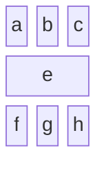

## Example 12

**SebastianJS (SVG):**

<svg id="graph" xmlns="http://www.w3.org/2000/svg" xmlns:xlink="http://www.w3.org/1999/xlink" style="max-width: 172px;" viewBox="-4 -32 170 32" role="graphics-document document" aria-roledescription="block"><g/><marker id="graph_block-pointEnd" class="marker block" viewBox="0 0 10 10" refX="6" refY="5" markerUnits="userSpaceOnUse" markerWidth="12" markerHeight="12" orient="auto"><path d="M 0 0 L 10 5 L 0 10 z" class="arrowMarkerPath" style="stroke-width: 1; stroke-dasharray: 1,0;"/></marker><marker id="graph_block-pointStart" class="marker block" viewBox="0 0 10 10" refX="4.5" refY="5" markerUnits="userSpaceOnUse" markerWidth="12" markerHeight="12" orient="auto"><path d="M 0 5 L 10 10 L 10 0 z" class="arrowMarkerPath" style="stroke-width: 1; stroke-dasharray: 1,0;"/></marker><marker id="graph_block-circleEnd" class="marker block" viewBox="0 0 10 10" refX="11" refY="5" markerUnits="userSpaceOnUse" markerWidth="11" markerHeight="11" orient="auto"><circle cx="5" cy="5" r="5" class="arrowMarkerPath" style="stroke-width: 1; stroke-dasharray: 1,0;"/></marker><marker id="graph_block-circleStart" class="marker block" viewBox="0 0 10 10" refX="-1" refY="5" markerUnits="userSpaceOnUse" markerWidth="11" markerHeight="11" orient="auto"><circle cx="5" cy="5" r="5" class="arrowMarkerPath" style="stroke-width: 1; stroke-dasharray: 1,0;"/></marker><marker id="graph_block-crossEnd" class="marker cross block" viewBox="0 0 11 11" refX="12" refY="5.2" markerUnits="userSpaceOnUse" markerWidth="11" markerHeight="11" orient="auto"><path d="M 1,1 l 9,9 M 10,1 l -9,9" class="arrowMarkerPath" style="stroke-width: 2; stroke-dasharray: 1,0;"/></marker><marker id="graph_block-crossStart" class="marker cross block" viewBox="0 0 11 11" refX="-1" refY="5.2" markerUnits="userSpaceOnUse" markerWidth="11" markerHeight="11" orient="auto"><path d="M 1,1 l 9,9 M 10,1 l -9,9" class="arrowMarkerPath" style="stroke-width: 2; stroke-dasharray: 1,0;"/></marker><g class="block"><g class="node default default flowchart-label" id="A1" transform="translate(47, -16)"><rect class="basic label-container" style="" rx="0" ry="0" x="-47" y="-12" width="94" height="24"/><g class="label" style="" transform="translate(0, -12)"><rect/><text style=""><tspan xml:space="preserve" dy="1em" x="0" class="row">A1</tspan></text></g></g><g class="node default default flowchart-label" id="A2" transform="translate(115, -16)"><rect class="basic label-container" style="" rx="0" ry="0" x="-13" y="-12" width="26" height="24"/><g class="label" style="" transform="translate(0, -12)"><rect/><text style=""><tspan xml:space="preserve" dy="1em" x="0" class="row">A2</tspan></text></g></g><g class="node default default flowchart-label" id="A3" transform="translate(149, -16)"><rect class="basic label-container" style="" rx="0" ry="0" x="-13" y="-12" width="26" height="24"/><g class="label" style="" transform="translate(0, -12)"><rect/><text style=""><tspan xml:space="preserve" dy="1em" x="0" class="row">A3</tspan></text></g></g></g></svg>

**Mermaid Code (Browser Rendered):**

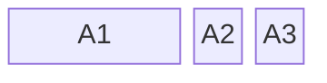

