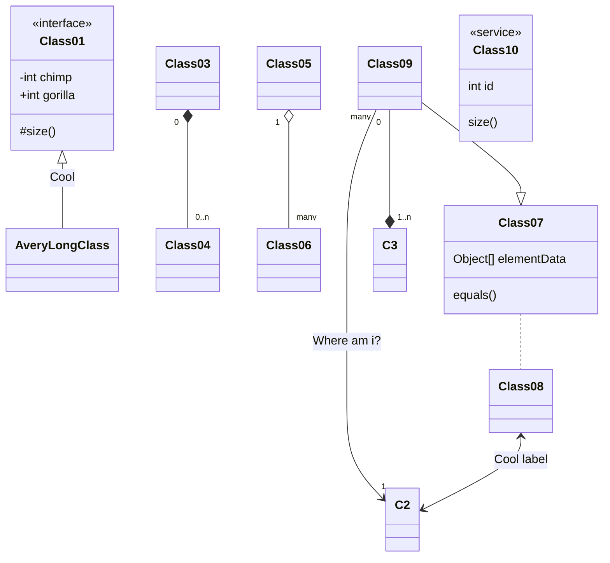
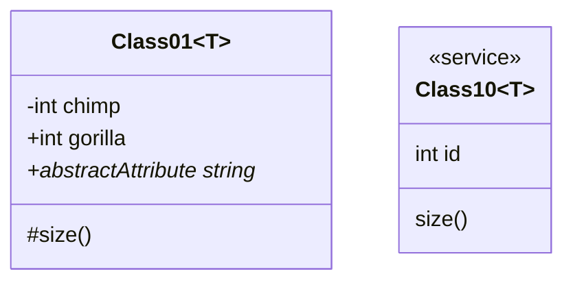
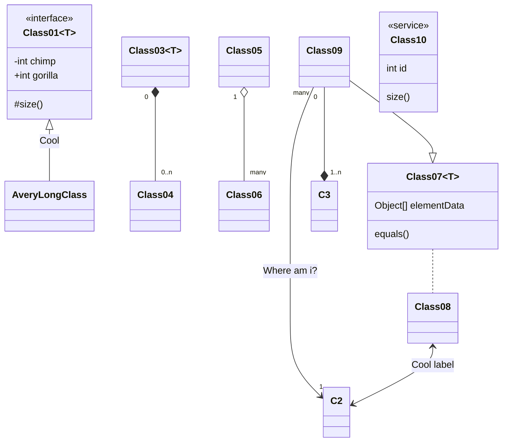
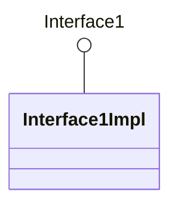
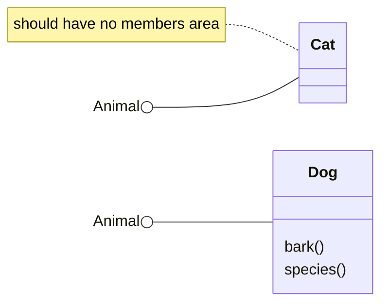
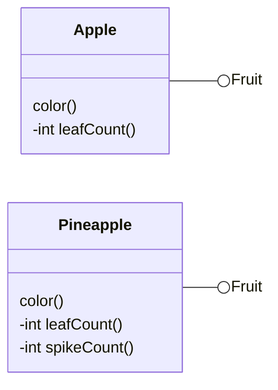
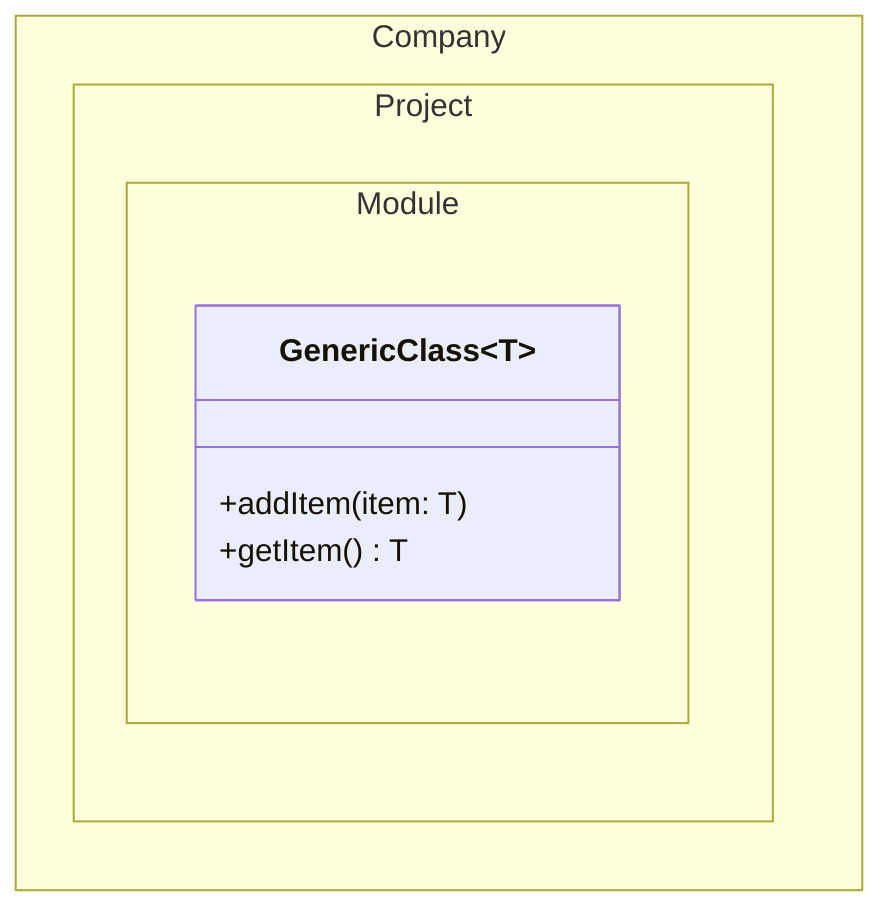
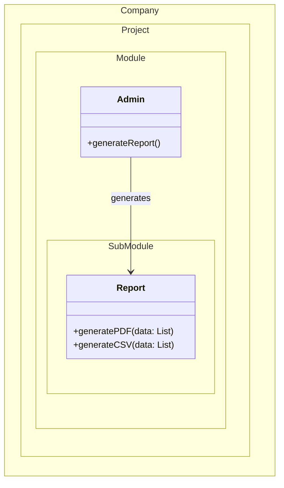
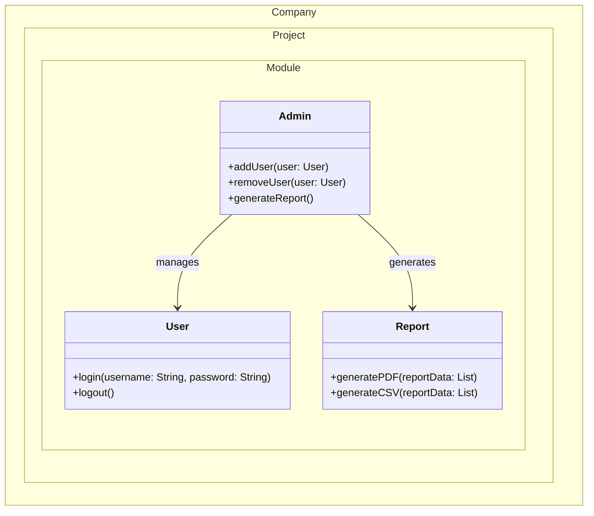
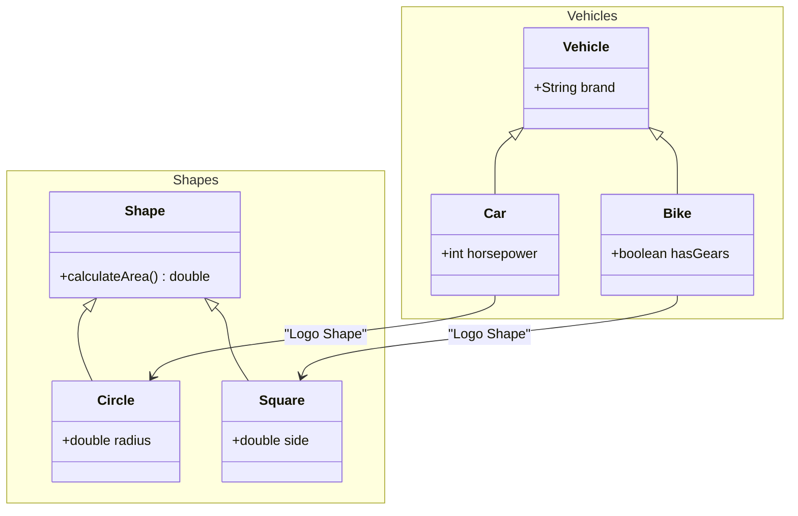

# classchart

## Example 1

**SebastianJS (SVG):**

> Render failed: Error: Diagrams beginning with --- are not valid. If you were trying to use a YAML front-matter, please ensure that you've correctly opened and closed the YAML front-matter with un-indented `---` blocks

**Mermaid Code (Browser Rendered):**

```mermaid
---
    title: Demo Class Diagram
    ---
    classDiagram
      accTitle: Demo Class Diagram
      accDescr: This class diagram show the abstract Animal class, and 3 classes that inherit from it: Duck, Fish, and Zebra.

      Animal <|-- Duck
      Animal <|-- Fish
      Animal <|-- Zebra
      Animal : +int age
      Animal : +String gender
      Animal: +isMammal()
      Animal: +mate()

      class Duck{
        +String beakColor
        +swim()
        +quack()
      }
      class Fish{
        -Listint sizeInFeet
        -canEat()
      }
      class Zebra{
        +bool is_wild
        +run(List~T~, List~OT~)
        %% +run-composite(List~T, K~)
        +run-nested(List~List~OT~~)
      }
```

## Example 2

**SebastianJS (SVG):**

<svg id="graph" xmlns="http://www.w3.org/2000/svg" xmlns:xlink="http://www.w3.org/1999/xlink" class="classDiagram" style="max-width: 29778px;" viewBox="-168 -18 508 302" role="graphics-document document" aria-roledescription="class"><style>#graph{font-family:"trebuchet ms",verdana,arial,sans-serif;font-size:16px;fill:#333;}@keyframes edge-animation-frame{from{stroke-dashoffset:0;}}@keyframes dash{to{stroke-dashoffset:0;}}#graph .edge-animation-slow{stroke-dasharray:9,5!important;stroke-dashoffset:900;animation:dash 50s linear infinite;stroke-linecap:round;}#graph .edge-animation-fast{stroke-dasharray:9,5!important;stroke-dashoffset:900;animation:dash 20s linear infinite;stroke-linecap:round;}#graph .error-icon{fill:#552222;}#graph .error-text{fill:#552222;stroke:#552222;}#graph .edge-thickness-normal{stroke-width:1px;}#graph .edge-thickness-thick{stroke-width:3.5px;}#graph .edge-pattern-solid{stroke-dasharray:0;}#graph .edge-thickness-invisible{stroke-width:0;fill:none;}#graph .edge-pattern-dashed{stroke-dasharray:3;}#graph .edge-pattern-dotted{stroke-dasharray:2;}#graph .marker{fill:#333333;stroke:#333333;}#graph .marker.cross{stroke:#333333;}#graph svg{font-family:"trebuchet ms",verdana,arial,sans-serif;font-size:16px;}#graph p{margin:0;}#graph g.classGroup text{fill:#9370DB;stroke:none;font-family:"trebuchet ms",verdana,arial,sans-serif;font-size:10px;}#graph g.classGroup text .title{font-weight:bolder;}#graph .nodeLabel,#graph .edgeLabel{color:#131300;}#graph .edgeLabel .label rect{fill:#ECECFF;}#graph .label text{fill:#131300;}#graph .labelBkg{background:#ECECFF;}#graph .edgeLabel .label span{background:#ECECFF;}#graph .classTitle{font-weight:bolder;}#graph .node rect,#graph .node circle,#graph .node ellipse,#graph .node polygon,#graph .node path{fill:#ECECFF;stroke:#9370DB;stroke-width:1px;}#graph .divider{stroke:#9370DB;stroke-width:1;}#graph g.clickable{cursor:pointer;}#graph g.classGroup rect{fill:#ECECFF;stroke:#9370DB;}#graph g.classGroup line{stroke:#9370DB;stroke-width:1;}#graph .classLabel .box{stroke:none;stroke-width:0;fill:#ECECFF;opacity:0.5;}#graph .classLabel .label{fill:#9370DB;font-size:10px;}#graph .relation{stroke:#333333;stroke-width:1;fill:none;}#graph .dashed-line{stroke-dasharray:3;}#graph .dotted-line{stroke-dasharray:1 2;}#graph #compositionStart,#graph .composition{fill:#333333!important;stroke:#333333!important;stroke-width:1;}#graph #compositionEnd,#graph .composition{fill:#333333!important;stroke:#333333!important;stroke-width:1;}#graph #dependencyStart,#graph .dependency{fill:#333333!important;stroke:#333333!important;stroke-width:1;}#graph #dependencyStart,#graph .dependency{fill:#333333!important;stroke:#333333!important;stroke-width:1;}#graph #extensionStart,#graph .extension{fill:transparent!important;stroke:#333333!important;stroke-width:1;}#graph #extensionEnd,#graph .extension{fill:transparent!important;stroke:#333333!important;stroke-width:1;}#graph #aggregationStart,#graph .aggregation{fill:transparent!important;stroke:#333333!important;stroke-width:1;}#graph #aggregationEnd,#graph .aggregation{fill:transparent!important;stroke:#333333!important;stroke-width:1;}#graph #lollipopStart,#graph .lollipop{fill:#ECECFF!important;stroke:#333333!important;stroke-width:1;}#graph #lollipopEnd,#graph .lollipop{fill:#ECECFF!important;stroke:#333333!important;stroke-width:1;}#graph .edgeTerminals{font-size:11px;line-height:initial;}#graph .classTitleText{text-anchor:middle;font-size:18px;fill:#333;}#graph .label-icon{display:inline-block;height:1em;overflow:visible;vertical-align:-0.125em;}#graph .node .label-icon path{fill:currentColor;stroke:revert;stroke-width:revert;}#graph :root{--mermaid-font-family:"trebuchet ms",verdana,arial,sans-serif;}</style><g><defs><marker id="graph_class-aggregationStart" class="marker aggregation class" refX="18" refY="7" markerWidth="190" markerHeight="240" orient="auto"><path d="M 18,7 L9,13 L1,7 L9,1 Z"/></marker></defs><defs><marker id="graph_class-aggregationEnd" class="marker aggregation class" refX="1" refY="7" markerWidth="20" markerHeight="28" orient="auto"><path d="M 18,7 L9,13 L1,7 L9,1 Z"/></marker></defs><defs><marker id="graph_class-extensionStart" class="marker extension class" refX="18" refY="7" markerWidth="190" markerHeight="240" orient="auto"><path d="M 1,7 L18,13 V 1 Z"/></marker></defs><defs><marker id="graph_class-extensionEnd" class="marker extension class" refX="1" refY="7" markerWidth="20" markerHeight="28" orient="auto"><path d="M 1,1 V 13 L18,7 Z"/></marker></defs><defs><marker id="graph_class-compositionStart" class="marker composition class" refX="18" refY="7" markerWidth="190" markerHeight="240" orient="auto"><path d="M 18,7 L9,13 L1,7 L9,1 Z"/></marker></defs><defs><marker id="graph_class-compositionEnd" class="marker composition class" refX="1" refY="7" markerWidth="20" markerHeight="28" orient="auto"><path d="M 18,7 L9,13 L1,7 L9,1 Z"/></marker></defs><defs><marker id="graph_class-dependencyStart" class="marker dependency class" refX="6" refY="7" markerWidth="190" markerHeight="240" orient="auto"><path d="M 5,7 L9,13 L1,7 L9,1 Z"/></marker></defs><defs><marker id="graph_class-dependencyEnd" class="marker dependency class" refX="13" refY="7" markerWidth="20" markerHeight="28" orient="auto"><path d="M 18,7 L9,13 L14,7 L9,1 Z"/></marker></defs><defs><marker id="graph_class-lollipopStart" class="marker lollipop class" refX="13" refY="7" markerWidth="190" markerHeight="240" orient="auto"><circle stroke="black" fill="transparent" cx="7" cy="7" r="6"/></marker></defs><defs><marker id="graph_class-lollipopEnd" class="marker lollipop class" refX="1" refY="7" markerWidth="190" markerHeight="240" orient="auto"><circle stroke="black" fill="transparent" cx="7" cy="7" r="6"/></marker></defs><g class="root"><g class="clusters"/><g class="edgePaths"><path d="M29,50L29,53.167C29,56.333,29,62.667,29,72C29,81.333,29,93.667,29,99.833L29,106" id="id_Class01_AveryLongClass_1" class=" edge-thickness-normal edge-pattern-solid relation" style="" marker-start="url(#graph_class-extensionStart)"/><path d="M89,50L89,53.167C89,56.333,89,62.667,89,72C89,81.333,89,93.667,89,99.833L89,106" id="id_Class03_Class04_2" class=" edge-thickness-normal edge-pattern-solid relation" style="" marker-start="url(#graph_class-compositionStart)"/><path d="M149,50L149,53.167C149,56.333,149,62.667,149,72C149,81.333,149,93.667,149,99.833L149,106" id="id_Class05_Class06_3" class=" edge-thickness-normal edge-pattern-solid relation" style="" marker-start="url(#graph_class-aggregationStart)"/><path d="M289,130L289,136.167C289,142.333,289,154.667,289,167C289,179.333,289,191.667,289,197.833L289,204" id="id_Class07_Class08_4" class=" edge-thickness-normal edge-pattern-dashed relation" style=""/><path d="M224,26.125L218.167,33.271C212.333,40.417,200.667,54.708,194.833,70.021C189,85.333,189,101.667,189,118C189,134.333,189,150.667,189,167C189,183.333,189,199.667,189,216C189,232.333,189,248.667,192.645,262.786C196.289,276.905,203.578,288.811,207.223,294.764L210.867,300.716" id="id_Class09_C2_5" class=" edge-thickness-normal edge-pattern-solid relation" style="" marker-end="url(#graph_class-dependencyEnd)"/><path d="M229,32L229,38.167C229,44.333,229,56.667,229,66C229,75.333,229,81.667,229,84.833L229,88" id="id_Class09_C3_6" class=" edge-thickness-normal edge-pattern-solid relation" style="" marker-end="url(#graph_class-compositionEnd)"/><path d="M234,24.083L243.167,31.569C252.333,39.056,270.667,54.028,279.833,64.681C289,75.333,289,81.667,289,84.833L289,88" id="id_Class09_Class07_7" class=" edge-thickness-normal edge-pattern-solid relation" style="" marker-end="url(#graph_class-extensionEnd)"/><path d="M289,234L289,239.167C289,244.333,289,254.667,278.986,266.843C268.972,279.02,248.944,293.039,238.929,300.049L228.915,307.059" id="id_Class08_C2_8" class=" edge-thickness-normal edge-pattern-solid relation" style="" marker-start="url(#graph_class-dependencyStart)" marker-end="url(#graph_class-dependencyEnd)"/></g><g class="edgeLabels"><g><rect class="background" style="stroke: none"/></g><g><rect class="background" style="stroke: none"/></g><g><rect class="background" style="stroke: none"/></g><g><rect class="background" style="stroke: none"/></g><g><rect class="background" style="stroke: none"/></g><g class="edgeLabel" transform="translate(29, 69)"><g class="label" transform="translate(-21, -12)"><g><rect class="background" style=";display: inline-block" x="-2" y="-2" width="46" height="28"/><text y="-10.1" style=";display: inline-block"><tspan class="text-outer-tspan" x="0" y="-0.1em" dy="1.1em"><tspan font-style="normal" class="text-inner-tspan" font-weight="normal">Cool</tspan></tspan></text></g></g></g><g class="edgeLabel"><g class="label" transform="translate(-5, -12)"><text y="-10.1"><tspan class="text-outer-tspan" x="0" y="-0.1em" dy="1.1em"/></text></g></g><g class="edgeLabel"><g class="label" transform="translate(-5, -12)"><text y="-10.1"><tspan class="text-outer-tspan" x="0" y="-0.1em" dy="1.1em"/></text></g></g><g class="edgeLabel"><g class="label" transform="translate(-5, -12)"><text y="-10.1"><tspan class="text-outer-tspan" x="0" y="-0.1em" dy="1.1em"/></text></g></g><g class="edgeLabel" transform="translate(189, 167)"><g class="label" transform="translate(-49, -12)"><g><rect class="background" style=";display: inline-block" x="-2" y="-2" width="102" height="28"/><text y="-10.1" style=";display: inline-block"><tspan class="text-outer-tspan" x="0" y="-0.1em" dy="1.1em"><tspan font-style="normal" class="text-inner-tspan" font-weight="normal">Where</tspan><tspan font-style="normal" class="text-inner-tspan" font-weight="normal"> am</tspan><tspan font-style="normal" class="text-inner-tspan" font-weight="normal"> i?</tspan></tspan></text></g></g></g><g class="edgeLabel"><g class="label" transform="translate(-5, -12)"><text y="-10.1"><tspan class="text-outer-tspan" x="0" y="-0.1em" dy="1.1em"/></text></g></g><g class="edgeLabel"><g class="label" transform="translate(-5, -12)"><text y="-10.1"><tspan class="text-outer-tspan" x="0" y="-0.1em" dy="1.1em"/></text></g></g><g class="edgeLabel" transform="translate(289, 265)"><g class="label" transform="translate(-45, -12)"><g><rect class="background" style=";display: inline-block" x="-2" y="-2" width="94" height="28"/><text y="-10.1" style=";display: inline-block"><tspan class="text-outer-tspan" x="0" y="-0.1em" dy="1.1em"><tspan font-style="normal" class="text-inner-tspan" font-weight="normal">Cool</tspan><tspan font-style="normal" class="text-inner-tspan" font-weight="normal"> label</tspan></tspan></text></g></g></g><g class="edgeTerminals" transform="translate(74, 49.5)"><g class="inner" transform="translate(-9, -12)"><text style=";display: inline-block"><tspan xml:space="preserve" dy="1em" x="0" class="row">0</tspan></text></g></g><g class="edgeTerminals" transform="translate(134, 49.5)"><g class="inner" transform="translate(-9, -12)"><text style=";display: inline-block"><tspan xml:space="preserve" dy="1em" x="0" class="row">1</tspan></text></g></g><g class="edgeTerminals" transform="translate(201.31349294048374, 30.195921496604818)"><g class="inner" transform="translate(-21, -12)"><text style=";display: inline-block"><tspan xml:space="preserve" dy="1em" x="0" class="row">many</tspan></text></g></g><g class="edgeTerminals" transform="translate(214, 49.5)"><g class="inner" transform="translate(-9, -12)"><text style=";display: inline-block"><tspan xml:space="preserve" dy="1em" x="0" class="row">0</tspan></text></g></g><g class="edgeTerminals" transform="translate(99, 83.5)"><g class="inner" transform="translate(-21, -12)"/><text style=";display: inline-block"><tspan xml:space="preserve" dy="1em" x="0" class="row">0..n</tspan></text></g><g class="edgeTerminals" transform="translate(159, 83.5)"><g class="inner" transform="translate(-21, -12)"/><text style=";display: inline-block"><tspan xml:space="preserve" dy="1em" x="0" class="row">many</tspan></text></g><g class="edgeTerminals" transform="translate(212.6550733537175, 278.0761267999592)"><g class="inner" transform="translate(-9, -12)"/><text style=";display: inline-block"><tspan xml:space="preserve" dy="1em" x="0" class="row">1</tspan></text></g><g class="edgeTerminals" transform="translate(239, 83.5)"><g class="inner" transform="translate(-21, -12)"/><text style=";display: inline-block"><tspan xml:space="preserve" dy="1em" x="0" class="row">1..n</tspan></text></g></g><g class="nodes"><g class="node default " id="classId-Class01-0" transform="translate(29, 20)"><g class="basic label-container"><path d="M-205 -24 L205 -24 L205 24 L-205 24" stroke="none" stroke-width="0" fill="#ECECFF" style=""/><path d="M-205 -24 C-62.53437705696331 -24, 79.93124588607338 -24, 205 -24 M-205 -24 C-53.444893656620394 -24, 98.11021268675921 -24, 205 -24 M205 -24 C205 -13.116221879709284, 205 -2.232443759418569, 205 24 M205 -24 C205 -7.854977604969644, 205 8.290044790060712, 205 24 M205 24 C119.10869134415952 24, 33.21738268831905 24, -205 24 M205 24 C65.95608883947423 24, -73.08782232105153 24, -205 24 M-205 24 C-205 10.007788125032222, -205 -3.984423749935555, -205 -24 M-205 24 C-205 8.387717205394782, -205 -7.224565589210435, -205 -24" stroke="#9370DB" stroke-width="1.3" fill="none" stroke-dasharray="0 0" style=""/></g><g class="annotation-group text" transform="translate(-49, -4)"><g class="label" style="" transform="translate(0,-12)"><g><rect class="background" style="stroke: none"/><text y="-10.1" style=""><tspan class="text-outer-tspan" x="0" y="-0.1em" dy="1.1em"><tspan font-style="normal" class="text-inner-tspan" font-weight="normal">«interface»</tspan></tspan></text></g></g></g><g class="label-group text" transform="translate(-33, 20)"><g class="label" style="font-weight: bolder" transform="translate(0,-12)"><g><rect class="background" style="stroke: none"/><text y="-10.1" style=""><tspan class="text-outer-tspan" x="0" y="-0.1em" dy="1.1em" font-weight=""><tspan font-style="normal" class="text-inner-tspan" font-weight="">Class01</tspan></tspan></text></g></g></g><g class="members-group text" transform="translate(-193, 68)"><g class="label" style="" transform="translate(0,-12)"><g><rect class="background" style="stroke: none"/><text y="-10.1" style=""><tspan class="text-outer-tspan" x="0" y="-0.1em" dy="1.1em"><tspan font-style="normal" class="text-inner-tspan" font-weight="normal">-int</tspan><tspan font-style="normal" class="text-inner-tspan" font-weight="normal"> chimp</tspan></tspan></text></g></g><g class="label" style="" transform="translate(0,15)"><g><rect class="background" style="stroke: none"/><text y="-10.1" style=""><tspan class="text-outer-tspan" x="0" y="-0.1em" dy="1.1em"><tspan font-style="normal" class="text-inner-tspan" font-weight="normal">+int</tspan><tspan font-style="normal" class="text-inner-tspan" font-weight="normal"> gorilla</tspan></tspan></text></g></g></g><g class="methods-group text" transform="translate(-193, 116)"><g class="label" style="" transform="translate(0,-12)"><g><rect class="background" style="stroke: none"/><text y="-10.1" style=""><tspan class="text-outer-tspan" x="0" y="-0.1em" dy="1.1em"><tspan font-style="normal" class="text-inner-tspan" font-weight="normal">#size()</tspan></tspan></text></g></g></g><g class="divider" style=""><path d="M0 48 C2.4178942544431763 48, 4.835788508886353 48, 10 48 M0 48 C3.9700783368532444 48, 7.940156673706489 48, 10 48" stroke="#9370DB" stroke-width="1.3" fill="none" stroke-dasharray="0 0" style=""/></g><g class="divider" style=""><path d="M0 96 C3.1046190107751186 96, 6.209238021550237 96, 10 96 M0 96 C2.4044283613072173 96, 4.8088567226144345 96, 10 96" stroke="#9370DB" stroke-width="1.3" fill="none" stroke-dasharray="0 0" style=""/></g></g><g class="node default " id="classId-AveryLongClass-1" transform="translate(29, 118)"><g class="basic label-container"><path d="M-73 -42 L73 -42 L73 42 L-73 42" stroke="none" stroke-width="0" fill="#ECECFF" style=""/><path d="M-73 -42 C-29.832408626960927 -42, 13.335182746078146 -42, 73 -42 M-73 -42 C-31.84117106731761 -42, 9.31765786536478 -42, 73 -42 M73 -42 C73 -11.4606479701214, 73 19.0787040597572, 73 42 M73 -42 C73 -25.054952480968208, 73 -8.109904961936415, 73 42 M73 42 C22.173844773397093 42, -28.652310453205814 42, -73 42 M73 42 C36.92256855604528 42, 0.8451371120905549 42, -73 42 M-73 42 C-73 23.646873842097555, -73 5.293747684195111, -73 -42 M-73 42 C-73 23.118136279068068, -73 4.236272558136136, -73 -42" stroke="#9370DB" stroke-width="1.3" fill="none" stroke-dasharray="0 0" style=""/></g><g class="annotation-group text" transform="translate(-5, -22)"/><g class="label-group text" transform="translate(-61, -22)"><g class="label" style="font-weight: bolder" transform="translate(0,-12)"><g><rect class="background" style="stroke: none"/><text y="-10.1" style=""><tspan class="text-outer-tspan" x="0" y="-0.1em" dy="1.1em" font-weight=""><tspan font-style="normal" class="text-inner-tspan" font-weight="">AveryLongClass</tspan></tspan></text></g></g></g><g class="members-group text" transform="translate(-61, 26)"/><g class="methods-group text" transform="translate(-61, 74)"/><g class="divider" style=""><path d="M0 30 C3.0594601420822887 30, 6.118920284164577 30, 10 30 M0 30 C2.6405787597863988 30, 5.2811575195727976 30, 10 30" stroke="#9370DB" stroke-width="1.3" fill="none" stroke-dasharray="0 0" style=""/></g><g class="divider" style=""><path d="M0 72 C3.090336307264961 72, 6.180672614529922 72, 10 72 M0 72 C3.760207912797741 72, 7.520415825595482 72, 10 72" stroke="#9370DB" stroke-width="1.3" fill="none" stroke-dasharray="0 0" style=""/></g></g><g class="node default " id="classId-Class03-2" transform="translate(89, 20)"><g class="basic label-container"><path d="M-45 -42 L45 -42 L45 42 L-45 42" stroke="none" stroke-width="0" fill="#ECECFF" style=""/><path d="M-45 -42 C-24.02149726483363 -42, -3.0429945296672614 -42, 45 -42 M-45 -42 C-11.971132599834164 -42, 21.057734800331673 -42, 45 -42 M45 -42 C45 -13.178832164448504, 45 15.642335671102991, 45 42 M45 -42 C45 -13.008468516509438, 45 15.983062966981123, 45 42 M45 42 C26.91218722437446 42, 8.82437444874892 42, -45 42 M45 42 C21.093445481112823 42, -2.8131090377743533 42, -45 42 M-45 42 C-45 11.075833986181262, -45 -19.848332027637476, -45 -42 M-45 42 C-45 23.59044226607023, -45 5.18088453214046, -45 -42" stroke="#9370DB" stroke-width="1.3" fill="none" stroke-dasharray="0 0" style=""/></g><g class="annotation-group text" transform="translate(-5, -22)"/><g class="label-group text" transform="translate(-33, -22)"><g class="label" style="font-weight: bolder" transform="translate(0,-12)"><g><rect class="background" style="stroke: none"/><text y="-10.1" style=""><tspan class="text-outer-tspan" x="0" y="-0.1em" dy="1.1em" font-weight=""><tspan font-style="normal" class="text-inner-tspan" font-weight="">Class03</tspan></tspan></text></g></g></g><g class="members-group text" transform="translate(-33, 26)"/><g class="methods-group text" transform="translate(-33, 74)"/><g class="divider" style=""><path d="M0 30 C2.7938843102504145 30, 5.587768620500829 30, 10 30 M0 30 C3.4420246499505835 30, 6.884049299901167 30, 10 30" stroke="#9370DB" stroke-width="1.3" fill="none" stroke-dasharray="0 0" style=""/></g><g class="divider" style=""><path d="M0 72 C2.495455490178177 72, 4.990910980356354 72, 10 72 M0 72 C2.6314128485863004 72, 5.262825697172601 72, 10 72" stroke="#9370DB" stroke-width="1.3" fill="none" stroke-dasharray="0 0" style=""/></g></g><g class="node default " id="classId-Class04-3" transform="translate(89, 118)"><g class="basic label-container"><path d="M-45 -42 L45 -42 L45 42 L-45 42" stroke="none" stroke-width="0" fill="#ECECFF" style=""/><path d="M-45 -42 C-21.559589203897886 -42, 1.880821592204228 -42, 45 -42 M-45 -42 C-9.003334760994939 -42, 26.993330478010122 -42, 45 -42 M45 -42 C45 -16.253210844895136, 45 9.493578310209728, 45 42 M45 -42 C45 -15.96785160891568, 45 10.06429678216864, 45 42 M45 42 C25.812673341162665 42, 6.625346682325329 42, -45 42 M45 42 C11.714941390744762 42, -21.570117218510475 42, -45 42 M-45 42 C-45 9.45321990561483, -45 -23.09356018877034, -45 -42 M-45 42 C-45 15.523297323006183, -45 -10.953405353987634, -45 -42" stroke="#9370DB" stroke-width="1.3" fill="none" stroke-dasharray="0 0" style=""/></g><g class="annotation-group text" transform="translate(-5, -22)"/><g class="label-group text" transform="translate(-33, -22)"><g class="label" style="font-weight: bolder" transform="translate(0,-12)"><g><rect class="background" style="stroke: none"/><text y="-10.1" style=""><tspan class="text-outer-tspan" x="0" y="-0.1em" dy="1.1em" font-weight=""><tspan font-style="normal" class="text-inner-tspan" font-weight="">Class04</tspan></tspan></text></g></g></g><g class="members-group text" transform="translate(-33, 26)"/><g class="methods-group text" transform="translate(-33, 74)"/><g class="divider" style=""><path d="M0 30 C2.6246645318036164 30, 5.249329063607233 30, 10 30 M0 30 C3.933328565813077 30, 7.866657131626154 30, 10 30" stroke="#9370DB" stroke-width="1.3" fill="none" stroke-dasharray="0 0" style=""/></g><g class="divider" style=""><path d="M0 72 C2.29738453570957 72, 4.59476907141914 72, 10 72 M0 72 C3.320452075903748 72, 6.640904151807496 72, 10 72" stroke="#9370DB" stroke-width="1.3" fill="none" stroke-dasharray="0 0" style=""/></g></g><g class="node default " id="classId-Class05-4" transform="translate(149, 20)"><g class="basic label-container"><path d="M-45 -42 L45 -42 L45 42 L-45 42" stroke="none" stroke-width="0" fill="#ECECFF" style=""/><path d="M-45 -42 C-26.888971410051397 -42, -8.777942820102794 -42, 45 -42 M-45 -42 C-9.90443449923945 -42, 25.1911310015211 -42, 45 -42 M45 -42 C45 -17.590481114658754, 45 6.819037770682492, 45 42 M45 -42 C45 -21.192312688083433, 45 -0.3846253761668663, 45 42 M45 42 C24.092961210851957 42, 3.185922421703914 42, -45 42 M45 42 C15.980200145000484 42, -13.039599709999031 42, -45 42 M-45 42 C-45 22.12374769234014, -45 2.2474953846802777, -45 -42 M-45 42 C-45 24.123743444495275, -45 6.247486888990551, -45 -42" stroke="#9370DB" stroke-width="1.3" fill="none" stroke-dasharray="0 0" style=""/></g><g class="annotation-group text" transform="translate(-5, -22)"/><g class="label-group text" transform="translate(-33, -22)"><g class="label" style="font-weight: bolder" transform="translate(0,-12)"><g><rect class="background" style="stroke: none"/><text y="-10.1" style=""><tspan class="text-outer-tspan" x="0" y="-0.1em" dy="1.1em" font-weight=""><tspan font-style="normal" class="text-inner-tspan" font-weight="">Class05</tspan></tspan></text></g></g></g><g class="members-group text" transform="translate(-33, 26)"/><g class="methods-group text" transform="translate(-33, 74)"/><g class="divider" style=""><path d="M0 30 C2.7160995095431586 30, 5.432199019086317 30, 10 30 M0 30 C3.097070791286962 30, 6.194141582573924 30, 10 30" stroke="#9370DB" stroke-width="1.3" fill="none" stroke-dasharray="0 0" style=""/></g><g class="divider" style=""><path d="M0 72 C3.5750569038641626 72, 7.150113807728325 72, 10 72 M0 72 C2.3387295666745116 72, 4.677459133349023 72, 10 72" stroke="#9370DB" stroke-width="1.3" fill="none" stroke-dasharray="0 0" style=""/></g></g><g class="node default " id="classId-Class06-5" transform="translate(149, 118)"><g class="basic label-container"><path d="M-45 -42 L45 -42 L45 42 L-45 42" stroke="none" stroke-width="0" fill="#ECECFF" style=""/><path d="M-45 -42 C-12.634115087360314 -42, 19.731769825279372 -42, 45 -42 M-45 -42 C-24.919251143854627 -42, -4.838502287709254 -42, 45 -42 M45 -42 C45 -21.157673858623394, 45 -0.31534771724678734, 45 42 M45 -42 C45 -17.288236624777227, 45 7.423526750445546, 45 42 M45 42 C24.957056664338086 42, 4.914113328676173 42, -45 42 M45 42 C15.426007985149571 42, -14.147984029700858 42, -45 42 M-45 42 C-45 13.645804403773909, -45 -14.708391192452183, -45 -42 M-45 42 C-45 16.381165316854283, -45 -9.237669366291435, -45 -42" stroke="#9370DB" stroke-width="1.3" fill="none" stroke-dasharray="0 0" style=""/></g><g class="annotation-group text" transform="translate(-5, -22)"/><g class="label-group text" transform="translate(-33, -22)"><g class="label" style="font-weight: bolder" transform="translate(0,-12)"><g><rect class="background" style="stroke: none"/><text y="-10.1" style=""><tspan class="text-outer-tspan" x="0" y="-0.1em" dy="1.1em" font-weight=""><tspan font-style="normal" class="text-inner-tspan" font-weight="">Class06</tspan></tspan></text></g></g></g><g class="members-group text" transform="translate(-33, 26)"/><g class="methods-group text" transform="translate(-33, 74)"/><g class="divider" style=""><path d="M0 30 C3.6687435698515007 30, 7.3374871397030015 30, 10 30 M0 30 C2.2504781305190784 30, 4.500956261038157 30, 10 30" stroke="#9370DB" stroke-width="1.3" fill="none" stroke-dasharray="0 0" style=""/></g><g class="divider" style=""><path d="M0 72 C2.1424743111334483 72, 4.284948622266897 72, 10 72 M0 72 C3.194344588609124 72, 6.388689177218248 72, 10 72" stroke="#9370DB" stroke-width="1.3" fill="none" stroke-dasharray="0 0" style=""/></g></g><g class="node default " id="classId-Class07-6" transform="translate(289, 118)"><g class="basic label-container"><path d="M-157 -24 L157 -24 L157 24 L-157 24" stroke="none" stroke-width="0" fill="#ECECFF" style=""/><path d="M-157 -24 C-72.78731065411176 -24, 11.425378691776473 -24, 157 -24 M-157 -24 C-61.62660382609836 -24, 33.74679234780328 -24, 157 -24 M157 -24 C157 -10.150515134296583, 157 3.6989697314068337, 157 24 M157 -24 C157 -9.55766061050134, 157 4.884678778997319, 157 24 M157 24 C87.52687756450341 24, 18.053755129006817 24, -157 24 M157 24 C44.38899676481816 24, -68.22200647036368 24, -157 24 M-157 24 C-157 5.482447217297036, -157 -13.035105565405928, -157 -24 M-157 24 C-157 10.704034113782424, -157 -2.591931772435153, -157 -24" stroke="#9370DB" stroke-width="1.3" fill="none" stroke-dasharray="0 0" style=""/></g><g class="annotation-group text" transform="translate(-5, -4)"/><g class="label-group text" transform="translate(-33, -4)"><g class="label" style="font-weight: bolder" transform="translate(0,-12)"><g><rect class="background" style="stroke: none"/><text y="-10.1" style=""><tspan class="text-outer-tspan" x="0" y="-0.1em" dy="1.1em" font-weight=""><tspan font-style="normal" class="text-inner-tspan" font-weight="">Class07</tspan></tspan></text></g></g></g><g class="members-group text" transform="translate(-145, 44)"><g class="label" style="" transform="translate(0,-12)"><g><rect class="background" style="stroke: none"/><text y="-10.1" style=""><tspan class="text-outer-tspan" x="0" y="-0.1em" dy="1.1em"><tspan font-style="normal" class="text-inner-tspan" font-weight="normal">Object[]</tspan><tspan font-style="normal" class="text-inner-tspan" font-weight="normal"> elementData</tspan></tspan></text></g></g></g><g class="methods-group text" transform="translate(-145, 92)"><g class="label" style="" transform="translate(0,-12)"><g><rect class="background" style="stroke: none"/><text y="-10.1" style=""><tspan class="text-outer-tspan" x="0" y="-0.1em" dy="1.1em"><tspan font-style="normal" class="text-inner-tspan" font-weight="normal">equals()</tspan></tspan></text></g></g></g><g class="divider" style=""><path d="M0 48 C2.227912225235222 48, 4.455824450470444 48, 10 48 M0 48 C2.159068777108693 48, 4.318137554217386 48, 10 48" stroke="#9370DB" stroke-width="1.3" fill="none" stroke-dasharray="0 0" style=""/></g><g class="divider" style=""><path d="M0 96 C2.3702262729338095 96, 4.740452545867619 96, 10 96 M0 96 C2.514096441627825 96, 5.02819288325565 96, 10 96" stroke="#9370DB" stroke-width="1.3" fill="none" stroke-dasharray="0 0" style=""/></g></g><g class="node default " id="classId-Class08-7" transform="translate(289, 216)"><g class="basic label-container"><path d="M-45 -42 L45 -42 L45 42 L-45 42" stroke="none" stroke-width="0" fill="#ECECFF" style=""/><path d="M-45 -42 C-17.291869732416615 -42, 10.41626053516677 -42, 45 -42 M-45 -42 C-14.60078790129814 -42, 15.798424197403719 -42, 45 -42 M45 -42 C45 -15.451612675778442, 45 11.096774648443116, 45 42 M45 -42 C45 -17.71458775685611, 45 6.570824486287783, 45 42 M45 42 C20.935123490109838 42, -3.129753019780324 42, -45 42 M45 42 C9.062884617551774 42, -26.874230764896453 42, -45 42 M-45 42 C-45 24.958800813647475, -45 7.91760162729495, -45 -42 M-45 42 C-45 8.855581035958146, -45 -24.28883792808371, -45 -42" stroke="#9370DB" stroke-width="1.3" fill="none" stroke-dasharray="0 0" style=""/></g><g class="annotation-group text" transform="translate(-5, -22)"/><g class="label-group text" transform="translate(-33, -22)"><g class="label" style="font-weight: bolder" transform="translate(0,-12)"><g><rect class="background" style="stroke: none"/><text y="-10.1" style=""><tspan class="text-outer-tspan" x="0" y="-0.1em" dy="1.1em" font-weight=""><tspan font-style="normal" class="text-inner-tspan" font-weight="">Class08</tspan></tspan></text></g></g></g><g class="members-group text" transform="translate(-33, 26)"/><g class="methods-group text" transform="translate(-33, 74)"/><g class="divider" style=""><path d="M0 30 C2.4661107722492934 30, 4.932221544498587 30, 10 30 M0 30 C2.21905457549909 30, 4.43810915099818 30, 10 30" stroke="#9370DB" stroke-width="1.3" fill="none" stroke-dasharray="0 0" style=""/></g><g class="divider" style=""><path d="M0 72 C3.2881804826347443 72, 6.5763609652694885 72, 10 72 M0 72 C2.8373065173763563 72, 5.674613034752713 72, 10 72" stroke="#9370DB" stroke-width="1.3" fill="none" stroke-dasharray="0 0" style=""/></g></g><g class="node default " id="classId-Class09-8" transform="translate(229, 20)"><g class="basic label-container"><path d="M-45 -42 L45 -42 L45 42 L-45 42" stroke="none" stroke-width="0" fill="#ECECFF" style=""/><path d="M-45 -42 C-17.39041738774241 -42, 10.21916522451518 -42, 45 -42 M-45 -42 C-17.29109465211211 -42, 10.417810695775778 -42, 45 -42 M45 -42 C45 -19.31972255923407, 45 3.3605548815318613, 45 42 M45 -42 C45 -14.421832103766786, 45 13.156335792466429, 45 42 M45 42 C15.369607724930646 42, -14.260784550138709 42, -45 42 M45 42 C21.695235102079245 42, -1.6095297958415102 42, -45 42 M-45 42 C-45 12.707316264117345, -45 -16.58536747176531, -45 -42 M-45 42 C-45 20.074428463152632, -45 -1.851143073694736, -45 -42" stroke="#9370DB" stroke-width="1.3" fill="none" stroke-dasharray="0 0" style=""/></g><g class="annotation-group text" transform="translate(-5, -22)"/><g class="label-group text" transform="translate(-33, -22)"><g class="label" style="font-weight: bolder" transform="translate(0,-12)"><g><rect class="background" style="stroke: none"/><text y="-10.1" style=""><tspan class="text-outer-tspan" x="0" y="-0.1em" dy="1.1em" font-weight=""><tspan font-style="normal" class="text-inner-tspan" font-weight="">Class09</tspan></tspan></text></g></g></g><g class="members-group text" transform="translate(-33, 26)"/><g class="methods-group text" transform="translate(-33, 74)"/><g class="divider" style=""><path d="M0 30 C2.0358111814758657 30, 4.071622362951731 30, 10 30 M0 30 C3.280000320782524 30, 6.560000641565048 30, 10 30" stroke="#9370DB" stroke-width="1.3" fill="none" stroke-dasharray="0 0" style=""/></g><g class="divider" style=""><path d="M0 72 C2.4495695348860638 72, 4.8991390697721275 72, 10 72 M0 72 C3.952621236721203 72, 7.905242473442406 72, 10 72" stroke="#9370DB" stroke-width="1.3" fill="none" stroke-dasharray="0 0" style=""/></g></g><g class="node default " id="classId-C2-9" transform="translate(219, 314)"><g class="basic label-container"><path d="M-25 -42 L25 -42 L25 42 L-25 42" stroke="none" stroke-width="0" fill="#ECECFF" style=""/><path d="M-25 -42 C-9.539506196633013 -42, 5.9209876067339735 -42, 25 -42 M-25 -42 C-13.186993480149827 -42, -1.3739869602996535 -42, 25 -42 M25 -42 C25 -21.442343158307434, 25 -0.884686316614868, 25 42 M25 -42 C25 -19.64293202988458, 25 2.7141359402308396, 25 42 M25 42 C6.606658582590686 42, -11.786682834818627 42, -25 42 M25 42 C5.596695756098512 42, -13.806608487802976 42, -25 42 M-25 42 C-25 19.51578964621012, -25 -2.96842070757976, -25 -42 M-25 42 C-25 20.623457238202427, -25 -0.7530855235951464, -25 -42" stroke="#9370DB" stroke-width="1.3" fill="none" stroke-dasharray="0 0" style=""/></g><g class="annotation-group text" transform="translate(-5, -22)"/><g class="label-group text" transform="translate(-13, -22)"><g class="label" style="font-weight: bolder" transform="translate(0,-12)"><g><rect class="background" style="stroke: none"/><text y="-10.1" style=""><tspan class="text-outer-tspan" x="0" y="-0.1em" dy="1.1em" font-weight=""><tspan font-style="normal" class="text-inner-tspan" font-weight="">C2</tspan></tspan></text></g></g></g><g class="members-group text" transform="translate(-13, 26)"/><g class="methods-group text" transform="translate(-13, 74)"/><g class="divider" style=""><path d="M0 30 C3.3862629469030194 30, 6.772525893806039 30, 10 30 M0 30 C2.824178506156658 30, 5.648357012313316 30, 10 30" stroke="#9370DB" stroke-width="1.3" fill="none" stroke-dasharray="0 0" style=""/></g><g class="divider" style=""><path d="M0 72 C3.609505805875532 72, 7.219011611751064 72, 10 72 M0 72 C3.836211994164793 72, 7.672423988329586 72, 10 72" stroke="#9370DB" stroke-width="1.3" fill="none" stroke-dasharray="0 0" style=""/></g></g><g class="node default " id="classId-C3-10" transform="translate(229, 118)"><g class="basic label-container"><path d="M-25 -42 L25 -42 L25 42 L-25 42" stroke="none" stroke-width="0" fill="#ECECFF" style=""/><path d="M-25 -42 C-6.761893498105636 -42, 11.476213003788729 -42, 25 -42 M-25 -42 C-8.822222361588953 -42, 7.355555276822095 -42, 25 -42 M25 -42 C25 -24.461984607195824, 25 -6.923969214391647, 25 42 M25 -42 C25 -12.11050228863035, 25 17.7789954227393, 25 42 M25 42 C9.272661363221072 42, -6.454677273557856 42, -25 42 M25 42 C5.060874944595636 42, -14.878250110808729 42, -25 42 M-25 42 C-25 24.51158963238711, -25 7.023179264774221, -25 -42 M-25 42 C-25 11.555214016017104, -25 -18.889571967965793, -25 -42" stroke="#9370DB" stroke-width="1.3" fill="none" stroke-dasharray="0 0" style=""/></g><g class="annotation-group text" transform="translate(-5, -22)"/><g class="label-group text" transform="translate(-13, -22)"><g class="label" style="font-weight: bolder" transform="translate(0,-12)"><g><rect class="background" style="stroke: none"/><text y="-10.1" style=""><tspan class="text-outer-tspan" x="0" y="-0.1em" dy="1.1em" font-weight=""><tspan font-style="normal" class="text-inner-tspan" font-weight="">C3</tspan></tspan></text></g></g></g><g class="members-group text" transform="translate(-13, 26)"/><g class="methods-group text" transform="translate(-13, 74)"/><g class="divider" style=""><path d="M0 30 C2.0228573815893878 30, 4.0457147631787755 30, 10 30 M0 30 C2.2964352197669617 30, 4.5928704395339235 30, 10 30" stroke="#9370DB" stroke-width="1.3" fill="none" stroke-dasharray="0 0" style=""/></g><g class="divider" style=""><path d="M0 72 C3.5354647941430755 72, 7.070929588286151 72, 10 72 M0 72 C2.731427608866438 72, 5.462855217732876 72, 10 72" stroke="#9370DB" stroke-width="1.3" fill="none" stroke-dasharray="0 0" style=""/></g></g><g class="node default " id="classId-Class10-11" transform="translate(289, 20)"><g class="basic label-container"><path d="M-129 -24 L129 -24 L129 24 L-129 24" stroke="none" stroke-width="0" fill="#ECECFF" style=""/><path d="M-129 -24 C-29.381144086221326 -24, 70.23771182755735 -24, 129 -24 M-129 -24 C-47.62464650170408 -24, 33.750706996591845 -24, 129 -24 M129 -24 C129 -13.188786367475588, 129 -2.377572734951176, 129 24 M129 -24 C129 -11.854189284904727, 129 0.29162143019054554, 129 24 M129 24 C33.0617597062886 24, -62.876480587422805 24, -129 24 M129 24 C68.4687485815038 24, 7.937497163007606 24, -129 24 M-129 24 C-129 9.275100859383585, -129 -5.44979828123283, -129 -24 M-129 24 C-129 14.371790823501428, -129 4.743581647002856, -129 -24" stroke="#9370DB" stroke-width="1.3" fill="none" stroke-dasharray="0 0" style=""/></g><g class="annotation-group text" transform="translate(-41, -4)"><g class="label" style="" transform="translate(0,-12)"><g><rect class="background" style="stroke: none"/><text y="-10.1" style=""><tspan class="text-outer-tspan" x="0" y="-0.1em" dy="1.1em"><tspan font-style="normal" class="text-inner-tspan" font-weight="normal">«service»</tspan></tspan></text></g></g></g><g class="label-group text" transform="translate(-33, 20)"><g class="label" style="font-weight: bolder" transform="translate(0,-12)"><g><rect class="background" style="stroke: none"/><text y="-10.1" style=""><tspan class="text-outer-tspan" x="0" y="-0.1em" dy="1.1em" font-weight=""><tspan font-style="normal" class="text-inner-tspan" font-weight="">Class10</tspan></tspan></text></g></g></g><g class="members-group text" transform="translate(-117, 68)"><g class="label" style="" transform="translate(0,-12)"><g><rect class="background" style="stroke: none"/><text y="-10.1" style=""><tspan class="text-outer-tspan" x="0" y="-0.1em" dy="1.1em"><tspan font-style="normal" class="text-inner-tspan" font-weight="normal">int</tspan><tspan font-style="normal" class="text-inner-tspan" font-weight="normal"> id</tspan></tspan></text></g></g></g><g class="methods-group text" transform="translate(-117, 116)"><g class="label" style="" transform="translate(0,-12)"><g><rect class="background" style="stroke: none"/><text y="-10.1" style=""><tspan class="text-outer-tspan" x="0" y="-0.1em" dy="1.1em"><tspan font-style="normal" class="text-inner-tspan" font-weight="normal">size()</tspan></tspan></text></g></g></g><g class="divider" style=""><path d="M0 48 C3.185931966740378 48, 6.371863933480756 48, 10 48 M0 48 C3.4593312601025983 48, 6.918662520205197 48, 10 48" stroke="#9370DB" stroke-width="1.3" fill="none" stroke-dasharray="0 0" style=""/></g><g class="divider" style=""><path d="M0 96 C3.8586104545280775 96, 7.717220909056155 96, 10 96 M0 96 C2.472776805978729 96, 4.945553611957458 96, 10 96" stroke="#9370DB" stroke-width="1.3" fill="none" stroke-dasharray="0 0" style=""/></g></g></g></g></g></svg>

**Mermaid Code (Browser Rendered):**



## Example 3

**SebastianJS (SVG):**

<svg id="graph" xmlns="http://www.w3.org/2000/svg" xmlns:xlink="http://www.w3.org/1999/xlink" class="classDiagram" style="max-width: 28818px;" viewBox="-252 0 288 128" role="graphics-document document" aria-roledescription="class"><style>#graph{font-family:"trebuchet ms",verdana,arial,sans-serif;font-size:16px;fill:#333;}@keyframes edge-animation-frame{from{stroke-dashoffset:0;}}@keyframes dash{to{stroke-dashoffset:0;}}#graph .edge-animation-slow{stroke-dasharray:9,5!important;stroke-dashoffset:900;animation:dash 50s linear infinite;stroke-linecap:round;}#graph .edge-animation-fast{stroke-dasharray:9,5!important;stroke-dashoffset:900;animation:dash 20s linear infinite;stroke-linecap:round;}#graph .error-icon{fill:#552222;}#graph .error-text{fill:#552222;stroke:#552222;}#graph .edge-thickness-normal{stroke-width:1px;}#graph .edge-thickness-thick{stroke-width:3.5px;}#graph .edge-pattern-solid{stroke-dasharray:0;}#graph .edge-thickness-invisible{stroke-width:0;fill:none;}#graph .edge-pattern-dashed{stroke-dasharray:3;}#graph .edge-pattern-dotted{stroke-dasharray:2;}#graph .marker{fill:#333333;stroke:#333333;}#graph .marker.cross{stroke:#333333;}#graph svg{font-family:"trebuchet ms",verdana,arial,sans-serif;font-size:16px;}#graph p{margin:0;}#graph g.classGroup text{fill:#9370DB;stroke:none;font-family:"trebuchet ms",verdana,arial,sans-serif;font-size:10px;}#graph g.classGroup text .title{font-weight:bolder;}#graph .nodeLabel,#graph .edgeLabel{color:#131300;}#graph .edgeLabel .label rect{fill:#ECECFF;}#graph .label text{fill:#131300;}#graph .labelBkg{background:#ECECFF;}#graph .edgeLabel .label span{background:#ECECFF;}#graph .classTitle{font-weight:bolder;}#graph .node rect,#graph .node circle,#graph .node ellipse,#graph .node polygon,#graph .node path{fill:#ECECFF;stroke:#9370DB;stroke-width:1px;}#graph .divider{stroke:#9370DB;stroke-width:1;}#graph g.clickable{cursor:pointer;}#graph g.classGroup rect{fill:#ECECFF;stroke:#9370DB;}#graph g.classGroup line{stroke:#9370DB;stroke-width:1;}#graph .classLabel .box{stroke:none;stroke-width:0;fill:#ECECFF;opacity:0.5;}#graph .classLabel .label{fill:#9370DB;font-size:10px;}#graph .relation{stroke:#333333;stroke-width:1;fill:none;}#graph .dashed-line{stroke-dasharray:3;}#graph .dotted-line{stroke-dasharray:1 2;}#graph #compositionStart,#graph .composition{fill:#333333!important;stroke:#333333!important;stroke-width:1;}#graph #compositionEnd,#graph .composition{fill:#333333!important;stroke:#333333!important;stroke-width:1;}#graph #dependencyStart,#graph .dependency{fill:#333333!important;stroke:#333333!important;stroke-width:1;}#graph #dependencyStart,#graph .dependency{fill:#333333!important;stroke:#333333!important;stroke-width:1;}#graph #extensionStart,#graph .extension{fill:transparent!important;stroke:#333333!important;stroke-width:1;}#graph #extensionEnd,#graph .extension{fill:transparent!important;stroke:#333333!important;stroke-width:1;}#graph #aggregationStart,#graph .aggregation{fill:transparent!important;stroke:#333333!important;stroke-width:1;}#graph #aggregationEnd,#graph .aggregation{fill:transparent!important;stroke:#333333!important;stroke-width:1;}#graph #lollipopStart,#graph .lollipop{fill:#ECECFF!important;stroke:#333333!important;stroke-width:1;}#graph #lollipopEnd,#graph .lollipop{fill:#ECECFF!important;stroke:#333333!important;stroke-width:1;}#graph .edgeTerminals{font-size:11px;line-height:initial;}#graph .classTitleText{text-anchor:middle;font-size:18px;fill:#333;}#graph .label-icon{display:inline-block;height:1em;overflow:visible;vertical-align:-0.125em;}#graph .node .label-icon path{fill:currentColor;stroke:revert;stroke-width:revert;}#graph :root{--mermaid-font-family:"trebuchet ms",verdana,arial,sans-serif;}</style><g><defs><marker id="graph_class-aggregationStart" class="marker aggregation class" refX="18" refY="7" markerWidth="190" markerHeight="240" orient="auto"><path d="M 18,7 L9,13 L1,7 L9,1 Z"/></marker></defs><defs><marker id="graph_class-aggregationEnd" class="marker aggregation class" refX="1" refY="7" markerWidth="20" markerHeight="28" orient="auto"><path d="M 18,7 L9,13 L1,7 L9,1 Z"/></marker></defs><defs><marker id="graph_class-extensionStart" class="marker extension class" refX="18" refY="7" markerWidth="190" markerHeight="240" orient="auto"><path d="M 1,7 L18,13 V 1 Z"/></marker></defs><defs><marker id="graph_class-extensionEnd" class="marker extension class" refX="1" refY="7" markerWidth="20" markerHeight="28" orient="auto"><path d="M 1,1 V 13 L18,7 Z"/></marker></defs><defs><marker id="graph_class-compositionStart" class="marker composition class" refX="18" refY="7" markerWidth="190" markerHeight="240" orient="auto"><path d="M 18,7 L9,13 L1,7 L9,1 Z"/></marker></defs><defs><marker id="graph_class-compositionEnd" class="marker composition class" refX="1" refY="7" markerWidth="20" markerHeight="28" orient="auto"><path d="M 18,7 L9,13 L1,7 L9,1 Z"/></marker></defs><defs><marker id="graph_class-dependencyStart" class="marker dependency class" refX="6" refY="7" markerWidth="190" markerHeight="240" orient="auto"><path d="M 5,7 L9,13 L1,7 L9,1 Z"/></marker></defs><defs><marker id="graph_class-dependencyEnd" class="marker dependency class" refX="13" refY="7" markerWidth="20" markerHeight="28" orient="auto"><path d="M 18,7 L9,13 L14,7 L9,1 Z"/></marker></defs><defs><marker id="graph_class-lollipopStart" class="marker lollipop class" refX="13" refY="7" markerWidth="190" markerHeight="240" orient="auto"><circle stroke="black" fill="transparent" cx="7" cy="7" r="6"/></marker></defs><defs><marker id="graph_class-lollipopEnd" class="marker lollipop class" refX="1" refY="7" markerWidth="190" markerHeight="240" orient="auto"><circle stroke="black" fill="transparent" cx="7" cy="7" r="6"/></marker></defs><g class="root"><g class="clusters"/><g class="edgePaths"/><g class="edgeLabels"/><g class="nodes"><g class="node default " id="classId-Class01-12" transform="translate(13, 20)"><g class="basic label-container"><path d="M-273 -24 L273 -24 L273 24 L-273 24" stroke="none" stroke-width="0" fill="#ECECFF" style=""/><path d="M-273 -24 C-119.94539096568315 -24, 33.10921806863371 -24, 273 -24 M-273 -24 C-144.51356631142542 -24, -16.027132622850843 -24, 273 -24 M273 -24 C273 -11.738527306684711, 273 0.5229453866305782, 273 24 M273 -24 C273 -14.34380428527376, 273 -4.687608570547521, 273 24 M273 24 C102.23782292265494 24, -68.52435415469012 24, -273 24 M273 24 C71.16632352964427 24, -130.66735294071145 24, -273 24 M-273 24 C-273 12.001578574641236, -273 0.00315714928247246, -273 -24 M-273 24 C-273 13.450671787704039, -273 2.9013435754080774, -273 -24" stroke="#9370DB" stroke-width="1.3" fill="none" stroke-dasharray="0 0" style=""/></g><g class="annotation-group text" transform="translate(-5, -4)"/><g class="label-group text" transform="translate(-45, -4)"><g class="label" style="font-weight: bolder" transform="translate(0,-12)"><g><rect class="background" style="stroke: none"/><text y="-10.1" style=""><tspan class="text-outer-tspan" x="0" y="-0.1em" dy="1.1em" font-weight="">Class01&lt;T&gt;</tspan></text></g></g></g><g class="members-group text" transform="translate(-261, 44)"><g class="label" style="" transform="translate(0,-12)"><g><rect class="background" style="stroke: none"/><text y="-10.1" style=""><tspan class="text-outer-tspan" x="0" y="-0.1em" dy="1.1em"><tspan font-style="normal" class="text-inner-tspan" font-weight="normal">-int</tspan><tspan font-style="normal" class="text-inner-tspan" font-weight="normal"> chimp</tspan></tspan></text></g></g><g class="label" style="" transform="translate(0,15)"><g><rect class="background" style="stroke: none"/><text y="-10.1" style=""><tspan class="text-outer-tspan" x="0" y="-0.1em" dy="1.1em"><tspan font-style="normal" class="text-inner-tspan" font-weight="normal">+int</tspan><tspan font-style="normal" class="text-inner-tspan" font-weight="normal"> gorilla</tspan></tspan></text></g></g><g class="label" style="font-style:italic;" transform="translate(0,42)"><g><rect class="background" style="stroke: none"/><text y="-10.1" style=""><tspan class="text-outer-tspan" x="0" y="-0.1em" dy="1.1em"><tspan font-style="normal" class="text-inner-tspan" font-weight="normal">+abstractAttribute</tspan><tspan font-style="normal" class="text-inner-tspan" font-weight="normal"> string</tspan></tspan></text></g></g></g><g class="methods-group text" transform="translate(-261, 92)"><g class="label" style="" transform="translate(0,-12)"><g><rect class="background" style="stroke: none"/><text y="-10.1" style=""><tspan class="text-outer-tspan" x="0" y="-0.1em" dy="1.1em"><tspan font-style="normal" class="text-inner-tspan" font-weight="normal">#size()</tspan></tspan></text></g></g></g><g class="divider" style=""><path d="M0 48 C3.8631411997013436 48, 7.726282399402687 48, 10 48 M0 48 C3.3044880102084404 48, 6.608976020416881 48, 10 48" stroke="#9370DB" stroke-width="1.3" fill="none" stroke-dasharray="0 0" style=""/></g><g class="divider" style=""><path d="M0 96 C3.8248911887119124 96, 7.649782377423825 96, 10 96 M0 96 C3.1184292746730122 96, 6.2368585493460245 96, 10 96" stroke="#9370DB" stroke-width="1.3" fill="none" stroke-dasharray="0 0" style=""/></g></g><g class="node default " id="classId-Class10-13" transform="translate(73, 20)"><g class="basic label-container"><path d="M-141 -24 L141 -24 L141 24 L-141 24" stroke="none" stroke-width="0" fill="#ECECFF" style=""/><path d="M-141 -24 C-42.87350751460802 -24, 55.252984970783956 -24, 141 -24 M-141 -24 C-61.2008722750186 -24, 18.598255449962807 -24, 141 -24 M141 -24 C141 -9.408542095330297, 141 5.182915809339406, 141 24 M141 -24 C141 -9.660575570751874, 141 4.678848858496252, 141 24 M141 24 C43.004707928048035 24, -54.99058414390393 24, -141 24 M141 24 C81.74165848971364 24, 22.483316979427286 24, -141 24 M-141 24 C-141 10.694379609548083, -141 -2.6112407809038345, -141 -24 M-141 24 C-141 7.249529457628213, -141 -9.500941084743573, -141 -24" stroke="#9370DB" stroke-width="1.3" fill="none" stroke-dasharray="0 0" style=""/></g><g class="annotation-group text" transform="translate(-41, -4)"><g class="label" style="" transform="translate(0,-12)"><g><rect class="background" style="stroke: none"/><text y="-10.1" style=""><tspan class="text-outer-tspan" x="0" y="-0.1em" dy="1.1em"><tspan font-style="normal" class="text-inner-tspan" font-weight="normal">«service»</tspan></tspan></text></g></g></g><g class="label-group text" transform="translate(-45, 20)"><g class="label" style="font-weight: bolder" transform="translate(0,-12)"><g><rect class="background" style="stroke: none"/><text y="-10.1" style=""><tspan class="text-outer-tspan" x="0" y="-0.1em" dy="1.1em" font-weight="">Class10&lt;T&gt;</tspan></text></g></g></g><g class="members-group text" transform="translate(-129, 68)"><g class="label" style="" transform="translate(0,-12)"><g><rect class="background" style="stroke: none"/><text y="-10.1" style=""><tspan class="text-outer-tspan" x="0" y="-0.1em" dy="1.1em"><tspan font-style="normal" class="text-inner-tspan" font-weight="normal">int</tspan><tspan font-style="normal" class="text-inner-tspan" font-weight="normal"> id</tspan></tspan></text></g></g></g><g class="methods-group text" transform="translate(-129, 116)"><g class="label" style="" transform="translate(0,-12)"><g><rect class="background" style="stroke: none"/><text y="-10.1" style=""><tspan class="text-outer-tspan" x="0" y="-0.1em" dy="1.1em"><tspan font-style="normal" class="text-inner-tspan" font-weight="normal">size()</tspan></tspan></text></g></g></g><g class="divider" style=""><path d="M0 48 C2.3650074457592263 48, 4.730014891518453 48, 10 48 M0 48 C3.4090112834042454 48, 6.818022566808491 48, 10 48" stroke="#9370DB" stroke-width="1.3" fill="none" stroke-dasharray="0 0" style=""/></g><g class="divider" style=""><path d="M0 96 C3.3733028108871057 96, 6.746605621774211 96, 10 96 M0 96 C3.474077218373506 96, 6.948154436747012 96, 10 96" stroke="#9370DB" stroke-width="1.3" fill="none" stroke-dasharray="0 0" style=""/></g></g></g></g></g></svg>

**Mermaid Code (Browser Rendered):**



## Example 4

**SebastianJS (SVG):**

<svg id="graph" xmlns="http://www.w3.org/2000/svg" xmlns:xlink="http://www.w3.org/1999/xlink" class="classDiagram" style="max-width: 29850px;" viewBox="-180 -18 520 302" role="graphics-document document" aria-roledescription="class"><style>#graph{font-family:"trebuchet ms",verdana,arial,sans-serif;font-size:16px;fill:#333;}@keyframes edge-animation-frame{from{stroke-dashoffset:0;}}@keyframes dash{to{stroke-dashoffset:0;}}#graph .edge-animation-slow{stroke-dasharray:9,5!important;stroke-dashoffset:900;animation:dash 50s linear infinite;stroke-linecap:round;}#graph .edge-animation-fast{stroke-dasharray:9,5!important;stroke-dashoffset:900;animation:dash 20s linear infinite;stroke-linecap:round;}#graph .error-icon{fill:#552222;}#graph .error-text{fill:#552222;stroke:#552222;}#graph .edge-thickness-normal{stroke-width:1px;}#graph .edge-thickness-thick{stroke-width:3.5px;}#graph .edge-pattern-solid{stroke-dasharray:0;}#graph .edge-thickness-invisible{stroke-width:0;fill:none;}#graph .edge-pattern-dashed{stroke-dasharray:3;}#graph .edge-pattern-dotted{stroke-dasharray:2;}#graph .marker{fill:#333333;stroke:#333333;}#graph .marker.cross{stroke:#333333;}#graph svg{font-family:"trebuchet ms",verdana,arial,sans-serif;font-size:16px;}#graph p{margin:0;}#graph g.classGroup text{fill:#9370DB;stroke:none;font-family:"trebuchet ms",verdana,arial,sans-serif;font-size:10px;}#graph g.classGroup text .title{font-weight:bolder;}#graph .nodeLabel,#graph .edgeLabel{color:#131300;}#graph .edgeLabel .label rect{fill:#ECECFF;}#graph .label text{fill:#131300;}#graph .labelBkg{background:#ECECFF;}#graph .edgeLabel .label span{background:#ECECFF;}#graph .classTitle{font-weight:bolder;}#graph .node rect,#graph .node circle,#graph .node ellipse,#graph .node polygon,#graph .node path{fill:#ECECFF;stroke:#9370DB;stroke-width:1px;}#graph .divider{stroke:#9370DB;stroke-width:1;}#graph g.clickable{cursor:pointer;}#graph g.classGroup rect{fill:#ECECFF;stroke:#9370DB;}#graph g.classGroup line{stroke:#9370DB;stroke-width:1;}#graph .classLabel .box{stroke:none;stroke-width:0;fill:#ECECFF;opacity:0.5;}#graph .classLabel .label{fill:#9370DB;font-size:10px;}#graph .relation{stroke:#333333;stroke-width:1;fill:none;}#graph .dashed-line{stroke-dasharray:3;}#graph .dotted-line{stroke-dasharray:1 2;}#graph #compositionStart,#graph .composition{fill:#333333!important;stroke:#333333!important;stroke-width:1;}#graph #compositionEnd,#graph .composition{fill:#333333!important;stroke:#333333!important;stroke-width:1;}#graph #dependencyStart,#graph .dependency{fill:#333333!important;stroke:#333333!important;stroke-width:1;}#graph #dependencyStart,#graph .dependency{fill:#333333!important;stroke:#333333!important;stroke-width:1;}#graph #extensionStart,#graph .extension{fill:transparent!important;stroke:#333333!important;stroke-width:1;}#graph #extensionEnd,#graph .extension{fill:transparent!important;stroke:#333333!important;stroke-width:1;}#graph #aggregationStart,#graph .aggregation{fill:transparent!important;stroke:#333333!important;stroke-width:1;}#graph #aggregationEnd,#graph .aggregation{fill:transparent!important;stroke:#333333!important;stroke-width:1;}#graph #lollipopStart,#graph .lollipop{fill:#ECECFF!important;stroke:#333333!important;stroke-width:1;}#graph #lollipopEnd,#graph .lollipop{fill:#ECECFF!important;stroke:#333333!important;stroke-width:1;}#graph .edgeTerminals{font-size:11px;line-height:initial;}#graph .classTitleText{text-anchor:middle;font-size:18px;fill:#333;}#graph .label-icon{display:inline-block;height:1em;overflow:visible;vertical-align:-0.125em;}#graph .node .label-icon path{fill:currentColor;stroke:revert;stroke-width:revert;}#graph :root{--mermaid-font-family:"trebuchet ms",verdana,arial,sans-serif;}</style><g><defs><marker id="graph_class-aggregationStart" class="marker aggregation class" refX="18" refY="7" markerWidth="190" markerHeight="240" orient="auto"><path d="M 18,7 L9,13 L1,7 L9,1 Z"/></marker></defs><defs><marker id="graph_class-aggregationEnd" class="marker aggregation class" refX="1" refY="7" markerWidth="20" markerHeight="28" orient="auto"><path d="M 18,7 L9,13 L1,7 L9,1 Z"/></marker></defs><defs><marker id="graph_class-extensionStart" class="marker extension class" refX="18" refY="7" markerWidth="190" markerHeight="240" orient="auto"><path d="M 1,7 L18,13 V 1 Z"/></marker></defs><defs><marker id="graph_class-extensionEnd" class="marker extension class" refX="1" refY="7" markerWidth="20" markerHeight="28" orient="auto"><path d="M 1,1 V 13 L18,7 Z"/></marker></defs><defs><marker id="graph_class-compositionStart" class="marker composition class" refX="18" refY="7" markerWidth="190" markerHeight="240" orient="auto"><path d="M 18,7 L9,13 L1,7 L9,1 Z"/></marker></defs><defs><marker id="graph_class-compositionEnd" class="marker composition class" refX="1" refY="7" markerWidth="20" markerHeight="28" orient="auto"><path d="M 18,7 L9,13 L1,7 L9,1 Z"/></marker></defs><defs><marker id="graph_class-dependencyStart" class="marker dependency class" refX="6" refY="7" markerWidth="190" markerHeight="240" orient="auto"><path d="M 5,7 L9,13 L1,7 L9,1 Z"/></marker></defs><defs><marker id="graph_class-dependencyEnd" class="marker dependency class" refX="13" refY="7" markerWidth="20" markerHeight="28" orient="auto"><path d="M 18,7 L9,13 L14,7 L9,1 Z"/></marker></defs><defs><marker id="graph_class-lollipopStart" class="marker lollipop class" refX="13" refY="7" markerWidth="190" markerHeight="240" orient="auto"><circle stroke="black" fill="transparent" cx="7" cy="7" r="6"/></marker></defs><defs><marker id="graph_class-lollipopEnd" class="marker lollipop class" refX="1" refY="7" markerWidth="190" markerHeight="240" orient="auto"><circle stroke="black" fill="transparent" cx="7" cy="7" r="6"/></marker></defs><g class="root"><g class="clusters"/><g class="edgePaths"><path d="M29,50L29,53.167C29,56.333,29,62.667,29,72C29,81.333,29,93.667,29,99.833L29,106" id="id_Class01_AveryLongClass_1" class=" edge-thickness-normal edge-pattern-solid relation" style="" marker-start="url(#graph_class-extensionStart)"/><path d="M89,50L89,53.167C89,56.333,89,62.667,89,72C89,81.333,89,93.667,89,99.833L89,106" id="id_Class03_Class04_2" class=" edge-thickness-normal edge-pattern-solid relation" style="" marker-start="url(#graph_class-compositionStart)"/><path d="M149,50L149,53.167C149,56.333,149,62.667,149,72C149,81.333,149,93.667,149,99.833L149,106" id="id_Class05_Class06_3" class=" edge-thickness-normal edge-pattern-solid relation" style="" marker-start="url(#graph_class-aggregationStart)"/><path d="M289,130L289,136.167C289,142.333,289,154.667,289,167C289,179.333,289,191.667,289,197.833L289,204" id="id_Class07_Class08_4" class=" edge-thickness-normal edge-pattern-dashed relation" style=""/><path d="M224,26.125L218.167,33.271C212.333,40.417,200.667,54.708,194.833,70.021C189,85.333,189,101.667,189,118C189,134.333,189,150.667,189,167C189,183.333,189,199.667,189,216C189,232.333,189,248.667,192.645,262.786C196.289,276.905,203.578,288.811,207.223,294.764L210.867,300.716" id="id_Class09_C2_5" class=" edge-thickness-normal edge-pattern-solid relation" style="" marker-end="url(#graph_class-dependencyEnd)"/><path d="M229,32L229,38.167C229,44.333,229,56.667,229,66C229,75.333,229,81.667,229,84.833L229,88" id="id_Class09_C3_6" class=" edge-thickness-normal edge-pattern-solid relation" style="" marker-end="url(#graph_class-compositionEnd)"/><path d="M234,24.083L243.167,31.569C252.333,39.056,270.667,54.028,279.833,64.681C289,75.333,289,81.667,289,84.833L289,88" id="id_Class09_Class07_7" class=" edge-thickness-normal edge-pattern-solid relation" style="" marker-end="url(#graph_class-extensionEnd)"/><path d="M289,234L289,239.167C289,244.333,289,254.667,278.986,266.843C268.972,279.02,248.944,293.039,238.929,300.049L228.915,307.059" id="id_Class08_C2_8" class=" edge-thickness-normal edge-pattern-solid relation" style="" marker-start="url(#graph_class-dependencyStart)" marker-end="url(#graph_class-dependencyEnd)"/></g><g class="edgeLabels"><g><rect class="background" style="stroke: none"/></g><g><rect class="background" style="stroke: none"/></g><g><rect class="background" style="stroke: none"/></g><g><rect class="background" style="stroke: none"/></g><g><rect class="background" style="stroke: none"/></g><g class="edgeLabel" transform="translate(29, 69)"><g class="label" transform="translate(-21, -12)"><g><rect class="background" style=";display: inline-block" x="-2" y="-2" width="46" height="28"/><text y="-10.1" style=";display: inline-block"><tspan class="text-outer-tspan" x="0" y="-0.1em" dy="1.1em"><tspan font-style="normal" class="text-inner-tspan" font-weight="normal">Cool</tspan></tspan></text></g></g></g><g class="edgeLabel"><g class="label" transform="translate(-5, -12)"><text y="-10.1"><tspan class="text-outer-tspan" x="0" y="-0.1em" dy="1.1em"/></text></g></g><g class="edgeLabel"><g class="label" transform="translate(-5, -12)"><text y="-10.1"><tspan class="text-outer-tspan" x="0" y="-0.1em" dy="1.1em"/></text></g></g><g class="edgeLabel"><g class="label" transform="translate(-5, -12)"><text y="-10.1"><tspan class="text-outer-tspan" x="0" y="-0.1em" dy="1.1em"/></text></g></g><g class="edgeLabel" transform="translate(189, 167)"><g class="label" transform="translate(-49, -12)"><g><rect class="background" style=";display: inline-block" x="-2" y="-2" width="102" height="28"/><text y="-10.1" style=";display: inline-block"><tspan class="text-outer-tspan" x="0" y="-0.1em" dy="1.1em"><tspan font-style="normal" class="text-inner-tspan" font-weight="normal">Where</tspan><tspan font-style="normal" class="text-inner-tspan" font-weight="normal"> am</tspan><tspan font-style="normal" class="text-inner-tspan" font-weight="normal"> i?</tspan></tspan></text></g></g></g><g class="edgeLabel"><g class="label" transform="translate(-5, -12)"><text y="-10.1"><tspan class="text-outer-tspan" x="0" y="-0.1em" dy="1.1em"/></text></g></g><g class="edgeLabel"><g class="label" transform="translate(-5, -12)"><text y="-10.1"><tspan class="text-outer-tspan" x="0" y="-0.1em" dy="1.1em"/></text></g></g><g class="edgeLabel" transform="translate(289, 265)"><g class="label" transform="translate(-45, -12)"><g><rect class="background" style=";display: inline-block" x="-2" y="-2" width="94" height="28"/><text y="-10.1" style=";display: inline-block"><tspan class="text-outer-tspan" x="0" y="-0.1em" dy="1.1em"><tspan font-style="normal" class="text-inner-tspan" font-weight="normal">Cool</tspan><tspan font-style="normal" class="text-inner-tspan" font-weight="normal"> label</tspan></tspan></text></g></g></g><g class="edgeTerminals" transform="translate(74, 49.5)"><g class="inner" transform="translate(-9, -12)"><text style=";display: inline-block"><tspan xml:space="preserve" dy="1em" x="0" class="row">0</tspan></text></g></g><g class="edgeTerminals" transform="translate(134, 49.5)"><g class="inner" transform="translate(-9, -12)"><text style=";display: inline-block"><tspan xml:space="preserve" dy="1em" x="0" class="row">1</tspan></text></g></g><g class="edgeTerminals" transform="translate(201.31349294048374, 30.195921496604818)"><g class="inner" transform="translate(-21, -12)"><text style=";display: inline-block"><tspan xml:space="preserve" dy="1em" x="0" class="row">many</tspan></text></g></g><g class="edgeTerminals" transform="translate(214, 49.5)"><g class="inner" transform="translate(-9, -12)"><text style=";display: inline-block"><tspan xml:space="preserve" dy="1em" x="0" class="row">0</tspan></text></g></g><g class="edgeTerminals" transform="translate(99, 83.5)"><g class="inner" transform="translate(-21, -12)"/><text style=";display: inline-block"><tspan xml:space="preserve" dy="1em" x="0" class="row">0..n</tspan></text></g><g class="edgeTerminals" transform="translate(159, 83.5)"><g class="inner" transform="translate(-21, -12)"/><text style=";display: inline-block"><tspan xml:space="preserve" dy="1em" x="0" class="row">many</tspan></text></g><g class="edgeTerminals" transform="translate(212.6550733537175, 278.0761267999592)"><g class="inner" transform="translate(-9, -12)"/><text style=";display: inline-block"><tspan xml:space="preserve" dy="1em" x="0" class="row">1</tspan></text></g><g class="edgeTerminals" transform="translate(239, 83.5)"><g class="inner" transform="translate(-21, -12)"/><text style=";display: inline-block"><tspan xml:space="preserve" dy="1em" x="0" class="row">1..n</tspan></text></g></g><g class="nodes"><g class="node default " id="classId-Class01-14" transform="translate(29, 20)"><g class="basic label-container"><path d="M-217 -24 L217 -24 L217 24 L-217 24" stroke="none" stroke-width="0" fill="#ECECFF" style=""/><path d="M-217 -24 C-59.40606521099559 -24, 98.18786957800882 -24, 217 -24 M-217 -24 C-48.10664001939969 -24, 120.78671996120062 -24, 217 -24 M217 -24 C217 -9.918751768035623, 217 4.162496463928754, 217 24 M217 -24 C217 -11.346041069439618, 217 1.3079178611207638, 217 24 M217 24 C95.25899870236 24, -26.482002595279994 24, -217 24 M217 24 C55.9587663283188 24, -105.0824673433624 24, -217 24 M-217 24 C-217 12.927795033316839, -217 1.8555900666336775, -217 -24 M-217 24 C-217 12.849124208514063, -217 1.6982484170281253, -217 -24" stroke="#9370DB" stroke-width="1.3" fill="none" stroke-dasharray="0 0" style=""/></g><g class="annotation-group text" transform="translate(-49, -4)"><g class="label" style="" transform="translate(0,-12)"><g><rect class="background" style="stroke: none"/><text y="-10.1" style=""><tspan class="text-outer-tspan" x="0" y="-0.1em" dy="1.1em"><tspan font-style="normal" class="text-inner-tspan" font-weight="normal">«interface»</tspan></tspan></text></g></g></g><g class="label-group text" transform="translate(-45, 20)"><g class="label" style="font-weight: bolder" transform="translate(0,-12)"><g><rect class="background" style="stroke: none"/><text y="-10.1" style=""><tspan class="text-outer-tspan" x="0" y="-0.1em" dy="1.1em" font-weight="">Class01&lt;T&gt;</tspan></text></g></g></g><g class="members-group text" transform="translate(-205, 68)"><g class="label" style="" transform="translate(0,-12)"><g><rect class="background" style="stroke: none"/><text y="-10.1" style=""><tspan class="text-outer-tspan" x="0" y="-0.1em" dy="1.1em"><tspan font-style="normal" class="text-inner-tspan" font-weight="normal">-int</tspan><tspan font-style="normal" class="text-inner-tspan" font-weight="normal"> chimp</tspan></tspan></text></g></g><g class="label" style="" transform="translate(0,15)"><g><rect class="background" style="stroke: none"/><text y="-10.1" style=""><tspan class="text-outer-tspan" x="0" y="-0.1em" dy="1.1em"><tspan font-style="normal" class="text-inner-tspan" font-weight="normal">+int</tspan><tspan font-style="normal" class="text-inner-tspan" font-weight="normal"> gorilla</tspan></tspan></text></g></g></g><g class="methods-group text" transform="translate(-205, 116)"><g class="label" style="" transform="translate(0,-12)"><g><rect class="background" style="stroke: none"/><text y="-10.1" style=""><tspan class="text-outer-tspan" x="0" y="-0.1em" dy="1.1em"><tspan font-style="normal" class="text-inner-tspan" font-weight="normal">#size()</tspan></tspan></text></g></g></g><g class="divider" style=""><path d="M0 48 C3.7343430851317305 48, 7.468686170263461 48, 10 48 M0 48 C2.695735453989813 48, 5.391470907979626 48, 10 48" stroke="#9370DB" stroke-width="1.3" fill="none" stroke-dasharray="0 0" style=""/></g><g class="divider" style=""><path d="M0 96 C2.040694951575796 96, 4.081389903151592 96, 10 96 M0 96 C3.8597289869980504 96, 7.719457973996101 96, 10 96" stroke="#9370DB" stroke-width="1.3" fill="none" stroke-dasharray="0 0" style=""/></g></g><g class="node default " id="classId-AveryLongClass-15" transform="translate(29, 118)"><g class="basic label-container"><path d="M-73 -42 L73 -42 L73 42 L-73 42" stroke="none" stroke-width="0" fill="#ECECFF" style=""/><path d="M-73 -42 C-25.645141459315333 -42, 21.709717081369334 -42, 73 -42 M-73 -42 C-30.46040593073461 -42, 12.079188138530782 -42, 73 -42 M73 -42 C73 -23.722071841050262, 73 -5.444143682100524, 73 42 M73 -42 C73 -16.615176002950705, 73 8.769647994098591, 73 42 M73 42 C39.469914437968754 42, 5.939828875937508 42, -73 42 M73 42 C37.428641271073495 42, 1.85728254214699 42, -73 42 M-73 42 C-73 9.856163357595989, -73 -22.287673284808022, -73 -42 M-73 42 C-73 18.77574983451924, -73 -4.448500330961522, -73 -42" stroke="#9370DB" stroke-width="1.3" fill="none" stroke-dasharray="0 0" style=""/></g><g class="annotation-group text" transform="translate(-5, -22)"/><g class="label-group text" transform="translate(-61, -22)"><g class="label" style="font-weight: bolder" transform="translate(0,-12)"><g><rect class="background" style="stroke: none"/><text y="-10.1" style=""><tspan class="text-outer-tspan" x="0" y="-0.1em" dy="1.1em" font-weight=""><tspan font-style="normal" class="text-inner-tspan" font-weight="">AveryLongClass</tspan></tspan></text></g></g></g><g class="members-group text" transform="translate(-61, 26)"/><g class="methods-group text" transform="translate(-61, 74)"/><g class="divider" style=""><path d="M0 30 C2.2381438071122113 30, 4.476287614224423 30, 10 30 M0 30 C3.4209076279232953 30, 6.841815255846591 30, 10 30" stroke="#9370DB" stroke-width="1.3" fill="none" stroke-dasharray="0 0" style=""/></g><g class="divider" style=""><path d="M0 72 C2.334606878327114 72, 4.669213756654228 72, 10 72 M0 72 C2.4905780072304613 72, 4.981156014460923 72, 10 72" stroke="#9370DB" stroke-width="1.3" fill="none" stroke-dasharray="0 0" style=""/></g></g><g class="node default " id="classId-Class03-16" transform="translate(89, 20)"><g class="basic label-container"><path d="M-57 -42 L57 -42 L57 42 L-57 42" stroke="none" stroke-width="0" fill="#ECECFF" style=""/><path d="M-57 -42 C-27.73915207014644 -42, 1.5216958597071226 -42, 57 -42 M-57 -42 C-12.644995663289272 -42, 31.710008673421456 -42, 57 -42 M57 -42 C57 -23.817965005837582, 57 -5.635930011675164, 57 42 M57 -42 C57 -11.28922469703392, 57 19.42155060593216, 57 42 M57 42 C31.354805423890063 42, 5.709610847780127 42, -57 42 M57 42 C17.911061468383252 42, -21.177877063233495 42, -57 42 M-57 42 C-57 23.918815250759863, -57 5.837630501519726, -57 -42 M-57 42 C-57 17.617977800552676, -57 -6.764044398894647, -57 -42" stroke="#9370DB" stroke-width="1.3" fill="none" stroke-dasharray="0 0" style=""/></g><g class="annotation-group text" transform="translate(-5, -22)"/><g class="label-group text" transform="translate(-45, -22)"><g class="label" style="font-weight: bolder" transform="translate(0,-12)"><g><rect class="background" style="stroke: none"/><text y="-10.1" style=""><tspan class="text-outer-tspan" x="0" y="-0.1em" dy="1.1em" font-weight="">Class03&lt;T&gt;</tspan></text></g></g></g><g class="members-group text" transform="translate(-45, 26)"/><g class="methods-group text" transform="translate(-45, 74)"/><g class="divider" style=""><path d="M0 30 C2.5103816310973697 30, 5.020763262194739 30, 10 30 M0 30 C3.4742286054493947 30, 6.948457210898789 30, 10 30" stroke="#9370DB" stroke-width="1.3" fill="none" stroke-dasharray="0 0" style=""/></g><g class="divider" style=""><path d="M0 72 C2.7902470864886197 72, 5.5804941729772395 72, 10 72 M0 72 C2.701212251207765 72, 5.40242450241553 72, 10 72" stroke="#9370DB" stroke-width="1.3" fill="none" stroke-dasharray="0 0" style=""/></g></g><g class="node default " id="classId-Class04-17" transform="translate(89, 118)"><g class="basic label-container"><path d="M-45 -42 L45 -42 L45 42 L-45 42" stroke="none" stroke-width="0" fill="#ECECFF" style=""/><path d="M-45 -42 C-21.864292053749583 -42, 1.2714158925008334 -42, 45 -42 M-45 -42 C-17.070056288043705 -42, 10.859887423912589 -42, 45 -42 M45 -42 C45 -14.324467187609581, 45 13.351065624780837, 45 42 M45 -42 C45 -15.184243160453171, 45 11.631513679093658, 45 42 M45 42 C22.49470849266319 42, -0.010583014673620994 42, -45 42 M45 42 C12.42992793506044 42, -20.14014412987912 42, -45 42 M-45 42 C-45 23.498947990927768, -45 4.997895981855535, -45 -42 M-45 42 C-45 17.50567407624649, -45 -6.988651847507022, -45 -42" stroke="#9370DB" stroke-width="1.3" fill="none" stroke-dasharray="0 0" style=""/></g><g class="annotation-group text" transform="translate(-5, -22)"/><g class="label-group text" transform="translate(-33, -22)"><g class="label" style="font-weight: bolder" transform="translate(0,-12)"><g><rect class="background" style="stroke: none"/><text y="-10.1" style=""><tspan class="text-outer-tspan" x="0" y="-0.1em" dy="1.1em" font-weight=""><tspan font-style="normal" class="text-inner-tspan" font-weight="">Class04</tspan></tspan></text></g></g></g><g class="members-group text" transform="translate(-33, 26)"/><g class="methods-group text" transform="translate(-33, 74)"/><g class="divider" style=""><path d="M0 30 C2.986512128787495 30, 5.97302425757499 30, 10 30 M0 30 C2.921932366119025 30, 5.84386473223805 30, 10 30" stroke="#9370DB" stroke-width="1.3" fill="none" stroke-dasharray="0 0" style=""/></g><g class="divider" style=""><path d="M0 72 C3.507936954568171 72, 7.015873909136342 72, 10 72 M0 72 C3.371953067985614 72, 6.743906135971228 72, 10 72" stroke="#9370DB" stroke-width="1.3" fill="none" stroke-dasharray="0 0" style=""/></g></g><g class="node default " id="classId-Class05-18" transform="translate(149, 20)"><g class="basic label-container"><path d="M-45 -42 L45 -42 L45 42 L-45 42" stroke="none" stroke-width="0" fill="#ECECFF" style=""/><path d="M-45 -42 C-25.29134298091586 -42, -5.5826859618317215 -42, 45 -42 M-45 -42 C-11.71582974453058 -42, 21.56834051093884 -42, 45 -42 M45 -42 C45 -18.913654193385096, 45 4.172691613229809, 45 42 M45 -42 C45 -18.15810886012136, 45 5.683782279757281, 45 42 M45 42 C24.642774488394757 42, 4.285548976789514 42, -45 42 M45 42 C9.15419347760681 42, -26.69161304478638 42, -45 42 M-45 42 C-45 24.09897998410571, -45 6.197959968211421, -45 -42 M-45 42 C-45 17.837101928782722, -45 -6.325796142434555, -45 -42" stroke="#9370DB" stroke-width="1.3" fill="none" stroke-dasharray="0 0" style=""/></g><g class="annotation-group text" transform="translate(-5, -22)"/><g class="label-group text" transform="translate(-33, -22)"><g class="label" style="font-weight: bolder" transform="translate(0,-12)"><g><rect class="background" style="stroke: none"/><text y="-10.1" style=""><tspan class="text-outer-tspan" x="0" y="-0.1em" dy="1.1em" font-weight=""><tspan font-style="normal" class="text-inner-tspan" font-weight="">Class05</tspan></tspan></text></g></g></g><g class="members-group text" transform="translate(-33, 26)"/><g class="methods-group text" transform="translate(-33, 74)"/><g class="divider" style=""><path d="M0 30 C3.0033409857245674 30, 6.006681971449135 30, 10 30 M0 30 C3.2408597806664763 30, 6.481719561332953 30, 10 30" stroke="#9370DB" stroke-width="1.3" fill="none" stroke-dasharray="0 0" style=""/></g><g class="divider" style=""><path d="M0 72 C3.7986259447519304 72, 7.597251889503861 72, 10 72 M0 72 C2.7154586899973827 72, 5.430917379994765 72, 10 72" stroke="#9370DB" stroke-width="1.3" fill="none" stroke-dasharray="0 0" style=""/></g></g><g class="node default " id="classId-Class06-19" transform="translate(149, 118)"><g class="basic label-container"><path d="M-45 -42 L45 -42 L45 42 L-45 42" stroke="none" stroke-width="0" fill="#ECECFF" style=""/><path d="M-45 -42 C-13.131580984110148 -42, 18.736838031779705 -42, 45 -42 M-45 -42 C-15.453280849144146 -42, 14.093438301711707 -42, 45 -42 M45 -42 C45 -14.953134633413079, 45 12.093730733173842, 45 42 M45 -42 C45 -15.663642780561737, 45 10.672714438876525, 45 42 M45 42 C25.795115816062435 42, 6.590231632124869 42, -45 42 M45 42 C10.411252827249868 42, -24.177494345500264 42, -45 42 M-45 42 C-45 23.396569856695383, -45 4.793139713390765, -45 -42 M-45 42 C-45 16.667056978437746, -45 -8.665886043124509, -45 -42" stroke="#9370DB" stroke-width="1.3" fill="none" stroke-dasharray="0 0" style=""/></g><g class="annotation-group text" transform="translate(-5, -22)"/><g class="label-group text" transform="translate(-33, -22)"><g class="label" style="font-weight: bolder" transform="translate(0,-12)"><g><rect class="background" style="stroke: none"/><text y="-10.1" style=""><tspan class="text-outer-tspan" x="0" y="-0.1em" dy="1.1em" font-weight=""><tspan font-style="normal" class="text-inner-tspan" font-weight="">Class06</tspan></tspan></text></g></g></g><g class="members-group text" transform="translate(-33, 26)"/><g class="methods-group text" transform="translate(-33, 74)"/><g class="divider" style=""><path d="M0 30 C3.692292659239383 30, 7.384585318478766 30, 10 30 M0 30 C3.4990162716307154 30, 6.998032543261431 30, 10 30" stroke="#9370DB" stroke-width="1.3" fill="none" stroke-dasharray="0 0" style=""/></g><g class="divider" style=""><path d="M0 72 C3.1460918632832726 72, 6.292183726566545 72, 10 72 M0 72 C2.337017423323066 72, 4.674034846646132 72, 10 72" stroke="#9370DB" stroke-width="1.3" fill="none" stroke-dasharray="0 0" style=""/></g></g><g class="node default " id="classId-Class07-20" transform="translate(289, 118)"><g class="basic label-container"><path d="M-169 -24 L169 -24 L169 24 L-169 24" stroke="none" stroke-width="0" fill="#ECECFF" style=""/><path d="M-169 -24 C-38.632818397522215 -24, 91.73436320495557 -24, 169 -24 M-169 -24 C-100.23595435550735 -24, -31.47190871101469 -24, 169 -24 M169 -24 C169 -5.710161091328899, 169 12.579677817342201, 169 24 M169 -24 C169 -12.83322314895295, 169 -1.6664462979058996, 169 24 M169 24 C99.89114538595676 24, 30.782290771913523 24, -169 24 M169 24 C78.31645872553429 24, -12.367082548931421 24, -169 24 M-169 24 C-169 5.601020226536818, -169 -12.797959546926364, -169 -24 M-169 24 C-169 5.058357231555135, -169 -13.88328553688973, -169 -24" stroke="#9370DB" stroke-width="1.3" fill="none" stroke-dasharray="0 0" style=""/></g><g class="annotation-group text" transform="translate(-5, -4)"/><g class="label-group text" transform="translate(-45, -4)"><g class="label" style="font-weight: bolder" transform="translate(0,-12)"><g><rect class="background" style="stroke: none"/><text y="-10.1" style=""><tspan class="text-outer-tspan" x="0" y="-0.1em" dy="1.1em" font-weight="">Class07&lt;T&gt;</tspan></text></g></g></g><g class="members-group text" transform="translate(-157, 44)"><g class="label" style="" transform="translate(0,-12)"><g><rect class="background" style="stroke: none"/><text y="-10.1" style=""><tspan class="text-outer-tspan" x="0" y="-0.1em" dy="1.1em"><tspan font-style="normal" class="text-inner-tspan" font-weight="normal">Object[]</tspan><tspan font-style="normal" class="text-inner-tspan" font-weight="normal"> elementData</tspan></tspan></text></g></g></g><g class="methods-group text" transform="translate(-157, 92)"><g class="label" style="" transform="translate(0,-12)"><g><rect class="background" style="stroke: none"/><text y="-10.1" style=""><tspan class="text-outer-tspan" x="0" y="-0.1em" dy="1.1em"><tspan font-style="normal" class="text-inner-tspan" font-weight="normal">equals()</tspan></tspan></text></g></g></g><g class="divider" style=""><path d="M0 48 C2.8740276757907 48, 5.7480553515814 48, 10 48 M0 48 C3.8915658266119184 48, 7.783131653223837 48, 10 48" stroke="#9370DB" stroke-width="1.3" fill="none" stroke-dasharray="0 0" style=""/></g><g class="divider" style=""><path d="M0 96 C3.222842069759799 96, 6.445684139519598 96, 10 96 M0 96 C3.0800930758450296 96, 6.160186151690059 96, 10 96" stroke="#9370DB" stroke-width="1.3" fill="none" stroke-dasharray="0 0" style=""/></g></g><g class="node default " id="classId-Class08-21" transform="translate(289, 216)"><g class="basic label-container"><path d="M-45 -42 L45 -42 L45 42 L-45 42" stroke="none" stroke-width="0" fill="#ECECFF" style=""/><path d="M-45 -42 C-21.151179835960505 -42, 2.6976403280789896 -42, 45 -42 M-45 -42 C-23.807870358707316 -42, -2.6157407174146314 -42, 45 -42 M45 -42 C45 -10.657552626065481, 45 20.684894747869038, 45 42 M45 -42 C45 -20.801977991333423, 45 0.3960440173331534, 45 42 M45 42 C13.842342924674181 42, -17.315314150651638 42, -45 42 M45 42 C25.335112974093995 42, 5.670225948187991 42, -45 42 M-45 42 C-45 20.044713328876114, -45 -1.9105733422477726, -45 -42 M-45 42 C-45 19.089862338095756, -45 -3.820275323808488, -45 -42" stroke="#9370DB" stroke-width="1.3" fill="none" stroke-dasharray="0 0" style=""/></g><g class="annotation-group text" transform="translate(-5, -22)"/><g class="label-group text" transform="translate(-33, -22)"><g class="label" style="font-weight: bolder" transform="translate(0,-12)"><g><rect class="background" style="stroke: none"/><text y="-10.1" style=""><tspan class="text-outer-tspan" x="0" y="-0.1em" dy="1.1em" font-weight=""><tspan font-style="normal" class="text-inner-tspan" font-weight="">Class08</tspan></tspan></text></g></g></g><g class="members-group text" transform="translate(-33, 26)"/><g class="methods-group text" transform="translate(-33, 74)"/><g class="divider" style=""><path d="M0 30 C3.4913015880856535 30, 6.982603176171307 30, 10 30 M0 30 C2.2191225538803985 30, 4.438245107760797 30, 10 30" stroke="#9370DB" stroke-width="1.3" fill="none" stroke-dasharray="0 0" style=""/></g><g class="divider" style=""><path d="M0 72 C2.208533179096925 72, 4.41706635819385 72, 10 72 M0 72 C3.095242174340311 72, 6.190484348680622 72, 10 72" stroke="#9370DB" stroke-width="1.3" fill="none" stroke-dasharray="0 0" style=""/></g></g><g class="node default " id="classId-Class09-22" transform="translate(229, 20)"><g class="basic label-container"><path d="M-45 -42 L45 -42 L45 42 L-45 42" stroke="none" stroke-width="0" fill="#ECECFF" style=""/><path d="M-45 -42 C-20.876992766990778 -42, 3.246014466018444 -42, 45 -42 M-45 -42 C-23.737183511555234 -42, -2.4743670231104673 -42, 45 -42 M45 -42 C45 -23.10067894850675, 45 -4.2013578970135015, 45 42 M45 -42 C45 -10.138472748117039, 45 21.723054503765923, 45 42 M45 42 C9.216419772258455 42, -26.56716045548309 42, -45 42 M45 42 C19.307939716870468 42, -6.384120566259064 42, -45 42 M-45 42 C-45 24.207694259809404, -45 6.4153885196188085, -45 -42 M-45 42 C-45 13.87069960461039, -45 -14.25860079077922, -45 -42" stroke="#9370DB" stroke-width="1.3" fill="none" stroke-dasharray="0 0" style=""/></g><g class="annotation-group text" transform="translate(-5, -22)"/><g class="label-group text" transform="translate(-33, -22)"><g class="label" style="font-weight: bolder" transform="translate(0,-12)"><g><rect class="background" style="stroke: none"/><text y="-10.1" style=""><tspan class="text-outer-tspan" x="0" y="-0.1em" dy="1.1em" font-weight=""><tspan font-style="normal" class="text-inner-tspan" font-weight="">Class09</tspan></tspan></text></g></g></g><g class="members-group text" transform="translate(-33, 26)"/><g class="methods-group text" transform="translate(-33, 74)"/><g class="divider" style=""><path d="M0 30 C3.261541649404652 30, 6.523083298809304 30, 10 30 M0 30 C2.5398438023489014 30, 5.079687604697803 30, 10 30" stroke="#9370DB" stroke-width="1.3" fill="none" stroke-dasharray="0 0" style=""/></g><g class="divider" style=""><path d="M0 72 C2.502913340694133 72, 5.005826681388266 72, 10 72 M0 72 C2.1287832510319165 72, 4.257566502063833 72, 10 72" stroke="#9370DB" stroke-width="1.3" fill="none" stroke-dasharray="0 0" style=""/></g></g><g class="node default " id="classId-C2-23" transform="translate(219, 314)"><g class="basic label-container"><path d="M-25 -42 L25 -42 L25 42 L-25 42" stroke="none" stroke-width="0" fill="#ECECFF" style=""/><path d="M-25 -42 C-9.244050590415206 -42, 6.511898819169588 -42, 25 -42 M-25 -42 C-14.954976959894747 -42, -4.909953919789494 -42, 25 -42 M25 -42 C25 -12.647368670669437, 25 16.705262658661127, 25 42 M25 -42 C25 -19.80050239518249, 25 2.398995209635018, 25 42 M25 42 C5.166761154917168 42, -14.666477690165664 42, -25 42 M25 42 C9.181417163380845 42, -6.637165673238311 42, -25 42 M-25 42 C-25 22.04089859014199, -25 2.081797180283978, -25 -42 M-25 42 C-25 24.61647551002348, -25 7.232951020046961, -25 -42" stroke="#9370DB" stroke-width="1.3" fill="none" stroke-dasharray="0 0" style=""/></g><g class="annotation-group text" transform="translate(-5, -22)"/><g class="label-group text" transform="translate(-13, -22)"><g class="label" style="font-weight: bolder" transform="translate(0,-12)"><g><rect class="background" style="stroke: none"/><text y="-10.1" style=""><tspan class="text-outer-tspan" x="0" y="-0.1em" dy="1.1em" font-weight=""><tspan font-style="normal" class="text-inner-tspan" font-weight="">C2</tspan></tspan></text></g></g></g><g class="members-group text" transform="translate(-13, 26)"/><g class="methods-group text" transform="translate(-13, 74)"/><g class="divider" style=""><path d="M0 30 C3.432781445855011 30, 6.865562891710022 30, 10 30 M0 30 C3.016174374641589 30, 6.032348749283178 30, 10 30" stroke="#9370DB" stroke-width="1.3" fill="none" stroke-dasharray="0 0" style=""/></g><g class="divider" style=""><path d="M0 72 C3.5523501069211245 72, 7.104700213842249 72, 10 72 M0 72 C2.68181202698831 72, 5.36362405397662 72, 10 72" stroke="#9370DB" stroke-width="1.3" fill="none" stroke-dasharray="0 0" style=""/></g></g><g class="node default " id="classId-C3-24" transform="translate(229, 118)"><g class="basic label-container"><path d="M-25 -42 L25 -42 L25 42 L-25 42" stroke="none" stroke-width="0" fill="#ECECFF" style=""/><path d="M-25 -42 C-9.552899362326045 -42, 5.8942012753479105 -42, 25 -42 M-25 -42 C-13.83442597369055 -42, -2.6688519473811 -42, 25 -42 M25 -42 C25 -8.884195755782088, 25 24.231608488435825, 25 42 M25 -42 C25 -19.019804338417373, 25 3.960391323165254, 25 42 M25 42 C13.706453426023472 42, 2.4129068520469446 42, -25 42 M25 42 C6.614581085616447 42, -11.770837828767107 42, -25 42 M-25 42 C-25 17.042739699233277, -25 -7.914520601533447, -25 -42 M-25 42 C-25 8.978546763990359, -25 -24.042906472019283, -25 -42" stroke="#9370DB" stroke-width="1.3" fill="none" stroke-dasharray="0 0" style=""/></g><g class="annotation-group text" transform="translate(-5, -22)"/><g class="label-group text" transform="translate(-13, -22)"><g class="label" style="font-weight: bolder" transform="translate(0,-12)"><g><rect class="background" style="stroke: none"/><text y="-10.1" style=""><tspan class="text-outer-tspan" x="0" y="-0.1em" dy="1.1em" font-weight=""><tspan font-style="normal" class="text-inner-tspan" font-weight="">C3</tspan></tspan></text></g></g></g><g class="members-group text" transform="translate(-13, 26)"/><g class="methods-group text" transform="translate(-13, 74)"/><g class="divider" style=""><path d="M0 30 C3.9387381007174933 30, 7.877476201434987 30, 10 30 M0 30 C3.616608520961556 30, 7.233217041923112 30, 10 30" stroke="#9370DB" stroke-width="1.3" fill="none" stroke-dasharray="0 0" style=""/></g><g class="divider" style=""><path d="M0 72 C3.6828601190320063 72, 7.3657202380640125 72, 10 72 M0 72 C2.0721973375594853 72, 4.144394675118971 72, 10 72" stroke="#9370DB" stroke-width="1.3" fill="none" stroke-dasharray="0 0" style=""/></g></g><g class="node default " id="classId-Class10-25" transform="translate(289, 20)"><g class="basic label-container"><path d="M-129 -24 L129 -24 L129 24 L-129 24" stroke="none" stroke-width="0" fill="#ECECFF" style=""/><path d="M-129 -24 C-63.62757803106763 -24, 1.7448439378647436 -24, 129 -24 M-129 -24 C-28.58538116899932 -24, 71.82923766200136 -24, 129 -24 M129 -24 C129 -12.214293822989683, 129 -0.42858764597936627, 129 24 M129 -24 C129 -14.33148720759085, 129 -4.662974415181701, 129 24 M129 24 C38.671898221169045 24, -51.65620355766191 24, -129 24 M129 24 C38.48086584254821 24, -52.038268314903576 24, -129 24 M-129 24 C-129 6.2521025147567855, -129 -11.495794970486429, -129 -24 M-129 24 C-129 5.532592140613918, -129 -12.934815718772164, -129 -24" stroke="#9370DB" stroke-width="1.3" fill="none" stroke-dasharray="0 0" style=""/></g><g class="annotation-group text" transform="translate(-41, -4)"><g class="label" style="" transform="translate(0,-12)"><g><rect class="background" style="stroke: none"/><text y="-10.1" style=""><tspan class="text-outer-tspan" x="0" y="-0.1em" dy="1.1em"><tspan font-style="normal" class="text-inner-tspan" font-weight="normal">«service»</tspan></tspan></text></g></g></g><g class="label-group text" transform="translate(-33, 20)"><g class="label" style="font-weight: bolder" transform="translate(0,-12)"><g><rect class="background" style="stroke: none"/><text y="-10.1" style=""><tspan class="text-outer-tspan" x="0" y="-0.1em" dy="1.1em" font-weight=""><tspan font-style="normal" class="text-inner-tspan" font-weight="">Class10</tspan></tspan></text></g></g></g><g class="members-group text" transform="translate(-117, 68)"><g class="label" style="" transform="translate(0,-12)"><g><rect class="background" style="stroke: none"/><text y="-10.1" style=""><tspan class="text-outer-tspan" x="0" y="-0.1em" dy="1.1em"><tspan font-style="normal" class="text-inner-tspan" font-weight="normal">int</tspan><tspan font-style="normal" class="text-inner-tspan" font-weight="normal"> id</tspan></tspan></text></g></g></g><g class="methods-group text" transform="translate(-117, 116)"><g class="label" style="" transform="translate(0,-12)"><g><rect class="background" style="stroke: none"/><text y="-10.1" style=""><tspan class="text-outer-tspan" x="0" y="-0.1em" dy="1.1em"><tspan font-style="normal" class="text-inner-tspan" font-weight="normal">size()</tspan></tspan></text></g></g></g><g class="divider" style=""><path d="M0 48 C2.8095648610181034 48, 5.619129722036207 48, 10 48 M0 48 C3.741845597687834 48, 7.483691195375668 48, 10 48" stroke="#9370DB" stroke-width="1.3" fill="none" stroke-dasharray="0 0" style=""/></g><g class="divider" style=""><path d="M0 96 C2.8443378943035413 96, 5.688675788607083 96, 10 96 M0 96 C2.367392106804959 96, 4.734784213609918 96, 10 96" stroke="#9370DB" stroke-width="1.3" fill="none" stroke-dasharray="0 0" style=""/></g></g></g></g></g></svg>

**Mermaid Code (Browser Rendered):**



## Example 5

**SebastianJS (SVG):**

<svg id="graph" xmlns="http://www.w3.org/2000/svg" xmlns:xlink="http://www.w3.org/1999/xlink" class="classDiagram" style="max-width: 28250px;" viewBox="-52 -4 114 92" role="graphics-document document" aria-roledescription="class"><style>#graph{font-family:"trebuchet ms",verdana,arial,sans-serif;font-size:16px;fill:#333;}@keyframes edge-animation-frame{from{stroke-dashoffset:0;}}@keyframes dash{to{stroke-dashoffset:0;}}#graph .edge-animation-slow{stroke-dasharray:9,5!important;stroke-dashoffset:900;animation:dash 50s linear infinite;stroke-linecap:round;}#graph .edge-animation-fast{stroke-dasharray:9,5!important;stroke-dashoffset:900;animation:dash 20s linear infinite;stroke-linecap:round;}#graph .error-icon{fill:#552222;}#graph .error-text{fill:#552222;stroke:#552222;}#graph .edge-thickness-normal{stroke-width:1px;}#graph .edge-thickness-thick{stroke-width:3.5px;}#graph .edge-pattern-solid{stroke-dasharray:0;}#graph .edge-thickness-invisible{stroke-width:0;fill:none;}#graph .edge-pattern-dashed{stroke-dasharray:3;}#graph .edge-pattern-dotted{stroke-dasharray:2;}#graph .marker{fill:#333333;stroke:#333333;}#graph .marker.cross{stroke:#333333;}#graph svg{font-family:"trebuchet ms",verdana,arial,sans-serif;font-size:16px;}#graph p{margin:0;}#graph g.classGroup text{fill:#9370DB;stroke:none;font-family:"trebuchet ms",verdana,arial,sans-serif;font-size:10px;}#graph g.classGroup text .title{font-weight:bolder;}#graph .nodeLabel,#graph .edgeLabel{color:#131300;}#graph .edgeLabel .label rect{fill:#ECECFF;}#graph .label text{fill:#131300;}#graph .labelBkg{background:#ECECFF;}#graph .edgeLabel .label span{background:#ECECFF;}#graph .classTitle{font-weight:bolder;}#graph .node rect,#graph .node circle,#graph .node ellipse,#graph .node polygon,#graph .node path{fill:#ECECFF;stroke:#9370DB;stroke-width:1px;}#graph .divider{stroke:#9370DB;stroke-width:1;}#graph g.clickable{cursor:pointer;}#graph g.classGroup rect{fill:#ECECFF;stroke:#9370DB;}#graph g.classGroup line{stroke:#9370DB;stroke-width:1;}#graph .classLabel .box{stroke:none;stroke-width:0;fill:#ECECFF;opacity:0.5;}#graph .classLabel .label{fill:#9370DB;font-size:10px;}#graph .relation{stroke:#333333;stroke-width:1;fill:none;}#graph .dashed-line{stroke-dasharray:3;}#graph .dotted-line{stroke-dasharray:1 2;}#graph #compositionStart,#graph .composition{fill:#333333!important;stroke:#333333!important;stroke-width:1;}#graph #compositionEnd,#graph .composition{fill:#333333!important;stroke:#333333!important;stroke-width:1;}#graph #dependencyStart,#graph .dependency{fill:#333333!important;stroke:#333333!important;stroke-width:1;}#graph #dependencyStart,#graph .dependency{fill:#333333!important;stroke:#333333!important;stroke-width:1;}#graph #extensionStart,#graph .extension{fill:transparent!important;stroke:#333333!important;stroke-width:1;}#graph #extensionEnd,#graph .extension{fill:transparent!important;stroke:#333333!important;stroke-width:1;}#graph #aggregationStart,#graph .aggregation{fill:transparent!important;stroke:#333333!important;stroke-width:1;}#graph #aggregationEnd,#graph .aggregation{fill:transparent!important;stroke:#333333!important;stroke-width:1;}#graph #lollipopStart,#graph .lollipop{fill:#ECECFF!important;stroke:#333333!important;stroke-width:1;}#graph #lollipopEnd,#graph .lollipop{fill:#ECECFF!important;stroke:#333333!important;stroke-width:1;}#graph .edgeTerminals{font-size:11px;line-height:initial;}#graph .classTitleText{text-anchor:middle;font-size:18px;fill:#333;}#graph .label-icon{display:inline-block;height:1em;overflow:visible;vertical-align:-0.125em;}#graph .node .label-icon path{fill:currentColor;stroke:revert;stroke-width:revert;}#graph :root{--mermaid-font-family:"trebuchet ms",verdana,arial,sans-serif;}</style><g><defs><marker id="graph_class-aggregationStart" class="marker aggregation class" refX="18" refY="7" markerWidth="190" markerHeight="240" orient="auto"><path d="M 18,7 L9,13 L1,7 L9,1 Z"/></marker></defs><defs><marker id="graph_class-aggregationEnd" class="marker aggregation class" refX="1" refY="7" markerWidth="20" markerHeight="28" orient="auto"><path d="M 18,7 L9,13 L1,7 L9,1 Z"/></marker></defs><defs><marker id="graph_class-extensionStart" class="marker extension class" refX="18" refY="7" markerWidth="190" markerHeight="240" orient="auto"><path d="M 1,7 L18,13 V 1 Z"/></marker></defs><defs><marker id="graph_class-extensionEnd" class="marker extension class" refX="1" refY="7" markerWidth="20" markerHeight="28" orient="auto"><path d="M 1,1 V 13 L18,7 Z"/></marker></defs><defs><marker id="graph_class-compositionStart" class="marker composition class" refX="18" refY="7" markerWidth="190" markerHeight="240" orient="auto"><path d="M 18,7 L9,13 L1,7 L9,1 Z"/></marker></defs><defs><marker id="graph_class-compositionEnd" class="marker composition class" refX="1" refY="7" markerWidth="20" markerHeight="28" orient="auto"><path d="M 18,7 L9,13 L1,7 L9,1 Z"/></marker></defs><defs><marker id="graph_class-dependencyStart" class="marker dependency class" refX="6" refY="7" markerWidth="190" markerHeight="240" orient="auto"><path d="M 5,7 L9,13 L1,7 L9,1 Z"/></marker></defs><defs><marker id="graph_class-dependencyEnd" class="marker dependency class" refX="13" refY="7" markerWidth="20" markerHeight="28" orient="auto"><path d="M 18,7 L9,13 L14,7 L9,1 Z"/></marker></defs><defs><marker id="graph_class-lollipopStart" class="marker lollipop class" refX="13" refY="7" markerWidth="190" markerHeight="240" orient="auto"><circle stroke="black" fill="transparent" cx="7" cy="7" r="6"/></marker></defs><defs><marker id="graph_class-lollipopEnd" class="marker lollipop class" refX="1" refY="7" markerWidth="190" markerHeight="240" orient="auto"><circle stroke="black" fill="transparent" cx="7" cy="7" r="6"/></marker></defs><g class="root"><g class="clusters"/><g class="edgePaths"><path d="M13,45.5L13,49.417C13,53.333,13,61.167,13,71.25C13,81.333,13,93.667,13,99.833L13,106" id="id_interface0_Interface1Impl_1" class=" edge-thickness-normal edge-pattern-solid relation" style="" marker-start="url(#graph_class-lollipopStart)"/></g><g class="edgeLabels"><g><rect class="background" style="stroke: none"/></g><g class="edgeLabel"><g class="label" transform="translate(-5, -12)"><text y="-10.1"><tspan class="text-outer-tspan" x="0" y="-0.1em" dy="1.1em"/></text></g></g></g><g class="nodes"><g class="node default " id="classId-Interface1Impl-26" transform="translate(13, 118)"><g class="basic label-container"><path d="M-73 -42 L73 -42 L73 42 L-73 42" stroke="none" stroke-width="0" fill="#ECECFF" style=""/><path d="M-73 -42 C-26.252086974282392 -42, 20.495826051435216 -42, 73 -42 M-73 -42 C-20.95849154005426 -42, 31.083016919891477 -42, 73 -42 M73 -42 C73 -14.769297377190721, 73 12.461405245618558, 73 42 M73 -42 C73 -8.563019614416461, 73 24.873960771167077, 73 42 M73 42 C30.879441347780016 42, -11.241117304439967 42, -73 42 M73 42 C15.218317823525666 42, -42.56336435294867 42, -73 42 M-73 42 C-73 24.066571783566616, -73 6.1331435671332315, -73 -42 M-73 42 C-73 25.13832121784143, -73 8.27664243568286, -73 -42" stroke="#9370DB" stroke-width="1.3" fill="none" stroke-dasharray="0 0" style=""/></g><g class="annotation-group text" transform="translate(-5, -22)"/><g class="label-group text" transform="translate(-61, -22)"><g class="label" style="font-weight: bolder" transform="translate(0,-12)"><g><rect class="background" style="stroke: none"/><text y="-10.1" style=""><tspan class="text-outer-tspan" x="0" y="-0.1em" dy="1.1em" font-weight=""><tspan font-style="normal" class="text-inner-tspan" font-weight="">Interface1Impl</tspan></tspan></text></g></g></g><g class="members-group text" transform="translate(-61, 26)"/><g class="methods-group text" transform="translate(-61, 74)"/><g class="divider" style=""><path d="M0 30 C2.892853323642103 30, 5.785706647284206 30, 10 30 M0 30 C2.708767426080598 30, 5.417534852161196 30, 10 30" stroke="#9370DB" stroke-width="1.3" fill="none" stroke-dasharray="0 0" style=""/></g><g class="divider" style=""><path d="M0 72 C2.5295726775318643 72, 5.059145355063729 72, 10 72 M0 72 C3.1622763065791357 72, 6.324552613158271 72, 10 72" stroke="#9370DB" stroke-width="1.3" fill="none" stroke-dasharray="0 0" style=""/></g></g><g class="node undefined " id="interface0" transform="translate(13, 20)"><rect class="basic label-container" style="opacity:0; !important" x="-45" y="-12" width="90" height="24"/><g class="label" style="" transform="translate(0, -12)"><rect/><g><rect class="background" style="stroke: none"/><text y="-10.1" style=""><tspan class="text-outer-tspan" x="0" y="-0.1em" dy="1.1em"><tspan font-style="normal" class="text-inner-tspan" font-weight="normal">Interface1</tspan></tspan></text></g></g></g></g></g></g></svg>

**Mermaid Code (Browser Rendered):**



## Example 6

**SebastianJS (SVG):**

<svg id="graph" xmlns="http://www.w3.org/2000/svg" xmlns:xlink="http://www.w3.org/1999/xlink" class="classDiagram" style="max-width: 28530px;" viewBox="-100 -4 170 283" role="graphics-document document" aria-roledescription="class"><style>#graph{font-family:"trebuchet ms",verdana,arial,sans-serif;font-size:16px;fill:#333;}@keyframes edge-animation-frame{from{stroke-dashoffset:0;}}@keyframes dash{to{stroke-dashoffset:0;}}#graph .edge-animation-slow{stroke-dasharray:9,5!important;stroke-dashoffset:900;animation:dash 50s linear infinite;stroke-linecap:round;}#graph .edge-animation-fast{stroke-dasharray:9,5!important;stroke-dashoffset:900;animation:dash 20s linear infinite;stroke-linecap:round;}#graph .error-icon{fill:#552222;}#graph .error-text{fill:#552222;stroke:#552222;}#graph .edge-thickness-normal{stroke-width:1px;}#graph .edge-thickness-thick{stroke-width:3.5px;}#graph .edge-pattern-solid{stroke-dasharray:0;}#graph .edge-thickness-invisible{stroke-width:0;fill:none;}#graph .edge-pattern-dashed{stroke-dasharray:3;}#graph .edge-pattern-dotted{stroke-dasharray:2;}#graph .marker{fill:#333333;stroke:#333333;}#graph .marker.cross{stroke:#333333;}#graph svg{font-family:"trebuchet ms",verdana,arial,sans-serif;font-size:16px;}#graph p{margin:0;}#graph g.classGroup text{fill:#9370DB;stroke:none;font-family:"trebuchet ms",verdana,arial,sans-serif;font-size:10px;}#graph g.classGroup text .title{font-weight:bolder;}#graph .nodeLabel,#graph .edgeLabel{color:#131300;}#graph .edgeLabel .label rect{fill:#ECECFF;}#graph .label text{fill:#131300;}#graph .labelBkg{background:#ECECFF;}#graph .edgeLabel .label span{background:#ECECFF;}#graph .classTitle{font-weight:bolder;}#graph .node rect,#graph .node circle,#graph .node ellipse,#graph .node polygon,#graph .node path{fill:#ECECFF;stroke:#9370DB;stroke-width:1px;}#graph .divider{stroke:#9370DB;stroke-width:1;}#graph g.clickable{cursor:pointer;}#graph g.classGroup rect{fill:#ECECFF;stroke:#9370DB;}#graph g.classGroup line{stroke:#9370DB;stroke-width:1;}#graph .classLabel .box{stroke:none;stroke-width:0;fill:#ECECFF;opacity:0.5;}#graph .classLabel .label{fill:#9370DB;font-size:10px;}#graph .relation{stroke:#333333;stroke-width:1;fill:none;}#graph .dashed-line{stroke-dasharray:3;}#graph .dotted-line{stroke-dasharray:1 2;}#graph #compositionStart,#graph .composition{fill:#333333!important;stroke:#333333!important;stroke-width:1;}#graph #compositionEnd,#graph .composition{fill:#333333!important;stroke:#333333!important;stroke-width:1;}#graph #dependencyStart,#graph .dependency{fill:#333333!important;stroke:#333333!important;stroke-width:1;}#graph #dependencyStart,#graph .dependency{fill:#333333!important;stroke:#333333!important;stroke-width:1;}#graph #extensionStart,#graph .extension{fill:transparent!important;stroke:#333333!important;stroke-width:1;}#graph #extensionEnd,#graph .extension{fill:transparent!important;stroke:#333333!important;stroke-width:1;}#graph #aggregationStart,#graph .aggregation{fill:transparent!important;stroke:#333333!important;stroke-width:1;}#graph #aggregationEnd,#graph .aggregation{fill:transparent!important;stroke:#333333!important;stroke-width:1;}#graph #lollipopStart,#graph .lollipop{fill:#ECECFF!important;stroke:#333333!important;stroke-width:1;}#graph #lollipopEnd,#graph .lollipop{fill:#ECECFF!important;stroke:#333333!important;stroke-width:1;}#graph .edgeTerminals{font-size:11px;line-height:initial;}#graph .classTitleText{text-anchor:middle;font-size:18px;fill:#333;}#graph .label-icon{display:inline-block;height:1em;overflow:visible;vertical-align:-0.125em;}#graph .node .label-icon path{fill:currentColor;stroke:revert;stroke-width:revert;}#graph :root{--mermaid-font-family:"trebuchet ms",verdana,arial,sans-serif;}</style><g><defs><marker id="graph_class-aggregationStart" class="marker aggregation class" refX="18" refY="7" markerWidth="190" markerHeight="240" orient="auto"><path d="M 18,7 L9,13 L1,7 L9,1 Z"/></marker></defs><defs><marker id="graph_class-aggregationEnd" class="marker aggregation class" refX="1" refY="7" markerWidth="20" markerHeight="28" orient="auto"><path d="M 18,7 L9,13 L1,7 L9,1 Z"/></marker></defs><defs><marker id="graph_class-extensionStart" class="marker extension class" refX="18" refY="7" markerWidth="190" markerHeight="240" orient="auto"><path d="M 1,7 L18,13 V 1 Z"/></marker></defs><defs><marker id="graph_class-extensionEnd" class="marker extension class" refX="1" refY="7" markerWidth="20" markerHeight="28" orient="auto"><path d="M 1,1 V 13 L18,7 Z"/></marker></defs><defs><marker id="graph_class-compositionStart" class="marker composition class" refX="18" refY="7" markerWidth="190" markerHeight="240" orient="auto"><path d="M 18,7 L9,13 L1,7 L9,1 Z"/></marker></defs><defs><marker id="graph_class-compositionEnd" class="marker composition class" refX="1" refY="7" markerWidth="20" markerHeight="28" orient="auto"><path d="M 18,7 L9,13 L1,7 L9,1 Z"/></marker></defs><defs><marker id="graph_class-dependencyStart" class="marker dependency class" refX="6" refY="7" markerWidth="190" markerHeight="240" orient="auto"><path d="M 5,7 L9,13 L1,7 L9,1 Z"/></marker></defs><defs><marker id="graph_class-dependencyEnd" class="marker dependency class" refX="13" refY="7" markerWidth="20" markerHeight="28" orient="auto"><path d="M 18,7 L9,13 L14,7 L9,1 Z"/></marker></defs><defs><marker id="graph_class-lollipopStart" class="marker lollipop class" refX="13" refY="7" markerWidth="190" markerHeight="240" orient="auto"><circle stroke="black" fill="transparent" cx="7" cy="7" r="6"/></marker></defs><defs><marker id="graph_class-lollipopEnd" class="marker lollipop class" refX="1" refY="7" markerWidth="190" markerHeight="240" orient="auto"><circle stroke="black" fill="transparent" cx="7" cy="7" r="6"/></marker></defs><g class="root"><g class="clusters"/><g class="edgePaths"><path d="M18,20L23,20C28,20,38,20,48,25.286C58,30.571,68,41.143,73,46.429L78,51.714" id="edgeNote1" class=" edge-thickness-normal edge-pattern-dotted relation" style="fill: none;"/><path d="M31.5,168L34.25,168C37,168,42.5,168,50.25,168C58,168,68,168,73,168L78,168" id="id_interface0_Dog_1" class=" edge-thickness-normal edge-pattern-solid relation" style="" marker-start="url(#graph_class-lollipopStart)"/><path d="M31.5,94L34.25,94C37,94,42.5,94,50.25,88.714C58,83.429,68,72.857,73,67.571L78,62.286" id="id_interface1_Cat_2" class=" edge-thickness-normal edge-pattern-solid relation" style="" marker-start="url(#graph_class-lollipopStart)"/></g><g class="edgeLabels"><g><rect class="background" style="stroke: none"/></g><g><rect class="background" style="stroke: none"/></g><g><rect class="background" style="stroke: none"/></g><g class="edgeLabel"><g class="label" transform="translate(-5, -12)"><text y="-10.1"><tspan class="text-outer-tspan" x="0" y="-0.1em" dy="1.1em"/></text></g></g><g class="edgeLabel"><g class="label" transform="translate(-5, -12)"><text y="-10.1"><tspan class="text-outer-tspan" x="0" y="-0.1em" dy="1.1em"/></text></g></g><g class="edgeLabel"><g class="label" transform="translate(-5, -12)"><text y="-10.1"><tspan class="text-outer-tspan" x="0" y="-0.1em" dy="1.1em"/></text></g></g></g><g class="nodes"><g class="node default " id="classId-Dog-27" transform="translate(83, 168)"><g class="basic label-container"><path d="M-89 -24 L89 -24 L89 24 L-89 24" stroke="none" stroke-width="0" fill="#ECECFF" style=""/><path d="M-89 -24 C-42.78182418034332 -24, 3.436351639313358 -24, 89 -24 M-89 -24 C-21.268094356069042 -24, 46.463811287861915 -24, 89 -24 M89 -24 C89 -10.319725089592552, 89 3.360549820814896, 89 24 M89 -24 C89 -5.154498446212802, 89 13.691003107574396, 89 24 M89 24 C47.7886883152139 24, 6.577376630427807 24, -89 24 M89 24 C20.92393919065171 24, -47.15212161869658 24, -89 24 M-89 24 C-89 10.39083444217545, -89 -3.2183311156491, -89 -24 M-89 24 C-89 5.0413052203042845, -89 -13.917389559391431, -89 -24" stroke="#9370DB" stroke-width="1.3" fill="none" stroke-dasharray="0 0" style=""/></g><g class="annotation-group text" transform="translate(-5, -4)"/><g class="label-group text" transform="translate(-17, -4)"><g class="label" style="font-weight: bolder" transform="translate(0,-12)"><g><rect class="background" style="stroke: none"/><text y="-10.1" style=""><tspan class="text-outer-tspan" x="0" y="-0.1em" dy="1.1em" font-weight=""><tspan font-style="normal" class="text-inner-tspan" font-weight="">Dog</tspan></tspan></text></g></g></g><g class="members-group text" transform="translate(-77, 44)"/><g class="methods-group text" transform="translate(-77, 92)"><g class="label" style="" transform="translate(0,-12)"><g><rect class="background" style="stroke: none"/><text y="-10.1" style=""><tspan class="text-outer-tspan" x="0" y="-0.1em" dy="1.1em"><tspan font-style="normal" class="text-inner-tspan" font-weight="normal">bark()</tspan></tspan></text></g></g><g class="label" style="" transform="translate(0,15)"><g><rect class="background" style="stroke: none"/><text y="-10.1" style=""><tspan class="text-outer-tspan" x="0" y="-0.1em" dy="1.1em"><tspan font-style="normal" class="text-inner-tspan" font-weight="normal">species()</tspan></tspan></text></g></g></g><g class="divider" style=""><path d="M0 48 C2.774068612233841 48, 5.548137224467682 48, 10 48 M0 48 C2.63727655411723 48, 5.27455310823446 48, 10 48" stroke="#9370DB" stroke-width="1.3" fill="none" stroke-dasharray="0 0" style=""/></g><g class="divider" style=""><path d="M0 96 C3.3134503866338285 96, 6.626900773267657 96, 10 96 M0 96 C2.044917526639712 96, 4.089835053279424 96, 10 96" stroke="#9370DB" stroke-width="1.3" fill="none" stroke-dasharray="0 0" style=""/></g></g><g class="node default " id="classId-Cat-28" transform="translate(83, 57)"><g class="basic label-container"><path d="M-29 -42 L29 -42 L29 42 L-29 42" stroke="none" stroke-width="0" fill="#ECECFF" style=""/><path d="M-29 -42 C-11.886854227879965 -42, 5.22629154424007 -42, 29 -42 M-29 -42 C-7.317750571236939 -42, 14.364498857526122 -42, 29 -42 M29 -42 C29 -9.05777257832181, 29 23.88445484335638, 29 42 M29 -42 C29 -20.12888842869354, 29 1.7422231426129215, 29 42 M29 42 C15.461478254048789 42, 1.9229565080975775 42, -29 42 M29 42 C5.815028435288344 42, -17.369943129423312 42, -29 42 M-29 42 C-29 22.22076430510537, -29 2.4415286102107387, -29 -42 M-29 42 C-29 15.42285839145162, -29 -11.154283217096761, -29 -42" stroke="#9370DB" stroke-width="1.3" fill="none" stroke-dasharray="0 0" style=""/></g><g class="annotation-group text" transform="translate(-5, -22)"/><g class="label-group text" transform="translate(-17, -22)"><g class="label" style="font-weight: bolder" transform="translate(0,-12)"><g><rect class="background" style="stroke: none"/><text y="-10.1" style=""><tspan class="text-outer-tspan" x="0" y="-0.1em" dy="1.1em" font-weight=""><tspan font-style="normal" class="text-inner-tspan" font-weight="">Cat</tspan></tspan></text></g></g></g><g class="members-group text" transform="translate(-17, 26)"/><g class="methods-group text" transform="translate(-17, 74)"/><g class="divider" style=""><path d="M0 30 C3.8768879701764662 30, 7.7537759403529325 30, 10 30 M0 30 C2.3921088652969127 30, 4.784217730593825 30, 10 30" stroke="#9370DB" stroke-width="1.3" fill="none" stroke-dasharray="0 0" style=""/></g><g class="divider" style=""><path d="M0 72 C3.373578117854433 72, 6.747156235708866 72, 10 72 M0 72 C3.6867114858441097 72, 7.373422971688219 72, 10 72" stroke="#9370DB" stroke-width="1.3" fill="none" stroke-dasharray="0 0" style=""/></g></g><g class="node undefined " id="note0" transform="translate(13, 20)"><g class="basic label-container"><path d="M-115 -18 L115 -18 L115 18 L-115 18" stroke="none" stroke-width="0" fill="#fff5ad" style="fill:#fff5ad !important;stroke:#aaaa33 !important"/><path d="M-115 -18 C-54.56677519394536 -18, 5.866449612109278 -18, 115 -18 M-115 -18 C-33.37105836520631 -18, 48.25788326958738 -18, 115 -18 M115 -18 C115 -5.088394067910343, 115 7.823211864179314, 115 18 M115 -18 C115 -5.521756697212556, 115 6.956486605574888, 115 18 M115 18 C23.55064102198007 18, -67.89871795603986 18, -115 18 M115 18 C59.76918441944746 18, 4.538368838894925 18, -115 18 M-115 18 C-115 7.103749030537319, -115 -3.792501938925362, -115 -18 M-115 18 C-115 9.90326951827866, -115 1.8065390365573215, -115 -18" stroke="#aaaa33" stroke-width="1.3" fill="none" stroke-dasharray="0 0" style="fill:#fff5ad !important;stroke:#aaaa33 !important"/></g><g class="label" style="text-align:left !important;white-space:nowrap !important" transform="translate(-109, -12)"><rect/><g><rect class="background" style="stroke: none"/><text y="-10.1" style="text-align:left !important;white-space:nowrap !important"><tspan class="text-outer-tspan" x="0" y="-0.1em" dy="1.1em"><tspan font-style="normal" class="text-inner-tspan" font-weight="normal">should</tspan><tspan font-style="normal" class="text-inner-tspan" font-weight="normal"> have</tspan><tspan font-style="normal" class="text-inner-tspan" font-weight="normal"> no</tspan><tspan font-style="normal" class="text-inner-tspan" font-weight="normal"> members</tspan></tspan><tspan class="text-outer-tspan" x="0" y="1em" dy="1.1em"><tspan font-style="normal" class="text-inner-tspan" font-weight="normal">area</tspan></tspan></text></g></g></g><g class="node undefined " id="interface0" transform="translate(13, 168)"><rect class="basic label-container" style="opacity:0; !important" x="-29" y="-12" width="58" height="24"/><g class="label" style="" transform="translate(0, -12)"><rect/><g><rect class="background" style="stroke: none"/><text y="-10.1" style=""><tspan class="text-outer-tspan" x="0" y="-0.1em" dy="1.1em"><tspan font-style="normal" class="text-inner-tspan" font-weight="normal">Animal</tspan></tspan></text></g></g></g><g class="node undefined " id="interface1" transform="translate(13, 94)"><rect class="basic label-container" style="opacity:0; !important" x="-29" y="-12" width="58" height="24"/><g class="label" style="" transform="translate(0, -12)"><rect/><g><rect class="background" style="stroke: none"/><text y="-10.1" style=""><tspan class="text-outer-tspan" x="0" y="-0.1em" dy="1.1em"><tspan font-style="normal" class="text-inner-tspan" font-weight="normal">Animal</tspan></tspan></text></g></g></g></g></g></g></svg>

**Mermaid Code (Browser Rendered):**



## Example 7

**SebastianJS (SVG):**

<svg id="graph" xmlns="http://www.w3.org/2000/svg" xmlns:xlink="http://www.w3.org/1999/xlink" class="classDiagram" style="max-width: 28754px;" viewBox="-192 -4 304 236" role="graphics-document document" aria-roledescription="class"><style>#graph{font-family:"trebuchet ms",verdana,arial,sans-serif;font-size:16px;fill:#333;}@keyframes edge-animation-frame{from{stroke-dashoffset:0;}}@keyframes dash{to{stroke-dashoffset:0;}}#graph .edge-animation-slow{stroke-dasharray:9,5!important;stroke-dashoffset:900;animation:dash 50s linear infinite;stroke-linecap:round;}#graph .edge-animation-fast{stroke-dasharray:9,5!important;stroke-dashoffset:900;animation:dash 20s linear infinite;stroke-linecap:round;}#graph .error-icon{fill:#552222;}#graph .error-text{fill:#552222;stroke:#552222;}#graph .edge-thickness-normal{stroke-width:1px;}#graph .edge-thickness-thick{stroke-width:3.5px;}#graph .edge-pattern-solid{stroke-dasharray:0;}#graph .edge-thickness-invisible{stroke-width:0;fill:none;}#graph .edge-pattern-dashed{stroke-dasharray:3;}#graph .edge-pattern-dotted{stroke-dasharray:2;}#graph .marker{fill:#333333;stroke:#333333;}#graph .marker.cross{stroke:#333333;}#graph svg{font-family:"trebuchet ms",verdana,arial,sans-serif;font-size:16px;}#graph p{margin:0;}#graph g.classGroup text{fill:#9370DB;stroke:none;font-family:"trebuchet ms",verdana,arial,sans-serif;font-size:10px;}#graph g.classGroup text .title{font-weight:bolder;}#graph .nodeLabel,#graph .edgeLabel{color:#131300;}#graph .edgeLabel .label rect{fill:#ECECFF;}#graph .label text{fill:#131300;}#graph .labelBkg{background:#ECECFF;}#graph .edgeLabel .label span{background:#ECECFF;}#graph .classTitle{font-weight:bolder;}#graph .node rect,#graph .node circle,#graph .node ellipse,#graph .node polygon,#graph .node path{fill:#ECECFF;stroke:#9370DB;stroke-width:1px;}#graph .divider{stroke:#9370DB;stroke-width:1;}#graph g.clickable{cursor:pointer;}#graph g.classGroup rect{fill:#ECECFF;stroke:#9370DB;}#graph g.classGroup line{stroke:#9370DB;stroke-width:1;}#graph .classLabel .box{stroke:none;stroke-width:0;fill:#ECECFF;opacity:0.5;}#graph .classLabel .label{fill:#9370DB;font-size:10px;}#graph .relation{stroke:#333333;stroke-width:1;fill:none;}#graph .dashed-line{stroke-dasharray:3;}#graph .dotted-line{stroke-dasharray:1 2;}#graph #compositionStart,#graph .composition{fill:#333333!important;stroke:#333333!important;stroke-width:1;}#graph #compositionEnd,#graph .composition{fill:#333333!important;stroke:#333333!important;stroke-width:1;}#graph #dependencyStart,#graph .dependency{fill:#333333!important;stroke:#333333!important;stroke-width:1;}#graph #dependencyStart,#graph .dependency{fill:#333333!important;stroke:#333333!important;stroke-width:1;}#graph #extensionStart,#graph .extension{fill:transparent!important;stroke:#333333!important;stroke-width:1;}#graph #extensionEnd,#graph .extension{fill:transparent!important;stroke:#333333!important;stroke-width:1;}#graph #aggregationStart,#graph .aggregation{fill:transparent!important;stroke:#333333!important;stroke-width:1;}#graph #aggregationEnd,#graph .aggregation{fill:transparent!important;stroke:#333333!important;stroke-width:1;}#graph #lollipopStart,#graph .lollipop{fill:#ECECFF!important;stroke:#333333!important;stroke-width:1;}#graph #lollipopEnd,#graph .lollipop{fill:#ECECFF!important;stroke:#333333!important;stroke-width:1;}#graph .edgeTerminals{font-size:11px;line-height:initial;}#graph .classTitleText{text-anchor:middle;font-size:18px;fill:#333;}#graph .label-icon{display:inline-block;height:1em;overflow:visible;vertical-align:-0.125em;}#graph .node .label-icon path{fill:currentColor;stroke:revert;stroke-width:revert;}#graph :root{--mermaid-font-family:"trebuchet ms",verdana,arial,sans-serif;}</style><g><defs><marker id="graph_class-aggregationStart" class="marker aggregation class" refX="18" refY="7" markerWidth="190" markerHeight="240" orient="auto"><path d="M 18,7 L9,13 L1,7 L9,1 Z"/></marker></defs><defs><marker id="graph_class-aggregationEnd" class="marker aggregation class" refX="1" refY="7" markerWidth="20" markerHeight="28" orient="auto"><path d="M 18,7 L9,13 L1,7 L9,1 Z"/></marker></defs><defs><marker id="graph_class-extensionStart" class="marker extension class" refX="18" refY="7" markerWidth="190" markerHeight="240" orient="auto"><path d="M 1,7 L18,13 V 1 Z"/></marker></defs><defs><marker id="graph_class-extensionEnd" class="marker extension class" refX="1" refY="7" markerWidth="20" markerHeight="28" orient="auto"><path d="M 1,1 V 13 L18,7 Z"/></marker></defs><defs><marker id="graph_class-compositionStart" class="marker composition class" refX="18" refY="7" markerWidth="190" markerHeight="240" orient="auto"><path d="M 18,7 L9,13 L1,7 L9,1 Z"/></marker></defs><defs><marker id="graph_class-compositionEnd" class="marker composition class" refX="1" refY="7" markerWidth="20" markerHeight="28" orient="auto"><path d="M 18,7 L9,13 L1,7 L9,1 Z"/></marker></defs><defs><marker id="graph_class-dependencyStart" class="marker dependency class" refX="6" refY="7" markerWidth="190" markerHeight="240" orient="auto"><path d="M 5,7 L9,13 L1,7 L9,1 Z"/></marker></defs><defs><marker id="graph_class-dependencyEnd" class="marker dependency class" refX="13" refY="7" markerWidth="20" markerHeight="28" orient="auto"><path d="M 18,7 L9,13 L14,7 L9,1 Z"/></marker></defs><defs><marker id="graph_class-lollipopStart" class="marker lollipop class" refX="13" refY="7" markerWidth="190" markerHeight="240" orient="auto"><circle stroke="black" fill="transparent" cx="7" cy="7" r="6"/></marker></defs><defs><marker id="graph_class-lollipopEnd" class="marker lollipop class" refX="1" refY="7" markerWidth="190" markerHeight="240" orient="auto"><circle stroke="black" fill="transparent" cx="7" cy="7" r="6"/></marker></defs><g class="root"><g class="clusters"/><g class="edgePaths"><path d="M64.5,20L61.75,20C59,20,53.5,20,45.75,20C38,20,28,20,23,20L18,20" id="id_interface0_Apple_1" class=" edge-thickness-normal edge-pattern-solid relation" style="" marker-start="url(#graph_class-lollipopStart)"/><path d="M64.5,94L61.75,94C59,94,53.5,94,45.75,94C38,94,28,94,23,94L18,94" id="id_interface1_Pineapple_2" class=" edge-thickness-normal edge-pattern-solid relation" style="" marker-start="url(#graph_class-lollipopStart)"/></g><g class="edgeLabels"><g><rect class="background" style="stroke: none"/></g><g><rect class="background" style="stroke: none"/></g><g class="edgeLabel"><g class="label" transform="translate(-5, -12)"><text y="-10.1"><tspan class="text-outer-tspan" x="0" y="-0.1em" dy="1.1em"/></text></g></g><g class="edgeLabel"><g class="label" transform="translate(-5, -12)"><text y="-10.1"><tspan class="text-outer-tspan" x="0" y="-0.1em" dy="1.1em"/></text></g></g></g><g class="nodes"><g class="node default " id="classId-Apple-29" transform="translate(13, 20)"><g class="basic label-container"><path d="M-129 -24 L129 -24 L129 24 L-129 24" stroke="none" stroke-width="0" fill="#ECECFF" style=""/><path d="M-129 -24 C-65.75441051437917 -24, -2.5088210287583337 -24, 129 -24 M-129 -24 C-51.8912633216126 -24, 25.217473356774804 -24, 129 -24 M129 -24 C129 -13.69209327115058, 129 -3.3841865423011583, 129 24 M129 -24 C129 -6.098308048503569, 129 11.803383902992863, 129 24 M129 24 C49.55587192145774 24, -29.888256157084527 24, -129 24 M129 24 C47.363313084141936 24, -34.27337383171613 24, -129 24 M-129 24 C-129 5.521434649508983, -129 -12.957130700982034, -129 -24 M-129 24 C-129 6.38746870934812, -129 -11.22506258130376, -129 -24" stroke="#9370DB" stroke-width="1.3" fill="none" stroke-dasharray="0 0" style=""/></g><g class="annotation-group text" transform="translate(-5, -4)"/><g class="label-group text" transform="translate(-25, -4)"><g class="label" style="font-weight: bolder" transform="translate(0,-12)"><g><rect class="background" style="stroke: none"/><text y="-10.1" style=""><tspan class="text-outer-tspan" x="0" y="-0.1em" dy="1.1em" font-weight=""><tspan font-style="normal" class="text-inner-tspan" font-weight="">Apple</tspan></tspan></text></g></g></g><g class="members-group text" transform="translate(-117, 44)"/><g class="methods-group text" transform="translate(-117, 92)"><g class="label" style="" transform="translate(0,-12)"><g><rect class="background" style="stroke: none"/><text y="-10.1" style=""><tspan class="text-outer-tspan" x="0" y="-0.1em" dy="1.1em"><tspan font-style="normal" class="text-inner-tspan" font-weight="normal">color()</tspan></tspan></text></g></g><g class="label" style="" transform="translate(0,15)"><g><rect class="background" style="stroke: none"/><text y="-10.1" style=""><tspan class="text-outer-tspan" x="0" y="-0.1em" dy="1.1em"><tspan font-style="normal" class="text-inner-tspan" font-weight="normal">-int</tspan><tspan font-style="normal" class="text-inner-tspan" font-weight="normal"> leafCount()</tspan></tspan></text></g></g></g><g class="divider" style=""><path d="M0 48 C2.737831377479245 48, 5.47566275495849 48, 10 48 M0 48 C3.5600635493891164 48, 7.120127098778233 48, 10 48" stroke="#9370DB" stroke-width="1.3" fill="none" stroke-dasharray="0 0" style=""/></g><g class="divider" style=""><path d="M0 96 C2.3683145228978133 96, 4.736629045795627 96, 10 96 M0 96 C2.182354413625577 96, 4.364708827251154 96, 10 96" stroke="#9370DB" stroke-width="1.3" fill="none" stroke-dasharray="0 0" style=""/></g></g><g class="node default " id="classId-Pineapple-30" transform="translate(13, 94)"><g class="basic label-container"><path d="M-213 -24 L213 -24 L213 24 L-213 24" stroke="none" stroke-width="0" fill="#ECECFF" style=""/><path d="M-213 -24 C-49.74591742748487 -24, 113.50816514503026 -24, 213 -24 M-213 -24 C-127.29660474102361 -24, -41.59320948204723 -24, 213 -24 M213 -24 C213 -11.5515057868616, 213 0.8969884262767991, 213 24 M213 -24 C213 -10.716562143604097, 213 2.5668757127918056, 213 24 M213 24 C106.60114113988755 24, 0.2022822797750905 24, -213 24 M213 24 C51.48201298966907 24, -110.03597402066185 24, -213 24 M-213 24 C-213 9.997019209592239, -213 -4.005961580815523, -213 -24 M-213 24 C-213 12.70724595016147, -213 1.4144919003229397, -213 -24" stroke="#9370DB" stroke-width="1.3" fill="none" stroke-dasharray="0 0" style=""/></g><g class="annotation-group text" transform="translate(-5, -4)"/><g class="label-group text" transform="translate(-41, -4)"><g class="label" style="font-weight: bolder" transform="translate(0,-12)"><g><rect class="background" style="stroke: none"/><text y="-10.1" style=""><tspan class="text-outer-tspan" x="0" y="-0.1em" dy="1.1em" font-weight=""><tspan font-style="normal" class="text-inner-tspan" font-weight="">Pineapple</tspan></tspan></text></g></g></g><g class="members-group text" transform="translate(-201, 44)"/><g class="methods-group text" transform="translate(-201, 92)"><g class="label" style="" transform="translate(0,-12)"><g><rect class="background" style="stroke: none"/><text y="-10.1" style=""><tspan class="text-outer-tspan" x="0" y="-0.1em" dy="1.1em"><tspan font-style="normal" class="text-inner-tspan" font-weight="normal">color()</tspan></tspan></text></g></g><g class="label" style="" transform="translate(0,15)"><g><rect class="background" style="stroke: none"/><text y="-10.1" style=""><tspan class="text-outer-tspan" x="0" y="-0.1em" dy="1.1em"><tspan font-style="normal" class="text-inner-tspan" font-weight="normal">-int</tspan><tspan font-style="normal" class="text-inner-tspan" font-weight="normal"> leafCount()</tspan></tspan></text></g></g><g class="label" style="" transform="translate(0,42)"><g><rect class="background" style="stroke: none"/><text y="-10.1" style=""><tspan class="text-outer-tspan" x="0" y="-0.1em" dy="1.1em"><tspan font-style="normal" class="text-inner-tspan" font-weight="normal">-int</tspan><tspan font-style="normal" class="text-inner-tspan" font-weight="normal"> spikeCount()</tspan></tspan></text></g></g></g><g class="divider" style=""><path d="M0 48 C2.923933521106632 48, 5.847867042213264 48, 10 48 M0 48 C2.880158246310991 48, 5.760316492621982 48, 10 48" stroke="#9370DB" stroke-width="1.3" fill="none" stroke-dasharray="0 0" style=""/></g><g class="divider" style=""><path d="M0 96 C3.00137989066684 96, 6.00275978133368 96, 10 96 M0 96 C3.3472898215431135 96, 6.694579643086227 96, 10 96" stroke="#9370DB" stroke-width="1.3" fill="none" stroke-dasharray="0 0" style=""/></g></g><g class="node undefined " id="interface0" transform="translate(83, 20)"><rect class="basic label-container" style="opacity:0; !important" x="-25" y="-12" width="50" height="24"/><g class="label" style="" transform="translate(0, -12)"><rect/><g><rect class="background" style="stroke: none"/><text y="-10.1" style=""><tspan class="text-outer-tspan" x="0" y="-0.1em" dy="1.1em"><tspan font-style="normal" class="text-inner-tspan" font-weight="normal">Fruit</tspan></tspan></text></g></g></g><g class="node undefined " id="interface1" transform="translate(83, 94)"><rect class="basic label-container" style="opacity:0; !important" x="-25" y="-12" width="50" height="24"/><g class="label" style="" transform="translate(0, -12)"><rect/><g><rect class="background" style="stroke: none"/><text y="-10.1" style=""><tspan class="text-outer-tspan" x="0" y="-0.1em" dy="1.1em"><tspan font-style="normal" class="text-inner-tspan" font-weight="normal">Fruit</tspan></tspan></text></g></g></g></g></g></g></svg>

**Mermaid Code (Browser Rendered):**



## Example 8

**SebastianJS (SVG):**

> Render failed: Error: Parse error on line 11:
...ss People List~List~Person~~
-----------------------^
Expecting 'NEWLINE', 'EOF', 'SQS', 'STR', 'LABEL', 'STRUCT_START', 'STRUCT_STOP', 'STYLE_SEPARATOR', 'AGGREGATION', 'EXTENSION', 'COMPOSITION', 'DEPENDENCY', 'LOLLIPOP', 'LINE', 'DOTTED_LINE', 'CALLBACK_NAME', 'HREF', got 'ALPHA'

**Mermaid Code (Browser Rendered):**

```mermaid
classDiagram
      class Person {
        +ID : Guid
        +FirstName : string
        +LastName : string
        -privateProperty : string
        #ProtectedProperty : string
        ~InternalProperty : string
        ~AnotherInternalProperty : List~List~string~~
      }
      class People List~List~Person~~
```

## Example 9

**SebastianJS (SVG):**

<svg id="graph" xmlns="http://www.w3.org/2000/svg" xmlns:xlink="http://www.w3.org/1999/xlink" class="classDiagram" style="max-width: 28602px;" viewBox="-92 4 298 162" role="graphics-document document" aria-roledescription="class"><style>#graph{font-family:"trebuchet ms",verdana,arial,sans-serif;font-size:16px;fill:#333;}@keyframes edge-animation-frame{from{stroke-dashoffset:0;}}@keyframes dash{to{stroke-dashoffset:0;}}#graph .edge-animation-slow{stroke-dasharray:9,5!important;stroke-dashoffset:900;animation:dash 50s linear infinite;stroke-linecap:round;}#graph .edge-animation-fast{stroke-dasharray:9,5!important;stroke-dashoffset:900;animation:dash 20s linear infinite;stroke-linecap:round;}#graph .error-icon{fill:#552222;}#graph .error-text{fill:#552222;stroke:#552222;}#graph .edge-thickness-normal{stroke-width:1px;}#graph .edge-thickness-thick{stroke-width:3.5px;}#graph .edge-pattern-solid{stroke-dasharray:0;}#graph .edge-thickness-invisible{stroke-width:0;fill:none;}#graph .edge-pattern-dashed{stroke-dasharray:3;}#graph .edge-pattern-dotted{stroke-dasharray:2;}#graph .marker{fill:#333333;stroke:#333333;}#graph .marker.cross{stroke:#333333;}#graph svg{font-family:"trebuchet ms",verdana,arial,sans-serif;font-size:16px;}#graph p{margin:0;}#graph g.classGroup text{fill:#9370DB;stroke:none;font-family:"trebuchet ms",verdana,arial,sans-serif;font-size:10px;}#graph g.classGroup text .title{font-weight:bolder;}#graph .nodeLabel,#graph .edgeLabel{color:#131300;}#graph .edgeLabel .label rect{fill:#ECECFF;}#graph .label text{fill:#131300;}#graph .labelBkg{background:#ECECFF;}#graph .edgeLabel .label span{background:#ECECFF;}#graph .classTitle{font-weight:bolder;}#graph .node rect,#graph .node circle,#graph .node ellipse,#graph .node polygon,#graph .node path{fill:#ECECFF;stroke:#9370DB;stroke-width:1px;}#graph .divider{stroke:#9370DB;stroke-width:1;}#graph g.clickable{cursor:pointer;}#graph g.classGroup rect{fill:#ECECFF;stroke:#9370DB;}#graph g.classGroup line{stroke:#9370DB;stroke-width:1;}#graph .classLabel .box{stroke:none;stroke-width:0;fill:#ECECFF;opacity:0.5;}#graph .classLabel .label{fill:#9370DB;font-size:10px;}#graph .relation{stroke:#333333;stroke-width:1;fill:none;}#graph .dashed-line{stroke-dasharray:3;}#graph .dotted-line{stroke-dasharray:1 2;}#graph #compositionStart,#graph .composition{fill:#333333!important;stroke:#333333!important;stroke-width:1;}#graph #compositionEnd,#graph .composition{fill:#333333!important;stroke:#333333!important;stroke-width:1;}#graph #dependencyStart,#graph .dependency{fill:#333333!important;stroke:#333333!important;stroke-width:1;}#graph #dependencyStart,#graph .dependency{fill:#333333!important;stroke:#333333!important;stroke-width:1;}#graph #extensionStart,#graph .extension{fill:transparent!important;stroke:#333333!important;stroke-width:1;}#graph #extensionEnd,#graph .extension{fill:transparent!important;stroke:#333333!important;stroke-width:1;}#graph #aggregationStart,#graph .aggregation{fill:transparent!important;stroke:#333333!important;stroke-width:1;}#graph #aggregationEnd,#graph .aggregation{fill:transparent!important;stroke:#333333!important;stroke-width:1;}#graph #lollipopStart,#graph .lollipop{fill:#ECECFF!important;stroke:#333333!important;stroke-width:1;}#graph #lollipopEnd,#graph .lollipop{fill:#ECECFF!important;stroke:#333333!important;stroke-width:1;}#graph .edgeTerminals{font-size:11px;line-height:initial;}#graph .classTitleText{text-anchor:middle;font-size:18px;fill:#333;}#graph .label-icon{display:inline-block;height:1em;overflow:visible;vertical-align:-0.125em;}#graph .node .label-icon path{fill:currentColor;stroke:revert;stroke-width:revert;}#graph :root{--mermaid-font-family:"trebuchet ms",verdana,arial,sans-serif;}</style><g><defs><marker id="graph_class-aggregationStart" class="marker aggregation class" refX="18" refY="7" markerWidth="190" markerHeight="240" orient="auto"><path d="M 18,7 L9,13 L1,7 L9,1 Z"/></marker></defs><defs><marker id="graph_class-aggregationEnd" class="marker aggregation class" refX="1" refY="7" markerWidth="20" markerHeight="28" orient="auto"><path d="M 18,7 L9,13 L1,7 L9,1 Z"/></marker></defs><defs><marker id="graph_class-extensionStart" class="marker extension class" refX="18" refY="7" markerWidth="190" markerHeight="240" orient="auto"><path d="M 1,7 L18,13 V 1 Z"/></marker></defs><defs><marker id="graph_class-extensionEnd" class="marker extension class" refX="1" refY="7" markerWidth="20" markerHeight="28" orient="auto"><path d="M 1,1 V 13 L18,7 Z"/></marker></defs><defs><marker id="graph_class-compositionStart" class="marker composition class" refX="18" refY="7" markerWidth="190" markerHeight="240" orient="auto"><path d="M 18,7 L9,13 L1,7 L9,1 Z"/></marker></defs><defs><marker id="graph_class-compositionEnd" class="marker composition class" refX="1" refY="7" markerWidth="20" markerHeight="28" orient="auto"><path d="M 18,7 L9,13 L1,7 L9,1 Z"/></marker></defs><defs><marker id="graph_class-dependencyStart" class="marker dependency class" refX="6" refY="7" markerWidth="190" markerHeight="240" orient="auto"><path d="M 5,7 L9,13 L1,7 L9,1 Z"/></marker></defs><defs><marker id="graph_class-dependencyEnd" class="marker dependency class" refX="13" refY="7" markerWidth="20" markerHeight="28" orient="auto"><path d="M 18,7 L9,13 L14,7 L9,1 Z"/></marker></defs><defs><marker id="graph_class-lollipopStart" class="marker lollipop class" refX="13" refY="7" markerWidth="190" markerHeight="240" orient="auto"><circle stroke="black" fill="transparent" cx="7" cy="7" r="6"/></marker></defs><defs><marker id="graph_class-lollipopEnd" class="marker lollipop class" refX="1" refY="7" markerWidth="190" markerHeight="240" orient="auto"><circle stroke="black" fill="transparent" cx="7" cy="7" r="6"/></marker></defs><g class="root"><g class="clusters"/><g class="edgePaths"/><g class="edgeLabels"/><g class="nodes"><g class="root" transform="translate(50.5, 0)"><g class="clusters"><g class="cluster undefined" id="Company.Project.Module" data-look="classic"><rect style="fill:none !important;stroke:black !important" x="-50.5" y="8" width="202" height="94"/><g class="cluster-label " transform="translate(-42.5, 8)"><g><rect class="background" style="stroke: none"/><text y="-10.1" style=""><tspan class="text-outer-tspan" x="0" y="-0.1em" dy="1.1em"><tspan font-style="normal" class="text-inner-tspan" font-weight="normal">Company.Project.Module</tspan></tspan></text></g></g></g></g><g class="edgePaths"/><g class="edgeLabels"/><g class="nodes"><g class="node default " id="classId-GenericClass-32" transform="translate(50.5, 55)"><g class="basic label-container"><path d="M-201 -24 L201 -24 L201 24 L-201 24" stroke="none" stroke-width="0" fill="#ECECFF" style=""/><path d="M-201 -24 C-52.75699884412708 -24, 95.48600231174584 -24, 201 -24 M-201 -24 C-98.79874300258521 -24, 3.402513994829576 -24, 201 -24 M201 -24 C201 -7.208133127251671, 201 9.583733745496659, 201 24 M201 -24 C201 -13.11002401167876, 201 -2.2200480233575206, 201 24 M201 24 C93.40740144517166 24, -14.185197109656684 24, -201 24 M201 24 C104.5203063814194 24, 8.040612762838805 24, -201 24 M-201 24 C-201 12.705674345161016, -201 1.4113486903220327, -201 -24 M-201 24 C-201 13.854732423560758, -201 3.7094648471215166, -201 -24" stroke="#9370DB" stroke-width="1.3" fill="none" stroke-dasharray="0 0" style=""/></g><g class="annotation-group text" transform="translate(-5, -4)"/><g class="label-group text" transform="translate(-65, -4)"><g class="label" style="font-weight: bolder" transform="translate(0,-12)"><g><rect class="background" style="stroke: none"/><text y="-10.1" style=""><tspan class="text-outer-tspan" x="0" y="-0.1em" dy="1.1em" font-weight="">GenericClass&lt;T&gt;</tspan></text></g></g></g><g class="members-group text" transform="translate(-189, 44)"/><g class="methods-group text" transform="translate(-189, 92)"><g class="label" style="" transform="translate(0,-12)"><g><rect class="background" style="stroke: none"/><text y="-10.1" style=""><tspan class="text-outer-tspan" x="0" y="-0.1em" dy="1.1em"><tspan font-style="normal" class="text-inner-tspan" font-weight="normal">+addItem(item:</tspan><tspan font-style="normal" class="text-inner-tspan" font-weight="normal"> T)</tspan></tspan></text></g></g><g class="label" style="" transform="translate(0,15)"><g><rect class="background" style="stroke: none"/><text y="-10.1" style=""><tspan class="text-outer-tspan" x="0" y="-0.1em" dy="1.1em"><tspan font-style="normal" class="text-inner-tspan" font-weight="normal">+getItem()</tspan><tspan font-style="normal" class="text-inner-tspan" font-weight="normal"> :</tspan><tspan font-style="normal" class="text-inner-tspan" font-weight="normal"> T</tspan></tspan></text></g></g></g><g class="divider" style=""><path d="M0 48 C3.412321766513944 48, 6.824643533027888 48, 10 48 M0 48 C2.767289102415988 48, 5.534578204831976 48, 10 48" stroke="#9370DB" stroke-width="1.3" fill="none" stroke-dasharray="0 0" style=""/></g><g class="divider" style=""><path d="M0 96 C2.4806565365528153 96, 4.9613130731056305 96, 10 96 M0 96 C2.0568035872169603 96, 4.113607174433921 96, 10 96" stroke="#9370DB" stroke-width="1.3" fill="none" stroke-dasharray="0 0" style=""/></g></g></g></g></g></g></g></svg>

**Mermaid Code (Browser Rendered):**



## Example 10

**SebastianJS (SVG):**

<svg id="graph" xmlns="http://www.w3.org/2000/svg" xmlns:xlink="http://www.w3.org/1999/xlink" class="classDiagram" style="max-width: 29170px;" viewBox="-176 4 370 300" role="graphics-document document" aria-roledescription="class"><style>#graph{font-family:"trebuchet ms",verdana,arial,sans-serif;font-size:16px;fill:#333;}@keyframes edge-animation-frame{from{stroke-dashoffset:0;}}@keyframes dash{to{stroke-dashoffset:0;}}#graph .edge-animation-slow{stroke-dasharray:9,5!important;stroke-dashoffset:900;animation:dash 50s linear infinite;stroke-linecap:round;}#graph .edge-animation-fast{stroke-dasharray:9,5!important;stroke-dashoffset:900;animation:dash 20s linear infinite;stroke-linecap:round;}#graph .error-icon{fill:#552222;}#graph .error-text{fill:#552222;stroke:#552222;}#graph .edge-thickness-normal{stroke-width:1px;}#graph .edge-thickness-thick{stroke-width:3.5px;}#graph .edge-pattern-solid{stroke-dasharray:0;}#graph .edge-thickness-invisible{stroke-width:0;fill:none;}#graph .edge-pattern-dashed{stroke-dasharray:3;}#graph .edge-pattern-dotted{stroke-dasharray:2;}#graph .marker{fill:#333333;stroke:#333333;}#graph .marker.cross{stroke:#333333;}#graph svg{font-family:"trebuchet ms",verdana,arial,sans-serif;font-size:16px;}#graph p{margin:0;}#graph g.classGroup text{fill:#9370DB;stroke:none;font-family:"trebuchet ms",verdana,arial,sans-serif;font-size:10px;}#graph g.classGroup text .title{font-weight:bolder;}#graph .nodeLabel,#graph .edgeLabel{color:#131300;}#graph .edgeLabel .label rect{fill:#ECECFF;}#graph .label text{fill:#131300;}#graph .labelBkg{background:#ECECFF;}#graph .edgeLabel .label span{background:#ECECFF;}#graph .classTitle{font-weight:bolder;}#graph .node rect,#graph .node circle,#graph .node ellipse,#graph .node polygon,#graph .node path{fill:#ECECFF;stroke:#9370DB;stroke-width:1px;}#graph .divider{stroke:#9370DB;stroke-width:1;}#graph g.clickable{cursor:pointer;}#graph g.classGroup rect{fill:#ECECFF;stroke:#9370DB;}#graph g.classGroup line{stroke:#9370DB;stroke-width:1;}#graph .classLabel .box{stroke:none;stroke-width:0;fill:#ECECFF;opacity:0.5;}#graph .classLabel .label{fill:#9370DB;font-size:10px;}#graph .relation{stroke:#333333;stroke-width:1;fill:none;}#graph .dashed-line{stroke-dasharray:3;}#graph .dotted-line{stroke-dasharray:1 2;}#graph #compositionStart,#graph .composition{fill:#333333!important;stroke:#333333!important;stroke-width:1;}#graph #compositionEnd,#graph .composition{fill:#333333!important;stroke:#333333!important;stroke-width:1;}#graph #dependencyStart,#graph .dependency{fill:#333333!important;stroke:#333333!important;stroke-width:1;}#graph #dependencyStart,#graph .dependency{fill:#333333!important;stroke:#333333!important;stroke-width:1;}#graph #extensionStart,#graph .extension{fill:transparent!important;stroke:#333333!important;stroke-width:1;}#graph #extensionEnd,#graph .extension{fill:transparent!important;stroke:#333333!important;stroke-width:1;}#graph #aggregationStart,#graph .aggregation{fill:transparent!important;stroke:#333333!important;stroke-width:1;}#graph #aggregationEnd,#graph .aggregation{fill:transparent!important;stroke:#333333!important;stroke-width:1;}#graph #lollipopStart,#graph .lollipop{fill:#ECECFF!important;stroke:#333333!important;stroke-width:1;}#graph #lollipopEnd,#graph .lollipop{fill:#ECECFF!important;stroke:#333333!important;stroke-width:1;}#graph .edgeTerminals{font-size:11px;line-height:initial;}#graph .classTitleText{text-anchor:middle;font-size:18px;fill:#333;}#graph .label-icon{display:inline-block;height:1em;overflow:visible;vertical-align:-0.125em;}#graph .node .label-icon path{fill:currentColor;stroke:revert;stroke-width:revert;}#graph :root{--mermaid-font-family:"trebuchet ms",verdana,arial,sans-serif;}</style><g><defs><marker id="graph_class-aggregationStart" class="marker aggregation class" refX="18" refY="7" markerWidth="190" markerHeight="240" orient="auto"><path d="M 18,7 L9,13 L1,7 L9,1 Z"/></marker></defs><defs><marker id="graph_class-aggregationEnd" class="marker aggregation class" refX="1" refY="7" markerWidth="20" markerHeight="28" orient="auto"><path d="M 18,7 L9,13 L1,7 L9,1 Z"/></marker></defs><defs><marker id="graph_class-extensionStart" class="marker extension class" refX="18" refY="7" markerWidth="190" markerHeight="240" orient="auto"><path d="M 1,7 L18,13 V 1 Z"/></marker></defs><defs><marker id="graph_class-extensionEnd" class="marker extension class" refX="1" refY="7" markerWidth="20" markerHeight="28" orient="auto"><path d="M 1,1 V 13 L18,7 Z"/></marker></defs><defs><marker id="graph_class-compositionStart" class="marker composition class" refX="18" refY="7" markerWidth="190" markerHeight="240" orient="auto"><path d="M 18,7 L9,13 L1,7 L9,1 Z"/></marker></defs><defs><marker id="graph_class-compositionEnd" class="marker composition class" refX="1" refY="7" markerWidth="20" markerHeight="28" orient="auto"><path d="M 18,7 L9,13 L1,7 L9,1 Z"/></marker></defs><defs><marker id="graph_class-dependencyStart" class="marker dependency class" refX="6" refY="7" markerWidth="190" markerHeight="240" orient="auto"><path d="M 5,7 L9,13 L1,7 L9,1 Z"/></marker></defs><defs><marker id="graph_class-dependencyEnd" class="marker dependency class" refX="13" refY="7" markerWidth="20" markerHeight="28" orient="auto"><path d="M 18,7 L9,13 L14,7 L9,1 Z"/></marker></defs><defs><marker id="graph_class-lollipopStart" class="marker lollipop class" refX="13" refY="7" markerWidth="190" markerHeight="240" orient="auto"><circle stroke="black" fill="transparent" cx="7" cy="7" r="6"/></marker></defs><defs><marker id="graph_class-lollipopEnd" class="marker lollipop class" refX="1" refY="7" markerWidth="190" markerHeight="240" orient="auto"><circle stroke="black" fill="transparent" cx="7" cy="7" r="6"/></marker></defs><g class="root"><g class="clusters"><g class="cluster undefined" id="Company.Project.Module.SubModule" data-look="classic"><rect style="fill:none !important;stroke:black !important" x="-92" y="156" width="282" height="74"/><g class="cluster-label " transform="translate(-84, 156)"><g><rect class="background" style="stroke: none"/><text y="-10.1" style=""><tspan class="text-outer-tspan" x="0" y="-0.1em" dy="1.1em"><tspan font-style="normal" class="text-inner-tspan" font-weight="normal">Company.Project.Module.Su</tspan></tspan><tspan class="text-outer-tspan" x="0" y="1em" dy="1.1em"><tspan font-style="normal" class="text-inner-tspan" font-weight="normal">bModule</tspan></tspan></text></g></g></g><g class="cluster undefined" id="Company.Project.Module" data-look="classic"><rect style="fill:none !important;stroke:black !important" x="-52" y="8" width="202" height="74"/><g class="cluster-label " transform="translate(-44, 8)"><g><rect class="background" style="stroke: none"/><text y="-10.1" style=""><tspan class="text-outer-tspan" x="0" y="-0.1em" dy="1.1em"><tspan font-style="normal" class="text-inner-tspan" font-weight="normal">Company.Project.Module</tspan></tspan></text></g></g></g></g><g class="edgePaths"><path d="M49,57L49,61.167C49,65.333,49,73.667,49,84C49,94.333,49,106.667,49,119C49,131.333,49,143.667,49,153C49,162.333,49,168.667,49,171.833L49,175" id="id_Admin_Report_1" class=" edge-thickness-normal edge-pattern-solid relation" style="" marker-end="url(#graph_class-dependencyEnd)"/></g><g class="edgeLabels"><g class="edgeLabel" transform="translate(49, 119)"><g class="label" transform="translate(-41, -12)"><g><rect class="background" style=";display: inline-block" x="-2" y="-2" width="86" height="28"/><text y="-10.1" style=";display: inline-block"><tspan class="text-outer-tspan" x="0" y="-0.1em" dy="1.1em"><tspan font-style="normal" class="text-inner-tspan" font-weight="normal">generates</tspan></tspan></text></g></g></g></g><g class="nodes"><g class="node default " id="classId-Report-33" transform="translate(49, 193)"><g class="basic label-container"><path d="M-233 -24 L233 -24 L233 24 L-233 24" stroke="none" stroke-width="0" fill="#ECECFF" style=""/><path d="M-233 -24 C-112.06017723831312 -24, 8.879645523373767 -24, 233 -24 M-233 -24 C-68.54718047972949 -24, 95.90563904054102 -24, 233 -24 M233 -24 C233 -8.979843033290365, 233 6.04031393341927, 233 24 M233 -24 C233 -6.746620053475919, 233 10.506759893048162, 233 24 M233 24 C95.30054558195152 24, -42.39890883609695 24, -233 24 M233 24 C128.807200302334 24, 24.614400604667992 24, -233 24 M-233 24 C-233 12.159016527561333, -233 0.31803305512266533, -233 -24 M-233 24 C-233 8.900515325735082, -233 -6.198969348529836, -233 -24" stroke="#9370DB" stroke-width="1.3" fill="none" stroke-dasharray="0 0" style=""/></g><g class="annotation-group text" transform="translate(-5, -4)"/><g class="label-group text" transform="translate(-29, -4)"><g class="label" style="font-weight: bolder" transform="translate(0,-12)"><g><rect class="background" style="stroke: none"/><text y="-10.1" style=""><tspan class="text-outer-tspan" x="0" y="-0.1em" dy="1.1em" font-weight=""><tspan font-style="normal" class="text-inner-tspan" font-weight="">Report</tspan></tspan></text></g></g></g><g class="members-group text" transform="translate(-221, 44)"/><g class="methods-group text" transform="translate(-221, 92)"><g class="label" style="" transform="translate(0,-12)"><g><rect class="background" style="stroke: none"/><text y="-10.1" style=""><tspan class="text-outer-tspan" x="0" y="-0.1em" dy="1.1em"><tspan font-style="normal" class="text-inner-tspan" font-weight="normal">+generatePDF(data:</tspan><tspan font-style="normal" class="text-inner-tspan" font-weight="normal"> List)</tspan></tspan></text></g></g><g class="label" style="" transform="translate(0,15)"><g><rect class="background" style="stroke: none"/><text y="-10.1" style=""><tspan class="text-outer-tspan" x="0" y="-0.1em" dy="1.1em"><tspan font-style="normal" class="text-inner-tspan" font-weight="normal">+generateCSV(data:</tspan><tspan font-style="normal" class="text-inner-tspan" font-weight="normal"> List)</tspan></tspan></text></g></g></g><g class="divider" style=""><path d="M0 48 C2.2374279757556597 48, 4.474855951511319 48, 10 48 M0 48 C3.5949089091094475 48, 7.189817818218895 48, 10 48" stroke="#9370DB" stroke-width="1.3" fill="none" stroke-dasharray="0 0" style=""/></g><g class="divider" style=""><path d="M0 96 C3.6326248429648094 96, 7.265249685929619 96, 10 96 M0 96 C2.5101317739820717 96, 5.020263547964143 96, 10 96" stroke="#9370DB" stroke-width="1.3" fill="none" stroke-dasharray="0 0" style=""/></g></g><g class="node default " id="classId-Admin-34" transform="translate(49, 45)"><g class="basic label-container"><path d="M-105 -24 L105 -24 L105 24 L-105 24" stroke="none" stroke-width="0" fill="#ECECFF" style=""/><path d="M-105 -24 C-23.305045464120198 -24, 58.389909071759604 -24, 105 -24 M-105 -24 C-22.366560592986275 -24, 60.26687881402745 -24, 105 -24 M105 -24 C105 -12.23303982979155, 105 -0.4660796595831016, 105 24 M105 -24 C105 -13.895305673950627, 105 -3.7906113479012546, 105 24 M105 24 C34.02939407731978 24, -36.94121184536044 24, -105 24 M105 24 C21.372472275541227 24, -62.255055448917545 24, -105 24 M-105 24 C-105 8.878572445392777, -105 -6.242855109214446, -105 -24 M-105 24 C-105 12.937343382535769, -105 1.8746867650715373, -105 -24" stroke="#9370DB" stroke-width="1.3" fill="none" stroke-dasharray="0 0" style=""/></g><g class="annotation-group text" transform="translate(-5, -4)"/><g class="label-group text" transform="translate(-25, -4)"><g class="label" style="font-weight: bolder" transform="translate(0,-12)"><g><rect class="background" style="stroke: none"/><text y="-10.1" style=""><tspan class="text-outer-tspan" x="0" y="-0.1em" dy="1.1em" font-weight=""><tspan font-style="normal" class="text-inner-tspan" font-weight="">Admin</tspan></tspan></text></g></g></g><g class="members-group text" transform="translate(-93, 44)"/><g class="methods-group text" transform="translate(-93, 92)"><g class="label" style="" transform="translate(0,-12)"><g><rect class="background" style="stroke: none"/><text y="-10.1" style=""><tspan class="text-outer-tspan" x="0" y="-0.1em" dy="1.1em"><tspan font-style="normal" class="text-inner-tspan" font-weight="normal">+generateReport()</tspan></tspan></text></g></g></g><g class="divider" style=""><path d="M0 48 C3.5749085583860163 48, 7.149817116772033 48, 10 48 M0 48 C3.6097761505623476 48, 7.219552301124695 48, 10 48" stroke="#9370DB" stroke-width="1.3" fill="none" stroke-dasharray="0 0" style=""/></g><g class="divider" style=""><path d="M0 96 C2.649122364255021 96, 5.298244728510042 96, 10 96 M0 96 C2.3439067297955063 96, 4.687813459591013 96, 10 96" stroke="#9370DB" stroke-width="1.3" fill="none" stroke-dasharray="0 0" style=""/></g></g></g></g></g></svg>

**Mermaid Code (Browser Rendered):**



## Example 11

**SebastianJS (SVG):**

<svg id="graph" xmlns="http://www.w3.org/2000/svg" xmlns:xlink="http://www.w3.org/1999/xlink" class="classDiagram" style="max-width: 29850px;" viewBox="-227 4 483 236" role="graphics-document document" aria-roledescription="class"><style>#graph{font-family:"trebuchet ms",verdana,arial,sans-serif;font-size:16px;fill:#333;}@keyframes edge-animation-frame{from{stroke-dashoffset:0;}}@keyframes dash{to{stroke-dashoffset:0;}}#graph .edge-animation-slow{stroke-dasharray:9,5!important;stroke-dashoffset:900;animation:dash 50s linear infinite;stroke-linecap:round;}#graph .edge-animation-fast{stroke-dasharray:9,5!important;stroke-dashoffset:900;animation:dash 20s linear infinite;stroke-linecap:round;}#graph .error-icon{fill:#552222;}#graph .error-text{fill:#552222;stroke:#552222;}#graph .edge-thickness-normal{stroke-width:1px;}#graph .edge-thickness-thick{stroke-width:3.5px;}#graph .edge-pattern-solid{stroke-dasharray:0;}#graph .edge-thickness-invisible{stroke-width:0;fill:none;}#graph .edge-pattern-dashed{stroke-dasharray:3;}#graph .edge-pattern-dotted{stroke-dasharray:2;}#graph .marker{fill:#333333;stroke:#333333;}#graph .marker.cross{stroke:#333333;}#graph svg{font-family:"trebuchet ms",verdana,arial,sans-serif;font-size:16px;}#graph p{margin:0;}#graph g.classGroup text{fill:#9370DB;stroke:none;font-family:"trebuchet ms",verdana,arial,sans-serif;font-size:10px;}#graph g.classGroup text .title{font-weight:bolder;}#graph .nodeLabel,#graph .edgeLabel{color:#131300;}#graph .edgeLabel .label rect{fill:#ECECFF;}#graph .label text{fill:#131300;}#graph .labelBkg{background:#ECECFF;}#graph .edgeLabel .label span{background:#ECECFF;}#graph .classTitle{font-weight:bolder;}#graph .node rect,#graph .node circle,#graph .node ellipse,#graph .node polygon,#graph .node path{fill:#ECECFF;stroke:#9370DB;stroke-width:1px;}#graph .divider{stroke:#9370DB;stroke-width:1;}#graph g.clickable{cursor:pointer;}#graph g.classGroup rect{fill:#ECECFF;stroke:#9370DB;}#graph g.classGroup line{stroke:#9370DB;stroke-width:1;}#graph .classLabel .box{stroke:none;stroke-width:0;fill:#ECECFF;opacity:0.5;}#graph .classLabel .label{fill:#9370DB;font-size:10px;}#graph .relation{stroke:#333333;stroke-width:1;fill:none;}#graph .dashed-line{stroke-dasharray:3;}#graph .dotted-line{stroke-dasharray:1 2;}#graph #compositionStart,#graph .composition{fill:#333333!important;stroke:#333333!important;stroke-width:1;}#graph #compositionEnd,#graph .composition{fill:#333333!important;stroke:#333333!important;stroke-width:1;}#graph #dependencyStart,#graph .dependency{fill:#333333!important;stroke:#333333!important;stroke-width:1;}#graph #dependencyStart,#graph .dependency{fill:#333333!important;stroke:#333333!important;stroke-width:1;}#graph #extensionStart,#graph .extension{fill:transparent!important;stroke:#333333!important;stroke-width:1;}#graph #extensionEnd,#graph .extension{fill:transparent!important;stroke:#333333!important;stroke-width:1;}#graph #aggregationStart,#graph .aggregation{fill:transparent!important;stroke:#333333!important;stroke-width:1;}#graph #aggregationEnd,#graph .aggregation{fill:transparent!important;stroke:#333333!important;stroke-width:1;}#graph #lollipopStart,#graph .lollipop{fill:#ECECFF!important;stroke:#333333!important;stroke-width:1;}#graph #lollipopEnd,#graph .lollipop{fill:#ECECFF!important;stroke:#333333!important;stroke-width:1;}#graph .edgeTerminals{font-size:11px;line-height:initial;}#graph .classTitleText{text-anchor:middle;font-size:18px;fill:#333;}#graph .label-icon{display:inline-block;height:1em;overflow:visible;vertical-align:-0.125em;}#graph .node .label-icon path{fill:currentColor;stroke:revert;stroke-width:revert;}#graph :root{--mermaid-font-family:"trebuchet ms",verdana,arial,sans-serif;}</style><g><defs><marker id="graph_class-aggregationStart" class="marker aggregation class" refX="18" refY="7" markerWidth="190" markerHeight="240" orient="auto"><path d="M 18,7 L9,13 L1,7 L9,1 Z"/></marker></defs><defs><marker id="graph_class-aggregationEnd" class="marker aggregation class" refX="1" refY="7" markerWidth="20" markerHeight="28" orient="auto"><path d="M 18,7 L9,13 L1,7 L9,1 Z"/></marker></defs><defs><marker id="graph_class-extensionStart" class="marker extension class" refX="18" refY="7" markerWidth="190" markerHeight="240" orient="auto"><path d="M 1,7 L18,13 V 1 Z"/></marker></defs><defs><marker id="graph_class-extensionEnd" class="marker extension class" refX="1" refY="7" markerWidth="20" markerHeight="28" orient="auto"><path d="M 1,1 V 13 L18,7 Z"/></marker></defs><defs><marker id="graph_class-compositionStart" class="marker composition class" refX="18" refY="7" markerWidth="190" markerHeight="240" orient="auto"><path d="M 18,7 L9,13 L1,7 L9,1 Z"/></marker></defs><defs><marker id="graph_class-compositionEnd" class="marker composition class" refX="1" refY="7" markerWidth="20" markerHeight="28" orient="auto"><path d="M 18,7 L9,13 L1,7 L9,1 Z"/></marker></defs><defs><marker id="graph_class-dependencyStart" class="marker dependency class" refX="6" refY="7" markerWidth="190" markerHeight="240" orient="auto"><path d="M 5,7 L9,13 L1,7 L9,1 Z"/></marker></defs><defs><marker id="graph_class-dependencyEnd" class="marker dependency class" refX="13" refY="7" markerWidth="20" markerHeight="28" orient="auto"><path d="M 18,7 L9,13 L14,7 L9,1 Z"/></marker></defs><defs><marker id="graph_class-lollipopStart" class="marker lollipop class" refX="13" refY="7" markerWidth="190" markerHeight="240" orient="auto"><circle stroke="black" fill="transparent" cx="7" cy="7" r="6"/></marker></defs><defs><marker id="graph_class-lollipopEnd" class="marker lollipop class" refX="1" refY="7" markerWidth="190" markerHeight="240" orient="auto"><circle stroke="black" fill="transparent" cx="7" cy="7" r="6"/></marker></defs><g class="root"><g class="clusters"/><g class="edgePaths"/><g class="edgeLabels"/><g class="nodes"><g class="root" transform="translate(-8, 0)"><g class="clusters"><g class="cluster undefined" id="Company.Project.Module" data-look="classic"><rect style="fill:none !important;stroke:black !important" x="8" y="8" width="252" height="168"/><g class="cluster-label " transform="translate(41, 8)"><g><rect class="background" style="stroke: none"/><text y="-10.1" style=""><tspan class="text-outer-tspan" x="0" y="-0.1em" dy="1.1em"><tspan font-style="normal" class="text-inner-tspan" font-weight="normal">Company.Project.Module</tspan></tspan></text></g></g></g></g><g class="edgePaths"><path d="M55.5,89.784L68.583,83.987C81.667,78.19,107.833,66.595,133,60.797C158.167,55,182.333,55,194.417,55L206.5,55" id="id_Admin_User_1" class=" edge-thickness-normal edge-pattern-solid relation" style="" marker-end="url(#graph_class-dependencyEnd)"/><path d="M55.5,94.216L68.583,100.013C81.667,105.81,107.833,117.405,133,123.203C158.167,129,182.333,129,194.417,129L206.5,129" id="id_Admin_Report_2" class=" edge-thickness-normal edge-pattern-solid relation" style="" marker-end="url(#graph_class-dependencyEnd)"/></g><g class="edgeLabels"><g class="edgeLabel" transform="translate(134, 55)"><g class="label" transform="translate(-33, -12)"><g><rect class="background" style=";display: inline-block" x="-2" y="-2" width="70" height="28"/><text y="-10.1" style=";display: inline-block"><tspan class="text-outer-tspan" x="0" y="-0.1em" dy="1.1em"><tspan font-style="normal" class="text-inner-tspan" font-weight="normal">manages</tspan></tspan></text></g></g></g><g class="edgeLabel" transform="translate(134, 129)"><g class="label" transform="translate(-41, -12)"><g><rect class="background" style=";display: inline-block" x="-2" y="-2" width="86" height="28"/><text y="-10.1" style=";display: inline-block"><tspan class="text-outer-tspan" x="0" y="-0.1em" dy="1.1em"><tspan font-style="normal" class="text-inner-tspan" font-weight="normal">generates</tspan></tspan></text></g></g></g></g><g class="nodes"><g class="node default " id="classId-User-35" transform="translate(217.5, 55)"><g class="basic label-container"><path d="M-237 -24 L237 -24 L237 24 L-237 24" stroke="none" stroke-width="0" fill="#ECECFF" style=""/><path d="M-237 -24 C-93.55424731473065 -24, 49.89150537053871 -24, 237 -24 M-237 -24 C-48.35926067601068 -24, 140.28147864797864 -24, 237 -24 M237 -24 C237 -8.365146278216763, 237 7.269707443566475, 237 24 M237 -24 C237 -10.90929696349071, 237 2.1814060730185787, 237 24 M237 24 C126.9401216511067 24, 16.880243302213387 24, -237 24 M237 24 C87.39451269619832 24, -62.21097460760336 24, -237 24 M-237 24 C-237 14.068855577446772, -237 4.137711154893545, -237 -24 M-237 24 C-237 6.246458090812805, -237 -11.50708381837439, -237 -24" stroke="#9370DB" stroke-width="1.3" fill="none" stroke-dasharray="0 0" style=""/></g><g class="annotation-group text" transform="translate(-5, -4)"/><g class="label-group text" transform="translate(-21, -4)"><g class="label" style="font-weight: bolder" transform="translate(0,-12)"><g><rect class="background" style="stroke: none"/><text y="-10.1" style=""><tspan class="text-outer-tspan" x="0" y="-0.1em" dy="1.1em" font-weight=""><tspan font-style="normal" class="text-inner-tspan" font-weight="">User</tspan></tspan></text></g></g></g><g class="members-group text" transform="translate(-225, 44)"/><g class="methods-group text" transform="translate(-225, 92)"><g class="label" style="" transform="translate(0,-12)"><g><rect class="background" style="stroke: none"/><text y="-10.1" style=""><tspan class="text-outer-tspan" x="0" y="-0.1em" dy="1.1em"><tspan font-style="normal" class="text-inner-tspan" font-weight="normal">+login(username:</tspan><tspan font-style="normal" class="text-inner-tspan" font-weight="normal"> String,</tspan><tspan font-style="normal" class="text-inner-tspan" font-weight="normal"> password:</tspan><tspan font-style="normal" class="text-inner-tspan" font-weight="normal"> String)</tspan></tspan></text></g></g><g class="label" style="" transform="translate(0,15)"><g><rect class="background" style="stroke: none"/><text y="-10.1" style=""><tspan class="text-outer-tspan" x="0" y="-0.1em" dy="1.1em"><tspan font-style="normal" class="text-inner-tspan" font-weight="normal">+logout()</tspan></tspan></text></g></g></g><g class="divider" style=""><path d="M0 48 C3.3600424957505997 48, 6.720084991501199 48, 10 48 M0 48 C3.563042190602032 48, 7.126084381204064 48, 10 48" stroke="#9370DB" stroke-width="1.3" fill="none" stroke-dasharray="0 0" style=""/></g><g class="divider" style=""><path d="M0 96 C3.400179718654167 96, 6.800359437308334 96, 10 96 M0 96 C2.530501299318308 96, 5.061002598636616 96, 10 96" stroke="#9370DB" stroke-width="1.3" fill="none" stroke-dasharray="0 0" style=""/></g></g><g class="node default " id="classId-Admin-36" transform="translate(50.5, 92)"><g class="basic label-container"><path d="M-277 -24 L277 -24 L277 24 L-277 24" stroke="none" stroke-width="0" fill="#ECECFF" style=""/><path d="M-277 -24 C-102.87977032544319 -24, 71.24045934911362 -24, 277 -24 M-277 -24 C-113.40832143924825 -24, 50.18335712150349 -24, 277 -24 M277 -24 C277 -12.217448945909446, 277 -0.43489789181889194, 277 24 M277 -24 C277 -6.238229554657146, 277 11.523540890685709, 277 24 M277 24 C158.5762548910759 24, 40.15250978215184 24, -277 24 M277 24 C154.39707787302814 24, 31.794155746056305 24, -277 24 M-277 24 C-277 11.312738457792015, -277 -1.3745230844159693, -277 -24 M-277 24 C-277 14.094402050107048, -277 4.188804100214096, -277 -24" stroke="#9370DB" stroke-width="1.3" fill="none" stroke-dasharray="0 0" style=""/></g><g class="annotation-group text" transform="translate(-5, -4)"/><g class="label-group text" transform="translate(-25, -4)"><g class="label" style="font-weight: bolder" transform="translate(0,-12)"><g><rect class="background" style="stroke: none"/><text y="-10.1" style=""><tspan class="text-outer-tspan" x="0" y="-0.1em" dy="1.1em" font-weight=""><tspan font-style="normal" class="text-inner-tspan" font-weight="">Admin</tspan></tspan></text></g></g></g><g class="members-group text" transform="translate(-265, 44)"/><g class="methods-group text" transform="translate(-265, 92)"><g class="label" style="" transform="translate(0,-12)"><g><rect class="background" style="stroke: none"/><text y="-10.1" style=""><tspan class="text-outer-tspan" x="0" y="-0.1em" dy="1.1em"><tspan font-style="normal" class="text-inner-tspan" font-weight="normal">+addUser(user:</tspan><tspan font-style="normal" class="text-inner-tspan" font-weight="normal"> User)</tspan></tspan></text></g></g><g class="label" style="" transform="translate(0,15)"><g><rect class="background" style="stroke: none"/><text y="-10.1" style=""><tspan class="text-outer-tspan" x="0" y="-0.1em" dy="1.1em"><tspan font-style="normal" class="text-inner-tspan" font-weight="normal">+removeUser(user:</tspan><tspan font-style="normal" class="text-inner-tspan" font-weight="normal"> User)</tspan></tspan></text></g></g><g class="label" style="" transform="translate(0,42)"><g><rect class="background" style="stroke: none"/><text y="-10.1" style=""><tspan class="text-outer-tspan" x="0" y="-0.1em" dy="1.1em"><tspan font-style="normal" class="text-inner-tspan" font-weight="normal">+generateReport()</tspan></tspan></text></g></g></g><g class="divider" style=""><path d="M0 48 C3.2879532756762297 48, 6.5759065513524595 48, 10 48 M0 48 C2.095762581707259 48, 4.191525163414518 48, 10 48" stroke="#9370DB" stroke-width="1.3" fill="none" stroke-dasharray="0 0" style=""/></g><g class="divider" style=""><path d="M0 96 C2.897098189727367 96, 5.794196379454734 96, 10 96 M0 96 C2.4096497266142514 96, 4.819299453228503 96, 10 96" stroke="#9370DB" stroke-width="1.3" fill="none" stroke-dasharray="0 0" style=""/></g></g><g class="node default " id="classId-Report-37" transform="translate(217.5, 129)"><g class="basic label-container"><path d="M-281 -24 L281 -24 L281 24 L-281 24" stroke="none" stroke-width="0" fill="#ECECFF" style=""/><path d="M-281 -24 C-153.1022370319609 -24, -25.204474063921793 -24, 281 -24 M-281 -24 C-80.79657102472211 -24, 119.40685795055578 -24, 281 -24 M281 -24 C281 -5.667928780639201, 281 12.664142438721598, 281 24 M281 -24 C281 -8.22195589666899, 281 7.556088206662022, 281 24 M281 24 C63.54547647487007 24, -153.90904705025986 24, -281 24 M281 24 C134.4500162792933 24, -12.099967441413412 24, -281 24 M-281 24 C-281 8.013817301692125, -281 -7.97236539661575, -281 -24 M-281 24 C-281 8.982090639759328, -281 -6.035818720481345, -281 -24" stroke="#9370DB" stroke-width="1.3" fill="none" stroke-dasharray="0 0" style=""/></g><g class="annotation-group text" transform="translate(-5, -4)"/><g class="label-group text" transform="translate(-29, -4)"><g class="label" style="font-weight: bolder" transform="translate(0,-12)"><g><rect class="background" style="stroke: none"/><text y="-10.1" style=""><tspan class="text-outer-tspan" x="0" y="-0.1em" dy="1.1em" font-weight=""><tspan font-style="normal" class="text-inner-tspan" font-weight="">Report</tspan></tspan></text></g></g></g><g class="members-group text" transform="translate(-269, 44)"/><g class="methods-group text" transform="translate(-269, 92)"><g class="label" style="" transform="translate(0,-12)"><g><rect class="background" style="stroke: none"/><text y="-10.1" style=""><tspan class="text-outer-tspan" x="0" y="-0.1em" dy="1.1em"><tspan font-style="normal" class="text-inner-tspan" font-weight="normal">+generatePDF(reportData:</tspan><tspan font-style="normal" class="text-inner-tspan" font-weight="normal"> List)</tspan></tspan></text></g></g><g class="label" style="" transform="translate(0,15)"><g><rect class="background" style="stroke: none"/><text y="-10.1" style=""><tspan class="text-outer-tspan" x="0" y="-0.1em" dy="1.1em"><tspan font-style="normal" class="text-inner-tspan" font-weight="normal">+generateCSV(reportData:</tspan><tspan font-style="normal" class="text-inner-tspan" font-weight="normal"> List)</tspan></tspan></text></g></g></g><g class="divider" style=""><path d="M0 48 C3.566767418365391 48, 7.133534836730782 48, 10 48 M0 48 C2.2559127825047316 48, 4.511825565009463 48, 10 48" stroke="#9370DB" stroke-width="1.3" fill="none" stroke-dasharray="0 0" style=""/></g><g class="divider" style=""><path d="M0 96 C2.4985536776592103 96, 4.997107355318421 96, 10 96 M0 96 C3.228683608905991 96, 6.457367217811982 96, 10 96" stroke="#9370DB" stroke-width="1.3" fill="none" stroke-dasharray="0 0" style=""/></g></g></g></g></g></g></g></svg>

**Mermaid Code (Browser Rendered):**



## Example 12

**SebastianJS (SVG):**

<svg id="graph" xmlns="http://www.w3.org/2000/svg" xmlns:xlink="http://www.w3.org/1999/xlink" class="classDiagram" style="max-width: 29378px;" viewBox="-11 -4 522 336" role="graphics-document document" aria-roledescription="class"><style>#graph{font-family:"trebuchet ms",verdana,arial,sans-serif;font-size:16px;fill:#333;}@keyframes edge-animation-frame{from{stroke-dashoffset:0;}}@keyframes dash{to{stroke-dashoffset:0;}}#graph .edge-animation-slow{stroke-dasharray:9,5!important;stroke-dashoffset:900;animation:dash 50s linear infinite;stroke-linecap:round;}#graph .edge-animation-fast{stroke-dasharray:9,5!important;stroke-dashoffset:900;animation:dash 20s linear infinite;stroke-linecap:round;}#graph .error-icon{fill:#552222;}#graph .error-text{fill:#552222;stroke:#552222;}#graph .edge-thickness-normal{stroke-width:1px;}#graph .edge-thickness-thick{stroke-width:3.5px;}#graph .edge-pattern-solid{stroke-dasharray:0;}#graph .edge-thickness-invisible{stroke-width:0;fill:none;}#graph .edge-pattern-dashed{stroke-dasharray:3;}#graph .edge-pattern-dotted{stroke-dasharray:2;}#graph .marker{fill:#333333;stroke:#333333;}#graph .marker.cross{stroke:#333333;}#graph svg{font-family:"trebuchet ms",verdana,arial,sans-serif;font-size:16px;}#graph p{margin:0;}#graph g.classGroup text{fill:#9370DB;stroke:none;font-family:"trebuchet ms",verdana,arial,sans-serif;font-size:10px;}#graph g.classGroup text .title{font-weight:bolder;}#graph .nodeLabel,#graph .edgeLabel{color:#131300;}#graph .edgeLabel .label rect{fill:#ECECFF;}#graph .label text{fill:#131300;}#graph .labelBkg{background:#ECECFF;}#graph .edgeLabel .label span{background:#ECECFF;}#graph .classTitle{font-weight:bolder;}#graph .node rect,#graph .node circle,#graph .node ellipse,#graph .node polygon,#graph .node path{fill:#ECECFF;stroke:#9370DB;stroke-width:1px;}#graph .divider{stroke:#9370DB;stroke-width:1;}#graph g.clickable{cursor:pointer;}#graph g.classGroup rect{fill:#ECECFF;stroke:#9370DB;}#graph g.classGroup line{stroke:#9370DB;stroke-width:1;}#graph .classLabel .box{stroke:none;stroke-width:0;fill:#ECECFF;opacity:0.5;}#graph .classLabel .label{fill:#9370DB;font-size:10px;}#graph .relation{stroke:#333333;stroke-width:1;fill:none;}#graph .dashed-line{stroke-dasharray:3;}#graph .dotted-line{stroke-dasharray:1 2;}#graph #compositionStart,#graph .composition{fill:#333333!important;stroke:#333333!important;stroke-width:1;}#graph #compositionEnd,#graph .composition{fill:#333333!important;stroke:#333333!important;stroke-width:1;}#graph #dependencyStart,#graph .dependency{fill:#333333!important;stroke:#333333!important;stroke-width:1;}#graph #dependencyStart,#graph .dependency{fill:#333333!important;stroke:#333333!important;stroke-width:1;}#graph #extensionStart,#graph .extension{fill:transparent!important;stroke:#333333!important;stroke-width:1;}#graph #extensionEnd,#graph .extension{fill:transparent!important;stroke:#333333!important;stroke-width:1;}#graph #aggregationStart,#graph .aggregation{fill:transparent!important;stroke:#333333!important;stroke-width:1;}#graph #aggregationEnd,#graph .aggregation{fill:transparent!important;stroke:#333333!important;stroke-width:1;}#graph #lollipopStart,#graph .lollipop{fill:#ECECFF!important;stroke:#333333!important;stroke-width:1;}#graph #lollipopEnd,#graph .lollipop{fill:#ECECFF!important;stroke:#333333!important;stroke-width:1;}#graph .edgeTerminals{font-size:11px;line-height:initial;}#graph .classTitleText{text-anchor:middle;font-size:18px;fill:#333;}#graph .label-icon{display:inline-block;height:1em;overflow:visible;vertical-align:-0.125em;}#graph .node .label-icon path{fill:currentColor;stroke:revert;stroke-width:revert;}#graph :root{--mermaid-font-family:"trebuchet ms",verdana,arial,sans-serif;}</style><g><defs><marker id="graph_class-aggregationStart" class="marker aggregation class" refX="18" refY="7" markerWidth="190" markerHeight="240" orient="auto"><path d="M 18,7 L9,13 L1,7 L9,1 Z"/></marker></defs><defs><marker id="graph_class-aggregationEnd" class="marker aggregation class" refX="1" refY="7" markerWidth="20" markerHeight="28" orient="auto"><path d="M 18,7 L9,13 L1,7 L9,1 Z"/></marker></defs><defs><marker id="graph_class-extensionStart" class="marker extension class" refX="18" refY="7" markerWidth="190" markerHeight="240" orient="auto"><path d="M 1,7 L18,13 V 1 Z"/></marker></defs><defs><marker id="graph_class-extensionEnd" class="marker extension class" refX="1" refY="7" markerWidth="20" markerHeight="28" orient="auto"><path d="M 1,1 V 13 L18,7 Z"/></marker></defs><defs><marker id="graph_class-compositionStart" class="marker composition class" refX="18" refY="7" markerWidth="190" markerHeight="240" orient="auto"><path d="M 18,7 L9,13 L1,7 L9,1 Z"/></marker></defs><defs><marker id="graph_class-compositionEnd" class="marker composition class" refX="1" refY="7" markerWidth="20" markerHeight="28" orient="auto"><path d="M 18,7 L9,13 L1,7 L9,1 Z"/></marker></defs><defs><marker id="graph_class-dependencyStart" class="marker dependency class" refX="6" refY="7" markerWidth="190" markerHeight="240" orient="auto"><path d="M 5,7 L9,13 L1,7 L9,1 Z"/></marker></defs><defs><marker id="graph_class-dependencyEnd" class="marker dependency class" refX="13" refY="7" markerWidth="20" markerHeight="28" orient="auto"><path d="M 18,7 L9,13 L14,7 L9,1 Z"/></marker></defs><defs><marker id="graph_class-lollipopStart" class="marker lollipop class" refX="13" refY="7" markerWidth="190" markerHeight="240" orient="auto"><circle stroke="black" fill="transparent" cx="7" cy="7" r="6"/></marker></defs><defs><marker id="graph_class-lollipopEnd" class="marker lollipop class" refX="1" refY="7" markerWidth="190" markerHeight="240" orient="auto"><circle stroke="black" fill="transparent" cx="7" cy="7" r="6"/></marker></defs><g class="root"><g class="clusters"><g class="cluster undefined" id="Shapes" data-look="classic"><rect style="fill:none !important;stroke:black !important" x="8" y="131" width="339.5" height="197"/><g class="cluster-label " transform="translate(148.75, 131)"><g><rect class="background" style="stroke: none"/><text y="-10.1" style=""><tspan class="text-outer-tspan" x="0" y="-0.1em" dy="1.1em"><tspan font-style="normal" class="text-inner-tspan" font-weight="normal">Shapes</tspan></tspan></text></g></g></g><g class="cluster undefined" id="Vehicles" data-look="classic"><rect style="fill:none !important;stroke:black !important" x="367.5" y="8" width="140" height="197"/><g class="cluster-label " transform="translate(400.5, 8)"><g><rect class="background" style="stroke: none"/><text y="-10.1" style=""><tspan class="text-outer-tspan" x="0" y="-0.1em" dy="1.1em"><tspan font-style="normal" class="text-inner-tspan" font-weight="normal">Vehicles</tspan></tspan></text></g></g></g></g><g class="edgePaths"><path d="M97.237,178.086L87.781,182.572C78.325,187.058,59.412,196.029,49.956,206.681C40.5,217.333,40.5,229.667,46.167,242.953C51.833,256.239,63.167,270.479,68.833,277.598L74.5,284.718" id="id_Shape_Circle_1" class=" edge-thickness-normal edge-pattern-solid relation" style="" marker-start="url(#graph_class-extensionStart)"/><path d="M139.763,178.086L149.219,182.572C158.675,187.058,177.588,196.029,187.044,206.681C196.5,217.333,196.5,229.667,202.167,242.953C207.833,256.239,219.167,270.479,224.833,277.598L230.5,284.718" id="id_Shape_Square_2" class=" edge-thickness-normal edge-pattern-solid relation" style="" marker-start="url(#graph_class-extensionStart)"/><path d="M423.101,68.518L420.501,72.765C417.901,77.012,412.7,85.506,410.1,95.92C407.5,106.333,407.5,118.667,407.5,129C407.5,139.333,407.5,147.667,407.5,151.833L407.5,156" id="id_Vehicle_Car_3" class=" edge-thickness-normal edge-pattern-solid relation" style="" marker-start="url(#graph_class-extensionStart)"/><path d="M451.899,68.518L454.499,72.765C457.099,77.012,462.3,85.506,464.9,95.92C467.5,106.333,467.5,118.667,467.5,129C467.5,139.333,467.5,147.667,467.5,151.833L467.5,156" id="id_Vehicle_Bike_4" class=" edge-thickness-normal edge-pattern-solid relation" style="" marker-start="url(#graph_class-extensionStart)"/><path d="M407.5,180L407.5,184.167C407.5,188.333,407.5,196.667,359.333,207C311.167,217.333,214.833,229.667,161.623,242.171C108.412,254.674,98.324,267.349,93.28,273.686L88.236,280.023" id="id_Car_Circle_5" class=" edge-thickness-normal edge-pattern-solid relation" style="" marker-end="url(#graph_class-dependencyEnd)"/><path d="M467.5,180L467.5,184.167C467.5,188.333,467.5,196.667,435.333,207C403.167,217.333,338.833,229.667,301.623,242.171C264.412,254.674,254.324,267.349,249.28,273.686L244.236,280.023" id="id_Bike_Square_6" class=" edge-thickness-normal edge-pattern-solid relation" style="" marker-end="url(#graph_class-dependencyEnd)"/></g><g class="edgeLabels"><g><rect class="background" style="stroke: none"/></g><g><rect class="background" style="stroke: none"/></g><g><rect class="background" style="stroke: none"/></g><g><rect class="background" style="stroke: none"/></g><g class="edgeLabel"><g class="label" transform="translate(-5, -12)"><text y="-10.1"><tspan class="text-outer-tspan" x="0" y="-0.1em" dy="1.1em"/></text></g></g><g class="edgeLabel"><g class="label" transform="translate(-5, -12)"><text y="-10.1"><tspan class="text-outer-tspan" x="0" y="-0.1em" dy="1.1em"/></text></g></g><g class="edgeLabel"><g class="label" transform="translate(-5, -12)"><text y="-10.1"><tspan class="text-outer-tspan" x="0" y="-0.1em" dy="1.1em"/></text></g></g><g class="edgeLabel"><g class="label" transform="translate(-5, -12)"><text y="-10.1"><tspan class="text-outer-tspan" x="0" y="-0.1em" dy="1.1em"/></text></g></g><g class="edgeLabel" transform="translate(118.5, 242)"><g class="label" transform="translate(-53, -12)"><g><rect class="background" style=";display: inline-block" x="-2" y="-2" width="110" height="28"/><text y="-10.1" style=";display: inline-block"><tspan class="text-outer-tspan" x="0" y="-0.1em" dy="1.1em"><tspan font-style="normal" class="text-inner-tspan" font-weight="normal">"Logo</tspan><tspan font-style="normal" class="text-inner-tspan" font-weight="normal"> Shape"</tspan></tspan></text></g></g></g><g class="edgeLabel" transform="translate(274.5, 242)"><g class="label" transform="translate(-53, -12)"><g><rect class="background" style=";display: inline-block" x="-2" y="-2" width="110" height="28"/><text y="-10.1" style=";display: inline-block"><tspan class="text-outer-tspan" x="0" y="-0.1em" dy="1.1em"><tspan font-style="normal" class="text-inner-tspan" font-weight="normal">"Logo</tspan><tspan font-style="normal" class="text-inner-tspan" font-weight="normal"> Shape"</tspan></tspan></text></g></g></g></g><g class="nodes"><g class="node default " id="classId-Shape-38" transform="translate(118.5, 168)"><g class="basic label-container"><path d="M-137 -24 L137 -24 L137 24 L-137 24" stroke="none" stroke-width="0" fill="#ECECFF" style=""/><path d="M-137 -24 C-36.57541253980327 -24, 63.849174920393466 -24, 137 -24 M-137 -24 C-45.50528087641075 -24, 45.9894382471785 -24, 137 -24 M137 -24 C137 -9.807111457286403, 137 4.385777085427193, 137 24 M137 -24 C137 -10.667850015463724, 137 2.6642999690725517, 137 24 M137 24 C50.689826136954224 24, -35.62034772609155 24, -137 24 M137 24 C41.71397612420378 24, -53.572047751592436 24, -137 24 M-137 24 C-137 7.476724735310292, -137 -9.046550529379417, -137 -24 M-137 24 C-137 11.140069360408969, -137 -1.7198612791820622, -137 -24" stroke="#9370DB" stroke-width="1.3" fill="none" stroke-dasharray="0 0" style=""/></g><g class="annotation-group text" transform="translate(-5, -4)"/><g class="label-group text" transform="translate(-25, -4)"><g class="label" style="font-weight: bolder" transform="translate(0,-12)"><g><rect class="background" style="stroke: none"/><text y="-10.1" style=""><tspan class="text-outer-tspan" x="0" y="-0.1em" dy="1.1em" font-weight=""><tspan font-style="normal" class="text-inner-tspan" font-weight="">Shape</tspan></tspan></text></g></g></g><g class="members-group text" transform="translate(-125, 44)"/><g class="methods-group text" transform="translate(-125, 92)"><g class="label" style="" transform="translate(0,-12)"><g><rect class="background" style="stroke: none"/><text y="-10.1" style=""><tspan class="text-outer-tspan" x="0" y="-0.1em" dy="1.1em"><tspan font-style="normal" class="text-inner-tspan" font-weight="normal">+calculateArea()</tspan><tspan font-style="normal" class="text-inner-tspan" font-weight="normal"> :</tspan><tspan font-style="normal" class="text-inner-tspan" font-weight="normal"> double</tspan></tspan></text></g></g></g><g class="divider" style=""><path d="M0 48 C2.4693120188625444 48, 4.938624037725089 48, 10 48 M0 48 C3.8814592677378252 48, 7.7629185354756505 48, 10 48" stroke="#9370DB" stroke-width="1.3" fill="none" stroke-dasharray="0 0" style=""/></g><g class="divider" style=""><path d="M0 96 C2.0761007710396258 96, 4.1522015420792515 96, 10 96 M0 96 C3.1207884055677364 96, 6.241576811135473 96, 10 96" stroke="#9370DB" stroke-width="1.3" fill="none" stroke-dasharray="0 0" style=""/></g></g><g class="node default " id="classId-Circle-39" transform="translate(79.5, 291)"><g class="basic label-container"><path d="M-97 -36 L97 -36 L97 36 L-97 36" stroke="none" stroke-width="0" fill="#ECECFF" style=""/><path d="M-97 -36 C-36.15570912629027 -36, 24.688581747419462 -36, 97 -36 M-97 -36 C-40.82171311087916 -36, 15.356573778241682 -36, 97 -36 M97 -36 C97 -7.351733229903861, 97 21.29653354019228, 97 36 M97 -36 C97 -20.143504011499875, 97 -4.28700802299975, 97 36 M97 36 C57.256699807870596 36, 17.513399615741193 36, -97 36 M97 36 C24.984262230755874 36, -47.03147553848825 36, -97 36 M-97 36 C-97 16.037378809563002, -97 -3.9252423808739962, -97 -36 M-97 36 C-97 13.19397057979776, -97 -9.61205884040448, -97 -36" stroke="#9370DB" stroke-width="1.3" fill="none" stroke-dasharray="0 0" style=""/></g><g class="annotation-group text" transform="translate(-5, -16)"/><g class="label-group text" transform="translate(-29, -16)"><g class="label" style="font-weight: bolder" transform="translate(0,-12)"><g><rect class="background" style="stroke: none"/><text y="-10.1" style=""><tspan class="text-outer-tspan" x="0" y="-0.1em" dy="1.1em" font-weight=""><tspan font-style="normal" class="text-inner-tspan" font-weight="">Circle</tspan></tspan></text></g></g></g><g class="members-group text" transform="translate(-85, 32)"><g class="label" style="" transform="translate(0,-12)"><g><rect class="background" style="stroke: none"/><text y="-10.1" style=""><tspan class="text-outer-tspan" x="0" y="-0.1em" dy="1.1em"><tspan font-style="normal" class="text-inner-tspan" font-weight="normal">+double</tspan><tspan font-style="normal" class="text-inner-tspan" font-weight="normal"> radius</tspan></tspan></text></g></g></g><g class="methods-group text" transform="translate(-85, 80)"/><g class="divider" style=""><path d="M0 36 C3.564199877451717 36, 7.128399754903434 36, 10 36 M0 36 C2.172586016890138 36, 4.345172033780276 36, 10 36" stroke="#9370DB" stroke-width="1.3" fill="none" stroke-dasharray="0 0" style=""/></g><g class="divider" style=""><path d="M0 84 C2.856276205043108 84, 5.712552410086216 84, 10 84 M0 84 C2.008954022361735 84, 4.01790804472347 84, 10 84" stroke="#9370DB" stroke-width="1.3" fill="none" stroke-dasharray="0 0" style=""/></g></g><g class="node default " id="classId-Square-40" transform="translate(235.5, 291)"><g class="basic label-container"><path d="M-89 -36 L89 -36 L89 36 L-89 36" stroke="none" stroke-width="0" fill="#ECECFF" style=""/><path d="M-89 -36 C-21.353041196104257 -36, 46.293917607791485 -36, 89 -36 M-89 -36 C-47.690935521888164 -36, -6.381871043776329 -36, 89 -36 M89 -36 C89 -17.745201950898934, 89 0.509596098202131, 89 36 M89 -36 C89 -14.640103528408737, 89 6.719792943182526, 89 36 M89 36 C28.99884495366078 36, -31.002310092678442 36, -89 36 M89 36 C20.666545702237173 36, -47.666908595525655 36, -89 36 M-89 36 C-89 11.52491169660864, -89 -12.950176606782719, -89 -36 M-89 36 C-89 16.413126910189224, -89 -3.1737461796215527, -89 -36" stroke="#9370DB" stroke-width="1.3" fill="none" stroke-dasharray="0 0" style=""/></g><g class="annotation-group text" transform="translate(-5, -16)"/><g class="label-group text" transform="translate(-29, -16)"><g class="label" style="font-weight: bolder" transform="translate(0,-12)"><g><rect class="background" style="stroke: none"/><text y="-10.1" style=""><tspan class="text-outer-tspan" x="0" y="-0.1em" dy="1.1em" font-weight=""><tspan font-style="normal" class="text-inner-tspan" font-weight="">Square</tspan></tspan></text></g></g></g><g class="members-group text" transform="translate(-77, 32)"><g class="label" style="" transform="translate(0,-12)"><g><rect class="background" style="stroke: none"/><text y="-10.1" style=""><tspan class="text-outer-tspan" x="0" y="-0.1em" dy="1.1em"><tspan font-style="normal" class="text-inner-tspan" font-weight="normal">+double</tspan><tspan font-style="normal" class="text-inner-tspan" font-weight="normal"> side</tspan></tspan></text></g></g></g><g class="methods-group text" transform="translate(-77, 80)"/><g class="divider" style=""><path d="M0 36 C2.492459861532365 36, 4.98491972306473 36, 10 36 M0 36 C2.2996021318781126 36, 4.599204263756225 36, 10 36" stroke="#9370DB" stroke-width="1.3" fill="none" stroke-dasharray="0 0" style=""/></g><g class="divider" style=""><path d="M0 84 C2.814612050328662 84, 5.629224100657324 84, 10 84 M0 84 C3.4485029457462915 84, 6.897005891492583 84, 10 84" stroke="#9370DB" stroke-width="1.3" fill="none" stroke-dasharray="0 0" style=""/></g></g><g class="node default " id="classId-Vehicle-41" transform="translate(437.5, 45)"><g class="basic label-container"><path d="M-97 -36 L97 -36 L97 36 L-97 36" stroke="none" stroke-width="0" fill="#ECECFF" style=""/><path d="M-97 -36 C-53.084870951131975 -36, -9.16974190226395 -36, 97 -36 M-97 -36 C-46.60298995711856 -36, 3.794020085762881 -36, 97 -36 M97 -36 C97 -15.146803431133264, 97 5.706393137733471, 97 36 M97 -36 C97 -19.610660094234326, 97 -3.2213201884686526, 97 36 M97 36 C55.03569046553096 36, 13.071380931061924 36, -97 36 M97 36 C26.785079522372428 36, -43.429840955255145 36, -97 36 M-97 36 C-97 13.11435508112124, -97 -9.771289837757521, -97 -36 M-97 36 C-97 21.236616368346162, -97 6.473232736692321, -97 -36" stroke="#9370DB" stroke-width="1.3" fill="none" stroke-dasharray="0 0" style=""/></g><g class="annotation-group text" transform="translate(-5, -16)"/><g class="label-group text" transform="translate(-33, -16)"><g class="label" style="font-weight: bolder" transform="translate(0,-12)"><g><rect class="background" style="stroke: none"/><text y="-10.1" style=""><tspan class="text-outer-tspan" x="0" y="-0.1em" dy="1.1em" font-weight=""><tspan font-style="normal" class="text-inner-tspan" font-weight="">Vehicle</tspan></tspan></text></g></g></g><g class="members-group text" transform="translate(-85, 32)"><g class="label" style="" transform="translate(0,-12)"><g><rect class="background" style="stroke: none"/><text y="-10.1" style=""><tspan class="text-outer-tspan" x="0" y="-0.1em" dy="1.1em"><tspan font-style="normal" class="text-inner-tspan" font-weight="normal">+String</tspan><tspan font-style="normal" class="text-inner-tspan" font-weight="normal"> brand</tspan></tspan></text></g></g></g><g class="methods-group text" transform="translate(-85, 80)"/><g class="divider" style=""><path d="M0 36 C3.1650190999937555 36, 6.330038199987511 36, 10 36 M0 36 C3.9015609461894947 36, 7.803121892378989 36, 10 36" stroke="#9370DB" stroke-width="1.3" fill="none" stroke-dasharray="0 0" style=""/></g><g class="divider" style=""><path d="M0 84 C3.699946439894072 84, 7.399892879788144 84, 10 84 M0 84 C3.9754690953136205 84, 7.950938190627241 84, 10 84" stroke="#9370DB" stroke-width="1.3" fill="none" stroke-dasharray="0 0" style=""/></g></g><g class="node default " id="classId-Car-42" transform="translate(407.5, 168)"><g class="basic label-container"><path d="M-89 -36 L89 -36 L89 36 L-89 36" stroke="none" stroke-width="0" fill="#ECECFF" style=""/><path d="M-89 -36 C-52.72261804238112 -36, -16.445236084762243 -36, 89 -36 M-89 -36 C-27.205902555791077 -36, 34.588194888417846 -36, 89 -36 M89 -36 C89 -16.28142375938853, 89 3.437152481222938, 89 36 M89 -36 C89 -19.379992441427554, 89 -2.7599848828551075, 89 36 M89 36 C18.749131221520955 36, -51.50173755695809 36, -89 36 M89 36 C18.161753787094156 36, -52.67649242581169 36, -89 36 M-89 36 C-89 10.12224479210684, -89 -15.755510415786318, -89 -36 M-89 36 C-89 15.881783869950482, -89 -4.236432260099036, -89 -36" stroke="#9370DB" stroke-width="1.3" fill="none" stroke-dasharray="0 0" style=""/></g><g class="annotation-group text" transform="translate(-5, -16)"/><g class="label-group text" transform="translate(-17, -16)"><g class="label" style="font-weight: bolder" transform="translate(0,-12)"><g><rect class="background" style="stroke: none"/><text y="-10.1" style=""><tspan class="text-outer-tspan" x="0" y="-0.1em" dy="1.1em" font-weight=""><tspan font-style="normal" class="text-inner-tspan" font-weight="">Car</tspan></tspan></text></g></g></g><g class="members-group text" transform="translate(-77, 32)"><g class="label" style="" transform="translate(0,-12)"><g><rect class="background" style="stroke: none"/><text y="-10.1" style=""><tspan class="text-outer-tspan" x="0" y="-0.1em" dy="1.1em"><tspan font-style="normal" class="text-inner-tspan" font-weight="normal">+int</tspan><tspan font-style="normal" class="text-inner-tspan" font-weight="normal"> horsepower</tspan></tspan></text></g></g></g><g class="methods-group text" transform="translate(-77, 80)"/><g class="divider" style=""><path d="M0 36 C2.5550588567259327 36, 5.110117713451865 36, 10 36 M0 36 C3.5636753267096193 36, 7.127350653419239 36, 10 36" stroke="#9370DB" stroke-width="1.3" fill="none" stroke-dasharray="0 0" style=""/></g><g class="divider" style=""><path d="M0 84 C3.8978945155991767 84, 7.795789031198353 84, 10 84 M0 84 C2.835128737432103 84, 5.670257474864206 84, 10 84" stroke="#9370DB" stroke-width="1.3" fill="none" stroke-dasharray="0 0" style=""/></g></g><g class="node default " id="classId-Bike-43" transform="translate(467.5, 168)"><g class="basic label-container"><path d="M-101 -36 L101 -36 L101 36 L-101 36" stroke="none" stroke-width="0" fill="#ECECFF" style=""/><path d="M-101 -36 C-25.435685580708622 -36, 50.128628838582756 -36, 101 -36 M-101 -36 C-29.48320831651418 -36, 42.03358336697164 -36, 101 -36 M101 -36 C101 -18.24338682606372, 101 -0.4867736521274395, 101 36 M101 -36 C101 -19.11821224481742, 101 -2.2364244896348424, 101 36 M101 36 C48.20022940722974 36, -4.599541185540517 36, -101 36 M101 36 C53.54983200971607 36, 6.09966401943214 36, -101 36 M-101 36 C-101 13.034116142452628, -101 -9.931767715094743, -101 -36 M-101 36 C-101 13.643404893448427, -101 -8.713190213103147, -101 -36" stroke="#9370DB" stroke-width="1.3" fill="none" stroke-dasharray="0 0" style=""/></g><g class="annotation-group text" transform="translate(-5, -16)"/><g class="label-group text" transform="translate(-21, -16)"><g class="label" style="font-weight: bolder" transform="translate(0,-12)"><g><rect class="background" style="stroke: none"/><text y="-10.1" style=""><tspan class="text-outer-tspan" x="0" y="-0.1em" dy="1.1em" font-weight=""><tspan font-style="normal" class="text-inner-tspan" font-weight="">Bike</tspan></tspan></text></g></g></g><g class="members-group text" transform="translate(-89, 32)"><g class="label" style="" transform="translate(0,-12)"><g><rect class="background" style="stroke: none"/><text y="-10.1" style=""><tspan class="text-outer-tspan" x="0" y="-0.1em" dy="1.1em"><tspan font-style="normal" class="text-inner-tspan" font-weight="normal">+boolean</tspan><tspan font-style="normal" class="text-inner-tspan" font-weight="normal"> hasGears</tspan></tspan></text></g></g></g><g class="methods-group text" transform="translate(-89, 80)"/><g class="divider" style=""><path d="M0 36 C2.0269911798608433 36, 4.053982359721687 36, 10 36 M0 36 C2.6965414987947254 36, 5.393082997589451 36, 10 36" stroke="#9370DB" stroke-width="1.3" fill="none" stroke-dasharray="0 0" style=""/></g><g class="divider" style=""><path d="M0 84 C2.5397763080080282 84, 5.0795526160160565 84, 10 84 M0 84 C2.2935175425691035 84, 4.587035085138207 84, 10 84" stroke="#9370DB" stroke-width="1.3" fill="none" stroke-dasharray="0 0" style=""/></g></g></g></g></g></svg>

**Mermaid Code (Browser Rendered):**



