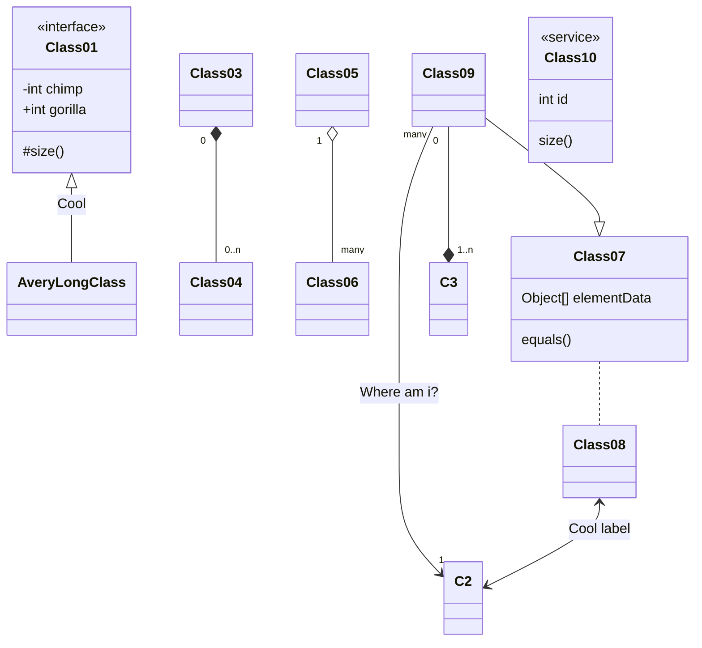
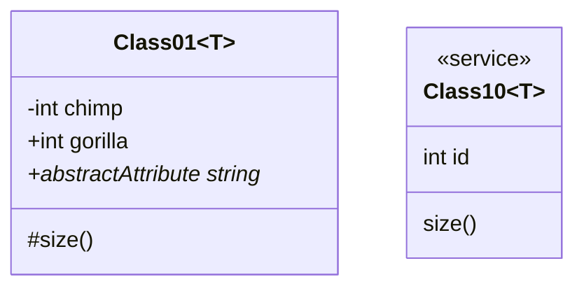
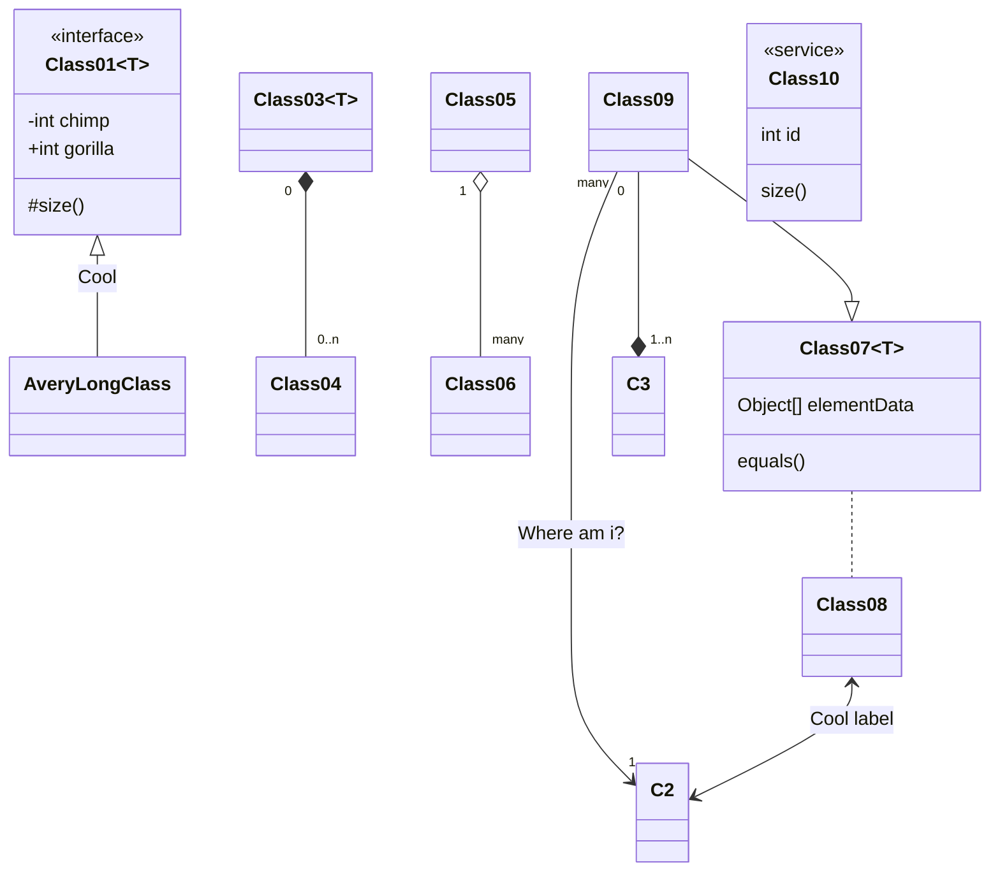
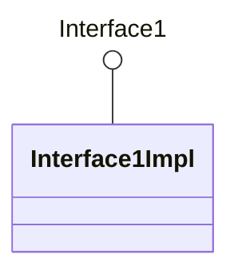
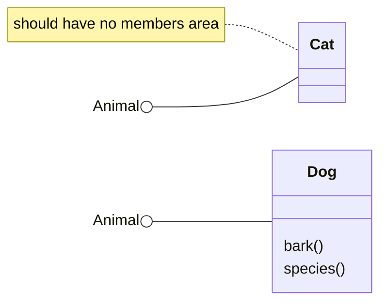
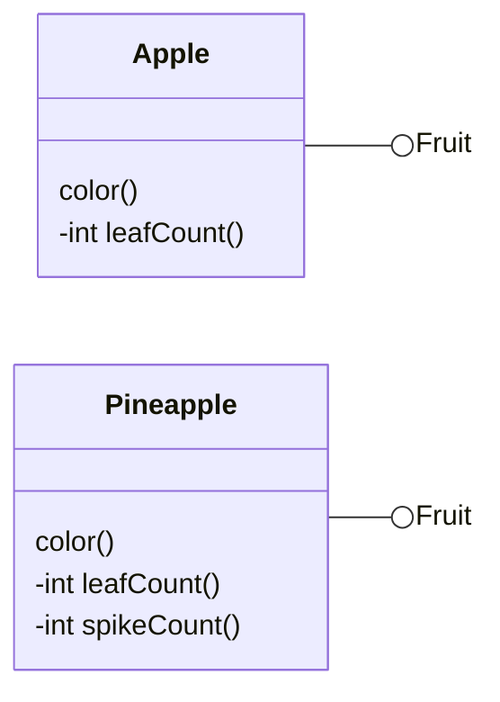
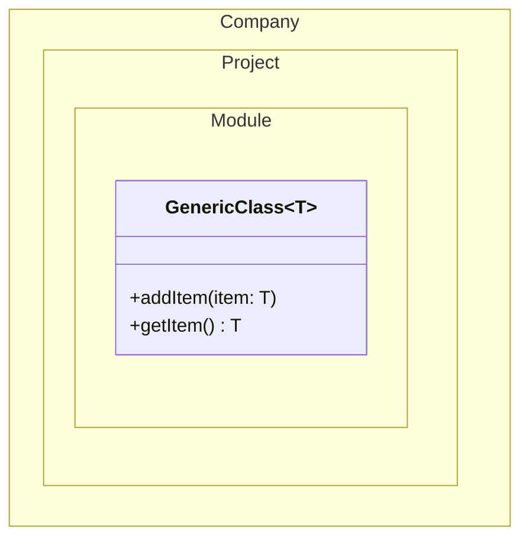
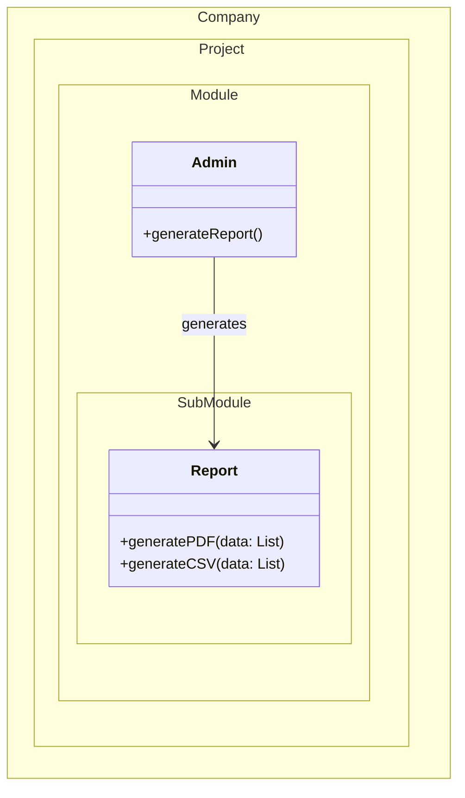
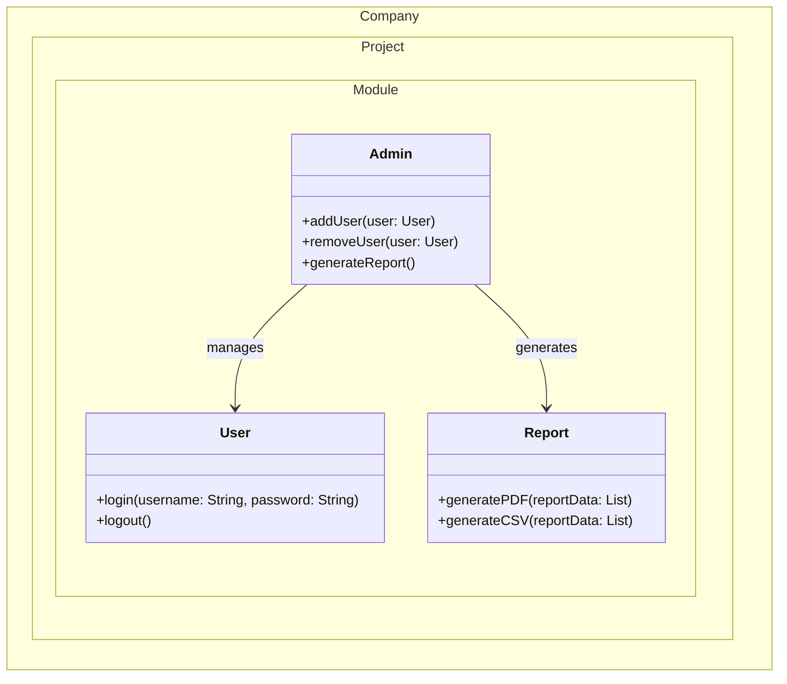
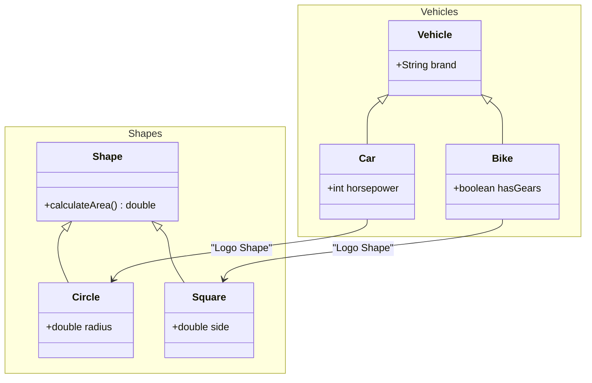

# classchart

## Example 1

**SebastianJS (SVG):**

> Render failed: Error: Diagrams beginning with --- are not valid. If you were trying to use a YAML front-matter, please ensure that you've correctly opened and closed the YAML front-matter with un-indented `---` blocks

**Mermaid Code (Browser Rendered):**

```mermaid
---
    title: Demo Class Diagram
    ---
    classDiagram
      accTitle: Demo Class Diagram
      accDescr: This class diagram show the abstract Animal class, and 3 classes that inherit from it: Duck, Fish, and Zebra.

      Animal <|-- Duck
      Animal <|-- Fish
      Animal <|-- Zebra
      Animal : +int age
      Animal : +String gender
      Animal: +isMammal()
      Animal: +mate()

      class Duck{
        +String beakColor
        +swim()
        +quack()
      }
      class Fish{
        -Listint sizeInFeet
        -canEat()
      }
      class Zebra{
        +bool is_wild
        +run(List~T~, List~OT~)
        %% +run-composite(List~T, K~)
        +run-nested(List~List~OT~~)
      }
```

## Example 2

**SebastianJS (SVG):**

> Render failed: TypeError: DOMPurify.sanitize is not a function

**Mermaid Code (Browser Rendered):**



## Example 3

**SebastianJS (SVG):**

> Render failed: TypeError: DOMPurify.sanitize is not a function

**Mermaid Code (Browser Rendered):**



## Example 4

**SebastianJS (SVG):**

> Render failed: TypeError: DOMPurify.sanitize is not a function

**Mermaid Code (Browser Rendered):**



## Example 5

**SebastianJS (SVG):**

> Render failed: TypeError: DOMPurify.sanitize is not a function

**Mermaid Code (Browser Rendered):**



## Example 6

**SebastianJS (SVG):**

> Render failed: TypeError: DOMPurify.sanitize is not a function

**Mermaid Code (Browser Rendered):**



## Example 7

**SebastianJS (SVG):**

> Render failed: TypeError: DOMPurify.sanitize is not a function

**Mermaid Code (Browser Rendered):**



## Example 8

**SebastianJS (SVG):**

> Render failed: TypeError: DOMPurify.sanitize is not a function

**Mermaid Code (Browser Rendered):**

```mermaid
classDiagram
      class Person {
        +ID : Guid
        +FirstName : string
        +LastName : string
        -privateProperty : string
        #ProtectedProperty : string
        ~InternalProperty : string
        ~AnotherInternalProperty : List~List~string~~
      }
      class People List~List~Person~~
```

## Example 9

**SebastianJS (SVG):**

> Render failed: TypeError: DOMPurify.sanitize is not a function

**Mermaid Code (Browser Rendered):**



## Example 10

**SebastianJS (SVG):**

> Render failed: TypeError: DOMPurify.sanitize is not a function

**Mermaid Code (Browser Rendered):**



## Example 11

**SebastianJS (SVG):**

> Render failed: TypeError: DOMPurify.sanitize is not a function

**Mermaid Code (Browser Rendered):**



## Example 12

**SebastianJS (SVG):**

> Render failed: TypeError: DOMPurify.sanitize is not a function

**Mermaid Code (Browser Rendered):**



