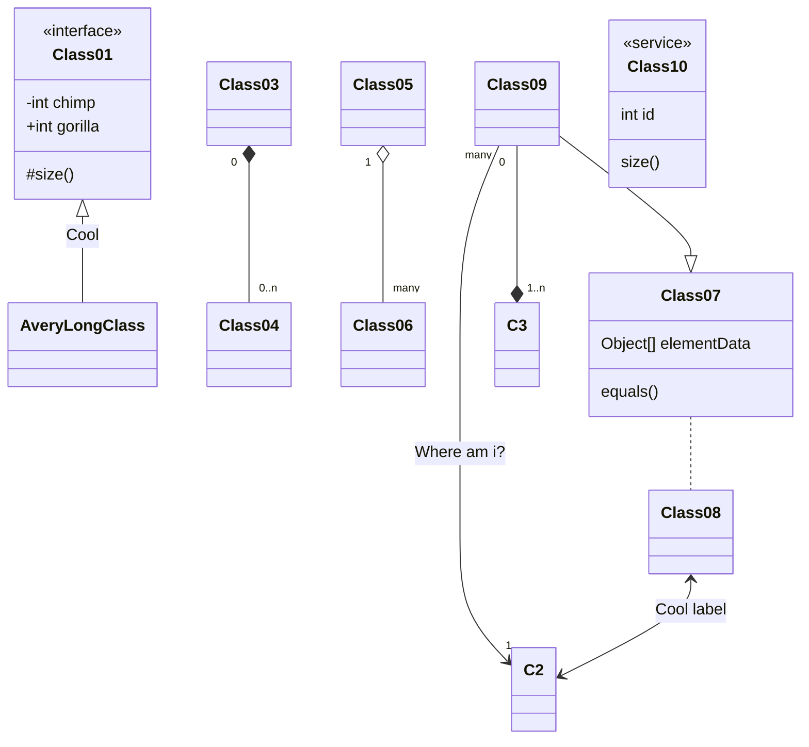
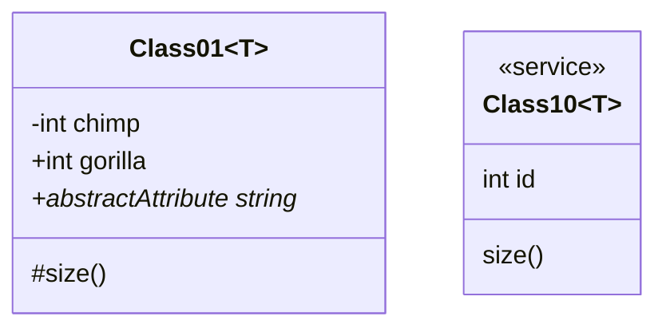
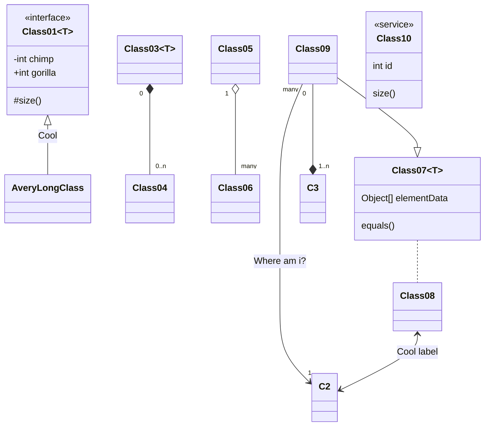
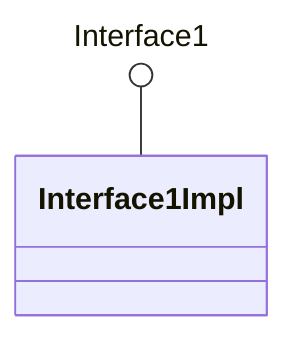
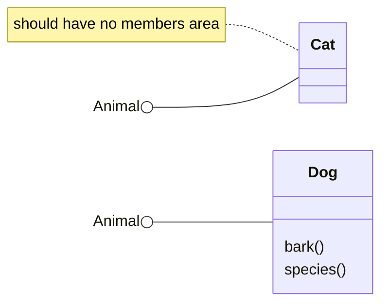
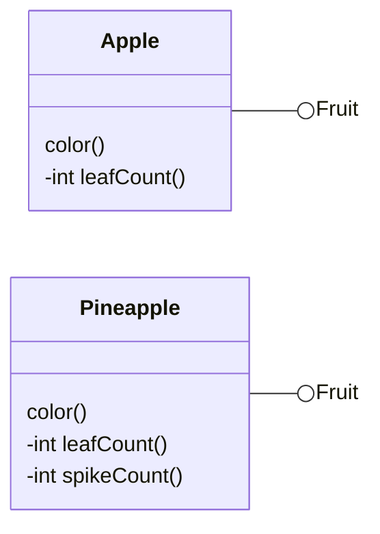
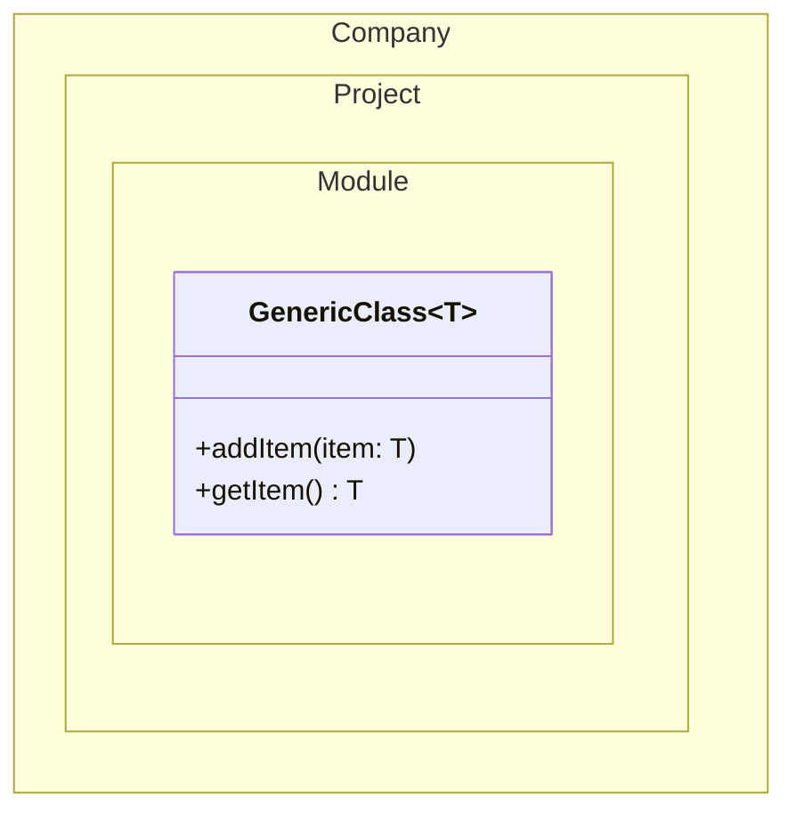
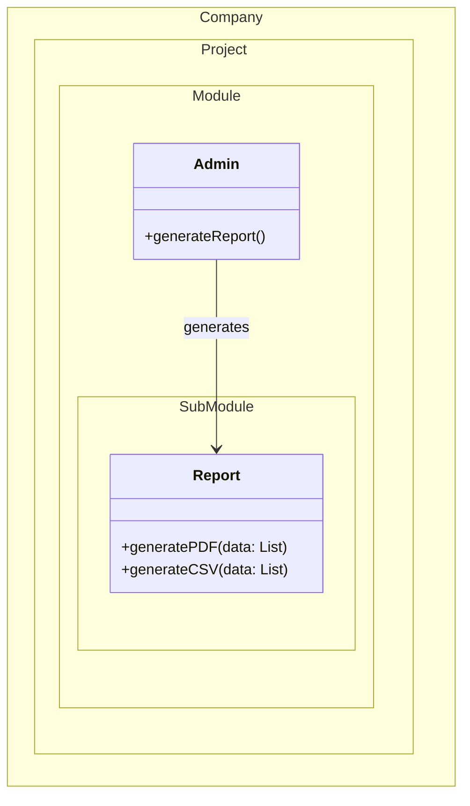
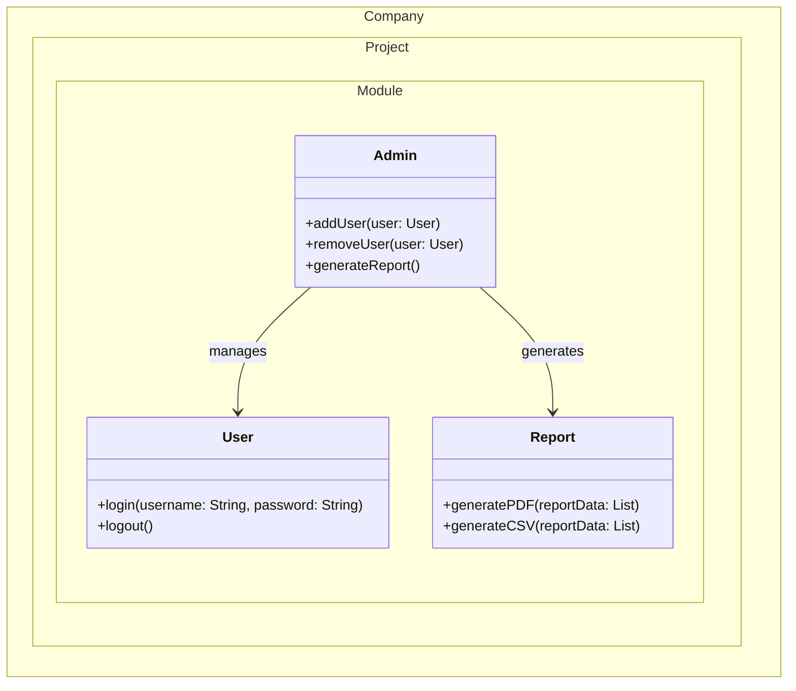
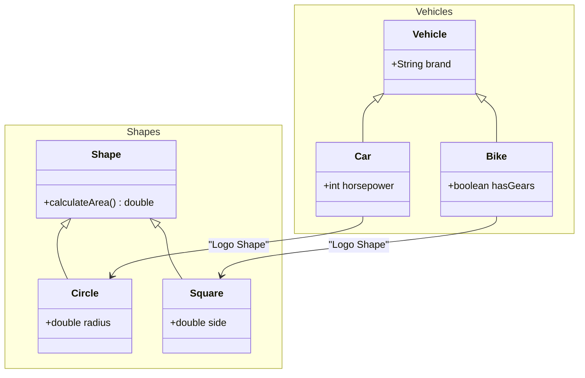

# classchart

## Example 1

**SebastianJS (SVG):**

> Render failed: Error: Diagrams beginning with --- are not valid. If you were trying to use a YAML front-matter, please ensure that you've correctly opened and closed the YAML front-matter with un-indented `---` blocks

**Mermaid Code (Browser Rendered):**

```mermaid
---
    title: Demo Class Diagram
    ---
    classDiagram
      accTitle: Demo Class Diagram
      accDescr: This class diagram show the abstract Animal class, and 3 classes that inherit from it: Duck, Fish, and Zebra.

      Animal <|-- Duck
      Animal <|-- Fish
      Animal <|-- Zebra
      Animal : +int age
      Animal : +String gender
      Animal: +isMammal()
      Animal: +mate()

      class Duck{
        +String beakColor
        +swim()
        +quack()
      }
      class Fish{
        -Listint sizeInFeet
        -canEat()
      }
      class Zebra{
        +bool is_wild
        +run(List~T~, List~OT~)
        %% +run-composite(List~T, K~)
        +run-nested(List~List~OT~~)
      }
```

## Example 2

**SebastianJS (SVG):**

<svg id="graph" xmlns="http://www.w3.org/2000/svg" xmlns:xlink="http://www.w3.org/1999/xlink" class="classDiagram" style="max-width: 29778px;" viewBox="-168 -18 508 302" role="graphics-document document" aria-roledescription="class"><style>#graph{font-family:"trebuchet ms",verdana,arial,sans-serif;font-size:16px;fill:#333;}@keyframes edge-animation-frame{from{stroke-dashoffset:0;}}@keyframes dash{to{stroke-dashoffset:0;}}#graph .edge-animation-slow{stroke-dasharray:9,5!important;stroke-dashoffset:900;animation:dash 50s linear infinite;stroke-linecap:round;}#graph .edge-animation-fast{stroke-dasharray:9,5!important;stroke-dashoffset:900;animation:dash 20s linear infinite;stroke-linecap:round;}#graph .error-icon{fill:#552222;}#graph .error-text{fill:#552222;stroke:#552222;}#graph .edge-thickness-normal{stroke-width:1px;}#graph .edge-thickness-thick{stroke-width:3.5px;}#graph .edge-pattern-solid{stroke-dasharray:0;}#graph .edge-thickness-invisible{stroke-width:0;fill:none;}#graph .edge-pattern-dashed{stroke-dasharray:3;}#graph .edge-pattern-dotted{stroke-dasharray:2;}#graph .marker{fill:#333333;stroke:#333333;}#graph .marker.cross{stroke:#333333;}#graph svg{font-family:"trebuchet ms",verdana,arial,sans-serif;font-size:16px;}#graph p{margin:0;}#graph g.classGroup text{fill:#9370DB;stroke:none;font-family:"trebuchet ms",verdana,arial,sans-serif;font-size:10px;}#graph g.classGroup text .title{font-weight:bolder;}#graph .nodeLabel,#graph .edgeLabel{color:#131300;}#graph .edgeLabel .label rect{fill:#ECECFF;}#graph .label text{fill:#131300;}#graph .labelBkg{background:#ECECFF;}#graph .edgeLabel .label span{background:#ECECFF;}#graph .classTitle{font-weight:bolder;}#graph .node rect,#graph .node circle,#graph .node ellipse,#graph .node polygon,#graph .node path{fill:#ECECFF;stroke:#9370DB;stroke-width:1px;}#graph .divider{stroke:#9370DB;stroke-width:1;}#graph g.clickable{cursor:pointer;}#graph g.classGroup rect{fill:#ECECFF;stroke:#9370DB;}#graph g.classGroup line{stroke:#9370DB;stroke-width:1;}#graph .classLabel .box{stroke:none;stroke-width:0;fill:#ECECFF;opacity:0.5;}#graph .classLabel .label{fill:#9370DB;font-size:10px;}#graph .relation{stroke:#333333;stroke-width:1;fill:none;}#graph .dashed-line{stroke-dasharray:3;}#graph .dotted-line{stroke-dasharray:1 2;}#graph #compositionStart,#graph .composition{fill:#333333!important;stroke:#333333!important;stroke-width:1;}#graph #compositionEnd,#graph .composition{fill:#333333!important;stroke:#333333!important;stroke-width:1;}#graph #dependencyStart,#graph .dependency{fill:#333333!important;stroke:#333333!important;stroke-width:1;}#graph #dependencyStart,#graph .dependency{fill:#333333!important;stroke:#333333!important;stroke-width:1;}#graph #extensionStart,#graph .extension{fill:transparent!important;stroke:#333333!important;stroke-width:1;}#graph #extensionEnd,#graph .extension{fill:transparent!important;stroke:#333333!important;stroke-width:1;}#graph #aggregationStart,#graph .aggregation{fill:transparent!important;stroke:#333333!important;stroke-width:1;}#graph #aggregationEnd,#graph .aggregation{fill:transparent!important;stroke:#333333!important;stroke-width:1;}#graph #lollipopStart,#graph .lollipop{fill:#ECECFF!important;stroke:#333333!important;stroke-width:1;}#graph #lollipopEnd,#graph .lollipop{fill:#ECECFF!important;stroke:#333333!important;stroke-width:1;}#graph .edgeTerminals{font-size:11px;line-height:initial;}#graph .classTitleText{text-anchor:middle;font-size:18px;fill:#333;}#graph .label-icon{display:inline-block;height:1em;overflow:visible;vertical-align:-0.125em;}#graph .node .label-icon path{fill:currentColor;stroke:revert;stroke-width:revert;}#graph :root{--mermaid-font-family:"trebuchet ms",verdana,arial,sans-serif;}</style><g><defs><marker id="graph_class-aggregationStart" class="marker aggregation class" refX="18" refY="7" markerWidth="190" markerHeight="240" orient="auto"><path d="M 18,7 L9,13 L1,7 L9,1 Z"/></marker></defs><defs><marker id="graph_class-aggregationEnd" class="marker aggregation class" refX="1" refY="7" markerWidth="20" markerHeight="28" orient="auto"><path d="M 18,7 L9,13 L1,7 L9,1 Z"/></marker></defs><defs><marker id="graph_class-extensionStart" class="marker extension class" refX="18" refY="7" markerWidth="190" markerHeight="240" orient="auto"><path d="M 1,7 L18,13 V 1 Z"/></marker></defs><defs><marker id="graph_class-extensionEnd" class="marker extension class" refX="1" refY="7" markerWidth="20" markerHeight="28" orient="auto"><path d="M 1,1 V 13 L18,7 Z"/></marker></defs><defs><marker id="graph_class-compositionStart" class="marker composition class" refX="18" refY="7" markerWidth="190" markerHeight="240" orient="auto"><path d="M 18,7 L9,13 L1,7 L9,1 Z"/></marker></defs><defs><marker id="graph_class-compositionEnd" class="marker composition class" refX="1" refY="7" markerWidth="20" markerHeight="28" orient="auto"><path d="M 18,7 L9,13 L1,7 L9,1 Z"/></marker></defs><defs><marker id="graph_class-dependencyStart" class="marker dependency class" refX="6" refY="7" markerWidth="190" markerHeight="240" orient="auto"><path d="M 5,7 L9,13 L1,7 L9,1 Z"/></marker></defs><defs><marker id="graph_class-dependencyEnd" class="marker dependency class" refX="13" refY="7" markerWidth="20" markerHeight="28" orient="auto"><path d="M 18,7 L9,13 L14,7 L9,1 Z"/></marker></defs><defs><marker id="graph_class-lollipopStart" class="marker lollipop class" refX="13" refY="7" markerWidth="190" markerHeight="240" orient="auto"><circle stroke="black" fill="transparent" cx="7" cy="7" r="6"/></marker></defs><defs><marker id="graph_class-lollipopEnd" class="marker lollipop class" refX="1" refY="7" markerWidth="190" markerHeight="240" orient="auto"><circle stroke="black" fill="transparent" cx="7" cy="7" r="6"/></marker></defs><g class="root"><g class="clusters"/><g class="edgePaths"><path d="M29,50L29,53.167C29,56.333,29,62.667,29,72C29,81.333,29,93.667,29,99.833L29,106" id="id_Class01_AveryLongClass_1" class=" edge-thickness-normal edge-pattern-solid relation" style="" marker-start="url(#graph_class-extensionStart)"/><path d="M89,50L89,53.167C89,56.333,89,62.667,89,72C89,81.333,89,93.667,89,99.833L89,106" id="id_Class03_Class04_2" class=" edge-thickness-normal edge-pattern-solid relation" style="" marker-start="url(#graph_class-compositionStart)"/><path d="M149,50L149,53.167C149,56.333,149,62.667,149,72C149,81.333,149,93.667,149,99.833L149,106" id="id_Class05_Class06_3" class=" edge-thickness-normal edge-pattern-solid relation" style="" marker-start="url(#graph_class-aggregationStart)"/><path d="M289,130L289,136.167C289,142.333,289,154.667,289,167C289,179.333,289,191.667,289,197.833L289,204" id="id_Class07_Class08_4" class=" edge-thickness-normal edge-pattern-dashed relation" style=""/><path d="M224,26.125L218.167,33.271C212.333,40.417,200.667,54.708,194.833,70.021C189,85.333,189,101.667,189,118C189,134.333,189,150.667,189,167C189,183.333,189,199.667,189,216C189,232.333,189,248.667,192.645,262.786C196.289,276.905,203.578,288.811,207.223,294.764L210.867,300.716" id="id_Class09_C2_5" class=" edge-thickness-normal edge-pattern-solid relation" style="" marker-end="url(#graph_class-dependencyEnd)"/><path d="M229,32L229,38.167C229,44.333,229,56.667,229,66C229,75.333,229,81.667,229,84.833L229,88" id="id_Class09_C3_6" class=" edge-thickness-normal edge-pattern-solid relation" style="" marker-end="url(#graph_class-compositionEnd)"/><path d="M234,24.083L243.167,31.569C252.333,39.056,270.667,54.028,279.833,64.681C289,75.333,289,81.667,289,84.833L289,88" id="id_Class09_Class07_7" class=" edge-thickness-normal edge-pattern-solid relation" style="" marker-end="url(#graph_class-extensionEnd)"/><path d="M289,234L289,239.167C289,244.333,289,254.667,278.986,266.843C268.972,279.02,248.944,293.039,238.929,300.049L228.915,307.059" id="id_Class08_C2_8" class=" edge-thickness-normal edge-pattern-solid relation" style="" marker-start="url(#graph_class-dependencyStart)" marker-end="url(#graph_class-dependencyEnd)"/></g><g class="edgeLabels"><g><rect class="background" style="stroke: none"/></g><g><rect class="background" style="stroke: none"/></g><g><rect class="background" style="stroke: none"/></g><g><rect class="background" style="stroke: none"/></g><g><rect class="background" style="stroke: none"/></g><g class="edgeLabel" transform="translate(29, 69)"><g class="label" transform="translate(-21, -12)"><g><rect class="background" style=";display: inline-block" x="-2" y="-2" width="46" height="28"/><text y="-10.1" style=";display: inline-block"><tspan class="text-outer-tspan" x="0" y="-0.1em" dy="1.1em"><tspan font-style="normal" class="text-inner-tspan" font-weight="normal">Cool</tspan></tspan></text></g></g></g><g class="edgeLabel"><g class="label" transform="translate(-5, -12)"><text y="-10.1"><tspan class="text-outer-tspan" x="0" y="-0.1em" dy="1.1em"/></text></g></g><g class="edgeLabel"><g class="label" transform="translate(-5, -12)"><text y="-10.1"><tspan class="text-outer-tspan" x="0" y="-0.1em" dy="1.1em"/></text></g></g><g class="edgeLabel"><g class="label" transform="translate(-5, -12)"><text y="-10.1"><tspan class="text-outer-tspan" x="0" y="-0.1em" dy="1.1em"/></text></g></g><g class="edgeLabel" transform="translate(189, 167)"><g class="label" transform="translate(-49, -12)"><g><rect class="background" style=";display: inline-block" x="-2" y="-2" width="102" height="28"/><text y="-10.1" style=";display: inline-block"><tspan class="text-outer-tspan" x="0" y="-0.1em" dy="1.1em"><tspan font-style="normal" class="text-inner-tspan" font-weight="normal">Where</tspan><tspan font-style="normal" class="text-inner-tspan" font-weight="normal"> am</tspan><tspan font-style="normal" class="text-inner-tspan" font-weight="normal"> i?</tspan></tspan></text></g></g></g><g class="edgeLabel"><g class="label" transform="translate(-5, -12)"><text y="-10.1"><tspan class="text-outer-tspan" x="0" y="-0.1em" dy="1.1em"/></text></g></g><g class="edgeLabel"><g class="label" transform="translate(-5, -12)"><text y="-10.1"><tspan class="text-outer-tspan" x="0" y="-0.1em" dy="1.1em"/></text></g></g><g class="edgeLabel" transform="translate(289, 265)"><g class="label" transform="translate(-45, -12)"><g><rect class="background" style=";display: inline-block" x="-2" y="-2" width="94" height="28"/><text y="-10.1" style=";display: inline-block"><tspan class="text-outer-tspan" x="0" y="-0.1em" dy="1.1em"><tspan font-style="normal" class="text-inner-tspan" font-weight="normal">Cool</tspan><tspan font-style="normal" class="text-inner-tspan" font-weight="normal"> label</tspan></tspan></text></g></g></g><g class="edgeTerminals" transform="translate(74, 49.5)"><g class="inner" transform="translate(-9, -12)"><text style=";display: inline-block"><tspan xml:space="preserve" dy="1em" x="0" class="row">0</tspan></text></g></g><g class="edgeTerminals" transform="translate(134, 49.5)"><g class="inner" transform="translate(-9, -12)"><text style=";display: inline-block"><tspan xml:space="preserve" dy="1em" x="0" class="row">1</tspan></text></g></g><g class="edgeTerminals" transform="translate(201.31349294048374, 30.195921496604818)"><g class="inner" transform="translate(-21, -12)"><text style=";display: inline-block"><tspan xml:space="preserve" dy="1em" x="0" class="row">many</tspan></text></g></g><g class="edgeTerminals" transform="translate(214, 49.5)"><g class="inner" transform="translate(-9, -12)"><text style=";display: inline-block"><tspan xml:space="preserve" dy="1em" x="0" class="row">0</tspan></text></g></g><g class="edgeTerminals" transform="translate(99, 83.5)"><g class="inner" transform="translate(-21, -12)"/><text style=";display: inline-block"><tspan xml:space="preserve" dy="1em" x="0" class="row">0..n</tspan></text></g><g class="edgeTerminals" transform="translate(159, 83.5)"><g class="inner" transform="translate(-21, -12)"/><text style=";display: inline-block"><tspan xml:space="preserve" dy="1em" x="0" class="row">many</tspan></text></g><g class="edgeTerminals" transform="translate(212.6550733537175, 278.0761267999592)"><g class="inner" transform="translate(-9, -12)"/><text style=";display: inline-block"><tspan xml:space="preserve" dy="1em" x="0" class="row">1</tspan></text></g><g class="edgeTerminals" transform="translate(239, 83.5)"><g class="inner" transform="translate(-21, -12)"/><text style=";display: inline-block"><tspan xml:space="preserve" dy="1em" x="0" class="row">1..n</tspan></text></g></g><g class="nodes"><g class="node default " id="classId-Class01-0" transform="translate(29, 20)"><g class="basic label-container"><path d="M-205 -24 L205 -24 L205 24 L-205 24" stroke="none" stroke-width="0" fill="#ECECFF" style=""/><path d="M-205 -24 C-71.35962618044562 -24, 62.28074763910877 -24, 205 -24 M-205 -24 C-63.67936123336915 -24, 77.6412775332617 -24, 205 -24 M205 -24 C205 -10.535384427377501, 205 2.929231145244998, 205 24 M205 -24 C205 -13.719742430439549, 205 -3.439484860879098, 205 24 M205 24 C61.22238323999645 24, -82.5552335200071 24, -205 24 M205 24 C104.73444923383337 24, 4.468898467666747 24, -205 24 M-205 24 C-205 4.836707059088987, -205 -14.326585881822027, -205 -24 M-205 24 C-205 5.559569410766983, -205 -12.880861178466034, -205 -24" stroke="#9370DB" stroke-width="1.3" fill="none" stroke-dasharray="0 0" style=""/></g><g class="annotation-group text" transform="translate(-49, -4)"><g class="label" style="" transform="translate(0,-12)"><g><rect class="background" style="stroke: none"/><text y="-10.1" style=""><tspan class="text-outer-tspan" x="0" y="-0.1em" dy="1.1em"><tspan font-style="normal" class="text-inner-tspan" font-weight="normal">«interface»</tspan></tspan></text></g></g></g><g class="label-group text" transform="translate(-33, 20)"><g class="label" style="font-weight: bolder" transform="translate(0,-12)"><g><rect class="background" style="stroke: none"/><text y="-10.1" style=""><tspan class="text-outer-tspan" x="0" y="-0.1em" dy="1.1em" font-weight=""><tspan font-style="normal" class="text-inner-tspan" font-weight="">Class01</tspan></tspan></text></g></g></g><g class="members-group text" transform="translate(-193, 68)"><g class="label" style="" transform="translate(0,-12)"><g><rect class="background" style="stroke: none"/><text y="-10.1" style=""><tspan class="text-outer-tspan" x="0" y="-0.1em" dy="1.1em"><tspan font-style="normal" class="text-inner-tspan" font-weight="normal">-int</tspan><tspan font-style="normal" class="text-inner-tspan" font-weight="normal"> chimp</tspan></tspan></text></g></g><g class="label" style="" transform="translate(0,15)"><g><rect class="background" style="stroke: none"/><text y="-10.1" style=""><tspan class="text-outer-tspan" x="0" y="-0.1em" dy="1.1em"><tspan font-style="normal" class="text-inner-tspan" font-weight="normal">+int</tspan><tspan font-style="normal" class="text-inner-tspan" font-weight="normal"> gorilla</tspan></tspan></text></g></g></g><g class="methods-group text" transform="translate(-193, 116)"><g class="label" style="" transform="translate(0,-12)"><g><rect class="background" style="stroke: none"/><text y="-10.1" style=""><tspan class="text-outer-tspan" x="0" y="-0.1em" dy="1.1em"><tspan font-style="normal" class="text-inner-tspan" font-weight="normal">#size()</tspan></tspan></text></g></g></g><g class="divider" style=""><path d="M0 48 C2.69360783138483 48, 5.38721566276966 48, 10 48 M0 48 C2.7416790681291814 48, 5.483358136258363 48, 10 48" stroke="#9370DB" stroke-width="1.3" fill="none" stroke-dasharray="0 0" style=""/></g><g class="divider" style=""><path d="M0 96 C3.163155291609843 96, 6.326310583219686 96, 10 96 M0 96 C3.1305863528702043 96, 6.2611727057404085 96, 10 96" stroke="#9370DB" stroke-width="1.3" fill="none" stroke-dasharray="0 0" style=""/></g></g><g class="node default " id="classId-AveryLongClass-1" transform="translate(29, 118)"><g class="basic label-container"><path d="M-73 -42 L73 -42 L73 42 L-73 42" stroke="none" stroke-width="0" fill="#ECECFF" style=""/><path d="M-73 -42 C-21.840517239008953 -42, 29.318965521982093 -42, 73 -42 M-73 -42 C-35.3082774922556 -42, 2.383445015488803 -42, 73 -42 M73 -42 C73 -19.17028404472523, 73 3.659431910549543, 73 42 M73 -42 C73 -20.65847776346291, 73 0.6830444730741831, 73 42 M73 42 C15.859174068112978 42, -41.281651863774044 42, -73 42 M73 42 C30.37777935852322 42, -12.24444128295356 42, -73 42 M-73 42 C-73 16.771391539720806, -73 -8.457216920558388, -73 -42 M-73 42 C-73 16.91678399045256, -73 -8.166432019094877, -73 -42" stroke="#9370DB" stroke-width="1.3" fill="none" stroke-dasharray="0 0" style=""/></g><g class="annotation-group text" transform="translate(-5, -22)"/><g class="label-group text" transform="translate(-61, -22)"><g class="label" style="font-weight: bolder" transform="translate(0,-12)"><g><rect class="background" style="stroke: none"/><text y="-10.1" style=""><tspan class="text-outer-tspan" x="0" y="-0.1em" dy="1.1em" font-weight=""><tspan font-style="normal" class="text-inner-tspan" font-weight="">AveryLongClass</tspan></tspan></text></g></g></g><g class="members-group text" transform="translate(-61, 26)"/><g class="methods-group text" transform="translate(-61, 74)"/><g class="divider" style=""><path d="M0 30 C2.4587930861549223 30, 4.917586172309845 30, 10 30 M0 30 C3.574719145320258 30, 7.149438290640516 30, 10 30" stroke="#9370DB" stroke-width="1.3" fill="none" stroke-dasharray="0 0" style=""/></g><g class="divider" style=""><path d="M0 72 C2.657136529507488 72, 5.314273059014976 72, 10 72 M0 72 C2.9131671391444303 72, 5.8263342782888605 72, 10 72" stroke="#9370DB" stroke-width="1.3" fill="none" stroke-dasharray="0 0" style=""/></g></g><g class="node default " id="classId-Class03-2" transform="translate(89, 20)"><g class="basic label-container"><path d="M-45 -42 L45 -42 L45 42 L-45 42" stroke="none" stroke-width="0" fill="#ECECFF" style=""/><path d="M-45 -42 C-21.563662263189805 -42, 1.87267547362039 -42, 45 -42 M-45 -42 C-20.113456250576913 -42, 4.773087498846174 -42, 45 -42 M45 -42 C45 -8.50297599213993, 45 24.99404801572014, 45 42 M45 -42 C45 -14.6954588596695, 45 12.609082280661, 45 42 M45 42 C22.130741651867133 42, -0.7385166962657337 42, -45 42 M45 42 C23.981756278566944 42, 2.963512557133889 42, -45 42 M-45 42 C-45 20.836395332529705, -45 -0.3272093349405907, -45 -42 M-45 42 C-45 11.023929808083505, -45 -19.95214038383299, -45 -42" stroke="#9370DB" stroke-width="1.3" fill="none" stroke-dasharray="0 0" style=""/></g><g class="annotation-group text" transform="translate(-5, -22)"/><g class="label-group text" transform="translate(-33, -22)"><g class="label" style="font-weight: bolder" transform="translate(0,-12)"><g><rect class="background" style="stroke: none"/><text y="-10.1" style=""><tspan class="text-outer-tspan" x="0" y="-0.1em" dy="1.1em" font-weight=""><tspan font-style="normal" class="text-inner-tspan" font-weight="">Class03</tspan></tspan></text></g></g></g><g class="members-group text" transform="translate(-33, 26)"/><g class="methods-group text" transform="translate(-33, 74)"/><g class="divider" style=""><path d="M0 30 C2.488073686771597 30, 4.976147373543194 30, 10 30 M0 30 C3.481813324702705 30, 6.96362664940541 30, 10 30" stroke="#9370DB" stroke-width="1.3" fill="none" stroke-dasharray="0 0" style=""/></g><g class="divider" style=""><path d="M0 72 C2.129474787710412 72, 4.258949575420824 72, 10 72 M0 72 C2.056509608011589 72, 4.113019216023178 72, 10 72" stroke="#9370DB" stroke-width="1.3" fill="none" stroke-dasharray="0 0" style=""/></g></g><g class="node default " id="classId-Class04-3" transform="translate(89, 118)"><g class="basic label-container"><path d="M-45 -42 L45 -42 L45 42 L-45 42" stroke="none" stroke-width="0" fill="#ECECFF" style=""/><path d="M-45 -42 C-24.382862587798787 -42, -3.7657251755975736 -42, 45 -42 M-45 -42 C-24.744284485661627 -42, -4.488568971323254 -42, 45 -42 M45 -42 C45 -15.754753385008055, 45 10.49049322998389, 45 42 M45 -42 C45 -13.873962163788104, 45 14.252075672423793, 45 42 M45 42 C23.84161704155893 42, 2.68323408311786 42, -45 42 M45 42 C20.66508744862016 42, -3.669825102759681 42, -45 42 M-45 42 C-45 8.859868902698736, -45 -24.28026219460253, -45 -42 M-45 42 C-45 16.27524762692229, -45 -9.44950474615542, -45 -42" stroke="#9370DB" stroke-width="1.3" fill="none" stroke-dasharray="0 0" style=""/></g><g class="annotation-group text" transform="translate(-5, -22)"/><g class="label-group text" transform="translate(-33, -22)"><g class="label" style="font-weight: bolder" transform="translate(0,-12)"><g><rect class="background" style="stroke: none"/><text y="-10.1" style=""><tspan class="text-outer-tspan" x="0" y="-0.1em" dy="1.1em" font-weight=""><tspan font-style="normal" class="text-inner-tspan" font-weight="">Class04</tspan></tspan></text></g></g></g><g class="members-group text" transform="translate(-33, 26)"/><g class="methods-group text" transform="translate(-33, 74)"/><g class="divider" style=""><path d="M0 30 C3.842105394796442 30, 7.684210789592884 30, 10 30 M0 30 C2.2327604257041758 30, 4.4655208514083515 30, 10 30" stroke="#9370DB" stroke-width="1.3" fill="none" stroke-dasharray="0 0" style=""/></g><g class="divider" style=""><path d="M0 72 C3.5095144633918514 72, 7.019028926783703 72, 10 72 M0 72 C3.2228759187748786 72, 6.445751837549757 72, 10 72" stroke="#9370DB" stroke-width="1.3" fill="none" stroke-dasharray="0 0" style=""/></g></g><g class="node default " id="classId-Class05-4" transform="translate(149, 20)"><g class="basic label-container"><path d="M-45 -42 L45 -42 L45 42 L-45 42" stroke="none" stroke-width="0" fill="#ECECFF" style=""/><path d="M-45 -42 C-11.861047049006096 -42, 21.277905901987808 -42, 45 -42 M-45 -42 C-18.953479874618328 -42, 7.0930402507633445 -42, 45 -42 M45 -42 C45 -14.044854890765965, 45 13.91029021846807, 45 42 M45 -42 C45 -10.191784475451342, 45 21.616431049097315, 45 42 M45 42 C25.79660446859356 42, 6.593208937187121 42, -45 42 M45 42 C24.632205550966187 42, 4.2644111019323745 42, -45 42 M-45 42 C-45 16.809325753081055, -45 -8.38134849383789, -45 -42 M-45 42 C-45 21.36215476222165, -45 0.7243095244432993, -45 -42" stroke="#9370DB" stroke-width="1.3" fill="none" stroke-dasharray="0 0" style=""/></g><g class="annotation-group text" transform="translate(-5, -22)"/><g class="label-group text" transform="translate(-33, -22)"><g class="label" style="font-weight: bolder" transform="translate(0,-12)"><g><rect class="background" style="stroke: none"/><text y="-10.1" style=""><tspan class="text-outer-tspan" x="0" y="-0.1em" dy="1.1em" font-weight=""><tspan font-style="normal" class="text-inner-tspan" font-weight="">Class05</tspan></tspan></text></g></g></g><g class="members-group text" transform="translate(-33, 26)"/><g class="methods-group text" transform="translate(-33, 74)"/><g class="divider" style=""><path d="M0 30 C2.578581996546287 30, 5.157163993092574 30, 10 30 M0 30 C2.181746686624846 30, 4.363493373249692 30, 10 30" stroke="#9370DB" stroke-width="1.3" fill="none" stroke-dasharray="0 0" style=""/></g><g class="divider" style=""><path d="M0 72 C3.2953792675762825 72, 6.590758535152565 72, 10 72 M0 72 C3.7318627832178097 72, 7.4637255664356195 72, 10 72" stroke="#9370DB" stroke-width="1.3" fill="none" stroke-dasharray="0 0" style=""/></g></g><g class="node default " id="classId-Class06-5" transform="translate(149, 118)"><g class="basic label-container"><path d="M-45 -42 L45 -42 L45 42 L-45 42" stroke="none" stroke-width="0" fill="#ECECFF" style=""/><path d="M-45 -42 C-9.542911375143952 -42, 25.914177249712097 -42, 45 -42 M-45 -42 C-13.689865828654575 -42, 17.62026834269085 -42, 45 -42 M45 -42 C45 -18.374631800415553, 45 5.250736399168893, 45 42 M45 -42 C45 -25.070526578682696, 45 -8.141053157365391, 45 42 M45 42 C9.923600749247726 42, -25.15279850150455 42, -45 42 M45 42 C21.458660499028863 42, -2.0826790019422745 42, -45 42 M-45 42 C-45 12.444570998499735, -45 -17.11085800300053, -45 -42 M-45 42 C-45 17.515827978255103, -45 -6.968344043489793, -45 -42" stroke="#9370DB" stroke-width="1.3" fill="none" stroke-dasharray="0 0" style=""/></g><g class="annotation-group text" transform="translate(-5, -22)"/><g class="label-group text" transform="translate(-33, -22)"><g class="label" style="font-weight: bolder" transform="translate(0,-12)"><g><rect class="background" style="stroke: none"/><text y="-10.1" style=""><tspan class="text-outer-tspan" x="0" y="-0.1em" dy="1.1em" font-weight=""><tspan font-style="normal" class="text-inner-tspan" font-weight="">Class06</tspan></tspan></text></g></g></g><g class="members-group text" transform="translate(-33, 26)"/><g class="methods-group text" transform="translate(-33, 74)"/><g class="divider" style=""><path d="M0 30 C3.277047966265507 30, 6.554095932531014 30, 10 30 M0 30 C3.432268183619396 30, 6.864536367238792 30, 10 30" stroke="#9370DB" stroke-width="1.3" fill="none" stroke-dasharray="0 0" style=""/></g><g class="divider" style=""><path d="M0 72 C2.2713226496382743 72, 4.542645299276549 72, 10 72 M0 72 C2.4194664271050255 72, 4.838932854210051 72, 10 72" stroke="#9370DB" stroke-width="1.3" fill="none" stroke-dasharray="0 0" style=""/></g></g><g class="node default " id="classId-Class07-6" transform="translate(289, 118)"><g class="basic label-container"><path d="M-157 -24 L157 -24 L157 24 L-157 24" stroke="none" stroke-width="0" fill="#ECECFF" style=""/><path d="M-157 -24 C-90.43508382393736 -24, -23.870167647874723 -24, 157 -24 M-157 -24 C-67.28646475732133 -24, 22.427070485357348 -24, 157 -24 M157 -24 C157 -11.099373142641081, 157 1.8012537147178378, 157 24 M157 -24 C157 -10.425899995589788, 157 3.1482000088204245, 157 24 M157 24 C83.56630385350282 24, 10.132607707005633 24, -157 24 M157 24 C80.82883104812595 24, 4.657662096251897 24, -157 24 M-157 24 C-157 10.888431652714896, -157 -2.223136694570208, -157 -24 M-157 24 C-157 10.971825000819004, -157 -2.0563499983619913, -157 -24" stroke="#9370DB" stroke-width="1.3" fill="none" stroke-dasharray="0 0" style=""/></g><g class="annotation-group text" transform="translate(-5, -4)"/><g class="label-group text" transform="translate(-33, -4)"><g class="label" style="font-weight: bolder" transform="translate(0,-12)"><g><rect class="background" style="stroke: none"/><text y="-10.1" style=""><tspan class="text-outer-tspan" x="0" y="-0.1em" dy="1.1em" font-weight=""><tspan font-style="normal" class="text-inner-tspan" font-weight="">Class07</tspan></tspan></text></g></g></g><g class="members-group text" transform="translate(-145, 44)"><g class="label" style="" transform="translate(0,-12)"><g><rect class="background" style="stroke: none"/><text y="-10.1" style=""><tspan class="text-outer-tspan" x="0" y="-0.1em" dy="1.1em"><tspan font-style="normal" class="text-inner-tspan" font-weight="normal">Object[]</tspan><tspan font-style="normal" class="text-inner-tspan" font-weight="normal"> elementData</tspan></tspan></text></g></g></g><g class="methods-group text" transform="translate(-145, 92)"><g class="label" style="" transform="translate(0,-12)"><g><rect class="background" style="stroke: none"/><text y="-10.1" style=""><tspan class="text-outer-tspan" x="0" y="-0.1em" dy="1.1em"><tspan font-style="normal" class="text-inner-tspan" font-weight="normal">equals()</tspan></tspan></text></g></g></g><g class="divider" style=""><path d="M0 48 C2.539147593606531 48, 5.078295187213062 48, 10 48 M0 48 C3.4573386215607913 48, 6.914677243121583 48, 10 48" stroke="#9370DB" stroke-width="1.3" fill="none" stroke-dasharray="0 0" style=""/></g><g class="divider" style=""><path d="M0 96 C2.0211205939181167 96, 4.042241187836233 96, 10 96 M0 96 C2.503227955983098 96, 5.006455911966196 96, 10 96" stroke="#9370DB" stroke-width="1.3" fill="none" stroke-dasharray="0 0" style=""/></g></g><g class="node default " id="classId-Class08-7" transform="translate(289, 216)"><g class="basic label-container"><path d="M-45 -42 L45 -42 L45 42 L-45 42" stroke="none" stroke-width="0" fill="#ECECFF" style=""/><path d="M-45 -42 C-12.562516563496104 -42, 19.874966873007793 -42, 45 -42 M-45 -42 C-26.309139639922993 -42, -7.618279279845986 -42, 45 -42 M45 -42 C45 -23.270922009026346, 45 -4.541844018052693, 45 42 M45 -42 C45 -22.62356020888997, 45 -3.2471204177799393, 45 42 M45 42 C9.085084617546116 42, -26.82983076490777 42, -45 42 M45 42 C10.172882687463726 42, -24.654234625072547 42, -45 42 M-45 42 C-45 14.135249278272482, -45 -13.729501443455035, -45 -42 M-45 42 C-45 13.100570866516417, -45 -15.798858266967166, -45 -42" stroke="#9370DB" stroke-width="1.3" fill="none" stroke-dasharray="0 0" style=""/></g><g class="annotation-group text" transform="translate(-5, -22)"/><g class="label-group text" transform="translate(-33, -22)"><g class="label" style="font-weight: bolder" transform="translate(0,-12)"><g><rect class="background" style="stroke: none"/><text y="-10.1" style=""><tspan class="text-outer-tspan" x="0" y="-0.1em" dy="1.1em" font-weight=""><tspan font-style="normal" class="text-inner-tspan" font-weight="">Class08</tspan></tspan></text></g></g></g><g class="members-group text" transform="translate(-33, 26)"/><g class="methods-group text" transform="translate(-33, 74)"/><g class="divider" style=""><path d="M0 30 C3.8220822193647126 30, 7.644164438729425 30, 10 30 M0 30 C2.7486414348601373 30, 5.497282869720275 30, 10 30" stroke="#9370DB" stroke-width="1.3" fill="none" stroke-dasharray="0 0" style=""/></g><g class="divider" style=""><path d="M0 72 C2.8378382690571806 72, 5.675676538114361 72, 10 72 M0 72 C3.4896920787250716 72, 6.979384157450143 72, 10 72" stroke="#9370DB" stroke-width="1.3" fill="none" stroke-dasharray="0 0" style=""/></g></g><g class="node default " id="classId-Class09-8" transform="translate(229, 20)"><g class="basic label-container"><path d="M-45 -42 L45 -42 L45 42 L-45 42" stroke="none" stroke-width="0" fill="#ECECFF" style=""/><path d="M-45 -42 C-12.106675106941132 -42, 20.786649786117735 -42, 45 -42 M-45 -42 C-19.69254778785996 -42, 5.614904424280077 -42, 45 -42 M45 -42 C45 -8.976122783527941, 45 24.047754432944117, 45 42 M45 -42 C45 -23.738874804247587, 45 -5.477749608495174, 45 42 M45 42 C16.477472107771373 42, -12.045055784457254 42, -45 42 M45 42 C18.529505983520018 42, -7.9409880329599645 42, -45 42 M-45 42 C-45 9.547593577051195, -45 -22.90481284589761, -45 -42 M-45 42 C-45 16.406484936070846, -45 -9.187030127858307, -45 -42" stroke="#9370DB" stroke-width="1.3" fill="none" stroke-dasharray="0 0" style=""/></g><g class="annotation-group text" transform="translate(-5, -22)"/><g class="label-group text" transform="translate(-33, -22)"><g class="label" style="font-weight: bolder" transform="translate(0,-12)"><g><rect class="background" style="stroke: none"/><text y="-10.1" style=""><tspan class="text-outer-tspan" x="0" y="-0.1em" dy="1.1em" font-weight=""><tspan font-style="normal" class="text-inner-tspan" font-weight="">Class09</tspan></tspan></text></g></g></g><g class="members-group text" transform="translate(-33, 26)"/><g class="methods-group text" transform="translate(-33, 74)"/><g class="divider" style=""><path d="M0 30 C3.363773879931938 30, 6.727547759863876 30, 10 30 M0 30 C3.901765094909304 30, 7.803530189818608 30, 10 30" stroke="#9370DB" stroke-width="1.3" fill="none" stroke-dasharray="0 0" style=""/></g><g class="divider" style=""><path d="M0 72 C3.4544972322194183 72, 6.908994464438837 72, 10 72 M0 72 C3.5925612044617483 72, 7.185122408923497 72, 10 72" stroke="#9370DB" stroke-width="1.3" fill="none" stroke-dasharray="0 0" style=""/></g></g><g class="node default " id="classId-C2-9" transform="translate(219, 314)"><g class="basic label-container"><path d="M-25 -42 L25 -42 L25 42 L-25 42" stroke="none" stroke-width="0" fill="#ECECFF" style=""/><path d="M-25 -42 C-11.00948329502908 -42, 2.9810334099418405 -42, 25 -42 M-25 -42 C-6.081610005785137 -42, 12.836779988429726 -42, 25 -42 M25 -42 C25 -10.221565615124447, 25 21.556868769751105, 25 42 M25 -42 C25 -23.055981959454016, 25 -4.111963918908032, 25 42 M25 42 C12.767141503420584 42, 0.5342830068411679 42, -25 42 M25 42 C8.064567556118472 42, -8.870864887763055 42, -25 42 M-25 42 C-25 23.36330589870436, -25 4.726611797408722, -25 -42 M-25 42 C-25 17.77800642605122, -25 -6.443987147897559, -25 -42" stroke="#9370DB" stroke-width="1.3" fill="none" stroke-dasharray="0 0" style=""/></g><g class="annotation-group text" transform="translate(-5, -22)"/><g class="label-group text" transform="translate(-13, -22)"><g class="label" style="font-weight: bolder" transform="translate(0,-12)"><g><rect class="background" style="stroke: none"/><text y="-10.1" style=""><tspan class="text-outer-tspan" x="0" y="-0.1em" dy="1.1em" font-weight=""><tspan font-style="normal" class="text-inner-tspan" font-weight="">C2</tspan></tspan></text></g></g></g><g class="members-group text" transform="translate(-13, 26)"/><g class="methods-group text" transform="translate(-13, 74)"/><g class="divider" style=""><path d="M0 30 C3.8597447457585456 30, 7.719489491517091 30, 10 30 M0 30 C2.6629150282154668 30, 5.3258300564309335 30, 10 30" stroke="#9370DB" stroke-width="1.3" fill="none" stroke-dasharray="0 0" style=""/></g><g class="divider" style=""><path d="M0 72 C3.6821977523043037 72, 7.364395504608607 72, 10 72 M0 72 C3.2882389856651817 72, 6.576477971330363 72, 10 72" stroke="#9370DB" stroke-width="1.3" fill="none" stroke-dasharray="0 0" style=""/></g></g><g class="node default " id="classId-C3-10" transform="translate(229, 118)"><g class="basic label-container"><path d="M-25 -42 L25 -42 L25 42 L-25 42" stroke="none" stroke-width="0" fill="#ECECFF" style=""/><path d="M-25 -42 C-6.602823187626093 -42, 11.794353624747814 -42, 25 -42 M-25 -42 C-9.811459052778615 -42, 5.377081894442771 -42, 25 -42 M25 -42 C25 -14.056974814217941, 25 13.886050371564117, 25 42 M25 -42 C25 -13.124262964717659, 25 15.751474070564683, 25 42 M25 42 C13.89773957182211 42, 2.7954791436442186 42, -25 42 M25 42 C14.578617904027947 42, 4.157235808055894 42, -25 42 M-25 42 C-25 23.811299268905863, -25 5.622598537811726, -25 -42 M-25 42 C-25 8.466935055709165, -25 -25.06612988858167, -25 -42" stroke="#9370DB" stroke-width="1.3" fill="none" stroke-dasharray="0 0" style=""/></g><g class="annotation-group text" transform="translate(-5, -22)"/><g class="label-group text" transform="translate(-13, -22)"><g class="label" style="font-weight: bolder" transform="translate(0,-12)"><g><rect class="background" style="stroke: none"/><text y="-10.1" style=""><tspan class="text-outer-tspan" x="0" y="-0.1em" dy="1.1em" font-weight=""><tspan font-style="normal" class="text-inner-tspan" font-weight="">C3</tspan></tspan></text></g></g></g><g class="members-group text" transform="translate(-13, 26)"/><g class="methods-group text" transform="translate(-13, 74)"/><g class="divider" style=""><path d="M0 30 C2.9949002397487257 30, 5.989800479497451 30, 10 30 M0 30 C3.46329378184014 30, 6.92658756368028 30, 10 30" stroke="#9370DB" stroke-width="1.3" fill="none" stroke-dasharray="0 0" style=""/></g><g class="divider" style=""><path d="M0 72 C2.476471351433747 72, 4.952942702867494 72, 10 72 M0 72 C2.085309212711114 72, 4.170618425422228 72, 10 72" stroke="#9370DB" stroke-width="1.3" fill="none" stroke-dasharray="0 0" style=""/></g></g><g class="node default " id="classId-Class10-11" transform="translate(289, 20)"><g class="basic label-container"><path d="M-129 -24 L129 -24 L129 24 L-129 24" stroke="none" stroke-width="0" fill="#ECECFF" style=""/><path d="M-129 -24 C-49.34929517249702 -24, 30.301409655005955 -24, 129 -24 M-129 -24 C-57.69255192647553 -24, 13.614896147048938 -24, 129 -24 M129 -24 C129 -9.366510800228554, 129 5.266978399542893, 129 24 M129 -24 C129 -6.105622211090573, 129 11.788755577818854, 129 24 M129 24 C33.238564667106374 24, -62.52287066578725 24, -129 24 M129 24 C53.09424177653757 24, -22.811516446924855 24, -129 24 M-129 24 C-129 6.342042570582674, -129 -11.315914858834653, -129 -24 M-129 24 C-129 5.484284931254901, -129 -13.031430137490197, -129 -24" stroke="#9370DB" stroke-width="1.3" fill="none" stroke-dasharray="0 0" style=""/></g><g class="annotation-group text" transform="translate(-41, -4)"><g class="label" style="" transform="translate(0,-12)"><g><rect class="background" style="stroke: none"/><text y="-10.1" style=""><tspan class="text-outer-tspan" x="0" y="-0.1em" dy="1.1em"><tspan font-style="normal" class="text-inner-tspan" font-weight="normal">«service»</tspan></tspan></text></g></g></g><g class="label-group text" transform="translate(-33, 20)"><g class="label" style="font-weight: bolder" transform="translate(0,-12)"><g><rect class="background" style="stroke: none"/><text y="-10.1" style=""><tspan class="text-outer-tspan" x="0" y="-0.1em" dy="1.1em" font-weight=""><tspan font-style="normal" class="text-inner-tspan" font-weight="">Class10</tspan></tspan></text></g></g></g><g class="members-group text" transform="translate(-117, 68)"><g class="label" style="" transform="translate(0,-12)"><g><rect class="background" style="stroke: none"/><text y="-10.1" style=""><tspan class="text-outer-tspan" x="0" y="-0.1em" dy="1.1em"><tspan font-style="normal" class="text-inner-tspan" font-weight="normal">int</tspan><tspan font-style="normal" class="text-inner-tspan" font-weight="normal"> id</tspan></tspan></text></g></g></g><g class="methods-group text" transform="translate(-117, 116)"><g class="label" style="" transform="translate(0,-12)"><g><rect class="background" style="stroke: none"/><text y="-10.1" style=""><tspan class="text-outer-tspan" x="0" y="-0.1em" dy="1.1em"><tspan font-style="normal" class="text-inner-tspan" font-weight="normal">size()</tspan></tspan></text></g></g></g><g class="divider" style=""><path d="M0 48 C3.1804985551327287 48, 6.360997110265457 48, 10 48 M0 48 C2.539823295887845 48, 5.07964659177569 48, 10 48" stroke="#9370DB" stroke-width="1.3" fill="none" stroke-dasharray="0 0" style=""/></g><g class="divider" style=""><path d="M0 96 C2.6198844925433806 96, 5.239768985086761 96, 10 96 M0 96 C3.213883151833655 96, 6.42776630366731 96, 10 96" stroke="#9370DB" stroke-width="1.3" fill="none" stroke-dasharray="0 0" style=""/></g></g></g></g></g></svg>

**Mermaid Code (Browser Rendered):**



## Example 3

**SebastianJS (SVG):**

<svg id="graph" xmlns="http://www.w3.org/2000/svg" xmlns:xlink="http://www.w3.org/1999/xlink" class="classDiagram" style="max-width: 28818px;" viewBox="-252 0 288 128" role="graphics-document document" aria-roledescription="class"><style>#graph{font-family:"trebuchet ms",verdana,arial,sans-serif;font-size:16px;fill:#333;}@keyframes edge-animation-frame{from{stroke-dashoffset:0;}}@keyframes dash{to{stroke-dashoffset:0;}}#graph .edge-animation-slow{stroke-dasharray:9,5!important;stroke-dashoffset:900;animation:dash 50s linear infinite;stroke-linecap:round;}#graph .edge-animation-fast{stroke-dasharray:9,5!important;stroke-dashoffset:900;animation:dash 20s linear infinite;stroke-linecap:round;}#graph .error-icon{fill:#552222;}#graph .error-text{fill:#552222;stroke:#552222;}#graph .edge-thickness-normal{stroke-width:1px;}#graph .edge-thickness-thick{stroke-width:3.5px;}#graph .edge-pattern-solid{stroke-dasharray:0;}#graph .edge-thickness-invisible{stroke-width:0;fill:none;}#graph .edge-pattern-dashed{stroke-dasharray:3;}#graph .edge-pattern-dotted{stroke-dasharray:2;}#graph .marker{fill:#333333;stroke:#333333;}#graph .marker.cross{stroke:#333333;}#graph svg{font-family:"trebuchet ms",verdana,arial,sans-serif;font-size:16px;}#graph p{margin:0;}#graph g.classGroup text{fill:#9370DB;stroke:none;font-family:"trebuchet ms",verdana,arial,sans-serif;font-size:10px;}#graph g.classGroup text .title{font-weight:bolder;}#graph .nodeLabel,#graph .edgeLabel{color:#131300;}#graph .edgeLabel .label rect{fill:#ECECFF;}#graph .label text{fill:#131300;}#graph .labelBkg{background:#ECECFF;}#graph .edgeLabel .label span{background:#ECECFF;}#graph .classTitle{font-weight:bolder;}#graph .node rect,#graph .node circle,#graph .node ellipse,#graph .node polygon,#graph .node path{fill:#ECECFF;stroke:#9370DB;stroke-width:1px;}#graph .divider{stroke:#9370DB;stroke-width:1;}#graph g.clickable{cursor:pointer;}#graph g.classGroup rect{fill:#ECECFF;stroke:#9370DB;}#graph g.classGroup line{stroke:#9370DB;stroke-width:1;}#graph .classLabel .box{stroke:none;stroke-width:0;fill:#ECECFF;opacity:0.5;}#graph .classLabel .label{fill:#9370DB;font-size:10px;}#graph .relation{stroke:#333333;stroke-width:1;fill:none;}#graph .dashed-line{stroke-dasharray:3;}#graph .dotted-line{stroke-dasharray:1 2;}#graph #compositionStart,#graph .composition{fill:#333333!important;stroke:#333333!important;stroke-width:1;}#graph #compositionEnd,#graph .composition{fill:#333333!important;stroke:#333333!important;stroke-width:1;}#graph #dependencyStart,#graph .dependency{fill:#333333!important;stroke:#333333!important;stroke-width:1;}#graph #dependencyStart,#graph .dependency{fill:#333333!important;stroke:#333333!important;stroke-width:1;}#graph #extensionStart,#graph .extension{fill:transparent!important;stroke:#333333!important;stroke-width:1;}#graph #extensionEnd,#graph .extension{fill:transparent!important;stroke:#333333!important;stroke-width:1;}#graph #aggregationStart,#graph .aggregation{fill:transparent!important;stroke:#333333!important;stroke-width:1;}#graph #aggregationEnd,#graph .aggregation{fill:transparent!important;stroke:#333333!important;stroke-width:1;}#graph #lollipopStart,#graph .lollipop{fill:#ECECFF!important;stroke:#333333!important;stroke-width:1;}#graph #lollipopEnd,#graph .lollipop{fill:#ECECFF!important;stroke:#333333!important;stroke-width:1;}#graph .edgeTerminals{font-size:11px;line-height:initial;}#graph .classTitleText{text-anchor:middle;font-size:18px;fill:#333;}#graph .label-icon{display:inline-block;height:1em;overflow:visible;vertical-align:-0.125em;}#graph .node .label-icon path{fill:currentColor;stroke:revert;stroke-width:revert;}#graph :root{--mermaid-font-family:"trebuchet ms",verdana,arial,sans-serif;}</style><g><defs><marker id="graph_class-aggregationStart" class="marker aggregation class" refX="18" refY="7" markerWidth="190" markerHeight="240" orient="auto"><path d="M 18,7 L9,13 L1,7 L9,1 Z"/></marker></defs><defs><marker id="graph_class-aggregationEnd" class="marker aggregation class" refX="1" refY="7" markerWidth="20" markerHeight="28" orient="auto"><path d="M 18,7 L9,13 L1,7 L9,1 Z"/></marker></defs><defs><marker id="graph_class-extensionStart" class="marker extension class" refX="18" refY="7" markerWidth="190" markerHeight="240" orient="auto"><path d="M 1,7 L18,13 V 1 Z"/></marker></defs><defs><marker id="graph_class-extensionEnd" class="marker extension class" refX="1" refY="7" markerWidth="20" markerHeight="28" orient="auto"><path d="M 1,1 V 13 L18,7 Z"/></marker></defs><defs><marker id="graph_class-compositionStart" class="marker composition class" refX="18" refY="7" markerWidth="190" markerHeight="240" orient="auto"><path d="M 18,7 L9,13 L1,7 L9,1 Z"/></marker></defs><defs><marker id="graph_class-compositionEnd" class="marker composition class" refX="1" refY="7" markerWidth="20" markerHeight="28" orient="auto"><path d="M 18,7 L9,13 L1,7 L9,1 Z"/></marker></defs><defs><marker id="graph_class-dependencyStart" class="marker dependency class" refX="6" refY="7" markerWidth="190" markerHeight="240" orient="auto"><path d="M 5,7 L9,13 L1,7 L9,1 Z"/></marker></defs><defs><marker id="graph_class-dependencyEnd" class="marker dependency class" refX="13" refY="7" markerWidth="20" markerHeight="28" orient="auto"><path d="M 18,7 L9,13 L14,7 L9,1 Z"/></marker></defs><defs><marker id="graph_class-lollipopStart" class="marker lollipop class" refX="13" refY="7" markerWidth="190" markerHeight="240" orient="auto"><circle stroke="black" fill="transparent" cx="7" cy="7" r="6"/></marker></defs><defs><marker id="graph_class-lollipopEnd" class="marker lollipop class" refX="1" refY="7" markerWidth="190" markerHeight="240" orient="auto"><circle stroke="black" fill="transparent" cx="7" cy="7" r="6"/></marker></defs><g class="root"><g class="clusters"/><g class="edgePaths"/><g class="edgeLabels"/><g class="nodes"><g class="node default " id="classId-Class01-12" transform="translate(13, 20)"><g class="basic label-container"><path d="M-273 -24 L273 -24 L273 24 L-273 24" stroke="none" stroke-width="0" fill="#ECECFF" style=""/><path d="M-273 -24 C-162.8336078539911 -24, -52.66721570798222 -24, 273 -24 M-273 -24 C-126.33186451916336 -24, 20.33627096167328 -24, 273 -24 M273 -24 C273 -13.510183632004681, 273 -3.020367264009362, 273 24 M273 -24 C273 -12.350493485489812, 273 -0.7009869709796241, 273 24 M273 24 C86.64879505699864 24, -99.70240988600273 24, -273 24 M273 24 C131.78352077424748 24, -9.432958451505044 24, -273 24 M-273 24 C-273 5.090540418256111, -273 -13.818919163487777, -273 -24 M-273 24 C-273 7.600378661035201, -273 -8.799242677929598, -273 -24" stroke="#9370DB" stroke-width="1.3" fill="none" stroke-dasharray="0 0" style=""/></g><g class="annotation-group text" transform="translate(-5, -4)"/><g class="label-group text" transform="translate(-45, -4)"><g class="label" style="font-weight: bolder" transform="translate(0,-12)"><g><rect class="background" style="stroke: none"/><text y="-10.1" style=""><tspan class="text-outer-tspan" x="0" y="-0.1em" dy="1.1em" font-weight="">Class01&lt;T&gt;</tspan></text></g></g></g><g class="members-group text" transform="translate(-261, 44)"><g class="label" style="" transform="translate(0,-12)"><g><rect class="background" style="stroke: none"/><text y="-10.1" style=""><tspan class="text-outer-tspan" x="0" y="-0.1em" dy="1.1em"><tspan font-style="normal" class="text-inner-tspan" font-weight="normal">-int</tspan><tspan font-style="normal" class="text-inner-tspan" font-weight="normal"> chimp</tspan></tspan></text></g></g><g class="label" style="" transform="translate(0,15)"><g><rect class="background" style="stroke: none"/><text y="-10.1" style=""><tspan class="text-outer-tspan" x="0" y="-0.1em" dy="1.1em"><tspan font-style="normal" class="text-inner-tspan" font-weight="normal">+int</tspan><tspan font-style="normal" class="text-inner-tspan" font-weight="normal"> gorilla</tspan></tspan></text></g></g><g class="label" style="font-style:italic;" transform="translate(0,42)"><g><rect class="background" style="stroke: none"/><text y="-10.1" style=""><tspan class="text-outer-tspan" x="0" y="-0.1em" dy="1.1em"><tspan font-style="normal" class="text-inner-tspan" font-weight="normal">+abstractAttribute</tspan><tspan font-style="normal" class="text-inner-tspan" font-weight="normal"> string</tspan></tspan></text></g></g></g><g class="methods-group text" transform="translate(-261, 92)"><g class="label" style="" transform="translate(0,-12)"><g><rect class="background" style="stroke: none"/><text y="-10.1" style=""><tspan class="text-outer-tspan" x="0" y="-0.1em" dy="1.1em"><tspan font-style="normal" class="text-inner-tspan" font-weight="normal">#size()</tspan></tspan></text></g></g></g><g class="divider" style=""><path d="M0 48 C2.697657946566106 48, 5.395315893132212 48, 10 48 M0 48 C2.3744903819082896 48, 4.748980763816579 48, 10 48" stroke="#9370DB" stroke-width="1.3" fill="none" stroke-dasharray="0 0" style=""/></g><g class="divider" style=""><path d="M0 96 C2.8843936177651397 96, 5.768787235530279 96, 10 96 M0 96 C3.0410226875459405 96, 6.082045375091881 96, 10 96" stroke="#9370DB" stroke-width="1.3" fill="none" stroke-dasharray="0 0" style=""/></g></g><g class="node default " id="classId-Class10-13" transform="translate(73, 20)"><g class="basic label-container"><path d="M-141 -24 L141 -24 L141 24 L-141 24" stroke="none" stroke-width="0" fill="#ECECFF" style=""/><path d="M-141 -24 C-69.82867980513375 -24, 1.3426403897325088 -24, 141 -24 M-141 -24 C-66.71781774169168 -24, 7.564364516616649 -24, 141 -24 M141 -24 C141 -8.561235538885288, 141 6.877528922229423, 141 24 M141 -24 C141 -11.843717467932143, 141 0.3125650641357147, 141 24 M141 24 C43.96612281995884 24, -53.06775436008232 24, -141 24 M141 24 C59.46322743394359 24, -22.073545132112827 24, -141 24 M-141 24 C-141 7.236741266036688, -141 -9.526517467926624, -141 -24 M-141 24 C-141 7.655626487398138, -141 -8.688747025203725, -141 -24" stroke="#9370DB" stroke-width="1.3" fill="none" stroke-dasharray="0 0" style=""/></g><g class="annotation-group text" transform="translate(-41, -4)"><g class="label" style="" transform="translate(0,-12)"><g><rect class="background" style="stroke: none"/><text y="-10.1" style=""><tspan class="text-outer-tspan" x="0" y="-0.1em" dy="1.1em"><tspan font-style="normal" class="text-inner-tspan" font-weight="normal">«service»</tspan></tspan></text></g></g></g><g class="label-group text" transform="translate(-45, 20)"><g class="label" style="font-weight: bolder" transform="translate(0,-12)"><g><rect class="background" style="stroke: none"/><text y="-10.1" style=""><tspan class="text-outer-tspan" x="0" y="-0.1em" dy="1.1em" font-weight="">Class10&lt;T&gt;</tspan></text></g></g></g><g class="members-group text" transform="translate(-129, 68)"><g class="label" style="" transform="translate(0,-12)"><g><rect class="background" style="stroke: none"/><text y="-10.1" style=""><tspan class="text-outer-tspan" x="0" y="-0.1em" dy="1.1em"><tspan font-style="normal" class="text-inner-tspan" font-weight="normal">int</tspan><tspan font-style="normal" class="text-inner-tspan" font-weight="normal"> id</tspan></tspan></text></g></g></g><g class="methods-group text" transform="translate(-129, 116)"><g class="label" style="" transform="translate(0,-12)"><g><rect class="background" style="stroke: none"/><text y="-10.1" style=""><tspan class="text-outer-tspan" x="0" y="-0.1em" dy="1.1em"><tspan font-style="normal" class="text-inner-tspan" font-weight="normal">size()</tspan></tspan></text></g></g></g><g class="divider" style=""><path d="M0 48 C2.2020568303444525 48, 4.404113660688905 48, 10 48 M0 48 C2.0573700081240123 48, 4.1147400162480245 48, 10 48" stroke="#9370DB" stroke-width="1.3" fill="none" stroke-dasharray="0 0" style=""/></g><g class="divider" style=""><path d="M0 96 C3.2015001521936837 96, 6.403000304387367 96, 10 96 M0 96 C3.0659842139004736 96, 6.131968427800947 96, 10 96" stroke="#9370DB" stroke-width="1.3" fill="none" stroke-dasharray="0 0" style=""/></g></g></g></g></g></svg>

**Mermaid Code (Browser Rendered):**



## Example 4

**SebastianJS (SVG):**

<svg id="graph" xmlns="http://www.w3.org/2000/svg" xmlns:xlink="http://www.w3.org/1999/xlink" class="classDiagram" style="max-width: 29850px;" viewBox="-180 -18 520 302" role="graphics-document document" aria-roledescription="class"><style>#graph{font-family:"trebuchet ms",verdana,arial,sans-serif;font-size:16px;fill:#333;}@keyframes edge-animation-frame{from{stroke-dashoffset:0;}}@keyframes dash{to{stroke-dashoffset:0;}}#graph .edge-animation-slow{stroke-dasharray:9,5!important;stroke-dashoffset:900;animation:dash 50s linear infinite;stroke-linecap:round;}#graph .edge-animation-fast{stroke-dasharray:9,5!important;stroke-dashoffset:900;animation:dash 20s linear infinite;stroke-linecap:round;}#graph .error-icon{fill:#552222;}#graph .error-text{fill:#552222;stroke:#552222;}#graph .edge-thickness-normal{stroke-width:1px;}#graph .edge-thickness-thick{stroke-width:3.5px;}#graph .edge-pattern-solid{stroke-dasharray:0;}#graph .edge-thickness-invisible{stroke-width:0;fill:none;}#graph .edge-pattern-dashed{stroke-dasharray:3;}#graph .edge-pattern-dotted{stroke-dasharray:2;}#graph .marker{fill:#333333;stroke:#333333;}#graph .marker.cross{stroke:#333333;}#graph svg{font-family:"trebuchet ms",verdana,arial,sans-serif;font-size:16px;}#graph p{margin:0;}#graph g.classGroup text{fill:#9370DB;stroke:none;font-family:"trebuchet ms",verdana,arial,sans-serif;font-size:10px;}#graph g.classGroup text .title{font-weight:bolder;}#graph .nodeLabel,#graph .edgeLabel{color:#131300;}#graph .edgeLabel .label rect{fill:#ECECFF;}#graph .label text{fill:#131300;}#graph .labelBkg{background:#ECECFF;}#graph .edgeLabel .label span{background:#ECECFF;}#graph .classTitle{font-weight:bolder;}#graph .node rect,#graph .node circle,#graph .node ellipse,#graph .node polygon,#graph .node path{fill:#ECECFF;stroke:#9370DB;stroke-width:1px;}#graph .divider{stroke:#9370DB;stroke-width:1;}#graph g.clickable{cursor:pointer;}#graph g.classGroup rect{fill:#ECECFF;stroke:#9370DB;}#graph g.classGroup line{stroke:#9370DB;stroke-width:1;}#graph .classLabel .box{stroke:none;stroke-width:0;fill:#ECECFF;opacity:0.5;}#graph .classLabel .label{fill:#9370DB;font-size:10px;}#graph .relation{stroke:#333333;stroke-width:1;fill:none;}#graph .dashed-line{stroke-dasharray:3;}#graph .dotted-line{stroke-dasharray:1 2;}#graph #compositionStart,#graph .composition{fill:#333333!important;stroke:#333333!important;stroke-width:1;}#graph #compositionEnd,#graph .composition{fill:#333333!important;stroke:#333333!important;stroke-width:1;}#graph #dependencyStart,#graph .dependency{fill:#333333!important;stroke:#333333!important;stroke-width:1;}#graph #dependencyStart,#graph .dependency{fill:#333333!important;stroke:#333333!important;stroke-width:1;}#graph #extensionStart,#graph .extension{fill:transparent!important;stroke:#333333!important;stroke-width:1;}#graph #extensionEnd,#graph .extension{fill:transparent!important;stroke:#333333!important;stroke-width:1;}#graph #aggregationStart,#graph .aggregation{fill:transparent!important;stroke:#333333!important;stroke-width:1;}#graph #aggregationEnd,#graph .aggregation{fill:transparent!important;stroke:#333333!important;stroke-width:1;}#graph #lollipopStart,#graph .lollipop{fill:#ECECFF!important;stroke:#333333!important;stroke-width:1;}#graph #lollipopEnd,#graph .lollipop{fill:#ECECFF!important;stroke:#333333!important;stroke-width:1;}#graph .edgeTerminals{font-size:11px;line-height:initial;}#graph .classTitleText{text-anchor:middle;font-size:18px;fill:#333;}#graph .label-icon{display:inline-block;height:1em;overflow:visible;vertical-align:-0.125em;}#graph .node .label-icon path{fill:currentColor;stroke:revert;stroke-width:revert;}#graph :root{--mermaid-font-family:"trebuchet ms",verdana,arial,sans-serif;}</style><g><defs><marker id="graph_class-aggregationStart" class="marker aggregation class" refX="18" refY="7" markerWidth="190" markerHeight="240" orient="auto"><path d="M 18,7 L9,13 L1,7 L9,1 Z"/></marker></defs><defs><marker id="graph_class-aggregationEnd" class="marker aggregation class" refX="1" refY="7" markerWidth="20" markerHeight="28" orient="auto"><path d="M 18,7 L9,13 L1,7 L9,1 Z"/></marker></defs><defs><marker id="graph_class-extensionStart" class="marker extension class" refX="18" refY="7" markerWidth="190" markerHeight="240" orient="auto"><path d="M 1,7 L18,13 V 1 Z"/></marker></defs><defs><marker id="graph_class-extensionEnd" class="marker extension class" refX="1" refY="7" markerWidth="20" markerHeight="28" orient="auto"><path d="M 1,1 V 13 L18,7 Z"/></marker></defs><defs><marker id="graph_class-compositionStart" class="marker composition class" refX="18" refY="7" markerWidth="190" markerHeight="240" orient="auto"><path d="M 18,7 L9,13 L1,7 L9,1 Z"/></marker></defs><defs><marker id="graph_class-compositionEnd" class="marker composition class" refX="1" refY="7" markerWidth="20" markerHeight="28" orient="auto"><path d="M 18,7 L9,13 L1,7 L9,1 Z"/></marker></defs><defs><marker id="graph_class-dependencyStart" class="marker dependency class" refX="6" refY="7" markerWidth="190" markerHeight="240" orient="auto"><path d="M 5,7 L9,13 L1,7 L9,1 Z"/></marker></defs><defs><marker id="graph_class-dependencyEnd" class="marker dependency class" refX="13" refY="7" markerWidth="20" markerHeight="28" orient="auto"><path d="M 18,7 L9,13 L14,7 L9,1 Z"/></marker></defs><defs><marker id="graph_class-lollipopStart" class="marker lollipop class" refX="13" refY="7" markerWidth="190" markerHeight="240" orient="auto"><circle stroke="black" fill="transparent" cx="7" cy="7" r="6"/></marker></defs><defs><marker id="graph_class-lollipopEnd" class="marker lollipop class" refX="1" refY="7" markerWidth="190" markerHeight="240" orient="auto"><circle stroke="black" fill="transparent" cx="7" cy="7" r="6"/></marker></defs><g class="root"><g class="clusters"/><g class="edgePaths"><path d="M29,50L29,53.167C29,56.333,29,62.667,29,72C29,81.333,29,93.667,29,99.833L29,106" id="id_Class01_AveryLongClass_1" class=" edge-thickness-normal edge-pattern-solid relation" style="" marker-start="url(#graph_class-extensionStart)"/><path d="M89,50L89,53.167C89,56.333,89,62.667,89,72C89,81.333,89,93.667,89,99.833L89,106" id="id_Class03_Class04_2" class=" edge-thickness-normal edge-pattern-solid relation" style="" marker-start="url(#graph_class-compositionStart)"/><path d="M149,50L149,53.167C149,56.333,149,62.667,149,72C149,81.333,149,93.667,149,99.833L149,106" id="id_Class05_Class06_3" class=" edge-thickness-normal edge-pattern-solid relation" style="" marker-start="url(#graph_class-aggregationStart)"/><path d="M289,130L289,136.167C289,142.333,289,154.667,289,167C289,179.333,289,191.667,289,197.833L289,204" id="id_Class07_Class08_4" class=" edge-thickness-normal edge-pattern-dashed relation" style=""/><path d="M224,26.125L218.167,33.271C212.333,40.417,200.667,54.708,194.833,70.021C189,85.333,189,101.667,189,118C189,134.333,189,150.667,189,167C189,183.333,189,199.667,189,216C189,232.333,189,248.667,192.645,262.786C196.289,276.905,203.578,288.811,207.223,294.764L210.867,300.716" id="id_Class09_C2_5" class=" edge-thickness-normal edge-pattern-solid relation" style="" marker-end="url(#graph_class-dependencyEnd)"/><path d="M229,32L229,38.167C229,44.333,229,56.667,229,66C229,75.333,229,81.667,229,84.833L229,88" id="id_Class09_C3_6" class=" edge-thickness-normal edge-pattern-solid relation" style="" marker-end="url(#graph_class-compositionEnd)"/><path d="M234,24.083L243.167,31.569C252.333,39.056,270.667,54.028,279.833,64.681C289,75.333,289,81.667,289,84.833L289,88" id="id_Class09_Class07_7" class=" edge-thickness-normal edge-pattern-solid relation" style="" marker-end="url(#graph_class-extensionEnd)"/><path d="M289,234L289,239.167C289,244.333,289,254.667,278.986,266.843C268.972,279.02,248.944,293.039,238.929,300.049L228.915,307.059" id="id_Class08_C2_8" class=" edge-thickness-normal edge-pattern-solid relation" style="" marker-start="url(#graph_class-dependencyStart)" marker-end="url(#graph_class-dependencyEnd)"/></g><g class="edgeLabels"><g><rect class="background" style="stroke: none"/></g><g><rect class="background" style="stroke: none"/></g><g><rect class="background" style="stroke: none"/></g><g><rect class="background" style="stroke: none"/></g><g><rect class="background" style="stroke: none"/></g><g class="edgeLabel" transform="translate(29, 69)"><g class="label" transform="translate(-21, -12)"><g><rect class="background" style=";display: inline-block" x="-2" y="-2" width="46" height="28"/><text y="-10.1" style=";display: inline-block"><tspan class="text-outer-tspan" x="0" y="-0.1em" dy="1.1em"><tspan font-style="normal" class="text-inner-tspan" font-weight="normal">Cool</tspan></tspan></text></g></g></g><g class="edgeLabel"><g class="label" transform="translate(-5, -12)"><text y="-10.1"><tspan class="text-outer-tspan" x="0" y="-0.1em" dy="1.1em"/></text></g></g><g class="edgeLabel"><g class="label" transform="translate(-5, -12)"><text y="-10.1"><tspan class="text-outer-tspan" x="0" y="-0.1em" dy="1.1em"/></text></g></g><g class="edgeLabel"><g class="label" transform="translate(-5, -12)"><text y="-10.1"><tspan class="text-outer-tspan" x="0" y="-0.1em" dy="1.1em"/></text></g></g><g class="edgeLabel" transform="translate(189, 167)"><g class="label" transform="translate(-49, -12)"><g><rect class="background" style=";display: inline-block" x="-2" y="-2" width="102" height="28"/><text y="-10.1" style=";display: inline-block"><tspan class="text-outer-tspan" x="0" y="-0.1em" dy="1.1em"><tspan font-style="normal" class="text-inner-tspan" font-weight="normal">Where</tspan><tspan font-style="normal" class="text-inner-tspan" font-weight="normal"> am</tspan><tspan font-style="normal" class="text-inner-tspan" font-weight="normal"> i?</tspan></tspan></text></g></g></g><g class="edgeLabel"><g class="label" transform="translate(-5, -12)"><text y="-10.1"><tspan class="text-outer-tspan" x="0" y="-0.1em" dy="1.1em"/></text></g></g><g class="edgeLabel"><g class="label" transform="translate(-5, -12)"><text y="-10.1"><tspan class="text-outer-tspan" x="0" y="-0.1em" dy="1.1em"/></text></g></g><g class="edgeLabel" transform="translate(289, 265)"><g class="label" transform="translate(-45, -12)"><g><rect class="background" style=";display: inline-block" x="-2" y="-2" width="94" height="28"/><text y="-10.1" style=";display: inline-block"><tspan class="text-outer-tspan" x="0" y="-0.1em" dy="1.1em"><tspan font-style="normal" class="text-inner-tspan" font-weight="normal">Cool</tspan><tspan font-style="normal" class="text-inner-tspan" font-weight="normal"> label</tspan></tspan></text></g></g></g><g class="edgeTerminals" transform="translate(74, 49.5)"><g class="inner" transform="translate(-9, -12)"><text style=";display: inline-block"><tspan xml:space="preserve" dy="1em" x="0" class="row">0</tspan></text></g></g><g class="edgeTerminals" transform="translate(134, 49.5)"><g class="inner" transform="translate(-9, -12)"><text style=";display: inline-block"><tspan xml:space="preserve" dy="1em" x="0" class="row">1</tspan></text></g></g><g class="edgeTerminals" transform="translate(201.31349294048374, 30.195921496604818)"><g class="inner" transform="translate(-21, -12)"><text style=";display: inline-block"><tspan xml:space="preserve" dy="1em" x="0" class="row">many</tspan></text></g></g><g class="edgeTerminals" transform="translate(214, 49.5)"><g class="inner" transform="translate(-9, -12)"><text style=";display: inline-block"><tspan xml:space="preserve" dy="1em" x="0" class="row">0</tspan></text></g></g><g class="edgeTerminals" transform="translate(99, 83.5)"><g class="inner" transform="translate(-21, -12)"/><text style=";display: inline-block"><tspan xml:space="preserve" dy="1em" x="0" class="row">0..n</tspan></text></g><g class="edgeTerminals" transform="translate(159, 83.5)"><g class="inner" transform="translate(-21, -12)"/><text style=";display: inline-block"><tspan xml:space="preserve" dy="1em" x="0" class="row">many</tspan></text></g><g class="edgeTerminals" transform="translate(212.6550733537175, 278.0761267999592)"><g class="inner" transform="translate(-9, -12)"/><text style=";display: inline-block"><tspan xml:space="preserve" dy="1em" x="0" class="row">1</tspan></text></g><g class="edgeTerminals" transform="translate(239, 83.5)"><g class="inner" transform="translate(-21, -12)"/><text style=";display: inline-block"><tspan xml:space="preserve" dy="1em" x="0" class="row">1..n</tspan></text></g></g><g class="nodes"><g class="node default " id="classId-Class01-14" transform="translate(29, 20)"><g class="basic label-container"><path d="M-217 -24 L217 -24 L217 24 L-217 24" stroke="none" stroke-width="0" fill="#ECECFF" style=""/><path d="M-217 -24 C-87.13979639070422 -24, 42.72040721859156 -24, 217 -24 M-217 -24 C-96.28881378972443 -24, 24.42237242055114 -24, 217 -24 M217 -24 C217 -9.378215258352837, 217 5.243569483294326, 217 24 M217 -24 C217 -11.995307269542401, 217 0.009385460915197541, 217 24 M217 24 C112.20191426455729 24, 7.403828529114577 24, -217 24 M217 24 C93.4473399370343 24, -30.1053201259314 24, -217 24 M-217 24 C-217 8.973693143976504, -217 -6.052613712046991, -217 -24 M-217 24 C-217 7.647219991813543, -217 -8.705560016372914, -217 -24" stroke="#9370DB" stroke-width="1.3" fill="none" stroke-dasharray="0 0" style=""/></g><g class="annotation-group text" transform="translate(-49, -4)"><g class="label" style="" transform="translate(0,-12)"><g><rect class="background" style="stroke: none"/><text y="-10.1" style=""><tspan class="text-outer-tspan" x="0" y="-0.1em" dy="1.1em"><tspan font-style="normal" class="text-inner-tspan" font-weight="normal">«interface»</tspan></tspan></text></g></g></g><g class="label-group text" transform="translate(-45, 20)"><g class="label" style="font-weight: bolder" transform="translate(0,-12)"><g><rect class="background" style="stroke: none"/><text y="-10.1" style=""><tspan class="text-outer-tspan" x="0" y="-0.1em" dy="1.1em" font-weight="">Class01&lt;T&gt;</tspan></text></g></g></g><g class="members-group text" transform="translate(-205, 68)"><g class="label" style="" transform="translate(0,-12)"><g><rect class="background" style="stroke: none"/><text y="-10.1" style=""><tspan class="text-outer-tspan" x="0" y="-0.1em" dy="1.1em"><tspan font-style="normal" class="text-inner-tspan" font-weight="normal">-int</tspan><tspan font-style="normal" class="text-inner-tspan" font-weight="normal"> chimp</tspan></tspan></text></g></g><g class="label" style="" transform="translate(0,15)"><g><rect class="background" style="stroke: none"/><text y="-10.1" style=""><tspan class="text-outer-tspan" x="0" y="-0.1em" dy="1.1em"><tspan font-style="normal" class="text-inner-tspan" font-weight="normal">+int</tspan><tspan font-style="normal" class="text-inner-tspan" font-weight="normal"> gorilla</tspan></tspan></text></g></g></g><g class="methods-group text" transform="translate(-205, 116)"><g class="label" style="" transform="translate(0,-12)"><g><rect class="background" style="stroke: none"/><text y="-10.1" style=""><tspan class="text-outer-tspan" x="0" y="-0.1em" dy="1.1em"><tspan font-style="normal" class="text-inner-tspan" font-weight="normal">#size()</tspan></tspan></text></g></g></g><g class="divider" style=""><path d="M0 48 C2.228729716902743 48, 4.457459433805486 48, 10 48 M0 48 C2.1495381674421505 48, 4.299076334884301 48, 10 48" stroke="#9370DB" stroke-width="1.3" fill="none" stroke-dasharray="0 0" style=""/></g><g class="divider" style=""><path d="M0 96 C3.7781113033664937 96, 7.556222606732987 96, 10 96 M0 96 C2.275871763895201 96, 4.551743527790402 96, 10 96" stroke="#9370DB" stroke-width="1.3" fill="none" stroke-dasharray="0 0" style=""/></g></g><g class="node default " id="classId-AveryLongClass-15" transform="translate(29, 118)"><g class="basic label-container"><path d="M-73 -42 L73 -42 L73 42 L-73 42" stroke="none" stroke-width="0" fill="#ECECFF" style=""/><path d="M-73 -42 C-42.555955258643195 -42, -12.111910517286383 -42, 73 -42 M-73 -42 C-14.88392545765776 -42, 43.23214908468448 -42, 73 -42 M73 -42 C73 -15.65230077247804, 73 10.695398455043922, 73 42 M73 -42 C73 -12.309446709906489, 73 17.381106580187023, 73 42 M73 42 C24.490291630020472 42, -24.019416739959055 42, -73 42 M73 42 C28.750836080708126 42, -15.498327838583748 42, -73 42 M-73 42 C-73 15.190929676185192, -73 -11.618140647629616, -73 -42 M-73 42 C-73 9.993322038255208, -73 -22.013355923489584, -73 -42" stroke="#9370DB" stroke-width="1.3" fill="none" stroke-dasharray="0 0" style=""/></g><g class="annotation-group text" transform="translate(-5, -22)"/><g class="label-group text" transform="translate(-61, -22)"><g class="label" style="font-weight: bolder" transform="translate(0,-12)"><g><rect class="background" style="stroke: none"/><text y="-10.1" style=""><tspan class="text-outer-tspan" x="0" y="-0.1em" dy="1.1em" font-weight=""><tspan font-style="normal" class="text-inner-tspan" font-weight="">AveryLongClass</tspan></tspan></text></g></g></g><g class="members-group text" transform="translate(-61, 26)"/><g class="methods-group text" transform="translate(-61, 74)"/><g class="divider" style=""><path d="M0 30 C2.0797207104036186 30, 4.159441420807237 30, 10 30 M0 30 C3.8153587145095083 30, 7.6307174290190165 30, 10 30" stroke="#9370DB" stroke-width="1.3" fill="none" stroke-dasharray="0 0" style=""/></g><g class="divider" style=""><path d="M0 72 C2.430272744209893 72, 4.860545488419786 72, 10 72 M0 72 C3.8974598768622575 72, 7.794919753724515 72, 10 72" stroke="#9370DB" stroke-width="1.3" fill="none" stroke-dasharray="0 0" style=""/></g></g><g class="node default " id="classId-Class03-16" transform="translate(89, 20)"><g class="basic label-container"><path d="M-57 -42 L57 -42 L57 42 L-57 42" stroke="none" stroke-width="0" fill="#ECECFF" style=""/><path d="M-57 -42 C-24.72981201152586 -42, 7.540375976948283 -42, 57 -42 M-57 -42 C-19.653801657943816 -42, 17.692396684112367 -42, 57 -42 M57 -42 C57 -16.820512792474787, 57 8.358974415050426, 57 42 M57 -42 C57 -9.502980067594606, 57 22.994039864810787, 57 42 M57 42 C15.617901365351251 42, -25.764197269297497 42, -57 42 M57 42 C16.631794056327337 42, -23.736411887345326 42, -57 42 M-57 42 C-57 10.769404654178977, -57 -20.461190691642045, -57 -42 M-57 42 C-57 18.695732844802254, -57 -4.608534310395491, -57 -42" stroke="#9370DB" stroke-width="1.3" fill="none" stroke-dasharray="0 0" style=""/></g><g class="annotation-group text" transform="translate(-5, -22)"/><g class="label-group text" transform="translate(-45, -22)"><g class="label" style="font-weight: bolder" transform="translate(0,-12)"><g><rect class="background" style="stroke: none"/><text y="-10.1" style=""><tspan class="text-outer-tspan" x="0" y="-0.1em" dy="1.1em" font-weight="">Class03&lt;T&gt;</tspan></text></g></g></g><g class="members-group text" transform="translate(-45, 26)"/><g class="methods-group text" transform="translate(-45, 74)"/><g class="divider" style=""><path d="M0 30 C3.496537515727987 30, 6.993075031455974 30, 10 30 M0 30 C3.6773881604395657 30, 7.3547763208791315 30, 10 30" stroke="#9370DB" stroke-width="1.3" fill="none" stroke-dasharray="0 0" style=""/></g><g class="divider" style=""><path d="M0 72 C2.960676019027049 72, 5.921352038054098 72, 10 72 M0 72 C3.387398896323795 72, 6.77479779264759 72, 10 72" stroke="#9370DB" stroke-width="1.3" fill="none" stroke-dasharray="0 0" style=""/></g></g><g class="node default " id="classId-Class04-17" transform="translate(89, 118)"><g class="basic label-container"><path d="M-45 -42 L45 -42 L45 42 L-45 42" stroke="none" stroke-width="0" fill="#ECECFF" style=""/><path d="M-45 -42 C-19.877693236145422 -42, 5.244613527709156 -42, 45 -42 M-45 -42 C-14.170405322617373 -42, 16.659189354765253 -42, 45 -42 M45 -42 C45 -16.74481924884947, 45 8.510361502301059, 45 42 M45 -42 C45 -12.199107553200683, 45 17.601784893598634, 45 42 M45 42 C21.98738265570469 42, -1.025234688590622 42, -45 42 M45 42 C22.720963100808643 42, 0.44192620161728513 42, -45 42 M-45 42 C-45 10.756074856455268, -45 -20.487850287089465, -45 -42 M-45 42 C-45 17.114035214962513, -45 -7.771929570074974, -45 -42" stroke="#9370DB" stroke-width="1.3" fill="none" stroke-dasharray="0 0" style=""/></g><g class="annotation-group text" transform="translate(-5, -22)"/><g class="label-group text" transform="translate(-33, -22)"><g class="label" style="font-weight: bolder" transform="translate(0,-12)"><g><rect class="background" style="stroke: none"/><text y="-10.1" style=""><tspan class="text-outer-tspan" x="0" y="-0.1em" dy="1.1em" font-weight=""><tspan font-style="normal" class="text-inner-tspan" font-weight="">Class04</tspan></tspan></text></g></g></g><g class="members-group text" transform="translate(-33, 26)"/><g class="methods-group text" transform="translate(-33, 74)"/><g class="divider" style=""><path d="M0 30 C3.476339459771905 30, 6.95267891954381 30, 10 30 M0 30 C3.8017910085967555 30, 7.603582017193511 30, 10 30" stroke="#9370DB" stroke-width="1.3" fill="none" stroke-dasharray="0 0" style=""/></g><g class="divider" style=""><path d="M0 72 C2.7091045492651378 72, 5.4182090985302755 72, 10 72 M0 72 C2.0936413192303522 72, 4.1872826384607045 72, 10 72" stroke="#9370DB" stroke-width="1.3" fill="none" stroke-dasharray="0 0" style=""/></g></g><g class="node default " id="classId-Class05-18" transform="translate(149, 20)"><g class="basic label-container"><path d="M-45 -42 L45 -42 L45 42 L-45 42" stroke="none" stroke-width="0" fill="#ECECFF" style=""/><path d="M-45 -42 C-13.790724209348504 -42, 17.418551581302992 -42, 45 -42 M-45 -42 C-26.610680435981635 -42, -8.22136087196327 -42, 45 -42 M45 -42 C45 -10.769183979998651, 45 20.461632040002698, 45 42 M45 -42 C45 -18.421999110639224, 45 5.156001778721553, 45 42 M45 42 C12.175112725653314 42, -20.649774548693372 42, -45 42 M45 42 C26.92122219162903 42, 8.842444383258062 42, -45 42 M-45 42 C-45 15.102426716174374, -45 -11.795146567651251, -45 -42 M-45 42 C-45 19.051919523609904, -45 -3.8961609527801926, -45 -42" stroke="#9370DB" stroke-width="1.3" fill="none" stroke-dasharray="0 0" style=""/></g><g class="annotation-group text" transform="translate(-5, -22)"/><g class="label-group text" transform="translate(-33, -22)"><g class="label" style="font-weight: bolder" transform="translate(0,-12)"><g><rect class="background" style="stroke: none"/><text y="-10.1" style=""><tspan class="text-outer-tspan" x="0" y="-0.1em" dy="1.1em" font-weight=""><tspan font-style="normal" class="text-inner-tspan" font-weight="">Class05</tspan></tspan></text></g></g></g><g class="members-group text" transform="translate(-33, 26)"/><g class="methods-group text" transform="translate(-33, 74)"/><g class="divider" style=""><path d="M0 30 C2.359463774540388 30, 4.718927549080776 30, 10 30 M0 30 C3.5258124903377586 30, 7.051624980675517 30, 10 30" stroke="#9370DB" stroke-width="1.3" fill="none" stroke-dasharray="0 0" style=""/></g><g class="divider" style=""><path d="M0 72 C2.5281287392492855 72, 5.056257478498571 72, 10 72 M0 72 C3.876675525564676 72, 7.753351051129352 72, 10 72" stroke="#9370DB" stroke-width="1.3" fill="none" stroke-dasharray="0 0" style=""/></g></g><g class="node default " id="classId-Class06-19" transform="translate(149, 118)"><g class="basic label-container"><path d="M-45 -42 L45 -42 L45 42 L-45 42" stroke="none" stroke-width="0" fill="#ECECFF" style=""/><path d="M-45 -42 C-18.81836607961309 -42, 7.363267840773823 -42, 45 -42 M-45 -42 C-14.007944349388662 -42, 16.984111301222676 -42, 45 -42 M45 -42 C45 -10.066820953227591, 45 21.866358093544818, 45 42 M45 -42 C45 -9.785506313552638, 45 22.428987372894724, 45 42 M45 42 C20.546755200472486 42, -3.9064895990550283 42, -45 42 M45 42 C11.073159961098114 42, -22.853680077803773 42, -45 42 M-45 42 C-45 13.234900751473184, -45 -15.530198497053632, -45 -42 M-45 42 C-45 8.909687605360915, -45 -24.18062478927817, -45 -42" stroke="#9370DB" stroke-width="1.3" fill="none" stroke-dasharray="0 0" style=""/></g><g class="annotation-group text" transform="translate(-5, -22)"/><g class="label-group text" transform="translate(-33, -22)"><g class="label" style="font-weight: bolder" transform="translate(0,-12)"><g><rect class="background" style="stroke: none"/><text y="-10.1" style=""><tspan class="text-outer-tspan" x="0" y="-0.1em" dy="1.1em" font-weight=""><tspan font-style="normal" class="text-inner-tspan" font-weight="">Class06</tspan></tspan></text></g></g></g><g class="members-group text" transform="translate(-33, 26)"/><g class="methods-group text" transform="translate(-33, 74)"/><g class="divider" style=""><path d="M0 30 C3.2572108041976886 30, 6.514421608395377 30, 10 30 M0 30 C2.946776379848176 30, 5.893552759696352 30, 10 30" stroke="#9370DB" stroke-width="1.3" fill="none" stroke-dasharray="0 0" style=""/></g><g class="divider" style=""><path d="M0 72 C3.2219796311197966 72, 6.443959262239593 72, 10 72 M0 72 C2.292680140485449 72, 4.585360280970898 72, 10 72" stroke="#9370DB" stroke-width="1.3" fill="none" stroke-dasharray="0 0" style=""/></g></g><g class="node default " id="classId-Class07-20" transform="translate(289, 118)"><g class="basic label-container"><path d="M-169 -24 L169 -24 L169 24 L-169 24" stroke="none" stroke-width="0" fill="#ECECFF" style=""/><path d="M-169 -24 C-76.24228004538588 -24, 16.515439909228235 -24, 169 -24 M-169 -24 C-34.725104177534604 -24, 99.54979164493079 -24, 169 -24 M169 -24 C169 -6.899366256825104, 169 10.201267486349792, 169 24 M169 -24 C169 -12.642274176153826, 169 -1.2845483523076524, 169 24 M169 24 C64.65799631798215 24, -39.68400736403569 24, -169 24 M169 24 C73.32060533708663 24, -22.358789325826734 24, -169 24 M-169 24 C-169 11.314411175179695, -169 -1.371177649640611, -169 -24 M-169 24 C-169 11.678707953761165, -169 -0.6425840924776693, -169 -24" stroke="#9370DB" stroke-width="1.3" fill="none" stroke-dasharray="0 0" style=""/></g><g class="annotation-group text" transform="translate(-5, -4)"/><g class="label-group text" transform="translate(-45, -4)"><g class="label" style="font-weight: bolder" transform="translate(0,-12)"><g><rect class="background" style="stroke: none"/><text y="-10.1" style=""><tspan class="text-outer-tspan" x="0" y="-0.1em" dy="1.1em" font-weight="">Class07&lt;T&gt;</tspan></text></g></g></g><g class="members-group text" transform="translate(-157, 44)"><g class="label" style="" transform="translate(0,-12)"><g><rect class="background" style="stroke: none"/><text y="-10.1" style=""><tspan class="text-outer-tspan" x="0" y="-0.1em" dy="1.1em"><tspan font-style="normal" class="text-inner-tspan" font-weight="normal">Object[]</tspan><tspan font-style="normal" class="text-inner-tspan" font-weight="normal"> elementData</tspan></tspan></text></g></g></g><g class="methods-group text" transform="translate(-157, 92)"><g class="label" style="" transform="translate(0,-12)"><g><rect class="background" style="stroke: none"/><text y="-10.1" style=""><tspan class="text-outer-tspan" x="0" y="-0.1em" dy="1.1em"><tspan font-style="normal" class="text-inner-tspan" font-weight="normal">equals()</tspan></tspan></text></g></g></g><g class="divider" style=""><path d="M0 48 C3.8830261950838008 48, 7.7660523901676015 48, 10 48 M0 48 C3.157304578324385 48, 6.31460915664877 48, 10 48" stroke="#9370DB" stroke-width="1.3" fill="none" stroke-dasharray="0 0" style=""/></g><g class="divider" style=""><path d="M0 96 C3.8691031032382868 96, 7.7382062064765735 96, 10 96 M0 96 C2.800545951409803 96, 5.601091902819606 96, 10 96" stroke="#9370DB" stroke-width="1.3" fill="none" stroke-dasharray="0 0" style=""/></g></g><g class="node default " id="classId-Class08-21" transform="translate(289, 216)"><g class="basic label-container"><path d="M-45 -42 L45 -42 L45 42 L-45 42" stroke="none" stroke-width="0" fill="#ECECFF" style=""/><path d="M-45 -42 C-26.622912014015274 -42, -8.245824028030547 -42, 45 -42 M-45 -42 C-18.637150316967094 -42, 7.725699366065811 -42, 45 -42 M45 -42 C45 -24.27074249508212, 45 -6.541484990164243, 45 42 M45 -42 C45 -24.323166253269466, 45 -6.646332506538933, 45 42 M45 42 C21.868670656428588 42, -1.2626586871428245 42, -45 42 M45 42 C12.954899906320094 42, -19.090200187359812 42, -45 42 M-45 42 C-45 8.943568418658153, -45 -24.112863162683695, -45 -42 M-45 42 C-45 17.562039796679542, -45 -6.875920406640915, -45 -42" stroke="#9370DB" stroke-width="1.3" fill="none" stroke-dasharray="0 0" style=""/></g><g class="annotation-group text" transform="translate(-5, -22)"/><g class="label-group text" transform="translate(-33, -22)"><g class="label" style="font-weight: bolder" transform="translate(0,-12)"><g><rect class="background" style="stroke: none"/><text y="-10.1" style=""><tspan class="text-outer-tspan" x="0" y="-0.1em" dy="1.1em" font-weight=""><tspan font-style="normal" class="text-inner-tspan" font-weight="">Class08</tspan></tspan></text></g></g></g><g class="members-group text" transform="translate(-33, 26)"/><g class="methods-group text" transform="translate(-33, 74)"/><g class="divider" style=""><path d="M0 30 C2.597453600207336 30, 5.194907200414672 30, 10 30 M0 30 C2.0911551617288007 30, 4.182310323457601 30, 10 30" stroke="#9370DB" stroke-width="1.3" fill="none" stroke-dasharray="0 0" style=""/></g><g class="divider" style=""><path d="M0 72 C3.9591016977013793 72, 7.918203395402759 72, 10 72 M0 72 C3.152454743062484 72, 6.304909486124968 72, 10 72" stroke="#9370DB" stroke-width="1.3" fill="none" stroke-dasharray="0 0" style=""/></g></g><g class="node default " id="classId-Class09-22" transform="translate(229, 20)"><g class="basic label-container"><path d="M-45 -42 L45 -42 L45 42 L-45 42" stroke="none" stroke-width="0" fill="#ECECFF" style=""/><path d="M-45 -42 C-10.974306803964303 -42, 23.051386392071393 -42, 45 -42 M-45 -42 C-14.33940807493206 -42, 16.32118385013588 -42, 45 -42 M45 -42 C45 -11.695845750702162, 45 18.608308498595676, 45 42 M45 -42 C45 -19.502530407160727, 45 2.994939185678547, 45 42 M45 42 C21.800384065840753 42, -1.3992318683184948 42, -45 42 M45 42 C12.420787901078853 42, -20.158424197842294 42, -45 42 M-45 42 C-45 10.111648149256126, -45 -21.776703701487747, -45 -42 M-45 42 C-45 10.789462882746232, -45 -20.421074234507536, -45 -42" stroke="#9370DB" stroke-width="1.3" fill="none" stroke-dasharray="0 0" style=""/></g><g class="annotation-group text" transform="translate(-5, -22)"/><g class="label-group text" transform="translate(-33, -22)"><g class="label" style="font-weight: bolder" transform="translate(0,-12)"><g><rect class="background" style="stroke: none"/><text y="-10.1" style=""><tspan class="text-outer-tspan" x="0" y="-0.1em" dy="1.1em" font-weight=""><tspan font-style="normal" class="text-inner-tspan" font-weight="">Class09</tspan></tspan></text></g></g></g><g class="members-group text" transform="translate(-33, 26)"/><g class="methods-group text" transform="translate(-33, 74)"/><g class="divider" style=""><path d="M0 30 C3.0043190817830174 30, 6.008638163566035 30, 10 30 M0 30 C2.647807850851339 30, 5.295615701702678 30, 10 30" stroke="#9370DB" stroke-width="1.3" fill="none" stroke-dasharray="0 0" style=""/></g><g class="divider" style=""><path d="M0 72 C3.49706521789558 72, 6.99413043579116 72, 10 72 M0 72 C3.4489187554047556 72, 6.897837510809511 72, 10 72" stroke="#9370DB" stroke-width="1.3" fill="none" stroke-dasharray="0 0" style=""/></g></g><g class="node default " id="classId-C2-23" transform="translate(219, 314)"><g class="basic label-container"><path d="M-25 -42 L25 -42 L25 42 L-25 42" stroke="none" stroke-width="0" fill="#ECECFF" style=""/><path d="M-25 -42 C-5.337948860449526 -42, 14.324102279100948 -42, 25 -42 M-25 -42 C-6.261941183267229 -42, 12.476117633465542 -42, 25 -42 M25 -42 C25 -19.876995337305374, 25 2.2460093253892524, 25 42 M25 -42 C25 -8.664848574900411, 25 24.670302850199178, 25 42 M25 42 C13.866038220318952 42, 2.732076440637904 42, -25 42 M25 42 C13.720922602274188 42, 2.4418452045483754 42, -25 42 M-25 42 C-25 10.037855754467511, -25 -21.924288491064978, -25 -42 M-25 42 C-25 18.262250146445353, -25 -5.475499707109293, -25 -42" stroke="#9370DB" stroke-width="1.3" fill="none" stroke-dasharray="0 0" style=""/></g><g class="annotation-group text" transform="translate(-5, -22)"/><g class="label-group text" transform="translate(-13, -22)"><g class="label" style="font-weight: bolder" transform="translate(0,-12)"><g><rect class="background" style="stroke: none"/><text y="-10.1" style=""><tspan class="text-outer-tspan" x="0" y="-0.1em" dy="1.1em" font-weight=""><tspan font-style="normal" class="text-inner-tspan" font-weight="">C2</tspan></tspan></text></g></g></g><g class="members-group text" transform="translate(-13, 26)"/><g class="methods-group text" transform="translate(-13, 74)"/><g class="divider" style=""><path d="M0 30 C2.296641813628221 30, 4.593283627256442 30, 10 30 M0 30 C3.6230268499940124 30, 7.246053699988025 30, 10 30" stroke="#9370DB" stroke-width="1.3" fill="none" stroke-dasharray="0 0" style=""/></g><g class="divider" style=""><path d="M0 72 C2.139392245758626 72, 4.278784491517252 72, 10 72 M0 72 C3.6593561116529782 72, 7.3187122233059565 72, 10 72" stroke="#9370DB" stroke-width="1.3" fill="none" stroke-dasharray="0 0" style=""/></g></g><g class="node default " id="classId-C3-24" transform="translate(229, 118)"><g class="basic label-container"><path d="M-25 -42 L25 -42 L25 42 L-25 42" stroke="none" stroke-width="0" fill="#ECECFF" style=""/><path d="M-25 -42 C-12.79375502161877 -42, -0.5875100432375397 -42, 25 -42 M-25 -42 C-11.85955564648731 -42, 1.2808887070253796 -42, 25 -42 M25 -42 C25 -15.677041231732868, 25 10.645917536534263, 25 42 M25 -42 C25 -22.03172765358104, 25 -2.06345530716208, 25 42 M25 42 C13.115612752279048 42, 1.2312255045580969 42, -25 42 M25 42 C6.570406792144485 42, -11.85918641571103 42, -25 42 M-25 42 C-25 11.832778215443419, -25 -18.334443569113162, -25 -42 M-25 42 C-25 10.33595660148957, -25 -21.32808679702086, -25 -42" stroke="#9370DB" stroke-width="1.3" fill="none" stroke-dasharray="0 0" style=""/></g><g class="annotation-group text" transform="translate(-5, -22)"/><g class="label-group text" transform="translate(-13, -22)"><g class="label" style="font-weight: bolder" transform="translate(0,-12)"><g><rect class="background" style="stroke: none"/><text y="-10.1" style=""><tspan class="text-outer-tspan" x="0" y="-0.1em" dy="1.1em" font-weight=""><tspan font-style="normal" class="text-inner-tspan" font-weight="">C3</tspan></tspan></text></g></g></g><g class="members-group text" transform="translate(-13, 26)"/><g class="methods-group text" transform="translate(-13, 74)"/><g class="divider" style=""><path d="M0 30 C3.58393081780019 30, 7.16786163560038 30, 10 30 M0 30 C3.491398062988508 30, 6.982796125977016 30, 10 30" stroke="#9370DB" stroke-width="1.3" fill="none" stroke-dasharray="0 0" style=""/></g><g class="divider" style=""><path d="M0 72 C2.541111520776229 72, 5.082223041552458 72, 10 72 M0 72 C2.3659368725239203 72, 4.7318737450478405 72, 10 72" stroke="#9370DB" stroke-width="1.3" fill="none" stroke-dasharray="0 0" style=""/></g></g><g class="node default " id="classId-Class10-25" transform="translate(289, 20)"><g class="basic label-container"><path d="M-129 -24 L129 -24 L129 24 L-129 24" stroke="none" stroke-width="0" fill="#ECECFF" style=""/><path d="M-129 -24 C-42.78091939221591 -24, 43.438161215568186 -24, 129 -24 M-129 -24 C-40.40642291931499 -24, 48.18715416137002 -24, 129 -24 M129 -24 C129 -8.443095949770541, 129 7.113808100458918, 129 24 M129 -24 C129 -13.362239599269136, 129 -2.7244791985382726, 129 24 M129 24 C53.363313295829485 24, -22.27337340834103 24, -129 24 M129 24 C47.882803265890956 24, -33.23439346821809 24, -129 24 M-129 24 C-129 10.526942654311947, -129 -2.9461146913761063, -129 -24 M-129 24 C-129 8.509888084105363, -129 -6.980223831789274, -129 -24" stroke="#9370DB" stroke-width="1.3" fill="none" stroke-dasharray="0 0" style=""/></g><g class="annotation-group text" transform="translate(-41, -4)"><g class="label" style="" transform="translate(0,-12)"><g><rect class="background" style="stroke: none"/><text y="-10.1" style=""><tspan class="text-outer-tspan" x="0" y="-0.1em" dy="1.1em"><tspan font-style="normal" class="text-inner-tspan" font-weight="normal">«service»</tspan></tspan></text></g></g></g><g class="label-group text" transform="translate(-33, 20)"><g class="label" style="font-weight: bolder" transform="translate(0,-12)"><g><rect class="background" style="stroke: none"/><text y="-10.1" style=""><tspan class="text-outer-tspan" x="0" y="-0.1em" dy="1.1em" font-weight=""><tspan font-style="normal" class="text-inner-tspan" font-weight="">Class10</tspan></tspan></text></g></g></g><g class="members-group text" transform="translate(-117, 68)"><g class="label" style="" transform="translate(0,-12)"><g><rect class="background" style="stroke: none"/><text y="-10.1" style=""><tspan class="text-outer-tspan" x="0" y="-0.1em" dy="1.1em"><tspan font-style="normal" class="text-inner-tspan" font-weight="normal">int</tspan><tspan font-style="normal" class="text-inner-tspan" font-weight="normal"> id</tspan></tspan></text></g></g></g><g class="methods-group text" transform="translate(-117, 116)"><g class="label" style="" transform="translate(0,-12)"><g><rect class="background" style="stroke: none"/><text y="-10.1" style=""><tspan class="text-outer-tspan" x="0" y="-0.1em" dy="1.1em"><tspan font-style="normal" class="text-inner-tspan" font-weight="normal">size()</tspan></tspan></text></g></g></g><g class="divider" style=""><path d="M0 48 C2.3288179461812 48, 4.6576358923624 48, 10 48 M0 48 C2.25342644616355 48, 4.5068528923271 48, 10 48" stroke="#9370DB" stroke-width="1.3" fill="none" stroke-dasharray="0 0" style=""/></g><g class="divider" style=""><path d="M0 96 C3.9029981521016657 96, 7.805996304203331 96, 10 96 M0 96 C2.7101869346898426 96, 5.420373869379685 96, 10 96" stroke="#9370DB" stroke-width="1.3" fill="none" stroke-dasharray="0 0" style=""/></g></g></g></g></g></svg>

**Mermaid Code (Browser Rendered):**



## Example 5

**SebastianJS (SVG):**

<svg id="graph" xmlns="http://www.w3.org/2000/svg" xmlns:xlink="http://www.w3.org/1999/xlink" class="classDiagram" style="max-width: 28250px;" viewBox="-52 -4 114 92" role="graphics-document document" aria-roledescription="class"><style>#graph{font-family:"trebuchet ms",verdana,arial,sans-serif;font-size:16px;fill:#333;}@keyframes edge-animation-frame{from{stroke-dashoffset:0;}}@keyframes dash{to{stroke-dashoffset:0;}}#graph .edge-animation-slow{stroke-dasharray:9,5!important;stroke-dashoffset:900;animation:dash 50s linear infinite;stroke-linecap:round;}#graph .edge-animation-fast{stroke-dasharray:9,5!important;stroke-dashoffset:900;animation:dash 20s linear infinite;stroke-linecap:round;}#graph .error-icon{fill:#552222;}#graph .error-text{fill:#552222;stroke:#552222;}#graph .edge-thickness-normal{stroke-width:1px;}#graph .edge-thickness-thick{stroke-width:3.5px;}#graph .edge-pattern-solid{stroke-dasharray:0;}#graph .edge-thickness-invisible{stroke-width:0;fill:none;}#graph .edge-pattern-dashed{stroke-dasharray:3;}#graph .edge-pattern-dotted{stroke-dasharray:2;}#graph .marker{fill:#333333;stroke:#333333;}#graph .marker.cross{stroke:#333333;}#graph svg{font-family:"trebuchet ms",verdana,arial,sans-serif;font-size:16px;}#graph p{margin:0;}#graph g.classGroup text{fill:#9370DB;stroke:none;font-family:"trebuchet ms",verdana,arial,sans-serif;font-size:10px;}#graph g.classGroup text .title{font-weight:bolder;}#graph .nodeLabel,#graph .edgeLabel{color:#131300;}#graph .edgeLabel .label rect{fill:#ECECFF;}#graph .label text{fill:#131300;}#graph .labelBkg{background:#ECECFF;}#graph .edgeLabel .label span{background:#ECECFF;}#graph .classTitle{font-weight:bolder;}#graph .node rect,#graph .node circle,#graph .node ellipse,#graph .node polygon,#graph .node path{fill:#ECECFF;stroke:#9370DB;stroke-width:1px;}#graph .divider{stroke:#9370DB;stroke-width:1;}#graph g.clickable{cursor:pointer;}#graph g.classGroup rect{fill:#ECECFF;stroke:#9370DB;}#graph g.classGroup line{stroke:#9370DB;stroke-width:1;}#graph .classLabel .box{stroke:none;stroke-width:0;fill:#ECECFF;opacity:0.5;}#graph .classLabel .label{fill:#9370DB;font-size:10px;}#graph .relation{stroke:#333333;stroke-width:1;fill:none;}#graph .dashed-line{stroke-dasharray:3;}#graph .dotted-line{stroke-dasharray:1 2;}#graph #compositionStart,#graph .composition{fill:#333333!important;stroke:#333333!important;stroke-width:1;}#graph #compositionEnd,#graph .composition{fill:#333333!important;stroke:#333333!important;stroke-width:1;}#graph #dependencyStart,#graph .dependency{fill:#333333!important;stroke:#333333!important;stroke-width:1;}#graph #dependencyStart,#graph .dependency{fill:#333333!important;stroke:#333333!important;stroke-width:1;}#graph #extensionStart,#graph .extension{fill:transparent!important;stroke:#333333!important;stroke-width:1;}#graph #extensionEnd,#graph .extension{fill:transparent!important;stroke:#333333!important;stroke-width:1;}#graph #aggregationStart,#graph .aggregation{fill:transparent!important;stroke:#333333!important;stroke-width:1;}#graph #aggregationEnd,#graph .aggregation{fill:transparent!important;stroke:#333333!important;stroke-width:1;}#graph #lollipopStart,#graph .lollipop{fill:#ECECFF!important;stroke:#333333!important;stroke-width:1;}#graph #lollipopEnd,#graph .lollipop{fill:#ECECFF!important;stroke:#333333!important;stroke-width:1;}#graph .edgeTerminals{font-size:11px;line-height:initial;}#graph .classTitleText{text-anchor:middle;font-size:18px;fill:#333;}#graph .label-icon{display:inline-block;height:1em;overflow:visible;vertical-align:-0.125em;}#graph .node .label-icon path{fill:currentColor;stroke:revert;stroke-width:revert;}#graph :root{--mermaid-font-family:"trebuchet ms",verdana,arial,sans-serif;}</style><g><defs><marker id="graph_class-aggregationStart" class="marker aggregation class" refX="18" refY="7" markerWidth="190" markerHeight="240" orient="auto"><path d="M 18,7 L9,13 L1,7 L9,1 Z"/></marker></defs><defs><marker id="graph_class-aggregationEnd" class="marker aggregation class" refX="1" refY="7" markerWidth="20" markerHeight="28" orient="auto"><path d="M 18,7 L9,13 L1,7 L9,1 Z"/></marker></defs><defs><marker id="graph_class-extensionStart" class="marker extension class" refX="18" refY="7" markerWidth="190" markerHeight="240" orient="auto"><path d="M 1,7 L18,13 V 1 Z"/></marker></defs><defs><marker id="graph_class-extensionEnd" class="marker extension class" refX="1" refY="7" markerWidth="20" markerHeight="28" orient="auto"><path d="M 1,1 V 13 L18,7 Z"/></marker></defs><defs><marker id="graph_class-compositionStart" class="marker composition class" refX="18" refY="7" markerWidth="190" markerHeight="240" orient="auto"><path d="M 18,7 L9,13 L1,7 L9,1 Z"/></marker></defs><defs><marker id="graph_class-compositionEnd" class="marker composition class" refX="1" refY="7" markerWidth="20" markerHeight="28" orient="auto"><path d="M 18,7 L9,13 L1,7 L9,1 Z"/></marker></defs><defs><marker id="graph_class-dependencyStart" class="marker dependency class" refX="6" refY="7" markerWidth="190" markerHeight="240" orient="auto"><path d="M 5,7 L9,13 L1,7 L9,1 Z"/></marker></defs><defs><marker id="graph_class-dependencyEnd" class="marker dependency class" refX="13" refY="7" markerWidth="20" markerHeight="28" orient="auto"><path d="M 18,7 L9,13 L14,7 L9,1 Z"/></marker></defs><defs><marker id="graph_class-lollipopStart" class="marker lollipop class" refX="13" refY="7" markerWidth="190" markerHeight="240" orient="auto"><circle stroke="black" fill="transparent" cx="7" cy="7" r="6"/></marker></defs><defs><marker id="graph_class-lollipopEnd" class="marker lollipop class" refX="1" refY="7" markerWidth="190" markerHeight="240" orient="auto"><circle stroke="black" fill="transparent" cx="7" cy="7" r="6"/></marker></defs><g class="root"><g class="clusters"/><g class="edgePaths"><path d="M13,45.5L13,49.417C13,53.333,13,61.167,13,71.25C13,81.333,13,93.667,13,99.833L13,106" id="id_interface0_Interface1Impl_1" class=" edge-thickness-normal edge-pattern-solid relation" style="" marker-start="url(#graph_class-lollipopStart)"/></g><g class="edgeLabels"><g><rect class="background" style="stroke: none"/></g><g class="edgeLabel"><g class="label" transform="translate(-5, -12)"><text y="-10.1"><tspan class="text-outer-tspan" x="0" y="-0.1em" dy="1.1em"/></text></g></g></g><g class="nodes"><g class="node default " id="classId-Interface1Impl-26" transform="translate(13, 118)"><g class="basic label-container"><path d="M-73 -42 L73 -42 L73 42 L-73 42" stroke="none" stroke-width="0" fill="#ECECFF" style=""/><path d="M-73 -42 C-23.246987655385915 -42, 26.50602468922817 -42, 73 -42 M-73 -42 C-26.225183290597442 -42, 20.549633418805115 -42, 73 -42 M73 -42 C73 -13.423296091155684, 73 15.153407817688631, 73 42 M73 -42 C73 -22.289170014954976, 73 -2.5783400299099526, 73 42 M73 42 C19.208560064287745 42, -34.58287987142451 42, -73 42 M73 42 C33.54955781262426 42, -5.9008843747514845 42, -73 42 M-73 42 C-73 16.66535535932114, -73 -8.66928928135772, -73 -42 M-73 42 C-73 12.3219691096965, -73 -17.356061780607, -73 -42" stroke="#9370DB" stroke-width="1.3" fill="none" stroke-dasharray="0 0" style=""/></g><g class="annotation-group text" transform="translate(-5, -22)"/><g class="label-group text" transform="translate(-61, -22)"><g class="label" style="font-weight: bolder" transform="translate(0,-12)"><g><rect class="background" style="stroke: none"/><text y="-10.1" style=""><tspan class="text-outer-tspan" x="0" y="-0.1em" dy="1.1em" font-weight=""><tspan font-style="normal" class="text-inner-tspan" font-weight="">Interface1Impl</tspan></tspan></text></g></g></g><g class="members-group text" transform="translate(-61, 26)"/><g class="methods-group text" transform="translate(-61, 74)"/><g class="divider" style=""><path d="M0 30 C2.179609086448127 30, 4.359218172896254 30, 10 30 M0 30 C2.6149755228176046 30, 5.229951045635209 30, 10 30" stroke="#9370DB" stroke-width="1.3" fill="none" stroke-dasharray="0 0" style=""/></g><g class="divider" style=""><path d="M0 72 C3.472599392185515 72, 6.94519878437103 72, 10 72 M0 72 C3.8268732476672063 72, 7.6537464953344125 72, 10 72" stroke="#9370DB" stroke-width="1.3" fill="none" stroke-dasharray="0 0" style=""/></g></g><g class="node undefined " id="interface0" transform="translate(13, 20)"><rect class="basic label-container" style="opacity:0; !important" x="-45" y="-12" width="90" height="24"/><g class="label" style="" transform="translate(0, -12)"><rect/><g><rect class="background" style="stroke: none"/><text y="-10.1" style=""><tspan class="text-outer-tspan" x="0" y="-0.1em" dy="1.1em"><tspan font-style="normal" class="text-inner-tspan" font-weight="normal">Interface1</tspan></tspan></text></g></g></g></g></g></g></svg>

**Mermaid Code (Browser Rendered):**



## Example 6

**SebastianJS (SVG):**

<svg id="graph" xmlns="http://www.w3.org/2000/svg" xmlns:xlink="http://www.w3.org/1999/xlink" class="classDiagram" style="max-width: 28530px;" viewBox="-100 -4 170 283" role="graphics-document document" aria-roledescription="class"><style>#graph{font-family:"trebuchet ms",verdana,arial,sans-serif;font-size:16px;fill:#333;}@keyframes edge-animation-frame{from{stroke-dashoffset:0;}}@keyframes dash{to{stroke-dashoffset:0;}}#graph .edge-animation-slow{stroke-dasharray:9,5!important;stroke-dashoffset:900;animation:dash 50s linear infinite;stroke-linecap:round;}#graph .edge-animation-fast{stroke-dasharray:9,5!important;stroke-dashoffset:900;animation:dash 20s linear infinite;stroke-linecap:round;}#graph .error-icon{fill:#552222;}#graph .error-text{fill:#552222;stroke:#552222;}#graph .edge-thickness-normal{stroke-width:1px;}#graph .edge-thickness-thick{stroke-width:3.5px;}#graph .edge-pattern-solid{stroke-dasharray:0;}#graph .edge-thickness-invisible{stroke-width:0;fill:none;}#graph .edge-pattern-dashed{stroke-dasharray:3;}#graph .edge-pattern-dotted{stroke-dasharray:2;}#graph .marker{fill:#333333;stroke:#333333;}#graph .marker.cross{stroke:#333333;}#graph svg{font-family:"trebuchet ms",verdana,arial,sans-serif;font-size:16px;}#graph p{margin:0;}#graph g.classGroup text{fill:#9370DB;stroke:none;font-family:"trebuchet ms",verdana,arial,sans-serif;font-size:10px;}#graph g.classGroup text .title{font-weight:bolder;}#graph .nodeLabel,#graph .edgeLabel{color:#131300;}#graph .edgeLabel .label rect{fill:#ECECFF;}#graph .label text{fill:#131300;}#graph .labelBkg{background:#ECECFF;}#graph .edgeLabel .label span{background:#ECECFF;}#graph .classTitle{font-weight:bolder;}#graph .node rect,#graph .node circle,#graph .node ellipse,#graph .node polygon,#graph .node path{fill:#ECECFF;stroke:#9370DB;stroke-width:1px;}#graph .divider{stroke:#9370DB;stroke-width:1;}#graph g.clickable{cursor:pointer;}#graph g.classGroup rect{fill:#ECECFF;stroke:#9370DB;}#graph g.classGroup line{stroke:#9370DB;stroke-width:1;}#graph .classLabel .box{stroke:none;stroke-width:0;fill:#ECECFF;opacity:0.5;}#graph .classLabel .label{fill:#9370DB;font-size:10px;}#graph .relation{stroke:#333333;stroke-width:1;fill:none;}#graph .dashed-line{stroke-dasharray:3;}#graph .dotted-line{stroke-dasharray:1 2;}#graph #compositionStart,#graph .composition{fill:#333333!important;stroke:#333333!important;stroke-width:1;}#graph #compositionEnd,#graph .composition{fill:#333333!important;stroke:#333333!important;stroke-width:1;}#graph #dependencyStart,#graph .dependency{fill:#333333!important;stroke:#333333!important;stroke-width:1;}#graph #dependencyStart,#graph .dependency{fill:#333333!important;stroke:#333333!important;stroke-width:1;}#graph #extensionStart,#graph .extension{fill:transparent!important;stroke:#333333!important;stroke-width:1;}#graph #extensionEnd,#graph .extension{fill:transparent!important;stroke:#333333!important;stroke-width:1;}#graph #aggregationStart,#graph .aggregation{fill:transparent!important;stroke:#333333!important;stroke-width:1;}#graph #aggregationEnd,#graph .aggregation{fill:transparent!important;stroke:#333333!important;stroke-width:1;}#graph #lollipopStart,#graph .lollipop{fill:#ECECFF!important;stroke:#333333!important;stroke-width:1;}#graph #lollipopEnd,#graph .lollipop{fill:#ECECFF!important;stroke:#333333!important;stroke-width:1;}#graph .edgeTerminals{font-size:11px;line-height:initial;}#graph .classTitleText{text-anchor:middle;font-size:18px;fill:#333;}#graph .label-icon{display:inline-block;height:1em;overflow:visible;vertical-align:-0.125em;}#graph .node .label-icon path{fill:currentColor;stroke:revert;stroke-width:revert;}#graph :root{--mermaid-font-family:"trebuchet ms",verdana,arial,sans-serif;}</style><g><defs><marker id="graph_class-aggregationStart" class="marker aggregation class" refX="18" refY="7" markerWidth="190" markerHeight="240" orient="auto"><path d="M 18,7 L9,13 L1,7 L9,1 Z"/></marker></defs><defs><marker id="graph_class-aggregationEnd" class="marker aggregation class" refX="1" refY="7" markerWidth="20" markerHeight="28" orient="auto"><path d="M 18,7 L9,13 L1,7 L9,1 Z"/></marker></defs><defs><marker id="graph_class-extensionStart" class="marker extension class" refX="18" refY="7" markerWidth="190" markerHeight="240" orient="auto"><path d="M 1,7 L18,13 V 1 Z"/></marker></defs><defs><marker id="graph_class-extensionEnd" class="marker extension class" refX="1" refY="7" markerWidth="20" markerHeight="28" orient="auto"><path d="M 1,1 V 13 L18,7 Z"/></marker></defs><defs><marker id="graph_class-compositionStart" class="marker composition class" refX="18" refY="7" markerWidth="190" markerHeight="240" orient="auto"><path d="M 18,7 L9,13 L1,7 L9,1 Z"/></marker></defs><defs><marker id="graph_class-compositionEnd" class="marker composition class" refX="1" refY="7" markerWidth="20" markerHeight="28" orient="auto"><path d="M 18,7 L9,13 L1,7 L9,1 Z"/></marker></defs><defs><marker id="graph_class-dependencyStart" class="marker dependency class" refX="6" refY="7" markerWidth="190" markerHeight="240" orient="auto"><path d="M 5,7 L9,13 L1,7 L9,1 Z"/></marker></defs><defs><marker id="graph_class-dependencyEnd" class="marker dependency class" refX="13" refY="7" markerWidth="20" markerHeight="28" orient="auto"><path d="M 18,7 L9,13 L14,7 L9,1 Z"/></marker></defs><defs><marker id="graph_class-lollipopStart" class="marker lollipop class" refX="13" refY="7" markerWidth="190" markerHeight="240" orient="auto"><circle stroke="black" fill="transparent" cx="7" cy="7" r="6"/></marker></defs><defs><marker id="graph_class-lollipopEnd" class="marker lollipop class" refX="1" refY="7" markerWidth="190" markerHeight="240" orient="auto"><circle stroke="black" fill="transparent" cx="7" cy="7" r="6"/></marker></defs><g class="root"><g class="clusters"/><g class="edgePaths"><path d="M18,20L23,20C28,20,38,20,48,25.286C58,30.571,68,41.143,73,46.429L78,51.714" id="edgeNote1" class=" edge-thickness-normal edge-pattern-dotted relation" style="fill: none;"/><path d="M31.5,168L34.25,168C37,168,42.5,168,50.25,168C58,168,68,168,73,168L78,168" id="id_interface0_Dog_1" class=" edge-thickness-normal edge-pattern-solid relation" style="" marker-start="url(#graph_class-lollipopStart)"/><path d="M31.5,94L34.25,94C37,94,42.5,94,50.25,88.714C58,83.429,68,72.857,73,67.571L78,62.286" id="id_interface1_Cat_2" class=" edge-thickness-normal edge-pattern-solid relation" style="" marker-start="url(#graph_class-lollipopStart)"/></g><g class="edgeLabels"><g><rect class="background" style="stroke: none"/></g><g><rect class="background" style="stroke: none"/></g><g><rect class="background" style="stroke: none"/></g><g class="edgeLabel"><g class="label" transform="translate(-5, -12)"><text y="-10.1"><tspan class="text-outer-tspan" x="0" y="-0.1em" dy="1.1em"/></text></g></g><g class="edgeLabel"><g class="label" transform="translate(-5, -12)"><text y="-10.1"><tspan class="text-outer-tspan" x="0" y="-0.1em" dy="1.1em"/></text></g></g><g class="edgeLabel"><g class="label" transform="translate(-5, -12)"><text y="-10.1"><tspan class="text-outer-tspan" x="0" y="-0.1em" dy="1.1em"/></text></g></g></g><g class="nodes"><g class="node default " id="classId-Dog-27" transform="translate(83, 168)"><g class="basic label-container"><path d="M-89 -24 L89 -24 L89 24 L-89 24" stroke="none" stroke-width="0" fill="#ECECFF" style=""/><path d="M-89 -24 C-42.78764193560487 -24, 3.4247161287902657 -24, 89 -24 M-89 -24 C-38.43609175692977 -24, 12.12781648614046 -24, 89 -24 M89 -24 C89 -9.394300400609765, 89 5.2113991987804695, 89 24 M89 -24 C89 -11.759740130843088, 89 0.48051973831382355, 89 24 M89 24 C18.4309651645448 24, -52.1380696709104 24, -89 24 M89 24 C40.82323160562009 24, -7.3535367887598255 24, -89 24 M-89 24 C-89 4.890762217040496, -89 -14.218475565919007, -89 -24 M-89 24 C-89 11.66484874456455, -89 -0.6703025108709006, -89 -24" stroke="#9370DB" stroke-width="1.3" fill="none" stroke-dasharray="0 0" style=""/></g><g class="annotation-group text" transform="translate(-5, -4)"/><g class="label-group text" transform="translate(-17, -4)"><g class="label" style="font-weight: bolder" transform="translate(0,-12)"><g><rect class="background" style="stroke: none"/><text y="-10.1" style=""><tspan class="text-outer-tspan" x="0" y="-0.1em" dy="1.1em" font-weight=""><tspan font-style="normal" class="text-inner-tspan" font-weight="">Dog</tspan></tspan></text></g></g></g><g class="members-group text" transform="translate(-77, 44)"/><g class="methods-group text" transform="translate(-77, 92)"><g class="label" style="" transform="translate(0,-12)"><g><rect class="background" style="stroke: none"/><text y="-10.1" style=""><tspan class="text-outer-tspan" x="0" y="-0.1em" dy="1.1em"><tspan font-style="normal" class="text-inner-tspan" font-weight="normal">bark()</tspan></tspan></text></g></g><g class="label" style="" transform="translate(0,15)"><g><rect class="background" style="stroke: none"/><text y="-10.1" style=""><tspan class="text-outer-tspan" x="0" y="-0.1em" dy="1.1em"><tspan font-style="normal" class="text-inner-tspan" font-weight="normal">species()</tspan></tspan></text></g></g></g><g class="divider" style=""><path d="M0 48 C2.965748938352433 48, 5.931497876704866 48, 10 48 M0 48 C3.559950638481868 48, 7.119901276963736 48, 10 48" stroke="#9370DB" stroke-width="1.3" fill="none" stroke-dasharray="0 0" style=""/></g><g class="divider" style=""><path d="M0 96 C2.558468211348351 96, 5.116936422696702 96, 10 96 M0 96 C3.7606604015208585 96, 7.521320803041717 96, 10 96" stroke="#9370DB" stroke-width="1.3" fill="none" stroke-dasharray="0 0" style=""/></g></g><g class="node default " id="classId-Cat-28" transform="translate(83, 57)"><g class="basic label-container"><path d="M-29 -42 L29 -42 L29 42 L-29 42" stroke="none" stroke-width="0" fill="#ECECFF" style=""/><path d="M-29 -42 C-13.655428452057977 -42, 1.6891430958840452 -42, 29 -42 M-29 -42 C-6.905626593527735 -42, 15.18874681294453 -42, 29 -42 M29 -42 C29 -19.438379315236315, 29 3.1232413695273706, 29 42 M29 -42 C29 -20.14584881424851, 29 1.708302371502981, 29 42 M29 42 C11.658453445290348 42, -5.683093109419303 42, -29 42 M29 42 C10.010203718267359 42, -8.979592563465282 42, -29 42 M-29 42 C-29 8.775600668068293, -29 -24.448798663863414, -29 -42 M-29 42 C-29 14.171408396831584, -29 -13.657183206336832, -29 -42" stroke="#9370DB" stroke-width="1.3" fill="none" stroke-dasharray="0 0" style=""/></g><g class="annotation-group text" transform="translate(-5, -22)"/><g class="label-group text" transform="translate(-17, -22)"><g class="label" style="font-weight: bolder" transform="translate(0,-12)"><g><rect class="background" style="stroke: none"/><text y="-10.1" style=""><tspan class="text-outer-tspan" x="0" y="-0.1em" dy="1.1em" font-weight=""><tspan font-style="normal" class="text-inner-tspan" font-weight="">Cat</tspan></tspan></text></g></g></g><g class="members-group text" transform="translate(-17, 26)"/><g class="methods-group text" transform="translate(-17, 74)"/><g class="divider" style=""><path d="M0 30 C2.7288349704759787 30, 5.457669940951957 30, 10 30 M0 30 C3.495509255120588 30, 6.991018510241176 30, 10 30" stroke="#9370DB" stroke-width="1.3" fill="none" stroke-dasharray="0 0" style=""/></g><g class="divider" style=""><path d="M0 72 C2.121491049927041 72, 4.242982099854082 72, 10 72 M0 72 C3.5036226282501852 72, 7.0072452565003704 72, 10 72" stroke="#9370DB" stroke-width="1.3" fill="none" stroke-dasharray="0 0" style=""/></g></g><g class="node undefined " id="note0" transform="translate(13, 20)"><g class="basic label-container"><path d="M-115 -18 L115 -18 L115 18 L-115 18" stroke="none" stroke-width="0" fill="#fff5ad" style="fill:#fff5ad !important;stroke:#aaaa33 !important"/><path d="M-115 -18 C-31.260181340183863 -18, 52.479637319632275 -18, 115 -18 M-115 -18 C-52.48393014467887 -18, 10.032139710642255 -18, 115 -18 M115 -18 C115 -10.56041098853177, 115 -3.120821977063539, 115 18 M115 -18 C115 -4.979872695033757, 115 8.040254609932486, 115 18 M115 18 C59.489125583033214 18, 3.9782511660664284 18, -115 18 M115 18 C37.287114001733656 18, -40.42577199653269 18, -115 18 M-115 18 C-115 6.447942660132616, -115 -5.104114679734767, -115 -18 M-115 18 C-115 7.0047070502629545, -115 -3.990585899474091, -115 -18" stroke="#aaaa33" stroke-width="1.3" fill="none" stroke-dasharray="0 0" style="fill:#fff5ad !important;stroke:#aaaa33 !important"/></g><g class="label" style="text-align:left !important;white-space:nowrap !important" transform="translate(-109, -12)"><rect/><g><rect class="background" style="stroke: none"/><text y="-10.1" style="text-align:left !important;white-space:nowrap !important"><tspan class="text-outer-tspan" x="0" y="-0.1em" dy="1.1em"><tspan font-style="normal" class="text-inner-tspan" font-weight="normal">should</tspan><tspan font-style="normal" class="text-inner-tspan" font-weight="normal"> have</tspan><tspan font-style="normal" class="text-inner-tspan" font-weight="normal"> no</tspan><tspan font-style="normal" class="text-inner-tspan" font-weight="normal"> members</tspan></tspan><tspan class="text-outer-tspan" x="0" y="1em" dy="1.1em"><tspan font-style="normal" class="text-inner-tspan" font-weight="normal">area</tspan></tspan></text></g></g></g><g class="node undefined " id="interface0" transform="translate(13, 168)"><rect class="basic label-container" style="opacity:0; !important" x="-29" y="-12" width="58" height="24"/><g class="label" style="" transform="translate(0, -12)"><rect/><g><rect class="background" style="stroke: none"/><text y="-10.1" style=""><tspan class="text-outer-tspan" x="0" y="-0.1em" dy="1.1em"><tspan font-style="normal" class="text-inner-tspan" font-weight="normal">Animal</tspan></tspan></text></g></g></g><g class="node undefined " id="interface1" transform="translate(13, 94)"><rect class="basic label-container" style="opacity:0; !important" x="-29" y="-12" width="58" height="24"/><g class="label" style="" transform="translate(0, -12)"><rect/><g><rect class="background" style="stroke: none"/><text y="-10.1" style=""><tspan class="text-outer-tspan" x="0" y="-0.1em" dy="1.1em"><tspan font-style="normal" class="text-inner-tspan" font-weight="normal">Animal</tspan></tspan></text></g></g></g></g></g></g></svg>

**Mermaid Code (Browser Rendered):**



## Example 7

**SebastianJS (SVG):**

<svg id="graph" xmlns="http://www.w3.org/2000/svg" xmlns:xlink="http://www.w3.org/1999/xlink" class="classDiagram" style="max-width: 28754px;" viewBox="-192 -4 304 236" role="graphics-document document" aria-roledescription="class"><style>#graph{font-family:"trebuchet ms",verdana,arial,sans-serif;font-size:16px;fill:#333;}@keyframes edge-animation-frame{from{stroke-dashoffset:0;}}@keyframes dash{to{stroke-dashoffset:0;}}#graph .edge-animation-slow{stroke-dasharray:9,5!important;stroke-dashoffset:900;animation:dash 50s linear infinite;stroke-linecap:round;}#graph .edge-animation-fast{stroke-dasharray:9,5!important;stroke-dashoffset:900;animation:dash 20s linear infinite;stroke-linecap:round;}#graph .error-icon{fill:#552222;}#graph .error-text{fill:#552222;stroke:#552222;}#graph .edge-thickness-normal{stroke-width:1px;}#graph .edge-thickness-thick{stroke-width:3.5px;}#graph .edge-pattern-solid{stroke-dasharray:0;}#graph .edge-thickness-invisible{stroke-width:0;fill:none;}#graph .edge-pattern-dashed{stroke-dasharray:3;}#graph .edge-pattern-dotted{stroke-dasharray:2;}#graph .marker{fill:#333333;stroke:#333333;}#graph .marker.cross{stroke:#333333;}#graph svg{font-family:"trebuchet ms",verdana,arial,sans-serif;font-size:16px;}#graph p{margin:0;}#graph g.classGroup text{fill:#9370DB;stroke:none;font-family:"trebuchet ms",verdana,arial,sans-serif;font-size:10px;}#graph g.classGroup text .title{font-weight:bolder;}#graph .nodeLabel,#graph .edgeLabel{color:#131300;}#graph .edgeLabel .label rect{fill:#ECECFF;}#graph .label text{fill:#131300;}#graph .labelBkg{background:#ECECFF;}#graph .edgeLabel .label span{background:#ECECFF;}#graph .classTitle{font-weight:bolder;}#graph .node rect,#graph .node circle,#graph .node ellipse,#graph .node polygon,#graph .node path{fill:#ECECFF;stroke:#9370DB;stroke-width:1px;}#graph .divider{stroke:#9370DB;stroke-width:1;}#graph g.clickable{cursor:pointer;}#graph g.classGroup rect{fill:#ECECFF;stroke:#9370DB;}#graph g.classGroup line{stroke:#9370DB;stroke-width:1;}#graph .classLabel .box{stroke:none;stroke-width:0;fill:#ECECFF;opacity:0.5;}#graph .classLabel .label{fill:#9370DB;font-size:10px;}#graph .relation{stroke:#333333;stroke-width:1;fill:none;}#graph .dashed-line{stroke-dasharray:3;}#graph .dotted-line{stroke-dasharray:1 2;}#graph #compositionStart,#graph .composition{fill:#333333!important;stroke:#333333!important;stroke-width:1;}#graph #compositionEnd,#graph .composition{fill:#333333!important;stroke:#333333!important;stroke-width:1;}#graph #dependencyStart,#graph .dependency{fill:#333333!important;stroke:#333333!important;stroke-width:1;}#graph #dependencyStart,#graph .dependency{fill:#333333!important;stroke:#333333!important;stroke-width:1;}#graph #extensionStart,#graph .extension{fill:transparent!important;stroke:#333333!important;stroke-width:1;}#graph #extensionEnd,#graph .extension{fill:transparent!important;stroke:#333333!important;stroke-width:1;}#graph #aggregationStart,#graph .aggregation{fill:transparent!important;stroke:#333333!important;stroke-width:1;}#graph #aggregationEnd,#graph .aggregation{fill:transparent!important;stroke:#333333!important;stroke-width:1;}#graph #lollipopStart,#graph .lollipop{fill:#ECECFF!important;stroke:#333333!important;stroke-width:1;}#graph #lollipopEnd,#graph .lollipop{fill:#ECECFF!important;stroke:#333333!important;stroke-width:1;}#graph .edgeTerminals{font-size:11px;line-height:initial;}#graph .classTitleText{text-anchor:middle;font-size:18px;fill:#333;}#graph .label-icon{display:inline-block;height:1em;overflow:visible;vertical-align:-0.125em;}#graph .node .label-icon path{fill:currentColor;stroke:revert;stroke-width:revert;}#graph :root{--mermaid-font-family:"trebuchet ms",verdana,arial,sans-serif;}</style><g><defs><marker id="graph_class-aggregationStart" class="marker aggregation class" refX="18" refY="7" markerWidth="190" markerHeight="240" orient="auto"><path d="M 18,7 L9,13 L1,7 L9,1 Z"/></marker></defs><defs><marker id="graph_class-aggregationEnd" class="marker aggregation class" refX="1" refY="7" markerWidth="20" markerHeight="28" orient="auto"><path d="M 18,7 L9,13 L1,7 L9,1 Z"/></marker></defs><defs><marker id="graph_class-extensionStart" class="marker extension class" refX="18" refY="7" markerWidth="190" markerHeight="240" orient="auto"><path d="M 1,7 L18,13 V 1 Z"/></marker></defs><defs><marker id="graph_class-extensionEnd" class="marker extension class" refX="1" refY="7" markerWidth="20" markerHeight="28" orient="auto"><path d="M 1,1 V 13 L18,7 Z"/></marker></defs><defs><marker id="graph_class-compositionStart" class="marker composition class" refX="18" refY="7" markerWidth="190" markerHeight="240" orient="auto"><path d="M 18,7 L9,13 L1,7 L9,1 Z"/></marker></defs><defs><marker id="graph_class-compositionEnd" class="marker composition class" refX="1" refY="7" markerWidth="20" markerHeight="28" orient="auto"><path d="M 18,7 L9,13 L1,7 L9,1 Z"/></marker></defs><defs><marker id="graph_class-dependencyStart" class="marker dependency class" refX="6" refY="7" markerWidth="190" markerHeight="240" orient="auto"><path d="M 5,7 L9,13 L1,7 L9,1 Z"/></marker></defs><defs><marker id="graph_class-dependencyEnd" class="marker dependency class" refX="13" refY="7" markerWidth="20" markerHeight="28" orient="auto"><path d="M 18,7 L9,13 L14,7 L9,1 Z"/></marker></defs><defs><marker id="graph_class-lollipopStart" class="marker lollipop class" refX="13" refY="7" markerWidth="190" markerHeight="240" orient="auto"><circle stroke="black" fill="transparent" cx="7" cy="7" r="6"/></marker></defs><defs><marker id="graph_class-lollipopEnd" class="marker lollipop class" refX="1" refY="7" markerWidth="190" markerHeight="240" orient="auto"><circle stroke="black" fill="transparent" cx="7" cy="7" r="6"/></marker></defs><g class="root"><g class="clusters"/><g class="edgePaths"><path d="M64.5,20L61.75,20C59,20,53.5,20,45.75,20C38,20,28,20,23,20L18,20" id="id_interface0_Apple_1" class=" edge-thickness-normal edge-pattern-solid relation" style="" marker-start="url(#graph_class-lollipopStart)"/><path d="M64.5,94L61.75,94C59,94,53.5,94,45.75,94C38,94,28,94,23,94L18,94" id="id_interface1_Pineapple_2" class=" edge-thickness-normal edge-pattern-solid relation" style="" marker-start="url(#graph_class-lollipopStart)"/></g><g class="edgeLabels"><g><rect class="background" style="stroke: none"/></g><g><rect class="background" style="stroke: none"/></g><g class="edgeLabel"><g class="label" transform="translate(-5, -12)"><text y="-10.1"><tspan class="text-outer-tspan" x="0" y="-0.1em" dy="1.1em"/></text></g></g><g class="edgeLabel"><g class="label" transform="translate(-5, -12)"><text y="-10.1"><tspan class="text-outer-tspan" x="0" y="-0.1em" dy="1.1em"/></text></g></g></g><g class="nodes"><g class="node default " id="classId-Apple-29" transform="translate(13, 20)"><g class="basic label-container"><path d="M-129 -24 L129 -24 L129 24 L-129 24" stroke="none" stroke-width="0" fill="#ECECFF" style=""/><path d="M-129 -24 C-70.41407210830721 -24, -11.828144216614405 -24, 129 -24 M-129 -24 C-54.21279885559126 -24, 20.57440228881748 -24, 129 -24 M129 -24 C129 -4.835027071867518, 129 14.329945856264963, 129 24 M129 -24 C129 -7.806471849772478, 129 8.387056300455043, 129 24 M129 24 C64.05369211588513 24, -0.8926157682297458 24, -129 24 M129 24 C76.5756735980153 24, 24.1513471960306 24, -129 24 M-129 24 C-129 6.644188925604659, -129 -10.711622148790681, -129 -24 M-129 24 C-129 9.82448900751738, -129 -4.351021984965239, -129 -24" stroke="#9370DB" stroke-width="1.3" fill="none" stroke-dasharray="0 0" style=""/></g><g class="annotation-group text" transform="translate(-5, -4)"/><g class="label-group text" transform="translate(-25, -4)"><g class="label" style="font-weight: bolder" transform="translate(0,-12)"><g><rect class="background" style="stroke: none"/><text y="-10.1" style=""><tspan class="text-outer-tspan" x="0" y="-0.1em" dy="1.1em" font-weight=""><tspan font-style="normal" class="text-inner-tspan" font-weight="">Apple</tspan></tspan></text></g></g></g><g class="members-group text" transform="translate(-117, 44)"/><g class="methods-group text" transform="translate(-117, 92)"><g class="label" style="" transform="translate(0,-12)"><g><rect class="background" style="stroke: none"/><text y="-10.1" style=""><tspan class="text-outer-tspan" x="0" y="-0.1em" dy="1.1em"><tspan font-style="normal" class="text-inner-tspan" font-weight="normal">color()</tspan></tspan></text></g></g><g class="label" style="" transform="translate(0,15)"><g><rect class="background" style="stroke: none"/><text y="-10.1" style=""><tspan class="text-outer-tspan" x="0" y="-0.1em" dy="1.1em"><tspan font-style="normal" class="text-inner-tspan" font-weight="normal">-int</tspan><tspan font-style="normal" class="text-inner-tspan" font-weight="normal"> leafCount()</tspan></tspan></text></g></g></g><g class="divider" style=""><path d="M0 48 C2.7967246627747633 48, 5.593449325549527 48, 10 48 M0 48 C2.135047930628859 48, 4.270095861257718 48, 10 48" stroke="#9370DB" stroke-width="1.3" fill="none" stroke-dasharray="0 0" style=""/></g><g class="divider" style=""><path d="M0 96 C2.763610140939774 96, 5.527220281879548 96, 10 96 M0 96 C2.3886765481832017 96, 4.7773530963664035 96, 10 96" stroke="#9370DB" stroke-width="1.3" fill="none" stroke-dasharray="0 0" style=""/></g></g><g class="node default " id="classId-Pineapple-30" transform="translate(13, 94)"><g class="basic label-container"><path d="M-213 -24 L213 -24 L213 24 L-213 24" stroke="none" stroke-width="0" fill="#ECECFF" style=""/><path d="M-213 -24 C-89.65386489943047 -24, 33.69227020113905 -24, 213 -24 M-213 -24 C-102.8654286481771 -24, 7.269142703645798 -24, 213 -24 M213 -24 C213 -9.719448559337774, 213 4.561102881324452, 213 24 M213 -24 C213 -7.865235952785138, 213 8.269528094429724, 213 24 M213 24 C63.20220487791616 24, -86.59559024416768 24, -213 24 M213 24 C73.83444217935448 24, -65.33111564129103 24, -213 24 M-213 24 C-213 4.986539898997464, -213 -14.026920202005073, -213 -24 M-213 24 C-213 12.137143485273986, -213 0.2742869705479727, -213 -24" stroke="#9370DB" stroke-width="1.3" fill="none" stroke-dasharray="0 0" style=""/></g><g class="annotation-group text" transform="translate(-5, -4)"/><g class="label-group text" transform="translate(-41, -4)"><g class="label" style="font-weight: bolder" transform="translate(0,-12)"><g><rect class="background" style="stroke: none"/><text y="-10.1" style=""><tspan class="text-outer-tspan" x="0" y="-0.1em" dy="1.1em" font-weight=""><tspan font-style="normal" class="text-inner-tspan" font-weight="">Pineapple</tspan></tspan></text></g></g></g><g class="members-group text" transform="translate(-201, 44)"/><g class="methods-group text" transform="translate(-201, 92)"><g class="label" style="" transform="translate(0,-12)"><g><rect class="background" style="stroke: none"/><text y="-10.1" style=""><tspan class="text-outer-tspan" x="0" y="-0.1em" dy="1.1em"><tspan font-style="normal" class="text-inner-tspan" font-weight="normal">color()</tspan></tspan></text></g></g><g class="label" style="" transform="translate(0,15)"><g><rect class="background" style="stroke: none"/><text y="-10.1" style=""><tspan class="text-outer-tspan" x="0" y="-0.1em" dy="1.1em"><tspan font-style="normal" class="text-inner-tspan" font-weight="normal">-int</tspan><tspan font-style="normal" class="text-inner-tspan" font-weight="normal"> leafCount()</tspan></tspan></text></g></g><g class="label" style="" transform="translate(0,42)"><g><rect class="background" style="stroke: none"/><text y="-10.1" style=""><tspan class="text-outer-tspan" x="0" y="-0.1em" dy="1.1em"><tspan font-style="normal" class="text-inner-tspan" font-weight="normal">-int</tspan><tspan font-style="normal" class="text-inner-tspan" font-weight="normal"> spikeCount()</tspan></tspan></text></g></g></g><g class="divider" style=""><path d="M0 48 C2.2371142829291824 48, 4.474228565858365 48, 10 48 M0 48 C3.0950393452039613 48, 6.190078690407923 48, 10 48" stroke="#9370DB" stroke-width="1.3" fill="none" stroke-dasharray="0 0" style=""/></g><g class="divider" style=""><path d="M0 96 C3.650334402132105 96, 7.30066880426421 96, 10 96 M0 96 C2.9477743527856597 96, 5.895548705571319 96, 10 96" stroke="#9370DB" stroke-width="1.3" fill="none" stroke-dasharray="0 0" style=""/></g></g><g class="node undefined " id="interface0" transform="translate(83, 20)"><rect class="basic label-container" style="opacity:0; !important" x="-25" y="-12" width="50" height="24"/><g class="label" style="" transform="translate(0, -12)"><rect/><g><rect class="background" style="stroke: none"/><text y="-10.1" style=""><tspan class="text-outer-tspan" x="0" y="-0.1em" dy="1.1em"><tspan font-style="normal" class="text-inner-tspan" font-weight="normal">Fruit</tspan></tspan></text></g></g></g><g class="node undefined " id="interface1" transform="translate(83, 94)"><rect class="basic label-container" style="opacity:0; !important" x="-25" y="-12" width="50" height="24"/><g class="label" style="" transform="translate(0, -12)"><rect/><g><rect class="background" style="stroke: none"/><text y="-10.1" style=""><tspan class="text-outer-tspan" x="0" y="-0.1em" dy="1.1em"><tspan font-style="normal" class="text-inner-tspan" font-weight="normal">Fruit</tspan></tspan></text></g></g></g></g></g></g></svg>

**Mermaid Code (Browser Rendered):**



## Example 8

**SebastianJS (SVG):**

> Render failed: Error: Parse error on line 11:
...ss People List~List~Person~~
-----------------------^
Expecting 'NEWLINE', 'EOF', 'SQS', 'STR', 'LABEL', 'STRUCT_START', 'STRUCT_STOP', 'STYLE_SEPARATOR', 'AGGREGATION', 'EXTENSION', 'COMPOSITION', 'DEPENDENCY', 'LOLLIPOP', 'LINE', 'DOTTED_LINE', 'CALLBACK_NAME', 'HREF', got 'ALPHA'

**Mermaid Code (Browser Rendered):**

```mermaid
classDiagram
      class Person {
        +ID : Guid
        +FirstName : string
        +LastName : string
        -privateProperty : string
        #ProtectedProperty : string
        ~InternalProperty : string
        ~AnotherInternalProperty : List~List~string~~
      }
      class People List~List~Person~~
```

## Example 9

**SebastianJS (SVG):**

<svg id="graph" xmlns="http://www.w3.org/2000/svg" xmlns:xlink="http://www.w3.org/1999/xlink" class="classDiagram" style="max-width: 28602px;" viewBox="-92 4 298 162" role="graphics-document document" aria-roledescription="class"><style>#graph{font-family:"trebuchet ms",verdana,arial,sans-serif;font-size:16px;fill:#333;}@keyframes edge-animation-frame{from{stroke-dashoffset:0;}}@keyframes dash{to{stroke-dashoffset:0;}}#graph .edge-animation-slow{stroke-dasharray:9,5!important;stroke-dashoffset:900;animation:dash 50s linear infinite;stroke-linecap:round;}#graph .edge-animation-fast{stroke-dasharray:9,5!important;stroke-dashoffset:900;animation:dash 20s linear infinite;stroke-linecap:round;}#graph .error-icon{fill:#552222;}#graph .error-text{fill:#552222;stroke:#552222;}#graph .edge-thickness-normal{stroke-width:1px;}#graph .edge-thickness-thick{stroke-width:3.5px;}#graph .edge-pattern-solid{stroke-dasharray:0;}#graph .edge-thickness-invisible{stroke-width:0;fill:none;}#graph .edge-pattern-dashed{stroke-dasharray:3;}#graph .edge-pattern-dotted{stroke-dasharray:2;}#graph .marker{fill:#333333;stroke:#333333;}#graph .marker.cross{stroke:#333333;}#graph svg{font-family:"trebuchet ms",verdana,arial,sans-serif;font-size:16px;}#graph p{margin:0;}#graph g.classGroup text{fill:#9370DB;stroke:none;font-family:"trebuchet ms",verdana,arial,sans-serif;font-size:10px;}#graph g.classGroup text .title{font-weight:bolder;}#graph .nodeLabel,#graph .edgeLabel{color:#131300;}#graph .edgeLabel .label rect{fill:#ECECFF;}#graph .label text{fill:#131300;}#graph .labelBkg{background:#ECECFF;}#graph .edgeLabel .label span{background:#ECECFF;}#graph .classTitle{font-weight:bolder;}#graph .node rect,#graph .node circle,#graph .node ellipse,#graph .node polygon,#graph .node path{fill:#ECECFF;stroke:#9370DB;stroke-width:1px;}#graph .divider{stroke:#9370DB;stroke-width:1;}#graph g.clickable{cursor:pointer;}#graph g.classGroup rect{fill:#ECECFF;stroke:#9370DB;}#graph g.classGroup line{stroke:#9370DB;stroke-width:1;}#graph .classLabel .box{stroke:none;stroke-width:0;fill:#ECECFF;opacity:0.5;}#graph .classLabel .label{fill:#9370DB;font-size:10px;}#graph .relation{stroke:#333333;stroke-width:1;fill:none;}#graph .dashed-line{stroke-dasharray:3;}#graph .dotted-line{stroke-dasharray:1 2;}#graph #compositionStart,#graph .composition{fill:#333333!important;stroke:#333333!important;stroke-width:1;}#graph #compositionEnd,#graph .composition{fill:#333333!important;stroke:#333333!important;stroke-width:1;}#graph #dependencyStart,#graph .dependency{fill:#333333!important;stroke:#333333!important;stroke-width:1;}#graph #dependencyStart,#graph .dependency{fill:#333333!important;stroke:#333333!important;stroke-width:1;}#graph #extensionStart,#graph .extension{fill:transparent!important;stroke:#333333!important;stroke-width:1;}#graph #extensionEnd,#graph .extension{fill:transparent!important;stroke:#333333!important;stroke-width:1;}#graph #aggregationStart,#graph .aggregation{fill:transparent!important;stroke:#333333!important;stroke-width:1;}#graph #aggregationEnd,#graph .aggregation{fill:transparent!important;stroke:#333333!important;stroke-width:1;}#graph #lollipopStart,#graph .lollipop{fill:#ECECFF!important;stroke:#333333!important;stroke-width:1;}#graph #lollipopEnd,#graph .lollipop{fill:#ECECFF!important;stroke:#333333!important;stroke-width:1;}#graph .edgeTerminals{font-size:11px;line-height:initial;}#graph .classTitleText{text-anchor:middle;font-size:18px;fill:#333;}#graph .label-icon{display:inline-block;height:1em;overflow:visible;vertical-align:-0.125em;}#graph .node .label-icon path{fill:currentColor;stroke:revert;stroke-width:revert;}#graph :root{--mermaid-font-family:"trebuchet ms",verdana,arial,sans-serif;}</style><g><defs><marker id="graph_class-aggregationStart" class="marker aggregation class" refX="18" refY="7" markerWidth="190" markerHeight="240" orient="auto"><path d="M 18,7 L9,13 L1,7 L9,1 Z"/></marker></defs><defs><marker id="graph_class-aggregationEnd" class="marker aggregation class" refX="1" refY="7" markerWidth="20" markerHeight="28" orient="auto"><path d="M 18,7 L9,13 L1,7 L9,1 Z"/></marker></defs><defs><marker id="graph_class-extensionStart" class="marker extension class" refX="18" refY="7" markerWidth="190" markerHeight="240" orient="auto"><path d="M 1,7 L18,13 V 1 Z"/></marker></defs><defs><marker id="graph_class-extensionEnd" class="marker extension class" refX="1" refY="7" markerWidth="20" markerHeight="28" orient="auto"><path d="M 1,1 V 13 L18,7 Z"/></marker></defs><defs><marker id="graph_class-compositionStart" class="marker composition class" refX="18" refY="7" markerWidth="190" markerHeight="240" orient="auto"><path d="M 18,7 L9,13 L1,7 L9,1 Z"/></marker></defs><defs><marker id="graph_class-compositionEnd" class="marker composition class" refX="1" refY="7" markerWidth="20" markerHeight="28" orient="auto"><path d="M 18,7 L9,13 L1,7 L9,1 Z"/></marker></defs><defs><marker id="graph_class-dependencyStart" class="marker dependency class" refX="6" refY="7" markerWidth="190" markerHeight="240" orient="auto"><path d="M 5,7 L9,13 L1,7 L9,1 Z"/></marker></defs><defs><marker id="graph_class-dependencyEnd" class="marker dependency class" refX="13" refY="7" markerWidth="20" markerHeight="28" orient="auto"><path d="M 18,7 L9,13 L14,7 L9,1 Z"/></marker></defs><defs><marker id="graph_class-lollipopStart" class="marker lollipop class" refX="13" refY="7" markerWidth="190" markerHeight="240" orient="auto"><circle stroke="black" fill="transparent" cx="7" cy="7" r="6"/></marker></defs><defs><marker id="graph_class-lollipopEnd" class="marker lollipop class" refX="1" refY="7" markerWidth="190" markerHeight="240" orient="auto"><circle stroke="black" fill="transparent" cx="7" cy="7" r="6"/></marker></defs><g class="root"><g class="clusters"/><g class="edgePaths"/><g class="edgeLabels"/><g class="nodes"><g class="root" transform="translate(50.5, 0)"><g class="clusters"><g class="cluster undefined" id="Company.Project.Module" data-look="classic"><rect style="fill:none !important;stroke:black !important" x="-50.5" y="8" width="202" height="94"/><g class="cluster-label " transform="translate(-42.5, 8)"><g><rect class="background" style="stroke: none"/><text y="-10.1" style=""><tspan class="text-outer-tspan" x="0" y="-0.1em" dy="1.1em"><tspan font-style="normal" class="text-inner-tspan" font-weight="normal">Company.Project.Module</tspan></tspan></text></g></g></g></g><g class="edgePaths"/><g class="edgeLabels"/><g class="nodes"><g class="node default " id="classId-GenericClass-32" transform="translate(50.5, 55)"><g class="basic label-container"><path d="M-201 -24 L201 -24 L201 24 L-201 24" stroke="none" stroke-width="0" fill="#ECECFF" style=""/><path d="M-201 -24 C-40.90582135790851 -24, 119.18835728418298 -24, 201 -24 M-201 -24 C-51.894072020732466 -24, 97.21185595853507 -24, 201 -24 M201 -24 C201 -11.20657313156271, 201 1.5868537368745805, 201 24 M201 -24 C201 -5.101641348980703, 201 13.796717302038594, 201 24 M201 24 C102.89274967388714 24, 4.785499347774277 24, -201 24 M201 24 C69.24358400550736 24, -62.51283198898528 24, -201 24 M-201 24 C-201 13.004156338140435, -201 2.0083126762808696, -201 -24 M-201 24 C-201 12.145197949215554, -201 0.29039589843110747, -201 -24" stroke="#9370DB" stroke-width="1.3" fill="none" stroke-dasharray="0 0" style=""/></g><g class="annotation-group text" transform="translate(-5, -4)"/><g class="label-group text" transform="translate(-65, -4)"><g class="label" style="font-weight: bolder" transform="translate(0,-12)"><g><rect class="background" style="stroke: none"/><text y="-10.1" style=""><tspan class="text-outer-tspan" x="0" y="-0.1em" dy="1.1em" font-weight="">GenericClass&lt;T&gt;</tspan></text></g></g></g><g class="members-group text" transform="translate(-189, 44)"/><g class="methods-group text" transform="translate(-189, 92)"><g class="label" style="" transform="translate(0,-12)"><g><rect class="background" style="stroke: none"/><text y="-10.1" style=""><tspan class="text-outer-tspan" x="0" y="-0.1em" dy="1.1em"><tspan font-style="normal" class="text-inner-tspan" font-weight="normal">+addItem(item:</tspan><tspan font-style="normal" class="text-inner-tspan" font-weight="normal"> T)</tspan></tspan></text></g></g><g class="label" style="" transform="translate(0,15)"><g><rect class="background" style="stroke: none"/><text y="-10.1" style=""><tspan class="text-outer-tspan" x="0" y="-0.1em" dy="1.1em"><tspan font-style="normal" class="text-inner-tspan" font-weight="normal">+getItem()</tspan><tspan font-style="normal" class="text-inner-tspan" font-weight="normal"> :</tspan><tspan font-style="normal" class="text-inner-tspan" font-weight="normal"> T</tspan></tspan></text></g></g></g><g class="divider" style=""><path d="M0 48 C2.5329537955242976 48, 5.065907591048595 48, 10 48 M0 48 C3.97156240599212 48, 7.94312481198424 48, 10 48" stroke="#9370DB" stroke-width="1.3" fill="none" stroke-dasharray="0 0" style=""/></g><g class="divider" style=""><path d="M0 96 C2.440896828235828 96, 4.881793656471656 96, 10 96 M0 96 C3.6729907763462033 96, 7.345981552692407 96, 10 96" stroke="#9370DB" stroke-width="1.3" fill="none" stroke-dasharray="0 0" style=""/></g></g></g></g></g></g></g></svg>

**Mermaid Code (Browser Rendered):**



## Example 10

**SebastianJS (SVG):**

<svg id="graph" xmlns="http://www.w3.org/2000/svg" xmlns:xlink="http://www.w3.org/1999/xlink" class="classDiagram" style="max-width: 29170px;" viewBox="-176 4 370 300" role="graphics-document document" aria-roledescription="class"><style>#graph{font-family:"trebuchet ms",verdana,arial,sans-serif;font-size:16px;fill:#333;}@keyframes edge-animation-frame{from{stroke-dashoffset:0;}}@keyframes dash{to{stroke-dashoffset:0;}}#graph .edge-animation-slow{stroke-dasharray:9,5!important;stroke-dashoffset:900;animation:dash 50s linear infinite;stroke-linecap:round;}#graph .edge-animation-fast{stroke-dasharray:9,5!important;stroke-dashoffset:900;animation:dash 20s linear infinite;stroke-linecap:round;}#graph .error-icon{fill:#552222;}#graph .error-text{fill:#552222;stroke:#552222;}#graph .edge-thickness-normal{stroke-width:1px;}#graph .edge-thickness-thick{stroke-width:3.5px;}#graph .edge-pattern-solid{stroke-dasharray:0;}#graph .edge-thickness-invisible{stroke-width:0;fill:none;}#graph .edge-pattern-dashed{stroke-dasharray:3;}#graph .edge-pattern-dotted{stroke-dasharray:2;}#graph .marker{fill:#333333;stroke:#333333;}#graph .marker.cross{stroke:#333333;}#graph svg{font-family:"trebuchet ms",verdana,arial,sans-serif;font-size:16px;}#graph p{margin:0;}#graph g.classGroup text{fill:#9370DB;stroke:none;font-family:"trebuchet ms",verdana,arial,sans-serif;font-size:10px;}#graph g.classGroup text .title{font-weight:bolder;}#graph .nodeLabel,#graph .edgeLabel{color:#131300;}#graph .edgeLabel .label rect{fill:#ECECFF;}#graph .label text{fill:#131300;}#graph .labelBkg{background:#ECECFF;}#graph .edgeLabel .label span{background:#ECECFF;}#graph .classTitle{font-weight:bolder;}#graph .node rect,#graph .node circle,#graph .node ellipse,#graph .node polygon,#graph .node path{fill:#ECECFF;stroke:#9370DB;stroke-width:1px;}#graph .divider{stroke:#9370DB;stroke-width:1;}#graph g.clickable{cursor:pointer;}#graph g.classGroup rect{fill:#ECECFF;stroke:#9370DB;}#graph g.classGroup line{stroke:#9370DB;stroke-width:1;}#graph .classLabel .box{stroke:none;stroke-width:0;fill:#ECECFF;opacity:0.5;}#graph .classLabel .label{fill:#9370DB;font-size:10px;}#graph .relation{stroke:#333333;stroke-width:1;fill:none;}#graph .dashed-line{stroke-dasharray:3;}#graph .dotted-line{stroke-dasharray:1 2;}#graph #compositionStart,#graph .composition{fill:#333333!important;stroke:#333333!important;stroke-width:1;}#graph #compositionEnd,#graph .composition{fill:#333333!important;stroke:#333333!important;stroke-width:1;}#graph #dependencyStart,#graph .dependency{fill:#333333!important;stroke:#333333!important;stroke-width:1;}#graph #dependencyStart,#graph .dependency{fill:#333333!important;stroke:#333333!important;stroke-width:1;}#graph #extensionStart,#graph .extension{fill:transparent!important;stroke:#333333!important;stroke-width:1;}#graph #extensionEnd,#graph .extension{fill:transparent!important;stroke:#333333!important;stroke-width:1;}#graph #aggregationStart,#graph .aggregation{fill:transparent!important;stroke:#333333!important;stroke-width:1;}#graph #aggregationEnd,#graph .aggregation{fill:transparent!important;stroke:#333333!important;stroke-width:1;}#graph #lollipopStart,#graph .lollipop{fill:#ECECFF!important;stroke:#333333!important;stroke-width:1;}#graph #lollipopEnd,#graph .lollipop{fill:#ECECFF!important;stroke:#333333!important;stroke-width:1;}#graph .edgeTerminals{font-size:11px;line-height:initial;}#graph .classTitleText{text-anchor:middle;font-size:18px;fill:#333;}#graph .label-icon{display:inline-block;height:1em;overflow:visible;vertical-align:-0.125em;}#graph .node .label-icon path{fill:currentColor;stroke:revert;stroke-width:revert;}#graph :root{--mermaid-font-family:"trebuchet ms",verdana,arial,sans-serif;}</style><g><defs><marker id="graph_class-aggregationStart" class="marker aggregation class" refX="18" refY="7" markerWidth="190" markerHeight="240" orient="auto"><path d="M 18,7 L9,13 L1,7 L9,1 Z"/></marker></defs><defs><marker id="graph_class-aggregationEnd" class="marker aggregation class" refX="1" refY="7" markerWidth="20" markerHeight="28" orient="auto"><path d="M 18,7 L9,13 L1,7 L9,1 Z"/></marker></defs><defs><marker id="graph_class-extensionStart" class="marker extension class" refX="18" refY="7" markerWidth="190" markerHeight="240" orient="auto"><path d="M 1,7 L18,13 V 1 Z"/></marker></defs><defs><marker id="graph_class-extensionEnd" class="marker extension class" refX="1" refY="7" markerWidth="20" markerHeight="28" orient="auto"><path d="M 1,1 V 13 L18,7 Z"/></marker></defs><defs><marker id="graph_class-compositionStart" class="marker composition class" refX="18" refY="7" markerWidth="190" markerHeight="240" orient="auto"><path d="M 18,7 L9,13 L1,7 L9,1 Z"/></marker></defs><defs><marker id="graph_class-compositionEnd" class="marker composition class" refX="1" refY="7" markerWidth="20" markerHeight="28" orient="auto"><path d="M 18,7 L9,13 L1,7 L9,1 Z"/></marker></defs><defs><marker id="graph_class-dependencyStart" class="marker dependency class" refX="6" refY="7" markerWidth="190" markerHeight="240" orient="auto"><path d="M 5,7 L9,13 L1,7 L9,1 Z"/></marker></defs><defs><marker id="graph_class-dependencyEnd" class="marker dependency class" refX="13" refY="7" markerWidth="20" markerHeight="28" orient="auto"><path d="M 18,7 L9,13 L14,7 L9,1 Z"/></marker></defs><defs><marker id="graph_class-lollipopStart" class="marker lollipop class" refX="13" refY="7" markerWidth="190" markerHeight="240" orient="auto"><circle stroke="black" fill="transparent" cx="7" cy="7" r="6"/></marker></defs><defs><marker id="graph_class-lollipopEnd" class="marker lollipop class" refX="1" refY="7" markerWidth="190" markerHeight="240" orient="auto"><circle stroke="black" fill="transparent" cx="7" cy="7" r="6"/></marker></defs><g class="root"><g class="clusters"><g class="cluster undefined" id="Company.Project.Module.SubModule" data-look="classic"><rect style="fill:none !important;stroke:black !important" x="-92" y="156" width="282" height="74"/><g class="cluster-label " transform="translate(-84, 156)"><g><rect class="background" style="stroke: none"/><text y="-10.1" style=""><tspan class="text-outer-tspan" x="0" y="-0.1em" dy="1.1em"><tspan font-style="normal" class="text-inner-tspan" font-weight="normal">Company.Project.Module.Su</tspan></tspan><tspan class="text-outer-tspan" x="0" y="1em" dy="1.1em"><tspan font-style="normal" class="text-inner-tspan" font-weight="normal">bModule</tspan></tspan></text></g></g></g><g class="cluster undefined" id="Company.Project.Module" data-look="classic"><rect style="fill:none !important;stroke:black !important" x="-52" y="8" width="202" height="74"/><g class="cluster-label " transform="translate(-44, 8)"><g><rect class="background" style="stroke: none"/><text y="-10.1" style=""><tspan class="text-outer-tspan" x="0" y="-0.1em" dy="1.1em"><tspan font-style="normal" class="text-inner-tspan" font-weight="normal">Company.Project.Module</tspan></tspan></text></g></g></g></g><g class="edgePaths"><path d="M49,57L49,61.167C49,65.333,49,73.667,49,84C49,94.333,49,106.667,49,119C49,131.333,49,143.667,49,153C49,162.333,49,168.667,49,171.833L49,175" id="id_Admin_Report_1" class=" edge-thickness-normal edge-pattern-solid relation" style="" marker-end="url(#graph_class-dependencyEnd)"/></g><g class="edgeLabels"><g class="edgeLabel" transform="translate(49, 119)"><g class="label" transform="translate(-41, -12)"><g><rect class="background" style=";display: inline-block" x="-2" y="-2" width="86" height="28"/><text y="-10.1" style=";display: inline-block"><tspan class="text-outer-tspan" x="0" y="-0.1em" dy="1.1em"><tspan font-style="normal" class="text-inner-tspan" font-weight="normal">generates</tspan></tspan></text></g></g></g></g><g class="nodes"><g class="node default " id="classId-Report-33" transform="translate(49, 193)"><g class="basic label-container"><path d="M-233 -24 L233 -24 L233 24 L-233 24" stroke="none" stroke-width="0" fill="#ECECFF" style=""/><path d="M-233 -24 C-100.26862614374613 -24, 32.462747712507735 -24, 233 -24 M-233 -24 C-130.60817281314706 -24, -28.216345626294157 -24, 233 -24 M233 -24 C233 -8.340049312117523, 233 7.319901375764953, 233 24 M233 -24 C233 -13.959842568674564, 233 -3.919685137349127, 233 24 M233 24 C83.40109894826534 24, -66.19780210346931 24, -233 24 M233 24 C85.96738382028329 24, -61.06523235943342 24, -233 24 M-233 24 C-233 8.673314665153384, -233 -6.653370669693231, -233 -24 M-233 24 C-233 12.887581632323222, -233 1.7751632646464444, -233 -24" stroke="#9370DB" stroke-width="1.3" fill="none" stroke-dasharray="0 0" style=""/></g><g class="annotation-group text" transform="translate(-5, -4)"/><g class="label-group text" transform="translate(-29, -4)"><g class="label" style="font-weight: bolder" transform="translate(0,-12)"><g><rect class="background" style="stroke: none"/><text y="-10.1" style=""><tspan class="text-outer-tspan" x="0" y="-0.1em" dy="1.1em" font-weight=""><tspan font-style="normal" class="text-inner-tspan" font-weight="">Report</tspan></tspan></text></g></g></g><g class="members-group text" transform="translate(-221, 44)"/><g class="methods-group text" transform="translate(-221, 92)"><g class="label" style="" transform="translate(0,-12)"><g><rect class="background" style="stroke: none"/><text y="-10.1" style=""><tspan class="text-outer-tspan" x="0" y="-0.1em" dy="1.1em"><tspan font-style="normal" class="text-inner-tspan" font-weight="normal">+generatePDF(data:</tspan><tspan font-style="normal" class="text-inner-tspan" font-weight="normal"> List)</tspan></tspan></text></g></g><g class="label" style="" transform="translate(0,15)"><g><rect class="background" style="stroke: none"/><text y="-10.1" style=""><tspan class="text-outer-tspan" x="0" y="-0.1em" dy="1.1em"><tspan font-style="normal" class="text-inner-tspan" font-weight="normal">+generateCSV(data:</tspan><tspan font-style="normal" class="text-inner-tspan" font-weight="normal"> List)</tspan></tspan></text></g></g></g><g class="divider" style=""><path d="M0 48 C3.0829269657708167 48, 6.165853931541633 48, 10 48 M0 48 C3.0890124029263113 48, 6.178024805852623 48, 10 48" stroke="#9370DB" stroke-width="1.3" fill="none" stroke-dasharray="0 0" style=""/></g><g class="divider" style=""><path d="M0 96 C3.031072050860457 96, 6.062144101720914 96, 10 96 M0 96 C3.0512541591337334 96, 6.102508318267467 96, 10 96" stroke="#9370DB" stroke-width="1.3" fill="none" stroke-dasharray="0 0" style=""/></g></g><g class="node default " id="classId-Admin-34" transform="translate(49, 45)"><g class="basic label-container"><path d="M-105 -24 L105 -24 L105 24 L-105 24" stroke="none" stroke-width="0" fill="#ECECFF" style=""/><path d="M-105 -24 C-59.24779838056607 -24, -13.495596761132134 -24, 105 -24 M-105 -24 C-55.74080251045765 -24, -6.481605020915296 -24, 105 -24 M105 -24 C105 -10.40315394541289, 105 3.1936921091742185, 105 24 M105 -24 C105 -5.160053956179112, 105 13.679892087641775, 105 24 M105 24 C53.272400103262065 24, 1.5448002065241297 24, -105 24 M105 24 C33.76252402906938 24, -37.474951941861235 24, -105 24 M-105 24 C-105 5.281509716381439, -105 -13.436980567237121, -105 -24 M-105 24 C-105 9.551198611481354, -105 -4.897602777037292, -105 -24" stroke="#9370DB" stroke-width="1.3" fill="none" stroke-dasharray="0 0" style=""/></g><g class="annotation-group text" transform="translate(-5, -4)"/><g class="label-group text" transform="translate(-25, -4)"><g class="label" style="font-weight: bolder" transform="translate(0,-12)"><g><rect class="background" style="stroke: none"/><text y="-10.1" style=""><tspan class="text-outer-tspan" x="0" y="-0.1em" dy="1.1em" font-weight=""><tspan font-style="normal" class="text-inner-tspan" font-weight="">Admin</tspan></tspan></text></g></g></g><g class="members-group text" transform="translate(-93, 44)"/><g class="methods-group text" transform="translate(-93, 92)"><g class="label" style="" transform="translate(0,-12)"><g><rect class="background" style="stroke: none"/><text y="-10.1" style=""><tspan class="text-outer-tspan" x="0" y="-0.1em" dy="1.1em"><tspan font-style="normal" class="text-inner-tspan" font-weight="normal">+generateReport()</tspan></tspan></text></g></g></g><g class="divider" style=""><path d="M0 48 C3.5794792304128698 48, 7.1589584608257395 48, 10 48 M0 48 C2.3186146565375227 48, 4.6372293130750455 48, 10 48" stroke="#9370DB" stroke-width="1.3" fill="none" stroke-dasharray="0 0" style=""/></g><g class="divider" style=""><path d="M0 96 C2.403567711120247 96, 4.807135422240494 96, 10 96 M0 96 C3.3425334747866997 96, 6.685066949573399 96, 10 96" stroke="#9370DB" stroke-width="1.3" fill="none" stroke-dasharray="0 0" style=""/></g></g></g></g></g></svg>

**Mermaid Code (Browser Rendered):**



## Example 11

**SebastianJS (SVG):**

<svg id="graph" xmlns="http://www.w3.org/2000/svg" xmlns:xlink="http://www.w3.org/1999/xlink" class="classDiagram" style="max-width: 29850px;" viewBox="-227 4 483 236" role="graphics-document document" aria-roledescription="class"><style>#graph{font-family:"trebuchet ms",verdana,arial,sans-serif;font-size:16px;fill:#333;}@keyframes edge-animation-frame{from{stroke-dashoffset:0;}}@keyframes dash{to{stroke-dashoffset:0;}}#graph .edge-animation-slow{stroke-dasharray:9,5!important;stroke-dashoffset:900;animation:dash 50s linear infinite;stroke-linecap:round;}#graph .edge-animation-fast{stroke-dasharray:9,5!important;stroke-dashoffset:900;animation:dash 20s linear infinite;stroke-linecap:round;}#graph .error-icon{fill:#552222;}#graph .error-text{fill:#552222;stroke:#552222;}#graph .edge-thickness-normal{stroke-width:1px;}#graph .edge-thickness-thick{stroke-width:3.5px;}#graph .edge-pattern-solid{stroke-dasharray:0;}#graph .edge-thickness-invisible{stroke-width:0;fill:none;}#graph .edge-pattern-dashed{stroke-dasharray:3;}#graph .edge-pattern-dotted{stroke-dasharray:2;}#graph .marker{fill:#333333;stroke:#333333;}#graph .marker.cross{stroke:#333333;}#graph svg{font-family:"trebuchet ms",verdana,arial,sans-serif;font-size:16px;}#graph p{margin:0;}#graph g.classGroup text{fill:#9370DB;stroke:none;font-family:"trebuchet ms",verdana,arial,sans-serif;font-size:10px;}#graph g.classGroup text .title{font-weight:bolder;}#graph .nodeLabel,#graph .edgeLabel{color:#131300;}#graph .edgeLabel .label rect{fill:#ECECFF;}#graph .label text{fill:#131300;}#graph .labelBkg{background:#ECECFF;}#graph .edgeLabel .label span{background:#ECECFF;}#graph .classTitle{font-weight:bolder;}#graph .node rect,#graph .node circle,#graph .node ellipse,#graph .node polygon,#graph .node path{fill:#ECECFF;stroke:#9370DB;stroke-width:1px;}#graph .divider{stroke:#9370DB;stroke-width:1;}#graph g.clickable{cursor:pointer;}#graph g.classGroup rect{fill:#ECECFF;stroke:#9370DB;}#graph g.classGroup line{stroke:#9370DB;stroke-width:1;}#graph .classLabel .box{stroke:none;stroke-width:0;fill:#ECECFF;opacity:0.5;}#graph .classLabel .label{fill:#9370DB;font-size:10px;}#graph .relation{stroke:#333333;stroke-width:1;fill:none;}#graph .dashed-line{stroke-dasharray:3;}#graph .dotted-line{stroke-dasharray:1 2;}#graph #compositionStart,#graph .composition{fill:#333333!important;stroke:#333333!important;stroke-width:1;}#graph #compositionEnd,#graph .composition{fill:#333333!important;stroke:#333333!important;stroke-width:1;}#graph #dependencyStart,#graph .dependency{fill:#333333!important;stroke:#333333!important;stroke-width:1;}#graph #dependencyStart,#graph .dependency{fill:#333333!important;stroke:#333333!important;stroke-width:1;}#graph #extensionStart,#graph .extension{fill:transparent!important;stroke:#333333!important;stroke-width:1;}#graph #extensionEnd,#graph .extension{fill:transparent!important;stroke:#333333!important;stroke-width:1;}#graph #aggregationStart,#graph .aggregation{fill:transparent!important;stroke:#333333!important;stroke-width:1;}#graph #aggregationEnd,#graph .aggregation{fill:transparent!important;stroke:#333333!important;stroke-width:1;}#graph #lollipopStart,#graph .lollipop{fill:#ECECFF!important;stroke:#333333!important;stroke-width:1;}#graph #lollipopEnd,#graph .lollipop{fill:#ECECFF!important;stroke:#333333!important;stroke-width:1;}#graph .edgeTerminals{font-size:11px;line-height:initial;}#graph .classTitleText{text-anchor:middle;font-size:18px;fill:#333;}#graph .label-icon{display:inline-block;height:1em;overflow:visible;vertical-align:-0.125em;}#graph .node .label-icon path{fill:currentColor;stroke:revert;stroke-width:revert;}#graph :root{--mermaid-font-family:"trebuchet ms",verdana,arial,sans-serif;}</style><g><defs><marker id="graph_class-aggregationStart" class="marker aggregation class" refX="18" refY="7" markerWidth="190" markerHeight="240" orient="auto"><path d="M 18,7 L9,13 L1,7 L9,1 Z"/></marker></defs><defs><marker id="graph_class-aggregationEnd" class="marker aggregation class" refX="1" refY="7" markerWidth="20" markerHeight="28" orient="auto"><path d="M 18,7 L9,13 L1,7 L9,1 Z"/></marker></defs><defs><marker id="graph_class-extensionStart" class="marker extension class" refX="18" refY="7" markerWidth="190" markerHeight="240" orient="auto"><path d="M 1,7 L18,13 V 1 Z"/></marker></defs><defs><marker id="graph_class-extensionEnd" class="marker extension class" refX="1" refY="7" markerWidth="20" markerHeight="28" orient="auto"><path d="M 1,1 V 13 L18,7 Z"/></marker></defs><defs><marker id="graph_class-compositionStart" class="marker composition class" refX="18" refY="7" markerWidth="190" markerHeight="240" orient="auto"><path d="M 18,7 L9,13 L1,7 L9,1 Z"/></marker></defs><defs><marker id="graph_class-compositionEnd" class="marker composition class" refX="1" refY="7" markerWidth="20" markerHeight="28" orient="auto"><path d="M 18,7 L9,13 L1,7 L9,1 Z"/></marker></defs><defs><marker id="graph_class-dependencyStart" class="marker dependency class" refX="6" refY="7" markerWidth="190" markerHeight="240" orient="auto"><path d="M 5,7 L9,13 L1,7 L9,1 Z"/></marker></defs><defs><marker id="graph_class-dependencyEnd" class="marker dependency class" refX="13" refY="7" markerWidth="20" markerHeight="28" orient="auto"><path d="M 18,7 L9,13 L14,7 L9,1 Z"/></marker></defs><defs><marker id="graph_class-lollipopStart" class="marker lollipop class" refX="13" refY="7" markerWidth="190" markerHeight="240" orient="auto"><circle stroke="black" fill="transparent" cx="7" cy="7" r="6"/></marker></defs><defs><marker id="graph_class-lollipopEnd" class="marker lollipop class" refX="1" refY="7" markerWidth="190" markerHeight="240" orient="auto"><circle stroke="black" fill="transparent" cx="7" cy="7" r="6"/></marker></defs><g class="root"><g class="clusters"/><g class="edgePaths"/><g class="edgeLabels"/><g class="nodes"><g class="root" transform="translate(-8, 0)"><g class="clusters"><g class="cluster undefined" id="Company.Project.Module" data-look="classic"><rect style="fill:none !important;stroke:black !important" x="8" y="8" width="252" height="168"/><g class="cluster-label " transform="translate(41, 8)"><g><rect class="background" style="stroke: none"/><text y="-10.1" style=""><tspan class="text-outer-tspan" x="0" y="-0.1em" dy="1.1em"><tspan font-style="normal" class="text-inner-tspan" font-weight="normal">Company.Project.Module</tspan></tspan></text></g></g></g></g><g class="edgePaths"><path d="M55.5,89.784L68.583,83.987C81.667,78.19,107.833,66.595,133,60.797C158.167,55,182.333,55,194.417,55L206.5,55" id="id_Admin_User_1" class=" edge-thickness-normal edge-pattern-solid relation" style="" marker-end="url(#graph_class-dependencyEnd)"/><path d="M55.5,94.216L68.583,100.013C81.667,105.81,107.833,117.405,133,123.203C158.167,129,182.333,129,194.417,129L206.5,129" id="id_Admin_Report_2" class=" edge-thickness-normal edge-pattern-solid relation" style="" marker-end="url(#graph_class-dependencyEnd)"/></g><g class="edgeLabels"><g class="edgeLabel" transform="translate(134, 55)"><g class="label" transform="translate(-33, -12)"><g><rect class="background" style=";display: inline-block" x="-2" y="-2" width="70" height="28"/><text y="-10.1" style=";display: inline-block"><tspan class="text-outer-tspan" x="0" y="-0.1em" dy="1.1em"><tspan font-style="normal" class="text-inner-tspan" font-weight="normal">manages</tspan></tspan></text></g></g></g><g class="edgeLabel" transform="translate(134, 129)"><g class="label" transform="translate(-41, -12)"><g><rect class="background" style=";display: inline-block" x="-2" y="-2" width="86" height="28"/><text y="-10.1" style=";display: inline-block"><tspan class="text-outer-tspan" x="0" y="-0.1em" dy="1.1em"><tspan font-style="normal" class="text-inner-tspan" font-weight="normal">generates</tspan></tspan></text></g></g></g></g><g class="nodes"><g class="node default " id="classId-User-35" transform="translate(217.5, 55)"><g class="basic label-container"><path d="M-237 -24 L237 -24 L237 24 L-237 24" stroke="none" stroke-width="0" fill="#ECECFF" style=""/><path d="M-237 -24 C-135.3885135682121 -24, -33.77702713642418 -24, 237 -24 M-237 -24 C-49.7832625986905 -24, 137.433474802619 -24, 237 -24 M237 -24 C237 -5.198561389659041, 237 13.602877220681918, 237 24 M237 -24 C237 -8.834739614117698, 237 6.330520771764604, 237 24 M237 24 C58.13870004296365 24, -120.7225999140727 24, -237 24 M237 24 C77.98538349855178 24, -81.02923300289643 24, -237 24 M-237 24 C-237 6.147878620472685, -237 -11.70424275905463, -237 -24 M-237 24 C-237 12.526095801640132, -237 1.0521916032802636, -237 -24" stroke="#9370DB" stroke-width="1.3" fill="none" stroke-dasharray="0 0" style=""/></g><g class="annotation-group text" transform="translate(-5, -4)"/><g class="label-group text" transform="translate(-21, -4)"><g class="label" style="font-weight: bolder" transform="translate(0,-12)"><g><rect class="background" style="stroke: none"/><text y="-10.1" style=""><tspan class="text-outer-tspan" x="0" y="-0.1em" dy="1.1em" font-weight=""><tspan font-style="normal" class="text-inner-tspan" font-weight="">User</tspan></tspan></text></g></g></g><g class="members-group text" transform="translate(-225, 44)"/><g class="methods-group text" transform="translate(-225, 92)"><g class="label" style="" transform="translate(0,-12)"><g><rect class="background" style="stroke: none"/><text y="-10.1" style=""><tspan class="text-outer-tspan" x="0" y="-0.1em" dy="1.1em"><tspan font-style="normal" class="text-inner-tspan" font-weight="normal">+login(username:</tspan><tspan font-style="normal" class="text-inner-tspan" font-weight="normal"> String,</tspan><tspan font-style="normal" class="text-inner-tspan" font-weight="normal"> password:</tspan><tspan font-style="normal" class="text-inner-tspan" font-weight="normal"> String)</tspan></tspan></text></g></g><g class="label" style="" transform="translate(0,15)"><g><rect class="background" style="stroke: none"/><text y="-10.1" style=""><tspan class="text-outer-tspan" x="0" y="-0.1em" dy="1.1em"><tspan font-style="normal" class="text-inner-tspan" font-weight="normal">+logout()</tspan></tspan></text></g></g></g><g class="divider" style=""><path d="M0 48 C3.3518630105714777 48, 6.7037260211429555 48, 10 48 M0 48 C2.122222673882127 48, 4.244445347764254 48, 10 48" stroke="#9370DB" stroke-width="1.3" fill="none" stroke-dasharray="0 0" style=""/></g><g class="divider" style=""><path d="M0 96 C3.7469755314717794 96, 7.493951062943559 96, 10 96 M0 96 C3.8882621608631673 96, 7.776524321726335 96, 10 96" stroke="#9370DB" stroke-width="1.3" fill="none" stroke-dasharray="0 0" style=""/></g></g><g class="node default " id="classId-Admin-36" transform="translate(50.5, 92)"><g class="basic label-container"><path d="M-277 -24 L277 -24 L277 24 L-277 24" stroke="none" stroke-width="0" fill="#ECECFF" style=""/><path d="M-277 -24 C-89.45439270394584 -24, 98.09121459210832 -24, 277 -24 M-277 -24 C-70.47624736750217 -24, 136.04750526499566 -24, 277 -24 M277 -24 C277 -13.525658143699733, 277 -3.051316287399466, 277 24 M277 -24 C277 -12.47580769186198, 277 -0.9516153837239614, 277 24 M277 24 C61.50367256063399 24, -153.99265487873203 24, -277 24 M277 24 C78.476240150356 24, -120.04751969928799 24, -277 24 M-277 24 C-277 6.65929402392776, -277 -10.68141195214448, -277 -24 M-277 24 C-277 7.810983846899653, -277 -8.378032306200694, -277 -24" stroke="#9370DB" stroke-width="1.3" fill="none" stroke-dasharray="0 0" style=""/></g><g class="annotation-group text" transform="translate(-5, -4)"/><g class="label-group text" transform="translate(-25, -4)"><g class="label" style="font-weight: bolder" transform="translate(0,-12)"><g><rect class="background" style="stroke: none"/><text y="-10.1" style=""><tspan class="text-outer-tspan" x="0" y="-0.1em" dy="1.1em" font-weight=""><tspan font-style="normal" class="text-inner-tspan" font-weight="">Admin</tspan></tspan></text></g></g></g><g class="members-group text" transform="translate(-265, 44)"/><g class="methods-group text" transform="translate(-265, 92)"><g class="label" style="" transform="translate(0,-12)"><g><rect class="background" style="stroke: none"/><text y="-10.1" style=""><tspan class="text-outer-tspan" x="0" y="-0.1em" dy="1.1em"><tspan font-style="normal" class="text-inner-tspan" font-weight="normal">+addUser(user:</tspan><tspan font-style="normal" class="text-inner-tspan" font-weight="normal"> User)</tspan></tspan></text></g></g><g class="label" style="" transform="translate(0,15)"><g><rect class="background" style="stroke: none"/><text y="-10.1" style=""><tspan class="text-outer-tspan" x="0" y="-0.1em" dy="1.1em"><tspan font-style="normal" class="text-inner-tspan" font-weight="normal">+removeUser(user:</tspan><tspan font-style="normal" class="text-inner-tspan" font-weight="normal"> User)</tspan></tspan></text></g></g><g class="label" style="" transform="translate(0,42)"><g><rect class="background" style="stroke: none"/><text y="-10.1" style=""><tspan class="text-outer-tspan" x="0" y="-0.1em" dy="1.1em"><tspan font-style="normal" class="text-inner-tspan" font-weight="normal">+generateReport()</tspan></tspan></text></g></g></g><g class="divider" style=""><path d="M0 48 C3.7072115332553106 48, 7.414423066510621 48, 10 48 M0 48 C2.3510617794009674 48, 4.702123558801935 48, 10 48" stroke="#9370DB" stroke-width="1.3" fill="none" stroke-dasharray="0 0" style=""/></g><g class="divider" style=""><path d="M0 96 C2.5959303305242702 96, 5.1918606610485405 96, 10 96 M0 96 C3.895522508637006 96, 7.791045017274012 96, 10 96" stroke="#9370DB" stroke-width="1.3" fill="none" stroke-dasharray="0 0" style=""/></g></g><g class="node default " id="classId-Report-37" transform="translate(217.5, 129)"><g class="basic label-container"><path d="M-281 -24 L281 -24 L281 24 L-281 24" stroke="none" stroke-width="0" fill="#ECECFF" style=""/><path d="M-281 -24 C-154.63337226586475 -24, -28.26674453172953 -24, 281 -24 M-281 -24 C-118.62148573383871 -24, 43.75702853232258 -24, 281 -24 M281 -24 C281 -6.018452811873853, 281 11.963094376252293, 281 24 M281 -24 C281 -13.118368001004905, 281 -2.2367360020098097, 281 24 M281 24 C164.03775068877894 24, 47.075501377557856 24, -281 24 M281 24 C122.03937195958738 24, -36.92125608082523 24, -281 24 M-281 24 C-281 13.999786701197472, -281 3.999573402394944, -281 -24 M-281 24 C-281 9.572389944643717, -281 -4.855220110712565, -281 -24" stroke="#9370DB" stroke-width="1.3" fill="none" stroke-dasharray="0 0" style=""/></g><g class="annotation-group text" transform="translate(-5, -4)"/><g class="label-group text" transform="translate(-29, -4)"><g class="label" style="font-weight: bolder" transform="translate(0,-12)"><g><rect class="background" style="stroke: none"/><text y="-10.1" style=""><tspan class="text-outer-tspan" x="0" y="-0.1em" dy="1.1em" font-weight=""><tspan font-style="normal" class="text-inner-tspan" font-weight="">Report</tspan></tspan></text></g></g></g><g class="members-group text" transform="translate(-269, 44)"/><g class="methods-group text" transform="translate(-269, 92)"><g class="label" style="" transform="translate(0,-12)"><g><rect class="background" style="stroke: none"/><text y="-10.1" style=""><tspan class="text-outer-tspan" x="0" y="-0.1em" dy="1.1em"><tspan font-style="normal" class="text-inner-tspan" font-weight="normal">+generatePDF(reportData:</tspan><tspan font-style="normal" class="text-inner-tspan" font-weight="normal"> List)</tspan></tspan></text></g></g><g class="label" style="" transform="translate(0,15)"><g><rect class="background" style="stroke: none"/><text y="-10.1" style=""><tspan class="text-outer-tspan" x="0" y="-0.1em" dy="1.1em"><tspan font-style="normal" class="text-inner-tspan" font-weight="normal">+generateCSV(reportData:</tspan><tspan font-style="normal" class="text-inner-tspan" font-weight="normal"> List)</tspan></tspan></text></g></g></g><g class="divider" style=""><path d="M0 48 C2.713010130496989 48, 5.426020260993978 48, 10 48 M0 48 C3.052415407881295 48, 6.10483081576259 48, 10 48" stroke="#9370DB" stroke-width="1.3" fill="none" stroke-dasharray="0 0" style=""/></g><g class="divider" style=""><path d="M0 96 C2.1746451103907285 96, 4.349290220781457 96, 10 96 M0 96 C2.9894626486450626 96, 5.978925297290125 96, 10 96" stroke="#9370DB" stroke-width="1.3" fill="none" stroke-dasharray="0 0" style=""/></g></g></g></g></g></g></g></svg>

**Mermaid Code (Browser Rendered):**



## Example 12

**SebastianJS (SVG):**

<svg id="graph" xmlns="http://www.w3.org/2000/svg" xmlns:xlink="http://www.w3.org/1999/xlink" class="classDiagram" style="max-width: 29378px;" viewBox="-11 -4 522 336" role="graphics-document document" aria-roledescription="class"><style>#graph{font-family:"trebuchet ms",verdana,arial,sans-serif;font-size:16px;fill:#333;}@keyframes edge-animation-frame{from{stroke-dashoffset:0;}}@keyframes dash{to{stroke-dashoffset:0;}}#graph .edge-animation-slow{stroke-dasharray:9,5!important;stroke-dashoffset:900;animation:dash 50s linear infinite;stroke-linecap:round;}#graph .edge-animation-fast{stroke-dasharray:9,5!important;stroke-dashoffset:900;animation:dash 20s linear infinite;stroke-linecap:round;}#graph .error-icon{fill:#552222;}#graph .error-text{fill:#552222;stroke:#552222;}#graph .edge-thickness-normal{stroke-width:1px;}#graph .edge-thickness-thick{stroke-width:3.5px;}#graph .edge-pattern-solid{stroke-dasharray:0;}#graph .edge-thickness-invisible{stroke-width:0;fill:none;}#graph .edge-pattern-dashed{stroke-dasharray:3;}#graph .edge-pattern-dotted{stroke-dasharray:2;}#graph .marker{fill:#333333;stroke:#333333;}#graph .marker.cross{stroke:#333333;}#graph svg{font-family:"trebuchet ms",verdana,arial,sans-serif;font-size:16px;}#graph p{margin:0;}#graph g.classGroup text{fill:#9370DB;stroke:none;font-family:"trebuchet ms",verdana,arial,sans-serif;font-size:10px;}#graph g.classGroup text .title{font-weight:bolder;}#graph .nodeLabel,#graph .edgeLabel{color:#131300;}#graph .edgeLabel .label rect{fill:#ECECFF;}#graph .label text{fill:#131300;}#graph .labelBkg{background:#ECECFF;}#graph .edgeLabel .label span{background:#ECECFF;}#graph .classTitle{font-weight:bolder;}#graph .node rect,#graph .node circle,#graph .node ellipse,#graph .node polygon,#graph .node path{fill:#ECECFF;stroke:#9370DB;stroke-width:1px;}#graph .divider{stroke:#9370DB;stroke-width:1;}#graph g.clickable{cursor:pointer;}#graph g.classGroup rect{fill:#ECECFF;stroke:#9370DB;}#graph g.classGroup line{stroke:#9370DB;stroke-width:1;}#graph .classLabel .box{stroke:none;stroke-width:0;fill:#ECECFF;opacity:0.5;}#graph .classLabel .label{fill:#9370DB;font-size:10px;}#graph .relation{stroke:#333333;stroke-width:1;fill:none;}#graph .dashed-line{stroke-dasharray:3;}#graph .dotted-line{stroke-dasharray:1 2;}#graph #compositionStart,#graph .composition{fill:#333333!important;stroke:#333333!important;stroke-width:1;}#graph #compositionEnd,#graph .composition{fill:#333333!important;stroke:#333333!important;stroke-width:1;}#graph #dependencyStart,#graph .dependency{fill:#333333!important;stroke:#333333!important;stroke-width:1;}#graph #dependencyStart,#graph .dependency{fill:#333333!important;stroke:#333333!important;stroke-width:1;}#graph #extensionStart,#graph .extension{fill:transparent!important;stroke:#333333!important;stroke-width:1;}#graph #extensionEnd,#graph .extension{fill:transparent!important;stroke:#333333!important;stroke-width:1;}#graph #aggregationStart,#graph .aggregation{fill:transparent!important;stroke:#333333!important;stroke-width:1;}#graph #aggregationEnd,#graph .aggregation{fill:transparent!important;stroke:#333333!important;stroke-width:1;}#graph #lollipopStart,#graph .lollipop{fill:#ECECFF!important;stroke:#333333!important;stroke-width:1;}#graph #lollipopEnd,#graph .lollipop{fill:#ECECFF!important;stroke:#333333!important;stroke-width:1;}#graph .edgeTerminals{font-size:11px;line-height:initial;}#graph .classTitleText{text-anchor:middle;font-size:18px;fill:#333;}#graph .label-icon{display:inline-block;height:1em;overflow:visible;vertical-align:-0.125em;}#graph .node .label-icon path{fill:currentColor;stroke:revert;stroke-width:revert;}#graph :root{--mermaid-font-family:"trebuchet ms",verdana,arial,sans-serif;}</style><g><defs><marker id="graph_class-aggregationStart" class="marker aggregation class" refX="18" refY="7" markerWidth="190" markerHeight="240" orient="auto"><path d="M 18,7 L9,13 L1,7 L9,1 Z"/></marker></defs><defs><marker id="graph_class-aggregationEnd" class="marker aggregation class" refX="1" refY="7" markerWidth="20" markerHeight="28" orient="auto"><path d="M 18,7 L9,13 L1,7 L9,1 Z"/></marker></defs><defs><marker id="graph_class-extensionStart" class="marker extension class" refX="18" refY="7" markerWidth="190" markerHeight="240" orient="auto"><path d="M 1,7 L18,13 V 1 Z"/></marker></defs><defs><marker id="graph_class-extensionEnd" class="marker extension class" refX="1" refY="7" markerWidth="20" markerHeight="28" orient="auto"><path d="M 1,1 V 13 L18,7 Z"/></marker></defs><defs><marker id="graph_class-compositionStart" class="marker composition class" refX="18" refY="7" markerWidth="190" markerHeight="240" orient="auto"><path d="M 18,7 L9,13 L1,7 L9,1 Z"/></marker></defs><defs><marker id="graph_class-compositionEnd" class="marker composition class" refX="1" refY="7" markerWidth="20" markerHeight="28" orient="auto"><path d="M 18,7 L9,13 L1,7 L9,1 Z"/></marker></defs><defs><marker id="graph_class-dependencyStart" class="marker dependency class" refX="6" refY="7" markerWidth="190" markerHeight="240" orient="auto"><path d="M 5,7 L9,13 L1,7 L9,1 Z"/></marker></defs><defs><marker id="graph_class-dependencyEnd" class="marker dependency class" refX="13" refY="7" markerWidth="20" markerHeight="28" orient="auto"><path d="M 18,7 L9,13 L14,7 L9,1 Z"/></marker></defs><defs><marker id="graph_class-lollipopStart" class="marker lollipop class" refX="13" refY="7" markerWidth="190" markerHeight="240" orient="auto"><circle stroke="black" fill="transparent" cx="7" cy="7" r="6"/></marker></defs><defs><marker id="graph_class-lollipopEnd" class="marker lollipop class" refX="1" refY="7" markerWidth="190" markerHeight="240" orient="auto"><circle stroke="black" fill="transparent" cx="7" cy="7" r="6"/></marker></defs><g class="root"><g class="clusters"><g class="cluster undefined" id="Shapes" data-look="classic"><rect style="fill:none !important;stroke:black !important" x="8" y="131" width="339.5" height="197"/><g class="cluster-label " transform="translate(148.75, 131)"><g><rect class="background" style="stroke: none"/><text y="-10.1" style=""><tspan class="text-outer-tspan" x="0" y="-0.1em" dy="1.1em"><tspan font-style="normal" class="text-inner-tspan" font-weight="normal">Shapes</tspan></tspan></text></g></g></g><g class="cluster undefined" id="Vehicles" data-look="classic"><rect style="fill:none !important;stroke:black !important" x="367.5" y="8" width="140" height="197"/><g class="cluster-label " transform="translate(400.5, 8)"><g><rect class="background" style="stroke: none"/><text y="-10.1" style=""><tspan class="text-outer-tspan" x="0" y="-0.1em" dy="1.1em"><tspan font-style="normal" class="text-inner-tspan" font-weight="normal">Vehicles</tspan></tspan></text></g></g></g></g><g class="edgePaths"><path d="M97.237,178.086L87.781,182.572C78.325,187.058,59.412,196.029,49.956,206.681C40.5,217.333,40.5,229.667,46.167,242.953C51.833,256.239,63.167,270.479,68.833,277.598L74.5,284.718" id="id_Shape_Circle_1" class=" edge-thickness-normal edge-pattern-solid relation" style="" marker-start="url(#graph_class-extensionStart)"/><path d="M139.763,178.086L149.219,182.572C158.675,187.058,177.588,196.029,187.044,206.681C196.5,217.333,196.5,229.667,202.167,242.953C207.833,256.239,219.167,270.479,224.833,277.598L230.5,284.718" id="id_Shape_Square_2" class=" edge-thickness-normal edge-pattern-solid relation" style="" marker-start="url(#graph_class-extensionStart)"/><path d="M423.101,68.518L420.501,72.765C417.901,77.012,412.7,85.506,410.1,95.92C407.5,106.333,407.5,118.667,407.5,129C407.5,139.333,407.5,147.667,407.5,151.833L407.5,156" id="id_Vehicle_Car_3" class=" edge-thickness-normal edge-pattern-solid relation" style="" marker-start="url(#graph_class-extensionStart)"/><path d="M451.899,68.518L454.499,72.765C457.099,77.012,462.3,85.506,464.9,95.92C467.5,106.333,467.5,118.667,467.5,129C467.5,139.333,467.5,147.667,467.5,151.833L467.5,156" id="id_Vehicle_Bike_4" class=" edge-thickness-normal edge-pattern-solid relation" style="" marker-start="url(#graph_class-extensionStart)"/><path d="M407.5,180L407.5,184.167C407.5,188.333,407.5,196.667,359.333,207C311.167,217.333,214.833,229.667,161.623,242.171C108.412,254.674,98.324,267.349,93.28,273.686L88.236,280.023" id="id_Car_Circle_5" class=" edge-thickness-normal edge-pattern-solid relation" style="" marker-end="url(#graph_class-dependencyEnd)"/><path d="M467.5,180L467.5,184.167C467.5,188.333,467.5,196.667,435.333,207C403.167,217.333,338.833,229.667,301.623,242.171C264.412,254.674,254.324,267.349,249.28,273.686L244.236,280.023" id="id_Bike_Square_6" class=" edge-thickness-normal edge-pattern-solid relation" style="" marker-end="url(#graph_class-dependencyEnd)"/></g><g class="edgeLabels"><g><rect class="background" style="stroke: none"/></g><g><rect class="background" style="stroke: none"/></g><g><rect class="background" style="stroke: none"/></g><g><rect class="background" style="stroke: none"/></g><g class="edgeLabel"><g class="label" transform="translate(-5, -12)"><text y="-10.1"><tspan class="text-outer-tspan" x="0" y="-0.1em" dy="1.1em"/></text></g></g><g class="edgeLabel"><g class="label" transform="translate(-5, -12)"><text y="-10.1"><tspan class="text-outer-tspan" x="0" y="-0.1em" dy="1.1em"/></text></g></g><g class="edgeLabel"><g class="label" transform="translate(-5, -12)"><text y="-10.1"><tspan class="text-outer-tspan" x="0" y="-0.1em" dy="1.1em"/></text></g></g><g class="edgeLabel"><g class="label" transform="translate(-5, -12)"><text y="-10.1"><tspan class="text-outer-tspan" x="0" y="-0.1em" dy="1.1em"/></text></g></g><g class="edgeLabel" transform="translate(118.5, 242)"><g class="label" transform="translate(-53, -12)"><g><rect class="background" style=";display: inline-block" x="-2" y="-2" width="110" height="28"/><text y="-10.1" style=";display: inline-block"><tspan class="text-outer-tspan" x="0" y="-0.1em" dy="1.1em"><tspan font-style="normal" class="text-inner-tspan" font-weight="normal">"Logo</tspan><tspan font-style="normal" class="text-inner-tspan" font-weight="normal"> Shape"</tspan></tspan></text></g></g></g><g class="edgeLabel" transform="translate(274.5, 242)"><g class="label" transform="translate(-53, -12)"><g><rect class="background" style=";display: inline-block" x="-2" y="-2" width="110" height="28"/><text y="-10.1" style=";display: inline-block"><tspan class="text-outer-tspan" x="0" y="-0.1em" dy="1.1em"><tspan font-style="normal" class="text-inner-tspan" font-weight="normal">"Logo</tspan><tspan font-style="normal" class="text-inner-tspan" font-weight="normal"> Shape"</tspan></tspan></text></g></g></g></g><g class="nodes"><g class="node default " id="classId-Shape-38" transform="translate(118.5, 168)"><g class="basic label-container"><path d="M-137 -24 L137 -24 L137 24 L-137 24" stroke="none" stroke-width="0" fill="#ECECFF" style=""/><path d="M-137 -24 C-65.20903968582799 -24, 6.581920628344022 -24, 137 -24 M-137 -24 C-68.00122394134897 -24, 0.9975521173020638 -24, 137 -24 M137 -24 C137 -14.037960667094605, 137 -4.075921334189211, 137 24 M137 -24 C137 -12.31460539711403, 137 -0.6292107942280616, 137 24 M137 24 C64.79336645200256 24, -7.4132670959948825 24, -137 24 M137 24 C53.21801378660865 24, -30.563972426782698 24, -137 24 M-137 24 C-137 6.774112516700981, -137 -10.451774966598038, -137 -24 M-137 24 C-137 9.111289137988589, -137 -5.7774217240228225, -137 -24" stroke="#9370DB" stroke-width="1.3" fill="none" stroke-dasharray="0 0" style=""/></g><g class="annotation-group text" transform="translate(-5, -4)"/><g class="label-group text" transform="translate(-25, -4)"><g class="label" style="font-weight: bolder" transform="translate(0,-12)"><g><rect class="background" style="stroke: none"/><text y="-10.1" style=""><tspan class="text-outer-tspan" x="0" y="-0.1em" dy="1.1em" font-weight=""><tspan font-style="normal" class="text-inner-tspan" font-weight="">Shape</tspan></tspan></text></g></g></g><g class="members-group text" transform="translate(-125, 44)"/><g class="methods-group text" transform="translate(-125, 92)"><g class="label" style="" transform="translate(0,-12)"><g><rect class="background" style="stroke: none"/><text y="-10.1" style=""><tspan class="text-outer-tspan" x="0" y="-0.1em" dy="1.1em"><tspan font-style="normal" class="text-inner-tspan" font-weight="normal">+calculateArea()</tspan><tspan font-style="normal" class="text-inner-tspan" font-weight="normal"> :</tspan><tspan font-style="normal" class="text-inner-tspan" font-weight="normal"> double</tspan></tspan></text></g></g></g><g class="divider" style=""><path d="M0 48 C2.181180006543572 48, 4.362360013087144 48, 10 48 M0 48 C2.191543163997566 48, 4.383086327995132 48, 10 48" stroke="#9370DB" stroke-width="1.3" fill="none" stroke-dasharray="0 0" style=""/></g><g class="divider" style=""><path d="M0 96 C2.0371576779253697 96, 4.0743153558507395 96, 10 96 M0 96 C3.388231488982135 96, 6.77646297796427 96, 10 96" stroke="#9370DB" stroke-width="1.3" fill="none" stroke-dasharray="0 0" style=""/></g></g><g class="node default " id="classId-Circle-39" transform="translate(79.5, 291)"><g class="basic label-container"><path d="M-97 -36 L97 -36 L97 36 L-97 36" stroke="none" stroke-width="0" fill="#ECECFF" style=""/><path d="M-97 -36 C-28.389204858392418 -36, 40.221590283215164 -36, 97 -36 M-97 -36 C-52.39278339452716 -36, -7.7855667890543145 -36, 97 -36 M97 -36 C97 -18.335148721717616, 97 -0.6702974434352313, 97 36 M97 -36 C97 -8.3463618304567, 97 19.3072763390866, 97 36 M97 36 C33.38513205046001 36, -30.229735899079984 36, -97 36 M97 36 C44.335165579397085 36, -8.32966884120583 36, -97 36 M-97 36 C-97 11.941140847167802, -97 -12.117718305664397, -97 -36 M-97 36 C-97 9.040756962822353, -97 -17.918486074355293, -97 -36" stroke="#9370DB" stroke-width="1.3" fill="none" stroke-dasharray="0 0" style=""/></g><g class="annotation-group text" transform="translate(-5, -16)"/><g class="label-group text" transform="translate(-29, -16)"><g class="label" style="font-weight: bolder" transform="translate(0,-12)"><g><rect class="background" style="stroke: none"/><text y="-10.1" style=""><tspan class="text-outer-tspan" x="0" y="-0.1em" dy="1.1em" font-weight=""><tspan font-style="normal" class="text-inner-tspan" font-weight="">Circle</tspan></tspan></text></g></g></g><g class="members-group text" transform="translate(-85, 32)"><g class="label" style="" transform="translate(0,-12)"><g><rect class="background" style="stroke: none"/><text y="-10.1" style=""><tspan class="text-outer-tspan" x="0" y="-0.1em" dy="1.1em"><tspan font-style="normal" class="text-inner-tspan" font-weight="normal">+double</tspan><tspan font-style="normal" class="text-inner-tspan" font-weight="normal"> radius</tspan></tspan></text></g></g></g><g class="methods-group text" transform="translate(-85, 80)"/><g class="divider" style=""><path d="M0 36 C2.067446295312272 36, 4.134892590624544 36, 10 36 M0 36 C3.5427395733743863 36, 7.0854791467487725 36, 10 36" stroke="#9370DB" stroke-width="1.3" fill="none" stroke-dasharray="0 0" style=""/></g><g class="divider" style=""><path d="M0 84 C3.472877179147964 84, 6.945754358295928 84, 10 84 M0 84 C3.358170826704383 84, 6.716341653408766 84, 10 84" stroke="#9370DB" stroke-width="1.3" fill="none" stroke-dasharray="0 0" style=""/></g></g><g class="node default " id="classId-Square-40" transform="translate(235.5, 291)"><g class="basic label-container"><path d="M-89 -36 L89 -36 L89 36 L-89 36" stroke="none" stroke-width="0" fill="#ECECFF" style=""/><path d="M-89 -36 C-26.940194831083005 -36, 35.11961033783399 -36, 89 -36 M-89 -36 C-33.15481596111855 -36, 22.690368077762898 -36, 89 -36 M89 -36 C89 -13.809926278857748, 89 8.380147442284503, 89 36 M89 -36 C89 -14.874283321609376, 89 6.251433356781249, 89 36 M89 36 C25.345520297604402 36, -38.308959404791196 36, -89 36 M89 36 C34.721128785443995 36, -19.55774242911201 36, -89 36 M-89 36 C-89 12.588282482191218, -89 -10.823435035617564, -89 -36 M-89 36 C-89 9.068046066909655, -89 -17.86390786618069, -89 -36" stroke="#9370DB" stroke-width="1.3" fill="none" stroke-dasharray="0 0" style=""/></g><g class="annotation-group text" transform="translate(-5, -16)"/><g class="label-group text" transform="translate(-29, -16)"><g class="label" style="font-weight: bolder" transform="translate(0,-12)"><g><rect class="background" style="stroke: none"/><text y="-10.1" style=""><tspan class="text-outer-tspan" x="0" y="-0.1em" dy="1.1em" font-weight=""><tspan font-style="normal" class="text-inner-tspan" font-weight="">Square</tspan></tspan></text></g></g></g><g class="members-group text" transform="translate(-77, 32)"><g class="label" style="" transform="translate(0,-12)"><g><rect class="background" style="stroke: none"/><text y="-10.1" style=""><tspan class="text-outer-tspan" x="0" y="-0.1em" dy="1.1em"><tspan font-style="normal" class="text-inner-tspan" font-weight="normal">+double</tspan><tspan font-style="normal" class="text-inner-tspan" font-weight="normal"> side</tspan></tspan></text></g></g></g><g class="methods-group text" transform="translate(-77, 80)"/><g class="divider" style=""><path d="M0 36 C2.069151966185402 36, 4.138303932370804 36, 10 36 M0 36 C2.8467864704861157 36, 5.693572940972231 36, 10 36" stroke="#9370DB" stroke-width="1.3" fill="none" stroke-dasharray="0 0" style=""/></g><g class="divider" style=""><path d="M0 84 C2.4897792646162173 84, 4.979558529232435 84, 10 84 M0 84 C2.065143682589874 84, 4.130287365179748 84, 10 84" stroke="#9370DB" stroke-width="1.3" fill="none" stroke-dasharray="0 0" style=""/></g></g><g class="node default " id="classId-Vehicle-41" transform="translate(437.5, 45)"><g class="basic label-container"><path d="M-97 -36 L97 -36 L97 36 L-97 36" stroke="none" stroke-width="0" fill="#ECECFF" style=""/><path d="M-97 -36 C-54.92124968969856 -36, -12.842499379397125 -36, 97 -36 M-97 -36 C-54.50700666522219 -36, -12.014013330444385 -36, 97 -36 M97 -36 C97 -21.104091869797372, 97 -6.208183739594741, 97 36 M97 -36 C97 -7.348088292811855, 97 21.30382341437629, 97 36 M97 36 C44.185348011237664 36, -8.629303977524671 36, -97 36 M97 36 C38.82261668079652 36, -19.354766638406957 36, -97 36 M-97 36 C-97 10.566914900558103, -97 -14.866170198883793, -97 -36 M-97 36 C-97 13.675574044303545, -97 -8.64885191139291, -97 -36" stroke="#9370DB" stroke-width="1.3" fill="none" stroke-dasharray="0 0" style=""/></g><g class="annotation-group text" transform="translate(-5, -16)"/><g class="label-group text" transform="translate(-33, -16)"><g class="label" style="font-weight: bolder" transform="translate(0,-12)"><g><rect class="background" style="stroke: none"/><text y="-10.1" style=""><tspan class="text-outer-tspan" x="0" y="-0.1em" dy="1.1em" font-weight=""><tspan font-style="normal" class="text-inner-tspan" font-weight="">Vehicle</tspan></tspan></text></g></g></g><g class="members-group text" transform="translate(-85, 32)"><g class="label" style="" transform="translate(0,-12)"><g><rect class="background" style="stroke: none"/><text y="-10.1" style=""><tspan class="text-outer-tspan" x="0" y="-0.1em" dy="1.1em"><tspan font-style="normal" class="text-inner-tspan" font-weight="normal">+String</tspan><tspan font-style="normal" class="text-inner-tspan" font-weight="normal"> brand</tspan></tspan></text></g></g></g><g class="methods-group text" transform="translate(-85, 80)"/><g class="divider" style=""><path d="M0 36 C2.4669089007053255 36, 4.933817801410651 36, 10 36 M0 36 C2.920694235920887 36, 5.841388471841774 36, 10 36" stroke="#9370DB" stroke-width="1.3" fill="none" stroke-dasharray="0 0" style=""/></g><g class="divider" style=""><path d="M0 84 C3.5568587970224663 84, 7.113717594044933 84, 10 84 M0 84 C3.3452849112268512 84, 6.6905698224537025 84, 10 84" stroke="#9370DB" stroke-width="1.3" fill="none" stroke-dasharray="0 0" style=""/></g></g><g class="node default " id="classId-Car-42" transform="translate(407.5, 168)"><g class="basic label-container"><path d="M-89 -36 L89 -36 L89 36 L-89 36" stroke="none" stroke-width="0" fill="#ECECFF" style=""/><path d="M-89 -36 C-28.91292053385385 -36, 31.1741589322923 -36, 89 -36 M-89 -36 C-38.49312303566387 -36, 12.013753928672259 -36, 89 -36 M89 -36 C89 -9.866038935000091, 89 16.267922129999818, 89 36 M89 -36 C89 -7.874964178359058, 89 20.250071643281885, 89 36 M89 36 C20.762900454124704 36, -47.47419909175059 36, -89 36 M89 36 C48.65409174077956 36, 8.308183481559126 36, -89 36 M-89 36 C-89 21.41885817160125, -89 6.837716343202505, -89 -36 M-89 36 C-89 9.33537611089604, -89 -17.32924777820792, -89 -36" stroke="#9370DB" stroke-width="1.3" fill="none" stroke-dasharray="0 0" style=""/></g><g class="annotation-group text" transform="translate(-5, -16)"/><g class="label-group text" transform="translate(-17, -16)"><g class="label" style="font-weight: bolder" transform="translate(0,-12)"><g><rect class="background" style="stroke: none"/><text y="-10.1" style=""><tspan class="text-outer-tspan" x="0" y="-0.1em" dy="1.1em" font-weight=""><tspan font-style="normal" class="text-inner-tspan" font-weight="">Car</tspan></tspan></text></g></g></g><g class="members-group text" transform="translate(-77, 32)"><g class="label" style="" transform="translate(0,-12)"><g><rect class="background" style="stroke: none"/><text y="-10.1" style=""><tspan class="text-outer-tspan" x="0" y="-0.1em" dy="1.1em"><tspan font-style="normal" class="text-inner-tspan" font-weight="normal">+int</tspan><tspan font-style="normal" class="text-inner-tspan" font-weight="normal"> horsepower</tspan></tspan></text></g></g></g><g class="methods-group text" transform="translate(-77, 80)"/><g class="divider" style=""><path d="M0 36 C2.6894176180019933 36, 5.378835236003987 36, 10 36 M0 36 C3.984468470564586 36, 7.968936941129172 36, 10 36" stroke="#9370DB" stroke-width="1.3" fill="none" stroke-dasharray="0 0" style=""/></g><g class="divider" style=""><path d="M0 84 C2.0793253459716543 84, 4.158650691943309 84, 10 84 M0 84 C3.334209966562609 84, 6.668419933125218 84, 10 84" stroke="#9370DB" stroke-width="1.3" fill="none" stroke-dasharray="0 0" style=""/></g></g><g class="node default " id="classId-Bike-43" transform="translate(467.5, 168)"><g class="basic label-container"><path d="M-101 -36 L101 -36 L101 36 L-101 36" stroke="none" stroke-width="0" fill="#ECECFF" style=""/><path d="M-101 -36 C-42.02206348793927 -36, 16.95587302412146 -36, 101 -36 M-101 -36 C-48.37984747769196 -36, 4.240305044616079 -36, 101 -36 M101 -36 C101 -12.502688768925392, 101 10.994622462149216, 101 36 M101 -36 C101 -12.178398010333776, 101 11.643203979332448, 101 36 M101 36 C33.30190991890056 36, -34.396180162198874 36, -101 36 M101 36 C55.57094822028886 36, 10.141896440577725 36, -101 36 M-101 36 C-101 13.193648607431406, -101 -9.612702785137188, -101 -36 M-101 36 C-101 11.056237200661975, -101 -13.88752559867605, -101 -36" stroke="#9370DB" stroke-width="1.3" fill="none" stroke-dasharray="0 0" style=""/></g><g class="annotation-group text" transform="translate(-5, -16)"/><g class="label-group text" transform="translate(-21, -16)"><g class="label" style="font-weight: bolder" transform="translate(0,-12)"><g><rect class="background" style="stroke: none"/><text y="-10.1" style=""><tspan class="text-outer-tspan" x="0" y="-0.1em" dy="1.1em" font-weight=""><tspan font-style="normal" class="text-inner-tspan" font-weight="">Bike</tspan></tspan></text></g></g></g><g class="members-group text" transform="translate(-89, 32)"><g class="label" style="" transform="translate(0,-12)"><g><rect class="background" style="stroke: none"/><text y="-10.1" style=""><tspan class="text-outer-tspan" x="0" y="-0.1em" dy="1.1em"><tspan font-style="normal" class="text-inner-tspan" font-weight="normal">+boolean</tspan><tspan font-style="normal" class="text-inner-tspan" font-weight="normal"> hasGears</tspan></tspan></text></g></g></g><g class="methods-group text" transform="translate(-89, 80)"/><g class="divider" style=""><path d="M0 36 C2.365761431126716 36, 4.731522862253432 36, 10 36 M0 36 C3.5245391848831797 36, 7.0490783697663595 36, 10 36" stroke="#9370DB" stroke-width="1.3" fill="none" stroke-dasharray="0 0" style=""/></g><g class="divider" style=""><path d="M0 84 C3.8456897658793956 84, 7.691379531758791 84, 10 84 M0 84 C3.7825088805058678 84, 7.5650177610117355 84, 10 84" stroke="#9370DB" stroke-width="1.3" fill="none" stroke-dasharray="0 0" style=""/></g></g></g></g></g></svg>

**Mermaid Code (Browser Rendered):**



