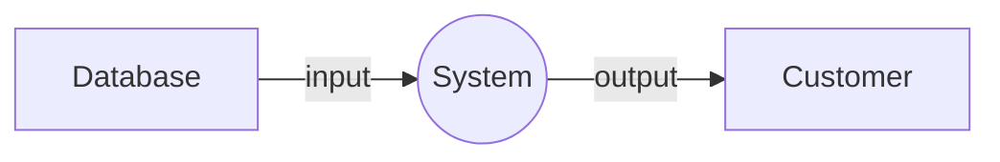
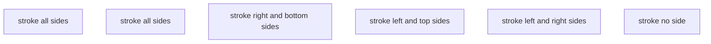

# dataflowchart

## Example 1

**SebastianJS (SVG):**

> Render failed: TypeError: DOMPurify.sanitize is not a function

**Mermaid Code (Browser Rendered):**

## Example 2

**SebastianJS (SVG):**

> Render failed: TypeError: DOMPurify.sanitize is not a function

**Mermaid Code (Browser Rendered):**

