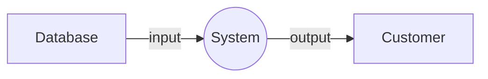
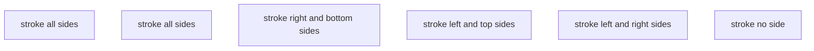

# dataflowchart

## Example 1

**SebastianJS (SVG):**

<svg id="graph" xmlns="http://www.w3.org/2000/svg" xmlns:xlink="http://www.w3.org/1999/xlink" class="flowchart" style="max-width: 27522px;" viewBox="-58 -11 370 62" role="graphics-document document" aria-roledescription="flowchart-v2" aria-describedby="chart-desc-graph" aria-labelledby="chart-title-graph"><title id="chart-title-graph">A simple linear flowchart.</title><desc id="chart-desc-graph">A Database has input to a circle System has output to a square Customer.</desc><g><marker id="graph_flowchart-v2-pointEnd" class="marker flowchart-v2" viewBox="0 0 10 10" refX="5" refY="5" markerUnits="userSpaceOnUse" markerWidth="8" markerHeight="8" orient="auto"><path d="M 0 0 L 10 5 L 0 10 z" class="arrowMarkerPath" style="stroke-width: 1; stroke-dasharray: 1,0;"/></marker><marker id="graph_flowchart-v2-pointStart" class="marker flowchart-v2" viewBox="0 0 10 10" refX="4.5" refY="5" markerUnits="userSpaceOnUse" markerWidth="8" markerHeight="8" orient="auto"><path d="M 0 5 L 10 10 L 10 0 z" class="arrowMarkerPath" style="stroke-width: 1; stroke-dasharray: 1,0;"/></marker><marker id="graph_flowchart-v2-circleEnd" class="marker flowchart-v2" viewBox="0 0 10 10" refX="11" refY="5" markerUnits="userSpaceOnUse" markerWidth="11" markerHeight="11" orient="auto"><circle cx="5" cy="5" r="5" class="arrowMarkerPath" style="stroke-width: 1; stroke-dasharray: 1,0;"/></marker><marker id="graph_flowchart-v2-circleStart" class="marker flowchart-v2" viewBox="0 0 10 10" refX="-1" refY="5" markerUnits="userSpaceOnUse" markerWidth="11" markerHeight="11" orient="auto"><circle cx="5" cy="5" r="5" class="arrowMarkerPath" style="stroke-width: 1; stroke-dasharray: 1,0;"/></marker><marker id="graph_flowchart-v2-crossEnd" class="marker cross flowchart-v2" viewBox="0 0 11 11" refX="12" refY="5.2" markerUnits="userSpaceOnUse" markerWidth="11" markerHeight="11" orient="auto"><path d="M 1,1 l 9,9 M 10,1 l -9,9" class="arrowMarkerPath" style="stroke-width: 2; stroke-dasharray: 1,0;"/></marker><marker id="graph_flowchart-v2-crossStart" class="marker cross flowchart-v2" viewBox="0 0 11 11" refX="-1" refY="5.2" markerUnits="userSpaceOnUse" markerWidth="11" markerHeight="11" orient="auto"><path d="M 1,1 l 9,9 M 10,1 l -9,9" class="arrowMarkerPath" style="stroke-width: 2; stroke-dasharray: 1,0;"/></marker><g class="root"><g class="clusters"/><g class="edgePaths"><path d="M18,20L26.333,20C34.667,20,51.333,20,62.083,20C72.833,20,77.667,20,80.083,20L82.5,20" id="L_DataStore_Process_0" class=" edge-thickness-normal edge-pattern-solid edge-thickness-normal edge-pattern-solid flowchart-link" style="" marker-end="url(#graph_flowchart-v2-pointEnd)"/><path d="M159.5,20L163.25,20C167,20,174.5,20,186.583,20C198.667,20,215.333,20,223.667,20L232,20" id="L_Process_Entity_0" class=" edge-thickness-normal edge-pattern-solid edge-thickness-normal edge-pattern-solid flowchart-link" style="" marker-end="url(#graph_flowchart-v2-pointEnd)"/></g><g class="edgeLabels"><g class="edgeLabel" transform="translate(68, 20)"><g class="label" transform="translate(-25, -12)"><g><rect class="background" style="" x="-2" y="-2" width="54" height="28"/><text y="-10.1" style=""><tspan class="text-outer-tspan" x="0" y="-0.1em" dy="1.1em"><tspan font-style="normal" class="text-inner-tspan" font-weight="normal">input</tspan></tspan></text></g></g></g><g class="edgeLabel" transform="translate(182, 20)"><g class="label" transform="translate(-29, -12)"><g><rect class="background" style="" x="-2" y="-2" width="62" height="28"/><text y="-10.1" style=""><tspan class="text-outer-tspan" x="0" y="-0.1em" dy="1.1em"><tspan font-style="normal" class="text-inner-tspan" font-weight="normal">output</tspan></tspan></text></g></g></g></g><g class="nodes"><g class="node default  " id="flowchart-DataStore-0" transform="translate(13, 20)"><rect class="basic label-container" style="" x="-67" y="-27" width="134" height="54"/><g class="label" style="" transform="translate(0, -12)"><rect/><g><rect class="background" style="stroke: none"/><text y="-10.1" style=""><tspan class="text-outer-tspan" x="0" y="-0.1em" dy="1.1em"><tspan font-style="normal" class="text-inner-tspan" font-weight="normal">Database</tspan></tspan></text></g></g></g><g class="node default  " id="flowchart-Process-1" transform="translate(123, 20)"><circle class="basic label-container" style="" r="36.5" cx="0" cy="0"/><g class="label" style="" transform="translate(0, -12)"><rect/><g><rect class="background" style="stroke: none"/><text y="-10.1" style=""><tspan class="text-outer-tspan" x="0" y="-0.1em" dy="1.1em"><tspan font-style="normal" class="text-inner-tspan" font-weight="normal">System</tspan></tspan></text></g></g></g><g class="node default  " id="flowchart-Entity-2" transform="translate(241, 20)"><rect class="basic label-container" style="" x="-67" y="-27" width="134" height="54"/><g class="label" style="" transform="translate(0, -12)"><rect/><g><rect class="background" style="stroke: none"/><text y="-10.1" style=""><tspan class="text-outer-tspan" x="0" y="-0.1em" dy="1.1em"><tspan font-style="normal" class="text-inner-tspan" font-weight="normal">Customer</tspan></tspan></text></g></g></g></g></g></g></svg>

**Mermaid Code (Browser Rendered):**

## Example 2

**SebastianJS (SVG):**

<svg id="graph" xmlns="http://www.w3.org/2000/svg" xmlns:xlink="http://www.w3.org/1999/xlink" class="flowchart" style="max-width: 28258px;" viewBox="-90 -11 498 62" role="graphics-document document" aria-roledescription="flowchart-v2"><g><marker id="graph_flowchart-v2-pointEnd" class="marker flowchart-v2" viewBox="0 0 10 10" refX="5" refY="5" markerUnits="userSpaceOnUse" markerWidth="8" markerHeight="8" orient="auto"><path d="M 0 0 L 10 5 L 0 10 z" class="arrowMarkerPath" style="stroke-width: 1; stroke-dasharray: 1,0;"/></marker><marker id="graph_flowchart-v2-pointStart" class="marker flowchart-v2" viewBox="0 0 10 10" refX="4.5" refY="5" markerUnits="userSpaceOnUse" markerWidth="8" markerHeight="8" orient="auto"><path d="M 0 5 L 10 10 L 10 0 z" class="arrowMarkerPath" style="stroke-width: 1; stroke-dasharray: 1,0;"/></marker><marker id="graph_flowchart-v2-circleEnd" class="marker flowchart-v2" viewBox="0 0 10 10" refX="11" refY="5" markerUnits="userSpaceOnUse" markerWidth="11" markerHeight="11" orient="auto"><circle cx="5" cy="5" r="5" class="arrowMarkerPath" style="stroke-width: 1; stroke-dasharray: 1,0;"/></marker><marker id="graph_flowchart-v2-circleStart" class="marker flowchart-v2" viewBox="0 0 10 10" refX="-1" refY="5" markerUnits="userSpaceOnUse" markerWidth="11" markerHeight="11" orient="auto"><circle cx="5" cy="5" r="5" class="arrowMarkerPath" style="stroke-width: 1; stroke-dasharray: 1,0;"/></marker><marker id="graph_flowchart-v2-crossEnd" class="marker cross flowchart-v2" viewBox="0 0 11 11" refX="12" refY="5.2" markerUnits="userSpaceOnUse" markerWidth="11" markerHeight="11" orient="auto"><path d="M 1,1 l 9,9 M 10,1 l -9,9" class="arrowMarkerPath" style="stroke-width: 2; stroke-dasharray: 1,0;"/></marker><marker id="graph_flowchart-v2-crossStart" class="marker cross flowchart-v2" viewBox="0 0 11 11" refX="-1" refY="5.2" markerUnits="userSpaceOnUse" markerWidth="11" markerHeight="11" orient="auto"><path d="M 1,1 l 9,9 M 10,1 l -9,9" class="arrowMarkerPath" style="stroke-width: 2; stroke-dasharray: 1,0;"/></marker><g class="root"><g class="clusters"/><g class="edgePaths"/><g class="edgeLabels"/><g class="nodes"><g class="node default  " id="flowchart-allSides-0" transform="translate(13, 20)"><rect class="basic label-container" style="" x="-99" y="-27" width="198" height="54"/><g class="label" style="" transform="translate(0, -12)"><rect/><g><rect class="background" style="stroke: none"/><text y="-10.1" style=""><tspan class="text-outer-tspan" x="0" y="-0.1em" dy="1.1em"><tspan font-style="normal" class="text-inner-tspan" font-weight="normal">stroke</tspan><tspan font-style="normal" class="text-inner-tspan" font-weight="normal"> all</tspan><tspan font-style="normal" class="text-inner-tspan" font-weight="normal"> sides</tspan></tspan></text></g></g></g><g class="node default  " id="flowchart-allSides2-1" transform="translate(73, 20)"><rect class="basic label-container" style="" x="-99" y="-27" width="198" height="54"/><g class="label" style="" transform="translate(0, -12)"><rect/><g><rect class="background" style="stroke: none"/><text y="-10.1" style=""><tspan class="text-outer-tspan" x="0" y="-0.1em" dy="1.1em"><tspan font-style="normal" class="text-inner-tspan" font-weight="normal">stroke</tspan><tspan font-style="normal" class="text-inner-tspan" font-weight="normal"> all</tspan><tspan font-style="normal" class="text-inner-tspan" font-weight="normal"> sides</tspan></tspan></text></g></g></g><g class="node default  " id="flowchart-rbSides-2" transform="translate(133, 20)"><rect class="basic label-container" style="" x="-147" y="-27" width="294" height="54"/><g class="label" style="" transform="translate(0, -12)"><rect/><g><rect class="background" style="stroke: none"/><text y="-10.1" style=""><tspan class="text-outer-tspan" x="0" y="-0.1em" dy="1.1em"><tspan font-style="normal" class="text-inner-tspan" font-weight="normal">stroke</tspan><tspan font-style="normal" class="text-inner-tspan" font-weight="normal"> right</tspan><tspan font-style="normal" class="text-inner-tspan" font-weight="normal"> and</tspan><tspan font-style="normal" class="text-inner-tspan" font-weight="normal"> bottom</tspan></tspan><tspan class="text-outer-tspan" x="0" y="1em" dy="1.1em"><tspan font-style="normal" class="text-inner-tspan" font-weight="normal">sides</tspan></tspan></text></g></g></g><g class="node default  " id="flowchart-ltSides-3" transform="translate(193, 20)"><rect class="basic label-container" style="" x="-135" y="-27" width="270" height="54"/><g class="label" style="" transform="translate(0, -12)"><rect/><g><rect class="background" style="stroke: none"/><text y="-10.1" style=""><tspan class="text-outer-tspan" x="0" y="-0.1em" dy="1.1em"><tspan font-style="normal" class="text-inner-tspan" font-weight="normal">stroke</tspan><tspan font-style="normal" class="text-inner-tspan" font-weight="normal"> left</tspan><tspan font-style="normal" class="text-inner-tspan" font-weight="normal"> and</tspan><tspan font-style="normal" class="text-inner-tspan" font-weight="normal"> top</tspan><tspan font-style="normal" class="text-inner-tspan" font-weight="normal"> sides</tspan></tspan></text></g></g></g><g class="node default  " id="flowchart-lrSides-4" transform="translate(253, 20)"><rect class="basic label-container" style="" x="-139" y="-27" width="278" height="54"/><g class="label" style="" transform="translate(0, -12)"><rect/><g><rect class="background" style="stroke: none"/><text y="-10.1" style=""><tspan class="text-outer-tspan" x="0" y="-0.1em" dy="1.1em"><tspan font-style="normal" class="text-inner-tspan" font-weight="normal">stroke</tspan><tspan font-style="normal" class="text-inner-tspan" font-weight="normal"> left</tspan><tspan font-style="normal" class="text-inner-tspan" font-weight="normal"> and</tspan><tspan font-style="normal" class="text-inner-tspan" font-weight="normal"> right</tspan></tspan><tspan class="text-outer-tspan" x="0" y="1em" dy="1.1em"><tspan font-style="normal" class="text-inner-tspan" font-weight="normal">sides</tspan></tspan></text></g></g></g><g class="node default  " id="flowchart-noSide-5" transform="translate(313, 20)"><rect class="basic label-container" style="" x="-91" y="-27" width="182" height="54"/><g class="label" style="" transform="translate(0, -12)"><rect/><g><rect class="background" style="stroke: none"/><text y="-10.1" style=""><tspan class="text-outer-tspan" x="0" y="-0.1em" dy="1.1em"><tspan font-style="normal" class="text-inner-tspan" font-weight="normal">stroke</tspan><tspan font-style="normal" class="text-inner-tspan" font-weight="normal"> no</tspan><tspan font-style="normal" class="text-inner-tspan" font-weight="normal"> side</tspan></tspan></text></g></g></g></g></g></g></svg>

**Mermaid Code (Browser Rendered):**

