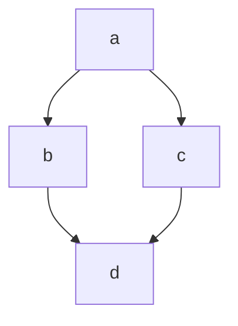

# example

## Example 1

**SebastianJS (SVG):**

<svg id="graph" xmlns="http://www.w3.org/2000/svg" xmlns:xlink="http://www.w3.org/1999/xlink" class="flowchart" style="max-width: 27290px;" viewBox="-30 -11 146 258" role="graphics-document document" aria-roledescription="flowchart-v2"><style>#graph{font-family:"trebuchet ms",verdana,arial,sans-serif;font-size:16px;fill:#333;}@keyframes edge-animation-frame{from{stroke-dashoffset:0;}}@keyframes dash{to{stroke-dashoffset:0;}}#graph .edge-animation-slow{stroke-dasharray:9,5!important;stroke-dashoffset:900;animation:dash 50s linear infinite;stroke-linecap:round;}#graph .edge-animation-fast{stroke-dasharray:9,5!important;stroke-dashoffset:900;animation:dash 20s linear infinite;stroke-linecap:round;}#graph .error-icon{fill:#552222;}#graph .error-text{fill:#552222;stroke:#552222;}#graph .edge-thickness-normal{stroke-width:1px;}#graph .edge-thickness-thick{stroke-width:3.5px;}#graph .edge-pattern-solid{stroke-dasharray:0;}#graph .edge-thickness-invisible{stroke-width:0;fill:none;}#graph .edge-pattern-dashed{stroke-dasharray:3;}#graph .edge-pattern-dotted{stroke-dasharray:2;}#graph .marker{fill:#333333;stroke:#333333;}#graph .marker.cross{stroke:#333333;}#graph svg{font-family:"trebuchet ms",verdana,arial,sans-serif;font-size:16px;}#graph p{margin:0;}#graph .label{font-family:"trebuchet ms",verdana,arial,sans-serif;color:#333;}#graph .cluster-label text{fill:#333;}#graph .cluster-label span{color:#333;}#graph .cluster-label span p{background-color:transparent;}#graph .label text,#graph span{fill:#333;color:#333;}#graph .node rect,#graph .node circle,#graph .node ellipse,#graph .node polygon,#graph .node path{fill:#ECECFF;stroke:#9370DB;stroke-width:1px;}#graph .rough-node .label text,#graph .node .label text,#graph .image-shape .label,#graph .icon-shape .label{text-anchor:middle;}#graph .node .katex path{fill:#000;stroke:#000;stroke-width:1px;}#graph .rough-node .label,#graph .node .label,#graph .image-shape .label,#graph .icon-shape .label{text-align:center;}#graph .node.clickable{cursor:pointer;}#graph .root .anchor path{fill:#333333!important;stroke-width:0;stroke:#333333;}#graph .arrowheadPath{fill:#333333;}#graph .edgePath .path{stroke:#333333;stroke-width:2.0px;}#graph .flowchart-link{stroke:#333333;fill:none;}#graph .edgeLabel{background-color:rgba(232,232,232, 0.8);text-align:center;}#graph .edgeLabel p{background-color:rgba(232,232,232, 0.8);}#graph .edgeLabel rect{opacity:0.5;background-color:rgba(232,232,232, 0.8);fill:rgba(232,232,232, 0.8);}#graph .labelBkg{background-color:rgba(232, 232, 232, 0.5);}#graph .cluster rect{fill:#ffffde;stroke:#aaaa33;stroke-width:1px;}#graph .cluster text{fill:#333;}#graph .cluster span{color:#333;}#graph div.mermaidTooltip{position:absolute;text-align:center;max-width:200px;padding:2px;font-family:"trebuchet ms",verdana,arial,sans-serif;font-size:12px;background:hsl(80, 100%, 96.2745098039%);border:1px solid #aaaa33;border-radius:2px;pointer-events:none;z-index:100;}#graph .flowchartTitleText{text-anchor:middle;font-size:18px;fill:#333;}#graph rect.text{fill:none;stroke-width:0;}#graph .icon-shape,#graph .image-shape{background-color:rgba(232,232,232, 0.8);text-align:center;}#graph .icon-shape p,#graph .image-shape p{background-color:rgba(232,232,232, 0.8);padding:2px;}#graph .icon-shape rect,#graph .image-shape rect{opacity:0.5;background-color:rgba(232,232,232, 0.8);fill:rgba(232,232,232, 0.8);}#graph .label-icon{display:inline-block;height:1em;overflow:visible;vertical-align:-0.125em;}#graph .node .label-icon path{fill:currentColor;stroke:revert;stroke-width:revert;}#graph :root{--mermaid-font-family:"trebuchet ms",verdana,arial,sans-serif;}</style><g><marker id="graph_flowchart-v2-pointEnd" class="marker flowchart-v2" viewBox="0 0 10 10" refX="5" refY="5" markerUnits="userSpaceOnUse" markerWidth="8" markerHeight="8" orient="auto"><path d="M 0 0 L 10 5 L 0 10 z" class="arrowMarkerPath" style="stroke-width: 1; stroke-dasharray: 1,0;"/></marker><marker id="graph_flowchart-v2-pointStart" class="marker flowchart-v2" viewBox="0 0 10 10" refX="4.5" refY="5" markerUnits="userSpaceOnUse" markerWidth="8" markerHeight="8" orient="auto"><path d="M 0 5 L 10 10 L 10 0 z" class="arrowMarkerPath" style="stroke-width: 1; stroke-dasharray: 1,0;"/></marker><marker id="graph_flowchart-v2-circleEnd" class="marker flowchart-v2" viewBox="0 0 10 10" refX="11" refY="5" markerUnits="userSpaceOnUse" markerWidth="11" markerHeight="11" orient="auto"><circle cx="5" cy="5" r="5" class="arrowMarkerPath" style="stroke-width: 1; stroke-dasharray: 1,0;"/></marker><marker id="graph_flowchart-v2-circleStart" class="marker flowchart-v2" viewBox="0 0 10 10" refX="-1" refY="5" markerUnits="userSpaceOnUse" markerWidth="11" markerHeight="11" orient="auto"><circle cx="5" cy="5" r="5" class="arrowMarkerPath" style="stroke-width: 1; stroke-dasharray: 1,0;"/></marker><marker id="graph_flowchart-v2-crossEnd" class="marker cross flowchart-v2" viewBox="0 0 11 11" refX="12" refY="5.2" markerUnits="userSpaceOnUse" markerWidth="11" markerHeight="11" orient="auto"><path d="M 1,1 l 9,9 M 10,1 l -9,9" class="arrowMarkerPath" style="stroke-width: 2; stroke-dasharray: 1,0;"/></marker><marker id="graph_flowchart-v2-crossStart" class="marker cross flowchart-v2" viewBox="0 0 11 11" refX="-1" refY="5.2" markerUnits="userSpaceOnUse" markerWidth="11" markerHeight="11" orient="auto"><path d="M 1,1 l 9,9 M 10,1 l -9,9" class="arrowMarkerPath" style="stroke-width: 2; stroke-dasharray: 1,0;"/></marker><g class="root"><g class="clusters"/><g class="edgePaths"><path d="M38,28.167L33.833,34.972C29.667,41.778,21.333,55.389,17.167,67.694C13,80,13,91,13,96.5L13,102" id="L_a_b_0" class=" edge-thickness-normal edge-pattern-solid edge-thickness-normal edge-pattern-solid flowchart-link" style="" marker-end="url(#graph_flowchart-v2-pointEnd)"/><path d="M48,28.167L52.167,34.972C56.333,41.778,64.667,55.389,68.833,67.694C73,80,73,91,73,96.5L73,102" id="L_a_c_0" class=" edge-thickness-normal edge-pattern-solid edge-thickness-normal edge-pattern-solid flowchart-link" style="" marker-end="url(#graph_flowchart-v2-pointEnd)"/><path d="M13,130L13,136.167C13,142.333,13,154.667,16.819,167.07C20.637,179.474,28.274,191.948,32.093,198.185L35.911,204.422" id="L_b_d_0" class=" edge-thickness-normal edge-pattern-solid edge-thickness-normal edge-pattern-solid flowchart-link" style="" marker-end="url(#graph_flowchart-v2-pointEnd)"/><path d="M73,130L73,136.167C73,142.333,73,154.667,69.181,167.07C65.363,179.474,57.726,191.948,53.907,198.185L50.089,204.422" id="L_c_d_0" class=" edge-thickness-normal edge-pattern-solid edge-thickness-normal edge-pattern-solid flowchart-link" style="" marker-end="url(#graph_flowchart-v2-pointEnd)"/></g><g class="edgeLabels"><g><rect class="background" style="stroke: none"/></g><g><rect class="background" style="stroke: none"/></g><g><rect class="background" style="stroke: none"/></g><g><rect class="background" style="stroke: none"/></g><g class="edgeLabel"><g class="label" transform="translate(-5, -12)"><text y="-10.1"><tspan class="text-outer-tspan" x="0" y="-0.1em" dy="1.1em"/></text></g></g><g class="edgeLabel"><g class="label" transform="translate(-5, -12)"><text y="-10.1"><tspan class="text-outer-tspan" x="0" y="-0.1em" dy="1.1em"/></text></g></g><g class="edgeLabel"><g class="label" transform="translate(-5, -12)"><text y="-10.1"><tspan class="text-outer-tspan" x="0" y="-0.1em" dy="1.1em"/></text></g></g><g class="edgeLabel"><g class="label" transform="translate(-5, -12)"><text y="-10.1"><tspan class="text-outer-tspan" x="0" y="-0.1em" dy="1.1em"/></text></g></g></g><g class="nodes"><g class="node default  " id="flowchart-a-0" transform="translate(43, 20)"><rect class="basic label-container" style="" x="-39" y="-27" width="78" height="54"/><g class="label" style="" transform="translate(0, -12)"><rect/><g><rect class="background" style="stroke: none"/><text y="-10.1" style=""><tspan class="text-outer-tspan" x="0" y="-0.1em" dy="1.1em"><tspan font-style="normal" class="text-inner-tspan" font-weight="normal">a</tspan></tspan></text></g></g></g><g class="node default  " id="flowchart-b-1" transform="translate(13, 118)"><rect class="basic label-container" style="" x="-39" y="-27" width="78" height="54"/><g class="label" style="" transform="translate(0, -12)"><rect/><g><rect class="background" style="stroke: none"/><text y="-10.1" style=""><tspan class="text-outer-tspan" x="0" y="-0.1em" dy="1.1em"><tspan font-style="normal" class="text-inner-tspan" font-weight="normal">b</tspan></tspan></text></g></g></g><g class="node default  " id="flowchart-c-3" transform="translate(73, 118)"><rect class="basic label-container" style="" x="-39" y="-27" width="78" height="54"/><g class="label" style="" transform="translate(0, -12)"><rect/><g><rect class="background" style="stroke: none"/><text y="-10.1" style=""><tspan class="text-outer-tspan" x="0" y="-0.1em" dy="1.1em"><tspan font-style="normal" class="text-inner-tspan" font-weight="normal">c</tspan></tspan></text></g></g></g><g class="node default  " id="flowchart-d-5" transform="translate(43, 216)"><rect class="basic label-container" style="" x="-39" y="-27" width="78" height="54"/><g class="label" style="" transform="translate(0, -12)"><rect/><g><rect class="background" style="stroke: none"/><text y="-10.1" style=""><tspan class="text-outer-tspan" x="0" y="-0.1em" dy="1.1em"><tspan font-style="normal" class="text-inner-tspan" font-weight="normal">d</tspan></tspan></text></g></g></g></g></g></g></svg>

**Mermaid Code (Browser Rendered):**



## Example 2

**SebastianJS (SVG):**

<svg id="graph" width="100%" xmlns="http://www.w3.org/2000/svg" xmlns:xlink="http://www.w3.org/1999/xlink" style="max-width: 400px;" role="graphics-document document" aria-roledescription="info"><style>#graph{font-family:"trebuchet ms",verdana,arial,sans-serif;font-size:16px;fill:#333;}@keyframes edge-animation-frame{from{stroke-dashoffset:0;}}@keyframes dash{to{stroke-dashoffset:0;}}#graph .edge-animation-slow{stroke-dasharray:9,5!important;stroke-dashoffset:900;animation:dash 50s linear infinite;stroke-linecap:round;}#graph .edge-animation-fast{stroke-dasharray:9,5!important;stroke-dashoffset:900;animation:dash 20s linear infinite;stroke-linecap:round;}#graph .error-icon{fill:#552222;}#graph .error-text{fill:#552222;stroke:#552222;}#graph .edge-thickness-normal{stroke-width:1px;}#graph .edge-thickness-thick{stroke-width:3.5px;}#graph .edge-pattern-solid{stroke-dasharray:0;}#graph .edge-thickness-invisible{stroke-width:0;fill:none;}#graph .edge-pattern-dashed{stroke-dasharray:3;}#graph .edge-pattern-dotted{stroke-dasharray:2;}#graph .marker{fill:#333333;stroke:#333333;}#graph .marker.cross{stroke:#333333;}#graph svg{font-family:"trebuchet ms",verdana,arial,sans-serif;font-size:16px;}#graph p{margin:0;}#graph :root{--mermaid-font-family:"trebuchet ms",verdana,arial,sans-serif;}</style><g></g><g><text x="100" y="40" class="version" font-size="32" style="text-anchor: middle;">v11.10.1</text></g></svg>

**Mermaid Code (Browser Rendered):**

```mermaid
info
```

