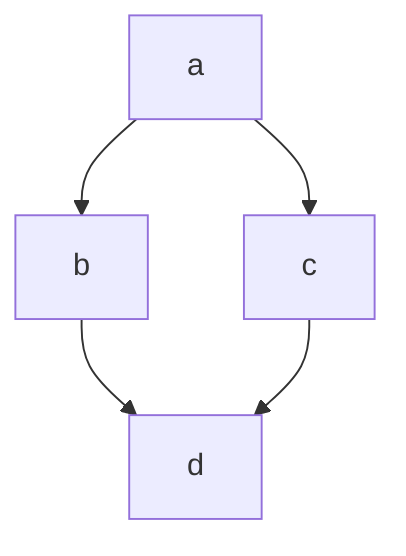

# example

## Example 1

**SebastianJS (SVG):**

> Render failed: TypeError: DOMPurify.sanitize is not a function

**Mermaid Code (Browser Rendered):**



## Example 2

**SebastianJS (SVG):**

<svg id="graph" width="100%" xmlns="http://www.w3.org/2000/svg" xmlns:xlink="http://www.w3.org/1999/xlink" style="max-width: 400px;" role="graphics-document document" aria-roledescription="info"><style>#graph{font-family:"trebuchet ms",verdana,arial,sans-serif;font-size:16px;fill:#333;}@keyframes edge-animation-frame{from{stroke-dashoffset:0;}}@keyframes dash{to{stroke-dashoffset:0;}}#graph .edge-animation-slow{stroke-dasharray:9,5!important;stroke-dashoffset:900;animation:dash 50s linear infinite;stroke-linecap:round;}#graph .edge-animation-fast{stroke-dasharray:9,5!important;stroke-dashoffset:900;animation:dash 20s linear infinite;stroke-linecap:round;}#graph .error-icon{fill:#552222;}#graph .error-text{fill:#552222;stroke:#552222;}#graph .edge-thickness-normal{stroke-width:1px;}#graph .edge-thickness-thick{stroke-width:3.5px;}#graph .edge-pattern-solid{stroke-dasharray:0;}#graph .edge-thickness-invisible{stroke-width:0;fill:none;}#graph .edge-pattern-dashed{stroke-dasharray:3;}#graph .edge-pattern-dotted{stroke-dasharray:2;}#graph .marker{fill:#333333;stroke:#333333;}#graph .marker.cross{stroke:#333333;}#graph svg{font-family:"trebuchet ms",verdana,arial,sans-serif;font-size:16px;}#graph p{margin:0;}#graph :root{--mermaid-font-family:"trebuchet ms",verdana,arial,sans-serif;}</style><g></g><g><text x="100" y="40" class="version" font-size="32" style="text-anchor: middle;">v11.10.1</text></g></svg>

**Mermaid Code (Browser Rendered):**

```mermaid
info
```

