```mermaid
erDiagram
                  _**testẽζ➕Ø😀㌕ぼ**_ {
                    *__List~List~int~~sdfds__* **driversLicense** PK "***The l😀icense #***"
                    string last*Name*
                    string __phone__ UK
                    *string(99)~T~~~~~~* firstName "Only __99__ characters are allowed dsfsdfsdfsdfs"
                  int _age_
                  }
```

# er-multiline

## Example 1

**SebastianJS (SVG):**

> Render failed: TypeError: DOMPurify.sanitize is not a function

**Mermaid Code (Browser Rendered):**

## Example 2

**SebastianJS (SVG):**

<svg id="graph" xmlns="http://www.w3.org/2000/svg" xmlns:xlink="http://www.w3.org/1999/xlink" class="erDiagram" style="max-width: 16138px;" viewBox="-681 -103 645 222" role="graphics-document document" aria-roledescription="er"><g><defs><marker id="graph_er-onlyOneStart" class="marker onlyOne er" refX="0" refY="9" markerWidth="18" markerHeight="18" orient="auto"><path d="M9,0 L9,18 M15,0 L15,18"/></marker></defs><defs><marker id="graph_er-onlyOneEnd" class="marker onlyOne er" refX="18" refY="9" markerWidth="18" markerHeight="18" orient="auto"><path d="M3,0 L3,18 M9,0 L9,18"/></marker></defs><defs><marker id="graph_er-zeroOrOneStart" class="marker zeroOrOne er" refX="0" refY="9" markerWidth="30" markerHeight="18" orient="auto"><circle fill="white" cx="21" cy="9" r="6"/><path d="M9,0 L9,18"/></marker></defs><defs><marker id="graph_er-zeroOrOneEnd" class="marker zeroOrOne er" refX="30" refY="9" markerWidth="30" markerHeight="18" orient="auto"><circle fill="white" cx="9" cy="9" r="6"/><path d="M21,0 L21,18"/></marker></defs><defs><marker id="graph_er-oneOrMoreStart" class="marker oneOrMore er" refX="18" refY="18" markerWidth="45" markerHeight="36" orient="auto"><path d="M0,18 Q 18,0 36,18 Q 18,36 0,18 M42,9 L42,27"/></marker></defs><defs><marker id="graph_er-oneOrMoreEnd" class="marker oneOrMore er" refX="27" refY="18" markerWidth="45" markerHeight="36" orient="auto"><path d="M3,9 L3,27 M9,18 Q27,0 45,18 Q27,36 9,18"/></marker></defs><defs><marker id="graph_er-zeroOrMoreStart" class="marker zeroOrMore er" refX="18" refY="18" markerWidth="57" markerHeight="36" orient="auto"><circle fill="white" cx="48" cy="18" r="6"/><path d="M0,18 Q18,0 36,18 Q18,36 0,18"/></marker></defs><defs><marker id="graph_er-zeroOrMoreEnd" class="marker zeroOrMore er" refX="39" refY="18" markerWidth="57" markerHeight="36" orient="auto"><circle fill="white" cx="9" cy="18" r="6"/><path d="M21,18 Q39,0 57,18 Q39,36 21,18"/></marker></defs><g class="root"><g class="clusters"/><g class="edgePaths"/><g class="edgeLabels"/><g class="nodes"><g class="node default " id="entity-_**testẽζ➕Ø😀㌕ぼ**_-0" transform="translate(13, 20)"><g style=""><path d="M-702 -128.25 L702 -128.25 L702 128.25 L-702 128.25" stroke="none" stroke-width="0" fill="#ECECFF"/><path d="M-702 -128.25 C-204.9478680775419 -128.25, 292.1042638449162 -128.25, 702 -128.25 M-702 -128.25 C-378.82154093684966 -128.25, -55.643081873699316 -128.25, 702 -128.25 M702 -128.25 C702 -45.63708744683251, 702 36.97582510633498, 702 128.25 M702 -128.25 C702 -47.50442294471766, 702 33.24115411056468, 702 128.25 M702 128.25 C147.29969572052232 128.25, -407.40060855895535 128.25, -702 128.25 M702 128.25 C305.0125920115518 128.25, -91.97481597689637 128.25, -702 128.25 M-702 128.25 C-702 50.51311199294297, -702 -27.223776014114065, -702 -128.25 M-702 128.25 C-702 45.51147051060411, -702 -37.227058978791774, -702 -128.25" stroke="#9370DB" stroke-width="1.3" fill="none" stroke-dasharray="0 0"/></g><g style="" class="row-rect-odd"><path d="M-702 -85.5 L702 -85.5 L702 -42.75 L-702 -42.75" stroke="none" stroke-width="0" fill="hsl(240, 100%, 100%)"/><path d="M-702 -85.5 C-318.23593571603965 -85.5, 65.5281285679207 -85.5, 702 -85.5 M-702 -85.5 C-177.73833102637582 -85.5, 346.52333794724836 -85.5, 702 -85.5 M702 -85.5 C702 -72.14077516966893, 702 -58.78155033933787, 702 -42.75 M702 -85.5 C702 -75.03433292085937, 702 -64.56866584171874, 702 -42.75 M702 -42.75 C219.82788920255643 -42.75, -262.34422159488713 -42.75, -702 -42.75 M702 -42.75 C341.1324053906716 -42.75, -19.735189218656842 -42.75, -702 -42.75 M-702 -42.75 C-702 -55.86280750915993, -702 -68.97561501831986, -702 -85.5 M-702 -42.75 C-702 -52.35771363408948, -702 -61.96542726817896, -702 -85.5" stroke="#9370DB" stroke-width="1.3" fill="none" stroke-dasharray="0 0"/></g><g style="" class="row-rect-even"><path d="M-702 -42.75 L702 -42.75 L702 0 L-702 0" stroke="none" stroke-width="0" fill="hsl(240, 100%, 97.2745098039%)"/><path d="M-702 -42.75 C-141.4383856930018 -42.75, 419.1232286139964 -42.75, 702 -42.75 M-702 -42.75 C-213.22011666199734 -42.75, 275.5597666760053 -42.75, 702 -42.75 M702 -42.75 C702 -29.200065229614893, 702 -15.650130459229786, 702 0 M702 -42.75 C702 -28.062987326739822, 702 -13.375974653479645, 702 0 M702 0 C172.25369787502234 0, -357.4926042499553 0, -702 0 M702 0 C395.1079355772351 0, 88.21587115447016 0, -702 0 M-702 0 C-702 -12.93829361999793, -702 -25.87658723999586, -702 -42.75 M-702 0 C-702 -12.04210493544129, -702 -24.08420987088258, -702 -42.75" stroke="#9370DB" stroke-width="1.3" fill="none" stroke-dasharray="0 0"/></g><g style="" class="row-rect-odd"><path d="M-702 0 L702 0 L702 42.75 L-702 42.75" stroke="none" stroke-width="0" fill="hsl(240, 100%, 100%)"/><path d="M-702 0 C-183.9264428501158 0, 334.1471142997684 0, 702 0 M-702 0 C-214.79333056699903 0, 272.41333886600194 0, 702 0 M702 0 C702 10.214469531953565, 702 20.42893906390713, 702 42.75 M702 0 C702 15.263319907337346, 702 30.52663981467469, 702 42.75 M702 42.75 C227.52271132594927 42.75, -246.95457734810145 42.75, -702 42.75 M702 42.75 C245.38665478591975 42.75, -211.2266904281605 42.75, -702 42.75 M-702 42.75 C-702 26.129497133028135, -702 9.50899426605627, -702 0 M-702 42.75 C-702 25.71718028585834, -702 8.684360571716681, -702 0" stroke="#9370DB" stroke-width="1.3" fill="none" stroke-dasharray="0 0"/></g><g style="" class="row-rect-even"><path d="M-702 42.75 L702 42.75 L702 85.5 L-702 85.5" stroke="none" stroke-width="0" fill="hsl(240, 100%, 97.2745098039%)"/><path d="M-702 42.75 C-418.3441312658324 42.75, -134.6882625316648 42.75, 702 42.75 M-702 42.75 C-420.7861477467154 42.75, -139.57229549343083 42.75, 702 42.75 M702 42.75 C702 58.17624071270118, 702 73.60248142540236, 702 85.5 M702 42.75 C702 59.29517414006408, 702 75.84034828012815, 702 85.5 M702 85.5 C415.3918832727291 85.5, 128.7837665454582 85.5, -702 85.5 M702 85.5 C393.23830460854134 85.5, 84.47660921708268 85.5, -702 85.5 M-702 85.5 C-702 71.84169858067006, -702 58.18339716134011, -702 42.75 M-702 85.5 C-702 72.8842209347019, -702 60.26844186940379, -702 42.75" stroke="#9370DB" stroke-width="1.3" fill="none" stroke-dasharray="0 0"/></g><g style="" class="row-rect-odd"><path d="M-702 85.5 L702 85.5 L702 128.25 L-702 128.25" stroke="none" stroke-width="0" fill="hsl(240, 100%, 100%)"/><path d="M-702 85.5 C-397.5214659506512 85.5, -93.04293190130238 85.5, 702 85.5 M-702 85.5 C-416.3164013582044 85.5, -130.63280271640883 85.5, 702 85.5 M702 85.5 C702 101.21910928542138, 702 116.93821857084276, 702 128.25 M702 85.5 C702 102.06819385575697, 702 118.63638771151395, 702 128.25 M702 128.25 C335.7702751888418 128.25, -30.459449622316356 128.25, -702 128.25 M702 128.25 C310.0689774690257 128.25, -81.8620450619486 128.25, -702 128.25 M-702 128.25 C-702 111.2029390899378, -702 94.1558781798756, -702 85.5 M-702 128.25 C-702 113.58615282621781, -702 98.92230565243563, -702 85.5" stroke="#9370DB" stroke-width="1.3" fill="none" stroke-dasharray="0 0"/></g><g class="label name" transform="translate(-53, -118.875)" style=""><g><rect class="background" style="stroke: none"/></g><text y="-10.1" style=""><tspan class="text-outer-tspan" x="0" y="-0.1em" dy="1.1em"><tspan font-style="normal" class="text-inner-tspan" font-weight="bold">testẽζ➕Ø😀㌕ぼ</tspan></tspan></text></g><g class="label attribute-type" transform="translate(-689.5, -76.125)" style=""><g><rect class="background" style="stroke: none"/></g><text y="-10.1" style=""><tspan class="text-outer-tspan" x="0" y="-0.1em" dy="1.1em">List&lt;List&lt;int&gt;&gt;sdfds</tspan></text></g><g class="label attribute-name" transform="translate(-494.5, -76.125)" style=""><g><rect class="background" style="stroke: none"/></g><text y="-10.1" style=""><tspan class="text-outer-tspan" x="0" y="-0.1em" dy="1.1em"><tspan font-style="normal" class="text-inner-tspan" font-weight="bold">driversLicense</tspan></tspan></text></g><g class="label attribute-keys" transform="translate(-347.5, -76.125)" style=""><g><rect class="background" style="stroke: none"/></g><text y="-10.1" style=""><tspan class="text-outer-tspan" x="0" y="-0.1em" dy="1.1em"><tspan font-style="normal" class="text-inner-tspan" font-weight="normal">PK</tspan></tspan></text></g><g class="label attribute-comment" transform="translate(-296.5, -76.125)" style=""><g><rect class="background" style="stroke: none"/></g><text y="-10.1" style=""><tspan class="text-outer-tspan" x="0" y="-0.1em" dy="1.1em"><tspan font-style="normal" class="text-inner-tspan" font-weight="bold">The</tspan><tspan font-style="normal" class="text-inner-tspan" font-weight="bold"> l😀icense</tspan><tspan font-style="normal" class="text-inner-tspan" font-weight="bold"> #</tspan></tspan></text></g><g class="label attribute-type" transform="translate(-689.5, -33.375)" style=""><g><rect class="background" style="stroke: none"/></g><text y="-10.1" style=""><tspan class="text-outer-tspan" x="0" y="-0.1em" dy="1.1em"><tspan font-style="normal" class="text-inner-tspan" font-weight="normal">string</tspan></tspan></text></g><g class="label attribute-name" transform="translate(-494.5, -33.375)" style=""><g><rect class="background" style="stroke: none"/></g><text y="-10.1" style=""><tspan class="text-outer-tspan" x="0" y="-0.1em" dy="1.1em"><tspan font-style="normal" class="text-inner-tspan" font-weight="normal">last</tspan><tspan font-style="italic" class="text-inner-tspan" font-weight="normal"> Name</tspan></tspan></text></g><g class="label attribute-keys" transform="translate(-347.5, -33.375)" style=""><g><rect class="background" style="stroke: none"/></g><text y="-10.1" style=""><tspan class="text-outer-tspan" x="0" y="-0.1em" dy="1.1em"/></text></g><g class="label attribute-comment" transform="translate(-296.5, -33.375)" style=""><g><rect class="background" style="stroke: none"/></g><text y="-10.1" style=""><tspan class="text-outer-tspan" x="0" y="-0.1em" dy="1.1em"/></text></g><g class="label attribute-type" transform="translate(-689.5, 9.375)" style=""><g><rect class="background" style="stroke: none"/></g><text y="-10.1" style=""><tspan class="text-outer-tspan" x="0" y="-0.1em" dy="1.1em"><tspan font-style="normal" class="text-inner-tspan" font-weight="normal">string</tspan></tspan></text></g><g class="label attribute-name" transform="translate(-494.5, 9.375)" style=""><g><rect class="background" style="stroke: none"/></g><text y="-10.1" style=""><tspan class="text-outer-tspan" x="0" y="-0.1em" dy="1.1em"><tspan font-style="normal" class="text-inner-tspan" font-weight="bold">phone</tspan></tspan></text></g><g class="label attribute-keys" transform="translate(-347.5, 9.375)" style=""><g><rect class="background" style="stroke: none"/></g><text y="-10.1" style=""><tspan class="text-outer-tspan" x="0" y="-0.1em" dy="1.1em"><tspan font-style="normal" class="text-inner-tspan" font-weight="normal">UK</tspan></tspan></text></g><g class="label attribute-comment" transform="translate(-296.5, 9.375)" style=""><g><rect class="background" style="stroke: none"/></g><text y="-10.1" style=""><tspan class="text-outer-tspan" x="0" y="-0.1em" dy="1.1em"/></text></g><g class="label attribute-type" transform="translate(-689.5, 52.125)" style=""><g><rect class="background" style="stroke: none"/></g><text y="-10.1" style=""><tspan class="text-outer-tspan" x="0" y="-0.1em" dy="1.1em">string(99)&lt;T&lt;&lt;~&gt;&gt;&gt;</tspan></text></g><g class="label attribute-name" transform="translate(-494.5, 52.125)" style=""><g><rect class="background" style="stroke: none"/></g><text y="-10.1" style=""><tspan class="text-outer-tspan" x="0" y="-0.1em" dy="1.1em"><tspan font-style="normal" class="text-inner-tspan" font-weight="normal">firstName</tspan></tspan></text></g><g class="label attribute-keys" transform="translate(-347.5, 52.125)" style=""><g><rect class="background" style="stroke: none"/></g><text y="-10.1" style=""><tspan class="text-outer-tspan" x="0" y="-0.1em" dy="1.1em"/></text></g><g class="label attribute-comment" transform="translate(-296.5, 52.125)" style=""><g><rect class="background" style="stroke: none"/></g><text y="-10.1" style=""><tspan class="text-outer-tspan" x="0" y="-0.1em" dy="1.1em"><tspan font-style="normal" class="text-inner-tspan" font-weight="normal">Only</tspan><tspan font-style="normal" class="text-inner-tspan" font-weight="bold"> 99</tspan><tspan font-style="normal" class="text-inner-tspan" font-weight="normal"> characters</tspan><tspan font-style="normal" class="text-inner-tspan" font-weight="normal"> are</tspan><tspan font-style="normal" class="text-inner-tspan" font-weight="normal"> allowed</tspan><tspan font-style="normal" class="text-inner-tspan" font-weight="normal"> dsfsdfsdfsdfs</tspan></tspan></text></g><g class="label attribute-type" transform="translate(-689.5, 94.875)" style=""><g><rect class="background" style="stroke: none"/></g><text y="-10.1" style=""><tspan class="text-outer-tspan" x="0" y="-0.1em" dy="1.1em"><tspan font-style="normal" class="text-inner-tspan" font-weight="normal">int</tspan></tspan></text></g><g class="label attribute-name" transform="translate(-494.5, 94.875)" style=""><g><rect class="background" style="stroke: none"/></g><text y="-10.1" style=""><tspan class="text-outer-tspan" x="0" y="-0.1em" dy="1.1em"><tspan font-style="italic" class="text-inner-tspan" font-weight="normal">age</tspan></tspan></text></g><g class="label attribute-keys" transform="translate(-347.5, 94.875)" style=""><g><rect class="background" style="stroke: none"/></g><text y="-10.1" style=""><tspan class="text-outer-tspan" x="0" y="-0.1em" dy="1.1em"/></text></g><g class="label attribute-comment" transform="translate(-296.5, 94.875)" style=""><g><rect class="background" style="stroke: none"/></g><text y="-10.1" style=""><tspan class="text-outer-tspan" x="0" y="-0.1em" dy="1.1em"/></text></g><g class="divider"><path d="M-702 -85.5 C-193.21706015275566 -85.5, 315.5658796944887 -85.5, 702 -85.5 M-702 -85.5 C-272.8931772181691 -85.5, 156.21364556366177 -85.5, 702 -85.5" stroke="#9370DB" stroke-width="1.3" fill="none" stroke-dasharray="0 0"/></g><g class="divider"><path d="M-507 -85.5 C-507 -33.6954295761033, -507 18.109140847793398, -507 128.25 M-507 -85.5 C-507 -28.665635970765663, -507 28.168728058468673, -507 128.25" stroke="#9370DB" stroke-width="1.3" fill="none" stroke-dasharray="0 0"/></g><g class="divider"><path d="M-360 -85.5 C-360 -29.155384663711324, -360 27.189230672577352, -360 128.25 M-360 -85.5 C-360 -0.022243561050970584, -360 85.45551287789806, -360 128.25" stroke="#9370DB" stroke-width="1.3" fill="none" stroke-dasharray="0 0"/></g><g class="divider"><path d="M-309 -85.5 C-309 -2.521781782587041, -309 80.45643643482592, -309 128.25 M-309 -85.5 C-309 -35.15973678947918, -309 15.180526421041634, -309 128.25" stroke="#9370DB" stroke-width="1.3" fill="none" stroke-dasharray="0 0"/></g><g class="divider"><path d="M-702 -85.5 C-278.2304669647422 -85.5, 145.53906607051556 -85.5, 702 -85.5 M-702 -85.5 C-336.4122694566963 -85.5, 29.175461086607356 -85.5, 702 -85.5" stroke="#9370DB" stroke-width="1.3" fill="none" stroke-dasharray="0 0"/></g></g></g></g></g></svg>

**Mermaid Code (Browser Rendered):**

