```mermaid
erDiagram
                  _**testẽζ➕Ø😀㌕ぼ**_ {
                    *__List~List~int~~sdfds__* **driversLicense** PK "***The l😀icense #***"
                    string last*Name*
                    string __phone__ UK
                    *string(99)~T~~~~~~* firstName "Only __99__ characters are allowed dsfsdfsdfsdfs"
                  int _age_
                  }
```

# er-multiline

## Example 1

**SebastianJS (SVG):**

<svg id="graph" xmlns="http://www.w3.org/2000/svg" xmlns:xlink="http://www.w3.org/1999/xlink" class="erDiagram" style="max-width: 19506px;" viewBox="-807 -26 1013 337" role="graphics-document document" aria-roledescription="er"><g><defs><marker id="graph_er-onlyOneStart" class="marker onlyOne er" refX="0" refY="9" markerWidth="18" markerHeight="18" orient="auto"><path d="M9,0 L9,18 M15,0 L15,18"/></marker></defs><defs><marker id="graph_er-onlyOneEnd" class="marker onlyOne er" refX="18" refY="9" markerWidth="18" markerHeight="18" orient="auto"><path d="M3,0 L3,18 M9,0 L9,18"/></marker></defs><defs><marker id="graph_er-zeroOrOneStart" class="marker zeroOrOne er" refX="0" refY="9" markerWidth="30" markerHeight="18" orient="auto"><circle fill="white" cx="21" cy="9" r="6"/><path d="M9,0 L9,18"/></marker></defs><defs><marker id="graph_er-zeroOrOneEnd" class="marker zeroOrOne er" refX="30" refY="9" markerWidth="30" markerHeight="18" orient="auto"><circle fill="white" cx="9" cy="9" r="6"/><path d="M21,0 L21,18"/></marker></defs><defs><marker id="graph_er-oneOrMoreStart" class="marker oneOrMore er" refX="18" refY="18" markerWidth="45" markerHeight="36" orient="auto"><path d="M0,18 Q 18,0 36,18 Q 18,36 0,18 M42,9 L42,27"/></marker></defs><defs><marker id="graph_er-oneOrMoreEnd" class="marker oneOrMore er" refX="27" refY="18" markerWidth="45" markerHeight="36" orient="auto"><path d="M3,9 L3,27 M9,18 Q27,0 45,18 Q27,36 9,18"/></marker></defs><defs><marker id="graph_er-zeroOrMoreStart" class="marker zeroOrMore er" refX="18" refY="18" markerWidth="57" markerHeight="36" orient="auto"><circle fill="white" cx="48" cy="18" r="6"/><path d="M0,18 Q18,0 36,18 Q18,36 0,18"/></marker></defs><defs><marker id="graph_er-zeroOrMoreEnd" class="marker zeroOrMore er" refX="39" refY="18" markerWidth="57" markerHeight="36" orient="auto"><circle fill="white" cx="9" cy="18" r="6"/><path d="M21,18 Q39,0 57,18 Q39,36 21,18"/></marker></defs><g class="root"><g class="clusters"/><g class="edgePaths"><path d="M37,160L37,168.667C37,177.333,37,194.667,48.667,213.289C60.333,231.911,83.667,251.822,95.333,261.778L107,271.733" id="id_entity-CAR-0_entity-NAMED-DRIVER-1_0" class=" edge-thickness-normal edge-pattern-solid relationshipLine" style="" marker-start="url(#graph_er-onlyOneStart)" marker-end="url(#graph_er-zeroOrMoreEnd)"/><path d="M187,160L187,168.667C187,177.333,187,194.667,175.333,213.289C163.667,231.911,140.333,251.822,128.667,261.778L117,271.733" id="id_entity-PERSON-2_entity-NAMED-DRIVER-1_1" class=" edge-thickness-normal edge-pattern-solid relationshipLine" style="" marker-start="url(#graph_er-onlyOneStart)" marker-end="url(#graph_er-zeroOrMoreEnd)"/><path d="M37,32L37,40.667C37,49.333,37,66.667,37,84C37,101.333,37,118.667,37,127.333L37,136" id="id_entity-MANUFACTURER-3_entity-CAR-0_2" class=" edge-thickness-normal edge-pattern-solid relationshipLine" style="" marker-start="url(#graph_er-onlyOneStart)" marker-end="url(#graph_er-zeroOrMoreEnd)"/></g><g class="edgeLabels"><g class="edgeLabel" transform="translate(37, 212)"><g class="label" transform="translate(-29, -12)"><g><rect class="background" style="" x="-2" y="-2" width="62" height="28"/><text y="-10.1" style=""><tspan class="text-outer-tspan" x="0" y="-0.1em" dy="1.1em"><tspan font-style="normal" class="text-inner-tspan" font-weight="normal">allows</tspan></tspan></text></g></g></g><g class="edgeLabel" transform="translate(187, 212)"><g class="label" transform="translate(-13, -12)"><g><rect class="background" style="" x="-2" y="-2" width="30" height="28"/><text y="-10.1" style=""><tspan class="text-outer-tspan" x="0" y="-0.1em" dy="1.1em"><tspan font-style="normal" class="text-inner-tspan" font-weight="normal">is</tspan></tspan></text></g></g></g><g class="edgeLabel" transform="translate(37, 84)"><g class="label" transform="translate(-29, -12)"><g><rect class="background" style="" x="-2" y="-2" width="62" height="28"/><text y="-10.1" style=""><tspan class="text-outer-tspan" x="0" y="-0.1em" dy="1.1em"><tspan font-style="normal" class="text-inner-tspan" font-weight="normal">makesx</tspan></tspan></text></g></g></g></g><g class="nodes"><g class="node default Pine " id="entity-CAR-0" transform="translate(37, 148)"><g style=""><path d="M-738 -106.875 L738 -106.875 L738 106.875 L-738 106.875" stroke="none" stroke-width="0" fill="#ECECFF"/><path d="M-738 -106.875 C-306.6032422982729 -106.875, 124.7935154034542 -106.875, 738 -106.875 M-738 -106.875 C-176.4533823706155 -106.875, 385.093235258769 -106.875, 738 -106.875 M738 -106.875 C738 -28.183674058633656, 738 50.50765188273269, 738 106.875 M738 -106.875 C738 -27.69784996532131, 738 51.47930006935738, 738 106.875 M738 106.875 C327.8933158647948 106.875, -82.21336827041046 106.875, -738 106.875 M738 106.875 C343.7183776278222 106.875, -50.56324474435564 106.875, -738 106.875 M-738 106.875 C-738 38.61241759282093, -738 -29.650164814358135, -738 -106.875 M-738 106.875 C-738 33.131858046506906, -738 -40.61128390698619, -738 -106.875" stroke="#9370DB" stroke-width="1.3" fill="none" stroke-dasharray="0 0"/></g><g style="" class="row-rect-odd"><path d="M-738 -64.125 L738 -64.125 L738 -21.375 L-738 -21.375" stroke="none" stroke-width="0" fill="hsl(240, 100%, 100%)"/><path d="M-738 -64.125 C-428.79737508017797 -64.125, -119.59475016035594 -64.125, 738 -64.125 M-738 -64.125 C-390.25731092227034 -64.125, -42.51462184454067 -64.125, 738 -64.125 M738 -64.125 C738 -51.07481073569679, 738 -38.02462147139359, 738 -21.375 M738 -64.125 C738 -50.1893263638637, 738 -36.25365272772739, 738 -21.375 M738 -21.375 C297.9574814700231 -21.375, -142.08503705995383 -21.375, -738 -21.375 M738 -21.375 C211.76057773535388 -21.375, -314.47884452929225 -21.375, -738 -21.375 M-738 -21.375 C-738 -34.72589525014126, -738 -48.07679050028251, -738 -64.125 M-738 -21.375 C-738 -31.184035646273536, -738 -40.99307129254707, -738 -64.125" stroke="#9370DB" stroke-width="1.3" fill="none" stroke-dasharray="0 0"/></g><g style="" class="row-rect-even"><path d="M-738 -21.375 L738 -21.375 L738 21.375 L-738 21.375" stroke="none" stroke-width="0" fill="hsl(240, 100%, 97.2745098039%)"/><path d="M-738 -21.375 C-212.12203326078338 -21.375, 313.75593347843323 -21.375, 738 -21.375 M-738 -21.375 C-434.8115443431776 -21.375, -131.62308868635523 -21.375, 738 -21.375 M738 -21.375 C738 -9.778345757417645, 738 1.8183084851647102, 738 21.375 M738 -21.375 C738 -9.764860840472192, 738 1.8452783190556161, 738 21.375 M738 21.375 C254.70359907945772 21.375, -228.59280184108457 21.375, -738 21.375 M738 21.375 C245.57697625973515 21.375, -246.8460474805297 21.375, -738 21.375 M-738 21.375 C-738 6.72410242060308, -738 -7.926795158793841, -738 -21.375 M-738 21.375 C-738 6.9845602359655, -738 -7.405879528069001, -738 -21.375" stroke="#9370DB" stroke-width="1.3" fill="none" stroke-dasharray="0 0"/></g><g style="" class="row-rect-odd"><path d="M-738 21.375 L738 21.375 L738 64.125 L-738 64.125" stroke="none" stroke-width="0" fill="hsl(240, 100%, 100%)"/><path d="M-738 21.375 C-244.605328678057 21.375, 248.78934264388602 21.375, 738 21.375 M-738 21.375 C-242.96690911828944 21.375, 252.06618176342113 21.375, 738 21.375 M738 21.375 C738 30.374642159972083, 738 39.37428431994417, 738 64.125 M738 21.375 C738 34.153304331554494, 738 46.931608663108996, 738 64.125 M738 64.125 C269.249978934141 64.125, -199.50004213171803 64.125, -738 64.125 M738 64.125 C170.94353628109275 64.125, -396.1129274378145 64.125, -738 64.125 M-738 64.125 C-738 54.21994146789808, -738 44.31488293579616, -738 21.375 M-738 64.125 C-738 54.3749885291087, -738 44.6249770582174, -738 21.375" stroke="#9370DB" stroke-width="1.3" fill="none" stroke-dasharray="0 0"/></g><g style="" class="row-rect-even"><path d="M-738 64.125 L738 64.125 L738 106.875 L-738 106.875" stroke="none" stroke-width="0" fill="hsl(240, 100%, 97.2745098039%)"/><path d="M-738 64.125 C-155.63827773544256 64.125, 426.7234445291149 64.125, 738 64.125 M-738 64.125 C-364.35946517021966 64.125, 9.281069659560671 64.125, 738 64.125 M738 64.125 C738 77.87202740865274, 738 91.6190548173055, 738 106.875 M738 64.125 C738 75.96137359678796, 738 87.79774719357592, 738 106.875 M738 106.875 C299.85691318346875 106.875, -138.2861736330625 106.875, -738 106.875 M738 106.875 C405.07229585609184 106.875, 72.14459171218368 106.875, -738 106.875 M-738 106.875 C-738 91.224344086836, -738 75.573688173672, -738 64.125 M-738 106.875 C-738 96.55039629062821, -738 86.22579258125643, -738 64.125" stroke="#9370DB" stroke-width="1.3" fill="none" stroke-dasharray="0 0"/></g><g class="label name" transform="translate(-17, -97.5)" style=""><g><rect class="background" style="stroke: none"/></g><text y="-10.1" style=""><tspan class="text-outer-tspan" x="0" y="-0.1em" dy="1.1em"><tspan font-style="normal" class="text-inner-tspan" font-weight="normal">CAR</tspan></tspan></text></g><g class="label attribute-type" transform="translate(-725.5, -54.75)" style=""><g><rect class="background" style="stroke: none"/></g><text y="-10.1" style=""><tspan class="text-outer-tspan" x="0" y="-0.1em" dy="1.1em"><tspan font-style="normal" class="text-inner-tspan" font-weight="normal">string</tspan></tspan></text></g><g class="label attribute-name" transform="translate(-626.5, -54.75)" style=""><g><rect class="background" style="stroke: none"/></g><text y="-10.1" style=""><tspan class="text-outer-tspan" x="0" y="-0.1em" dy="1.1em"><tspan font-style="normal" class="text-inner-tspan" font-weight="normal">registrationNumber</tspan></tspan></text></g><g class="label attribute-keys" transform="translate(-447.5, -54.75)" style=""><g><rect class="background" style="stroke: none"/></g><text y="-10.1" style=""><tspan class="text-outer-tspan" x="0" y="-0.1em" dy="1.1em"><tspan font-style="normal" class="text-inner-tspan" font-weight="normal">PK</tspan></tspan></text></g><g class="label attribute-comment" transform="translate(-396.5, -54.75)" style=""><g><rect class="background" style="stroke: none"/></g><text y="-10.1" style=""><tspan class="text-outer-tspan" x="0" y="-0.1em" dy="1.1em"><tspan font-style="normal" class="text-inner-tspan" font-weight="normal">Primary</tspan><tspan font-style="normal" class="text-inner-tspan" font-weight="normal"> KeyUnique</tspan><tspan font-style="normal" class="text-inner-tspan" font-weight="normal"> registration</tspan><tspan font-style="normal" class="text-inner-tspan" font-weight="normal"> number</tspan></tspan></text></g><g class="label attribute-type" transform="translate(-725.5, -12)" style=""><g><rect class="background" style="stroke: none"/></g><text y="-10.1" style=""><tspan class="text-outer-tspan" x="0" y="-0.1em" dy="1.1em"><tspan font-style="normal" class="text-inner-tspan" font-weight="normal">string</tspan></tspan></text></g><g class="label attribute-name" transform="translate(-626.5, -12)" style=""><g><rect class="background" style="stroke: none"/></g><text y="-10.1" style=""><tspan class="text-outer-tspan" x="0" y="-0.1em" dy="1.1em"><tspan font-style="normal" class="text-inner-tspan" font-weight="normal">make</tspan></tspan></text></g><g class="label attribute-keys" transform="translate(-447.5, -12)" style=""><g><rect class="background" style="stroke: none"/></g><text y="-10.1" style=""><tspan class="text-outer-tspan" x="0" y="-0.1em" dy="1.1em"/></text></g><g class="label attribute-comment" transform="translate(-396.5, -12)" style=""><g><rect class="background" style="stroke: none"/></g><text y="-10.1" style=""><tspan class="text-outer-tspan" x="0" y="-0.1em" dy="1.1em"><tspan font-style="normal" class="text-inner-tspan" font-weight="normal">Car</tspan><tspan font-style="normal" class="text-inner-tspan" font-weight="normal"> makee.g.,</tspan><tspan font-style="normal" class="text-inner-tspan" font-weight="normal"> Toyota</tspan></tspan></text></g><g class="label attribute-type" transform="translate(-725.5, 30.75)" style=""><g><rect class="background" style="stroke: none"/></g><text y="-10.1" style=""><tspan class="text-outer-tspan" x="0" y="-0.1em" dy="1.1em"><tspan font-style="normal" class="text-inner-tspan" font-weight="normal">string</tspan></tspan></text></g><g class="label attribute-name" transform="translate(-626.5, 30.75)" style=""><g><rect class="background" style="stroke: none"/></g><text y="-10.1" style=""><tspan class="text-outer-tspan" x="0" y="-0.1em" dy="1.1em"><tspan font-style="normal" class="text-inner-tspan" font-weight="normal">model</tspan></tspan></text></g><g class="label attribute-keys" transform="translate(-447.5, 30.75)" style=""><g><rect class="background" style="stroke: none"/></g><text y="-10.1" style=""><tspan class="text-outer-tspan" x="0" y="-0.1em" dy="1.1em"/></text></g><g class="label attribute-comment" transform="translate(-396.5, 30.75)" style=""><g><rect class="background" style="stroke: none"/></g><text y="-10.1" style=""><tspan class="text-outer-tspan" x="0" y="-0.1em" dy="1.1em"><tspan font-style="normal" class="text-inner-tspan" font-weight="normal">Model</tspan><tspan font-style="normal" class="text-inner-tspan" font-weight="normal"> of</tspan><tspan font-style="normal" class="text-inner-tspan" font-weight="normal"> the</tspan><tspan font-style="normal" class="text-inner-tspan" font-weight="normal"> care.g.,</tspan><tspan font-style="normal" class="text-inner-tspan" font-weight="normal"> Corolla</tspan></tspan></text></g><g class="label attribute-type" transform="translate(-725.5, 73.5)" style=""><g><rect class="background" style="stroke: none"/></g><text y="-10.1" style=""><tspan class="text-outer-tspan" x="0" y="-0.1em" dy="1.1em"><tspan font-style="normal" class="text-inner-tspan" font-weight="normal">string[]</tspan></tspan></text></g><g class="label attribute-name" transform="translate(-626.5, 73.5)" style=""><g><rect class="background" style="stroke: none"/></g><text y="-10.1" style=""><tspan class="text-outer-tspan" x="0" y="-0.1em" dy="1.1em"><tspan font-style="normal" class="text-inner-tspan" font-weight="normal">parts</tspan></tspan></text></g><g class="label attribute-keys" transform="translate(-447.5, 73.5)" style=""><g><rect class="background" style="stroke: none"/></g><text y="-10.1" style=""><tspan class="text-outer-tspan" x="0" y="-0.1em" dy="1.1em"/></text></g><g class="label attribute-comment" transform="translate(-396.5, 73.5)" style=""><g><rect class="background" style="stroke: none"/></g><text y="-10.1" style=""><tspan class="text-outer-tspan" x="0" y="-0.1em" dy="1.1em"><tspan font-style="normal" class="text-inner-tspan" font-weight="normal">List</tspan><tspan font-style="normal" class="text-inner-tspan" font-weight="normal"> of</tspan><tspan font-style="normal" class="text-inner-tspan" font-weight="normal"> partsStored</tspan><tspan font-style="normal" class="text-inner-tspan" font-weight="normal"> as</tspan><tspan font-style="normal" class="text-inner-tspan" font-weight="normal"> array</tspan></tspan></text></g><g class="divider"><path d="M-738 -64.125 C-333.1921887399082 -64.125, 71.61562252018359 -64.125, 738 -64.125 M-738 -64.125 C-321.4785441185844 -64.125, 95.04291176283118 -64.125, 738 -64.125" stroke="#9370DB" stroke-width="1.3" fill="none" stroke-dasharray="0 0"/></g><g class="divider"><path d="M-639 -64.125 C-639 -24.114779932443938, -639 15.895440135112125, -639 106.875 M-639 -64.125 C-639 -20.35009896228948, -639 23.42480207542104, -639 106.875" stroke="#9370DB" stroke-width="1.3" fill="none" stroke-dasharray="0 0"/></g><g class="divider"><path d="M-460 -64.125 C-460 -1.0462746305986315, -460 62.03245073880274, -460 106.875 M-460 -64.125 C-460 -3.0374420732765657, -460 58.05011585344687, -460 106.875" stroke="#9370DB" stroke-width="1.3" fill="none" stroke-dasharray="0 0"/></g><g class="divider"><path d="M-409 -64.125 C-409 -11.715730853268418, -409 40.69353829346316, -409 106.875 M-409 -64.125 C-409 -28.268942083718528, -409 7.587115832562944, -409 106.875" stroke="#9370DB" stroke-width="1.3" fill="none" stroke-dasharray="0 0"/></g><g class="divider"><path d="M-738 -64.125 C-232.68998495167665 -64.125, 272.6200300966467 -64.125, 738 -64.125 M-738 -64.125 C-199.9842741235259 -64.125, 338.0314517529482 -64.125, 738 -64.125" stroke="#9370DB" stroke-width="1.3" fill="none" stroke-dasharray="0 0"/></g></g><g class="node default " id="entity-NAMED-DRIVER-1" transform="translate(112, 276)"><g style=""><path d="M-602 -64.125 L602 -64.125 L602 64.125 L-602 64.125" stroke="none" stroke-width="0" fill="#ECECFF"/><path d="M-602 -64.125 C-192.13794057882666 -64.125, 217.72411884234668 -64.125, 602 -64.125 M-602 -64.125 C-191.80618227559972 -64.125, 218.38763544880055 -64.125, 602 -64.125 M602 -64.125 C602 -34.84105982398121, 602 -5.5571196479624305, 602 64.125 M602 -64.125 C602 -19.178237865592607, 602 25.768524268814787, 602 64.125 M602 64.125 C316.65336528144746 64.125, 31.306730562894927 64.125, -602 64.125 M602 64.125 C307.82589845969625 64.125, 13.651796919392496 64.125, -602 64.125 M-602 64.125 C-602 16.496931401936266, -602 -31.13113719612747, -602 -64.125 M-602 64.125 C-602 37.80846120750161, -602 11.491922415003216, -602 -64.125" stroke="#9370DB" stroke-width="1.3" fill="none" stroke-dasharray="0 0"/></g><g style="" class="row-rect-odd"><path d="M-602 -21.375 L602 -21.375 L602 21.375 L-602 21.375" stroke="none" stroke-width="0" fill="hsl(240, 100%, 100%)"/><path d="M-602 -21.375 C-243.8481102714519 -21.375, 114.3037794570962 -21.375, 602 -21.375 M-602 -21.375 C-277.1222239924589 -21.375, 47.75555201508223 -21.375, 602 -21.375 M602 -21.375 C602 -12.625581235198986, 602 -3.876162470397972, 602 21.375 M602 -21.375 C602 -9.702770892183223, 602 1.969458215633555, 602 21.375 M602 21.375 C331.99506057021404 21.375, 61.99012114042807 21.375, -602 21.375 M602 21.375 C251.32821365746008 21.375, -99.34357268507983 21.375, -602 21.375 M-602 21.375 C-602 6.17301156295675, -602 -9.0289768740865, -602 -21.375 M-602 21.375 C-602 5.216698490249598, -602 -10.941603019500803, -602 -21.375" stroke="#9370DB" stroke-width="1.3" fill="none" stroke-dasharray="0 0"/></g><g style="" class="row-rect-even"><path d="M-602 21.375 L602 21.375 L602 64.125 L-602 64.125" stroke="none" stroke-width="0" fill="hsl(240, 100%, 97.2745098039%)"/><path d="M-602 21.375 C-219.52976974788214 21.375, 162.94046050423572 21.375, 602 21.375 M-602 21.375 C-285.2636093937935 21.375, 31.472781212412997 21.375, 602 21.375 M602 21.375 C602 30.30585183012319, 602 39.23670366024638, 602 64.125 M602 21.375 C602 36.87947282691536, 602 52.38394565383073, 602 64.125 M602 64.125 C229.52888551017423 64.125, -142.94222897965153 64.125, -602 64.125 M602 64.125 C229.75226758751637 64.125, -142.49546482496726 64.125, -602 64.125 M-602 64.125 C-602 53.72466232877764, -602 43.32432465755529, -602 21.375 M-602 64.125 C-602 50.89550595813175, -602 37.6660119162635, -602 21.375" stroke="#9370DB" stroke-width="1.3" fill="none" stroke-dasharray="0 0"/></g><g class="label name" transform="translate(-53, -54.75)" style=""><g><rect class="background" style="stroke: none"/></g><text y="-10.1" style=""><tspan class="text-outer-tspan" x="0" y="-0.1em" dy="1.1em"><tspan font-style="normal" class="text-inner-tspan" font-weight="normal">NAMED-DRIVER</tspan></tspan></text></g><g class="label attribute-type" transform="translate(-589.5, -12)" style=""><g><rect class="background" style="stroke: none"/></g><text y="-10.1" style=""><tspan class="text-outer-tspan" x="0" y="-0.1em" dy="1.1em"><tspan font-style="normal" class="text-inner-tspan" font-weight="normal">string</tspan></tspan></text></g><g class="label attribute-name" transform="translate(-506.5, -12)" style=""><g><rect class="background" style="stroke: none"/></g><text y="-10.1" style=""><tspan class="text-outer-tspan" x="0" y="-0.1em" dy="1.1em"><tspan font-style="normal" class="text-inner-tspan" font-weight="normal">carRegistrationNumber</tspan></tspan></text></g><g class="label attribute-keys" transform="translate(-303.5, -12)" style=""><g><rect class="background" style="stroke: none"/></g><text y="-10.1" style=""><tspan class="text-outer-tspan" x="0" y="-0.1em" dy="1.1em"><tspan font-style="normal" class="text-inner-tspan" font-weight="normal">PK,FK,UK,PK</tspan></tspan></text></g><g class="label attribute-comment" transform="translate(-180.5, -12)" style=""><g><rect class="background" style="stroke: none"/></g><text y="-10.1" style=""><tspan class="text-outer-tspan" x="0" y="-0.1em" dy="1.1em"><tspan font-style="normal" class="text-inner-tspan" font-weight="normal">Foreign</tspan><tspan font-style="normal" class="text-inner-tspan" font-weight="normal"> key</tspan><tspan font-style="normal" class="text-inner-tspan" font-weight="normal"> to</tspan><tspan font-style="normal" class="text-inner-tspan" font-weight="normal"> CARAlso</tspan><tspan font-style="normal" class="text-inner-tspan" font-weight="normal"> part</tspan><tspan font-style="normal" class="text-inner-tspan" font-weight="normal"> of</tspan><tspan font-style="normal" class="text-inner-tspan" font-weight="normal"> PK</tspan></tspan></text></g><g class="label attribute-type" transform="translate(-589.5, 30.75)" style=""><g><rect class="background" style="stroke: none"/></g><text y="-10.1" style=""><tspan class="text-outer-tspan" x="0" y="-0.1em" dy="1.1em"><tspan font-style="normal" class="text-inner-tspan" font-weight="normal">string</tspan></tspan></text></g><g class="label attribute-name" transform="translate(-506.5, 30.75)" style=""><g><rect class="background" style="stroke: none"/></g><text y="-10.1" style=""><tspan class="text-outer-tspan" x="0" y="-0.1em" dy="1.1em"><tspan font-style="normal" class="text-inner-tspan" font-weight="normal">driverLicence</tspan></tspan></text></g><g class="label attribute-keys" transform="translate(-303.5, 30.75)" style=""><g><rect class="background" style="stroke: none"/></g><text y="-10.1" style=""><tspan class="text-outer-tspan" x="0" y="-0.1em" dy="1.1em"><tspan font-style="normal" class="text-inner-tspan" font-weight="normal">PK,FK</tspan></tspan></text></g><g class="label attribute-comment" transform="translate(-180.5, 30.75)" style=""><g><rect class="background" style="stroke: none"/></g><text y="-10.1" style=""><tspan class="text-outer-tspan" x="0" y="-0.1em" dy="1.1em"><tspan font-style="normal" class="text-inner-tspan" font-weight="normal">Foreign</tspan><tspan font-style="normal" class="text-inner-tspan" font-weight="normal"> key</tspan><tspan font-style="normal" class="text-inner-tspan" font-weight="normal"> to</tspan><tspan font-style="normal" class="text-inner-tspan" font-weight="normal"> PERSONAlso</tspan><tspan font-style="normal" class="text-inner-tspan" font-weight="normal"> part</tspan><tspan font-style="normal" class="text-inner-tspan" font-weight="normal"> of</tspan><tspan font-style="normal" class="text-inner-tspan" font-weight="normal"> PK</tspan></tspan></text></g><g class="divider"><path d="M-602 -21.375 C-204.97203438926937 -21.375, 192.05593122146126 -21.375, 602 -21.375 M-602 -21.375 C-359.7327200059134 -21.375, -117.46544001182679 -21.375, 602 -21.375" stroke="#9370DB" stroke-width="1.3" fill="none" stroke-dasharray="0 0"/></g><g class="divider"><path d="M-519 -21.375 C-519 9.077107472572632, -519 39.52921494514526, -519 64.125 M-519 -21.375 C-519 -3.1936334707763123, -519 14.987733058447375, -519 64.125" stroke="#9370DB" stroke-width="1.3" fill="none" stroke-dasharray="0 0"/></g><g class="divider"><path d="M-316 -21.375 C-316 -3.642966589427239, -316 14.089066821145522, -316 64.125 M-316 -21.375 C-316 7.593091025268521, -316 36.56118205053704, -316 64.125" stroke="#9370DB" stroke-width="1.3" fill="none" stroke-dasharray="0 0"/></g><g class="divider"><path d="M-193 -21.375 C-193 3.078643420466051, -193 27.5322868409321, -193 64.125 M-193 -21.375 C-193 -2.014861646425299, -193 17.345276707149402, -193 64.125" stroke="#9370DB" stroke-width="1.3" fill="none" stroke-dasharray="0 0"/></g><g class="divider"><path d="M-602 -21.375 C-267.6765833889437 -21.375, 66.6468332221126 -21.375, 602 -21.375 M-602 -21.375 C-154.79784995740465 -21.375, 292.4043000851907 -21.375, 602 -21.375" stroke="#9370DB" stroke-width="1.3" fill="none" stroke-dasharray="0 0"/></g></g><g class="node default someclass " id="entity-PERSON-2" transform="translate(187, 148)"><g style=""><path d="M-1002 -128.25 L1002 -128.25 L1002 128.25 L-1002 128.25" stroke="none" stroke-width="0" fill="#ECECFF"/><path d="M-1002 -128.25 C-406.0893229600988 -128.25, 189.8213540798024 -128.25, 1002 -128.25 M-1002 -128.25 C-243.37944541952902 -128.25, 515.241109160942 -128.25, 1002 -128.25 M1002 -128.25 C1002 -51.243789636318425, 1002 25.76242072736315, 1002 128.25 M1002 -128.25 C1002 -28.696245290429857, 1002 70.85750941914029, 1002 128.25 M1002 128.25 C456.5122412457507 128.25, -88.97551750849857 128.25, -1002 128.25 M1002 128.25 C522.8726282905657 128.25, 43.74525658113146 128.25, -1002 128.25 M-1002 128.25 C-1002 30.811447513121877, -1002 -66.62710497375625, -1002 -128.25 M-1002 128.25 C-1002 38.51668472016401, -1002 -51.216630559671984, -1002 -128.25" stroke="#9370DB" stroke-width="1.3" fill="none" stroke-dasharray="0 0"/></g><g style="" class="row-rect-odd"><path d="M-1002 -85.5 L1002 -85.5 L1002 -42.75 L-1002 -42.75" stroke="none" stroke-width="0" fill="hsl(240, 100%, 100%)"/><path d="M-1002 -85.5 C-585.3510967607654 -85.5, -168.70219352153083 -85.5, 1002 -85.5 M-1002 -85.5 C-210.25410017493925 -85.5, 581.4917996501215 -85.5, 1002 -85.5 M1002 -85.5 C1002 -72.934239917695, 1002 -60.36847983538999, 1002 -42.75 M1002 -85.5 C1002 -69.21470652149304, 1002 -52.92941304298609, 1002 -42.75 M1002 -42.75 C408.81024035066207 -42.75, -184.37951929867586 -42.75, -1002 -42.75 M1002 -42.75 C338.3255387384843 -42.75, -325.34892252303143 -42.75, -1002 -42.75 M-1002 -42.75 C-1002 -53.29196878680862, -1002 -63.833937573617234, -1002 -85.5 M-1002 -42.75 C-1002 -58.31110350527265, -1002 -73.8722070105453, -1002 -85.5" stroke="#9370DB" stroke-width="1.3" fill="none" stroke-dasharray="0 0"/></g><g style="" class="row-rect-even"><path d="M-1002 -42.75 L1002 -42.75 L1002 0 L-1002 0" stroke="none" stroke-width="0" fill="hsl(240, 100%, 97.2745098039%)"/><path d="M-1002 -42.75 C-363.09030332928523 -42.75, 275.81939334142953 -42.75, 1002 -42.75 M-1002 -42.75 C-294.44589203303065 -42.75, 413.1082159339387 -42.75, 1002 -42.75 M1002 -42.75 C1002 -30.615211727431628, 1002 -18.48042345486326, 1002 0 M1002 -42.75 C1002 -25.99136575114794, 1002 -9.232731502295877, 1002 0 M1002 0 C578.0545007738237 0, 154.1090015476476 0, -1002 0 M1002 0 C298.4070846378535 0, -405.18583072429306 0, -1002 0 M-1002 0 C-1002 -13.317205542183887, -1002 -26.634411084367773, -1002 -42.75 M-1002 0 C-1002 -16.66003179073078, -1002 -33.32006358146156, -1002 -42.75" stroke="#9370DB" stroke-width="1.3" fill="none" stroke-dasharray="0 0"/></g><g style="" class="row-rect-odd"><path d="M-1002 0 L1002 0 L1002 42.75 L-1002 42.75" stroke="none" stroke-width="0" fill="hsl(240, 100%, 100%)"/><path d="M-1002 0 C-274.5533138882946 0, 452.8933722234108 0, 1002 0 M-1002 0 C-570.3070238971791 0, -138.61404779435804 0, 1002 0 M1002 0 C1002 13.197819480437447, 1002 26.395638960874894, 1002 42.75 M1002 0 C1002 14.105130520740676, 1002 28.210261041481353, 1002 42.75 M1002 42.75 C253.3952825056233 42.75, -495.2094349887534 42.75, -1002 42.75 M1002 42.75 C489.71287830969936 42.75, -22.574243380601274 42.75, -1002 42.75 M-1002 42.75 C-1002 27.438718947411807, -1002 12.127437894823611, -1002 0 M-1002 42.75 C-1002 33.84899404107829, -1002 24.947988082156584, -1002 0" stroke="#9370DB" stroke-width="1.3" fill="none" stroke-dasharray="0 0"/></g><g style="" class="row-rect-even"><path d="M-1002 42.75 L1002 42.75 L1002 85.5 L-1002 85.5" stroke="none" stroke-width="0" fill="hsl(240, 100%, 97.2745098039%)"/><path d="M-1002 42.75 C-394.27399097891407 42.75, 213.45201804217186 42.75, 1002 42.75 M-1002 42.75 C-559.7379576972237 42.75, -117.4759153944475 42.75, 1002 42.75 M1002 42.75 C1002 52.85514282103356, 1002 62.96028564206712, 1002 85.5 M1002 42.75 C1002 55.183602059631596, 1002 67.61720411926319, 1002 85.5 M1002 85.5 C494.09874923451343 85.5, -13.802501530973132 85.5, -1002 85.5 M1002 85.5 C346.685698857297 85.5, -308.62860228540603 85.5, -1002 85.5 M-1002 85.5 C-1002 74.29896643404066, -1002 63.09793286808133, -1002 42.75 M-1002 85.5 C-1002 71.9543032579081, -1002 58.40860651581618, -1002 42.75" stroke="#9370DB" stroke-width="1.3" fill="none" stroke-dasharray="0 0"/></g><g style="" class="row-rect-odd"><path d="M-1002 85.5 L1002 85.5 L1002 128.25 L-1002 128.25" stroke="none" stroke-width="0" fill="hsl(240, 100%, 100%)"/><path d="M-1002 85.5 C-241.71003889683925 85.5, 518.5799222063215 85.5, 1002 85.5 M-1002 85.5 C-248.8152885981408 85.5, 504.3694228037184 85.5, 1002 85.5 M1002 85.5 C1002 98.58862894217339, 1002 111.67725788434677, 1002 128.25 M1002 85.5 C1002 100.75498875759045, 1002 116.00997751518089, 1002 128.25 M1002 128.25 C438.3029934822208 128.25, -125.39401303555837 128.25, -1002 128.25 M1002 128.25 C315.6302492398812 128.25, -370.7395015202376 128.25, -1002 128.25 M-1002 128.25 C-1002 111.80551530171134, -1002 95.36103060342268, -1002 85.5 M-1002 128.25 C-1002 118.02170920498358, -1002 107.79341840996716, -1002 85.5" stroke="#9370DB" stroke-width="1.3" fill="none" stroke-dasharray="0 0"/></g><g class="label name" transform="translate(-29, -118.875)" style=""><g><rect class="background" style="stroke: none"/></g><text y="-10.1" style=""><tspan class="text-outer-tspan" x="0" y="-0.1em" dy="1.1em"><tspan font-style="normal" class="text-inner-tspan" font-weight="normal">PERSON</tspan></tspan></text></g><g class="label attribute-type" transform="translate(-989.5, -76.125)" style=""><g><rect class="background" style="stroke: none"/></g><text y="-10.1" style=""><tspan class="text-outer-tspan" x="0" y="-0.1em" dy="1.1em"><tspan font-style="normal" class="text-inner-tspan" font-weight="normal">string</tspan></tspan></text></g><g class="label attribute-name" transform="translate(-874.5, -76.125)" style=""><g><rect class="background" style="stroke: none"/></g><text y="-10.1" style=""><tspan class="text-outer-tspan" x="0" y="-0.1em" dy="1.1em"><tspan font-style="normal" class="text-inner-tspan" font-weight="normal">driversLicense</tspan></tspan></text></g><g class="label attribute-keys" transform="translate(-727.5, -76.125)" style=""><g><rect class="background" style="stroke: none"/></g><text y="-10.1" style=""><tspan class="text-outer-tspan" x="0" y="-0.1em" dy="1.1em"><tspan font-style="normal" class="text-inner-tspan" font-weight="normal">PK</tspan></tspan></text></g><g class="label attribute-comment" transform="translate(-676.5, -76.125)" style=""><g><rect class="background" style="stroke: none"/></g><text y="-10.1" style=""><tspan class="text-outer-tspan" x="0" y="-0.1em" dy="1.1em"><tspan font-style="normal" class="text-inner-tspan" font-weight="normal">The</tspan><tspan font-style="normal" class="text-inner-tspan" font-weight="normal"> license</tspan><tspan font-style="normal" class="text-inner-tspan" font-weight="normal"> #Primary</tspan><tspan font-style="normal" class="text-inner-tspan" font-weight="normal"> Key</tspan></tspan></text></g><g class="label attribute-type" transform="translate(-989.5, -33.375)" style=""><g><rect class="background" style="stroke: none"/></g><text y="-10.1" style=""><tspan class="text-outer-tspan" x="0" y="-0.1em" dy="1.1em"><tspan font-style="normal" class="text-inner-tspan" font-weight="normal">string(99)</tspan></tspan></text></g><g class="label attribute-name" transform="translate(-874.5, -33.375)" style=""><g><rect class="background" style="stroke: none"/></g><text y="-10.1" style=""><tspan class="text-outer-tspan" x="0" y="-0.1em" dy="1.1em"><tspan font-style="normal" class="text-inner-tspan" font-weight="normal">firstName</tspan></tspan></text></g><g class="label attribute-keys" transform="translate(-727.5, -33.375)" style=""><g><rect class="background" style="stroke: none"/></g><text y="-10.1" style=""><tspan class="text-outer-tspan" x="0" y="-0.1em" dy="1.1em"/></text></g><g class="label attribute-comment" transform="translate(-676.5, -33.375)" style=""><g><rect class="background" style="stroke: none"/></g><text y="-10.1" style=""><tspan class="text-outer-tspan" x="0" y="-0.1em" dy="1.1em"><tspan font-style="normal" class="text-inner-tspan" font-weight="normal">Only</tspan><tspan font-style="normal" class="text-inner-tspan" font-weight="normal"> 99</tspan><tspan font-style="normal" class="text-inner-tspan" font-weight="normal"> characters</tspan><tspan font-style="normal" class="text-inner-tspan" font-weight="normal"> are</tspan><tspan font-style="normal" class="text-inner-tspan" font-weight="normal"> allowed</tspan><tspan font-style="normal" class="text-inner-tspan" font-weight="normal"> e.g.,</tspan><tspan font-style="normal" class="text-inner-tspan" font-weight="normal"> Smith</tspan></tspan></text></g><g class="label attribute-type" transform="translate(-989.5, 9.375)" style=""><g><rect class="background" style="stroke: none"/></g><text y="-10.1" style=""><tspan class="text-outer-tspan" x="0" y="-0.1em" dy="1.1em"><tspan font-style="normal" class="text-inner-tspan" font-weight="normal">string</tspan></tspan></text></g><g class="label attribute-name" transform="translate(-874.5, 9.375)" style=""><g><rect class="background" style="stroke: none"/></g><text y="-10.1" style=""><tspan class="text-outer-tspan" x="0" y="-0.1em" dy="1.1em"><tspan font-style="normal" class="text-inner-tspan" font-weight="normal">lastName</tspan></tspan></text></g><g class="label attribute-keys" transform="translate(-727.5, 9.375)" style=""><g><rect class="background" style="stroke: none"/></g><text y="-10.1" style=""><tspan class="text-outer-tspan" x="0" y="-0.1em" dy="1.1em"/></text></g><g class="label attribute-comment" transform="translate(-676.5, 9.375)" style=""><g><rect class="background" style="stroke: none"/></g><text y="-10.1" style=""><tspan class="text-outer-tspan" x="0" y="-0.1em" dy="1.1em"><tspan font-style="normal" class="text-inner-tspan" font-weight="normal">Last</tspan><tspan font-style="normal" class="text-inner-tspan" font-weight="normal"> name</tspan><tspan font-style="normal" class="text-inner-tspan" font-weight="normal"> of</tspan><tspan font-style="normal" class="text-inner-tspan" font-weight="normal"> persone.g.,</tspan><tspan font-style="normal" class="text-inner-tspan" font-weight="normal"> Smith</tspan></tspan></text></g><g class="label attribute-type" transform="translate(-989.5, 52.125)" style=""><g><rect class="background" style="stroke: none"/></g><text y="-10.1" style=""><tspan class="text-outer-tspan" x="0" y="-0.1em" dy="1.1em"><tspan font-style="normal" class="text-inner-tspan" font-weight="normal">string</tspan></tspan></text></g><g class="label attribute-name" transform="translate(-874.5, 52.125)" style=""><g><rect class="background" style="stroke: none"/></g><text y="-10.1" style=""><tspan class="text-outer-tspan" x="0" y="-0.1em" dy="1.1em"><tspan font-style="normal" class="text-inner-tspan" font-weight="normal">phone</tspan></tspan></text></g><g class="label attribute-keys" transform="translate(-727.5, 52.125)" style=""><g><rect class="background" style="stroke: none"/></g><text y="-10.1" style=""><tspan class="text-outer-tspan" x="0" y="-0.1em" dy="1.1em"><tspan font-style="normal" class="text-inner-tspan" font-weight="normal">UK</tspan></tspan></text></g><g class="label attribute-comment" transform="translate(-676.5, 52.125)" style=""><g><rect class="background" style="stroke: none"/></g><text y="-10.1" style=""><tspan class="text-outer-tspan" x="0" y="-0.1em" dy="1.1em"><tspan font-style="normal" class="text-inner-tspan" font-weight="normal">Unique</tspan><tspan font-style="normal" class="text-inner-tspan" font-weight="normal"> phone</tspan><tspan font-style="normal" class="text-inner-tspan" font-weight="normal"> numberUsed</tspan><tspan font-style="normal" class="text-inner-tspan" font-weight="normal"> for</tspan><tspan font-style="normal" class="text-inner-tspan" font-weight="normal"> contact</tspan></tspan></text></g><g class="label attribute-type" transform="translate(-989.5, 94.875)" style=""><g><rect class="background" style="stroke: none"/></g><text y="-10.1" style=""><tspan class="text-outer-tspan" x="0" y="-0.1em" dy="1.1em"><tspan font-style="normal" class="text-inner-tspan" font-weight="normal">int</tspan></tspan></text></g><g class="label attribute-name" transform="translate(-874.5, 94.875)" style=""><g><rect class="background" style="stroke: none"/></g><text y="-10.1" style=""><tspan class="text-outer-tspan" x="0" y="-0.1em" dy="1.1em"><tspan font-style="normal" class="text-inner-tspan" font-weight="normal">age</tspan></tspan></text></g><g class="label attribute-keys" transform="translate(-727.5, 94.875)" style=""><g><rect class="background" style="stroke: none"/></g><text y="-10.1" style=""><tspan class="text-outer-tspan" x="0" y="-0.1em" dy="1.1em"/></text></g><g class="label attribute-comment" transform="translate(-676.5, 94.875)" style=""><g><rect class="background" style="stroke: none"/></g><text y="-10.1" style=""><tspan class="text-outer-tspan" x="0" y="-0.1em" dy="1.1em"><tspan font-style="normal" class="text-inner-tspan" font-weight="normal">Age</tspan><tspan font-style="normal" class="text-inner-tspan" font-weight="normal"> of</tspan><tspan font-style="normal" class="text-inner-tspan" font-weight="normal"> the</tspan><tspan font-style="normal" class="text-inner-tspan" font-weight="normal"> personMust</tspan><tspan font-style="normal" class="text-inner-tspan" font-weight="normal"> be</tspan><tspan font-style="normal" class="text-inner-tspan" font-weight="normal"> numeric</tspan></tspan></text></g><g class="divider"><path d="M-1002 -85.5 C-510.0321590471022 -85.5, -18.064318094204395 -85.5, 1002 -85.5 M-1002 -85.5 C-286.5282011580696 -85.5, 428.94359768386084 -85.5, 1002 -85.5" stroke="#9370DB" stroke-width="1.3" fill="none" stroke-dasharray="0 0"/></g><g class="divider"><path d="M-887 -85.5 C-887 -33.79033106698737, -887 17.91933786602526, -887 128.25 M-887 -85.5 C-887 -4.049885186608051, -887 77.4002296267839, -887 128.25" stroke="#9370DB" stroke-width="1.3" fill="none" stroke-dasharray="0 0"/></g><g class="divider"><path d="M-740 -85.5 C-740 -34.62574582515394, -740 16.248508349692116, -740 128.25 M-740 -85.5 C-740 -29.329416157858446, -740 26.841167684283107, -740 128.25" stroke="#9370DB" stroke-width="1.3" fill="none" stroke-dasharray="0 0"/></g><g class="divider"><path d="M-689 -85.5 C-689 -21.82958396782886, -689 41.84083206434228, -689 128.25 M-689 -85.5 C-689 -42.588502182072546, -689 0.32299563585490887, -689 128.25" stroke="#9370DB" stroke-width="1.3" fill="none" stroke-dasharray="0 0"/></g><g class="divider"><path d="M-1002 -85.5 C-452.47296692964585 -85.5, 97.0540661407083 -85.5, 1002 -85.5 M-1002 -85.5 C-400.6544376267167 -85.5, 200.69112474656663 -85.5, 1002 -85.5" stroke="#9370DB" stroke-width="1.3" fill="none" stroke-dasharray="0 0"/></g></g><g class="node default " id="entity-MANUFACTURER-3" transform="translate(37, 20)"><rect class="basic label-container" style="" x="-73" y="-42" width="146" height="84"/><g class="label" style="" transform="translate(0, -12)"><rect/><g><rect class="background" style="stroke: none"/><text y="-10.1" style="" transform="translate(-53, 0)"><tspan class="text-outer-tspan" x="0" y="-0.1em" dy="1.1em"><tspan font-style="normal" class="text-inner-tspan" font-weight="normal">MANUFACTURER</tspan></tspan></text></g></g></g></g></g></g></svg>

**Mermaid Code (Browser Rendered):**

## Example 2

**SebastianJS (SVG):**

<svg id="graph" xmlns="http://www.w3.org/2000/svg" xmlns:xlink="http://www.w3.org/1999/xlink" class="erDiagram" style="max-width: 16138px;" viewBox="-681 -103 645 222" role="graphics-document document" aria-roledescription="er"><g><defs><marker id="graph_er-onlyOneStart" class="marker onlyOne er" refX="0" refY="9" markerWidth="18" markerHeight="18" orient="auto"><path d="M9,0 L9,18 M15,0 L15,18"/></marker></defs><defs><marker id="graph_er-onlyOneEnd" class="marker onlyOne er" refX="18" refY="9" markerWidth="18" markerHeight="18" orient="auto"><path d="M3,0 L3,18 M9,0 L9,18"/></marker></defs><defs><marker id="graph_er-zeroOrOneStart" class="marker zeroOrOne er" refX="0" refY="9" markerWidth="30" markerHeight="18" orient="auto"><circle fill="white" cx="21" cy="9" r="6"/><path d="M9,0 L9,18"/></marker></defs><defs><marker id="graph_er-zeroOrOneEnd" class="marker zeroOrOne er" refX="30" refY="9" markerWidth="30" markerHeight="18" orient="auto"><circle fill="white" cx="9" cy="9" r="6"/><path d="M21,0 L21,18"/></marker></defs><defs><marker id="graph_er-oneOrMoreStart" class="marker oneOrMore er" refX="18" refY="18" markerWidth="45" markerHeight="36" orient="auto"><path d="M0,18 Q 18,0 36,18 Q 18,36 0,18 M42,9 L42,27"/></marker></defs><defs><marker id="graph_er-oneOrMoreEnd" class="marker oneOrMore er" refX="27" refY="18" markerWidth="45" markerHeight="36" orient="auto"><path d="M3,9 L3,27 M9,18 Q27,0 45,18 Q27,36 9,18"/></marker></defs><defs><marker id="graph_er-zeroOrMoreStart" class="marker zeroOrMore er" refX="18" refY="18" markerWidth="57" markerHeight="36" orient="auto"><circle fill="white" cx="48" cy="18" r="6"/><path d="M0,18 Q18,0 36,18 Q18,36 0,18"/></marker></defs><defs><marker id="graph_er-zeroOrMoreEnd" class="marker zeroOrMore er" refX="39" refY="18" markerWidth="57" markerHeight="36" orient="auto"><circle fill="white" cx="9" cy="18" r="6"/><path d="M21,18 Q39,0 57,18 Q39,36 21,18"/></marker></defs><g class="root"><g class="clusters"/><g class="edgePaths"/><g class="edgeLabels"/><g class="nodes"><g class="node default " id="entity-_**testẽζ➕Ø😀㌕ぼ**_-0" transform="translate(13, 20)"><g style=""><path d="M-702 -128.25 L702 -128.25 L702 128.25 L-702 128.25" stroke="none" stroke-width="0" fill="#ECECFF"/><path d="M-702 -128.25 C-414.7612417161552 -128.25, -127.52248343231042 -128.25, 702 -128.25 M-702 -128.25 C-150.8793364409305 -128.25, 400.241327118139 -128.25, 702 -128.25 M702 -128.25 C702 -61.99032077057146, 702 4.269358458857084, 702 128.25 M702 -128.25 C702 -52.961584801684694, 702 22.326830396630612, 702 128.25 M702 128.25 C380.93342879938416 128.25, 59.86685759876832 128.25, -702 128.25 M702 128.25 C177.84668083995246 128.25, -346.3066383200951 128.25, -702 128.25 M-702 128.25 C-702 44.52521315964742, -702 -39.19957368070516, -702 -128.25 M-702 128.25 C-702 48.36251423842478, -702 -31.52497152315044, -702 -128.25" stroke="#9370DB" stroke-width="1.3" fill="none" stroke-dasharray="0 0"/></g><g style="" class="row-rect-odd"><path d="M-702 -85.5 L702 -85.5 L702 -42.75 L-702 -42.75" stroke="none" stroke-width="0" fill="hsl(240, 100%, 100%)"/><path d="M-702 -85.5 C-165.2305616910885 -85.5, 371.538876617823 -85.5, 702 -85.5 M-702 -85.5 C-412.32599624480446 -85.5, -122.65199248960892 -85.5, 702 -85.5 M702 -85.5 C702 -68.90233642017563, 702 -52.30467284035126, 702 -42.75 M702 -85.5 C702 -76.66446962761651, 702 -67.82893925523301, 702 -42.75 M702 -42.75 C413.58711880686 -42.75, 125.17423761372004 -42.75, -702 -42.75 M702 -42.75 C401.1278732384881 -42.75, 100.25574647697624 -42.75, -702 -42.75 M-702 -42.75 C-702 -51.34616822107754, -702 -59.94233644215508, -702 -85.5 M-702 -42.75 C-702 -56.47465043116787, -702 -70.19930086233575, -702 -85.5" stroke="#9370DB" stroke-width="1.3" fill="none" stroke-dasharray="0 0"/></g><g style="" class="row-rect-even"><path d="M-702 -42.75 L702 -42.75 L702 0 L-702 0" stroke="none" stroke-width="0" fill="hsl(240, 100%, 97.2745098039%)"/><path d="M-702 -42.75 C-225.7881067391366 -42.75, 250.4237865217268 -42.75, 702 -42.75 M-702 -42.75 C-152.72221452160682 -42.75, 396.55557095678637 -42.75, 702 -42.75 M702 -42.75 C702 -26.168511699556035, 702 -9.58702339911207, 702 0 M702 -42.75 C702 -30.167373361202287, 702 -17.584746722404574, 702 0 M702 0 C362.62434008533666 0, 23.24868017067331 0, -702 0 M702 0 C337.92150769403673 0, -26.156984611926532 0, -702 0 M-702 0 C-702 -10.3784323891583, -702 -20.7568647783166, -702 -42.75 M-702 0 C-702 -8.70438006156465, -702 -17.4087601231293, -702 -42.75" stroke="#9370DB" stroke-width="1.3" fill="none" stroke-dasharray="0 0"/></g><g style="" class="row-rect-odd"><path d="M-702 0 L702 0 L702 42.75 L-702 42.75" stroke="none" stroke-width="0" fill="hsl(240, 100%, 100%)"/><path d="M-702 0 C-324.79683350462625 0, 52.4063329907475 0, 702 0 M-702 0 C-232.83257933516853 0, 236.33484132966294 0, 702 0 M702 0 C702 10.362437616628924, 702 20.724875233257848, 702 42.75 M702 0 C702 14.886979769426484, 702 29.773959538852967, 702 42.75 M702 42.75 C401.9713378479523 42.75, 101.94267569590465 42.75, -702 42.75 M702 42.75 C396.3508600243964 42.75, 90.70172004879282 42.75, -702 42.75 M-702 42.75 C-702 29.758643578346156, -702 16.767287156692312, -702 0 M-702 42.75 C-702 34.040296853268806, -702 25.330593706537616, -702 0" stroke="#9370DB" stroke-width="1.3" fill="none" stroke-dasharray="0 0"/></g><g style="" class="row-rect-even"><path d="M-702 42.75 L702 42.75 L702 85.5 L-702 85.5" stroke="none" stroke-width="0" fill="hsl(240, 100%, 97.2745098039%)"/><path d="M-702 42.75 C-278.0239474313708 42.75, 145.9521051372584 42.75, 702 42.75 M-702 42.75 C-290.23396073031046 42.75, 121.53207853937909 42.75, 702 42.75 M702 42.75 C702 52.760951311412505, 702 62.77190262282501, 702 85.5 M702 42.75 C702 56.93395336815963, 702 71.11790673631926, 702 85.5 M702 85.5 C343.77808887819174 85.5, -14.443822243616523 85.5, -702 85.5 M702 85.5 C230.12279366080907 85.5, -241.75441267838187 85.5, -702 85.5 M-702 85.5 C-702 72.33734483694136, -702 59.17468967388272, -702 42.75 M-702 85.5 C-702 72.83641865710422, -702 60.172837314208444, -702 42.75" stroke="#9370DB" stroke-width="1.3" fill="none" stroke-dasharray="0 0"/></g><g style="" class="row-rect-odd"><path d="M-702 85.5 L702 85.5 L702 128.25 L-702 128.25" stroke="none" stroke-width="0" fill="hsl(240, 100%, 100%)"/><path d="M-702 85.5 C-182.29908489769662 85.5, 337.40183020460677 85.5, 702 85.5 M-702 85.5 C-360.37561061407985 85.5, -18.751221228159693 85.5, 702 85.5 M702 85.5 C702 96.5781288545452, 702 107.6562577090904, 702 128.25 M702 85.5 C702 101.89034388722234, 702 118.28068777444469, 702 128.25 M702 128.25 C290.23550581067406 128.25, -121.52898837865189 128.25, -702 128.25 M702 128.25 C389.0352417257308 128.25, 76.07048345146166 128.25, -702 128.25 M-702 128.25 C-702 116.94409925220083, -702 105.63819850440164, -702 85.5 M-702 128.25 C-702 119.03989161106817, -702 109.82978322213634, -702 85.5" stroke="#9370DB" stroke-width="1.3" fill="none" stroke-dasharray="0 0"/></g><g class="label name" transform="translate(-53, -118.875)" style=""><g><rect class="background" style="stroke: none"/></g><text y="-10.1" style=""><tspan class="text-outer-tspan" x="0" y="-0.1em" dy="1.1em"><tspan font-style="normal" class="text-inner-tspan" font-weight="bold">testẽζ➕Ø😀㌕ぼ</tspan></tspan></text></g><g class="label attribute-type" transform="translate(-689.5, -76.125)" style=""><g><rect class="background" style="stroke: none"/></g><text y="-10.1" style=""><tspan class="text-outer-tspan" x="0" y="-0.1em" dy="1.1em">List&lt;List&lt;int&gt;&gt;sdfds</tspan></text></g><g class="label attribute-name" transform="translate(-494.5, -76.125)" style=""><g><rect class="background" style="stroke: none"/></g><text y="-10.1" style=""><tspan class="text-outer-tspan" x="0" y="-0.1em" dy="1.1em"><tspan font-style="normal" class="text-inner-tspan" font-weight="bold">driversLicense</tspan></tspan></text></g><g class="label attribute-keys" transform="translate(-347.5, -76.125)" style=""><g><rect class="background" style="stroke: none"/></g><text y="-10.1" style=""><tspan class="text-outer-tspan" x="0" y="-0.1em" dy="1.1em"><tspan font-style="normal" class="text-inner-tspan" font-weight="normal">PK</tspan></tspan></text></g><g class="label attribute-comment" transform="translate(-296.5, -76.125)" style=""><g><rect class="background" style="stroke: none"/></g><text y="-10.1" style=""><tspan class="text-outer-tspan" x="0" y="-0.1em" dy="1.1em"><tspan font-style="normal" class="text-inner-tspan" font-weight="bold">The</tspan><tspan font-style="normal" class="text-inner-tspan" font-weight="bold"> l😀icense</tspan><tspan font-style="normal" class="text-inner-tspan" font-weight="bold"> #</tspan></tspan></text></g><g class="label attribute-type" transform="translate(-689.5, -33.375)" style=""><g><rect class="background" style="stroke: none"/></g><text y="-10.1" style=""><tspan class="text-outer-tspan" x="0" y="-0.1em" dy="1.1em"><tspan font-style="normal" class="text-inner-tspan" font-weight="normal">string</tspan></tspan></text></g><g class="label attribute-name" transform="translate(-494.5, -33.375)" style=""><g><rect class="background" style="stroke: none"/></g><text y="-10.1" style=""><tspan class="text-outer-tspan" x="0" y="-0.1em" dy="1.1em"><tspan font-style="normal" class="text-inner-tspan" font-weight="normal">last</tspan><tspan font-style="italic" class="text-inner-tspan" font-weight="normal"> Name</tspan></tspan></text></g><g class="label attribute-keys" transform="translate(-347.5, -33.375)" style=""><g><rect class="background" style="stroke: none"/></g><text y="-10.1" style=""><tspan class="text-outer-tspan" x="0" y="-0.1em" dy="1.1em"/></text></g><g class="label attribute-comment" transform="translate(-296.5, -33.375)" style=""><g><rect class="background" style="stroke: none"/></g><text y="-10.1" style=""><tspan class="text-outer-tspan" x="0" y="-0.1em" dy="1.1em"/></text></g><g class="label attribute-type" transform="translate(-689.5, 9.375)" style=""><g><rect class="background" style="stroke: none"/></g><text y="-10.1" style=""><tspan class="text-outer-tspan" x="0" y="-0.1em" dy="1.1em"><tspan font-style="normal" class="text-inner-tspan" font-weight="normal">string</tspan></tspan></text></g><g class="label attribute-name" transform="translate(-494.5, 9.375)" style=""><g><rect class="background" style="stroke: none"/></g><text y="-10.1" style=""><tspan class="text-outer-tspan" x="0" y="-0.1em" dy="1.1em"><tspan font-style="normal" class="text-inner-tspan" font-weight="bold">phone</tspan></tspan></text></g><g class="label attribute-keys" transform="translate(-347.5, 9.375)" style=""><g><rect class="background" style="stroke: none"/></g><text y="-10.1" style=""><tspan class="text-outer-tspan" x="0" y="-0.1em" dy="1.1em"><tspan font-style="normal" class="text-inner-tspan" font-weight="normal">UK</tspan></tspan></text></g><g class="label attribute-comment" transform="translate(-296.5, 9.375)" style=""><g><rect class="background" style="stroke: none"/></g><text y="-10.1" style=""><tspan class="text-outer-tspan" x="0" y="-0.1em" dy="1.1em"/></text></g><g class="label attribute-type" transform="translate(-689.5, 52.125)" style=""><g><rect class="background" style="stroke: none"/></g><text y="-10.1" style=""><tspan class="text-outer-tspan" x="0" y="-0.1em" dy="1.1em">string(99)&lt;T&lt;&lt;~&gt;&gt;&gt;</tspan></text></g><g class="label attribute-name" transform="translate(-494.5, 52.125)" style=""><g><rect class="background" style="stroke: none"/></g><text y="-10.1" style=""><tspan class="text-outer-tspan" x="0" y="-0.1em" dy="1.1em"><tspan font-style="normal" class="text-inner-tspan" font-weight="normal">firstName</tspan></tspan></text></g><g class="label attribute-keys" transform="translate(-347.5, 52.125)" style=""><g><rect class="background" style="stroke: none"/></g><text y="-10.1" style=""><tspan class="text-outer-tspan" x="0" y="-0.1em" dy="1.1em"/></text></g><g class="label attribute-comment" transform="translate(-296.5, 52.125)" style=""><g><rect class="background" style="stroke: none"/></g><text y="-10.1" style=""><tspan class="text-outer-tspan" x="0" y="-0.1em" dy="1.1em"><tspan font-style="normal" class="text-inner-tspan" font-weight="normal">Only</tspan><tspan font-style="normal" class="text-inner-tspan" font-weight="bold"> 99</tspan><tspan font-style="normal" class="text-inner-tspan" font-weight="normal"> characters</tspan><tspan font-style="normal" class="text-inner-tspan" font-weight="normal"> are</tspan><tspan font-style="normal" class="text-inner-tspan" font-weight="normal"> allowed</tspan><tspan font-style="normal" class="text-inner-tspan" font-weight="normal"> dsfsdfsdfsdfs</tspan></tspan></text></g><g class="label attribute-type" transform="translate(-689.5, 94.875)" style=""><g><rect class="background" style="stroke: none"/></g><text y="-10.1" style=""><tspan class="text-outer-tspan" x="0" y="-0.1em" dy="1.1em"><tspan font-style="normal" class="text-inner-tspan" font-weight="normal">int</tspan></tspan></text></g><g class="label attribute-name" transform="translate(-494.5, 94.875)" style=""><g><rect class="background" style="stroke: none"/></g><text y="-10.1" style=""><tspan class="text-outer-tspan" x="0" y="-0.1em" dy="1.1em"><tspan font-style="italic" class="text-inner-tspan" font-weight="normal">age</tspan></tspan></text></g><g class="label attribute-keys" transform="translate(-347.5, 94.875)" style=""><g><rect class="background" style="stroke: none"/></g><text y="-10.1" style=""><tspan class="text-outer-tspan" x="0" y="-0.1em" dy="1.1em"/></text></g><g class="label attribute-comment" transform="translate(-296.5, 94.875)" style=""><g><rect class="background" style="stroke: none"/></g><text y="-10.1" style=""><tspan class="text-outer-tspan" x="0" y="-0.1em" dy="1.1em"/></text></g><g class="divider"><path d="M-702 -85.5 C-262.1201322937618 -85.5, 177.7597354124764 -85.5, 702 -85.5 M-702 -85.5 C-328.3898196231522 -85.5, 45.22036075369556 -85.5, 702 -85.5" stroke="#9370DB" stroke-width="1.3" fill="none" stroke-dasharray="0 0"/></g><g class="divider"><path d="M-507 -85.5 C-507 -17.456200139717126, -507 50.58759972056575, -507 128.25 M-507 -85.5 C-507 -23.66616814052447, -507 38.16766371895106, -507 128.25" stroke="#9370DB" stroke-width="1.3" fill="none" stroke-dasharray="0 0"/></g><g class="divider"><path d="M-360 -85.5 C-360 -33.54200010931763, -360 18.415999781364746, -360 128.25 M-360 -85.5 C-360 -42.1920572515385, -360 1.1158854969229992, -360 128.25" stroke="#9370DB" stroke-width="1.3" fill="none" stroke-dasharray="0 0"/></g><g class="divider"><path d="M-309 -85.5 C-309 -3.5375568956420977, -309 78.4248862087158, -309 128.25 M-309 -85.5 C-309 -4.039632781955888, -309 77.42073443608822, -309 128.25" stroke="#9370DB" stroke-width="1.3" fill="none" stroke-dasharray="0 0"/></g><g class="divider"><path d="M-702 -85.5 C-240.96771442401325 -85.5, 220.0645711519735 -85.5, 702 -85.5 M-702 -85.5 C-282.59130404803557 -85.5, 136.81739190392886 -85.5, 702 -85.5" stroke="#9370DB" stroke-width="1.3" fill="none" stroke-dasharray="0 0"/></g></g></g></g></g></svg>

**Mermaid Code (Browser Rendered):**

