```mermaid
erDiagram
                  _**testẽζ➕Ø😀㌕ぼ**_ {
                    *__List~List~int~~sdfds__* **driversLicense** PK "***The l😀icense #***"
                    string last*Name*
                    string __phone__ UK
                    *string(99)~T~~~~~~* firstName "Only __99__ characters are allowed dsfsdfsdfsdfs"
                  int _age_
                  }
```

# er-multiline

## Example 1

**SebastianJS (SVG):**

<svg id="graph" xmlns="http://www.w3.org/2000/svg" xmlns:xlink="http://www.w3.org/1999/xlink" class="erDiagram" style="max-width: 19506px;" viewBox="-807 -26 1013 337" role="graphics-document document" aria-roledescription="er"><g><defs><marker id="graph_er-onlyOneStart" class="marker onlyOne er" refX="0" refY="9" markerWidth="18" markerHeight="18" orient="auto"><path d="M9,0 L9,18 M15,0 L15,18"/></marker></defs><defs><marker id="graph_er-onlyOneEnd" class="marker onlyOne er" refX="18" refY="9" markerWidth="18" markerHeight="18" orient="auto"><path d="M3,0 L3,18 M9,0 L9,18"/></marker></defs><defs><marker id="graph_er-zeroOrOneStart" class="marker zeroOrOne er" refX="0" refY="9" markerWidth="30" markerHeight="18" orient="auto"><circle fill="white" cx="21" cy="9" r="6"/><path d="M9,0 L9,18"/></marker></defs><defs><marker id="graph_er-zeroOrOneEnd" class="marker zeroOrOne er" refX="30" refY="9" markerWidth="30" markerHeight="18" orient="auto"><circle fill="white" cx="9" cy="9" r="6"/><path d="M21,0 L21,18"/></marker></defs><defs><marker id="graph_er-oneOrMoreStart" class="marker oneOrMore er" refX="18" refY="18" markerWidth="45" markerHeight="36" orient="auto"><path d="M0,18 Q 18,0 36,18 Q 18,36 0,18 M42,9 L42,27"/></marker></defs><defs><marker id="graph_er-oneOrMoreEnd" class="marker oneOrMore er" refX="27" refY="18" markerWidth="45" markerHeight="36" orient="auto"><path d="M3,9 L3,27 M9,18 Q27,0 45,18 Q27,36 9,18"/></marker></defs><defs><marker id="graph_er-zeroOrMoreStart" class="marker zeroOrMore er" refX="18" refY="18" markerWidth="57" markerHeight="36" orient="auto"><circle fill="white" cx="48" cy="18" r="6"/><path d="M0,18 Q18,0 36,18 Q18,36 0,18"/></marker></defs><defs><marker id="graph_er-zeroOrMoreEnd" class="marker zeroOrMore er" refX="39" refY="18" markerWidth="57" markerHeight="36" orient="auto"><circle fill="white" cx="9" cy="18" r="6"/><path d="M21,18 Q39,0 57,18 Q39,36 21,18"/></marker></defs><g class="root"><g class="clusters"/><g class="edgePaths"><path d="M37,160L37,168.667C37,177.333,37,194.667,48.667,213.289C60.333,231.911,83.667,251.822,95.333,261.778L107,271.733" id="id_entity-CAR-0_entity-NAMED-DRIVER-1_0" class=" edge-thickness-normal edge-pattern-solid relationshipLine" style="" marker-start="url(#graph_er-onlyOneStart)" marker-end="url(#graph_er-zeroOrMoreEnd)"/><path d="M187,160L187,168.667C187,177.333,187,194.667,175.333,213.289C163.667,231.911,140.333,251.822,128.667,261.778L117,271.733" id="id_entity-PERSON-2_entity-NAMED-DRIVER-1_1" class=" edge-thickness-normal edge-pattern-solid relationshipLine" style="" marker-start="url(#graph_er-onlyOneStart)" marker-end="url(#graph_er-zeroOrMoreEnd)"/><path d="M37,32L37,40.667C37,49.333,37,66.667,37,84C37,101.333,37,118.667,37,127.333L37,136" id="id_entity-MANUFACTURER-3_entity-CAR-0_2" class=" edge-thickness-normal edge-pattern-solid relationshipLine" style="" marker-start="url(#graph_er-onlyOneStart)" marker-end="url(#graph_er-zeroOrMoreEnd)"/></g><g class="edgeLabels"><g class="edgeLabel" transform="translate(37, 212)"><g class="label" transform="translate(-29, -12)"><g><rect class="background" style="" x="-2" y="-2" width="62" height="28"/><text y="-10.1" style=""><tspan class="text-outer-tspan" x="0" y="-0.1em" dy="1.1em"><tspan font-style="normal" class="text-inner-tspan" font-weight="normal">allows</tspan></tspan></text></g></g></g><g class="edgeLabel" transform="translate(187, 212)"><g class="label" transform="translate(-13, -12)"><g><rect class="background" style="" x="-2" y="-2" width="30" height="28"/><text y="-10.1" style=""><tspan class="text-outer-tspan" x="0" y="-0.1em" dy="1.1em"><tspan font-style="normal" class="text-inner-tspan" font-weight="normal">is</tspan></tspan></text></g></g></g><g class="edgeLabel" transform="translate(37, 84)"><g class="label" transform="translate(-29, -12)"><g><rect class="background" style="" x="-2" y="-2" width="62" height="28"/><text y="-10.1" style=""><tspan class="text-outer-tspan" x="0" y="-0.1em" dy="1.1em"><tspan font-style="normal" class="text-inner-tspan" font-weight="normal">makesx</tspan></tspan></text></g></g></g></g><g class="nodes"><g class="node default Pine " id="entity-CAR-0" transform="translate(37, 148)"><g style=""><path d="M-738 -106.875 L738 -106.875 L738 106.875 L-738 106.875" stroke="none" stroke-width="0" fill="#ECECFF"/><path d="M-738 -106.875 C-386.480371980616 -106.875, -34.96074396123197 -106.875, 738 -106.875 M-738 -106.875 C-170.16795955018972 -106.875, 397.66408089962056 -106.875, 738 -106.875 M738 -106.875 C738 -42.4818205374639, 738 21.911358925072193, 738 106.875 M738 -106.875 C738 -61.59023024382507, 738 -16.305460487650137, 738 106.875 M738 106.875 C312.29344809284 106.875, -113.41310381432004 106.875, -738 106.875 M738 106.875 C293.3323385336809 106.875, -151.33532293263818 106.875, -738 106.875 M-738 106.875 C-738 29.271417550653453, -738 -48.332164898693094, -738 -106.875 M-738 106.875 C-738 60.62175204393344, -738 14.368504087866881, -738 -106.875" stroke="#9370DB" stroke-width="1.3" fill="none" stroke-dasharray="0 0"/></g><g style="" class="row-rect-odd"><path d="M-738 -64.125 L738 -64.125 L738 -21.375 L-738 -21.375" stroke="none" stroke-width="0" fill="hsl(240, 100%, 100%)"/><path d="M-738 -64.125 C-309.2541714988979 -64.125, 119.49165700220419 -64.125, 738 -64.125 M-738 -64.125 C-438.64604374140674 -64.125, -139.29208748281349 -64.125, 738 -64.125 M738 -64.125 C738 -55.555336580343145, 738 -46.98567316068629, 738 -21.375 M738 -64.125 C738 -53.21557930515239, 738 -42.30615861030478, 738 -21.375 M738 -21.375 C358.4479051458291 -21.375, -21.104189708341778 -21.375, -738 -21.375 M738 -21.375 C198.59362667770824 -21.375, -340.8127466445835 -21.375, -738 -21.375 M-738 -21.375 C-738 -37.39268029456351, -738 -53.41036058912702, -738 -64.125 M-738 -21.375 C-738 -31.6871287063041, -738 -41.9992574126082, -738 -64.125" stroke="#9370DB" stroke-width="1.3" fill="none" stroke-dasharray="0 0"/></g><g style="" class="row-rect-even"><path d="M-738 -21.375 L738 -21.375 L738 21.375 L-738 21.375" stroke="none" stroke-width="0" fill="hsl(240, 100%, 97.2745098039%)"/><path d="M-738 -21.375 C-401.00862625701774 -21.375, -64.01725251403548 -21.375, 738 -21.375 M-738 -21.375 C-175.46241609773733 -21.375, 387.07516780452534 -21.375, 738 -21.375 M738 -21.375 C738 -8.677808719501138, 738 4.019382560997723, 738 21.375 M738 -21.375 C738 -9.604033070592212, 738 2.1669338588155753, 738 21.375 M738 21.375 C426.8058511757596 21.375, 115.61170235151917 21.375, -738 21.375 M738 21.375 C327.636061303896 21.375, -82.72787739220803 21.375, -738 21.375 M-738 21.375 C-738 11.265364744018061, -738 1.1557294880361226, -738 -21.375 M-738 21.375 C-738 6.239111433067247, -738 -8.896777133865506, -738 -21.375" stroke="#9370DB" stroke-width="1.3" fill="none" stroke-dasharray="0 0"/></g><g style="" class="row-rect-odd"><path d="M-738 21.375 L738 21.375 L738 64.125 L-738 64.125" stroke="none" stroke-width="0" fill="hsl(240, 100%, 100%)"/><path d="M-738 21.375 C-340.8656973764614 21.375, 56.268605247077176 21.375, 738 21.375 M-738 21.375 C-441.7589043084915 21.375, -145.51780861698296 21.375, 738 21.375 M738 21.375 C738 32.339986434950596, 738 43.30497286990119, 738 64.125 M738 21.375 C738 36.63564950711214, 738 51.89629901422428, 738 64.125 M738 64.125 C419.19428977764807 64.125, 100.38857955529613 64.125, -738 64.125 M738 64.125 C295.3171050169816 64.125, -147.3657899660368 64.125, -738 64.125 M-738 64.125 C-738 51.35350092366368, -738 38.58200184732736, -738 21.375 M-738 64.125 C-738 51.8464500084226, -738 39.5679000168452, -738 21.375" stroke="#9370DB" stroke-width="1.3" fill="none" stroke-dasharray="0 0"/></g><g style="" class="row-rect-even"><path d="M-738 64.125 L738 64.125 L738 106.875 L-738 106.875" stroke="none" stroke-width="0" fill="hsl(240, 100%, 97.2745098039%)"/><path d="M-738 64.125 C-365.11484620564 64.125, 7.770307588720016 64.125, 738 64.125 M-738 64.125 C-191.4050919790883 64.125, 355.1898160418234 64.125, 738 64.125 M738 64.125 C738 74.99684861030983, 738 85.86869722061965, 738 106.875 M738 64.125 C738 79.40617747710587, 738 94.68735495421173, 738 106.875 M738 106.875 C369.9479729388323 106.875, 1.8959458776646443 106.875, -738 106.875 M738 106.875 C365.80537967066874 106.875, -6.389240658662516 106.875, -738 106.875 M-738 106.875 C-738 91.04692652650914, -738 75.21885305301828, -738 64.125 M-738 106.875 C-738 91.80248813508189, -738 76.72997627016376, -738 64.125" stroke="#9370DB" stroke-width="1.3" fill="none" stroke-dasharray="0 0"/></g><g class="label name" transform="translate(-17, -97.5)" style=""><g><rect class="background" style="stroke: none"/></g><text y="-10.1" style=""><tspan class="text-outer-tspan" x="0" y="-0.1em" dy="1.1em"><tspan font-style="normal" class="text-inner-tspan" font-weight="normal">CAR</tspan></tspan></text></g><g class="label attribute-type" transform="translate(-725.5, -54.75)" style=""><g><rect class="background" style="stroke: none"/></g><text y="-10.1" style=""><tspan class="text-outer-tspan" x="0" y="-0.1em" dy="1.1em"><tspan font-style="normal" class="text-inner-tspan" font-weight="normal">string</tspan></tspan></text></g><g class="label attribute-name" transform="translate(-626.5, -54.75)" style=""><g><rect class="background" style="stroke: none"/></g><text y="-10.1" style=""><tspan class="text-outer-tspan" x="0" y="-0.1em" dy="1.1em"><tspan font-style="normal" class="text-inner-tspan" font-weight="normal">registrationNumber</tspan></tspan></text></g><g class="label attribute-keys" transform="translate(-447.5, -54.75)" style=""><g><rect class="background" style="stroke: none"/></g><text y="-10.1" style=""><tspan class="text-outer-tspan" x="0" y="-0.1em" dy="1.1em"><tspan font-style="normal" class="text-inner-tspan" font-weight="normal">PK</tspan></tspan></text></g><g class="label attribute-comment" transform="translate(-396.5, -54.75)" style=""><g><rect class="background" style="stroke: none"/></g><text y="-10.1" style=""><tspan class="text-outer-tspan" x="0" y="-0.1em" dy="1.1em"><tspan font-style="normal" class="text-inner-tspan" font-weight="normal">Primary</tspan><tspan font-style="normal" class="text-inner-tspan" font-weight="normal"> KeyUnique</tspan><tspan font-style="normal" class="text-inner-tspan" font-weight="normal"> registration</tspan><tspan font-style="normal" class="text-inner-tspan" font-weight="normal"> number</tspan></tspan></text></g><g class="label attribute-type" transform="translate(-725.5, -12)" style=""><g><rect class="background" style="stroke: none"/></g><text y="-10.1" style=""><tspan class="text-outer-tspan" x="0" y="-0.1em" dy="1.1em"><tspan font-style="normal" class="text-inner-tspan" font-weight="normal">string</tspan></tspan></text></g><g class="label attribute-name" transform="translate(-626.5, -12)" style=""><g><rect class="background" style="stroke: none"/></g><text y="-10.1" style=""><tspan class="text-outer-tspan" x="0" y="-0.1em" dy="1.1em"><tspan font-style="normal" class="text-inner-tspan" font-weight="normal">make</tspan></tspan></text></g><g class="label attribute-keys" transform="translate(-447.5, -12)" style=""><g><rect class="background" style="stroke: none"/></g><text y="-10.1" style=""><tspan class="text-outer-tspan" x="0" y="-0.1em" dy="1.1em"/></text></g><g class="label attribute-comment" transform="translate(-396.5, -12)" style=""><g><rect class="background" style="stroke: none"/></g><text y="-10.1" style=""><tspan class="text-outer-tspan" x="0" y="-0.1em" dy="1.1em"><tspan font-style="normal" class="text-inner-tspan" font-weight="normal">Car</tspan><tspan font-style="normal" class="text-inner-tspan" font-weight="normal"> makee.g.,</tspan><tspan font-style="normal" class="text-inner-tspan" font-weight="normal"> Toyota</tspan></tspan></text></g><g class="label attribute-type" transform="translate(-725.5, 30.75)" style=""><g><rect class="background" style="stroke: none"/></g><text y="-10.1" style=""><tspan class="text-outer-tspan" x="0" y="-0.1em" dy="1.1em"><tspan font-style="normal" class="text-inner-tspan" font-weight="normal">string</tspan></tspan></text></g><g class="label attribute-name" transform="translate(-626.5, 30.75)" style=""><g><rect class="background" style="stroke: none"/></g><text y="-10.1" style=""><tspan class="text-outer-tspan" x="0" y="-0.1em" dy="1.1em"><tspan font-style="normal" class="text-inner-tspan" font-weight="normal">model</tspan></tspan></text></g><g class="label attribute-keys" transform="translate(-447.5, 30.75)" style=""><g><rect class="background" style="stroke: none"/></g><text y="-10.1" style=""><tspan class="text-outer-tspan" x="0" y="-0.1em" dy="1.1em"/></text></g><g class="label attribute-comment" transform="translate(-396.5, 30.75)" style=""><g><rect class="background" style="stroke: none"/></g><text y="-10.1" style=""><tspan class="text-outer-tspan" x="0" y="-0.1em" dy="1.1em"><tspan font-style="normal" class="text-inner-tspan" font-weight="normal">Model</tspan><tspan font-style="normal" class="text-inner-tspan" font-weight="normal"> of</tspan><tspan font-style="normal" class="text-inner-tspan" font-weight="normal"> the</tspan><tspan font-style="normal" class="text-inner-tspan" font-weight="normal"> care.g.,</tspan><tspan font-style="normal" class="text-inner-tspan" font-weight="normal"> Corolla</tspan></tspan></text></g><g class="label attribute-type" transform="translate(-725.5, 73.5)" style=""><g><rect class="background" style="stroke: none"/></g><text y="-10.1" style=""><tspan class="text-outer-tspan" x="0" y="-0.1em" dy="1.1em"><tspan font-style="normal" class="text-inner-tspan" font-weight="normal">string[]</tspan></tspan></text></g><g class="label attribute-name" transform="translate(-626.5, 73.5)" style=""><g><rect class="background" style="stroke: none"/></g><text y="-10.1" style=""><tspan class="text-outer-tspan" x="0" y="-0.1em" dy="1.1em"><tspan font-style="normal" class="text-inner-tspan" font-weight="normal">parts</tspan></tspan></text></g><g class="label attribute-keys" transform="translate(-447.5, 73.5)" style=""><g><rect class="background" style="stroke: none"/></g><text y="-10.1" style=""><tspan class="text-outer-tspan" x="0" y="-0.1em" dy="1.1em"/></text></g><g class="label attribute-comment" transform="translate(-396.5, 73.5)" style=""><g><rect class="background" style="stroke: none"/></g><text y="-10.1" style=""><tspan class="text-outer-tspan" x="0" y="-0.1em" dy="1.1em"><tspan font-style="normal" class="text-inner-tspan" font-weight="normal">List</tspan><tspan font-style="normal" class="text-inner-tspan" font-weight="normal"> of</tspan><tspan font-style="normal" class="text-inner-tspan" font-weight="normal"> partsStored</tspan><tspan font-style="normal" class="text-inner-tspan" font-weight="normal"> as</tspan><tspan font-style="normal" class="text-inner-tspan" font-weight="normal"> array</tspan></tspan></text></g><g class="divider"><path d="M-738 -64.125 C-377.67891011941595 -64.125, -17.35782023883189 -64.125, 738 -64.125 M-738 -64.125 C-156.2359880783963 -64.125, 425.5280238432074 -64.125, 738 -64.125" stroke="#9370DB" stroke-width="1.3" fill="none" stroke-dasharray="0 0"/></g><g class="divider"><path d="M-639 -64.125 C-639 -27.07395355892524, -639 9.97709288214952, -639 106.875 M-639 -64.125 C-639 -4.566876382870561, -639 54.99124723425888, -639 106.875" stroke="#9370DB" stroke-width="1.3" fill="none" stroke-dasharray="0 0"/></g><g class="divider"><path d="M-460 -64.125 C-460 -12.886649260056956, -460 38.35170147988609, -460 106.875 M-460 -64.125 C-460 -6.023380095478302, -460 52.078239809043396, -460 106.875" stroke="#9370DB" stroke-width="1.3" fill="none" stroke-dasharray="0 0"/></g><g class="divider"><path d="M-409 -64.125 C-409 -24.672135336874156, -409 14.780729326251688, -409 106.875 M-409 -64.125 C-409 -27.637173784998915, -409 8.850652430002171, -409 106.875" stroke="#9370DB" stroke-width="1.3" fill="none" stroke-dasharray="0 0"/></g><g class="divider"><path d="M-738 -64.125 C-391.9001610789913 -64.125, -45.80032215798258 -64.125, 738 -64.125 M-738 -64.125 C-242.25913960470092 -64.125, 253.48172079059816 -64.125, 738 -64.125" stroke="#9370DB" stroke-width="1.3" fill="none" stroke-dasharray="0 0"/></g></g><g class="node default " id="entity-NAMED-DRIVER-1" transform="translate(112, 276)"><g style=""><path d="M-602 -64.125 L602 -64.125 L602 64.125 L-602 64.125" stroke="none" stroke-width="0" fill="#ECECFF"/><path d="M-602 -64.125 C-250.88891622886854 -64.125, 100.22216754226292 -64.125, 602 -64.125 M-602 -64.125 C-279.49102510686254 -64.125, 43.017949786274926 -64.125, 602 -64.125 M602 -64.125 C602 -25.463754740187355, 602 13.19749051962529, 602 64.125 M602 -64.125 C602 -25.793288193374174, 602 12.538423613251652, 602 64.125 M602 64.125 C259.6418824919677 64.125, -82.71623501606462 64.125, -602 64.125 M602 64.125 C141.9740441426734 64.125, -318.0519117146532 64.125, -602 64.125 M-602 64.125 C-602 22.43731449840628, -602 -19.25037100318744, -602 -64.125 M-602 64.125 C-602 21.458346151605568, -602 -21.208307696788864, -602 -64.125" stroke="#9370DB" stroke-width="1.3" fill="none" stroke-dasharray="0 0"/></g><g style="" class="row-rect-odd"><path d="M-602 -21.375 L602 -21.375 L602 21.375 L-602 21.375" stroke="none" stroke-width="0" fill="hsl(240, 100%, 100%)"/><path d="M-602 -21.375 C-211.6945289487265 -21.375, 178.61094210254703 -21.375, 602 -21.375 M-602 -21.375 C-196.3408677180497 -21.375, 209.31826456390058 -21.375, 602 -21.375 M602 -21.375 C602 -5.450134469677661, 602 10.474731060644679, 602 21.375 M602 -21.375 C602 -9.380712851450864, 602 2.613574297098271, 602 21.375 M602 21.375 C357.29081438540095 21.375, 112.5816287708019 21.375, -602 21.375 M602 21.375 C347.44334962406185 21.375, 92.88669924812365 21.375, -602 21.375 M-602 21.375 C-602 9.732822600026294, -602 -1.9093547999474119, -602 -21.375 M-602 21.375 C-602 7.054059472843528, -602 -7.266881054312943, -602 -21.375" stroke="#9370DB" stroke-width="1.3" fill="none" stroke-dasharray="0 0"/></g><g style="" class="row-rect-even"><path d="M-602 21.375 L602 21.375 L602 64.125 L-602 64.125" stroke="none" stroke-width="0" fill="hsl(240, 100%, 97.2745098039%)"/><path d="M-602 21.375 C-283.25953939906594 21.375, 35.480921201868114 21.375, 602 21.375 M-602 21.375 C-130.86826360971907 21.375, 340.26347278056187 21.375, 602 21.375 M602 21.375 C602 37.1649025267401, 602 52.9548050534802, 602 64.125 M602 21.375 C602 35.38233471627193, 602 49.38966943254385, 602 64.125 M602 64.125 C186.30982653387213 64.125, -229.38034693225575 64.125, -602 64.125 M602 64.125 C251.37623469457407 64.125, -99.24753061085187 64.125, -602 64.125 M-602 64.125 C-602 47.74577846461743, -602 31.36655692923486, -602 21.375 M-602 64.125 C-602 55.42957979966954, -602 46.73415959933908, -602 21.375" stroke="#9370DB" stroke-width="1.3" fill="none" stroke-dasharray="0 0"/></g><g class="label name" transform="translate(-53, -54.75)" style=""><g><rect class="background" style="stroke: none"/></g><text y="-10.1" style=""><tspan class="text-outer-tspan" x="0" y="-0.1em" dy="1.1em"><tspan font-style="normal" class="text-inner-tspan" font-weight="normal">NAMED-DRIVER</tspan></tspan></text></g><g class="label attribute-type" transform="translate(-589.5, -12)" style=""><g><rect class="background" style="stroke: none"/></g><text y="-10.1" style=""><tspan class="text-outer-tspan" x="0" y="-0.1em" dy="1.1em"><tspan font-style="normal" class="text-inner-tspan" font-weight="normal">string</tspan></tspan></text></g><g class="label attribute-name" transform="translate(-506.5, -12)" style=""><g><rect class="background" style="stroke: none"/></g><text y="-10.1" style=""><tspan class="text-outer-tspan" x="0" y="-0.1em" dy="1.1em"><tspan font-style="normal" class="text-inner-tspan" font-weight="normal">carRegistrationNumber</tspan></tspan></text></g><g class="label attribute-keys" transform="translate(-303.5, -12)" style=""><g><rect class="background" style="stroke: none"/></g><text y="-10.1" style=""><tspan class="text-outer-tspan" x="0" y="-0.1em" dy="1.1em"><tspan font-style="normal" class="text-inner-tspan" font-weight="normal">PK,FK,UK,PK</tspan></tspan></text></g><g class="label attribute-comment" transform="translate(-180.5, -12)" style=""><g><rect class="background" style="stroke: none"/></g><text y="-10.1" style=""><tspan class="text-outer-tspan" x="0" y="-0.1em" dy="1.1em"><tspan font-style="normal" class="text-inner-tspan" font-weight="normal">Foreign</tspan><tspan font-style="normal" class="text-inner-tspan" font-weight="normal"> key</tspan><tspan font-style="normal" class="text-inner-tspan" font-weight="normal"> to</tspan><tspan font-style="normal" class="text-inner-tspan" font-weight="normal"> CARAlso</tspan><tspan font-style="normal" class="text-inner-tspan" font-weight="normal"> part</tspan><tspan font-style="normal" class="text-inner-tspan" font-weight="normal"> of</tspan><tspan font-style="normal" class="text-inner-tspan" font-weight="normal"> PK</tspan></tspan></text></g><g class="label attribute-type" transform="translate(-589.5, 30.75)" style=""><g><rect class="background" style="stroke: none"/></g><text y="-10.1" style=""><tspan class="text-outer-tspan" x="0" y="-0.1em" dy="1.1em"><tspan font-style="normal" class="text-inner-tspan" font-weight="normal">string</tspan></tspan></text></g><g class="label attribute-name" transform="translate(-506.5, 30.75)" style=""><g><rect class="background" style="stroke: none"/></g><text y="-10.1" style=""><tspan class="text-outer-tspan" x="0" y="-0.1em" dy="1.1em"><tspan font-style="normal" class="text-inner-tspan" font-weight="normal">driverLicence</tspan></tspan></text></g><g class="label attribute-keys" transform="translate(-303.5, 30.75)" style=""><g><rect class="background" style="stroke: none"/></g><text y="-10.1" style=""><tspan class="text-outer-tspan" x="0" y="-0.1em" dy="1.1em"><tspan font-style="normal" class="text-inner-tspan" font-weight="normal">PK,FK</tspan></tspan></text></g><g class="label attribute-comment" transform="translate(-180.5, 30.75)" style=""><g><rect class="background" style="stroke: none"/></g><text y="-10.1" style=""><tspan class="text-outer-tspan" x="0" y="-0.1em" dy="1.1em"><tspan font-style="normal" class="text-inner-tspan" font-weight="normal">Foreign</tspan><tspan font-style="normal" class="text-inner-tspan" font-weight="normal"> key</tspan><tspan font-style="normal" class="text-inner-tspan" font-weight="normal"> to</tspan><tspan font-style="normal" class="text-inner-tspan" font-weight="normal"> PERSONAlso</tspan><tspan font-style="normal" class="text-inner-tspan" font-weight="normal"> part</tspan><tspan font-style="normal" class="text-inner-tspan" font-weight="normal"> of</tspan><tspan font-style="normal" class="text-inner-tspan" font-weight="normal"> PK</tspan></tspan></text></g><g class="divider"><path d="M-602 -21.375 C-207.37769422267178 -21.375, 187.24461155465644 -21.375, 602 -21.375 M-602 -21.375 C-235.30108507575403 -21.375, 131.39782984849194 -21.375, 602 -21.375" stroke="#9370DB" stroke-width="1.3" fill="none" stroke-dasharray="0 0"/></g><g class="divider"><path d="M-519 -21.375 C-519 -3.4103667815383822, -519 14.554266436923236, -519 64.125 M-519 -21.375 C-519 -2.3307866582939987, -519 16.713426683412003, -519 64.125" stroke="#9370DB" stroke-width="1.3" fill="none" stroke-dasharray="0 0"/></g><g class="divider"><path d="M-316 -21.375 C-316 -1.5542927142380485, -316 18.266414571523903, -316 64.125 M-316 -21.375 C-316 8.980266562876942, -316 39.335533125753884, -316 64.125" stroke="#9370DB" stroke-width="1.3" fill="none" stroke-dasharray="0 0"/></g><g class="divider"><path d="M-193 -21.375 C-193 1.8039155838469547, -193 24.98283116769391, -193 64.125 M-193 -21.375 C-193 6.545788902958353, -193 34.46657780591671, -193 64.125" stroke="#9370DB" stroke-width="1.3" fill="none" stroke-dasharray="0 0"/></g><g class="divider"><path d="M-602 -21.375 C-244.77671134607255 -21.375, 112.44657730785491 -21.375, 602 -21.375 M-602 -21.375 C-156.57312173860328 -21.375, 288.85375652279345 -21.375, 602 -21.375" stroke="#9370DB" stroke-width="1.3" fill="none" stroke-dasharray="0 0"/></g></g><g class="node default someclass " id="entity-PERSON-2" transform="translate(187, 148)"><g style=""><path d="M-1002 -128.25 L1002 -128.25 L1002 128.25 L-1002 128.25" stroke="none" stroke-width="0" fill="#ECECFF"/><path d="M-1002 -128.25 C-260.3897561490529 -128.25, 481.22048770189417 -128.25, 1002 -128.25 M-1002 -128.25 C-492.36023102827875 -128.25, 17.279537943442506 -128.25, 1002 -128.25 M1002 -128.25 C1002 -32.73799506530155, 1002 62.774009869396906, 1002 128.25 M1002 -128.25 C1002 -39.90195535835586, 1002 48.44608928328827, 1002 128.25 M1002 128.25 C466.0282426313348 128.25, -69.94351473733036 128.25, -1002 128.25 M1002 128.25 C290.3473566164786 128.25, -421.30528676704284 128.25, -1002 128.25 M-1002 128.25 C-1002 32.74422645372155, -1002 -62.761547092556896, -1002 -128.25 M-1002 128.25 C-1002 32.82659441731619, -1002 -62.596811165367626, -1002 -128.25" stroke="#9370DB" stroke-width="1.3" fill="none" stroke-dasharray="0 0"/></g><g style="" class="row-rect-odd"><path d="M-1002 -85.5 L1002 -85.5 L1002 -42.75 L-1002 -42.75" stroke="none" stroke-width="0" fill="hsl(240, 100%, 100%)"/><path d="M-1002 -85.5 C-321.4077859716788 -85.5, 359.18442805664245 -85.5, 1002 -85.5 M-1002 -85.5 C-345.948761275954 -85.5, 310.10247744809203 -85.5, 1002 -85.5 M1002 -85.5 C1002 -71.40044563816795, 1002 -57.3008912763359, 1002 -42.75 M1002 -85.5 C1002 -70.39948926165667, 1002 -55.29897852331334, 1002 -42.75 M1002 -42.75 C249.8873143538616 -42.75, -502.2253712922768 -42.75, -1002 -42.75 M1002 -42.75 C578.836036765515 -42.75, 155.67207353103004 -42.75, -1002 -42.75 M-1002 -42.75 C-1002 -58.18226476165197, -1002 -73.61452952330394, -1002 -85.5 M-1002 -42.75 C-1002 -59.47666060733101, -1002 -76.20332121466203, -1002 -85.5" stroke="#9370DB" stroke-width="1.3" fill="none" stroke-dasharray="0 0"/></g><g style="" class="row-rect-even"><path d="M-1002 -42.75 L1002 -42.75 L1002 0 L-1002 0" stroke="none" stroke-width="0" fill="hsl(240, 100%, 97.2745098039%)"/><path d="M-1002 -42.75 C-229.35971306154352 -42.75, 543.280573876913 -42.75, 1002 -42.75 M-1002 -42.75 C-203.66311330429835 -42.75, 594.6737733914033 -42.75, 1002 -42.75 M1002 -42.75 C1002 -29.091522203828486, 1002 -15.433044407656972, 1002 0 M1002 -42.75 C1002 -27.502818951984054, 1002 -12.255637903968108, 1002 0 M1002 0 C289.4464573118971 0, -423.10708537620576 0, -1002 0 M1002 0 C432.8341010967398 0, -136.3317978065204 0, -1002 0 M-1002 0 C-1002 -12.243274930606983, -1002 -24.486549861213966, -1002 -42.75 M-1002 0 C-1002 -16.167564853708818, -1002 -32.335129707417636, -1002 -42.75" stroke="#9370DB" stroke-width="1.3" fill="none" stroke-dasharray="0 0"/></g><g style="" class="row-rect-odd"><path d="M-1002 0 L1002 0 L1002 42.75 L-1002 42.75" stroke="none" stroke-width="0" fill="hsl(240, 100%, 100%)"/><path d="M-1002 0 C-528.5981672522461 0, -55.19633450449214 0, 1002 0 M-1002 0 C-338.8739000208749 0, 324.25219995825023 0, 1002 0 M1002 0 C1002 8.652871635449866, 1002 17.305743270899733, 1002 42.75 M1002 0 C1002 15.867857586495946, 1002 31.735715172991892, 1002 42.75 M1002 42.75 C338.0492164407866 42.75, -325.9015671184268 42.75, -1002 42.75 M1002 42.75 C591.0270783894999 42.75, 180.05415677899987 42.75, -1002 42.75 M-1002 42.75 C-1002 27.271180665284348, -1002 11.792361330568696, -1002 0 M-1002 42.75 C-1002 30.811848819262696, -1002 18.873697638525393, -1002 0" stroke="#9370DB" stroke-width="1.3" fill="none" stroke-dasharray="0 0"/></g><g style="" class="row-rect-even"><path d="M-1002 42.75 L1002 42.75 L1002 85.5 L-1002 85.5" stroke="none" stroke-width="0" fill="hsl(240, 100%, 97.2745098039%)"/><path d="M-1002 42.75 C-223.71936634493989 42.75, 554.5612673101202 42.75, 1002 42.75 M-1002 42.75 C-230.50582608527816 42.75, 540.9883478294437 42.75, 1002 42.75 M1002 42.75 C1002 59.748222111750295, 1002 76.74644422350059, 1002 85.5 M1002 42.75 C1002 53.24283052266357, 1002 63.735661045327134, 1002 85.5 M1002 85.5 C272.40812300245557 85.5, -457.18375399508886 85.5, -1002 85.5 M1002 85.5 C562.8724105755529 85.5, 123.74482115110573 85.5, -1002 85.5 M-1002 85.5 C-1002 70.53347446016143, -1002 55.56694892032286, -1002 42.75 M-1002 85.5 C-1002 70.32833855780751, -1002 55.15667711561501, -1002 42.75" stroke="#9370DB" stroke-width="1.3" fill="none" stroke-dasharray="0 0"/></g><g style="" class="row-rect-odd"><path d="M-1002 85.5 L1002 85.5 L1002 128.25 L-1002 128.25" stroke="none" stroke-width="0" fill="hsl(240, 100%, 100%)"/><path d="M-1002 85.5 C-422.4132947739197 85.5, 157.17341045216062 85.5, 1002 85.5 M-1002 85.5 C-512.5029597867667 85.5, -23.005919573533447 85.5, 1002 85.5 M1002 85.5 C1002 98.74811147178274, 1002 111.99622294356547, 1002 128.25 M1002 85.5 C1002 97.19395160009698, 1002 108.88790320019396, 1002 128.25 M1002 128.25 C325.2883238018974 128.25, -351.42335239620525 128.25, -1002 128.25 M1002 128.25 C571.0012260941471 128.25, 140.00245218829411 128.25, -1002 128.25 M-1002 128.25 C-1002 115.78240717825237, -1002 103.31481435650474, -1002 85.5 M-1002 128.25 C-1002 112.7868902302669, -1002 97.32378046053381, -1002 85.5" stroke="#9370DB" stroke-width="1.3" fill="none" stroke-dasharray="0 0"/></g><g class="label name" transform="translate(-29, -118.875)" style=""><g><rect class="background" style="stroke: none"/></g><text y="-10.1" style=""><tspan class="text-outer-tspan" x="0" y="-0.1em" dy="1.1em"><tspan font-style="normal" class="text-inner-tspan" font-weight="normal">PERSON</tspan></tspan></text></g><g class="label attribute-type" transform="translate(-989.5, -76.125)" style=""><g><rect class="background" style="stroke: none"/></g><text y="-10.1" style=""><tspan class="text-outer-tspan" x="0" y="-0.1em" dy="1.1em"><tspan font-style="normal" class="text-inner-tspan" font-weight="normal">string</tspan></tspan></text></g><g class="label attribute-name" transform="translate(-874.5, -76.125)" style=""><g><rect class="background" style="stroke: none"/></g><text y="-10.1" style=""><tspan class="text-outer-tspan" x="0" y="-0.1em" dy="1.1em"><tspan font-style="normal" class="text-inner-tspan" font-weight="normal">driversLicense</tspan></tspan></text></g><g class="label attribute-keys" transform="translate(-727.5, -76.125)" style=""><g><rect class="background" style="stroke: none"/></g><text y="-10.1" style=""><tspan class="text-outer-tspan" x="0" y="-0.1em" dy="1.1em"><tspan font-style="normal" class="text-inner-tspan" font-weight="normal">PK</tspan></tspan></text></g><g class="label attribute-comment" transform="translate(-676.5, -76.125)" style=""><g><rect class="background" style="stroke: none"/></g><text y="-10.1" style=""><tspan class="text-outer-tspan" x="0" y="-0.1em" dy="1.1em"><tspan font-style="normal" class="text-inner-tspan" font-weight="normal">The</tspan><tspan font-style="normal" class="text-inner-tspan" font-weight="normal"> license</tspan><tspan font-style="normal" class="text-inner-tspan" font-weight="normal"> #Primary</tspan><tspan font-style="normal" class="text-inner-tspan" font-weight="normal"> Key</tspan></tspan></text></g><g class="label attribute-type" transform="translate(-989.5, -33.375)" style=""><g><rect class="background" style="stroke: none"/></g><text y="-10.1" style=""><tspan class="text-outer-tspan" x="0" y="-0.1em" dy="1.1em"><tspan font-style="normal" class="text-inner-tspan" font-weight="normal">string(99)</tspan></tspan></text></g><g class="label attribute-name" transform="translate(-874.5, -33.375)" style=""><g><rect class="background" style="stroke: none"/></g><text y="-10.1" style=""><tspan class="text-outer-tspan" x="0" y="-0.1em" dy="1.1em"><tspan font-style="normal" class="text-inner-tspan" font-weight="normal">firstName</tspan></tspan></text></g><g class="label attribute-keys" transform="translate(-727.5, -33.375)" style=""><g><rect class="background" style="stroke: none"/></g><text y="-10.1" style=""><tspan class="text-outer-tspan" x="0" y="-0.1em" dy="1.1em"/></text></g><g class="label attribute-comment" transform="translate(-676.5, -33.375)" style=""><g><rect class="background" style="stroke: none"/></g><text y="-10.1" style=""><tspan class="text-outer-tspan" x="0" y="-0.1em" dy="1.1em"><tspan font-style="normal" class="text-inner-tspan" font-weight="normal">Only</tspan><tspan font-style="normal" class="text-inner-tspan" font-weight="normal"> 99</tspan><tspan font-style="normal" class="text-inner-tspan" font-weight="normal"> characters</tspan><tspan font-style="normal" class="text-inner-tspan" font-weight="normal"> are</tspan><tspan font-style="normal" class="text-inner-tspan" font-weight="normal"> allowed</tspan><tspan font-style="normal" class="text-inner-tspan" font-weight="normal"> e.g.,</tspan><tspan font-style="normal" class="text-inner-tspan" font-weight="normal"> Smith</tspan></tspan></text></g><g class="label attribute-type" transform="translate(-989.5, 9.375)" style=""><g><rect class="background" style="stroke: none"/></g><text y="-10.1" style=""><tspan class="text-outer-tspan" x="0" y="-0.1em" dy="1.1em"><tspan font-style="normal" class="text-inner-tspan" font-weight="normal">string</tspan></tspan></text></g><g class="label attribute-name" transform="translate(-874.5, 9.375)" style=""><g><rect class="background" style="stroke: none"/></g><text y="-10.1" style=""><tspan class="text-outer-tspan" x="0" y="-0.1em" dy="1.1em"><tspan font-style="normal" class="text-inner-tspan" font-weight="normal">lastName</tspan></tspan></text></g><g class="label attribute-keys" transform="translate(-727.5, 9.375)" style=""><g><rect class="background" style="stroke: none"/></g><text y="-10.1" style=""><tspan class="text-outer-tspan" x="0" y="-0.1em" dy="1.1em"/></text></g><g class="label attribute-comment" transform="translate(-676.5, 9.375)" style=""><g><rect class="background" style="stroke: none"/></g><text y="-10.1" style=""><tspan class="text-outer-tspan" x="0" y="-0.1em" dy="1.1em"><tspan font-style="normal" class="text-inner-tspan" font-weight="normal">Last</tspan><tspan font-style="normal" class="text-inner-tspan" font-weight="normal"> name</tspan><tspan font-style="normal" class="text-inner-tspan" font-weight="normal"> of</tspan><tspan font-style="normal" class="text-inner-tspan" font-weight="normal"> persone.g.,</tspan><tspan font-style="normal" class="text-inner-tspan" font-weight="normal"> Smith</tspan></tspan></text></g><g class="label attribute-type" transform="translate(-989.5, 52.125)" style=""><g><rect class="background" style="stroke: none"/></g><text y="-10.1" style=""><tspan class="text-outer-tspan" x="0" y="-0.1em" dy="1.1em"><tspan font-style="normal" class="text-inner-tspan" font-weight="normal">string</tspan></tspan></text></g><g class="label attribute-name" transform="translate(-874.5, 52.125)" style=""><g><rect class="background" style="stroke: none"/></g><text y="-10.1" style=""><tspan class="text-outer-tspan" x="0" y="-0.1em" dy="1.1em"><tspan font-style="normal" class="text-inner-tspan" font-weight="normal">phone</tspan></tspan></text></g><g class="label attribute-keys" transform="translate(-727.5, 52.125)" style=""><g><rect class="background" style="stroke: none"/></g><text y="-10.1" style=""><tspan class="text-outer-tspan" x="0" y="-0.1em" dy="1.1em"><tspan font-style="normal" class="text-inner-tspan" font-weight="normal">UK</tspan></tspan></text></g><g class="label attribute-comment" transform="translate(-676.5, 52.125)" style=""><g><rect class="background" style="stroke: none"/></g><text y="-10.1" style=""><tspan class="text-outer-tspan" x="0" y="-0.1em" dy="1.1em"><tspan font-style="normal" class="text-inner-tspan" font-weight="normal">Unique</tspan><tspan font-style="normal" class="text-inner-tspan" font-weight="normal"> phone</tspan><tspan font-style="normal" class="text-inner-tspan" font-weight="normal"> numberUsed</tspan><tspan font-style="normal" class="text-inner-tspan" font-weight="normal"> for</tspan><tspan font-style="normal" class="text-inner-tspan" font-weight="normal"> contact</tspan></tspan></text></g><g class="label attribute-type" transform="translate(-989.5, 94.875)" style=""><g><rect class="background" style="stroke: none"/></g><text y="-10.1" style=""><tspan class="text-outer-tspan" x="0" y="-0.1em" dy="1.1em"><tspan font-style="normal" class="text-inner-tspan" font-weight="normal">int</tspan></tspan></text></g><g class="label attribute-name" transform="translate(-874.5, 94.875)" style=""><g><rect class="background" style="stroke: none"/></g><text y="-10.1" style=""><tspan class="text-outer-tspan" x="0" y="-0.1em" dy="1.1em"><tspan font-style="normal" class="text-inner-tspan" font-weight="normal">age</tspan></tspan></text></g><g class="label attribute-keys" transform="translate(-727.5, 94.875)" style=""><g><rect class="background" style="stroke: none"/></g><text y="-10.1" style=""><tspan class="text-outer-tspan" x="0" y="-0.1em" dy="1.1em"/></text></g><g class="label attribute-comment" transform="translate(-676.5, 94.875)" style=""><g><rect class="background" style="stroke: none"/></g><text y="-10.1" style=""><tspan class="text-outer-tspan" x="0" y="-0.1em" dy="1.1em"><tspan font-style="normal" class="text-inner-tspan" font-weight="normal">Age</tspan><tspan font-style="normal" class="text-inner-tspan" font-weight="normal"> of</tspan><tspan font-style="normal" class="text-inner-tspan" font-weight="normal"> the</tspan><tspan font-style="normal" class="text-inner-tspan" font-weight="normal"> personMust</tspan><tspan font-style="normal" class="text-inner-tspan" font-weight="normal"> be</tspan><tspan font-style="normal" class="text-inner-tspan" font-weight="normal"> numeric</tspan></tspan></text></g><g class="divider"><path d="M-1002 -85.5 C-214.25442197203847 -85.5, 573.491156055923 -85.5, 1002 -85.5 M-1002 -85.5 C-215.46446783006468 -85.5, 571.0710643398706 -85.5, 1002 -85.5" stroke="#9370DB" stroke-width="1.3" fill="none" stroke-dasharray="0 0"/></g><g class="divider"><path d="M-887 -85.5 C-887 -38.00097405377032, -887 9.498051892459358, -887 128.25 M-887 -85.5 C-887 -33.1462893695807, -887 19.2074212608386, -887 128.25" stroke="#9370DB" stroke-width="1.3" fill="none" stroke-dasharray="0 0"/></g><g class="divider"><path d="M-740 -85.5 C-740 -12.271695368693031, -740 60.95660926261394, -740 128.25 M-740 -85.5 C-740 -32.70930774184127, -740 20.081384516317456, -740 128.25" stroke="#9370DB" stroke-width="1.3" fill="none" stroke-dasharray="0 0"/></g><g class="divider"><path d="M-689 -85.5 C-689 -5.420699778654779, -689 74.65860044269044, -689 128.25 M-689 -85.5 C-689 -24.48797914003503, -689 36.52404171992994, -689 128.25" stroke="#9370DB" stroke-width="1.3" fill="none" stroke-dasharray="0 0"/></g><g class="divider"><path d="M-1002 -85.5 C-265.26052143674383 -85.5, 471.47895712651234 -85.5, 1002 -85.5 M-1002 -85.5 C-423.76257196766005 -85.5, 154.4748560646799 -85.5, 1002 -85.5" stroke="#9370DB" stroke-width="1.3" fill="none" stroke-dasharray="0 0"/></g></g><g class="node default " id="entity-MANUFACTURER-3" transform="translate(37, 20)"><rect class="basic label-container" style="" x="-73" y="-42" width="146" height="84"/><g class="label" style="" transform="translate(0, -12)"><rect/><g><rect class="background" style="stroke: none"/><text y="-10.1" style="" transform="translate(-53, 0)"><tspan class="text-outer-tspan" x="0" y="-0.1em" dy="1.1em"><tspan font-style="normal" class="text-inner-tspan" font-weight="normal">MANUFACTURER</tspan></tspan></text></g></g></g></g></g></g></svg>

**Mermaid Code (Browser Rendered):**

## Example 2

**SebastianJS (SVG):**

<svg id="graph" xmlns="http://www.w3.org/2000/svg" xmlns:xlink="http://www.w3.org/1999/xlink" class="erDiagram" style="max-width: 16138px;" viewBox="-681 -103 645 222" role="graphics-document document" aria-roledescription="er"><g><defs><marker id="graph_er-onlyOneStart" class="marker onlyOne er" refX="0" refY="9" markerWidth="18" markerHeight="18" orient="auto"><path d="M9,0 L9,18 M15,0 L15,18"/></marker></defs><defs><marker id="graph_er-onlyOneEnd" class="marker onlyOne er" refX="18" refY="9" markerWidth="18" markerHeight="18" orient="auto"><path d="M3,0 L3,18 M9,0 L9,18"/></marker></defs><defs><marker id="graph_er-zeroOrOneStart" class="marker zeroOrOne er" refX="0" refY="9" markerWidth="30" markerHeight="18" orient="auto"><circle fill="white" cx="21" cy="9" r="6"/><path d="M9,0 L9,18"/></marker></defs><defs><marker id="graph_er-zeroOrOneEnd" class="marker zeroOrOne er" refX="30" refY="9" markerWidth="30" markerHeight="18" orient="auto"><circle fill="white" cx="9" cy="9" r="6"/><path d="M21,0 L21,18"/></marker></defs><defs><marker id="graph_er-oneOrMoreStart" class="marker oneOrMore er" refX="18" refY="18" markerWidth="45" markerHeight="36" orient="auto"><path d="M0,18 Q 18,0 36,18 Q 18,36 0,18 M42,9 L42,27"/></marker></defs><defs><marker id="graph_er-oneOrMoreEnd" class="marker oneOrMore er" refX="27" refY="18" markerWidth="45" markerHeight="36" orient="auto"><path d="M3,9 L3,27 M9,18 Q27,0 45,18 Q27,36 9,18"/></marker></defs><defs><marker id="graph_er-zeroOrMoreStart" class="marker zeroOrMore er" refX="18" refY="18" markerWidth="57" markerHeight="36" orient="auto"><circle fill="white" cx="48" cy="18" r="6"/><path d="M0,18 Q18,0 36,18 Q18,36 0,18"/></marker></defs><defs><marker id="graph_er-zeroOrMoreEnd" class="marker zeroOrMore er" refX="39" refY="18" markerWidth="57" markerHeight="36" orient="auto"><circle fill="white" cx="9" cy="18" r="6"/><path d="M21,18 Q39,0 57,18 Q39,36 21,18"/></marker></defs><g class="root"><g class="clusters"/><g class="edgePaths"/><g class="edgeLabels"/><g class="nodes"><g class="node default " id="entity-_**testẽζ➕Ø😀㌕ぼ**_-0" transform="translate(13, 20)"><g style=""><path d="M-702 -128.25 L702 -128.25 L702 128.25 L-702 128.25" stroke="none" stroke-width="0" fill="#ECECFF"/><path d="M-702 -128.25 C-225.5361348475828 -128.25, 250.92773030483443 -128.25, 702 -128.25 M-702 -128.25 C-261.51737024327366 -128.25, 178.96525951345268 -128.25, 702 -128.25 M702 -128.25 C702 -52.25463223097256, 702 23.740735538054878, 702 128.25 M702 -128.25 C702 -29.518943355429982, 702 69.21211328914004, 702 128.25 M702 128.25 C220.79086676977363 128.25, -260.41826646045274 128.25, -702 128.25 M702 128.25 C281.4357053482291 128.25, -139.12858930354184 128.25, -702 128.25 M-702 128.25 C-702 30.63567562837143, -702 -66.97864874325714, -702 -128.25 M-702 128.25 C-702 32.40021588329972, -702 -63.449568233400555, -702 -128.25" stroke="#9370DB" stroke-width="1.3" fill="none" stroke-dasharray="0 0"/></g><g style="" class="row-rect-odd"><path d="M-702 -85.5 L702 -85.5 L702 -42.75 L-702 -42.75" stroke="none" stroke-width="0" fill="hsl(240, 100%, 100%)"/><path d="M-702 -85.5 C-306.87152212792546 -85.5, 88.25695574414908 -85.5, 702 -85.5 M-702 -85.5 C-210.44536814330803 -85.5, 281.10926371338394 -85.5, 702 -85.5 M702 -85.5 C702 -74.31917643131963, 702 -63.138352862639266, 702 -42.75 M702 -85.5 C702 -75.08814633075828, 702 -64.67629266151654, 702 -42.75 M702 -42.75 C348.73963543508603 -42.75, -4.5207291298279415 -42.75, -702 -42.75 M702 -42.75 C333.658407738778 -42.75, -34.68318452244398 -42.75, -702 -42.75 M-702 -42.75 C-702 -54.19726940505755, -702 -65.6445388101151, -702 -85.5 M-702 -42.75 C-702 -58.39691415775773, -702 -74.04382831551546, -702 -85.5" stroke="#9370DB" stroke-width="1.3" fill="none" stroke-dasharray="0 0"/></g><g style="" class="row-rect-even"><path d="M-702 -42.75 L702 -42.75 L702 0 L-702 0" stroke="none" stroke-width="0" fill="hsl(240, 100%, 97.2745098039%)"/><path d="M-702 -42.75 C-346.4538901562578 -42.75, 9.09221968748443 -42.75, 702 -42.75 M-702 -42.75 C-148.75165994272584 -42.75, 404.4966801145483 -42.75, 702 -42.75 M702 -42.75 C702 -31.746942701119647, 702 -20.743885402239293, 702 0 M702 -42.75 C702 -29.61107768722716, 702 -16.472155374454317, 702 0 M702 0 C212.34709506377692 0, -277.30580987244616 0, -702 0 M702 0 C257.0160020773887 0, -187.96799584522262 0, -702 0 M-702 0 C-702 -15.31572555654505, -702 -30.6314511130901, -702 -42.75 M-702 0 C-702 -11.837503941656651, -702 -23.675007883313302, -702 -42.75" stroke="#9370DB" stroke-width="1.3" fill="none" stroke-dasharray="0 0"/></g><g style="" class="row-rect-odd"><path d="M-702 0 L702 0 L702 42.75 L-702 42.75" stroke="none" stroke-width="0" fill="hsl(240, 100%, 100%)"/><path d="M-702 0 C-375.41307868629764 0, -48.826157372595276 0, 702 0 M-702 0 C-211.74354518555816 0, 278.5129096288837 0, 702 0 M702 0 C702 9.611644260567004, 702 19.22328852113401, 702 42.75 M702 0 C702 13.124672314269322, 702 26.249344628538644, 702 42.75 M702 42.75 C406.9590949299506 42.75, 111.91818985990119 42.75, -702 42.75 M702 42.75 C364.1883751344315 42.75, 26.37675026886302 42.75, -702 42.75 M-702 42.75 C-702 34.077751542121774, -702 25.405503084243545, -702 0 M-702 42.75 C-702 27.218917543668717, -702 11.687835087337433, -702 0" stroke="#9370DB" stroke-width="1.3" fill="none" stroke-dasharray="0 0"/></g><g style="" class="row-rect-even"><path d="M-702 42.75 L702 42.75 L702 85.5 L-702 85.5" stroke="none" stroke-width="0" fill="hsl(240, 100%, 97.2745098039%)"/><path d="M-702 42.75 C-145.7688093587958 42.75, 410.4623812824084 42.75, 702 42.75 M-702 42.75 C-362.6748497351815 42.75, -23.34969947036302 42.75, 702 42.75 M702 42.75 C702 51.83252321464505, 702 60.9150464292901, 702 85.5 M702 42.75 C702 58.85424801386288, 702 74.95849602772576, 702 85.5 M702 85.5 C271.48455639620454 85.5, -159.03088720759092 85.5, -702 85.5 M702 85.5 C365.85286080758044 85.5, 29.705721615160883 85.5, -702 85.5 M-702 85.5 C-702 73.01929662259816, -702 60.53859324519633, -702 42.75 M-702 85.5 C-702 70.31927850654932, -702 55.138557013098655, -702 42.75" stroke="#9370DB" stroke-width="1.3" fill="none" stroke-dasharray="0 0"/></g><g style="" class="row-rect-odd"><path d="M-702 85.5 L702 85.5 L702 128.25 L-702 128.25" stroke="none" stroke-width="0" fill="hsl(240, 100%, 100%)"/><path d="M-702 85.5 C-283.77612631972687 85.5, 134.44774736054626 85.5, 702 85.5 M-702 85.5 C-389.38212008855703 85.5, -76.76424017711406 85.5, 702 85.5 M702 85.5 C702 99.8354654666066, 702 114.17093093321321, 702 128.25 M702 85.5 C702 96.38820219204493, 702 107.27640438408987, 702 128.25 M702 128.25 C318.9344001034193 128.25, -64.13119979316139 128.25, -702 128.25 M702 128.25 C412.4990109441797 128.25, 122.9980218883594 128.25, -702 128.25 M-702 128.25 C-702 117.3639726621035, -702 106.47794532420701, -702 85.5 M-702 128.25 C-702 112.78201589664172, -702 97.31403179328345, -702 85.5" stroke="#9370DB" stroke-width="1.3" fill="none" stroke-dasharray="0 0"/></g><g class="label name" transform="translate(-53, -118.875)" style=""><g><rect class="background" style="stroke: none"/></g><text y="-10.1" style=""><tspan class="text-outer-tspan" x="0" y="-0.1em" dy="1.1em"><tspan font-style="normal" class="text-inner-tspan" font-weight="bold">testẽζ➕Ø😀㌕ぼ</tspan></tspan></text></g><g class="label attribute-type" transform="translate(-689.5, -76.125)" style=""><g><rect class="background" style="stroke: none"/></g><text y="-10.1" style=""><tspan class="text-outer-tspan" x="0" y="-0.1em" dy="1.1em">List&lt;List&lt;int&gt;&gt;sdfds</tspan></text></g><g class="label attribute-name" transform="translate(-494.5, -76.125)" style=""><g><rect class="background" style="stroke: none"/></g><text y="-10.1" style=""><tspan class="text-outer-tspan" x="0" y="-0.1em" dy="1.1em"><tspan font-style="normal" class="text-inner-tspan" font-weight="bold">driversLicense</tspan></tspan></text></g><g class="label attribute-keys" transform="translate(-347.5, -76.125)" style=""><g><rect class="background" style="stroke: none"/></g><text y="-10.1" style=""><tspan class="text-outer-tspan" x="0" y="-0.1em" dy="1.1em"><tspan font-style="normal" class="text-inner-tspan" font-weight="normal">PK</tspan></tspan></text></g><g class="label attribute-comment" transform="translate(-296.5, -76.125)" style=""><g><rect class="background" style="stroke: none"/></g><text y="-10.1" style=""><tspan class="text-outer-tspan" x="0" y="-0.1em" dy="1.1em"><tspan font-style="normal" class="text-inner-tspan" font-weight="bold">The</tspan><tspan font-style="normal" class="text-inner-tspan" font-weight="bold"> l😀icense</tspan><tspan font-style="normal" class="text-inner-tspan" font-weight="bold"> #</tspan></tspan></text></g><g class="label attribute-type" transform="translate(-689.5, -33.375)" style=""><g><rect class="background" style="stroke: none"/></g><text y="-10.1" style=""><tspan class="text-outer-tspan" x="0" y="-0.1em" dy="1.1em"><tspan font-style="normal" class="text-inner-tspan" font-weight="normal">string</tspan></tspan></text></g><g class="label attribute-name" transform="translate(-494.5, -33.375)" style=""><g><rect class="background" style="stroke: none"/></g><text y="-10.1" style=""><tspan class="text-outer-tspan" x="0" y="-0.1em" dy="1.1em"><tspan font-style="normal" class="text-inner-tspan" font-weight="normal">last</tspan><tspan font-style="italic" class="text-inner-tspan" font-weight="normal"> Name</tspan></tspan></text></g><g class="label attribute-keys" transform="translate(-347.5, -33.375)" style=""><g><rect class="background" style="stroke: none"/></g><text y="-10.1" style=""><tspan class="text-outer-tspan" x="0" y="-0.1em" dy="1.1em"/></text></g><g class="label attribute-comment" transform="translate(-296.5, -33.375)" style=""><g><rect class="background" style="stroke: none"/></g><text y="-10.1" style=""><tspan class="text-outer-tspan" x="0" y="-0.1em" dy="1.1em"/></text></g><g class="label attribute-type" transform="translate(-689.5, 9.375)" style=""><g><rect class="background" style="stroke: none"/></g><text y="-10.1" style=""><tspan class="text-outer-tspan" x="0" y="-0.1em" dy="1.1em"><tspan font-style="normal" class="text-inner-tspan" font-weight="normal">string</tspan></tspan></text></g><g class="label attribute-name" transform="translate(-494.5, 9.375)" style=""><g><rect class="background" style="stroke: none"/></g><text y="-10.1" style=""><tspan class="text-outer-tspan" x="0" y="-0.1em" dy="1.1em"><tspan font-style="normal" class="text-inner-tspan" font-weight="bold">phone</tspan></tspan></text></g><g class="label attribute-keys" transform="translate(-347.5, 9.375)" style=""><g><rect class="background" style="stroke: none"/></g><text y="-10.1" style=""><tspan class="text-outer-tspan" x="0" y="-0.1em" dy="1.1em"><tspan font-style="normal" class="text-inner-tspan" font-weight="normal">UK</tspan></tspan></text></g><g class="label attribute-comment" transform="translate(-296.5, 9.375)" style=""><g><rect class="background" style="stroke: none"/></g><text y="-10.1" style=""><tspan class="text-outer-tspan" x="0" y="-0.1em" dy="1.1em"/></text></g><g class="label attribute-type" transform="translate(-689.5, 52.125)" style=""><g><rect class="background" style="stroke: none"/></g><text y="-10.1" style=""><tspan class="text-outer-tspan" x="0" y="-0.1em" dy="1.1em">string(99)&lt;T&lt;&lt;~&gt;&gt;&gt;</tspan></text></g><g class="label attribute-name" transform="translate(-494.5, 52.125)" style=""><g><rect class="background" style="stroke: none"/></g><text y="-10.1" style=""><tspan class="text-outer-tspan" x="0" y="-0.1em" dy="1.1em"><tspan font-style="normal" class="text-inner-tspan" font-weight="normal">firstName</tspan></tspan></text></g><g class="label attribute-keys" transform="translate(-347.5, 52.125)" style=""><g><rect class="background" style="stroke: none"/></g><text y="-10.1" style=""><tspan class="text-outer-tspan" x="0" y="-0.1em" dy="1.1em"/></text></g><g class="label attribute-comment" transform="translate(-296.5, 52.125)" style=""><g><rect class="background" style="stroke: none"/></g><text y="-10.1" style=""><tspan class="text-outer-tspan" x="0" y="-0.1em" dy="1.1em"><tspan font-style="normal" class="text-inner-tspan" font-weight="normal">Only</tspan><tspan font-style="normal" class="text-inner-tspan" font-weight="bold"> 99</tspan><tspan font-style="normal" class="text-inner-tspan" font-weight="normal"> characters</tspan><tspan font-style="normal" class="text-inner-tspan" font-weight="normal"> are</tspan><tspan font-style="normal" class="text-inner-tspan" font-weight="normal"> allowed</tspan><tspan font-style="normal" class="text-inner-tspan" font-weight="normal"> dsfsdfsdfsdfs</tspan></tspan></text></g><g class="label attribute-type" transform="translate(-689.5, 94.875)" style=""><g><rect class="background" style="stroke: none"/></g><text y="-10.1" style=""><tspan class="text-outer-tspan" x="0" y="-0.1em" dy="1.1em"><tspan font-style="normal" class="text-inner-tspan" font-weight="normal">int</tspan></tspan></text></g><g class="label attribute-name" transform="translate(-494.5, 94.875)" style=""><g><rect class="background" style="stroke: none"/></g><text y="-10.1" style=""><tspan class="text-outer-tspan" x="0" y="-0.1em" dy="1.1em"><tspan font-style="italic" class="text-inner-tspan" font-weight="normal">age</tspan></tspan></text></g><g class="label attribute-keys" transform="translate(-347.5, 94.875)" style=""><g><rect class="background" style="stroke: none"/></g><text y="-10.1" style=""><tspan class="text-outer-tspan" x="0" y="-0.1em" dy="1.1em"/></text></g><g class="label attribute-comment" transform="translate(-296.5, 94.875)" style=""><g><rect class="background" style="stroke: none"/></g><text y="-10.1" style=""><tspan class="text-outer-tspan" x="0" y="-0.1em" dy="1.1em"/></text></g><g class="divider"><path d="M-702 -85.5 C-209.0219050276392 -85.5, 283.9561899447216 -85.5, 702 -85.5 M-702 -85.5 C-311.76831536764263 -85.5, 78.46336926471474 -85.5, 702 -85.5" stroke="#9370DB" stroke-width="1.3" fill="none" stroke-dasharray="0 0"/></g><g class="divider"><path d="M-507 -85.5 C-507 -42.4458376677878, -507 0.6083246644244014, -507 128.25 M-507 -85.5 C-507 -31.430101919553124, -507 22.639796160893752, -507 128.25" stroke="#9370DB" stroke-width="1.3" fill="none" stroke-dasharray="0 0"/></g><g class="divider"><path d="M-360 -85.5 C-360 -22.605144958156053, -360 40.28971008368789, -360 128.25 M-360 -85.5 C-360 -37.34973809204928, -360 10.800523815901443, -360 128.25" stroke="#9370DB" stroke-width="1.3" fill="none" stroke-dasharray="0 0"/></g><g class="divider"><path d="M-309 -85.5 C-309 -10.751447008971056, -309 63.99710598205789, -309 128.25 M-309 -85.5 C-309 -39.64008153338074, -309 6.2198369332385255, -309 128.25" stroke="#9370DB" stroke-width="1.3" fill="none" stroke-dasharray="0 0"/></g><g class="divider"><path d="M-702 -85.5 C-267.94922147744444 -85.5, 166.10155704511112 -85.5, 702 -85.5 M-702 -85.5 C-215.16209363759037 -85.5, 271.67581272481925 -85.5, 702 -85.5" stroke="#9370DB" stroke-width="1.3" fill="none" stroke-dasharray="0 0"/></g></g></g></g></g></svg>

**Mermaid Code (Browser Rendered):**

