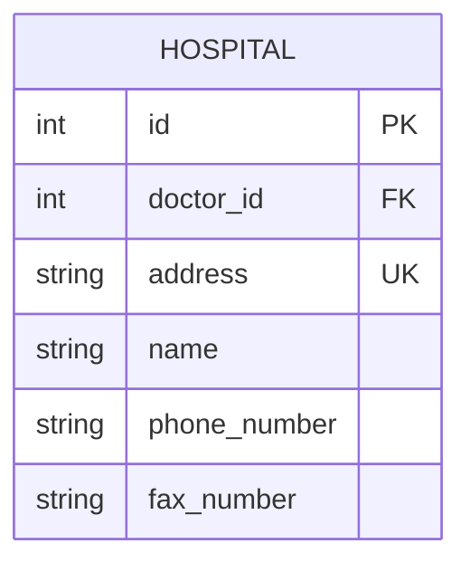
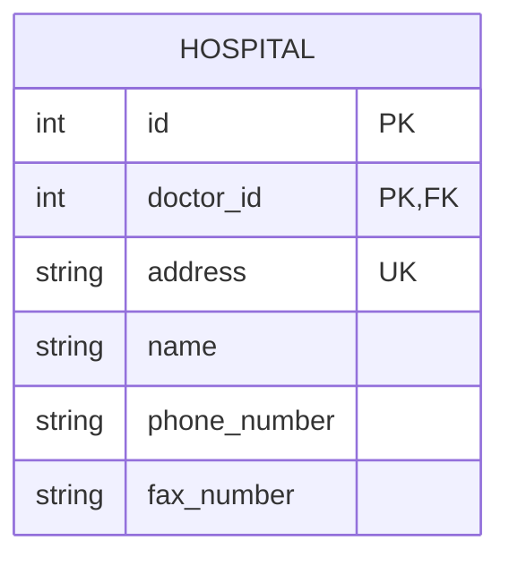
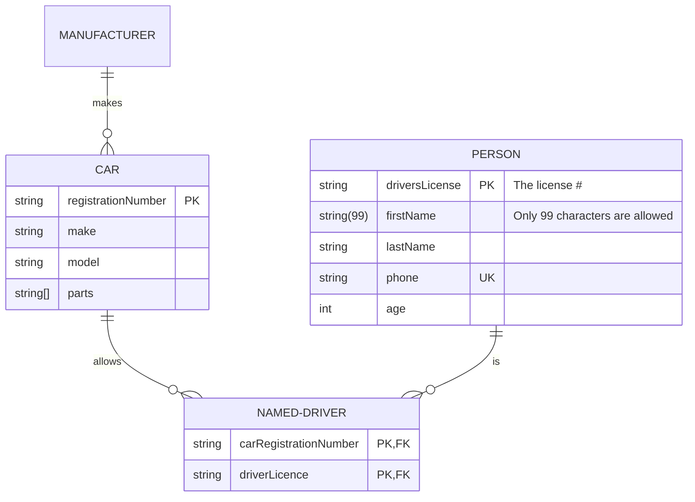
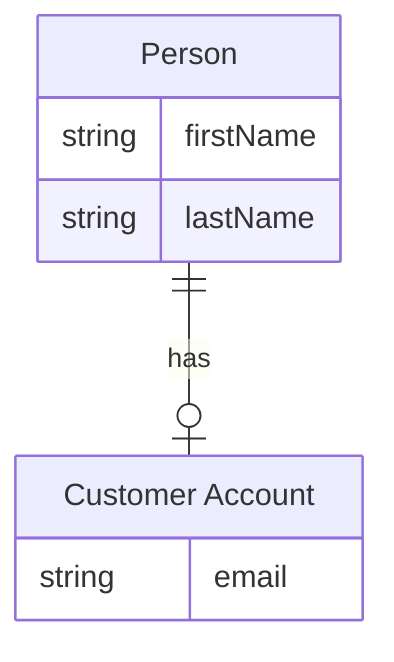
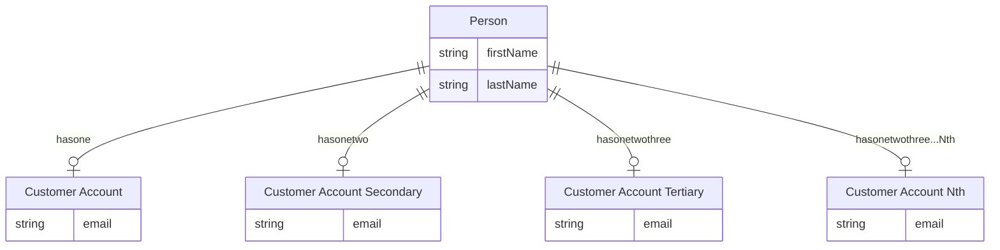
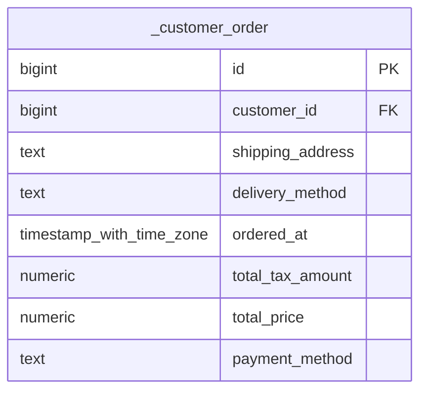

# er

## Example 1

**SebastianJS (SVG):**

> Render failed: Error: Diagrams beginning with --- are not valid. If you were trying to use a YAML front-matter, please ensure that you've correctly opened and closed the YAML front-matter with un-indented `---` blocks

**Mermaid Code (Browser Rendered):**

```mermaid
---
      title: This is a title
      config:
        theme: forest
      ---
      erDiagram
        %% title This is a title
        %% accDescription Test a description

        "Person . CUSTOMER"||--o{ ORDER : places

        ORDER ||--|{ "€£LINE_ITEM ¥" : contains

        "Person . CUSTOMER" }|..|{ "Address//StreetAddress::[DELIVERY ADDRESS]" : uses

        "Address//StreetAddress::[DELIVERY ADDRESS]" {
          int customerID FK
          string line1 "this is the first address line comment"
          string line2
          string city
          string region
          string state
          string(5) postal_code
          string country
        }

        "a_~`!@#$^&*()-_=+[]{}|/;:'.?¡⁄™€£‹¢›∞fi§‡•°ª·º‚≠±œŒ∑„®†ˇ¥Á¨ˆˆØπ∏“«»åÅßÍ∂΃ϩ˙Ó∆Ô˚¬Ò…ÚæÆΩ¸≈π˛çÇ√◊∫ı˜µÂ≤¯≥˘÷¿" {
          string name "this is an entity with an absurd name just to show characters that are now acceptable as long as the name is in double quotes"
        }

        "€£LINE_ITEM ¥" {
          int orderID FK
          int currencyId FK
          number price
          number quantity
          number adjustment
          number final_price
        }
```

## Example 2

**SebastianJS (SVG):**

<svg id="graph" xmlns="http://www.w3.org/2000/svg" xmlns:xlink="http://www.w3.org/1999/xlink" class="erDiagram" style="max-width: 15498px;" viewBox="-361 -125 341 265" role="graphics-document document" aria-roledescription="er"><style>#graph{font-family:"trebuchet ms",verdana,arial,sans-serif;font-size:16px;fill:#333;}@keyframes edge-animation-frame{from{stroke-dashoffset:0;}}@keyframes dash{to{stroke-dashoffset:0;}}#graph .edge-animation-slow{stroke-dasharray:9,5!important;stroke-dashoffset:900;animation:dash 50s linear infinite;stroke-linecap:round;}#graph .edge-animation-fast{stroke-dasharray:9,5!important;stroke-dashoffset:900;animation:dash 20s linear infinite;stroke-linecap:round;}#graph .error-icon{fill:#552222;}#graph .error-text{fill:#552222;stroke:#552222;}#graph .edge-thickness-normal{stroke-width:1px;}#graph .edge-thickness-thick{stroke-width:3.5px;}#graph .edge-pattern-solid{stroke-dasharray:0;}#graph .edge-thickness-invisible{stroke-width:0;fill:none;}#graph .edge-pattern-dashed{stroke-dasharray:3;}#graph .edge-pattern-dotted{stroke-dasharray:2;}#graph .marker{fill:#333333;stroke:#333333;}#graph .marker.cross{stroke:#333333;}#graph svg{font-family:"trebuchet ms",verdana,arial,sans-serif;font-size:16px;}#graph p{margin:0;}#graph .entityBox{fill:#ECECFF;stroke:#9370DB;}#graph .relationshipLabelBox{fill:hsl(80, 100%, 96.2745098039%);opacity:0.7;background-color:hsl(80, 100%, 96.2745098039%);}#graph .relationshipLabelBox rect{opacity:0.5;}#graph .labelBkg{background-color:rgba(248.6666666666, 255, 235.9999999999, 0.5);}#graph .edgeLabel .label{fill:#9370DB;font-size:14px;}#graph .label{font-family:"trebuchet ms",verdana,arial,sans-serif;color:#333;}#graph .edge-pattern-dashed{stroke-dasharray:8,8;}#graph .node rect,#graph .node circle,#graph .node ellipse,#graph .node polygon{fill:#ECECFF;stroke:#9370DB;stroke-width:1px;}#graph .relationshipLine{stroke:#333333;stroke-width:1;fill:none;}#graph .marker{fill:none!important;stroke:#333333!important;stroke-width:1;}#graph :root{--mermaid-font-family:"trebuchet ms",verdana,arial,sans-serif;}</style><g><defs><marker id="graph_er-onlyOneStart" class="marker onlyOne er" refX="0" refY="9" markerWidth="18" markerHeight="18" orient="auto"><path d="M9,0 L9,18 M15,0 L15,18"/></marker></defs><defs><marker id="graph_er-onlyOneEnd" class="marker onlyOne er" refX="18" refY="9" markerWidth="18" markerHeight="18" orient="auto"><path d="M3,0 L3,18 M9,0 L9,18"/></marker></defs><defs><marker id="graph_er-zeroOrOneStart" class="marker zeroOrOne er" refX="0" refY="9" markerWidth="30" markerHeight="18" orient="auto"><circle fill="white" cx="21" cy="9" r="6"/><path d="M9,0 L9,18"/></marker></defs><defs><marker id="graph_er-zeroOrOneEnd" class="marker zeroOrOne er" refX="30" refY="9" markerWidth="30" markerHeight="18" orient="auto"><circle fill="white" cx="9" cy="9" r="6"/><path d="M21,0 L21,18"/></marker></defs><defs><marker id="graph_er-oneOrMoreStart" class="marker oneOrMore er" refX="18" refY="18" markerWidth="45" markerHeight="36" orient="auto"><path d="M0,18 Q 18,0 36,18 Q 18,36 0,18 M42,9 L42,27"/></marker></defs><defs><marker id="graph_er-oneOrMoreEnd" class="marker oneOrMore er" refX="27" refY="18" markerWidth="45" markerHeight="36" orient="auto"><path d="M3,9 L3,27 M9,18 Q27,0 45,18 Q27,36 9,18"/></marker></defs><defs><marker id="graph_er-zeroOrMoreStart" class="marker zeroOrMore er" refX="18" refY="18" markerWidth="57" markerHeight="36" orient="auto"><circle fill="white" cx="48" cy="18" r="6"/><path d="M0,18 Q18,0 36,18 Q18,36 0,18"/></marker></defs><defs><marker id="graph_er-zeroOrMoreEnd" class="marker zeroOrMore er" refX="39" refY="18" markerWidth="57" markerHeight="36" orient="auto"><circle fill="white" cx="9" cy="18" r="6"/><path d="M21,18 Q39,0 57,18 Q39,36 21,18"/></marker></defs><g class="root"><g class="clusters"/><g class="edgePaths"/><g class="edgeLabels"/><g class="nodes"><g class="node default " id="entity-HOSPITAL-0" transform="translate(13, 20)"><g style=""><path d="M-382 -149.625 L382 -149.625 L382 149.625 L-382 149.625" stroke="none" stroke-width="0" fill="#ECECFF"/><path d="M-382 -149.625 C-140.87087335185115 -149.625, 100.25825329629771 -149.625, 382 -149.625 M-382 -149.625 C-193.01186596043087 -149.625, -4.023731920861735 -149.625, 382 -149.625 M382 -149.625 C382 -72.20711827964837, 382 5.210763440703261, 382 149.625 M382 -149.625 C382 -85.64970764593818, 382 -21.67441529187637, 382 149.625 M382 149.625 C185.9191285566664 149.625, -10.161742886667184 149.625, -382 149.625 M382 149.625 C124.01150486008822 149.625, -133.97699027982355 149.625, -382 149.625 M-382 149.625 C-382 50.30294878171509, -382 -49.019102436569824, -382 -149.625 M-382 149.625 C-382 68.02014265392566, -382 -13.58471469214868, -382 -149.625" stroke="#9370DB" stroke-width="1.3" fill="none" stroke-dasharray="0 0"/></g><g style="" class="row-rect-odd"><path d="M-382 -106.875 L382 -106.875 L382 -64.125 L-382 -64.125" stroke="none" stroke-width="0" fill="hsl(240, 100%, 100%)"/><path d="M-382 -106.875 C-142.9948452428565 -106.875, 96.01030951428697 -106.875, 382 -106.875 M-382 -106.875 C-210.177891151835 -106.875, -38.355782303670026 -106.875, 382 -106.875 M382 -106.875 C382 -93.7411026352112, 382 -80.60720527042243, 382 -64.125 M382 -106.875 C382 -93.68066963662852, 382 -80.48633927325706, 382 -64.125 M382 -64.125 C108.47169010862893 -64.125, -165.05661978274213 -64.125, -382 -64.125 M382 -64.125 C170.395583362482 -64.125, -41.208833275036 -64.125, -382 -64.125 M-382 -64.125 C-382 -74.48235298211881, -382 -84.83970596423762, -382 -106.875 M-382 -64.125 C-382 -81.07933506257741, -382 -98.03367012515483, -382 -106.875" stroke="#9370DB" stroke-width="1.3" fill="none" stroke-dasharray="0 0"/></g><g style="" class="row-rect-even"><path d="M-382 -64.125 L382 -64.125 L382 -21.375 L-382 -21.375" stroke="none" stroke-width="0" fill="hsl(240, 100%, 97.2745098039%)"/><path d="M-382 -64.125 C-104.91517518316971 -64.125, 172.16964963366058 -64.125, 382 -64.125 M-382 -64.125 C-150.06036046775202 -64.125, 81.87927906449596 -64.125, 382 -64.125 M382 -64.125 C382 -48.25113985893365, 382 -32.377279717867296, 382 -21.375 M382 -64.125 C382 -54.62969924726043, 382 -45.134398494520866, 382 -21.375 M382 -21.375 C180.2029730518256 -21.375, -21.594053896348782 -21.375, -382 -21.375 M382 -21.375 C212.6806551140052 -21.375, 43.36131022801038 -21.375, -382 -21.375 M-382 -21.375 C-382 -30.58840027923984, -382 -39.80180055847968, -382 -64.125 M-382 -21.375 C-382 -35.77312179395896, -382 -50.171243587917914, -382 -64.125" stroke="#9370DB" stroke-width="1.3" fill="none" stroke-dasharray="0 0"/></g><g style="" class="row-rect-odd"><path d="M-382 -21.375 L382 -21.375 L382 21.375 L-382 21.375" stroke="none" stroke-width="0" fill="hsl(240, 100%, 100%)"/><path d="M-382 -21.375 C-228.27088285203487 -21.375, -74.54176570406975 -21.375, 382 -21.375 M-382 -21.375 C-81.37990664016138 -21.375, 219.24018671967724 -21.375, 382 -21.375 M382 -21.375 C382 -4.441683340965053, 382 12.491633318069894, 382 21.375 M382 -21.375 C382 -7.143525604991533, 382 7.0879487900169345, 382 21.375 M382 21.375 C180.43584736794972 21.375, -21.12830526410056 21.375, -382 21.375 M382 21.375 C138.85939213256853 21.375, -104.28121573486294 21.375, -382 21.375 M-382 21.375 C-382 9.936665971701299, -382 -1.5016680565974028, -382 -21.375 M-382 21.375 C-382 5.781521140428838, -382 -9.811957719142324, -382 -21.375" stroke="#9370DB" stroke-width="1.3" fill="none" stroke-dasharray="0 0"/></g><g style="" class="row-rect-even"><path d="M-382 21.375 L382 21.375 L382 64.125 L-382 64.125" stroke="none" stroke-width="0" fill="hsl(240, 100%, 97.2745098039%)"/><path d="M-382 21.375 C-160.48152328362693 21.375, 61.036953432746145 21.375, 382 21.375 M-382 21.375 C-119.86799365347173 21.375, 142.26401269305654 21.375, 382 21.375 M382 21.375 C382 33.527887721742374, 382 45.68077544348475, 382 64.125 M382 21.375 C382 37.656779609654535, 382 53.93855921930906, 382 64.125 M382 64.125 C144.20827166130206 64.125, -93.58345667739587 64.125, -382 64.125 M382 64.125 C216.95255116827218 64.125, 51.90510233654436 64.125, -382 64.125 M-382 64.125 C-382 53.39610233659046, -382 42.66720467318092, -382 21.375 M-382 64.125 C-382 49.80443592511733, -382 35.48387185023466, -382 21.375" stroke="#9370DB" stroke-width="1.3" fill="none" stroke-dasharray="0 0"/></g><g style="" class="row-rect-odd"><path d="M-382 64.125 L382 64.125 L382 106.875 L-382 106.875" stroke="none" stroke-width="0" fill="hsl(240, 100%, 100%)"/><path d="M-382 64.125 C-215.44365297108456 64.125, -48.88730594216912 64.125, 382 64.125 M-382 64.125 C-136.06482143200176 64.125, 109.87035713599647 64.125, 382 64.125 M382 64.125 C382 76.68026370455817, 382 89.23552740911636, 382 106.875 M382 64.125 C382 72.72245687457053, 382 81.31991374914105, 382 106.875 M382 106.875 C206.03363405421305 106.875, 30.067268108426106 106.875, -382 106.875 M382 106.875 C190.47943136136473 106.875, -1.0411372772705363 106.875, -382 106.875 M-382 106.875 C-382 96.97375692623946, -382 87.07251385247892, -382 64.125 M-382 106.875 C-382 94.00057625906244, -382 81.12615251812488, -382 64.125" stroke="#9370DB" stroke-width="1.3" fill="none" stroke-dasharray="0 0"/></g><g style="" class="row-rect-even"><path d="M-382 106.875 L382 106.875 L382 149.625 L-382 149.625" stroke="none" stroke-width="0" fill="hsl(240, 100%, 97.2745098039%)"/><path d="M-382 106.875 C-138.59002476407537 106.875, 104.81995047184927 106.875, 382 106.875 M-382 106.875 C-176.76947852150244 106.875, 28.46104295699513 106.875, 382 106.875 M382 106.875 C382 120.28425311020851, 382 133.69350622041702, 382 149.625 M382 106.875 C382 118.03500474855566, 382 129.19500949711133, 382 149.625 M382 149.625 C115.47640301862583 149.625, -151.04719396274834 149.625, -382 149.625 M382 149.625 C215.1055109080566 149.625, 48.2110218161132 149.625, -382 149.625 M-382 149.625 C-382 133.23096404430044, -382 116.8369280886009, -382 106.875 M-382 149.625 C-382 137.62495334427845, -382 125.62490668855692, -382 106.875" stroke="#9370DB" stroke-width="1.3" fill="none" stroke-dasharray="0 0"/></g><g class="label name" transform="translate(-37, -140.25)" style=""><g><rect class="background" style="stroke: none"/></g><text y="-10.1" style=""><tspan class="text-outer-tspan" x="0" y="-0.1em" dy="1.1em"><tspan font-style="normal" class="text-inner-tspan" font-weight="normal">HOSPITAL</tspan></tspan></text></g><g class="label attribute-type" transform="translate(-369.5, -97.5)" style=""><g><rect class="background" style="stroke: none"/></g><text y="-10.1" style=""><tspan class="text-outer-tspan" x="0" y="-0.1em" dy="1.1em"><tspan font-style="normal" class="text-inner-tspan" font-weight="normal">int</tspan></tspan></text></g><g class="label attribute-name" transform="translate(-286.5, -97.5)" style=""><g><rect class="background" style="stroke: none"/></g><text y="-10.1" style=""><tspan class="text-outer-tspan" x="0" y="-0.1em" dy="1.1em"><tspan font-style="normal" class="text-inner-tspan" font-weight="normal">id</tspan></tspan></text></g><g class="label attribute-keys" transform="translate(-155.5, -97.5)" style=""><g><rect class="background" style="stroke: none"/></g><text y="-10.1" style=""><tspan class="text-outer-tspan" x="0" y="-0.1em" dy="1.1em"><tspan font-style="normal" class="text-inner-tspan" font-weight="normal">PK</tspan></tspan></text></g><g class="label attribute-comment" transform="translate(-104.5, -97.5)" style=""><g><rect class="background" style="stroke: none"/></g><text y="-10.1" style=""><tspan class="text-outer-tspan" x="0" y="-0.1em" dy="1.1em"/></text></g><g class="label attribute-type" transform="translate(-369.5, -54.75)" style=""><g><rect class="background" style="stroke: none"/></g><text y="-10.1" style=""><tspan class="text-outer-tspan" x="0" y="-0.1em" dy="1.1em"><tspan font-style="normal" class="text-inner-tspan" font-weight="normal">int</tspan></tspan></text></g><g class="label attribute-name" transform="translate(-286.5, -54.75)" style=""><g><rect class="background" style="stroke: none"/></g><text y="-10.1" style=""><tspan class="text-outer-tspan" x="0" y="-0.1em" dy="1.1em"><tspan font-style="normal" class="text-inner-tspan" font-weight="normal">doctor_id</tspan></tspan></text></g><g class="label attribute-keys" transform="translate(-155.5, -54.75)" style=""><g><rect class="background" style="stroke: none"/></g><text y="-10.1" style=""><tspan class="text-outer-tspan" x="0" y="-0.1em" dy="1.1em"><tspan font-style="normal" class="text-inner-tspan" font-weight="normal">FK</tspan></tspan></text></g><g class="label attribute-comment" transform="translate(-104.5, -54.75)" style=""><g><rect class="background" style="stroke: none"/></g><text y="-10.1" style=""><tspan class="text-outer-tspan" x="0" y="-0.1em" dy="1.1em"/></text></g><g class="label attribute-type" transform="translate(-369.5, -12)" style=""><g><rect class="background" style="stroke: none"/></g><text y="-10.1" style=""><tspan class="text-outer-tspan" x="0" y="-0.1em" dy="1.1em"><tspan font-style="normal" class="text-inner-tspan" font-weight="normal">string</tspan></tspan></text></g><g class="label attribute-name" transform="translate(-286.5, -12)" style=""><g><rect class="background" style="stroke: none"/></g><text y="-10.1" style=""><tspan class="text-outer-tspan" x="0" y="-0.1em" dy="1.1em"><tspan font-style="normal" class="text-inner-tspan" font-weight="normal">address</tspan></tspan></text></g><g class="label attribute-keys" transform="translate(-155.5, -12)" style=""><g><rect class="background" style="stroke: none"/></g><text y="-10.1" style=""><tspan class="text-outer-tspan" x="0" y="-0.1em" dy="1.1em"><tspan font-style="normal" class="text-inner-tspan" font-weight="normal">UK</tspan></tspan></text></g><g class="label attribute-comment" transform="translate(-104.5, -12)" style=""><g><rect class="background" style="stroke: none"/></g><text y="-10.1" style=""><tspan class="text-outer-tspan" x="0" y="-0.1em" dy="1.1em"/></text></g><g class="label attribute-type" transform="translate(-369.5, 30.75)" style=""><g><rect class="background" style="stroke: none"/></g><text y="-10.1" style=""><tspan class="text-outer-tspan" x="0" y="-0.1em" dy="1.1em"><tspan font-style="normal" class="text-inner-tspan" font-weight="normal">string</tspan></tspan></text></g><g class="label attribute-name" transform="translate(-286.5, 30.75)" style=""><g><rect class="background" style="stroke: none"/></g><text y="-10.1" style=""><tspan class="text-outer-tspan" x="0" y="-0.1em" dy="1.1em"><tspan font-style="normal" class="text-inner-tspan" font-weight="normal">name</tspan></tspan></text></g><g class="label attribute-keys" transform="translate(-155.5, 30.75)" style=""><g><rect class="background" style="stroke: none"/></g><text y="-10.1" style=""><tspan class="text-outer-tspan" x="0" y="-0.1em" dy="1.1em"/></text></g><g class="label attribute-comment" transform="translate(-104.5, 30.75)" style=""><g><rect class="background" style="stroke: none"/></g><text y="-10.1" style=""><tspan class="text-outer-tspan" x="0" y="-0.1em" dy="1.1em"/></text></g><g class="label attribute-type" transform="translate(-369.5, 73.5)" style=""><g><rect class="background" style="stroke: none"/></g><text y="-10.1" style=""><tspan class="text-outer-tspan" x="0" y="-0.1em" dy="1.1em"><tspan font-style="normal" class="text-inner-tspan" font-weight="normal">string</tspan></tspan></text></g><g class="label attribute-name" transform="translate(-286.5, 73.5)" style=""><g><rect class="background" style="stroke: none"/></g><text y="-10.1" style=""><tspan class="text-outer-tspan" x="0" y="-0.1em" dy="1.1em"><tspan font-style="normal" class="text-inner-tspan" font-weight="normal">phone_number</tspan></tspan></text></g><g class="label attribute-keys" transform="translate(-155.5, 73.5)" style=""><g><rect class="background" style="stroke: none"/></g><text y="-10.1" style=""><tspan class="text-outer-tspan" x="0" y="-0.1em" dy="1.1em"/></text></g><g class="label attribute-comment" transform="translate(-104.5, 73.5)" style=""><g><rect class="background" style="stroke: none"/></g><text y="-10.1" style=""><tspan class="text-outer-tspan" x="0" y="-0.1em" dy="1.1em"/></text></g><g class="label attribute-type" transform="translate(-369.5, 116.25)" style=""><g><rect class="background" style="stroke: none"/></g><text y="-10.1" style=""><tspan class="text-outer-tspan" x="0" y="-0.1em" dy="1.1em"><tspan font-style="normal" class="text-inner-tspan" font-weight="normal">string</tspan></tspan></text></g><g class="label attribute-name" transform="translate(-286.5, 116.25)" style=""><g><rect class="background" style="stroke: none"/></g><text y="-10.1" style=""><tspan class="text-outer-tspan" x="0" y="-0.1em" dy="1.1em"><tspan font-style="normal" class="text-inner-tspan" font-weight="normal">fax_number</tspan></tspan></text></g><g class="label attribute-keys" transform="translate(-155.5, 116.25)" style=""><g><rect class="background" style="stroke: none"/></g><text y="-10.1" style=""><tspan class="text-outer-tspan" x="0" y="-0.1em" dy="1.1em"/></text></g><g class="label attribute-comment" transform="translate(-104.5, 116.25)" style=""><g><rect class="background" style="stroke: none"/></g><text y="-10.1" style=""><tspan class="text-outer-tspan" x="0" y="-0.1em" dy="1.1em"/></text></g><g class="divider"><path d="M-382 -106.875 C-190.08328437592823 -106.875, 1.8334312481435404 -106.875, 382 -106.875 M-382 -106.875 C-220.76910088632886 -106.875, -59.538201772657715 -106.875, 382 -106.875" stroke="#9370DB" stroke-width="1.3" fill="none" stroke-dasharray="0 0"/></g><g class="divider"><path d="M-299 -106.875 C-299 -36.7322170303114, -299 33.41056593937719, -299 149.625 M-299 -106.875 C-299 -31.270685722417994, -299 44.33362855516401, -299 149.625" stroke="#9370DB" stroke-width="1.3" fill="none" stroke-dasharray="0 0"/></g><g class="divider"><path d="M-168 -106.875 C-168 -50.21580883974463, -168 6.443382320510736, -168 149.625 M-168 -106.875 C-168 -6.780951923933941, -168 93.31309615213212, -168 149.625" stroke="#9370DB" stroke-width="1.3" fill="none" stroke-dasharray="0 0"/></g><g class="divider"><path d="M-117 -106.875 C-117 -44.21228054961954, -117 18.450438900760915, -117 149.625 M-117 -106.875 C-117 -37.12125889683716, -117 32.632482206325676, -117 149.625" stroke="#9370DB" stroke-width="1.3" fill="none" stroke-dasharray="0 0"/></g><g class="divider"><path d="M-382 -106.875 C-129.73730251643812 -106.875, 122.52539496712376 -106.875, 382 -106.875 M-382 -106.875 C-85.85193690413428 -106.875, 210.29612619173145 -106.875, 382 -106.875" stroke="#9370DB" stroke-width="1.3" fill="none" stroke-dasharray="0 0"/></g></g></g></g></g></svg>

**Mermaid Code (Browser Rendered):**



## Example 3

**SebastianJS (SVG):**

<svg id="graph" xmlns="http://www.w3.org/2000/svg" xmlns:xlink="http://www.w3.org/1999/xlink" class="erDiagram" style="max-width: 15522px;" viewBox="-373 -125 353 265" role="graphics-document document" aria-roledescription="er"><style>#graph{font-family:"trebuchet ms",verdana,arial,sans-serif;font-size:16px;fill:#333;}@keyframes edge-animation-frame{from{stroke-dashoffset:0;}}@keyframes dash{to{stroke-dashoffset:0;}}#graph .edge-animation-slow{stroke-dasharray:9,5!important;stroke-dashoffset:900;animation:dash 50s linear infinite;stroke-linecap:round;}#graph .edge-animation-fast{stroke-dasharray:9,5!important;stroke-dashoffset:900;animation:dash 20s linear infinite;stroke-linecap:round;}#graph .error-icon{fill:#552222;}#graph .error-text{fill:#552222;stroke:#552222;}#graph .edge-thickness-normal{stroke-width:1px;}#graph .edge-thickness-thick{stroke-width:3.5px;}#graph .edge-pattern-solid{stroke-dasharray:0;}#graph .edge-thickness-invisible{stroke-width:0;fill:none;}#graph .edge-pattern-dashed{stroke-dasharray:3;}#graph .edge-pattern-dotted{stroke-dasharray:2;}#graph .marker{fill:#333333;stroke:#333333;}#graph .marker.cross{stroke:#333333;}#graph svg{font-family:"trebuchet ms",verdana,arial,sans-serif;font-size:16px;}#graph p{margin:0;}#graph .entityBox{fill:#ECECFF;stroke:#9370DB;}#graph .relationshipLabelBox{fill:hsl(80, 100%, 96.2745098039%);opacity:0.7;background-color:hsl(80, 100%, 96.2745098039%);}#graph .relationshipLabelBox rect{opacity:0.5;}#graph .labelBkg{background-color:rgba(248.6666666666, 255, 235.9999999999, 0.5);}#graph .edgeLabel .label{fill:#9370DB;font-size:14px;}#graph .label{font-family:"trebuchet ms",verdana,arial,sans-serif;color:#333;}#graph .edge-pattern-dashed{stroke-dasharray:8,8;}#graph .node rect,#graph .node circle,#graph .node ellipse,#graph .node polygon{fill:#ECECFF;stroke:#9370DB;stroke-width:1px;}#graph .relationshipLine{stroke:#333333;stroke-width:1;fill:none;}#graph .marker{fill:none!important;stroke:#333333!important;stroke-width:1;}#graph :root{--mermaid-font-family:"trebuchet ms",verdana,arial,sans-serif;}</style><g><defs><marker id="graph_er-onlyOneStart" class="marker onlyOne er" refX="0" refY="9" markerWidth="18" markerHeight="18" orient="auto"><path d="M9,0 L9,18 M15,0 L15,18"/></marker></defs><defs><marker id="graph_er-onlyOneEnd" class="marker onlyOne er" refX="18" refY="9" markerWidth="18" markerHeight="18" orient="auto"><path d="M3,0 L3,18 M9,0 L9,18"/></marker></defs><defs><marker id="graph_er-zeroOrOneStart" class="marker zeroOrOne er" refX="0" refY="9" markerWidth="30" markerHeight="18" orient="auto"><circle fill="white" cx="21" cy="9" r="6"/><path d="M9,0 L9,18"/></marker></defs><defs><marker id="graph_er-zeroOrOneEnd" class="marker zeroOrOne er" refX="30" refY="9" markerWidth="30" markerHeight="18" orient="auto"><circle fill="white" cx="9" cy="9" r="6"/><path d="M21,0 L21,18"/></marker></defs><defs><marker id="graph_er-oneOrMoreStart" class="marker oneOrMore er" refX="18" refY="18" markerWidth="45" markerHeight="36" orient="auto"><path d="M0,18 Q 18,0 36,18 Q 18,36 0,18 M42,9 L42,27"/></marker></defs><defs><marker id="graph_er-oneOrMoreEnd" class="marker oneOrMore er" refX="27" refY="18" markerWidth="45" markerHeight="36" orient="auto"><path d="M3,9 L3,27 M9,18 Q27,0 45,18 Q27,36 9,18"/></marker></defs><defs><marker id="graph_er-zeroOrMoreStart" class="marker zeroOrMore er" refX="18" refY="18" markerWidth="57" markerHeight="36" orient="auto"><circle fill="white" cx="48" cy="18" r="6"/><path d="M0,18 Q18,0 36,18 Q18,36 0,18"/></marker></defs><defs><marker id="graph_er-zeroOrMoreEnd" class="marker zeroOrMore er" refX="39" refY="18" markerWidth="57" markerHeight="36" orient="auto"><circle fill="white" cx="9" cy="18" r="6"/><path d="M21,18 Q39,0 57,18 Q39,36 21,18"/></marker></defs><g class="root"><g class="clusters"/><g class="edgePaths"/><g class="edgeLabels"/><g class="nodes"><g class="node default " id="entity-HOSPITAL-0" transform="translate(13, 20)"><g style=""><path d="M-394 -149.625 L394 -149.625 L394 149.625 L-394 149.625" stroke="none" stroke-width="0" fill="#ECECFF"/><path d="M-394 -149.625 C-91.42747095498976 -149.625, 211.14505809002048 -149.625, 394 -149.625 M-394 -149.625 C-153.12284529968497 -149.625, 87.75430940063006 -149.625, 394 -149.625 M394 -149.625 C394 -77.5802737633543, 394 -5.535547526708598, 394 149.625 M394 -149.625 C394 -41.76621011465454, 394 66.09257977069092, 394 149.625 M394 149.625 C79.28608285668088 149.625, -235.42783428663824 149.625, -394 149.625 M394 149.625 C171.25679445814654 149.625, -51.48641108370691 149.625, -394 149.625 M-394 149.625 C-394 54.509959200362246, -394 -40.60508159927551, -394 -149.625 M-394 149.625 C-394 62.46298818735988, -394 -24.699023625280233, -394 -149.625" stroke="#9370DB" stroke-width="1.3" fill="none" stroke-dasharray="0 0"/></g><g style="" class="row-rect-odd"><path d="M-394 -106.875 L394 -106.875 L394 -64.125 L-394 -64.125" stroke="none" stroke-width="0" fill="hsl(240, 100%, 100%)"/><path d="M-394 -106.875 C-198.57066785545737 -106.875, -3.1413357109147455 -106.875, 394 -106.875 M-394 -106.875 C-177.47876818155882 -106.875, 39.04246363688236 -106.875, 394 -106.875 M394 -106.875 C394 -94.99084447188737, 394 -83.10668894377476, 394 -64.125 M394 -106.875 C394 -95.159834468663, 394 -83.44466893732601, 394 -64.125 M394 -64.125 C99.14369901638975 -64.125, -195.7126019672205 -64.125, -394 -64.125 M394 -64.125 C222.92280880220451 -64.125, 51.84561760440903 -64.125, -394 -64.125 M-394 -64.125 C-394 -77.424026376722, -394 -90.72305275344401, -394 -106.875 M-394 -64.125 C-394 -76.05741433077522, -394 -87.98982866155043, -394 -106.875" stroke="#9370DB" stroke-width="1.3" fill="none" stroke-dasharray="0 0"/></g><g style="" class="row-rect-even"><path d="M-394 -64.125 L394 -64.125 L394 -21.375 L-394 -21.375" stroke="none" stroke-width="0" fill="hsl(240, 100%, 97.2745098039%)"/><path d="M-394 -64.125 C-139.5420579177312 -64.125, 114.9158841645376 -64.125, 394 -64.125 M-394 -64.125 C-116.53675243866405 -64.125, 160.9264951226719 -64.125, 394 -64.125 M394 -64.125 C394 -52.01674384181038, 394 -39.90848768362076, 394 -21.375 M394 -64.125 C394 -50.06940021885868, 394 -36.013800437717364, 394 -21.375 M394 -21.375 C205.36662095367774 -21.375, 16.733241907355477 -21.375, -394 -21.375 M394 -21.375 C186.34537619155958 -21.375, -21.30924761688084 -21.375, -394 -21.375 M-394 -21.375 C-394 -32.87953570165108, -394 -44.38407140330216, -394 -64.125 M-394 -21.375 C-394 -36.2959982002111, -394 -51.216996400422204, -394 -64.125" stroke="#9370DB" stroke-width="1.3" fill="none" stroke-dasharray="0 0"/></g><g style="" class="row-rect-odd"><path d="M-394 -21.375 L394 -21.375 L394 21.375 L-394 21.375" stroke="none" stroke-width="0" fill="hsl(240, 100%, 100%)"/><path d="M-394 -21.375 C-200.92797604767227 -21.375, -7.8559520953445485 -21.375, 394 -21.375 M-394 -21.375 C-105.56100239107417 -21.375, 182.87799521785166 -21.375, 394 -21.375 M394 -21.375 C394 -6.469643726669775, 394 8.43571254666045, 394 21.375 M394 -21.375 C394 -7.985670107001656, 394 5.4036597859966875, 394 21.375 M394 21.375 C98.00422700861714 21.375, -197.99154598276573 21.375, -394 21.375 M394 21.375 C206.118600993248 21.375, 18.237201986496018 21.375, -394 21.375 M-394 21.375 C-394 10.350377199801857, -394 -0.6742456003962864, -394 -21.375 M-394 21.375 C-394 11.083312576044998, -394 0.7916251520899955, -394 -21.375" stroke="#9370DB" stroke-width="1.3" fill="none" stroke-dasharray="0 0"/></g><g style="" class="row-rect-even"><path d="M-394 21.375 L394 21.375 L394 64.125 L-394 64.125" stroke="none" stroke-width="0" fill="hsl(240, 100%, 97.2745098039%)"/><path d="M-394 21.375 C-173.38145851601158 21.375, 47.237082967976846 21.375, 394 21.375 M-394 21.375 C-126.20672365704604 21.375, 141.58655268590792 21.375, 394 21.375 M394 21.375 C394 38.19518067439897, 394 55.015361348797946, 394 64.125 M394 21.375 C394 35.00632527604843, 394 48.63765055209686, 394 64.125 M394 64.125 C229.93131048111073 64.125, 65.86262096222146 64.125, -394 64.125 M394 64.125 C165.56195269963877 64.125, -62.87609460072247 64.125, -394 64.125 M-394 64.125 C-394 52.806704463318724, -394 41.48840892663744, -394 21.375 M-394 64.125 C-394 54.71011816444624, -394 45.29523632889248, -394 21.375" stroke="#9370DB" stroke-width="1.3" fill="none" stroke-dasharray="0 0"/></g><g style="" class="row-rect-odd"><path d="M-394 64.125 L394 64.125 L394 106.875 L-394 106.875" stroke="none" stroke-width="0" fill="hsl(240, 100%, 100%)"/><path d="M-394 64.125 C-82.62789231356606 64.125, 228.74421537286787 64.125, 394 64.125 M-394 64.125 C-219.22927353500407 64.125, -44.45854707000814 64.125, 394 64.125 M394 64.125 C394 77.01087041149334, 394 89.8967408229867, 394 106.875 M394 64.125 C394 79.61273739633714, 394 95.10047479267428, 394 106.875 M394 106.875 C219.21110204368978 106.875, 44.422204087379555 106.875, -394 106.875 M394 106.875 C230.73444831678088 106.875, 67.46889663356177 106.875, -394 106.875 M-394 106.875 C-394 92.96506660157337, -394 79.05513320314674, -394 64.125 M-394 106.875 C-394 95.6772594818217, -394 84.47951896364339, -394 64.125" stroke="#9370DB" stroke-width="1.3" fill="none" stroke-dasharray="0 0"/></g><g style="" class="row-rect-even"><path d="M-394 106.875 L394 106.875 L394 149.625 L-394 149.625" stroke="none" stroke-width="0" fill="hsl(240, 100%, 97.2745098039%)"/><path d="M-394 106.875 C-138.95636224215238 106.875, 116.08727551569524 106.875, 394 106.875 M-394 106.875 C-107.53986456836606 106.875, 178.9202708632679 106.875, 394 106.875 M394 106.875 C394 116.82063511590559, 394 126.76627023181119, 394 149.625 M394 106.875 C394 122.08354856527718, 394 137.29209713055437, 394 149.625 M394 149.625 C120.6727870091388 149.625, -152.6544259817224 149.625, -394 149.625 M394 149.625 C108.27044767081816 149.625, -177.45910465836369 149.625, -394 149.625 M-394 149.625 C-394 137.83653921653539, -394 126.0480784330708, -394 106.875 M-394 149.625 C-394 140.50241487042402, -394 131.379829740848, -394 106.875" stroke="#9370DB" stroke-width="1.3" fill="none" stroke-dasharray="0 0"/></g><g class="label name" transform="translate(-37, -140.25)" style=""><g><rect class="background" style="stroke: none"/></g><text y="-10.1" style=""><tspan class="text-outer-tspan" x="0" y="-0.1em" dy="1.1em"><tspan font-style="normal" class="text-inner-tspan" font-weight="normal">HOSPITAL</tspan></tspan></text></g><g class="label attribute-type" transform="translate(-381.5, -97.5)" style=""><g><rect class="background" style="stroke: none"/></g><text y="-10.1" style=""><tspan class="text-outer-tspan" x="0" y="-0.1em" dy="1.1em"><tspan font-style="normal" class="text-inner-tspan" font-weight="normal">int</tspan></tspan></text></g><g class="label attribute-name" transform="translate(-298.5, -97.5)" style=""><g><rect class="background" style="stroke: none"/></g><text y="-10.1" style=""><tspan class="text-outer-tspan" x="0" y="-0.1em" dy="1.1em"><tspan font-style="normal" class="text-inner-tspan" font-weight="normal">id</tspan></tspan></text></g><g class="label attribute-keys" transform="translate(-167.5, -97.5)" style=""><g><rect class="background" style="stroke: none"/></g><text y="-10.1" style=""><tspan class="text-outer-tspan" x="0" y="-0.1em" dy="1.1em"><tspan font-style="normal" class="text-inner-tspan" font-weight="normal">PK</tspan></tspan></text></g><g class="label attribute-comment" transform="translate(-92.5, -97.5)" style=""><g><rect class="background" style="stroke: none"/></g><text y="-10.1" style=""><tspan class="text-outer-tspan" x="0" y="-0.1em" dy="1.1em"/></text></g><g class="label attribute-type" transform="translate(-381.5, -54.75)" style=""><g><rect class="background" style="stroke: none"/></g><text y="-10.1" style=""><tspan class="text-outer-tspan" x="0" y="-0.1em" dy="1.1em"><tspan font-style="normal" class="text-inner-tspan" font-weight="normal">int</tspan></tspan></text></g><g class="label attribute-name" transform="translate(-298.5, -54.75)" style=""><g><rect class="background" style="stroke: none"/></g><text y="-10.1" style=""><tspan class="text-outer-tspan" x="0" y="-0.1em" dy="1.1em"><tspan font-style="normal" class="text-inner-tspan" font-weight="normal">doctor_id</tspan></tspan></text></g><g class="label attribute-keys" transform="translate(-167.5, -54.75)" style=""><g><rect class="background" style="stroke: none"/></g><text y="-10.1" style=""><tspan class="text-outer-tspan" x="0" y="-0.1em" dy="1.1em"><tspan font-style="normal" class="text-inner-tspan" font-weight="normal">PK,FK</tspan></tspan></text></g><g class="label attribute-comment" transform="translate(-92.5, -54.75)" style=""><g><rect class="background" style="stroke: none"/></g><text y="-10.1" style=""><tspan class="text-outer-tspan" x="0" y="-0.1em" dy="1.1em"/></text></g><g class="label attribute-type" transform="translate(-381.5, -12)" style=""><g><rect class="background" style="stroke: none"/></g><text y="-10.1" style=""><tspan class="text-outer-tspan" x="0" y="-0.1em" dy="1.1em"><tspan font-style="normal" class="text-inner-tspan" font-weight="normal">string</tspan></tspan></text></g><g class="label attribute-name" transform="translate(-298.5, -12)" style=""><g><rect class="background" style="stroke: none"/></g><text y="-10.1" style=""><tspan class="text-outer-tspan" x="0" y="-0.1em" dy="1.1em"><tspan font-style="normal" class="text-inner-tspan" font-weight="normal">address</tspan></tspan></text></g><g class="label attribute-keys" transform="translate(-167.5, -12)" style=""><g><rect class="background" style="stroke: none"/></g><text y="-10.1" style=""><tspan class="text-outer-tspan" x="0" y="-0.1em" dy="1.1em"><tspan font-style="normal" class="text-inner-tspan" font-weight="normal">UK</tspan></tspan></text></g><g class="label attribute-comment" transform="translate(-92.5, -12)" style=""><g><rect class="background" style="stroke: none"/></g><text y="-10.1" style=""><tspan class="text-outer-tspan" x="0" y="-0.1em" dy="1.1em"/></text></g><g class="label attribute-type" transform="translate(-381.5, 30.75)" style=""><g><rect class="background" style="stroke: none"/></g><text y="-10.1" style=""><tspan class="text-outer-tspan" x="0" y="-0.1em" dy="1.1em"><tspan font-style="normal" class="text-inner-tspan" font-weight="normal">string</tspan></tspan></text></g><g class="label attribute-name" transform="translate(-298.5, 30.75)" style=""><g><rect class="background" style="stroke: none"/></g><text y="-10.1" style=""><tspan class="text-outer-tspan" x="0" y="-0.1em" dy="1.1em"><tspan font-style="normal" class="text-inner-tspan" font-weight="normal">name</tspan></tspan></text></g><g class="label attribute-keys" transform="translate(-167.5, 30.75)" style=""><g><rect class="background" style="stroke: none"/></g><text y="-10.1" style=""><tspan class="text-outer-tspan" x="0" y="-0.1em" dy="1.1em"/></text></g><g class="label attribute-comment" transform="translate(-92.5, 30.75)" style=""><g><rect class="background" style="stroke: none"/></g><text y="-10.1" style=""><tspan class="text-outer-tspan" x="0" y="-0.1em" dy="1.1em"/></text></g><g class="label attribute-type" transform="translate(-381.5, 73.5)" style=""><g><rect class="background" style="stroke: none"/></g><text y="-10.1" style=""><tspan class="text-outer-tspan" x="0" y="-0.1em" dy="1.1em"><tspan font-style="normal" class="text-inner-tspan" font-weight="normal">string</tspan></tspan></text></g><g class="label attribute-name" transform="translate(-298.5, 73.5)" style=""><g><rect class="background" style="stroke: none"/></g><text y="-10.1" style=""><tspan class="text-outer-tspan" x="0" y="-0.1em" dy="1.1em"><tspan font-style="normal" class="text-inner-tspan" font-weight="normal">phone_number</tspan></tspan></text></g><g class="label attribute-keys" transform="translate(-167.5, 73.5)" style=""><g><rect class="background" style="stroke: none"/></g><text y="-10.1" style=""><tspan class="text-outer-tspan" x="0" y="-0.1em" dy="1.1em"/></text></g><g class="label attribute-comment" transform="translate(-92.5, 73.5)" style=""><g><rect class="background" style="stroke: none"/></g><text y="-10.1" style=""><tspan class="text-outer-tspan" x="0" y="-0.1em" dy="1.1em"/></text></g><g class="label attribute-type" transform="translate(-381.5, 116.25)" style=""><g><rect class="background" style="stroke: none"/></g><text y="-10.1" style=""><tspan class="text-outer-tspan" x="0" y="-0.1em" dy="1.1em"><tspan font-style="normal" class="text-inner-tspan" font-weight="normal">string</tspan></tspan></text></g><g class="label attribute-name" transform="translate(-298.5, 116.25)" style=""><g><rect class="background" style="stroke: none"/></g><text y="-10.1" style=""><tspan class="text-outer-tspan" x="0" y="-0.1em" dy="1.1em"><tspan font-style="normal" class="text-inner-tspan" font-weight="normal">fax_number</tspan></tspan></text></g><g class="label attribute-keys" transform="translate(-167.5, 116.25)" style=""><g><rect class="background" style="stroke: none"/></g><text y="-10.1" style=""><tspan class="text-outer-tspan" x="0" y="-0.1em" dy="1.1em"/></text></g><g class="label attribute-comment" transform="translate(-92.5, 116.25)" style=""><g><rect class="background" style="stroke: none"/></g><text y="-10.1" style=""><tspan class="text-outer-tspan" x="0" y="-0.1em" dy="1.1em"/></text></g><g class="divider"><path d="M-394 -106.875 C-150.89588405517466 -106.875, 92.20823188965068 -106.875, 394 -106.875 M-394 -106.875 C-138.70021803832037 -106.875, 116.59956392335926 -106.875, 394 -106.875" stroke="#9370DB" stroke-width="1.3" fill="none" stroke-dasharray="0 0"/></g><g class="divider"><path d="M-311 -106.875 C-311 -45.58070790976615, -311 15.713584180467706, -311 149.625 M-311 -106.875 C-311 -17.70247216546838, -311 71.47005566906324, -311 149.625" stroke="#9370DB" stroke-width="1.3" fill="none" stroke-dasharray="0 0"/></g><g class="divider"><path d="M-180 -106.875 C-180 -27.212753342581436, -180 52.44949331483713, -180 149.625 M-180 -106.875 C-180 -38.3214675663383, -180 30.232064867323402, -180 149.625" stroke="#9370DB" stroke-width="1.3" fill="none" stroke-dasharray="0 0"/></g><g class="divider"><path d="M-105 -106.875 C-105 -34.77974322804941, -105 37.315513543901176, -105 149.625 M-105 -106.875 C-105 -13.338456838928465, -105 80.19808632214307, -105 149.625" stroke="#9370DB" stroke-width="1.3" fill="none" stroke-dasharray="0 0"/></g><g class="divider"><path d="M-394 -106.875 C-135.18634215068852 -106.875, 123.62731569862297 -106.875, 394 -106.875 M-394 -106.875 C-209.33021489630667 -106.875, -24.660429792613343 -106.875, 394 -106.875" stroke="#9370DB" stroke-width="1.3" fill="none" stroke-dasharray="0 0"/></g></g></g></g></g></svg>

**Mermaid Code (Browser Rendered):**



## Example 4

**SebastianJS (SVG):**

> Render failed: TypeError: DOMPurify.sanitize is not a function

**Mermaid Code (Browser Rendered):**



## Example 5

**SebastianJS (SVG):**

<svg id="graph" xmlns="http://www.w3.org/2000/svg" xmlns:xlink="http://www.w3.org/1999/xlink" class="erDiagram" style="max-width: 15314px;" viewBox="-137 -39 233 201" role="graphics-document document" aria-roledescription="er"><style>#graph{font-family:"trebuchet ms",verdana,arial,sans-serif;font-size:16px;fill:#333;}@keyframes edge-animation-frame{from{stroke-dashoffset:0;}}@keyframes dash{to{stroke-dashoffset:0;}}#graph .edge-animation-slow{stroke-dasharray:9,5!important;stroke-dashoffset:900;animation:dash 50s linear infinite;stroke-linecap:round;}#graph .edge-animation-fast{stroke-dasharray:9,5!important;stroke-dashoffset:900;animation:dash 20s linear infinite;stroke-linecap:round;}#graph .error-icon{fill:#552222;}#graph .error-text{fill:#552222;stroke:#552222;}#graph .edge-thickness-normal{stroke-width:1px;}#graph .edge-thickness-thick{stroke-width:3.5px;}#graph .edge-pattern-solid{stroke-dasharray:0;}#graph .edge-thickness-invisible{stroke-width:0;fill:none;}#graph .edge-pattern-dashed{stroke-dasharray:3;}#graph .edge-pattern-dotted{stroke-dasharray:2;}#graph .marker{fill:#333333;stroke:#333333;}#graph .marker.cross{stroke:#333333;}#graph svg{font-family:"trebuchet ms",verdana,arial,sans-serif;font-size:16px;}#graph p{margin:0;}#graph .entityBox{fill:#ECECFF;stroke:#9370DB;}#graph .relationshipLabelBox{fill:hsl(80, 100%, 96.2745098039%);opacity:0.7;background-color:hsl(80, 100%, 96.2745098039%);}#graph .relationshipLabelBox rect{opacity:0.5;}#graph .labelBkg{background-color:rgba(248.6666666666, 255, 235.9999999999, 0.5);}#graph .edgeLabel .label{fill:#9370DB;font-size:14px;}#graph .label{font-family:"trebuchet ms",verdana,arial,sans-serif;color:#333;}#graph .edge-pattern-dashed{stroke-dasharray:8,8;}#graph .node rect,#graph .node circle,#graph .node ellipse,#graph .node polygon{fill:#ECECFF;stroke:#9370DB;stroke-width:1px;}#graph .relationshipLine{stroke:#333333;stroke-width:1;fill:none;}#graph .marker{fill:none!important;stroke:#333333!important;stroke-width:1;}#graph :root{--mermaid-font-family:"trebuchet ms",verdana,arial,sans-serif;}</style><g><defs><marker id="graph_er-onlyOneStart" class="marker onlyOne er" refX="0" refY="9" markerWidth="18" markerHeight="18" orient="auto"><path d="M9,0 L9,18 M15,0 L15,18"/></marker></defs><defs><marker id="graph_er-onlyOneEnd" class="marker onlyOne er" refX="18" refY="9" markerWidth="18" markerHeight="18" orient="auto"><path d="M3,0 L3,18 M9,0 L9,18"/></marker></defs><defs><marker id="graph_er-zeroOrOneStart" class="marker zeroOrOne er" refX="0" refY="9" markerWidth="30" markerHeight="18" orient="auto"><circle fill="white" cx="21" cy="9" r="6"/><path d="M9,0 L9,18"/></marker></defs><defs><marker id="graph_er-zeroOrOneEnd" class="marker zeroOrOne er" refX="30" refY="9" markerWidth="30" markerHeight="18" orient="auto"><circle fill="white" cx="9" cy="9" r="6"/><path d="M21,0 L21,18"/></marker></defs><defs><marker id="graph_er-oneOrMoreStart" class="marker oneOrMore er" refX="18" refY="18" markerWidth="45" markerHeight="36" orient="auto"><path d="M0,18 Q 18,0 36,18 Q 18,36 0,18 M42,9 L42,27"/></marker></defs><defs><marker id="graph_er-oneOrMoreEnd" class="marker oneOrMore er" refX="27" refY="18" markerWidth="45" markerHeight="36" orient="auto"><path d="M3,9 L3,27 M9,18 Q27,0 45,18 Q27,36 9,18"/></marker></defs><defs><marker id="graph_er-zeroOrMoreStart" class="marker zeroOrMore er" refX="18" refY="18" markerWidth="57" markerHeight="36" orient="auto"><circle fill="white" cx="48" cy="18" r="6"/><path d="M0,18 Q18,0 36,18 Q18,36 0,18"/></marker></defs><defs><marker id="graph_er-zeroOrMoreEnd" class="marker zeroOrMore er" refX="39" refY="18" markerWidth="57" markerHeight="36" orient="auto"><circle fill="white" cx="9" cy="18" r="6"/><path d="M21,18 Q39,0 57,18 Q39,36 21,18"/></marker></defs><g class="root"><g class="clusters"/><g class="edgePaths"><path d="M25,32L25,40.667C25,49.333,25,66.667,25,84C25,101.333,25,118.667,25,127.333L25,136" id="id_entity-p-0_entity-a-1_0" class=" edge-thickness-normal edge-pattern-solid relationshipLine" style="" marker-start="url(#graph_er-onlyOneStart)" marker-end="url(#graph_er-zeroOrOneEnd)"/></g><g class="edgeLabels"><g class="edgeLabel" transform="translate(25, 84)"><g class="label" transform="translate(-17, -12)"><g><rect class="background" style="" x="-2" y="-2" width="38" height="28"/><text y="-10.1" style=""><tspan class="text-outer-tspan" x="0" y="-0.1em" dy="1.1em"><tspan font-style="normal" class="text-inner-tspan" font-weight="normal">has</tspan></tspan></text></g></g></g></g><g class="nodes"><g class="node default " id="entity-p-0" transform="translate(25, 20)"><g style=""><path d="M-170 -64.125 L170 -64.125 L170 64.125 L-170 64.125" stroke="none" stroke-width="0" fill="#ECECFF"/><path d="M-170 -64.125 C-89.94432005374051 -64.125, -9.888640107481024 -64.125, 170 -64.125 M-170 -64.125 C-57.00573223234939 -64.125, 55.988535535301224 -64.125, 170 -64.125 M170 -64.125 C170 -31.46642542343934, 170 1.1921491531213206, 170 64.125 M170 -64.125 C170 -35.404931048055154, 170 -6.684862096110308, 170 64.125 M170 64.125 C53.00449284379988 64.125, -63.99101431240024 64.125, -170 64.125 M170 64.125 C34.98107774255027 64.125, -100.03784451489946 64.125, -170 64.125 M-170 64.125 C-170 20.323254944841487, -170 -23.478490110317026, -170 -64.125 M-170 64.125 C-170 36.99642463575428, -170 9.867849271508554, -170 -64.125" stroke="#9370DB" stroke-width="1.3" fill="none" stroke-dasharray="0 0"/></g><g style="" class="row-rect-odd"><path d="M-170 -21.375 L170 -21.375 L170 21.375 L-170 21.375" stroke="none" stroke-width="0" fill="hsl(240, 100%, 100%)"/><path d="M-170 -21.375 C-97.83138136950818 -21.375, -25.662762739016358 -21.375, 170 -21.375 M-170 -21.375 C-96.97927935733786 -21.375, -23.958558714675718 -21.375, 170 -21.375 M170 -21.375 C170 -7.836991166905468, 170 5.701017666189063, 170 21.375 M170 -21.375 C170 -6.3739117763243485, 170 8.627176447351303, 170 21.375 M170 21.375 C44.55572143707735 21.375, -80.8885571258453 21.375, -170 21.375 M170 21.375 C61.07142517916576 21.375, -47.857149641668485 21.375, -170 21.375 M-170 21.375 C-170 9.724506988175976, -170 -1.925986023648047, -170 -21.375 M-170 21.375 C-170 7.942755735350959, -170 -5.489488529298082, -170 -21.375" stroke="#9370DB" stroke-width="1.3" fill="none" stroke-dasharray="0 0"/></g><g style="" class="row-rect-even"><path d="M-170 21.375 L170 21.375 L170 64.125 L-170 64.125" stroke="none" stroke-width="0" fill="hsl(240, 100%, 97.2745098039%)"/><path d="M-170 21.375 C-37.87647793875962 21.375, 94.24704412248076 21.375, 170 21.375 M-170 21.375 C-55.94987885029872 21.375, 58.10024229940257 21.375, 170 21.375 M170 21.375 C170 32.89678595385386, 170 44.418571907707715, 170 64.125 M170 21.375 C170 31.929063675062217, 170 42.483127350124434, 170 64.125 M170 64.125 C67.03742226425274 64.125, -35.92515547149452 64.125, -170 64.125 M170 64.125 C92.97786601039371 64.125, 15.955732020787423 64.125, -170 64.125 M-170 64.125 C-170 51.28880566364093, -170 38.45261132728185, -170 21.375 M-170 64.125 C-170 52.63423318965506, -170 41.14346637931013, -170 21.375" stroke="#9370DB" stroke-width="1.3" fill="none" stroke-dasharray="0 0"/></g><g class="label name" transform="translate(-29, -54.75)" style=""><g><rect class="background" style="stroke: none"/></g><text y="-10.1" style=""><tspan class="text-outer-tspan" x="0" y="-0.1em" dy="1.1em"><tspan font-style="normal" class="text-inner-tspan" font-weight="normal">Person</tspan></tspan></text></g><g class="label attribute-type" transform="translate(-157.5, -12)" style=""><g><rect class="background" style="stroke: none"/></g><text y="-10.1" style=""><tspan class="text-outer-tspan" x="0" y="-0.1em" dy="1.1em"><tspan font-style="normal" class="text-inner-tspan" font-weight="normal">string</tspan></tspan></text></g><g class="label attribute-name" transform="translate(-74.5, -12)" style=""><g><rect class="background" style="stroke: none"/></g><text y="-10.1" style=""><tspan class="text-outer-tspan" x="0" y="-0.1em" dy="1.1em"><tspan font-style="normal" class="text-inner-tspan" font-weight="normal">firstName</tspan></tspan></text></g><g class="label attribute-keys" transform="translate(32.5, -12)" style=""><g><rect class="background" style="stroke: none"/></g><text y="-10.1" style=""><tspan class="text-outer-tspan" x="0" y="-0.1em" dy="1.1em"/></text></g><g class="label attribute-comment" transform="translate(67.5, -12)" style=""><g><rect class="background" style="stroke: none"/></g><text y="-10.1" style=""><tspan class="text-outer-tspan" x="0" y="-0.1em" dy="1.1em"/></text></g><g class="label attribute-type" transform="translate(-157.5, 30.75)" style=""><g><rect class="background" style="stroke: none"/></g><text y="-10.1" style=""><tspan class="text-outer-tspan" x="0" y="-0.1em" dy="1.1em"><tspan font-style="normal" class="text-inner-tspan" font-weight="normal">string</tspan></tspan></text></g><g class="label attribute-name" transform="translate(-74.5, 30.75)" style=""><g><rect class="background" style="stroke: none"/></g><text y="-10.1" style=""><tspan class="text-outer-tspan" x="0" y="-0.1em" dy="1.1em"><tspan font-style="normal" class="text-inner-tspan" font-weight="normal">lastName</tspan></tspan></text></g><g class="label attribute-keys" transform="translate(32.5, 30.75)" style=""><g><rect class="background" style="stroke: none"/></g><text y="-10.1" style=""><tspan class="text-outer-tspan" x="0" y="-0.1em" dy="1.1em"/></text></g><g class="label attribute-comment" transform="translate(67.5, 30.75)" style=""><g><rect class="background" style="stroke: none"/></g><text y="-10.1" style=""><tspan class="text-outer-tspan" x="0" y="-0.1em" dy="1.1em"/></text></g><g class="divider"><path d="M-170 -21.375 C-37.3667339930723 -21.375, 95.2665320138554 -21.375, 170 -21.375 M-170 -21.375 C-97.29988221691163 -21.375, -24.599764433823253 -21.375, 170 -21.375" stroke="#9370DB" stroke-width="1.3" fill="none" stroke-dasharray="0 0"/></g><g class="divider"><path d="M-87 -21.375 C-87 9.944960898835443, -87 41.26492179767089, -87 64.125 M-87 -21.375 C-87 7.805266618842072, -87 36.985533237684145, -87 64.125" stroke="#9370DB" stroke-width="1.3" fill="none" stroke-dasharray="0 0"/></g><g class="divider"><path d="M20 -21.375 C20 4.288468484705891, 20 29.951936969411783, 20 64.125 M20 -21.375 C20 10.745045509798437, 20 42.865091019596875, 20 64.125" stroke="#9370DB" stroke-width="1.3" fill="none" stroke-dasharray="0 0"/></g><g class="divider"><path d="M55 -21.375 C55 10.288359010961859, 55 41.95171802192372, 55 64.125 M55 -21.375 C55 3.610651365104726, 55 28.59630273020945, 55 64.125" stroke="#9370DB" stroke-width="1.3" fill="none" stroke-dasharray="0 0"/></g><g class="divider"><path d="M-170 -21.375 C-95.16398197446996 -21.375, -20.327963948939924 -21.375, 170 -21.375 M-170 -21.375 C-72.83588526465844 -21.375, 24.328229470683112 -21.375, 170 -21.375" stroke="#9370DB" stroke-width="1.3" fill="none" stroke-dasharray="0 0"/></g></g><g class="node default " id="entity-a-1" transform="translate(25, 148)"><g style=""><path d="M-138 -42.75 L138 -42.75 L138 42.75 L-138 42.75" stroke="none" stroke-width="0" fill="#ECECFF"/><path d="M-138 -42.75 C-39.73589879925859 -42.75, 58.528202401482815 -42.75, 138 -42.75 M-138 -42.75 C-61.98746926259024 -42.75, 14.025061474819523 -42.75, 138 -42.75 M138 -42.75 C138 -15.657220537516096, 138 11.435558924967808, 138 42.75 M138 -42.75 C138 -15.74049719567877, 138 11.269005608642459, 138 42.75 M138 42.75 C64.87764524376519 42.75, -8.244709512469626 42.75, -138 42.75 M138 42.75 C81.02842592593221 42.75, 24.056851851864423 42.75, -138 42.75 M-138 42.75 C-138 20.56221496384637, -138 -1.6255700723072621, -138 -42.75 M-138 42.75 C-138 11.258553038071529, -138 -20.232893923856942, -138 -42.75" stroke="#9370DB" stroke-width="1.3" fill="none" stroke-dasharray="0 0"/></g><g style="" class="row-rect-odd"><path d="M-138 0 L138 0 L138 42.75 L-138 42.75" stroke="none" stroke-width="0" fill="hsl(240, 100%, 100%)"/><path d="M-138 0 C-63.55897525247303 0, 10.882049495053934 0, 138 0 M-138 0 C-28.108754761007035 0, 81.78249047798593 0, 138 0 M138 0 C138 12.545413952255739, 138 25.090827904511478, 138 42.75 M138 0 C138 12.568756299047225, 138 25.13751259809445, 138 42.75 M138 42.75 C33.115812554074864 42.75, -71.76837489185027 42.75, -138 42.75 M138 42.75 C69.94654153466797 42.75, 1.893083069335944 42.75, -138 42.75 M-138 42.75 C-138 26.343583683780995, -138 9.93716736756199, -138 0 M-138 42.75 C-138 29.061470205715757, -138 15.372940411431511, -138 0" stroke="#9370DB" stroke-width="1.3" fill="none" stroke-dasharray="0 0"/></g><g class="label name" transform="translate(-69, -33.375)" style=""><g><rect class="background" style="stroke: none"/></g><text y="-10.1" style=""><tspan class="text-outer-tspan" x="0" y="-0.1em" dy="1.1em"><tspan font-style="normal" class="text-inner-tspan" font-weight="normal">Customer</tspan><tspan font-style="normal" class="text-inner-tspan" font-weight="normal"> Account</tspan></tspan></text></g><g class="label attribute-type" transform="translate(-125.5, 9.375)" style=""><g><rect class="background" style="stroke: none"/></g><text y="-10.1" style=""><tspan class="text-outer-tspan" x="0" y="-0.1em" dy="1.1em"><tspan font-style="normal" class="text-inner-tspan" font-weight="normal">string</tspan></tspan></text></g><g class="label attribute-name" transform="translate(-42.5, 9.375)" style=""><g><rect class="background" style="stroke: none"/></g><text y="-10.1" style=""><tspan class="text-outer-tspan" x="0" y="-0.1em" dy="1.1em"><tspan font-style="normal" class="text-inner-tspan" font-weight="normal">email</tspan></tspan></text></g><g class="label attribute-keys" transform="translate(32.5, 9.375)" style=""><g><rect class="background" style="stroke: none"/></g><text y="-10.1" style=""><tspan class="text-outer-tspan" x="0" y="-0.1em" dy="1.1em"/></text></g><g class="label attribute-comment" transform="translate(67.5, 9.375)" style=""><g><rect class="background" style="stroke: none"/></g><text y="-10.1" style=""><tspan class="text-outer-tspan" x="0" y="-0.1em" dy="1.1em"/></text></g><g class="divider"><path d="M-138 0 C-66.06219693214355 0, 5.8756061357129 0, 138 0 M-138 0 C-76.59771924555864 0, -15.195438491117272 0, 138 0" stroke="#9370DB" stroke-width="1.3" fill="none" stroke-dasharray="0 0"/></g><g class="divider"><path d="M-55 0 C-55 10.028536279980578, -55 20.057072559961156, -55 42.75 M-55 0 C-55 13.166788207761416, -55 26.33357641552283, -55 42.75" stroke="#9370DB" stroke-width="1.3" fill="none" stroke-dasharray="0 0"/></g><g class="divider"><path d="M20 0 C20 15.09129100319357, 20 30.18258200638714, 20 42.75 M20 0 C20 14.593881171360577, 20 29.187762342721154, 20 42.75" stroke="#9370DB" stroke-width="1.3" fill="none" stroke-dasharray="0 0"/></g><g class="divider"><path d="M55 0 C55 15.92098992650431, 55 31.84197985300862, 55 42.75 M55 0 C55 15.89873930941999, 55 31.79747861883998, 55 42.75" stroke="#9370DB" stroke-width="1.3" fill="none" stroke-dasharray="0 0"/></g><g class="divider"><path d="M-138 0 C-38.46694573445994 0, 61.06610853108012 0, 138 0 M-138 0 C-47.72642247378039 0, 42.54715505243922 0, 138 0" stroke="#9370DB" stroke-width="1.3" fill="none" stroke-dasharray="0 0"/></g></g></g></g></g></svg>

**Mermaid Code (Browser Rendered):**



## Example 6

**SebastianJS (SVG):**

<svg id="graph" xmlns="http://www.w3.org/2000/svg" xmlns:xlink="http://www.w3.org/1999/xlink" class="erDiagram" style="max-width: 16514px;" viewBox="-93 -39 687 201" role="graphics-document document" aria-roledescription="er"><style>#graph{font-family:"trebuchet ms",verdana,arial,sans-serif;font-size:16px;fill:#333;}@keyframes edge-animation-frame{from{stroke-dashoffset:0;}}@keyframes dash{to{stroke-dashoffset:0;}}#graph .edge-animation-slow{stroke-dasharray:9,5!important;stroke-dashoffset:900;animation:dash 50s linear infinite;stroke-linecap:round;}#graph .edge-animation-fast{stroke-dasharray:9,5!important;stroke-dashoffset:900;animation:dash 20s linear infinite;stroke-linecap:round;}#graph .error-icon{fill:#552222;}#graph .error-text{fill:#552222;stroke:#552222;}#graph .edge-thickness-normal{stroke-width:1px;}#graph .edge-thickness-thick{stroke-width:3.5px;}#graph .edge-pattern-solid{stroke-dasharray:0;}#graph .edge-thickness-invisible{stroke-width:0;fill:none;}#graph .edge-pattern-dashed{stroke-dasharray:3;}#graph .edge-pattern-dotted{stroke-dasharray:2;}#graph .marker{fill:#333333;stroke:#333333;}#graph .marker.cross{stroke:#333333;}#graph svg{font-family:"trebuchet ms",verdana,arial,sans-serif;font-size:16px;}#graph p{margin:0;}#graph .entityBox{fill:#ECECFF;stroke:#9370DB;}#graph .relationshipLabelBox{fill:hsl(80, 100%, 96.2745098039%);opacity:0.7;background-color:hsl(80, 100%, 96.2745098039%);}#graph .relationshipLabelBox rect{opacity:0.5;}#graph .labelBkg{background-color:rgba(248.6666666666, 255, 235.9999999999, 0.5);}#graph .edgeLabel .label{fill:#9370DB;font-size:14px;}#graph .label{font-family:"trebuchet ms",verdana,arial,sans-serif;color:#333;}#graph .edge-pattern-dashed{stroke-dasharray:8,8;}#graph .node rect,#graph .node circle,#graph .node ellipse,#graph .node polygon{fill:#ECECFF;stroke:#9370DB;stroke-width:1px;}#graph .relationshipLine{stroke:#333333;stroke-width:1;fill:none;}#graph .marker{fill:none!important;stroke:#333333!important;stroke-width:1;}#graph :root{--mermaid-font-family:"trebuchet ms",verdana,arial,sans-serif;}</style><g><defs><marker id="graph_er-onlyOneStart" class="marker onlyOne er" refX="0" refY="9" markerWidth="18" markerHeight="18" orient="auto"><path d="M9,0 L9,18 M15,0 L15,18"/></marker></defs><defs><marker id="graph_er-onlyOneEnd" class="marker onlyOne er" refX="18" refY="9" markerWidth="18" markerHeight="18" orient="auto"><path d="M3,0 L3,18 M9,0 L9,18"/></marker></defs><defs><marker id="graph_er-zeroOrOneStart" class="marker zeroOrOne er" refX="0" refY="9" markerWidth="30" markerHeight="18" orient="auto"><circle fill="white" cx="21" cy="9" r="6"/><path d="M9,0 L9,18"/></marker></defs><defs><marker id="graph_er-zeroOrOneEnd" class="marker zeroOrOne er" refX="30" refY="9" markerWidth="30" markerHeight="18" orient="auto"><circle fill="white" cx="9" cy="9" r="6"/><path d="M21,0 L21,18"/></marker></defs><defs><marker id="graph_er-oneOrMoreStart" class="marker oneOrMore er" refX="18" refY="18" markerWidth="45" markerHeight="36" orient="auto"><path d="M0,18 Q 18,0 36,18 Q 18,36 0,18 M42,9 L42,27"/></marker></defs><defs><marker id="graph_er-oneOrMoreEnd" class="marker oneOrMore er" refX="27" refY="18" markerWidth="45" markerHeight="36" orient="auto"><path d="M3,9 L3,27 M9,18 Q27,0 45,18 Q27,36 9,18"/></marker></defs><defs><marker id="graph_er-zeroOrMoreStart" class="marker zeroOrMore er" refX="18" refY="18" markerWidth="57" markerHeight="36" orient="auto"><circle fill="white" cx="48" cy="18" r="6"/><path d="M0,18 Q18,0 36,18 Q18,36 0,18"/></marker></defs><defs><marker id="graph_er-zeroOrMoreEnd" class="marker zeroOrMore er" refX="39" refY="18" markerWidth="57" markerHeight="36" orient="auto"><circle fill="white" cx="9" cy="18" r="6"/><path d="M21,18 Q39,0 57,18 Q39,36 21,18"/></marker></defs><g class="root"><g class="clusters"/><g class="edgePaths"><path d="M257,21.422L220.333,31.852C183.667,42.281,110.333,63.141,73.667,82.237C37,101.333,37,118.667,37,127.333L37,136" id="id_entity-p-0_entity-a-1_0" class=" edge-thickness-normal edge-pattern-solid relationshipLine" style="" marker-start="url(#graph_er-onlyOneStart)" marker-end="url(#graph_er-zeroOrOneEnd)"/><path d="M257,24.267L245.333,34.222C233.667,44.178,210.333,64.089,198.667,82.711C187,101.333,187,118.667,187,127.333L187,136" id="id_entity-p-0_entity-b-2_1" class=" edge-thickness-normal edge-pattern-solid relationshipLine" style="" marker-start="url(#graph_er-onlyOneStart)" marker-end="url(#graph_er-zeroOrOneEnd)"/><path d="M267,24.267L278.667,34.222C290.333,44.178,313.667,64.089,325.333,82.711C337,101.333,337,118.667,337,127.333L337,136" id="id_entity-p-0_entity-c-3_2" class=" edge-thickness-normal edge-pattern-solid relationshipLine" style="" marker-start="url(#graph_er-onlyOneStart)" marker-end="url(#graph_er-zeroOrOneEnd)"/><path d="M267,21.328L306.333,31.773C345.667,42.219,424.333,63.109,463.667,82.221C503,101.333,503,118.667,503,127.333L503,136" id="id_entity-p-0_entity-d-4_3" class=" edge-thickness-normal edge-pattern-solid relationshipLine" style="" marker-start="url(#graph_er-onlyOneStart)" marker-end="url(#graph_er-zeroOrOneEnd)"/></g><g class="edgeLabels"><g class="edgeLabel" transform="translate(37, 84)"><g class="label" transform="translate(-29, -12)"><g><rect class="background" style="" x="-2" y="-2" width="62" height="28"/><text y="-10.1" style=""><tspan class="text-outer-tspan" x="0" y="-0.1em" dy="1.1em"><tspan font-style="normal" class="text-inner-tspan" font-weight="normal">hasone</tspan></tspan></text></g></g></g><g class="edgeLabel" transform="translate(187, 84)"><g class="label" transform="translate(-41, -12)"><g><rect class="background" style="" x="-2" y="-2" width="86" height="28"/><text y="-10.1" style=""><tspan class="text-outer-tspan" x="0" y="-0.1em" dy="1.1em"><tspan font-style="normal" class="text-inner-tspan" font-weight="normal">hasonetwo</tspan></tspan></text></g></g></g><g class="edgeLabel" transform="translate(337, 84)"><g class="label" transform="translate(-61, -12)"><g><rect class="background" style="" x="-2" y="-2" width="126" height="28"/><text y="-10.1" style=""><tspan class="text-outer-tspan" x="0" y="-0.1em" dy="1.1em"><tspan font-style="normal" class="text-inner-tspan" font-weight="normal">hasonetwothree</tspan></tspan></text></g></g></g><g class="edgeLabel" transform="translate(503, 84)"><g class="label" transform="translate(-85, -12)"><g><rect class="background" style="" x="-2" y="-2" width="174" height="28"/><text y="-10.1" style=""><tspan class="text-outer-tspan" x="0" y="-0.1em" dy="1.1em"><tspan font-style="normal" class="text-inner-tspan" font-weight="normal">hasonetwothree...Nth</tspan></tspan></text></g></g></g></g><g class="nodes"><g class="node default " id="entity-p-0" transform="translate(262, 20)"><g style=""><path d="M-170 -64.125 L170 -64.125 L170 64.125 L-170 64.125" stroke="none" stroke-width="0" fill="#ECECFF"/><path d="M-170 -64.125 C-56.8746602750214 -64.125, 56.250679449957204 -64.125, 170 -64.125 M-170 -64.125 C-34.5560161565011 -64.125, 100.8879676869978 -64.125, 170 -64.125 M170 -64.125 C170 -35.37553854877929, 170 -6.6260770975585785, 170 64.125 M170 -64.125 C170 -31.75317621329029, 170 0.6186475734194232, 170 64.125 M170 64.125 C76.04209524361235 64.125, -17.915809512775297 64.125, -170 64.125 M170 64.125 C82.59294035382607 64.125, -4.814119292347868 64.125, -170 64.125 M-170 64.125 C-170 26.566612850481384, -170 -10.991774299037232, -170 -64.125 M-170 64.125 C-170 24.571721994866557, -170 -14.981556010266885, -170 -64.125" stroke="#9370DB" stroke-width="1.3" fill="none" stroke-dasharray="0 0"/></g><g style="" class="row-rect-odd"><path d="M-170 -21.375 L170 -21.375 L170 21.375 L-170 21.375" stroke="none" stroke-width="0" fill="hsl(240, 100%, 100%)"/><path d="M-170 -21.375 C-75.16900210236244 -21.375, 19.661995795275118 -21.375, 170 -21.375 M-170 -21.375 C-41.63350265354367 -21.375, 86.73299469291265 -21.375, 170 -21.375 M170 -21.375 C170 -5.220327748321612, 170 10.934344503356776, 170 21.375 M170 -21.375 C170 -5.125083444688855, 170 11.12483311062229, 170 21.375 M170 21.375 C59.62236734462272 21.375, -50.75526531075457 21.375, -170 21.375 M170 21.375 C100.2543404884109 21.375, 30.508680976821807 21.375, -170 21.375 M-170 21.375 C-170 7.2420929203250495, -170 -6.890814159349901, -170 -21.375 M-170 21.375 C-170 4.562265195386761, -170 -12.250469609226478, -170 -21.375" stroke="#9370DB" stroke-width="1.3" fill="none" stroke-dasharray="0 0"/></g><g style="" class="row-rect-even"><path d="M-170 21.375 L170 21.375 L170 64.125 L-170 64.125" stroke="none" stroke-width="0" fill="hsl(240, 100%, 97.2745098039%)"/><path d="M-170 21.375 C-68.91689384681126 21.375, 32.166212306377474 21.375, 170 21.375 M-170 21.375 C-101.82689912184777 21.375, -33.65379824369555 21.375, 170 21.375 M170 21.375 C170 37.93267771777947, 170 54.49035543555894, 170 64.125 M170 21.375 C170 35.62088872558163, 170 49.86677745116326, 170 64.125 M170 64.125 C37.31141043316106 64.125, -95.37717913367788 64.125, -170 64.125 M170 64.125 C42.15172448757069 64.125, -85.69655102485862 64.125, -170 64.125 M-170 64.125 C-170 52.772443926120445, -170 41.41988785224089, -170 21.375 M-170 64.125 C-170 54.282535899387014, -170 44.44007179877403, -170 21.375" stroke="#9370DB" stroke-width="1.3" fill="none" stroke-dasharray="0 0"/></g><g class="label name" transform="translate(-29, -54.75)" style=""><g><rect class="background" style="stroke: none"/></g><text y="-10.1" style=""><tspan class="text-outer-tspan" x="0" y="-0.1em" dy="1.1em"><tspan font-style="normal" class="text-inner-tspan" font-weight="normal">Person</tspan></tspan></text></g><g class="label attribute-type" transform="translate(-157.5, -12)" style=""><g><rect class="background" style="stroke: none"/></g><text y="-10.1" style=""><tspan class="text-outer-tspan" x="0" y="-0.1em" dy="1.1em"><tspan font-style="normal" class="text-inner-tspan" font-weight="normal">string</tspan></tspan></text></g><g class="label attribute-name" transform="translate(-74.5, -12)" style=""><g><rect class="background" style="stroke: none"/></g><text y="-10.1" style=""><tspan class="text-outer-tspan" x="0" y="-0.1em" dy="1.1em"><tspan font-style="normal" class="text-inner-tspan" font-weight="normal">firstName</tspan></tspan></text></g><g class="label attribute-keys" transform="translate(32.5, -12)" style=""><g><rect class="background" style="stroke: none"/></g><text y="-10.1" style=""><tspan class="text-outer-tspan" x="0" y="-0.1em" dy="1.1em"/></text></g><g class="label attribute-comment" transform="translate(67.5, -12)" style=""><g><rect class="background" style="stroke: none"/></g><text y="-10.1" style=""><tspan class="text-outer-tspan" x="0" y="-0.1em" dy="1.1em"/></text></g><g class="label attribute-type" transform="translate(-157.5, 30.75)" style=""><g><rect class="background" style="stroke: none"/></g><text y="-10.1" style=""><tspan class="text-outer-tspan" x="0" y="-0.1em" dy="1.1em"><tspan font-style="normal" class="text-inner-tspan" font-weight="normal">string</tspan></tspan></text></g><g class="label attribute-name" transform="translate(-74.5, 30.75)" style=""><g><rect class="background" style="stroke: none"/></g><text y="-10.1" style=""><tspan class="text-outer-tspan" x="0" y="-0.1em" dy="1.1em"><tspan font-style="normal" class="text-inner-tspan" font-weight="normal">lastName</tspan></tspan></text></g><g class="label attribute-keys" transform="translate(32.5, 30.75)" style=""><g><rect class="background" style="stroke: none"/></g><text y="-10.1" style=""><tspan class="text-outer-tspan" x="0" y="-0.1em" dy="1.1em"/></text></g><g class="label attribute-comment" transform="translate(67.5, 30.75)" style=""><g><rect class="background" style="stroke: none"/></g><text y="-10.1" style=""><tspan class="text-outer-tspan" x="0" y="-0.1em" dy="1.1em"/></text></g><g class="divider"><path d="M-170 -21.375 C-74.48666066489031 -21.375, 21.026678670219383 -21.375, 170 -21.375 M-170 -21.375 C-76.6269769252259 -21.375, 16.746046149548192 -21.375, 170 -21.375" stroke="#9370DB" stroke-width="1.3" fill="none" stroke-dasharray="0 0"/></g><g class="divider"><path d="M-87 -21.375 C-87 7.7998839660307695, -87 36.97476793206154, -87 64.125 M-87 -21.375 C-87 -2.5567694910789136, -87 16.261461017842173, -87 64.125" stroke="#9370DB" stroke-width="1.3" fill="none" stroke-dasharray="0 0"/></g><g class="divider"><path d="M20 -21.375 C20 2.6865954184929244, 20 26.74819083698585, 20 64.125 M20 -21.375 C20 6.4574775182573845, 20 34.28995503651477, 20 64.125" stroke="#9370DB" stroke-width="1.3" fill="none" stroke-dasharray="0 0"/></g><g class="divider"><path d="M55 -21.375 C55 2.949091002043076, 55 27.273182004086152, 55 64.125 M55 -21.375 C55 -4.220626718298817, 55 12.933746563402366, 55 64.125" stroke="#9370DB" stroke-width="1.3" fill="none" stroke-dasharray="0 0"/></g><g class="divider"><path d="M-170 -21.375 C-79.50714473796361 -21.375, 10.985710524072772 -21.375, 170 -21.375 M-170 -21.375 C-87.43989529875492 -21.375, -4.879790597509839 -21.375, 170 -21.375" stroke="#9370DB" stroke-width="1.3" fill="none" stroke-dasharray="0 0"/></g></g><g class="node default " id="entity-a-1" transform="translate(37, 148)"><g style=""><path d="M-138 -42.75 L138 -42.75 L138 42.75 L-138 42.75" stroke="none" stroke-width="0" fill="#ECECFF"/><path d="M-138 -42.75 C-37.40375152351989 -42.75, 63.19249695296023 -42.75, 138 -42.75 M-138 -42.75 C-38.80141579196916 -42.75, 60.397168416061675 -42.75, 138 -42.75 M138 -42.75 C138 -13.400146445459125, 138 15.94970710908175, 138 42.75 M138 -42.75 C138 -15.370475363721898, 138 12.009049272556204, 138 42.75 M138 42.75 C61.469818324260444 42.75, -15.060363351479111 42.75, -138 42.75 M138 42.75 C39.15088633303853 42.75, -59.698227333922944 42.75, -138 42.75 M-138 42.75 C-138 17.569453697954998, -138 -7.611092604090004, -138 -42.75 M-138 42.75 C-138 22.718759869003936, -138 2.6875197380078717, -138 -42.75" stroke="#9370DB" stroke-width="1.3" fill="none" stroke-dasharray="0 0"/></g><g style="" class="row-rect-odd"><path d="M-138 0 L138 0 L138 42.75 L-138 42.75" stroke="none" stroke-width="0" fill="hsl(240, 100%, 100%)"/><path d="M-138 0 C-69.82460123934834 0, -1.6492024786966795 0, 138 0 M-138 0 C-73.21396347945404 0, -8.427926958908074 0, 138 0 M138 0 C138 9.492059506687022, 138 18.984119013374045, 138 42.75 M138 0 C138 16.175562612838895, 138 32.35112522567779, 138 42.75 M138 42.75 C62.07622907044923 42.75, -13.84754185910154 42.75, -138 42.75 M138 42.75 C39.783141280527744 42.75, -58.43371743894451 42.75, -138 42.75 M-138 42.75 C-138 33.8280920183745, -138 24.906184036748993, -138 0 M-138 42.75 C-138 30.853608600318903, -138 18.957217200637807, -138 0" stroke="#9370DB" stroke-width="1.3" fill="none" stroke-dasharray="0 0"/></g><g class="label name" transform="translate(-69, -33.375)" style=""><g><rect class="background" style="stroke: none"/></g><text y="-10.1" style=""><tspan class="text-outer-tspan" x="0" y="-0.1em" dy="1.1em"><tspan font-style="normal" class="text-inner-tspan" font-weight="normal">Customer</tspan><tspan font-style="normal" class="text-inner-tspan" font-weight="normal"> Account</tspan></tspan></text></g><g class="label attribute-type" transform="translate(-125.5, 9.375)" style=""><g><rect class="background" style="stroke: none"/></g><text y="-10.1" style=""><tspan class="text-outer-tspan" x="0" y="-0.1em" dy="1.1em"><tspan font-style="normal" class="text-inner-tspan" font-weight="normal">string</tspan></tspan></text></g><g class="label attribute-name" transform="translate(-42.5, 9.375)" style=""><g><rect class="background" style="stroke: none"/></g><text y="-10.1" style=""><tspan class="text-outer-tspan" x="0" y="-0.1em" dy="1.1em"><tspan font-style="normal" class="text-inner-tspan" font-weight="normal">email</tspan></tspan></text></g><g class="label attribute-keys" transform="translate(32.5, 9.375)" style=""><g><rect class="background" style="stroke: none"/></g><text y="-10.1" style=""><tspan class="text-outer-tspan" x="0" y="-0.1em" dy="1.1em"/></text></g><g class="label attribute-comment" transform="translate(67.5, 9.375)" style=""><g><rect class="background" style="stroke: none"/></g><text y="-10.1" style=""><tspan class="text-outer-tspan" x="0" y="-0.1em" dy="1.1em"/></text></g><g class="divider"><path d="M-138 0 C-75.83211752534078 0, -13.664235050681569 0, 138 0 M-138 0 C-53.11122879538864 0, 31.77754240922272 0, 138 0" stroke="#9370DB" stroke-width="1.3" fill="none" stroke-dasharray="0 0"/></g><g class="divider"><path d="M-55 0 C-55 15.243772858934404, -55 30.48754571786881, -55 42.75 M-55 0 C-55 12.279035826376528, -55 24.558071652753057, -55 42.75" stroke="#9370DB" stroke-width="1.3" fill="none" stroke-dasharray="0 0"/></g><g class="divider"><path d="M20 0 C20 14.573568760110069, 20 29.147137520220138, 20 42.75 M20 0 C20 11.972881866905317, 20 23.945763733810633, 20 42.75" stroke="#9370DB" stroke-width="1.3" fill="none" stroke-dasharray="0 0"/></g><g class="divider"><path d="M55 0 C55 10.680103311631607, 55 21.360206623263213, 55 42.75 M55 0 C55 16.268022888797887, 55 32.536045777595774, 55 42.75" stroke="#9370DB" stroke-width="1.3" fill="none" stroke-dasharray="0 0"/></g><g class="divider"><path d="M-138 0 C-38.833776957719806 0, 60.33244608456039 0, 138 0 M-138 0 C-45.06077994980015 0, 47.8784401003997 0, 138 0" stroke="#9370DB" stroke-width="1.3" fill="none" stroke-dasharray="0 0"/></g></g><g class="node default " id="entity-b-2" transform="translate(187, 148)"><g style=""><path d="M-178 -42.75 L178 -42.75 L178 42.75 L-178 42.75" stroke="none" stroke-width="0" fill="#ECECFF"/><path d="M-178 -42.75 C-82.82886944057373 -42.75, 12.342261118852548 -42.75, 178 -42.75 M-178 -42.75 C-60.774913179422725 -42.75, 56.45017364115455 -42.75, 178 -42.75 M178 -42.75 C178 -20.774765901559572, 178 1.2004681968808555, 178 42.75 M178 -42.75 C178 -21.379941474606667, 178 -0.009882949213334769, 178 42.75 M178 42.75 C38.40968110729091 42.75, -101.18063778541818 42.75, -178 42.75 M178 42.75 C44.85597748940984 42.75, -88.28804502118032 42.75, -178 42.75 M-178 42.75 C-178 21.56570943882409, -178 0.38141887764817994, -178 -42.75 M-178 42.75 C-178 16.327141914699315, -178 -10.09571617060137, -178 -42.75" stroke="#9370DB" stroke-width="1.3" fill="none" stroke-dasharray="0 0"/></g><g style="" class="row-rect-odd"><path d="M-178 0 L178 0 L178 42.75 L-178 42.75" stroke="none" stroke-width="0" fill="hsl(240, 100%, 100%)"/><path d="M-178 0 C-81.26937878896183 0, 15.461242422076339 0, 178 0 M-178 0 C-90.56724070897029 0, -3.1344814179405773 0, 178 0 M178 0 C178 10.956411502213033, 178 21.912823004426066, 178 42.75 M178 0 C178 11.122678469328761, 178 22.245356938657523, 178 42.75 M178 42.75 C37.6604992204646 42.75, -102.6790015590708 42.75, -178 42.75 M178 42.75 C77.27075453387224 42.75, -23.45849093225553 42.75, -178 42.75 M-178 42.75 C-178 30.306144560730594, -178 17.86228912146119, -178 0 M-178 42.75 C-178 31.080315651294903, -178 19.410631302589803, -178 0" stroke="#9370DB" stroke-width="1.3" fill="none" stroke-dasharray="0 0"/></g><g class="label name" transform="translate(-109, -33.375)" style=""><g><rect class="background" style="stroke: none"/></g><text y="-10.1" style=""><tspan class="text-outer-tspan" x="0" y="-0.1em" dy="1.1em"><tspan font-style="normal" class="text-inner-tspan" font-weight="normal">Customer</tspan><tspan font-style="normal" class="text-inner-tspan" font-weight="normal"> Account</tspan><tspan font-style="normal" class="text-inner-tspan" font-weight="normal"> Secondary</tspan></tspan></text></g><g class="label attribute-type" transform="translate(-165.5, 9.375)" style=""><g><rect class="background" style="stroke: none"/></g><text y="-10.1" style=""><tspan class="text-outer-tspan" x="0" y="-0.1em" dy="1.1em"><tspan font-style="normal" class="text-inner-tspan" font-weight="normal">string</tspan></tspan></text></g><g class="label attribute-name" transform="translate(-72.5, 9.375)" style=""><g><rect class="background" style="stroke: none"/></g><text y="-10.1" style=""><tspan class="text-outer-tspan" x="0" y="-0.1em" dy="1.1em"><tspan font-style="normal" class="text-inner-tspan" font-weight="normal">email</tspan></tspan></text></g><g class="label attribute-keys" transform="translate(12.5, 9.375)" style=""><g><rect class="background" style="stroke: none"/></g><text y="-10.1" style=""><tspan class="text-outer-tspan" x="0" y="-0.1em" dy="1.1em"/></text></g><g class="label attribute-comment" transform="translate(57.5, 9.375)" style=""><g><rect class="background" style="stroke: none"/></g><text y="-10.1" style=""><tspan class="text-outer-tspan" x="0" y="-0.1em" dy="1.1em"/></text></g><g class="divider"><path d="M-178 0 C-70.59278396226078 0, 36.814432075478436 0, 178 0 M-178 0 C-101.05021069709193 0, -24.100421394183854 0, 178 0" stroke="#9370DB" stroke-width="1.3" fill="none" stroke-dasharray="0 0"/></g><g class="divider"><path d="M-85 0 C-85 12.13255704595471, -85 24.26511409190942, -85 42.75 M-85 0 C-85 11.581277686811003, -85 23.162555373622006, -85 42.75" stroke="#9370DB" stroke-width="1.3" fill="none" stroke-dasharray="0 0"/></g><g class="divider"><path d="M0 0 C0 14.159592302324963, 0 28.319184604649926, 0 42.75 M0 0 C0 16.28620327087301, 0 32.57240654174602, 0 42.75" stroke="#9370DB" stroke-width="1.3" fill="none" stroke-dasharray="0 0"/></g><g class="divider"><path d="M45 0 C45 10.466062831058595, 45 20.93212566211719, 45 42.75 M45 0 C45 15.080268855893626, 45 30.160537711787253, 45 42.75" stroke="#9370DB" stroke-width="1.3" fill="none" stroke-dasharray="0 0"/></g><g class="divider"><path d="M-178 0 C-76.93307828973325 0, 24.13384342053351 0, 178 0 M-178 0 C-78.60163512483334 0, 20.796729750333327 0, 178 0" stroke="#9370DB" stroke-width="1.3" fill="none" stroke-dasharray="0 0"/></g></g><g class="node default " id="entity-c-3" transform="translate(337, 148)"><g style=""><path d="M-174 -42.75 L174 -42.75 L174 42.75 L-174 42.75" stroke="none" stroke-width="0" fill="#ECECFF"/><path d="M-174 -42.75 C-47.25520100670727 -42.75, 79.48959798658547 -42.75, 174 -42.75 M-174 -42.75 C-73.31378849271857 -42.75, 27.372423014562855 -42.75, 174 -42.75 M174 -42.75 C174 -20.038016945186783, 174 2.673966109626434, 174 42.75 M174 -42.75 C174 -16.97402929070557, 174 8.80194141858886, 174 42.75 M174 42.75 C85.31834100915265 42.75, -3.3633179816947063 42.75, -174 42.75 M174 42.75 C54.95027579809967 42.75, -64.09944840380066 42.75, -174 42.75 M-174 42.75 C-174 10.76536795589821, -174 -21.21926408820358, -174 -42.75 M-174 42.75 C-174 20.35521405165509, -174 -2.0395718966898215, -174 -42.75" stroke="#9370DB" stroke-width="1.3" fill="none" stroke-dasharray="0 0"/></g><g style="" class="row-rect-odd"><path d="M-174 0 L174 0 L174 42.75 L-174 42.75" stroke="none" stroke-width="0" fill="hsl(240, 100%, 100%)"/><path d="M-174 0 C-76.10710569111998 0, 21.785788617760034 0, 174 0 M-174 0 C-59.321924079977265 0, 55.35615184004547 0, 174 0 M174 0 C174 12.243890944114488, 174 24.487781888228977, 174 42.75 M174 0 C174 8.888819362968489, 174 17.777638725936978, 174 42.75 M174 42.75 C66.36986533239485 42.75, -41.260269335210296 42.75, -174 42.75 M174 42.75 C98.75460318996312 42.75, 23.50920637992624 42.75, -174 42.75 M-174 42.75 C-174 31.328599179133946, -174 19.907198358267888, -174 0 M-174 42.75 C-174 34.16254850745965, -174 25.575097014919294, -174 0" stroke="#9370DB" stroke-width="1.3" fill="none" stroke-dasharray="0 0"/></g><g class="label name" transform="translate(-105, -33.375)" style=""><g><rect class="background" style="stroke: none"/></g><text y="-10.1" style=""><tspan class="text-outer-tspan" x="0" y="-0.1em" dy="1.1em"><tspan font-style="normal" class="text-inner-tspan" font-weight="normal">Customer</tspan><tspan font-style="normal" class="text-inner-tspan" font-weight="normal"> Account</tspan><tspan font-style="normal" class="text-inner-tspan" font-weight="normal"> Tertiary</tspan></tspan></text></g><g class="label attribute-type" transform="translate(-161.5, 9.375)" style=""><g><rect class="background" style="stroke: none"/></g><text y="-10.1" style=""><tspan class="text-outer-tspan" x="0" y="-0.1em" dy="1.1em"><tspan font-style="normal" class="text-inner-tspan" font-weight="normal">string</tspan></tspan></text></g><g class="label attribute-name" transform="translate(-70.5, 9.375)" style=""><g><rect class="background" style="stroke: none"/></g><text y="-10.1" style=""><tspan class="text-outer-tspan" x="0" y="-0.1em" dy="1.1em"><tspan font-style="normal" class="text-inner-tspan" font-weight="normal">email</tspan></tspan></text></g><g class="label attribute-keys" transform="translate(12.5, 9.375)" style=""><g><rect class="background" style="stroke: none"/></g><text y="-10.1" style=""><tspan class="text-outer-tspan" x="0" y="-0.1em" dy="1.1em"/></text></g><g class="label attribute-comment" transform="translate(55.5, 9.375)" style=""><g><rect class="background" style="stroke: none"/></g><text y="-10.1" style=""><tspan class="text-outer-tspan" x="0" y="-0.1em" dy="1.1em"/></text></g><g class="divider"><path d="M-174 0 C-63.08547486489384 0, 47.82905027021232 0, 174 0 M-174 0 C-46.947937751228054 0, 80.10412449754389 0, 174 0" stroke="#9370DB" stroke-width="1.3" fill="none" stroke-dasharray="0 0"/></g><g class="divider"><path d="M-83 0 C-83 10.17271867108574, -83 20.34543734217148, -83 42.75 M-83 0 C-83 13.488985810633414, -83 26.97797162126683, -83 42.75" stroke="#9370DB" stroke-width="1.3" fill="none" stroke-dasharray="0 0"/></g><g class="divider"><path d="M0 0 C0 11.533043322612357, 0 23.066086645224715, 0 42.75 M0 0 C0 11.943201855192775, 0 23.88640371038555, 0 42.75" stroke="#9370DB" stroke-width="1.3" fill="none" stroke-dasharray="0 0"/></g><g class="divider"><path d="M43 0 C43 10.256918985132717, 43 20.513837970265435, 43 42.75 M43 0 C43 13.460297832539288, 43 26.920595665078576, 43 42.75" stroke="#9370DB" stroke-width="1.3" fill="none" stroke-dasharray="0 0"/></g><g class="divider"><path d="M-174 0 C-47.31101949738597 0, 79.37796100522806 0, 174 0 M-174 0 C-42.942682388038975 0, 88.11463522392205 0, 174 0" stroke="#9370DB" stroke-width="1.3" fill="none" stroke-dasharray="0 0"/></g></g><g class="node default " id="entity-d-4" transform="translate(503, 148)"><g style=""><path d="M-154 -42.75 L154 -42.75 L154 42.75 L-154 42.75" stroke="none" stroke-width="0" fill="#ECECFF"/><path d="M-154 -42.75 C-72.69078198288622 -42.75, 8.618436034227557 -42.75, 154 -42.75 M-154 -42.75 C-31.983258262669906 -42.75, 90.03348347466019 -42.75, 154 -42.75 M154 -42.75 C154 -13.318759233098362, 154 16.112481533803276, 154 42.75 M154 -42.75 C154 -14.700000519380161, 154 13.349998961239677, 154 42.75 M154 42.75 C40.07539116668673 42.75, -73.84921766662654 42.75, -154 42.75 M154 42.75 C34.76370176604193 42.75, -84.47259646791613 42.75, -154 42.75 M-154 42.75 C-154 9.335423316815657, -154 -24.079153366368686, -154 -42.75 M-154 42.75 C-154 12.669287492264605, -154 -17.41142501547079, -154 -42.75" stroke="#9370DB" stroke-width="1.3" fill="none" stroke-dasharray="0 0"/></g><g style="" class="row-rect-odd"><path d="M-154 0 L154 0 L154 42.75 L-154 42.75" stroke="none" stroke-width="0" fill="hsl(240, 100%, 100%)"/><path d="M-154 0 C-43.967913206985486 0, 66.06417358602903 0, 154 0 M-154 0 C-64.30142421367668 0, 25.397151572646635 0, 154 0 M154 0 C154 15.55372831793225, 154 31.1074566358645, 154 42.75 M154 0 C154 8.95067972314089, 154 17.90135944628178, 154 42.75 M154 42.75 C84.88428901382508 42.75, 15.768578027650165 42.75, -154 42.75 M154 42.75 C56.414076011784516 42.75, -41.17184797643097 42.75, -154 42.75 M-154 42.75 C-154 26.557617498300026, -154 10.365234996600051, -154 0 M-154 42.75 C-154 31.20838629413579, -154 19.666772588271577, -154 0" stroke="#9370DB" stroke-width="1.3" fill="none" stroke-dasharray="0 0"/></g><g class="label name" transform="translate(-85, -33.375)" style=""><g><rect class="background" style="stroke: none"/></g><text y="-10.1" style=""><tspan class="text-outer-tspan" x="0" y="-0.1em" dy="1.1em"><tspan font-style="normal" class="text-inner-tspan" font-weight="normal">Customer</tspan><tspan font-style="normal" class="text-inner-tspan" font-weight="normal"> Account</tspan><tspan font-style="normal" class="text-inner-tspan" font-weight="normal"> Nth</tspan></tspan></text></g><g class="label attribute-type" transform="translate(-141.5, 9.375)" style=""><g><rect class="background" style="stroke: none"/></g><text y="-10.1" style=""><tspan class="text-outer-tspan" x="0" y="-0.1em" dy="1.1em"><tspan font-style="normal" class="text-inner-tspan" font-weight="normal">string</tspan></tspan></text></g><g class="label attribute-name" transform="translate(-58.5, 9.375)" style=""><g><rect class="background" style="stroke: none"/></g><text y="-10.1" style=""><tspan class="text-outer-tspan" x="0" y="-0.1em" dy="1.1em"><tspan font-style="normal" class="text-inner-tspan" font-weight="normal">email</tspan></tspan></text></g><g class="label attribute-keys" transform="translate(16.5, 9.375)" style=""><g><rect class="background" style="stroke: none"/></g><text y="-10.1" style=""><tspan class="text-outer-tspan" x="0" y="-0.1em" dy="1.1em"/></text></g><g class="label attribute-comment" transform="translate(51.5, 9.375)" style=""><g><rect class="background" style="stroke: none"/></g><text y="-10.1" style=""><tspan class="text-outer-tspan" x="0" y="-0.1em" dy="1.1em"/></text></g><g class="divider"><path d="M-154 0 C-65.82488069496576 0, 22.350238610068487 0, 154 0 M-154 0 C-88.27461736489903 0, -22.54923472979806 0, 154 0" stroke="#9370DB" stroke-width="1.3" fill="none" stroke-dasharray="0 0"/></g><g class="divider"><path d="M-71 0 C-71 16.104415620096436, -71 32.20883124019287, -71 42.75 M-71 0 C-71 15.189415663718353, -71 30.378831327436707, -71 42.75" stroke="#9370DB" stroke-width="1.3" fill="none" stroke-dasharray="0 0"/></g><g class="divider"><path d="M4 0 C4 14.027103193871017, 4 28.054206387742035, 4 42.75 M4 0 C4 11.046491870351549, 4 22.092983740703097, 4 42.75" stroke="#9370DB" stroke-width="1.3" fill="none" stroke-dasharray="0 0"/></g><g class="divider"><path d="M39 0 C39 9.369717662523692, 39 18.739435325047385, 39 42.75 M39 0 C39 16.881264272507778, 39 33.762528545015556, 39 42.75" stroke="#9370DB" stroke-width="1.3" fill="none" stroke-dasharray="0 0"/></g><g class="divider"><path d="M-154 0 C-88.68637001850905 0, -23.372740037018104 0, 154 0 M-154 0 C-39.41438478890795 0, 75.1712304221841 0, 154 0" stroke="#9370DB" stroke-width="1.3" fill="none" stroke-dasharray="0 0"/></g></g></g></g></g></svg>

**Mermaid Code (Browser Rendered):**



## Example 7

**SebastianJS (SVG):**

<svg id="graph" xmlns="http://www.w3.org/2000/svg" xmlns:xlink="http://www.w3.org/1999/xlink" class="erDiagram" style="max-width: 16202px;" viewBox="-713 -167 665 350" role="graphics-document document" aria-roledescription="er"><style>#graph{font-family:"trebuchet ms",verdana,arial,sans-serif;font-size:16px;fill:#333;}@keyframes edge-animation-frame{from{stroke-dashoffset:0;}}@keyframes dash{to{stroke-dashoffset:0;}}#graph .edge-animation-slow{stroke-dasharray:9,5!important;stroke-dashoffset:900;animation:dash 50s linear infinite;stroke-linecap:round;}#graph .edge-animation-fast{stroke-dasharray:9,5!important;stroke-dashoffset:900;animation:dash 20s linear infinite;stroke-linecap:round;}#graph .error-icon{fill:#552222;}#graph .error-text{fill:#552222;stroke:#552222;}#graph .edge-thickness-normal{stroke-width:1px;}#graph .edge-thickness-thick{stroke-width:3.5px;}#graph .edge-pattern-solid{stroke-dasharray:0;}#graph .edge-thickness-invisible{stroke-width:0;fill:none;}#graph .edge-pattern-dashed{stroke-dasharray:3;}#graph .edge-pattern-dotted{stroke-dasharray:2;}#graph .marker{fill:#333333;stroke:#333333;}#graph .marker.cross{stroke:#333333;}#graph svg{font-family:"trebuchet ms",verdana,arial,sans-serif;font-size:16px;}#graph p{margin:0;}#graph .entityBox{fill:#ECECFF;stroke:#9370DB;}#graph .relationshipLabelBox{fill:hsl(80, 100%, 96.2745098039%);opacity:0.7;background-color:hsl(80, 100%, 96.2745098039%);}#graph .relationshipLabelBox rect{opacity:0.5;}#graph .labelBkg{background-color:rgba(248.6666666666, 255, 235.9999999999, 0.5);}#graph .edgeLabel .label{fill:#9370DB;font-size:14px;}#graph .label{font-family:"trebuchet ms",verdana,arial,sans-serif;color:#333;}#graph .edge-pattern-dashed{stroke-dasharray:8,8;}#graph .node rect,#graph .node circle,#graph .node ellipse,#graph .node polygon{fill:#ECECFF;stroke:#9370DB;stroke-width:1px;}#graph .relationshipLine{stroke:#333333;stroke-width:1;fill:none;}#graph .marker{fill:none!important;stroke:#333333!important;stroke-width:1;}#graph :root{--mermaid-font-family:"trebuchet ms",verdana,arial,sans-serif;}</style><g><defs><marker id="graph_er-onlyOneStart" class="marker onlyOne er" refX="0" refY="9" markerWidth="18" markerHeight="18" orient="auto"><path d="M9,0 L9,18 M15,0 L15,18"/></marker></defs><defs><marker id="graph_er-onlyOneEnd" class="marker onlyOne er" refX="18" refY="9" markerWidth="18" markerHeight="18" orient="auto"><path d="M3,0 L3,18 M9,0 L9,18"/></marker></defs><defs><marker id="graph_er-zeroOrOneStart" class="marker zeroOrOne er" refX="0" refY="9" markerWidth="30" markerHeight="18" orient="auto"><circle fill="white" cx="21" cy="9" r="6"/><path d="M9,0 L9,18"/></marker></defs><defs><marker id="graph_er-zeroOrOneEnd" class="marker zeroOrOne er" refX="30" refY="9" markerWidth="30" markerHeight="18" orient="auto"><circle fill="white" cx="9" cy="9" r="6"/><path d="M21,0 L21,18"/></marker></defs><defs><marker id="graph_er-oneOrMoreStart" class="marker oneOrMore er" refX="18" refY="18" markerWidth="45" markerHeight="36" orient="auto"><path d="M0,18 Q 18,0 36,18 Q 18,36 0,18 M42,9 L42,27"/></marker></defs><defs><marker id="graph_er-oneOrMoreEnd" class="marker oneOrMore er" refX="27" refY="18" markerWidth="45" markerHeight="36" orient="auto"><path d="M3,9 L3,27 M9,18 Q27,0 45,18 Q27,36 9,18"/></marker></defs><defs><marker id="graph_er-zeroOrMoreStart" class="marker zeroOrMore er" refX="18" refY="18" markerWidth="57" markerHeight="36" orient="auto"><circle fill="white" cx="48" cy="18" r="6"/><path d="M0,18 Q18,0 36,18 Q18,36 0,18"/></marker></defs><defs><marker id="graph_er-zeroOrMoreEnd" class="marker zeroOrMore er" refX="39" refY="18" markerWidth="57" markerHeight="36" orient="auto"><circle fill="white" cx="9" cy="18" r="6"/><path d="M21,18 Q39,0 57,18 Q39,36 21,18"/></marker></defs><g class="root"><g class="clusters"/><g class="edgePaths"/><g class="edgeLabels"/><g class="nodes"><g class="node default " id="entity-_customer_order-0" transform="translate(13, 20)"><g style=""><path d="M-734 -192.375 L734 -192.375 L734 192.375 L-734 192.375" stroke="none" stroke-width="0" fill="#ECECFF"/><path d="M-734 -192.375 C-308.5767545437902 -192.375, 116.84649091241965 -192.375, 734 -192.375 M-734 -192.375 C-360.27351743928307 -192.375, 13.452965121433863 -192.375, 734 -192.375 M734 -192.375 C734 -113.22172248663682, 734 -34.06844497327364, 734 192.375 M734 -192.375 C734 -87.09951155265493, 734 18.175976894690137, 734 192.375 M734 192.375 C247.38902904375834 192.375, -239.22194191248332 192.375, -734 192.375 M734 192.375 C148.80192566860842 192.375, -436.39614866278316 192.375, -734 192.375 M-734 192.375 C-734 114.75812612287923, -734 37.141252245758466, -734 -192.375 M-734 192.375 C-734 97.63827889142578, -734 2.901557782851569, -734 -192.375" stroke="#9370DB" stroke-width="1.3" fill="none" stroke-dasharray="0 0"/></g><g style="" class="row-rect-odd"><path d="M-734 -149.625 L734 -149.625 L734 -106.875 L-734 -106.875" stroke="none" stroke-width="0" fill="hsl(240, 100%, 100%)"/><path d="M-734 -149.625 C-213.17664930437843 -149.625, 307.64670139124314 -149.625, 734 -149.625 M-734 -149.625 C-159.82319784605875 -149.625, 414.3536043078825 -149.625, 734 -149.625 M734 -149.625 C734 -137.86690972286445, 734 -126.10881944572888, 734 -106.875 M734 -149.625 C734 -136.63909656186377, 734 -123.65319312372756, 734 -106.875 M734 -106.875 C290.9699715243692 -106.875, -152.06005695126157 -106.875, -734 -106.875 M734 -106.875 C440.13162781301844 -106.875, 146.26325562603688 -106.875, -734 -106.875 M-734 -106.875 C-734 -117.8581352970155, -734 -128.841270594031, -734 -149.625 M-734 -106.875 C-734 -117.4620306678211, -734 -128.0490613356422, -734 -149.625" stroke="#9370DB" stroke-width="1.3" fill="none" stroke-dasharray="0 0"/></g><g style="" class="row-rect-even"><path d="M-734 -106.875 L734 -106.875 L734 -64.125 L-734 -64.125" stroke="none" stroke-width="0" fill="hsl(240, 100%, 97.2745098039%)"/><path d="M-734 -106.875 C-383.9950227375186 -106.875, -33.990045475037164 -106.875, 734 -106.875 M-734 -106.875 C-378.5204451615431 -106.875, -23.04089032308616 -106.875, 734 -106.875 M734 -106.875 C734 -94.45242403640188, 734 -82.02984807280377, 734 -64.125 M734 -106.875 C734 -98.23403917400321, 734 -89.59307834800642, 734 -64.125 M734 -64.125 C319.50757388322216 -64.125, -94.98485223355567 -64.125, -734 -64.125 M734 -64.125 C147.41133436268194 -64.125, -439.1773312746361 -64.125, -734 -64.125 M-734 -64.125 C-734 -74.33950938671617, -734 -84.55401877343233, -734 -106.875 M-734 -64.125 C-734 -79.33166763964539, -734 -94.53833527929079, -734 -106.875" stroke="#9370DB" stroke-width="1.3" fill="none" stroke-dasharray="0 0"/></g><g style="" class="row-rect-odd"><path d="M-734 -64.125 L734 -64.125 L734 -21.375 L-734 -21.375" stroke="none" stroke-width="0" fill="hsl(240, 100%, 100%)"/><path d="M-734 -64.125 C-329.83334155315123 -64.125, 74.33331689369754 -64.125, 734 -64.125 M-734 -64.125 C-258.54976320869036 -64.125, 216.90047358261927 -64.125, 734 -64.125 M734 -64.125 C734 -51.368824536666416, 734 -38.61264907333283, 734 -21.375 M734 -64.125 C734 -50.696816031715464, 734 -37.26863206343093, 734 -21.375 M734 -21.375 C251.39742859366805 -21.375, -231.2051428126639 -21.375, -734 -21.375 M734 -21.375 C426.15487507988735 -21.375, 118.3097501597747 -21.375, -734 -21.375 M-734 -21.375 C-734 -33.4731115356967, -734 -45.5712230713934, -734 -64.125 M-734 -21.375 C-734 -32.66876481986825, -734 -43.9625296397365, -734 -64.125" stroke="#9370DB" stroke-width="1.3" fill="none" stroke-dasharray="0 0"/></g><g style="" class="row-rect-even"><path d="M-734 -21.375 L734 -21.375 L734 21.375 L-734 21.375" stroke="none" stroke-width="0" fill="hsl(240, 100%, 97.2745098039%)"/><path d="M-734 -21.375 C-177.87760434839322 -21.375, 378.24479130321356 -21.375, 734 -21.375 M-734 -21.375 C-176.6322204939147 -21.375, 380.7355590121706 -21.375, 734 -21.375 M734 -21.375 C734 -8.046438580132829, 734 5.282122839734342, 734 21.375 M734 -21.375 C734 -4.795702305859567, 734 11.783595388280865, 734 21.375 M734 21.375 C409.6668957045502 21.375, 85.3337914091004 21.375, -734 21.375 M734 21.375 C340.25515403178383 21.375, -53.48969193643234 21.375, -734 21.375 M-734 21.375 C-734 9.356644206683143, -734 -2.6617115866337144, -734 -21.375 M-734 21.375 C-734 6.702636576537255, -734 -7.969726846925489, -734 -21.375" stroke="#9370DB" stroke-width="1.3" fill="none" stroke-dasharray="0 0"/></g><g style="" class="row-rect-odd"><path d="M-734 21.375 L734 21.375 L734 64.125 L-734 64.125" stroke="none" stroke-width="0" fill="hsl(240, 100%, 100%)"/><path d="M-734 21.375 C-300.7376830434614 21.375, 132.5246339130772 21.375, 734 21.375 M-734 21.375 C-416.2854241554309 21.375, -98.57084831086183 21.375, 734 21.375 M734 21.375 C734 37.8183579205839, 734 54.2617158411678, 734 64.125 M734 21.375 C734 30.695975285682636, 734 40.01695057136527, 734 64.125 M734 64.125 C294.587100236012 64.125, -144.82579952797596 64.125, -734 64.125 M734 64.125 C333.71760602274384 64.125, -66.56478795451233 64.125, -734 64.125 M-734 64.125 C-734 51.66493248170087, -734 39.20486496340175, -734 21.375 M-734 64.125 C-734 51.50481430491825, -734 38.8846286098365, -734 21.375" stroke="#9370DB" stroke-width="1.3" fill="none" stroke-dasharray="0 0"/></g><g style="" class="row-rect-even"><path d="M-734 64.125 L734 64.125 L734 106.875 L-734 106.875" stroke="none" stroke-width="0" fill="hsl(240, 100%, 97.2745098039%)"/><path d="M-734 64.125 C-275.1707174514388 64.125, 183.6585650971224 64.125, 734 64.125 M-734 64.125 C-335.37088574329505 64.125, 63.258228513409904 64.125, 734 64.125 M734 64.125 C734 78.98337538423806, 734 93.84175076847613, 734 106.875 M734 64.125 C734 72.92880338524351, 734 81.73260677048704, 734 106.875 M734 106.875 C308.2363933480025 106.875, -117.52721330399504 106.875, -734 106.875 M734 106.875 C285.5769854646677 106.875, -162.8460290706646 106.875, -734 106.875 M-734 106.875 C-734 97.4236511632624, -734 87.97230232652481, -734 64.125 M-734 106.875 C-734 94.38501128998966, -734 81.89502257997933, -734 64.125" stroke="#9370DB" stroke-width="1.3" fill="none" stroke-dasharray="0 0"/></g><g style="" class="row-rect-odd"><path d="M-734 106.875 L734 106.875 L734 149.625 L-734 149.625" stroke="none" stroke-width="0" fill="hsl(240, 100%, 100%)"/><path d="M-734 106.875 C-207.2681868907058 106.875, 319.4636262185884 106.875, 734 106.875 M-734 106.875 C-246.53244798773818 106.875, 240.93510402452364 106.875, 734 106.875 M734 106.875 C734 120.98668747718078, 734 135.09837495436156, 734 149.625 M734 106.875 C734 119.58575089510323, 734 132.29650179020646, 734 149.625 M734 149.625 C180.5980900327637 149.625, -372.8038199344726 149.625, -734 149.625 M734 149.625 C383.08280848859323 149.625, 32.16561697718646 149.625, -734 149.625 M-734 149.625 C-734 136.8296624772285, -734 124.03432495445705, -734 106.875 M-734 149.625 C-734 139.85645782963297, -734 130.08791565926597, -734 106.875" stroke="#9370DB" stroke-width="1.3" fill="none" stroke-dasharray="0 0"/></g><g style="" class="row-rect-even"><path d="M-734 149.625 L734 149.625 L734 192.375 L-734 192.375" stroke="none" stroke-width="0" fill="hsl(240, 100%, 97.2745098039%)"/><path d="M-734 149.625 C-316.1315971604713 149.625, 101.7368056790574 149.625, 734 149.625 M-734 149.625 C-425.29163679799893 149.625, -116.58327359599787 149.625, 734 149.625 M734 149.625 C734 161.5932168696998, 734 173.5614337393996, 734 192.375 M734 149.625 C734 163.47026461382524, 734 177.31552922765047, 734 192.375 M734 192.375 C372.9635150314802 192.375, 11.927030062960398 192.375, -734 192.375 M734 192.375 C161.65316994765033 192.375, -410.69366010469935 192.375, -734 192.375 M-734 192.375 C-734 178.95957099541155, -734 165.5441419908231, -734 149.625 M-734 192.375 C-734 181.33536953869464, -734 170.29573907738927, -734 149.625" stroke="#9370DB" stroke-width="1.3" fill="none" stroke-dasharray="0 0"/></g><g class="label name" transform="translate(-65, -183)" style=""><g><rect class="background" style="stroke: none"/></g><text y="-10.1" style=""><tspan class="text-outer-tspan" x="0" y="-0.1em" dy="1.1em"><tspan font-style="normal" class="text-inner-tspan" font-weight="normal">_customer_order</tspan></tspan></text></g><g class="label attribute-type" transform="translate(-721.5, -140.25)" style=""><g><rect class="background" style="stroke: none"/></g><text y="-10.1" style=""><tspan class="text-outer-tspan" x="0" y="-0.1em" dy="1.1em"><tspan font-style="normal" class="text-inner-tspan" font-weight="normal">bigint</tspan></tspan></text></g><g class="label attribute-name" transform="translate(-494.5, -140.25)" style=""><g><rect class="background" style="stroke: none"/></g><text y="-10.1" style=""><tspan class="text-outer-tspan" x="0" y="-0.1em" dy="1.1em"><tspan font-style="normal" class="text-inner-tspan" font-weight="normal">id</tspan></tspan></text></g><g class="label attribute-keys" transform="translate(-331.5, -140.25)" style=""><g><rect class="background" style="stroke: none"/></g><text y="-10.1" style=""><tspan class="text-outer-tspan" x="0" y="-0.1em" dy="1.1em"><tspan font-style="normal" class="text-inner-tspan" font-weight="normal">PK</tspan></tspan></text></g><g class="label attribute-comment" transform="translate(-280.5, -140.25)" style=""><g><rect class="background" style="stroke: none"/></g><text y="-10.1" style=""><tspan class="text-outer-tspan" x="0" y="-0.1em" dy="1.1em"/></text></g><g class="label attribute-type" transform="translate(-721.5, -97.5)" style=""><g><rect class="background" style="stroke: none"/></g><text y="-10.1" style=""><tspan class="text-outer-tspan" x="0" y="-0.1em" dy="1.1em"><tspan font-style="normal" class="text-inner-tspan" font-weight="normal">bigint</tspan></tspan></text></g><g class="label attribute-name" transform="translate(-494.5, -97.5)" style=""><g><rect class="background" style="stroke: none"/></g><text y="-10.1" style=""><tspan class="text-outer-tspan" x="0" y="-0.1em" dy="1.1em"><tspan font-style="normal" class="text-inner-tspan" font-weight="normal">customer_id</tspan></tspan></text></g><g class="label attribute-keys" transform="translate(-331.5, -97.5)" style=""><g><rect class="background" style="stroke: none"/></g><text y="-10.1" style=""><tspan class="text-outer-tspan" x="0" y="-0.1em" dy="1.1em"><tspan font-style="normal" class="text-inner-tspan" font-weight="normal">FK</tspan></tspan></text></g><g class="label attribute-comment" transform="translate(-280.5, -97.5)" style=""><g><rect class="background" style="stroke: none"/></g><text y="-10.1" style=""><tspan class="text-outer-tspan" x="0" y="-0.1em" dy="1.1em"/></text></g><g class="label attribute-type" transform="translate(-721.5, -54.75)" style=""><g><rect class="background" style="stroke: none"/></g><text y="-10.1" style=""><tspan class="text-outer-tspan" x="0" y="-0.1em" dy="1.1em"><tspan font-style="normal" class="text-inner-tspan" font-weight="normal">text</tspan></tspan></text></g><g class="label attribute-name" transform="translate(-494.5, -54.75)" style=""><g><rect class="background" style="stroke: none"/></g><text y="-10.1" style=""><tspan class="text-outer-tspan" x="0" y="-0.1em" dy="1.1em"><tspan font-style="normal" class="text-inner-tspan" font-weight="normal">shipping_address</tspan></tspan></text></g><g class="label attribute-keys" transform="translate(-331.5, -54.75)" style=""><g><rect class="background" style="stroke: none"/></g><text y="-10.1" style=""><tspan class="text-outer-tspan" x="0" y="-0.1em" dy="1.1em"/></text></g><g class="label attribute-comment" transform="translate(-280.5, -54.75)" style=""><g><rect class="background" style="stroke: none"/></g><text y="-10.1" style=""><tspan class="text-outer-tspan" x="0" y="-0.1em" dy="1.1em"/></text></g><g class="label attribute-type" transform="translate(-721.5, -12)" style=""><g><rect class="background" style="stroke: none"/></g><text y="-10.1" style=""><tspan class="text-outer-tspan" x="0" y="-0.1em" dy="1.1em"><tspan font-style="normal" class="text-inner-tspan" font-weight="normal">text</tspan></tspan></text></g><g class="label attribute-name" transform="translate(-494.5, -12)" style=""><g><rect class="background" style="stroke: none"/></g><text y="-10.1" style=""><tspan class="text-outer-tspan" x="0" y="-0.1em" dy="1.1em"><tspan font-style="normal" class="text-inner-tspan" font-weight="normal">delivery_method</tspan></tspan></text></g><g class="label attribute-keys" transform="translate(-331.5, -12)" style=""><g><rect class="background" style="stroke: none"/></g><text y="-10.1" style=""><tspan class="text-outer-tspan" x="0" y="-0.1em" dy="1.1em"/></text></g><g class="label attribute-comment" transform="translate(-280.5, -12)" style=""><g><rect class="background" style="stroke: none"/></g><text y="-10.1" style=""><tspan class="text-outer-tspan" x="0" y="-0.1em" dy="1.1em"/></text></g><g class="label attribute-type" transform="translate(-721.5, 30.75)" style=""><g><rect class="background" style="stroke: none"/></g><text y="-10.1" style=""><tspan class="text-outer-tspan" x="0" y="-0.1em" dy="1.1em"><tspan font-style="normal" class="text-inner-tspan" font-weight="normal">timestamp_with_time_zone</tspan></tspan></text></g><g class="label attribute-name" transform="translate(-494.5, 30.75)" style=""><g><rect class="background" style="stroke: none"/></g><text y="-10.1" style=""><tspan class="text-outer-tspan" x="0" y="-0.1em" dy="1.1em"><tspan font-style="normal" class="text-inner-tspan" font-weight="normal">ordered_at</tspan></tspan></text></g><g class="label attribute-keys" transform="translate(-331.5, 30.75)" style=""><g><rect class="background" style="stroke: none"/></g><text y="-10.1" style=""><tspan class="text-outer-tspan" x="0" y="-0.1em" dy="1.1em"/></text></g><g class="label attribute-comment" transform="translate(-280.5, 30.75)" style=""><g><rect class="background" style="stroke: none"/></g><text y="-10.1" style=""><tspan class="text-outer-tspan" x="0" y="-0.1em" dy="1.1em"/></text></g><g class="label attribute-type" transform="translate(-721.5, 73.5)" style=""><g><rect class="background" style="stroke: none"/></g><text y="-10.1" style=""><tspan class="text-outer-tspan" x="0" y="-0.1em" dy="1.1em"><tspan font-style="normal" class="text-inner-tspan" font-weight="normal">numeric</tspan></tspan></text></g><g class="label attribute-name" transform="translate(-494.5, 73.5)" style=""><g><rect class="background" style="stroke: none"/></g><text y="-10.1" style=""><tspan class="text-outer-tspan" x="0" y="-0.1em" dy="1.1em"><tspan font-style="normal" class="text-inner-tspan" font-weight="normal">total_tax_amount</tspan></tspan></text></g><g class="label attribute-keys" transform="translate(-331.5, 73.5)" style=""><g><rect class="background" style="stroke: none"/></g><text y="-10.1" style=""><tspan class="text-outer-tspan" x="0" y="-0.1em" dy="1.1em"/></text></g><g class="label attribute-comment" transform="translate(-280.5, 73.5)" style=""><g><rect class="background" style="stroke: none"/></g><text y="-10.1" style=""><tspan class="text-outer-tspan" x="0" y="-0.1em" dy="1.1em"/></text></g><g class="label attribute-type" transform="translate(-721.5, 116.25)" style=""><g><rect class="background" style="stroke: none"/></g><text y="-10.1" style=""><tspan class="text-outer-tspan" x="0" y="-0.1em" dy="1.1em"><tspan font-style="normal" class="text-inner-tspan" font-weight="normal">numeric</tspan></tspan></text></g><g class="label attribute-name" transform="translate(-494.5, 116.25)" style=""><g><rect class="background" style="stroke: none"/></g><text y="-10.1" style=""><tspan class="text-outer-tspan" x="0" y="-0.1em" dy="1.1em"><tspan font-style="normal" class="text-inner-tspan" font-weight="normal">total_price</tspan></tspan></text></g><g class="label attribute-keys" transform="translate(-331.5, 116.25)" style=""><g><rect class="background" style="stroke: none"/></g><text y="-10.1" style=""><tspan class="text-outer-tspan" x="0" y="-0.1em" dy="1.1em"/></text></g><g class="label attribute-comment" transform="translate(-280.5, 116.25)" style=""><g><rect class="background" style="stroke: none"/></g><text y="-10.1" style=""><tspan class="text-outer-tspan" x="0" y="-0.1em" dy="1.1em"/></text></g><g class="label attribute-type" transform="translate(-721.5, 159)" style=""><g><rect class="background" style="stroke: none"/></g><text y="-10.1" style=""><tspan class="text-outer-tspan" x="0" y="-0.1em" dy="1.1em"><tspan font-style="normal" class="text-inner-tspan" font-weight="normal">text</tspan></tspan></text></g><g class="label attribute-name" transform="translate(-494.5, 159)" style=""><g><rect class="background" style="stroke: none"/></g><text y="-10.1" style=""><tspan class="text-outer-tspan" x="0" y="-0.1em" dy="1.1em"><tspan font-style="normal" class="text-inner-tspan" font-weight="normal">payment_method</tspan></tspan></text></g><g class="label attribute-keys" transform="translate(-331.5, 159)" style=""><g><rect class="background" style="stroke: none"/></g><text y="-10.1" style=""><tspan class="text-outer-tspan" x="0" y="-0.1em" dy="1.1em"/></text></g><g class="label attribute-comment" transform="translate(-280.5, 159)" style=""><g><rect class="background" style="stroke: none"/></g><text y="-10.1" style=""><tspan class="text-outer-tspan" x="0" y="-0.1em" dy="1.1em"/></text></g><g class="divider"><path d="M-734 -149.625 C-410.7596013059459 -149.625, -87.51920261189184 -149.625, 734 -149.625 M-734 -149.625 C-201.2808026535438 -149.625, 331.4383946929124 -149.625, 734 -149.625" stroke="#9370DB" stroke-width="1.3" fill="none" stroke-dasharray="0 0"/></g><g class="divider"><path d="M-507 -149.625 C-507 -29.15105594309891, -507 91.32288811380218, -507 192.375 M-507 -149.625 C-507 -55.43262619386802, -507 38.759747612263965, -507 192.375" stroke="#9370DB" stroke-width="1.3" fill="none" stroke-dasharray="0 0"/></g><g class="divider"><path d="M-344 -149.625 C-344 -38.18259312036574, -344 73.25981375926852, -344 192.375 M-344 -149.625 C-344 -35.59773355504521, -344 78.42953288990958, -344 192.375" stroke="#9370DB" stroke-width="1.3" fill="none" stroke-dasharray="0 0"/></g><g class="divider"><path d="M-293 -149.625 C-293 -29.510207844708702, -293 90.6045843105826, -293 192.375 M-293 -149.625 C-293 -22.3610708098378, -293 104.9028583803244, -293 192.375" stroke="#9370DB" stroke-width="1.3" fill="none" stroke-dasharray="0 0"/></g><g class="divider"><path d="M-734 -149.625 C-349.6894530465439 -149.625, 34.621093906912165 -149.625, 734 -149.625 M-734 -149.625 C-325.3922351727818 -149.625, 83.21552965443641 -149.625, 734 -149.625" stroke="#9370DB" stroke-width="1.3" fill="none" stroke-dasharray="0 0"/></g></g></g></g></g></svg>

**Mermaid Code (Browser Rendered):**



