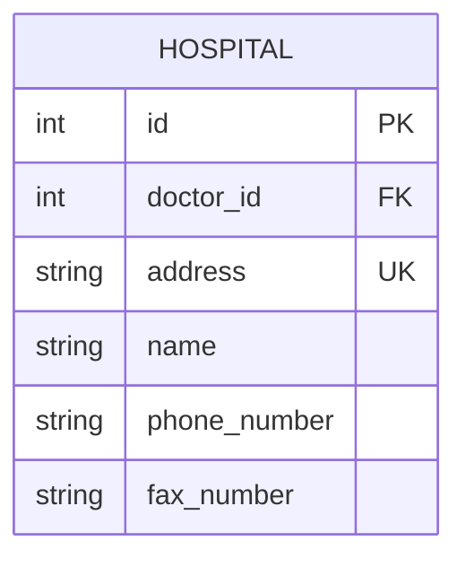
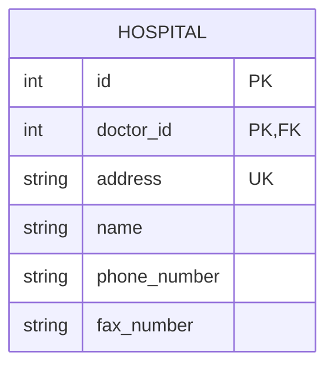
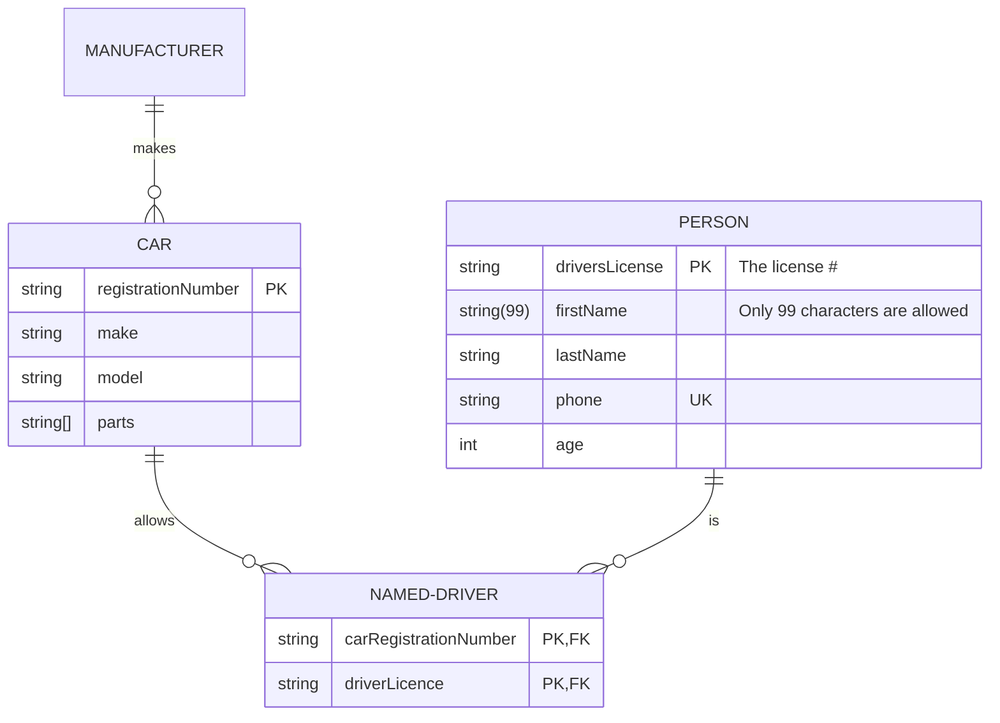
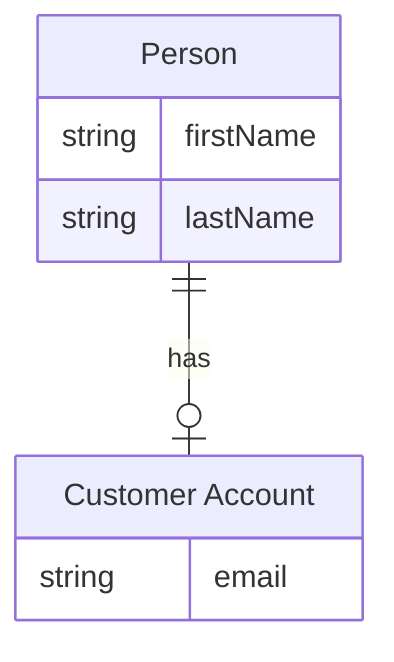
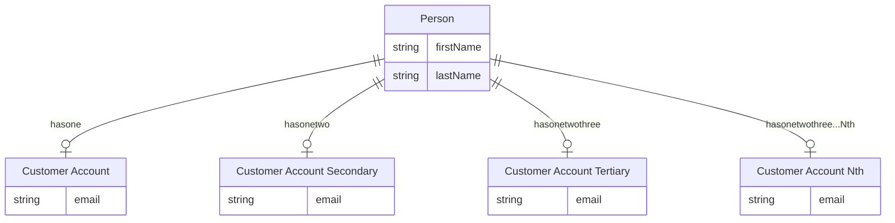
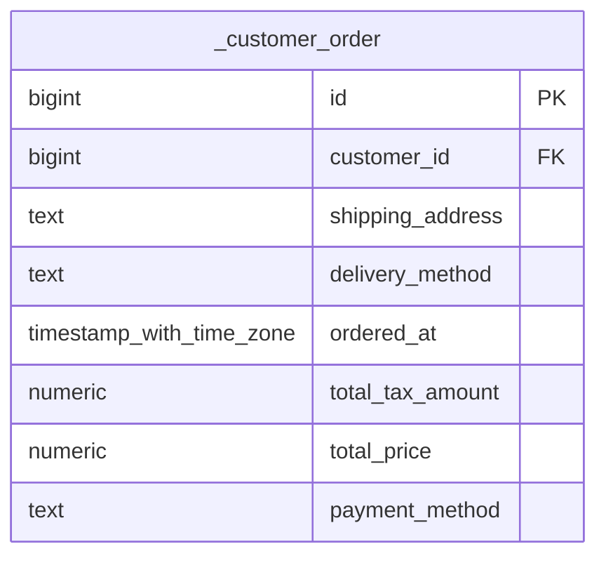

# er

## Example 1

**SebastianJS (SVG):**

> Render failed: Error: Diagrams beginning with --- are not valid. If you were trying to use a YAML front-matter, please ensure that you've correctly opened and closed the YAML front-matter with un-indented `---` blocks

**Mermaid Code (Browser Rendered):**

```mermaid
---
      title: This is a title
      config:
        theme: forest
      ---
      erDiagram
        %% title This is a title
        %% accDescription Test a description

        "Person . CUSTOMER"||--o{ ORDER : places

        ORDER ||--|{ "€£LINE_ITEM ¥" : contains

        "Person . CUSTOMER" }|..|{ "Address//StreetAddress::[DELIVERY ADDRESS]" : uses

        "Address//StreetAddress::[DELIVERY ADDRESS]" {
          int customerID FK
          string line1 "this is the first address line comment"
          string line2
          string city
          string region
          string state
          string(5) postal_code
          string country
        }

        "a_~`!@#$^&*()-_=+[]{}|/;:'.?¡⁄™€£‹¢›∞fi§‡•°ª·º‚≠±œŒ∑„®†ˇ¥Á¨ˆˆØπ∏“«»åÅßÍ∂΃ϩ˙Ó∆Ô˚¬Ò…ÚæÆΩ¸≈π˛çÇ√◊∫ı˜µÂ≤¯≥˘÷¿" {
          string name "this is an entity with an absurd name just to show characters that are now acceptable as long as the name is in double quotes"
        }

        "€£LINE_ITEM ¥" {
          int orderID FK
          int currencyId FK
          number price
          number quantity
          number adjustment
          number final_price
        }
```

## Example 2

**SebastianJS (SVG):**

<svg id="graph" xmlns="http://www.w3.org/2000/svg" xmlns:xlink="http://www.w3.org/1999/xlink" class="erDiagram" style="max-width: 15498px;" viewBox="-361 -125 341 265" role="graphics-document document" aria-roledescription="er"><style>#graph{font-family:"trebuchet ms",verdana,arial,sans-serif;font-size:16px;fill:#333;}@keyframes edge-animation-frame{from{stroke-dashoffset:0;}}@keyframes dash{to{stroke-dashoffset:0;}}#graph .edge-animation-slow{stroke-dasharray:9,5!important;stroke-dashoffset:900;animation:dash 50s linear infinite;stroke-linecap:round;}#graph .edge-animation-fast{stroke-dasharray:9,5!important;stroke-dashoffset:900;animation:dash 20s linear infinite;stroke-linecap:round;}#graph .error-icon{fill:#552222;}#graph .error-text{fill:#552222;stroke:#552222;}#graph .edge-thickness-normal{stroke-width:1px;}#graph .edge-thickness-thick{stroke-width:3.5px;}#graph .edge-pattern-solid{stroke-dasharray:0;}#graph .edge-thickness-invisible{stroke-width:0;fill:none;}#graph .edge-pattern-dashed{stroke-dasharray:3;}#graph .edge-pattern-dotted{stroke-dasharray:2;}#graph .marker{fill:#333333;stroke:#333333;}#graph .marker.cross{stroke:#333333;}#graph svg{font-family:"trebuchet ms",verdana,arial,sans-serif;font-size:16px;}#graph p{margin:0;}#graph .entityBox{fill:#ECECFF;stroke:#9370DB;}#graph .relationshipLabelBox{fill:hsl(80, 100%, 96.2745098039%);opacity:0.7;background-color:hsl(80, 100%, 96.2745098039%);}#graph .relationshipLabelBox rect{opacity:0.5;}#graph .labelBkg{background-color:rgba(248.6666666666, 255, 235.9999999999, 0.5);}#graph .edgeLabel .label{fill:#9370DB;font-size:14px;}#graph .label{font-family:"trebuchet ms",verdana,arial,sans-serif;color:#333;}#graph .edge-pattern-dashed{stroke-dasharray:8,8;}#graph .node rect,#graph .node circle,#graph .node ellipse,#graph .node polygon{fill:#ECECFF;stroke:#9370DB;stroke-width:1px;}#graph .relationshipLine{stroke:#333333;stroke-width:1;fill:none;}#graph .marker{fill:none!important;stroke:#333333!important;stroke-width:1;}#graph :root{--mermaid-font-family:"trebuchet ms",verdana,arial,sans-serif;}</style><g><defs><marker id="graph_er-onlyOneStart" class="marker onlyOne er" refX="0" refY="9" markerWidth="18" markerHeight="18" orient="auto"><path d="M9,0 L9,18 M15,0 L15,18"/></marker></defs><defs><marker id="graph_er-onlyOneEnd" class="marker onlyOne er" refX="18" refY="9" markerWidth="18" markerHeight="18" orient="auto"><path d="M3,0 L3,18 M9,0 L9,18"/></marker></defs><defs><marker id="graph_er-zeroOrOneStart" class="marker zeroOrOne er" refX="0" refY="9" markerWidth="30" markerHeight="18" orient="auto"><circle fill="white" cx="21" cy="9" r="6"/><path d="M9,0 L9,18"/></marker></defs><defs><marker id="graph_er-zeroOrOneEnd" class="marker zeroOrOne er" refX="30" refY="9" markerWidth="30" markerHeight="18" orient="auto"><circle fill="white" cx="9" cy="9" r="6"/><path d="M21,0 L21,18"/></marker></defs><defs><marker id="graph_er-oneOrMoreStart" class="marker oneOrMore er" refX="18" refY="18" markerWidth="45" markerHeight="36" orient="auto"><path d="M0,18 Q 18,0 36,18 Q 18,36 0,18 M42,9 L42,27"/></marker></defs><defs><marker id="graph_er-oneOrMoreEnd" class="marker oneOrMore er" refX="27" refY="18" markerWidth="45" markerHeight="36" orient="auto"><path d="M3,9 L3,27 M9,18 Q27,0 45,18 Q27,36 9,18"/></marker></defs><defs><marker id="graph_er-zeroOrMoreStart" class="marker zeroOrMore er" refX="18" refY="18" markerWidth="57" markerHeight="36" orient="auto"><circle fill="white" cx="48" cy="18" r="6"/><path d="M0,18 Q18,0 36,18 Q18,36 0,18"/></marker></defs><defs><marker id="graph_er-zeroOrMoreEnd" class="marker zeroOrMore er" refX="39" refY="18" markerWidth="57" markerHeight="36" orient="auto"><circle fill="white" cx="9" cy="18" r="6"/><path d="M21,18 Q39,0 57,18 Q39,36 21,18"/></marker></defs><g class="root"><g class="clusters"/><g class="edgePaths"/><g class="edgeLabels"/><g class="nodes"><g class="node default " id="entity-HOSPITAL-0" transform="translate(13, 20)"><g style=""><path d="M-382 -149.625 L382 -149.625 L382 149.625 L-382 149.625" stroke="none" stroke-width="0" fill="#ECECFF"/><path d="M-382 -149.625 C-205.58367712203201 -149.625, -29.16735424406403 -149.625, 382 -149.625 M-382 -149.625 C-87.6658748907642 -149.625, 206.6682502184716 -149.625, 382 -149.625 M382 -149.625 C382 -82.67097117661505, 382 -15.71694235323011, 382 149.625 M382 -149.625 C382 -33.93768260155488, 382 81.74963479689023, 382 149.625 M382 149.625 C81.2244664079879 149.625, -219.5510671840242 149.625, -382 149.625 M382 149.625 C122.7614808816154 149.625, -136.4770382367692 149.625, -382 149.625 M-382 149.625 C-382 71.53067369288466, -382 -6.563652614230676, -382 -149.625 M-382 149.625 C-382 77.48679719792378, -382 5.348594395847556, -382 -149.625" stroke="#9370DB" stroke-width="1.3" fill="none" stroke-dasharray="0 0"/></g><g style="" class="row-rect-odd"><path d="M-382 -106.875 L382 -106.875 L382 -64.125 L-382 -64.125" stroke="none" stroke-width="0" fill="hsl(240, 100%, 100%)"/><path d="M-382 -106.875 C-191.07554834627476 -106.875, -0.1510966925495154 -106.875, 382 -106.875 M-382 -106.875 C-115.77551633735442 -106.875, 150.44896732529116 -106.875, 382 -106.875 M382 -106.875 C382 -91.49814432609429, 382 -76.12128865218858, 382 -64.125 M382 -106.875 C382 -96.12902601357118, 382 -85.38305202714237, 382 -64.125 M382 -64.125 C183.51973379758482 -64.125, -14.96053240483036 -64.125, -382 -64.125 M382 -64.125 C111.17693151013702 -64.125, -159.64613697972595 -64.125, -382 -64.125 M-382 -64.125 C-382 -81.02595088619239, -382 -97.92690177238477, -382 -106.875 M-382 -64.125 C-382 -77.61644379333062, -382 -91.10788758666123, -382 -106.875" stroke="#9370DB" stroke-width="1.3" fill="none" stroke-dasharray="0 0"/></g><g style="" class="row-rect-even"><path d="M-382 -64.125 L382 -64.125 L382 -21.375 L-382 -21.375" stroke="none" stroke-width="0" fill="hsl(240, 100%, 97.2745098039%)"/><path d="M-382 -64.125 C-157.2524964298845 -64.125, 67.495007140231 -64.125, 382 -64.125 M-382 -64.125 C-121.31874561847985 -64.125, 139.3625087630403 -64.125, 382 -64.125 M382 -64.125 C382 -49.906022942551836, 382 -35.68704588510367, 382 -21.375 M382 -64.125 C382 -49.939444462146106, 382 -35.75388892429221, 382 -21.375 M382 -21.375 C209.47530200922498 -21.375, 36.95060401844995 -21.375, -382 -21.375 M382 -21.375 C218.72344181519807 -21.375, 55.446883630396144 -21.375, -382 -21.375 M-382 -21.375 C-382 -32.528842352920535, -382 -43.68268470584107, -382 -64.125 M-382 -21.375 C-382 -30.454050213862924, -382 -39.53310042772585, -382 -64.125" stroke="#9370DB" stroke-width="1.3" fill="none" stroke-dasharray="0 0"/></g><g style="" class="row-rect-odd"><path d="M-382 -21.375 L382 -21.375 L382 21.375 L-382 21.375" stroke="none" stroke-width="0" fill="hsl(240, 100%, 100%)"/><path d="M-382 -21.375 C-194.97724274147913 -21.375, -7.954485482958262 -21.375, 382 -21.375 M-382 -21.375 C-223.97296183644767 -21.375, -65.94592367289533 -21.375, 382 -21.375 M382 -21.375 C382 -8.705251141600675, 382 3.9644977167986504, 382 21.375 M382 -21.375 C382 -9.110315128063968, 382 3.1543697438720635, 382 21.375 M382 21.375 C107.69934803877385 21.375, -166.6013039224523 21.375, -382 21.375 M382 21.375 C210.62509080630429 21.375, 39.25018161260857 21.375, -382 21.375 M-382 21.375 C-382 5.465820054239753, -382 -10.443359891520494, -382 -21.375 M-382 21.375 C-382 7.574277777710396, -382 -6.226444444579208, -382 -21.375" stroke="#9370DB" stroke-width="1.3" fill="none" stroke-dasharray="0 0"/></g><g style="" class="row-rect-even"><path d="M-382 21.375 L382 21.375 L382 64.125 L-382 64.125" stroke="none" stroke-width="0" fill="hsl(240, 100%, 97.2745098039%)"/><path d="M-382 21.375 C-118.30569829408643 21.375, 145.38860341182715 21.375, 382 21.375 M-382 21.375 C-124.44260890467848 21.375, 133.11478219064304 21.375, 382 21.375 M382 21.375 C382 36.70800426083744, 382 52.04100852167489, 382 64.125 M382 21.375 C382 34.84579032247798, 382 48.31658064495597, 382 64.125 M382 64.125 C123.5380331000261 64.125, -134.9239337999478 64.125, -382 64.125 M382 64.125 C168.1932600223618 64.125, -45.613479955276375 64.125, -382 64.125 M-382 64.125 C-382 50.27633720885999, -382 36.427674417719984, -382 21.375 M-382 64.125 C-382 48.37918500365054, -382 32.63337000730108, -382 21.375" stroke="#9370DB" stroke-width="1.3" fill="none" stroke-dasharray="0 0"/></g><g style="" class="row-rect-odd"><path d="M-382 64.125 L382 64.125 L382 106.875 L-382 106.875" stroke="none" stroke-width="0" fill="hsl(240, 100%, 100%)"/><path d="M-382 64.125 C-169.80262940919212 64.125, 42.39474118161576 64.125, 382 64.125 M-382 64.125 C-110.38482359855942 64.125, 161.23035280288116 64.125, 382 64.125 M382 64.125 C382 75.70386156898961, 382 87.28272313797922, 382 106.875 M382 64.125 C382 75.84750995665321, 382 87.57001991330642, 382 106.875 M382 106.875 C228.98082158380862 106.875, 75.96164316761724 106.875, -382 106.875 M382 106.875 C88.30063563047287 106.875, -205.39872873905426 106.875, -382 106.875 M-382 106.875 C-382 92.63513613701757, -382 78.39527227403514, -382 64.125 M-382 106.875 C-382 89.84144251671688, -382 72.80788503343376, -382 64.125" stroke="#9370DB" stroke-width="1.3" fill="none" stroke-dasharray="0 0"/></g><g style="" class="row-rect-even"><path d="M-382 106.875 L382 106.875 L382 149.625 L-382 149.625" stroke="none" stroke-width="0" fill="hsl(240, 100%, 97.2745098039%)"/><path d="M-382 106.875 C-113.3678484281291 106.875, 155.2643031437418 106.875, 382 106.875 M-382 106.875 C-227.8352876826544 106.875, -73.67057536530882 106.875, 382 106.875 M382 106.875 C382 118.51907548133252, 382 130.16315096266504, 382 149.625 M382 106.875 C382 123.69966899594344, 382 140.52433799188688, 382 149.625 M382 149.625 C207.88190702255199 149.625, 33.76381404510397 149.625, -382 149.625 M382 149.625 C112.13210139374786 149.625, -157.73579721250428 149.625, -382 149.625 M-382 149.625 C-382 138.70543869563966, -382 127.78587739127931, -382 106.875 M-382 149.625 C-382 139.77531704770283, -382 129.92563409540563, -382 106.875" stroke="#9370DB" stroke-width="1.3" fill="none" stroke-dasharray="0 0"/></g><g class="label name" transform="translate(-37, -140.25)" style=""><g><rect class="background" style="stroke: none"/></g><text y="-10.1" style=""><tspan class="text-outer-tspan" x="0" y="-0.1em" dy="1.1em"><tspan font-style="normal" class="text-inner-tspan" font-weight="normal">HOSPITAL</tspan></tspan></text></g><g class="label attribute-type" transform="translate(-369.5, -97.5)" style=""><g><rect class="background" style="stroke: none"/></g><text y="-10.1" style=""><tspan class="text-outer-tspan" x="0" y="-0.1em" dy="1.1em"><tspan font-style="normal" class="text-inner-tspan" font-weight="normal">int</tspan></tspan></text></g><g class="label attribute-name" transform="translate(-286.5, -97.5)" style=""><g><rect class="background" style="stroke: none"/></g><text y="-10.1" style=""><tspan class="text-outer-tspan" x="0" y="-0.1em" dy="1.1em"><tspan font-style="normal" class="text-inner-tspan" font-weight="normal">id</tspan></tspan></text></g><g class="label attribute-keys" transform="translate(-155.5, -97.5)" style=""><g><rect class="background" style="stroke: none"/></g><text y="-10.1" style=""><tspan class="text-outer-tspan" x="0" y="-0.1em" dy="1.1em"><tspan font-style="normal" class="text-inner-tspan" font-weight="normal">PK</tspan></tspan></text></g><g class="label attribute-comment" transform="translate(-104.5, -97.5)" style=""><g><rect class="background" style="stroke: none"/></g><text y="-10.1" style=""><tspan class="text-outer-tspan" x="0" y="-0.1em" dy="1.1em"/></text></g><g class="label attribute-type" transform="translate(-369.5, -54.75)" style=""><g><rect class="background" style="stroke: none"/></g><text y="-10.1" style=""><tspan class="text-outer-tspan" x="0" y="-0.1em" dy="1.1em"><tspan font-style="normal" class="text-inner-tspan" font-weight="normal">int</tspan></tspan></text></g><g class="label attribute-name" transform="translate(-286.5, -54.75)" style=""><g><rect class="background" style="stroke: none"/></g><text y="-10.1" style=""><tspan class="text-outer-tspan" x="0" y="-0.1em" dy="1.1em"><tspan font-style="normal" class="text-inner-tspan" font-weight="normal">doctor_id</tspan></tspan></text></g><g class="label attribute-keys" transform="translate(-155.5, -54.75)" style=""><g><rect class="background" style="stroke: none"/></g><text y="-10.1" style=""><tspan class="text-outer-tspan" x="0" y="-0.1em" dy="1.1em"><tspan font-style="normal" class="text-inner-tspan" font-weight="normal">FK</tspan></tspan></text></g><g class="label attribute-comment" transform="translate(-104.5, -54.75)" style=""><g><rect class="background" style="stroke: none"/></g><text y="-10.1" style=""><tspan class="text-outer-tspan" x="0" y="-0.1em" dy="1.1em"/></text></g><g class="label attribute-type" transform="translate(-369.5, -12)" style=""><g><rect class="background" style="stroke: none"/></g><text y="-10.1" style=""><tspan class="text-outer-tspan" x="0" y="-0.1em" dy="1.1em"><tspan font-style="normal" class="text-inner-tspan" font-weight="normal">string</tspan></tspan></text></g><g class="label attribute-name" transform="translate(-286.5, -12)" style=""><g><rect class="background" style="stroke: none"/></g><text y="-10.1" style=""><tspan class="text-outer-tspan" x="0" y="-0.1em" dy="1.1em"><tspan font-style="normal" class="text-inner-tspan" font-weight="normal">address</tspan></tspan></text></g><g class="label attribute-keys" transform="translate(-155.5, -12)" style=""><g><rect class="background" style="stroke: none"/></g><text y="-10.1" style=""><tspan class="text-outer-tspan" x="0" y="-0.1em" dy="1.1em"><tspan font-style="normal" class="text-inner-tspan" font-weight="normal">UK</tspan></tspan></text></g><g class="label attribute-comment" transform="translate(-104.5, -12)" style=""><g><rect class="background" style="stroke: none"/></g><text y="-10.1" style=""><tspan class="text-outer-tspan" x="0" y="-0.1em" dy="1.1em"/></text></g><g class="label attribute-type" transform="translate(-369.5, 30.75)" style=""><g><rect class="background" style="stroke: none"/></g><text y="-10.1" style=""><tspan class="text-outer-tspan" x="0" y="-0.1em" dy="1.1em"><tspan font-style="normal" class="text-inner-tspan" font-weight="normal">string</tspan></tspan></text></g><g class="label attribute-name" transform="translate(-286.5, 30.75)" style=""><g><rect class="background" style="stroke: none"/></g><text y="-10.1" style=""><tspan class="text-outer-tspan" x="0" y="-0.1em" dy="1.1em"><tspan font-style="normal" class="text-inner-tspan" font-weight="normal">name</tspan></tspan></text></g><g class="label attribute-keys" transform="translate(-155.5, 30.75)" style=""><g><rect class="background" style="stroke: none"/></g><text y="-10.1" style=""><tspan class="text-outer-tspan" x="0" y="-0.1em" dy="1.1em"/></text></g><g class="label attribute-comment" transform="translate(-104.5, 30.75)" style=""><g><rect class="background" style="stroke: none"/></g><text y="-10.1" style=""><tspan class="text-outer-tspan" x="0" y="-0.1em" dy="1.1em"/></text></g><g class="label attribute-type" transform="translate(-369.5, 73.5)" style=""><g><rect class="background" style="stroke: none"/></g><text y="-10.1" style=""><tspan class="text-outer-tspan" x="0" y="-0.1em" dy="1.1em"><tspan font-style="normal" class="text-inner-tspan" font-weight="normal">string</tspan></tspan></text></g><g class="label attribute-name" transform="translate(-286.5, 73.5)" style=""><g><rect class="background" style="stroke: none"/></g><text y="-10.1" style=""><tspan class="text-outer-tspan" x="0" y="-0.1em" dy="1.1em"><tspan font-style="normal" class="text-inner-tspan" font-weight="normal">phone_number</tspan></tspan></text></g><g class="label attribute-keys" transform="translate(-155.5, 73.5)" style=""><g><rect class="background" style="stroke: none"/></g><text y="-10.1" style=""><tspan class="text-outer-tspan" x="0" y="-0.1em" dy="1.1em"/></text></g><g class="label attribute-comment" transform="translate(-104.5, 73.5)" style=""><g><rect class="background" style="stroke: none"/></g><text y="-10.1" style=""><tspan class="text-outer-tspan" x="0" y="-0.1em" dy="1.1em"/></text></g><g class="label attribute-type" transform="translate(-369.5, 116.25)" style=""><g><rect class="background" style="stroke: none"/></g><text y="-10.1" style=""><tspan class="text-outer-tspan" x="0" y="-0.1em" dy="1.1em"><tspan font-style="normal" class="text-inner-tspan" font-weight="normal">string</tspan></tspan></text></g><g class="label attribute-name" transform="translate(-286.5, 116.25)" style=""><g><rect class="background" style="stroke: none"/></g><text y="-10.1" style=""><tspan class="text-outer-tspan" x="0" y="-0.1em" dy="1.1em"><tspan font-style="normal" class="text-inner-tspan" font-weight="normal">fax_number</tspan></tspan></text></g><g class="label attribute-keys" transform="translate(-155.5, 116.25)" style=""><g><rect class="background" style="stroke: none"/></g><text y="-10.1" style=""><tspan class="text-outer-tspan" x="0" y="-0.1em" dy="1.1em"/></text></g><g class="label attribute-comment" transform="translate(-104.5, 116.25)" style=""><g><rect class="background" style="stroke: none"/></g><text y="-10.1" style=""><tspan class="text-outer-tspan" x="0" y="-0.1em" dy="1.1em"/></text></g><g class="divider"><path d="M-382 -106.875 C-197.7634499180866 -106.875, -13.526899836173186 -106.875, 382 -106.875 M-382 -106.875 C-160.85852919083297 -106.875, 60.282941618334064 -106.875, 382 -106.875" stroke="#9370DB" stroke-width="1.3" fill="none" stroke-dasharray="0 0"/></g><g class="divider"><path d="M-299 -106.875 C-299 -27.392952546767702, -299 52.089094906464595, -299 149.625 M-299 -106.875 C-299 -46.27677398790979, -299 14.321452024180417, -299 149.625" stroke="#9370DB" stroke-width="1.3" fill="none" stroke-dasharray="0 0"/></g><g class="divider"><path d="M-168 -106.875 C-168 -45.58075961134983, -168 15.713480777300333, -168 149.625 M-168 -106.875 C-168 -31.418214861182094, -168 44.03857027763581, -168 149.625" stroke="#9370DB" stroke-width="1.3" fill="none" stroke-dasharray="0 0"/></g><g class="divider"><path d="M-117 -106.875 C-117 -16.919373989655597, -117 73.0362520206888, -117 149.625 M-117 -106.875 C-117 -9.593710688367139, -117 87.68757862326572, -117 149.625" stroke="#9370DB" stroke-width="1.3" fill="none" stroke-dasharray="0 0"/></g><g class="divider"><path d="M-382 -106.875 C-110.99324472221218 -106.875, 160.01351055557564 -106.875, 382 -106.875 M-382 -106.875 C-226.75040833899573 -106.875, -71.50081667799145 -106.875, 382 -106.875" stroke="#9370DB" stroke-width="1.3" fill="none" stroke-dasharray="0 0"/></g></g></g></g></g></svg>

**Mermaid Code (Browser Rendered):**



## Example 3

**SebastianJS (SVG):**

<svg id="graph" xmlns="http://www.w3.org/2000/svg" xmlns:xlink="http://www.w3.org/1999/xlink" class="erDiagram" style="max-width: 15522px;" viewBox="-373 -125 353 265" role="graphics-document document" aria-roledescription="er"><style>#graph{font-family:"trebuchet ms",verdana,arial,sans-serif;font-size:16px;fill:#333;}@keyframes edge-animation-frame{from{stroke-dashoffset:0;}}@keyframes dash{to{stroke-dashoffset:0;}}#graph .edge-animation-slow{stroke-dasharray:9,5!important;stroke-dashoffset:900;animation:dash 50s linear infinite;stroke-linecap:round;}#graph .edge-animation-fast{stroke-dasharray:9,5!important;stroke-dashoffset:900;animation:dash 20s linear infinite;stroke-linecap:round;}#graph .error-icon{fill:#552222;}#graph .error-text{fill:#552222;stroke:#552222;}#graph .edge-thickness-normal{stroke-width:1px;}#graph .edge-thickness-thick{stroke-width:3.5px;}#graph .edge-pattern-solid{stroke-dasharray:0;}#graph .edge-thickness-invisible{stroke-width:0;fill:none;}#graph .edge-pattern-dashed{stroke-dasharray:3;}#graph .edge-pattern-dotted{stroke-dasharray:2;}#graph .marker{fill:#333333;stroke:#333333;}#graph .marker.cross{stroke:#333333;}#graph svg{font-family:"trebuchet ms",verdana,arial,sans-serif;font-size:16px;}#graph p{margin:0;}#graph .entityBox{fill:#ECECFF;stroke:#9370DB;}#graph .relationshipLabelBox{fill:hsl(80, 100%, 96.2745098039%);opacity:0.7;background-color:hsl(80, 100%, 96.2745098039%);}#graph .relationshipLabelBox rect{opacity:0.5;}#graph .labelBkg{background-color:rgba(248.6666666666, 255, 235.9999999999, 0.5);}#graph .edgeLabel .label{fill:#9370DB;font-size:14px;}#graph .label{font-family:"trebuchet ms",verdana,arial,sans-serif;color:#333;}#graph .edge-pattern-dashed{stroke-dasharray:8,8;}#graph .node rect,#graph .node circle,#graph .node ellipse,#graph .node polygon{fill:#ECECFF;stroke:#9370DB;stroke-width:1px;}#graph .relationshipLine{stroke:#333333;stroke-width:1;fill:none;}#graph .marker{fill:none!important;stroke:#333333!important;stroke-width:1;}#graph :root{--mermaid-font-family:"trebuchet ms",verdana,arial,sans-serif;}</style><g><defs><marker id="graph_er-onlyOneStart" class="marker onlyOne er" refX="0" refY="9" markerWidth="18" markerHeight="18" orient="auto"><path d="M9,0 L9,18 M15,0 L15,18"/></marker></defs><defs><marker id="graph_er-onlyOneEnd" class="marker onlyOne er" refX="18" refY="9" markerWidth="18" markerHeight="18" orient="auto"><path d="M3,0 L3,18 M9,0 L9,18"/></marker></defs><defs><marker id="graph_er-zeroOrOneStart" class="marker zeroOrOne er" refX="0" refY="9" markerWidth="30" markerHeight="18" orient="auto"><circle fill="white" cx="21" cy="9" r="6"/><path d="M9,0 L9,18"/></marker></defs><defs><marker id="graph_er-zeroOrOneEnd" class="marker zeroOrOne er" refX="30" refY="9" markerWidth="30" markerHeight="18" orient="auto"><circle fill="white" cx="9" cy="9" r="6"/><path d="M21,0 L21,18"/></marker></defs><defs><marker id="graph_er-oneOrMoreStart" class="marker oneOrMore er" refX="18" refY="18" markerWidth="45" markerHeight="36" orient="auto"><path d="M0,18 Q 18,0 36,18 Q 18,36 0,18 M42,9 L42,27"/></marker></defs><defs><marker id="graph_er-oneOrMoreEnd" class="marker oneOrMore er" refX="27" refY="18" markerWidth="45" markerHeight="36" orient="auto"><path d="M3,9 L3,27 M9,18 Q27,0 45,18 Q27,36 9,18"/></marker></defs><defs><marker id="graph_er-zeroOrMoreStart" class="marker zeroOrMore er" refX="18" refY="18" markerWidth="57" markerHeight="36" orient="auto"><circle fill="white" cx="48" cy="18" r="6"/><path d="M0,18 Q18,0 36,18 Q18,36 0,18"/></marker></defs><defs><marker id="graph_er-zeroOrMoreEnd" class="marker zeroOrMore er" refX="39" refY="18" markerWidth="57" markerHeight="36" orient="auto"><circle fill="white" cx="9" cy="18" r="6"/><path d="M21,18 Q39,0 57,18 Q39,36 21,18"/></marker></defs><g class="root"><g class="clusters"/><g class="edgePaths"/><g class="edgeLabels"/><g class="nodes"><g class="node default " id="entity-HOSPITAL-0" transform="translate(13, 20)"><g style=""><path d="M-394 -149.625 L394 -149.625 L394 149.625 L-394 149.625" stroke="none" stroke-width="0" fill="#ECECFF"/><path d="M-394 -149.625 C-176.2160521982103 -149.625, 41.567895603579416 -149.625, 394 -149.625 M-394 -149.625 C-86.96415777373306 -149.625, 220.07168445253387 -149.625, 394 -149.625 M394 -149.625 C394 -65.85726453274049, 394 17.910470934519026, 394 149.625 M394 -149.625 C394 -64.69304310341226, 394 20.23891379317547, 394 149.625 M394 149.625 C93.08603087045282 149.625, -207.82793825909437 149.625, -394 149.625 M394 149.625 C220.96522962015155 149.625, 47.930459240303094 149.625, -394 149.625 M-394 149.625 C-394 31.005374656378777, -394 -87.61425068724245, -394 -149.625 M-394 149.625 C-394 82.5101518363085, -394 15.39530367261699, -394 -149.625" stroke="#9370DB" stroke-width="1.3" fill="none" stroke-dasharray="0 0"/></g><g style="" class="row-rect-odd"><path d="M-394 -106.875 L394 -106.875 L394 -64.125 L-394 -64.125" stroke="none" stroke-width="0" fill="hsl(240, 100%, 100%)"/><path d="M-394 -106.875 C-100.44776375460918 -106.875, 193.10447249078163 -106.875, 394 -106.875 M-394 -106.875 C-192.16478647471575 -106.875, 9.670427050568492 -106.875, 394 -106.875 M394 -106.875 C394 -93.18908197142022, 394 -79.50316394284044, 394 -64.125 M394 -106.875 C394 -98.114501991636, 394 -89.35400398327201, 394 -64.125 M394 -64.125 C129.87426093085236 -64.125, -134.25147813829528 -64.125, -394 -64.125 M394 -64.125 C185.39817239841332 -64.125, -23.203655203173355 -64.125, -394 -64.125 M-394 -64.125 C-394 -79.10757417147202, -394 -94.09014834294405, -394 -106.875 M-394 -64.125 C-394 -80.22865577721723, -394 -96.33231155443447, -394 -106.875" stroke="#9370DB" stroke-width="1.3" fill="none" stroke-dasharray="0 0"/></g><g style="" class="row-rect-even"><path d="M-394 -64.125 L394 -64.125 L394 -21.375 L-394 -21.375" stroke="none" stroke-width="0" fill="hsl(240, 100%, 97.2745098039%)"/><path d="M-394 -64.125 C-186.78511023524229 -64.125, 20.42977952951543 -64.125, 394 -64.125 M-394 -64.125 C-98.33596978828405 -64.125, 197.3280604234319 -64.125, 394 -64.125 M394 -64.125 C394 -48.377451875211484, 394 -32.62990375042297, 394 -21.375 M394 -64.125 C394 -52.860376512595955, 394 -41.59575302519191, 394 -21.375 M394 -21.375 C154.54115980194564 -21.375, -84.91768039610872 -21.375, -394 -21.375 M394 -21.375 C208.7397863772747 -21.375, 23.479572754549395 -21.375, -394 -21.375 M-394 -21.375 C-394 -31.40281765008458, -394 -41.43063530016916, -394 -64.125 M-394 -21.375 C-394 -30.524250731643644, -394 -39.67350146328729, -394 -64.125" stroke="#9370DB" stroke-width="1.3" fill="none" stroke-dasharray="0 0"/></g><g style="" class="row-rect-odd"><path d="M-394 -21.375 L394 -21.375 L394 21.375 L-394 21.375" stroke="none" stroke-width="0" fill="hsl(240, 100%, 100%)"/><path d="M-394 -21.375 C-173.60612910794677 -21.375, 46.78774178410646 -21.375, 394 -21.375 M-394 -21.375 C-219.08252554633307 -21.375, -44.16505109266615 -21.375, 394 -21.375 M394 -21.375 C394 -5.652860391359006, 394 10.069279217281988, 394 21.375 M394 -21.375 C394 -11.860856823094627, 394 -2.3467136461892544, 394 21.375 M394 21.375 C206.03320169399612 21.375, 18.06640338799224 21.375, -394 21.375 M394 21.375 C146.54207670166537 21.375, -100.91584659666927 21.375, -394 21.375 M-394 21.375 C-394 4.462512016529381, -394 -12.449975966941238, -394 -21.375 M-394 21.375 C-394 6.865478527673339, -394 -7.644042944653322, -394 -21.375" stroke="#9370DB" stroke-width="1.3" fill="none" stroke-dasharray="0 0"/></g><g style="" class="row-rect-even"><path d="M-394 21.375 L394 21.375 L394 64.125 L-394 64.125" stroke="none" stroke-width="0" fill="hsl(240, 100%, 97.2745098039%)"/><path d="M-394 21.375 C-105.29803537291832 21.375, 183.40392925416336 21.375, 394 21.375 M-394 21.375 C-85.32866872770143 21.375, 223.34266254459715 21.375, 394 21.375 M394 21.375 C394 37.73897916668467, 394 54.10295833336935, 394 64.125 M394 21.375 C394 31.345689092374727, 394 41.31637818474945, 394 64.125 M394 64.125 C151.93204712882965 64.125, -90.1359057423407 64.125, -394 64.125 M394 64.125 C213.21770640681456 64.125, 32.435412813629114 64.125, -394 64.125 M-394 64.125 C-394 54.51387258036404, -394 44.90274516072808, -394 21.375 M-394 64.125 C-394 48.263528658578515, -394 32.40205731715703, -394 21.375" stroke="#9370DB" stroke-width="1.3" fill="none" stroke-dasharray="0 0"/></g><g style="" class="row-rect-odd"><path d="M-394 64.125 L394 64.125 L394 106.875 L-394 106.875" stroke="none" stroke-width="0" fill="hsl(240, 100%, 100%)"/><path d="M-394 64.125 C-191.11298976995934 64.125, 11.774020460081317 64.125, 394 64.125 M-394 64.125 C-144.45147669079856 64.125, 105.09704661840289 64.125, 394 64.125 M394 64.125 C394 72.82768778472376, 394 81.53037556944753, 394 106.875 M394 64.125 C394 73.23519247444531, 394 82.34538494889061, 394 106.875 M394 106.875 C191.045432754368 106.875, -11.909134491264012 106.875, -394 106.875 M394 106.875 C219.6659342379878 106.875, 45.331868475975625 106.875, -394 106.875 M-394 106.875 C-394 97.54875512855897, -394 88.22251025711795, -394 64.125 M-394 106.875 C-394 94.07737925734996, -394 81.27975851469992, -394 64.125" stroke="#9370DB" stroke-width="1.3" fill="none" stroke-dasharray="0 0"/></g><g style="" class="row-rect-even"><path d="M-394 106.875 L394 106.875 L394 149.625 L-394 149.625" stroke="none" stroke-width="0" fill="hsl(240, 100%, 97.2745098039%)"/><path d="M-394 106.875 C-137.0247886776674 106.875, 119.9504226446652 106.875, 394 106.875 M-394 106.875 C-146.78607965573914 106.875, 100.42784068852171 106.875, 394 106.875 M394 106.875 C394 117.88529278921006, 394 128.8955855784201, 394 149.625 M394 106.875 C394 120.90219644663745, 394 134.9293928932749, 394 149.625 M394 149.625 C170.18309412533856 149.625, -53.63381174932289 149.625, -394 149.625 M394 149.625 C90.03785248086331 149.625, -213.92429503827339 149.625, -394 149.625 M-394 149.625 C-394 132.75369990232608, -394 115.88239980465214, -394 106.875 M-394 149.625 C-394 137.8968760188127, -394 126.16875203762538, -394 106.875" stroke="#9370DB" stroke-width="1.3" fill="none" stroke-dasharray="0 0"/></g><g class="label name" transform="translate(-37, -140.25)" style=""><g><rect class="background" style="stroke: none"/></g><text y="-10.1" style=""><tspan class="text-outer-tspan" x="0" y="-0.1em" dy="1.1em"><tspan font-style="normal" class="text-inner-tspan" font-weight="normal">HOSPITAL</tspan></tspan></text></g><g class="label attribute-type" transform="translate(-381.5, -97.5)" style=""><g><rect class="background" style="stroke: none"/></g><text y="-10.1" style=""><tspan class="text-outer-tspan" x="0" y="-0.1em" dy="1.1em"><tspan font-style="normal" class="text-inner-tspan" font-weight="normal">int</tspan></tspan></text></g><g class="label attribute-name" transform="translate(-298.5, -97.5)" style=""><g><rect class="background" style="stroke: none"/></g><text y="-10.1" style=""><tspan class="text-outer-tspan" x="0" y="-0.1em" dy="1.1em"><tspan font-style="normal" class="text-inner-tspan" font-weight="normal">id</tspan></tspan></text></g><g class="label attribute-keys" transform="translate(-167.5, -97.5)" style=""><g><rect class="background" style="stroke: none"/></g><text y="-10.1" style=""><tspan class="text-outer-tspan" x="0" y="-0.1em" dy="1.1em"><tspan font-style="normal" class="text-inner-tspan" font-weight="normal">PK</tspan></tspan></text></g><g class="label attribute-comment" transform="translate(-92.5, -97.5)" style=""><g><rect class="background" style="stroke: none"/></g><text y="-10.1" style=""><tspan class="text-outer-tspan" x="0" y="-0.1em" dy="1.1em"/></text></g><g class="label attribute-type" transform="translate(-381.5, -54.75)" style=""><g><rect class="background" style="stroke: none"/></g><text y="-10.1" style=""><tspan class="text-outer-tspan" x="0" y="-0.1em" dy="1.1em"><tspan font-style="normal" class="text-inner-tspan" font-weight="normal">int</tspan></tspan></text></g><g class="label attribute-name" transform="translate(-298.5, -54.75)" style=""><g><rect class="background" style="stroke: none"/></g><text y="-10.1" style=""><tspan class="text-outer-tspan" x="0" y="-0.1em" dy="1.1em"><tspan font-style="normal" class="text-inner-tspan" font-weight="normal">doctor_id</tspan></tspan></text></g><g class="label attribute-keys" transform="translate(-167.5, -54.75)" style=""><g><rect class="background" style="stroke: none"/></g><text y="-10.1" style=""><tspan class="text-outer-tspan" x="0" y="-0.1em" dy="1.1em"><tspan font-style="normal" class="text-inner-tspan" font-weight="normal">PK,FK</tspan></tspan></text></g><g class="label attribute-comment" transform="translate(-92.5, -54.75)" style=""><g><rect class="background" style="stroke: none"/></g><text y="-10.1" style=""><tspan class="text-outer-tspan" x="0" y="-0.1em" dy="1.1em"/></text></g><g class="label attribute-type" transform="translate(-381.5, -12)" style=""><g><rect class="background" style="stroke: none"/></g><text y="-10.1" style=""><tspan class="text-outer-tspan" x="0" y="-0.1em" dy="1.1em"><tspan font-style="normal" class="text-inner-tspan" font-weight="normal">string</tspan></tspan></text></g><g class="label attribute-name" transform="translate(-298.5, -12)" style=""><g><rect class="background" style="stroke: none"/></g><text y="-10.1" style=""><tspan class="text-outer-tspan" x="0" y="-0.1em" dy="1.1em"><tspan font-style="normal" class="text-inner-tspan" font-weight="normal">address</tspan></tspan></text></g><g class="label attribute-keys" transform="translate(-167.5, -12)" style=""><g><rect class="background" style="stroke: none"/></g><text y="-10.1" style=""><tspan class="text-outer-tspan" x="0" y="-0.1em" dy="1.1em"><tspan font-style="normal" class="text-inner-tspan" font-weight="normal">UK</tspan></tspan></text></g><g class="label attribute-comment" transform="translate(-92.5, -12)" style=""><g><rect class="background" style="stroke: none"/></g><text y="-10.1" style=""><tspan class="text-outer-tspan" x="0" y="-0.1em" dy="1.1em"/></text></g><g class="label attribute-type" transform="translate(-381.5, 30.75)" style=""><g><rect class="background" style="stroke: none"/></g><text y="-10.1" style=""><tspan class="text-outer-tspan" x="0" y="-0.1em" dy="1.1em"><tspan font-style="normal" class="text-inner-tspan" font-weight="normal">string</tspan></tspan></text></g><g class="label attribute-name" transform="translate(-298.5, 30.75)" style=""><g><rect class="background" style="stroke: none"/></g><text y="-10.1" style=""><tspan class="text-outer-tspan" x="0" y="-0.1em" dy="1.1em"><tspan font-style="normal" class="text-inner-tspan" font-weight="normal">name</tspan></tspan></text></g><g class="label attribute-keys" transform="translate(-167.5, 30.75)" style=""><g><rect class="background" style="stroke: none"/></g><text y="-10.1" style=""><tspan class="text-outer-tspan" x="0" y="-0.1em" dy="1.1em"/></text></g><g class="label attribute-comment" transform="translate(-92.5, 30.75)" style=""><g><rect class="background" style="stroke: none"/></g><text y="-10.1" style=""><tspan class="text-outer-tspan" x="0" y="-0.1em" dy="1.1em"/></text></g><g class="label attribute-type" transform="translate(-381.5, 73.5)" style=""><g><rect class="background" style="stroke: none"/></g><text y="-10.1" style=""><tspan class="text-outer-tspan" x="0" y="-0.1em" dy="1.1em"><tspan font-style="normal" class="text-inner-tspan" font-weight="normal">string</tspan></tspan></text></g><g class="label attribute-name" transform="translate(-298.5, 73.5)" style=""><g><rect class="background" style="stroke: none"/></g><text y="-10.1" style=""><tspan class="text-outer-tspan" x="0" y="-0.1em" dy="1.1em"><tspan font-style="normal" class="text-inner-tspan" font-weight="normal">phone_number</tspan></tspan></text></g><g class="label attribute-keys" transform="translate(-167.5, 73.5)" style=""><g><rect class="background" style="stroke: none"/></g><text y="-10.1" style=""><tspan class="text-outer-tspan" x="0" y="-0.1em" dy="1.1em"/></text></g><g class="label attribute-comment" transform="translate(-92.5, 73.5)" style=""><g><rect class="background" style="stroke: none"/></g><text y="-10.1" style=""><tspan class="text-outer-tspan" x="0" y="-0.1em" dy="1.1em"/></text></g><g class="label attribute-type" transform="translate(-381.5, 116.25)" style=""><g><rect class="background" style="stroke: none"/></g><text y="-10.1" style=""><tspan class="text-outer-tspan" x="0" y="-0.1em" dy="1.1em"><tspan font-style="normal" class="text-inner-tspan" font-weight="normal">string</tspan></tspan></text></g><g class="label attribute-name" transform="translate(-298.5, 116.25)" style=""><g><rect class="background" style="stroke: none"/></g><text y="-10.1" style=""><tspan class="text-outer-tspan" x="0" y="-0.1em" dy="1.1em"><tspan font-style="normal" class="text-inner-tspan" font-weight="normal">fax_number</tspan></tspan></text></g><g class="label attribute-keys" transform="translate(-167.5, 116.25)" style=""><g><rect class="background" style="stroke: none"/></g><text y="-10.1" style=""><tspan class="text-outer-tspan" x="0" y="-0.1em" dy="1.1em"/></text></g><g class="label attribute-comment" transform="translate(-92.5, 116.25)" style=""><g><rect class="background" style="stroke: none"/></g><text y="-10.1" style=""><tspan class="text-outer-tspan" x="0" y="-0.1em" dy="1.1em"/></text></g><g class="divider"><path d="M-394 -106.875 C-212.52508173857623 -106.875, -31.050163477152466 -106.875, 394 -106.875 M-394 -106.875 C-122.58862256703958 -106.875, 148.82275486592084 -106.875, 394 -106.875" stroke="#9370DB" stroke-width="1.3" fill="none" stroke-dasharray="0 0"/></g><g class="divider"><path d="M-311 -106.875 C-311 -8.000342072231803, -311 90.8743158555364, -311 149.625 M-311 -106.875 C-311 -38.828045147492716, -311 29.218909705014568, -311 149.625" stroke="#9370DB" stroke-width="1.3" fill="none" stroke-dasharray="0 0"/></g><g class="divider"><path d="M-180 -106.875 C-180 -8.702185144473688, -180 89.47062971105262, -180 149.625 M-180 -106.875 C-180 -31.301315363401216, -180 44.27236927319757, -180 149.625" stroke="#9370DB" stroke-width="1.3" fill="none" stroke-dasharray="0 0"/></g><g class="divider"><path d="M-105 -106.875 C-105 -18.153377052157722, -105 70.56824589568456, -105 149.625 M-105 -106.875 C-105 -41.31737362473423, -105 24.24025275053154, -105 149.625" stroke="#9370DB" stroke-width="1.3" fill="none" stroke-dasharray="0 0"/></g><g class="divider"><path d="M-394 -106.875 C-229.11852226804223 -106.875, -64.23704453608445 -106.875, 394 -106.875 M-394 -106.875 C-214.54322010500968 -106.875, -35.08644021001936 -106.875, 394 -106.875" stroke="#9370DB" stroke-width="1.3" fill="none" stroke-dasharray="0 0"/></g></g></g></g></g></svg>

**Mermaid Code (Browser Rendered):**



## Example 4

**SebastianJS (SVG):**

<svg id="graph" xmlns="http://www.w3.org/2000/svg" xmlns:xlink="http://www.w3.org/1999/xlink" class="erDiagram" style="max-width: 17026px;" viewBox="-327 -26 533 337" role="graphics-document document" aria-roledescription="er"><style>#graph{font-family:"trebuchet ms",verdana,arial,sans-serif;font-size:16px;fill:#333;}@keyframes edge-animation-frame{from{stroke-dashoffset:0;}}@keyframes dash{to{stroke-dashoffset:0;}}#graph .edge-animation-slow{stroke-dasharray:9,5!important;stroke-dashoffset:900;animation:dash 50s linear infinite;stroke-linecap:round;}#graph .edge-animation-fast{stroke-dasharray:9,5!important;stroke-dashoffset:900;animation:dash 20s linear infinite;stroke-linecap:round;}#graph .error-icon{fill:#552222;}#graph .error-text{fill:#552222;stroke:#552222;}#graph .edge-thickness-normal{stroke-width:1px;}#graph .edge-thickness-thick{stroke-width:3.5px;}#graph .edge-pattern-solid{stroke-dasharray:0;}#graph .edge-thickness-invisible{stroke-width:0;fill:none;}#graph .edge-pattern-dashed{stroke-dasharray:3;}#graph .edge-pattern-dotted{stroke-dasharray:2;}#graph .marker{fill:#333333;stroke:#333333;}#graph .marker.cross{stroke:#333333;}#graph svg{font-family:"trebuchet ms",verdana,arial,sans-serif;font-size:16px;}#graph p{margin:0;}#graph .entityBox{fill:#ECECFF;stroke:#9370DB;}#graph .relationshipLabelBox{fill:hsl(80, 100%, 96.2745098039%);opacity:0.7;background-color:hsl(80, 100%, 96.2745098039%);}#graph .relationshipLabelBox rect{opacity:0.5;}#graph .labelBkg{background-color:rgba(248.6666666666, 255, 235.9999999999, 0.5);}#graph .edgeLabel .label{fill:#9370DB;font-size:14px;}#graph .label{font-family:"trebuchet ms",verdana,arial,sans-serif;color:#333;}#graph .edge-pattern-dashed{stroke-dasharray:8,8;}#graph .node rect,#graph .node circle,#graph .node ellipse,#graph .node polygon{fill:#ECECFF;stroke:#9370DB;stroke-width:1px;}#graph .relationshipLine{stroke:#333333;stroke-width:1;fill:none;}#graph .marker{fill:none!important;stroke:#333333!important;stroke-width:1;}#graph :root{--mermaid-font-family:"trebuchet ms",verdana,arial,sans-serif;}</style><g><defs><marker id="graph_er-onlyOneStart" class="marker onlyOne er" refX="0" refY="9" markerWidth="18" markerHeight="18" orient="auto"><path d="M9,0 L9,18 M15,0 L15,18"/></marker></defs><defs><marker id="graph_er-onlyOneEnd" class="marker onlyOne er" refX="18" refY="9" markerWidth="18" markerHeight="18" orient="auto"><path d="M3,0 L3,18 M9,0 L9,18"/></marker></defs><defs><marker id="graph_er-zeroOrOneStart" class="marker zeroOrOne er" refX="0" refY="9" markerWidth="30" markerHeight="18" orient="auto"><circle fill="white" cx="21" cy="9" r="6"/><path d="M9,0 L9,18"/></marker></defs><defs><marker id="graph_er-zeroOrOneEnd" class="marker zeroOrOne er" refX="30" refY="9" markerWidth="30" markerHeight="18" orient="auto"><circle fill="white" cx="9" cy="9" r="6"/><path d="M21,0 L21,18"/></marker></defs><defs><marker id="graph_er-oneOrMoreStart" class="marker oneOrMore er" refX="18" refY="18" markerWidth="45" markerHeight="36" orient="auto"><path d="M0,18 Q 18,0 36,18 Q 18,36 0,18 M42,9 L42,27"/></marker></defs><defs><marker id="graph_er-oneOrMoreEnd" class="marker oneOrMore er" refX="27" refY="18" markerWidth="45" markerHeight="36" orient="auto"><path d="M3,9 L3,27 M9,18 Q27,0 45,18 Q27,36 9,18"/></marker></defs><defs><marker id="graph_er-zeroOrMoreStart" class="marker zeroOrMore er" refX="18" refY="18" markerWidth="57" markerHeight="36" orient="auto"><circle fill="white" cx="48" cy="18" r="6"/><path d="M0,18 Q18,0 36,18 Q18,36 0,18"/></marker></defs><defs><marker id="graph_er-zeroOrMoreEnd" class="marker zeroOrMore er" refX="39" refY="18" markerWidth="57" markerHeight="36" orient="auto"><circle fill="white" cx="9" cy="18" r="6"/><path d="M21,18 Q39,0 57,18 Q39,36 21,18"/></marker></defs><g class="root"><g class="clusters"/><g class="edgePaths"><path d="M37,160L37,168.667C37,177.333,37,194.667,48.667,213.289C60.333,231.911,83.667,251.822,95.333,261.778L107,271.733" id="id_entity-CAR-0_entity-NAMED-DRIVER-1_0" class=" edge-thickness-normal edge-pattern-solid relationshipLine" style="" marker-start="url(#graph_er-onlyOneStart)" marker-end="url(#graph_er-zeroOrMoreEnd)"/><path d="M187,160L187,168.667C187,177.333,187,194.667,175.333,213.289C163.667,231.911,140.333,251.822,128.667,261.778L117,271.733" id="id_entity-PERSON-2_entity-NAMED-DRIVER-1_1" class=" edge-thickness-normal edge-pattern-solid relationshipLine" style="" marker-start="url(#graph_er-onlyOneStart)" marker-end="url(#graph_er-zeroOrMoreEnd)"/><path d="M37,32L37,40.667C37,49.333,37,66.667,37,84C37,101.333,37,118.667,37,127.333L37,136" id="id_entity-MANUFACTURER-3_entity-CAR-0_2" class=" edge-thickness-normal edge-pattern-solid relationshipLine" style="" marker-start="url(#graph_er-onlyOneStart)" marker-end="url(#graph_er-zeroOrMoreEnd)"/></g><g class="edgeLabels"><g class="edgeLabel" transform="translate(37, 212)"><g class="label" transform="translate(-29, -12)"><g><rect class="background" style="" x="-2" y="-2" width="62" height="28"/><text y="-10.1" style=""><tspan class="text-outer-tspan" x="0" y="-0.1em" dy="1.1em"><tspan font-style="normal" class="text-inner-tspan" font-weight="normal">allows</tspan></tspan></text></g></g></g><g class="edgeLabel" transform="translate(187, 212)"><g class="label" transform="translate(-13, -12)"><g><rect class="background" style="" x="-2" y="-2" width="30" height="28"/><text y="-10.1" style=""><tspan class="text-outer-tspan" x="0" y="-0.1em" dy="1.1em"><tspan font-style="normal" class="text-inner-tspan" font-weight="normal">is</tspan></tspan></text></g></g></g><g class="edgeLabel" transform="translate(37, 84)"><g class="label" transform="translate(-25, -12)"><g><rect class="background" style="" x="-2" y="-2" width="54" height="28"/><text y="-10.1" style=""><tspan class="text-outer-tspan" x="0" y="-0.1em" dy="1.1em"><tspan font-style="normal" class="text-inner-tspan" font-weight="normal">makes</tspan></tspan></text></g></g></g></g><g class="nodes"><g class="node default " id="entity-CAR-0" transform="translate(37, 148)"><g style=""><path d="M-282 -106.875 L282 -106.875 L282 106.875 L-282 106.875" stroke="none" stroke-width="0" fill="#ECECFF"/><path d="M-282 -106.875 C-91.5706720238648 -106.875, 98.8586559522704 -106.875, 282 -106.875 M-282 -106.875 C-143.37961714947502 -106.875, -4.759234298950048 -106.875, 282 -106.875 M282 -106.875 C282 -23.405859302927013, 282 60.063281394145974, 282 106.875 M282 -106.875 C282 -26.297107002961283, 282 54.28078599407743, 282 106.875 M282 106.875 C86.61908462419382 106.875, -108.76183075161237 106.875, -282 106.875 M282 106.875 C115.97812172074782 106.875, -50.043756558504356 106.875, -282 106.875 M-282 106.875 C-282 33.864170493456555, -282 -39.14665901308689, -282 -106.875 M-282 106.875 C-282 43.17821580644368, -282 -20.518568387112637, -282 -106.875" stroke="#9370DB" stroke-width="1.3" fill="none" stroke-dasharray="0 0"/></g><g style="" class="row-rect-odd"><path d="M-282 -64.125 L282 -64.125 L282 -21.375 L-282 -21.375" stroke="none" stroke-width="0" fill="hsl(240, 100%, 100%)"/><path d="M-282 -64.125 C-151.15211234688792 -64.125, -20.304224693775836 -64.125, 282 -64.125 M-282 -64.125 C-118.58464363624628 -64.125, 44.83071272750743 -64.125, 282 -64.125 M282 -64.125 C282 -54.463757102846735, 282 -44.80251420569347, 282 -21.375 M282 -64.125 C282 -53.670026700580856, 282 -43.21505340116171, 282 -21.375 M282 -21.375 C133.00965854312724 -21.375, -15.980682913745511 -21.375, -282 -21.375 M282 -21.375 C72.42773366189073 -21.375, -137.14453267621855 -21.375, -282 -21.375 M-282 -21.375 C-282 -35.67604912147577, -282 -49.97709824295154, -282 -64.125 M-282 -21.375 C-282 -31.130122704910967, -282 -40.885245409821934, -282 -64.125" stroke="#9370DB" stroke-width="1.3" fill="none" stroke-dasharray="0 0"/></g><g style="" class="row-rect-even"><path d="M-282 -21.375 L282 -21.375 L282 21.375 L-282 21.375" stroke="none" stroke-width="0" fill="hsl(240, 100%, 97.2745098039%)"/><path d="M-282 -21.375 C-138.07177275949059 -21.375, 5.8564544810188295 -21.375, 282 -21.375 M-282 -21.375 C-151.22729547962115 -21.375, -20.454590959242296 -21.375, 282 -21.375 M282 -21.375 C282 -7.532657509787297, 282 6.309684980425406, 282 21.375 M282 -21.375 C282 -8.620018403423895, 282 4.13496319315221, 282 21.375 M282 21.375 C77.86213256405748 21.375, -126.27573487188505 21.375, -282 21.375 M282 21.375 C114.14231527904704 21.375, -53.71536944190592 21.375, -282 21.375 M-282 21.375 C-282 10.788896818483773, -282 0.20279363696754515, -282 -21.375 M-282 21.375 C-282 9.980176267421067, -282 -1.4146474651578664, -282 -21.375" stroke="#9370DB" stroke-width="1.3" fill="none" stroke-dasharray="0 0"/></g><g style="" class="row-rect-odd"><path d="M-282 21.375 L282 21.375 L282 64.125 L-282 64.125" stroke="none" stroke-width="0" fill="hsl(240, 100%, 100%)"/><path d="M-282 21.375 C-65.32774012281723 21.375, 151.34451975436554 21.375, 282 21.375 M-282 21.375 C-94.40639702908203 21.375, 93.18720594183594 21.375, 282 21.375 M282 21.375 C282 37.18122553439821, 282 52.98745106879642, 282 64.125 M282 21.375 C282 33.07447692825352, 282 44.773953856507035, 282 64.125 M282 64.125 C134.92333032431466 64.125, -12.153339351370676 64.125, -282 64.125 M282 64.125 C68.47845704251134 64.125, -145.04308591497733 64.125, -282 64.125 M-282 64.125 C-282 53.76332068237389, -282 43.40164136474778, -282 21.375 M-282 64.125 C-282 48.56053630326842, -282 32.99607260653684, -282 21.375" stroke="#9370DB" stroke-width="1.3" fill="none" stroke-dasharray="0 0"/></g><g style="" class="row-rect-even"><path d="M-282 64.125 L282 64.125 L282 106.875 L-282 106.875" stroke="none" stroke-width="0" fill="hsl(240, 100%, 97.2745098039%)"/><path d="M-282 64.125 C-101.16019276525756 64.125, 79.67961446948487 64.125, 282 64.125 M-282 64.125 C-98.95693960144177 64.125, 84.08612079711645 64.125, 282 64.125 M282 64.125 C282 80.95952431424115, 282 97.79404862848229, 282 106.875 M282 64.125 C282 74.30241627814635, 282 84.47983255629272, 282 106.875 M282 106.875 C127.82070693914153 106.875, -26.35858612171694 106.875, -282 106.875 M282 106.875 C58.40838887713247 106.875, -165.18322224573507 106.875, -282 106.875 M-282 106.875 C-282 95.07005162864031, -282 83.26510325728063, -282 64.125 M-282 106.875 C-282 97.87411502482585, -282 88.87323004965171, -282 64.125" stroke="#9370DB" stroke-width="1.3" fill="none" stroke-dasharray="0 0"/></g><g class="label name" transform="translate(-17, -97.5)" style=""><g><rect class="background" style="stroke: none"/></g><text y="-10.1" style=""><tspan class="text-outer-tspan" x="0" y="-0.1em" dy="1.1em"><tspan font-style="normal" class="text-inner-tspan" font-weight="normal">CAR</tspan></tspan></text></g><g class="label attribute-type" transform="translate(-269.5, -54.75)" style=""><g><rect class="background" style="stroke: none"/></g><text y="-10.1" style=""><tspan class="text-outer-tspan" x="0" y="-0.1em" dy="1.1em"><tspan font-style="normal" class="text-inner-tspan" font-weight="normal">string</tspan></tspan></text></g><g class="label attribute-name" transform="translate(-170.5, -54.75)" style=""><g><rect class="background" style="stroke: none"/></g><text y="-10.1" style=""><tspan class="text-outer-tspan" x="0" y="-0.1em" dy="1.1em"><tspan font-style="normal" class="text-inner-tspan" font-weight="normal">registrationNumber</tspan></tspan></text></g><g class="label attribute-keys" transform="translate(8.5, -54.75)" style=""><g><rect class="background" style="stroke: none"/></g><text y="-10.1" style=""><tspan class="text-outer-tspan" x="0" y="-0.1em" dy="1.1em"><tspan font-style="normal" class="text-inner-tspan" font-weight="normal">PK</tspan></tspan></text></g><g class="label attribute-comment" transform="translate(59.5, -54.75)" style=""><g><rect class="background" style="stroke: none"/></g><text y="-10.1" style=""><tspan class="text-outer-tspan" x="0" y="-0.1em" dy="1.1em"/></text></g><g class="label attribute-type" transform="translate(-269.5, -12)" style=""><g><rect class="background" style="stroke: none"/></g><text y="-10.1" style=""><tspan class="text-outer-tspan" x="0" y="-0.1em" dy="1.1em"><tspan font-style="normal" class="text-inner-tspan" font-weight="normal">string</tspan></tspan></text></g><g class="label attribute-name" transform="translate(-170.5, -12)" style=""><g><rect class="background" style="stroke: none"/></g><text y="-10.1" style=""><tspan class="text-outer-tspan" x="0" y="-0.1em" dy="1.1em"><tspan font-style="normal" class="text-inner-tspan" font-weight="normal">make</tspan></tspan></text></g><g class="label attribute-keys" transform="translate(8.5, -12)" style=""><g><rect class="background" style="stroke: none"/></g><text y="-10.1" style=""><tspan class="text-outer-tspan" x="0" y="-0.1em" dy="1.1em"/></text></g><g class="label attribute-comment" transform="translate(59.5, -12)" style=""><g><rect class="background" style="stroke: none"/></g><text y="-10.1" style=""><tspan class="text-outer-tspan" x="0" y="-0.1em" dy="1.1em"/></text></g><g class="label attribute-type" transform="translate(-269.5, 30.75)" style=""><g><rect class="background" style="stroke: none"/></g><text y="-10.1" style=""><tspan class="text-outer-tspan" x="0" y="-0.1em" dy="1.1em"><tspan font-style="normal" class="text-inner-tspan" font-weight="normal">string</tspan></tspan></text></g><g class="label attribute-name" transform="translate(-170.5, 30.75)" style=""><g><rect class="background" style="stroke: none"/></g><text y="-10.1" style=""><tspan class="text-outer-tspan" x="0" y="-0.1em" dy="1.1em"><tspan font-style="normal" class="text-inner-tspan" font-weight="normal">model</tspan></tspan></text></g><g class="label attribute-keys" transform="translate(8.5, 30.75)" style=""><g><rect class="background" style="stroke: none"/></g><text y="-10.1" style=""><tspan class="text-outer-tspan" x="0" y="-0.1em" dy="1.1em"/></text></g><g class="label attribute-comment" transform="translate(59.5, 30.75)" style=""><g><rect class="background" style="stroke: none"/></g><text y="-10.1" style=""><tspan class="text-outer-tspan" x="0" y="-0.1em" dy="1.1em"/></text></g><g class="label attribute-type" transform="translate(-269.5, 73.5)" style=""><g><rect class="background" style="stroke: none"/></g><text y="-10.1" style=""><tspan class="text-outer-tspan" x="0" y="-0.1em" dy="1.1em"><tspan font-style="normal" class="text-inner-tspan" font-weight="normal">string[]</tspan></tspan></text></g><g class="label attribute-name" transform="translate(-170.5, 73.5)" style=""><g><rect class="background" style="stroke: none"/></g><text y="-10.1" style=""><tspan class="text-outer-tspan" x="0" y="-0.1em" dy="1.1em"><tspan font-style="normal" class="text-inner-tspan" font-weight="normal">parts</tspan></tspan></text></g><g class="label attribute-keys" transform="translate(8.5, 73.5)" style=""><g><rect class="background" style="stroke: none"/></g><text y="-10.1" style=""><tspan class="text-outer-tspan" x="0" y="-0.1em" dy="1.1em"/></text></g><g class="label attribute-comment" transform="translate(59.5, 73.5)" style=""><g><rect class="background" style="stroke: none"/></g><text y="-10.1" style=""><tspan class="text-outer-tspan" x="0" y="-0.1em" dy="1.1em"/></text></g><g class="divider"><path d="M-282 -64.125 C-157.41688168684564 -64.125, -32.83376337369128 -64.125, 282 -64.125 M-282 -64.125 C-97.21422349403056 -64.125, 87.57155301193887 -64.125, 282 -64.125" stroke="#9370DB" stroke-width="1.3" fill="none" stroke-dasharray="0 0"/></g><g class="divider"><path d="M-183 -64.125 C-183 -29.434520347501284, -183 5.2559593049974325, -183 106.875 M-183 -64.125 C-183 -20.98171286553292, -183 22.16157426893416, -183 106.875" stroke="#9370DB" stroke-width="1.3" fill="none" stroke-dasharray="0 0"/></g><g class="divider"><path d="M-4 -64.125 C-4 -5.977182257988588, -4 52.170635484022824, -4 106.875 M-4 -64.125 C-4 -2.4740557763679476, -4 59.176888447264105, -4 106.875" stroke="#9370DB" stroke-width="1.3" fill="none" stroke-dasharray="0 0"/></g><g class="divider"><path d="M47 -64.125 C47 -8.326450688931324, 47 47.47209862213735, 47 106.875 M47 -64.125 C47 -24.620629767392963, 47 14.883740465214075, 47 106.875" stroke="#9370DB" stroke-width="1.3" fill="none" stroke-dasharray="0 0"/></g><g class="divider"><path d="M-282 -64.125 C-124.48306570314747 -64.125, 33.03386859370505 -64.125, 282 -64.125 M-282 -64.125 C-112.86633192682265 -64.125, 56.267336146354694 -64.125, 282 -64.125" stroke="#9370DB" stroke-width="1.3" fill="none" stroke-dasharray="0 0"/></g></g><g class="node default " id="entity-NAMED-DRIVER-1" transform="translate(112, 276)"><g style=""><path d="M-302 -64.125 L302 -64.125 L302 64.125 L-302 64.125" stroke="none" stroke-width="0" fill="#ECECFF"/><path d="M-302 -64.125 C-61.694296012444426 -64.125, 178.61140797511115 -64.125, 302 -64.125 M-302 -64.125 C-119.18833973889724 -64.125, 63.62332052220552 -64.125, 302 -64.125 M302 -64.125 C302 -17.454507604197147, 302 29.215984791605706, 302 64.125 M302 -64.125 C302 -33.47362325861016, 302 -2.8222465172203286, 302 64.125 M302 64.125 C95.24043937037371 64.125, -111.51912125925259 64.125, -302 64.125 M302 64.125 C125.80094490263639 64.125, -50.398110194727224 64.125, -302 64.125 M-302 64.125 C-302 31.132034023989654, -302 -1.8609319520206924, -302 -64.125 M-302 64.125 C-302 21.118511110390166, -302 -21.887977779219668, -302 -64.125" stroke="#9370DB" stroke-width="1.3" fill="none" stroke-dasharray="0 0"/></g><g style="" class="row-rect-odd"><path d="M-302 -21.375 L302 -21.375 L302 21.375 L-302 21.375" stroke="none" stroke-width="0" fill="hsl(240, 100%, 100%)"/><path d="M-302 -21.375 C-137.0274208804805 -21.375, 27.945158239039017 -21.375, 302 -21.375 M-302 -21.375 C-72.8726215820299 -21.375, 156.2547568359402 -21.375, 302 -21.375 M302 -21.375 C302 -9.470519236144707, 302 2.4339615277105864, 302 21.375 M302 -21.375 C302 -7.568256200689092, 302 6.238487598621816, 302 21.375 M302 21.375 C179.4231082192514 21.375, 56.84621643850278 21.375, -302 21.375 M302 21.375 C94.20192956111688 21.375, -113.59614087776623 21.375, -302 21.375 M-302 21.375 C-302 9.613632871182938, -302 -2.1477342576341236, -302 -21.375 M-302 21.375 C-302 11.97015832523713, -302 2.5653166504742586, -302 -21.375" stroke="#9370DB" stroke-width="1.3" fill="none" stroke-dasharray="0 0"/></g><g style="" class="row-rect-even"><path d="M-302 21.375 L302 21.375 L302 64.125 L-302 64.125" stroke="none" stroke-width="0" fill="hsl(240, 100%, 97.2745098039%)"/><path d="M-302 21.375 C-104.52262939527063 21.375, 92.95474120945875 21.375, 302 21.375 M-302 21.375 C-144.5369746863667 21.375, 12.92605062726659 21.375, 302 21.375 M302 21.375 C302 37.201233595121245, 302 53.02746719024249, 302 64.125 M302 21.375 C302 36.0201127386026, 302 50.6652254772052, 302 64.125 M302 64.125 C143.2662865837092 64.125, -15.467426832581623 64.125, -302 64.125 M302 64.125 C72.7357407842469 64.125, -156.5285184315062 64.125, -302 64.125 M-302 64.125 C-302 54.79711030442147, -302 45.469220608842946, -302 21.375 M-302 64.125 C-302 54.018945875124636, -302 43.91289175024927, -302 21.375" stroke="#9370DB" stroke-width="1.3" fill="none" stroke-dasharray="0 0"/></g><g class="label name" transform="translate(-53, -54.75)" style=""><g><rect class="background" style="stroke: none"/></g><text y="-10.1" style=""><tspan class="text-outer-tspan" x="0" y="-0.1em" dy="1.1em"><tspan font-style="normal" class="text-inner-tspan" font-weight="normal">NAMED-DRIVER</tspan></tspan></text></g><g class="label attribute-type" transform="translate(-289.5, -12)" style=""><g><rect class="background" style="stroke: none"/></g><text y="-10.1" style=""><tspan class="text-outer-tspan" x="0" y="-0.1em" dy="1.1em"><tspan font-style="normal" class="text-inner-tspan" font-weight="normal">string</tspan></tspan></text></g><g class="label attribute-name" transform="translate(-206.5, -12)" style=""><g><rect class="background" style="stroke: none"/></g><text y="-10.1" style=""><tspan class="text-outer-tspan" x="0" y="-0.1em" dy="1.1em"><tspan font-style="normal" class="text-inner-tspan" font-weight="normal">carRegistrationNumber</tspan></tspan></text></g><g class="label attribute-keys" transform="translate(-3.5, -12)" style=""><g><rect class="background" style="stroke: none"/></g><text y="-10.1" style=""><tspan class="text-outer-tspan" x="0" y="-0.1em" dy="1.1em"><tspan font-style="normal" class="text-inner-tspan" font-weight="normal">PK,FK</tspan></tspan></text></g><g class="label attribute-comment" transform="translate(71.5, -12)" style=""><g><rect class="background" style="stroke: none"/></g><text y="-10.1" style=""><tspan class="text-outer-tspan" x="0" y="-0.1em" dy="1.1em"/></text></g><g class="label attribute-type" transform="translate(-289.5, 30.75)" style=""><g><rect class="background" style="stroke: none"/></g><text y="-10.1" style=""><tspan class="text-outer-tspan" x="0" y="-0.1em" dy="1.1em"><tspan font-style="normal" class="text-inner-tspan" font-weight="normal">string</tspan></tspan></text></g><g class="label attribute-name" transform="translate(-206.5, 30.75)" style=""><g><rect class="background" style="stroke: none"/></g><text y="-10.1" style=""><tspan class="text-outer-tspan" x="0" y="-0.1em" dy="1.1em"><tspan font-style="normal" class="text-inner-tspan" font-weight="normal">driverLicence</tspan></tspan></text></g><g class="label attribute-keys" transform="translate(-3.5, 30.75)" style=""><g><rect class="background" style="stroke: none"/></g><text y="-10.1" style=""><tspan class="text-outer-tspan" x="0" y="-0.1em" dy="1.1em"><tspan font-style="normal" class="text-inner-tspan" font-weight="normal">PK,FK</tspan></tspan></text></g><g class="label attribute-comment" transform="translate(71.5, 30.75)" style=""><g><rect class="background" style="stroke: none"/></g><text y="-10.1" style=""><tspan class="text-outer-tspan" x="0" y="-0.1em" dy="1.1em"/></text></g><g class="divider"><path d="M-302 -21.375 C-116.93659890169036 -21.375, 68.12680219661928 -21.375, 302 -21.375 M-302 -21.375 C-140.7345475856466 -21.375, 20.53090482870681 -21.375, 302 -21.375" stroke="#9370DB" stroke-width="1.3" fill="none" stroke-dasharray="0 0"/></g><g class="divider"><path d="M-219 -21.375 C-219 9.734478108555674, -219 40.84395621711135, -219 64.125 M-219 -21.375 C-219 4.2109065316444365, -219 29.796813063288873, -219 64.125" stroke="#9370DB" stroke-width="1.3" fill="none" stroke-dasharray="0 0"/></g><g class="divider"><path d="M-16 -21.375 C-16 9.983103366926212, -16 41.341206733852424, -16 64.125 M-16 -21.375 C-16 7.3343074632400125, -16 36.043614926480025, -16 64.125" stroke="#9370DB" stroke-width="1.3" fill="none" stroke-dasharray="0 0"/></g><g class="divider"><path d="M59 -21.375 C59 7.462557410119427, 59 36.30011482023885, 59 64.125 M59 -21.375 C59 3.798583115656335, 59 28.97216623131267, 59 64.125" stroke="#9370DB" stroke-width="1.3" fill="none" stroke-dasharray="0 0"/></g><g class="divider"><path d="M-302 -21.375 C-70.5919060130152 -21.375, 160.8161879739696 -21.375, 302 -21.375 M-302 -21.375 C-139.63758877938577 -21.375, 22.72482244122847 -21.375, 302 -21.375" stroke="#9370DB" stroke-width="1.3" fill="none" stroke-dasharray="0 0"/></g></g><g class="node default " id="entity-PERSON-2" transform="translate(187, 148)"><g style=""><path d="M-522 -128.25 L522 -128.25 L522 128.25 L-522 128.25" stroke="none" stroke-width="0" fill="#ECECFF"/><path d="M-522 -128.25 C-304.9245610149718 -128.25, -87.84912202994354 -128.25, 522 -128.25 M-522 -128.25 C-215.93054092177226 -128.25, 90.13891815645547 -128.25, 522 -128.25 M522 -128.25 C522 -50.71670440932097, 522 26.816591181358064, 522 128.25 M522 -128.25 C522 -33.03603626332183, 522 62.177927473356334, 522 128.25 M522 128.25 C119.05414288794788 128.25, -283.89171422410425 128.25, -522 128.25 M522 128.25 C156.47905860115662 128.25, -209.04188279768675 128.25, -522 128.25 M-522 128.25 C-522 49.43928224618293, -522 -29.371435507634146, -522 -128.25 M-522 128.25 C-522 26.025433224991914, -522 -76.19913355001617, -522 -128.25" stroke="#9370DB" stroke-width="1.3" fill="none" stroke-dasharray="0 0"/></g><g style="" class="row-rect-odd"><path d="M-522 -85.5 L522 -85.5 L522 -42.75 L-522 -42.75" stroke="none" stroke-width="0" fill="hsl(240, 100%, 100%)"/><path d="M-522 -85.5 C-144.20612975255193 -85.5, 233.58774049489614 -85.5, 522 -85.5 M-522 -85.5 C-260.35295824156196 -85.5, 1.2940835168760714 -85.5, 522 -85.5 M522 -85.5 C522 -76.19341267319669, 522 -66.8868253463934, 522 -42.75 M522 -85.5 C522 -74.05305333601999, 522 -62.60610667203997, 522 -42.75 M522 -42.75 C184.616729416356 -42.75, -152.76654116728798 -42.75, -522 -42.75 M522 -42.75 C127.43501530744453 -42.75, -267.12996938511094 -42.75, -522 -42.75 M-522 -42.75 C-522 -55.83250129329427, -522 -68.91500258658854, -522 -85.5 M-522 -42.75 C-522 -53.431792913918876, -522 -64.11358582783775, -522 -85.5" stroke="#9370DB" stroke-width="1.3" fill="none" stroke-dasharray="0 0"/></g><g style="" class="row-rect-even"><path d="M-522 -42.75 L522 -42.75 L522 0 L-522 0" stroke="none" stroke-width="0" fill="hsl(240, 100%, 97.2745098039%)"/><path d="M-522 -42.75 C-180.5078420570709 -42.75, 160.98431588585822 -42.75, 522 -42.75 M-522 -42.75 C-141.44724446026294 -42.75, 239.10551107947413 -42.75, 522 -42.75 M522 -42.75 C522 -28.77799597556023, 522 -14.805991951120458, 522 0 M522 -42.75 C522 -31.865382014986395, 522 -20.980764029972793, 522 0 M522 0 C114.39761868930674 0, -293.2047626213865 0, -522 0 M522 0 C141.13527323189186 0, -239.72945353621628 0, -522 0 M-522 0 C-522 -10.904471489420857, -522 -21.808942978841714, -522 -42.75 M-522 0 C-522 -15.852621283330624, -522 -31.705242566661248, -522 -42.75" stroke="#9370DB" stroke-width="1.3" fill="none" stroke-dasharray="0 0"/></g><g style="" class="row-rect-odd"><path d="M-522 0 L522 0 L522 42.75 L-522 42.75" stroke="none" stroke-width="0" fill="hsl(240, 100%, 100%)"/><path d="M-522 0 C-224.16464374619198 0, 73.67071250761603 0, 522 0 M-522 0 C-117.85385755366855 0, 286.2922848926629 0, 522 0 M522 0 C522 16.06995175008416, 522 32.13990350016832, 522 42.75 M522 0 C522 13.865483709109084, 522 27.730967418218167, 522 42.75 M522 42.75 C123.6863123478289 42.75, -274.6273753043422 42.75, -522 42.75 M522 42.75 C224.48399438390862 42.75, -73.03201123218275 42.75, -522 42.75 M-522 42.75 C-522 29.88727481893535, -522 17.0245496378707, -522 0 M-522 42.75 C-522 28.347722280811762, -522 13.945444561623525, -522 0" stroke="#9370DB" stroke-width="1.3" fill="none" stroke-dasharray="0 0"/></g><g style="" class="row-rect-even"><path d="M-522 42.75 L522 42.75 L522 85.5 L-522 85.5" stroke="none" stroke-width="0" fill="hsl(240, 100%, 97.2745098039%)"/><path d="M-522 42.75 C-165.6094344617327 42.75, 190.78113107653462 42.75, 522 42.75 M-522 42.75 C-306.9155767508512 42.75, -91.83115350170232 42.75, 522 42.75 M522 42.75 C522 52.429919359554134, 522 62.10983871910827, 522 85.5 M522 42.75 C522 55.63867544969495, 522 68.5273508993899, 522 85.5 M522 85.5 C265.48643808645784 85.5, 8.972876172915676 85.5, -522 85.5 M522 85.5 C254.16774902322243 85.5, -13.664501953555146 85.5, -522 85.5 M-522 85.5 C-522 70.26871044290394, -522 55.03742088580787, -522 42.75 M-522 85.5 C-522 75.71425795048751, -522 65.928515900975, -522 42.75" stroke="#9370DB" stroke-width="1.3" fill="none" stroke-dasharray="0 0"/></g><g style="" class="row-rect-odd"><path d="M-522 85.5 L522 85.5 L522 128.25 L-522 128.25" stroke="none" stroke-width="0" fill="hsl(240, 100%, 100%)"/><path d="M-522 85.5 C-225.1793660544808 85.5, 71.64126789103841 85.5, 522 85.5 M-522 85.5 C-233.60612244209187 85.5, 54.78775511581625 85.5, 522 85.5 M522 85.5 C522 96.3838971448639, 522 107.26779428972779, 522 128.25 M522 85.5 C522 101.07448875234816, 522 116.64897750469632, 522 128.25 M522 128.25 C280.14022919527554 128.25, 38.28045839055102 128.25, -522 128.25 M522 128.25 C160.84249922856026 128.25, -200.3150015428795 128.25, -522 128.25 M-522 128.25 C-522 118.54216788955435, -522 108.8343357791087, -522 85.5 M-522 128.25 C-522 111.97781909934905, -522 95.7056381986981, -522 85.5" stroke="#9370DB" stroke-width="1.3" fill="none" stroke-dasharray="0 0"/></g><g class="label name" transform="translate(-29, -118.875)" style=""><g><rect class="background" style="stroke: none"/></g><text y="-10.1" style=""><tspan class="text-outer-tspan" x="0" y="-0.1em" dy="1.1em"><tspan font-style="normal" class="text-inner-tspan" font-weight="normal">PERSON</tspan></tspan></text></g><g class="label attribute-type" transform="translate(-509.5, -76.125)" style=""><g><rect class="background" style="stroke: none"/></g><text y="-10.1" style=""><tspan class="text-outer-tspan" x="0" y="-0.1em" dy="1.1em"><tspan font-style="normal" class="text-inner-tspan" font-weight="normal">string</tspan></tspan></text></g><g class="label attribute-name" transform="translate(-394.5, -76.125)" style=""><g><rect class="background" style="stroke: none"/></g><text y="-10.1" style=""><tspan class="text-outer-tspan" x="0" y="-0.1em" dy="1.1em"><tspan font-style="normal" class="text-inner-tspan" font-weight="normal">driversLicense</tspan></tspan></text></g><g class="label attribute-keys" transform="translate(-247.5, -76.125)" style=""><g><rect class="background" style="stroke: none"/></g><text y="-10.1" style=""><tspan class="text-outer-tspan" x="0" y="-0.1em" dy="1.1em"><tspan font-style="normal" class="text-inner-tspan" font-weight="normal">PK</tspan></tspan></text></g><g class="label attribute-comment" transform="translate(-196.5, -76.125)" style=""><g><rect class="background" style="stroke: none"/></g><text y="-10.1" style=""><tspan class="text-outer-tspan" x="0" y="-0.1em" dy="1.1em"><tspan font-style="normal" class="text-inner-tspan" font-weight="normal">The</tspan><tspan font-style="normal" class="text-inner-tspan" font-weight="normal"> license</tspan><tspan font-style="normal" class="text-inner-tspan" font-weight="normal"> #</tspan></tspan></text></g><g class="label attribute-type" transform="translate(-509.5, -33.375)" style=""><g><rect class="background" style="stroke: none"/></g><text y="-10.1" style=""><tspan class="text-outer-tspan" x="0" y="-0.1em" dy="1.1em"><tspan font-style="normal" class="text-inner-tspan" font-weight="normal">string(99)</tspan></tspan></text></g><g class="label attribute-name" transform="translate(-394.5, -33.375)" style=""><g><rect class="background" style="stroke: none"/></g><text y="-10.1" style=""><tspan class="text-outer-tspan" x="0" y="-0.1em" dy="1.1em"><tspan font-style="normal" class="text-inner-tspan" font-weight="normal">firstName</tspan></tspan></text></g><g class="label attribute-keys" transform="translate(-247.5, -33.375)" style=""><g><rect class="background" style="stroke: none"/></g><text y="-10.1" style=""><tspan class="text-outer-tspan" x="0" y="-0.1em" dy="1.1em"/></text></g><g class="label attribute-comment" transform="translate(-196.5, -33.375)" style=""><g><rect class="background" style="stroke: none"/></g><text y="-10.1" style=""><tspan class="text-outer-tspan" x="0" y="-0.1em" dy="1.1em"><tspan font-style="normal" class="text-inner-tspan" font-weight="normal">Only</tspan><tspan font-style="normal" class="text-inner-tspan" font-weight="normal"> 99</tspan><tspan font-style="normal" class="text-inner-tspan" font-weight="normal"> characters</tspan><tspan font-style="normal" class="text-inner-tspan" font-weight="normal"> are</tspan><tspan font-style="normal" class="text-inner-tspan" font-weight="normal"> allowed</tspan></tspan></text></g><g class="label attribute-type" transform="translate(-509.5, 9.375)" style=""><g><rect class="background" style="stroke: none"/></g><text y="-10.1" style=""><tspan class="text-outer-tspan" x="0" y="-0.1em" dy="1.1em"><tspan font-style="normal" class="text-inner-tspan" font-weight="normal">string</tspan></tspan></text></g><g class="label attribute-name" transform="translate(-394.5, 9.375)" style=""><g><rect class="background" style="stroke: none"/></g><text y="-10.1" style=""><tspan class="text-outer-tspan" x="0" y="-0.1em" dy="1.1em"><tspan font-style="normal" class="text-inner-tspan" font-weight="normal">lastName</tspan></tspan></text></g><g class="label attribute-keys" transform="translate(-247.5, 9.375)" style=""><g><rect class="background" style="stroke: none"/></g><text y="-10.1" style=""><tspan class="text-outer-tspan" x="0" y="-0.1em" dy="1.1em"/></text></g><g class="label attribute-comment" transform="translate(-196.5, 9.375)" style=""><g><rect class="background" style="stroke: none"/></g><text y="-10.1" style=""><tspan class="text-outer-tspan" x="0" y="-0.1em" dy="1.1em"/></text></g><g class="label attribute-type" transform="translate(-509.5, 52.125)" style=""><g><rect class="background" style="stroke: none"/></g><text y="-10.1" style=""><tspan class="text-outer-tspan" x="0" y="-0.1em" dy="1.1em"><tspan font-style="normal" class="text-inner-tspan" font-weight="normal">string</tspan></tspan></text></g><g class="label attribute-name" transform="translate(-394.5, 52.125)" style=""><g><rect class="background" style="stroke: none"/></g><text y="-10.1" style=""><tspan class="text-outer-tspan" x="0" y="-0.1em" dy="1.1em"><tspan font-style="normal" class="text-inner-tspan" font-weight="normal">phone</tspan></tspan></text></g><g class="label attribute-keys" transform="translate(-247.5, 52.125)" style=""><g><rect class="background" style="stroke: none"/></g><text y="-10.1" style=""><tspan class="text-outer-tspan" x="0" y="-0.1em" dy="1.1em"><tspan font-style="normal" class="text-inner-tspan" font-weight="normal">UK</tspan></tspan></text></g><g class="label attribute-comment" transform="translate(-196.5, 52.125)" style=""><g><rect class="background" style="stroke: none"/></g><text y="-10.1" style=""><tspan class="text-outer-tspan" x="0" y="-0.1em" dy="1.1em"/></text></g><g class="label attribute-type" transform="translate(-509.5, 94.875)" style=""><g><rect class="background" style="stroke: none"/></g><text y="-10.1" style=""><tspan class="text-outer-tspan" x="0" y="-0.1em" dy="1.1em"><tspan font-style="normal" class="text-inner-tspan" font-weight="normal">int</tspan></tspan></text></g><g class="label attribute-name" transform="translate(-394.5, 94.875)" style=""><g><rect class="background" style="stroke: none"/></g><text y="-10.1" style=""><tspan class="text-outer-tspan" x="0" y="-0.1em" dy="1.1em"><tspan font-style="normal" class="text-inner-tspan" font-weight="normal">age</tspan></tspan></text></g><g class="label attribute-keys" transform="translate(-247.5, 94.875)" style=""><g><rect class="background" style="stroke: none"/></g><text y="-10.1" style=""><tspan class="text-outer-tspan" x="0" y="-0.1em" dy="1.1em"/></text></g><g class="label attribute-comment" transform="translate(-196.5, 94.875)" style=""><g><rect class="background" style="stroke: none"/></g><text y="-10.1" style=""><tspan class="text-outer-tspan" x="0" y="-0.1em" dy="1.1em"/></text></g><g class="divider"><path d="M-522 -85.5 C-282.8275056892887 -85.5, -43.65501137857751 -85.5, 522 -85.5 M-522 -85.5 C-302.1695966639693 -85.5, -82.33919332793852 -85.5, 522 -85.5" stroke="#9370DB" stroke-width="1.3" fill="none" stroke-dasharray="0 0"/></g><g class="divider"><path d="M-407 -85.5 C-407 -25.345788494853295, -407 34.80842301029341, -407 128.25 M-407 -85.5 C-407 -11.53080869696366, -407 62.43838260607268, -407 128.25" stroke="#9370DB" stroke-width="1.3" fill="none" stroke-dasharray="0 0"/></g><g class="divider"><path d="M-260 -85.5 C-260 -26.14061318445969, -260 33.21877363108062, -260 128.25 M-260 -85.5 C-260 -0.9327252313882468, -260 83.6345495372235, -260 128.25" stroke="#9370DB" stroke-width="1.3" fill="none" stroke-dasharray="0 0"/></g><g class="divider"><path d="M-209 -85.5 C-209 -17.410930593834152, -209 50.678138812331696, -209 128.25 M-209 -85.5 C-209 -6.636158342155767, -209 72.22768331568847, -209 128.25" stroke="#9370DB" stroke-width="1.3" fill="none" stroke-dasharray="0 0"/></g><g class="divider"><path d="M-522 -85.5 C-277.8596999450081 -85.5, -33.719399890016234 -85.5, 522 -85.5 M-522 -85.5 C-223.46858604869692 -85.5, 75.06282790260616 -85.5, 522 -85.5" stroke="#9370DB" stroke-width="1.3" fill="none" stroke-dasharray="0 0"/></g></g><g class="node default " id="entity-MANUFACTURER-3" transform="translate(37, 20)"><rect class="basic label-container" style="" x="-73" y="-42" width="146" height="84"/><g class="label" style="" transform="translate(0, -12)"><rect/><g><rect class="background" style="stroke: none"/><text y="-10.1" style="" transform="translate(-53, 0)"><tspan class="text-outer-tspan" x="0" y="-0.1em" dy="1.1em"><tspan font-style="normal" class="text-inner-tspan" font-weight="normal">MANUFACTURER</tspan></tspan></text></g></g></g></g></g></g></svg>

**Mermaid Code (Browser Rendered):**



## Example 5

**SebastianJS (SVG):**

<svg id="graph" xmlns="http://www.w3.org/2000/svg" xmlns:xlink="http://www.w3.org/1999/xlink" class="erDiagram" style="max-width: 15314px;" viewBox="-137 -39 233 201" role="graphics-document document" aria-roledescription="er"><style>#graph{font-family:"trebuchet ms",verdana,arial,sans-serif;font-size:16px;fill:#333;}@keyframes edge-animation-frame{from{stroke-dashoffset:0;}}@keyframes dash{to{stroke-dashoffset:0;}}#graph .edge-animation-slow{stroke-dasharray:9,5!important;stroke-dashoffset:900;animation:dash 50s linear infinite;stroke-linecap:round;}#graph .edge-animation-fast{stroke-dasharray:9,5!important;stroke-dashoffset:900;animation:dash 20s linear infinite;stroke-linecap:round;}#graph .error-icon{fill:#552222;}#graph .error-text{fill:#552222;stroke:#552222;}#graph .edge-thickness-normal{stroke-width:1px;}#graph .edge-thickness-thick{stroke-width:3.5px;}#graph .edge-pattern-solid{stroke-dasharray:0;}#graph .edge-thickness-invisible{stroke-width:0;fill:none;}#graph .edge-pattern-dashed{stroke-dasharray:3;}#graph .edge-pattern-dotted{stroke-dasharray:2;}#graph .marker{fill:#333333;stroke:#333333;}#graph .marker.cross{stroke:#333333;}#graph svg{font-family:"trebuchet ms",verdana,arial,sans-serif;font-size:16px;}#graph p{margin:0;}#graph .entityBox{fill:#ECECFF;stroke:#9370DB;}#graph .relationshipLabelBox{fill:hsl(80, 100%, 96.2745098039%);opacity:0.7;background-color:hsl(80, 100%, 96.2745098039%);}#graph .relationshipLabelBox rect{opacity:0.5;}#graph .labelBkg{background-color:rgba(248.6666666666, 255, 235.9999999999, 0.5);}#graph .edgeLabel .label{fill:#9370DB;font-size:14px;}#graph .label{font-family:"trebuchet ms",verdana,arial,sans-serif;color:#333;}#graph .edge-pattern-dashed{stroke-dasharray:8,8;}#graph .node rect,#graph .node circle,#graph .node ellipse,#graph .node polygon{fill:#ECECFF;stroke:#9370DB;stroke-width:1px;}#graph .relationshipLine{stroke:#333333;stroke-width:1;fill:none;}#graph .marker{fill:none!important;stroke:#333333!important;stroke-width:1;}#graph :root{--mermaid-font-family:"trebuchet ms",verdana,arial,sans-serif;}</style><g><defs><marker id="graph_er-onlyOneStart" class="marker onlyOne er" refX="0" refY="9" markerWidth="18" markerHeight="18" orient="auto"><path d="M9,0 L9,18 M15,0 L15,18"/></marker></defs><defs><marker id="graph_er-onlyOneEnd" class="marker onlyOne er" refX="18" refY="9" markerWidth="18" markerHeight="18" orient="auto"><path d="M3,0 L3,18 M9,0 L9,18"/></marker></defs><defs><marker id="graph_er-zeroOrOneStart" class="marker zeroOrOne er" refX="0" refY="9" markerWidth="30" markerHeight="18" orient="auto"><circle fill="white" cx="21" cy="9" r="6"/><path d="M9,0 L9,18"/></marker></defs><defs><marker id="graph_er-zeroOrOneEnd" class="marker zeroOrOne er" refX="30" refY="9" markerWidth="30" markerHeight="18" orient="auto"><circle fill="white" cx="9" cy="9" r="6"/><path d="M21,0 L21,18"/></marker></defs><defs><marker id="graph_er-oneOrMoreStart" class="marker oneOrMore er" refX="18" refY="18" markerWidth="45" markerHeight="36" orient="auto"><path d="M0,18 Q 18,0 36,18 Q 18,36 0,18 M42,9 L42,27"/></marker></defs><defs><marker id="graph_er-oneOrMoreEnd" class="marker oneOrMore er" refX="27" refY="18" markerWidth="45" markerHeight="36" orient="auto"><path d="M3,9 L3,27 M9,18 Q27,0 45,18 Q27,36 9,18"/></marker></defs><defs><marker id="graph_er-zeroOrMoreStart" class="marker zeroOrMore er" refX="18" refY="18" markerWidth="57" markerHeight="36" orient="auto"><circle fill="white" cx="48" cy="18" r="6"/><path d="M0,18 Q18,0 36,18 Q18,36 0,18"/></marker></defs><defs><marker id="graph_er-zeroOrMoreEnd" class="marker zeroOrMore er" refX="39" refY="18" markerWidth="57" markerHeight="36" orient="auto"><circle fill="white" cx="9" cy="18" r="6"/><path d="M21,18 Q39,0 57,18 Q39,36 21,18"/></marker></defs><g class="root"><g class="clusters"/><g class="edgePaths"><path d="M25,32L25,40.667C25,49.333,25,66.667,25,84C25,101.333,25,118.667,25,127.333L25,136" id="id_entity-p-0_entity-a-1_0" class=" edge-thickness-normal edge-pattern-solid relationshipLine" style="" marker-start="url(#graph_er-onlyOneStart)" marker-end="url(#graph_er-zeroOrOneEnd)"/></g><g class="edgeLabels"><g class="edgeLabel" transform="translate(25, 84)"><g class="label" transform="translate(-17, -12)"><g><rect class="background" style="" x="-2" y="-2" width="38" height="28"/><text y="-10.1" style=""><tspan class="text-outer-tspan" x="0" y="-0.1em" dy="1.1em"><tspan font-style="normal" class="text-inner-tspan" font-weight="normal">has</tspan></tspan></text></g></g></g></g><g class="nodes"><g class="node default " id="entity-p-0" transform="translate(25, 20)"><g style=""><path d="M-170 -64.125 L170 -64.125 L170 64.125 L-170 64.125" stroke="none" stroke-width="0" fill="#ECECFF"/><path d="M-170 -64.125 C-68.54262804540984 -64.125, 32.91474390918032 -64.125, 170 -64.125 M-170 -64.125 C-74.29349121332403 -64.125, 21.413017573351937 -64.125, 170 -64.125 M170 -64.125 C170 -17.037541170027446, 170 30.04991765994511, 170 64.125 M170 -64.125 C170 -30.194974268088323, 170 3.7350514638233534, 170 64.125 M170 64.125 C41.621860974844566 64.125, -86.75627805031087 64.125, -170 64.125 M170 64.125 C68.18756673838021 64.125, -33.624866523239575 64.125, -170 64.125 M-170 64.125 C-170 23.092259592694894, -170 -17.94048081461021, -170 -64.125 M-170 64.125 C-170 34.55179261795929, -170 4.978585235918587, -170 -64.125" stroke="#9370DB" stroke-width="1.3" fill="none" stroke-dasharray="0 0"/></g><g style="" class="row-rect-odd"><path d="M-170 -21.375 L170 -21.375 L170 21.375 L-170 21.375" stroke="none" stroke-width="0" fill="hsl(240, 100%, 100%)"/><path d="M-170 -21.375 C-82.14061059371767 -21.375, 5.718778812564665 -21.375, 170 -21.375 M-170 -21.375 C-66.81119389031527 -21.375, 36.37761221936947 -21.375, 170 -21.375 M170 -21.375 C170 -7.346507016445058, 170 6.681985967109885, 170 21.375 M170 -21.375 C170 -6.964298717990307, 170 7.446402564019387, 170 21.375 M170 21.375 C47.84284496053026 21.375, -74.31431007893949 21.375, -170 21.375 M170 21.375 C75.16199068893447 21.375, -19.676018622131068 21.375, -170 21.375 M-170 21.375 C-170 11.236383247209334, -170 1.0977664944186678, -170 -21.375 M-170 21.375 C-170 10.939901468429166, -170 0.5048029368583329, -170 -21.375" stroke="#9370DB" stroke-width="1.3" fill="none" stroke-dasharray="0 0"/></g><g style="" class="row-rect-even"><path d="M-170 21.375 L170 21.375 L170 64.125 L-170 64.125" stroke="none" stroke-width="0" fill="hsl(240, 100%, 97.2745098039%)"/><path d="M-170 21.375 C-54.09246828672788 21.375, 61.81506342654424 21.375, 170 21.375 M-170 21.375 C-74.65672844065634 21.375, 20.686543118687325 21.375, 170 21.375 M170 21.375 C170 30.471447515179356, 170 39.56789503035871, 170 64.125 M170 21.375 C170 37.248537422932266, 170 53.12207484586453, 170 64.125 M170 64.125 C90.0497335938056 64.125, 10.099467187611197 64.125, -170 64.125 M170 64.125 C84.20782104826125 64.125, -1.5843579034774962 64.125, -170 64.125 M-170 64.125 C-170 51.411734785063736, -170 38.69846957012747, -170 21.375 M-170 64.125 C-170 50.19152772870016, -170 36.25805545740032, -170 21.375" stroke="#9370DB" stroke-width="1.3" fill="none" stroke-dasharray="0 0"/></g><g class="label name" transform="translate(-29, -54.75)" style=""><g><rect class="background" style="stroke: none"/></g><text y="-10.1" style=""><tspan class="text-outer-tspan" x="0" y="-0.1em" dy="1.1em"><tspan font-style="normal" class="text-inner-tspan" font-weight="normal">Person</tspan></tspan></text></g><g class="label attribute-type" transform="translate(-157.5, -12)" style=""><g><rect class="background" style="stroke: none"/></g><text y="-10.1" style=""><tspan class="text-outer-tspan" x="0" y="-0.1em" dy="1.1em"><tspan font-style="normal" class="text-inner-tspan" font-weight="normal">string</tspan></tspan></text></g><g class="label attribute-name" transform="translate(-74.5, -12)" style=""><g><rect class="background" style="stroke: none"/></g><text y="-10.1" style=""><tspan class="text-outer-tspan" x="0" y="-0.1em" dy="1.1em"><tspan font-style="normal" class="text-inner-tspan" font-weight="normal">firstName</tspan></tspan></text></g><g class="label attribute-keys" transform="translate(32.5, -12)" style=""><g><rect class="background" style="stroke: none"/></g><text y="-10.1" style=""><tspan class="text-outer-tspan" x="0" y="-0.1em" dy="1.1em"/></text></g><g class="label attribute-comment" transform="translate(67.5, -12)" style=""><g><rect class="background" style="stroke: none"/></g><text y="-10.1" style=""><tspan class="text-outer-tspan" x="0" y="-0.1em" dy="1.1em"/></text></g><g class="label attribute-type" transform="translate(-157.5, 30.75)" style=""><g><rect class="background" style="stroke: none"/></g><text y="-10.1" style=""><tspan class="text-outer-tspan" x="0" y="-0.1em" dy="1.1em"><tspan font-style="normal" class="text-inner-tspan" font-weight="normal">string</tspan></tspan></text></g><g class="label attribute-name" transform="translate(-74.5, 30.75)" style=""><g><rect class="background" style="stroke: none"/></g><text y="-10.1" style=""><tspan class="text-outer-tspan" x="0" y="-0.1em" dy="1.1em"><tspan font-style="normal" class="text-inner-tspan" font-weight="normal">lastName</tspan></tspan></text></g><g class="label attribute-keys" transform="translate(32.5, 30.75)" style=""><g><rect class="background" style="stroke: none"/></g><text y="-10.1" style=""><tspan class="text-outer-tspan" x="0" y="-0.1em" dy="1.1em"/></text></g><g class="label attribute-comment" transform="translate(67.5, 30.75)" style=""><g><rect class="background" style="stroke: none"/></g><text y="-10.1" style=""><tspan class="text-outer-tspan" x="0" y="-0.1em" dy="1.1em"/></text></g><g class="divider"><path d="M-170 -21.375 C-86.16945224691608 -21.375, -2.3389044938321604 -21.375, 170 -21.375 M-170 -21.375 C-63.6274473908657 -21.375, 42.745105218268606 -21.375, 170 -21.375" stroke="#9370DB" stroke-width="1.3" fill="none" stroke-dasharray="0 0"/></g><g class="divider"><path d="M-87 -21.375 C-87 -0.49151942830615525, -87 20.39196114338769, -87 64.125 M-87 -21.375 C-87 7.53596549617577, -87 36.44693099235154, -87 64.125" stroke="#9370DB" stroke-width="1.3" fill="none" stroke-dasharray="0 0"/></g><g class="divider"><path d="M20 -21.375 C20 -3.7677510636308256, 20 13.839497872738349, 20 64.125 M20 -21.375 C20 2.9178926609351024, 20 27.210785321870205, 20 64.125" stroke="#9370DB" stroke-width="1.3" fill="none" stroke-dasharray="0 0"/></g><g class="divider"><path d="M55 -21.375 C55 -2.7186885989704663, 55 15.937622802059067, 55 64.125 M55 -21.375 C55 -2.5015899643015196, 55 16.37182007139696, 55 64.125" stroke="#9370DB" stroke-width="1.3" fill="none" stroke-dasharray="0 0"/></g><g class="divider"><path d="M-170 -21.375 C-99.87875703833446 -21.375, -29.75751407666891 -21.375, 170 -21.375 M-170 -21.375 C-67.5582347839828 -21.375, 34.883530432034405 -21.375, 170 -21.375" stroke="#9370DB" stroke-width="1.3" fill="none" stroke-dasharray="0 0"/></g></g><g class="node default " id="entity-a-1" transform="translate(25, 148)"><g style=""><path d="M-138 -42.75 L138 -42.75 L138 42.75 L-138 42.75" stroke="none" stroke-width="0" fill="#ECECFF"/><path d="M-138 -42.75 C-41.899709537435086 -42.75, 54.20058092512983 -42.75, 138 -42.75 M-138 -42.75 C-75.60738984410618 -42.75, -13.21477968821236 -42.75, 138 -42.75 M138 -42.75 C138 -19.36151091579261, 138 4.026978168414779, 138 42.75 M138 -42.75 C138 -16.447349395098158, 138 9.855301209803685, 138 42.75 M138 42.75 C51.61201449200168 42.75, -34.775971015996646 42.75, -138 42.75 M138 42.75 C42.77950023265187 42.75, -52.44099953469626 42.75, -138 42.75 M-138 42.75 C-138 20.21510209943535, -138 -2.3197958011293025, -138 -42.75 M-138 42.75 C-138 20.215371372089898, -138 -2.3192572558202045, -138 -42.75" stroke="#9370DB" stroke-width="1.3" fill="none" stroke-dasharray="0 0"/></g><g style="" class="row-rect-odd"><path d="M-138 0 L138 0 L138 42.75 L-138 42.75" stroke="none" stroke-width="0" fill="hsl(240, 100%, 100%)"/><path d="M-138 0 C-42.060285622621336 0, 53.87942875475733 0, 138 0 M-138 0 C-42.96666420348478 0, 52.066671593030435 0, 138 0 M138 0 C138 12.616231118303352, 138 25.232462236606704, 138 42.75 M138 0 C138 12.835918562951953, 138 25.671837125903906, 138 42.75 M138 42.75 C39.01265001309504 42.75, -59.97469997380992 42.75, -138 42.75 M138 42.75 C55.40096192421255 42.75, -27.198076151574895 42.75, -138 42.75 M-138 42.75 C-138 27.18974917984493, -138 11.629498359689865, -138 0 M-138 42.75 C-138 34.195502469710334, -138 25.64100493942066, -138 0" stroke="#9370DB" stroke-width="1.3" fill="none" stroke-dasharray="0 0"/></g><g class="label name" transform="translate(-69, -33.375)" style=""><g><rect class="background" style="stroke: none"/></g><text y="-10.1" style=""><tspan class="text-outer-tspan" x="0" y="-0.1em" dy="1.1em"><tspan font-style="normal" class="text-inner-tspan" font-weight="normal">Customer</tspan><tspan font-style="normal" class="text-inner-tspan" font-weight="normal"> Account</tspan></tspan></text></g><g class="label attribute-type" transform="translate(-125.5, 9.375)" style=""><g><rect class="background" style="stroke: none"/></g><text y="-10.1" style=""><tspan class="text-outer-tspan" x="0" y="-0.1em" dy="1.1em"><tspan font-style="normal" class="text-inner-tspan" font-weight="normal">string</tspan></tspan></text></g><g class="label attribute-name" transform="translate(-42.5, 9.375)" style=""><g><rect class="background" style="stroke: none"/></g><text y="-10.1" style=""><tspan class="text-outer-tspan" x="0" y="-0.1em" dy="1.1em"><tspan font-style="normal" class="text-inner-tspan" font-weight="normal">email</tspan></tspan></text></g><g class="label attribute-keys" transform="translate(32.5, 9.375)" style=""><g><rect class="background" style="stroke: none"/></g><text y="-10.1" style=""><tspan class="text-outer-tspan" x="0" y="-0.1em" dy="1.1em"/></text></g><g class="label attribute-comment" transform="translate(67.5, 9.375)" style=""><g><rect class="background" style="stroke: none"/></g><text y="-10.1" style=""><tspan class="text-outer-tspan" x="0" y="-0.1em" dy="1.1em"/></text></g><g class="divider"><path d="M-138 0 C-31.43965085539668 0, 75.12069828920664 0, 138 0 M-138 0 C-72.4176406462316 0, -6.835281292463208 0, 138 0" stroke="#9370DB" stroke-width="1.3" fill="none" stroke-dasharray="0 0"/></g><g class="divider"><path d="M-55 0 C-55 14.98054842753644, -55 29.96109685507288, -55 42.75 M-55 0 C-55 9.899114799450377, -55 19.798229598900754, -55 42.75" stroke="#9370DB" stroke-width="1.3" fill="none" stroke-dasharray="0 0"/></g><g class="divider"><path d="M20 0 C20 16.14954682258143, 20 32.29909364516286, 20 42.75 M20 0 C20 14.878719614281339, 20 29.757439228562678, 20 42.75" stroke="#9370DB" stroke-width="1.3" fill="none" stroke-dasharray="0 0"/></g><g class="divider"><path d="M55 0 C55 16.34198614532212, 55 32.68397229064424, 55 42.75 M55 0 C55 9.272949919173364, 55 18.545899838346728, 55 42.75" stroke="#9370DB" stroke-width="1.3" fill="none" stroke-dasharray="0 0"/></g><g class="divider"><path d="M-138 0 C-36.836192861882 0, 64.327614276236 0, 138 0 M-138 0 C-70.74658768950704 0, -3.493175379014076 0, 138 0" stroke="#9370DB" stroke-width="1.3" fill="none" stroke-dasharray="0 0"/></g></g></g></g></g></svg>

**Mermaid Code (Browser Rendered):**



## Example 6

**SebastianJS (SVG):**

<svg id="graph" xmlns="http://www.w3.org/2000/svg" xmlns:xlink="http://www.w3.org/1999/xlink" class="erDiagram" style="max-width: 16514px;" viewBox="-93 -39 687 201" role="graphics-document document" aria-roledescription="er"><style>#graph{font-family:"trebuchet ms",verdana,arial,sans-serif;font-size:16px;fill:#333;}@keyframes edge-animation-frame{from{stroke-dashoffset:0;}}@keyframes dash{to{stroke-dashoffset:0;}}#graph .edge-animation-slow{stroke-dasharray:9,5!important;stroke-dashoffset:900;animation:dash 50s linear infinite;stroke-linecap:round;}#graph .edge-animation-fast{stroke-dasharray:9,5!important;stroke-dashoffset:900;animation:dash 20s linear infinite;stroke-linecap:round;}#graph .error-icon{fill:#552222;}#graph .error-text{fill:#552222;stroke:#552222;}#graph .edge-thickness-normal{stroke-width:1px;}#graph .edge-thickness-thick{stroke-width:3.5px;}#graph .edge-pattern-solid{stroke-dasharray:0;}#graph .edge-thickness-invisible{stroke-width:0;fill:none;}#graph .edge-pattern-dashed{stroke-dasharray:3;}#graph .edge-pattern-dotted{stroke-dasharray:2;}#graph .marker{fill:#333333;stroke:#333333;}#graph .marker.cross{stroke:#333333;}#graph svg{font-family:"trebuchet ms",verdana,arial,sans-serif;font-size:16px;}#graph p{margin:0;}#graph .entityBox{fill:#ECECFF;stroke:#9370DB;}#graph .relationshipLabelBox{fill:hsl(80, 100%, 96.2745098039%);opacity:0.7;background-color:hsl(80, 100%, 96.2745098039%);}#graph .relationshipLabelBox rect{opacity:0.5;}#graph .labelBkg{background-color:rgba(248.6666666666, 255, 235.9999999999, 0.5);}#graph .edgeLabel .label{fill:#9370DB;font-size:14px;}#graph .label{font-family:"trebuchet ms",verdana,arial,sans-serif;color:#333;}#graph .edge-pattern-dashed{stroke-dasharray:8,8;}#graph .node rect,#graph .node circle,#graph .node ellipse,#graph .node polygon{fill:#ECECFF;stroke:#9370DB;stroke-width:1px;}#graph .relationshipLine{stroke:#333333;stroke-width:1;fill:none;}#graph .marker{fill:none!important;stroke:#333333!important;stroke-width:1;}#graph :root{--mermaid-font-family:"trebuchet ms",verdana,arial,sans-serif;}</style><g><defs><marker id="graph_er-onlyOneStart" class="marker onlyOne er" refX="0" refY="9" markerWidth="18" markerHeight="18" orient="auto"><path d="M9,0 L9,18 M15,0 L15,18"/></marker></defs><defs><marker id="graph_er-onlyOneEnd" class="marker onlyOne er" refX="18" refY="9" markerWidth="18" markerHeight="18" orient="auto"><path d="M3,0 L3,18 M9,0 L9,18"/></marker></defs><defs><marker id="graph_er-zeroOrOneStart" class="marker zeroOrOne er" refX="0" refY="9" markerWidth="30" markerHeight="18" orient="auto"><circle fill="white" cx="21" cy="9" r="6"/><path d="M9,0 L9,18"/></marker></defs><defs><marker id="graph_er-zeroOrOneEnd" class="marker zeroOrOne er" refX="30" refY="9" markerWidth="30" markerHeight="18" orient="auto"><circle fill="white" cx="9" cy="9" r="6"/><path d="M21,0 L21,18"/></marker></defs><defs><marker id="graph_er-oneOrMoreStart" class="marker oneOrMore er" refX="18" refY="18" markerWidth="45" markerHeight="36" orient="auto"><path d="M0,18 Q 18,0 36,18 Q 18,36 0,18 M42,9 L42,27"/></marker></defs><defs><marker id="graph_er-oneOrMoreEnd" class="marker oneOrMore er" refX="27" refY="18" markerWidth="45" markerHeight="36" orient="auto"><path d="M3,9 L3,27 M9,18 Q27,0 45,18 Q27,36 9,18"/></marker></defs><defs><marker id="graph_er-zeroOrMoreStart" class="marker zeroOrMore er" refX="18" refY="18" markerWidth="57" markerHeight="36" orient="auto"><circle fill="white" cx="48" cy="18" r="6"/><path d="M0,18 Q18,0 36,18 Q18,36 0,18"/></marker></defs><defs><marker id="graph_er-zeroOrMoreEnd" class="marker zeroOrMore er" refX="39" refY="18" markerWidth="57" markerHeight="36" orient="auto"><circle fill="white" cx="9" cy="18" r="6"/><path d="M21,18 Q39,0 57,18 Q39,36 21,18"/></marker></defs><g class="root"><g class="clusters"/><g class="edgePaths"><path d="M257,21.422L220.333,31.852C183.667,42.281,110.333,63.141,73.667,82.237C37,101.333,37,118.667,37,127.333L37,136" id="id_entity-p-0_entity-a-1_0" class=" edge-thickness-normal edge-pattern-solid relationshipLine" style="" marker-start="url(#graph_er-onlyOneStart)" marker-end="url(#graph_er-zeroOrOneEnd)"/><path d="M257,24.267L245.333,34.222C233.667,44.178,210.333,64.089,198.667,82.711C187,101.333,187,118.667,187,127.333L187,136" id="id_entity-p-0_entity-b-2_1" class=" edge-thickness-normal edge-pattern-solid relationshipLine" style="" marker-start="url(#graph_er-onlyOneStart)" marker-end="url(#graph_er-zeroOrOneEnd)"/><path d="M267,24.267L278.667,34.222C290.333,44.178,313.667,64.089,325.333,82.711C337,101.333,337,118.667,337,127.333L337,136" id="id_entity-p-0_entity-c-3_2" class=" edge-thickness-normal edge-pattern-solid relationshipLine" style="" marker-start="url(#graph_er-onlyOneStart)" marker-end="url(#graph_er-zeroOrOneEnd)"/><path d="M267,21.328L306.333,31.773C345.667,42.219,424.333,63.109,463.667,82.221C503,101.333,503,118.667,503,127.333L503,136" id="id_entity-p-0_entity-d-4_3" class=" edge-thickness-normal edge-pattern-solid relationshipLine" style="" marker-start="url(#graph_er-onlyOneStart)" marker-end="url(#graph_er-zeroOrOneEnd)"/></g><g class="edgeLabels"><g class="edgeLabel" transform="translate(37, 84)"><g class="label" transform="translate(-29, -12)"><g><rect class="background" style="" x="-2" y="-2" width="62" height="28"/><text y="-10.1" style=""><tspan class="text-outer-tspan" x="0" y="-0.1em" dy="1.1em"><tspan font-style="normal" class="text-inner-tspan" font-weight="normal">hasone</tspan></tspan></text></g></g></g><g class="edgeLabel" transform="translate(187, 84)"><g class="label" transform="translate(-41, -12)"><g><rect class="background" style="" x="-2" y="-2" width="86" height="28"/><text y="-10.1" style=""><tspan class="text-outer-tspan" x="0" y="-0.1em" dy="1.1em"><tspan font-style="normal" class="text-inner-tspan" font-weight="normal">hasonetwo</tspan></tspan></text></g></g></g><g class="edgeLabel" transform="translate(337, 84)"><g class="label" transform="translate(-61, -12)"><g><rect class="background" style="" x="-2" y="-2" width="126" height="28"/><text y="-10.1" style=""><tspan class="text-outer-tspan" x="0" y="-0.1em" dy="1.1em"><tspan font-style="normal" class="text-inner-tspan" font-weight="normal">hasonetwothree</tspan></tspan></text></g></g></g><g class="edgeLabel" transform="translate(503, 84)"><g class="label" transform="translate(-85, -12)"><g><rect class="background" style="" x="-2" y="-2" width="174" height="28"/><text y="-10.1" style=""><tspan class="text-outer-tspan" x="0" y="-0.1em" dy="1.1em"><tspan font-style="normal" class="text-inner-tspan" font-weight="normal">hasonetwothree...Nth</tspan></tspan></text></g></g></g></g><g class="nodes"><g class="node default " id="entity-p-0" transform="translate(262, 20)"><g style=""><path d="M-170 -64.125 L170 -64.125 L170 64.125 L-170 64.125" stroke="none" stroke-width="0" fill="#ECECFF"/><path d="M-170 -64.125 C-98.64752255773415 -64.125, -27.295045115468298 -64.125, 170 -64.125 M-170 -64.125 C-45.546394833083 -64.125, 78.907210333834 -64.125, 170 -64.125 M170 -64.125 C170 -26.874865299920735, 170 10.37526940015853, 170 64.125 M170 -64.125 C170 -23.325408446263218, 170 17.474183107473564, 170 64.125 M170 64.125 C57.93427193577412 64.125, -54.13145612845176 64.125, -170 64.125 M170 64.125 C89.07897110906414 64.125, 8.157942218128284 64.125, -170 64.125 M-170 64.125 C-170 26.22799066802841, -170 -11.669018663943177, -170 -64.125 M-170 64.125 C-170 30.91990502359382, -170 -2.2851899528123596, -170 -64.125" stroke="#9370DB" stroke-width="1.3" fill="none" stroke-dasharray="0 0"/></g><g style="" class="row-rect-odd"><path d="M-170 -21.375 L170 -21.375 L170 21.375 L-170 21.375" stroke="none" stroke-width="0" fill="hsl(240, 100%, 100%)"/><path d="M-170 -21.375 C-75.88813406510663 -21.375, 18.223731869786747 -21.375, 170 -21.375 M-170 -21.375 C-72.4796933950899 -21.375, 25.040613209820208 -21.375, 170 -21.375 M170 -21.375 C170 -9.093033340129143, 170 3.1889333197417145, 170 21.375 M170 -21.375 C170 -7.886666180321955, 170 5.601667639356091, 170 21.375 M170 21.375 C44.4712245275272 21.375, -81.0575509449456 21.375, -170 21.375 M170 21.375 C76.8998454226938 21.375, -16.2003091546124 21.375, -170 21.375 M-170 21.375 C-170 9.816781992367147, -170 -1.7414360152657054, -170 -21.375 M-170 21.375 C-170 9.941628427234065, -170 -1.4917431455318706, -170 -21.375" stroke="#9370DB" stroke-width="1.3" fill="none" stroke-dasharray="0 0"/></g><g style="" class="row-rect-even"><path d="M-170 21.375 L170 21.375 L170 64.125 L-170 64.125" stroke="none" stroke-width="0" fill="hsl(240, 100%, 97.2745098039%)"/><path d="M-170 21.375 C-95.16374192942517 21.375, -20.327483858850343 21.375, 170 21.375 M-170 21.375 C-76.31947714768023 21.375, 17.361045704639537 21.375, 170 21.375 M170 21.375 C170 32.74000344107523, 170 44.10500688215047, 170 64.125 M170 21.375 C170 36.80614086390135, 170 52.237281727802696, 170 64.125 M170 64.125 C67.77915494814154 64.125, -34.44169010371692 64.125, -170 64.125 M170 64.125 C70.45183747689467 64.125, -29.096325046210666 64.125, -170 64.125 M-170 64.125 C-170 48.21982393230434, -170 32.31464786460867, -170 21.375 M-170 64.125 C-170 48.611148166312105, -170 33.09729633262421, -170 21.375" stroke="#9370DB" stroke-width="1.3" fill="none" stroke-dasharray="0 0"/></g><g class="label name" transform="translate(-29, -54.75)" style=""><g><rect class="background" style="stroke: none"/></g><text y="-10.1" style=""><tspan class="text-outer-tspan" x="0" y="-0.1em" dy="1.1em"><tspan font-style="normal" class="text-inner-tspan" font-weight="normal">Person</tspan></tspan></text></g><g class="label attribute-type" transform="translate(-157.5, -12)" style=""><g><rect class="background" style="stroke: none"/></g><text y="-10.1" style=""><tspan class="text-outer-tspan" x="0" y="-0.1em" dy="1.1em"><tspan font-style="normal" class="text-inner-tspan" font-weight="normal">string</tspan></tspan></text></g><g class="label attribute-name" transform="translate(-74.5, -12)" style=""><g><rect class="background" style="stroke: none"/></g><text y="-10.1" style=""><tspan class="text-outer-tspan" x="0" y="-0.1em" dy="1.1em"><tspan font-style="normal" class="text-inner-tspan" font-weight="normal">firstName</tspan></tspan></text></g><g class="label attribute-keys" transform="translate(32.5, -12)" style=""><g><rect class="background" style="stroke: none"/></g><text y="-10.1" style=""><tspan class="text-outer-tspan" x="0" y="-0.1em" dy="1.1em"/></text></g><g class="label attribute-comment" transform="translate(67.5, -12)" style=""><g><rect class="background" style="stroke: none"/></g><text y="-10.1" style=""><tspan class="text-outer-tspan" x="0" y="-0.1em" dy="1.1em"/></text></g><g class="label attribute-type" transform="translate(-157.5, 30.75)" style=""><g><rect class="background" style="stroke: none"/></g><text y="-10.1" style=""><tspan class="text-outer-tspan" x="0" y="-0.1em" dy="1.1em"><tspan font-style="normal" class="text-inner-tspan" font-weight="normal">string</tspan></tspan></text></g><g class="label attribute-name" transform="translate(-74.5, 30.75)" style=""><g><rect class="background" style="stroke: none"/></g><text y="-10.1" style=""><tspan class="text-outer-tspan" x="0" y="-0.1em" dy="1.1em"><tspan font-style="normal" class="text-inner-tspan" font-weight="normal">lastName</tspan></tspan></text></g><g class="label attribute-keys" transform="translate(32.5, 30.75)" style=""><g><rect class="background" style="stroke: none"/></g><text y="-10.1" style=""><tspan class="text-outer-tspan" x="0" y="-0.1em" dy="1.1em"/></text></g><g class="label attribute-comment" transform="translate(67.5, 30.75)" style=""><g><rect class="background" style="stroke: none"/></g><text y="-10.1" style=""><tspan class="text-outer-tspan" x="0" y="-0.1em" dy="1.1em"/></text></g><g class="divider"><path d="M-170 -21.375 C-65.40544932989438 -21.375, 39.18910134021124 -21.375, 170 -21.375 M-170 -21.375 C-85.52381692765559 -21.375, -1.047633855311176 -21.375, 170 -21.375" stroke="#9370DB" stroke-width="1.3" fill="none" stroke-dasharray="0 0"/></g><g class="divider"><path d="M-87 -21.375 C-87 8.028923757633688, -87 37.432847515267376, -87 64.125 M-87 -21.375 C-87 -3.8751348455264782, -87 13.624730308947044, -87 64.125" stroke="#9370DB" stroke-width="1.3" fill="none" stroke-dasharray="0 0"/></g><g class="divider"><path d="M20 -21.375 C20 11.833486275261592, 20 45.041972550523184, 20 64.125 M20 -21.375 C20 0.7208225943332636, 20 22.816645188666527, 20 64.125" stroke="#9370DB" stroke-width="1.3" fill="none" stroke-dasharray="0 0"/></g><g class="divider"><path d="M55 -21.375 C55 2.0081042772942013, 55 25.391208554588403, 55 64.125 M55 -21.375 C55 10.381176553115274, 55 42.13735310623055, 55 64.125" stroke="#9370DB" stroke-width="1.3" fill="none" stroke-dasharray="0 0"/></g><g class="divider"><path d="M-170 -21.375 C-34.25029602483468 -21.375, 101.49940795033064 -21.375, 170 -21.375 M-170 -21.375 C-51.14633389202416 -21.375, 67.70733221595168 -21.375, 170 -21.375" stroke="#9370DB" stroke-width="1.3" fill="none" stroke-dasharray="0 0"/></g></g><g class="node default " id="entity-a-1" transform="translate(37, 148)"><g style=""><path d="M-138 -42.75 L138 -42.75 L138 42.75 L-138 42.75" stroke="none" stroke-width="0" fill="#ECECFF"/><path d="M-138 -42.75 C-61.91050889084832 -42.75, 14.17898221830336 -42.75, 138 -42.75 M-138 -42.75 C-31.442564025311242 -42.75, 75.11487194937752 -42.75, 138 -42.75 M138 -42.75 C138 -13.344206323475326, 138 16.061587353049347, 138 42.75 M138 -42.75 C138 -20.033617081916024, 138 2.6827658361679525, 138 42.75 M138 42.75 C43.24617759722693 42.75, -51.507644805546136 42.75, -138 42.75 M138 42.75 C73.9033004026943 42.75, 9.806600805388598 42.75, -138 42.75 M-138 42.75 C-138 23.339687430524883, -138 3.929374861049766, -138 -42.75 M-138 42.75 C-138 17.274486232724993, -138 -8.201027534550015, -138 -42.75" stroke="#9370DB" stroke-width="1.3" fill="none" stroke-dasharray="0 0"/></g><g style="" class="row-rect-odd"><path d="M-138 0 L138 0 L138 42.75 L-138 42.75" stroke="none" stroke-width="0" fill="hsl(240, 100%, 100%)"/><path d="M-138 0 C-80.90698764840816 0, -23.813975296816324 0, 138 0 M-138 0 C-31.601168294661463 0, 74.79766341067707 0, 138 0 M138 0 C138 9.629150540534646, 138 19.25830108106929, 138 42.75 M138 0 C138 8.949096987504412, 138 17.898193975008823, 138 42.75 M138 42.75 C57.292711468354824 42.75, -23.414577063290352 42.75, -138 42.75 M138 42.75 C78.5169847856206 42.75, 19.033969571241173 42.75, -138 42.75 M-138 42.75 C-138 30.561251609153622, -138 18.372503218307244, -138 0 M-138 42.75 C-138 31.72845423845509, -138 20.70690847691018, -138 0" stroke="#9370DB" stroke-width="1.3" fill="none" stroke-dasharray="0 0"/></g><g class="label name" transform="translate(-69, -33.375)" style=""><g><rect class="background" style="stroke: none"/></g><text y="-10.1" style=""><tspan class="text-outer-tspan" x="0" y="-0.1em" dy="1.1em"><tspan font-style="normal" class="text-inner-tspan" font-weight="normal">Customer</tspan><tspan font-style="normal" class="text-inner-tspan" font-weight="normal"> Account</tspan></tspan></text></g><g class="label attribute-type" transform="translate(-125.5, 9.375)" style=""><g><rect class="background" style="stroke: none"/></g><text y="-10.1" style=""><tspan class="text-outer-tspan" x="0" y="-0.1em" dy="1.1em"><tspan font-style="normal" class="text-inner-tspan" font-weight="normal">string</tspan></tspan></text></g><g class="label attribute-name" transform="translate(-42.5, 9.375)" style=""><g><rect class="background" style="stroke: none"/></g><text y="-10.1" style=""><tspan class="text-outer-tspan" x="0" y="-0.1em" dy="1.1em"><tspan font-style="normal" class="text-inner-tspan" font-weight="normal">email</tspan></tspan></text></g><g class="label attribute-keys" transform="translate(32.5, 9.375)" style=""><g><rect class="background" style="stroke: none"/></g><text y="-10.1" style=""><tspan class="text-outer-tspan" x="0" y="-0.1em" dy="1.1em"/></text></g><g class="label attribute-comment" transform="translate(67.5, 9.375)" style=""><g><rect class="background" style="stroke: none"/></g><text y="-10.1" style=""><tspan class="text-outer-tspan" x="0" y="-0.1em" dy="1.1em"/></text></g><g class="divider"><path d="M-138 0 C-59.38773159637381 0, 19.224536807252377 0, 138 0 M-138 0 C-59.40521686633677 0, 19.189566267326455 0, 138 0" stroke="#9370DB" stroke-width="1.3" fill="none" stroke-dasharray="0 0"/></g><g class="divider"><path d="M-55 0 C-55 13.045242283141672, -55 26.090484566283344, -55 42.75 M-55 0 C-55 11.897231160464306, -55 23.794462320928613, -55 42.75" stroke="#9370DB" stroke-width="1.3" fill="none" stroke-dasharray="0 0"/></g><g class="divider"><path d="M20 0 C20 13.573064095097338, 20 27.146128190194677, 20 42.75 M20 0 C20 11.437608164864914, 20 22.875216329729827, 20 42.75" stroke="#9370DB" stroke-width="1.3" fill="none" stroke-dasharray="0 0"/></g><g class="divider"><path d="M55 0 C55 11.641035748135561, 55 23.282071496271122, 55 42.75 M55 0 C55 12.99147504815449, 55 25.98295009630898, 55 42.75" stroke="#9370DB" stroke-width="1.3" fill="none" stroke-dasharray="0 0"/></g><g class="divider"><path d="M-138 0 C-27.62176477375347 0, 82.75647045249306 0, 138 0 M-138 0 C-70.4345340081101 0, -2.8690680162202113 0, 138 0" stroke="#9370DB" stroke-width="1.3" fill="none" stroke-dasharray="0 0"/></g></g><g class="node default " id="entity-b-2" transform="translate(187, 148)"><g style=""><path d="M-178 -42.75 L178 -42.75 L178 42.75 L-178 42.75" stroke="none" stroke-width="0" fill="#ECECFF"/><path d="M-178 -42.75 C-53.74222297798936 -42.75, 70.51555404402129 -42.75, 178 -42.75 M-178 -42.75 C-42.9112056855198 -42.75, 92.1775886289604 -42.75, 178 -42.75 M178 -42.75 C178 -11.774668345475266, 178 19.200663309049467, 178 42.75 M178 -42.75 C178 -20.237433966751368, 178 2.275132066497264, 178 42.75 M178 42.75 C77.3799334461873 42.75, -23.24013310762541 42.75, -178 42.75 M178 42.75 C91.89029684544576 42.75, 5.780593690891521 42.75, -178 42.75 M-178 42.75 C-178 13.3195786998347, -178 -16.1108426003306, -178 -42.75 M-178 42.75 C-178 10.471975820002434, -178 -21.80604835999513, -178 -42.75" stroke="#9370DB" stroke-width="1.3" fill="none" stroke-dasharray="0 0"/></g><g style="" class="row-rect-odd"><path d="M-178 0 L178 0 L178 42.75 L-178 42.75" stroke="none" stroke-width="0" fill="hsl(240, 100%, 100%)"/><path d="M-178 0 C-80.07068225015053 0, 17.85863549969895 0, 178 0 M-178 0 C-88.2606080104197 0, 1.4787839791605961 0, 178 0 M178 0 C178 15.292708350124482, 178 30.585416700248963, 178 42.75 M178 0 C178 11.775534997699248, 178 23.551069995398496, 178 42.75 M178 42.75 C61.039379878773346 42.75, -55.92124024245331 42.75, -178 42.75 M178 42.75 C57.856521253428085 42.75, -62.28695749314383 42.75, -178 42.75 M-178 42.75 C-178 31.080684660864375, -178 19.41136932172875, -178 0 M-178 42.75 C-178 32.14962051640012, -178 21.549241032800236, -178 0" stroke="#9370DB" stroke-width="1.3" fill="none" stroke-dasharray="0 0"/></g><g class="label name" transform="translate(-109, -33.375)" style=""><g><rect class="background" style="stroke: none"/></g><text y="-10.1" style=""><tspan class="text-outer-tspan" x="0" y="-0.1em" dy="1.1em"><tspan font-style="normal" class="text-inner-tspan" font-weight="normal">Customer</tspan><tspan font-style="normal" class="text-inner-tspan" font-weight="normal"> Account</tspan><tspan font-style="normal" class="text-inner-tspan" font-weight="normal"> Secondary</tspan></tspan></text></g><g class="label attribute-type" transform="translate(-165.5, 9.375)" style=""><g><rect class="background" style="stroke: none"/></g><text y="-10.1" style=""><tspan class="text-outer-tspan" x="0" y="-0.1em" dy="1.1em"><tspan font-style="normal" class="text-inner-tspan" font-weight="normal">string</tspan></tspan></text></g><g class="label attribute-name" transform="translate(-72.5, 9.375)" style=""><g><rect class="background" style="stroke: none"/></g><text y="-10.1" style=""><tspan class="text-outer-tspan" x="0" y="-0.1em" dy="1.1em"><tspan font-style="normal" class="text-inner-tspan" font-weight="normal">email</tspan></tspan></text></g><g class="label attribute-keys" transform="translate(12.5, 9.375)" style=""><g><rect class="background" style="stroke: none"/></g><text y="-10.1" style=""><tspan class="text-outer-tspan" x="0" y="-0.1em" dy="1.1em"/></text></g><g class="label attribute-comment" transform="translate(57.5, 9.375)" style=""><g><rect class="background" style="stroke: none"/></g><text y="-10.1" style=""><tspan class="text-outer-tspan" x="0" y="-0.1em" dy="1.1em"/></text></g><g class="divider"><path d="M-178 0 C-90.53483460015187 0, -3.0696692003037356 0, 178 0 M-178 0 C-71.98848806164304 0, 34.02302387671392 0, 178 0" stroke="#9370DB" stroke-width="1.3" fill="none" stroke-dasharray="0 0"/></g><g class="divider"><path d="M-85 0 C-85 14.44103301934362, -85 28.88206603868724, -85 42.75 M-85 0 C-85 16.21544755825303, -85 32.43089511650606, -85 42.75" stroke="#9370DB" stroke-width="1.3" fill="none" stroke-dasharray="0 0"/></g><g class="divider"><path d="M0 0 C0 13.64406021674598, 0 27.28812043349196, 0 42.75 M0 0 C0 11.53543165878745, 0 23.0708633175749, 0 42.75" stroke="#9370DB" stroke-width="1.3" fill="none" stroke-dasharray="0 0"/></g><g class="divider"><path d="M45 0 C45 10.046104295968332, 45 20.092208591936664, 45 42.75 M45 0 C45 12.306094404018483, 45 24.612188808036965, 45 42.75" stroke="#9370DB" stroke-width="1.3" fill="none" stroke-dasharray="0 0"/></g><g class="divider"><path d="M-178 0 C-56.97344990370813 0, 64.05310019258374 0, 178 0 M-178 0 C-81.86001320907843 0, 14.279973581843137 0, 178 0" stroke="#9370DB" stroke-width="1.3" fill="none" stroke-dasharray="0 0"/></g></g><g class="node default " id="entity-c-3" transform="translate(337, 148)"><g style=""><path d="M-174 -42.75 L174 -42.75 L174 42.75 L-174 42.75" stroke="none" stroke-width="0" fill="#ECECFF"/><path d="M-174 -42.75 C-50.89736006364079 -42.75, 72.20527987271842 -42.75, 174 -42.75 M-174 -42.75 C-53.321927435383344 -42.75, 67.35614512923331 -42.75, 174 -42.75 M174 -42.75 C174 -22.18860275350415, 174 -1.6272055070082985, 174 42.75 M174 -42.75 C174 -14.10068584882477, 174 14.548628302350458, 174 42.75 M174 42.75 C55.40920455607832 42.75, -63.181590887843356 42.75, -174 42.75 M174 42.75 C37.349667582770365 42.75, -99.30066483445927 42.75, -174 42.75 M-174 42.75 C-174 15.727968656152818, -174 -11.294062687694364, -174 -42.75 M-174 42.75 C-174 23.12481605857832, -174 3.4996321171566365, -174 -42.75" stroke="#9370DB" stroke-width="1.3" fill="none" stroke-dasharray="0 0"/></g><g style="" class="row-rect-odd"><path d="M-174 0 L174 0 L174 42.75 L-174 42.75" stroke="none" stroke-width="0" fill="hsl(240, 100%, 100%)"/><path d="M-174 0 C-43.463863306249976 0, 87.07227338750005 0, 174 0 M-174 0 C-48.45182269886189 0, 77.09635460227622 0, 174 0 M174 0 C174 16.092720175317083, 174 32.18544035063417, 174 42.75 M174 0 C174 16.69533633617015, 174 33.3906726723403, 174 42.75 M174 42.75 C48.393771044342 42.75, -77.212457911316 42.75, -174 42.75 M174 42.75 C84.94973456501032 42.75, -4.100530869979366 42.75, -174 42.75 M-174 42.75 C-174 25.83996253392758, -174 8.929925067855159, -174 0 M-174 42.75 C-174 31.066019376114223, -174 19.382038752228446, -174 0" stroke="#9370DB" stroke-width="1.3" fill="none" stroke-dasharray="0 0"/></g><g class="label name" transform="translate(-105, -33.375)" style=""><g><rect class="background" style="stroke: none"/></g><text y="-10.1" style=""><tspan class="text-outer-tspan" x="0" y="-0.1em" dy="1.1em"><tspan font-style="normal" class="text-inner-tspan" font-weight="normal">Customer</tspan><tspan font-style="normal" class="text-inner-tspan" font-weight="normal"> Account</tspan><tspan font-style="normal" class="text-inner-tspan" font-weight="normal"> Tertiary</tspan></tspan></text></g><g class="label attribute-type" transform="translate(-161.5, 9.375)" style=""><g><rect class="background" style="stroke: none"/></g><text y="-10.1" style=""><tspan class="text-outer-tspan" x="0" y="-0.1em" dy="1.1em"><tspan font-style="normal" class="text-inner-tspan" font-weight="normal">string</tspan></tspan></text></g><g class="label attribute-name" transform="translate(-70.5, 9.375)" style=""><g><rect class="background" style="stroke: none"/></g><text y="-10.1" style=""><tspan class="text-outer-tspan" x="0" y="-0.1em" dy="1.1em"><tspan font-style="normal" class="text-inner-tspan" font-weight="normal">email</tspan></tspan></text></g><g class="label attribute-keys" transform="translate(12.5, 9.375)" style=""><g><rect class="background" style="stroke: none"/></g><text y="-10.1" style=""><tspan class="text-outer-tspan" x="0" y="-0.1em" dy="1.1em"/></text></g><g class="label attribute-comment" transform="translate(55.5, 9.375)" style=""><g><rect class="background" style="stroke: none"/></g><text y="-10.1" style=""><tspan class="text-outer-tspan" x="0" y="-0.1em" dy="1.1em"/></text></g><g class="divider"><path d="M-174 0 C-97.92643348168994 0, -21.85286696337988 0, 174 0 M-174 0 C-37.34025757791207 0, 99.31948484417586 0, 174 0" stroke="#9370DB" stroke-width="1.3" fill="none" stroke-dasharray="0 0"/></g><g class="divider"><path d="M-83 0 C-83 8.655783631818862, -83 17.311567263637723, -83 42.75 M-83 0 C-83 11.922144991495323, -83 23.844289982990645, -83 42.75" stroke="#9370DB" stroke-width="1.3" fill="none" stroke-dasharray="0 0"/></g><g class="divider"><path d="M0 0 C0 12.733803888040631, 0 25.467607776081262, 0 42.75 M0 0 C0 14.325070441103355, 0 28.65014088220671, 0 42.75" stroke="#9370DB" stroke-width="1.3" fill="none" stroke-dasharray="0 0"/></g><g class="divider"><path d="M43 0 C43 16.714709461178185, 43 33.42941892235637, 43 42.75 M43 0 C43 13.263521394686979, 43 26.527042789373958, 43 42.75" stroke="#9370DB" stroke-width="1.3" fill="none" stroke-dasharray="0 0"/></g><g class="divider"><path d="M-174 0 C-101.95781922276339 0, -29.91563844552678 0, 174 0 M-174 0 C-61.31311293506444 0, 51.37377412987112 0, 174 0" stroke="#9370DB" stroke-width="1.3" fill="none" stroke-dasharray="0 0"/></g></g><g class="node default " id="entity-d-4" transform="translate(503, 148)"><g style=""><path d="M-154 -42.75 L154 -42.75 L154 42.75 L-154 42.75" stroke="none" stroke-width="0" fill="#ECECFF"/><path d="M-154 -42.75 C-64.72447183872244 -42.75, 24.551056322555127 -42.75, 154 -42.75 M-154 -42.75 C-53.312886623206964 -42.75, 47.37422675358607 -42.75, 154 -42.75 M154 -42.75 C154 -13.511853470073483, 154 15.726293059853035, 154 42.75 M154 -42.75 C154 -13.925975431446684, 154 14.898049137106632, 154 42.75 M154 42.75 C40.47981981433898 42.75, -73.04036037132204 42.75, -154 42.75 M154 42.75 C38.807242064379764 42.75, -76.38551587124047 42.75, -154 42.75 M-154 42.75 C-154 20.09800220980715, -154 -2.5539955803857026, -154 -42.75 M-154 42.75 C-154 24.6623651846713, -154 6.574730369342603, -154 -42.75" stroke="#9370DB" stroke-width="1.3" fill="none" stroke-dasharray="0 0"/></g><g style="" class="row-rect-odd"><path d="M-154 0 L154 0 L154 42.75 L-154 42.75" stroke="none" stroke-width="0" fill="hsl(240, 100%, 100%)"/><path d="M-154 0 C-42.47412305682458 0, 69.05175388635084 0, 154 0 M-154 0 C-47.7948849665965 0, 58.410230066807 0, 154 0 M154 0 C154 16.673000059094765, 154 33.34600011818953, 154 42.75 M154 0 C154 16.183341368679283, 154 32.366682737358566, 154 42.75 M154 42.75 C31.230454000852035 42.75, -91.53909199829593 42.75, -154 42.75 M154 42.75 C43.789840381253285 42.75, -66.42031923749343 42.75, -154 42.75 M-154 42.75 C-154 27.007445051192843, -154 11.264890102385685, -154 0 M-154 42.75 C-154 28.06501580247611, -154 13.380031604952226, -154 0" stroke="#9370DB" stroke-width="1.3" fill="none" stroke-dasharray="0 0"/></g><g class="label name" transform="translate(-85, -33.375)" style=""><g><rect class="background" style="stroke: none"/></g><text y="-10.1" style=""><tspan class="text-outer-tspan" x="0" y="-0.1em" dy="1.1em"><tspan font-style="normal" class="text-inner-tspan" font-weight="normal">Customer</tspan><tspan font-style="normal" class="text-inner-tspan" font-weight="normal"> Account</tspan><tspan font-style="normal" class="text-inner-tspan" font-weight="normal"> Nth</tspan></tspan></text></g><g class="label attribute-type" transform="translate(-141.5, 9.375)" style=""><g><rect class="background" style="stroke: none"/></g><text y="-10.1" style=""><tspan class="text-outer-tspan" x="0" y="-0.1em" dy="1.1em"><tspan font-style="normal" class="text-inner-tspan" font-weight="normal">string</tspan></tspan></text></g><g class="label attribute-name" transform="translate(-58.5, 9.375)" style=""><g><rect class="background" style="stroke: none"/></g><text y="-10.1" style=""><tspan class="text-outer-tspan" x="0" y="-0.1em" dy="1.1em"><tspan font-style="normal" class="text-inner-tspan" font-weight="normal">email</tspan></tspan></text></g><g class="label attribute-keys" transform="translate(16.5, 9.375)" style=""><g><rect class="background" style="stroke: none"/></g><text y="-10.1" style=""><tspan class="text-outer-tspan" x="0" y="-0.1em" dy="1.1em"/></text></g><g class="label attribute-comment" transform="translate(51.5, 9.375)" style=""><g><rect class="background" style="stroke: none"/></g><text y="-10.1" style=""><tspan class="text-outer-tspan" x="0" y="-0.1em" dy="1.1em"/></text></g><g class="divider"><path d="M-154 0 C-44.62321578428087 0, 64.75356843143825 0, 154 0 M-154 0 C-86.40993797887008 0, -18.81987595774015 0, 154 0" stroke="#9370DB" stroke-width="1.3" fill="none" stroke-dasharray="0 0"/></g><g class="divider"><path d="M-71 0 C-71 16.91973163820359, -71 33.83946327640718, -71 42.75 M-71 0 C-71 10.066849996234264, -71 20.13369999246853, -71 42.75" stroke="#9370DB" stroke-width="1.3" fill="none" stroke-dasharray="0 0"/></g><g class="divider"><path d="M4 0 C4 11.03159281840853, 4 22.06318563681706, 4 42.75 M4 0 C4 9.616590949788932, 4 19.233181899577865, 4 42.75" stroke="#9370DB" stroke-width="1.3" fill="none" stroke-dasharray="0 0"/></g><g class="divider"><path d="M39 0 C39 12.528833945625598, 39 25.057667891251196, 39 42.75 M39 0 C39 12.673851663292243, 39 25.347703326584487, 39 42.75" stroke="#9370DB" stroke-width="1.3" fill="none" stroke-dasharray="0 0"/></g><g class="divider"><path d="M-154 0 C-58.64032708729272 0, 36.719345825414564 0, 154 0 M-154 0 C-69.71064610788065 0, 14.578707784238702 0, 154 0" stroke="#9370DB" stroke-width="1.3" fill="none" stroke-dasharray="0 0"/></g></g></g></g></g></svg>

**Mermaid Code (Browser Rendered):**



## Example 7

**SebastianJS (SVG):**

<svg id="graph" xmlns="http://www.w3.org/2000/svg" xmlns:xlink="http://www.w3.org/1999/xlink" class="erDiagram" style="max-width: 16202px;" viewBox="-713 -167 665 350" role="graphics-document document" aria-roledescription="er"><style>#graph{font-family:"trebuchet ms",verdana,arial,sans-serif;font-size:16px;fill:#333;}@keyframes edge-animation-frame{from{stroke-dashoffset:0;}}@keyframes dash{to{stroke-dashoffset:0;}}#graph .edge-animation-slow{stroke-dasharray:9,5!important;stroke-dashoffset:900;animation:dash 50s linear infinite;stroke-linecap:round;}#graph .edge-animation-fast{stroke-dasharray:9,5!important;stroke-dashoffset:900;animation:dash 20s linear infinite;stroke-linecap:round;}#graph .error-icon{fill:#552222;}#graph .error-text{fill:#552222;stroke:#552222;}#graph .edge-thickness-normal{stroke-width:1px;}#graph .edge-thickness-thick{stroke-width:3.5px;}#graph .edge-pattern-solid{stroke-dasharray:0;}#graph .edge-thickness-invisible{stroke-width:0;fill:none;}#graph .edge-pattern-dashed{stroke-dasharray:3;}#graph .edge-pattern-dotted{stroke-dasharray:2;}#graph .marker{fill:#333333;stroke:#333333;}#graph .marker.cross{stroke:#333333;}#graph svg{font-family:"trebuchet ms",verdana,arial,sans-serif;font-size:16px;}#graph p{margin:0;}#graph .entityBox{fill:#ECECFF;stroke:#9370DB;}#graph .relationshipLabelBox{fill:hsl(80, 100%, 96.2745098039%);opacity:0.7;background-color:hsl(80, 100%, 96.2745098039%);}#graph .relationshipLabelBox rect{opacity:0.5;}#graph .labelBkg{background-color:rgba(248.6666666666, 255, 235.9999999999, 0.5);}#graph .edgeLabel .label{fill:#9370DB;font-size:14px;}#graph .label{font-family:"trebuchet ms",verdana,arial,sans-serif;color:#333;}#graph .edge-pattern-dashed{stroke-dasharray:8,8;}#graph .node rect,#graph .node circle,#graph .node ellipse,#graph .node polygon{fill:#ECECFF;stroke:#9370DB;stroke-width:1px;}#graph .relationshipLine{stroke:#333333;stroke-width:1;fill:none;}#graph .marker{fill:none!important;stroke:#333333!important;stroke-width:1;}#graph :root{--mermaid-font-family:"trebuchet ms",verdana,arial,sans-serif;}</style><g><defs><marker id="graph_er-onlyOneStart" class="marker onlyOne er" refX="0" refY="9" markerWidth="18" markerHeight="18" orient="auto"><path d="M9,0 L9,18 M15,0 L15,18"/></marker></defs><defs><marker id="graph_er-onlyOneEnd" class="marker onlyOne er" refX="18" refY="9" markerWidth="18" markerHeight="18" orient="auto"><path d="M3,0 L3,18 M9,0 L9,18"/></marker></defs><defs><marker id="graph_er-zeroOrOneStart" class="marker zeroOrOne er" refX="0" refY="9" markerWidth="30" markerHeight="18" orient="auto"><circle fill="white" cx="21" cy="9" r="6"/><path d="M9,0 L9,18"/></marker></defs><defs><marker id="graph_er-zeroOrOneEnd" class="marker zeroOrOne er" refX="30" refY="9" markerWidth="30" markerHeight="18" orient="auto"><circle fill="white" cx="9" cy="9" r="6"/><path d="M21,0 L21,18"/></marker></defs><defs><marker id="graph_er-oneOrMoreStart" class="marker oneOrMore er" refX="18" refY="18" markerWidth="45" markerHeight="36" orient="auto"><path d="M0,18 Q 18,0 36,18 Q 18,36 0,18 M42,9 L42,27"/></marker></defs><defs><marker id="graph_er-oneOrMoreEnd" class="marker oneOrMore er" refX="27" refY="18" markerWidth="45" markerHeight="36" orient="auto"><path d="M3,9 L3,27 M9,18 Q27,0 45,18 Q27,36 9,18"/></marker></defs><defs><marker id="graph_er-zeroOrMoreStart" class="marker zeroOrMore er" refX="18" refY="18" markerWidth="57" markerHeight="36" orient="auto"><circle fill="white" cx="48" cy="18" r="6"/><path d="M0,18 Q18,0 36,18 Q18,36 0,18"/></marker></defs><defs><marker id="graph_er-zeroOrMoreEnd" class="marker zeroOrMore er" refX="39" refY="18" markerWidth="57" markerHeight="36" orient="auto"><circle fill="white" cx="9" cy="18" r="6"/><path d="M21,18 Q39,0 57,18 Q39,36 21,18"/></marker></defs><g class="root"><g class="clusters"/><g class="edgePaths"/><g class="edgeLabels"/><g class="nodes"><g class="node default " id="entity-_customer_order-0" transform="translate(13, 20)"><g style=""><path d="M-734 -192.375 L734 -192.375 L734 192.375 L-734 192.375" stroke="none" stroke-width="0" fill="#ECECFF"/><path d="M-734 -192.375 C-253.07121346762187 -192.375, 227.85757306475625 -192.375, 734 -192.375 M-734 -192.375 C-325.799820530126 -192.375, 82.400358939748 -192.375, 734 -192.375 M734 -192.375 C734 -85.4299091645822, 734 21.515181670835602, 734 192.375 M734 -192.375 C734 -81.23974084768865, 734 29.895518304622698, 734 192.375 M734 192.375 C425.5727464763587 192.375, 117.1454929527174 192.375, -734 192.375 M734 192.375 C261.25919330693307 192.375, -211.48161338613386 192.375, -734 192.375 M-734 192.375 C-734 108.71372778713602, -734 25.052455574272045, -734 -192.375 M-734 192.375 C-734 75.33620541431874, -734 -41.70258917136252, -734 -192.375" stroke="#9370DB" stroke-width="1.3" fill="none" stroke-dasharray="0 0"/></g><g style="" class="row-rect-odd"><path d="M-734 -149.625 L734 -149.625 L734 -106.875 L-734 -106.875" stroke="none" stroke-width="0" fill="hsl(240, 100%, 100%)"/><path d="M-734 -149.625 C-172.24347265344056 -149.625, 389.5130546931189 -149.625, 734 -149.625 M-734 -149.625 C-180.90074747261087 -149.625, 372.19850505477825 -149.625, 734 -149.625 M734 -149.625 C734 -135.0497747055914, 734 -120.47454941118284, 734 -106.875 M734 -149.625 C734 -135.95161738292973, 734 -122.27823476585944, 734 -106.875 M734 -106.875 C372.607255284691 -106.875, 11.214510569382014 -106.875, -734 -106.875 M734 -106.875 C332.48407716199813 -106.875, -69.03184567600374 -106.875, -734 -106.875 M-734 -106.875 C-734 -117.0917851557488, -734 -127.30857031149758, -734 -149.625 M-734 -106.875 C-734 -117.06211879606622, -734 -127.24923759213245, -734 -149.625" stroke="#9370DB" stroke-width="1.3" fill="none" stroke-dasharray="0 0"/></g><g style="" class="row-rect-even"><path d="M-734 -106.875 L734 -106.875 L734 -64.125 L-734 -64.125" stroke="none" stroke-width="0" fill="hsl(240, 100%, 97.2745098039%)"/><path d="M-734 -106.875 C-257.0923545013266 -106.875, 219.81529099734678 -106.875, 734 -106.875 M-734 -106.875 C-259.7554299939595 -106.875, 214.48914001208095 -106.875, 734 -106.875 M734 -106.875 C734 -92.06229442285903, 734 -77.24958884571804, 734 -64.125 M734 -106.875 C734 -92.12118868263092, 734 -77.36737736526183, 734 -64.125 M734 -64.125 C414.0246528477669 -64.125, 94.0493056955338 -64.125, -734 -64.125 M734 -64.125 C281.7285030293191 -64.125, -170.54299394136183 -64.125, -734 -64.125 M-734 -64.125 C-734 -80.86571478228078, -734 -97.60642956456155, -734 -106.875 M-734 -64.125 C-734 -74.99872369752708, -734 -85.87244739505417, -734 -106.875" stroke="#9370DB" stroke-width="1.3" fill="none" stroke-dasharray="0 0"/></g><g style="" class="row-rect-odd"><path d="M-734 -64.125 L734 -64.125 L734 -21.375 L-734 -21.375" stroke="none" stroke-width="0" fill="hsl(240, 100%, 100%)"/><path d="M-734 -64.125 C-206.60700744449957 -64.125, 320.78598511100085 -64.125, 734 -64.125 M-734 -64.125 C-315.4767396725958 -64.125, 103.04652065480843 -64.125, 734 -64.125 M734 -64.125 C734 -53.7727558686053, 734 -43.42051173721061, 734 -21.375 M734 -64.125 C734 -55.252809610695564, 734 -46.38061922139113, 734 -21.375 M734 -21.375 C409.588990310836 -21.375, 85.17798062167196 -21.375, -734 -21.375 M734 -21.375 C386.85649089220306 -21.375, 39.71298178440611 -21.375, -734 -21.375 M-734 -21.375 C-734 -36.1434597649326, -734 -50.9119195298652, -734 -64.125 M-734 -21.375 C-734 -33.83025257262282, -734 -46.28550514524564, -734 -64.125" stroke="#9370DB" stroke-width="1.3" fill="none" stroke-dasharray="0 0"/></g><g style="" class="row-rect-even"><path d="M-734 -21.375 L734 -21.375 L734 21.375 L-734 21.375" stroke="none" stroke-width="0" fill="hsl(240, 100%, 97.2745098039%)"/><path d="M-734 -21.375 C-184.59788935964036 -21.375, 364.8042212807193 -21.375, 734 -21.375 M-734 -21.375 C-362.1667583623078 -21.375, 9.666483275384394 -21.375, 734 -21.375 M734 -21.375 C734 -6.737595293060892, 734 7.8998094138782164, 734 21.375 M734 -21.375 C734 -8.855849175873534, 734 3.663301648252933, 734 21.375 M734 21.375 C210.23644011326348 21.375, -313.52711977347303 21.375, -734 21.375 M734 21.375 C396.0180545988151 21.375, 58.03610919763025 21.375, -734 21.375 M-734 21.375 C-734 8.069053616439675, -734 -5.236892767120651, -734 -21.375 M-734 21.375 C-734 11.645080082601433, -734 1.9151601652028667, -734 -21.375" stroke="#9370DB" stroke-width="1.3" fill="none" stroke-dasharray="0 0"/></g><g style="" class="row-rect-odd"><path d="M-734 21.375 L734 21.375 L734 64.125 L-734 64.125" stroke="none" stroke-width="0" fill="hsl(240, 100%, 100%)"/><path d="M-734 21.375 C-391.9260983498127 21.375, -49.85219669962544 21.375, 734 21.375 M-734 21.375 C-203.77849063924555 21.375, 326.4430187215089 21.375, 734 21.375 M734 21.375 C734 32.79253020040141, 734 44.21006040080282, 734 64.125 M734 21.375 C734 36.26601996124938, 734 51.157039922498754, 734 64.125 M734 64.125 C289.962176246729 64.125, -154.07564750654205 64.125, -734 64.125 M734 64.125 C178.71566666190336 64.125, -376.5686666761933 64.125, -734 64.125 M-734 64.125 C-734 54.01733011355538, -734 43.90966022711076, -734 21.375 M-734 64.125 C-734 51.90036417374226, -734 39.67572834748453, -734 21.375" stroke="#9370DB" stroke-width="1.3" fill="none" stroke-dasharray="0 0"/></g><g style="" class="row-rect-even"><path d="M-734 64.125 L734 64.125 L734 106.875 L-734 106.875" stroke="none" stroke-width="0" fill="hsl(240, 100%, 97.2745098039%)"/><path d="M-734 64.125 C-265.90423264748614 64.125, 202.19153470502772 64.125, 734 64.125 M-734 64.125 C-183.89808068089735 64.125, 366.2038386382053 64.125, 734 64.125 M734 64.125 C734 74.48908467420789, 734 84.85316934841578, 734 106.875 M734 64.125 C734 78.66323685980109, 734 93.20147371960218, 734 106.875 M734 106.875 C277.66905961440546 106.875, -178.6618807711891 106.875, -734 106.875 M734 106.875 C323.07130301116376 106.875, -87.85739397767247 106.875, -734 106.875 M-734 106.875 C-734 93.97128674899601, -734 81.06757349799202, -734 64.125 M-734 106.875 C-734 90.2435518838933, -734 73.6121037677866, -734 64.125" stroke="#9370DB" stroke-width="1.3" fill="none" stroke-dasharray="0 0"/></g><g style="" class="row-rect-odd"><path d="M-734 106.875 L734 106.875 L734 149.625 L-734 149.625" stroke="none" stroke-width="0" fill="hsl(240, 100%, 100%)"/><path d="M-734 106.875 C-274.88398194646135 106.875, 184.2320361070773 106.875, 734 106.875 M-734 106.875 C-429.11459450070925 106.875, -124.22918900141849 106.875, 734 106.875 M734 106.875 C734 121.60788677223293, 734 136.34077354446586, 734 149.625 M734 106.875 C734 117.46764235591463, 734 128.06028471182927, 734 149.625 M734 149.625 C214.35178770585537 149.625, -305.29642458828926 149.625, -734 149.625 M734 149.625 C158.05882398162964 149.625, -417.8823520367407 149.625, -734 149.625 M-734 149.625 C-734 136.93697593835705, -734 124.2489518767141, -734 106.875 M-734 149.625 C-734 134.86284551072765, -734 120.1006910214553, -734 106.875" stroke="#9370DB" stroke-width="1.3" fill="none" stroke-dasharray="0 0"/></g><g style="" class="row-rect-even"><path d="M-734 149.625 L734 149.625 L734 192.375 L-734 192.375" stroke="none" stroke-width="0" fill="hsl(240, 100%, 97.2745098039%)"/><path d="M-734 149.625 C-252.09584475179804 149.625, 229.80831049640392 149.625, 734 149.625 M-734 149.625 C-412.94388381370993 149.625, -91.88776762741986 149.625, 734 149.625 M734 149.625 C734 163.622577278154, 734 177.62015455630802, 734 192.375 M734 149.625 C734 165.57979586317532, 734 181.53459172635064, 734 192.375 M734 192.375 C421.81961148551784 192.375, 109.63922297103568 192.375, -734 192.375 M734 192.375 C238.08501327149924 192.375, -257.82997345700153 192.375, -734 192.375 M-734 192.375 C-734 179.3888071919273, -734 166.4026143838546, -734 149.625 M-734 192.375 C-734 177.61764046455207, -734 162.8602809291041, -734 149.625" stroke="#9370DB" stroke-width="1.3" fill="none" stroke-dasharray="0 0"/></g><g class="label name" transform="translate(-65, -183)" style=""><g><rect class="background" style="stroke: none"/></g><text y="-10.1" style=""><tspan class="text-outer-tspan" x="0" y="-0.1em" dy="1.1em"><tspan font-style="normal" class="text-inner-tspan" font-weight="normal">_customer_order</tspan></tspan></text></g><g class="label attribute-type" transform="translate(-721.5, -140.25)" style=""><g><rect class="background" style="stroke: none"/></g><text y="-10.1" style=""><tspan class="text-outer-tspan" x="0" y="-0.1em" dy="1.1em"><tspan font-style="normal" class="text-inner-tspan" font-weight="normal">bigint</tspan></tspan></text></g><g class="label attribute-name" transform="translate(-494.5, -140.25)" style=""><g><rect class="background" style="stroke: none"/></g><text y="-10.1" style=""><tspan class="text-outer-tspan" x="0" y="-0.1em" dy="1.1em"><tspan font-style="normal" class="text-inner-tspan" font-weight="normal">id</tspan></tspan></text></g><g class="label attribute-keys" transform="translate(-331.5, -140.25)" style=""><g><rect class="background" style="stroke: none"/></g><text y="-10.1" style=""><tspan class="text-outer-tspan" x="0" y="-0.1em" dy="1.1em"><tspan font-style="normal" class="text-inner-tspan" font-weight="normal">PK</tspan></tspan></text></g><g class="label attribute-comment" transform="translate(-280.5, -140.25)" style=""><g><rect class="background" style="stroke: none"/></g><text y="-10.1" style=""><tspan class="text-outer-tspan" x="0" y="-0.1em" dy="1.1em"/></text></g><g class="label attribute-type" transform="translate(-721.5, -97.5)" style=""><g><rect class="background" style="stroke: none"/></g><text y="-10.1" style=""><tspan class="text-outer-tspan" x="0" y="-0.1em" dy="1.1em"><tspan font-style="normal" class="text-inner-tspan" font-weight="normal">bigint</tspan></tspan></text></g><g class="label attribute-name" transform="translate(-494.5, -97.5)" style=""><g><rect class="background" style="stroke: none"/></g><text y="-10.1" style=""><tspan class="text-outer-tspan" x="0" y="-0.1em" dy="1.1em"><tspan font-style="normal" class="text-inner-tspan" font-weight="normal">customer_id</tspan></tspan></text></g><g class="label attribute-keys" transform="translate(-331.5, -97.5)" style=""><g><rect class="background" style="stroke: none"/></g><text y="-10.1" style=""><tspan class="text-outer-tspan" x="0" y="-0.1em" dy="1.1em"><tspan font-style="normal" class="text-inner-tspan" font-weight="normal">FK</tspan></tspan></text></g><g class="label attribute-comment" transform="translate(-280.5, -97.5)" style=""><g><rect class="background" style="stroke: none"/></g><text y="-10.1" style=""><tspan class="text-outer-tspan" x="0" y="-0.1em" dy="1.1em"/></text></g><g class="label attribute-type" transform="translate(-721.5, -54.75)" style=""><g><rect class="background" style="stroke: none"/></g><text y="-10.1" style=""><tspan class="text-outer-tspan" x="0" y="-0.1em" dy="1.1em"><tspan font-style="normal" class="text-inner-tspan" font-weight="normal">text</tspan></tspan></text></g><g class="label attribute-name" transform="translate(-494.5, -54.75)" style=""><g><rect class="background" style="stroke: none"/></g><text y="-10.1" style=""><tspan class="text-outer-tspan" x="0" y="-0.1em" dy="1.1em"><tspan font-style="normal" class="text-inner-tspan" font-weight="normal">shipping_address</tspan></tspan></text></g><g class="label attribute-keys" transform="translate(-331.5, -54.75)" style=""><g><rect class="background" style="stroke: none"/></g><text y="-10.1" style=""><tspan class="text-outer-tspan" x="0" y="-0.1em" dy="1.1em"/></text></g><g class="label attribute-comment" transform="translate(-280.5, -54.75)" style=""><g><rect class="background" style="stroke: none"/></g><text y="-10.1" style=""><tspan class="text-outer-tspan" x="0" y="-0.1em" dy="1.1em"/></text></g><g class="label attribute-type" transform="translate(-721.5, -12)" style=""><g><rect class="background" style="stroke: none"/></g><text y="-10.1" style=""><tspan class="text-outer-tspan" x="0" y="-0.1em" dy="1.1em"><tspan font-style="normal" class="text-inner-tspan" font-weight="normal">text</tspan></tspan></text></g><g class="label attribute-name" transform="translate(-494.5, -12)" style=""><g><rect class="background" style="stroke: none"/></g><text y="-10.1" style=""><tspan class="text-outer-tspan" x="0" y="-0.1em" dy="1.1em"><tspan font-style="normal" class="text-inner-tspan" font-weight="normal">delivery_method</tspan></tspan></text></g><g class="label attribute-keys" transform="translate(-331.5, -12)" style=""><g><rect class="background" style="stroke: none"/></g><text y="-10.1" style=""><tspan class="text-outer-tspan" x="0" y="-0.1em" dy="1.1em"/></text></g><g class="label attribute-comment" transform="translate(-280.5, -12)" style=""><g><rect class="background" style="stroke: none"/></g><text y="-10.1" style=""><tspan class="text-outer-tspan" x="0" y="-0.1em" dy="1.1em"/></text></g><g class="label attribute-type" transform="translate(-721.5, 30.75)" style=""><g><rect class="background" style="stroke: none"/></g><text y="-10.1" style=""><tspan class="text-outer-tspan" x="0" y="-0.1em" dy="1.1em"><tspan font-style="normal" class="text-inner-tspan" font-weight="normal">timestamp_with_time_zone</tspan></tspan></text></g><g class="label attribute-name" transform="translate(-494.5, 30.75)" style=""><g><rect class="background" style="stroke: none"/></g><text y="-10.1" style=""><tspan class="text-outer-tspan" x="0" y="-0.1em" dy="1.1em"><tspan font-style="normal" class="text-inner-tspan" font-weight="normal">ordered_at</tspan></tspan></text></g><g class="label attribute-keys" transform="translate(-331.5, 30.75)" style=""><g><rect class="background" style="stroke: none"/></g><text y="-10.1" style=""><tspan class="text-outer-tspan" x="0" y="-0.1em" dy="1.1em"/></text></g><g class="label attribute-comment" transform="translate(-280.5, 30.75)" style=""><g><rect class="background" style="stroke: none"/></g><text y="-10.1" style=""><tspan class="text-outer-tspan" x="0" y="-0.1em" dy="1.1em"/></text></g><g class="label attribute-type" transform="translate(-721.5, 73.5)" style=""><g><rect class="background" style="stroke: none"/></g><text y="-10.1" style=""><tspan class="text-outer-tspan" x="0" y="-0.1em" dy="1.1em"><tspan font-style="normal" class="text-inner-tspan" font-weight="normal">numeric</tspan></tspan></text></g><g class="label attribute-name" transform="translate(-494.5, 73.5)" style=""><g><rect class="background" style="stroke: none"/></g><text y="-10.1" style=""><tspan class="text-outer-tspan" x="0" y="-0.1em" dy="1.1em"><tspan font-style="normal" class="text-inner-tspan" font-weight="normal">total_tax_amount</tspan></tspan></text></g><g class="label attribute-keys" transform="translate(-331.5, 73.5)" style=""><g><rect class="background" style="stroke: none"/></g><text y="-10.1" style=""><tspan class="text-outer-tspan" x="0" y="-0.1em" dy="1.1em"/></text></g><g class="label attribute-comment" transform="translate(-280.5, 73.5)" style=""><g><rect class="background" style="stroke: none"/></g><text y="-10.1" style=""><tspan class="text-outer-tspan" x="0" y="-0.1em" dy="1.1em"/></text></g><g class="label attribute-type" transform="translate(-721.5, 116.25)" style=""><g><rect class="background" style="stroke: none"/></g><text y="-10.1" style=""><tspan class="text-outer-tspan" x="0" y="-0.1em" dy="1.1em"><tspan font-style="normal" class="text-inner-tspan" font-weight="normal">numeric</tspan></tspan></text></g><g class="label attribute-name" transform="translate(-494.5, 116.25)" style=""><g><rect class="background" style="stroke: none"/></g><text y="-10.1" style=""><tspan class="text-outer-tspan" x="0" y="-0.1em" dy="1.1em"><tspan font-style="normal" class="text-inner-tspan" font-weight="normal">total_price</tspan></tspan></text></g><g class="label attribute-keys" transform="translate(-331.5, 116.25)" style=""><g><rect class="background" style="stroke: none"/></g><text y="-10.1" style=""><tspan class="text-outer-tspan" x="0" y="-0.1em" dy="1.1em"/></text></g><g class="label attribute-comment" transform="translate(-280.5, 116.25)" style=""><g><rect class="background" style="stroke: none"/></g><text y="-10.1" style=""><tspan class="text-outer-tspan" x="0" y="-0.1em" dy="1.1em"/></text></g><g class="label attribute-type" transform="translate(-721.5, 159)" style=""><g><rect class="background" style="stroke: none"/></g><text y="-10.1" style=""><tspan class="text-outer-tspan" x="0" y="-0.1em" dy="1.1em"><tspan font-style="normal" class="text-inner-tspan" font-weight="normal">text</tspan></tspan></text></g><g class="label attribute-name" transform="translate(-494.5, 159)" style=""><g><rect class="background" style="stroke: none"/></g><text y="-10.1" style=""><tspan class="text-outer-tspan" x="0" y="-0.1em" dy="1.1em"><tspan font-style="normal" class="text-inner-tspan" font-weight="normal">payment_method</tspan></tspan></text></g><g class="label attribute-keys" transform="translate(-331.5, 159)" style=""><g><rect class="background" style="stroke: none"/></g><text y="-10.1" style=""><tspan class="text-outer-tspan" x="0" y="-0.1em" dy="1.1em"/></text></g><g class="label attribute-comment" transform="translate(-280.5, 159)" style=""><g><rect class="background" style="stroke: none"/></g><text y="-10.1" style=""><tspan class="text-outer-tspan" x="0" y="-0.1em" dy="1.1em"/></text></g><g class="divider"><path d="M-734 -149.625 C-407.6085603646888 -149.625, -81.2171207293776 -149.625, 734 -149.625 M-734 -149.625 C-377.92603090272235 -149.625, -21.85206180544469 -149.625, 734 -149.625" stroke="#9370DB" stroke-width="1.3" fill="none" stroke-dasharray="0 0"/></g><g class="divider"><path d="M-507 -149.625 C-507 -18.26871325416002, -507 113.08757349167996, -507 192.375 M-507 -149.625 C-507 -31.146249055928962, -507 87.33250188814208, -507 192.375" stroke="#9370DB" stroke-width="1.3" fill="none" stroke-dasharray="0 0"/></g><g class="divider"><path d="M-344 -149.625 C-344 -78.10337136087804, -344 -6.581742721756086, -344 192.375 M-344 -149.625 C-344 -39.769038607374114, -344 70.08692278525177, -344 192.375" stroke="#9370DB" stroke-width="1.3" fill="none" stroke-dasharray="0 0"/></g><g class="divider"><path d="M-293 -149.625 C-293 -34.277749395722125, -293 81.06950120855575, -293 192.375 M-293 -149.625 C-293 -80.26149476681516, -293 -10.897989533630323, -293 192.375" stroke="#9370DB" stroke-width="1.3" fill="none" stroke-dasharray="0 0"/></g><g class="divider"><path d="M-734 -149.625 C-413.84388945161714 -149.625, -93.68777890323429 -149.625, 734 -149.625 M-734 -149.625 C-199.97720478469807 -149.625, 334.04559043060385 -149.625, 734 -149.625" stroke="#9370DB" stroke-width="1.3" fill="none" stroke-dasharray="0 0"/></g></g></g></g></g></svg>

**Mermaid Code (Browser Rendered):**



