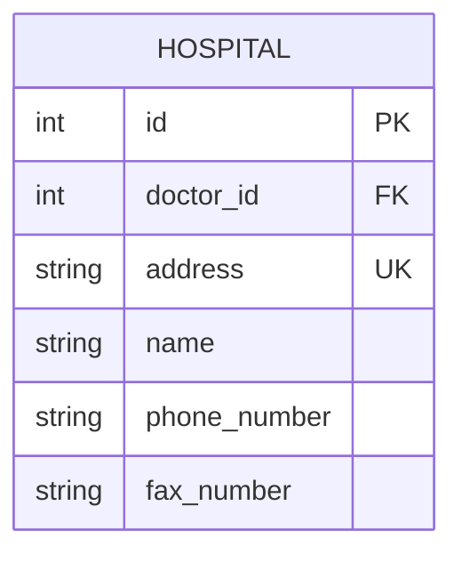
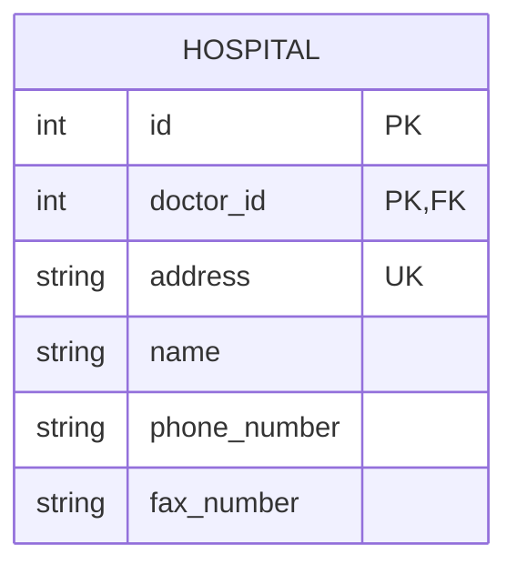
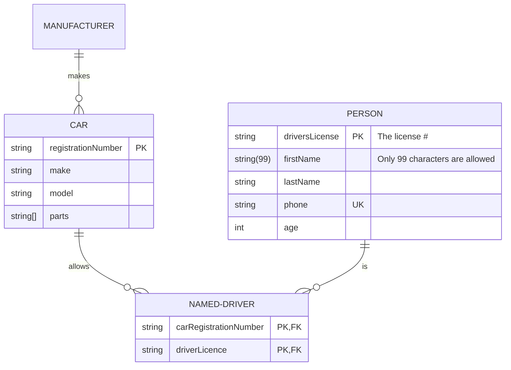
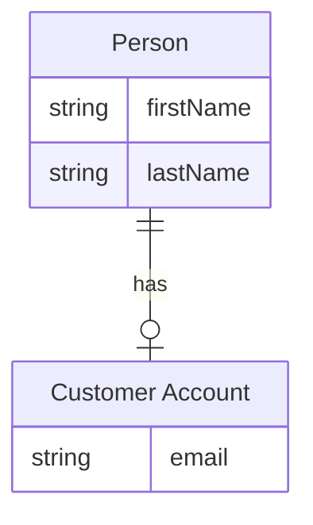
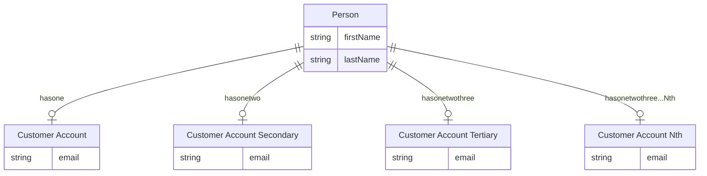
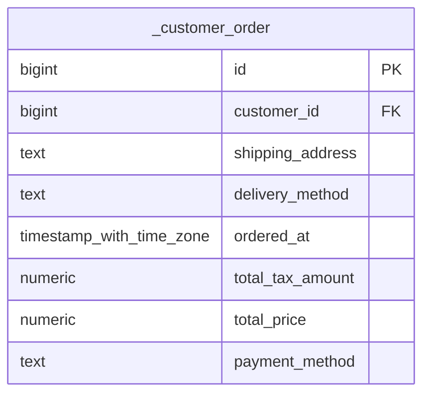

# er

## Example 1

**SebastianJS (SVG):**

> Render failed: Error: Diagrams beginning with --- are not valid. If you were trying to use a YAML front-matter, please ensure that you've correctly opened and closed the YAML front-matter with un-indented `---` blocks

**Mermaid Code (Browser Rendered):**

```mermaid
---
      title: This is a title
      config:
        theme: forest
      ---
      erDiagram
        %% title This is a title
        %% accDescription Test a description

        "Person . CUSTOMER"||--o{ ORDER : places

        ORDER ||--|{ "€£LINE_ITEM ¥" : contains

        "Person . CUSTOMER" }|..|{ "Address//StreetAddress::[DELIVERY ADDRESS]" : uses

        "Address//StreetAddress::[DELIVERY ADDRESS]" {
          int customerID FK
          string line1 "this is the first address line comment"
          string line2
          string city
          string region
          string state
          string(5) postal_code
          string country
        }

        "a_~`!@#$^&*()-_=+[]{}|/;:'.?¡⁄™€£‹¢›∞fi§‡•°ª·º‚≠±œŒ∑„®†ˇ¥Á¨ˆˆØπ∏“«»åÅßÍ∂΃ϩ˙Ó∆Ô˚¬Ò…ÚæÆΩ¸≈π˛çÇ√◊∫ı˜µÂ≤¯≥˘÷¿" {
          string name "this is an entity with an absurd name just to show characters that are now acceptable as long as the name is in double quotes"
        }

        "€£LINE_ITEM ¥" {
          int orderID FK
          int currencyId FK
          number price
          number quantity
          number adjustment
          number final_price
        }
```

## Example 2

**SebastianJS (SVG):**

<svg id="graph" xmlns="http://www.w3.org/2000/svg" xmlns:xlink="http://www.w3.org/1999/xlink" class="erDiagram" style="max-width: 15498px;" viewBox="-361 -125 341 265" role="graphics-document document" aria-roledescription="er"><style>#graph{font-family:"trebuchet ms",verdana,arial,sans-serif;font-size:16px;fill:#333;}@keyframes edge-animation-frame{from{stroke-dashoffset:0;}}@keyframes dash{to{stroke-dashoffset:0;}}#graph .edge-animation-slow{stroke-dasharray:9,5!important;stroke-dashoffset:900;animation:dash 50s linear infinite;stroke-linecap:round;}#graph .edge-animation-fast{stroke-dasharray:9,5!important;stroke-dashoffset:900;animation:dash 20s linear infinite;stroke-linecap:round;}#graph .error-icon{fill:#552222;}#graph .error-text{fill:#552222;stroke:#552222;}#graph .edge-thickness-normal{stroke-width:1px;}#graph .edge-thickness-thick{stroke-width:3.5px;}#graph .edge-pattern-solid{stroke-dasharray:0;}#graph .edge-thickness-invisible{stroke-width:0;fill:none;}#graph .edge-pattern-dashed{stroke-dasharray:3;}#graph .edge-pattern-dotted{stroke-dasharray:2;}#graph .marker{fill:#333333;stroke:#333333;}#graph .marker.cross{stroke:#333333;}#graph svg{font-family:"trebuchet ms",verdana,arial,sans-serif;font-size:16px;}#graph p{margin:0;}#graph .entityBox{fill:#ECECFF;stroke:#9370DB;}#graph .relationshipLabelBox{fill:hsl(80, 100%, 96.2745098039%);opacity:0.7;background-color:hsl(80, 100%, 96.2745098039%);}#graph .relationshipLabelBox rect{opacity:0.5;}#graph .labelBkg{background-color:rgba(248.6666666666, 255, 235.9999999999, 0.5);}#graph .edgeLabel .label{fill:#9370DB;font-size:14px;}#graph .label{font-family:"trebuchet ms",verdana,arial,sans-serif;color:#333;}#graph .edge-pattern-dashed{stroke-dasharray:8,8;}#graph .node rect,#graph .node circle,#graph .node ellipse,#graph .node polygon{fill:#ECECFF;stroke:#9370DB;stroke-width:1px;}#graph .relationshipLine{stroke:#333333;stroke-width:1;fill:none;}#graph .marker{fill:none!important;stroke:#333333!important;stroke-width:1;}#graph :root{--mermaid-font-family:"trebuchet ms",verdana,arial,sans-serif;}</style><g><defs><marker id="graph_er-onlyOneStart" class="marker onlyOne er" refX="0" refY="9" markerWidth="18" markerHeight="18" orient="auto"><path d="M9,0 L9,18 M15,0 L15,18"/></marker></defs><defs><marker id="graph_er-onlyOneEnd" class="marker onlyOne er" refX="18" refY="9" markerWidth="18" markerHeight="18" orient="auto"><path d="M3,0 L3,18 M9,0 L9,18"/></marker></defs><defs><marker id="graph_er-zeroOrOneStart" class="marker zeroOrOne er" refX="0" refY="9" markerWidth="30" markerHeight="18" orient="auto"><circle fill="white" cx="21" cy="9" r="6"/><path d="M9,0 L9,18"/></marker></defs><defs><marker id="graph_er-zeroOrOneEnd" class="marker zeroOrOne er" refX="30" refY="9" markerWidth="30" markerHeight="18" orient="auto"><circle fill="white" cx="9" cy="9" r="6"/><path d="M21,0 L21,18"/></marker></defs><defs><marker id="graph_er-oneOrMoreStart" class="marker oneOrMore er" refX="18" refY="18" markerWidth="45" markerHeight="36" orient="auto"><path d="M0,18 Q 18,0 36,18 Q 18,36 0,18 M42,9 L42,27"/></marker></defs><defs><marker id="graph_er-oneOrMoreEnd" class="marker oneOrMore er" refX="27" refY="18" markerWidth="45" markerHeight="36" orient="auto"><path d="M3,9 L3,27 M9,18 Q27,0 45,18 Q27,36 9,18"/></marker></defs><defs><marker id="graph_er-zeroOrMoreStart" class="marker zeroOrMore er" refX="18" refY="18" markerWidth="57" markerHeight="36" orient="auto"><circle fill="white" cx="48" cy="18" r="6"/><path d="M0,18 Q18,0 36,18 Q18,36 0,18"/></marker></defs><defs><marker id="graph_er-zeroOrMoreEnd" class="marker zeroOrMore er" refX="39" refY="18" markerWidth="57" markerHeight="36" orient="auto"><circle fill="white" cx="9" cy="18" r="6"/><path d="M21,18 Q39,0 57,18 Q39,36 21,18"/></marker></defs><g class="root"><g class="clusters"/><g class="edgePaths"/><g class="edgeLabels"/><g class="nodes"><g class="node default " id="entity-HOSPITAL-0" transform="translate(13, 20)"><g style=""><path d="M-382 -149.625 L382 -149.625 L382 149.625 L-382 149.625" stroke="none" stroke-width="0" fill="#ECECFF"/><path d="M-382 -149.625 C-78.20898737418202 -149.625, 225.58202525163597 -149.625, 382 -149.625 M-382 -149.625 C-101.50490230997019 -149.625, 178.99019538005962 -149.625, 382 -149.625 M382 -149.625 C382 -89.33824935935377, 382 -29.05149871870755, 382 149.625 M382 -149.625 C382 -87.72331533854958, 382 -25.82163067709915, 382 149.625 M382 149.625 C123.85432116654789 149.625, -134.29135766690422 149.625, -382 149.625 M382 149.625 C186.19137328137316 149.625, -9.61725343725368 149.625, -382 149.625 M-382 149.625 C-382 74.34223760056854, -382 -0.9405247988629242, -382 -149.625 M-382 149.625 C-382 41.18779936971646, -382 -67.24940126056708, -382 -149.625" stroke="#9370DB" stroke-width="1.3" fill="none" stroke-dasharray="0 0"/></g><g style="" class="row-rect-odd"><path d="M-382 -106.875 L382 -106.875 L382 -64.125 L-382 -64.125" stroke="none" stroke-width="0" fill="hsl(240, 100%, 100%)"/><path d="M-382 -106.875 C-101.24805801761414 -106.875, 179.50388396477172 -106.875, 382 -106.875 M-382 -106.875 C-88.1251871259833 -106.875, 205.7496257480334 -106.875, 382 -106.875 M382 -106.875 C382 -92.4369311387637, 382 -77.9988622775274, 382 -64.125 M382 -106.875 C382 -95.46253023600764, 382 -84.05006047201526, 382 -64.125 M382 -64.125 C97.60525637768859 -64.125, -186.78948724462282 -64.125, -382 -64.125 M382 -64.125 C133.57275521443765 -64.125, -114.8544895711247 -64.125, -382 -64.125 M-382 -64.125 C-382 -78.05888876079017, -382 -91.99277752158034, -382 -106.875 M-382 -64.125 C-382 -75.60809971101912, -382 -87.09119942203824, -382 -106.875" stroke="#9370DB" stroke-width="1.3" fill="none" stroke-dasharray="0 0"/></g><g style="" class="row-rect-even"><path d="M-382 -64.125 L382 -64.125 L382 -21.375 L-382 -21.375" stroke="none" stroke-width="0" fill="hsl(240, 100%, 97.2745098039%)"/><path d="M-382 -64.125 C-115.89017586992077 -64.125, 150.21964826015846 -64.125, 382 -64.125 M-382 -64.125 C-136.51350823983614 -64.125, 108.97298352032772 -64.125, 382 -64.125 M382 -64.125 C382 -49.715208350874796, 382 -35.30541670174959, 382 -21.375 M382 -64.125 C382 -47.71935282046398, 382 -31.313705640927957, 382 -21.375 M382 -21.375 C135.00032719532211 -21.375, -111.99934560935577 -21.375, -382 -21.375 M382 -21.375 C145.234034557539 -21.375, -91.53193088492202 -21.375, -382 -21.375 M-382 -21.375 C-382 -29.99721309359529, -382 -38.61942618719058, -382 -64.125 M-382 -21.375 C-382 -35.2294273723548, -382 -49.0838547447096, -382 -64.125" stroke="#9370DB" stroke-width="1.3" fill="none" stroke-dasharray="0 0"/></g><g style="" class="row-rect-odd"><path d="M-382 -21.375 L382 -21.375 L382 21.375 L-382 21.375" stroke="none" stroke-width="0" fill="hsl(240, 100%, 100%)"/><path d="M-382 -21.375 C-116.57567760213993 -21.375, 148.84864479572013 -21.375, 382 -21.375 M-382 -21.375 C-154.50759187509956 -21.375, 72.98481624980087 -21.375, 382 -21.375 M382 -21.375 C382 -8.828329475127443, 382 3.7183410497451135, 382 21.375 M382 -21.375 C382 -7.101605313297302, 382 7.171789373405396, 382 21.375 M382 21.375 C207.38973311712965 21.375, 32.7794662342593 21.375, -382 21.375 M382 21.375 C140.84502226974342 21.375, -100.30995546051315 21.375, -382 21.375 M-382 21.375 C-382 10.694413348877822, -382 0.01382669775564338, -382 -21.375 M-382 21.375 C-382 9.544440985998127, -382 -2.286118028003745, -382 -21.375" stroke="#9370DB" stroke-width="1.3" fill="none" stroke-dasharray="0 0"/></g><g style="" class="row-rect-even"><path d="M-382 21.375 L382 21.375 L382 64.125 L-382 64.125" stroke="none" stroke-width="0" fill="hsl(240, 100%, 97.2745098039%)"/><path d="M-382 21.375 C-84.56427067918906 21.375, 212.87145864162187 21.375, 382 21.375 M-382 21.375 C-146.83223634133043 21.375, 88.33552731733914 21.375, 382 21.375 M382 21.375 C382 35.93123535926547, 382 50.48747071853094, 382 64.125 M382 21.375 C382 38.34629532849752, 382 55.317590656995044, 382 64.125 M382 64.125 C188.50024745131927 64.125, -4.999505097361464 64.125, -382 64.125 M382 64.125 C167.97687958705333 64.125, -46.046240825893335 64.125, -382 64.125 M-382 64.125 C-382 54.37775441628449, -382 44.63050883256897, -382 21.375 M-382 64.125 C-382 54.616053203631054, -382 45.10710640726211, -382 21.375" stroke="#9370DB" stroke-width="1.3" fill="none" stroke-dasharray="0 0"/></g><g style="" class="row-rect-odd"><path d="M-382 64.125 L382 64.125 L382 106.875 L-382 106.875" stroke="none" stroke-width="0" fill="hsl(240, 100%, 100%)"/><path d="M-382 64.125 C-77.39078415283524 64.125, 227.21843169432952 64.125, 382 64.125 M-382 64.125 C-202.47791412719832 64.125, -22.955828254396636 64.125, 382 64.125 M382 64.125 C382 77.26956719754374, 382 90.41413439508747, 382 106.875 M382 64.125 C382 78.79858119311973, 382 93.47216238623945, 382 106.875 M382 106.875 C138.91277784921238 106.875, -104.17444430157525 106.875, -382 106.875 M382 106.875 C87.25400221367926 106.875, -207.49199557264149 106.875, -382 106.875 M-382 106.875 C-382 94.72036490505496, -382 82.56572981010993, -382 64.125 M-382 106.875 C-382 98.07716174572931, -382 89.27932349145863, -382 64.125" stroke="#9370DB" stroke-width="1.3" fill="none" stroke-dasharray="0 0"/></g><g style="" class="row-rect-even"><path d="M-382 106.875 L382 106.875 L382 149.625 L-382 149.625" stroke="none" stroke-width="0" fill="hsl(240, 100%, 97.2745098039%)"/><path d="M-382 106.875 C-142.2394116702822 106.875, 97.52117665943558 106.875, 382 106.875 M-382 106.875 C-92.73983183251062 106.875, 196.52033633497877 106.875, 382 106.875 M382 106.875 C382 116.99539174359401, 382 127.11578348718801, 382 149.625 M382 106.875 C382 116.92726871411458, 382 126.97953742822916, 382 149.625 M382 149.625 C82.22986711737173 149.625, -217.54026576525655 149.625, -382 149.625 M382 149.625 C84.7937709938276 149.625, -212.4124580123448 149.625, -382 149.625 M-382 149.625 C-382 132.93688013365283, -382 116.2487602673057, -382 106.875 M-382 149.625 C-382 134.64535997818788, -382 119.66571995637577, -382 106.875" stroke="#9370DB" stroke-width="1.3" fill="none" stroke-dasharray="0 0"/></g><g class="label name" transform="translate(-37, -140.25)" style=""><g><rect class="background" style="stroke: none"/></g><text y="-10.1" style=""><tspan class="text-outer-tspan" x="0" y="-0.1em" dy="1.1em"><tspan font-style="normal" class="text-inner-tspan" font-weight="normal">HOSPITAL</tspan></tspan></text></g><g class="label attribute-type" transform="translate(-369.5, -97.5)" style=""><g><rect class="background" style="stroke: none"/></g><text y="-10.1" style=""><tspan class="text-outer-tspan" x="0" y="-0.1em" dy="1.1em"><tspan font-style="normal" class="text-inner-tspan" font-weight="normal">int</tspan></tspan></text></g><g class="label attribute-name" transform="translate(-286.5, -97.5)" style=""><g><rect class="background" style="stroke: none"/></g><text y="-10.1" style=""><tspan class="text-outer-tspan" x="0" y="-0.1em" dy="1.1em"><tspan font-style="normal" class="text-inner-tspan" font-weight="normal">id</tspan></tspan></text></g><g class="label attribute-keys" transform="translate(-155.5, -97.5)" style=""><g><rect class="background" style="stroke: none"/></g><text y="-10.1" style=""><tspan class="text-outer-tspan" x="0" y="-0.1em" dy="1.1em"><tspan font-style="normal" class="text-inner-tspan" font-weight="normal">PK</tspan></tspan></text></g><g class="label attribute-comment" transform="translate(-104.5, -97.5)" style=""><g><rect class="background" style="stroke: none"/></g><text y="-10.1" style=""><tspan class="text-outer-tspan" x="0" y="-0.1em" dy="1.1em"/></text></g><g class="label attribute-type" transform="translate(-369.5, -54.75)" style=""><g><rect class="background" style="stroke: none"/></g><text y="-10.1" style=""><tspan class="text-outer-tspan" x="0" y="-0.1em" dy="1.1em"><tspan font-style="normal" class="text-inner-tspan" font-weight="normal">int</tspan></tspan></text></g><g class="label attribute-name" transform="translate(-286.5, -54.75)" style=""><g><rect class="background" style="stroke: none"/></g><text y="-10.1" style=""><tspan class="text-outer-tspan" x="0" y="-0.1em" dy="1.1em"><tspan font-style="normal" class="text-inner-tspan" font-weight="normal">doctor_id</tspan></tspan></text></g><g class="label attribute-keys" transform="translate(-155.5, -54.75)" style=""><g><rect class="background" style="stroke: none"/></g><text y="-10.1" style=""><tspan class="text-outer-tspan" x="0" y="-0.1em" dy="1.1em"><tspan font-style="normal" class="text-inner-tspan" font-weight="normal">FK</tspan></tspan></text></g><g class="label attribute-comment" transform="translate(-104.5, -54.75)" style=""><g><rect class="background" style="stroke: none"/></g><text y="-10.1" style=""><tspan class="text-outer-tspan" x="0" y="-0.1em" dy="1.1em"/></text></g><g class="label attribute-type" transform="translate(-369.5, -12)" style=""><g><rect class="background" style="stroke: none"/></g><text y="-10.1" style=""><tspan class="text-outer-tspan" x="0" y="-0.1em" dy="1.1em"><tspan font-style="normal" class="text-inner-tspan" font-weight="normal">string</tspan></tspan></text></g><g class="label attribute-name" transform="translate(-286.5, -12)" style=""><g><rect class="background" style="stroke: none"/></g><text y="-10.1" style=""><tspan class="text-outer-tspan" x="0" y="-0.1em" dy="1.1em"><tspan font-style="normal" class="text-inner-tspan" font-weight="normal">address</tspan></tspan></text></g><g class="label attribute-keys" transform="translate(-155.5, -12)" style=""><g><rect class="background" style="stroke: none"/></g><text y="-10.1" style=""><tspan class="text-outer-tspan" x="0" y="-0.1em" dy="1.1em"><tspan font-style="normal" class="text-inner-tspan" font-weight="normal">UK</tspan></tspan></text></g><g class="label attribute-comment" transform="translate(-104.5, -12)" style=""><g><rect class="background" style="stroke: none"/></g><text y="-10.1" style=""><tspan class="text-outer-tspan" x="0" y="-0.1em" dy="1.1em"/></text></g><g class="label attribute-type" transform="translate(-369.5, 30.75)" style=""><g><rect class="background" style="stroke: none"/></g><text y="-10.1" style=""><tspan class="text-outer-tspan" x="0" y="-0.1em" dy="1.1em"><tspan font-style="normal" class="text-inner-tspan" font-weight="normal">string</tspan></tspan></text></g><g class="label attribute-name" transform="translate(-286.5, 30.75)" style=""><g><rect class="background" style="stroke: none"/></g><text y="-10.1" style=""><tspan class="text-outer-tspan" x="0" y="-0.1em" dy="1.1em"><tspan font-style="normal" class="text-inner-tspan" font-weight="normal">name</tspan></tspan></text></g><g class="label attribute-keys" transform="translate(-155.5, 30.75)" style=""><g><rect class="background" style="stroke: none"/></g><text y="-10.1" style=""><tspan class="text-outer-tspan" x="0" y="-0.1em" dy="1.1em"/></text></g><g class="label attribute-comment" transform="translate(-104.5, 30.75)" style=""><g><rect class="background" style="stroke: none"/></g><text y="-10.1" style=""><tspan class="text-outer-tspan" x="0" y="-0.1em" dy="1.1em"/></text></g><g class="label attribute-type" transform="translate(-369.5, 73.5)" style=""><g><rect class="background" style="stroke: none"/></g><text y="-10.1" style=""><tspan class="text-outer-tspan" x="0" y="-0.1em" dy="1.1em"><tspan font-style="normal" class="text-inner-tspan" font-weight="normal">string</tspan></tspan></text></g><g class="label attribute-name" transform="translate(-286.5, 73.5)" style=""><g><rect class="background" style="stroke: none"/></g><text y="-10.1" style=""><tspan class="text-outer-tspan" x="0" y="-0.1em" dy="1.1em"><tspan font-style="normal" class="text-inner-tspan" font-weight="normal">phone_number</tspan></tspan></text></g><g class="label attribute-keys" transform="translate(-155.5, 73.5)" style=""><g><rect class="background" style="stroke: none"/></g><text y="-10.1" style=""><tspan class="text-outer-tspan" x="0" y="-0.1em" dy="1.1em"/></text></g><g class="label attribute-comment" transform="translate(-104.5, 73.5)" style=""><g><rect class="background" style="stroke: none"/></g><text y="-10.1" style=""><tspan class="text-outer-tspan" x="0" y="-0.1em" dy="1.1em"/></text></g><g class="label attribute-type" transform="translate(-369.5, 116.25)" style=""><g><rect class="background" style="stroke: none"/></g><text y="-10.1" style=""><tspan class="text-outer-tspan" x="0" y="-0.1em" dy="1.1em"><tspan font-style="normal" class="text-inner-tspan" font-weight="normal">string</tspan></tspan></text></g><g class="label attribute-name" transform="translate(-286.5, 116.25)" style=""><g><rect class="background" style="stroke: none"/></g><text y="-10.1" style=""><tspan class="text-outer-tspan" x="0" y="-0.1em" dy="1.1em"><tspan font-style="normal" class="text-inner-tspan" font-weight="normal">fax_number</tspan></tspan></text></g><g class="label attribute-keys" transform="translate(-155.5, 116.25)" style=""><g><rect class="background" style="stroke: none"/></g><text y="-10.1" style=""><tspan class="text-outer-tspan" x="0" y="-0.1em" dy="1.1em"/></text></g><g class="label attribute-comment" transform="translate(-104.5, 116.25)" style=""><g><rect class="background" style="stroke: none"/></g><text y="-10.1" style=""><tspan class="text-outer-tspan" x="0" y="-0.1em" dy="1.1em"/></text></g><g class="divider"><path d="M-382 -106.875 C-104.80825898105951 -106.875, 172.38348203788098 -106.875, 382 -106.875 M-382 -106.875 C-219.89385132667525 -106.875, -57.78770265335049 -106.875, 382 -106.875" stroke="#9370DB" stroke-width="1.3" fill="none" stroke-dasharray="0 0"/></g><g class="divider"><path d="M-299 -106.875 C-299 -46.6839115984594, -299 13.507176803081194, -299 149.625 M-299 -106.875 C-299 -44.26346219184737, -299 18.348075616305266, -299 149.625" stroke="#9370DB" stroke-width="1.3" fill="none" stroke-dasharray="0 0"/></g><g class="divider"><path d="M-168 -106.875 C-168 -25.90718451330453, -168 55.06063097339094, -168 149.625 M-168 -106.875 C-168 -54.13626549077123, -168 -1.3975309815424595, -168 149.625" stroke="#9370DB" stroke-width="1.3" fill="none" stroke-dasharray="0 0"/></g><g class="divider"><path d="M-117 -106.875 C-117 -17.681293173680217, -117 71.51241365263957, -117 149.625 M-117 -106.875 C-117 -53.26797088667787, -117 0.339058226644255, -117 149.625" stroke="#9370DB" stroke-width="1.3" fill="none" stroke-dasharray="0 0"/></g><g class="divider"><path d="M-382 -106.875 C-194.76172058220584 -106.875, -7.523441164411679 -106.875, 382 -106.875 M-382 -106.875 C-122.29220037646144 -106.875, 137.41559924707713 -106.875, 382 -106.875" stroke="#9370DB" stroke-width="1.3" fill="none" stroke-dasharray="0 0"/></g></g></g></g></g></svg>

**Mermaid Code (Browser Rendered):**



## Example 3

**SebastianJS (SVG):**

<svg id="graph" xmlns="http://www.w3.org/2000/svg" xmlns:xlink="http://www.w3.org/1999/xlink" class="erDiagram" style="max-width: 15522px;" viewBox="-373 -125 353 265" role="graphics-document document" aria-roledescription="er"><style>#graph{font-family:"trebuchet ms",verdana,arial,sans-serif;font-size:16px;fill:#333;}@keyframes edge-animation-frame{from{stroke-dashoffset:0;}}@keyframes dash{to{stroke-dashoffset:0;}}#graph .edge-animation-slow{stroke-dasharray:9,5!important;stroke-dashoffset:900;animation:dash 50s linear infinite;stroke-linecap:round;}#graph .edge-animation-fast{stroke-dasharray:9,5!important;stroke-dashoffset:900;animation:dash 20s linear infinite;stroke-linecap:round;}#graph .error-icon{fill:#552222;}#graph .error-text{fill:#552222;stroke:#552222;}#graph .edge-thickness-normal{stroke-width:1px;}#graph .edge-thickness-thick{stroke-width:3.5px;}#graph .edge-pattern-solid{stroke-dasharray:0;}#graph .edge-thickness-invisible{stroke-width:0;fill:none;}#graph .edge-pattern-dashed{stroke-dasharray:3;}#graph .edge-pattern-dotted{stroke-dasharray:2;}#graph .marker{fill:#333333;stroke:#333333;}#graph .marker.cross{stroke:#333333;}#graph svg{font-family:"trebuchet ms",verdana,arial,sans-serif;font-size:16px;}#graph p{margin:0;}#graph .entityBox{fill:#ECECFF;stroke:#9370DB;}#graph .relationshipLabelBox{fill:hsl(80, 100%, 96.2745098039%);opacity:0.7;background-color:hsl(80, 100%, 96.2745098039%);}#graph .relationshipLabelBox rect{opacity:0.5;}#graph .labelBkg{background-color:rgba(248.6666666666, 255, 235.9999999999, 0.5);}#graph .edgeLabel .label{fill:#9370DB;font-size:14px;}#graph .label{font-family:"trebuchet ms",verdana,arial,sans-serif;color:#333;}#graph .edge-pattern-dashed{stroke-dasharray:8,8;}#graph .node rect,#graph .node circle,#graph .node ellipse,#graph .node polygon{fill:#ECECFF;stroke:#9370DB;stroke-width:1px;}#graph .relationshipLine{stroke:#333333;stroke-width:1;fill:none;}#graph .marker{fill:none!important;stroke:#333333!important;stroke-width:1;}#graph :root{--mermaid-font-family:"trebuchet ms",verdana,arial,sans-serif;}</style><g><defs><marker id="graph_er-onlyOneStart" class="marker onlyOne er" refX="0" refY="9" markerWidth="18" markerHeight="18" orient="auto"><path d="M9,0 L9,18 M15,0 L15,18"/></marker></defs><defs><marker id="graph_er-onlyOneEnd" class="marker onlyOne er" refX="18" refY="9" markerWidth="18" markerHeight="18" orient="auto"><path d="M3,0 L3,18 M9,0 L9,18"/></marker></defs><defs><marker id="graph_er-zeroOrOneStart" class="marker zeroOrOne er" refX="0" refY="9" markerWidth="30" markerHeight="18" orient="auto"><circle fill="white" cx="21" cy="9" r="6"/><path d="M9,0 L9,18"/></marker></defs><defs><marker id="graph_er-zeroOrOneEnd" class="marker zeroOrOne er" refX="30" refY="9" markerWidth="30" markerHeight="18" orient="auto"><circle fill="white" cx="9" cy="9" r="6"/><path d="M21,0 L21,18"/></marker></defs><defs><marker id="graph_er-oneOrMoreStart" class="marker oneOrMore er" refX="18" refY="18" markerWidth="45" markerHeight="36" orient="auto"><path d="M0,18 Q 18,0 36,18 Q 18,36 0,18 M42,9 L42,27"/></marker></defs><defs><marker id="graph_er-oneOrMoreEnd" class="marker oneOrMore er" refX="27" refY="18" markerWidth="45" markerHeight="36" orient="auto"><path d="M3,9 L3,27 M9,18 Q27,0 45,18 Q27,36 9,18"/></marker></defs><defs><marker id="graph_er-zeroOrMoreStart" class="marker zeroOrMore er" refX="18" refY="18" markerWidth="57" markerHeight="36" orient="auto"><circle fill="white" cx="48" cy="18" r="6"/><path d="M0,18 Q18,0 36,18 Q18,36 0,18"/></marker></defs><defs><marker id="graph_er-zeroOrMoreEnd" class="marker zeroOrMore er" refX="39" refY="18" markerWidth="57" markerHeight="36" orient="auto"><circle fill="white" cx="9" cy="18" r="6"/><path d="M21,18 Q39,0 57,18 Q39,36 21,18"/></marker></defs><g class="root"><g class="clusters"/><g class="edgePaths"/><g class="edgeLabels"/><g class="nodes"><g class="node default " id="entity-HOSPITAL-0" transform="translate(13, 20)"><g style=""><path d="M-394 -149.625 L394 -149.625 L394 149.625 L-394 149.625" stroke="none" stroke-width="0" fill="#ECECFF"/><path d="M-394 -149.625 C-166.07916256895354 -149.625, 61.84167486209293 -149.625, 394 -149.625 M-394 -149.625 C-168.45260765253573 -149.625, 57.094784694928535 -149.625, 394 -149.625 M394 -149.625 C394 -86.66081525610204, 394 -23.69663051220408, 394 149.625 M394 -149.625 C394 -33.29965327845221, 394 83.02569344309558, 394 149.625 M394 149.625 C217.47261395183043 149.625, 40.94522790366085 149.625, -394 149.625 M394 149.625 C217.1938841357956 149.625, 40.3877682715912 149.625, -394 149.625 M-394 149.625 C-394 47.15641015479879, -394 -55.31217969040242, -394 -149.625 M-394 149.625 C-394 67.30527295358884, -394 -15.01445409282232, -394 -149.625" stroke="#9370DB" stroke-width="1.3" fill="none" stroke-dasharray="0 0"/></g><g style="" class="row-rect-odd"><path d="M-394 -106.875 L394 -106.875 L394 -64.125 L-394 -64.125" stroke="none" stroke-width="0" fill="hsl(240, 100%, 100%)"/><path d="M-394 -106.875 C-149.16681439979016 -106.875, 95.66637120041969 -106.875, 394 -106.875 M-394 -106.875 C-132.92218998112799 -106.875, 128.15562003774403 -106.875, 394 -106.875 M394 -106.875 C394 -98.1642182086396, 394 -89.45343641727918, 394 -64.125 M394 -106.875 C394 -95.07272771199763, 394 -83.27045542399526, 394 -64.125 M394 -64.125 C122.07852282733171 -64.125, -149.84295434533658 -64.125, -394 -64.125 M394 -64.125 C94.87593327107447 -64.125, -204.24813345785105 -64.125, -394 -64.125 M-394 -64.125 C-394 -77.05808729400393, -394 -89.99117458800785, -394 -106.875 M-394 -64.125 C-394 -75.96197470839192, -394 -87.79894941678384, -394 -106.875" stroke="#9370DB" stroke-width="1.3" fill="none" stroke-dasharray="0 0"/></g><g style="" class="row-rect-even"><path d="M-394 -64.125 L394 -64.125 L394 -21.375 L-394 -21.375" stroke="none" stroke-width="0" fill="hsl(240, 100%, 97.2745098039%)"/><path d="M-394 -64.125 C-108.38979004633086 -64.125, 177.22041990733828 -64.125, 394 -64.125 M-394 -64.125 C-118.85595838251612 -64.125, 156.28808323496776 -64.125, 394 -64.125 M394 -64.125 C394 -52.79286096743586, 394 -41.460721934871714, 394 -21.375 M394 -64.125 C394 -55.28199537929115, 394 -46.43899075858231, 394 -21.375 M394 -21.375 C221.52384526014913 -21.375, 49.04769052029826 -21.375, -394 -21.375 M394 -21.375 C166.32179295025182 -21.375, -61.35641409949636 -21.375, -394 -21.375 M-394 -21.375 C-394 -32.62065998666108, -394 -43.86631997332217, -394 -64.125 M-394 -21.375 C-394 -30.80918704744346, -394 -40.24337409488692, -394 -64.125" stroke="#9370DB" stroke-width="1.3" fill="none" stroke-dasharray="0 0"/></g><g style="" class="row-rect-odd"><path d="M-394 -21.375 L394 -21.375 L394 21.375 L-394 21.375" stroke="none" stroke-width="0" fill="hsl(240, 100%, 100%)"/><path d="M-394 -21.375 C-175.70507347474862 -21.375, 42.58985305050277 -21.375, 394 -21.375 M-394 -21.375 C-236.19286515033926 -21.375, -78.38573030067852 -21.375, 394 -21.375 M394 -21.375 C394 -6.115332486545027, 394 9.144335026909946, 394 21.375 M394 -21.375 C394 -10.169914656834546, 394 1.0351706863309076, 394 21.375 M394 21.375 C198.95522012779307 21.375, 3.9104402555861384 21.375, -394 21.375 M394 21.375 C145.9550223788472 21.375, -102.08995524230562 21.375, -394 21.375 M-394 21.375 C-394 7.990135325486596, -394 -5.394729349026807, -394 -21.375 M-394 21.375 C-394 11.068775976471533, -394 0.7625519529430669, -394 -21.375" stroke="#9370DB" stroke-width="1.3" fill="none" stroke-dasharray="0 0"/></g><g style="" class="row-rect-even"><path d="M-394 21.375 L394 21.375 L394 64.125 L-394 64.125" stroke="none" stroke-width="0" fill="hsl(240, 100%, 97.2745098039%)"/><path d="M-394 21.375 C-114.02211959177765 21.375, 165.9557608164447 21.375, 394 21.375 M-394 21.375 C-149.83000986926388 21.375, 94.33998026147225 21.375, 394 21.375 M394 21.375 C394 34.986322531398145, 394 48.59764506279629, 394 64.125 M394 21.375 C394 32.15477865344464, 394 42.934557306889275, 394 64.125 M394 64.125 C233.8401853500765 64.125, 73.68037070015299 64.125, -394 64.125 M394 64.125 C190.77719157392582 64.125, -12.445616852148362 64.125, -394 64.125 M-394 64.125 C-394 50.52146978322712, -394 36.91793956645424, -394 21.375 M-394 64.125 C-394 52.82565238473452, -394 41.526304769469036, -394 21.375" stroke="#9370DB" stroke-width="1.3" fill="none" stroke-dasharray="0 0"/></g><g style="" class="row-rect-odd"><path d="M-394 64.125 L394 64.125 L394 106.875 L-394 106.875" stroke="none" stroke-width="0" fill="hsl(240, 100%, 100%)"/><path d="M-394 64.125 C-146.99638598409547 64.125, 100.00722803180906 64.125, 394 64.125 M-394 64.125 C-205.7244980464793 64.125, -17.448996092958623 64.125, 394 64.125 M394 64.125 C394 75.02936918182523, 394 85.93373836365045, 394 106.875 M394 64.125 C394 75.15940607847158, 394 86.19381215694314, 394 106.875 M394 106.875 C195.22375426540236 106.875, -3.5524914691952745 106.875, -394 106.875 M394 106.875 C114.86433845610867 106.875, -164.27132308778266 106.875, -394 106.875 M-394 106.875 C-394 95.21801395402002, -394 83.56102790804005, -394 64.125 M-394 106.875 C-394 96.40095032403195, -394 85.9269006480639, -394 64.125" stroke="#9370DB" stroke-width="1.3" fill="none" stroke-dasharray="0 0"/></g><g style="" class="row-rect-even"><path d="M-394 106.875 L394 106.875 L394 149.625 L-394 149.625" stroke="none" stroke-width="0" fill="hsl(240, 100%, 97.2745098039%)"/><path d="M-394 106.875 C-93.77818245761085 106.875, 206.4436350847783 106.875, 394 106.875 M-394 106.875 C-156.97252466556992 106.875, 80.05495066886016 106.875, 394 106.875 M394 106.875 C394 121.10137052737711, 394 135.32774105475423, 394 149.625 M394 106.875 C394 122.0069349210759, 394 137.1388698421518, 394 149.625 M394 149.625 C116.6632354610615 149.625, -160.673529077877 149.625, -394 149.625 M394 149.625 C200.6146178817782 149.625, 7.229235763556403 149.625, -394 149.625 M-394 149.625 C-394 135.17709831926484, -394 120.7291966385297, -394 106.875 M-394 149.625 C-394 134.79846908585017, -394 119.97193817170034, -394 106.875" stroke="#9370DB" stroke-width="1.3" fill="none" stroke-dasharray="0 0"/></g><g class="label name" transform="translate(-37, -140.25)" style=""><g><rect class="background" style="stroke: none"/></g><text y="-10.1" style=""><tspan class="text-outer-tspan" x="0" y="-0.1em" dy="1.1em"><tspan font-style="normal" class="text-inner-tspan" font-weight="normal">HOSPITAL</tspan></tspan></text></g><g class="label attribute-type" transform="translate(-381.5, -97.5)" style=""><g><rect class="background" style="stroke: none"/></g><text y="-10.1" style=""><tspan class="text-outer-tspan" x="0" y="-0.1em" dy="1.1em"><tspan font-style="normal" class="text-inner-tspan" font-weight="normal">int</tspan></tspan></text></g><g class="label attribute-name" transform="translate(-298.5, -97.5)" style=""><g><rect class="background" style="stroke: none"/></g><text y="-10.1" style=""><tspan class="text-outer-tspan" x="0" y="-0.1em" dy="1.1em"><tspan font-style="normal" class="text-inner-tspan" font-weight="normal">id</tspan></tspan></text></g><g class="label attribute-keys" transform="translate(-167.5, -97.5)" style=""><g><rect class="background" style="stroke: none"/></g><text y="-10.1" style=""><tspan class="text-outer-tspan" x="0" y="-0.1em" dy="1.1em"><tspan font-style="normal" class="text-inner-tspan" font-weight="normal">PK</tspan></tspan></text></g><g class="label attribute-comment" transform="translate(-92.5, -97.5)" style=""><g><rect class="background" style="stroke: none"/></g><text y="-10.1" style=""><tspan class="text-outer-tspan" x="0" y="-0.1em" dy="1.1em"/></text></g><g class="label attribute-type" transform="translate(-381.5, -54.75)" style=""><g><rect class="background" style="stroke: none"/></g><text y="-10.1" style=""><tspan class="text-outer-tspan" x="0" y="-0.1em" dy="1.1em"><tspan font-style="normal" class="text-inner-tspan" font-weight="normal">int</tspan></tspan></text></g><g class="label attribute-name" transform="translate(-298.5, -54.75)" style=""><g><rect class="background" style="stroke: none"/></g><text y="-10.1" style=""><tspan class="text-outer-tspan" x="0" y="-0.1em" dy="1.1em"><tspan font-style="normal" class="text-inner-tspan" font-weight="normal">doctor_id</tspan></tspan></text></g><g class="label attribute-keys" transform="translate(-167.5, -54.75)" style=""><g><rect class="background" style="stroke: none"/></g><text y="-10.1" style=""><tspan class="text-outer-tspan" x="0" y="-0.1em" dy="1.1em"><tspan font-style="normal" class="text-inner-tspan" font-weight="normal">PK,FK</tspan></tspan></text></g><g class="label attribute-comment" transform="translate(-92.5, -54.75)" style=""><g><rect class="background" style="stroke: none"/></g><text y="-10.1" style=""><tspan class="text-outer-tspan" x="0" y="-0.1em" dy="1.1em"/></text></g><g class="label attribute-type" transform="translate(-381.5, -12)" style=""><g><rect class="background" style="stroke: none"/></g><text y="-10.1" style=""><tspan class="text-outer-tspan" x="0" y="-0.1em" dy="1.1em"><tspan font-style="normal" class="text-inner-tspan" font-weight="normal">string</tspan></tspan></text></g><g class="label attribute-name" transform="translate(-298.5, -12)" style=""><g><rect class="background" style="stroke: none"/></g><text y="-10.1" style=""><tspan class="text-outer-tspan" x="0" y="-0.1em" dy="1.1em"><tspan font-style="normal" class="text-inner-tspan" font-weight="normal">address</tspan></tspan></text></g><g class="label attribute-keys" transform="translate(-167.5, -12)" style=""><g><rect class="background" style="stroke: none"/></g><text y="-10.1" style=""><tspan class="text-outer-tspan" x="0" y="-0.1em" dy="1.1em"><tspan font-style="normal" class="text-inner-tspan" font-weight="normal">UK</tspan></tspan></text></g><g class="label attribute-comment" transform="translate(-92.5, -12)" style=""><g><rect class="background" style="stroke: none"/></g><text y="-10.1" style=""><tspan class="text-outer-tspan" x="0" y="-0.1em" dy="1.1em"/></text></g><g class="label attribute-type" transform="translate(-381.5, 30.75)" style=""><g><rect class="background" style="stroke: none"/></g><text y="-10.1" style=""><tspan class="text-outer-tspan" x="0" y="-0.1em" dy="1.1em"><tspan font-style="normal" class="text-inner-tspan" font-weight="normal">string</tspan></tspan></text></g><g class="label attribute-name" transform="translate(-298.5, 30.75)" style=""><g><rect class="background" style="stroke: none"/></g><text y="-10.1" style=""><tspan class="text-outer-tspan" x="0" y="-0.1em" dy="1.1em"><tspan font-style="normal" class="text-inner-tspan" font-weight="normal">name</tspan></tspan></text></g><g class="label attribute-keys" transform="translate(-167.5, 30.75)" style=""><g><rect class="background" style="stroke: none"/></g><text y="-10.1" style=""><tspan class="text-outer-tspan" x="0" y="-0.1em" dy="1.1em"/></text></g><g class="label attribute-comment" transform="translate(-92.5, 30.75)" style=""><g><rect class="background" style="stroke: none"/></g><text y="-10.1" style=""><tspan class="text-outer-tspan" x="0" y="-0.1em" dy="1.1em"/></text></g><g class="label attribute-type" transform="translate(-381.5, 73.5)" style=""><g><rect class="background" style="stroke: none"/></g><text y="-10.1" style=""><tspan class="text-outer-tspan" x="0" y="-0.1em" dy="1.1em"><tspan font-style="normal" class="text-inner-tspan" font-weight="normal">string</tspan></tspan></text></g><g class="label attribute-name" transform="translate(-298.5, 73.5)" style=""><g><rect class="background" style="stroke: none"/></g><text y="-10.1" style=""><tspan class="text-outer-tspan" x="0" y="-0.1em" dy="1.1em"><tspan font-style="normal" class="text-inner-tspan" font-weight="normal">phone_number</tspan></tspan></text></g><g class="label attribute-keys" transform="translate(-167.5, 73.5)" style=""><g><rect class="background" style="stroke: none"/></g><text y="-10.1" style=""><tspan class="text-outer-tspan" x="0" y="-0.1em" dy="1.1em"/></text></g><g class="label attribute-comment" transform="translate(-92.5, 73.5)" style=""><g><rect class="background" style="stroke: none"/></g><text y="-10.1" style=""><tspan class="text-outer-tspan" x="0" y="-0.1em" dy="1.1em"/></text></g><g class="label attribute-type" transform="translate(-381.5, 116.25)" style=""><g><rect class="background" style="stroke: none"/></g><text y="-10.1" style=""><tspan class="text-outer-tspan" x="0" y="-0.1em" dy="1.1em"><tspan font-style="normal" class="text-inner-tspan" font-weight="normal">string</tspan></tspan></text></g><g class="label attribute-name" transform="translate(-298.5, 116.25)" style=""><g><rect class="background" style="stroke: none"/></g><text y="-10.1" style=""><tspan class="text-outer-tspan" x="0" y="-0.1em" dy="1.1em"><tspan font-style="normal" class="text-inner-tspan" font-weight="normal">fax_number</tspan></tspan></text></g><g class="label attribute-keys" transform="translate(-167.5, 116.25)" style=""><g><rect class="background" style="stroke: none"/></g><text y="-10.1" style=""><tspan class="text-outer-tspan" x="0" y="-0.1em" dy="1.1em"/></text></g><g class="label attribute-comment" transform="translate(-92.5, 116.25)" style=""><g><rect class="background" style="stroke: none"/></g><text y="-10.1" style=""><tspan class="text-outer-tspan" x="0" y="-0.1em" dy="1.1em"/></text></g><g class="divider"><path d="M-394 -106.875 C-234.32243254471877 -106.875, -74.64486508943753 -106.875, 394 -106.875 M-394 -106.875 C-194.8201763883166 -106.875, 4.359647223366778 -106.875, 394 -106.875" stroke="#9370DB" stroke-width="1.3" fill="none" stroke-dasharray="0 0"/></g><g class="divider"><path d="M-311 -106.875 C-311 -12.84502696401158, -311 81.18494607197684, -311 149.625 M-311 -106.875 C-311 -44.69676824221901, -311 17.481463515561984, -311 149.625" stroke="#9370DB" stroke-width="1.3" fill="none" stroke-dasharray="0 0"/></g><g class="divider"><path d="M-180 -106.875 C-180 -36.1972056346964, -180 34.480588730607195, -180 149.625 M-180 -106.875 C-180 -13.999227284829345, -180 78.87654543034131, -180 149.625" stroke="#9370DB" stroke-width="1.3" fill="none" stroke-dasharray="0 0"/></g><g class="divider"><path d="M-105 -106.875 C-105 -49.951411979932175, -105 6.9721760401356505, -105 149.625 M-105 -106.875 C-105 -23.196739416785277, -105 60.481521166429445, -105 149.625" stroke="#9370DB" stroke-width="1.3" fill="none" stroke-dasharray="0 0"/></g><g class="divider"><path d="M-394 -106.875 C-87.79761674256736 -106.875, 218.4047665148653 -106.875, 394 -106.875 M-394 -106.875 C-219.55536487792028 -106.875, -45.110729755840566 -106.875, 394 -106.875" stroke="#9370DB" stroke-width="1.3" fill="none" stroke-dasharray="0 0"/></g></g></g></g></g></svg>

**Mermaid Code (Browser Rendered):**



## Example 4

**SebastianJS (SVG):**

<svg id="graph" xmlns="http://www.w3.org/2000/svg" xmlns:xlink="http://www.w3.org/1999/xlink" class="erDiagram" style="max-width: 17026px;" viewBox="-327 -26 533 337" role="graphics-document document" aria-roledescription="er"><style>#graph{font-family:"trebuchet ms",verdana,arial,sans-serif;font-size:16px;fill:#333;}@keyframes edge-animation-frame{from{stroke-dashoffset:0;}}@keyframes dash{to{stroke-dashoffset:0;}}#graph .edge-animation-slow{stroke-dasharray:9,5!important;stroke-dashoffset:900;animation:dash 50s linear infinite;stroke-linecap:round;}#graph .edge-animation-fast{stroke-dasharray:9,5!important;stroke-dashoffset:900;animation:dash 20s linear infinite;stroke-linecap:round;}#graph .error-icon{fill:#552222;}#graph .error-text{fill:#552222;stroke:#552222;}#graph .edge-thickness-normal{stroke-width:1px;}#graph .edge-thickness-thick{stroke-width:3.5px;}#graph .edge-pattern-solid{stroke-dasharray:0;}#graph .edge-thickness-invisible{stroke-width:0;fill:none;}#graph .edge-pattern-dashed{stroke-dasharray:3;}#graph .edge-pattern-dotted{stroke-dasharray:2;}#graph .marker{fill:#333333;stroke:#333333;}#graph .marker.cross{stroke:#333333;}#graph svg{font-family:"trebuchet ms",verdana,arial,sans-serif;font-size:16px;}#graph p{margin:0;}#graph .entityBox{fill:#ECECFF;stroke:#9370DB;}#graph .relationshipLabelBox{fill:hsl(80, 100%, 96.2745098039%);opacity:0.7;background-color:hsl(80, 100%, 96.2745098039%);}#graph .relationshipLabelBox rect{opacity:0.5;}#graph .labelBkg{background-color:rgba(248.6666666666, 255, 235.9999999999, 0.5);}#graph .edgeLabel .label{fill:#9370DB;font-size:14px;}#graph .label{font-family:"trebuchet ms",verdana,arial,sans-serif;color:#333;}#graph .edge-pattern-dashed{stroke-dasharray:8,8;}#graph .node rect,#graph .node circle,#graph .node ellipse,#graph .node polygon{fill:#ECECFF;stroke:#9370DB;stroke-width:1px;}#graph .relationshipLine{stroke:#333333;stroke-width:1;fill:none;}#graph .marker{fill:none!important;stroke:#333333!important;stroke-width:1;}#graph :root{--mermaid-font-family:"trebuchet ms",verdana,arial,sans-serif;}</style><g><defs><marker id="graph_er-onlyOneStart" class="marker onlyOne er" refX="0" refY="9" markerWidth="18" markerHeight="18" orient="auto"><path d="M9,0 L9,18 M15,0 L15,18"/></marker></defs><defs><marker id="graph_er-onlyOneEnd" class="marker onlyOne er" refX="18" refY="9" markerWidth="18" markerHeight="18" orient="auto"><path d="M3,0 L3,18 M9,0 L9,18"/></marker></defs><defs><marker id="graph_er-zeroOrOneStart" class="marker zeroOrOne er" refX="0" refY="9" markerWidth="30" markerHeight="18" orient="auto"><circle fill="white" cx="21" cy="9" r="6"/><path d="M9,0 L9,18"/></marker></defs><defs><marker id="graph_er-zeroOrOneEnd" class="marker zeroOrOne er" refX="30" refY="9" markerWidth="30" markerHeight="18" orient="auto"><circle fill="white" cx="9" cy="9" r="6"/><path d="M21,0 L21,18"/></marker></defs><defs><marker id="graph_er-oneOrMoreStart" class="marker oneOrMore er" refX="18" refY="18" markerWidth="45" markerHeight="36" orient="auto"><path d="M0,18 Q 18,0 36,18 Q 18,36 0,18 M42,9 L42,27"/></marker></defs><defs><marker id="graph_er-oneOrMoreEnd" class="marker oneOrMore er" refX="27" refY="18" markerWidth="45" markerHeight="36" orient="auto"><path d="M3,9 L3,27 M9,18 Q27,0 45,18 Q27,36 9,18"/></marker></defs><defs><marker id="graph_er-zeroOrMoreStart" class="marker zeroOrMore er" refX="18" refY="18" markerWidth="57" markerHeight="36" orient="auto"><circle fill="white" cx="48" cy="18" r="6"/><path d="M0,18 Q18,0 36,18 Q18,36 0,18"/></marker></defs><defs><marker id="graph_er-zeroOrMoreEnd" class="marker zeroOrMore er" refX="39" refY="18" markerWidth="57" markerHeight="36" orient="auto"><circle fill="white" cx="9" cy="18" r="6"/><path d="M21,18 Q39,0 57,18 Q39,36 21,18"/></marker></defs><g class="root"><g class="clusters"/><g class="edgePaths"><path d="M37,160L37,168.667C37,177.333,37,194.667,48.667,213.289C60.333,231.911,83.667,251.822,95.333,261.778L107,271.733" id="id_entity-CAR-0_entity-NAMED-DRIVER-1_0" class=" edge-thickness-normal edge-pattern-solid relationshipLine" style="" marker-start="url(#graph_er-onlyOneStart)" marker-end="url(#graph_er-zeroOrMoreEnd)"/><path d="M187,160L187,168.667C187,177.333,187,194.667,175.333,213.289C163.667,231.911,140.333,251.822,128.667,261.778L117,271.733" id="id_entity-PERSON-2_entity-NAMED-DRIVER-1_1" class=" edge-thickness-normal edge-pattern-solid relationshipLine" style="" marker-start="url(#graph_er-onlyOneStart)" marker-end="url(#graph_er-zeroOrMoreEnd)"/><path d="M37,32L37,40.667C37,49.333,37,66.667,37,84C37,101.333,37,118.667,37,127.333L37,136" id="id_entity-MANUFACTURER-3_entity-CAR-0_2" class=" edge-thickness-normal edge-pattern-solid relationshipLine" style="" marker-start="url(#graph_er-onlyOneStart)" marker-end="url(#graph_er-zeroOrMoreEnd)"/></g><g class="edgeLabels"><g class="edgeLabel" transform="translate(37, 212)"><g class="label" transform="translate(-29, -12)"><g><rect class="background" style="" x="-2" y="-2" width="62" height="28"/><text y="-10.1" style=""><tspan class="text-outer-tspan" x="0" y="-0.1em" dy="1.1em"><tspan font-style="normal" class="text-inner-tspan" font-weight="normal">allows</tspan></tspan></text></g></g></g><g class="edgeLabel" transform="translate(187, 212)"><g class="label" transform="translate(-13, -12)"><g><rect class="background" style="" x="-2" y="-2" width="30" height="28"/><text y="-10.1" style=""><tspan class="text-outer-tspan" x="0" y="-0.1em" dy="1.1em"><tspan font-style="normal" class="text-inner-tspan" font-weight="normal">is</tspan></tspan></text></g></g></g><g class="edgeLabel" transform="translate(37, 84)"><g class="label" transform="translate(-25, -12)"><g><rect class="background" style="" x="-2" y="-2" width="54" height="28"/><text y="-10.1" style=""><tspan class="text-outer-tspan" x="0" y="-0.1em" dy="1.1em"><tspan font-style="normal" class="text-inner-tspan" font-weight="normal">makes</tspan></tspan></text></g></g></g></g><g class="nodes"><g class="node default " id="entity-CAR-0" transform="translate(37, 148)"><g style=""><path d="M-282 -106.875 L282 -106.875 L282 106.875 L-282 106.875" stroke="none" stroke-width="0" fill="#ECECFF"/><path d="M-282 -106.875 C-162.93562487866535 -106.875, -43.87124975733067 -106.875, 282 -106.875 M-282 -106.875 C-151.2920176622166 -106.875, -20.584035324433216 -106.875, 282 -106.875 M282 -106.875 C282 -38.30646613321127, 282 30.262067733577453, 282 106.875 M282 -106.875 C282 -30.136388879640663, 282 46.602222240718675, 282 106.875 M282 106.875 C141.8630732053127 106.875, 1.7261464106254039 106.875, -282 106.875 M282 106.875 C145.51479588034462 106.875, 9.029591760689243 106.875, -282 106.875 M-282 106.875 C-282 60.200873485150396, -282 13.526746970300792, -282 -106.875 M-282 106.875 C-282 58.89613420248096, -282 10.917268404961916, -282 -106.875" stroke="#9370DB" stroke-width="1.3" fill="none" stroke-dasharray="0 0"/></g><g style="" class="row-rect-odd"><path d="M-282 -64.125 L282 -64.125 L282 -21.375 L-282 -21.375" stroke="none" stroke-width="0" fill="hsl(240, 100%, 100%)"/><path d="M-282 -64.125 C-108.60505871665094 -64.125, 64.78988256669811 -64.125, 282 -64.125 M-282 -64.125 C-168.26316449349582 -64.125, -54.526328986991615 -64.125, 282 -64.125 M282 -64.125 C282 -48.31339695473352, 282 -32.50179390946704, 282 -21.375 M282 -64.125 C282 -53.53351552268813, 282 -42.942031045376254, 282 -21.375 M282 -21.375 C141.1275686403199 -21.375, 0.2551372806398149 -21.375, -282 -21.375 M282 -21.375 C144.3145049356052 -21.375, 6.629009871210428 -21.375, -282 -21.375 M-282 -21.375 C-282 -37.73932673571916, -282 -54.10365347143833, -282 -64.125 M-282 -21.375 C-282 -30.178523096200685, -282 -38.98204619240137, -282 -64.125" stroke="#9370DB" stroke-width="1.3" fill="none" stroke-dasharray="0 0"/></g><g style="" class="row-rect-even"><path d="M-282 -21.375 L282 -21.375 L282 21.375 L-282 21.375" stroke="none" stroke-width="0" fill="hsl(240, 100%, 97.2745098039%)"/><path d="M-282 -21.375 C-145.241965840044 -21.375, -8.483931680088006 -21.375, 282 -21.375 M-282 -21.375 C-125.33232043153453 -21.375, 31.335359136930947 -21.375, 282 -21.375 M282 -21.375 C282 -11.690376042862582, 282 -2.005752085725163, 282 21.375 M282 -21.375 C282 -10.915347693412432, 282 -0.4556953868248641, 282 21.375 M282 21.375 C125.83980570446525 21.375, -30.320388591069502 21.375, -282 21.375 M282 21.375 C148.27427429131032 21.375, 14.54854858262064 21.375, -282 21.375 M-282 21.375 C-282 9.044591506589075, -282 -3.2858169868218496, -282 -21.375 M-282 21.375 C-282 11.918977696044877, -282 2.4629553920897536, -282 -21.375" stroke="#9370DB" stroke-width="1.3" fill="none" stroke-dasharray="0 0"/></g><g style="" class="row-rect-odd"><path d="M-282 21.375 L282 21.375 L282 64.125 L-282 64.125" stroke="none" stroke-width="0" fill="hsl(240, 100%, 100%)"/><path d="M-282 21.375 C-125.15171147066167 21.375, 31.696577058676667 21.375, 282 21.375 M-282 21.375 C-152.38030449609425 21.375, -22.76060899218851 21.375, 282 21.375 M282 21.375 C282 32.52092680021477, 282 43.66685360042953, 282 64.125 M282 21.375 C282 37.4031396972935, 282 53.431279394586994, 282 64.125 M282 64.125 C114.74434522881049 64.125, -52.511309542379024 64.125, -282 64.125 M282 64.125 C146.30804470441714 64.125, 10.616089408834284 64.125, -282 64.125 M-282 64.125 C-282 47.90845008348185, -282 31.691900166963713, -282 21.375 M-282 64.125 C-282 54.58312225786946, -282 45.04124451573893, -282 21.375" stroke="#9370DB" stroke-width="1.3" fill="none" stroke-dasharray="0 0"/></g><g style="" class="row-rect-even"><path d="M-282 64.125 L282 64.125 L282 106.875 L-282 106.875" stroke="none" stroke-width="0" fill="hsl(240, 100%, 97.2745098039%)"/><path d="M-282 64.125 C-117.26158056765567 64.125, 47.47683886468866 64.125, 282 64.125 M-282 64.125 C-121.57467498484723 64.125, 38.85065003030553 64.125, 282 64.125 M282 64.125 C282 75.45823446933052, 282 86.79146893866105, 282 106.875 M282 64.125 C282 74.45030957010663, 282 84.77561914021325, 282 106.875 M282 106.875 C127.24687403414254 106.875, -27.506251931714928 106.875, -282 106.875 M282 106.875 C120.65576499094942 106.875, -40.68847001810116 106.875, -282 106.875 M-282 106.875 C-282 97.79017254299329, -282 88.70534508598658, -282 64.125 M-282 106.875 C-282 90.20975255411037, -282 73.54450510822072, -282 64.125" stroke="#9370DB" stroke-width="1.3" fill="none" stroke-dasharray="0 0"/></g><g class="label name" transform="translate(-17, -97.5)" style=""><g><rect class="background" style="stroke: none"/></g><text y="-10.1" style=""><tspan class="text-outer-tspan" x="0" y="-0.1em" dy="1.1em"><tspan font-style="normal" class="text-inner-tspan" font-weight="normal">CAR</tspan></tspan></text></g><g class="label attribute-type" transform="translate(-269.5, -54.75)" style=""><g><rect class="background" style="stroke: none"/></g><text y="-10.1" style=""><tspan class="text-outer-tspan" x="0" y="-0.1em" dy="1.1em"><tspan font-style="normal" class="text-inner-tspan" font-weight="normal">string</tspan></tspan></text></g><g class="label attribute-name" transform="translate(-170.5, -54.75)" style=""><g><rect class="background" style="stroke: none"/></g><text y="-10.1" style=""><tspan class="text-outer-tspan" x="0" y="-0.1em" dy="1.1em"><tspan font-style="normal" class="text-inner-tspan" font-weight="normal">registrationNumber</tspan></tspan></text></g><g class="label attribute-keys" transform="translate(8.5, -54.75)" style=""><g><rect class="background" style="stroke: none"/></g><text y="-10.1" style=""><tspan class="text-outer-tspan" x="0" y="-0.1em" dy="1.1em"><tspan font-style="normal" class="text-inner-tspan" font-weight="normal">PK</tspan></tspan></text></g><g class="label attribute-comment" transform="translate(59.5, -54.75)" style=""><g><rect class="background" style="stroke: none"/></g><text y="-10.1" style=""><tspan class="text-outer-tspan" x="0" y="-0.1em" dy="1.1em"/></text></g><g class="label attribute-type" transform="translate(-269.5, -12)" style=""><g><rect class="background" style="stroke: none"/></g><text y="-10.1" style=""><tspan class="text-outer-tspan" x="0" y="-0.1em" dy="1.1em"><tspan font-style="normal" class="text-inner-tspan" font-weight="normal">string</tspan></tspan></text></g><g class="label attribute-name" transform="translate(-170.5, -12)" style=""><g><rect class="background" style="stroke: none"/></g><text y="-10.1" style=""><tspan class="text-outer-tspan" x="0" y="-0.1em" dy="1.1em"><tspan font-style="normal" class="text-inner-tspan" font-weight="normal">make</tspan></tspan></text></g><g class="label attribute-keys" transform="translate(8.5, -12)" style=""><g><rect class="background" style="stroke: none"/></g><text y="-10.1" style=""><tspan class="text-outer-tspan" x="0" y="-0.1em" dy="1.1em"/></text></g><g class="label attribute-comment" transform="translate(59.5, -12)" style=""><g><rect class="background" style="stroke: none"/></g><text y="-10.1" style=""><tspan class="text-outer-tspan" x="0" y="-0.1em" dy="1.1em"/></text></g><g class="label attribute-type" transform="translate(-269.5, 30.75)" style=""><g><rect class="background" style="stroke: none"/></g><text y="-10.1" style=""><tspan class="text-outer-tspan" x="0" y="-0.1em" dy="1.1em"><tspan font-style="normal" class="text-inner-tspan" font-weight="normal">string</tspan></tspan></text></g><g class="label attribute-name" transform="translate(-170.5, 30.75)" style=""><g><rect class="background" style="stroke: none"/></g><text y="-10.1" style=""><tspan class="text-outer-tspan" x="0" y="-0.1em" dy="1.1em"><tspan font-style="normal" class="text-inner-tspan" font-weight="normal">model</tspan></tspan></text></g><g class="label attribute-keys" transform="translate(8.5, 30.75)" style=""><g><rect class="background" style="stroke: none"/></g><text y="-10.1" style=""><tspan class="text-outer-tspan" x="0" y="-0.1em" dy="1.1em"/></text></g><g class="label attribute-comment" transform="translate(59.5, 30.75)" style=""><g><rect class="background" style="stroke: none"/></g><text y="-10.1" style=""><tspan class="text-outer-tspan" x="0" y="-0.1em" dy="1.1em"/></text></g><g class="label attribute-type" transform="translate(-269.5, 73.5)" style=""><g><rect class="background" style="stroke: none"/></g><text y="-10.1" style=""><tspan class="text-outer-tspan" x="0" y="-0.1em" dy="1.1em"><tspan font-style="normal" class="text-inner-tspan" font-weight="normal">string[]</tspan></tspan></text></g><g class="label attribute-name" transform="translate(-170.5, 73.5)" style=""><g><rect class="background" style="stroke: none"/></g><text y="-10.1" style=""><tspan class="text-outer-tspan" x="0" y="-0.1em" dy="1.1em"><tspan font-style="normal" class="text-inner-tspan" font-weight="normal">parts</tspan></tspan></text></g><g class="label attribute-keys" transform="translate(8.5, 73.5)" style=""><g><rect class="background" style="stroke: none"/></g><text y="-10.1" style=""><tspan class="text-outer-tspan" x="0" y="-0.1em" dy="1.1em"/></text></g><g class="label attribute-comment" transform="translate(59.5, 73.5)" style=""><g><rect class="background" style="stroke: none"/></g><text y="-10.1" style=""><tspan class="text-outer-tspan" x="0" y="-0.1em" dy="1.1em"/></text></g><g class="divider"><path d="M-282 -64.125 C-165.39344015832944 -64.125, -48.78688031665885 -64.125, 282 -64.125 M-282 -64.125 C-115.27196616420272 -64.125, 51.45606767159455 -64.125, 282 -64.125" stroke="#9370DB" stroke-width="1.3" fill="none" stroke-dasharray="0 0"/></g><g class="divider"><path d="M-183 -64.125 C-183 -19.000020513168195, -183 26.12495897366361, -183 106.875 M-183 -64.125 C-183 -11.001823526370607, -183 42.121352947258785, -183 106.875" stroke="#9370DB" stroke-width="1.3" fill="none" stroke-dasharray="0 0"/></g><g class="divider"><path d="M-4 -64.125 C-4 -24.15461208562585, -4 15.8157758287483, -4 106.875 M-4 -64.125 C-4 -15.576892273886003, -4 32.971215452227995, -4 106.875" stroke="#9370DB" stroke-width="1.3" fill="none" stroke-dasharray="0 0"/></g><g class="divider"><path d="M47 -64.125 C47 3.3689169481987875, 47 70.86283389639758, 47 106.875 M47 -64.125 C47 3.9162462100918844, 47 71.95749242018377, 47 106.875" stroke="#9370DB" stroke-width="1.3" fill="none" stroke-dasharray="0 0"/></g><g class="divider"><path d="M-282 -64.125 C-60.02664637175815 -64.125, 161.9467072564837 -64.125, 282 -64.125 M-282 -64.125 C-84.99068913193955 -64.125, 112.0186217361209 -64.125, 282 -64.125" stroke="#9370DB" stroke-width="1.3" fill="none" stroke-dasharray="0 0"/></g></g><g class="node default " id="entity-NAMED-DRIVER-1" transform="translate(112, 276)"><g style=""><path d="M-302 -64.125 L302 -64.125 L302 64.125 L-302 64.125" stroke="none" stroke-width="0" fill="#ECECFF"/><path d="M-302 -64.125 C-172.760539568707 -64.125, -43.521079137414006 -64.125, 302 -64.125 M-302 -64.125 C-90.8669719182598 -64.125, 120.26605616348041 -64.125, 302 -64.125 M302 -64.125 C302 -20.02463233446472, 302 24.07573533107056, 302 64.125 M302 -64.125 C302 -24.954424582968358, 302 14.216150834063285, 302 64.125 M302 64.125 C105.22236211826876 64.125, -91.55527576346248 64.125, -302 64.125 M302 64.125 C93.55782062201442 64.125, -114.88435875597116 64.125, -302 64.125 M-302 64.125 C-302 17.574784241581725, -302 -28.97543151683655, -302 -64.125 M-302 64.125 C-302 24.823921671410652, -302 -14.477156657178696, -302 -64.125" stroke="#9370DB" stroke-width="1.3" fill="none" stroke-dasharray="0 0"/></g><g style="" class="row-rect-odd"><path d="M-302 -21.375 L302 -21.375 L302 21.375 L-302 21.375" stroke="none" stroke-width="0" fill="hsl(240, 100%, 100%)"/><path d="M-302 -21.375 C-166.9585451864625 -21.375, -31.917090372924974 -21.375, 302 -21.375 M-302 -21.375 C-98.69772585475093 -21.375, 104.60454829049814 -21.375, 302 -21.375 M302 -21.375 C302 -5.642194148760028, 302 10.090611702479944, 302 21.375 M302 -21.375 C302 -8.643134105015713, 302 4.088731789968573, 302 21.375 M302 21.375 C178.55580131577446 21.375, 55.11160263154892 21.375, -302 21.375 M302 21.375 C170.35972804263088 21.375, 38.719456085261754 21.375, -302 21.375 M-302 21.375 C-302 4.669265605186283, -302 -12.036468789627435, -302 -21.375 M-302 21.375 C-302 6.777301733468676, -302 -7.820396533062649, -302 -21.375" stroke="#9370DB" stroke-width="1.3" fill="none" stroke-dasharray="0 0"/></g><g style="" class="row-rect-even"><path d="M-302 21.375 L302 21.375 L302 64.125 L-302 64.125" stroke="none" stroke-width="0" fill="hsl(240, 100%, 97.2745098039%)"/><path d="M-302 21.375 C-147.9374907822523 21.375, 6.125018435495406 21.375, 302 21.375 M-302 21.375 C-156.24984734298098 21.375, -10.49969468596197 21.375, 302 21.375 M302 21.375 C302 31.48796266442119, 302 41.60092532884238, 302 64.125 M302 21.375 C302 34.56939284854506, 302 47.763785697090114, 302 64.125 M302 64.125 C100.36245541345511 64.125, -101.27508917308978 64.125, -302 64.125 M302 64.125 C165.70262563422227 64.125, 29.405251268444545 64.125, -302 64.125 M-302 64.125 C-302 51.5214358864099, -302 38.917871772819794, -302 21.375 M-302 64.125 C-302 47.072931579441935, -302 30.02086315888387, -302 21.375" stroke="#9370DB" stroke-width="1.3" fill="none" stroke-dasharray="0 0"/></g><g class="label name" transform="translate(-53, -54.75)" style=""><g><rect class="background" style="stroke: none"/></g><text y="-10.1" style=""><tspan class="text-outer-tspan" x="0" y="-0.1em" dy="1.1em"><tspan font-style="normal" class="text-inner-tspan" font-weight="normal">NAMED-DRIVER</tspan></tspan></text></g><g class="label attribute-type" transform="translate(-289.5, -12)" style=""><g><rect class="background" style="stroke: none"/></g><text y="-10.1" style=""><tspan class="text-outer-tspan" x="0" y="-0.1em" dy="1.1em"><tspan font-style="normal" class="text-inner-tspan" font-weight="normal">string</tspan></tspan></text></g><g class="label attribute-name" transform="translate(-206.5, -12)" style=""><g><rect class="background" style="stroke: none"/></g><text y="-10.1" style=""><tspan class="text-outer-tspan" x="0" y="-0.1em" dy="1.1em"><tspan font-style="normal" class="text-inner-tspan" font-weight="normal">carRegistrationNumber</tspan></tspan></text></g><g class="label attribute-keys" transform="translate(-3.5, -12)" style=""><g><rect class="background" style="stroke: none"/></g><text y="-10.1" style=""><tspan class="text-outer-tspan" x="0" y="-0.1em" dy="1.1em"><tspan font-style="normal" class="text-inner-tspan" font-weight="normal">PK,FK</tspan></tspan></text></g><g class="label attribute-comment" transform="translate(71.5, -12)" style=""><g><rect class="background" style="stroke: none"/></g><text y="-10.1" style=""><tspan class="text-outer-tspan" x="0" y="-0.1em" dy="1.1em"/></text></g><g class="label attribute-type" transform="translate(-289.5, 30.75)" style=""><g><rect class="background" style="stroke: none"/></g><text y="-10.1" style=""><tspan class="text-outer-tspan" x="0" y="-0.1em" dy="1.1em"><tspan font-style="normal" class="text-inner-tspan" font-weight="normal">string</tspan></tspan></text></g><g class="label attribute-name" transform="translate(-206.5, 30.75)" style=""><g><rect class="background" style="stroke: none"/></g><text y="-10.1" style=""><tspan class="text-outer-tspan" x="0" y="-0.1em" dy="1.1em"><tspan font-style="normal" class="text-inner-tspan" font-weight="normal">driverLicence</tspan></tspan></text></g><g class="label attribute-keys" transform="translate(-3.5, 30.75)" style=""><g><rect class="background" style="stroke: none"/></g><text y="-10.1" style=""><tspan class="text-outer-tspan" x="0" y="-0.1em" dy="1.1em"><tspan font-style="normal" class="text-inner-tspan" font-weight="normal">PK,FK</tspan></tspan></text></g><g class="label attribute-comment" transform="translate(71.5, 30.75)" style=""><g><rect class="background" style="stroke: none"/></g><text y="-10.1" style=""><tspan class="text-outer-tspan" x="0" y="-0.1em" dy="1.1em"/></text></g><g class="divider"><path d="M-302 -21.375 C-151.3945149178662 -21.375, -0.7890298357323786 -21.375, 302 -21.375 M-302 -21.375 C-73.39579622997212 -21.375, 155.20840754005576 -21.375, 302 -21.375" stroke="#9370DB" stroke-width="1.3" fill="none" stroke-dasharray="0 0"/></g><g class="divider"><path d="M-219 -21.375 C-219 -0.30974160351228264, -219 20.755516792975435, -219 64.125 M-219 -21.375 C-219 -0.015113024384483253, -219 21.344773951231033, -219 64.125" stroke="#9370DB" stroke-width="1.3" fill="none" stroke-dasharray="0 0"/></g><g class="divider"><path d="M-16 -21.375 C-16 10.465180660356172, -16 42.30536132071234, -16 64.125 M-16 -21.375 C-16 10.753189045350773, -16 42.881378090701546, -16 64.125" stroke="#9370DB" stroke-width="1.3" fill="none" stroke-dasharray="0 0"/></g><g class="divider"><path d="M59 -21.375 C59 1.296608592690724, 59 23.968217185381448, 59 64.125 M59 -21.375 C59 6.992472351747548, 59 35.359944703495096, 59 64.125" stroke="#9370DB" stroke-width="1.3" fill="none" stroke-dasharray="0 0"/></g><g class="divider"><path d="M-302 -21.375 C-85.70024932535813 -21.375, 130.59950134928374 -21.375, 302 -21.375 M-302 -21.375 C-61.51419175186322 -21.375, 178.97161649627355 -21.375, 302 -21.375" stroke="#9370DB" stroke-width="1.3" fill="none" stroke-dasharray="0 0"/></g></g><g class="node default " id="entity-PERSON-2" transform="translate(187, 148)"><g style=""><path d="M-522 -128.25 L522 -128.25 L522 128.25 L-522 128.25" stroke="none" stroke-width="0" fill="#ECECFF"/><path d="M-522 -128.25 C-160.13450724135515 -128.25, 201.7309855172897 -128.25, 522 -128.25 M-522 -128.25 C-254.2846759331855 -128.25, 13.430648133629006 -128.25, 522 -128.25 M522 -128.25 C522 -28.923953960174913, 522 70.40209207965017, 522 128.25 M522 -128.25 C522 -47.541452153712555, 522 33.16709569257489, 522 128.25 M522 128.25 C134.37072070827668 128.25, -253.25855858344664 128.25, -522 128.25 M522 128.25 C311.5587905752726 128.25, 101.11758115054516 128.25, -522 128.25 M-522 128.25 C-522 37.264949234085464, -522 -53.72010153182907, -522 -128.25 M-522 128.25 C-522 55.59466065929659, -522 -17.060678681406813, -522 -128.25" stroke="#9370DB" stroke-width="1.3" fill="none" stroke-dasharray="0 0"/></g><g style="" class="row-rect-odd"><path d="M-522 -85.5 L522 -85.5 L522 -42.75 L-522 -42.75" stroke="none" stroke-width="0" fill="hsl(240, 100%, 100%)"/><path d="M-522 -85.5 C-197.93852613610875 -85.5, 126.1229477277825 -85.5, 522 -85.5 M-522 -85.5 C-247.40757958976104 -85.5, 27.184840820477916 -85.5, 522 -85.5 M522 -85.5 C522 -69.61379326779281, 522 -53.72758653558562, 522 -42.75 M522 -85.5 C522 -75.92903541046502, 522 -66.35807082093005, 522 -42.75 M522 -42.75 C267.9291724730281 -42.75, 13.85834494605615 -42.75, -522 -42.75 M522 -42.75 C220.65278567828625 -42.75, -80.6944286434275 -42.75, -522 -42.75 M-522 -42.75 C-522 -54.38606463426066, -522 -66.02212926852133, -522 -85.5 M-522 -42.75 C-522 -54.79826777787988, -522 -66.84653555575976, -522 -85.5" stroke="#9370DB" stroke-width="1.3" fill="none" stroke-dasharray="0 0"/></g><g style="" class="row-rect-even"><path d="M-522 -42.75 L522 -42.75 L522 0 L-522 0" stroke="none" stroke-width="0" fill="hsl(240, 100%, 97.2745098039%)"/><path d="M-522 -42.75 C-189.2697332250974 -42.75, 143.46053354980518 -42.75, 522 -42.75 M-522 -42.75 C-183.02273358931672 -42.75, 155.95453282136657 -42.75, 522 -42.75 M522 -42.75 C522 -29.61671411684779, 522 -16.483428233695573, 522 0 M522 -42.75 C522 -32.03377523713524, 522 -21.317550474270472, 522 0 M522 0 C140.47227705554292 0, -241.05544588891416 0, -522 0 M522 0 C110.29280126871026 0, -301.4143974625795 0, -522 0 M-522 0 C-522 -9.437582505437044, -522 -18.87516501087409, -522 -42.75 M-522 0 C-522 -14.721430674373392, -522 -29.442861348746785, -522 -42.75" stroke="#9370DB" stroke-width="1.3" fill="none" stroke-dasharray="0 0"/></g><g style="" class="row-rect-odd"><path d="M-522 0 L522 0 L522 42.75 L-522 42.75" stroke="none" stroke-width="0" fill="hsl(240, 100%, 100%)"/><path d="M-522 0 C-136.55248646806433 0, 248.89502706387134 0, 522 0 M-522 0 C-219.48009328273332 0, 83.03981343453336 0, 522 0 M522 0 C522 10.899183333349189, 522 21.798366666698378, 522 42.75 M522 0 C522 12.7020692883327, 522 25.4041385766654, 522 42.75 M522 42.75 C229.14903615521723 42.75, -63.70192768956554 42.75, -522 42.75 M522 42.75 C187.581198479786 42.75, -146.837603040428 42.75, -522 42.75 M-522 42.75 C-522 27.035204493769996, -522 11.320408987539995, -522 0 M-522 42.75 C-522 30.834260547837097, -522 18.918521095674198, -522 0" stroke="#9370DB" stroke-width="1.3" fill="none" stroke-dasharray="0 0"/></g><g style="" class="row-rect-even"><path d="M-522 42.75 L522 42.75 L522 85.5 L-522 85.5" stroke="none" stroke-width="0" fill="hsl(240, 100%, 97.2745098039%)"/><path d="M-522 42.75 C-311.9205572493864 42.75, -101.84111449877275 42.75, 522 42.75 M-522 42.75 C-112.78159988577738 42.75, 296.43680022844524 42.75, 522 42.75 M522 42.75 C522 55.52357144121383, 522 68.29714288242766, 522 85.5 M522 42.75 C522 59.58518585326416, 522 76.42037170652831, 522 85.5 M522 85.5 C116.27314686757046 85.5, -289.4537062648591 85.5, -522 85.5 M522 85.5 C262.56054033687377 85.5, 3.1210806737475423 85.5, -522 85.5 M-522 85.5 C-522 69.95512260980355, -522 54.41024521960711, -522 42.75 M-522 85.5 C-522 68.99706412602525, -522 52.494128252050494, -522 42.75" stroke="#9370DB" stroke-width="1.3" fill="none" stroke-dasharray="0 0"/></g><g style="" class="row-rect-odd"><path d="M-522 85.5 L522 85.5 L522 128.25 L-522 128.25" stroke="none" stroke-width="0" fill="hsl(240, 100%, 100%)"/><path d="M-522 85.5 C-250.31539269588268 85.5, 21.369214608234643 85.5, 522 85.5 M-522 85.5 C-200.96916867727907 85.5, 120.06166264544186 85.5, 522 85.5 M522 85.5 C522 101.3141689821687, 522 117.12833796433739, 522 128.25 M522 85.5 C522 97.3690455762007, 522 109.2380911524014, 522 128.25 M522 128.25 C163.1521253359279 128.25, -195.6957493281442 128.25, -522 128.25 M522 128.25 C245.09515047535677 128.25, -31.80969904928645 128.25, -522 128.25 M-522 128.25 C-522 117.09081587941651, -522 105.93163175883303, -522 85.5 M-522 128.25 C-522 115.9164531145599, -522 103.58290622911981, -522 85.5" stroke="#9370DB" stroke-width="1.3" fill="none" stroke-dasharray="0 0"/></g><g class="label name" transform="translate(-29, -118.875)" style=""><g><rect class="background" style="stroke: none"/></g><text y="-10.1" style=""><tspan class="text-outer-tspan" x="0" y="-0.1em" dy="1.1em"><tspan font-style="normal" class="text-inner-tspan" font-weight="normal">PERSON</tspan></tspan></text></g><g class="label attribute-type" transform="translate(-509.5, -76.125)" style=""><g><rect class="background" style="stroke: none"/></g><text y="-10.1" style=""><tspan class="text-outer-tspan" x="0" y="-0.1em" dy="1.1em"><tspan font-style="normal" class="text-inner-tspan" font-weight="normal">string</tspan></tspan></text></g><g class="label attribute-name" transform="translate(-394.5, -76.125)" style=""><g><rect class="background" style="stroke: none"/></g><text y="-10.1" style=""><tspan class="text-outer-tspan" x="0" y="-0.1em" dy="1.1em"><tspan font-style="normal" class="text-inner-tspan" font-weight="normal">driversLicense</tspan></tspan></text></g><g class="label attribute-keys" transform="translate(-247.5, -76.125)" style=""><g><rect class="background" style="stroke: none"/></g><text y="-10.1" style=""><tspan class="text-outer-tspan" x="0" y="-0.1em" dy="1.1em"><tspan font-style="normal" class="text-inner-tspan" font-weight="normal">PK</tspan></tspan></text></g><g class="label attribute-comment" transform="translate(-196.5, -76.125)" style=""><g><rect class="background" style="stroke: none"/></g><text y="-10.1" style=""><tspan class="text-outer-tspan" x="0" y="-0.1em" dy="1.1em"><tspan font-style="normal" class="text-inner-tspan" font-weight="normal">The</tspan><tspan font-style="normal" class="text-inner-tspan" font-weight="normal"> license</tspan><tspan font-style="normal" class="text-inner-tspan" font-weight="normal"> #</tspan></tspan></text></g><g class="label attribute-type" transform="translate(-509.5, -33.375)" style=""><g><rect class="background" style="stroke: none"/></g><text y="-10.1" style=""><tspan class="text-outer-tspan" x="0" y="-0.1em" dy="1.1em"><tspan font-style="normal" class="text-inner-tspan" font-weight="normal">string(99)</tspan></tspan></text></g><g class="label attribute-name" transform="translate(-394.5, -33.375)" style=""><g><rect class="background" style="stroke: none"/></g><text y="-10.1" style=""><tspan class="text-outer-tspan" x="0" y="-0.1em" dy="1.1em"><tspan font-style="normal" class="text-inner-tspan" font-weight="normal">firstName</tspan></tspan></text></g><g class="label attribute-keys" transform="translate(-247.5, -33.375)" style=""><g><rect class="background" style="stroke: none"/></g><text y="-10.1" style=""><tspan class="text-outer-tspan" x="0" y="-0.1em" dy="1.1em"/></text></g><g class="label attribute-comment" transform="translate(-196.5, -33.375)" style=""><g><rect class="background" style="stroke: none"/></g><text y="-10.1" style=""><tspan class="text-outer-tspan" x="0" y="-0.1em" dy="1.1em"><tspan font-style="normal" class="text-inner-tspan" font-weight="normal">Only</tspan><tspan font-style="normal" class="text-inner-tspan" font-weight="normal"> 99</tspan><tspan font-style="normal" class="text-inner-tspan" font-weight="normal"> characters</tspan><tspan font-style="normal" class="text-inner-tspan" font-weight="normal"> are</tspan><tspan font-style="normal" class="text-inner-tspan" font-weight="normal"> allowed</tspan></tspan></text></g><g class="label attribute-type" transform="translate(-509.5, 9.375)" style=""><g><rect class="background" style="stroke: none"/></g><text y="-10.1" style=""><tspan class="text-outer-tspan" x="0" y="-0.1em" dy="1.1em"><tspan font-style="normal" class="text-inner-tspan" font-weight="normal">string</tspan></tspan></text></g><g class="label attribute-name" transform="translate(-394.5, 9.375)" style=""><g><rect class="background" style="stroke: none"/></g><text y="-10.1" style=""><tspan class="text-outer-tspan" x="0" y="-0.1em" dy="1.1em"><tspan font-style="normal" class="text-inner-tspan" font-weight="normal">lastName</tspan></tspan></text></g><g class="label attribute-keys" transform="translate(-247.5, 9.375)" style=""><g><rect class="background" style="stroke: none"/></g><text y="-10.1" style=""><tspan class="text-outer-tspan" x="0" y="-0.1em" dy="1.1em"/></text></g><g class="label attribute-comment" transform="translate(-196.5, 9.375)" style=""><g><rect class="background" style="stroke: none"/></g><text y="-10.1" style=""><tspan class="text-outer-tspan" x="0" y="-0.1em" dy="1.1em"/></text></g><g class="label attribute-type" transform="translate(-509.5, 52.125)" style=""><g><rect class="background" style="stroke: none"/></g><text y="-10.1" style=""><tspan class="text-outer-tspan" x="0" y="-0.1em" dy="1.1em"><tspan font-style="normal" class="text-inner-tspan" font-weight="normal">string</tspan></tspan></text></g><g class="label attribute-name" transform="translate(-394.5, 52.125)" style=""><g><rect class="background" style="stroke: none"/></g><text y="-10.1" style=""><tspan class="text-outer-tspan" x="0" y="-0.1em" dy="1.1em"><tspan font-style="normal" class="text-inner-tspan" font-weight="normal">phone</tspan></tspan></text></g><g class="label attribute-keys" transform="translate(-247.5, 52.125)" style=""><g><rect class="background" style="stroke: none"/></g><text y="-10.1" style=""><tspan class="text-outer-tspan" x="0" y="-0.1em" dy="1.1em"><tspan font-style="normal" class="text-inner-tspan" font-weight="normal">UK</tspan></tspan></text></g><g class="label attribute-comment" transform="translate(-196.5, 52.125)" style=""><g><rect class="background" style="stroke: none"/></g><text y="-10.1" style=""><tspan class="text-outer-tspan" x="0" y="-0.1em" dy="1.1em"/></text></g><g class="label attribute-type" transform="translate(-509.5, 94.875)" style=""><g><rect class="background" style="stroke: none"/></g><text y="-10.1" style=""><tspan class="text-outer-tspan" x="0" y="-0.1em" dy="1.1em"><tspan font-style="normal" class="text-inner-tspan" font-weight="normal">int</tspan></tspan></text></g><g class="label attribute-name" transform="translate(-394.5, 94.875)" style=""><g><rect class="background" style="stroke: none"/></g><text y="-10.1" style=""><tspan class="text-outer-tspan" x="0" y="-0.1em" dy="1.1em"><tspan font-style="normal" class="text-inner-tspan" font-weight="normal">age</tspan></tspan></text></g><g class="label attribute-keys" transform="translate(-247.5, 94.875)" style=""><g><rect class="background" style="stroke: none"/></g><text y="-10.1" style=""><tspan class="text-outer-tspan" x="0" y="-0.1em" dy="1.1em"/></text></g><g class="label attribute-comment" transform="translate(-196.5, 94.875)" style=""><g><rect class="background" style="stroke: none"/></g><text y="-10.1" style=""><tspan class="text-outer-tspan" x="0" y="-0.1em" dy="1.1em"/></text></g><g class="divider"><path d="M-522 -85.5 C-285.03120860637114 -85.5, -48.06241721274233 -85.5, 522 -85.5 M-522 -85.5 C-174.5036098256391 -85.5, 172.9927803487218 -85.5, 522 -85.5" stroke="#9370DB" stroke-width="1.3" fill="none" stroke-dasharray="0 0"/></g><g class="divider"><path d="M-407 -85.5 C-407 -26.11233756389546, -407 33.27532487220908, -407 128.25 M-407 -85.5 C-407 -32.37854594374089, -407 20.742908112518222, -407 128.25" stroke="#9370DB" stroke-width="1.3" fill="none" stroke-dasharray="0 0"/></g><g class="divider"><path d="M-260 -85.5 C-260 -2.4422601605488836, -260 80.61547967890223, -260 128.25 M-260 -85.5 C-260 -24.097533407088797, -260 37.30493318582241, -260 128.25" stroke="#9370DB" stroke-width="1.3" fill="none" stroke-dasharray="0 0"/></g><g class="divider"><path d="M-209 -85.5 C-209 -38.74090459171419, -209 8.018190816571618, -209 128.25 M-209 -85.5 C-209 -38.66839484933057, -209 8.163210301338864, -209 128.25" stroke="#9370DB" stroke-width="1.3" fill="none" stroke-dasharray="0 0"/></g><g class="divider"><path d="M-522 -85.5 C-113.31055137445713 -85.5, 295.37889725108573 -85.5, 522 -85.5 M-522 -85.5 C-184.19797911099312 -85.5, 153.60404177801377 -85.5, 522 -85.5" stroke="#9370DB" stroke-width="1.3" fill="none" stroke-dasharray="0 0"/></g></g><g class="node default " id="entity-MANUFACTURER-3" transform="translate(37, 20)"><rect class="basic label-container" style="" x="-73" y="-42" width="146" height="84"/><g class="label" style="" transform="translate(0, -12)"><rect/><g><rect class="background" style="stroke: none"/><text y="-10.1" style="" transform="translate(-53, 0)"><tspan class="text-outer-tspan" x="0" y="-0.1em" dy="1.1em"><tspan font-style="normal" class="text-inner-tspan" font-weight="normal">MANUFACTURER</tspan></tspan></text></g></g></g></g></g></g></svg>

**Mermaid Code (Browser Rendered):**



## Example 5

**SebastianJS (SVG):**

<svg id="graph" xmlns="http://www.w3.org/2000/svg" xmlns:xlink="http://www.w3.org/1999/xlink" class="erDiagram" style="max-width: 15314px;" viewBox="-137 -39 233 201" role="graphics-document document" aria-roledescription="er"><style>#graph{font-family:"trebuchet ms",verdana,arial,sans-serif;font-size:16px;fill:#333;}@keyframes edge-animation-frame{from{stroke-dashoffset:0;}}@keyframes dash{to{stroke-dashoffset:0;}}#graph .edge-animation-slow{stroke-dasharray:9,5!important;stroke-dashoffset:900;animation:dash 50s linear infinite;stroke-linecap:round;}#graph .edge-animation-fast{stroke-dasharray:9,5!important;stroke-dashoffset:900;animation:dash 20s linear infinite;stroke-linecap:round;}#graph .error-icon{fill:#552222;}#graph .error-text{fill:#552222;stroke:#552222;}#graph .edge-thickness-normal{stroke-width:1px;}#graph .edge-thickness-thick{stroke-width:3.5px;}#graph .edge-pattern-solid{stroke-dasharray:0;}#graph .edge-thickness-invisible{stroke-width:0;fill:none;}#graph .edge-pattern-dashed{stroke-dasharray:3;}#graph .edge-pattern-dotted{stroke-dasharray:2;}#graph .marker{fill:#333333;stroke:#333333;}#graph .marker.cross{stroke:#333333;}#graph svg{font-family:"trebuchet ms",verdana,arial,sans-serif;font-size:16px;}#graph p{margin:0;}#graph .entityBox{fill:#ECECFF;stroke:#9370DB;}#graph .relationshipLabelBox{fill:hsl(80, 100%, 96.2745098039%);opacity:0.7;background-color:hsl(80, 100%, 96.2745098039%);}#graph .relationshipLabelBox rect{opacity:0.5;}#graph .labelBkg{background-color:rgba(248.6666666666, 255, 235.9999999999, 0.5);}#graph .edgeLabel .label{fill:#9370DB;font-size:14px;}#graph .label{font-family:"trebuchet ms",verdana,arial,sans-serif;color:#333;}#graph .edge-pattern-dashed{stroke-dasharray:8,8;}#graph .node rect,#graph .node circle,#graph .node ellipse,#graph .node polygon{fill:#ECECFF;stroke:#9370DB;stroke-width:1px;}#graph .relationshipLine{stroke:#333333;stroke-width:1;fill:none;}#graph .marker{fill:none!important;stroke:#333333!important;stroke-width:1;}#graph :root{--mermaid-font-family:"trebuchet ms",verdana,arial,sans-serif;}</style><g><defs><marker id="graph_er-onlyOneStart" class="marker onlyOne er" refX="0" refY="9" markerWidth="18" markerHeight="18" orient="auto"><path d="M9,0 L9,18 M15,0 L15,18"/></marker></defs><defs><marker id="graph_er-onlyOneEnd" class="marker onlyOne er" refX="18" refY="9" markerWidth="18" markerHeight="18" orient="auto"><path d="M3,0 L3,18 M9,0 L9,18"/></marker></defs><defs><marker id="graph_er-zeroOrOneStart" class="marker zeroOrOne er" refX="0" refY="9" markerWidth="30" markerHeight="18" orient="auto"><circle fill="white" cx="21" cy="9" r="6"/><path d="M9,0 L9,18"/></marker></defs><defs><marker id="graph_er-zeroOrOneEnd" class="marker zeroOrOne er" refX="30" refY="9" markerWidth="30" markerHeight="18" orient="auto"><circle fill="white" cx="9" cy="9" r="6"/><path d="M21,0 L21,18"/></marker></defs><defs><marker id="graph_er-oneOrMoreStart" class="marker oneOrMore er" refX="18" refY="18" markerWidth="45" markerHeight="36" orient="auto"><path d="M0,18 Q 18,0 36,18 Q 18,36 0,18 M42,9 L42,27"/></marker></defs><defs><marker id="graph_er-oneOrMoreEnd" class="marker oneOrMore er" refX="27" refY="18" markerWidth="45" markerHeight="36" orient="auto"><path d="M3,9 L3,27 M9,18 Q27,0 45,18 Q27,36 9,18"/></marker></defs><defs><marker id="graph_er-zeroOrMoreStart" class="marker zeroOrMore er" refX="18" refY="18" markerWidth="57" markerHeight="36" orient="auto"><circle fill="white" cx="48" cy="18" r="6"/><path d="M0,18 Q18,0 36,18 Q18,36 0,18"/></marker></defs><defs><marker id="graph_er-zeroOrMoreEnd" class="marker zeroOrMore er" refX="39" refY="18" markerWidth="57" markerHeight="36" orient="auto"><circle fill="white" cx="9" cy="18" r="6"/><path d="M21,18 Q39,0 57,18 Q39,36 21,18"/></marker></defs><g class="root"><g class="clusters"/><g class="edgePaths"><path d="M25,32L25,40.667C25,49.333,25,66.667,25,84C25,101.333,25,118.667,25,127.333L25,136" id="id_entity-p-0_entity-a-1_0" class=" edge-thickness-normal edge-pattern-solid relationshipLine" style="" marker-start="url(#graph_er-onlyOneStart)" marker-end="url(#graph_er-zeroOrOneEnd)"/></g><g class="edgeLabels"><g class="edgeLabel" transform="translate(25, 84)"><g class="label" transform="translate(-17, -12)"><g><rect class="background" style="" x="-2" y="-2" width="38" height="28"/><text y="-10.1" style=""><tspan class="text-outer-tspan" x="0" y="-0.1em" dy="1.1em"><tspan font-style="normal" class="text-inner-tspan" font-weight="normal">has</tspan></tspan></text></g></g></g></g><g class="nodes"><g class="node default " id="entity-p-0" transform="translate(25, 20)"><g style=""><path d="M-170 -64.125 L170 -64.125 L170 64.125 L-170 64.125" stroke="none" stroke-width="0" fill="#ECECFF"/><path d="M-170 -64.125 C-100.54293411414335 -64.125, -31.0858682282867 -64.125, 170 -64.125 M-170 -64.125 C-64.04248668125362 -64.125, 41.91502663749276 -64.125, 170 -64.125 M170 -64.125 C170 -30.047483562444746, 170 4.030032875110507, 170 64.125 M170 -64.125 C170 -25.235693113025555, 170 13.65361377394889, 170 64.125 M170 64.125 C60.54209410645197 64.125, -48.91581178709606 64.125, -170 64.125 M170 64.125 C45.800968157804775 64.125, -78.39806368439045 64.125, -170 64.125 M-170 64.125 C-170 33.04268123883007, -170 1.9603624776601407, -170 -64.125 M-170 64.125 C-170 33.22829361127481, -170 2.331587222549615, -170 -64.125" stroke="#9370DB" stroke-width="1.3" fill="none" stroke-dasharray="0 0"/></g><g style="" class="row-rect-odd"><path d="M-170 -21.375 L170 -21.375 L170 21.375 L-170 21.375" stroke="none" stroke-width="0" fill="hsl(240, 100%, 100%)"/><path d="M-170 -21.375 C-46.3519472412693 -21.375, 77.2961055174614 -21.375, 170 -21.375 M-170 -21.375 C-87.23135206819617 -21.375, -4.462704136392347 -21.375, 170 -21.375 M170 -21.375 C170 -8.695490094663791, 170 3.984019810672418, 170 21.375 M170 -21.375 C170 -8.095377413716882, 170 5.184245172566236, 170 21.375 M170 21.375 C57.80702067706362 21.375, -54.38595864587276 21.375, -170 21.375 M170 21.375 C91.15169411061181 21.375, 12.303388221223628 21.375, -170 21.375 M-170 21.375 C-170 7.11032125999213, -170 -7.15435748001574, -170 -21.375 M-170 21.375 C-170 7.235243093657308, -170 -6.9045138126853836, -170 -21.375" stroke="#9370DB" stroke-width="1.3" fill="none" stroke-dasharray="0 0"/></g><g style="" class="row-rect-even"><path d="M-170 21.375 L170 21.375 L170 64.125 L-170 64.125" stroke="none" stroke-width="0" fill="hsl(240, 100%, 97.2745098039%)"/><path d="M-170 21.375 C-59.44614075529874 21.375, 51.107718489402515 21.375, 170 21.375 M-170 21.375 C-51.61625192188734 21.375, 66.76749615622532 21.375, 170 21.375 M170 21.375 C170 31.983879846926826, 170 42.59275969385365, 170 64.125 M170 21.375 C170 36.344000798784684, 170 51.31300159756937, 170 64.125 M170 64.125 C81.91160789602054 64.125, -6.176784207958917 64.125, -170 64.125 M170 64.125 C51.7439517458626 64.125, -66.5120965082748 64.125, -170 64.125 M-170 64.125 C-170 47.737974887616524, -170 31.350949775233047, -170 21.375 M-170 64.125 C-170 51.328417767088546, -170 38.53183553417709, -170 21.375" stroke="#9370DB" stroke-width="1.3" fill="none" stroke-dasharray="0 0"/></g><g class="label name" transform="translate(-29, -54.75)" style=""><g><rect class="background" style="stroke: none"/></g><text y="-10.1" style=""><tspan class="text-outer-tspan" x="0" y="-0.1em" dy="1.1em"><tspan font-style="normal" class="text-inner-tspan" font-weight="normal">Person</tspan></tspan></text></g><g class="label attribute-type" transform="translate(-157.5, -12)" style=""><g><rect class="background" style="stroke: none"/></g><text y="-10.1" style=""><tspan class="text-outer-tspan" x="0" y="-0.1em" dy="1.1em"><tspan font-style="normal" class="text-inner-tspan" font-weight="normal">string</tspan></tspan></text></g><g class="label attribute-name" transform="translate(-74.5, -12)" style=""><g><rect class="background" style="stroke: none"/></g><text y="-10.1" style=""><tspan class="text-outer-tspan" x="0" y="-0.1em" dy="1.1em"><tspan font-style="normal" class="text-inner-tspan" font-weight="normal">firstName</tspan></tspan></text></g><g class="label attribute-keys" transform="translate(32.5, -12)" style=""><g><rect class="background" style="stroke: none"/></g><text y="-10.1" style=""><tspan class="text-outer-tspan" x="0" y="-0.1em" dy="1.1em"/></text></g><g class="label attribute-comment" transform="translate(67.5, -12)" style=""><g><rect class="background" style="stroke: none"/></g><text y="-10.1" style=""><tspan class="text-outer-tspan" x="0" y="-0.1em" dy="1.1em"/></text></g><g class="label attribute-type" transform="translate(-157.5, 30.75)" style=""><g><rect class="background" style="stroke: none"/></g><text y="-10.1" style=""><tspan class="text-outer-tspan" x="0" y="-0.1em" dy="1.1em"><tspan font-style="normal" class="text-inner-tspan" font-weight="normal">string</tspan></tspan></text></g><g class="label attribute-name" transform="translate(-74.5, 30.75)" style=""><g><rect class="background" style="stroke: none"/></g><text y="-10.1" style=""><tspan class="text-outer-tspan" x="0" y="-0.1em" dy="1.1em"><tspan font-style="normal" class="text-inner-tspan" font-weight="normal">lastName</tspan></tspan></text></g><g class="label attribute-keys" transform="translate(32.5, 30.75)" style=""><g><rect class="background" style="stroke: none"/></g><text y="-10.1" style=""><tspan class="text-outer-tspan" x="0" y="-0.1em" dy="1.1em"/></text></g><g class="label attribute-comment" transform="translate(67.5, 30.75)" style=""><g><rect class="background" style="stroke: none"/></g><text y="-10.1" style=""><tspan class="text-outer-tspan" x="0" y="-0.1em" dy="1.1em"/></text></g><g class="divider"><path d="M-170 -21.375 C-95.94365852529218 -21.375, -21.887317050584358 -21.375, 170 -21.375 M-170 -21.375 C-60.72549964728567 -21.375, 48.549000705428654 -21.375, 170 -21.375" stroke="#9370DB" stroke-width="1.3" fill="none" stroke-dasharray="0 0"/></g><g class="divider"><path d="M-87 -21.375 C-87 -1.4904080065658576, -87 18.394183986868285, -87 64.125 M-87 -21.375 C-87 -3.5019929120058073, -87 14.371014175988385, -87 64.125" stroke="#9370DB" stroke-width="1.3" fill="none" stroke-dasharray="0 0"/></g><g class="divider"><path d="M20 -21.375 C20 9.857543782195016, 20 41.09008756439003, 20 64.125 M20 -21.375 C20 7.248362667398158, 20 35.87172533479632, 20 64.125" stroke="#9370DB" stroke-width="1.3" fill="none" stroke-dasharray="0 0"/></g><g class="divider"><path d="M55 -21.375 C55 7.662155353578122, 55 36.69931070715624, 55 64.125 M55 -21.375 C55 0.5124890127668884, 55 22.399978025533777, 55 64.125" stroke="#9370DB" stroke-width="1.3" fill="none" stroke-dasharray="0 0"/></g><g class="divider"><path d="M-170 -21.375 C-48.87363285660503 -21.375, 72.25273428678994 -21.375, 170 -21.375 M-170 -21.375 C-71.8765678826307 -21.375, 26.24686423473861 -21.375, 170 -21.375" stroke="#9370DB" stroke-width="1.3" fill="none" stroke-dasharray="0 0"/></g></g><g class="node default " id="entity-a-1" transform="translate(25, 148)"><g style=""><path d="M-138 -42.75 L138 -42.75 L138 42.75 L-138 42.75" stroke="none" stroke-width="0" fill="#ECECFF"/><path d="M-138 -42.75 C-55.47204832611534 -42.75, 27.055903347769316 -42.75, 138 -42.75 M-138 -42.75 C-54.741140837859064 -42.75, 28.517718324281873 -42.75, 138 -42.75 M138 -42.75 C138 -8.740741242113103, 138 25.268517515773794, 138 42.75 M138 -42.75 C138 -23.278283578897337, 138 -3.8065671577946745, 138 42.75 M138 42.75 C36.14160748829515 42.75, -65.7167850234097 42.75, -138 42.75 M138 42.75 C42.95158848522709 42.75, -52.09682302954582 42.75, -138 42.75 M-138 42.75 C-138 23.50289967388517, -138 4.255799347770342, -138 -42.75 M-138 42.75 C-138 18.111396645230183, -138 -6.527206709539634, -138 -42.75" stroke="#9370DB" stroke-width="1.3" fill="none" stroke-dasharray="0 0"/></g><g style="" class="row-rect-odd"><path d="M-138 0 L138 0 L138 42.75 L-138 42.75" stroke="none" stroke-width="0" fill="hsl(240, 100%, 100%)"/><path d="M-138 0 C-43.25137869039624 0, 51.497242619207526 0, 138 0 M-138 0 C-57.81585366194349 0, 22.368292676113015 0, 138 0 M138 0 C138 8.973123841134937, 138 17.946247682269874, 138 42.75 M138 0 C138 15.872902620906295, 138 31.74580524181259, 138 42.75 M138 42.75 C41.042177639098284 42.75, -55.91564472180343 42.75, -138 42.75 M138 42.75 C34.36763229434685 42.75, -69.2647354113063 42.75, -138 42.75 M-138 42.75 C-138 33.62039528786604, -138 24.49079057573208, -138 0 M-138 42.75 C-138 28.295447592644223, -138 13.840895185288442, -138 0" stroke="#9370DB" stroke-width="1.3" fill="none" stroke-dasharray="0 0"/></g><g class="label name" transform="translate(-69, -33.375)" style=""><g><rect class="background" style="stroke: none"/></g><text y="-10.1" style=""><tspan class="text-outer-tspan" x="0" y="-0.1em" dy="1.1em"><tspan font-style="normal" class="text-inner-tspan" font-weight="normal">Customer</tspan><tspan font-style="normal" class="text-inner-tspan" font-weight="normal"> Account</tspan></tspan></text></g><g class="label attribute-type" transform="translate(-125.5, 9.375)" style=""><g><rect class="background" style="stroke: none"/></g><text y="-10.1" style=""><tspan class="text-outer-tspan" x="0" y="-0.1em" dy="1.1em"><tspan font-style="normal" class="text-inner-tspan" font-weight="normal">string</tspan></tspan></text></g><g class="label attribute-name" transform="translate(-42.5, 9.375)" style=""><g><rect class="background" style="stroke: none"/></g><text y="-10.1" style=""><tspan class="text-outer-tspan" x="0" y="-0.1em" dy="1.1em"><tspan font-style="normal" class="text-inner-tspan" font-weight="normal">email</tspan></tspan></text></g><g class="label attribute-keys" transform="translate(32.5, 9.375)" style=""><g><rect class="background" style="stroke: none"/></g><text y="-10.1" style=""><tspan class="text-outer-tspan" x="0" y="-0.1em" dy="1.1em"/></text></g><g class="label attribute-comment" transform="translate(67.5, 9.375)" style=""><g><rect class="background" style="stroke: none"/></g><text y="-10.1" style=""><tspan class="text-outer-tspan" x="0" y="-0.1em" dy="1.1em"/></text></g><g class="divider"><path d="M-138 0 C-50.69915082129151 0, 36.60169835741698 0, 138 0 M-138 0 C-50.66354680536776 0, 36.67290638926448 0, 138 0" stroke="#9370DB" stroke-width="1.3" fill="none" stroke-dasharray="0 0"/></g><g class="divider"><path d="M-55 0 C-55 13.67377034247318, -55 27.34754068494636, -55 42.75 M-55 0 C-55 8.938872207283321, -55 17.877744414566642, -55 42.75" stroke="#9370DB" stroke-width="1.3" fill="none" stroke-dasharray="0 0"/></g><g class="divider"><path d="M20 0 C20 11.390958460840254, 20 22.78191692168051, 20 42.75 M20 0 C20 9.20615914428941, 20 18.41231828857882, 20 42.75" stroke="#9370DB" stroke-width="1.3" fill="none" stroke-dasharray="0 0"/></g><g class="divider"><path d="M55 0 C55 11.264035408674003, 55 22.528070817348006, 55 42.75 M55 0 C55 16.021641309029846, 55 32.04328261805969, 55 42.75" stroke="#9370DB" stroke-width="1.3" fill="none" stroke-dasharray="0 0"/></g><g class="divider"><path d="M-138 0 C-69.03532635114568 0, -0.070652702291369 0, 138 0 M-138 0 C-61.29263679315501 0, 15.414726413689976 0, 138 0" stroke="#9370DB" stroke-width="1.3" fill="none" stroke-dasharray="0 0"/></g></g></g></g></g></svg>

**Mermaid Code (Browser Rendered):**



## Example 6

**SebastianJS (SVG):**

<svg id="graph" xmlns="http://www.w3.org/2000/svg" xmlns:xlink="http://www.w3.org/1999/xlink" class="erDiagram" style="max-width: 16514px;" viewBox="-93 -39 687 201" role="graphics-document document" aria-roledescription="er"><style>#graph{font-family:"trebuchet ms",verdana,arial,sans-serif;font-size:16px;fill:#333;}@keyframes edge-animation-frame{from{stroke-dashoffset:0;}}@keyframes dash{to{stroke-dashoffset:0;}}#graph .edge-animation-slow{stroke-dasharray:9,5!important;stroke-dashoffset:900;animation:dash 50s linear infinite;stroke-linecap:round;}#graph .edge-animation-fast{stroke-dasharray:9,5!important;stroke-dashoffset:900;animation:dash 20s linear infinite;stroke-linecap:round;}#graph .error-icon{fill:#552222;}#graph .error-text{fill:#552222;stroke:#552222;}#graph .edge-thickness-normal{stroke-width:1px;}#graph .edge-thickness-thick{stroke-width:3.5px;}#graph .edge-pattern-solid{stroke-dasharray:0;}#graph .edge-thickness-invisible{stroke-width:0;fill:none;}#graph .edge-pattern-dashed{stroke-dasharray:3;}#graph .edge-pattern-dotted{stroke-dasharray:2;}#graph .marker{fill:#333333;stroke:#333333;}#graph .marker.cross{stroke:#333333;}#graph svg{font-family:"trebuchet ms",verdana,arial,sans-serif;font-size:16px;}#graph p{margin:0;}#graph .entityBox{fill:#ECECFF;stroke:#9370DB;}#graph .relationshipLabelBox{fill:hsl(80, 100%, 96.2745098039%);opacity:0.7;background-color:hsl(80, 100%, 96.2745098039%);}#graph .relationshipLabelBox rect{opacity:0.5;}#graph .labelBkg{background-color:rgba(248.6666666666, 255, 235.9999999999, 0.5);}#graph .edgeLabel .label{fill:#9370DB;font-size:14px;}#graph .label{font-family:"trebuchet ms",verdana,arial,sans-serif;color:#333;}#graph .edge-pattern-dashed{stroke-dasharray:8,8;}#graph .node rect,#graph .node circle,#graph .node ellipse,#graph .node polygon{fill:#ECECFF;stroke:#9370DB;stroke-width:1px;}#graph .relationshipLine{stroke:#333333;stroke-width:1;fill:none;}#graph .marker{fill:none!important;stroke:#333333!important;stroke-width:1;}#graph :root{--mermaid-font-family:"trebuchet ms",verdana,arial,sans-serif;}</style><g><defs><marker id="graph_er-onlyOneStart" class="marker onlyOne er" refX="0" refY="9" markerWidth="18" markerHeight="18" orient="auto"><path d="M9,0 L9,18 M15,0 L15,18"/></marker></defs><defs><marker id="graph_er-onlyOneEnd" class="marker onlyOne er" refX="18" refY="9" markerWidth="18" markerHeight="18" orient="auto"><path d="M3,0 L3,18 M9,0 L9,18"/></marker></defs><defs><marker id="graph_er-zeroOrOneStart" class="marker zeroOrOne er" refX="0" refY="9" markerWidth="30" markerHeight="18" orient="auto"><circle fill="white" cx="21" cy="9" r="6"/><path d="M9,0 L9,18"/></marker></defs><defs><marker id="graph_er-zeroOrOneEnd" class="marker zeroOrOne er" refX="30" refY="9" markerWidth="30" markerHeight="18" orient="auto"><circle fill="white" cx="9" cy="9" r="6"/><path d="M21,0 L21,18"/></marker></defs><defs><marker id="graph_er-oneOrMoreStart" class="marker oneOrMore er" refX="18" refY="18" markerWidth="45" markerHeight="36" orient="auto"><path d="M0,18 Q 18,0 36,18 Q 18,36 0,18 M42,9 L42,27"/></marker></defs><defs><marker id="graph_er-oneOrMoreEnd" class="marker oneOrMore er" refX="27" refY="18" markerWidth="45" markerHeight="36" orient="auto"><path d="M3,9 L3,27 M9,18 Q27,0 45,18 Q27,36 9,18"/></marker></defs><defs><marker id="graph_er-zeroOrMoreStart" class="marker zeroOrMore er" refX="18" refY="18" markerWidth="57" markerHeight="36" orient="auto"><circle fill="white" cx="48" cy="18" r="6"/><path d="M0,18 Q18,0 36,18 Q18,36 0,18"/></marker></defs><defs><marker id="graph_er-zeroOrMoreEnd" class="marker zeroOrMore er" refX="39" refY="18" markerWidth="57" markerHeight="36" orient="auto"><circle fill="white" cx="9" cy="18" r="6"/><path d="M21,18 Q39,0 57,18 Q39,36 21,18"/></marker></defs><g class="root"><g class="clusters"/><g class="edgePaths"><path d="M257,21.422L220.333,31.852C183.667,42.281,110.333,63.141,73.667,82.237C37,101.333,37,118.667,37,127.333L37,136" id="id_entity-p-0_entity-a-1_0" class=" edge-thickness-normal edge-pattern-solid relationshipLine" style="" marker-start="url(#graph_er-onlyOneStart)" marker-end="url(#graph_er-zeroOrOneEnd)"/><path d="M257,24.267L245.333,34.222C233.667,44.178,210.333,64.089,198.667,82.711C187,101.333,187,118.667,187,127.333L187,136" id="id_entity-p-0_entity-b-2_1" class=" edge-thickness-normal edge-pattern-solid relationshipLine" style="" marker-start="url(#graph_er-onlyOneStart)" marker-end="url(#graph_er-zeroOrOneEnd)"/><path d="M267,24.267L278.667,34.222C290.333,44.178,313.667,64.089,325.333,82.711C337,101.333,337,118.667,337,127.333L337,136" id="id_entity-p-0_entity-c-3_2" class=" edge-thickness-normal edge-pattern-solid relationshipLine" style="" marker-start="url(#graph_er-onlyOneStart)" marker-end="url(#graph_er-zeroOrOneEnd)"/><path d="M267,21.328L306.333,31.773C345.667,42.219,424.333,63.109,463.667,82.221C503,101.333,503,118.667,503,127.333L503,136" id="id_entity-p-0_entity-d-4_3" class=" edge-thickness-normal edge-pattern-solid relationshipLine" style="" marker-start="url(#graph_er-onlyOneStart)" marker-end="url(#graph_er-zeroOrOneEnd)"/></g><g class="edgeLabels"><g class="edgeLabel" transform="translate(37, 84)"><g class="label" transform="translate(-29, -12)"><g><rect class="background" style="" x="-2" y="-2" width="62" height="28"/><text y="-10.1" style=""><tspan class="text-outer-tspan" x="0" y="-0.1em" dy="1.1em"><tspan font-style="normal" class="text-inner-tspan" font-weight="normal">hasone</tspan></tspan></text></g></g></g><g class="edgeLabel" transform="translate(187, 84)"><g class="label" transform="translate(-41, -12)"><g><rect class="background" style="" x="-2" y="-2" width="86" height="28"/><text y="-10.1" style=""><tspan class="text-outer-tspan" x="0" y="-0.1em" dy="1.1em"><tspan font-style="normal" class="text-inner-tspan" font-weight="normal">hasonetwo</tspan></tspan></text></g></g></g><g class="edgeLabel" transform="translate(337, 84)"><g class="label" transform="translate(-61, -12)"><g><rect class="background" style="" x="-2" y="-2" width="126" height="28"/><text y="-10.1" style=""><tspan class="text-outer-tspan" x="0" y="-0.1em" dy="1.1em"><tspan font-style="normal" class="text-inner-tspan" font-weight="normal">hasonetwothree</tspan></tspan></text></g></g></g><g class="edgeLabel" transform="translate(503, 84)"><g class="label" transform="translate(-85, -12)"><g><rect class="background" style="" x="-2" y="-2" width="174" height="28"/><text y="-10.1" style=""><tspan class="text-outer-tspan" x="0" y="-0.1em" dy="1.1em"><tspan font-style="normal" class="text-inner-tspan" font-weight="normal">hasonetwothree...Nth</tspan></tspan></text></g></g></g></g><g class="nodes"><g class="node default " id="entity-p-0" transform="translate(262, 20)"><g style=""><path d="M-170 -64.125 L170 -64.125 L170 64.125 L-170 64.125" stroke="none" stroke-width="0" fill="#ECECFF"/><path d="M-170 -64.125 C-67.74665816311287 -64.125, 34.50668367377426 -64.125, 170 -64.125 M-170 -64.125 C-46.104661224470675 -64.125, 77.79067755105865 -64.125, 170 -64.125 M170 -64.125 C170 -23.202160944105486, 170 17.720678111789027, 170 64.125 M170 -64.125 C170 -25.681337502559934, 170 12.762324994880132, 170 64.125 M170 64.125 C79.61432995369569 64.125, -10.771340092608625 64.125, -170 64.125 M170 64.125 C80.88971202833085 64.125, -8.220575943338304 64.125, -170 64.125 M-170 64.125 C-170 15.154869248709616, -170 -33.81526150258077, -170 -64.125 M-170 64.125 C-170 36.895669393411566, -170 9.666338786823133, -170 -64.125" stroke="#9370DB" stroke-width="1.3" fill="none" stroke-dasharray="0 0"/></g><g style="" class="row-rect-odd"><path d="M-170 -21.375 L170 -21.375 L170 21.375 L-170 21.375" stroke="none" stroke-width="0" fill="hsl(240, 100%, 100%)"/><path d="M-170 -21.375 C-88.656552586468 -21.375, -7.313105172935991 -21.375, 170 -21.375 M-170 -21.375 C-48.83583944334056 -21.375, 72.32832111331888 -21.375, 170 -21.375 M170 -21.375 C170 -10.511407191834099, 170 0.352185616331802, 170 21.375 M170 -21.375 C170 -10.423938573219965, 170 0.5271228535600692, 170 21.375 M170 21.375 C72.36260986517158 21.375, -25.274780269656844 21.375, -170 21.375 M170 21.375 C80.99010545712257 21.375, -8.019789085754866 21.375, -170 21.375 M-170 21.375 C-170 11.937054764637827, -170 2.4991095292756533, -170 -21.375 M-170 21.375 C-170 12.094024587584482, -170 2.8130491751689632, -170 -21.375" stroke="#9370DB" stroke-width="1.3" fill="none" stroke-dasharray="0 0"/></g><g style="" class="row-rect-even"><path d="M-170 21.375 L170 21.375 L170 64.125 L-170 64.125" stroke="none" stroke-width="0" fill="hsl(240, 100%, 97.2745098039%)"/><path d="M-170 21.375 C-50.30545018527242 21.375, 69.38909962945516 21.375, 170 21.375 M-170 21.375 C-79.22682385529586 21.375, 11.546352289408276 21.375, 170 21.375 M170 21.375 C170 34.8189076296943, 170 48.2628152593886, 170 64.125 M170 21.375 C170 31.684535800866378, 170 41.994071601732756, 170 64.125 M170 64.125 C88.10684751599251 64.125, 6.213695031985026 64.125, -170 64.125 M170 64.125 C55.77003658669443 64.125, -58.45992682661114 64.125, -170 64.125 M-170 64.125 C-170 51.98138222382721, -170 39.83776444765442, -170 21.375 M-170 64.125 C-170 49.724083730467854, -170 35.323167460935714, -170 21.375" stroke="#9370DB" stroke-width="1.3" fill="none" stroke-dasharray="0 0"/></g><g class="label name" transform="translate(-29, -54.75)" style=""><g><rect class="background" style="stroke: none"/></g><text y="-10.1" style=""><tspan class="text-outer-tspan" x="0" y="-0.1em" dy="1.1em"><tspan font-style="normal" class="text-inner-tspan" font-weight="normal">Person</tspan></tspan></text></g><g class="label attribute-type" transform="translate(-157.5, -12)" style=""><g><rect class="background" style="stroke: none"/></g><text y="-10.1" style=""><tspan class="text-outer-tspan" x="0" y="-0.1em" dy="1.1em"><tspan font-style="normal" class="text-inner-tspan" font-weight="normal">string</tspan></tspan></text></g><g class="label attribute-name" transform="translate(-74.5, -12)" style=""><g><rect class="background" style="stroke: none"/></g><text y="-10.1" style=""><tspan class="text-outer-tspan" x="0" y="-0.1em" dy="1.1em"><tspan font-style="normal" class="text-inner-tspan" font-weight="normal">firstName</tspan></tspan></text></g><g class="label attribute-keys" transform="translate(32.5, -12)" style=""><g><rect class="background" style="stroke: none"/></g><text y="-10.1" style=""><tspan class="text-outer-tspan" x="0" y="-0.1em" dy="1.1em"/></text></g><g class="label attribute-comment" transform="translate(67.5, -12)" style=""><g><rect class="background" style="stroke: none"/></g><text y="-10.1" style=""><tspan class="text-outer-tspan" x="0" y="-0.1em" dy="1.1em"/></text></g><g class="label attribute-type" transform="translate(-157.5, 30.75)" style=""><g><rect class="background" style="stroke: none"/></g><text y="-10.1" style=""><tspan class="text-outer-tspan" x="0" y="-0.1em" dy="1.1em"><tspan font-style="normal" class="text-inner-tspan" font-weight="normal">string</tspan></tspan></text></g><g class="label attribute-name" transform="translate(-74.5, 30.75)" style=""><g><rect class="background" style="stroke: none"/></g><text y="-10.1" style=""><tspan class="text-outer-tspan" x="0" y="-0.1em" dy="1.1em"><tspan font-style="normal" class="text-inner-tspan" font-weight="normal">lastName</tspan></tspan></text></g><g class="label attribute-keys" transform="translate(32.5, 30.75)" style=""><g><rect class="background" style="stroke: none"/></g><text y="-10.1" style=""><tspan class="text-outer-tspan" x="0" y="-0.1em" dy="1.1em"/></text></g><g class="label attribute-comment" transform="translate(67.5, 30.75)" style=""><g><rect class="background" style="stroke: none"/></g><text y="-10.1" style=""><tspan class="text-outer-tspan" x="0" y="-0.1em" dy="1.1em"/></text></g><g class="divider"><path d="M-170 -21.375 C-90.08447937109113 -21.375, -10.16895874218227 -21.375, 170 -21.375 M-170 -21.375 C-61.50795143272721 -21.375, 46.98409713454558 -21.375, 170 -21.375" stroke="#9370DB" stroke-width="1.3" fill="none" stroke-dasharray="0 0"/></g><g class="divider"><path d="M-87 -21.375 C-87 6.0744652643247825, -87 33.523930528649565, -87 64.125 M-87 -21.375 C-87 -2.175327073033248, -87 17.024345853933504, -87 64.125" stroke="#9370DB" stroke-width="1.3" fill="none" stroke-dasharray="0 0"/></g><g class="divider"><path d="M20 -21.375 C20 4.550185033433003, 20 30.475370066866006, 20 64.125 M20 -21.375 C20 2.9025493897481205, 20 27.18009877949624, 20 64.125" stroke="#9370DB" stroke-width="1.3" fill="none" stroke-dasharray="0 0"/></g><g class="divider"><path d="M55 -21.375 C55 5.320051467667426, 55 32.01510293533485, 55 64.125 M55 -21.375 C55 4.549599599512984, 55 30.474199199025968, 55 64.125" stroke="#9370DB" stroke-width="1.3" fill="none" stroke-dasharray="0 0"/></g><g class="divider"><path d="M-170 -21.375 C-40.25709147847155 -21.375, 89.4858170430569 -21.375, 170 -21.375 M-170 -21.375 C-69.6161307497089 -21.375, 30.767738500582198 -21.375, 170 -21.375" stroke="#9370DB" stroke-width="1.3" fill="none" stroke-dasharray="0 0"/></g></g><g class="node default " id="entity-a-1" transform="translate(37, 148)"><g style=""><path d="M-138 -42.75 L138 -42.75 L138 42.75 L-138 42.75" stroke="none" stroke-width="0" fill="#ECECFF"/><path d="M-138 -42.75 C-79.61716221085962 -42.75, -21.234324421719236 -42.75, 138 -42.75 M-138 -42.75 C-35.30376092300334 -42.75, 67.39247815399332 -42.75, 138 -42.75 M138 -42.75 C138 -15.589005678410455, 138 11.57198864317909, 138 42.75 M138 -42.75 C138 -23.307982989240948, 138 -3.8659659784818956, 138 42.75 M138 42.75 C65.02711755689118 42.75, -7.945764886217631 42.75, -138 42.75 M138 42.75 C68.88733532157391 42.75, -0.22532935685217126 42.75, -138 42.75 M-138 42.75 C-138 20.025758113760787, -138 -2.6984837724784256, -138 -42.75 M-138 42.75 C-138 10.43915321576246, -138 -21.87169356847508, -138 -42.75" stroke="#9370DB" stroke-width="1.3" fill="none" stroke-dasharray="0 0"/></g><g style="" class="row-rect-odd"><path d="M-138 0 L138 0 L138 42.75 L-138 42.75" stroke="none" stroke-width="0" fill="hsl(240, 100%, 100%)"/><path d="M-138 0 C-60.5599996279535 0, 16.880000744092996 0, 138 0 M-138 0 C-35.2597395189415 0, 67.480520962117 0, 138 0 M138 0 C138 8.87936036243232, 138 17.75872072486464, 138 42.75 M138 0 C138 14.218842320514456, 138 28.437684641028913, 138 42.75 M138 42.75 C72.02453880306958 42.75, 6.04907760613915 42.75, -138 42.75 M138 42.75 C68.50211385502755 42.75, -0.9957722899449095 42.75, -138 42.75 M-138 42.75 C-138 32.639310359862485, -138 22.528620719724973, -138 0 M-138 42.75 C-138 31.120770834040727, -138 19.491541668081457, -138 0" stroke="#9370DB" stroke-width="1.3" fill="none" stroke-dasharray="0 0"/></g><g class="label name" transform="translate(-69, -33.375)" style=""><g><rect class="background" style="stroke: none"/></g><text y="-10.1" style=""><tspan class="text-outer-tspan" x="0" y="-0.1em" dy="1.1em"><tspan font-style="normal" class="text-inner-tspan" font-weight="normal">Customer</tspan><tspan font-style="normal" class="text-inner-tspan" font-weight="normal"> Account</tspan></tspan></text></g><g class="label attribute-type" transform="translate(-125.5, 9.375)" style=""><g><rect class="background" style="stroke: none"/></g><text y="-10.1" style=""><tspan class="text-outer-tspan" x="0" y="-0.1em" dy="1.1em"><tspan font-style="normal" class="text-inner-tspan" font-weight="normal">string</tspan></tspan></text></g><g class="label attribute-name" transform="translate(-42.5, 9.375)" style=""><g><rect class="background" style="stroke: none"/></g><text y="-10.1" style=""><tspan class="text-outer-tspan" x="0" y="-0.1em" dy="1.1em"><tspan font-style="normal" class="text-inner-tspan" font-weight="normal">email</tspan></tspan></text></g><g class="label attribute-keys" transform="translate(32.5, 9.375)" style=""><g><rect class="background" style="stroke: none"/></g><text y="-10.1" style=""><tspan class="text-outer-tspan" x="0" y="-0.1em" dy="1.1em"/></text></g><g class="label attribute-comment" transform="translate(67.5, 9.375)" style=""><g><rect class="background" style="stroke: none"/></g><text y="-10.1" style=""><tspan class="text-outer-tspan" x="0" y="-0.1em" dy="1.1em"/></text></g><g class="divider"><path d="M-138 0 C-52.70552106993493 0, 32.58895786013014 0, 138 0 M-138 0 C-37.400256385350275 0, 63.19948722929945 0, 138 0" stroke="#9370DB" stroke-width="1.3" fill="none" stroke-dasharray="0 0"/></g><g class="divider"><path d="M-55 0 C-55 14.193816366202142, -55 28.387632732404285, -55 42.75 M-55 0 C-55 9.711198035357661, -55 19.422396070715322, -55 42.75" stroke="#9370DB" stroke-width="1.3" fill="none" stroke-dasharray="0 0"/></g><g class="divider"><path d="M20 0 C20 14.911245472867483, 20 29.822490945734966, 20 42.75 M20 0 C20 15.93982721568205, 20 31.8796544313641, 20 42.75" stroke="#9370DB" stroke-width="1.3" fill="none" stroke-dasharray="0 0"/></g><g class="divider"><path d="M55 0 C55 10.947552796045068, 55 21.895105592090136, 55 42.75 M55 0 C55 10.976618642533143, 55 21.953237285066287, 55 42.75" stroke="#9370DB" stroke-width="1.3" fill="none" stroke-dasharray="0 0"/></g><g class="divider"><path d="M-138 0 C-48.09336308985961 0, 41.813273820280784 0, 138 0 M-138 0 C-40.39421796270655 0, 57.2115640745869 0, 138 0" stroke="#9370DB" stroke-width="1.3" fill="none" stroke-dasharray="0 0"/></g></g><g class="node default " id="entity-b-2" transform="translate(187, 148)"><g style=""><path d="M-178 -42.75 L178 -42.75 L178 42.75 L-178 42.75" stroke="none" stroke-width="0" fill="#ECECFF"/><path d="M-178 -42.75 C-62.51279870468467 -42.75, 52.97440259063066 -42.75, 178 -42.75 M-178 -42.75 C-50.294758655693386 -42.75, 77.41048268861323 -42.75, 178 -42.75 M178 -42.75 C178 -14.431000791409222, 178 13.887998417181556, 178 42.75 M178 -42.75 C178 -12.623767430894098, 178 17.502465138211804, 178 42.75 M178 42.75 C96.06868073829403 42.75, 14.137361476588069 42.75, -178 42.75 M178 42.75 C37.21124254908918 42.75, -103.57751490182164 42.75, -178 42.75 M-178 42.75 C-178 11.99131188904975, -178 -18.7673762219005, -178 -42.75 M-178 42.75 C-178 21.368339105883557, -178 -0.013321788232886433, -178 -42.75" stroke="#9370DB" stroke-width="1.3" fill="none" stroke-dasharray="0 0"/></g><g style="" class="row-rect-odd"><path d="M-178 0 L178 0 L178 42.75 L-178 42.75" stroke="none" stroke-width="0" fill="hsl(240, 100%, 100%)"/><path d="M-178 0 C-73.96685201381358 0, 30.066295972372842 0, 178 0 M-178 0 C-97.49803812602134 0, -16.996076252042684 0, 178 0 M178 0 C178 15.931653730494972, 178 31.863307460989944, 178 42.75 M178 0 C178 15.48515075353018, 178 30.97030150706036, 178 42.75 M178 42.75 C85.60108138562825 42.75, -6.797837228743504 42.75, -178 42.75 M178 42.75 C71.98445257829268 42.75, -34.03109484341465 42.75, -178 42.75 M-178 42.75 C-178 29.90281924611961, -178 17.05563849223922, -178 0 M-178 42.75 C-178 28.013904099114846, -178 13.277808198229689, -178 0" stroke="#9370DB" stroke-width="1.3" fill="none" stroke-dasharray="0 0"/></g><g class="label name" transform="translate(-109, -33.375)" style=""><g><rect class="background" style="stroke: none"/></g><text y="-10.1" style=""><tspan class="text-outer-tspan" x="0" y="-0.1em" dy="1.1em"><tspan font-style="normal" class="text-inner-tspan" font-weight="normal">Customer</tspan><tspan font-style="normal" class="text-inner-tspan" font-weight="normal"> Account</tspan><tspan font-style="normal" class="text-inner-tspan" font-weight="normal"> Secondary</tspan></tspan></text></g><g class="label attribute-type" transform="translate(-165.5, 9.375)" style=""><g><rect class="background" style="stroke: none"/></g><text y="-10.1" style=""><tspan class="text-outer-tspan" x="0" y="-0.1em" dy="1.1em"><tspan font-style="normal" class="text-inner-tspan" font-weight="normal">string</tspan></tspan></text></g><g class="label attribute-name" transform="translate(-72.5, 9.375)" style=""><g><rect class="background" style="stroke: none"/></g><text y="-10.1" style=""><tspan class="text-outer-tspan" x="0" y="-0.1em" dy="1.1em"><tspan font-style="normal" class="text-inner-tspan" font-weight="normal">email</tspan></tspan></text></g><g class="label attribute-keys" transform="translate(12.5, 9.375)" style=""><g><rect class="background" style="stroke: none"/></g><text y="-10.1" style=""><tspan class="text-outer-tspan" x="0" y="-0.1em" dy="1.1em"/></text></g><g class="label attribute-comment" transform="translate(57.5, 9.375)" style=""><g><rect class="background" style="stroke: none"/></g><text y="-10.1" style=""><tspan class="text-outer-tspan" x="0" y="-0.1em" dy="1.1em"/></text></g><g class="divider"><path d="M-178 0 C-63.62083332997412 0, 50.75833334005176 0, 178 0 M-178 0 C-98.07194247616634 0, -18.143884952332684 0, 178 0" stroke="#9370DB" stroke-width="1.3" fill="none" stroke-dasharray="0 0"/></g><g class="divider"><path d="M-85 0 C-85 15.807446563092125, -85 31.61489312618425, -85 42.75 M-85 0 C-85 13.340888912556771, -85 26.681777825113542, -85 42.75" stroke="#9370DB" stroke-width="1.3" fill="none" stroke-dasharray="0 0"/></g><g class="divider"><path d="M0 0 C0 15.440418021308806, 0 30.880836042617613, 0 42.75 M0 0 C0 12.565986693512459, 0 25.131973387024917, 0 42.75" stroke="#9370DB" stroke-width="1.3" fill="none" stroke-dasharray="0 0"/></g><g class="divider"><path d="M45 0 C45 8.773157239124393, 45 17.546314478248785, 45 42.75 M45 0 C45 14.433808543741701, 45 28.867617087483403, 45 42.75" stroke="#9370DB" stroke-width="1.3" fill="none" stroke-dasharray="0 0"/></g><g class="divider"><path d="M-178 0 C-55.91136642635426 0, 66.17726714729147 0, 178 0 M-178 0 C-37.45593193818155 0, 103.0881361236369 0, 178 0" stroke="#9370DB" stroke-width="1.3" fill="none" stroke-dasharray="0 0"/></g></g><g class="node default " id="entity-c-3" transform="translate(337, 148)"><g style=""><path d="M-174 -42.75 L174 -42.75 L174 42.75 L-174 42.75" stroke="none" stroke-width="0" fill="#ECECFF"/><path d="M-174 -42.75 C-58.271291183437995 -42.75, 57.45741763312401 -42.75, 174 -42.75 M-174 -42.75 C-94.96140984252824 -42.75, -15.922819685056481 -42.75, 174 -42.75 M174 -42.75 C174 -22.211406867309087, 174 -1.672813734618174, 174 42.75 M174 -42.75 C174 -23.43775734606828, 174 -4.125514692136562, 174 42.75 M174 42.75 C68.39044254923691 42.75, -37.21911490152618 42.75, -174 42.75 M174 42.75 C84.6885734091448 42.75, -4.622853181710411 42.75, -174 42.75 M-174 42.75 C-174 23.850553707600746, -174 4.951107415201491, -174 -42.75 M-174 42.75 C-174 15.404760625809654, -174 -11.940478748380691, -174 -42.75" stroke="#9370DB" stroke-width="1.3" fill="none" stroke-dasharray="0 0"/></g><g style="" class="row-rect-odd"><path d="M-174 0 L174 0 L174 42.75 L-174 42.75" stroke="none" stroke-width="0" fill="hsl(240, 100%, 100%)"/><path d="M-174 0 C-83.51070768679928 0, 6.978584626401442 0, 174 0 M-174 0 C-65.04161650977473 0, 43.91676698045055 0, 174 0 M174 0 C174 15.557924397694974, 174 31.115848795389947, 174 42.75 M174 0 C174 16.861314319121178, 174 33.722628638242355, 174 42.75 M174 42.75 C67.05045229879151 42.75, -39.899095402416975 42.75, -174 42.75 M174 42.75 C102.59801877627079 42.75, 31.196037552541583 42.75, -174 42.75 M-174 42.75 C-174 28.90450458328165, -174 15.0590091665633, -174 0 M-174 42.75 C-174 29.949669245011123, -174 17.149338490022245, -174 0" stroke="#9370DB" stroke-width="1.3" fill="none" stroke-dasharray="0 0"/></g><g class="label name" transform="translate(-105, -33.375)" style=""><g><rect class="background" style="stroke: none"/></g><text y="-10.1" style=""><tspan class="text-outer-tspan" x="0" y="-0.1em" dy="1.1em"><tspan font-style="normal" class="text-inner-tspan" font-weight="normal">Customer</tspan><tspan font-style="normal" class="text-inner-tspan" font-weight="normal"> Account</tspan><tspan font-style="normal" class="text-inner-tspan" font-weight="normal"> Tertiary</tspan></tspan></text></g><g class="label attribute-type" transform="translate(-161.5, 9.375)" style=""><g><rect class="background" style="stroke: none"/></g><text y="-10.1" style=""><tspan class="text-outer-tspan" x="0" y="-0.1em" dy="1.1em"><tspan font-style="normal" class="text-inner-tspan" font-weight="normal">string</tspan></tspan></text></g><g class="label attribute-name" transform="translate(-70.5, 9.375)" style=""><g><rect class="background" style="stroke: none"/></g><text y="-10.1" style=""><tspan class="text-outer-tspan" x="0" y="-0.1em" dy="1.1em"><tspan font-style="normal" class="text-inner-tspan" font-weight="normal">email</tspan></tspan></text></g><g class="label attribute-keys" transform="translate(12.5, 9.375)" style=""><g><rect class="background" style="stroke: none"/></g><text y="-10.1" style=""><tspan class="text-outer-tspan" x="0" y="-0.1em" dy="1.1em"/></text></g><g class="label attribute-comment" transform="translate(55.5, 9.375)" style=""><g><rect class="background" style="stroke: none"/></g><text y="-10.1" style=""><tspan class="text-outer-tspan" x="0" y="-0.1em" dy="1.1em"/></text></g><g class="divider"><path d="M-174 0 C-96.32265294014255 0, -18.645305880285093 0, 174 0 M-174 0 C-90.65287239404145 0, -7.3057447880829045 0, 174 0" stroke="#9370DB" stroke-width="1.3" fill="none" stroke-dasharray="0 0"/></g><g class="divider"><path d="M-83 0 C-83 10.373723954246476, -83 20.74744790849295, -83 42.75 M-83 0 C-83 9.19714921531173, -83 18.39429843062346, -83 42.75" stroke="#9370DB" stroke-width="1.3" fill="none" stroke-dasharray="0 0"/></g><g class="divider"><path d="M0 0 C0 13.926827228466772, 0 27.853654456933544, 0 42.75 M0 0 C0 13.563488423943285, 0 27.12697684788657, 0 42.75" stroke="#9370DB" stroke-width="1.3" fill="none" stroke-dasharray="0 0"/></g><g class="divider"><path d="M43 0 C43 14.530805060340754, 43 29.061610120681507, 43 42.75 M43 0 C43 16.376999965049574, 43 32.75399993009915, 43 42.75" stroke="#9370DB" stroke-width="1.3" fill="none" stroke-dasharray="0 0"/></g><g class="divider"><path d="M-174 0 C-89.46611619993799 0, -4.932232399875971 0, 174 0 M-174 0 C-103.66415442190299 0, -33.328308843805985 0, 174 0" stroke="#9370DB" stroke-width="1.3" fill="none" stroke-dasharray="0 0"/></g></g><g class="node default " id="entity-d-4" transform="translate(503, 148)"><g style=""><path d="M-154 -42.75 L154 -42.75 L154 42.75 L-154 42.75" stroke="none" stroke-width="0" fill="#ECECFF"/><path d="M-154 -42.75 C-34.03081578184853 -42.75, 85.93836843630294 -42.75, 154 -42.75 M-154 -42.75 C-77.3266030887532 -42.75, -0.6532061775064051 -42.75, 154 -42.75 M154 -42.75 C154 -12.79614331480375, 154 17.1577133703925, 154 42.75 M154 -42.75 C154 -21.420216010505893, 154 -0.09043202101178593, 154 42.75 M154 42.75 C45.51459726760929 42.75, -62.97080546478142 42.75, -154 42.75 M154 42.75 C48.62162666924219 42.75, -56.75674666151562 42.75, -154 42.75 M-154 42.75 C-154 21.47694442471021, -154 0.20388884942042296, -154 -42.75 M-154 42.75 C-154 11.421159090751743, -154 -19.907681818496513, -154 -42.75" stroke="#9370DB" stroke-width="1.3" fill="none" stroke-dasharray="0 0"/></g><g style="" class="row-rect-odd"><path d="M-154 0 L154 0 L154 42.75 L-154 42.75" stroke="none" stroke-width="0" fill="hsl(240, 100%, 100%)"/><path d="M-154 0 C-86.78231368333317 0, -19.564627366666343 0, 154 0 M-154 0 C-82.42836793640203 0, -10.856735872804052 0, 154 0 M154 0 C154 16.185065552988167, 154 32.370131105976334, 154 42.75 M154 0 C154 12.072644922368053, 154 24.145289844736105, 154 42.75 M154 42.75 C88.53282466614577 42.75, 23.065649332291542 42.75, -154 42.75 M154 42.75 C39.747445606637015 42.75, -74.50510878672597 42.75, -154 42.75 M-154 42.75 C-154 31.707850978254243, -154 20.66570195650848, -154 0 M-154 42.75 C-154 27.509977422513103, -154 12.269954845026206, -154 0" stroke="#9370DB" stroke-width="1.3" fill="none" stroke-dasharray="0 0"/></g><g class="label name" transform="translate(-85, -33.375)" style=""><g><rect class="background" style="stroke: none"/></g><text y="-10.1" style=""><tspan class="text-outer-tspan" x="0" y="-0.1em" dy="1.1em"><tspan font-style="normal" class="text-inner-tspan" font-weight="normal">Customer</tspan><tspan font-style="normal" class="text-inner-tspan" font-weight="normal"> Account</tspan><tspan font-style="normal" class="text-inner-tspan" font-weight="normal"> Nth</tspan></tspan></text></g><g class="label attribute-type" transform="translate(-141.5, 9.375)" style=""><g><rect class="background" style="stroke: none"/></g><text y="-10.1" style=""><tspan class="text-outer-tspan" x="0" y="-0.1em" dy="1.1em"><tspan font-style="normal" class="text-inner-tspan" font-weight="normal">string</tspan></tspan></text></g><g class="label attribute-name" transform="translate(-58.5, 9.375)" style=""><g><rect class="background" style="stroke: none"/></g><text y="-10.1" style=""><tspan class="text-outer-tspan" x="0" y="-0.1em" dy="1.1em"><tspan font-style="normal" class="text-inner-tspan" font-weight="normal">email</tspan></tspan></text></g><g class="label attribute-keys" transform="translate(16.5, 9.375)" style=""><g><rect class="background" style="stroke: none"/></g><text y="-10.1" style=""><tspan class="text-outer-tspan" x="0" y="-0.1em" dy="1.1em"/></text></g><g class="label attribute-comment" transform="translate(51.5, 9.375)" style=""><g><rect class="background" style="stroke: none"/></g><text y="-10.1" style=""><tspan class="text-outer-tspan" x="0" y="-0.1em" dy="1.1em"/></text></g><g class="divider"><path d="M-154 0 C-85.39701590581517 0, -16.794031811630333 0, 154 0 M-154 0 C-33.08038707143187 0, 87.83922585713626 0, 154 0" stroke="#9370DB" stroke-width="1.3" fill="none" stroke-dasharray="0 0"/></g><g class="divider"><path d="M-71 0 C-71 12.531054032002574, -71 25.062108064005148, -71 42.75 M-71 0 C-71 9.88392782348292, -71 19.76785564696584, -71 42.75" stroke="#9370DB" stroke-width="1.3" fill="none" stroke-dasharray="0 0"/></g><g class="divider"><path d="M4 0 C4 16.216453809668376, 4 32.43290761933675, 4 42.75 M4 0 C4 12.075089133703257, 4 24.150178267406513, 4 42.75" stroke="#9370DB" stroke-width="1.3" fill="none" stroke-dasharray="0 0"/></g><g class="divider"><path d="M39 0 C39 13.19735626136232, 39 26.39471252272464, 39 42.75 M39 0 C39 12.38677249306178, 39 24.77354498612356, 39 42.75" stroke="#9370DB" stroke-width="1.3" fill="none" stroke-dasharray="0 0"/></g><g class="divider"><path d="M-154 0 C-42.98231912979517 0, 68.03536174040966 0, 154 0 M-154 0 C-63.80739891299119 0, 26.38520217401762 0, 154 0" stroke="#9370DB" stroke-width="1.3" fill="none" stroke-dasharray="0 0"/></g></g></g></g></g></svg>

**Mermaid Code (Browser Rendered):**



## Example 7

**SebastianJS (SVG):**

<svg id="graph" xmlns="http://www.w3.org/2000/svg" xmlns:xlink="http://www.w3.org/1999/xlink" class="erDiagram" style="max-width: 16202px;" viewBox="-713 -167 665 350" role="graphics-document document" aria-roledescription="er"><style>#graph{font-family:"trebuchet ms",verdana,arial,sans-serif;font-size:16px;fill:#333;}@keyframes edge-animation-frame{from{stroke-dashoffset:0;}}@keyframes dash{to{stroke-dashoffset:0;}}#graph .edge-animation-slow{stroke-dasharray:9,5!important;stroke-dashoffset:900;animation:dash 50s linear infinite;stroke-linecap:round;}#graph .edge-animation-fast{stroke-dasharray:9,5!important;stroke-dashoffset:900;animation:dash 20s linear infinite;stroke-linecap:round;}#graph .error-icon{fill:#552222;}#graph .error-text{fill:#552222;stroke:#552222;}#graph .edge-thickness-normal{stroke-width:1px;}#graph .edge-thickness-thick{stroke-width:3.5px;}#graph .edge-pattern-solid{stroke-dasharray:0;}#graph .edge-thickness-invisible{stroke-width:0;fill:none;}#graph .edge-pattern-dashed{stroke-dasharray:3;}#graph .edge-pattern-dotted{stroke-dasharray:2;}#graph .marker{fill:#333333;stroke:#333333;}#graph .marker.cross{stroke:#333333;}#graph svg{font-family:"trebuchet ms",verdana,arial,sans-serif;font-size:16px;}#graph p{margin:0;}#graph .entityBox{fill:#ECECFF;stroke:#9370DB;}#graph .relationshipLabelBox{fill:hsl(80, 100%, 96.2745098039%);opacity:0.7;background-color:hsl(80, 100%, 96.2745098039%);}#graph .relationshipLabelBox rect{opacity:0.5;}#graph .labelBkg{background-color:rgba(248.6666666666, 255, 235.9999999999, 0.5);}#graph .edgeLabel .label{fill:#9370DB;font-size:14px;}#graph .label{font-family:"trebuchet ms",verdana,arial,sans-serif;color:#333;}#graph .edge-pattern-dashed{stroke-dasharray:8,8;}#graph .node rect,#graph .node circle,#graph .node ellipse,#graph .node polygon{fill:#ECECFF;stroke:#9370DB;stroke-width:1px;}#graph .relationshipLine{stroke:#333333;stroke-width:1;fill:none;}#graph .marker{fill:none!important;stroke:#333333!important;stroke-width:1;}#graph :root{--mermaid-font-family:"trebuchet ms",verdana,arial,sans-serif;}</style><g><defs><marker id="graph_er-onlyOneStart" class="marker onlyOne er" refX="0" refY="9" markerWidth="18" markerHeight="18" orient="auto"><path d="M9,0 L9,18 M15,0 L15,18"/></marker></defs><defs><marker id="graph_er-onlyOneEnd" class="marker onlyOne er" refX="18" refY="9" markerWidth="18" markerHeight="18" orient="auto"><path d="M3,0 L3,18 M9,0 L9,18"/></marker></defs><defs><marker id="graph_er-zeroOrOneStart" class="marker zeroOrOne er" refX="0" refY="9" markerWidth="30" markerHeight="18" orient="auto"><circle fill="white" cx="21" cy="9" r="6"/><path d="M9,0 L9,18"/></marker></defs><defs><marker id="graph_er-zeroOrOneEnd" class="marker zeroOrOne er" refX="30" refY="9" markerWidth="30" markerHeight="18" orient="auto"><circle fill="white" cx="9" cy="9" r="6"/><path d="M21,0 L21,18"/></marker></defs><defs><marker id="graph_er-oneOrMoreStart" class="marker oneOrMore er" refX="18" refY="18" markerWidth="45" markerHeight="36" orient="auto"><path d="M0,18 Q 18,0 36,18 Q 18,36 0,18 M42,9 L42,27"/></marker></defs><defs><marker id="graph_er-oneOrMoreEnd" class="marker oneOrMore er" refX="27" refY="18" markerWidth="45" markerHeight="36" orient="auto"><path d="M3,9 L3,27 M9,18 Q27,0 45,18 Q27,36 9,18"/></marker></defs><defs><marker id="graph_er-zeroOrMoreStart" class="marker zeroOrMore er" refX="18" refY="18" markerWidth="57" markerHeight="36" orient="auto"><circle fill="white" cx="48" cy="18" r="6"/><path d="M0,18 Q18,0 36,18 Q18,36 0,18"/></marker></defs><defs><marker id="graph_er-zeroOrMoreEnd" class="marker zeroOrMore er" refX="39" refY="18" markerWidth="57" markerHeight="36" orient="auto"><circle fill="white" cx="9" cy="18" r="6"/><path d="M21,18 Q39,0 57,18 Q39,36 21,18"/></marker></defs><g class="root"><g class="clusters"/><g class="edgePaths"/><g class="edgeLabels"/><g class="nodes"><g class="node default " id="entity-_customer_order-0" transform="translate(13, 20)"><g style=""><path d="M-734 -192.375 L734 -192.375 L734 192.375 L-734 192.375" stroke="none" stroke-width="0" fill="#ECECFF"/><path d="M-734 -192.375 C-292.56879433171844 -192.375, 148.86241133656313 -192.375, 734 -192.375 M-734 -192.375 C-316.80585349499853 -192.375, 100.38829301000294 -192.375, 734 -192.375 M734 -192.375 C734 -48.531164546296395, 734 95.31267090740721, 734 192.375 M734 -192.375 C734 -44.59262330410621, 734 103.18975339178758, 734 192.375 M734 192.375 C369.005599584442 192.375, 4.011199168883991 192.375, -734 192.375 M734 192.375 C213.45982594188126 192.375, -307.0803481162375 192.375, -734 192.375 M-734 192.375 C-734 48.25073967273818, -734 -95.87352065452365, -734 -192.375 M-734 192.375 C-734 70.9691734461698, -734 -50.43665310766039, -734 -192.375" stroke="#9370DB" stroke-width="1.3" fill="none" stroke-dasharray="0 0"/></g><g style="" class="row-rect-odd"><path d="M-734 -149.625 L734 -149.625 L734 -106.875 L-734 -106.875" stroke="none" stroke-width="0" fill="hsl(240, 100%, 100%)"/><path d="M-734 -149.625 C-384.13147097802903 -149.625, -34.26294195605806 -149.625, 734 -149.625 M-734 -149.625 C-342.7194874032801 -149.625, 48.56102519343983 -149.625, 734 -149.625 M734 -149.625 C734 -140.43374118872677, 734 -131.24248237745354, 734 -106.875 M734 -149.625 C734 -134.60085123356617, 734 -119.57670246713234, 734 -106.875 M734 -106.875 C385.86189074895134 -106.875, 37.72378149790268 -106.875, -734 -106.875 M734 -106.875 C168.20966749055378 -106.875, -397.58066501889243 -106.875, -734 -106.875 M-734 -106.875 C-734 -119.71479495970715, -734 -132.5545899194143, -734 -149.625 M-734 -106.875 C-734 -122.03104467659986, -734 -137.18708935319972, -734 -149.625" stroke="#9370DB" stroke-width="1.3" fill="none" stroke-dasharray="0 0"/></g><g style="" class="row-rect-even"><path d="M-734 -106.875 L734 -106.875 L734 -64.125 L-734 -64.125" stroke="none" stroke-width="0" fill="hsl(240, 100%, 97.2745098039%)"/><path d="M-734 -106.875 C-432.25799514698747 -106.875, -130.51599029397494 -106.875, 734 -106.875 M-734 -106.875 C-399.3781882061571 -106.875, -64.75637641231424 -106.875, 734 -106.875 M734 -106.875 C734 -92.49459796023437, 734 -78.11419592046875, 734 -64.125 M734 -106.875 C734 -91.20795921215857, 734 -75.54091842431714, 734 -64.125 M734 -64.125 C302.5465107175443 -64.125, -128.90697856491136 -64.125, -734 -64.125 M734 -64.125 C394.7664315813489 -64.125, 55.53286316269782 -64.125, -734 -64.125 M-734 -64.125 C-734 -75.61972671867176, -734 -87.1144534373435, -734 -106.875 M-734 -64.125 C-734 -73.54987737962433, -734 -82.97475475924865, -734 -106.875" stroke="#9370DB" stroke-width="1.3" fill="none" stroke-dasharray="0 0"/></g><g style="" class="row-rect-odd"><path d="M-734 -64.125 L734 -64.125 L734 -21.375 L-734 -21.375" stroke="none" stroke-width="0" fill="hsl(240, 100%, 100%)"/><path d="M-734 -64.125 C-375.7813316653175 -64.125, -17.56266333063502 -64.125, 734 -64.125 M-734 -64.125 C-418.3699595670535 -64.125, -102.73991913410703 -64.125, 734 -64.125 M734 -64.125 C734 -50.00183860761092, 734 -35.87867721522185, 734 -21.375 M734 -64.125 C734 -49.03971854440026, 734 -33.95443708880052, 734 -21.375 M734 -21.375 C271.1540445429779 -21.375, -191.69191091404423 -21.375, -734 -21.375 M734 -21.375 C237.5812444766268 -21.375, -258.8375110467464 -21.375, -734 -21.375 M-734 -21.375 C-734 -36.16586929602437, -734 -50.95673859204874, -734 -64.125 M-734 -21.375 C-734 -33.53864981493725, -734 -45.7022996298745, -734 -64.125" stroke="#9370DB" stroke-width="1.3" fill="none" stroke-dasharray="0 0"/></g><g style="" class="row-rect-even"><path d="M-734 -21.375 L734 -21.375 L734 21.375 L-734 21.375" stroke="none" stroke-width="0" fill="hsl(240, 100%, 97.2745098039%)"/><path d="M-734 -21.375 C-202.73957804217252 -21.375, 328.52084391565495 -21.375, 734 -21.375 M-734 -21.375 C-176.19476728072266 -21.375, 381.6104654385547 -21.375, 734 -21.375 M734 -21.375 C734 -8.842937939544948, 734 3.6891241209101047, 734 21.375 M734 -21.375 C734 -6.437844045802386, 734 8.499311908395228, 734 21.375 M734 21.375 C178.7465405868984 21.375, -376.5069188262032 21.375, -734 21.375 M734 21.375 C241.7426550746506 21.375, -250.5146898506988 21.375, -734 21.375 M-734 21.375 C-734 10.304316748023851, -734 -0.7663665039522982, -734 -21.375 M-734 21.375 C-734 8.678674860281914, -734 -4.017650279436172, -734 -21.375" stroke="#9370DB" stroke-width="1.3" fill="none" stroke-dasharray="0 0"/></g><g style="" class="row-rect-odd"><path d="M-734 21.375 L734 21.375 L734 64.125 L-734 64.125" stroke="none" stroke-width="0" fill="hsl(240, 100%, 100%)"/><path d="M-734 21.375 C-176.03453997271606 21.375, 381.9309200545679 21.375, 734 21.375 M-734 21.375 C-401.4543006676813 21.375, -68.90860133536262 21.375, 734 21.375 M734 21.375 C734 37.708865594928184, 734 54.04273118985636, 734 64.125 M734 21.375 C734 36.20096068645543, 734 51.02692137291086, 734 64.125 M734 64.125 C301.3553927883775 64.125, -131.28921442324497 64.125, -734 64.125 M734 64.125 C384.5553678343465 64.125, 35.110735668692996 64.125, -734 64.125 M-734 64.125 C-734 49.9303795451484, -734 35.735759090296796, -734 21.375 M-734 64.125 C-734 55.1134718004099, -734 46.101943600819794, -734 21.375" stroke="#9370DB" stroke-width="1.3" fill="none" stroke-dasharray="0 0"/></g><g style="" class="row-rect-even"><path d="M-734 64.125 L734 64.125 L734 106.875 L-734 106.875" stroke="none" stroke-width="0" fill="hsl(240, 100%, 97.2745098039%)"/><path d="M-734 64.125 C-379.3936484984507 64.125, -24.787296996901432 64.125, 734 64.125 M-734 64.125 C-388.5098736562742 64.125, -43.01974731254836 64.125, 734 64.125 M734 64.125 C734 77.89866891665766, 734 91.67233783331531, 734 106.875 M734 64.125 C734 77.67751362157267, 734 91.23002724314533, 734 106.875 M734 106.875 C300.3109701662352 106.875, -133.37805966752956 106.875, -734 106.875 M734 106.875 C351.6316001731725 106.875, -30.736799653654998 106.875, -734 106.875 M-734 106.875 C-734 92.71902140885516, -734 78.5630428177103, -734 64.125 M-734 106.875 C-734 94.60335211318431, -734 82.33170422636864, -734 64.125" stroke="#9370DB" stroke-width="1.3" fill="none" stroke-dasharray="0 0"/></g><g style="" class="row-rect-odd"><path d="M-734 106.875 L734 106.875 L734 149.625 L-734 149.625" stroke="none" stroke-width="0" fill="hsl(240, 100%, 100%)"/><path d="M-734 106.875 C-326.7505619203376 106.875, 80.49887615932482 106.875, 734 106.875 M-734 106.875 C-371.06881898872217 106.875, -8.137637977444342 106.875, 734 106.875 M734 106.875 C734 116.74743927185038, 734 126.61987854370076, 734 149.625 M734 106.875 C734 121.87378354546938, 734 136.87256709093876, 734 149.625 M734 149.625 C212.07527409752936 149.625, -309.8494518049413 149.625, -734 149.625 M734 149.625 C236.14594779839427 149.625, -261.70810440321145 149.625, -734 149.625 M-734 149.625 C-734 135.43870992002633, -734 121.25241984005268, -734 106.875 M-734 149.625 C-734 134.71237546762526, -734 119.79975093525053, -734 106.875" stroke="#9370DB" stroke-width="1.3" fill="none" stroke-dasharray="0 0"/></g><g style="" class="row-rect-even"><path d="M-734 149.625 L734 149.625 L734 192.375 L-734 192.375" stroke="none" stroke-width="0" fill="hsl(240, 100%, 97.2745098039%)"/><path d="M-734 149.625 C-217.1431031232006 149.625, 299.7137937535988 149.625, 734 149.625 M-734 149.625 C-260.10296694499 149.625, 213.79406611002003 149.625, 734 149.625 M734 149.625 C734 160.23395154604322, 734 170.84290309208643, 734 192.375 M734 149.625 C734 161.55301496990472, 734 173.48102993980945, 734 192.375 M734 192.375 C377.5986525934784 192.375, 21.197305186956783 192.375, -734 192.375 M734 192.375 C322.2729441564802 192.375, -89.45411168703959 192.375, -734 192.375 M-734 192.375 C-734 179.39348455856438, -734 166.41196911712876, -734 149.625 M-734 192.375 C-734 180.0113840115192, -734 167.64776802303837, -734 149.625" stroke="#9370DB" stroke-width="1.3" fill="none" stroke-dasharray="0 0"/></g><g class="label name" transform="translate(-65, -183)" style=""><g><rect class="background" style="stroke: none"/></g><text y="-10.1" style=""><tspan class="text-outer-tspan" x="0" y="-0.1em" dy="1.1em"><tspan font-style="normal" class="text-inner-tspan" font-weight="normal">_customer_order</tspan></tspan></text></g><g class="label attribute-type" transform="translate(-721.5, -140.25)" style=""><g><rect class="background" style="stroke: none"/></g><text y="-10.1" style=""><tspan class="text-outer-tspan" x="0" y="-0.1em" dy="1.1em"><tspan font-style="normal" class="text-inner-tspan" font-weight="normal">bigint</tspan></tspan></text></g><g class="label attribute-name" transform="translate(-494.5, -140.25)" style=""><g><rect class="background" style="stroke: none"/></g><text y="-10.1" style=""><tspan class="text-outer-tspan" x="0" y="-0.1em" dy="1.1em"><tspan font-style="normal" class="text-inner-tspan" font-weight="normal">id</tspan></tspan></text></g><g class="label attribute-keys" transform="translate(-331.5, -140.25)" style=""><g><rect class="background" style="stroke: none"/></g><text y="-10.1" style=""><tspan class="text-outer-tspan" x="0" y="-0.1em" dy="1.1em"><tspan font-style="normal" class="text-inner-tspan" font-weight="normal">PK</tspan></tspan></text></g><g class="label attribute-comment" transform="translate(-280.5, -140.25)" style=""><g><rect class="background" style="stroke: none"/></g><text y="-10.1" style=""><tspan class="text-outer-tspan" x="0" y="-0.1em" dy="1.1em"/></text></g><g class="label attribute-type" transform="translate(-721.5, -97.5)" style=""><g><rect class="background" style="stroke: none"/></g><text y="-10.1" style=""><tspan class="text-outer-tspan" x="0" y="-0.1em" dy="1.1em"><tspan font-style="normal" class="text-inner-tspan" font-weight="normal">bigint</tspan></tspan></text></g><g class="label attribute-name" transform="translate(-494.5, -97.5)" style=""><g><rect class="background" style="stroke: none"/></g><text y="-10.1" style=""><tspan class="text-outer-tspan" x="0" y="-0.1em" dy="1.1em"><tspan font-style="normal" class="text-inner-tspan" font-weight="normal">customer_id</tspan></tspan></text></g><g class="label attribute-keys" transform="translate(-331.5, -97.5)" style=""><g><rect class="background" style="stroke: none"/></g><text y="-10.1" style=""><tspan class="text-outer-tspan" x="0" y="-0.1em" dy="1.1em"><tspan font-style="normal" class="text-inner-tspan" font-weight="normal">FK</tspan></tspan></text></g><g class="label attribute-comment" transform="translate(-280.5, -97.5)" style=""><g><rect class="background" style="stroke: none"/></g><text y="-10.1" style=""><tspan class="text-outer-tspan" x="0" y="-0.1em" dy="1.1em"/></text></g><g class="label attribute-type" transform="translate(-721.5, -54.75)" style=""><g><rect class="background" style="stroke: none"/></g><text y="-10.1" style=""><tspan class="text-outer-tspan" x="0" y="-0.1em" dy="1.1em"><tspan font-style="normal" class="text-inner-tspan" font-weight="normal">text</tspan></tspan></text></g><g class="label attribute-name" transform="translate(-494.5, -54.75)" style=""><g><rect class="background" style="stroke: none"/></g><text y="-10.1" style=""><tspan class="text-outer-tspan" x="0" y="-0.1em" dy="1.1em"><tspan font-style="normal" class="text-inner-tspan" font-weight="normal">shipping_address</tspan></tspan></text></g><g class="label attribute-keys" transform="translate(-331.5, -54.75)" style=""><g><rect class="background" style="stroke: none"/></g><text y="-10.1" style=""><tspan class="text-outer-tspan" x="0" y="-0.1em" dy="1.1em"/></text></g><g class="label attribute-comment" transform="translate(-280.5, -54.75)" style=""><g><rect class="background" style="stroke: none"/></g><text y="-10.1" style=""><tspan class="text-outer-tspan" x="0" y="-0.1em" dy="1.1em"/></text></g><g class="label attribute-type" transform="translate(-721.5, -12)" style=""><g><rect class="background" style="stroke: none"/></g><text y="-10.1" style=""><tspan class="text-outer-tspan" x="0" y="-0.1em" dy="1.1em"><tspan font-style="normal" class="text-inner-tspan" font-weight="normal">text</tspan></tspan></text></g><g class="label attribute-name" transform="translate(-494.5, -12)" style=""><g><rect class="background" style="stroke: none"/></g><text y="-10.1" style=""><tspan class="text-outer-tspan" x="0" y="-0.1em" dy="1.1em"><tspan font-style="normal" class="text-inner-tspan" font-weight="normal">delivery_method</tspan></tspan></text></g><g class="label attribute-keys" transform="translate(-331.5, -12)" style=""><g><rect class="background" style="stroke: none"/></g><text y="-10.1" style=""><tspan class="text-outer-tspan" x="0" y="-0.1em" dy="1.1em"/></text></g><g class="label attribute-comment" transform="translate(-280.5, -12)" style=""><g><rect class="background" style="stroke: none"/></g><text y="-10.1" style=""><tspan class="text-outer-tspan" x="0" y="-0.1em" dy="1.1em"/></text></g><g class="label attribute-type" transform="translate(-721.5, 30.75)" style=""><g><rect class="background" style="stroke: none"/></g><text y="-10.1" style=""><tspan class="text-outer-tspan" x="0" y="-0.1em" dy="1.1em"><tspan font-style="normal" class="text-inner-tspan" font-weight="normal">timestamp_with_time_zone</tspan></tspan></text></g><g class="label attribute-name" transform="translate(-494.5, 30.75)" style=""><g><rect class="background" style="stroke: none"/></g><text y="-10.1" style=""><tspan class="text-outer-tspan" x="0" y="-0.1em" dy="1.1em"><tspan font-style="normal" class="text-inner-tspan" font-weight="normal">ordered_at</tspan></tspan></text></g><g class="label attribute-keys" transform="translate(-331.5, 30.75)" style=""><g><rect class="background" style="stroke: none"/></g><text y="-10.1" style=""><tspan class="text-outer-tspan" x="0" y="-0.1em" dy="1.1em"/></text></g><g class="label attribute-comment" transform="translate(-280.5, 30.75)" style=""><g><rect class="background" style="stroke: none"/></g><text y="-10.1" style=""><tspan class="text-outer-tspan" x="0" y="-0.1em" dy="1.1em"/></text></g><g class="label attribute-type" transform="translate(-721.5, 73.5)" style=""><g><rect class="background" style="stroke: none"/></g><text y="-10.1" style=""><tspan class="text-outer-tspan" x="0" y="-0.1em" dy="1.1em"><tspan font-style="normal" class="text-inner-tspan" font-weight="normal">numeric</tspan></tspan></text></g><g class="label attribute-name" transform="translate(-494.5, 73.5)" style=""><g><rect class="background" style="stroke: none"/></g><text y="-10.1" style=""><tspan class="text-outer-tspan" x="0" y="-0.1em" dy="1.1em"><tspan font-style="normal" class="text-inner-tspan" font-weight="normal">total_tax_amount</tspan></tspan></text></g><g class="label attribute-keys" transform="translate(-331.5, 73.5)" style=""><g><rect class="background" style="stroke: none"/></g><text y="-10.1" style=""><tspan class="text-outer-tspan" x="0" y="-0.1em" dy="1.1em"/></text></g><g class="label attribute-comment" transform="translate(-280.5, 73.5)" style=""><g><rect class="background" style="stroke: none"/></g><text y="-10.1" style=""><tspan class="text-outer-tspan" x="0" y="-0.1em" dy="1.1em"/></text></g><g class="label attribute-type" transform="translate(-721.5, 116.25)" style=""><g><rect class="background" style="stroke: none"/></g><text y="-10.1" style=""><tspan class="text-outer-tspan" x="0" y="-0.1em" dy="1.1em"><tspan font-style="normal" class="text-inner-tspan" font-weight="normal">numeric</tspan></tspan></text></g><g class="label attribute-name" transform="translate(-494.5, 116.25)" style=""><g><rect class="background" style="stroke: none"/></g><text y="-10.1" style=""><tspan class="text-outer-tspan" x="0" y="-0.1em" dy="1.1em"><tspan font-style="normal" class="text-inner-tspan" font-weight="normal">total_price</tspan></tspan></text></g><g class="label attribute-keys" transform="translate(-331.5, 116.25)" style=""><g><rect class="background" style="stroke: none"/></g><text y="-10.1" style=""><tspan class="text-outer-tspan" x="0" y="-0.1em" dy="1.1em"/></text></g><g class="label attribute-comment" transform="translate(-280.5, 116.25)" style=""><g><rect class="background" style="stroke: none"/></g><text y="-10.1" style=""><tspan class="text-outer-tspan" x="0" y="-0.1em" dy="1.1em"/></text></g><g class="label attribute-type" transform="translate(-721.5, 159)" style=""><g><rect class="background" style="stroke: none"/></g><text y="-10.1" style=""><tspan class="text-outer-tspan" x="0" y="-0.1em" dy="1.1em"><tspan font-style="normal" class="text-inner-tspan" font-weight="normal">text</tspan></tspan></text></g><g class="label attribute-name" transform="translate(-494.5, 159)" style=""><g><rect class="background" style="stroke: none"/></g><text y="-10.1" style=""><tspan class="text-outer-tspan" x="0" y="-0.1em" dy="1.1em"><tspan font-style="normal" class="text-inner-tspan" font-weight="normal">payment_method</tspan></tspan></text></g><g class="label attribute-keys" transform="translate(-331.5, 159)" style=""><g><rect class="background" style="stroke: none"/></g><text y="-10.1" style=""><tspan class="text-outer-tspan" x="0" y="-0.1em" dy="1.1em"/></text></g><g class="label attribute-comment" transform="translate(-280.5, 159)" style=""><g><rect class="background" style="stroke: none"/></g><text y="-10.1" style=""><tspan class="text-outer-tspan" x="0" y="-0.1em" dy="1.1em"/></text></g><g class="divider"><path d="M-734 -149.625 C-302.1102924146205 -149.625, 129.77941517075897 -149.625, 734 -149.625 M-734 -149.625 C-153.76830025998095 -149.625, 426.4633994800381 -149.625, 734 -149.625" stroke="#9370DB" stroke-width="1.3" fill="none" stroke-dasharray="0 0"/></g><g class="divider"><path d="M-507 -149.625 C-507 -73.87233650183353, -507 1.8803269963329399, -507 192.375 M-507 -149.625 C-507 -70.07895162280141, -507 9.467096754397176, -507 192.375" stroke="#9370DB" stroke-width="1.3" fill="none" stroke-dasharray="0 0"/></g><g class="divider"><path d="M-344 -149.625 C-344 -74.37823270779232, -344 0.8685345844153574, -344 192.375 M-344 -149.625 C-344 -36.61871679550707, -344 76.38756640898586, -344 192.375" stroke="#9370DB" stroke-width="1.3" fill="none" stroke-dasharray="0 0"/></g><g class="divider"><path d="M-293 -149.625 C-293 -70.61556741476774, -293 8.393865170464522, -293 192.375 M-293 -149.625 C-293 -72.62731654508471, -293 4.3703669098305795, -293 192.375" stroke="#9370DB" stroke-width="1.3" fill="none" stroke-dasharray="0 0"/></g><g class="divider"><path d="M-734 -149.625 C-274.2693918737341 -149.625, 185.4612162525318 -149.625, 734 -149.625 M-734 -149.625 C-306.1883933745232 -149.625, 121.62321325095365 -149.625, 734 -149.625" stroke="#9370DB" stroke-width="1.3" fill="none" stroke-dasharray="0 0"/></g></g></g></g></g></svg>

**Mermaid Code (Browser Rendered):**



