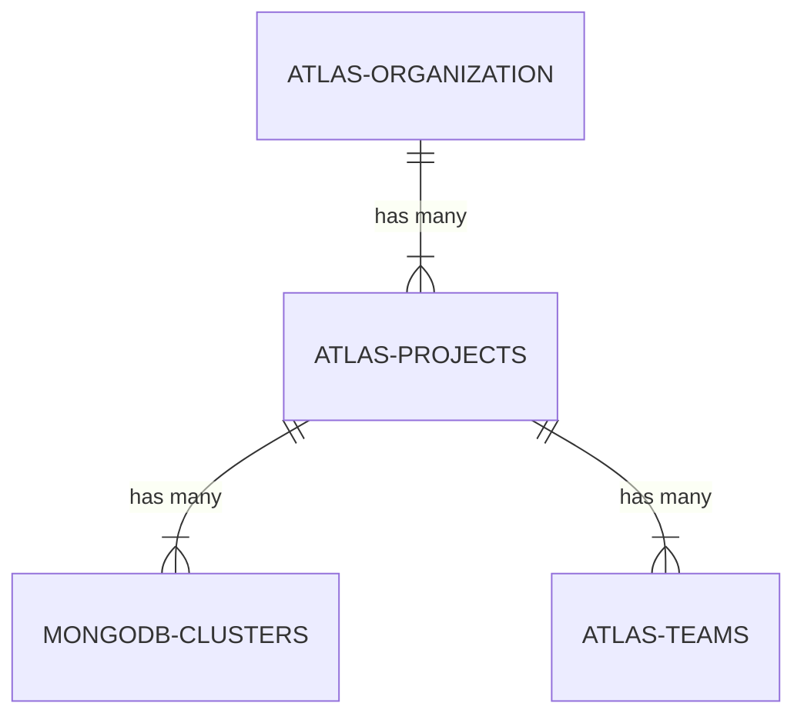
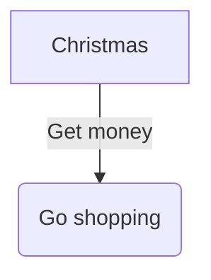

# error

## Example 1

**SebastianJS (SVG):**

<svg id="graph" xmlns="http://www.w3.org/2000/svg" xmlns:xlink="http://www.w3.org/1999/xlink" class="erDiagram" style="max-width: 15458px;" viewBox="-48 -26 316 348" role="graphics-document document" aria-roledescription="er"><style>#graph{font-family:"trebuchet ms",verdana,arial,sans-serif;font-size:16px;fill:#333;}@keyframes edge-animation-frame{from{stroke-dashoffset:0;}}@keyframes dash{to{stroke-dashoffset:0;}}#graph .edge-animation-slow{stroke-dasharray:9,5!important;stroke-dashoffset:900;animation:dash 50s linear infinite;stroke-linecap:round;}#graph .edge-animation-fast{stroke-dasharray:9,5!important;stroke-dashoffset:900;animation:dash 20s linear infinite;stroke-linecap:round;}#graph .error-icon{fill:#552222;}#graph .error-text{fill:#552222;stroke:#552222;}#graph .edge-thickness-normal{stroke-width:1px;}#graph .edge-thickness-thick{stroke-width:3.5px;}#graph .edge-pattern-solid{stroke-dasharray:0;}#graph .edge-thickness-invisible{stroke-width:0;fill:none;}#graph .edge-pattern-dashed{stroke-dasharray:3;}#graph .edge-pattern-dotted{stroke-dasharray:2;}#graph .marker{fill:#333333;stroke:#333333;}#graph .marker.cross{stroke:#333333;}#graph svg{font-family:"trebuchet ms",verdana,arial,sans-serif;font-size:16px;}#graph p{margin:0;}#graph .entityBox{fill:#ECECFF;stroke:#9370DB;}#graph .relationshipLabelBox{fill:hsl(80, 100%, 96.2745098039%);opacity:0.7;background-color:hsl(80, 100%, 96.2745098039%);}#graph .relationshipLabelBox rect{opacity:0.5;}#graph .labelBkg{background-color:rgba(248.6666666666, 255, 235.9999999999, 0.5);}#graph .edgeLabel .label{fill:#9370DB;font-size:14px;}#graph .label{font-family:"trebuchet ms",verdana,arial,sans-serif;color:#333;}#graph .edge-pattern-dashed{stroke-dasharray:8,8;}#graph .node rect,#graph .node circle,#graph .node ellipse,#graph .node polygon{fill:#ECECFF;stroke:#9370DB;stroke-width:1px;}#graph .relationshipLine{stroke:#333333;stroke-width:1;fill:none;}#graph .marker{fill:none!important;stroke:#333333!important;stroke-width:1;}#graph :root{--mermaid-font-family:"trebuchet ms",verdana,arial,sans-serif;}</style><g><defs><marker id="graph_er-onlyOneStart" class="marker onlyOne er" refX="0" refY="9" markerWidth="18" markerHeight="18" orient="auto"><path d="M9,0 L9,18 M15,0 L15,18"/></marker></defs><defs><marker id="graph_er-onlyOneEnd" class="marker onlyOne er" refX="18" refY="9" markerWidth="18" markerHeight="18" orient="auto"><path d="M3,0 L3,18 M9,0 L9,18"/></marker></defs><defs><marker id="graph_er-zeroOrOneStart" class="marker zeroOrOne er" refX="0" refY="9" markerWidth="30" markerHeight="18" orient="auto"><circle fill="white" cx="21" cy="9" r="6"/><path d="M9,0 L9,18"/></marker></defs><defs><marker id="graph_er-zeroOrOneEnd" class="marker zeroOrOne er" refX="30" refY="9" markerWidth="30" markerHeight="18" orient="auto"><circle fill="white" cx="9" cy="9" r="6"/><path d="M21,0 L21,18"/></marker></defs><defs><marker id="graph_er-oneOrMoreStart" class="marker oneOrMore er" refX="18" refY="18" markerWidth="45" markerHeight="36" orient="auto"><path d="M0,18 Q 18,0 36,18 Q 18,36 0,18 M42,9 L42,27"/></marker></defs><defs><marker id="graph_er-oneOrMoreEnd" class="marker oneOrMore er" refX="27" refY="18" markerWidth="45" markerHeight="36" orient="auto"><path d="M3,9 L3,27 M9,18 Q27,0 45,18 Q27,36 9,18"/></marker></defs><defs><marker id="graph_er-zeroOrMoreStart" class="marker zeroOrMore er" refX="18" refY="18" markerWidth="57" markerHeight="36" orient="auto"><circle fill="white" cx="48" cy="18" r="6"/><path d="M0,18 Q18,0 36,18 Q18,36 0,18"/></marker></defs><defs><marker id="graph_er-zeroOrMoreEnd" class="marker zeroOrMore er" refX="39" refY="18" markerWidth="57" markerHeight="36" orient="auto"><circle fill="white" cx="9" cy="18" r="6"/><path d="M21,18 Q39,0 57,18 Q39,36 21,18"/></marker></defs><g class="root"><g class="clusters"/><g class="edgePaths"><path d="M120,32L120,40.667C120,49.333,120,66.667,120,84C120,101.333,120,118.667,120,127.333L120,136" id="id_entity-ATLAS-ORGANIZATION-0_entity-ATLAS-PROJECTS-1_0" class=" edge-thickness-normal edge-pattern-solid relationshipLine" style="" marker-start="url(#graph_er-onlyOneStart)" marker-end="url(#graph_er-oneOrMoreEnd)"/><path d="M115,152.267L103.333,162.222C91.667,172.178,68.333,192.089,56.667,210.711C45,229.333,45,246.667,45,255.333L45,264" id="id_entity-ATLAS-PROJECTS-1_entity-MONGODB-CLUSTERS-2_1" class=" edge-thickness-normal edge-pattern-solid relationshipLine" style="" marker-start="url(#graph_er-onlyOneStart)" marker-end="url(#graph_er-oneOrMoreEnd)"/><path d="M125,152.267L136.667,162.222C148.333,172.178,171.667,192.089,183.333,210.711C195,229.333,195,246.667,195,255.333L195,264" id="id_entity-ATLAS-PROJECTS-1_entity-ATLAS-TEAMS-3_2" class=" edge-thickness-normal edge-pattern-solid relationshipLine" style="" marker-start="url(#graph_er-onlyOneStart)" marker-end="url(#graph_er-oneOrMoreEnd)"/></g><g class="edgeLabels"><g class="edgeLabel" transform="translate(120, 84)"><g class="label" transform="translate(-37, -12)"><g><rect class="background" style="" x="-2" y="-2" width="78" height="28"/><text y="-10.1" style=""><tspan class="text-outer-tspan" x="0" y="-0.1em" dy="1.1em"><tspan font-style="normal" class="text-inner-tspan" font-weight="normal">has</tspan><tspan font-style="normal" class="text-inner-tspan" font-weight="normal"> many</tspan></tspan></text></g></g></g><g class="edgeLabel" transform="translate(45, 212)"><g class="label" transform="translate(-37, -12)"><g><rect class="background" style="" x="-2" y="-2" width="78" height="28"/><text y="-10.1" style=""><tspan class="text-outer-tspan" x="0" y="-0.1em" dy="1.1em"><tspan font-style="normal" class="text-inner-tspan" font-weight="normal">has</tspan><tspan font-style="normal" class="text-inner-tspan" font-weight="normal"> many</tspan></tspan></text></g></g></g><g class="edgeLabel" transform="translate(195, 212)"><g class="label" transform="translate(-37, -12)"><g><rect class="background" style="" x="-2" y="-2" width="78" height="28"/><text y="-10.1" style=""><tspan class="text-outer-tspan" x="0" y="-0.1em" dy="1.1em"><tspan font-style="normal" class="text-inner-tspan" font-weight="normal">has</tspan><tspan font-style="normal" class="text-inner-tspan" font-weight="normal"> many</tspan></tspan></text></g></g></g></g><g class="nodes"><g class="node default " id="entity-ATLAS-ORGANIZATION-0" transform="translate(120, 20)"><rect class="basic label-container" style="" x="-97" y="-42" width="194" height="84"/><g class="label" style="" transform="translate(0, -12)"><rect/><g><rect class="background" style="stroke: none"/><text y="-10.1" style="" transform="translate(-77, 0)"><tspan class="text-outer-tspan" x="0" y="-0.1em" dy="1.1em"><tspan font-style="normal" class="text-inner-tspan" font-weight="normal">ATLAS-ORGANIZATION</tspan></tspan></text></g></g></g><g class="node default " id="entity-ATLAS-PROJECTS-1" transform="translate(120, 148)"><rect class="basic label-container" style="" x="-81" y="-42" width="162" height="84"/><g class="label" style="" transform="translate(0, -12)"><rect/><g><rect class="background" style="stroke: none"/><text y="-10.1" style="" transform="translate(-61, 0)"><tspan class="text-outer-tspan" x="0" y="-0.1em" dy="1.1em"><tspan font-style="normal" class="text-inner-tspan" font-weight="normal">ATLAS-PROJECTS</tspan></tspan></text></g></g></g><g class="node default " id="entity-MONGODB-CLUSTERS-2" transform="translate(45, 276)"><rect class="basic label-container" style="" x="-89" y="-42" width="178" height="84"/><g class="label" style="" transform="translate(0, -12)"><rect/><g><rect class="background" style="stroke: none"/><text y="-10.1" style="" transform="translate(-69, 0)"><tspan class="text-outer-tspan" x="0" y="-0.1em" dy="1.1em"><tspan font-style="normal" class="text-inner-tspan" font-weight="normal">MONGODB-CLUSTERS</tspan></tspan></text></g></g></g><g class="node default " id="entity-ATLAS-TEAMS-3" transform="translate(195, 276)"><rect class="basic label-container" style="" x="-69" y="-42" width="138" height="84"/><g class="label" style="" transform="translate(0, -12)"><rect/><g><rect class="background" style="stroke: none"/><text y="-10.1" style="" transform="translate(-49, 0)"><tspan class="text-outer-tspan" x="0" y="-0.1em" dy="1.1em"><tspan font-style="normal" class="text-inner-tspan" font-weight="normal">ATLAS-TEAMS</tspan></tspan></text></g></g></g></g></g></g></svg>

**Mermaid Code (Browser Rendered):**



## Example 2

**SebastianJS (SVG):**

> Render failed: Error: Parse error on line 5:
...GODB-CLUSTERS ||..|{        ATLAS-TEAMS
-----------------------^
Expecting 'UNICODE_TEXT', 'ENTITY_NAME', 'NON_IDENTIFYING', 'IDENTIFYING', got 'NEWLINE'

**Mermaid Code (Browser Rendered):**

```mermaid
erDiagram
        ATLAS-ORGANIZATION ||--|{ ATLAS-PROJECTS : "has many"
        ATLAS-PROJECTS ||--|{ MONGODB-CLUSTERS : "has many"
        ATLAS-PROJECTS ||--|{ ATLAS-TEAMS : "has many"
        MONGODB-CLUSTERS ||..|{
        ATLAS-TEAMS ||..|{
```

## Example 3

**SebastianJS (SVG):**

<svg id="graph" xmlns="http://www.w3.org/2000/svg" xmlns:xlink="http://www.w3.org/1999/xlink" class="flowchart" style="max-width: 27490px;" viewBox="-26 -11 150 121" role="graphics-document document" aria-roledescription="flowchart-v2"><style>#graph{font-family:"trebuchet ms",verdana,arial,sans-serif;font-size:16px;fill:#333;}@keyframes edge-animation-frame{from{stroke-dashoffset:0;}}@keyframes dash{to{stroke-dashoffset:0;}}#graph .edge-animation-slow{stroke-dasharray:9,5!important;stroke-dashoffset:900;animation:dash 50s linear infinite;stroke-linecap:round;}#graph .edge-animation-fast{stroke-dasharray:9,5!important;stroke-dashoffset:900;animation:dash 20s linear infinite;stroke-linecap:round;}#graph .error-icon{fill:#552222;}#graph .error-text{fill:#552222;stroke:#552222;}#graph .edge-thickness-normal{stroke-width:1px;}#graph .edge-thickness-thick{stroke-width:3.5px;}#graph .edge-pattern-solid{stroke-dasharray:0;}#graph .edge-thickness-invisible{stroke-width:0;fill:none;}#graph .edge-pattern-dashed{stroke-dasharray:3;}#graph .edge-pattern-dotted{stroke-dasharray:2;}#graph .marker{fill:#333333;stroke:#333333;}#graph .marker.cross{stroke:#333333;}#graph svg{font-family:"trebuchet ms",verdana,arial,sans-serif;font-size:16px;}#graph p{margin:0;}#graph .label{font-family:"trebuchet ms",verdana,arial,sans-serif;color:#333;}#graph .cluster-label text{fill:#333;}#graph .cluster-label span{color:#333;}#graph .cluster-label span p{background-color:transparent;}#graph .label text,#graph span{fill:#333;color:#333;}#graph .node rect,#graph .node circle,#graph .node ellipse,#graph .node polygon,#graph .node path{fill:#ECECFF;stroke:#9370DB;stroke-width:1px;}#graph .rough-node .label text,#graph .node .label text,#graph .image-shape .label,#graph .icon-shape .label{text-anchor:middle;}#graph .node .katex path{fill:#000;stroke:#000;stroke-width:1px;}#graph .rough-node .label,#graph .node .label,#graph .image-shape .label,#graph .icon-shape .label{text-align:center;}#graph .node.clickable{cursor:pointer;}#graph .root .anchor path{fill:#333333!important;stroke-width:0;stroke:#333333;}#graph .arrowheadPath{fill:#333333;}#graph .edgePath .path{stroke:#333333;stroke-width:2.0px;}#graph .flowchart-link{stroke:#333333;fill:none;}#graph .edgeLabel{background-color:rgba(232,232,232, 0.8);text-align:center;}#graph .edgeLabel p{background-color:rgba(232,232,232, 0.8);}#graph .edgeLabel rect{opacity:0.5;background-color:rgba(232,232,232, 0.8);fill:rgba(232,232,232, 0.8);}#graph .labelBkg{background-color:rgba(232, 232, 232, 0.5);}#graph .cluster rect{fill:#ffffde;stroke:#aaaa33;stroke-width:1px;}#graph .cluster text{fill:#333;}#graph .cluster span{color:#333;}#graph div.mermaidTooltip{position:absolute;text-align:center;max-width:200px;padding:2px;font-family:"trebuchet ms",verdana,arial,sans-serif;font-size:12px;background:hsl(80, 100%, 96.2745098039%);border:1px solid #aaaa33;border-radius:2px;pointer-events:none;z-index:100;}#graph .flowchartTitleText{text-anchor:middle;font-size:18px;fill:#333;}#graph rect.text{fill:none;stroke-width:0;}#graph .icon-shape,#graph .image-shape{background-color:rgba(232,232,232, 0.8);text-align:center;}#graph .icon-shape p,#graph .image-shape p{background-color:rgba(232,232,232, 0.8);padding:2px;}#graph .icon-shape rect,#graph .image-shape rect{opacity:0.5;background-color:rgba(232,232,232, 0.8);fill:rgba(232,232,232, 0.8);}#graph .label-icon{display:inline-block;height:1em;overflow:visible;vertical-align:-0.125em;}#graph .node .label-icon path{fill:currentColor;stroke:revert;stroke-width:revert;}#graph :root{--mermaid-font-family:"trebuchet ms",verdana,arial,sans-serif;}</style><g><marker id="graph_flowchart-v2-pointEnd" class="marker flowchart-v2" viewBox="0 0 10 10" refX="5" refY="5" markerUnits="userSpaceOnUse" markerWidth="8" markerHeight="8" orient="auto"><path d="M 0 0 L 10 5 L 0 10 z" class="arrowMarkerPath" style="stroke-width: 1; stroke-dasharray: 1,0;"/></marker><marker id="graph_flowchart-v2-pointStart" class="marker flowchart-v2" viewBox="0 0 10 10" refX="4.5" refY="5" markerUnits="userSpaceOnUse" markerWidth="8" markerHeight="8" orient="auto"><path d="M 0 5 L 10 10 L 10 0 z" class="arrowMarkerPath" style="stroke-width: 1; stroke-dasharray: 1,0;"/></marker><marker id="graph_flowchart-v2-circleEnd" class="marker flowchart-v2" viewBox="0 0 10 10" refX="11" refY="5" markerUnits="userSpaceOnUse" markerWidth="11" markerHeight="11" orient="auto"><circle cx="5" cy="5" r="5" class="arrowMarkerPath" style="stroke-width: 1; stroke-dasharray: 1,0;"/></marker><marker id="graph_flowchart-v2-circleStart" class="marker flowchart-v2" viewBox="0 0 10 10" refX="-1" refY="5" markerUnits="userSpaceOnUse" markerWidth="11" markerHeight="11" orient="auto"><circle cx="5" cy="5" r="5" class="arrowMarkerPath" style="stroke-width: 1; stroke-dasharray: 1,0;"/></marker><marker id="graph_flowchart-v2-crossEnd" class="marker cross flowchart-v2" viewBox="0 0 11 11" refX="12" refY="5.2" markerUnits="userSpaceOnUse" markerWidth="11" markerHeight="11" orient="auto"><path d="M 1,1 l 9,9 M 10,1 l -9,9" class="arrowMarkerPath" style="stroke-width: 2; stroke-dasharray: 1,0;"/></marker><marker id="graph_flowchart-v2-crossStart" class="marker cross flowchart-v2" viewBox="0 0 11 11" refX="-1" refY="5.2" markerUnits="userSpaceOnUse" markerWidth="11" markerHeight="11" orient="auto"><path d="M 1,1 l 9,9 M 10,1 l -9,9" class="arrowMarkerPath" style="stroke-width: 2; stroke-dasharray: 1,0;"/></marker><g class="root"><g class="clusters"/><g class="edgePaths"><path d="M49,32L49,38.167C49,44.333,49,56.667,49.074,68.417C49.149,80.167,49.298,91.334,49.372,96.917L49.447,102.5" id="L_A_B_0" class=" edge-thickness-normal edge-pattern-solid edge-thickness-normal edge-pattern-solid flowchart-link" style="" marker-end="url(#graph_flowchart-v2-pointEnd)"/></g><g class="edgeLabels"><g class="edgeLabel" transform="translate(49, 69)"><g class="label" transform="translate(-41, -12)"><g><rect class="background" style="" x="-2" y="-2" width="86" height="28"/><text y="-10.1" style=""><tspan class="text-outer-tspan" x="0" y="-0.1em" dy="1.1em"><tspan font-style="normal" class="text-inner-tspan" font-weight="normal">Get</tspan><tspan font-style="normal" class="text-inner-tspan" font-weight="normal"> money</tspan></tspan></text></g></g></g></g><g class="nodes"><g class="node default  " id="flowchart-A-0" transform="translate(49, 20)"><rect class="basic label-container" style="" x="-71" y="-27" width="142" height="54"/><g class="label" style="" transform="translate(0, -12)"><rect/><g><rect class="background" style="stroke: none"/><text y="-10.1" style=""><tspan class="text-outer-tspan" x="0" y="-0.1em" dy="1.1em"><tspan font-style="normal" class="text-inner-tspan" font-weight="normal">Christmas</tspan></tspan></text></g></g></g><g class="node default  " id="flowchart-B-1" transform="translate(49, 118)"><g class="basic label-container outer-path"><path d="M-59 -27 C-30.75941907407357 -27, -2.5188381481471396 -27, 59 -27 C59 -27, 59 -27, 59 -27 C59.15433327399704 -26.993616728570256, 59.308666547994086 -26.987233457140512, 59.41289672736166 -26.982922465033347 C59.541419495762504 -26.966902118659263, 59.669942264163346 -26.950881772285175, 59.82297295140367 -26.931806517013612 C59.9562949608883 -26.903851831315475, 60.08961697037293 -26.87589714561734, 60.227427435703994 -26.847001329696653 C60.364692425302216 -26.80613577171715, 60.50195741490044 -26.76527021373764, 60.62349734602342 -26.729086208503173 C60.727383800207605 -26.6885495882908, 60.83127025439178 -26.64801296807843, 61.008477123264846 -26.578866633275286 C61.100594485399384 -26.533833199014957, 61.192711847533914 -26.488799764754628, 61.379736965185366 -26.397368756032446 C61.45710357885441 -26.351268260674246, 61.53447019252345 -26.305167765316043, 61.734740790612136 -26.185832391312644 C61.82610780875652 -26.12059759421892, 61.91747482690089 -26.055362797125202, 62.07106356344834 -25.94570254698197 C62.19346733914804 -25.842031837236124, 62.315871114847745 -25.73836112749028, 62.386407858128706 -25.678619553365657 C62.46336132136254 -25.601666090131822, 62.540314784596376 -25.524712626897987, 62.67861955336566 -25.386407858128706 C62.77772147159319 -25.269398444381352, 62.87682338982073 -25.152389030633994, 62.94570254698197 -25.07106356344834 C63.00965929392519 -24.98148656591401, 63.073616040868416 -24.89190956837968, 63.185832391312644 -24.734740790612136 C63.25716588178461 -24.615027747267867, 63.32849937225657 -24.4953147039236, 63.39736875603245 -24.37973696518537 C63.464822382297754 -24.241758367282998, 63.53227600856306 -24.10377976938063, 63.57886663327529 -24.008477123264846 C63.611736422932964 -23.92423907185784, 63.644606212590645 -23.84000102045084, 63.729086208503176 -23.623497346023417 C63.77317506332846 -23.47540549317205, 63.81726391815374 -23.32731364032069, 63.84700132969665 -23.227427435703994 C63.876434433892214 -23.087054525090874, 63.90586753808777 -22.946681614477757, 63.93180651701361 -22.82297295140367 C63.948751310552744 -22.68703383218755, 63.96569610409188 -22.551094712971427, 63.98292246503335 -22.412896727361662 C63.987707446919536 -22.297206531724584, 63.99249242880572 -22.181516336087505, 64 -22 C64 -22, 64 -22, 64 -22 C64 -5.031102700348217, 64 11.937794599303565, 64 22 C64 22, 64 22, 64 22 C63.99389692453946 22.147558760056288, 63.987793849078926 22.295117520112573, 63.98292246503335 22.412896727361662 C63.97035952888104 22.51368252161574, 63.957796592728734 22.61446831586981, 63.93180651701361 22.82297295140367 C63.90461240301241 22.952667628136737, 63.87741828901121 23.082362304869804, 63.84700132969665 23.227427435703994 C63.804426210003285 23.370434741875705, 63.761851090309925 23.513442048047413, 63.729086208503176 23.623497346023417 C63.685560452019814 23.735044299939428, 63.64203469553646 23.846591253855443, 63.57886663327529 24.008477123264846 C63.50972249474999 24.14991371926584, 63.44057835622469 24.29135031526683, 63.39736875603245 24.379736965185366 C63.34115862436101 24.474069737697253, 63.284948492689566 24.568402510209136, 63.185832391312644 24.734740790612133 C63.1303570089936 24.81243889789112, 63.07488162667455 24.890137005170104, 62.94570254698197 25.07106356344834 C62.84390972053009 25.19125012653256, 62.74211689407821 25.31143668961678, 62.67861955336566 25.386407858128706 C62.588723418021104 25.47630399347326, 62.49882728267655 25.566200128817812, 62.386407858128706 25.678619553365657 C62.27602070899374 25.772112699571522, 62.165633559858776 25.86560584577739, 62.07106356344834 25.94570254698197 C61.96232016854793 26.023343838617432, 61.85357677364753 26.100985130252898, 61.734740790612136 26.185832391312644 C61.61976037101175 26.25434585013801, 61.50477995141136 26.32285930896337, 61.379736965185366 26.397368756032446 C61.26595238887773 26.452994645856624, 61.15216781257009 26.508620535680798, 61.008477123264846 26.578866633275286 C60.92458024189492 26.611603297971392, 60.84068336052499 26.6443399626675, 60.62349734602342 26.729086208503173 C60.48596337974094 26.770031844311102, 60.34842941345846 26.810977480119032, 60.227427435703994 26.847001329696653 C60.07524505861786 26.87891061861814, 59.923062681531725 26.910819907539626, 59.82297295140367 26.931806517013612 C59.733058248518695 26.94301437303993, 59.64314354563372 26.954222229066247, 59.41289672736166 26.982922465033347 C59.313057430393734 26.987051848901103, 59.213218133425805 26.991181232768856, 59 27 C59 27, 59 27, 59 27 C16.823528218280515 27, -25.35294356343897 27, -59 27 C-59 27, -59 27, -59 27 C-59.152614238453836 26.99368782840625, -59.30522847690768 26.9873756568125, -59.41289672736166 26.982922465033347 C-59.527721666028974 26.968609551354923, -59.642546604696285 26.9542966376765, -59.82297295140367 26.931806517013612 C-59.94265984329844 26.906710814825814, -60.062346735193216 26.881615112638013, -60.227427435703994 26.847001329696653 C-60.32853536520274 26.816900194897364, -60.429643294701485 26.78679906009808, -60.62349734602342 26.729086208503173 C-60.751304095421474 26.679215860134736, -60.87911084481953 26.629345511766303, -61.008477123264846 26.578866633275286 C-61.15577521432701 26.506856984422857, -61.30307330538917 26.434847335570428, -61.379736965185366 26.397368756032446 C-61.45703038709186 26.351311873498297, -61.53432380899835 26.30525499096415, -61.734740790612136 26.185832391312644 C-61.80313062750388 26.137002986309454, -61.87152046439563 26.08817358130626, -62.07106356344834 25.94570254698197 C-62.18861411036724 25.846142312336987, -62.30616465728614 25.746582077692, -62.386407858128706 25.678619553365657 C-62.47215225040678 25.592875161087584, -62.55789664268485 25.50713076880951, -62.67861955336566 25.386407858128706 C-62.75855169718083 25.292032154260806, -62.838483840996 25.19765645039291, -62.94570254698197 25.07106356344834 C-63.01160926262037 24.97875546482854, -63.07751597825876 24.886447366208746, -63.185832391312644 24.734740790612133 C-63.26510772409659 24.601699616166513, -63.34438305688053 24.46865844172089, -63.39736875603244 24.37973696518537 C-63.465751396175726 24.239858039021758, -63.53413403631901 24.099979112858147, -63.57886663327528 24.00847712326485 C-63.63220999646176 23.87176979969743, -63.685553359648246 23.735062476130008, -63.729086208503176 23.623497346023417 C-63.762981107416394 23.509646387495227, -63.79687600632962 23.39579542896704, -63.84700132969665 23.227427435703994 C-63.86637329713784 23.13503828653528, -63.88574526457902 23.04264913736657, -63.93180651701361 22.82297295140367 C-63.950156227698166 22.675762924762264, -63.96850593838273 22.528552898120857, -63.98292246503335 22.412896727361662 C-63.986715238896615 22.321195909952987, -63.99050801275989 22.22949509254431, -64 22 C-64 22, -64 22, -64 22 C-64 8.168765591039044, -64 -5.662468817921912, -64 -22 C-64 -22, -64 -22, -64 -22 C-63.996216592994735 -22.091474347662174, -63.99243318598946 -22.18294869532435, -63.98292246503335 -22.41289672736166 C-63.9626356194542 -22.575647363026455, -63.942348773875054 -22.738397998691248, -63.93180651701361 -22.82297295140367 C-63.91296519622027 -22.91283133066208, -63.89412387542693 -23.00268970992049, -63.84700132969665 -23.227427435703994 C-63.81140742438629 -23.346985256121798, -63.775813519075925 -23.466543076539605, -63.729086208503176 -23.623497346023417 C-63.67305373833665 -23.76709626014811, -63.61702126817012 -23.910695174272806, -63.57886663327529 -24.008477123264846 C-63.51844270932448 -24.13207623524883, -63.45801878537368 -24.255675347232817, -63.39736875603245 -24.379736965185366 C-63.34919781663727 -24.460578232275967, -63.301026877242094 -24.54141949936657, -63.185832391312644 -24.734740790612133 C-63.092029309497384 -24.86612018106077, -62.998226227682125 -24.997499571509405, -62.94570254698197 -25.07106356344834 C-62.875358745561115 -25.15411833284359, -62.805014944140254 -25.23717310223884, -62.67861955336566 -25.386407858128706 C-62.61702656055102 -25.448000850943345, -62.55543356773638 -25.509593843757987, -62.386407858128706 -25.678619553365657 C-62.29024958788457 -25.76006145388839, -62.19409131764043 -25.841503354411127, -62.07106356344834 -25.945702546981966 C-61.9911311182356 -26.00277321592312, -61.91119867302286 -26.05984388486427, -61.734740790612136 -26.185832391312644 C-61.654375949713916 -26.233719442316833, -61.574011108815704 -26.28160649332102, -61.379736965185366 -26.397368756032446 C-61.235454574990484 -26.467904118565677, -61.0911721847956 -26.53843948109891, -61.008477123264846 -26.578866633275286 C-60.903727737424234 -26.619739970464867, -60.79897835158362 -26.66061330765445, -60.62349734602342 -26.729086208503173 C-60.49260222806293 -26.768055373531382, -60.36170711010244 -26.807024538559595, -60.227427435703994 -26.847001329696653 C-60.08541726555747 -26.876777731115524, -59.94340709541094 -26.9065541325344, -59.82297295140367 -26.931806517013612 C-59.73182287812628 -26.943168361798755, -59.64067280484888 -26.954530206583897, -59.41289672736166 -26.982922465033347 C-59.27305838567936 -26.988706221627925, -59.13322004399707 -26.994489978222507, -59 -27 C-59 -27, -59 -27, -59 -27" stroke="none" stroke-width="0" fill="#ECECFF" style=""/><path d="M-59 -27 C-20.14943994768079 -27, 18.70112010463842 -27, 59 -27 M-59 -27 C-32.46359970513112 -27, -5.927199410262226 -27, 59 -27 M59 -27 C59 -27, 59 -27, 59 -27 M59 -27 C59 -27, 59 -27, 59 -27 M59 -27 C59.08595006888686 -26.996445078854993, 59.17190013777372 -26.99289015770999, 59.41289672736166 -26.982922465033347 M59 -27 C59.102043821746584 -26.99577943631294, 59.204087643493175 -26.99155887262588, 59.41289672736166 -26.982922465033347 M59.41289672736166 -26.982922465033347 C59.52016901107406 -26.96955098881326, 59.62744129478646 -26.95617951259317, 59.82297295140367 -26.931806517013612 M59.41289672736166 -26.982922465033347 C59.52431424848023 -26.969034285509434, 59.6357317695988 -26.955146105985516, 59.82297295140367 -26.931806517013612 M59.82297295140367 -26.931806517013612 C59.9354301745564 -26.90822671695005, 60.047887397709125 -26.884646916886492, 60.227427435703994 -26.847001329696653 M59.82297295140367 -26.931806517013612 C59.917305505341666 -26.912027060443517, 60.01163805927966 -26.89224760387342, 60.227427435703994 -26.847001329696653 M60.227427435703994 -26.847001329696653 C60.3445917358415 -26.812120006247667, 60.461756035979 -26.77723868279868, 60.62349734602342 -26.729086208503173 M60.227427435703994 -26.847001329696653 C60.3128493568628 -26.821570121913417, 60.3982712780216 -26.796138914130182, 60.62349734602342 -26.729086208503173 M60.62349734602342 -26.729086208503173 C60.77683983933885 -26.66925178193852, 60.930182332654276 -26.609417355373864, 61.008477123264846 -26.578866633275286 M60.62349734602342 -26.729086208503173 C60.70567901771 -26.69701882070235, 60.787860689396574 -26.664951432901525, 61.008477123264846 -26.578866633275286 M61.008477123264846 -26.578866633275286 C61.09542205621889 -26.53636184555963, 61.182366989172934 -26.493857057843975, 61.379736965185366 -26.397368756032446 M61.008477123264846 -26.578866633275286 C61.10248522967897 -26.532908870460112, 61.1964933360931 -26.486951107644934, 61.379736965185366 -26.397368756032446 M61.379736965185366 -26.397368756032446 C61.47876036344777 -26.338363618086543, 61.577783761710165 -26.279358480140644, 61.734740790612136 -26.185832391312644 M61.379736965185366 -26.397368756032446 C61.48218857881901 -26.336320845121385, 61.58464019245266 -26.27527293421032, 61.734740790612136 -26.185832391312644 M61.734740790612136 -26.185832391312644 C61.81699398359469 -26.127104740312273, 61.89924717657724 -26.068377089311902, 62.07106356344834 -25.94570254698197 M61.734740790612136 -26.185832391312644 C61.83572500471025 -26.113731048288084, 61.93670921880836 -26.04162970526352, 62.07106356344834 -25.94570254698197 M62.07106356344834 -25.94570254698197 C62.16964046521607 -25.862212170052103, 62.268217366983805 -25.778721793122237, 62.386407858128706 -25.678619553365657 M62.07106356344834 -25.94570254698197 C62.161880333815574 -25.868784666083467, 62.252697104182815 -25.791866785184965, 62.386407858128706 -25.678619553365657 M62.386407858128706 -25.678619553365657 C62.48193154462383 -25.583095866870526, 62.57745523111897 -25.4875721803754, 62.67861955336566 -25.386407858128706 M62.386407858128706 -25.678619553365657 C62.45557041461312 -25.609456996881242, 62.524732971097535 -25.540294440396828, 62.67861955336566 -25.386407858128706 M62.67861955336566 -25.386407858128706 C62.73503368471934 -25.319799819103622, 62.79144781607302 -25.253191780078538, 62.94570254698197 -25.07106356344834 M62.67861955336566 -25.386407858128706 C62.733781709717896 -25.321278023194576, 62.78894386607013 -25.256148188260447, 62.94570254698197 -25.07106356344834 M62.94570254698197 -25.07106356344834 C63.04123533616734 -24.937261567094417, 63.13676812535272 -24.803459570740493, 63.185832391312644 -24.734740790612136 M62.94570254698197 -25.07106356344834 C63.03365673492578 -24.947876058562095, 63.121610922869586 -24.824688553675852, 63.185832391312644 -24.734740790612136 M63.185832391312644 -24.734740790612136 C63.259954248874884 -24.61034826350604, 63.334076106437124 -24.48595573639994, 63.39736875603245 -24.37973696518537 M63.185832391312644 -24.734740790612136 C63.24329742091685 -24.638302027637376, 63.300762450521056 -24.541863264662616, 63.39736875603245 -24.37973696518537 M63.39736875603245 -24.37973696518537 C63.46849423007249 -24.234247482609792, 63.539619704112525 -24.088758000034215, 63.57886663327529 -24.008477123264846 M63.39736875603245 -24.37973696518537 C63.45499689543775 -24.261856721896574, 63.51262503484305 -24.143976478607783, 63.57886663327529 -24.008477123264846 M63.57886663327529 -24.008477123264846 C63.625739068047054 -23.88835336795651, 63.67261150281882 -23.768229612648167, 63.729086208503176 -23.623497346023417 M63.57886663327529 -24.008477123264846 C63.63344022379523 -23.868616997247585, 63.68801381431517 -23.728756871230324, 63.729086208503176 -23.623497346023417 M63.729086208503176 -23.623497346023417 C63.76112172072389 -23.51589195730082, 63.79315723294461 -23.408286568578223, 63.84700132969665 -23.227427435703994 M63.729086208503176 -23.623497346023417 C63.769009325726216 -23.489397959124112, 63.80893244294926 -23.35529857222481, 63.84700132969665 -23.227427435703994 M63.84700132969665 -23.227427435703994 C63.87832506460976 -23.078037693738203, 63.90964879952287 -22.92864795177241, 63.93180651701361 -22.82297295140367 M63.84700132969665 -23.227427435703994 C63.87670260447073 -23.085775560955906, 63.9064038792448 -22.94412368620782, 63.93180651701361 -22.82297295140367 M63.93180651701361 -22.82297295140367 C63.943551003093994 -22.7287531493314, 63.95529548917437 -22.63453334725913, 63.98292246503335 -22.412896727361662 M63.93180651701361 -22.82297295140367 C63.946175519262184 -22.707698043794206, 63.960544521510755 -22.592423136184745, 63.98292246503335 -22.412896727361662 M63.98292246503335 -22.412896727361662 C63.98886287461507 -22.269270865650796, 63.9948032841968 -22.125645003939926, 64 -22 M63.98292246503335 -22.412896727361662 C63.98711783774226 -22.311461967312585, 63.991313210451175 -22.210027207263508, 64 -22 M64 -22 C64 -22, 64 -22, 64 -22 M64 -22 C64 -22, 64 -22, 64 -22 M64 -22 C64 -10.092126887044714, 64 1.8157462259105728, 64 22 M64 -22 C64 -6.666093544582115, 64 8.66781291083577, 64 22 M64 22 C64 22, 64 22, 64 22 M64 22 C64 22, 64 22, 64 22 M64 22 C63.99512846794646 22.117782785751675, 63.99025693589292 22.235565571503347, 63.98292246503335 22.412896727361662 M64 22 C63.99577976467736 22.102035882626964, 63.99155952935472 22.204071765253932, 63.98292246503335 22.412896727361662 M63.98292246503335 22.412896727361662 C63.963676025381126 22.5673007363764, 63.944429585728905 22.721704745391133, 63.93180651701361 22.82297295140367 M63.98292246503335 22.412896727361662 C63.963363621958685 22.569806983855198, 63.94380477888403 22.726717240348737, 63.93180651701361 22.82297295140367 M63.93180651701361 22.82297295140367 C63.90844144795966 22.934406075412205, 63.88507637890571 23.04583919942074, 63.84700132969665 23.227427435703994 M63.93180651701361 22.82297295140367 C63.90320543026661 22.95937778885133, 63.87460434351961 23.09578262629899, 63.84700132969665 23.227427435703994 M63.84700132969665 23.227427435703994 C63.8186681572598 23.322596884308613, 63.79033498482294 23.417766332913235, 63.729086208503176 23.623497346023417 M63.84700132969665 23.227427435703994 C63.80464563200223 23.36969771637328, 63.762289934307795 23.511967997042568, 63.729086208503176 23.623497346023417 M63.729086208503176 23.623497346023417 C63.67790574845194 23.75466162391295, 63.626725288400706 23.88582590180248, 63.57886663327529 24.008477123264846 M63.729086208503176 23.623497346023417 C63.68062837402446 23.747684132565176, 63.63217053954574 23.87187091910694, 63.57886663327529 24.008477123264846 M63.57886663327529 24.008477123264846 C63.509475759698 24.15041842388161, 63.440084886120715 24.29235972449837, 63.39736875603245 24.379736965185366 M63.57886663327529 24.008477123264846 C63.52312041022912 24.12250784511233, 63.46737418718295 24.23653856695982, 63.39736875603245 24.379736965185366 M63.39736875603245 24.379736965185366 C63.343065823143455 24.4708690451614, 63.28876289025447 24.56200112513744, 63.185832391312644 24.734740790612133 M63.39736875603245 24.379736965185366 C63.31798220833745 24.512964782333874, 63.238595660642446 24.64619259948238, 63.185832391312644 24.734740790612133 M63.185832391312644 24.734740790612133 C63.096805907631996 24.85943013912186, 63.00777942395135 24.98411948763158, 62.94570254698197 25.07106356344834 M63.185832391312644 24.734740790612133 C63.114452132417625 24.83471506354874, 63.04307187352261 24.934689336485345, 62.94570254698197 25.07106356344834 M62.94570254698197 25.07106356344834 C62.83895872878364 25.197095751441555, 62.73221491058531 25.323127939434766, 62.67861955336566 25.386407858128706 M62.94570254698197 25.07106356344834 C62.8403819344849 25.19541537564535, 62.73506132198784 25.31976718784236, 62.67861955336566 25.386407858128706 M62.67861955336566 25.386407858128706 C62.58101253542627 25.48401487606809, 62.48340551748689 25.581621894007476, 62.386407858128706 25.678619553365657 M62.67861955336566 25.386407858128706 C62.6042230096555 25.46080440183886, 62.52982646594535 25.535200945549015, 62.386407858128706 25.678619553365657 M62.386407858128706 25.678619553365657 C62.275080526707725 25.77290899334861, 62.16375319528674 25.867198433331566, 62.07106356344834 25.94570254698197 M62.386407858128706 25.678619553365657 C62.27341425159855 25.77432025637716, 62.1604206450684 25.87002095938866, 62.07106356344834 25.94570254698197 M62.07106356344834 25.94570254698197 C61.973676774511375 26.01523537781019, 61.87628998557442 26.08476820863841, 61.734740790612136 26.185832391312644 M62.07106356344834 25.94570254698197 C61.96568033217236 26.020944727902286, 61.86029710089638 26.096186908822602, 61.734740790612136 26.185832391312644 M61.734740790612136 26.185832391312644 C61.600630394319644 26.26574484202706, 61.46651999802715 26.345657292741475, 61.379736965185366 26.397368756032446 M61.734740790612136 26.185832391312644 C61.61554994736973 26.256854718063845, 61.49635910412732 26.327877044815047, 61.379736965185366 26.397368756032446 M61.379736965185366 26.397368756032446 C61.284785638208405 26.44378763128316, 61.18983431123145 26.490206506533877, 61.008477123264846 26.578866633275286 M61.379736965185366 26.397368756032446 C61.301216418859404 26.435755112079974, 61.22269587253344 26.474141468127502, 61.008477123264846 26.578866633275286 M61.008477123264846 26.578866633275286 C60.91537954576272 26.615193420742735, 60.82228196826059 26.651520208210183, 60.62349734602342 26.729086208503173 M61.008477123264846 26.578866633275286 C60.888278473015845 26.625768292143583, 60.76807982276684 26.67266995101188, 60.62349734602342 26.729086208503173 M60.62349734602342 26.729086208503173 C60.539767971822585 26.754013523224916, 60.456038597621756 26.778940837946664, 60.227427435703994 26.847001329696653 M60.62349734602342 26.729086208503173 C60.46593697791911 26.775993962453292, 60.308376609814786 26.822901716403415, 60.227427435703994 26.847001329696653 M60.227427435703994 26.847001329696653 C60.075786271924166 26.878797138121318, 59.92414510814434 26.910592946545986, 59.82297295140367 26.931806517013612 M60.227427435703994 26.847001329696653 C60.115030228979 26.87056854563865, 60.00263302225401 26.894135761580653, 59.82297295140367 26.931806517013612 M59.82297295140367 26.931806517013612 C59.66935002697038 26.950955594574292, 59.515727102537085 26.970104672134976, 59.41289672736166 26.982922465033347 M59.82297295140367 26.931806517013612 C59.68227078501269 26.94934502376393, 59.5415686186217 26.96688353051425, 59.41289672736166 26.982922465033347 M59.41289672736166 26.982922465033347 C59.30838959704721 26.987244911916406, 59.20388246673276 26.991567358799465, 59 27 M59.41289672736166 26.982922465033347 C59.31727708749802 26.986877322592292, 59.22165744763438 26.990832180151237, 59 27 M59 27 C59 27, 59 27, 59 27 M59 27 C59 27, 59 27, 59 27 M59 27 C35.39069161206492 27, 11.78138322412984 27, -59 27 M59 27 C27.62795939866201 27, -3.7440812026759787 27, -59 27 M-59 27 C-59 27, -59 27, -59 27 M-59 27 C-59 27, -59 27, -59 27 M-59 27 C-59.08579266750534 26.99645158902429, -59.171585335010676 26.99290317804858, -59.41289672736166 26.982922465033347 M-59 27 C-59.113053761894975 26.995324061819986, -59.22610752378994 26.99064812363997, -59.41289672736166 26.982922465033347 M-59.41289672736166 26.982922465033347 C-59.53204240375125 26.968070971959506, -59.65118808014084 26.953219478885668, -59.82297295140367 26.931806517013612 M-59.41289672736166 26.982922465033347 C-59.520410093483726 26.969520937922233, -59.62792345960579 26.95611941081112, -59.82297295140367 26.931806517013612 M-59.82297295140367 26.931806517013612 C-59.93110705083958 26.909133180670523, -60.03924115027548 26.88645984432743, -60.227427435703994 26.847001329696653 M-59.82297295140367 26.931806517013612 C-59.97286213394542 26.900378060424167, -60.12275131648717 26.86894960383472, -60.227427435703994 26.847001329696653 M-60.227427435703994 26.847001329696653 C-60.31270084621978 26.821614335447478, -60.39797425673556 26.796227341198307, -60.62349734602342 26.729086208503173 M-60.227427435703994 26.847001329696653 C-60.380617054065276 26.801394804323174, -60.533806672426564 26.755788278949698, -60.62349734602342 26.729086208503173 M-60.62349734602342 26.729086208503173 C-60.76237870875209 26.674894532603567, -60.901260071480756 26.620702856703957, -61.008477123264846 26.578866633275286 M-60.62349734602342 26.729086208503173 C-60.74752572211125 26.680690185975386, -60.87155409819908 26.6322941634476, -61.008477123264846 26.578866633275286 M-61.008477123264846 26.578866633275286 C-61.114356514339036 26.52710535302391, -61.220235905413226 26.47534407277253, -61.379736965185366 26.397368756032446 M-61.008477123264846 26.578866633275286 C-61.08785391067091 26.540061686470292, -61.16723069807698 26.501256739665294, -61.379736965185366 26.397368756032446 M-61.379736965185366 26.397368756032446 C-61.50454961127889 26.322996561890754, -61.62936225737241 26.248624367749063, -61.734740790612136 26.185832391312644 M-61.379736965185366 26.397368756032446 C-61.505315921524215 26.322539940097034, -61.63089487786307 26.24771112416162, -61.734740790612136 26.185832391312644 M-61.734740790612136 26.185832391312644 C-61.81752630536583 26.126724669872917, -61.90031182011952 26.06761694843319, -62.07106356344834 25.94570254698197 M-61.734740790612136 26.185832391312644 C-61.83073320270344 26.117295126416707, -61.92672561479475 26.048757861520766, -62.07106356344834 25.94570254698197 M-62.07106356344834 25.94570254698197 C-62.18411223191063 25.849955208892812, -62.29716090037293 25.754207870803658, -62.386407858128706 25.678619553365657 M-62.07106356344834 25.94570254698197 C-62.156248895907 25.873554250694195, -62.241434228365655 25.801405954406416, -62.386407858128706 25.678619553365657 M-62.386407858128706 25.678619553365657 C-62.49801023045448 25.567017181039883, -62.60961260278025 25.45541480871411, -62.67861955336566 25.386407858128706 M-62.386407858128706 25.678619553365657 C-62.456879343922374 25.608148067571992, -62.527350829716035 25.537676581778328, -62.67861955336566 25.386407858128706 M-62.67861955336566 25.386407858128706 C-62.749672678920476 25.302515591311042, -62.820725804475295 25.21862332449338, -62.94570254698197 25.07106356344834 M-62.67861955336566 25.386407858128706 C-62.74377921664853 25.309473989066774, -62.8089388799314 25.232540120004842, -62.94570254698197 25.07106356344834 M-62.94570254698197 25.07106356344834 C-63.00245091427877 24.991582529775137, -63.05919928157557 24.912101496101936, -63.185832391312644 24.734740790612133 M-62.94570254698197 25.07106356344834 C-63.00761979847952 24.98434305701526, -63.06953704997707 24.897622550582177, -63.185832391312644 24.734740790612133 M-63.185832391312644 24.734740790612133 C-63.23267297279324 24.656132152173768, -63.279513554273834 24.577523513735404, -63.39736875603244 24.37973696518537 M-63.185832391312644 24.734740790612133 C-63.2680352102944 24.59678666041782, -63.350238029276156 24.458832530223507, -63.39736875603244 24.37973696518537 M-63.39736875603244 24.37973696518537 C-63.441794129569956 24.28886341113972, -63.48621950310747 24.19798985709407, -63.57886663327528 24.00847712326485 M-63.39736875603244 24.37973696518537 C-63.45735647630386 24.257030122089134, -63.517344196575266 24.1343232789929, -63.57886663327528 24.00847712326485 M-63.57886663327528 24.00847712326485 C-63.6196893182134 23.903857548019527, -63.660512003151524 23.799237972774204, -63.729086208503176 23.623497346023417 M-63.57886663327528 24.00847712326485 C-63.616625680681 23.911708978121, -63.65438472808671 23.814940832977147, -63.729086208503176 23.623497346023417 M-63.729086208503176 23.623497346023417 C-63.764954062983556 23.503019346564088, -63.800821917463935 23.38254134710476, -63.84700132969665 23.227427435703994 M-63.729086208503176 23.623497346023417 C-63.77104822646843 23.48254941225461, -63.81301024443368 23.3416014784858, -63.84700132969665 23.227427435703994 M-63.84700132969665 23.227427435703994 C-63.86648636750102 23.134499029245983, -63.88597140530539 23.041570622787972, -63.93180651701361 22.82297295140367 M-63.84700132969665 23.227427435703994 C-63.864664939442726 23.143185817982786, -63.882328549188806 23.058944200261575, -63.93180651701361 22.82297295140367 M-63.93180651701361 22.82297295140367 C-63.942171820385404 22.73981760297675, -63.95253712375719 22.656662254549826, -63.98292246503335 22.412896727361662 M-63.93180651701361 22.82297295140367 C-63.94914716727991 22.683858082969834, -63.96648781754621 22.544743214535995, -63.98292246503335 22.412896727361662 M-63.98292246503335 22.412896727361662 C-63.98658586095615 22.324323980152613, -63.990249256878954 22.235751232943564, -64 22 M-63.98292246503335 22.412896727361662 C-63.988473410301445 22.278687244585782, -63.99402435556954 22.144477761809902, -64 22 M-64 22 C-64 22, -64 22, -64 22 M-64 22 C-64 22, -64 22, -64 22 M-64 22 C-64 9.065869191721065, -64 -3.86826161655787, -64 -22 M-64 22 C-64 11.477902575547931, -64 0.9558051510958627, -64 -22 M-64 -22 C-64 -22, -64 -22, -64 -22 M-64 -22 C-64 -22, -64 -22, -64 -22 M-64 -22 C-63.99581108060488 -22.10127873330689, -63.99162216120976 -22.202557466613783, -63.98292246503335 -22.41289672736166 M-64 -22 C-63.99650964191171 -22.084389078095377, -63.99301928382341 -22.168778156190754, -63.98292246503335 -22.41289672736166 M-63.98292246503335 -22.41289672736166 C-63.969440998377195 -22.521051406186505, -63.95595953172105 -22.629206085011347, -63.93180651701361 -22.82297295140367 M-63.98292246503335 -22.41289672736166 C-63.96424347583568 -22.56274838141187, -63.945564486638006 -22.712600035462078, -63.93180651701361 -22.82297295140367 M-63.93180651701361 -22.82297295140367 C-63.902256561836644 -22.963903149901174, -63.87270660665968 -23.104833348398678, -63.84700132969665 -23.227427435703994 M-63.93180651701361 -22.82297295140367 C-63.90811151814678 -22.935979582841927, -63.88441651927995 -23.04898621428018, -63.84700132969665 -23.227427435703994 M-63.84700132969665 -23.227427435703994 C-63.80533222614271 -23.36739148730873, -63.76366312258876 -23.507355538913462, -63.729086208503176 -23.623497346023417 M-63.84700132969665 -23.227427435703994 C-63.80224949223863 -23.377746207963447, -63.75749765478061 -23.528064980222904, -63.729086208503176 -23.623497346023417 M-63.729086208503176 -23.623497346023417 C-63.68828648136565 -23.728058085468245, -63.647486754228126 -23.83261882491307, -63.57886663327529 -24.008477123264846 M-63.729086208503176 -23.623497346023417 C-63.68603050008251 -23.733839669995607, -63.64297479166184 -23.8441819939678, -63.57886663327529 -24.008477123264846 M-63.57886663327529 -24.008477123264846 C-63.52905491553899 -24.110368620474055, -63.4792431978027 -24.212260117683268, -63.39736875603245 -24.379736965185366 M-63.57886663327529 -24.008477123264846 C-63.53785052934339 -24.092376904867134, -63.49683442541149 -24.176276686469418, -63.39736875603245 -24.379736965185366 M-63.39736875603245 -24.379736965185366 C-63.34317273973691 -24.470689615966204, -63.288976723441365 -24.56164226674704, -63.185832391312644 -24.734740790612133 M-63.39736875603245 -24.379736965185366 C-63.333550013697575 -24.48683863393539, -63.26973127136271 -24.59394030268541, -63.185832391312644 -24.734740790612133 M-63.185832391312644 -24.734740790612133 C-63.09668488561202 -24.859599641007165, -63.00753737991139 -24.9844584914022, -62.94570254698197 -25.07106356344834 M-63.185832391312644 -24.734740790612133 C-63.103591548472956 -24.84992625779689, -63.02135070563326 -24.965111724981647, -62.94570254698197 -25.07106356344834 M-62.94570254698197 -25.07106356344834 C-62.86552436366603 -25.165729765605857, -62.7853461803501 -25.26039596776337, -62.67861955336566 -25.386407858128706 M-62.94570254698197 -25.07106356344834 C-62.869075697734026 -25.161536713395076, -62.79244884848608 -25.25200986334181, -62.67861955336566 -25.386407858128706 M-62.67861955336566 -25.386407858128706 C-62.57810663223327 -25.486920779261094, -62.47759371110088 -25.58743370039348, -62.386407858128706 -25.678619553365657 M-62.67861955336566 -25.386407858128706 C-62.61047119111466 -25.4545562203797, -62.54232282886367 -25.522704582630695, -62.386407858128706 -25.678619553365657 M-62.386407858128706 -25.678619553365657 C-62.315552728564185 -25.738630786917053, -62.244697598999664 -25.798642020468453, -62.07106356344834 -25.945702546981966 M-62.386407858128706 -25.678619553365657 C-62.29051684075729 -25.759835102251458, -62.19462582338587 -25.84105065113726, -62.07106356344834 -25.945702546981966 M-62.07106356344834 -25.945702546981966 C-61.9736991017691 -26.015219436454576, -61.876334640089866 -26.084736325927185, -61.734740790612136 -26.185832391312644 M-62.07106356344834 -25.945702546981966 C-61.9976896343836 -25.998090525398247, -61.92431570531886 -26.050478503814524, -61.734740790612136 -26.185832391312644 M-61.734740790612136 -26.185832391312644 C-61.606785629742156 -26.26207711781674, -61.47883046887218 -26.338321844320838, -61.379736965185366 -26.397368756032446 M-61.734740790612136 -26.185832391312644 C-61.600318951092014 -26.265930421909502, -61.4658971115719 -26.346028452506356, -61.379736965185366 -26.397368756032446 M-61.379736965185366 -26.397368756032446 C-61.26716393641033 -26.452402356358768, -61.15459090763528 -26.50743595668509, -61.008477123264846 -26.578866633275286 M-61.379736965185366 -26.397368756032446 C-61.273335791643554 -26.449385120188847, -61.16693461810174 -26.501401484345248, -61.008477123264846 -26.578866633275286 M-61.008477123264846 -26.578866633275286 C-60.85518923387664 -26.638679753321423, -60.70190134448843 -26.698492873367556, -60.62349734602342 -26.729086208503173 M-61.008477123264846 -26.578866633275286 C-60.90996480502148 -26.617306259136342, -60.811452486778116 -26.655745884997394, -60.62349734602342 -26.729086208503173 M-60.62349734602342 -26.729086208503173 C-60.5295026577666 -26.7570696396313, -60.43550796950977 -26.785053070759425, -60.227427435703994 -26.847001329696653 M-60.62349734602342 -26.729086208503173 C-60.51274809776422 -26.762057688260466, -60.40199884950502 -26.795029168017763, -60.227427435703994 -26.847001329696653 M-60.227427435703994 -26.847001329696653 C-60.128431544040616 -26.867758585363248, -60.02943565237724 -26.88851584102984, -59.82297295140367 -26.931806517013612 M-60.227427435703994 -26.847001329696653 C-60.10670288359393 -26.872314606351654, -59.98597833148387 -26.897627883006656, -59.82297295140367 -26.931806517013612 M-59.82297295140367 -26.931806517013612 C-59.66711815719333 -26.951233796851877, -59.51126336298298 -26.97066107669014, -59.41289672736166 -26.982922465033347 M-59.82297295140367 -26.931806517013612 C-59.66844121202238 -26.951068878239422, -59.51390947264109 -26.97033123946523, -59.41289672736166 -26.982922465033347 M-59.41289672736166 -26.982922465033347 C-59.302656522434305 -26.98748203363639, -59.19241631750695 -26.992041602239436, -59 -27 M-59.41289672736166 -26.982922465033347 C-59.31913362612575 -26.986800535586653, -59.225370524889826 -26.990678606139962, -59 -27 M-59 -27 C-59 -27, -59 -27, -59 -27 M-59 -27 C-59 -27, -59 -27, -59 -27" stroke="#9370DB" stroke-width="1.3" fill="none" stroke-dasharray="0 0" style=""/></g><g class="label" style="" transform="translate(0, -12)"><rect/><g><rect class="background" style="stroke: none"/><text y="-10.1" style=""><tspan class="text-outer-tspan" x="0" y="-0.1em" dy="1.1em"><tspan font-style="normal" class="text-inner-tspan" font-weight="normal">Go</tspan><tspan font-style="normal" class="text-inner-tspan" font-weight="normal"> shopping</tspan></tspan></text></g></g></g></g></g></g></svg>

**Mermaid Code (Browser Rendered):**



## Example 4

**SebastianJS (SVG):**

> Render failed: Error: Parse error on line 3:
...ney| B(Go shopping)
----------------------^
Expecting 'LINK', 'UNICODE_TEXT', 'EDGE_TEXT', got '1'

**Mermaid Code (Browser Rendered):**

```mermaid
flowchart TD
      A[Christmas] --|Get money| B(Go shopping)
```

