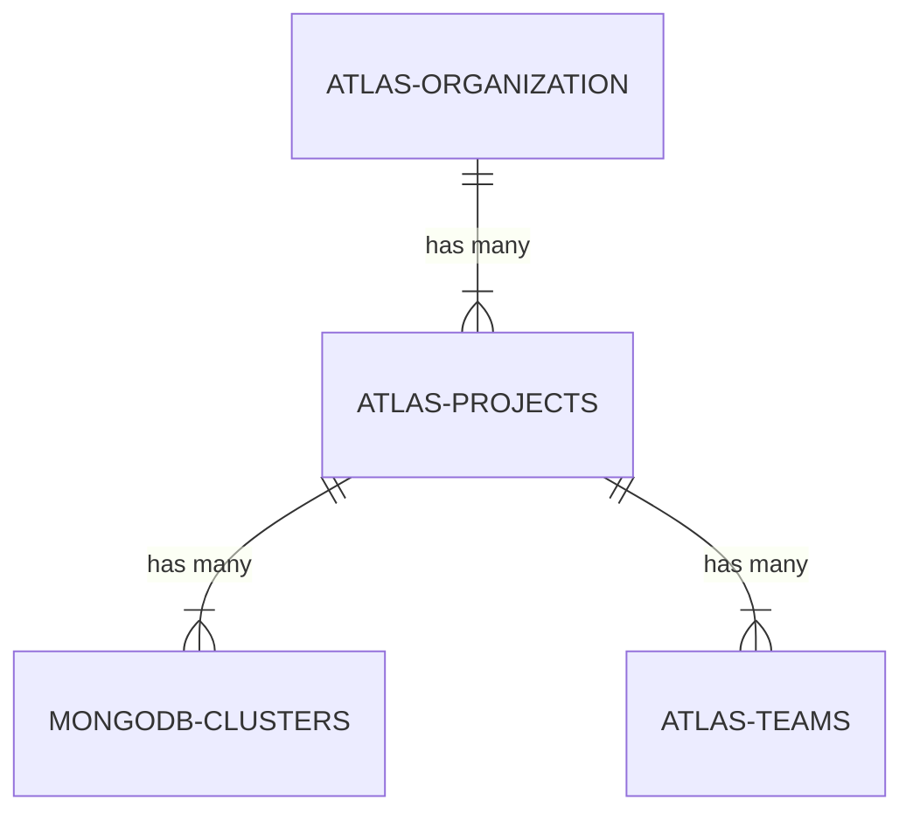
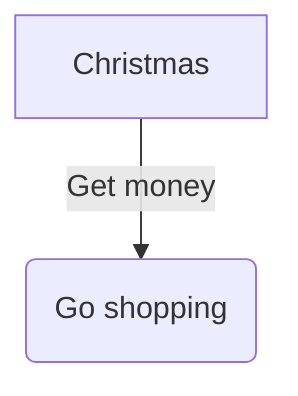

# error

## Example 1

**SebastianJS (SVG):**

> Render failed: TypeError: DOMPurify.sanitize is not a function

**Mermaid Code (Browser Rendered):**



## Example 2

**SebastianJS (SVG):**

> Render failed: Error: Parse error on line 5:
...GODB-CLUSTERS ||..|{        ATLAS-TEAMS
-----------------------^
Expecting 'UNICODE_TEXT', 'ENTITY_NAME', 'NON_IDENTIFYING', 'IDENTIFYING', got 'NEWLINE'

**Mermaid Code (Browser Rendered):**

```mermaid
erDiagram
        ATLAS-ORGANIZATION ||--|{ ATLAS-PROJECTS : "has many"
        ATLAS-PROJECTS ||--|{ MONGODB-CLUSTERS : "has many"
        ATLAS-PROJECTS ||--|{ ATLAS-TEAMS : "has many"
        MONGODB-CLUSTERS ||..|{
        ATLAS-TEAMS ||..|{
```

## Example 3

**SebastianJS (SVG):**

> Render failed: TypeError: DOMPurify.sanitize is not a function

**Mermaid Code (Browser Rendered):**



## Example 4

**SebastianJS (SVG):**

> Render failed: TypeError: DOMPurify.sanitize is not a function

**Mermaid Code (Browser Rendered):**

```mermaid
flowchart TD
      A[Christmas] --|Get money| B(Go shopping)
```

