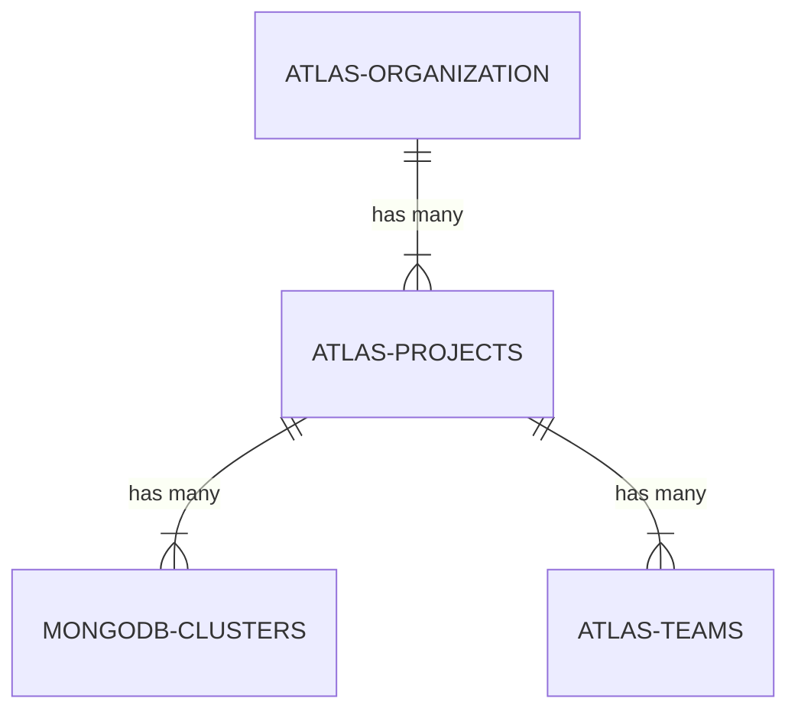
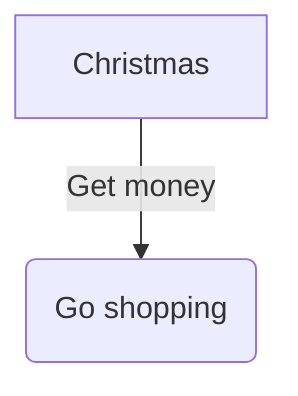

# error

## Example 1

**SebastianJS (SVG):**

<svg id="graph" xmlns="http://www.w3.org/2000/svg" xmlns:xlink="http://www.w3.org/1999/xlink" class="erDiagram" style="max-width: 15458px;" viewBox="-48 -26 316 348" role="graphics-document document" aria-roledescription="er"><style>#graph{font-family:"trebuchet ms",verdana,arial,sans-serif;font-size:16px;fill:#333;}@keyframes edge-animation-frame{from{stroke-dashoffset:0;}}@keyframes dash{to{stroke-dashoffset:0;}}#graph .edge-animation-slow{stroke-dasharray:9,5!important;stroke-dashoffset:900;animation:dash 50s linear infinite;stroke-linecap:round;}#graph .edge-animation-fast{stroke-dasharray:9,5!important;stroke-dashoffset:900;animation:dash 20s linear infinite;stroke-linecap:round;}#graph .error-icon{fill:#552222;}#graph .error-text{fill:#552222;stroke:#552222;}#graph .edge-thickness-normal{stroke-width:1px;}#graph .edge-thickness-thick{stroke-width:3.5px;}#graph .edge-pattern-solid{stroke-dasharray:0;}#graph .edge-thickness-invisible{stroke-width:0;fill:none;}#graph .edge-pattern-dashed{stroke-dasharray:3;}#graph .edge-pattern-dotted{stroke-dasharray:2;}#graph .marker{fill:#333333;stroke:#333333;}#graph .marker.cross{stroke:#333333;}#graph svg{font-family:"trebuchet ms",verdana,arial,sans-serif;font-size:16px;}#graph p{margin:0;}#graph .entityBox{fill:#ECECFF;stroke:#9370DB;}#graph .relationshipLabelBox{fill:hsl(80, 100%, 96.2745098039%);opacity:0.7;background-color:hsl(80, 100%, 96.2745098039%);}#graph .relationshipLabelBox rect{opacity:0.5;}#graph .labelBkg{background-color:rgba(248.6666666666, 255, 235.9999999999, 0.5);}#graph .edgeLabel .label{fill:#9370DB;font-size:14px;}#graph .label{font-family:"trebuchet ms",verdana,arial,sans-serif;color:#333;}#graph .edge-pattern-dashed{stroke-dasharray:8,8;}#graph .node rect,#graph .node circle,#graph .node ellipse,#graph .node polygon{fill:#ECECFF;stroke:#9370DB;stroke-width:1px;}#graph .relationshipLine{stroke:#333333;stroke-width:1;fill:none;}#graph .marker{fill:none!important;stroke:#333333!important;stroke-width:1;}#graph :root{--mermaid-font-family:"trebuchet ms",verdana,arial,sans-serif;}</style><g><defs><marker id="graph_er-onlyOneStart" class="marker onlyOne er" refX="0" refY="9" markerWidth="18" markerHeight="18" orient="auto"><path d="M9,0 L9,18 M15,0 L15,18"/></marker></defs><defs><marker id="graph_er-onlyOneEnd" class="marker onlyOne er" refX="18" refY="9" markerWidth="18" markerHeight="18" orient="auto"><path d="M3,0 L3,18 M9,0 L9,18"/></marker></defs><defs><marker id="graph_er-zeroOrOneStart" class="marker zeroOrOne er" refX="0" refY="9" markerWidth="30" markerHeight="18" orient="auto"><circle fill="white" cx="21" cy="9" r="6"/><path d="M9,0 L9,18"/></marker></defs><defs><marker id="graph_er-zeroOrOneEnd" class="marker zeroOrOne er" refX="30" refY="9" markerWidth="30" markerHeight="18" orient="auto"><circle fill="white" cx="9" cy="9" r="6"/><path d="M21,0 L21,18"/></marker></defs><defs><marker id="graph_er-oneOrMoreStart" class="marker oneOrMore er" refX="18" refY="18" markerWidth="45" markerHeight="36" orient="auto"><path d="M0,18 Q 18,0 36,18 Q 18,36 0,18 M42,9 L42,27"/></marker></defs><defs><marker id="graph_er-oneOrMoreEnd" class="marker oneOrMore er" refX="27" refY="18" markerWidth="45" markerHeight="36" orient="auto"><path d="M3,9 L3,27 M9,18 Q27,0 45,18 Q27,36 9,18"/></marker></defs><defs><marker id="graph_er-zeroOrMoreStart" class="marker zeroOrMore er" refX="18" refY="18" markerWidth="57" markerHeight="36" orient="auto"><circle fill="white" cx="48" cy="18" r="6"/><path d="M0,18 Q18,0 36,18 Q18,36 0,18"/></marker></defs><defs><marker id="graph_er-zeroOrMoreEnd" class="marker zeroOrMore er" refX="39" refY="18" markerWidth="57" markerHeight="36" orient="auto"><circle fill="white" cx="9" cy="18" r="6"/><path d="M21,18 Q39,0 57,18 Q39,36 21,18"/></marker></defs><g class="root"><g class="clusters"/><g class="edgePaths"><path d="M120,32L120,40.667C120,49.333,120,66.667,120,84C120,101.333,120,118.667,120,127.333L120,136" id="id_entity-ATLAS-ORGANIZATION-0_entity-ATLAS-PROJECTS-1_0" class=" edge-thickness-normal edge-pattern-solid relationshipLine" style="" marker-start="url(#graph_er-onlyOneStart)" marker-end="url(#graph_er-oneOrMoreEnd)"/><path d="M115,152.267L103.333,162.222C91.667,172.178,68.333,192.089,56.667,210.711C45,229.333,45,246.667,45,255.333L45,264" id="id_entity-ATLAS-PROJECTS-1_entity-MONGODB-CLUSTERS-2_1" class=" edge-thickness-normal edge-pattern-solid relationshipLine" style="" marker-start="url(#graph_er-onlyOneStart)" marker-end="url(#graph_er-oneOrMoreEnd)"/><path d="M125,152.267L136.667,162.222C148.333,172.178,171.667,192.089,183.333,210.711C195,229.333,195,246.667,195,255.333L195,264" id="id_entity-ATLAS-PROJECTS-1_entity-ATLAS-TEAMS-3_2" class=" edge-thickness-normal edge-pattern-solid relationshipLine" style="" marker-start="url(#graph_er-onlyOneStart)" marker-end="url(#graph_er-oneOrMoreEnd)"/></g><g class="edgeLabels"><g class="edgeLabel" transform="translate(120, 84)"><g class="label" transform="translate(-37, -12)"><g><rect class="background" style="" x="-2" y="-2" width="78" height="28"/><text y="-10.1" style=""><tspan class="text-outer-tspan" x="0" y="-0.1em" dy="1.1em"><tspan font-style="normal" class="text-inner-tspan" font-weight="normal">has</tspan><tspan font-style="normal" class="text-inner-tspan" font-weight="normal"> many</tspan></tspan></text></g></g></g><g class="edgeLabel" transform="translate(45, 212)"><g class="label" transform="translate(-37, -12)"><g><rect class="background" style="" x="-2" y="-2" width="78" height="28"/><text y="-10.1" style=""><tspan class="text-outer-tspan" x="0" y="-0.1em" dy="1.1em"><tspan font-style="normal" class="text-inner-tspan" font-weight="normal">has</tspan><tspan font-style="normal" class="text-inner-tspan" font-weight="normal"> many</tspan></tspan></text></g></g></g><g class="edgeLabel" transform="translate(195, 212)"><g class="label" transform="translate(-37, -12)"><g><rect class="background" style="" x="-2" y="-2" width="78" height="28"/><text y="-10.1" style=""><tspan class="text-outer-tspan" x="0" y="-0.1em" dy="1.1em"><tspan font-style="normal" class="text-inner-tspan" font-weight="normal">has</tspan><tspan font-style="normal" class="text-inner-tspan" font-weight="normal"> many</tspan></tspan></text></g></g></g></g><g class="nodes"><g class="node default " id="entity-ATLAS-ORGANIZATION-0" transform="translate(120, 20)"><rect class="basic label-container" style="" x="-97" y="-42" width="194" height="84"/><g class="label" style="" transform="translate(0, -12)"><rect/><g><rect class="background" style="stroke: none"/><text y="-10.1" style="" transform="translate(-77, 0)"><tspan class="text-outer-tspan" x="0" y="-0.1em" dy="1.1em"><tspan font-style="normal" class="text-inner-tspan" font-weight="normal">ATLAS-ORGANIZATION</tspan></tspan></text></g></g></g><g class="node default " id="entity-ATLAS-PROJECTS-1" transform="translate(120, 148)"><rect class="basic label-container" style="" x="-81" y="-42" width="162" height="84"/><g class="label" style="" transform="translate(0, -12)"><rect/><g><rect class="background" style="stroke: none"/><text y="-10.1" style="" transform="translate(-61, 0)"><tspan class="text-outer-tspan" x="0" y="-0.1em" dy="1.1em"><tspan font-style="normal" class="text-inner-tspan" font-weight="normal">ATLAS-PROJECTS</tspan></tspan></text></g></g></g><g class="node default " id="entity-MONGODB-CLUSTERS-2" transform="translate(45, 276)"><rect class="basic label-container" style="" x="-89" y="-42" width="178" height="84"/><g class="label" style="" transform="translate(0, -12)"><rect/><g><rect class="background" style="stroke: none"/><text y="-10.1" style="" transform="translate(-69, 0)"><tspan class="text-outer-tspan" x="0" y="-0.1em" dy="1.1em"><tspan font-style="normal" class="text-inner-tspan" font-weight="normal">MONGODB-CLUSTERS</tspan></tspan></text></g></g></g><g class="node default " id="entity-ATLAS-TEAMS-3" transform="translate(195, 276)"><rect class="basic label-container" style="" x="-69" y="-42" width="138" height="84"/><g class="label" style="" transform="translate(0, -12)"><rect/><g><rect class="background" style="stroke: none"/><text y="-10.1" style="" transform="translate(-49, 0)"><tspan class="text-outer-tspan" x="0" y="-0.1em" dy="1.1em"><tspan font-style="normal" class="text-inner-tspan" font-weight="normal">ATLAS-TEAMS</tspan></tspan></text></g></g></g></g></g></g></svg>

**Mermaid Code (Browser Rendered):**



## Example 2

**SebastianJS (SVG):**

> Render failed: Error: Parse error on line 5:
...GODB-CLUSTERS ||..|{        ATLAS-TEAMS
-----------------------^
Expecting 'UNICODE_TEXT', 'ENTITY_NAME', 'NON_IDENTIFYING', 'IDENTIFYING', got 'NEWLINE'

**Mermaid Code (Browser Rendered):**

```mermaid
erDiagram
        ATLAS-ORGANIZATION ||--|{ ATLAS-PROJECTS : "has many"
        ATLAS-PROJECTS ||--|{ MONGODB-CLUSTERS : "has many"
        ATLAS-PROJECTS ||--|{ ATLAS-TEAMS : "has many"
        MONGODB-CLUSTERS ||..|{
        ATLAS-TEAMS ||..|{
```

## Example 3

**SebastianJS (SVG):**

<svg id="graph" xmlns="http://www.w3.org/2000/svg" xmlns:xlink="http://www.w3.org/1999/xlink" class="flowchart" style="max-width: 27490px;" viewBox="-26 -11 150 121" role="graphics-document document" aria-roledescription="flowchart-v2"><style>#graph{font-family:"trebuchet ms",verdana,arial,sans-serif;font-size:16px;fill:#333;}@keyframes edge-animation-frame{from{stroke-dashoffset:0;}}@keyframes dash{to{stroke-dashoffset:0;}}#graph .edge-animation-slow{stroke-dasharray:9,5!important;stroke-dashoffset:900;animation:dash 50s linear infinite;stroke-linecap:round;}#graph .edge-animation-fast{stroke-dasharray:9,5!important;stroke-dashoffset:900;animation:dash 20s linear infinite;stroke-linecap:round;}#graph .error-icon{fill:#552222;}#graph .error-text{fill:#552222;stroke:#552222;}#graph .edge-thickness-normal{stroke-width:1px;}#graph .edge-thickness-thick{stroke-width:3.5px;}#graph .edge-pattern-solid{stroke-dasharray:0;}#graph .edge-thickness-invisible{stroke-width:0;fill:none;}#graph .edge-pattern-dashed{stroke-dasharray:3;}#graph .edge-pattern-dotted{stroke-dasharray:2;}#graph .marker{fill:#333333;stroke:#333333;}#graph .marker.cross{stroke:#333333;}#graph svg{font-family:"trebuchet ms",verdana,arial,sans-serif;font-size:16px;}#graph p{margin:0;}#graph .label{font-family:"trebuchet ms",verdana,arial,sans-serif;color:#333;}#graph .cluster-label text{fill:#333;}#graph .cluster-label span{color:#333;}#graph .cluster-label span p{background-color:transparent;}#graph .label text,#graph span{fill:#333;color:#333;}#graph .node rect,#graph .node circle,#graph .node ellipse,#graph .node polygon,#graph .node path{fill:#ECECFF;stroke:#9370DB;stroke-width:1px;}#graph .rough-node .label text,#graph .node .label text,#graph .image-shape .label,#graph .icon-shape .label{text-anchor:middle;}#graph .node .katex path{fill:#000;stroke:#000;stroke-width:1px;}#graph .rough-node .label,#graph .node .label,#graph .image-shape .label,#graph .icon-shape .label{text-align:center;}#graph .node.clickable{cursor:pointer;}#graph .root .anchor path{fill:#333333!important;stroke-width:0;stroke:#333333;}#graph .arrowheadPath{fill:#333333;}#graph .edgePath .path{stroke:#333333;stroke-width:2.0px;}#graph .flowchart-link{stroke:#333333;fill:none;}#graph .edgeLabel{background-color:rgba(232,232,232, 0.8);text-align:center;}#graph .edgeLabel p{background-color:rgba(232,232,232, 0.8);}#graph .edgeLabel rect{opacity:0.5;background-color:rgba(232,232,232, 0.8);fill:rgba(232,232,232, 0.8);}#graph .labelBkg{background-color:rgba(232, 232, 232, 0.5);}#graph .cluster rect{fill:#ffffde;stroke:#aaaa33;stroke-width:1px;}#graph .cluster text{fill:#333;}#graph .cluster span{color:#333;}#graph div.mermaidTooltip{position:absolute;text-align:center;max-width:200px;padding:2px;font-family:"trebuchet ms",verdana,arial,sans-serif;font-size:12px;background:hsl(80, 100%, 96.2745098039%);border:1px solid #aaaa33;border-radius:2px;pointer-events:none;z-index:100;}#graph .flowchartTitleText{text-anchor:middle;font-size:18px;fill:#333;}#graph rect.text{fill:none;stroke-width:0;}#graph .icon-shape,#graph .image-shape{background-color:rgba(232,232,232, 0.8);text-align:center;}#graph .icon-shape p,#graph .image-shape p{background-color:rgba(232,232,232, 0.8);padding:2px;}#graph .icon-shape rect,#graph .image-shape rect{opacity:0.5;background-color:rgba(232,232,232, 0.8);fill:rgba(232,232,232, 0.8);}#graph .label-icon{display:inline-block;height:1em;overflow:visible;vertical-align:-0.125em;}#graph .node .label-icon path{fill:currentColor;stroke:revert;stroke-width:revert;}#graph :root{--mermaid-font-family:"trebuchet ms",verdana,arial,sans-serif;}</style><g><marker id="graph_flowchart-v2-pointEnd" class="marker flowchart-v2" viewBox="0 0 10 10" refX="5" refY="5" markerUnits="userSpaceOnUse" markerWidth="8" markerHeight="8" orient="auto"><path d="M 0 0 L 10 5 L 0 10 z" class="arrowMarkerPath" style="stroke-width: 1; stroke-dasharray: 1,0;"/></marker><marker id="graph_flowchart-v2-pointStart" class="marker flowchart-v2" viewBox="0 0 10 10" refX="4.5" refY="5" markerUnits="userSpaceOnUse" markerWidth="8" markerHeight="8" orient="auto"><path d="M 0 5 L 10 10 L 10 0 z" class="arrowMarkerPath" style="stroke-width: 1; stroke-dasharray: 1,0;"/></marker><marker id="graph_flowchart-v2-circleEnd" class="marker flowchart-v2" viewBox="0 0 10 10" refX="11" refY="5" markerUnits="userSpaceOnUse" markerWidth="11" markerHeight="11" orient="auto"><circle cx="5" cy="5" r="5" class="arrowMarkerPath" style="stroke-width: 1; stroke-dasharray: 1,0;"/></marker><marker id="graph_flowchart-v2-circleStart" class="marker flowchart-v2" viewBox="0 0 10 10" refX="-1" refY="5" markerUnits="userSpaceOnUse" markerWidth="11" markerHeight="11" orient="auto"><circle cx="5" cy="5" r="5" class="arrowMarkerPath" style="stroke-width: 1; stroke-dasharray: 1,0;"/></marker><marker id="graph_flowchart-v2-crossEnd" class="marker cross flowchart-v2" viewBox="0 0 11 11" refX="12" refY="5.2" markerUnits="userSpaceOnUse" markerWidth="11" markerHeight="11" orient="auto"><path d="M 1,1 l 9,9 M 10,1 l -9,9" class="arrowMarkerPath" style="stroke-width: 2; stroke-dasharray: 1,0;"/></marker><marker id="graph_flowchart-v2-crossStart" class="marker cross flowchart-v2" viewBox="0 0 11 11" refX="-1" refY="5.2" markerUnits="userSpaceOnUse" markerWidth="11" markerHeight="11" orient="auto"><path d="M 1,1 l 9,9 M 10,1 l -9,9" class="arrowMarkerPath" style="stroke-width: 2; stroke-dasharray: 1,0;"/></marker><g class="root"><g class="clusters"/><g class="edgePaths"><path d="M49,32L49,38.167C49,44.333,49,56.667,49.074,68.417C49.149,80.167,49.298,91.334,49.372,96.917L49.447,102.5" id="L_A_B_0" class=" edge-thickness-normal edge-pattern-solid edge-thickness-normal edge-pattern-solid flowchart-link" style="" marker-end="url(#graph_flowchart-v2-pointEnd)"/></g><g class="edgeLabels"><g class="edgeLabel" transform="translate(49, 69)"><g class="label" transform="translate(-41, -12)"><g><rect class="background" style="" x="-2" y="-2" width="86" height="28"/><text y="-10.1" style=""><tspan class="text-outer-tspan" x="0" y="-0.1em" dy="1.1em"><tspan font-style="normal" class="text-inner-tspan" font-weight="normal">Get</tspan><tspan font-style="normal" class="text-inner-tspan" font-weight="normal"> money</tspan></tspan></text></g></g></g></g><g class="nodes"><g class="node default  " id="flowchart-A-0" transform="translate(49, 20)"><rect class="basic label-container" style="" x="-71" y="-27" width="142" height="54"/><g class="label" style="" transform="translate(0, -12)"><rect/><g><rect class="background" style="stroke: none"/><text y="-10.1" style=""><tspan class="text-outer-tspan" x="0" y="-0.1em" dy="1.1em"><tspan font-style="normal" class="text-inner-tspan" font-weight="normal">Christmas</tspan></tspan></text></g></g></g><g class="node default  " id="flowchart-B-1" transform="translate(49, 118)"><g class="basic label-container outer-path"><path d="M-59 -27 C-21.376978526252955 -27, 16.24604294749409 -27, 59 -27 C59 -27, 59 -27, 59 -27 C59.158024837352116 -26.99346404438048, 59.316049674704225 -26.986928088760962, 59.41289672736166 -26.982922465033347 C59.529865087592185 -26.9683423741357, 59.64683344782271 -26.95376228323805, 59.82297295140367 -26.931806517013612 C59.92732408197699 -26.909926385828232, 60.03167521255031 -26.88804625464285, 60.227427435703994 -26.847001329696653 C60.33151457033536 -26.816013247100727, 60.43560170496672 -26.7850251645048, 60.62349734602342 -26.729086208503173 C60.707305517279735 -26.69638415860081, 60.79111368853605 -26.66368210869845, 61.008477123264846 -26.578866633275286 C61.11515610164685 -26.52671445860805, 61.22183508002886 -26.474562283940813, 61.379736965185366 -26.397368756032446 C61.49532793814257 -26.32849148637374, 61.61091891109978 -26.259614216715033, 61.734740790612136 -26.185832391312644 C61.80262020651344 -26.137367419891945, 61.87049962241474 -26.088902448471245, 62.07106356344834 -25.94570254698197 C62.15727934090196 -25.872681508302293, 62.24349511835558 -25.799660469622612, 62.386407858128706 -25.678619553365657 C62.44971819969987 -25.615309211794493, 62.513028541271034 -25.551998870223326, 62.67861955336566 -25.386407858128706 C62.776917595188685 -25.27034757945864, 62.87521563701171 -25.154287300788578, 62.94570254698197 -25.07106356344834 C63.02044267196729 -24.96638350526044, 63.09518279695261 -24.861703447072532, 63.185832391312644 -24.734740790612136 C63.251318250881305 -24.624841338151434, 63.316804110449965 -24.51494188569073, 63.39736875603245 -24.37973696518537 C63.46241324323754 -24.246686339996764, 63.527457730442634 -24.113635714808158, 63.57886663327529 -24.008477123264846 C63.62756732658321 -23.88366794288509, 63.67626801989114 -23.75885876250533, 63.729086208503176 -23.623497346023417 C63.7583037823313 -23.525357245511035, 63.78752135615943 -23.427217144998657, 63.84700132969665 -23.227427435703994 C63.87022310062372 -23.116677731800337, 63.89344487155079 -23.00592802789668, 63.93180651701361 -22.82297295140367 C63.94240443868633 -22.737951429342424, 63.95300236035905 -22.65292990728118, 63.98292246503335 -22.412896727361662 C63.989147972317284 -22.262377838732625, 63.99537347960122 -22.111858950103592, 64 -22 C64 -22, 64 -22, 64 -22 C64 -6.365042461820185, 64 9.26991507635963, 64 22 C64 22, 64 22, 64 22 C63.995787831633066 22.101840841620266, 63.99157566326613 22.20368168324053, 63.98292246503335 22.412896727361662 C63.966460692639544 22.544960823320206, 63.94999892024574 22.67702491927875, 63.93180651701361 22.82297295140367 C63.911068535031156 22.92187692265246, 63.89033055304869 23.020780893901247, 63.84700132969665 23.227427435703994 C63.80782995189835 23.359001774386183, 63.76865857410005 23.49057611306837, 63.729086208503176 23.623497346023417 C63.68979565933262 23.724190393813146, 63.650505110162065 23.824883441602875, 63.57886663327529 24.008477123264846 C63.50798024378221 24.153477550582824, 63.437093854289124 24.298477977900806, 63.39736875603245 24.379736965185366 C63.316219548481 24.515922907253874, 63.23507034092955 24.652108849322385, 63.185832391312644 24.734740790612133 C63.13511665506153 24.80577259879886, 63.08440091881041 24.87680440698559, 62.94570254698197 25.07106356344834 C62.84907706343112 25.185149056298048, 62.752451579880265 25.299234549147755, 62.67861955336566 25.386407858128706 C62.59906403567431 25.465963375820056, 62.519508517982956 25.545518893511403, 62.386407858128706 25.678619553365657 C62.312088756818994 25.74156462132952, 62.23776965550928 25.80450968929338, 62.07106356344834 25.94570254698197 C61.95414663064805 26.02917963250965, 61.837229697847754 26.112656718037332, 61.734740790612136 26.185832391312644 C61.633721568977876 26.246026781853775, 61.53270234734362 26.306221172394906, 61.379736965185366 26.397368756032446 C61.256847517205955 26.45744574639162, 61.13395806922654 26.517522736750795, 61.008477123264846 26.578866633275286 C60.905021567415574 26.619235116435625, 60.80156601156631 26.659603599595968, 60.62349734602342 26.729086208503173 C60.5417925459457 26.75341078139356, 60.46008774586797 26.777735354283944, 60.227427435703994 26.847001329696653 C60.06954327467587 26.880106156988983, 59.91165911364775 26.913210984281314, 59.82297295140367 26.931806517013612 C59.67757449215538 26.94993041605811, 59.53217603290709 26.968054315102602, 59.41289672736166 26.982922465033347 C59.327705683476836 26.98644599267205, 59.242514639592 26.989969520310755, 59 27 C59 27, 59 27, 59 27 C31.895949278015244 27, 4.791898556030489 27, -59 27 C-59 27, -59 27, -59 27 C-59.107174486853 26.995567230434446, -59.21434897370599 26.991134460868896, -59.41289672736166 26.982922465033347 C-59.56916601562281 26.963443518565533, -59.72543530388397 26.943964572097716, -59.82297295140367 26.931806517013612 C-59.9295649480935 26.909456525613695, -60.03615694478333 26.887106534213782, -60.227427435703994 26.847001329696653 C-60.31764834255206 26.82014140197178, -60.407869249400136 26.79328147424691, -60.62349734602342 26.729086208503173 C-60.77339341936194 26.670596579186565, -60.923289492700455 26.61210694986996, -61.008477123264846 26.578866633275286 C-61.13784613309354 26.515621978147887, -61.267215142922225 26.45237732302049, -61.379736965185366 26.397368756032446 C-61.45190880810668 26.354363672162293, -61.524080651027994 26.31135858829214, -61.734740790612136 26.185832391312644 C-61.84931412028653 26.104028606254776, -61.96388744996093 26.022224821196904, -62.07106356344834 25.94570254698197 C-62.14571904443608 25.882472579963597, -62.22037452542382 25.819242612945228, -62.386407858128706 25.678619553365657 C-62.49019226794967 25.574835143544693, -62.593976677770634 25.471050733723725, -62.67861955336566 25.386407858128706 C-62.750627500374776 25.30138823575023, -62.82263544738389 25.21636861337176, -62.94570254698197 25.07106356344834 C-62.99702035200063 24.99918850548605, -63.04833815701929 24.927313447523755, -63.185832391312644 24.734740790612133 C-63.24209190923532 24.640325137276726, -63.298351427158 24.54590948394132, -63.39736875603244 24.37973696518537 C-63.452027194522 24.267931342213227, -63.506685633011564 24.156125719241086, -63.57886663327528 24.00847712326485 C-63.634741493646146 23.8652821284292, -63.69061635401701 23.722087133593547, -63.729086208503176 23.623497346023417 C-63.763238784566234 23.508780865206013, -63.7973913606293 23.39406438438861, -63.84700132969665 23.227427435703994 C-63.87698087542499 23.08444842592015, -63.90696042115332 22.94146941613631, -63.93180651701361 22.82297295140367 C-63.95205226282852 22.660552037416345, -63.97229800864344 22.49813112342902, -63.98292246503335 22.412896727361662 C-63.98818605717968 22.285634802521187, -63.99344964932601 22.158372877680712, -64 22 C-64 22, -64 22, -64 22 C-64 8.376923602749116, -64 -5.246152794501768, -64 -22 C-64 -22, -64 -22, -64 -22 C-63.99457872330862 -22.131074385639614, -63.98915744661724 -22.262148771279232, -63.98292246503335 -22.41289672736166 C-63.9704004576721 -22.51335417156568, -63.957878450310844 -22.613811615769706, -63.93180651701361 -22.82297295140367 C-63.900942871411964 -22.97016842682651, -63.870079225810315 -23.117363902249352, -63.84700132969665 -23.227427435703994 C-63.81583656410465 -23.332108038057758, -63.78467179851265 -23.43678864041152, -63.729086208503176 -23.623497346023417 C-63.686544549508724 -23.732522274221488, -63.64400289051427 -23.84154720241956, -63.57886663327529 -24.008477123264846 C-63.52399369040046 -24.120721521970218, -63.46912074752562 -24.23296592067559, -63.39736875603245 -24.379736965185366 C-63.33305901918771 -24.487662629041377, -63.26874928234297 -24.59558829289739, -63.185832391312644 -24.734740790612133 C-63.13044643298015 -24.812313651805198, -63.07506047464765 -24.88988651299826, -62.94570254698197 -25.07106356344834 C-62.86834717052694 -25.162396883843083, -62.79099179407191 -25.253730204237826, -62.67861955336566 -25.386407858128706 C-62.613033406955736 -25.45199400453863, -62.54744726054581 -25.51758015094855, -62.386407858128706 -25.678619553365657 C-62.316954952869665 -25.737443163511312, -62.24750204761063 -25.796266773656964, -62.07106356344834 -25.945702546981966 C-61.9606855063393 -26.024510965001355, -61.85030744923027 -26.103319383020743, -61.734740790612136 -26.185832391312644 C-61.64854841730926 -26.23719189791273, -61.562356044006386 -26.28855140451282, -61.379736965185366 -26.397368756032446 C-61.298918535148346 -26.436878478974574, -61.218100105111326 -26.476388201916702, -61.008477123264846 -26.578866633275286 C-60.924260684504716 -26.611727989651982, -60.84004424574459 -26.644589346028678, -60.62349734602342 -26.729086208503173 C-60.47176376746364 -26.774259252046335, -60.32003018890387 -26.8194322955895, -60.227427435703994 -26.847001329696653 C-60.08987119180012 -26.875843840989525, -59.95231494789625 -26.9046863522824, -59.82297295140367 -26.931806517013612 C-59.707151578265886 -26.946243636119252, -59.5913302051281 -26.960680755224892, -59.41289672736166 -26.982922465033347 C-59.28270284502077 -26.988307323838907, -59.15250896267989 -26.99369218264447, -59 -27 C-59 -27, -59 -27, -59 -27" stroke="none" stroke-width="0" fill="#ECECFF" style=""/><path d="M-59 -27 C-20.809078434539295 -27, 17.38184313092141 -27, 59 -27 M-59 -27 C-23.802000438200785 -27, 11.395999123598429 -27, 59 -27 M59 -27 C59 -27, 59 -27, 59 -27 M59 -27 C59 -27, 59 -27, 59 -27 M59 -27 C59.13213322332633 -26.994534929457952, 59.264266446652655 -26.989069858915904, 59.41289672736166 -26.982922465033347 M59 -27 C59.13893356002945 -26.994253665451396, 59.27786712005891 -26.988507330902788, 59.41289672736166 -26.982922465033347 M59.41289672736166 -26.982922465033347 C59.529938133771175 -26.968333268938984, 59.64697954018069 -26.953744072844618, 59.82297295140367 -26.931806517013612 M59.41289672736166 -26.982922465033347 C59.53197371081865 -26.968079534524627, 59.651050694275625 -26.953236604015906, 59.82297295140367 -26.931806517013612 M59.82297295140367 -26.931806517013612 C59.97193602382774 -26.900572245295532, 60.1208990962518 -26.86933797357745, 60.227427435703994 -26.847001329696653 M59.82297295140367 -26.931806517013612 C59.97554037165553 -26.899816493030304, 60.1281077919074 -26.867826469046992, 60.227427435703994 -26.847001329696653 M60.227427435703994 -26.847001329696653 C60.349785239740264 -26.810573833146186, 60.47214304377653 -26.77414633659572, 60.62349734602342 -26.729086208503173 M60.227427435703994 -26.847001329696653 C60.315282512661284 -26.820845740047023, 60.40313758961857 -26.79469015039739, 60.62349734602342 -26.729086208503173 M60.62349734602342 -26.729086208503173 C60.754587229929484 -26.677934777074366, 60.88567711383555 -26.62678334564556, 61.008477123264846 -26.578866633275286 M60.62349734602342 -26.729086208503173 C60.738284732368555 -26.684296031362333, 60.85307211871368 -26.63950585422149, 61.008477123264846 -26.578866633275286 M61.008477123264846 -26.578866633275286 C61.14207918298797 -26.513552566152967, 61.2756812427111 -26.448238499030648, 61.379736965185366 -26.397368756032446 M61.008477123264846 -26.578866633275286 C61.09021105938785 -26.538909346679766, 61.17194499551084 -26.498952060084243, 61.379736965185366 -26.397368756032446 M61.379736965185366 -26.397368756032446 C61.47327259030162 -26.341633621107913, 61.56680821541787 -26.28589848618338, 61.734740790612136 -26.185832391312644 M61.379736965185366 -26.397368756032446 C61.46826056231347 -26.34462014154671, 61.55678415944157 -26.29187152706097, 61.734740790612136 -26.185832391312644 M61.734740790612136 -26.185832391312644 C61.80543643594354 -26.135356670726946, 61.87613208127495 -26.084880950141248, 62.07106356344834 -25.94570254698197 M61.734740790612136 -26.185832391312644 C61.805763472866026 -26.135123170852335, 61.876786155119916 -26.084413950392026, 62.07106356344834 -25.94570254698197 M62.07106356344834 -25.94570254698197 C62.191167924027184 -25.843979342500706, 62.31127228460603 -25.742256138019446, 62.386407858128706 -25.678619553365657 M62.07106356344834 -25.94570254698197 C62.16857153560015 -25.863117507255286, 62.26607950775196 -25.780532467528598, 62.386407858128706 -25.678619553365657 M62.386407858128706 -25.678619553365657 C62.44499673727492 -25.620030674219443, 62.503585616421134 -25.56144179507323, 62.67861955336566 -25.386407858128706 M62.386407858128706 -25.678619553365657 C62.48501818995658 -25.580009221537782, 62.583628521784455 -25.481398889709908, 62.67861955336566 -25.386407858128706 M62.67861955336566 -25.386407858128706 C62.7420159511971 -25.3115558726513, 62.80541234902853 -25.236703887173892, 62.94570254698197 -25.07106356344834 M62.67861955336566 -25.386407858128706 C62.76064376939528 -25.289562049264774, 62.84266798542491 -25.19271624040084, 62.94570254698197 -25.07106356344834 M62.94570254698197 -25.07106356344834 C63.03909905803243 -24.940253610785977, 63.13249556908288 -24.809443658123616, 63.185832391312644 -24.734740790612136 M62.94570254698197 -25.07106356344834 C63.03288060492867 -24.948963096258044, 63.120058662875365 -24.826862629067744, 63.185832391312644 -24.734740790612136 M63.185832391312644 -24.734740790612136 C63.26403889243516 -24.60349334713588, 63.34224539355767 -24.472245903659626, 63.39736875603245 -24.37973696518537 M63.185832391312644 -24.734740790612136 C63.256091778116605 -24.61683032580584, 63.326351164920574 -24.498919860999543, 63.39736875603245 -24.37973696518537 M63.39736875603245 -24.37973696518537 C63.46089758587176 -24.249786666692444, 63.524426415711076 -24.119836368199522, 63.57886663327529 -24.008477123264846 M63.39736875603245 -24.37973696518537 C63.43468464641729 -24.303406091371002, 63.47200053680213 -24.22707521755664, 63.57886663327529 -24.008477123264846 M63.57886663327529 -24.008477123264846 C63.63501781221644 -23.86457398462386, 63.691168991157596 -23.72067084598287, 63.729086208503176 -23.623497346023417 M63.57886663327529 -24.008477123264846 C63.62866392806713 -23.8808575941382, 63.678461222858964 -23.75323806501155, 63.729086208503176 -23.623497346023417 M63.729086208503176 -23.623497346023417 C63.77339719803905 -23.474659355831804, 63.817708187574915 -23.325821365640195, 63.84700132969665 -23.227427435703994 M63.729086208503176 -23.623497346023417 C63.77244957142932 -23.47784237750478, 63.81581293435547 -23.332187408986144, 63.84700132969665 -23.227427435703994 M63.84700132969665 -23.227427435703994 C63.86927922608821 -23.121179275875434, 63.89155712247977 -23.014931116046874, 63.93180651701361 -22.82297295140367 M63.84700132969665 -23.227427435703994 C63.86659936019503 -23.133960142377955, 63.88619739069341 -23.040492849051915, 63.93180651701361 -22.82297295140367 M63.93180651701361 -22.82297295140367 C63.951971256303324 -22.661201909936832, 63.97213599559304 -22.499430868469993, 63.98292246503335 -22.412896727361662 M63.93180651701361 -22.82297295140367 C63.94308115702092 -22.732522475950407, 63.95435579702823 -22.642072000497144, 63.98292246503335 -22.412896727361662 M63.98292246503335 -22.412896727361662 C63.98691224802939 -22.316432668282467, 63.990902031025435 -22.219968609203274, 64 -22 M63.98292246503335 -22.412896727361662 C63.98926247134069 -22.25960950758049, 63.995602477648035 -22.106322287799316, 64 -22 M64 -22 C64 -22, 64 -22, 64 -22 M64 -22 C64 -22, 64 -22, 64 -22 M64 -22 C64 -7.470142849756259, 64 7.059714300487482, 64 22 M64 -22 C64 -7.676108342650824, 64 6.647783314698351, 64 22 M64 22 C64 22, 64 22, 64 22 M64 22 C64 22, 64 22, 64 22 M64 22 C63.99521588151396 22.115669320546285, 63.990431763027914 22.231338641092574, 63.98292246503335 22.412896727361662 M64 22 C63.995742385692374 22.102939623161053, 63.99148477138475 22.205879246322105, 63.98292246503335 22.412896727361662 M63.98292246503335 22.412896727361662 C63.969362866348945 22.52167821813782, 63.95580326766455 22.630459708913975, 63.93180651701361 22.82297295140367 M63.98292246503335 22.412896727361662 C63.96882174440459 22.52601935338591, 63.95472102377584 22.63914197941015, 63.93180651701361 22.82297295140367 M63.93180651701361 22.82297295140367 C63.90588564892685 22.946595239925532, 63.87996478084009 23.070217528447394, 63.84700132969665 23.227427435703994 M63.93180651701361 22.82297295140367 C63.90993538677441 22.927281154496274, 63.8880642565352 23.031589357588874, 63.84700132969665 23.227427435703994 M63.84700132969665 23.227427435703994 C63.82047237541461 23.316536622354576, 63.793943421132575 23.405645809005158, 63.729086208503176 23.623497346023417 M63.84700132969665 23.227427435703994 C63.808071040493566 23.358191972069747, 63.76914075129047 23.488956508435503, 63.729086208503176 23.623497346023417 M63.729086208503176 23.623497346023417 C63.681133655919155 23.746389206048644, 63.63318110333513 23.869281066073867, 63.57886663327529 24.008477123264846 M63.729086208503176 23.623497346023417 C63.68432652741808 23.738206577675804, 63.639566846332976 23.85291580932819, 63.57886663327529 24.008477123264846 M63.57886663327529 24.008477123264846 C63.54018740134219 24.087596756790234, 63.50150816940909 24.166716390315624, 63.39736875603245 24.379736965185366 M63.57886663327529 24.008477123264846 C63.51143053826347 24.14641986041503, 63.443994443251654 24.28436259756521, 63.39736875603245 24.379736965185366 M63.39736875603245 24.379736965185366 C63.32150603474356 24.507051038586006, 63.245643313454664 24.634365111986646, 63.185832391312644 24.734740790612133 M63.39736875603245 24.379736965185366 C63.35226845345913 24.45542503878273, 63.307168150885815 24.531113112380098, 63.185832391312644 24.734740790612133 M63.185832391312644 24.734740790612133 C63.11103200384232 24.83950525166179, 63.036231616372 24.944269712711453, 62.94570254698197 25.07106356344834 M63.185832391312644 24.734740790612133 C63.119253275445985 24.827990644347192, 63.052674159579325 24.921240498082252, 62.94570254698197 25.07106356344834 M62.94570254698197 25.07106356344834 C62.84807475191234 25.186332483272032, 62.75044695684272 25.30160140309572, 62.67861955336566 25.386407858128706 M62.94570254698197 25.07106356344834 C62.89218978756851 25.134245959096784, 62.83867702815506 25.197428354745227, 62.67861955336566 25.386407858128706 M62.67861955336566 25.386407858128706 C62.6050822451461 25.459945166348263, 62.531544936926544 25.533482474567816, 62.386407858128706 25.678619553365657 M62.67861955336566 25.386407858128706 C62.605689002839526 25.459338408654833, 62.5327584523134 25.532268959180964, 62.386407858128706 25.678619553365657 M62.386407858128706 25.678619553365657 C62.281095250574516 25.76781478209057, 62.175782643020334 25.857010010815486, 62.07106356344834 25.94570254698197 M62.386407858128706 25.678619553365657 C62.30433793520546 25.748129232373543, 62.222268012282214 25.81763891138143, 62.07106356344834 25.94570254698197 M62.07106356344834 25.94570254698197 C61.9844333540464 26.007555327638464, 61.89780314464446 26.069408108294954, 61.734740790612136 26.185832391312644 M62.07106356344834 25.94570254698197 C61.95359150990214 26.02957598110411, 61.836119456355945 26.113449415226253, 61.734740790612136 26.185832391312644 M61.734740790612136 26.185832391312644 C61.63452281445294 26.24554934318156, 61.53430483829375 26.305266295050473, 61.379736965185366 26.397368756032446 M61.734740790612136 26.185832391312644 C61.61557240549421 26.256841335926328, 61.49640402037628 26.327850280540012, 61.379736965185366 26.397368756032446 M61.379736965185366 26.397368756032446 C61.26095721528662 26.45543663742392, 61.142177465387874 26.51350451881539, 61.008477123264846 26.578866633275286 M61.379736965185366 26.397368756032446 C61.240268050625176 26.46555095371667, 61.10079913606498 26.53373315140089, 61.008477123264846 26.578866633275286 M61.008477123264846 26.578866633275286 C60.86252602448837 26.635816928741058, 60.71657492571188 26.69276722420683, 60.62349734602342 26.729086208503173 M61.008477123264846 26.578866633275286 C60.92682943442171 26.610725660324032, 60.84518174557857 26.64258468737278, 60.62349734602342 26.729086208503173 M60.62349734602342 26.729086208503173 C60.48399218856221 26.770618693351334, 60.344487031101 26.812151178199496, 60.227427435703994 26.847001329696653 M60.62349734602342 26.729086208503173 C60.48936448904214 26.76901929020135, 60.35523163206086 26.808952371899526, 60.227427435703994 26.847001329696653 M60.227427435703994 26.847001329696653 C60.089965465992414 26.875824073770104, 59.95250349628083 26.90464681784356, 59.82297295140367 26.931806517013612 M60.227427435703994 26.847001329696653 C60.12717232929056 26.86802261493121, 60.026917222877124 26.88904390016577, 59.82297295140367 26.931806517013612 M59.82297295140367 26.931806517013612 C59.69639518889772 26.947584418655737, 59.56981742639177 26.96336232029786, 59.41289672736166 26.982922465033347 M59.82297295140367 26.931806517013612 C59.708161480482396 26.946117751939244, 59.59335000956113 26.960428986864876, 59.41289672736166 26.982922465033347 M59.41289672736166 26.982922465033347 C59.30141399392387 26.987533424995725, 59.189931260486084 26.992144384958106, 59 27 M59.41289672736166 26.982922465033347 C59.28956183599912 26.98802363387358, 59.166226944636584 26.993124802713815, 59 27 M59 27 C59 27, 59 27, 59 27 M59 27 C59 27, 59 27, 59 27 M59 27 C26.879453477663915 27, -5.241093044672169 27, -59 27 M59 27 C32.876250115904185 27, 6.752500231808369 27, -59 27 M-59 27 C-59 27, -59 27, -59 27 M-59 27 C-59 27, -59 27, -59 27 M-59 27 C-59.10660236307984 26.995590893648743, -59.213204726159674 26.991181787297485, -59.41289672736166 26.982922465033347 M-59 27 C-59.08677425174027 26.996410990400022, -59.17354850348054 26.99282198080005, -59.41289672736166 26.982922465033347 M-59.41289672736166 26.982922465033347 C-59.49784762538932 26.972333346637235, -59.58279852341698 26.961744228241123, -59.82297295140367 26.931806517013612 M-59.41289672736166 26.982922465033347 C-59.513590815107335 26.97037096008539, -59.61428490285301 26.957819455137436, -59.82297295140367 26.931806517013612 M-59.82297295140367 26.931806517013612 C-59.96890009345882 26.901208812952984, -60.114827235513964 26.870611108892355, -60.227427435703994 26.847001329696653 M-59.82297295140367 26.931806517013612 C-59.96389451541295 26.90225837229844, -60.104816079422235 26.87271022758327, -60.227427435703994 26.847001329696653 M-60.227427435703994 26.847001329696653 C-60.321987989408534 26.818849433125663, -60.41654854311307 26.790697536554674, -60.62349734602342 26.729086208503173 M-60.227427435703994 26.847001329696653 C-60.347679834023864 26.811200639585508, -60.46793223234374 26.775399949474366, -60.62349734602342 26.729086208503173 M-60.62349734602342 26.729086208503173 C-60.704846913772776 26.697343508666197, -60.78619648152213 26.66560080882922, -61.008477123264846 26.578866633275286 M-60.62349734602342 26.729086208503173 C-60.7578236478689 26.676671922875627, -60.89214994971439 26.624257637248082, -61.008477123264846 26.578866633275286 M-61.008477123264846 26.578866633275286 C-61.10964361465472 26.52940934928684, -61.2108101060446 26.479952065298395, -61.379736965185366 26.397368756032446 M-61.008477123264846 26.578866633275286 C-61.0866319404852 26.540659071292776, -61.16478675770554 26.502451509310266, -61.379736965185366 26.397368756032446 M-61.379736965185366 26.397368756032446 C-61.48987697960521 26.331739552649776, -61.60001699402504 26.266110349267105, -61.734740790612136 26.185832391312644 M-61.379736965185366 26.397368756032446 C-61.46397582297227 26.347173292017462, -61.54821468075918 26.29697782800248, -61.734740790612136 26.185832391312644 M-61.734740790612136 26.185832391312644 C-61.83410595981768 26.114887024122662, -61.93347112902322 26.043941656932677, -62.07106356344834 25.94570254698197 M-61.734740790612136 26.185832391312644 C-61.80365554043383 26.13662820568103, -61.87257029025553 26.08742402004942, -62.07106356344834 25.94570254698197 M-62.07106356344834 25.94570254698197 C-62.17276999079757 25.85956159709104, -62.2744764181468 25.773420647200112, -62.386407858128706 25.678619553365657 M-62.07106356344834 25.94570254698197 C-62.17257622870433 25.859725705212814, -62.27408889396032 25.773748863443654, -62.386407858128706 25.678619553365657 M-62.386407858128706 25.678619553365657 C-62.45692034090765 25.608107070586712, -62.527432823686595 25.537594587807764, -62.67861955336566 25.386407858128706 M-62.386407858128706 25.678619553365657 C-62.49457395504128 25.570453456453084, -62.60274005195385 25.462287359540507, -62.67861955336566 25.386407858128706 M-62.67861955336566 25.386407858128706 C-62.74214580312534 25.311402556769334, -62.805672052885015 25.23639725540996, -62.94570254698197 25.07106356344834 M-62.67861955336566 25.386407858128706 C-62.73215475893371 25.323198960355608, -62.78568996450176 25.25999006258251, -62.94570254698197 25.07106356344834 M-62.94570254698197 25.07106356344834 C-62.99849333814156 24.997125460033924, -63.05128412930114 24.92318735661951, -63.185832391312644 24.734740790612133 M-62.94570254698197 25.07106356344834 C-63.026168370319105 24.95836416575903, -63.10663419365625 24.84566476806972, -63.185832391312644 24.734740790612133 M-63.185832391312644 24.734740790612133 C-63.236198325937124 24.650215846229308, -63.28656426056161 24.565690901846484, -63.39736875603244 24.37973696518537 M-63.185832391312644 24.734740790612133 C-63.26227605086237 24.606451777015256, -63.338719710412086 24.47816276341838, -63.39736875603244 24.37973696518537 M-63.39736875603244 24.37973696518537 C-63.44991749110732 24.272246809524095, -63.50246622618221 24.16475665386282, -63.57886663327528 24.00847712326485 M-63.39736875603244 24.37973696518537 C-63.45361418876119 24.264685093610648, -63.509859621489944 24.149633222035927, -63.57886663327528 24.00847712326485 M-63.57886663327528 24.00847712326485 C-63.62400502507095 23.892797339240904, -63.66914341686661 23.777117555216954, -63.729086208503176 23.623497346023417 M-63.57886663327528 24.00847712326485 C-63.619204219930744 23.905100748371506, -63.65954180658621 23.801724373478162, -63.729086208503176 23.623497346023417 M-63.729086208503176 23.623497346023417 C-63.76148107574002 23.5146849050791, -63.79387594297687 23.405872464134784, -63.84700132969665 23.227427435703994 M-63.729086208503176 23.623497346023417 C-63.75387790506426 23.54022350519428, -63.77866960162534 23.456949664365148, -63.84700132969665 23.227427435703994 M-63.84700132969665 23.227427435703994 C-63.87771836941 23.08093115582362, -63.90843540912334 22.93443487594325, -63.93180651701361 22.82297295140367 M-63.84700132969665 23.227427435703994 C-63.87505749696309 23.09362143842721, -63.90311366422952 22.95981544115043, -63.93180651701361 22.82297295140367 M-63.93180651701361 22.82297295140367 C-63.944423765130985 22.72175144097064, -63.95704101324836 22.620529930537607, -63.98292246503335 22.412896727361662 M-63.93180651701361 22.82297295140367 C-63.94408724668542 22.724451150529507, -63.95636797635722 22.625929349655348, -63.98292246503335 22.412896727361662 M-63.98292246503335 22.412896727361662 C-63.988340144858356 22.2819093059331, -63.99375782468336 22.150921884504545, -64 22 M-63.98292246503335 22.412896727361662 C-63.988118834447874 22.28726009832758, -63.99331520386241 22.161623469293495, -64 22 M-64 22 C-64 22, -64 22, -64 22 M-64 22 C-64 22, -64 22, -64 22 M-64 22 C-64 4.673120467113911, -64 -12.653759065772178, -64 -22 M-64 22 C-64 9.79141303203824, -64 -2.4171739359235183, -64 -22 M-64 -22 C-64 -22, -64 -22, -64 -22 M-64 -22 C-64 -22, -64 -22, -64 -22 M-64 -22 C-63.99552593080291 -22.108173019881125, -63.99105186160582 -22.21634603976225, -63.98292246503335 -22.41289672736166 M-64 -22 C-63.99342223299196 -22.159035743523372, -63.986844465983914 -22.318071487046744, -63.98292246503335 -22.41289672736166 M-63.98292246503335 -22.41289672736166 C-63.97160593452023 -22.503683268194006, -63.9602894040071 -22.594469809026354, -63.93180651701361 -22.82297295140367 M-63.98292246503335 -22.41289672736166 C-63.96938515666651 -22.521499394705717, -63.955847848299676 -22.63010206204978, -63.93180651701361 -22.82297295140367 M-63.93180651701361 -22.82297295140367 C-63.9019431456683 -22.965397900148794, -63.872079774322984 -23.107822848893917, -63.84700132969665 -23.227427435703994 M-63.93180651701361 -22.82297295140367 C-63.909551132905484 -22.92911374522935, -63.887295748797364 -23.035254539055032, -63.84700132969665 -23.227427435703994 M-63.84700132969665 -23.227427435703994 C-63.82227706574093 -23.310474774404433, -63.7975528017852 -23.393522113104876, -63.729086208503176 -23.623497346023417 M-63.84700132969665 -23.227427435703994 C-63.818428967183394 -23.323400309612783, -63.789856604670135 -23.419373183521568, -63.729086208503176 -23.623497346023417 M-63.729086208503176 -23.623497346023417 C-63.67368694863824 -23.765473481222767, -63.6182876887733 -23.90744961642212, -63.57886663327529 -24.008477123264846 M-63.729086208503176 -23.623497346023417 C-63.67356163888578 -23.765794622595422, -63.61803706926838 -23.908091899167424, -63.57886663327529 -24.008477123264846 M-63.57886663327529 -24.008477123264846 C-63.513114068871836 -24.142976143513074, -63.44736150446838 -24.277475163761306, -63.39736875603245 -24.379736965185366 M-63.57886663327529 -24.008477123264846 C-63.52162345272686 -24.125569920625793, -63.46438027217843 -24.242662717986743, -63.39736875603245 -24.379736965185366 M-63.39736875603245 -24.379736965185366 C-63.3503209576327 -24.458693358484187, -63.303273159232944 -24.537649751783007, -63.185832391312644 -24.734740790612133 M-63.39736875603245 -24.379736965185366 C-63.345275537444394 -24.46716066607976, -63.293182318856346 -24.55458436697415, -63.185832391312644 -24.734740790612133 M-63.185832391312644 -24.734740790612133 C-63.128643351324364 -24.814839024791695, -63.071454311336076 -24.894937258971257, -62.94570254698197 -25.07106356344834 M-63.185832391312644 -24.734740790612133 C-63.118912722393766 -24.828467618573942, -63.051993053474895 -24.92219444653575, -62.94570254698197 -25.07106356344834 M-62.94570254698197 -25.07106356344834 C-62.87115728731197 -25.15907898522458, -62.79661202764197 -25.24709440700082, -62.67861955336566 -25.386407858128706 M-62.94570254698197 -25.07106356344834 C-62.852055688024556 -25.181632200886114, -62.75840882906714 -25.292200838323886, -62.67861955336566 -25.386407858128706 M-62.67861955336566 -25.386407858128706 C-62.57067005322055 -25.494357358273806, -62.46272055307546 -25.602306858418906, -62.386407858128706 -25.678619553365657 M-62.67861955336566 -25.386407858128706 C-62.58280242557395 -25.48222498592041, -62.48698529778225 -25.578042113712115, -62.386407858128706 -25.678619553365657 M-62.386407858128706 -25.678619553365657 C-62.31044053427774 -25.742960594612974, -62.23447321042678 -25.80730163586029, -62.07106356344834 -25.945702546981966 M-62.386407858128706 -25.678619553365657 C-62.283428263678154 -25.765838820786133, -62.180448669227594 -25.853058088206605, -62.07106356344834 -25.945702546981966 M-62.07106356344834 -25.945702546981966 C-61.96146121863077 -26.02395711707062, -61.85185887381319 -26.102211687159276, -61.734740790612136 -26.185832391312644 M-62.07106356344834 -25.945702546981966 C-61.94400299111904 -26.036422051928664, -61.81694241878974 -26.127141556875365, -61.734740790612136 -26.185832391312644 M-61.734740790612136 -26.185832391312644 C-61.6306635675007 -26.247848955220537, -61.52658634438926 -26.30986551912843, -61.379736965185366 -26.397368756032446 M-61.734740790612136 -26.185832391312644 C-61.595366934062845 -26.2688811835784, -61.45599307751355 -26.351929975844158, -61.379736965185366 -26.397368756032446 M-61.379736965185366 -26.397368756032446 C-61.256923539980846 -26.45740858112162, -61.13411011477633 -26.517448406210796, -61.008477123264846 -26.578866633275286 M-61.379736965185366 -26.397368756032446 C-61.279632791460436 -26.446306704559916, -61.17952861773551 -26.495244653087386, -61.008477123264846 -26.578866633275286 M-61.008477123264846 -26.578866633275286 C-60.912508856845115 -26.616313567034325, -60.81654059042538 -26.65376050079336, -60.62349734602342 -26.729086208503173 M-61.008477123264846 -26.578866633275286 C-60.909877280196504 -26.617340411429026, -60.811277437128155 -26.655814189582767, -60.62349734602342 -26.729086208503173 M-60.62349734602342 -26.729086208503173 C-60.52580889676954 -26.758169319925813, -60.42812044751566 -26.787252431348453, -60.227427435703994 -26.847001329696653 M-60.62349734602342 -26.729086208503173 C-60.48945310223155 -26.768992908911844, -60.35540885843968 -26.808899609320516, -60.227427435703994 -26.847001329696653 M-60.227427435703994 -26.847001329696653 C-60.142227675100855 -26.864865840878444, -60.057027914497716 -26.88273035206024, -59.82297295140367 -26.931806517013612 M-60.227427435703994 -26.847001329696653 C-60.136702087564124 -26.86602443474816, -60.045976739424255 -26.885047539799665, -59.82297295140367 -26.931806517013612 M-59.82297295140367 -26.931806517013612 C-59.732542011734054 -26.94307872188803, -59.64211107206444 -26.95435092676244, -59.41289672736166 -26.982922465033347 M-59.82297295140367 -26.931806517013612 C-59.69855569269887 -26.947315112137776, -59.57413843399406 -26.962823707261936, -59.41289672736166 -26.982922465033347 M-59.41289672736166 -26.982922465033347 C-59.304696970143226 -26.98739764009489, -59.19649721292479 -26.99187281515643, -59 -27 M-59.41289672736166 -26.982922465033347 C-59.31031074588695 -26.987165452612633, -59.207724764412234 -26.99140844019192, -59 -27 M-59 -27 C-59 -27, -59 -27, -59 -27 M-59 -27 C-59 -27, -59 -27, -59 -27" stroke="#9370DB" stroke-width="1.3" fill="none" stroke-dasharray="0 0" style=""/></g><g class="label" style="" transform="translate(0, -12)"><rect/><g><rect class="background" style="stroke: none"/><text y="-10.1" style=""><tspan class="text-outer-tspan" x="0" y="-0.1em" dy="1.1em"><tspan font-style="normal" class="text-inner-tspan" font-weight="normal">Go</tspan><tspan font-style="normal" class="text-inner-tspan" font-weight="normal"> shopping</tspan></tspan></text></g></g></g></g></g></g></svg>

**Mermaid Code (Browser Rendered):**



## Example 4

**SebastianJS (SVG):**

> Render failed: Error: Parse error on line 3:
...ney| B(Go shopping)
----------------------^
Expecting 'LINK', 'UNICODE_TEXT', 'EDGE_TEXT', got '1'

**Mermaid Code (Browser Rendered):**

```mermaid
flowchart TD
      A[Christmas] --|Get money| B(Go shopping)
```

