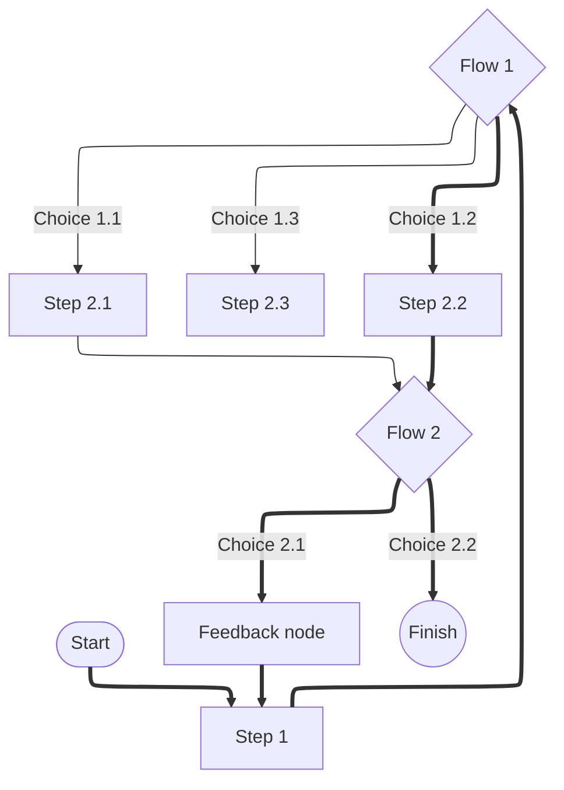

# flowchart-elk

## Example 1

**SebastianJS (SVG):**

<svg id="graph" xmlns="http://www.w3.org/2000/svg" xmlns:xlink="http://www.w3.org/1999/xlink" class="flowchart" style="max-width: 28186px;" viewBox="-46 -4 415 545" role="graphics-document document" aria-roledescription="flowchart-elk"><g><marker id="graph_flowchart-elk-pointEnd" class="marker flowchart-elk" viewBox="0 0 10 10" refX="5" refY="5" markerUnits="userSpaceOnUse" markerWidth="8" markerHeight="8" orient="auto"><path d="M 0 0 L 10 5 L 0 10 z" class="arrowMarkerPath" style="stroke-width: 1; stroke-dasharray: 1,0;"/></marker><marker id="graph_flowchart-elk-pointStart" class="marker flowchart-elk" viewBox="0 0 10 10" refX="4.5" refY="5" markerUnits="userSpaceOnUse" markerWidth="8" markerHeight="8" orient="auto"><path d="M 0 5 L 10 10 L 10 0 z" class="arrowMarkerPath" style="stroke-width: 1; stroke-dasharray: 1,0;"/></marker><marker id="graph_flowchart-elk-circleEnd" class="marker flowchart-elk" viewBox="0 0 10 10" refX="11" refY="5" markerUnits="userSpaceOnUse" markerWidth="11" markerHeight="11" orient="auto"><circle cx="5" cy="5" r="5" class="arrowMarkerPath" style="stroke-width: 1; stroke-dasharray: 1,0;"/></marker><marker id="graph_flowchart-elk-circleStart" class="marker flowchart-elk" viewBox="0 0 10 10" refX="-1" refY="5" markerUnits="userSpaceOnUse" markerWidth="11" markerHeight="11" orient="auto"><circle cx="5" cy="5" r="5" class="arrowMarkerPath" style="stroke-width: 1; stroke-dasharray: 1,0;"/></marker><marker id="graph_flowchart-elk-crossEnd" class="marker cross flowchart-elk" viewBox="0 0 11 11" refX="12" refY="5.2" markerUnits="userSpaceOnUse" markerWidth="11" markerHeight="11" orient="auto"><path d="M 1,1 l 9,9 M 10,1 l -9,9" class="arrowMarkerPath" style="stroke-width: 2; stroke-dasharray: 1,0;"/></marker><marker id="graph_flowchart-elk-crossStart" class="marker cross flowchart-elk" viewBox="0 0 11 11" refX="-1" refY="5.2" markerUnits="userSpaceOnUse" markerWidth="11" markerHeight="11" orient="auto"><path d="M 1,1 l 9,9 M 10,1 l -9,9" class="arrowMarkerPath" style="stroke-width: 2; stroke-dasharray: 1,0;"/></marker><g class="root"><g class="clusters"/><g class="edgePaths"><path d="M101,41.046L100.917,45.705C100.833,50.364,100.667,59.682,100.583,69.841C100.5,80,100.5,91,100.5,96.5L100.5,102" id="L_A_B_0" class=" edge-thickness-thick edge-pattern-solid edge-thickness-normal edge-pattern-solid flowchart-link" style="" marker-end="url(#graph_flowchart-elk-pointEnd)"/><path d="M105.5,120.8L119.25,128.5C133,136.2,160.5,151.6,174.25,166.8C188,182,188,197,188,204.5L188,212" id="L_B_C_0" class=" edge-thickness-thick edge-pattern-solid edge-thickness-normal edge-pattern-solid flowchart-link" style="" marker-end="url(#graph_flowchart-elk-pointEnd)"/><path d="M292.965,263.035L293.805,263.362C294.644,263.69,296.322,264.345,297.161,270.172C298,276,298,287,298,292.5L298,298" id="L_C_D_0" class=" edge-thickness-normal edge-pattern-solid edge-thickness-normal edge-pattern-solid flowchart-link" style="" marker-end="url(#graph_flowchart-elk-pointEnd)"/><path d="M188,216L169.667,224.167C151.333,232.333,114.667,248.667,96.333,262.333C78,276,78,287,78,292.5L78,298" id="L_C_I_0" class=" edge-thickness-normal edge-pattern-solid edge-thickness-normal edge-pattern-solid flowchart-link" style="" marker-end="url(#graph_flowchart-elk-pointEnd)"/><path d="M188.5,265.5L188.417,265.417C188.333,265.333,188.167,265.167,188.083,270.583C188,276,188,287,188,292.5L188,298" id="L_C_E_0" class=" edge-thickness-thick edge-pattern-solid edge-thickness-normal edge-pattern-solid flowchart-link" style="" marker-end="url(#graph_flowchart-elk-pointEnd)"/><path d="M298,326L298,332.167C298,338.333,298,350.667,289.331,364.557C280.662,378.446,263.324,393.893,254.656,401.616L245.987,409.339" id="L_D_F_0" class=" edge-thickness-normal edge-pattern-solid edge-thickness-normal edge-pattern-solid flowchart-link" style="" marker-end="url(#graph_flowchart-elk-pointEnd)"/><path d="M188,326L188,332.167C188,338.333,188,350.667,196.669,364.557C205.338,378.446,222.676,393.893,231.344,401.616L240.013,409.339" id="L_E_F_0" class=" edge-thickness-thick edge-pattern-solid edge-thickness-normal edge-pattern-solid flowchart-link" style="" marker-end="url(#graph_flowchart-elk-pointEnd)"/><path d="M243,412L224.667,420.167C206.333,428.333,169.667,444.667,138.165,460.208C106.663,475.749,80.327,490.497,67.158,497.871L53.99,505.246" id="L_F_H_0" class=" edge-thickness-thick edge-pattern-solid edge-thickness-normal edge-pattern-solid flowchart-link" style="" marker-end="url(#graph_flowchart-elk-pointEnd)"/><path d="M40.5,502.462L35.917,495.551C31.333,488.641,22.167,474.821,17.583,459.744C13,444.667,13,428.333,13,412C13,395.667,13,379.333,13,363C13,346.667,13,330.333,13,314C13,297.667,13,281.333,13,265C13,248.667,13,232.333,13,216C13,199.667,13,183.333,26.168,167.792C39.337,152.251,65.673,137.503,78.842,130.129L92.01,122.754" id="L_H_B_0" class=" edge-thickness-thick edge-pattern-solid edge-thickness-normal edge-pattern-solid flowchart-link" style="" marker-end="url(#graph_flowchart-elk-pointEnd)"/><path d="M264.125,430.875L269.771,435.896C275.417,440.917,286.708,450.958,292.354,457.396C298,463.833,298,466.667,298,468.083L298,469.5" id="L_F_G_0" class=" edge-thickness-thick edge-pattern-solid edge-thickness-normal edge-pattern-solid flowchart-link" style="" marker-end="url(#graph_flowchart-elk-pointEnd)"/></g><g class="edgeLabels"><g><rect class="background" style="stroke: none"/></g><g><rect class="background" style="stroke: none"/></g><g><rect class="background" style="stroke: none"/></g><g><rect class="background" style="stroke: none"/></g><g><rect class="background" style="stroke: none"/></g><g class="edgeLabel"><g class="label" transform="translate(-5, -12)"><text y="-10.1"><tspan class="text-outer-tspan" x="0" y="-0.1em" dy="1.1em"/></text></g></g><g class="edgeLabel"><g class="label" transform="translate(-5, -12)"><text y="-10.1"><tspan class="text-outer-tspan" x="0" y="-0.1em" dy="1.1em"/></text></g></g><g class="edgeLabel" transform="translate(298, 265)"><g class="label" transform="translate(-45, -12)"><g><rect class="background" style="" x="-2" y="-2" width="94" height="28"/><text y="-10.1" style=""><tspan class="text-outer-tspan" x="0" y="-0.1em" dy="1.1em"><tspan font-style="normal" class="text-inner-tspan" font-weight="normal">Choice</tspan><tspan font-style="normal" class="text-inner-tspan" font-weight="normal"> 1.1</tspan></tspan></text></g></g></g><g class="edgeLabel" transform="translate(78, 265)"><g class="label" transform="translate(-45, -12)"><g><rect class="background" style="" x="-2" y="-2" width="94" height="28"/><text y="-10.1" style=""><tspan class="text-outer-tspan" x="0" y="-0.1em" dy="1.1em"><tspan font-style="normal" class="text-inner-tspan" font-weight="normal">Choice</tspan><tspan font-style="normal" class="text-inner-tspan" font-weight="normal"> 1.3</tspan></tspan></text></g></g></g><g class="edgeLabel" transform="translate(188, 265)"><g class="label" transform="translate(-45, -12)"><g><rect class="background" style="" x="-2" y="-2" width="94" height="28"/><text y="-10.1" style=""><tspan class="text-outer-tspan" x="0" y="-0.1em" dy="1.1em"><tspan font-style="normal" class="text-inner-tspan" font-weight="normal">Choice</tspan><tspan font-style="normal" class="text-inner-tspan" font-weight="normal"> 1.2</tspan></tspan></text></g></g></g><g class="edgeLabel"><g class="label" transform="translate(-5, -12)"><text y="-10.1"><tspan class="text-outer-tspan" x="0" y="-0.1em" dy="1.1em"/></text></g></g><g class="edgeLabel"><g class="label" transform="translate(-5, -12)"><text y="-10.1"><tspan class="text-outer-tspan" x="0" y="-0.1em" dy="1.1em"/></text></g></g><g class="edgeLabel" transform="translate(144.81338, 455.73768)"><g class="label" transform="translate(-45, -12)"><g><rect class="background" style="" x="-2" y="-2" width="94" height="28"/><text y="-10.1" style=""><tspan class="text-outer-tspan" x="0" y="-0.1em" dy="1.1em"><tspan font-style="normal" class="text-inner-tspan" font-weight="normal">Choice</tspan><tspan font-style="normal" class="text-inner-tspan" font-weight="normal"> 2.1</tspan></tspan></text></g></g></g><g class="edgeLabel"><g class="label" transform="translate(-5, -12)"><text y="-10.1"><tspan class="text-outer-tspan" x="0" y="-0.1em" dy="1.1em"/></text></g></g><g class="edgeLabel" transform="translate(298, 461)"><g class="label" transform="translate(-45, -12)"><g><rect class="background" style="" x="-2" y="-2" width="94" height="28"/><text y="-10.1" style=""><tspan class="text-outer-tspan" x="0" y="-0.1em" dy="1.1em"><tspan font-style="normal" class="text-inner-tspan" font-weight="normal">Choice</tspan><tspan font-style="normal" class="text-inner-tspan" font-weight="normal"> 2.2</tspan></tspan></text></g></g></g></g><g class="nodes"><g class="node default  " id="flowchart-A-0" transform="translate(100.5, 20)"><g class="basic label-container outer-path"><path d="M-17.875 -19.5 C-4.809757692532241 -19.5, 8.255484614935519 -19.5, 17.875 -19.5 C17.875 -19.5, 17.875 -19.5, 17.875 -19.5 C18.33308730344323 -19.48531003179142, 18.791174606886457 -19.470620063582842, 19.1243692896239 -19.45993515863156 C19.617263472346327 -19.412386249616308, 20.110157655068754 -19.36483734060106, 20.368604652847864 -19.3399052695533 C20.761110982080858 -19.276447890174953, 21.153617311313848 -19.212990510796608, 21.60259325967676 -19.140403561325773 C21.85688480245162 -19.08236317609481, 22.111176345226482 -19.02432279086384, 22.82126438623539 -18.862249829261074 C23.06625026085407 -18.789539307631347, 23.311236135472743 -18.716828786001624, 24.019610251460602 -18.50658706670804 C24.402755180201314 -18.36558619117856, 24.78590010894203 -18.224585315649083, 25.192706595147794 -18.074876768247425 C25.620820821255126 -17.88536329990701, 26.04893504736246 -17.695849831566594, 26.33573291279238 -17.568892924097174 C26.67234346626547 -17.393283413959615, 27.008954019738557 -17.217673903822053, 27.443992264076783 -16.990714730406097 C27.84164348463971 -16.749656223642887, 28.239294705202642 -16.50859771687968, 28.512930573605697 -16.342718045390892 C28.845284351848402 -16.11088243705196, 29.177638130091108 -15.879046828713026, 29.538155344578712 -15.627565626425154 C29.851147296064415 -15.377962874180932, 30.16413924755012 -15.12836012193671, 30.51545370850187 -14.848196188198123 C30.87167973459637 -14.524681136523265, 31.227905760690867 -14.201166084848406, 31.440809736767985 -14.007812326905688 C31.702987369646845 -13.73709239577429, 31.96516500252571 -13.466372464642893, 32.31042094296865 -13.10986736009568 C32.529592873078855 -12.852415539752116, 32.748764803189054 -12.59496371940855, 33.120713908126575 -12.158051136245305 C33.39863064153033 -11.78566803221954, 33.67654737493409 -11.413284928193775, 33.868358964640635 -11.156274872382312 C34.053461643314634 -10.871907450910184, 34.23856432198863 -10.587540029438056, 34.55028387860425 -10.108655082055241 C34.776695700788885 -9.706637965083344, 35.003107522973515 -9.304620848111446, 35.163686474273504 -9.019496659696287 C35.308029992211196 -8.71976425624214, 35.452373510148895 -8.420031852787993, 35.70604614880834 -7.893275190886684 C35.8749129844093 -7.476170842134148, 36.043779820010265 -7.0590664933816125, 36.175134229970325 -6.734618561215508 C36.26229788253381 -6.472095527336349, 36.3494615350973 -6.20957249345719, 36.56902313421488 -5.548287939305138 C36.64864945027516 -5.24463828590361, 36.72827576633544 -4.940988632502083, 36.88609428754556 -4.339158212148133 C36.965851659960315 -3.9296209615249986, 37.04560903237507 -3.520083710901864, 37.125044776581774 -3.1121979531509023 C37.1701586239121 -2.762303861993667, 37.215272471242436 -2.4124097708364314, 37.28489270250937 -1.872449005199798 C37.30808722510281 -1.511175593525262, 37.33128174769625 -1.149902181850726, 37.36498121591342 -0.6250057626472757 C37.36498121591342 -0.262436801386151, 37.36498121591342 0.1001321598749737, 37.36498121591342 0.625005762647271 C37.338527245171285 1.0370477102167854, 37.31207327442916 1.4490896577863, 37.28489270250937 1.8724490051997846 C37.22272054412064 2.354643988381391, 37.16054838573192 2.836838971562998, 37.125044776581774 3.1121979531508885 C37.071144219886314 3.3889659198954023, 37.01724366319085 3.6657338866399165, 36.88609428754556 4.339158212148129 C36.78681343574684 4.717759128649991, 36.687532583948126 5.0963600451518545, 36.56902313421489 5.548287939305125 C36.418211200900316 6.002509453830178, 36.26739926758575 6.456730968355229, 36.175134229970325 6.734618561215495 C36.07368024715679 6.985211860244247, 35.972226264343256 7.235805159272999, 35.70604614880834 7.893275190886679 C35.495793298138956 8.32986973399199, 35.28554044746957 8.766464277097299, 35.163686474273504 9.019496659696284 C34.97573729189579 9.353219464926374, 34.78778810951808 9.686942270156463, 34.55028387860425 10.108655082055236 C34.40490099894723 10.332002225977831, 34.259518119290206 10.555349369900425, 33.86835896464064 11.156274872382301 C33.71085483847354 11.36731605252514, 33.55335071230644 11.57835723266798, 33.12071390812658 12.158051136245302 C32.85363518638165 12.471777000016683, 32.58655646463672 12.785502863788064, 32.31042094296866 13.10986736009567 C31.976123989909556 13.455056410419473, 31.64182703685045 13.800245460743277, 31.44080973676799 14.007812326905684 C31.10143405159593 14.316024344790375, 30.762058366423872 14.624236362675065, 30.515453708501887 14.848196188198111 C30.12985725334419 15.155699100033761, 29.744260798186495 15.463202011869411, 29.538155344578715 15.627565626425152 C29.188982465609538 15.871133511343738, 28.839809586640364 16.114701396262323, 28.512930573605708 16.34271804539089 C28.108995548134487 16.587585831617236, 27.70506052266327 16.832453617843587, 27.443992264076787 16.990714730406093 C27.101482813049504 17.169401691619253, 26.75897336202222 17.348088652832413, 26.335732912792388 17.56889292409717 C25.965763725041178 17.732667308768608, 25.595794537289972 17.89644169344005, 25.192706595147804 18.07487676824742 C24.746756373036074 18.2389905723032, 24.30080615092434 18.403104376358982, 24.019610251460616 18.506587066708033 C23.76299254418672 18.582749855213095, 23.506374836912823 18.658912643718153, 22.821264386235413 18.86224982926107 C22.378772958596752 18.963245610093175, 21.93628153095809 19.06424139092528, 21.602593259676766 19.140403561325773 C21.249968177349373 19.19741324998811, 20.897343095021984 19.254422938650446, 20.36860465284788 19.3399052695533 C20.06841450400754 19.36886425218045, 19.7682243551672 19.397823234807603, 19.1243692896239 19.45993515863156 C18.755824430054634 19.471753674948893, 18.38727957048537 19.48357219126623, 17.875000000000004 19.5 C17.875000000000004 19.5, 17.875 19.5, 17.875 19.5 C6.332893193379096 19.5, -5.209213613241808 19.5, -17.874999999999996 19.5 C-18.227191194243634 19.488705913899178, -18.57938238848727 19.47741182779836, -19.124369289623893 19.45993515863156 C-19.517968773736314 19.42196508977187, -19.91156825784874 19.38399502091218, -20.36860465284787 19.3399052695533 C-20.714609069998843 19.283965958692658, -21.060613487149816 19.22802664783202, -21.60259325967676 19.140403561325773 C-21.972372433160142 19.056003878012806, -22.342151606643526 18.971604194699843, -22.821264386235388 18.862249829261074 C-23.17207506423453 18.758131061473755, -23.522885742233676 18.654012293686435, -24.01961025146059 18.506587066708043 C-24.338024046818013 18.389407846631652, -24.65643784217544 18.272228626555265, -25.192706595147797 18.074876768247425 C-25.490364933801946 17.94311225144613, -25.78802327245609 17.811347734644833, -26.33573291279238 17.568892924097174 C-26.60272894122581 17.429601267082575, -26.869724969659238 17.290309610067972, -27.443992264076783 16.990714730406097 C-27.86224341743307 16.737168423324913, -28.280494570789354 16.48362211624373, -28.512930573605686 16.3427180453909 C-28.754975619439378 16.173877899378475, -28.99702066527307 16.005037753366054, -29.538155344578712 15.627565626425156 C-29.89665103414851 15.341674853964197, -30.255146723718305 15.055784081503235, -30.51545370850187 14.848196188198125 C-30.75941185655148 14.626639852918354, -31.00337000460109 14.405083517638582, -31.440809736767974 14.007812326905695 C-31.633285344610194 13.809065459267314, -31.825760952452413 13.610318591628936, -32.310420942968655 13.109867360095677 C-32.56305255978394 12.81311188783821, -32.815684176599234 12.516356415580741, -33.120713908126575 12.158051136245307 C-33.297848968341576 11.920706292893165, -33.474984028556584 11.683361449541025, -33.868358964640635 11.156274872382316 C-34.12534630222761 10.761473311086158, -34.3823336398146 10.366671749790001, -34.55028387860425 10.108655082055252 C-34.74101144969212 9.769998966327908, -34.931739020779986 9.431342850600565, -35.163686474273504 9.019496659696289 C-35.33050144685298 8.673101799866384, -35.49731641943245 8.326706940036479, -35.70604614880834 7.893275190886686 C-35.86517942590858 7.500212919816483, -36.02431270300882 7.10715064874628, -36.175134229970325 6.73461856121551 C-36.26163988265277 6.47407731813999, -36.34814553533522 6.2135360750644715, -36.56902313421488 5.5482879393051325 C-36.68206270513627 5.117219063721933, -36.79510227605766 4.6861501881387335, -36.88609428754556 4.339158212148136 C-36.94858485192769 4.018282371431339, -37.01107541630983 3.697406530714542, -37.125044776581774 3.112197953150904 C-37.17766060278452 2.704119995292505, -37.23027642898727 2.296042037434106, -37.28489270250937 1.872449005199809 C-37.31441658997321 1.4125906266973738, -37.34394047743706 0.9527322481949384, -37.36498121591342 0.6250057626472781 C-37.36498121591342 0.33807870285355246, -37.36498121591342 0.05115164305982678, -37.36498121591342 -0.6250057626472687 C-37.34778541422142 -0.8928442542014494, -37.330589612529415 -1.1606827457556301, -37.28489270250937 -1.8724490051997822 C-37.24519835781506 -2.1803105041138506, -37.20550401312076 -2.4881720030279193, -37.125044776581774 -3.112197953150895 C-37.03370439770292 -3.5812114938979156, -36.94236401882406 -4.050225034644936, -36.88609428754556 -4.339158212148126 C-36.79777126924165 -4.6759721603792075, -36.70944825093775 -5.012786108610289, -36.56902313421489 -5.548287939305123 C-36.47038727701434 -5.8453634257035345, -36.37175141981379 -6.142438912101946, -36.17513422997033 -6.734618561215485 C-36.0109712946166 -7.140104185413643, -35.846808359262866 -7.5455898096117995, -35.70604614880834 -7.893275190886678 C-35.56819885082149 -8.179518054616059, -35.43035155283464 -8.465760918345442, -35.163686474273504 -9.019496659696282 C-35.032969739653 -9.251597458519683, -34.9022530050325 -9.483698257343084, -34.55028387860425 -10.108655082055243 C-34.35420751001618 -10.409881038083713, -34.15813114142812 -10.711106994112182, -33.86835896464064 -11.156274872382308 C-33.57975019217314 -11.542984334688699, -33.29114141970563 -11.92969379699509, -33.12071390812658 -12.158051136245302 C-32.844644914122675 -12.48233748537306, -32.56857592011877 -12.806623834500819, -32.31042094296866 -13.109867360095668 C-31.964757765611154 -13.466792970191943, -31.619094588253645 -13.823718580288215, -31.440809736767996 -14.007812326905677 C-31.24593159254039 -14.184795501300043, -31.051053448312782 -14.36177867569441, -30.515453708501887 -14.848196188198107 C-30.317080103931886 -15.006393858899365, -30.118706499361885 -15.164591529600623, -29.53815534457872 -15.627565626425149 C-29.23075792922942 -15.841992756353182, -28.923360513880116 -16.056419886281216, -28.51293057360571 -16.342718045390885 C-28.253970120932298 -16.499701393622047, -27.99500966825888 -16.656684741853212, -27.44399226407679 -16.99071473040609 C-27.136106325263654 -17.151338627474548, -26.82822038645052 -17.311962524543006, -26.335732912792388 -17.56889292409717 C-26.039116606430856 -17.700196164113315, -25.742500300069324 -17.83149940412946, -25.192706595147804 -18.07487676824742 C-24.779751369992205 -18.22684810842094, -24.366796144836602 -18.378819448594452, -24.01961025146062 -18.506587066708033 C-23.653923627778067 -18.615120937088758, -23.28823700409551 -18.72365480746948, -22.821264386235413 -18.862249829261067 C-22.520393217618107 -18.930921710130107, -22.2195220490008 -18.999593590999144, -21.602593259676766 -19.140403561325773 C-21.27718136602575 -19.193013632684345, -20.951769472374735 -19.245623704042917, -20.368604652847882 -19.3399052695533 C-19.914603332851662 -19.38370223087686, -19.460602012855443 -19.427499192200425, -19.124369289623903 -19.45993515863156 C-18.676914741052407 -19.474284155086803, -18.22946019248091 -19.488633151542047, -17.875000000000007 -19.5 C-17.875000000000004 -19.5, -17.875000000000004 -19.5, -17.875 -19.5" stroke="none" stroke-width="0" fill="#ECECFF" style=""/><path d="M-17.875 -19.5 C-5.62537700998384 -19.5, 6.62424598003232 -19.5, 17.875 -19.5 M-17.875 -19.5 C-7.610295647140838 -19.5, 2.6544087057183248 -19.5, 17.875 -19.5 M17.875 -19.5 C17.875 -19.5, 17.875 -19.5, 17.875 -19.5 M17.875 -19.5 C17.875 -19.5, 17.875 -19.5, 17.875 -19.5 M17.875 -19.5 C18.350488090841544 -19.484752022408134, 18.825976181683085 -19.469504044816272, 19.1243692896239 -19.45993515863156 M17.875 -19.5 C18.331395548780137 -19.485364283070666, 18.787791097560277 -19.470728566141332, 19.1243692896239 -19.45993515863156 M19.1243692896239 -19.45993515863156 C19.414472184184962 -19.43194928129303, 19.704575078746025 -19.4039634039545, 20.368604652847864 -19.3399052695533 M19.1243692896239 -19.45993515863156 C19.45202812996138 -19.428326304371613, 19.77968697029886 -19.396717450111662, 20.368604652847864 -19.3399052695533 M20.368604652847864 -19.3399052695533 C20.63517207403674 -19.296808716156708, 20.901739495225613 -19.253712162760117, 21.60259325967676 -19.140403561325773 M20.368604652847864 -19.3399052695533 C20.78468663659412 -19.272636361185178, 21.200768620340376 -19.20536745281706, 21.60259325967676 -19.140403561325773 M21.60259325967676 -19.140403561325773 C21.96622325105321 -19.057407388701552, 22.329853242429667 -18.97441121607733, 22.82126438623539 -18.862249829261074 M21.60259325967676 -19.140403561325773 C22.049929878399794 -19.038301897246487, 22.497266497122826 -18.9362002331672, 22.82126438623539 -18.862249829261074 M22.82126438623539 -18.862249829261074 C23.287697708227036 -18.723814867652422, 23.754131030218684 -18.585379906043773, 24.019610251460602 -18.50658706670804 M22.82126438623539 -18.862249829261074 C23.148071560785038 -18.765255175300606, 23.47487873533468 -18.668260521340137, 24.019610251460602 -18.50658706670804 M24.019610251460602 -18.50658706670804 C24.365480239504773 -18.379303713920663, 24.71135022754894 -18.252020361133287, 25.192706595147794 -18.074876768247425 M24.019610251460602 -18.50658706670804 C24.34468490111256 -18.386956590679, 24.66975955076452 -18.267326114649958, 25.192706595147794 -18.074876768247425 M25.192706595147794 -18.074876768247425 C25.481220417676237 -17.947160257472547, 25.769734240204677 -17.81944374669767, 26.33573291279238 -17.568892924097174 M25.192706595147794 -18.074876768247425 C25.5926050615546 -17.89785357973566, 25.992503527961407 -17.720830391223895, 26.33573291279238 -17.568892924097174 M26.33573291279238 -17.568892924097174 C26.588161413345546 -17.43720113704676, 26.84058991389871 -17.305509349996345, 27.443992264076783 -16.990714730406097 M26.33573291279238 -17.568892924097174 C26.671977652530924 -17.39347425875061, 27.008222392269467 -17.21805559340405, 27.443992264076783 -16.990714730406097 M27.443992264076783 -16.990714730406097 C27.7388504992914 -16.81196993543967, 28.033708734506018 -16.633225140473243, 28.512930573605697 -16.342718045390892 M27.443992264076783 -16.990714730406097 C27.701275792636952 -16.834747943427082, 27.958559321197125 -16.678781156448064, 28.512930573605697 -16.342718045390892 M28.512930573605697 -16.342718045390892 C28.817139897534606 -16.130514790027473, 29.121349221463518 -15.918311534664051, 29.538155344578712 -15.627565626425154 M28.512930573605697 -16.342718045390892 C28.801211154709645 -16.141625991478, 29.08949173581359 -15.940533937565114, 29.538155344578712 -15.627565626425154 M29.538155344578712 -15.627565626425154 C29.85873921530641 -15.371908520614896, 30.17932308603411 -15.11625141480464, 30.51545370850187 -14.848196188198123 M29.538155344578712 -15.627565626425154 C29.78877900616067 -15.427699925689273, 30.03940266774263 -15.227834224953392, 30.51545370850187 -14.848196188198123 M30.51545370850187 -14.848196188198123 C30.745647036512608 -14.639140698280476, 30.975840364523346 -14.43008520836283, 31.440809736767985 -14.007812326905688 M30.51545370850187 -14.848196188198123 C30.81397156583243 -14.5770901685202, 31.112489423162987 -14.305984148842276, 31.440809736767985 -14.007812326905688 M31.440809736767985 -14.007812326905688 C31.687332363872958 -13.753257474535706, 31.933854990977935 -13.498702622165723, 32.31042094296865 -13.10986736009568 M31.440809736767985 -14.007812326905688 C31.70923355563906 -13.730642695915922, 31.977657374510134 -13.453473064926158, 32.31042094296865 -13.10986736009568 M32.31042094296865 -13.10986736009568 C32.60252156591459 -12.766749347387078, 32.89462218886053 -12.423631334678475, 33.120713908126575 -12.158051136245305 M32.31042094296865 -13.10986736009568 C32.603141141262576 -12.766021558928498, 32.895861339556504 -12.422175757761314, 33.120713908126575 -12.158051136245305 M33.120713908126575 -12.158051136245305 C33.368584003118784 -11.825927790385945, 33.61645409811099 -11.493804444526587, 33.868358964640635 -11.156274872382312 M33.120713908126575 -12.158051136245305 C33.333628779522705 -11.872764605518308, 33.54654365091884 -11.587478074791308, 33.868358964640635 -11.156274872382312 M33.868358964640635 -11.156274872382312 C34.030109485667815 -10.907782635988037, 34.191860006695 -10.65929039959376, 34.55028387860425 -10.108655082055241 M33.868358964640635 -11.156274872382312 C34.08322794763264 -10.826178414105836, 34.29809693062465 -10.49608195582936, 34.55028387860425 -10.108655082055241 M34.55028387860425 -10.108655082055241 C34.766011192701015 -9.72560939111712, 34.981738506797775 -9.342563700179, 35.163686474273504 -9.019496659696287 M34.55028387860425 -10.108655082055241 C34.71292971682318 -9.819860926620496, 34.87557555504212 -9.531066771185749, 35.163686474273504 -9.019496659696287 M35.163686474273504 -9.019496659696287 C35.328581303034184 -8.677089019590598, 35.493476131794864 -8.334681379484909, 35.70604614880834 -7.893275190886684 M35.163686474273504 -9.019496659696287 C35.32033841398707 -8.6942055550665, 35.47699035370064 -8.368914450436712, 35.70604614880834 -7.893275190886684 M35.70604614880834 -7.893275190886684 C35.81555535868362 -7.622785325278205, 35.9250645685589 -7.352295459669724, 36.175134229970325 -6.734618561215508 M35.70604614880834 -7.893275190886684 C35.83402591615551 -7.577162691218706, 35.962005683502674 -7.261050191550726, 36.175134229970325 -6.734618561215508 M36.175134229970325 -6.734618561215508 C36.28588031708121 -6.401068991830281, 36.396626404192084 -6.067519422445055, 36.56902313421488 -5.548287939305138 M36.175134229970325 -6.734618561215508 C36.326529476504184 -6.278640200212278, 36.47792472303805 -5.822661839209048, 36.56902313421488 -5.548287939305138 M36.56902313421488 -5.548287939305138 C36.657433231571815 -5.2111419209045575, 36.74584332892876 -4.873995902503978, 36.88609428754556 -4.339158212148133 M36.56902313421488 -5.548287939305138 C36.63612145363433 -5.292412966763192, 36.703219773053775 -5.036537994221246, 36.88609428754556 -4.339158212148133 M36.88609428754556 -4.339158212148133 C36.947525907307714 -4.023719828246917, 37.00895752706986 -3.708281444345701, 37.125044776581774 -3.1121979531509023 M36.88609428754556 -4.339158212148133 C36.938514917848416 -4.069989354647106, 36.99093554815127 -3.800820497146079, 37.125044776581774 -3.1121979531509023 M37.125044776581774 -3.1121979531509023 C37.186546380656495 -2.635203656812783, 37.248047984731215 -2.1582093604746633, 37.28489270250937 -1.872449005199798 M37.125044776581774 -3.1121979531509023 C37.16536865028131 -2.7994539515868606, 37.20569252398084 -2.486709950022819, 37.28489270250937 -1.872449005199798 M37.28489270250937 -1.872449005199798 C37.30645715525968 -1.5365652471006896, 37.32802160801 -1.2006814890015813, 37.36498121591342 -0.6250057626472757 M37.28489270250937 -1.872449005199798 C37.30342661486892 -1.583768359894964, 37.32196052722848 -1.2950877145901298, 37.36498121591342 -0.6250057626472757 M37.36498121591342 -0.6250057626472757 C37.36498121591342 -0.19153246988637057, 37.36498121591342 0.24194082287453456, 37.36498121591342 0.625005762647271 M37.36498121591342 -0.6250057626472757 C37.36498121591342 -0.18884266123492272, 37.36498121591342 0.24732044017743027, 37.36498121591342 0.625005762647271 M37.36498121591342 0.625005762647271 C37.33538339548335 1.0860157067762486, 37.30578557505328 1.5470256509052263, 37.28489270250937 1.8724490051997846 M37.36498121591342 0.625005762647271 C37.34833402114254 0.8842992585773737, 37.33168682637167 1.1435927545074764, 37.28489270250937 1.8724490051997846 M37.28489270250937 1.8724490051997846 C37.23968867053367 2.223042550657529, 37.19448463855797 2.573636096115273, 37.125044776581774 3.1121979531508885 M37.28489270250937 1.8724490051997846 C37.230042892799986 2.2978532979857293, 37.1751930830906 2.7232575907716745, 37.125044776581774 3.1121979531508885 M37.125044776581774 3.1121979531508885 C37.06746744006735 3.407845407178107, 37.00989010355291 3.7034928612053255, 36.88609428754556 4.339158212148129 M37.125044776581774 3.1121979531508885 C37.039694828842784 3.5504518960727673, 36.95434488110379 3.988705838994646, 36.88609428754556 4.339158212148129 M36.88609428754556 4.339158212148129 C36.78354865788553 4.730209141598855, 36.681003028225504 5.12126007104958, 36.56902313421489 5.548287939305125 M36.88609428754556 4.339158212148129 C36.81867151775453 4.596270454574608, 36.751248747963494 4.853382697001088, 36.56902313421489 5.548287939305125 M36.56902313421489 5.548287939305125 C36.42707255011389 5.9758204818631615, 36.285121966012895 6.4033530244211985, 36.175134229970325 6.734618561215495 M36.56902313421489 5.548287939305125 C36.46184692784619 5.871085596678157, 36.35467072147748 6.193883254051189, 36.175134229970325 6.734618561215495 M36.175134229970325 6.734618561215495 C36.02493329480994 7.105617774999179, 35.87473235964955 7.476616988782863, 35.70604614880834 7.893275190886679 M36.175134229970325 6.734618561215495 C36.00368942346361 7.1580905479469115, 35.832244616956906 7.581562534678328, 35.70604614880834 7.893275190886679 M35.70604614880834 7.893275190886679 C35.52886772472179 8.261189979513372, 35.351689300635236 8.629104768140063, 35.163686474273504 9.019496659696284 M35.70604614880834 7.893275190886679 C35.49997108672762 8.321194466597273, 35.2938960246469 8.749113742307868, 35.163686474273504 9.019496659696284 M35.163686474273504 9.019496659696284 C34.97795000955447 9.349290560661439, 34.79221354483543 9.679084461626596, 34.55028387860425 10.108655082055236 M35.163686474273504 9.019496659696284 C35.02524996651669 9.265304697434996, 34.88681345875988 9.511112735173706, 34.55028387860425 10.108655082055236 M34.55028387860425 10.108655082055236 C34.321158314551745 10.460653477268673, 34.09203275049925 10.81265187248211, 33.86835896464064 11.156274872382301 M34.55028387860425 10.108655082055236 C34.36389558808693 10.394997548553812, 34.17750729756962 10.68134001505239, 33.86835896464064 11.156274872382301 M33.86835896464064 11.156274872382301 C33.68922302127477 11.396300716872398, 33.510087077908906 11.636326561362495, 33.12071390812658 12.158051136245302 M33.86835896464064 11.156274872382301 C33.70339563204712 11.377310709588862, 33.53843229945359 11.59834654679542, 33.12071390812658 12.158051136245302 M33.12071390812658 12.158051136245302 C32.806547755908916 12.52708857520066, 32.49238160369124 12.89612601415602, 32.31042094296866 13.10986736009567 M33.12071390812658 12.158051136245302 C32.888427402031105 12.430908083781677, 32.656140895935636 12.703765031318053, 32.31042094296866 13.10986736009567 M32.31042094296866 13.10986736009567 C32.123700568685905 13.302671476570447, 31.93698019440314 13.495475593045226, 31.44080973676799 14.007812326905684 M32.31042094296866 13.10986736009567 C32.02618519505619 13.403364106004192, 31.741949447143725 13.696860851912712, 31.44080973676799 14.007812326905684 M31.44080973676799 14.007812326905684 C31.200868160256466 14.225720918187223, 30.960926583744943 14.44362950946876, 30.515453708501887 14.848196188198111 M31.44080973676799 14.007812326905684 C31.19572417680245 14.230392547857816, 30.950638616836912 14.452972768809948, 30.515453708501887 14.848196188198111 M30.515453708501887 14.848196188198111 C30.19809292277325 15.10128296949151, 29.880732137044614 15.354369750784908, 29.538155344578715 15.627565626425152 M30.515453708501887 14.848196188198111 C30.20414467143831 15.096456860974918, 29.892835634374737 15.344717533751727, 29.538155344578715 15.627565626425152 M29.538155344578715 15.627565626425152 C29.27733132486755 15.809505171685826, 29.016507305156384 15.991444716946498, 28.512930573605708 16.34271804539089 M29.538155344578715 15.627565626425152 C29.235948874194637 15.838371777857832, 28.93374240381056 16.04917792929051, 28.512930573605708 16.34271804539089 M28.512930573605708 16.34271804539089 C28.218024779264685 16.52149167097923, 27.92311898492366 16.700265296567572, 27.443992264076787 16.990714730406093 M28.512930573605708 16.34271804539089 C28.148913507203247 16.563387330245792, 27.784896440800782 16.784056615100692, 27.443992264076787 16.990714730406093 M27.443992264076787 16.990714730406093 C27.080961821473615 17.180107479780073, 26.71793137887044 17.369500229154053, 26.335732912792388 17.56889292409717 M27.443992264076787 16.990714730406093 C27.212908939630616 17.11127075275373, 26.981825615184444 17.23182677510136, 26.335732912792388 17.56889292409717 M26.335732912792388 17.56889292409717 C25.934894381288945 17.746332251541176, 25.534055849785506 17.92377157898518, 25.192706595147804 18.07487676824742 M26.335732912792388 17.56889292409717 C26.022241565015275 17.707666244367672, 25.708750217238162 17.846439564638178, 25.192706595147804 18.07487676824742 M25.192706595147804 18.07487676824742 C24.923332198456855 18.174009036299317, 24.653957801765905 18.27314130435121, 24.019610251460616 18.506587066708033 M25.192706595147804 18.07487676824742 C24.87241292624189 18.192747799167016, 24.552119257335974 18.31061883008661, 24.019610251460616 18.506587066708033 M24.019610251460616 18.506587066708033 C23.554636083389177 18.644588959092424, 23.089661915317738 18.782590851476815, 22.821264386235413 18.86224982926107 M24.019610251460616 18.506587066708033 C23.62067530881595 18.624988863632726, 23.221740366171282 18.74339066055742, 22.821264386235413 18.86224982926107 M22.821264386235413 18.86224982926107 C22.3582933318966 18.96791995124543, 21.89532227755779 19.07359007322979, 21.602593259676766 19.140403561325773 M22.821264386235413 18.86224982926107 C22.489025805034082 18.938081117360916, 22.156787223832755 19.01391240546076, 21.602593259676766 19.140403561325773 M21.602593259676766 19.140403561325773 C21.31367588171798 19.18711348240642, 21.024758503759198 19.23382340348707, 20.36860465284788 19.3399052695533 M21.602593259676766 19.140403561325773 C21.266526726103592 19.19473619223899, 20.93046019253042 19.24906882315221, 20.36860465284788 19.3399052695533 M20.36860465284788 19.3399052695533 C19.975659289467924 19.377812236172623, 19.582713926087965 19.415719202791944, 19.1243692896239 19.45993515863156 M20.36860465284788 19.3399052695533 C19.906374937651382 19.38449601426574, 19.44414522245489 19.42908675897818, 19.1243692896239 19.45993515863156 M19.1243692896239 19.45993515863156 C18.776615000354806 19.47108696182576, 18.428860711085708 19.482238765019957, 17.875000000000004 19.5 M19.1243692896239 19.45993515863156 C18.728522648568408 19.472629189941465, 18.332676007512916 19.485323221251367, 17.875000000000004 19.5 M17.875000000000004 19.5 C17.875000000000004 19.5, 17.875000000000004 19.5, 17.875 19.5 M17.875000000000004 19.5 C17.875000000000004 19.5, 17.875000000000004 19.5, 17.875 19.5 M17.875 19.5 C6.159209892384547 19.5, -5.556580215230905 19.5, -17.874999999999996 19.5 M17.875 19.5 C10.317228864109747 19.5, 2.7594577282194965 19.5, -17.874999999999996 19.5 M-17.874999999999996 19.5 C-18.296547361701098 19.48648179660241, -18.7180947234022 19.472963593204817, -19.124369289623893 19.45993515863156 M-17.874999999999996 19.5 C-18.160655274372097 19.49083959134515, -18.446310548744194 19.481679182690296, -19.124369289623893 19.45993515863156 M-19.124369289623893 19.45993515863156 C-19.51089861943375 19.422647139054334, -19.897427949243603 19.38535911947711, -20.36860465284787 19.3399052695533 M-19.124369289623893 19.45993515863156 C-19.512188055242355 19.42252274873265, -19.900006820860817 19.385110338833744, -20.36860465284787 19.3399052695533 M-20.36860465284787 19.3399052695533 C-20.696945198962133 19.286821716376508, -21.025285745076395 19.233738163199718, -21.60259325967676 19.140403561325773 M-20.36860465284787 19.3399052695533 C-20.786372327341734 19.272363831777835, -21.204140001835594 19.204822394002367, -21.60259325967676 19.140403561325773 M-21.60259325967676 19.140403561325773 C-21.998401512921983 19.050062910412787, -22.39420976616721 18.9597222594998, -22.821264386235388 18.862249829261074 M-21.60259325967676 19.140403561325773 C-21.975866787902845 19.055206314345583, -22.34914031612893 18.97000906736539, -22.821264386235388 18.862249829261074 M-22.821264386235388 18.862249829261074 C-23.082906347027418 18.78459586868468, -23.34454830781945 18.70694190810828, -24.01961025146059 18.506587066708043 M-22.821264386235388 18.862249829261074 C-23.175924775621876 18.756988487341538, -23.530585165008368 18.651727145422, -24.01961025146059 18.506587066708043 M-24.01961025146059 18.506587066708043 C-24.255429422247513 18.41980343196994, -24.491248593034438 18.33301979723183, -25.192706595147797 18.074876768247425 M-24.01961025146059 18.506587066708043 C-24.403360941826655 18.365363265300836, -24.787111632192715 18.224139463893632, -25.192706595147797 18.074876768247425 M-25.192706595147797 18.074876768247425 C-25.483246620589046 17.94626331754822, -25.7737866460303 17.817649866849013, -26.33573291279238 17.568892924097174 M-25.192706595147797 18.074876768247425 C-25.557331555102785 17.913468114690488, -25.921956515057772 17.752059461133552, -26.33573291279238 17.568892924097174 M-26.33573291279238 17.568892924097174 C-26.686144461720804 17.386083443470525, -27.036556010649228 17.203273962843877, -27.443992264076783 16.990714730406097 M-26.33573291279238 17.568892924097174 C-26.737675795544266 17.359199579622217, -27.139618678296156 17.149506235147264, -27.443992264076783 16.990714730406097 M-27.443992264076783 16.990714730406097 C-27.830600102611406 16.756350786726564, -28.21720794114603 16.52198684304703, -28.512930573605686 16.3427180453909 M-27.443992264076783 16.990714730406097 C-27.70378056099995 16.83322953812578, -27.963568857923114 16.675744345845466, -28.512930573605686 16.3427180453909 M-28.512930573605686 16.3427180453909 C-28.7907902497369 16.14889516367328, -29.06864992586812 15.955072281955664, -29.538155344578712 15.627565626425156 M-28.512930573605686 16.3427180453909 C-28.728488503165526 16.19235416508233, -28.944046432725365 16.041990284773767, -29.538155344578712 15.627565626425156 M-29.538155344578712 15.627565626425156 C-29.82729756665025 15.396982398720779, -30.116439788721788 15.1663991710164, -30.51545370850187 14.848196188198125 M-29.538155344578712 15.627565626425156 C-29.84863878091349 15.379963348259405, -30.159122217248267 15.132361070093657, -30.51545370850187 14.848196188198125 M-30.51545370850187 14.848196188198125 C-30.75642437958388 14.629353000456021, -30.997395050665887 14.410509812713917, -31.440809736767974 14.007812326905695 M-30.51545370850187 14.848196188198125 C-30.84595169674489 14.548046659773398, -31.17644968498791 14.247897131348669, -31.440809736767974 14.007812326905695 M-31.440809736767974 14.007812326905695 C-31.66728101340997 13.77396214013523, -31.893752290051964 13.540111953364766, -32.310420942968655 13.109867360095677 M-31.440809736767974 14.007812326905695 C-31.76188648892181 13.676274219415264, -32.082963241075646 13.344736111924831, -32.310420942968655 13.109867360095677 M-32.310420942968655 13.109867360095677 C-32.509437786770896 12.876090850986342, -32.708454630573144 12.642314341877006, -33.120713908126575 12.158051136245307 M-32.310420942968655 13.109867360095677 C-32.49782337412809 12.889733800955385, -32.68522580528752 12.669600241815095, -33.120713908126575 12.158051136245307 M-33.120713908126575 12.158051136245307 C-33.40725537128324 11.774111680079686, -33.693796834439915 11.390172223914066, -33.868358964640635 11.156274872382316 M-33.120713908126575 12.158051136245307 C-33.31631462360293 11.895963997098765, -33.51191533907927 11.63387685795222, -33.868358964640635 11.156274872382316 M-33.868358964640635 11.156274872382316 C-34.12760435841513 10.758004330409157, -34.38684975218961 10.359733788435998, -34.55028387860425 10.108655082055252 M-33.868358964640635 11.156274872382316 C-34.07723440391961 10.835386106740899, -34.28610984319858 10.514497341099483, -34.55028387860425 10.108655082055252 M-34.55028387860425 10.108655082055252 C-34.703802729851 9.836066816197269, -34.85732158109774 9.563478550339285, -35.163686474273504 9.019496659696289 M-34.55028387860425 10.108655082055252 C-34.69423506240902 9.853055178571875, -34.8381862462138 9.5974552750885, -35.163686474273504 9.019496659696289 M-35.163686474273504 9.019496659696289 C-35.37489514763634 8.580917330316703, -35.58610382099917 8.142338000937116, -35.70604614880834 7.893275190886686 M-35.163686474273504 9.019496659696289 C-35.298957466379925 8.738603550251735, -35.434228458486345 8.457710440807181, -35.70604614880834 7.893275190886686 M-35.70604614880834 7.893275190886686 C-35.871677743517694 7.484161949685542, -36.037309338227054 7.075048708484398, -36.175134229970325 6.73461856121551 M-35.70604614880834 7.893275190886686 C-35.87989136276469 7.4638741513459514, -36.053736576721036 7.034473111805217, -36.175134229970325 6.73461856121551 M-36.175134229970325 6.73461856121551 C-36.30684864647391 6.337915724549056, -36.43856306297749 5.941212887882602, -36.56902313421488 5.5482879393051325 M-36.175134229970325 6.73461856121551 C-36.331768549683396 6.262860946529456, -36.48840286939647 5.791103331843401, -36.56902313421488 5.5482879393051325 M-36.56902313421488 5.5482879393051325 C-36.67863402613246 5.130294102762347, -36.78824491805004 4.712300266219561, -36.88609428754556 4.339158212148136 M-36.56902313421488 5.5482879393051325 C-36.68873365622332 5.091779836018532, -36.80844417823175 4.63527173273193, -36.88609428754556 4.339158212148136 M-36.88609428754556 4.339158212148136 C-36.965167417243414 3.933134403261526, -37.04424054694127 3.5271105943749164, -37.125044776581774 3.112197953150904 M-36.88609428754556 4.339158212148136 C-36.97218231709409 3.8971143751279462, -37.05827034664261 3.4550705381077567, -37.125044776581774 3.112197953150904 M-37.125044776581774 3.112197953150904 C-37.1858264024369 2.640787665708187, -37.24660802829202 2.169377378265469, -37.28489270250937 1.872449005199809 M-37.125044776581774 3.112197953150904 C-37.17574240969056 2.7189971221392373, -37.22644004279933 2.3257962911275705, -37.28489270250937 1.872449005199809 M-37.28489270250937 1.872449005199809 C-37.306893444379824 1.5297696918882544, -37.32889418625028 1.1870903785766997, -37.36498121591342 0.6250057626472781 M-37.28489270250937 1.872449005199809 C-37.30760150967206 1.5187410034216813, -37.33031031683475 1.1650330016435535, -37.36498121591342 0.6250057626472781 M-37.36498121591342 0.6250057626472781 C-37.36498121591342 0.31631905608908084, -37.36498121591342 0.007632349530883542, -37.36498121591342 -0.6250057626472687 M-37.36498121591342 0.6250057626472781 C-37.36498121591342 0.3420201801276848, -37.36498121591342 0.05903459760809149, -37.36498121591342 -0.6250057626472687 M-37.36498121591342 -0.6250057626472687 C-37.335266817233574 -1.0878315071167033, -37.30555241855373 -1.5506572515861377, -37.28489270250937 -1.8724490051997822 M-37.36498121591342 -0.6250057626472687 C-37.33710021411738 -1.0592748707602127, -37.30921921232133 -1.4935439788731566, -37.28489270250937 -1.8724490051997822 M-37.28489270250937 -1.8724490051997822 C-37.24291792345193 -2.1979971027116436, -37.20094314439448 -2.523545200223505, -37.125044776581774 -3.112197953150895 M-37.28489270250937 -1.8724490051997822 C-37.22105294467208 -2.367577560399672, -37.157213186834795 -2.8627061155995612, -37.125044776581774 -3.112197953150895 M-37.125044776581774 -3.112197953150895 C-37.05114925169748 -3.4916358556070164, -36.977253726813196 -3.8710737580631376, -36.88609428754556 -4.339158212148126 M-37.125044776581774 -3.112197953150895 C-37.06101032005906 -3.44100135370785, -36.99697586353635 -3.7698047542648054, -36.88609428754556 -4.339158212148126 M-36.88609428754556 -4.339158212148126 C-36.77948599040882 -4.745701853458759, -36.672877693272085 -5.152245494769393, -36.56902313421489 -5.548287939305123 M-36.88609428754556 -4.339158212148126 C-36.80065771303362 -4.664964899207764, -36.71522113852169 -4.990771586267402, -36.56902313421489 -5.548287939305123 M-36.56902313421489 -5.548287939305123 C-36.48046026746269 -5.8150251833861715, -36.3918974007105 -6.081762427467221, -36.17513422997033 -6.734618561215485 M-36.56902313421489 -5.548287939305123 C-36.466866533743 -5.855967343482532, -36.36470993327112 -6.163646747659941, -36.17513422997033 -6.734618561215485 M-36.17513422997033 -6.734618561215485 C-36.06887585331599 -6.99707880591768, -35.962617476661634 -7.2595390506198765, -35.70604614880834 -7.893275190886678 M-36.17513422997033 -6.734618561215485 C-35.994438221347465 -7.180941196033627, -35.8137422127246 -7.62726383085177, -35.70604614880834 -7.893275190886678 M-35.70604614880834 -7.893275190886678 C-35.505005119711676 -8.31074118939483, -35.303964090615004 -8.728207187902985, -35.163686474273504 -9.019496659696282 M-35.70604614880834 -7.893275190886678 C-35.53647000043694 -8.24540369132821, -35.366893852065544 -8.597532191769742, -35.163686474273504 -9.019496659696282 M-35.163686474273504 -9.019496659696282 C-34.92973105984199 -9.434908188574065, -34.69577564541047 -9.85031971745185, -34.55028387860425 -10.108655082055243 M-35.163686474273504 -9.019496659696282 C-35.03729865852806 -9.243911024706444, -34.91091084278262 -9.468325389716608, -34.55028387860425 -10.108655082055243 M-34.55028387860425 -10.108655082055243 C-34.38461803250141 -10.363162309177728, -34.21895218639856 -10.61766953630021, -33.86835896464064 -11.156274872382308 M-34.55028387860425 -10.108655082055243 C-34.391946228245146 -10.351904232619257, -34.23360857788604 -10.59515338318327, -33.86835896464064 -11.156274872382308 M-33.86835896464064 -11.156274872382308 C-33.681757379470206 -11.406303996756561, -33.49515579429978 -11.656333121130816, -33.12071390812658 -12.158051136245302 M-33.86835896464064 -11.156274872382308 C-33.61805369022926 -11.491661136813951, -33.36774841581788 -11.827047401245595, -33.12071390812658 -12.158051136245302 M-33.12071390812658 -12.158051136245302 C-32.80457290159454 -12.529408351450712, -32.488431895062504 -12.900765566656123, -32.31042094296866 -13.109867360095668 M-33.12071390812658 -12.158051136245302 C-32.850478759428924 -12.475484718721136, -32.58024361073127 -12.792918301196972, -32.31042094296866 -13.109867360095668 M-32.31042094296866 -13.109867360095668 C-32.10254923926367 -13.324511960755334, -31.894677535558692 -13.539156561415002, -31.440809736767996 -14.007812326905677 M-32.31042094296866 -13.109867360095668 C-32.00986817931435 -13.420212764409547, -31.709315415660043 -13.730558168723427, -31.440809736767996 -14.007812326905677 M-31.440809736767996 -14.007812326905677 C-31.230433991006787 -14.198870012968793, -31.020058245245583 -14.389927699031908, -30.515453708501887 -14.848196188198107 M-31.440809736767996 -14.007812326905677 C-31.227360604542795 -14.201661181238041, -31.013911472317595 -14.395510035570405, -30.515453708501887 -14.848196188198107 M-30.515453708501887 -14.848196188198107 C-30.150902767103624 -15.138915862855253, -29.78635182570536 -15.429635537512398, -29.53815534457872 -15.627565626425149 M-30.515453708501887 -14.848196188198107 C-30.278733269701753 -15.03697443874578, -30.04201283090162 -15.225752689293454, -29.53815534457872 -15.627565626425149 M-29.53815534457872 -15.627565626425149 C-29.20950626946555 -15.856816994234935, -28.880857194352377 -16.08606836204472, -28.51293057360571 -16.342718045390885 M-29.53815534457872 -15.627565626425149 C-29.294097091021786 -15.79781009899495, -29.050038837464854 -15.96805457156475, -28.51293057360571 -16.342718045390885 M-28.51293057360571 -16.342718045390885 C-28.087908806865542 -16.600368738093916, -27.662887040125373 -16.85801943079695, -27.44399226407679 -16.99071473040609 M-28.51293057360571 -16.342718045390885 C-28.087437307278577 -16.600654563914375, -27.66194404095144 -16.858591082437865, -27.44399226407679 -16.99071473040609 M-27.44399226407679 -16.99071473040609 C-27.003999337385935 -17.22025875843179, -26.56400641069508 -17.44980278645749, -26.335732912792388 -17.56889292409717 M-27.44399226407679 -16.99071473040609 C-27.214353822668556 -17.110516958198325, -26.984715381260322 -17.23031918599056, -26.335732912792388 -17.56889292409717 M-26.335732912792388 -17.56889292409717 C-26.064620888725067 -17.68890617489932, -25.79350886465775 -17.808919425701472, -25.192706595147804 -18.07487676824742 M-26.335732912792388 -17.56889292409717 C-25.951856047310255 -17.738823825143488, -25.56797918182812 -17.908754726189805, -25.192706595147804 -18.07487676824742 M-25.192706595147804 -18.07487676824742 C-24.837886057269476 -18.205454006111744, -24.48306551939115 -18.336031243976063, -24.01961025146062 -18.506587066708033 M-25.192706595147804 -18.07487676824742 C-24.93433985312138 -18.16995811762913, -24.675973111094955 -18.265039467010833, -24.01961025146062 -18.506587066708033 M-24.01961025146062 -18.506587066708033 C-23.621820216946627 -18.624649060909285, -23.224030182432635 -18.74271105511054, -22.821264386235413 -18.862249829261067 M-24.01961025146062 -18.506587066708033 C-23.568765185618357 -18.640395515715973, -23.11792011977609 -18.774203964723917, -22.821264386235413 -18.862249829261067 M-22.821264386235413 -18.862249829261067 C-22.423201688260875 -18.953105042471893, -22.025138990286337 -19.04396025568272, -21.602593259676766 -19.140403561325773 M-22.821264386235413 -18.862249829261067 C-22.344164715478126 -18.97114471574511, -21.867065044720835 -19.08003960222915, -21.602593259676766 -19.140403561325773 M-21.602593259676766 -19.140403561325773 C-21.136748987694062 -19.215717650543652, -20.67090471571136 -19.291031739761532, -20.368604652847882 -19.3399052695533 M-21.602593259676766 -19.140403561325773 C-21.134670655508693 -19.216053659173678, -20.66674805134062 -19.29170375702158, -20.368604652847882 -19.3399052695533 M-20.368604652847882 -19.3399052695533 C-20.105016378883043 -19.36533331333141, -19.841428104918204 -19.390761357109515, -19.124369289623903 -19.45993515863156 M-20.368604652847882 -19.3399052695533 C-19.946582109345048 -19.38061727676865, -19.524559565842214 -19.421329283984, -19.124369289623903 -19.45993515863156 M-19.124369289623903 -19.45993515863156 C-18.856907066787702 -19.46851215153428, -18.589444843951505 -19.477089144437002, -17.875000000000007 -19.5 M-19.124369289623903 -19.45993515863156 C-18.788819544559658 -19.470695585847814, -18.453269799495413 -19.481456013064065, -17.875000000000007 -19.5 M-17.875000000000007 -19.5 C-17.875000000000007 -19.5, -17.875000000000004 -19.5, -17.875 -19.5 M-17.875000000000007 -19.5 C-17.875000000000004 -19.5, -17.875000000000004 -19.5, -17.875 -19.5" stroke="#9370DB" stroke-width="1.3" fill="none" stroke-dasharray="0 0" style=""/></g><g class="label" style="" transform="translate(0, -12)"><rect/><g><rect class="background" style="stroke: none"/><text y="-10.1" style=""><tspan class="text-outer-tspan" x="0" y="-0.1em" dy="1.1em"><tspan font-style="normal" class="text-inner-tspan" font-weight="normal">Start</tspan></tspan></text></g></g></g><g class="node default  " id="flowchart-B-1" transform="translate(100.5, 118)"><rect class="basic label-container" style="" x="-59" y="-27" width="118" height="54"/><g class="label" style="" transform="translate(0, -12)"><rect/><g><rect class="background" style="stroke: none"/><text y="-10.1" style=""><tspan class="text-outer-tspan" x="0" y="-0.1em" dy="1.1em"><tspan font-style="normal" class="text-inner-tspan" font-weight="normal">Step</tspan><tspan font-style="normal" class="text-inner-tspan" font-weight="normal"> 1</tspan></tspan></text></g></g></g><g class="node default  " id="flowchart-C-3" transform="translate(188, 216)"><polygon points="56,0 112,-56 56,-112 0,-56" class="label-container" transform="translate(-55.5, 56)"/><g class="label" style="" transform="translate(0, -12)"><rect/><g><rect class="background" style="stroke: none"/><text y="-10.1" style=""><tspan class="text-outer-tspan" x="0" y="-0.1em" dy="1.1em"><tspan font-style="normal" class="text-inner-tspan" font-weight="normal">Flow</tspan><tspan font-style="normal" class="text-inner-tspan" font-weight="normal"> 1</tspan></tspan></text></g></g></g><g class="node default  " id="flowchart-D-5" transform="translate(298, 314)"><rect class="basic label-container" style="" x="-67" y="-27" width="134" height="54"/><g class="label" style="" transform="translate(0, -12)"><rect/><g><rect class="background" style="stroke: none"/><text y="-10.1" style=""><tspan class="text-outer-tspan" x="0" y="-0.1em" dy="1.1em"><tspan font-style="normal" class="text-inner-tspan" font-weight="normal">Step</tspan><tspan font-style="normal" class="text-inner-tspan" font-weight="normal"> 2.1</tspan></tspan></text></g></g></g><g class="node default  " id="flowchart-I-7" transform="translate(78, 314)"><rect class="basic label-container" style="" x="-67" y="-27" width="134" height="54"/><g class="label" style="" transform="translate(0, -12)"><rect/><g><rect class="background" style="stroke: none"/><text y="-10.1" style=""><tspan class="text-outer-tspan" x="0" y="-0.1em" dy="1.1em"><tspan font-style="normal" class="text-inner-tspan" font-weight="normal">Step</tspan><tspan font-style="normal" class="text-inner-tspan" font-weight="normal"> 2.3</tspan></tspan></text></g></g></g><g class="node default  " id="flowchart-E-9" transform="translate(188, 314)"><rect class="basic label-container" style="" x="-67" y="-27" width="134" height="54"/><g class="label" style="" transform="translate(0, -12)"><rect/><g><rect class="background" style="stroke: none"/><text y="-10.1" style=""><tspan class="text-outer-tspan" x="0" y="-0.1em" dy="1.1em"><tspan font-style="normal" class="text-inner-tspan" font-weight="normal">Step</tspan><tspan font-style="normal" class="text-inner-tspan" font-weight="normal"> 2.2</tspan></tspan></text></g></g></g><g class="node default  " id="flowchart-F-11" transform="translate(243, 412)"><polygon points="56,0 112,-56 56,-112 0,-56" class="label-container" transform="translate(-55.5, 56)"/><g class="label" style="" transform="translate(0, -12)"><rect/><g><rect class="background" style="stroke: none"/><text y="-10.1" style=""><tspan class="text-outer-tspan" x="0" y="-0.1em" dy="1.1em"><tspan font-style="normal" class="text-inner-tspan" font-weight="normal">Flow</tspan><tspan font-style="normal" class="text-inner-tspan" font-weight="normal"> 2</tspan></tspan></text></g></g></g><g class="node default  " id="flowchart-H-15" transform="translate(45.5, 510)"><rect class="basic label-container" style="" x="-87" y="-27" width="174" height="54"/><g class="label" style="" transform="translate(0, -12)"><rect/><g><rect class="background" style="stroke: none"/><text y="-10.1" style=""><tspan class="text-outer-tspan" x="0" y="-0.1em" dy="1.1em"><tspan font-style="normal" class="text-inner-tspan" font-weight="normal">Feedback</tspan><tspan font-style="normal" class="text-inner-tspan" font-weight="normal"> node</tspan></tspan></text></g></g></g><g class="node default  " id="flowchart-G-19" transform="translate(298, 510)"><circle class="basic label-container" style="" r="36.5" cx="0" cy="0"/><g class="label" style="" transform="translate(0, -12)"><rect/><g><rect class="background" style="stroke: none"/><text y="-10.1" style=""><tspan class="text-outer-tspan" x="0" y="-0.1em" dy="1.1em"><tspan font-style="normal" class="text-inner-tspan" font-weight="normal">Finish</tspan></tspan></text></g></g></g></g></g></g></svg>

**Mermaid Code (Browser Rendered):**

