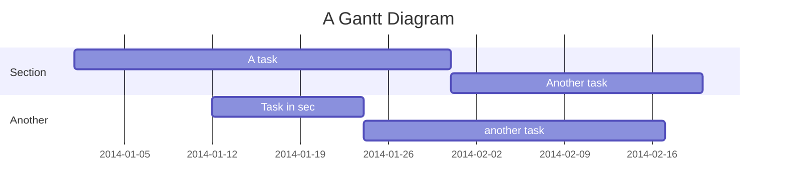
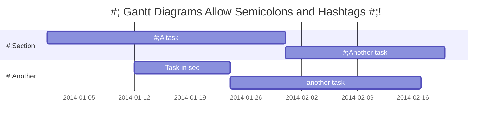
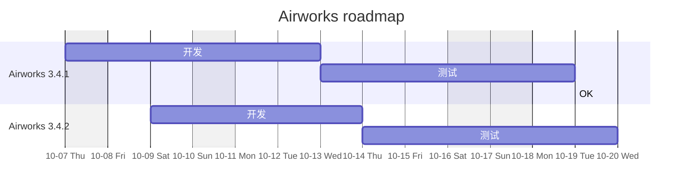
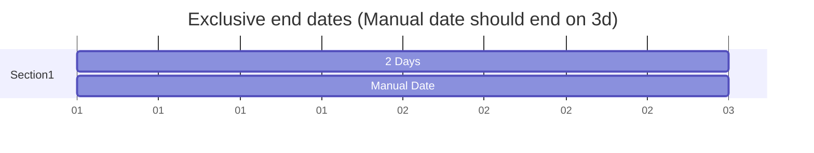
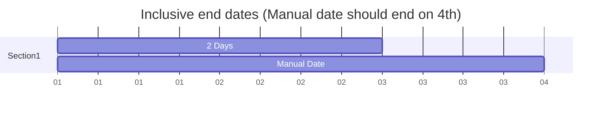
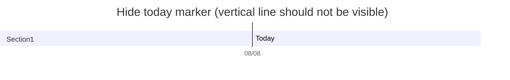
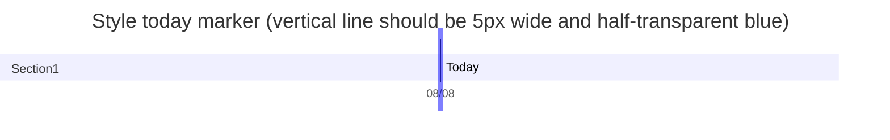
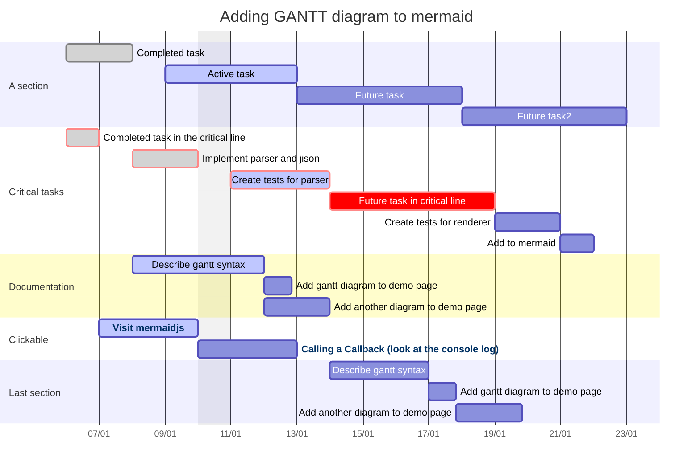
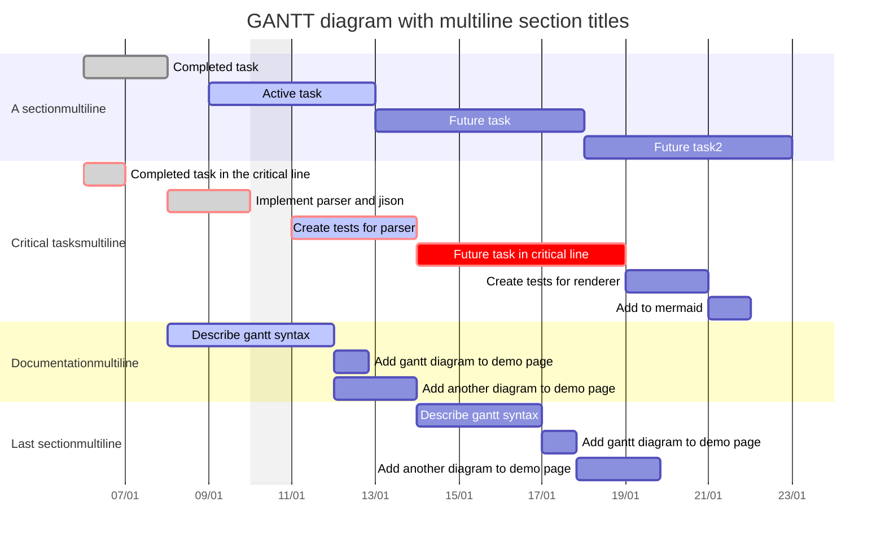

# gantt

## Example 1

**SebastianJS (SVG):**

<svg id="graph" xmlns="http://www.w3.org/2000/svg" xmlns:xlink="http://www.w3.org/1999/xlink" viewBox="-19 44 29 104" style="max-width: 0px;" role="graphics-document document" aria-roledescription="gantt" aria-describedby="chart-desc-graph" aria-labelledby="chart-title-graph"><title id="chart-title-graph">A simple sample gantt diagram</title><desc id="chart-desc-graph">2 sections with 2 tasks each, from 2014</desc><style>#graph{font-family:"trebuchet ms",verdana,arial,sans-serif;font-size:16px;fill:#333;}@keyframes edge-animation-frame{from{stroke-dashoffset:0;}}@keyframes dash{to{stroke-dashoffset:0;}}#graph .edge-animation-slow{stroke-dasharray:9,5!important;stroke-dashoffset:900;animation:dash 50s linear infinite;stroke-linecap:round;}#graph .edge-animation-fast{stroke-dasharray:9,5!important;stroke-dashoffset:900;animation:dash 20s linear infinite;stroke-linecap:round;}#graph .error-icon{fill:#552222;}#graph .error-text{fill:#552222;stroke:#552222;}#graph .edge-thickness-normal{stroke-width:1px;}#graph .edge-thickness-thick{stroke-width:3.5px;}#graph .edge-pattern-solid{stroke-dasharray:0;}#graph .edge-thickness-invisible{stroke-width:0;fill:none;}#graph .edge-pattern-dashed{stroke-dasharray:3;}#graph .edge-pattern-dotted{stroke-dasharray:2;}#graph .marker{fill:#333333;stroke:#333333;}#graph .marker.cross{stroke:#333333;}#graph svg{font-family:"trebuchet ms",verdana,arial,sans-serif;font-size:16px;}#graph p{margin:0;}#graph .mermaid-main-font{font-family:"trebuchet ms",verdana,arial,sans-serif;}#graph .exclude-range{fill:#eeeeee;}#graph .section{stroke:none;opacity:0.2;}#graph .section0{fill:rgba(102, 102, 255, 0.49);}#graph .section2{fill:#fff400;}#graph .section1,#graph .section3{fill:white;opacity:0.2;}#graph .sectionTitle0{fill:#333;}#graph .sectionTitle1{fill:#333;}#graph .sectionTitle2{fill:#333;}#graph .sectionTitle3{fill:#333;}#graph .sectionTitle{text-anchor:start;font-family:"trebuchet ms",verdana,arial,sans-serif;}#graph .grid .tick{stroke:lightgrey;opacity:0.8;shape-rendering:crispEdges;}#graph .grid .tick text{font-family:"trebuchet ms",verdana,arial,sans-serif;fill:#333;}#graph .grid path{stroke-width:0;}#graph .today{fill:none;stroke:red;stroke-width:2px;}#graph .task{stroke-width:2;}#graph .taskText{text-anchor:middle;font-family:"trebuchet ms",verdana,arial,sans-serif;}#graph .taskTextOutsideRight{fill:black;text-anchor:start;font-family:"trebuchet ms",verdana,arial,sans-serif;}#graph .taskTextOutsideLeft{fill:black;text-anchor:end;}#graph .task.clickable{cursor:pointer;}#graph .taskText.clickable{cursor:pointer;fill:#003163!important;font-weight:bold;}#graph .taskTextOutsideLeft.clickable{cursor:pointer;fill:#003163!important;font-weight:bold;}#graph .taskTextOutsideRight.clickable{cursor:pointer;fill:#003163!important;font-weight:bold;}#graph .taskText0,#graph .taskText1,#graph .taskText2,#graph .taskText3{fill:white;}#graph .task0,#graph .task1,#graph .task2,#graph .task3{fill:#8a90dd;stroke:#534fbc;}#graph .taskTextOutside0,#graph .taskTextOutside2{fill:black;}#graph .taskTextOutside1,#graph .taskTextOutside3{fill:black;}#graph .active0,#graph .active1,#graph .active2,#graph .active3{fill:#bfc7ff;stroke:#534fbc;}#graph .activeText0,#graph .activeText1,#graph .activeText2,#graph .activeText3{fill:black!important;}#graph .done0,#graph .done1,#graph .done2,#graph .done3{stroke:grey;fill:lightgrey;stroke-width:2;}#graph .doneText0,#graph .doneText1,#graph .doneText2,#graph .doneText3{fill:black!important;}#graph .crit0,#graph .crit1,#graph .crit2,#graph .crit3{stroke:#ff8888;fill:red;stroke-width:2;}#graph .activeCrit0,#graph .activeCrit1,#graph .activeCrit2,#graph .activeCrit3{stroke:#ff8888;fill:#bfc7ff;stroke-width:2;}#graph .doneCrit0,#graph .doneCrit1,#graph .doneCrit2,#graph .doneCrit3{stroke:#ff8888;fill:lightgrey;stroke-width:2;cursor:pointer;shape-rendering:crispEdges;}#graph .milestone{transform:rotate(45deg) scale(0.8,0.8);}#graph .milestoneText{font-style:italic;}#graph .doneCritText0,#graph .doneCritText1,#graph .doneCritText2,#graph .doneCritText3{fill:black!important;}#graph .vert{stroke:navy;}#graph .vertText{font-size:15px;text-anchor:middle;fill:navy!important;}#graph .activeCritText0,#graph .activeCritText1,#graph .activeCritText2,#graph .activeCritText3{fill:black!important;}#graph .titleText{text-anchor:middle;font-size:18px;fill:#333;font-family:"trebuchet ms",verdana,arial,sans-serif;}#graph :root{--mermaid-font-family:"trebuchet ms",verdana,arial,sans-serif;}</style><g/><g class="grid" transform="translate(75, 146)" fill="none" font-size="10" font-family="sans-serif" text-anchor="middle"><path class="domain" stroke="currentColor" d="M0.5,-111V0.5H-149.5V-111"/><g class="tick" opacity="1" transform="translate(-11.5,0)"><line stroke="currentColor" y2="-111"/><text fill="#000" y="3" dy="1em" style="text-anchor: middle;" stroke="none" font-size="10">2014-01-05</text></g><g class="tick" opacity="1" transform="translate(-32.5,0)"><line stroke="currentColor" y2="-111"/><text fill="#000" y="3" dy="1em" style="text-anchor: middle;" stroke="none" font-size="10">2014-01-12</text></g><g class="tick" opacity="1" transform="translate(-53.5,0)"><line stroke="currentColor" y2="-111"/><text fill="#000" y="3" dy="1em" style="text-anchor: middle;" stroke="none" font-size="10">2014-01-19</text></g><g class="tick" opacity="1" transform="translate(-74.5,0)"><line stroke="currentColor" y2="-111"/><text fill="#000" y="3" dy="1em" style="text-anchor: middle;" stroke="none" font-size="10">2014-01-26</text></g><g class="tick" opacity="1" transform="translate(-95.5,0)"><line stroke="currentColor" y2="-111"/><text fill="#000" y="3" dy="1em" style="text-anchor: middle;" stroke="none" font-size="10">2014-02-02</text></g><g class="tick" opacity="1" transform="translate(-116.5,0)"><line stroke="currentColor" y2="-111"/><text fill="#000" y="3" dy="1em" style="text-anchor: middle;" stroke="none" font-size="10">2014-02-09</text></g><g class="tick" opacity="1" transform="translate(-137.5,0)"><line stroke="currentColor" y2="-111"/><text fill="#000" y="3" dy="1em" style="text-anchor: middle;" stroke="none" font-size="10">2014-02-16</text></g></g><g><rect x="0" y="48" width="-37.5" height="24" class="section section0"/><rect x="0" y="96" width="-37.5" height="24" class="section section1"/><rect x="0" y="120" width="-37.5" height="24" class="section section1"/><rect x="0" y="72" width="-37.5" height="24" class="section section0"/></g><g><rect id="a1" rx="3" ry="3" x="75" y="50" width="-90" height="20" transform-origin="30px 60px" class="task task0 "/><rect id="task2" rx="3" ry="3" x="42" y="98" width="-36" height="20" transform-origin="24px 108px" class="task task1 "/><rect id="task3" rx="3" ry="3" x="6" y="122" width="-72" height="20" transform-origin="-30px 132px" class="task task1 "/><rect id="task1" rx="3" ry="3" x="-15" y="74" width="-60" height="20" transform-origin="-45px 84px" class="task task0 "/><text id="a1-text" font-size="11" x="70" y="63.5" text-height="20" class=" taskTextOutsideLeft taskTextOutside0 ">A task           </text><text id="task2-text" font-size="11" x="37" y="111.5" text-height="20" class=" taskTextOutsideLeft taskTextOutside1 ">Task in sec      </text><text id="task3-text" font-size="11" x="1" y="135.5" text-height="20" class=" taskTextOutsideLeft taskTextOutside1 ">another task      </text><text id="task1-text" font-size="11" x="-20" y="87.5" text-height="20" class=" taskTextOutsideLeft taskTextOutside0 ">Another task     </text></g><g><text dy="0em" x="10" y="74" font-size="11" class="sectionTitle sectionTitle0"><tspan alignment-baseline="central" x="10">Section</tspan></text><text dy="0em" x="10" y="122" font-size="11" class="sectionTitle sectionTitle1"><tspan alignment-baseline="central" x="10">Another</tspan></text></g><g class="today"><line x1="-12713" x2="-12713" y1="25" y2="171" class="today"/></g><text x="0" y="25" class="titleText">A Gantt Diagram</text></svg>

**Mermaid Code (Browser Rendered):**



## Example 2

**SebastianJS (SVG):**

<svg id="graph" xmlns="http://www.w3.org/2000/svg" xmlns:xlink="http://www.w3.org/1999/xlink" viewBox="-19 44 29 104" style="max-width: 0px;" role="graphics-document document" aria-roledescription="gantt" aria-describedby="chart-desc-graph" aria-labelledby="chart-title-graph"><title id="chart-title-graph">A simple sample gantt diagram</title><desc id="chart-desc-graph">2 sections with 2 tasks each, from 2014</desc><style>#graph{font-family:"trebuchet ms",verdana,arial,sans-serif;font-size:16px;fill:#333;}@keyframes edge-animation-frame{from{stroke-dashoffset:0;}}@keyframes dash{to{stroke-dashoffset:0;}}#graph .edge-animation-slow{stroke-dasharray:9,5!important;stroke-dashoffset:900;animation:dash 50s linear infinite;stroke-linecap:round;}#graph .edge-animation-fast{stroke-dasharray:9,5!important;stroke-dashoffset:900;animation:dash 20s linear infinite;stroke-linecap:round;}#graph .error-icon{fill:#552222;}#graph .error-text{fill:#552222;stroke:#552222;}#graph .edge-thickness-normal{stroke-width:1px;}#graph .edge-thickness-thick{stroke-width:3.5px;}#graph .edge-pattern-solid{stroke-dasharray:0;}#graph .edge-thickness-invisible{stroke-width:0;fill:none;}#graph .edge-pattern-dashed{stroke-dasharray:3;}#graph .edge-pattern-dotted{stroke-dasharray:2;}#graph .marker{fill:#333333;stroke:#333333;}#graph .marker.cross{stroke:#333333;}#graph svg{font-family:"trebuchet ms",verdana,arial,sans-serif;font-size:16px;}#graph p{margin:0;}#graph .mermaid-main-font{font-family:"trebuchet ms",verdana,arial,sans-serif;}#graph .exclude-range{fill:#eeeeee;}#graph .section{stroke:none;opacity:0.2;}#graph .section0{fill:rgba(102, 102, 255, 0.49);}#graph .section2{fill:#fff400;}#graph .section1,#graph .section3{fill:white;opacity:0.2;}#graph .sectionTitle0{fill:#333;}#graph .sectionTitle1{fill:#333;}#graph .sectionTitle2{fill:#333;}#graph .sectionTitle3{fill:#333;}#graph .sectionTitle{text-anchor:start;font-family:"trebuchet ms",verdana,arial,sans-serif;}#graph .grid .tick{stroke:lightgrey;opacity:0.8;shape-rendering:crispEdges;}#graph .grid .tick text{font-family:"trebuchet ms",verdana,arial,sans-serif;fill:#333;}#graph .grid path{stroke-width:0;}#graph .today{fill:none;stroke:red;stroke-width:2px;}#graph .task{stroke-width:2;}#graph .taskText{text-anchor:middle;font-family:"trebuchet ms",verdana,arial,sans-serif;}#graph .taskTextOutsideRight{fill:black;text-anchor:start;font-family:"trebuchet ms",verdana,arial,sans-serif;}#graph .taskTextOutsideLeft{fill:black;text-anchor:end;}#graph .task.clickable{cursor:pointer;}#graph .taskText.clickable{cursor:pointer;fill:#003163!important;font-weight:bold;}#graph .taskTextOutsideLeft.clickable{cursor:pointer;fill:#003163!important;font-weight:bold;}#graph .taskTextOutsideRight.clickable{cursor:pointer;fill:#003163!important;font-weight:bold;}#graph .taskText0,#graph .taskText1,#graph .taskText2,#graph .taskText3{fill:white;}#graph .task0,#graph .task1,#graph .task2,#graph .task3{fill:#8a90dd;stroke:#534fbc;}#graph .taskTextOutside0,#graph .taskTextOutside2{fill:black;}#graph .taskTextOutside1,#graph .taskTextOutside3{fill:black;}#graph .active0,#graph .active1,#graph .active2,#graph .active3{fill:#bfc7ff;stroke:#534fbc;}#graph .activeText0,#graph .activeText1,#graph .activeText2,#graph .activeText3{fill:black!important;}#graph .done0,#graph .done1,#graph .done2,#graph .done3{stroke:grey;fill:lightgrey;stroke-width:2;}#graph .doneText0,#graph .doneText1,#graph .doneText2,#graph .doneText3{fill:black!important;}#graph .crit0,#graph .crit1,#graph .crit2,#graph .crit3{stroke:#ff8888;fill:red;stroke-width:2;}#graph .activeCrit0,#graph .activeCrit1,#graph .activeCrit2,#graph .activeCrit3{stroke:#ff8888;fill:#bfc7ff;stroke-width:2;}#graph .doneCrit0,#graph .doneCrit1,#graph .doneCrit2,#graph .doneCrit3{stroke:#ff8888;fill:lightgrey;stroke-width:2;cursor:pointer;shape-rendering:crispEdges;}#graph .milestone{transform:rotate(45deg) scale(0.8,0.8);}#graph .milestoneText{font-style:italic;}#graph .doneCritText0,#graph .doneCritText1,#graph .doneCritText2,#graph .doneCritText3{fill:black!important;}#graph .vert{stroke:navy;}#graph .vertText{font-size:15px;text-anchor:middle;fill:navy!important;}#graph .activeCritText0,#graph .activeCritText1,#graph .activeCritText2,#graph .activeCritText3{fill:black!important;}#graph .titleText{text-anchor:middle;font-size:18px;fill:#333;font-family:"trebuchet ms",verdana,arial,sans-serif;}#graph :root{--mermaid-font-family:"trebuchet ms",verdana,arial,sans-serif;}</style><g/><g class="grid" transform="translate(75, 146)" fill="none" font-size="10" font-family="sans-serif" text-anchor="middle"><path class="domain" stroke="currentColor" d="M0.5,-111V0.5H-149.5V-111"/><g class="tick" opacity="1" transform="translate(-11.5,0)"><line stroke="currentColor" y2="-111"/><text fill="#000" y="3" dy="1em" style="text-anchor: middle;" stroke="none" font-size="10">2014-01-05</text></g><g class="tick" opacity="1" transform="translate(-32.5,0)"><line stroke="currentColor" y2="-111"/><text fill="#000" y="3" dy="1em" style="text-anchor: middle;" stroke="none" font-size="10">2014-01-12</text></g><g class="tick" opacity="1" transform="translate(-53.5,0)"><line stroke="currentColor" y2="-111"/><text fill="#000" y="3" dy="1em" style="text-anchor: middle;" stroke="none" font-size="10">2014-01-19</text></g><g class="tick" opacity="1" transform="translate(-74.5,0)"><line stroke="currentColor" y2="-111"/><text fill="#000" y="3" dy="1em" style="text-anchor: middle;" stroke="none" font-size="10">2014-01-26</text></g><g class="tick" opacity="1" transform="translate(-95.5,0)"><line stroke="currentColor" y2="-111"/><text fill="#000" y="3" dy="1em" style="text-anchor: middle;" stroke="none" font-size="10">2014-02-02</text></g><g class="tick" opacity="1" transform="translate(-116.5,0)"><line stroke="currentColor" y2="-111"/><text fill="#000" y="3" dy="1em" style="text-anchor: middle;" stroke="none" font-size="10">2014-02-09</text></g><g class="tick" opacity="1" transform="translate(-137.5,0)"><line stroke="currentColor" y2="-111"/><text fill="#000" y="3" dy="1em" style="text-anchor: middle;" stroke="none" font-size="10">2014-02-16</text></g></g><g><rect x="0" y="48" width="-37.5" height="24" class="section section0"/><rect x="0" y="96" width="-37.5" height="24" class="section section1"/><rect x="0" y="120" width="-37.5" height="24" class="section section1"/><rect x="0" y="72" width="-37.5" height="24" class="section section0"/></g><g><rect id="a1" rx="3" ry="3" x="75" y="50" width="-90" height="20" transform-origin="30px 60px" class="task task0 "/><rect id="task2" rx="3" ry="3" x="42" y="98" width="-36" height="20" transform-origin="24px 108px" class="task task1 "/><rect id="task3" rx="3" ry="3" x="6" y="122" width="-72" height="20" transform-origin="-30px 132px" class="task task1 "/><rect id="task1" rx="3" ry="3" x="-15" y="74" width="-60" height="20" transform-origin="-45px 84px" class="task task0 "/><text id="a1-text" font-size="11" x="70" y="63.5" text-height="20" class=" taskTextOutsideLeft taskTextOutside0 ">#;A task           </text><text id="task2-text" font-size="11" x="37" y="111.5" text-height="20" class=" taskTextOutsideLeft taskTextOutside1 ">Task in sec      </text><text id="task3-text" font-size="11" x="1" y="135.5" text-height="20" class=" taskTextOutsideLeft taskTextOutside1 ">another task      </text><text id="task1-text" font-size="11" x="-20" y="87.5" text-height="20" class=" taskTextOutsideLeft taskTextOutside0 ">#;Another task     </text></g><g><text dy="0em" x="10" y="74" font-size="11" class="sectionTitle sectionTitle0"><tspan alignment-baseline="central" x="10">#;Section</tspan></text><text dy="0em" x="10" y="122" font-size="11" class="sectionTitle sectionTitle1"><tspan alignment-baseline="central" x="10">#;Another</tspan></text></g><g class="today"><line x1="-12713" x2="-12713" y1="25" y2="171" class="today"/></g><text x="0" y="25" class="titleText">#; Gantt Diagrams Allow Semicolons and Hashtags #;!</text></svg>

**Mermaid Code (Browser Rendered):**



## Example 3

**SebastianJS (SVG):**

<svg id="graph" xmlns="http://www.w3.org/2000/svg" xmlns:xlink="http://www.w3.org/1999/xlink" viewBox="-67 31 134 143" style="max-width: 0px;" role="graphics-document document" aria-roledescription="gantt"><style>#graph{font-family:"trebuchet ms",verdana,arial,sans-serif;font-size:16px;fill:#333;}@keyframes edge-animation-frame{from{stroke-dashoffset:0;}}@keyframes dash{to{stroke-dashoffset:0;}}#graph .edge-animation-slow{stroke-dasharray:9,5!important;stroke-dashoffset:900;animation:dash 50s linear infinite;stroke-linecap:round;}#graph .edge-animation-fast{stroke-dasharray:9,5!important;stroke-dashoffset:900;animation:dash 20s linear infinite;stroke-linecap:round;}#graph .error-icon{fill:#552222;}#graph .error-text{fill:#552222;stroke:#552222;}#graph .edge-thickness-normal{stroke-width:1px;}#graph .edge-thickness-thick{stroke-width:3.5px;}#graph .edge-pattern-solid{stroke-dasharray:0;}#graph .edge-thickness-invisible{stroke-width:0;fill:none;}#graph .edge-pattern-dashed{stroke-dasharray:3;}#graph .edge-pattern-dotted{stroke-dasharray:2;}#graph .marker{fill:#333333;stroke:#333333;}#graph .marker.cross{stroke:#333333;}#graph svg{font-family:"trebuchet ms",verdana,arial,sans-serif;font-size:16px;}#graph p{margin:0;}#graph .mermaid-main-font{font-family:"trebuchet ms",verdana,arial,sans-serif;}#graph .exclude-range{fill:#eeeeee;}#graph .section{stroke:none;opacity:0.2;}#graph .section0{fill:rgba(102, 102, 255, 0.49);}#graph .section2{fill:#fff400;}#graph .section1,#graph .section3{fill:white;opacity:0.2;}#graph .sectionTitle0{fill:#333;}#graph .sectionTitle1{fill:#333;}#graph .sectionTitle2{fill:#333;}#graph .sectionTitle3{fill:#333;}#graph .sectionTitle{text-anchor:start;font-family:"trebuchet ms",verdana,arial,sans-serif;}#graph .grid .tick{stroke:lightgrey;opacity:0.8;shape-rendering:crispEdges;}#graph .grid .tick text{font-family:"trebuchet ms",verdana,arial,sans-serif;fill:#333;}#graph .grid path{stroke-width:0;}#graph .today{fill:none;stroke:red;stroke-width:2px;}#graph .task{stroke-width:2;}#graph .taskText{text-anchor:middle;font-family:"trebuchet ms",verdana,arial,sans-serif;}#graph .taskTextOutsideRight{fill:black;text-anchor:start;font-family:"trebuchet ms",verdana,arial,sans-serif;}#graph .taskTextOutsideLeft{fill:black;text-anchor:end;}#graph .task.clickable{cursor:pointer;}#graph .taskText.clickable{cursor:pointer;fill:#003163!important;font-weight:bold;}#graph .taskTextOutsideLeft.clickable{cursor:pointer;fill:#003163!important;font-weight:bold;}#graph .taskTextOutsideRight.clickable{cursor:pointer;fill:#003163!important;font-weight:bold;}#graph .taskText0,#graph .taskText1,#graph .taskText2,#graph .taskText3{fill:white;}#graph .task0,#graph .task1,#graph .task2,#graph .task3{fill:#8a90dd;stroke:#534fbc;}#graph .taskTextOutside0,#graph .taskTextOutside2{fill:black;}#graph .taskTextOutside1,#graph .taskTextOutside3{fill:black;}#graph .active0,#graph .active1,#graph .active2,#graph .active3{fill:#bfc7ff;stroke:#534fbc;}#graph .activeText0,#graph .activeText1,#graph .activeText2,#graph .activeText3{fill:black!important;}#graph .done0,#graph .done1,#graph .done2,#graph .done3{stroke:grey;fill:lightgrey;stroke-width:2;}#graph .doneText0,#graph .doneText1,#graph .doneText2,#graph .doneText3{fill:black!important;}#graph .crit0,#graph .crit1,#graph .crit2,#graph .crit3{stroke:#ff8888;fill:red;stroke-width:2;}#graph .activeCrit0,#graph .activeCrit1,#graph .activeCrit2,#graph .activeCrit3{stroke:#ff8888;fill:#bfc7ff;stroke-width:2;}#graph .doneCrit0,#graph .doneCrit1,#graph .doneCrit2,#graph .doneCrit3{stroke:#ff8888;fill:lightgrey;stroke-width:2;cursor:pointer;shape-rendering:crispEdges;}#graph .milestone{transform:rotate(45deg) scale(0.8,0.8);}#graph .milestoneText{font-style:italic;}#graph .doneCritText0,#graph .doneCritText1,#graph .doneCritText2,#graph .doneCritText3{fill:black!important;}#graph .vert{stroke:navy;}#graph .vertText{font-size:15px;text-anchor:middle;fill:navy!important;}#graph .activeCritText0,#graph .activeCritText1,#graph .activeCritText2,#graph .activeCritText3{fill:black!important;}#graph .titleText{text-anchor:middle;font-size:18px;fill:#333;font-family:"trebuchet ms",verdana,arial,sans-serif;}#graph :root{--mermaid-font-family:"trebuchet ms",verdana,arial,sans-serif;}</style><g/><g><rect id="exclude-2021-10-07" x="75" y="35" width="-12" height="135" transform-origin="75px 110px" class="exclude-range"/><rect id="exclude-2021-10-10" x="40" y="35" width="-11" height="135" transform-origin="40px 134px" class="exclude-range"/><rect id="exclude-2021-10-16" x="-29" y="35" width="-23" height="135" transform-origin="-34.5px 158px" class="exclude-range"/></g><g class="grid" transform="translate(75, 170)" fill="none" font-size="10" font-family="sans-serif" text-anchor="middle"><path class="domain" stroke="currentColor" d="M0.5,-135V0.5H-149.5V-135"/><g class="tick" opacity="1" transform="translate(0.5,0)"><line stroke="currentColor" y2="-135"/><text fill="#000" y="3" dy="1em" style="text-anchor: middle;" stroke="none" font-size="10">10-07 Thu</text></g><g class="tick" opacity="1" transform="translate(-11.5,0)"><line stroke="currentColor" y2="-135"/><text fill="#000" y="3" dy="1em" style="text-anchor: middle;" stroke="none" font-size="10">10-08 Fri</text></g><g class="tick" opacity="1" transform="translate(-22.5,0)"><line stroke="currentColor" y2="-135"/><text fill="#000" y="3" dy="1em" style="text-anchor: middle;" stroke="none" font-size="10">10-09 Sat</text></g><g class="tick" opacity="1" transform="translate(-34.5,0)"><line stroke="currentColor" y2="-135"/><text fill="#000" y="3" dy="1em" style="text-anchor: middle;" stroke="none" font-size="10">10-10 Sun</text></g><g class="tick" opacity="1" transform="translate(-45.5,0)"><line stroke="currentColor" y2="-135"/><text fill="#000" y="3" dy="1em" style="text-anchor: middle;" stroke="none" font-size="10">10-11 Mon</text></g><g class="tick" opacity="1" transform="translate(-57.5,0)"><line stroke="currentColor" y2="-135"/><text fill="#000" y="3" dy="1em" style="text-anchor: middle;" stroke="none" font-size="10">10-12 Tue</text></g><g class="tick" opacity="1" transform="translate(-68.5,0)"><line stroke="currentColor" y2="-135"/><text fill="#000" y="3" dy="1em" style="text-anchor: middle;" stroke="none" font-size="10">10-13 Wed</text></g><g class="tick" opacity="1" transform="translate(-80.5,0)"><line stroke="currentColor" y2="-135"/><text fill="#000" y="3" dy="1em" style="text-anchor: middle;" stroke="none" font-size="10">10-14 Thu</text></g><g class="tick" opacity="1" transform="translate(-91.5,0)"><line stroke="currentColor" y2="-135"/><text fill="#000" y="3" dy="1em" style="text-anchor: middle;" stroke="none" font-size="10">10-15 Fri</text></g><g class="tick" opacity="1" transform="translate(-103.5,0)"><line stroke="currentColor" y2="-135"/><text fill="#000" y="3" dy="1em" style="text-anchor: middle;" stroke="none" font-size="10">10-16 Sat</text></g><g class="tick" opacity="1" transform="translate(-114.5,0)"><line stroke="currentColor" y2="-135"/><text fill="#000" y="3" dy="1em" style="text-anchor: middle;" stroke="none" font-size="10">10-17 Sun</text></g><g class="tick" opacity="1" transform="translate(-126.5,0)"><line stroke="currentColor" y2="-135"/><text fill="#000" y="3" dy="1em" style="text-anchor: middle;" stroke="none" font-size="10">10-18 Mon</text></g><g class="tick" opacity="1" transform="translate(-137.5,0)"><line stroke="currentColor" y2="-135"/><text fill="#000" y="3" dy="1em" style="text-anchor: middle;" stroke="none" font-size="10">10-19 Tue</text></g><g class="tick" opacity="1" transform="translate(-149.5,0)"><line stroke="currentColor" y2="-135"/><text fill="#000" y="3" dy="1em" style="text-anchor: middle;" stroke="none" font-size="10">10-20 Wed</text></g></g><g><rect x="0" y="48" width="-37.5" height="24" class="section section0"/><rect x="0" y="120" width="-37.5" height="24" class="section section1"/><rect x="0" y="72" width="-37.5" height="24" class="section section0"/><rect x="0" y="144" width="-37.5" height="24" class="section section1"/><rect x="0" y="96" width="-37.5" height="24" class="section section0"/></g><g><rect id="b" rx="3" ry="3" x="75" y="50" width="-69" height="20" transform-origin="40.5px 60px" class="task task0 "/><rect id="a" rx="3" ry="3" x="52" y="122" width="-58" height="20" transform-origin="23px 132px" class="task task1 "/><rect id="task1" rx="3" ry="3" x="6" y="74" width="-69" height="20" transform-origin="-28.5px 84px" class="task task0 "/><rect id="task3" rx="3" ry="3" x="-6" y="146" width="-69" height="20" transform-origin="-40.5px 156px" class="task task1 "/><rect id="task2" rx="3" ry="3" x="-63" y="98" width="0" height="20" transform-origin="-63px 108px" class="task task0 "/><text id="b-text" font-size="11" x="70" y="63.5" text-height="20" class=" taskTextOutsideLeft taskTextOutside0 ">开发	</text><text id="a-text" font-size="11" x="47" y="135.5" text-height="20" class=" taskTextOutsideLeft taskTextOutside1 ">开发	</text><text id="task1-text" font-size="11" x="1" y="87.5" text-height="20" class=" taskTextOutsideLeft taskTextOutside0 ">测试	</text><text id="task3-text" font-size="11" x="-70" y="159.5" text-height="20" class=" taskTextOutsideRight taskTextOutside1  width-34">测试	</text><text id="task2-text" font-size="11" x="-68" y="111.5" text-height="20" class=" taskTextOutsideLeft taskTextOutside0 ">OK  </text></g><g><text dy="0em" x="10" y="86" font-size="11" class="sectionTitle sectionTitle0"><tspan alignment-baseline="central" x="10">Airworks 3.4.1</tspan></text><text dy="0em" x="10" y="146" font-size="11" class="sectionTitle sectionTitle1"><tspan alignment-baseline="central" x="10">Airworks 3.4.2</tspan></text></g><g class="today"><line x1="-16385" x2="-16385" y1="25" y2="195" class="today"/></g><text x="0" y="25" class="titleText">Airworks roadmap</text></svg>

**Mermaid Code (Browser Rendered):**



## Example 4

**SebastianJS (SVG):**

<svg id="graph" xmlns="http://www.w3.org/2000/svg" xmlns:xlink="http://www.w3.org/1999/xlink" viewBox="-4 44 -29 56" style="max-width: 0px;" role="graphics-document document" aria-roledescription="gantt"><style>#graph{font-family:"trebuchet ms",verdana,arial,sans-serif;font-size:16px;fill:#333;}@keyframes edge-animation-frame{from{stroke-dashoffset:0;}}@keyframes dash{to{stroke-dashoffset:0;}}#graph .edge-animation-slow{stroke-dasharray:9,5!important;stroke-dashoffset:900;animation:dash 50s linear infinite;stroke-linecap:round;}#graph .edge-animation-fast{stroke-dasharray:9,5!important;stroke-dashoffset:900;animation:dash 20s linear infinite;stroke-linecap:round;}#graph .error-icon{fill:#552222;}#graph .error-text{fill:#552222;stroke:#552222;}#graph .edge-thickness-normal{stroke-width:1px;}#graph .edge-thickness-thick{stroke-width:3.5px;}#graph .edge-pattern-solid{stroke-dasharray:0;}#graph .edge-thickness-invisible{stroke-width:0;fill:none;}#graph .edge-pattern-dashed{stroke-dasharray:3;}#graph .edge-pattern-dotted{stroke-dasharray:2;}#graph .marker{fill:#333333;stroke:#333333;}#graph .marker.cross{stroke:#333333;}#graph svg{font-family:"trebuchet ms",verdana,arial,sans-serif;font-size:16px;}#graph p{margin:0;}#graph .mermaid-main-font{font-family:"trebuchet ms",verdana,arial,sans-serif;}#graph .exclude-range{fill:#eeeeee;}#graph .section{stroke:none;opacity:0.2;}#graph .section0{fill:rgba(102, 102, 255, 0.49);}#graph .section2{fill:#fff400;}#graph .section1,#graph .section3{fill:white;opacity:0.2;}#graph .sectionTitle0{fill:#333;}#graph .sectionTitle1{fill:#333;}#graph .sectionTitle2{fill:#333;}#graph .sectionTitle3{fill:#333;}#graph .sectionTitle{text-anchor:start;font-family:"trebuchet ms",verdana,arial,sans-serif;}#graph .grid .tick{stroke:lightgrey;opacity:0.8;shape-rendering:crispEdges;}#graph .grid .tick text{font-family:"trebuchet ms",verdana,arial,sans-serif;fill:#333;}#graph .grid path{stroke-width:0;}#graph .today{fill:none;stroke:red;stroke-width:2px;}#graph .task{stroke-width:2;}#graph .taskText{text-anchor:middle;font-family:"trebuchet ms",verdana,arial,sans-serif;}#graph .taskTextOutsideRight{fill:black;text-anchor:start;font-family:"trebuchet ms",verdana,arial,sans-serif;}#graph .taskTextOutsideLeft{fill:black;text-anchor:end;}#graph .task.clickable{cursor:pointer;}#graph .taskText.clickable{cursor:pointer;fill:#003163!important;font-weight:bold;}#graph .taskTextOutsideLeft.clickable{cursor:pointer;fill:#003163!important;font-weight:bold;}#graph .taskTextOutsideRight.clickable{cursor:pointer;fill:#003163!important;font-weight:bold;}#graph .taskText0,#graph .taskText1,#graph .taskText2,#graph .taskText3{fill:white;}#graph .task0,#graph .task1,#graph .task2,#graph .task3{fill:#8a90dd;stroke:#534fbc;}#graph .taskTextOutside0,#graph .taskTextOutside2{fill:black;}#graph .taskTextOutside1,#graph .taskTextOutside3{fill:black;}#graph .active0,#graph .active1,#graph .active2,#graph .active3{fill:#bfc7ff;stroke:#534fbc;}#graph .activeText0,#graph .activeText1,#graph .activeText2,#graph .activeText3{fill:black!important;}#graph .done0,#graph .done1,#graph .done2,#graph .done3{stroke:grey;fill:lightgrey;stroke-width:2;}#graph .doneText0,#graph .doneText1,#graph .doneText2,#graph .doneText3{fill:black!important;}#graph .crit0,#graph .crit1,#graph .crit2,#graph .crit3{stroke:#ff8888;fill:red;stroke-width:2;}#graph .activeCrit0,#graph .activeCrit1,#graph .activeCrit2,#graph .activeCrit3{stroke:#ff8888;fill:#bfc7ff;stroke-width:2;}#graph .doneCrit0,#graph .doneCrit1,#graph .doneCrit2,#graph .doneCrit3{stroke:#ff8888;fill:lightgrey;stroke-width:2;cursor:pointer;shape-rendering:crispEdges;}#graph .milestone{transform:rotate(45deg) scale(0.8,0.8);}#graph .milestoneText{font-style:italic;}#graph .doneCritText0,#graph .doneCritText1,#graph .doneCritText2,#graph .doneCritText3{fill:black!important;}#graph .vert{stroke:navy;}#graph .vertText{font-size:15px;text-anchor:middle;fill:navy!important;}#graph .activeCritText0,#graph .activeCritText1,#graph .activeCritText2,#graph .activeCritText3{fill:black!important;}#graph .titleText{text-anchor:middle;font-size:18px;fill:#333;font-family:"trebuchet ms",verdana,arial,sans-serif;}#graph :root{--mermaid-font-family:"trebuchet ms",verdana,arial,sans-serif;}</style><g/><g class="grid" transform="translate(75, 98)" fill="none" font-size="10" font-family="sans-serif" text-anchor="middle"><path class="domain" stroke="currentColor" d="M0.5,-63V0.5H-149.5V-63"/><g class="tick" opacity="1" transform="translate(0.5,0)"><line stroke="currentColor" y2="-63"/><text fill="#000" y="3" dy="1em" style="text-anchor: middle;" stroke="none" font-size="10">01</text></g><g class="tick" opacity="1" transform="translate(-18.5,0)"><line stroke="currentColor" y2="-63"/><text fill="#000" y="3" dy="1em" style="text-anchor: middle;" stroke="none" font-size="10">01</text></g><g class="tick" opacity="1" transform="translate(-36.5,0)"><line stroke="currentColor" y2="-63"/><text fill="#000" y="3" dy="1em" style="text-anchor: middle;" stroke="none" font-size="10">01</text></g><g class="tick" opacity="1" transform="translate(-55.5,0)"><line stroke="currentColor" y2="-63"/><text fill="#000" y="3" dy="1em" style="text-anchor: middle;" stroke="none" font-size="10">01</text></g><g class="tick" opacity="1" transform="translate(-74.5,0)"><line stroke="currentColor" y2="-63"/><text fill="#000" y="3" dy="1em" style="text-anchor: middle;" stroke="none" font-size="10">02</text></g><g class="tick" opacity="1" transform="translate(-93.5,0)"><line stroke="currentColor" y2="-63"/><text fill="#000" y="3" dy="1em" style="text-anchor: middle;" stroke="none" font-size="10">02</text></g><g class="tick" opacity="1" transform="translate(-111.5,0)"><line stroke="currentColor" y2="-63"/><text fill="#000" y="3" dy="1em" style="text-anchor: middle;" stroke="none" font-size="10">02</text></g><g class="tick" opacity="1" transform="translate(-130.5,0)"><line stroke="currentColor" y2="-63"/><text fill="#000" y="3" dy="1em" style="text-anchor: middle;" stroke="none" font-size="10">02</text></g><g class="tick" opacity="1" transform="translate(-149.5,0)"><line stroke="currentColor" y2="-63"/><text fill="#000" y="3" dy="1em" style="text-anchor: middle;" stroke="none" font-size="10">03</text></g></g><g><rect x="0" y="48" width="-37.5" height="24" class="section section0"/><rect x="0" y="72" width="-37.5" height="24" class="section section0"/></g><g><rect id="1" rx="3" ry="3" x="75" y="50" width="-150" height="20" transform-origin="0px 60px" class="task task0 "/><rect id="2" rx="3" ry="3" x="75" y="74" width="-150" height="20" transform-origin="0px 84px" class="task task0 "/><text id="1-text" font-size="11" x="70" y="63.5" text-height="20" class=" taskTextOutsideLeft taskTextOutside0 ">2 Days</text><text id="2-text" font-size="11" x="70" y="87.5" text-height="20" class=" taskTextOutsideLeft taskTextOutside0 ">Manual Date</text></g><g><text dy="0em" x="10" y="74" font-size="11" class="sectionTitle sectionTitle0"><tspan alignment-baseline="central" x="10">Section1</tspan></text></g><g class="today"><line x1="-182665" x2="-182665" y1="25" y2="123" class="today"/></g><text x="0" y="25" class="titleText">Exclusive end dates (Manual date should end on 3d)</text></svg>

**Mermaid Code (Browser Rendered):**



## Example 5

**SebastianJS (SVG):**

<svg id="graph" xmlns="http://www.w3.org/2000/svg" xmlns:xlink="http://www.w3.org/1999/xlink" viewBox="-4 44 -17 56" style="max-width: 0px;" role="graphics-document document" aria-roledescription="gantt"><style>#graph{font-family:"trebuchet ms",verdana,arial,sans-serif;font-size:16px;fill:#333;}@keyframes edge-animation-frame{from{stroke-dashoffset:0;}}@keyframes dash{to{stroke-dashoffset:0;}}#graph .edge-animation-slow{stroke-dasharray:9,5!important;stroke-dashoffset:900;animation:dash 50s linear infinite;stroke-linecap:round;}#graph .edge-animation-fast{stroke-dasharray:9,5!important;stroke-dashoffset:900;animation:dash 20s linear infinite;stroke-linecap:round;}#graph .error-icon{fill:#552222;}#graph .error-text{fill:#552222;stroke:#552222;}#graph .edge-thickness-normal{stroke-width:1px;}#graph .edge-thickness-thick{stroke-width:3.5px;}#graph .edge-pattern-solid{stroke-dasharray:0;}#graph .edge-thickness-invisible{stroke-width:0;fill:none;}#graph .edge-pattern-dashed{stroke-dasharray:3;}#graph .edge-pattern-dotted{stroke-dasharray:2;}#graph .marker{fill:#333333;stroke:#333333;}#graph .marker.cross{stroke:#333333;}#graph svg{font-family:"trebuchet ms",verdana,arial,sans-serif;font-size:16px;}#graph p{margin:0;}#graph .mermaid-main-font{font-family:"trebuchet ms",verdana,arial,sans-serif;}#graph .exclude-range{fill:#eeeeee;}#graph .section{stroke:none;opacity:0.2;}#graph .section0{fill:rgba(102, 102, 255, 0.49);}#graph .section2{fill:#fff400;}#graph .section1,#graph .section3{fill:white;opacity:0.2;}#graph .sectionTitle0{fill:#333;}#graph .sectionTitle1{fill:#333;}#graph .sectionTitle2{fill:#333;}#graph .sectionTitle3{fill:#333;}#graph .sectionTitle{text-anchor:start;font-family:"trebuchet ms",verdana,arial,sans-serif;}#graph .grid .tick{stroke:lightgrey;opacity:0.8;shape-rendering:crispEdges;}#graph .grid .tick text{font-family:"trebuchet ms",verdana,arial,sans-serif;fill:#333;}#graph .grid path{stroke-width:0;}#graph .today{fill:none;stroke:red;stroke-width:2px;}#graph .task{stroke-width:2;}#graph .taskText{text-anchor:middle;font-family:"trebuchet ms",verdana,arial,sans-serif;}#graph .taskTextOutsideRight{fill:black;text-anchor:start;font-family:"trebuchet ms",verdana,arial,sans-serif;}#graph .taskTextOutsideLeft{fill:black;text-anchor:end;}#graph .task.clickable{cursor:pointer;}#graph .taskText.clickable{cursor:pointer;fill:#003163!important;font-weight:bold;}#graph .taskTextOutsideLeft.clickable{cursor:pointer;fill:#003163!important;font-weight:bold;}#graph .taskTextOutsideRight.clickable{cursor:pointer;fill:#003163!important;font-weight:bold;}#graph .taskText0,#graph .taskText1,#graph .taskText2,#graph .taskText3{fill:white;}#graph .task0,#graph .task1,#graph .task2,#graph .task3{fill:#8a90dd;stroke:#534fbc;}#graph .taskTextOutside0,#graph .taskTextOutside2{fill:black;}#graph .taskTextOutside1,#graph .taskTextOutside3{fill:black;}#graph .active0,#graph .active1,#graph .active2,#graph .active3{fill:#bfc7ff;stroke:#534fbc;}#graph .activeText0,#graph .activeText1,#graph .activeText2,#graph .activeText3{fill:black!important;}#graph .done0,#graph .done1,#graph .done2,#graph .done3{stroke:grey;fill:lightgrey;stroke-width:2;}#graph .doneText0,#graph .doneText1,#graph .doneText2,#graph .doneText3{fill:black!important;}#graph .crit0,#graph .crit1,#graph .crit2,#graph .crit3{stroke:#ff8888;fill:red;stroke-width:2;}#graph .activeCrit0,#graph .activeCrit1,#graph .activeCrit2,#graph .activeCrit3{stroke:#ff8888;fill:#bfc7ff;stroke-width:2;}#graph .doneCrit0,#graph .doneCrit1,#graph .doneCrit2,#graph .doneCrit3{stroke:#ff8888;fill:lightgrey;stroke-width:2;cursor:pointer;shape-rendering:crispEdges;}#graph .milestone{transform:rotate(45deg) scale(0.8,0.8);}#graph .milestoneText{font-style:italic;}#graph .doneCritText0,#graph .doneCritText1,#graph .doneCritText2,#graph .doneCritText3{fill:black!important;}#graph .vert{stroke:navy;}#graph .vertText{font-size:15px;text-anchor:middle;fill:navy!important;}#graph .activeCritText0,#graph .activeCritText1,#graph .activeCritText2,#graph .activeCritText3{fill:black!important;}#graph .titleText{text-anchor:middle;font-size:18px;fill:#333;font-family:"trebuchet ms",verdana,arial,sans-serif;}#graph :root{--mermaid-font-family:"trebuchet ms",verdana,arial,sans-serif;}</style><g/><g class="grid" transform="translate(75, 98)" fill="none" font-size="10" font-family="sans-serif" text-anchor="middle"><path class="domain" stroke="currentColor" d="M0.5,-63V0.5H-149.5V-63"/><g class="tick" opacity="1" transform="translate(0.5,0)"><line stroke="currentColor" y2="-63"/><text fill="#000" y="3" dy="1em" style="text-anchor: middle;" stroke="none" font-size="10">01</text></g><g class="tick" opacity="1" transform="translate(-11.5,0)"><line stroke="currentColor" y2="-63"/><text fill="#000" y="3" dy="1em" style="text-anchor: middle;" stroke="none" font-size="10">01</text></g><g class="tick" opacity="1" transform="translate(-24.5,0)"><line stroke="currentColor" y2="-63"/><text fill="#000" y="3" dy="1em" style="text-anchor: middle;" stroke="none" font-size="10">01</text></g><g class="tick" opacity="1" transform="translate(-36.5,0)"><line stroke="currentColor" y2="-63"/><text fill="#000" y="3" dy="1em" style="text-anchor: middle;" stroke="none" font-size="10">01</text></g><g class="tick" opacity="1" transform="translate(-49.5,0)"><line stroke="currentColor" y2="-63"/><text fill="#000" y="3" dy="1em" style="text-anchor: middle;" stroke="none" font-size="10">02</text></g><g class="tick" opacity="1" transform="translate(-61.5,0)"><line stroke="currentColor" y2="-63"/><text fill="#000" y="3" dy="1em" style="text-anchor: middle;" stroke="none" font-size="10">02</text></g><g class="tick" opacity="1" transform="translate(-74.5,0)"><line stroke="currentColor" y2="-63"/><text fill="#000" y="3" dy="1em" style="text-anchor: middle;" stroke="none" font-size="10">02</text></g><g class="tick" opacity="1" transform="translate(-86.5,0)"><line stroke="currentColor" y2="-63"/><text fill="#000" y="3" dy="1em" style="text-anchor: middle;" stroke="none" font-size="10">02</text></g><g class="tick" opacity="1" transform="translate(-99.5,0)"><line stroke="currentColor" y2="-63"/><text fill="#000" y="3" dy="1em" style="text-anchor: middle;" stroke="none" font-size="10">03</text></g><g class="tick" opacity="1" transform="translate(-111.5,0)"><line stroke="currentColor" y2="-63"/><text fill="#000" y="3" dy="1em" style="text-anchor: middle;" stroke="none" font-size="10">03</text></g><g class="tick" opacity="1" transform="translate(-124.5,0)"><line stroke="currentColor" y2="-63"/><text fill="#000" y="3" dy="1em" style="text-anchor: middle;" stroke="none" font-size="10">03</text></g><g class="tick" opacity="1" transform="translate(-136.5,0)"><line stroke="currentColor" y2="-63"/><text fill="#000" y="3" dy="1em" style="text-anchor: middle;" stroke="none" font-size="10">03</text></g><g class="tick" opacity="1" transform="translate(-149.5,0)"><line stroke="currentColor" y2="-63"/><text fill="#000" y="3" dy="1em" style="text-anchor: middle;" stroke="none" font-size="10">04</text></g></g><g><rect x="0" y="48" width="-37.5" height="24" class="section section0"/><rect x="0" y="72" width="-37.5" height="24" class="section section0"/></g><g><rect id="1" rx="3" ry="3" x="75" y="50" width="-100" height="20" transform-origin="25px 60px" class="task task0 "/><rect id="2" rx="3" ry="3" x="75" y="74" width="-150" height="20" transform-origin="0px 84px" class="task task0 "/><text id="1-text" font-size="11" x="70" y="63.5" text-height="20" class=" taskTextOutsideLeft taskTextOutside0 ">2 Days</text><text id="2-text" font-size="11" x="70" y="87.5" text-height="20" class=" taskTextOutsideLeft taskTextOutside0 ">Manual Date</text></g><g><text dy="0em" x="10" y="74" font-size="11" class="sectionTitle sectionTitle0"><tspan alignment-baseline="central" x="10">Section1</tspan></text></g><g class="today"><line x1="-121751" x2="-121751" y1="25" y2="123" class="today"/></g><text x="0" y="25" class="titleText">Inclusive end dates (Manual date should end on 4th)</text></svg>

**Mermaid Code (Browser Rendered):**



## Example 6

**SebastianJS (SVG):**

<svg id="graph" xmlns="http://www.w3.org/2000/svg" xmlns:xlink="http://www.w3.org/1999/xlink" viewBox="-4 44 8 32" style="max-width: 0px;" role="graphics-document document" aria-roledescription="gantt"><style>#graph{font-family:"trebuchet ms",verdana,arial,sans-serif;font-size:16px;fill:#333;}@keyframes edge-animation-frame{from{stroke-dashoffset:0;}}@keyframes dash{to{stroke-dashoffset:0;}}#graph .edge-animation-slow{stroke-dasharray:9,5!important;stroke-dashoffset:900;animation:dash 50s linear infinite;stroke-linecap:round;}#graph .edge-animation-fast{stroke-dasharray:9,5!important;stroke-dashoffset:900;animation:dash 20s linear infinite;stroke-linecap:round;}#graph .error-icon{fill:#552222;}#graph .error-text{fill:#552222;stroke:#552222;}#graph .edge-thickness-normal{stroke-width:1px;}#graph .edge-thickness-thick{stroke-width:3.5px;}#graph .edge-pattern-solid{stroke-dasharray:0;}#graph .edge-thickness-invisible{stroke-width:0;fill:none;}#graph .edge-pattern-dashed{stroke-dasharray:3;}#graph .edge-pattern-dotted{stroke-dasharray:2;}#graph .marker{fill:#333333;stroke:#333333;}#graph .marker.cross{stroke:#333333;}#graph svg{font-family:"trebuchet ms",verdana,arial,sans-serif;font-size:16px;}#graph p{margin:0;}#graph .mermaid-main-font{font-family:"trebuchet ms",verdana,arial,sans-serif;}#graph .exclude-range{fill:#eeeeee;}#graph .section{stroke:none;opacity:0.2;}#graph .section0{fill:rgba(102, 102, 255, 0.49);}#graph .section2{fill:#fff400;}#graph .section1,#graph .section3{fill:white;opacity:0.2;}#graph .sectionTitle0{fill:#333;}#graph .sectionTitle1{fill:#333;}#graph .sectionTitle2{fill:#333;}#graph .sectionTitle3{fill:#333;}#graph .sectionTitle{text-anchor:start;font-family:"trebuchet ms",verdana,arial,sans-serif;}#graph .grid .tick{stroke:lightgrey;opacity:0.8;shape-rendering:crispEdges;}#graph .grid .tick text{font-family:"trebuchet ms",verdana,arial,sans-serif;fill:#333;}#graph .grid path{stroke-width:0;}#graph .today{fill:none;stroke:red;stroke-width:2px;}#graph .task{stroke-width:2;}#graph .taskText{text-anchor:middle;font-family:"trebuchet ms",verdana,arial,sans-serif;}#graph .taskTextOutsideRight{fill:black;text-anchor:start;font-family:"trebuchet ms",verdana,arial,sans-serif;}#graph .taskTextOutsideLeft{fill:black;text-anchor:end;}#graph .task.clickable{cursor:pointer;}#graph .taskText.clickable{cursor:pointer;fill:#003163!important;font-weight:bold;}#graph .taskTextOutsideLeft.clickable{cursor:pointer;fill:#003163!important;font-weight:bold;}#graph .taskTextOutsideRight.clickable{cursor:pointer;fill:#003163!important;font-weight:bold;}#graph .taskText0,#graph .taskText1,#graph .taskText2,#graph .taskText3{fill:white;}#graph .task0,#graph .task1,#graph .task2,#graph .task3{fill:#8a90dd;stroke:#534fbc;}#graph .taskTextOutside0,#graph .taskTextOutside2{fill:black;}#graph .taskTextOutside1,#graph .taskTextOutside3{fill:black;}#graph .active0,#graph .active1,#graph .active2,#graph .active3{fill:#bfc7ff;stroke:#534fbc;}#graph .activeText0,#graph .activeText1,#graph .activeText2,#graph .activeText3{fill:black!important;}#graph .done0,#graph .done1,#graph .done2,#graph .done3{stroke:grey;fill:lightgrey;stroke-width:2;}#graph .doneText0,#graph .doneText1,#graph .doneText2,#graph .doneText3{fill:black!important;}#graph .crit0,#graph .crit1,#graph .crit2,#graph .crit3{stroke:#ff8888;fill:red;stroke-width:2;}#graph .activeCrit0,#graph .activeCrit1,#graph .activeCrit2,#graph .activeCrit3{stroke:#ff8888;fill:#bfc7ff;stroke-width:2;}#graph .doneCrit0,#graph .doneCrit1,#graph .doneCrit2,#graph .doneCrit3{stroke:#ff8888;fill:lightgrey;stroke-width:2;cursor:pointer;shape-rendering:crispEdges;}#graph .milestone{transform:rotate(45deg) scale(0.8,0.8);}#graph .milestoneText{font-style:italic;}#graph .doneCritText0,#graph .doneCritText1,#graph .doneCritText2,#graph .doneCritText3{fill:black!important;}#graph .vert{stroke:navy;}#graph .vertText{font-size:15px;text-anchor:middle;fill:navy!important;}#graph .activeCritText0,#graph .activeCritText1,#graph .activeCritText2,#graph .activeCritText3{fill:black!important;}#graph .titleText{text-anchor:middle;font-size:18px;fill:#333;font-family:"trebuchet ms",verdana,arial,sans-serif;}#graph :root{--mermaid-font-family:"trebuchet ms",verdana,arial,sans-serif;}</style><g/><g class="grid" transform="translate(75, 74)" fill="none" font-size="10" font-family="sans-serif" text-anchor="middle"><path class="domain" stroke="currentColor" d="M0.5,-39V0.5H-149.5V-39"/><g class="tick" opacity="1" transform="translate(-74.5,0)"><line stroke="currentColor" y2="-39"/><text fill="#000" y="3" dy="1em" style="text-anchor: middle;" stroke="none" font-size="10">08/08</text></g></g><g><rect x="0" y="48" width="-37.5" height="24" class="section section0"/></g><g><rect id="1" rx="3" ry="3" x="0" y="50" width="0" height="20" transform-origin="0px 60px" class="task task0 "/><text id="1-text" font-size="11" x="-5" y="63.5" text-height="20" class=" taskTextOutsideLeft taskTextOutside0 ">Today</text></g><g><text dy="0em" x="10" y="62" font-size="11" class="sectionTitle sectionTitle0"><tspan alignment-baseline="central" x="10">Section1</tspan></text></g><text x="0" y="25" class="titleText">Hide today marker (vertical line should not be visible)</text></svg>

**Mermaid Code (Browser Rendered):**



## Example 7

**SebastianJS (SVG):**

<svg id="graph" xmlns="http://www.w3.org/2000/svg" xmlns:xlink="http://www.w3.org/1999/xlink" viewBox="-4 44 8 32" style="max-width: 0px;" role="graphics-document document" aria-roledescription="gantt"><style>#graph{font-family:"trebuchet ms",verdana,arial,sans-serif;font-size:16px;fill:#333;}@keyframes edge-animation-frame{from{stroke-dashoffset:0;}}@keyframes dash{to{stroke-dashoffset:0;}}#graph .edge-animation-slow{stroke-dasharray:9,5!important;stroke-dashoffset:900;animation:dash 50s linear infinite;stroke-linecap:round;}#graph .edge-animation-fast{stroke-dasharray:9,5!important;stroke-dashoffset:900;animation:dash 20s linear infinite;stroke-linecap:round;}#graph .error-icon{fill:#552222;}#graph .error-text{fill:#552222;stroke:#552222;}#graph .edge-thickness-normal{stroke-width:1px;}#graph .edge-thickness-thick{stroke-width:3.5px;}#graph .edge-pattern-solid{stroke-dasharray:0;}#graph .edge-thickness-invisible{stroke-width:0;fill:none;}#graph .edge-pattern-dashed{stroke-dasharray:3;}#graph .edge-pattern-dotted{stroke-dasharray:2;}#graph .marker{fill:#333333;stroke:#333333;}#graph .marker.cross{stroke:#333333;}#graph svg{font-family:"trebuchet ms",verdana,arial,sans-serif;font-size:16px;}#graph p{margin:0;}#graph .mermaid-main-font{font-family:"trebuchet ms",verdana,arial,sans-serif;}#graph .exclude-range{fill:#eeeeee;}#graph .section{stroke:none;opacity:0.2;}#graph .section0{fill:rgba(102, 102, 255, 0.49);}#graph .section2{fill:#fff400;}#graph .section1,#graph .section3{fill:white;opacity:0.2;}#graph .sectionTitle0{fill:#333;}#graph .sectionTitle1{fill:#333;}#graph .sectionTitle2{fill:#333;}#graph .sectionTitle3{fill:#333;}#graph .sectionTitle{text-anchor:start;font-family:"trebuchet ms",verdana,arial,sans-serif;}#graph .grid .tick{stroke:lightgrey;opacity:0.8;shape-rendering:crispEdges;}#graph .grid .tick text{font-family:"trebuchet ms",verdana,arial,sans-serif;fill:#333;}#graph .grid path{stroke-width:0;}#graph .today{fill:none;stroke:red;stroke-width:2px;}#graph .task{stroke-width:2;}#graph .taskText{text-anchor:middle;font-family:"trebuchet ms",verdana,arial,sans-serif;}#graph .taskTextOutsideRight{fill:black;text-anchor:start;font-family:"trebuchet ms",verdana,arial,sans-serif;}#graph .taskTextOutsideLeft{fill:black;text-anchor:end;}#graph .task.clickable{cursor:pointer;}#graph .taskText.clickable{cursor:pointer;fill:#003163!important;font-weight:bold;}#graph .taskTextOutsideLeft.clickable{cursor:pointer;fill:#003163!important;font-weight:bold;}#graph .taskTextOutsideRight.clickable{cursor:pointer;fill:#003163!important;font-weight:bold;}#graph .taskText0,#graph .taskText1,#graph .taskText2,#graph .taskText3{fill:white;}#graph .task0,#graph .task1,#graph .task2,#graph .task3{fill:#8a90dd;stroke:#534fbc;}#graph .taskTextOutside0,#graph .taskTextOutside2{fill:black;}#graph .taskTextOutside1,#graph .taskTextOutside3{fill:black;}#graph .active0,#graph .active1,#graph .active2,#graph .active3{fill:#bfc7ff;stroke:#534fbc;}#graph .activeText0,#graph .activeText1,#graph .activeText2,#graph .activeText3{fill:black!important;}#graph .done0,#graph .done1,#graph .done2,#graph .done3{stroke:grey;fill:lightgrey;stroke-width:2;}#graph .doneText0,#graph .doneText1,#graph .doneText2,#graph .doneText3{fill:black!important;}#graph .crit0,#graph .crit1,#graph .crit2,#graph .crit3{stroke:#ff8888;fill:red;stroke-width:2;}#graph .activeCrit0,#graph .activeCrit1,#graph .activeCrit2,#graph .activeCrit3{stroke:#ff8888;fill:#bfc7ff;stroke-width:2;}#graph .doneCrit0,#graph .doneCrit1,#graph .doneCrit2,#graph .doneCrit3{stroke:#ff8888;fill:lightgrey;stroke-width:2;cursor:pointer;shape-rendering:crispEdges;}#graph .milestone{transform:rotate(45deg) scale(0.8,0.8);}#graph .milestoneText{font-style:italic;}#graph .doneCritText0,#graph .doneCritText1,#graph .doneCritText2,#graph .doneCritText3{fill:black!important;}#graph .vert{stroke:navy;}#graph .vertText{font-size:15px;text-anchor:middle;fill:navy!important;}#graph .activeCritText0,#graph .activeCritText1,#graph .activeCritText2,#graph .activeCritText3{fill:black!important;}#graph .titleText{text-anchor:middle;font-size:18px;fill:#333;font-family:"trebuchet ms",verdana,arial,sans-serif;}#graph :root{--mermaid-font-family:"trebuchet ms",verdana,arial,sans-serif;}</style><g/><g class="grid" transform="translate(75, 74)" fill="none" font-size="10" font-family="sans-serif" text-anchor="middle"><path class="domain" stroke="currentColor" d="M0.5,-39V0.5H-149.5V-39"/><g class="tick" opacity="1" transform="translate(-74.5,0)"><line stroke="currentColor" y2="-39"/><text fill="#000" y="3" dy="1em" style="text-anchor: middle;" stroke="none" font-size="10">08/08</text></g></g><g><rect x="0" y="48" width="-37.5" height="24" class="section section0"/></g><g><rect id="1" rx="3" ry="3" x="0" y="50" width="0" height="20" transform-origin="0px 60px" class="task task0 "/><text id="1-text" font-size="11" x="-5" y="63.5" text-height="20" class=" taskTextOutsideLeft taskTextOutside0 ">Today</text></g><g><text dy="0em" x="10" y="62" font-size="11" class="sectionTitle sectionTitle0"><tspan alignment-baseline="central" x="10">Section1</tspan></text></g><g class="today"><line x1="0" x2="0" y1="25" y2="99" class="today" style="stroke-width:5px;stroke:#00f;opacity:0.5"/></g><text x="0" y="25" class="titleText">Style today marker (vertical line should be 5px wide and half-transparent blue)</text></svg>

**Mermaid Code (Browser Rendered):**



## Example 8

**SebastianJS (SVG):**

<svg id="graph" xmlns="http://www.w3.org/2000/svg" xmlns:xlink="http://www.w3.org/1999/xlink" viewBox="-61 31 131 455" style="max-width: 0px;" role="graphics-document document" aria-roledescription="gantt"><style>#graph{font-family:"trebuchet ms",verdana,arial,sans-serif;font-size:16px;fill:#333;}@keyframes edge-animation-frame{from{stroke-dashoffset:0;}}@keyframes dash{to{stroke-dashoffset:0;}}#graph .edge-animation-slow{stroke-dasharray:9,5!important;stroke-dashoffset:900;animation:dash 50s linear infinite;stroke-linecap:round;}#graph .edge-animation-fast{stroke-dasharray:9,5!important;stroke-dashoffset:900;animation:dash 20s linear infinite;stroke-linecap:round;}#graph .error-icon{fill:#552222;}#graph .error-text{fill:#552222;stroke:#552222;}#graph .edge-thickness-normal{stroke-width:1px;}#graph .edge-thickness-thick{stroke-width:3.5px;}#graph .edge-pattern-solid{stroke-dasharray:0;}#graph .edge-thickness-invisible{stroke-width:0;fill:none;}#graph .edge-pattern-dashed{stroke-dasharray:3;}#graph .edge-pattern-dotted{stroke-dasharray:2;}#graph .marker{fill:#333333;stroke:#333333;}#graph .marker.cross{stroke:#333333;}#graph svg{font-family:"trebuchet ms",verdana,arial,sans-serif;font-size:16px;}#graph p{margin:0;}#graph .mermaid-main-font{font-family:"trebuchet ms",verdana,arial,sans-serif;}#graph .exclude-range{fill:#eeeeee;}#graph .section{stroke:none;opacity:0.2;}#graph .section0{fill:rgba(102, 102, 255, 0.49);}#graph .section2{fill:#fff400;}#graph .section1,#graph .section3{fill:white;opacity:0.2;}#graph .sectionTitle0{fill:#333;}#graph .sectionTitle1{fill:#333;}#graph .sectionTitle2{fill:#333;}#graph .sectionTitle3{fill:#333;}#graph .sectionTitle{text-anchor:start;font-family:"trebuchet ms",verdana,arial,sans-serif;}#graph .grid .tick{stroke:lightgrey;opacity:0.8;shape-rendering:crispEdges;}#graph .grid .tick text{font-family:"trebuchet ms",verdana,arial,sans-serif;fill:#333;}#graph .grid path{stroke-width:0;}#graph .today{fill:none;stroke:red;stroke-width:2px;}#graph .task{stroke-width:2;}#graph .taskText{text-anchor:middle;font-family:"trebuchet ms",verdana,arial,sans-serif;}#graph .taskTextOutsideRight{fill:black;text-anchor:start;font-family:"trebuchet ms",verdana,arial,sans-serif;}#graph .taskTextOutsideLeft{fill:black;text-anchor:end;}#graph .task.clickable{cursor:pointer;}#graph .taskText.clickable{cursor:pointer;fill:#003163!important;font-weight:bold;}#graph .taskTextOutsideLeft.clickable{cursor:pointer;fill:#003163!important;font-weight:bold;}#graph .taskTextOutsideRight.clickable{cursor:pointer;fill:#003163!important;font-weight:bold;}#graph .taskText0,#graph .taskText1,#graph .taskText2,#graph .taskText3{fill:white;}#graph .task0,#graph .task1,#graph .task2,#graph .task3{fill:#8a90dd;stroke:#534fbc;}#graph .taskTextOutside0,#graph .taskTextOutside2{fill:black;}#graph .taskTextOutside1,#graph .taskTextOutside3{fill:black;}#graph .active0,#graph .active1,#graph .active2,#graph .active3{fill:#bfc7ff;stroke:#534fbc;}#graph .activeText0,#graph .activeText1,#graph .activeText2,#graph .activeText3{fill:black!important;}#graph .done0,#graph .done1,#graph .done2,#graph .done3{stroke:grey;fill:lightgrey;stroke-width:2;}#graph .doneText0,#graph .doneText1,#graph .doneText2,#graph .doneText3{fill:black!important;}#graph .crit0,#graph .crit1,#graph .crit2,#graph .crit3{stroke:#ff8888;fill:red;stroke-width:2;}#graph .activeCrit0,#graph .activeCrit1,#graph .activeCrit2,#graph .activeCrit3{stroke:#ff8888;fill:#bfc7ff;stroke-width:2;}#graph .doneCrit0,#graph .doneCrit1,#graph .doneCrit2,#graph .doneCrit3{stroke:#ff8888;fill:lightgrey;stroke-width:2;cursor:pointer;shape-rendering:crispEdges;}#graph .milestone{transform:rotate(45deg) scale(0.8,0.8);}#graph .milestoneText{font-style:italic;}#graph .doneCritText0,#graph .doneCritText1,#graph .doneCritText2,#graph .doneCritText3{fill:black!important;}#graph .vert{stroke:navy;}#graph .vertText{font-size:15px;text-anchor:middle;fill:navy!important;}#graph .activeCritText0,#graph .activeCritText1,#graph .activeCritText2,#graph .activeCritText3{fill:black!important;}#graph .titleText{text-anchor:middle;font-size:18px;fill:#333;font-family:"trebuchet ms",verdana,arial,sans-serif;}#graph :root{--mermaid-font-family:"trebuchet ms",verdana,arial,sans-serif;}</style><g/><g><rect id="exclude-2014-01-10" x="40" y="35" width="-9" height="447" transform-origin="40px 266px" class="exclude-range"/></g><g class="grid" transform="translate(75, 482)" fill="none" font-size="10" font-family="sans-serif" text-anchor="middle"><path class="domain" stroke="currentColor" d="M0.5,-447V0.5H-149.5V-447"/><g class="tick" opacity="1" transform="translate(-8.5,0)"><line stroke="currentColor" y2="-447"/><text fill="#000" y="3" dy="1em" style="text-anchor: middle;" stroke="none" font-size="10">07/01</text></g><g class="tick" opacity="1" transform="translate(-25.5,0)"><line stroke="currentColor" y2="-447"/><text fill="#000" y="3" dy="1em" style="text-anchor: middle;" stroke="none" font-size="10">09/01</text></g><g class="tick" opacity="1" transform="translate(-43.5,0)"><line stroke="currentColor" y2="-447"/><text fill="#000" y="3" dy="1em" style="text-anchor: middle;" stroke="none" font-size="10">11/01</text></g><g class="tick" opacity="1" transform="translate(-61.5,0)"><line stroke="currentColor" y2="-447"/><text fill="#000" y="3" dy="1em" style="text-anchor: middle;" stroke="none" font-size="10">13/01</text></g><g class="tick" opacity="1" transform="translate(-78.5,0)"><line stroke="currentColor" y2="-447"/><text fill="#000" y="3" dy="1em" style="text-anchor: middle;" stroke="none" font-size="10">15/01</text></g><g class="tick" opacity="1" transform="translate(-96.5,0)"><line stroke="currentColor" y2="-447"/><text fill="#000" y="3" dy="1em" style="text-anchor: middle;" stroke="none" font-size="10">17/01</text></g><g class="tick" opacity="1" transform="translate(-114.5,0)"><line stroke="currentColor" y2="-447"/><text fill="#000" y="3" dy="1em" style="text-anchor: middle;" stroke="none" font-size="10">19/01</text></g><g class="tick" opacity="1" transform="translate(-131.5,0)"><line stroke="currentColor" y2="-447"/><text fill="#000" y="3" dy="1em" style="text-anchor: middle;" stroke="none" font-size="10">21/01</text></g><g class="tick" opacity="1" transform="translate(-149.5,0)"><line stroke="currentColor" y2="-447"/><text fill="#000" y="3" dy="1em" style="text-anchor: middle;" stroke="none" font-size="10">23/01</text></g></g><g><rect x="0" y="48" width="-37.5" height="24" class="section section0"/><rect x="0" y="144" width="-37.5" height="24" class="section section1"/><rect x="0" y="360" width="-37.5" height="24" class="section section3"/><rect x="0" y="168" width="-37.5" height="24" class="section section1"/><rect x="0" y="288" width="-37.5" height="24" class="section section2"/><rect x="0" y="72" width="-37.5" height="24" class="section section0"/><rect x="0" y="384" width="-37.5" height="24" class="section section3"/><rect x="0" y="192" width="-37.5" height="24" class="section section1"/><rect x="0" y="312" width="-37.5" height="24" class="section section2"/><rect x="0" y="336" width="-37.5" height="24" class="section section2"/><rect x="0" y="96" width="-37.5" height="24" class="section section0"/><rect x="0" y="216" width="-37.5" height="24" class="section section1"/><rect x="0" y="408" width="-37.5" height="24" class="section section0"/><rect x="0" y="432" width="-37.5" height="24" class="section section0"/><rect x="0" y="456" width="-37.5" height="24" class="section section0"/><rect x="0" y="120" width="-37.5" height="24" class="section section0"/><rect x="0" y="240" width="-37.5" height="24" class="section section1"/><rect x="0" y="264" width="-37.5" height="24" class="section section1"/></g><g><rect id="des1" rx="3" ry="3" x="75" y="50" width="-18" height="20" transform-origin="66px 60px" class="task done0 "/><rect id="task1" rx="3" ry="3" x="75" y="146" width="-9" height="20" transform-origin="70.5px 156px" class="task doneCrit1 "/><rect id="cl1" rx="3" ry="3" x="66" y="362" width="-26" height="20" transform-origin="53px 372px" class="task active3 clickable"/><rect id="task2" rx="3" ry="3" x="57" y="170" width="-17" height="20" transform-origin="44px 180px" class="task doneCrit1 "/><rect id="a1" rx="3" ry="3" x="57" y="290" width="-35" height="20" transform-origin="39.5px 300px" class="task active2 "/><rect id="des2" rx="3" ry="3" x="49" y="74" width="-36" height="20" transform-origin="31px 84px" class="task active0 "/><rect id="cl2" rx="3" ry="3" x="40" y="386" width="-27" height="20" transform-origin="26.5px 396px" class="task task3 clickable"/><rect id="task3" rx="3" ry="3" x="31" y="194" width="-27" height="20" transform-origin="17.5px 204px" class="task activeCrit1 "/><rect id="task7" rx="3" ry="3" x="22" y="314" width="-7" height="20" transform-origin="18.5px 324px" class="task task2 "/><rect id="doc1" rx="3" ry="3" x="22" y="338" width="-18" height="20" transform-origin="13px 348px" class="task task2 "/><rect id="des3" rx="3" ry="3" x="13" y="98" width="-44" height="20" transform-origin="-9px 108px" class="task task0 "/><rect id="task4" rx="3" ry="3" x="4" y="218" width="-44" height="20" transform-origin="-18px 228px" class="task crit1 "/><rect id="task8" rx="3" ry="3" x="4" y="410" width="-26" height="20" transform-origin="-9px 420px" class="task task0 "/><rect id="task9" rx="3" ry="3" x="-22" y="434" width="-7" height="20" transform-origin="-25.5px 444px" class="task task0 "/><rect id="task10" rx="3" ry="3" x="-29" y="458" width="-18" height="20" transform-origin="-38px 468px" class="task task0 "/><rect id="des4" rx="3" ry="3" x="-31" y="122" width="-44" height="20" transform-origin="-53px 132px" class="task task0 "/><rect id="task5" rx="3" ry="3" x="-40" y="242" width="-17" height="20" transform-origin="-48.5px 252px" class="task task1 "/><rect id="task6" rx="3" ry="3" x="-57" y="266" width="-9" height="20" transform-origin="-61.5px 276px" class="task task1 "/><text id="des1-text" font-size="11" x="70" y="63.5" text-height="20" class=" taskTextOutsideLeft taskTextOutside0  doneText0">Completed task </text><text id="task1-text" font-size="11" x="70" y="159.5" text-height="20" class=" taskTextOutsideLeft taskTextOutside1  doneCritText1">Completed task in the critical line </text><text id="cl1-text" font-size="11" x="61" y="375.5" text-height="20" class="clickable taskTextOutsideLeft taskTextOutside3 activeText3">Visit mermaidjs </text><text id="task2-text" font-size="11" x="52" y="183.5" text-height="20" class=" taskTextOutsideLeft taskTextOutside1  doneCritText1">Implement parser and jison </text><text id="a1-text" font-size="11" x="52" y="303.5" text-height="20" class=" taskTextOutsideLeft taskTextOutside2 activeText2">Describe gantt syntax </text><text id="des2-text" font-size="11" x="44" y="87.5" text-height="20" class=" taskTextOutsideLeft taskTextOutside0 activeText0">Active task </text><text id="cl2-text" font-size="11" x="35" y="399.5" text-height="20" class="clickable taskTextOutsideLeft taskTextOutside3 ">Calling a Callback (look at the console log) </text><text id="task3-text" font-size="11" x="26" y="207.5" text-height="20" class=" taskTextOutsideLeft taskTextOutside1 activeCritText1 critText1">Create tests for parser </text><text id="task7-text" font-size="11" x="17" y="327.5" text-height="20" class=" taskTextOutsideLeft taskTextOutside2 ">Add gantt diagram to demo page </text><text id="doc1-text" font-size="11" x="17" y="351.5" text-height="20" class=" taskTextOutsideLeft taskTextOutside2 ">Add another diagram to demo page </text><text id="des3-text" font-size="11" x="8" y="111.5" text-height="20" class=" taskTextOutsideLeft taskTextOutside0 ">Future task </text><text id="task4-text" font-size="11" x="-1" y="231.5" text-height="20" class=" taskTextOutsideLeft taskTextOutside1  critText1">Future task in critical line </text><text id="task8-text" font-size="11" x="-1" y="423.5" text-height="20" class=" taskTextOutsideLeft taskTextOutside0 ">Describe gantt syntax </text><text id="task9-text" font-size="11" x="-27" y="447.5" text-height="20" class=" taskTextOutsideLeft taskTextOutside0 ">Add gantt diagram to demo page </text><text id="task10-text" font-size="11" x="-34" y="471.5" text-height="20" class=" taskTextOutsideLeft taskTextOutside0 ">Add another diagram to demo page </text><text id="des4-text" font-size="11" x="-36" y="135.5" text-height="20" class=" taskTextOutsideLeft taskTextOutside0 ">Future task2 </text><text id="task5-text" font-size="11" x="-45" y="255.5" text-height="20" class=" taskTextOutsideLeft taskTextOutside1 ">Create tests for renderer </text><text id="task6-text" font-size="11" x="-62" y="279.5" text-height="20" class=" taskTextOutsideLeft taskTextOutside1 ">Add to mermaid </text></g><g><text dy="0em" x="10" y="98" font-size="11" class="sectionTitle sectionTitle0"><tspan alignment-baseline="central" x="10">A section</tspan></text><text dy="0em" x="10" y="218" font-size="11" class="sectionTitle sectionTitle1"><tspan alignment-baseline="central" x="10">Critical tasks</tspan></text><text dy="0em" x="10" y="326" font-size="11" class="sectionTitle sectionTitle2"><tspan alignment-baseline="central" x="10">Documentation</tspan></text><text dy="0em" x="10" y="386" font-size="11" class="sectionTitle sectionTitle3"><tspan alignment-baseline="central" x="10">Clickable</tspan></text><text dy="0em" x="10" y="446" font-size="11" class="sectionTitle sectionTitle0"><tspan alignment-baseline="central" x="10">Last section</tspan></text></g><g class="today"><line x1="-37491" x2="-37491" y1="25" y2="507" class="today"/></g><text x="0" y="25" class="titleText">Adding GANTT diagram to mermaid</text></svg>

**Mermaid Code (Browser Rendered):**



## Example 9

**SebastianJS (SVG):**

<svg id="graph" xmlns="http://www.w3.org/2000/svg" xmlns:xlink="http://www.w3.org/1999/xlink" viewBox="-61 31 131 407" style="max-width: 0px;" role="graphics-document document" aria-roledescription="gantt"><style>#graph{font-family:"trebuchet ms",verdana,arial,sans-serif;font-size:16px;fill:#333;}@keyframes edge-animation-frame{from{stroke-dashoffset:0;}}@keyframes dash{to{stroke-dashoffset:0;}}#graph .edge-animation-slow{stroke-dasharray:9,5!important;stroke-dashoffset:900;animation:dash 50s linear infinite;stroke-linecap:round;}#graph .edge-animation-fast{stroke-dasharray:9,5!important;stroke-dashoffset:900;animation:dash 20s linear infinite;stroke-linecap:round;}#graph .error-icon{fill:#552222;}#graph .error-text{fill:#552222;stroke:#552222;}#graph .edge-thickness-normal{stroke-width:1px;}#graph .edge-thickness-thick{stroke-width:3.5px;}#graph .edge-pattern-solid{stroke-dasharray:0;}#graph .edge-thickness-invisible{stroke-width:0;fill:none;}#graph .edge-pattern-dashed{stroke-dasharray:3;}#graph .edge-pattern-dotted{stroke-dasharray:2;}#graph .marker{fill:#333333;stroke:#333333;}#graph .marker.cross{stroke:#333333;}#graph svg{font-family:"trebuchet ms",verdana,arial,sans-serif;font-size:16px;}#graph p{margin:0;}#graph .mermaid-main-font{font-family:"trebuchet ms",verdana,arial,sans-serif;}#graph .exclude-range{fill:#eeeeee;}#graph .section{stroke:none;opacity:0.2;}#graph .section0{fill:rgba(102, 102, 255, 0.49);}#graph .section2{fill:#fff400;}#graph .section1,#graph .section3{fill:white;opacity:0.2;}#graph .sectionTitle0{fill:#333;}#graph .sectionTitle1{fill:#333;}#graph .sectionTitle2{fill:#333;}#graph .sectionTitle3{fill:#333;}#graph .sectionTitle{text-anchor:start;font-family:"trebuchet ms",verdana,arial,sans-serif;}#graph .grid .tick{stroke:lightgrey;opacity:0.8;shape-rendering:crispEdges;}#graph .grid .tick text{font-family:"trebuchet ms",verdana,arial,sans-serif;fill:#333;}#graph .grid path{stroke-width:0;}#graph .today{fill:none;stroke:red;stroke-width:2px;}#graph .task{stroke-width:2;}#graph .taskText{text-anchor:middle;font-family:"trebuchet ms",verdana,arial,sans-serif;}#graph .taskTextOutsideRight{fill:black;text-anchor:start;font-family:"trebuchet ms",verdana,arial,sans-serif;}#graph .taskTextOutsideLeft{fill:black;text-anchor:end;}#graph .task.clickable{cursor:pointer;}#graph .taskText.clickable{cursor:pointer;fill:#003163!important;font-weight:bold;}#graph .taskTextOutsideLeft.clickable{cursor:pointer;fill:#003163!important;font-weight:bold;}#graph .taskTextOutsideRight.clickable{cursor:pointer;fill:#003163!important;font-weight:bold;}#graph .taskText0,#graph .taskText1,#graph .taskText2,#graph .taskText3{fill:white;}#graph .task0,#graph .task1,#graph .task2,#graph .task3{fill:#8a90dd;stroke:#534fbc;}#graph .taskTextOutside0,#graph .taskTextOutside2{fill:black;}#graph .taskTextOutside1,#graph .taskTextOutside3{fill:black;}#graph .active0,#graph .active1,#graph .active2,#graph .active3{fill:#bfc7ff;stroke:#534fbc;}#graph .activeText0,#graph .activeText1,#graph .activeText2,#graph .activeText3{fill:black!important;}#graph .done0,#graph .done1,#graph .done2,#graph .done3{stroke:grey;fill:lightgrey;stroke-width:2;}#graph .doneText0,#graph .doneText1,#graph .doneText2,#graph .doneText3{fill:black!important;}#graph .crit0,#graph .crit1,#graph .crit2,#graph .crit3{stroke:#ff8888;fill:red;stroke-width:2;}#graph .activeCrit0,#graph .activeCrit1,#graph .activeCrit2,#graph .activeCrit3{stroke:#ff8888;fill:#bfc7ff;stroke-width:2;}#graph .doneCrit0,#graph .doneCrit1,#graph .doneCrit2,#graph .doneCrit3{stroke:#ff8888;fill:lightgrey;stroke-width:2;cursor:pointer;shape-rendering:crispEdges;}#graph .milestone{transform:rotate(45deg) scale(0.8,0.8);}#graph .milestoneText{font-style:italic;}#graph .doneCritText0,#graph .doneCritText1,#graph .doneCritText2,#graph .doneCritText3{fill:black!important;}#graph .vert{stroke:navy;}#graph .vertText{font-size:15px;text-anchor:middle;fill:navy!important;}#graph .activeCritText0,#graph .activeCritText1,#graph .activeCritText2,#graph .activeCritText3{fill:black!important;}#graph .titleText{text-anchor:middle;font-size:18px;fill:#333;font-family:"trebuchet ms",verdana,arial,sans-serif;}#graph :root{--mermaid-font-family:"trebuchet ms",verdana,arial,sans-serif;}</style><g/><g><rect id="exclude-2014-01-10" x="40" y="35" width="-9" height="399" transform-origin="40px 242px" class="exclude-range"/></g><g class="grid" transform="translate(75, 434)" fill="none" font-size="10" font-family="sans-serif" text-anchor="middle"><path class="domain" stroke="currentColor" d="M0.5,-399V0.5H-149.5V-399"/><g class="tick" opacity="1" transform="translate(-8.5,0)"><line stroke="currentColor" y2="-399"/><text fill="#000" y="3" dy="1em" style="text-anchor: middle;" stroke="none" font-size="10">07/01</text></g><g class="tick" opacity="1" transform="translate(-25.5,0)"><line stroke="currentColor" y2="-399"/><text fill="#000" y="3" dy="1em" style="text-anchor: middle;" stroke="none" font-size="10">09/01</text></g><g class="tick" opacity="1" transform="translate(-43.5,0)"><line stroke="currentColor" y2="-399"/><text fill="#000" y="3" dy="1em" style="text-anchor: middle;" stroke="none" font-size="10">11/01</text></g><g class="tick" opacity="1" transform="translate(-61.5,0)"><line stroke="currentColor" y2="-399"/><text fill="#000" y="3" dy="1em" style="text-anchor: middle;" stroke="none" font-size="10">13/01</text></g><g class="tick" opacity="1" transform="translate(-78.5,0)"><line stroke="currentColor" y2="-399"/><text fill="#000" y="3" dy="1em" style="text-anchor: middle;" stroke="none" font-size="10">15/01</text></g><g class="tick" opacity="1" transform="translate(-96.5,0)"><line stroke="currentColor" y2="-399"/><text fill="#000" y="3" dy="1em" style="text-anchor: middle;" stroke="none" font-size="10">17/01</text></g><g class="tick" opacity="1" transform="translate(-114.5,0)"><line stroke="currentColor" y2="-399"/><text fill="#000" y="3" dy="1em" style="text-anchor: middle;" stroke="none" font-size="10">19/01</text></g><g class="tick" opacity="1" transform="translate(-131.5,0)"><line stroke="currentColor" y2="-399"/><text fill="#000" y="3" dy="1em" style="text-anchor: middle;" stroke="none" font-size="10">21/01</text></g><g class="tick" opacity="1" transform="translate(-149.5,0)"><line stroke="currentColor" y2="-399"/><text fill="#000" y="3" dy="1em" style="text-anchor: middle;" stroke="none" font-size="10">23/01</text></g></g><g><rect x="0" y="48" width="-37.5" height="24" class="section section0"/><rect x="0" y="144" width="-37.5" height="24" class="section section1"/><rect x="0" y="168" width="-37.5" height="24" class="section section1"/><rect x="0" y="288" width="-37.5" height="24" class="section section2"/><rect x="0" y="72" width="-37.5" height="24" class="section section0"/><rect x="0" y="192" width="-37.5" height="24" class="section section1"/><rect x="0" y="312" width="-37.5" height="24" class="section section2"/><rect x="0" y="336" width="-37.5" height="24" class="section section2"/><rect x="0" y="96" width="-37.5" height="24" class="section section0"/><rect x="0" y="216" width="-37.5" height="24" class="section section1"/><rect x="0" y="360" width="-37.5" height="24" class="section section3"/><rect x="0" y="384" width="-37.5" height="24" class="section section3"/><rect x="0" y="408" width="-37.5" height="24" class="section section3"/><rect x="0" y="120" width="-37.5" height="24" class="section section0"/><rect x="0" y="240" width="-37.5" height="24" class="section section1"/><rect x="0" y="264" width="-37.5" height="24" class="section section1"/></g><g><rect id="des1" rx="3" ry="3" x="75" y="50" width="-18" height="20" transform-origin="66px 60px" class="task done0 "/><rect id="task1" rx="3" ry="3" x="75" y="146" width="-9" height="20" transform-origin="70.5px 156px" class="task doneCrit1 "/><rect id="task2" rx="3" ry="3" x="57" y="170" width="-17" height="20" transform-origin="44px 180px" class="task doneCrit1 "/><rect id="a1" rx="3" ry="3" x="57" y="290" width="-35" height="20" transform-origin="39.5px 300px" class="task active2 "/><rect id="des2" rx="3" ry="3" x="49" y="74" width="-36" height="20" transform-origin="31px 84px" class="task active0 "/><rect id="task3" rx="3" ry="3" x="31" y="194" width="-27" height="20" transform-origin="17.5px 204px" class="task activeCrit1 "/><rect id="task7" rx="3" ry="3" x="22" y="314" width="-7" height="20" transform-origin="18.5px 324px" class="task task2 "/><rect id="doc1" rx="3" ry="3" x="22" y="338" width="-18" height="20" transform-origin="13px 348px" class="task task2 "/><rect id="des3" rx="3" ry="3" x="13" y="98" width="-44" height="20" transform-origin="-9px 108px" class="task task0 "/><rect id="task4" rx="3" ry="3" x="4" y="218" width="-44" height="20" transform-origin="-18px 228px" class="task crit1 "/><rect id="task8" rx="3" ry="3" x="4" y="362" width="-26" height="20" transform-origin="-9px 372px" class="task task3 "/><rect id="task9" rx="3" ry="3" x="-22" y="386" width="-7" height="20" transform-origin="-25.5px 396px" class="task task3 "/><rect id="task10" rx="3" ry="3" x="-29" y="410" width="-18" height="20" transform-origin="-38px 420px" class="task task3 "/><rect id="des4" rx="3" ry="3" x="-31" y="122" width="-44" height="20" transform-origin="-53px 132px" class="task task0 "/><rect id="task5" rx="3" ry="3" x="-40" y="242" width="-17" height="20" transform-origin="-48.5px 252px" class="task task1 "/><rect id="task6" rx="3" ry="3" x="-57" y="266" width="-9" height="20" transform-origin="-61.5px 276px" class="task task1 "/><text id="des1-text" font-size="11" x="70" y="63.5" text-height="20" class=" taskTextOutsideLeft taskTextOutside0  doneText0">Completed task </text><text id="task1-text" font-size="11" x="70" y="159.5" text-height="20" class=" taskTextOutsideLeft taskTextOutside1  doneCritText1">Completed task in the critical line </text><text id="task2-text" font-size="11" x="52" y="183.5" text-height="20" class=" taskTextOutsideLeft taskTextOutside1  doneCritText1">Implement parser and jison </text><text id="a1-text" font-size="11" x="52" y="303.5" text-height="20" class=" taskTextOutsideLeft taskTextOutside2 activeText2">Describe gantt syntax </text><text id="des2-text" font-size="11" x="44" y="87.5" text-height="20" class=" taskTextOutsideLeft taskTextOutside0 activeText0">Active task </text><text id="task3-text" font-size="11" x="26" y="207.5" text-height="20" class=" taskTextOutsideLeft taskTextOutside1 activeCritText1 critText1">Create tests for parser </text><text id="task7-text" font-size="11" x="17" y="327.5" text-height="20" class=" taskTextOutsideLeft taskTextOutside2 ">Add gantt diagram to demo page </text><text id="doc1-text" font-size="11" x="17" y="351.5" text-height="20" class=" taskTextOutsideLeft taskTextOutside2 ">Add another diagram to demo page </text><text id="des3-text" font-size="11" x="8" y="111.5" text-height="20" class=" taskTextOutsideLeft taskTextOutside0 ">Future task </text><text id="task4-text" font-size="11" x="-1" y="231.5" text-height="20" class=" taskTextOutsideLeft taskTextOutside1  critText1">Future task in critical line </text><text id="task8-text" font-size="11" x="-1" y="375.5" text-height="20" class=" taskTextOutsideLeft taskTextOutside3 ">Describe gantt syntax </text><text id="task9-text" font-size="11" x="-27" y="399.5" text-height="20" class=" taskTextOutsideLeft taskTextOutside3 ">Add gantt diagram to demo page </text><text id="task10-text" font-size="11" x="-34" y="423.5" text-height="20" class=" taskTextOutsideLeft taskTextOutside3 ">Add another diagram to demo page </text><text id="des4-text" font-size="11" x="-36" y="135.5" text-height="20" class=" taskTextOutsideLeft taskTextOutside0 ">Future task2 </text><text id="task5-text" font-size="11" x="-45" y="255.5" text-height="20" class=" taskTextOutsideLeft taskTextOutside1 ">Create tests for renderer </text><text id="task6-text" font-size="11" x="-62" y="279.5" text-height="20" class=" taskTextOutsideLeft taskTextOutside1 ">Add to mermaid </text></g><g><text dy="0em" x="10" y="98" font-size="11" class="sectionTitle sectionTitle0"><tspan alignment-baseline="central" x="10">A sectionmultiline</tspan></text><text dy="0em" x="10" y="218" font-size="11" class="sectionTitle sectionTitle1"><tspan alignment-baseline="central" x="10">Critical tasksmultiline</tspan></text><text dy="0em" x="10" y="326" font-size="11" class="sectionTitle sectionTitle2"><tspan alignment-baseline="central" x="10">Documentationmultiline</tspan></text><text dy="0em" x="10" y="398" font-size="11" class="sectionTitle sectionTitle3"><tspan alignment-baseline="central" x="10">Last sectionmultiline</tspan></text></g><g class="today"><line x1="-37491" x2="-37491" y1="25" y2="459" class="today"/></g><text x="0" y="25" class="titleText">GANTT diagram with multiline section titles</text></svg>

**Mermaid Code (Browser Rendered):**



## Example 10

**SebastianJS (SVG):**

> Render failed: Error: Diagrams beginning with --- are not valid. If you were trying to use a YAML front-matter, please ensure that you've correctly opened and closed the YAML front-matter with un-indented `---` blocks

**Mermaid Code (Browser Rendered):**

```mermaid
---
      displayMode: compact
    ---
    gantt
    title GANTT compact
    dateFormat  HH:mm:ss
    axisFormat  %Hh%M

    section DB Clean
    Clean: 12:00:00, 10m
    Clean: 12:30:00, 12m
    Clean: 13:00:00, 8m
    Clean: 13:30:00, 9m
    Clean: 14:00:00, 13m
    Clean: 14:30:00, 10m
    Clean: 15:00:00, 11m

    section Sessions
    A: 12:00:00, 63m
    B: 12:30:00, 12m
    C: 13:05:00, 12m
    D: 13:06:00, 33m
    E: 13:15:00, 55m
    F: 13:20:00, 12m
    G: 13:32:00, 18m
    H: 13:50:00, 20m
    I: 14:10:00, 10m
```

