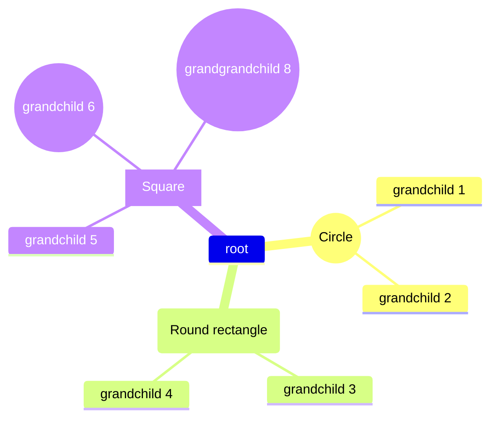
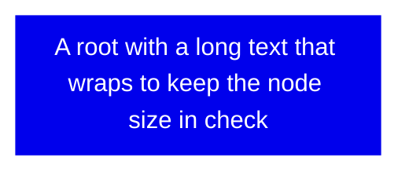

# mindmap

## Example 1

**SebastianJS (SVG):**

> Render failed: Error: Could not create canvas of type 2d

**Mermaid Code (Browser Rendered):**

## Example 2

**SebastianJS (SVG):**

> Render failed: Error: Could not create canvas of type 2d

**Mermaid Code (Browser Rendered):**

