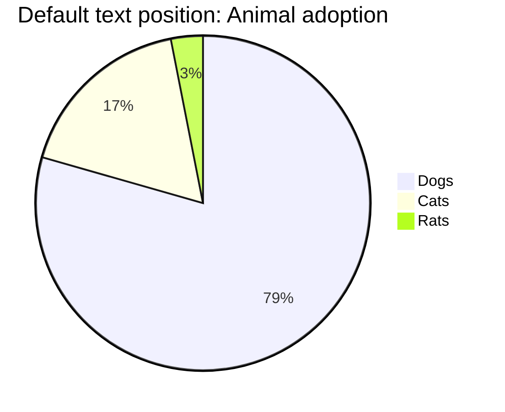
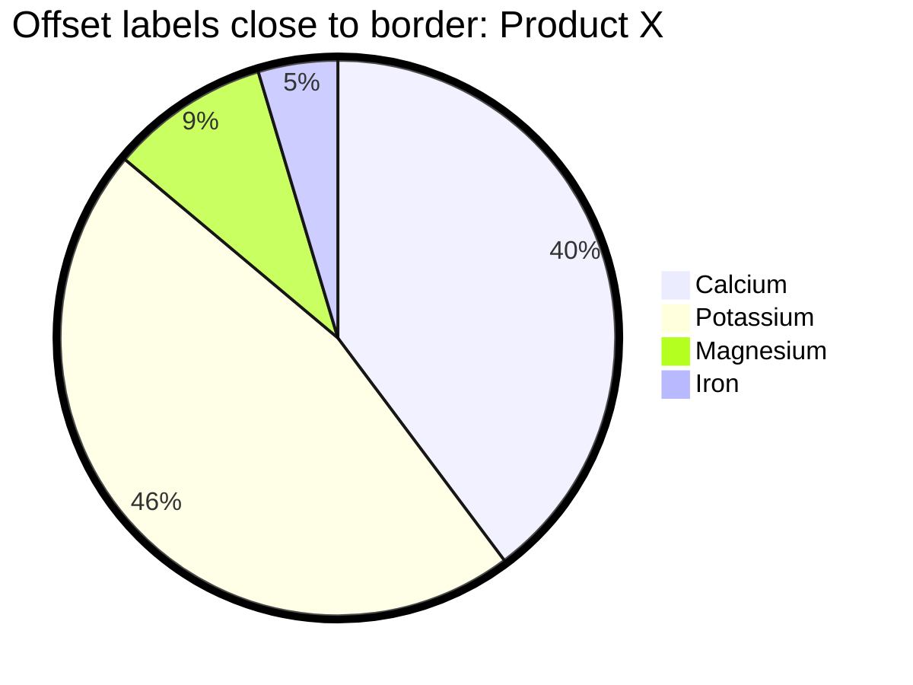
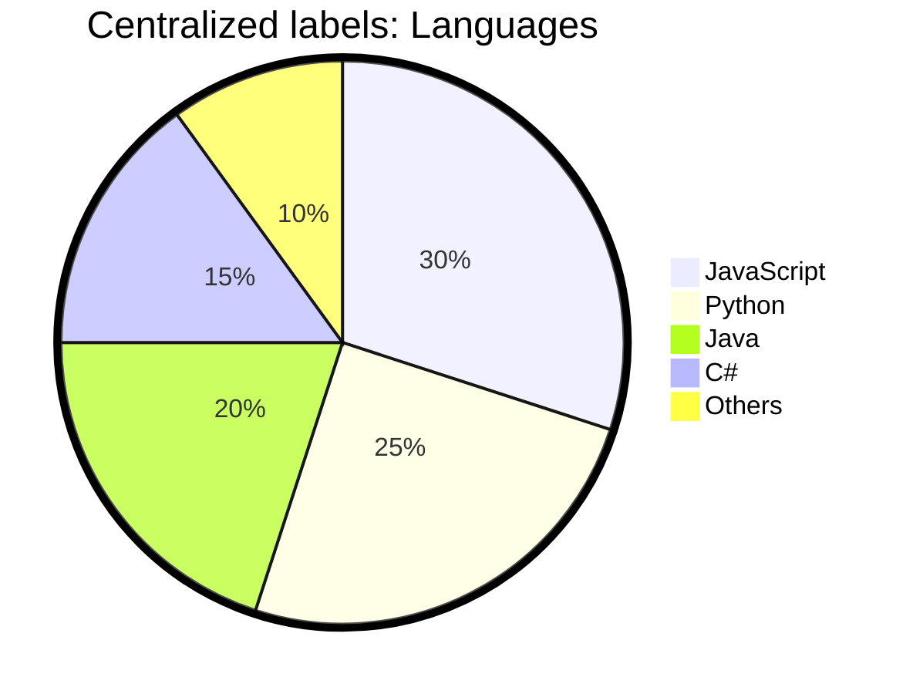

# pie

## Example 1

**SebastianJS (SVG):**

<svg id="graph" xmlns="http://www.w3.org/2000/svg" xmlns:xlink="http://www.w3.org/1999/xlink" viewBox="437 188 26 70" style="max-width: 512px;" role="graphics-document document" aria-roledescription="pie" aria-describedby="chart-desc-graph" aria-labelledby="chart-title-graph"><title id="chart-title-graph">simple pie char demo</title><desc id="chart-desc-graph">pie chart with 3 sections: dogs, cats, rats. Most are dogs.</desc><g/><g transform="translate(225,225)"><circle cx="0" cy="0" r="186" class="pieOuterCircle"/><path d="M0,-185A185,185,0,1,1,-177.899,-50.763L0,0Z" fill="#ECECFF" class="pieCircle"/><path d="M-177.899,-50.763A185,185,0,0,1,-35.652,-181.532L0,0Z" fill="#ffffde" class="pieCircle"/><path d="M-35.652,-181.532A185,185,0,0,1,0,-185L0,0Z" fill="hsl(80, 100%, 56.2745098039%)" class="pieCircle"/><text transform="translate(83.57344705444068,110.75667676234512)" style="text-anchor: middle;" class="slice">79%</text><text transform="translate(-93.90333582091016,-102.14561185731559)" style="text-anchor: middle;" class="slice">17%</text><text transform="translate(-13.432508310066218,-138.09826291630174)" style="text-anchor: middle;" class="slice">3%</text><text x="0" y="-200" class="pieTitleText">Default text position: Animal adoption</text><g class="legend" transform="translate(216,-33)"><rect width="18" height="18" style="fill: #ECECFF; stroke: #ECECFF;"/><text x="22" y="14">Dogs</text></g><g class="legend" transform="translate(216,-11)"><rect width="18" height="18" style="fill: #ffffde; stroke: #ffffde;"/><text x="22" y="14">Cats</text></g><g class="legend" transform="translate(216,11)"><rect width="18" height="18" style="fill: hsl(80, 100%, 56.2745098039%); stroke: hsl(80, 100%, 56.2745098039%);"/><text x="22" y="14">Rats</text></g></g></svg>

**Mermaid Code (Browser Rendered):**

## Example 2

**SebastianJS (SVG):**

<svg id="graph" xmlns="http://www.w3.org/2000/svg" xmlns:xlink="http://www.w3.org/1999/xlink" viewBox="437 177 26 92" style="max-width: 512px;" role="graphics-document document" aria-roledescription="pie" aria-describedby="chart-desc-graph" aria-labelledby="chart-title-graph"><title id="chart-title-graph">Key elements in Product X</title><desc id="chart-desc-graph">This is a pie chart showing the key elements in Product X.</desc><g/><g transform="translate(225,225)"><circle cx="0" cy="0" r="187.5" class="pieOuterCircle"/><path d="M0,-185A185,185,0,0,1,42.237,180.114L0,0Z" fill="#ECECFF" class="pieCircle"/><path d="M42.237,180.114A185,185,0,0,1,-141.768,-118.856L0,0Z" fill="#ffffde" class="pieCircle"/><path d="M-141.768,-118.856A185,185,0,0,1,-53.049,-177.231L0,0Z" fill="hsl(80, 100%, 56.2745098039%)" class="pieCircle"/><path d="M-53.049,-177.231A185,185,0,0,1,0,-185L0,0Z" fill="hsl(240, 100%, 86.2745098039%)" class="pieCircle"/><text transform="translate(165.39697358671748,-19.133507999179738)" style="text-anchor: middle;" class="slice">46%</text><text transform="translate(-141.79606745900372,87.27041453529178)" style="text-anchor: middle;" class="slice">40%</text><text transform="translate(-91.51871661483965,-139.09196421494906)" style="text-anchor: middle;" class="slice">9%</text><text transform="translate(-24.126718210156564,-164.74268259442573)" style="text-anchor: middle;" class="slice">5%</text><text x="0" y="-200" class="pieTitleText">Offset labels close to border: Product X</text><g class="legend" transform="translate(216,-44)"><rect width="18" height="18" style="fill: #ffffde; stroke: #ffffde;"/><text x="22" y="14">Calcium</text></g><g class="legend" transform="translate(216,-22)"><rect width="18" height="18" style="fill: #ECECFF; stroke: #ECECFF;"/><text x="22" y="14">Potassium</text></g><g class="legend" transform="translate(216,0)"><rect width="18" height="18" style="fill: hsl(80, 100%, 56.2745098039%); stroke: hsl(80, 100%, 56.2745098039%);"/><text x="22" y="14">Magnesium</text></g><g class="legend" transform="translate(216,22)"><rect width="18" height="18" style="fill: hsl(240, 100%, 86.2745098039%); stroke: hsl(240, 100%, 86.2745098039%);"/><text x="22" y="14">Iron</text></g></g></svg>

**Mermaid Code (Browser Rendered):**

## Example 3

**SebastianJS (SVG):**

<svg id="graph" xmlns="http://www.w3.org/2000/svg" xmlns:xlink="http://www.w3.org/1999/xlink" viewBox="437 166 26 114" style="max-width: 512px;" role="graphics-document document" aria-roledescription="pie" aria-describedby="chart-desc-graph" aria-labelledby="chart-title-graph"><title id="chart-title-graph">Key elements in Product X</title><desc id="chart-desc-graph">This is a pie chart showing the key elements in Product X.</desc><g/><g transform="translate(225,225)"><circle cx="0" cy="0" r="187.5" class="pieOuterCircle"/><path d="M0,-185A185,185,0,0,1,175.945,57.168L0,0Z" fill="#ECECFF" class="pieCircle"/><path d="M175.945,57.168A185,185,0,0,1,-57.168,175.945L0,0Z" fill="#ffffde" class="pieCircle"/><path d="M-57.168,175.945A185,185,0,0,1,-185,0L0,0Z" fill="hsl(80, 100%, 56.2745098039%)" class="pieCircle"/><path d="M-185,0A185,185,0,0,1,-108.74,-149.668L0,0Z" fill="hsl(240, 100%, 86.2745098039%)" class="pieCircle"/><path d="M-108.74,-149.668A185,185,0,0,1,0,-185L0,0Z" fill="hsl(60, 100%, 63.5294117647%)" class="pieCircle"/><text transform="translate(67.35066478171437,-48.93312225334838)" style="text-anchor: middle;" class="slice">30%</text><text transform="translate(37.79470910331724,74.17629313868164)" style="text-anchor: middle;" class="slice">25%</text><text transform="translate(-67.35066478171437,48.9331222533484)" style="text-anchor: middle;" class="slice">20%</text><text transform="translate(-74.17629313868163,-37.79470910331726)" style="text-anchor: middle;" class="slice">15%</text><text transform="translate(-25.725664781714386,-79.17545498157153)" style="text-anchor: middle;" class="slice">10%</text><text x="0" y="-200" class="pieTitleText">Centralized labels: Languages</text><g class="legend" transform="translate(216,-55)"><rect width="18" height="18" style="fill: #ECECFF; stroke: #ECECFF;"/><text x="22" y="14">JavaScript</text></g><g class="legend" transform="translate(216,-33)"><rect width="18" height="18" style="fill: #ffffde; stroke: #ffffde;"/><text x="22" y="14">Python</text></g><g class="legend" transform="translate(216,-11)"><rect width="18" height="18" style="fill: hsl(80, 100%, 56.2745098039%); stroke: hsl(80, 100%, 56.2745098039%);"/><text x="22" y="14">Java</text></g><g class="legend" transform="translate(216,11)"><rect width="18" height="18" style="fill: hsl(240, 100%, 86.2745098039%); stroke: hsl(240, 100%, 86.2745098039%);"/><text x="22" y="14">C#</text></g><g class="legend" transform="translate(216,33)"><rect width="18" height="18" style="fill: hsl(60, 100%, 63.5294117647%); stroke: hsl(60, 100%, 63.5294117647%);"/><text x="22" y="14">Others</text></g></g></svg>

**Mermaid Code (Browser Rendered):**

