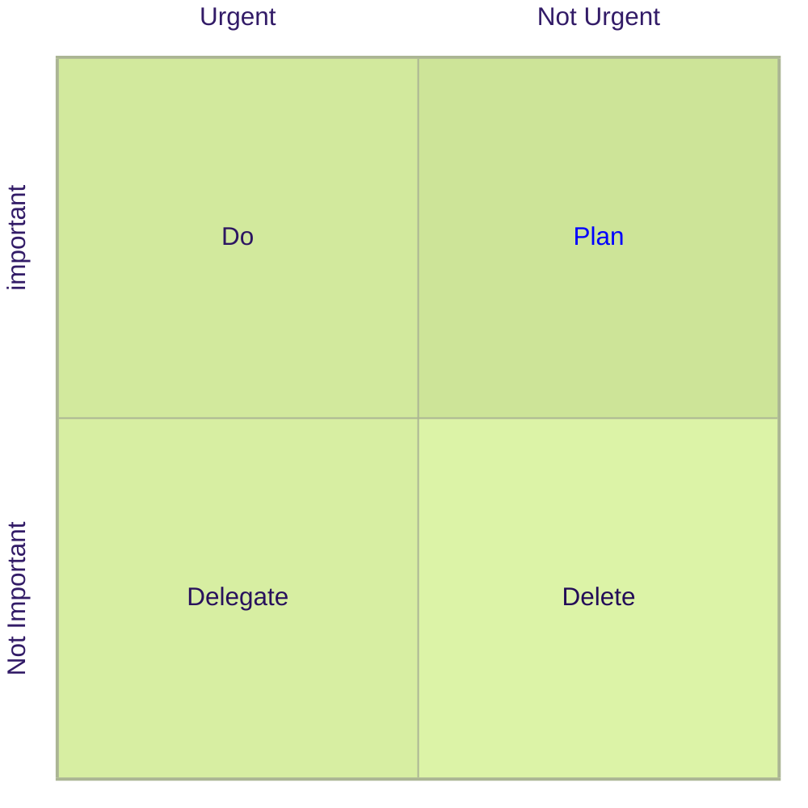
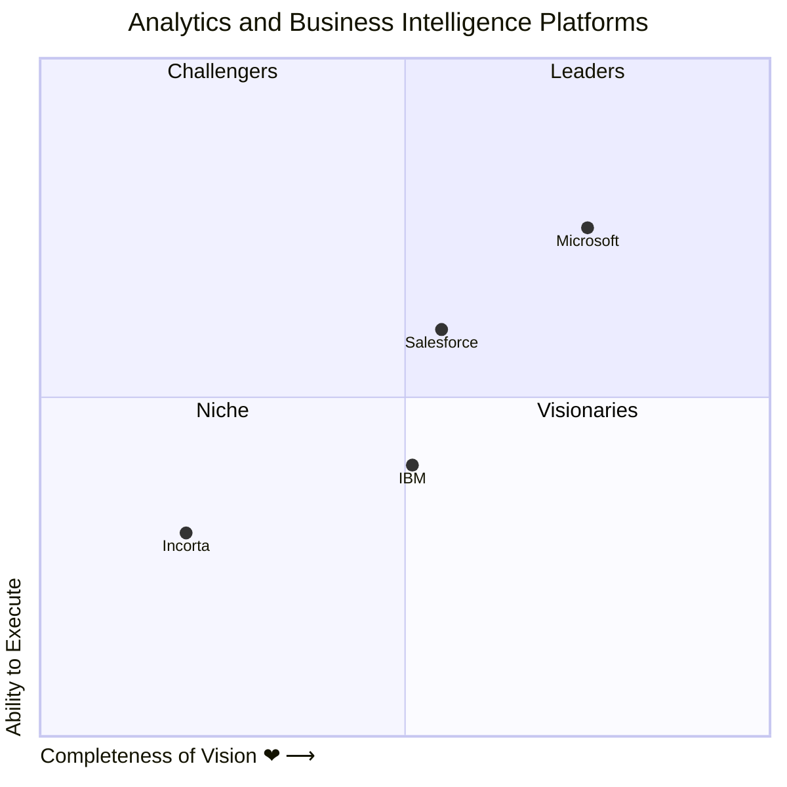

# quadrantchart

## Example 1

**SebastianJS (SVG):**

<svg id="graph" xmlns="http://www.w3.org/2000/svg" xmlns:xlink="http://www.w3.org/1999/xlink" style="max-width: 500px;" viewBox="32 32 462 462" role="graphics-document document" aria-roledescription="quadrantChart"><g/><g class="main"><g class="quadrants"><g class="quadrant"><rect x="263" y="36" width="227" height="227" fill="#cde498"/><text x="0" y="0" fill="blue" font-size="16" dominant-baseline="middle" text-anchor="middle" transform="translate(376.5, 149.5) rotate(0)">Plan</text></g><g class="quadrant"><rect x="36" y="36" width="227" height="227" fill="#d2e99d"/><text x="0" y="0" fill="#2d1662" font-size="16" dominant-baseline="middle" text-anchor="middle" transform="translate(149.5, 149.5) rotate(0)">Do</text></g><g class="quadrant"><rect x="36" y="263" width="227" height="227" fill="#d7eea2"/><text x="0" y="0" fill="#28115d" font-size="16" dominant-baseline="middle" text-anchor="middle" transform="translate(149.5, 376.5) rotate(0)">Delegate</text></g><g class="quadrant"><rect x="263" y="263" width="227" height="227" fill="#dcf3a7"/><text x="0" y="0" fill="#230c58" font-size="16" dominant-baseline="middle" text-anchor="middle" transform="translate(376.5, 376.5) rotate(0)">Delete</text></g></g><g class="border"><line x1="35" y1="36" x2="491" y2="36" style="stroke: hsl(78.1578947368, 18.4615384615%, 64.5098039216%); stroke-width: 2;"/><line x1="490" y1="37" x2="490" y2="489" style="stroke: hsl(78.1578947368, 18.4615384615%, 64.5098039216%); stroke-width: 2;"/><line x1="35" y1="490" x2="491" y2="490" style="stroke: hsl(78.1578947368, 18.4615384615%, 64.5098039216%); stroke-width: 2;"/><line x1="36" y1="37" x2="36" y2="489" style="stroke: hsl(78.1578947368, 18.4615384615%, 64.5098039216%); stroke-width: 2;"/><line x1="263" y1="37" x2="263" y2="489" style="stroke: hsl(78.1578947368, 18.4615384615%, 64.5098039216%); stroke-width: 1;"/><line x1="37" y1="263" x2="489" y2="263" style="stroke: hsl(78.1578947368, 18.4615384615%, 64.5098039216%); stroke-width: 1;"/></g><g class="data-points"/><g class="labels"><g class="label"><text x="0" y="0" fill="#321b67" font-size="16" dominant-baseline="hanging" text-anchor="middle" transform="translate(149.5, 5) rotate(0)">Urgent</text></g><g class="label"><text x="0" y="0" fill="#321b67" font-size="16" dominant-baseline="hanging" text-anchor="middle" transform="translate(376.5, 5) rotate(0)">Not Urgent</text></g><g class="label"><text x="0" y="0" fill="#321b67" font-size="16" dominant-baseline="hanging" text-anchor="middle" transform="translate(5, 376.5) rotate(-90)">Not Important</text></g><g class="label"><text x="0" y="0" fill="#321b67" font-size="16" dominant-baseline="hanging" text-anchor="middle" transform="translate(5, 149.5) rotate(-90)">important</text></g></g><g class="title"/></g></svg>

**Mermaid Code (Browser Rendered):**

## Example 2

**SebastianJS (SVG):**

<svg id="graph" xmlns="http://www.w3.org/2000/svg" xmlns:xlink="http://www.w3.org/1999/xlink" style="max-width: 600px;" viewBox="27 41 572 532" role="graphics-document document" aria-roledescription="quadrantChart"><g/><g class="main"><g class="quadrants"><g class="quadrant"><rect x="313" y="45" width="282" height="262" fill="#ECECFF"/><text x="0" y="0" fill="#131300" font-size="16" dominant-baseline="hanging" text-anchor="middle" transform="translate(454, 50) rotate(0)">Leaders</text></g><g class="quadrant"><rect x="31" y="45" width="282" height="262" fill="#f1f1ff"/><text x="0" y="0" fill="#0e0e00" font-size="16" dominant-baseline="hanging" text-anchor="middle" transform="translate(172, 50) rotate(0)">Challengers</text></g><g class="quadrant"><rect x="31" y="307" width="282" height="262" fill="#f6f6ff"/><text x="0" y="0" fill="#090900" font-size="16" dominant-baseline="hanging" text-anchor="middle" transform="translate(172, 312) rotate(0)">Niche</text></g><g class="quadrant"><rect x="313" y="307" width="282" height="262" fill="#fbfbff"/><text x="0" y="0" fill="#040400" font-size="16" dominant-baseline="hanging" text-anchor="middle" transform="translate(454, 312) rotate(0)">Visionaries</text></g></g><g class="border"><line x1="30" y1="45" x2="596" y2="45" style="stroke: hsl(240, 60%, 86.2745098039%); stroke-width: 2;"/><line x1="595" y1="46" x2="595" y2="568" style="stroke: hsl(240, 60%, 86.2745098039%); stroke-width: 2;"/><line x1="30" y1="569" x2="596" y2="569" style="stroke: hsl(240, 60%, 86.2745098039%); stroke-width: 2;"/><line x1="31" y1="46" x2="31" y2="568" style="stroke: hsl(240, 60%, 86.2745098039%); stroke-width: 2;"/><line x1="313" y1="46" x2="313" y2="568" style="stroke: hsl(240, 60%, 86.2745098039%); stroke-width: 1;"/><line x1="32" y1="307" x2="594" y2="307" style="stroke: hsl(240, 60%, 86.2745098039%); stroke-width: 1;"/></g><g class="data-points"><g class="data-point"><circle cx="143.8" cy="411.79999999999995" r="5" fill="hsl(240, 100%, NaN%)" stroke="hsl(240, 100%, NaN%)" stroke-width="0px"/><text x="0" y="0" fill="#131300" font-size="12" dominant-baseline="hanging" text-anchor="middle" transform="translate(143.8, 416.79999999999995) rotate(0)">Incorta</text></g><g class="data-point"><circle cx="318.64" cy="359.4" r="5" fill="hsl(240, 100%, NaN%)" stroke="hsl(240, 100%, NaN%)" stroke-width="0px"/><text x="0" y="0" fill="#131300" font-size="12" dominant-baseline="hanging" text-anchor="middle" transform="translate(318.64, 364.4) rotate(0)">IBM</text></g><g class="data-point"><circle cx="341.2" cy="254.60000000000002" r="5" fill="hsl(240, 100%, NaN%)" stroke="hsl(240, 100%, NaN%)" stroke-width="0px"/><text x="0" y="0" fill="#131300" font-size="12" dominant-baseline="hanging" text-anchor="middle" transform="translate(341.2, 259.6) rotate(0)">Salesforce</text></g><g class="data-point"><circle cx="454" cy="176" r="5" fill="hsl(240, 100%, NaN%)" stroke="hsl(240, 100%, NaN%)" stroke-width="0px"/><text x="0" y="0" fill="#131300" font-size="12" dominant-baseline="hanging" text-anchor="middle" transform="translate(454, 181) rotate(0)">Microsoft</text></g></g><g class="labels"><g class="label"><text x="0" y="0" fill="#131300" font-size="16" dominant-baseline="hanging" text-anchor="start" transform="translate(31, 579) rotate(0)">Completeness of Vision ❤ ⟶</text></g><g class="label"><text x="0" y="0" fill="#131300" font-size="16" dominant-baseline="hanging" text-anchor="start" transform="translate(5, 569) rotate(-90)">Ability to Execute</text></g></g><g class="title"><text x="0" y="0" fill="#131300" font-size="20" dominant-baseline="hanging" text-anchor="middle" transform="translate(300, 10) rotate(0)">Analytics and Business Intelligence Platforms</text></g></g></svg>

**Mermaid Code (Browser Rendered):**

