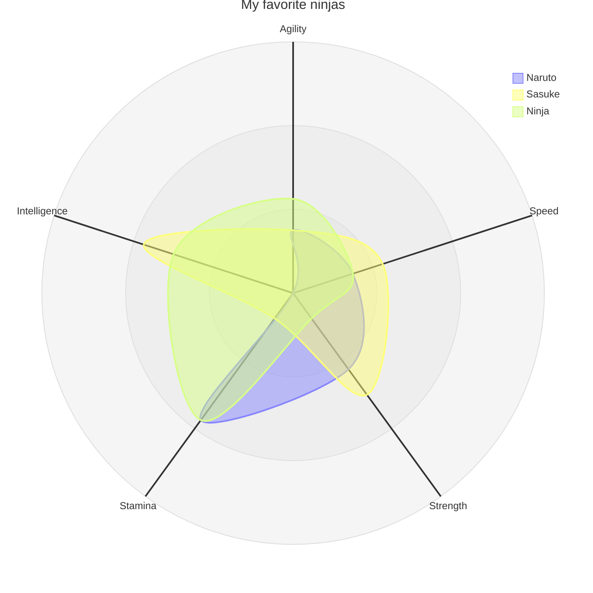
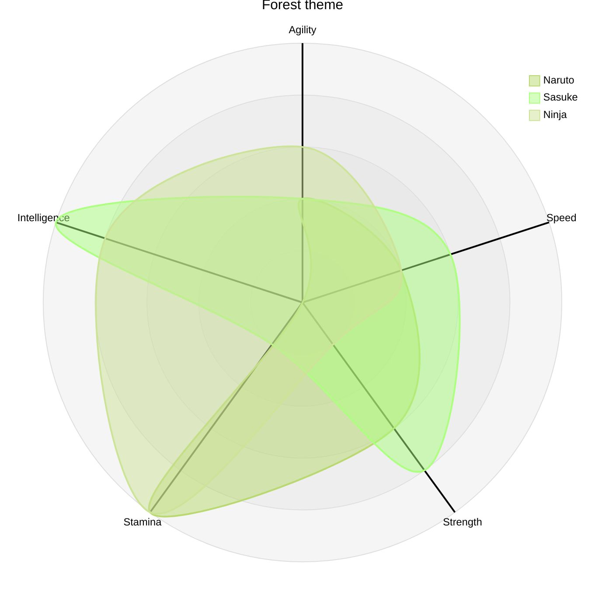
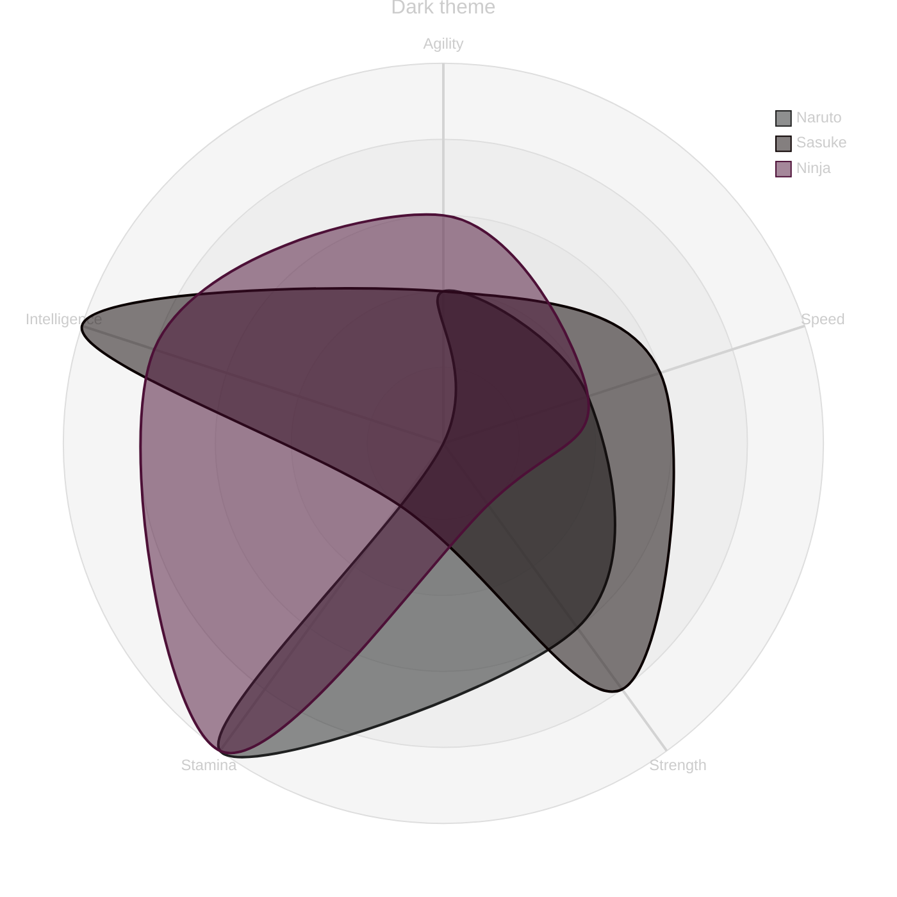
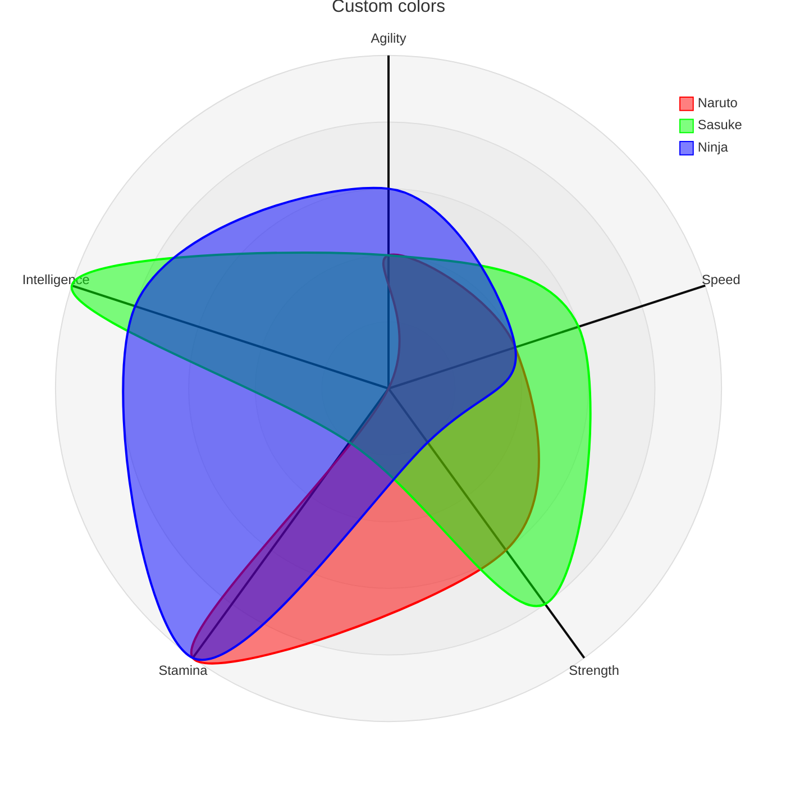

# radar

## Example 1

**SebastianJS (SVG):**

> Render failed: TypeError: DOMPurify.sanitize is not a function

**Mermaid Code (Browser Rendered):**



## Example 2

**SebastianJS (SVG):**

> Render failed: Error: Diagrams beginning with --- are not valid. If you were trying to use a YAML front-matter, please ensure that you've correctly opened and closed the YAML front-matter with un-indented `---` blocks

**Mermaid Code (Browser Rendered):**

```mermaid
---
      config:
        radar:
          axisScaleFactor: 0.25
          axisLabelFactor: 0.95
      ---
      radar-beta 
        title DevOps Radar
        axis f["Feature Velocity"], s["Stability"]
        axis r["Resilience"], e["Efficiency"]
        axis c["Cost"], d["DevSecOps"]
      
        curve app1["App1"]{
          f 5, s 4.5, r 3.8, d 4.2, e 4.5, c 3.5
        }
        curve app2["App2"]{4, 3, 4, 3, 3, 4}, app3["App3"]{3, 2, 4, 3, 2, 3}
        curve app4["App4"]{2, 1, 3.2, 2.5, 1, 2}
      
        showLegend true
        ticks 3
        max 5
        graticule polygon
```

## Example 3

**SebastianJS (SVG):**

> Render failed: TypeError: DOMPurify.sanitize is not a function

**Mermaid Code (Browser Rendered):**



## Example 4

**SebastianJS (SVG):**

> Render failed: TypeError: DOMPurify.sanitize is not a function

**Mermaid Code (Browser Rendered):**



## Example 5

**SebastianJS (SVG):**

> Render failed: TypeError: DOMPurify.sanitize is not a function

**Mermaid Code (Browser Rendered):**



## Example 6

**SebastianJS (SVG):**

> Render failed: Error: Diagrams beginning with --- are not valid. If you were trying to use a YAML front-matter, please ensure that you've correctly opened and closed the YAML front-matter with un-indented `---` blocks

**Mermaid Code (Browser Rendered):**

```mermaid
---
      config:
        radar:
          axisScaleFactor: 0.25
          curveTension: 0.1
        theme: base
        themeVariables:
          cScale0: "#FF0000"
          cScale1: "#00FF00"
          cScale2: "#0000FF"
          radar:
            curveOpacity: 0
      ---
      radar-beta
        title Custom colors, axisScaleFactor, curveTension, opacity
        axis A, B, C, D, E
        curve c1{1,2,3,4,5}
        curve c2{5,4,3,2,1}
        curve c3{3,3,3,3,3}
```

