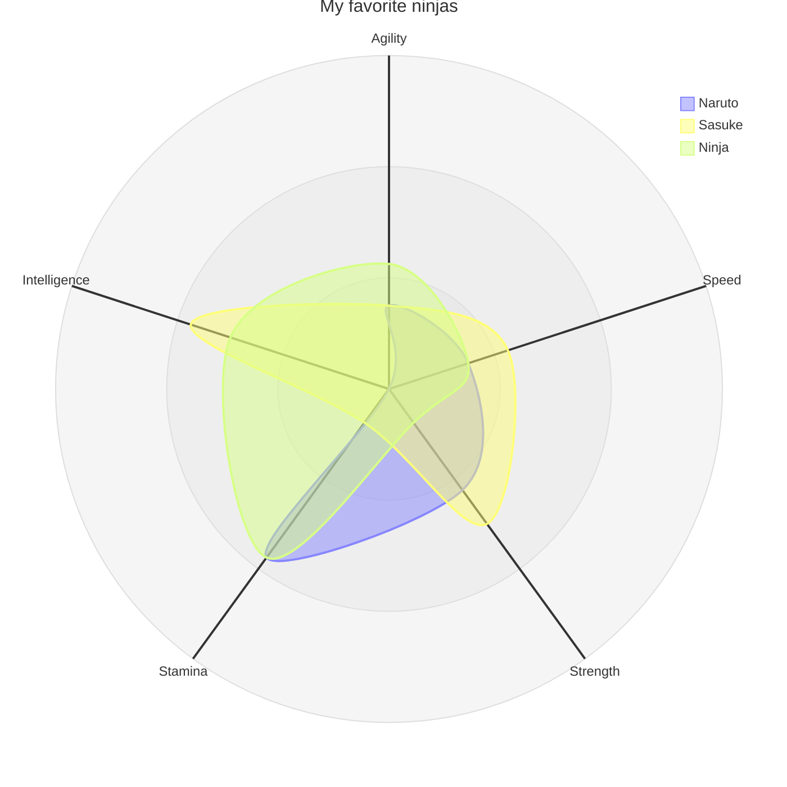
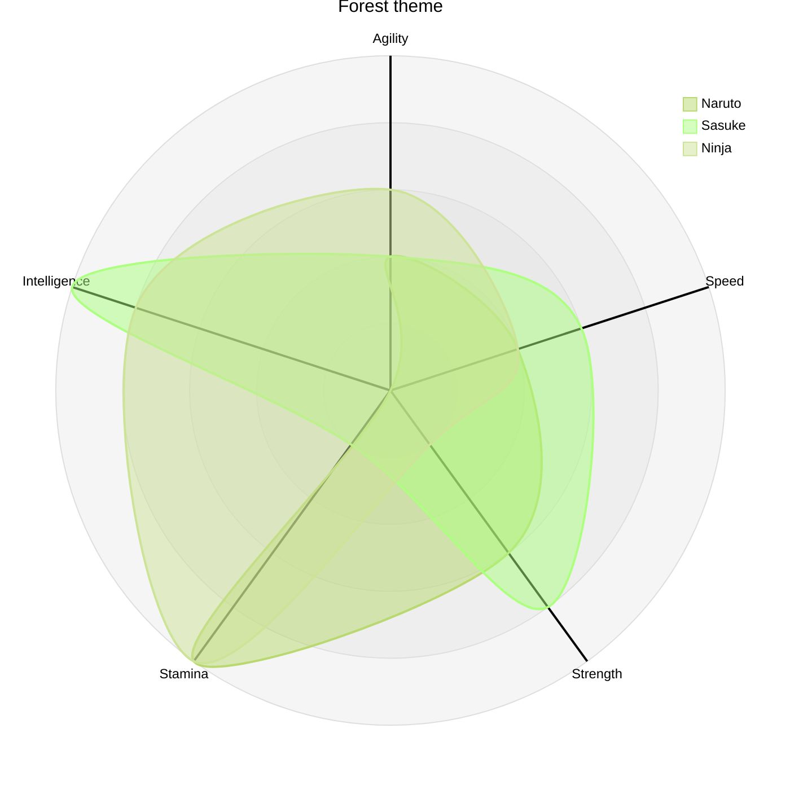
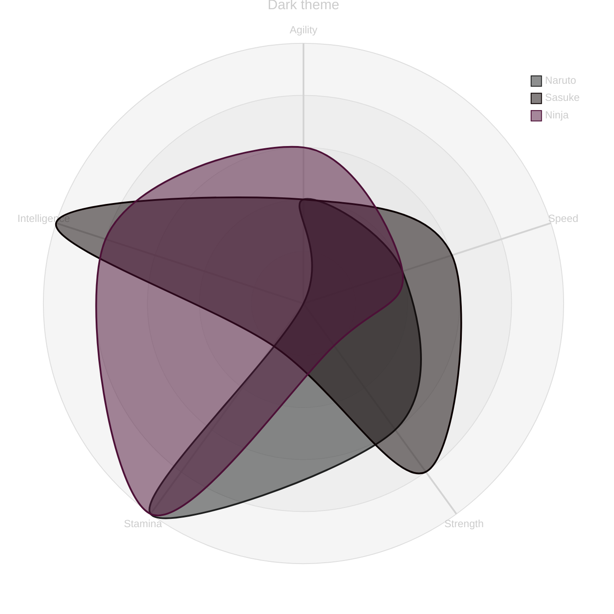
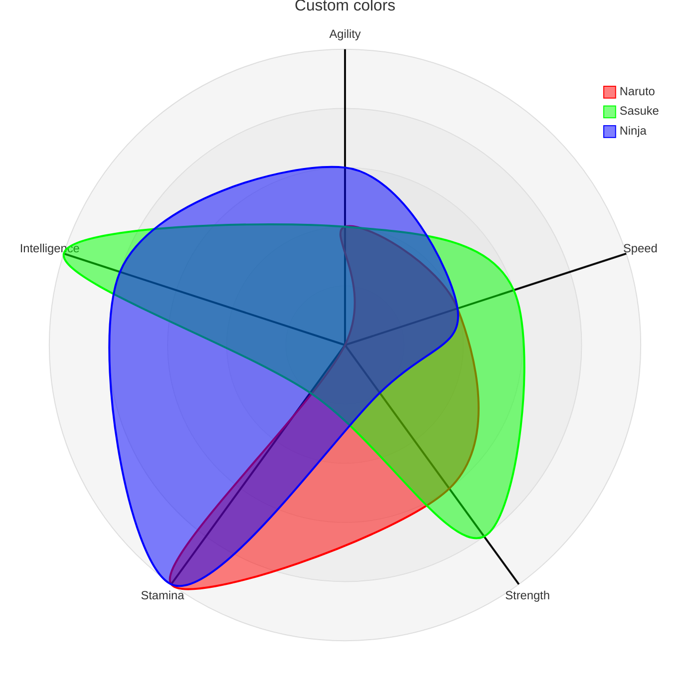

# radar

## Example 1

**SebastianJS (SVG):**

<svg id="graph" xmlns="http://www.w3.org/2000/svg" xmlns:xlink="http://www.w3.org/1999/xlink" viewbox="0 0 700 700" role="graphics-document document" aria-roledescription="radar" viewBox="608 83 20 60"><style>#graph{font-family:"trebuchet ms",verdana,arial,sans-serif;font-size:16px;fill:#333;}@keyframes edge-animation-frame{from{stroke-dashoffset:0;}}@keyframes dash{to{stroke-dashoffset:0;}}#graph .edge-animation-slow{stroke-dasharray:9,5!important;stroke-dashoffset:900;animation:dash 50s linear infinite;stroke-linecap:round;}#graph .edge-animation-fast{stroke-dasharray:9,5!important;stroke-dashoffset:900;animation:dash 20s linear infinite;stroke-linecap:round;}#graph .error-icon{fill:#552222;}#graph .error-text{fill:#552222;stroke:#552222;}#graph .edge-thickness-normal{stroke-width:1px;}#graph .edge-thickness-thick{stroke-width:3.5px;}#graph .edge-pattern-solid{stroke-dasharray:0;}#graph .edge-thickness-invisible{stroke-width:0;fill:none;}#graph .edge-pattern-dashed{stroke-dasharray:3;}#graph .edge-pattern-dotted{stroke-dasharray:2;}#graph .marker{fill:#333333;stroke:#333333;}#graph .marker.cross{stroke:#333333;}#graph svg{font-family:"trebuchet ms",verdana,arial,sans-serif;font-size:16px;}#graph p{margin:0;}#graph .radarTitle{font-size:16px;color:#333;dominant-baseline:hanging;text-anchor:middle;}#graph .radarAxisLine{stroke:#333333;stroke-width:2;}#graph .radarAxisLabel{dominant-baseline:middle;text-anchor:middle;font-size:12px;color:#333333;}#graph .radarGraticule{fill:#DEDEDE;fill-opacity:0.3;stroke:#DEDEDE;stroke-width:1;}#graph .radarLegendText{text-anchor:start;font-size:12px;dominant-baseline:hanging;}#graph .radarCurve-0{color:hsl(240, 100%, 76.2745098039%);fill:hsl(240, 100%, 76.2745098039%);fill-opacity:0.5;stroke:hsl(240, 100%, 76.2745098039%);stroke-width:2;}#graph .radarLegendBox-0{fill:hsl(240, 100%, 76.2745098039%);fill-opacity:0.5;stroke:hsl(240, 100%, 76.2745098039%);}#graph .radarCurve-1{color:hsl(60, 100%, 73.5294117647%);fill:hsl(60, 100%, 73.5294117647%);fill-opacity:0.5;stroke:hsl(60, 100%, 73.5294117647%);stroke-width:2;}#graph .radarLegendBox-1{fill:hsl(60, 100%, 73.5294117647%);fill-opacity:0.5;stroke:hsl(60, 100%, 73.5294117647%);}#graph .radarCurve-2{color:hsl(80, 100%, 76.2745098039%);fill:hsl(80, 100%, 76.2745098039%);fill-opacity:0.5;stroke:hsl(80, 100%, 76.2745098039%);stroke-width:2;}#graph .radarLegendBox-2{fill:hsl(80, 100%, 76.2745098039%);fill-opacity:0.5;stroke:hsl(80, 100%, 76.2745098039%);}#graph .radarCurve-3{color:hsl(270, 100%, 76.2745098039%);fill:hsl(270, 100%, 76.2745098039%);fill-opacity:0.5;stroke:hsl(270, 100%, 76.2745098039%);stroke-width:2;}#graph .radarLegendBox-3{fill:hsl(270, 100%, 76.2745098039%);fill-opacity:0.5;stroke:hsl(270, 100%, 76.2745098039%);}#graph .radarCurve-4{color:hsl(300, 100%, 76.2745098039%);fill:hsl(300, 100%, 76.2745098039%);fill-opacity:0.5;stroke:hsl(300, 100%, 76.2745098039%);stroke-width:2;}#graph .radarLegendBox-4{fill:hsl(300, 100%, 76.2745098039%);fill-opacity:0.5;stroke:hsl(300, 100%, 76.2745098039%);}#graph .radarCurve-5{color:hsl(330, 100%, 76.2745098039%);fill:hsl(330, 100%, 76.2745098039%);fill-opacity:0.5;stroke:hsl(330, 100%, 76.2745098039%);stroke-width:2;}#graph .radarLegendBox-5{fill:hsl(330, 100%, 76.2745098039%);fill-opacity:0.5;stroke:hsl(330, 100%, 76.2745098039%);}#graph .radarCurve-6{color:hsl(0, 100%, 76.2745098039%);fill:hsl(0, 100%, 76.2745098039%);fill-opacity:0.5;stroke:hsl(0, 100%, 76.2745098039%);stroke-width:2;}#graph .radarLegendBox-6{fill:hsl(0, 100%, 76.2745098039%);fill-opacity:0.5;stroke:hsl(0, 100%, 76.2745098039%);}#graph .radarCurve-7{color:hsl(30, 100%, 76.2745098039%);fill:hsl(30, 100%, 76.2745098039%);fill-opacity:0.5;stroke:hsl(30, 100%, 76.2745098039%);stroke-width:2;}#graph .radarLegendBox-7{fill:hsl(30, 100%, 76.2745098039%);fill-opacity:0.5;stroke:hsl(30, 100%, 76.2745098039%);}#graph .radarCurve-8{color:hsl(90, 100%, 76.2745098039%);fill:hsl(90, 100%, 76.2745098039%);fill-opacity:0.5;stroke:hsl(90, 100%, 76.2745098039%);stroke-width:2;}#graph .radarLegendBox-8{fill:hsl(90, 100%, 76.2745098039%);fill-opacity:0.5;stroke:hsl(90, 100%, 76.2745098039%);}#graph .radarCurve-9{color:hsl(150, 100%, 76.2745098039%);fill:hsl(150, 100%, 76.2745098039%);fill-opacity:0.5;stroke:hsl(150, 100%, 76.2745098039%);stroke-width:2;}#graph .radarLegendBox-9{fill:hsl(150, 100%, 76.2745098039%);fill-opacity:0.5;stroke:hsl(150, 100%, 76.2745098039%);}#graph .radarCurve-10{color:hsl(180, 100%, 76.2745098039%);fill:hsl(180, 100%, 76.2745098039%);fill-opacity:0.5;stroke:hsl(180, 100%, 76.2745098039%);stroke-width:2;}#graph .radarLegendBox-10{fill:hsl(180, 100%, 76.2745098039%);fill-opacity:0.5;stroke:hsl(180, 100%, 76.2745098039%);}#graph .radarCurve-11{color:hsl(210, 100%, 76.2745098039%);fill:hsl(210, 100%, 76.2745098039%);fill-opacity:0.5;stroke:hsl(210, 100%, 76.2745098039%);stroke-width:2;}#graph .radarLegendBox-11{fill:hsl(210, 100%, 76.2745098039%);fill-opacity:0.5;stroke:hsl(210, 100%, 76.2745098039%);}#graph :root{--mermaid-font-family:"trebuchet ms",verdana,arial,sans-serif;}</style><g/><g transform="translate(350, 350)"><circle r="100" class="radarGraticule"/><circle r="200" class="radarGraticule"/><circle r="300" class="radarGraticule"/><line x1="0" y1="0" x2="1.8369701987210297e-14" y2="-300" class="radarAxisLine"/><text x="1.9288187086570814e-14" y="-315" class="radarAxisLabel">Agility</text><line x1="0" y1="0" x2="285.31695488854604" y2="-92.70509831248422" class="radarAxisLine"/><text x="299.58280263297337" y="-97.34035322810843" class="radarAxisLabel">Speed</text><line x1="0" y1="0" x2="176.33557568774194" y2="242.70509831248424" class="radarAxisLine"/><text x="185.15235447212905" y="254.84035322810846" class="radarAxisLabel">Strength</text><line x1="0" y1="0" x2="-176.3355756877419" y2="242.70509831248424" class="radarAxisLine"/><text x="-185.152354472129" y="254.84035322810846" class="radarAxisLabel">Stamina</text><line x1="0" y1="0" x2="-285.3169548885461" y2="-92.70509831248418" class="radarAxisLine"/><text x="-299.5828026329734" y="-97.3403532281084" class="radarAxisLabel">Intelligence</text><path d="M4.592425496802574e-15,-75 C12.125970582763212,-78.93996667828058 60.08784577204296,-51.39872459554193 71.32923872213651,-23.176274578121056 C82.57063167223006,5.046175439299816 96.98746638248902,61.28702849319956 66.12584088290323,91.0144118671816 C35.26421538331745,120.74179524116363 -98.96834185474513,167.16313646272351 -110.20973480483869,151.69068644530265 C-121.45112775493224,136.21823642788178 -18.73565491682258,38.53741669570145 0,0 C18.73565491682258,-38.53741669570145 -12.125970582763202,-71.06003332171942 4.592425496802574e-15,-75 Z" class="radarCurve-0"/><path d="M4.592425496802574e-15,-75 C48.50388233105284,-71.06003332171943 92.0053341497467,-68.14434522374273 106.99385808320477,-34.76441186718158 C121.98238201666284,-1.3844785106204185 110.1038747013803,110.28511579968097 88.16778784387097,121.35254915624212 C66.23170098636163,132.41998251280327 23.26150342939835,60.81798734132313 -22.04194696096774,30.33813728906053 C-67.34539735133383,-0.14171276320207582 -182.07022778870584,-40.033203106162325 -178.32309680534132,-57.94068644530262 C-174.5759658219768,-75.84816978444292 -48.50388233105283,-78.93996667828057 4.592425496802574e-15,-75 Z" class="radarCurve-1"/><path d="M6.8886382452038615e-15,-112.5 C36.377911748289634,-108.56003332171943 67.582107738772,-47.45875791726135 71.32923872213651,-23.176274578121056 C75.07636970550102,1.1062087610192357 52.903572460553534,0.6107539150784973 22.041946960967742,30.33813728906053 C-8.819678538618046,60.06552066304256 -82.21066265594774,164.72810314100408 -110.20973480483869,151.69068644530265 C-138.20880695372963,138.6532697496012 -161.39413236109561,-1.4401324605406458 -142.65847744427305,-46.35254915624209 C-123.92282252745046,-91.26496585194354 -36.37791174828962,-116.43996667828057 6.8886382452038615e-15,-112.5 Z" class="radarCurve-2"/><g transform="translate(262.5, -262.5)"><rect width="12" height="12" class="radarLegendBox-0"/><text x="16" y="0" class="radarLegendText">Naruto</text></g><g transform="translate(262.5, -242.5)"><rect width="12" height="12" class="radarLegendBox-1"/><text x="16" y="0" class="radarLegendText">Sasuke</text></g><g transform="translate(262.5, -222.5)"><rect width="12" height="12" class="radarLegendBox-2"/><text x="16" y="0" class="radarLegendText">Ninja</text></g><text class="radarTitle" x="0" y="-350">My favorite ninjas</text></g></svg>

**Mermaid Code (Browser Rendered):**



## Example 2

**SebastianJS (SVG):**

> Render failed: Error: Diagrams beginning with --- are not valid. If you were trying to use a YAML front-matter, please ensure that you've correctly opened and closed the YAML front-matter with un-indented `---` blocks

**Mermaid Code (Browser Rendered):**

```mermaid
---
      config:
        radar:
          axisScaleFactor: 0.25
          axisLabelFactor: 0.95
      ---
      radar-beta 
        title DevOps Radar
        axis f["Feature Velocity"], s["Stability"]
        axis r["Resilience"], e["Efficiency"]
        axis c["Cost"], d["DevSecOps"]
      
        curve app1["App1"]{
          f 5, s 4.5, r 3.8, d 4.2, e 4.5, c 3.5
        }
        curve app2["App2"]{4, 3, 4, 3, 3, 4}, app3["App3"]{3, 2, 4, 3, 2, 3}
        curve app4["App4"]{2, 1, 3.2, 2.5, 1, 2}
      
        showLegend true
        ticks 3
        max 5
        graticule polygon
```

## Example 3

**SebastianJS (SVG):**

<svg id="graph" xmlns="http://www.w3.org/2000/svg" xmlns:xlink="http://www.w3.org/1999/xlink" viewbox="0 0 700 700" role="graphics-document document" aria-roledescription="radar" viewBox="608 83 20 60"><style>#graph{font-family:"trebuchet ms",verdana,arial,sans-serif;font-size:16px;fill:#000000;}@keyframes edge-animation-frame{from{stroke-dashoffset:0;}}@keyframes dash{to{stroke-dashoffset:0;}}#graph .edge-animation-slow{stroke-dasharray:9,5!important;stroke-dashoffset:900;animation:dash 50s linear infinite;stroke-linecap:round;}#graph .edge-animation-fast{stroke-dasharray:9,5!important;stroke-dashoffset:900;animation:dash 20s linear infinite;stroke-linecap:round;}#graph .error-icon{fill:#552222;}#graph .error-text{fill:#552222;stroke:#552222;}#graph .edge-thickness-normal{stroke-width:1px;}#graph .edge-thickness-thick{stroke-width:3.5px;}#graph .edge-pattern-solid{stroke-dasharray:0;}#graph .edge-thickness-invisible{stroke-width:0;fill:none;}#graph .edge-pattern-dashed{stroke-dasharray:3;}#graph .edge-pattern-dotted{stroke-dasharray:2;}#graph .marker{fill:#000000;stroke:#000000;}#graph .marker.cross{stroke:#000000;}#graph svg{font-family:"trebuchet ms",verdana,arial,sans-serif;font-size:16px;}#graph p{margin:0;}#graph .radarTitle{font-size:16px;color:#333;dominant-baseline:hanging;text-anchor:middle;}#graph .radarAxisLine{stroke:#000000;stroke-width:2;}#graph .radarAxisLabel{dominant-baseline:middle;text-anchor:middle;font-size:12px;color:#000000;}#graph .radarGraticule{fill:#DEDEDE;fill-opacity:0.3;stroke:#DEDEDE;stroke-width:1;}#graph .radarLegendText{text-anchor:start;font-size:12px;dominant-baseline:hanging;}#graph .radarCurve-0{color:hsl(78.1578947368, 58.4615384615%, 64.5098039216%);fill:hsl(78.1578947368, 58.4615384615%, 64.5098039216%);fill-opacity:0.5;stroke:hsl(78.1578947368, 58.4615384615%, 64.5098039216%);stroke-width:2;}#graph .radarLegendBox-0{fill:hsl(78.1578947368, 58.4615384615%, 64.5098039216%);fill-opacity:0.5;stroke:hsl(78.1578947368, 58.4615384615%, 64.5098039216%);}#graph .radarCurve-1{color:hsl(98.961038961, 100%, 74.9019607843%);fill:hsl(98.961038961, 100%, 74.9019607843%);fill-opacity:0.5;stroke:hsl(98.961038961, 100%, 74.9019607843%);stroke-width:2;}#graph .radarLegendBox-1{fill:hsl(98.961038961, 100%, 74.9019607843%);fill-opacity:0.5;stroke:hsl(98.961038961, 100%, 74.9019607843%);}#graph .radarCurve-2{color:hsl(78.1578947368, 58.4615384615%, 74.5098039216%);fill:hsl(78.1578947368, 58.4615384615%, 74.5098039216%);fill-opacity:0.5;stroke:hsl(78.1578947368, 58.4615384615%, 74.5098039216%);stroke-width:2;}#graph .radarLegendBox-2{fill:hsl(78.1578947368, 58.4615384615%, 74.5098039216%);fill-opacity:0.5;stroke:hsl(78.1578947368, 58.4615384615%, 74.5098039216%);}#graph .radarCurve-3{color:hsl(108.1578947368, 58.4615384615%, 64.5098039216%);fill:hsl(108.1578947368, 58.4615384615%, 64.5098039216%);fill-opacity:0.5;stroke:hsl(108.1578947368, 58.4615384615%, 64.5098039216%);stroke-width:2;}#graph .radarLegendBox-3{fill:hsl(108.1578947368, 58.4615384615%, 64.5098039216%);fill-opacity:0.5;stroke:hsl(108.1578947368, 58.4615384615%, 64.5098039216%);}#graph .radarCurve-4{color:hsl(138.1578947368, 58.4615384615%, 64.5098039216%);fill:hsl(138.1578947368, 58.4615384615%, 64.5098039216%);fill-opacity:0.5;stroke:hsl(138.1578947368, 58.4615384615%, 64.5098039216%);stroke-width:2;}#graph .radarLegendBox-4{fill:hsl(138.1578947368, 58.4615384615%, 64.5098039216%);fill-opacity:0.5;stroke:hsl(138.1578947368, 58.4615384615%, 64.5098039216%);}#graph .radarCurve-5{color:hsl(168.1578947368, 58.4615384615%, 64.5098039216%);fill:hsl(168.1578947368, 58.4615384615%, 64.5098039216%);fill-opacity:0.5;stroke:hsl(168.1578947368, 58.4615384615%, 64.5098039216%);stroke-width:2;}#graph .radarLegendBox-5{fill:hsl(168.1578947368, 58.4615384615%, 64.5098039216%);fill-opacity:0.5;stroke:hsl(168.1578947368, 58.4615384615%, 64.5098039216%);}#graph .radarCurve-6{color:hsl(198.1578947368, 58.4615384615%, 64.5098039216%);fill:hsl(198.1578947368, 58.4615384615%, 64.5098039216%);fill-opacity:0.5;stroke:hsl(198.1578947368, 58.4615384615%, 64.5098039216%);stroke-width:2;}#graph .radarLegendBox-6{fill:hsl(198.1578947368, 58.4615384615%, 64.5098039216%);fill-opacity:0.5;stroke:hsl(198.1578947368, 58.4615384615%, 64.5098039216%);}#graph .radarCurve-7{color:hsl(228.1578947368, 58.4615384615%, 64.5098039216%);fill:hsl(228.1578947368, 58.4615384615%, 64.5098039216%);fill-opacity:0.5;stroke:hsl(228.1578947368, 58.4615384615%, 64.5098039216%);stroke-width:2;}#graph .radarLegendBox-7{fill:hsl(228.1578947368, 58.4615384615%, 64.5098039216%);fill-opacity:0.5;stroke:hsl(228.1578947368, 58.4615384615%, 64.5098039216%);}#graph .radarCurve-8{color:hsl(288.1578947368, 58.4615384615%, 64.5098039216%);fill:hsl(288.1578947368, 58.4615384615%, 64.5098039216%);fill-opacity:0.5;stroke:hsl(288.1578947368, 58.4615384615%, 64.5098039216%);stroke-width:2;}#graph .radarLegendBox-8{fill:hsl(288.1578947368, 58.4615384615%, 64.5098039216%);fill-opacity:0.5;stroke:hsl(288.1578947368, 58.4615384615%, 64.5098039216%);}#graph .radarCurve-9{color:hsl(348.1578947368, 58.4615384615%, 64.5098039216%);fill:hsl(348.1578947368, 58.4615384615%, 64.5098039216%);fill-opacity:0.5;stroke:hsl(348.1578947368, 58.4615384615%, 64.5098039216%);stroke-width:2;}#graph .radarLegendBox-9{fill:hsl(348.1578947368, 58.4615384615%, 64.5098039216%);fill-opacity:0.5;stroke:hsl(348.1578947368, 58.4615384615%, 64.5098039216%);}#graph .radarCurve-10{color:hsl(18.1578947368, 58.4615384615%, 64.5098039216%);fill:hsl(18.1578947368, 58.4615384615%, 64.5098039216%);fill-opacity:0.5;stroke:hsl(18.1578947368, 58.4615384615%, 64.5098039216%);stroke-width:2;}#graph .radarLegendBox-10{fill:hsl(18.1578947368, 58.4615384615%, 64.5098039216%);fill-opacity:0.5;stroke:hsl(18.1578947368, 58.4615384615%, 64.5098039216%);}#graph .radarCurve-11{color:hsl(48.1578947368, 58.4615384615%, 64.5098039216%);fill:hsl(48.1578947368, 58.4615384615%, 64.5098039216%);fill-opacity:0.5;stroke:hsl(48.1578947368, 58.4615384615%, 64.5098039216%);stroke-width:2;}#graph .radarLegendBox-11{fill:hsl(48.1578947368, 58.4615384615%, 64.5098039216%);fill-opacity:0.5;stroke:hsl(48.1578947368, 58.4615384615%, 64.5098039216%);}#graph :root{--mermaid-font-family:"trebuchet ms",verdana,arial,sans-serif;}</style><g/><g transform="translate(350, 350)"><circle r="60" class="radarGraticule"/><circle r="120" class="radarGraticule"/><circle r="180" class="radarGraticule"/><circle r="240" class="radarGraticule"/><circle r="300" class="radarGraticule"/><line x1="0" y1="0" x2="1.8369701987210297e-14" y2="-300" class="radarAxisLine"/><text x="1.9288187086570814e-14" y="-315" class="radarAxisLabel">Agility</text><line x1="0" y1="0" x2="285.31695488854604" y2="-92.70509831248422" class="radarAxisLine"/><text x="299.58280263297337" y="-97.34035322810843" class="radarAxisLabel">Speed</text><line x1="0" y1="0" x2="176.33557568774194" y2="242.70509831248424" class="radarAxisLine"/><text x="185.15235447212905" y="254.84035322810846" class="radarAxisLabel">Strength</text><line x1="0" y1="0" x2="-176.3355756877419" y2="242.70509831248424" class="radarAxisLine"/><text x="-185.152354472129" y="254.84035322810846" class="radarAxisLabel">Stamina</text><line x1="0" y1="0" x2="-285.3169548885461" y2="-92.70509831248418" class="radarAxisLine"/><text x="-299.5828026329734" y="-97.3403532281084" class="radarAxisLabel">Intelligence</text><path d="M7.34788079488412e-15,-120 C19.40155293242114,-126.30394668524893 96.14055323526875,-82.23795935286708 114.12678195541842,-37.08203932499369 C132.1130106755681,8.073880702879705 155.1799462119824,98.05924558911929 105.80134541264516,145.62305898749054 C56.422744613307906,193.1868723858618 -158.34934696759223,267.4610183403576 -176.3355756877419,242.70509831248424 C-194.3218044078916,217.94917828461084 -29.977047866916127,61.65986671312232 0,0 C29.977047866916127,-61.65986671312232 -19.401552932421126,-113.69605331475107 7.34788079488412e-15,-120 Z" class="radarCurve-0"/><path d="M7.34788079488412e-15,-120 C77.60621172968456,-113.69605331475108 147.20853463959472,-109.03095235798838 171.19017293312763,-55.62305898749053 C195.17181122666054,-2.215165616992671 176.16619952220847,176.45618527948955 141.06846055019355,194.1640786499874 C105.97072157817863,211.87197202048526 37.218405487037366,97.30877974611701 -35.26711513754838,48.54101966249685 C-107.75263576213413,-0.22674042112331705 -291.3123644619293,-64.05312496985971 -285.3169548885461,-92.70509831248418 C-279.3215453151629,-121.35707165510865 -77.60621172968453,-126.30394668524892 7.34788079488412e-15,-120 Z" class="radarCurve-1"/><path d="M1.1021821192326179e-14,-180 C58.20465879726342,-173.69605331475108 108.1313723820352,-75.93401266761816 114.12678195541842,-37.08203932499369 C120.12219152880165,1.7699340176307814 84.64571593688564,0.9772062641255985 35.26711513754839,48.54101966249685 C-14.111485661788869,96.1048330608681 -131.5370602495164,263.56496502560657 -176.3355756877419,242.70509831248424 C-221.13409112596742,221.8452315993619 -258.230611777753,-2.3042119368650305 -228.25356391083687,-74.16407864998735 C-198.27651604392074,-146.02394536310965 -58.20465879726339,-186.30394668524892 1.1021821192326179e-14,-180 Z" class="radarCurve-2"/><g transform="translate(262.5, -262.5)"><rect width="12" height="12" class="radarLegendBox-0"/><text x="16" y="0" class="radarLegendText">Naruto</text></g><g transform="translate(262.5, -242.5)"><rect width="12" height="12" class="radarLegendBox-1"/><text x="16" y="0" class="radarLegendText">Sasuke</text></g><g transform="translate(262.5, -222.5)"><rect width="12" height="12" class="radarLegendBox-2"/><text x="16" y="0" class="radarLegendText">Ninja</text></g><text class="radarTitle" x="0" y="-350">Forest theme</text></g></svg>

**Mermaid Code (Browser Rendered):**



## Example 4

**SebastianJS (SVG):**

<svg id="graph" xmlns="http://www.w3.org/2000/svg" xmlns:xlink="http://www.w3.org/1999/xlink" viewbox="0 0 700 700" role="graphics-document document" aria-roledescription="radar" viewBox="608 83 20 60"><style>#graph{font-family:"trebuchet ms",verdana,arial,sans-serif;font-size:16px;fill:#ccc;}@keyframes edge-animation-frame{from{stroke-dashoffset:0;}}@keyframes dash{to{stroke-dashoffset:0;}}#graph .edge-animation-slow{stroke-dasharray:9,5!important;stroke-dashoffset:900;animation:dash 50s linear infinite;stroke-linecap:round;}#graph .edge-animation-fast{stroke-dasharray:9,5!important;stroke-dashoffset:900;animation:dash 20s linear infinite;stroke-linecap:round;}#graph .error-icon{fill:#a44141;}#graph .error-text{fill:#ddd;stroke:#ddd;}#graph .edge-thickness-normal{stroke-width:1px;}#graph .edge-thickness-thick{stroke-width:3.5px;}#graph .edge-pattern-solid{stroke-dasharray:0;}#graph .edge-thickness-invisible{stroke-width:0;fill:none;}#graph .edge-pattern-dashed{stroke-dasharray:3;}#graph .edge-pattern-dotted{stroke-dasharray:2;}#graph .marker{fill:lightgrey;stroke:lightgrey;}#graph .marker.cross{stroke:lightgrey;}#graph svg{font-family:"trebuchet ms",verdana,arial,sans-serif;font-size:16px;}#graph p{margin:0;}#graph .radarTitle{font-size:16px;color:#F9FFFE;dominant-baseline:hanging;text-anchor:middle;}#graph .radarAxisLine{stroke:lightgrey;stroke-width:2;}#graph .radarAxisLabel{dominant-baseline:middle;text-anchor:middle;font-size:12px;color:lightgrey;}#graph .radarGraticule{fill:#DEDEDE;fill-opacity:0.3;stroke:#DEDEDE;stroke-width:1;}#graph .radarLegendText{text-anchor:start;font-size:12px;dominant-baseline:hanging;}#graph .radarCurve-0{color:#1f2020;fill:#1f2020;fill-opacity:0.5;stroke:#1f2020;stroke-width:2;}#graph .radarLegendBox-0{fill:#1f2020;fill-opacity:0.5;stroke:#1f2020;}#graph .radarCurve-1{color:#0b0000;fill:#0b0000;fill-opacity:0.5;stroke:#0b0000;stroke-width:2;}#graph .radarLegendBox-1{fill:#0b0000;fill-opacity:0.5;stroke:#0b0000;}#graph .radarCurve-2{color:#4d1037;fill:#4d1037;fill-opacity:0.5;stroke:#4d1037;stroke-width:2;}#graph .radarLegendBox-2{fill:#4d1037;fill-opacity:0.5;stroke:#4d1037;}#graph .radarCurve-3{color:#3f5258;fill:#3f5258;fill-opacity:0.5;stroke:#3f5258;stroke-width:2;}#graph .radarLegendBox-3{fill:#3f5258;fill-opacity:0.5;stroke:#3f5258;}#graph .radarCurve-4{color:#4f2f1b;fill:#4f2f1b;fill-opacity:0.5;stroke:#4f2f1b;stroke-width:2;}#graph .radarLegendBox-4{fill:#4f2f1b;fill-opacity:0.5;stroke:#4f2f1b;}#graph .radarCurve-5{color:#6e0a0a;fill:#6e0a0a;fill-opacity:0.5;stroke:#6e0a0a;stroke-width:2;}#graph .radarLegendBox-5{fill:#6e0a0a;fill-opacity:0.5;stroke:#6e0a0a;}#graph .radarCurve-6{color:#3b0048;fill:#3b0048;fill-opacity:0.5;stroke:#3b0048;stroke-width:2;}#graph .radarLegendBox-6{fill:#3b0048;fill-opacity:0.5;stroke:#3b0048;}#graph .radarCurve-7{color:#995a01;fill:#995a01;fill-opacity:0.5;stroke:#995a01;stroke-width:2;}#graph .radarLegendBox-7{fill:#995a01;fill-opacity:0.5;stroke:#995a01;}#graph .radarCurve-8{color:#154706;fill:#154706;fill-opacity:0.5;stroke:#154706;stroke-width:2;}#graph .radarLegendBox-8{fill:#154706;fill-opacity:0.5;stroke:#154706;}#graph .radarCurve-9{color:#161722;fill:#161722;fill-opacity:0.5;stroke:#161722;stroke-width:2;}#graph .radarLegendBox-9{fill:#161722;fill-opacity:0.5;stroke:#161722;}#graph .radarCurve-10{color:#00296f;fill:#00296f;fill-opacity:0.5;stroke:#00296f;stroke-width:2;}#graph .radarLegendBox-10{fill:#00296f;fill-opacity:0.5;stroke:#00296f;}#graph .radarCurve-11{color:#01629c;fill:#01629c;fill-opacity:0.5;stroke:#01629c;stroke-width:2;}#graph .radarLegendBox-11{fill:#01629c;fill-opacity:0.5;stroke:#01629c;}#graph :root{--mermaid-font-family:"trebuchet ms",verdana,arial,sans-serif;}</style><g/><g transform="translate(350, 350)"><circle r="60" class="radarGraticule"/><circle r="120" class="radarGraticule"/><circle r="180" class="radarGraticule"/><circle r="240" class="radarGraticule"/><circle r="300" class="radarGraticule"/><line x1="0" y1="0" x2="1.8369701987210297e-14" y2="-300" class="radarAxisLine"/><text x="1.9288187086570814e-14" y="-315" class="radarAxisLabel">Agility</text><line x1="0" y1="0" x2="285.31695488854604" y2="-92.70509831248422" class="radarAxisLine"/><text x="299.58280263297337" y="-97.34035322810843" class="radarAxisLabel">Speed</text><line x1="0" y1="0" x2="176.33557568774194" y2="242.70509831248424" class="radarAxisLine"/><text x="185.15235447212905" y="254.84035322810846" class="radarAxisLabel">Strength</text><line x1="0" y1="0" x2="-176.3355756877419" y2="242.70509831248424" class="radarAxisLine"/><text x="-185.152354472129" y="254.84035322810846" class="radarAxisLabel">Stamina</text><line x1="0" y1="0" x2="-285.3169548885461" y2="-92.70509831248418" class="radarAxisLine"/><text x="-299.5828026329734" y="-97.3403532281084" class="radarAxisLabel">Intelligence</text><path d="M7.34788079488412e-15,-120 C19.40155293242114,-126.30394668524893 96.14055323526875,-82.23795935286708 114.12678195541842,-37.08203932499369 C132.1130106755681,8.073880702879705 155.1799462119824,98.05924558911929 105.80134541264516,145.62305898749054 C56.422744613307906,193.1868723858618 -158.34934696759223,267.4610183403576 -176.3355756877419,242.70509831248424 C-194.3218044078916,217.94917828461084 -29.977047866916127,61.65986671312232 0,0 C29.977047866916127,-61.65986671312232 -19.401552932421126,-113.69605331475107 7.34788079488412e-15,-120 Z" class="radarCurve-0"/><path d="M7.34788079488412e-15,-120 C77.60621172968456,-113.69605331475108 147.20853463959472,-109.03095235798838 171.19017293312763,-55.62305898749053 C195.17181122666054,-2.215165616992671 176.16619952220847,176.45618527948955 141.06846055019355,194.1640786499874 C105.97072157817863,211.87197202048526 37.218405487037366,97.30877974611701 -35.26711513754838,48.54101966249685 C-107.75263576213413,-0.22674042112331705 -291.3123644619293,-64.05312496985971 -285.3169548885461,-92.70509831248418 C-279.3215453151629,-121.35707165510865 -77.60621172968453,-126.30394668524892 7.34788079488412e-15,-120 Z" class="radarCurve-1"/><path d="M1.1021821192326179e-14,-180 C58.20465879726342,-173.69605331475108 108.1313723820352,-75.93401266761816 114.12678195541842,-37.08203932499369 C120.12219152880165,1.7699340176307814 84.64571593688564,0.9772062641255985 35.26711513754839,48.54101966249685 C-14.111485661788869,96.1048330608681 -131.5370602495164,263.56496502560657 -176.3355756877419,242.70509831248424 C-221.13409112596742,221.8452315993619 -258.230611777753,-2.3042119368650305 -228.25356391083687,-74.16407864998735 C-198.27651604392074,-146.02394536310965 -58.20465879726339,-186.30394668524892 1.1021821192326179e-14,-180 Z" class="radarCurve-2"/><g transform="translate(262.5, -262.5)"><rect width="12" height="12" class="radarLegendBox-0"/><text x="16" y="0" class="radarLegendText">Naruto</text></g><g transform="translate(262.5, -242.5)"><rect width="12" height="12" class="radarLegendBox-1"/><text x="16" y="0" class="radarLegendText">Sasuke</text></g><g transform="translate(262.5, -222.5)"><rect width="12" height="12" class="radarLegendBox-2"/><text x="16" y="0" class="radarLegendText">Ninja</text></g><text class="radarTitle" x="0" y="-350">Dark theme</text></g></svg>

**Mermaid Code (Browser Rendered):**



## Example 5

**SebastianJS (SVG):**

<svg id="graph" xmlns="http://www.w3.org/2000/svg" xmlns:xlink="http://www.w3.org/1999/xlink" viewbox="0 0 700 700" role="graphics-document document" aria-roledescription="radar" viewBox="608 83 20 60"><style>#graph{font-family:"trebuchet ms",verdana,arial,sans-serif;font-size:16px;fill:#333;}@keyframes edge-animation-frame{from{stroke-dashoffset:0;}}@keyframes dash{to{stroke-dashoffset:0;}}#graph .edge-animation-slow{stroke-dasharray:9,5!important;stroke-dashoffset:900;animation:dash 50s linear infinite;stroke-linecap:round;}#graph .edge-animation-fast{stroke-dasharray:9,5!important;stroke-dashoffset:900;animation:dash 20s linear infinite;stroke-linecap:round;}#graph .error-icon{fill:hsl(220.5882352941, 100%, 98.3333333333%);}#graph .error-text{fill:rgb(8.5000000002, 5.7500000001, 0);stroke:rgb(8.5000000002, 5.7500000001, 0);}#graph .edge-thickness-normal{stroke-width:1px;}#graph .edge-thickness-thick{stroke-width:3.5px;}#graph .edge-pattern-solid{stroke-dasharray:0;}#graph .edge-thickness-invisible{stroke-width:0;fill:none;}#graph .edge-pattern-dashed{stroke-dasharray:3;}#graph .edge-pattern-dotted{stroke-dasharray:2;}#graph .marker{fill:#0b0b0b;stroke:#0b0b0b;}#graph .marker.cross{stroke:#0b0b0b;}#graph svg{font-family:"trebuchet ms",verdana,arial,sans-serif;font-size:16px;}#graph p{margin:0;}#graph .radarTitle{font-size:16px;color:rgb(8.5000000002, 5.7500000001, 0);dominant-baseline:hanging;text-anchor:middle;}#graph .radarAxisLine{stroke:#0b0b0b;stroke-width:2;}#graph .radarAxisLabel{dominant-baseline:middle;text-anchor:middle;font-size:12px;color:#0b0b0b;}#graph .radarGraticule{fill:#DEDEDE;fill-opacity:0.3;stroke:#DEDEDE;stroke-width:1;}#graph .radarLegendText{text-anchor:start;font-size:12px;dominant-baseline:hanging;}#graph .radarCurve-0{color:#ff0000;fill:#ff0000;fill-opacity:0.5;stroke:#ff0000;stroke-width:2;}#graph .radarLegendBox-0{fill:#ff0000;fill-opacity:0.5;stroke:#ff0000;}#graph .radarCurve-1{color:#00ff00;fill:#00ff00;fill-opacity:0.5;stroke:#00ff00;stroke-width:2;}#graph .radarLegendBox-1{fill:#00ff00;fill-opacity:0.5;stroke:#00ff00;}#graph .radarCurve-2{color:#0000ff;fill:#0000ff;fill-opacity:0.5;stroke:#0000ff;stroke-width:2;}#graph .radarLegendBox-2{fill:#0000ff;fill-opacity:0.5;stroke:#0000ff;}#graph .radarCurve-3{color:hsl(70.5882352941, 100%, 68.3333333333%);fill:hsl(70.5882352941, 100%, 68.3333333333%);fill-opacity:0.5;stroke:hsl(70.5882352941, 100%, 68.3333333333%);stroke-width:2;}#graph .radarLegendBox-3{fill:hsl(70.5882352941, 100%, 68.3333333333%);fill-opacity:0.5;stroke:hsl(70.5882352941, 100%, 68.3333333333%);}#graph .radarCurve-4{color:hsl(100.5882352941, 100%, 68.3333333333%);fill:hsl(100.5882352941, 100%, 68.3333333333%);fill-opacity:0.5;stroke:hsl(100.5882352941, 100%, 68.3333333333%);stroke-width:2;}#graph .radarLegendBox-4{fill:hsl(100.5882352941, 100%, 68.3333333333%);fill-opacity:0.5;stroke:hsl(100.5882352941, 100%, 68.3333333333%);}#graph .radarCurve-5{color:hsl(130.5882352941, 100%, 68.3333333333%);fill:hsl(130.5882352941, 100%, 68.3333333333%);fill-opacity:0.5;stroke:hsl(130.5882352941, 100%, 68.3333333333%);stroke-width:2;}#graph .radarLegendBox-5{fill:hsl(130.5882352941, 100%, 68.3333333333%);fill-opacity:0.5;stroke:hsl(130.5882352941, 100%, 68.3333333333%);}#graph .radarCurve-6{color:hsl(160.5882352941, 100%, 68.3333333333%);fill:hsl(160.5882352941, 100%, 68.3333333333%);fill-opacity:0.5;stroke:hsl(160.5882352941, 100%, 68.3333333333%);stroke-width:2;}#graph .radarLegendBox-6{fill:hsl(160.5882352941, 100%, 68.3333333333%);fill-opacity:0.5;stroke:hsl(160.5882352941, 100%, 68.3333333333%);}#graph .radarCurve-7{color:hsl(190.5882352941, 100%, 68.3333333333%);fill:hsl(190.5882352941, 100%, 68.3333333333%);fill-opacity:0.5;stroke:hsl(190.5882352941, 100%, 68.3333333333%);stroke-width:2;}#graph .radarLegendBox-7{fill:hsl(190.5882352941, 100%, 68.3333333333%);fill-opacity:0.5;stroke:hsl(190.5882352941, 100%, 68.3333333333%);}#graph .radarCurve-8{color:hsl(250.5882352941, 100%, 75%);fill:hsl(250.5882352941, 100%, 75%);fill-opacity:0.5;stroke:hsl(250.5882352941, 100%, 75%);stroke-width:2;}#graph .radarLegendBox-8{fill:hsl(250.5882352941, 100%, 75%);fill-opacity:0.5;stroke:hsl(250.5882352941, 100%, 75%);}#graph .radarCurve-9{color:hsl(310.5882352941, 100%, 68.3333333333%);fill:hsl(310.5882352941, 100%, 68.3333333333%);fill-opacity:0.5;stroke:hsl(310.5882352941, 100%, 68.3333333333%);stroke-width:2;}#graph .radarLegendBox-9{fill:hsl(310.5882352941, 100%, 68.3333333333%);fill-opacity:0.5;stroke:hsl(310.5882352941, 100%, 68.3333333333%);}#graph .radarCurve-10{color:hsl(340.5882352941, 100%, 68.3333333333%);fill:hsl(340.5882352941, 100%, 68.3333333333%);fill-opacity:0.5;stroke:hsl(340.5882352941, 100%, 68.3333333333%);stroke-width:2;}#graph .radarLegendBox-10{fill:hsl(340.5882352941, 100%, 68.3333333333%);fill-opacity:0.5;stroke:hsl(340.5882352941, 100%, 68.3333333333%);}#graph .radarCurve-11{color:hsl(10.5882352941, 100%, 68.3333333333%);fill:hsl(10.5882352941, 100%, 68.3333333333%);fill-opacity:0.5;stroke:hsl(10.5882352941, 100%, 68.3333333333%);stroke-width:2;}#graph .radarLegendBox-11{fill:hsl(10.5882352941, 100%, 68.3333333333%);fill-opacity:0.5;stroke:hsl(10.5882352941, 100%, 68.3333333333%);}#graph :root{--mermaid-font-family:"trebuchet ms",verdana,arial,sans-serif;}</style><g/><g transform="translate(350, 350)"><circle r="60" class="radarGraticule"/><circle r="120" class="radarGraticule"/><circle r="180" class="radarGraticule"/><circle r="240" class="radarGraticule"/><circle r="300" class="radarGraticule"/><line x1="0" y1="0" x2="1.8369701987210297e-14" y2="-300" class="radarAxisLine"/><text x="1.9288187086570814e-14" y="-315" class="radarAxisLabel">Agility</text><line x1="0" y1="0" x2="285.31695488854604" y2="-92.70509831248422" class="radarAxisLine"/><text x="299.58280263297337" y="-97.34035322810843" class="radarAxisLabel">Speed</text><line x1="0" y1="0" x2="176.33557568774194" y2="242.70509831248424" class="radarAxisLine"/><text x="185.15235447212905" y="254.84035322810846" class="radarAxisLabel">Strength</text><line x1="0" y1="0" x2="-176.3355756877419" y2="242.70509831248424" class="radarAxisLine"/><text x="-185.152354472129" y="254.84035322810846" class="radarAxisLabel">Stamina</text><line x1="0" y1="0" x2="-285.3169548885461" y2="-92.70509831248418" class="radarAxisLine"/><text x="-299.5828026329734" y="-97.3403532281084" class="radarAxisLabel">Intelligence</text><path d="M7.34788079488412e-15,-120 C19.40155293242114,-126.30394668524893 96.14055323526875,-82.23795935286708 114.12678195541842,-37.08203932499369 C132.1130106755681,8.073880702879705 155.1799462119824,98.05924558911929 105.80134541264516,145.62305898749054 C56.422744613307906,193.1868723858618 -158.34934696759223,267.4610183403576 -176.3355756877419,242.70509831248424 C-194.3218044078916,217.94917828461084 -29.977047866916127,61.65986671312232 0,0 C29.977047866916127,-61.65986671312232 -19.401552932421126,-113.69605331475107 7.34788079488412e-15,-120 Z" class="radarCurve-0"/><path d="M7.34788079488412e-15,-120 C77.60621172968456,-113.69605331475108 147.20853463959472,-109.03095235798838 171.19017293312763,-55.62305898749053 C195.17181122666054,-2.215165616992671 176.16619952220847,176.45618527948955 141.06846055019355,194.1640786499874 C105.97072157817863,211.87197202048526 37.218405487037366,97.30877974611701 -35.26711513754838,48.54101966249685 C-107.75263576213413,-0.22674042112331705 -291.3123644619293,-64.05312496985971 -285.3169548885461,-92.70509831248418 C-279.3215453151629,-121.35707165510865 -77.60621172968453,-126.30394668524892 7.34788079488412e-15,-120 Z" class="radarCurve-1"/><path d="M1.1021821192326179e-14,-180 C58.20465879726342,-173.69605331475108 108.1313723820352,-75.93401266761816 114.12678195541842,-37.08203932499369 C120.12219152880165,1.7699340176307814 84.64571593688564,0.9772062641255985 35.26711513754839,48.54101966249685 C-14.111485661788869,96.1048330608681 -131.5370602495164,263.56496502560657 -176.3355756877419,242.70509831248424 C-221.13409112596742,221.8452315993619 -258.230611777753,-2.3042119368650305 -228.25356391083687,-74.16407864998735 C-198.27651604392074,-146.02394536310965 -58.20465879726339,-186.30394668524892 1.1021821192326179e-14,-180 Z" class="radarCurve-2"/><g transform="translate(262.5, -262.5)"><rect width="12" height="12" class="radarLegendBox-0"/><text x="16" y="0" class="radarLegendText">Naruto</text></g><g transform="translate(262.5, -242.5)"><rect width="12" height="12" class="radarLegendBox-1"/><text x="16" y="0" class="radarLegendText">Sasuke</text></g><g transform="translate(262.5, -222.5)"><rect width="12" height="12" class="radarLegendBox-2"/><text x="16" y="0" class="radarLegendText">Ninja</text></g><text class="radarTitle" x="0" y="-350">Custom colors</text></g></svg>

**Mermaid Code (Browser Rendered):**



## Example 6

**SebastianJS (SVG):**

> Render failed: Error: Diagrams beginning with --- are not valid. If you were trying to use a YAML front-matter, please ensure that you've correctly opened and closed the YAML front-matter with un-indented `---` blocks

**Mermaid Code (Browser Rendered):**

```mermaid
---
      config:
        radar:
          axisScaleFactor: 0.25
          curveTension: 0.1
        theme: base
        themeVariables:
          cScale0: "#FF0000"
          cScale1: "#00FF00"
          cScale2: "#0000FF"
          radar:
            curveOpacity: 0
      ---
      radar-beta
        title Custom colors, axisScaleFactor, curveTension, opacity
        axis A, B, C, D, E
        curve c1{1,2,3,4,5}
        curve c2{5,4,3,2,1}
        curve c3{3,3,3,3,3}
```

