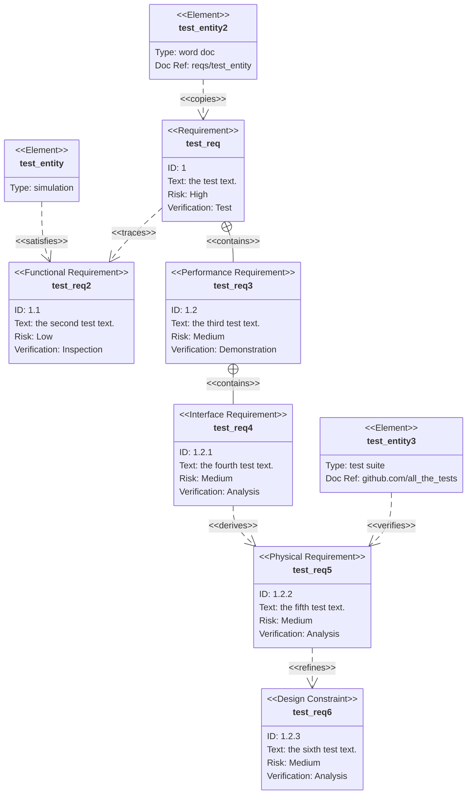
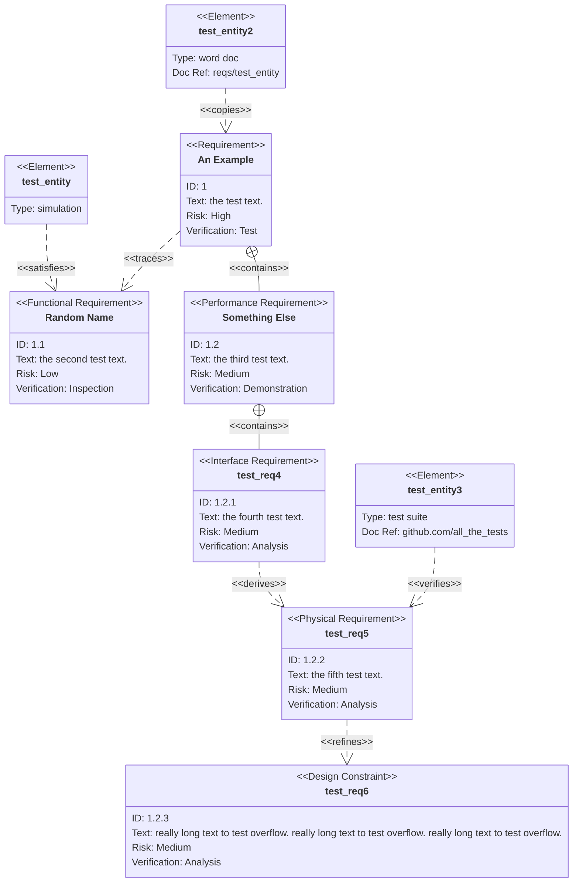

# requirements

## Example 1

**SebastianJS (SVG):**

<svg id="graph" xmlns="http://www.w3.org/2000/svg" xmlns:xlink="http://www.w3.org/1999/xlink" class="requirementDiagram" style="max-width: 22602px;" viewBox="-195 -1 1065 668" role="graphics-document document" aria-roledescription="requirement" aria-describedby="chart-desc-graph" aria-labelledby="chart-title-graph"><title id="chart-title-graph">Requirements demo in black and white</title><desc id="chart-desc-graph">A series of requirement boxes showing relationships among them. Has meaningless task names</desc><g><defs><marker id="graph_requirement-requirement_containsStart" refX="0" refY="10" markerWidth="20" markerHeight="20" orient="auto"><g><circle cx="10" cy="10" r="9" fill="none"/><line x1="1" x2="19" y1="10" y2="10"/><line y1="1" y2="19" x1="10" x2="10"/></g></marker></defs><defs><marker id="graph_requirement-requirement_arrowEnd" refX="20" refY="10" markerWidth="20" markerHeight="20" orient="auto"><path d="M0,0       L20,10       M20,10       L0,20"/></marker></defs><g class="root"><g class="clusters"/><g class="edgePaths"><path d="M113,130L113,136.167C113,142.333,113,154.667,130.333,168.625C147.667,182.584,182.333,198.168,199.667,205.96L217,213.752" id="test_entity-test_req2-0" class=" edge-thickness-normal edge-pattern-dashed relationshipLine" style="fill:none;stroke-dasharray: 10,7;" marker-end="url(#graph_requirement-requirement_arrowEnd)"/><path d="M433,120.29L416,128.075C399,135.86,365,151.43,330.667,167.007C296.333,182.584,261.667,198.168,244.333,205.96L227,213.752" id="test_req-test_req2-0" class=" edge-thickness-normal edge-pattern-dashed relationshipLine" style="fill:none;stroke-dasharray: 10,7;" marker-end="url(#graph_requirement-requirement_arrowEnd)"/><path d="M443,120.29L460,128.075C477,135.86,511,151.43,528,165.382C545,179.333,545,191.667,545,197.833L545,204" id="test_req-test_req3-0" class=" edge-thickness-normal edge-pattern-solid relationshipLine" style="fill:none;;" marker-start="url(#graph_requirement-requirement_containsStart)"/><path d="M545,228L545,234.167C545,240.333,545,252.667,545,265C545,277.333,545,289.667,545,295.833L545,302" id="test_req3-test_req4-0" class=" edge-thickness-normal edge-pattern-solid relationshipLine" style="fill:none;;" marker-start="url(#graph_requirement-requirement_containsStart)"/><path d="M545,326L545,332.167C545,338.333,545,350.667,562.333,364.625C579.667,378.584,614.333,394.168,631.667,401.96L649,409.752" id="test_req4-test_req5-0" class=" edge-thickness-normal edge-pattern-dashed relationshipLine" style="fill:none;stroke-dasharray: 10,7;" marker-end="url(#graph_requirement-requirement_arrowEnd)"/><path d="M654,424L654,430.167C654,436.333,654,448.667,654,461C654,473.333,654,485.667,654,491.833L654,498" id="test_req5-test_req6-0" class=" edge-thickness-normal edge-pattern-dashed relationshipLine" style="fill:none;stroke-dasharray: 10,7;" marker-end="url(#graph_requirement-requirement_arrowEnd)"/><path d="M763,326L763,332.167C763,338.333,763,350.667,745.667,364.625C728.333,378.584,693.667,394.168,676.333,401.96L659,409.752" id="test_entity3-test_req5-0" class=" edge-thickness-normal edge-pattern-dashed relationshipLine" style="fill:none;stroke-dasharray: 10,7;" marker-end="url(#graph_requirement-requirement_arrowEnd)"/><path d="M438,32L438,38.167C438,44.333,438,56.667,438,69C438,81.333,438,93.667,438,99.833L438,106" id="test_entity2-test_req-0" class=" edge-thickness-normal edge-pattern-dashed relationshipLine" style="fill:none;stroke-dasharray: 10,7;" marker-end="url(#graph_requirement-requirement_arrowEnd)"/></g><g class="edgeLabels"><g class="edgeLabel" transform="translate(113, 167)"><g class="label" transform="translate(-105, -12)"><g><rect class="background" style="" x="-2" y="-2" width="214" height="28"/><text y="-10.1" style=""><tspan class="text-outer-tspan" x="0" y="-0.1em" dy="1.1em"><tspan font-style="normal" class="text-inner-tspan" font-weight="normal">&amp;lt;&amp;lt;satisfies&amp;gt;&amp;gt;</tspan></tspan></text></g></g></g><g class="edgeLabel" transform="translate(331, 167)"><g class="label" transform="translate(-93, -12)"><g><rect class="background" style="" x="-2" y="-2" width="190" height="28"/><text y="-10.1" style=""><tspan class="text-outer-tspan" x="0" y="-0.1em" dy="1.1em"><tspan font-style="normal" class="text-inner-tspan" font-weight="normal">&amp;lt;&amp;lt;traces&amp;gt;&amp;gt;</tspan></tspan></text></g></g></g><g class="edgeLabel" transform="translate(545, 167)"><g class="label" transform="translate(-101, -12)"><g><rect class="background" style="" x="-2" y="-2" width="206" height="28"/><text y="-10.1" style=""><tspan class="text-outer-tspan" x="0" y="-0.1em" dy="1.1em"><tspan font-style="normal" class="text-inner-tspan" font-weight="normal">&amp;lt;&amp;lt;contains&amp;gt;&amp;gt;</tspan></tspan></text></g></g></g><g class="edgeLabel" transform="translate(545, 265)"><g class="label" transform="translate(-101, -12)"><g><rect class="background" style="" x="-2" y="-2" width="206" height="28"/><text y="-10.1" style=""><tspan class="text-outer-tspan" x="0" y="-0.1em" dy="1.1em"><tspan font-style="normal" class="text-inner-tspan" font-weight="normal">&amp;lt;&amp;lt;contains&amp;gt;&amp;gt;</tspan></tspan></text></g></g></g><g class="edgeLabel" transform="translate(545, 363)"><g class="label" transform="translate(-97, -12)"><g><rect class="background" style="" x="-2" y="-2" width="198" height="28"/><text y="-10.1" style=""><tspan class="text-outer-tspan" x="0" y="-0.1em" dy="1.1em"><tspan font-style="normal" class="text-inner-tspan" font-weight="normal">&amp;lt;&amp;lt;derives&amp;gt;&amp;gt;</tspan></tspan></text></g></g></g><g class="edgeLabel" transform="translate(654, 461)"><g class="label" transform="translate(-97, -12)"><g><rect class="background" style="" x="-2" y="-2" width="198" height="28"/><text y="-10.1" style=""><tspan class="text-outer-tspan" x="0" y="-0.1em" dy="1.1em"><tspan font-style="normal" class="text-inner-tspan" font-weight="normal">&amp;lt;&amp;lt;refines&amp;gt;&amp;gt;</tspan></tspan></text></g></g></g><g class="edgeLabel" transform="translate(763, 363)"><g class="label" transform="translate(-101, -12)"><g><rect class="background" style="" x="-2" y="-2" width="206" height="28"/><text y="-10.1" style=""><tspan class="text-outer-tspan" x="0" y="-0.1em" dy="1.1em"><tspan font-style="normal" class="text-inner-tspan" font-weight="normal">&amp;lt;&amp;lt;verifies&amp;gt;&amp;gt;</tspan></tspan></text></g></g></g><g class="edgeLabel" transform="translate(438, 69)"><g class="label" transform="translate(-93, -12)"><g><rect class="background" style="" x="-2" y="-2" width="190" height="28"/><text y="-10.1" style=""><tspan class="text-outer-tspan" x="0" y="-0.1em" dy="1.1em"><tspan font-style="normal" class="text-inner-tspan" font-weight="normal">&amp;lt;&amp;lt;copies&amp;gt;&amp;gt;</tspan></tspan></text></g></g></g></g><g class="nodes"><g class="node default " id="test_req" transform="translate(438, 118)"><g class="basic label-container" style=""><path d="M-319 -22 L319 -22 L319 22 L-319 22" stroke="none" stroke-width="0" fill="#ECECFF"/><path d="M-319 -22 C-109.51557950185344 -22, 99.96884099629312 -22, 319 -22 M-319 -22 C-89.76586451120687 -22, 139.46827097758626 -22, 319 -22 M319 -22 C319 -6.352533372779879, 319 9.294933254440242, 319 22 M319 -22 C319 -9.590730018689339, 319 2.8185399626213226, 319 22 M319 22 C105.4178610946557 22, -108.16427781068859 22, -319 22 M319 22 C88.35292492751594 22, -142.2941501449681 22, -319 22 M-319 22 C-319 9.68580525289182, -319 -2.6283894942163606, -319 -22 M-319 22 C-319 8.517814706896887, -319 -4.9643705862062255, -319 -22" stroke="#9370DB" stroke-width="1.3" fill="none" stroke-dasharray="0 0"/></g><g class="label" style="" transform="translate(-65, -17)"><g><rect class="background" style="stroke: none"/><text y="-10.1" style=""><tspan class="text-outer-tspan" x="0" y="-0.1em" dy="1.1em"><tspan font-style="normal" class="text-inner-tspan" font-weight="normal">&lt;&lt;Requirement&gt;&gt;</tspan></tspan></text></g></g><g class="label" style="; font-weight: bold;" transform="translate(-37, 13)"><g><rect class="background" style="stroke: none"/><text y="-10.1" style="; font-weight: bold;"><tspan class="text-outer-tspan" x="0" y="-0.1em" dy="1.1em"><tspan font-style="normal" class="text-inner-tspan" font-weight="normal" style="; font-weight: bold;">test_req</tspan></tspan></text></g></g><g class="label" style="" transform="translate(-309, 63)"><g><rect class="background" style="stroke: none"/><text y="-10.1" style=""><tspan class="text-outer-tspan" x="0" y="-0.1em" dy="1.1em"><tspan font-style="normal" class="text-inner-tspan" font-weight="normal">ID:</tspan><tspan font-style="normal" class="text-inner-tspan" font-weight="normal"> 1</tspan></tspan></text></g></g><g class="label" style="" transform="translate(-309, 93)"><g><rect class="background" style="stroke: none"/><text y="-10.1" style=""><tspan class="text-outer-tspan" x="0" y="-0.1em" dy="1.1em"><tspan font-style="normal" class="text-inner-tspan" font-weight="normal">Text:</tspan><tspan font-style="normal" class="text-inner-tspan" font-weight="normal"> the</tspan><tspan font-style="normal" class="text-inner-tspan" font-weight="normal"> test</tspan><tspan font-style="normal" class="text-inner-tspan" font-weight="normal"> text.</tspan></tspan></text></g></g><g class="label" style="" transform="translate(-309, 123)"><g><rect class="background" style="stroke: none"/><text y="-10.1" style=""><tspan class="text-outer-tspan" x="0" y="-0.1em" dy="1.1em"><tspan font-style="normal" class="text-inner-tspan" font-weight="normal">Risk:</tspan><tspan font-style="normal" class="text-inner-tspan" font-weight="normal"> High</tspan></tspan></text></g></g><g class="label" style="" transform="translate(-309, 153)"><g><rect class="background" style="stroke: none"/><text y="-10.1" style=""><tspan class="text-outer-tspan" x="0" y="-0.1em" dy="1.1em"><tspan font-style="normal" class="text-inner-tspan" font-weight="normal">Verification:</tspan><tspan font-style="normal" class="text-inner-tspan" font-weight="normal"> Test</tspan></tspan></text></g></g><g style=""><path d="M-319 58 C-120.50059600768807 58, 77.99880798462385 58, 319 58 M-319 58 C-81.5863122217545 58, 155.827375556491 58, 319 58" stroke="#9370DB" stroke-width="1.3" fill="none" stroke-dasharray="0 0"/></g></g><g class="node default " id="test_req2" transform="translate(222, 216)"><g class="basic label-container" style=""><path d="M-423 -22 L423 -22 L423 22 L-423 22" stroke="none" stroke-width="0" fill="#ECECFF"/><path d="M-423 -22 C-163.11907107922502 -22, 96.76185784154995 -22, 423 -22 M-423 -22 C-167.52588823761943 -22, 87.94822352476115 -22, 423 -22 M423 -22 C423 -10.860312573038646, 423 0.27937485392270744, 423 22 M423 -22 C423 -11.957416921959764, 423 -1.9148338439195278, 423 22 M423 22 C114.66127935000765 22, -193.6774412999847 22, -423 22 M423 22 C242.31494713973777 22, 61.629894279475536 22, -423 22 M-423 22 C-423 7.329147649712503, -423 -7.341704700574994, -423 -22 M-423 22 C-423 5.268659229052439, -423 -11.462681541895122, -423 -22" stroke="#9370DB" stroke-width="1.3" fill="none" stroke-dasharray="0 0"/></g><g class="label" style="" transform="translate(-109, -17)"><g><rect class="background" style="stroke: none"/><text y="-10.1" style=""><tspan class="text-outer-tspan" x="0" y="-0.1em" dy="1.1em"><tspan font-style="normal" class="text-inner-tspan" font-weight="normal">&lt;&lt;Functional</tspan><tspan font-style="normal" class="text-inner-tspan" font-weight="normal"> Requirement&gt;&gt;</tspan></tspan></text></g></g><g class="label" style="; font-weight: bold;" transform="translate(-41, 13)"><g><rect class="background" style="stroke: none"/><text y="-10.1" style="; font-weight: bold;"><tspan class="text-outer-tspan" x="0" y="-0.1em" dy="1.1em"><tspan font-style="normal" class="text-inner-tspan" font-weight="normal" style="; font-weight: bold;">test_req2</tspan></tspan></text></g></g><g class="label" style="" transform="translate(-413, 63)"><g><rect class="background" style="stroke: none"/><text y="-10.1" style=""><tspan class="text-outer-tspan" x="0" y="-0.1em" dy="1.1em"><tspan font-style="normal" class="text-inner-tspan" font-weight="normal">ID:</tspan><tspan font-style="normal" class="text-inner-tspan" font-weight="normal"> 1.1</tspan></tspan></text></g></g><g class="label" style="" transform="translate(-413, 93)"><g><rect class="background" style="stroke: none"/><text y="-10.1" style=""><tspan class="text-outer-tspan" x="0" y="-0.1em" dy="1.1em"><tspan font-style="normal" class="text-inner-tspan" font-weight="normal">Text:</tspan><tspan font-style="normal" class="text-inner-tspan" font-weight="normal"> the</tspan><tspan font-style="normal" class="text-inner-tspan" font-weight="normal"> second</tspan><tspan font-style="normal" class="text-inner-tspan" font-weight="normal"> test</tspan><tspan font-style="normal" class="text-inner-tspan" font-weight="normal"> text.</tspan></tspan></text></g></g><g class="label" style="" transform="translate(-413, 123)"><g><rect class="background" style="stroke: none"/><text y="-10.1" style=""><tspan class="text-outer-tspan" x="0" y="-0.1em" dy="1.1em"><tspan font-style="normal" class="text-inner-tspan" font-weight="normal">Risk:</tspan><tspan font-style="normal" class="text-inner-tspan" font-weight="normal"> Low</tspan></tspan></text></g></g><g class="label" style="" transform="translate(-413, 153)"><g><rect class="background" style="stroke: none"/><text y="-10.1" style=""><tspan class="text-outer-tspan" x="0" y="-0.1em" dy="1.1em"><tspan font-style="normal" class="text-inner-tspan" font-weight="normal">Verification:</tspan><tspan font-style="normal" class="text-inner-tspan" font-weight="normal"> Inspection</tspan></tspan></text></g></g><g style=""><path d="M-423 58 C-93.75494266450158 58, 235.49011467099683 58, 423 58 M-423 58 C-252.74508996347993 58, -82.49017992695985 58, 423 58" stroke="#9370DB" stroke-width="1.3" fill="none" stroke-dasharray="0 0"/></g></g><g class="node default " id="test_req3" transform="translate(545, 216)"><g class="basic label-container" style=""><path d="M-447 -22 L447 -22 L447 22 L-447 22" stroke="none" stroke-width="0" fill="#ECECFF"/><path d="M-447 -22 C-185.24030956921172 -22, 76.51938086157656 -22, 447 -22 M-447 -22 C-184.61361043953264 -22, 77.77277912093473 -22, 447 -22 M447 -22 C447 -11.79073181806553, 447 -1.5814636361310583, 447 22 M447 -22 C447 -10.150116671200255, 447 1.6997666575994899, 447 22 M447 22 C164.9500391059217 22, -117.09992178815662 22, -447 22 M447 22 C180.08287397758977 22, -86.83425204482046 22, -447 22 M-447 22 C-447 11.27839148813847, -447 0.5567829762769385, -447 -22 M-447 22 C-447 5.958676164600085, -447 -10.08264767079983, -447 -22" stroke="#9370DB" stroke-width="1.3" fill="none" stroke-dasharray="0 0"/></g><g class="label" style="" transform="translate(-113, -17)"><g><rect class="background" style="stroke: none"/><text y="-10.1" style=""><tspan class="text-outer-tspan" x="0" y="-0.1em" dy="1.1em"><tspan font-style="normal" class="text-inner-tspan" font-weight="normal">&lt;&lt;Performance</tspan><tspan font-style="normal" class="text-inner-tspan" font-weight="normal"> Requirement&gt;&gt;</tspan></tspan></text></g></g><g class="label" style="; font-weight: bold;" transform="translate(-41, 13)"><g><rect class="background" style="stroke: none"/><text y="-10.1" style="; font-weight: bold;"><tspan class="text-outer-tspan" x="0" y="-0.1em" dy="1.1em"><tspan font-style="normal" class="text-inner-tspan" font-weight="normal" style="; font-weight: bold;">test_req3</tspan></tspan></text></g></g><g class="label" style="" transform="translate(-437, 63)"><g><rect class="background" style="stroke: none"/><text y="-10.1" style=""><tspan class="text-outer-tspan" x="0" y="-0.1em" dy="1.1em"><tspan font-style="normal" class="text-inner-tspan" font-weight="normal">ID:</tspan><tspan font-style="normal" class="text-inner-tspan" font-weight="normal"> 1.2</tspan></tspan></text></g></g><g class="label" style="" transform="translate(-437, 93)"><g><rect class="background" style="stroke: none"/><text y="-10.1" style=""><tspan class="text-outer-tspan" x="0" y="-0.1em" dy="1.1em"><tspan font-style="normal" class="text-inner-tspan" font-weight="normal">Text:</tspan><tspan font-style="normal" class="text-inner-tspan" font-weight="normal"> the</tspan><tspan font-style="normal" class="text-inner-tspan" font-weight="normal"> third</tspan><tspan font-style="normal" class="text-inner-tspan" font-weight="normal"> test</tspan><tspan font-style="normal" class="text-inner-tspan" font-weight="normal"> text.</tspan></tspan></text></g></g><g class="label" style="" transform="translate(-437, 123)"><g><rect class="background" style="stroke: none"/><text y="-10.1" style=""><tspan class="text-outer-tspan" x="0" y="-0.1em" dy="1.1em"><tspan font-style="normal" class="text-inner-tspan" font-weight="normal">Risk:</tspan><tspan font-style="normal" class="text-inner-tspan" font-weight="normal"> Medium</tspan></tspan></text></g></g><g class="label" style="" transform="translate(-437, 153)"><g><rect class="background" style="stroke: none"/><text y="-10.1" style=""><tspan class="text-outer-tspan" x="0" y="-0.1em" dy="1.1em"><tspan font-style="normal" class="text-inner-tspan" font-weight="normal">Verification:</tspan><tspan font-style="normal" class="text-inner-tspan" font-weight="normal"> Demonstration</tspan></tspan></text></g></g><g style=""><path d="M-447 58 C-192.08922128491335 58, 62.8215574301733 58, 447 58 M-447 58 C-137.8843288825895 58, 171.231342234821 58, 447 58" stroke="#9370DB" stroke-width="1.3" fill="none" stroke-dasharray="0 0"/></g></g><g class="node default " id="test_req4" transform="translate(545, 314)"><g class="basic label-container" style=""><path d="M-431 -22 L431 -22 L431 22 L-431 22" stroke="none" stroke-width="0" fill="#ECECFF"/><path d="M-431 -22 C-97.71417050803353 -22, 235.57165898393293 -22, 431 -22 M-431 -22 C-243.19090319077213 -22, -55.381806381544266 -22, 431 -22 M431 -22 C431 -11.481518523013483, 431 -0.9630370460269653, 431 22 M431 -22 C431 -7.593747544339129, 431 6.812504911321742, 431 22 M431 22 C122.82478489084377 22, -185.35043021831245 22, -431 22 M431 22 C151.28578176250852 22, -128.42843647498296 22, -431 22 M-431 22 C-431 6.387036452588834, -431 -9.225927094822332, -431 -22 M-431 22 C-431 9.08970184345766, -431 -3.8205963130846783, -431 -22" stroke="#9370DB" stroke-width="1.3" fill="none" stroke-dasharray="0 0"/></g><g class="label" style="" transform="translate(-105, -17)"><g><rect class="background" style="stroke: none"/><text y="-10.1" style=""><tspan class="text-outer-tspan" x="0" y="-0.1em" dy="1.1em"><tspan font-style="normal" class="text-inner-tspan" font-weight="normal">&lt;&lt;Interface</tspan><tspan font-style="normal" class="text-inner-tspan" font-weight="normal"> Requirement&gt;&gt;</tspan></tspan></text></g></g><g class="label" style="; font-weight: bold;" transform="translate(-41, 13)"><g><rect class="background" style="stroke: none"/><text y="-10.1" style="; font-weight: bold;"><tspan class="text-outer-tspan" x="0" y="-0.1em" dy="1.1em"><tspan font-style="normal" class="text-inner-tspan" font-weight="normal" style="; font-weight: bold;">test_req4</tspan></tspan></text></g></g><g class="label" style="" transform="translate(-421, 63)"><g><rect class="background" style="stroke: none"/><text y="-10.1" style=""><tspan class="text-outer-tspan" x="0" y="-0.1em" dy="1.1em"><tspan font-style="normal" class="text-inner-tspan" font-weight="normal">ID:</tspan><tspan font-style="normal" class="text-inner-tspan" font-weight="normal"> 1.2.1</tspan></tspan></text></g></g><g class="label" style="" transform="translate(-421, 93)"><g><rect class="background" style="stroke: none"/><text y="-10.1" style=""><tspan class="text-outer-tspan" x="0" y="-0.1em" dy="1.1em"><tspan font-style="normal" class="text-inner-tspan" font-weight="normal">Text:</tspan><tspan font-style="normal" class="text-inner-tspan" font-weight="normal"> the</tspan><tspan font-style="normal" class="text-inner-tspan" font-weight="normal"> fourth</tspan><tspan font-style="normal" class="text-inner-tspan" font-weight="normal"> test</tspan><tspan font-style="normal" class="text-inner-tspan" font-weight="normal"> text.</tspan></tspan></text></g></g><g class="label" style="" transform="translate(-421, 123)"><g><rect class="background" style="stroke: none"/><text y="-10.1" style=""><tspan class="text-outer-tspan" x="0" y="-0.1em" dy="1.1em"><tspan font-style="normal" class="text-inner-tspan" font-weight="normal">Risk:</tspan><tspan font-style="normal" class="text-inner-tspan" font-weight="normal"> Medium</tspan></tspan></text></g></g><g class="label" style="" transform="translate(-421, 153)"><g><rect class="background" style="stroke: none"/><text y="-10.1" style=""><tspan class="text-outer-tspan" x="0" y="-0.1em" dy="1.1em"><tspan font-style="normal" class="text-inner-tspan" font-weight="normal">Verification:</tspan><tspan font-style="normal" class="text-inner-tspan" font-weight="normal"> Analysis</tspan></tspan></text></g></g><g style=""><path d="M-431 58 C-177.5842400512438 58, 75.83151989751241 58, 431 58 M-431 58 C-133.64698917289218 58, 163.70602165421565 58, 431 58" stroke="#9370DB" stroke-width="1.3" fill="none" stroke-dasharray="0 0"/></g></g><g class="node default " id="test_req5" transform="translate(654, 412)"><g class="basic label-container" style=""><path d="M-423 -22 L423 -22 L423 22 L-423 22" stroke="none" stroke-width="0" fill="#ECECFF"/><path d="M-423 -22 C-206.63111286101997 -22, 9.737774277960057 -22, 423 -22 M-423 -22 C-121.19802003597562 -22, 180.60395992804877 -22, 423 -22 M423 -22 C423 -8.712772501417332, 423 4.574454997165336, 423 22 M423 -22 C423 -11.343857468744536, 423 -0.6877149374890728, 423 22 M423 22 C99.709588212028 22, -223.580823575944 22, -423 22 M423 22 C174.20890479149165 22, -74.5821904170167 22, -423 22 M-423 22 C-423 10.187792779187788, -423 -1.624414441624424, -423 -22 M-423 22 C-423 9.497885174267724, -423 -3.004229651464552, -423 -22" stroke="#9370DB" stroke-width="1.3" fill="none" stroke-dasharray="0 0"/></g><g class="label" style="" transform="translate(-101, -17)"><g><rect class="background" style="stroke: none"/><text y="-10.1" style=""><tspan class="text-outer-tspan" x="0" y="-0.1em" dy="1.1em"><tspan font-style="normal" class="text-inner-tspan" font-weight="normal">&lt;&lt;Physical</tspan><tspan font-style="normal" class="text-inner-tspan" font-weight="normal"> Requirement&gt;&gt;</tspan></tspan></text></g></g><g class="label" style="; font-weight: bold;" transform="translate(-41, 13)"><g><rect class="background" style="stroke: none"/><text y="-10.1" style="; font-weight: bold;"><tspan class="text-outer-tspan" x="0" y="-0.1em" dy="1.1em"><tspan font-style="normal" class="text-inner-tspan" font-weight="normal" style="; font-weight: bold;">test_req5</tspan></tspan></text></g></g><g class="label" style="" transform="translate(-413, 63)"><g><rect class="background" style="stroke: none"/><text y="-10.1" style=""><tspan class="text-outer-tspan" x="0" y="-0.1em" dy="1.1em"><tspan font-style="normal" class="text-inner-tspan" font-weight="normal">ID:</tspan><tspan font-style="normal" class="text-inner-tspan" font-weight="normal"> 1.2.2</tspan></tspan></text></g></g><g class="label" style="" transform="translate(-413, 93)"><g><rect class="background" style="stroke: none"/><text y="-10.1" style=""><tspan class="text-outer-tspan" x="0" y="-0.1em" dy="1.1em"><tspan font-style="normal" class="text-inner-tspan" font-weight="normal">Text:</tspan><tspan font-style="normal" class="text-inner-tspan" font-weight="normal"> the</tspan><tspan font-style="normal" class="text-inner-tspan" font-weight="normal"> fifth</tspan><tspan font-style="normal" class="text-inner-tspan" font-weight="normal"> test</tspan><tspan font-style="normal" class="text-inner-tspan" font-weight="normal"> text.</tspan></tspan></text></g></g><g class="label" style="" transform="translate(-413, 123)"><g><rect class="background" style="stroke: none"/><text y="-10.1" style=""><tspan class="text-outer-tspan" x="0" y="-0.1em" dy="1.1em"><tspan font-style="normal" class="text-inner-tspan" font-weight="normal">Risk:</tspan><tspan font-style="normal" class="text-inner-tspan" font-weight="normal"> Medium</tspan></tspan></text></g></g><g class="label" style="" transform="translate(-413, 153)"><g><rect class="background" style="stroke: none"/><text y="-10.1" style=""><tspan class="text-outer-tspan" x="0" y="-0.1em" dy="1.1em"><tspan font-style="normal" class="text-inner-tspan" font-weight="normal">Verification:</tspan><tspan font-style="normal" class="text-inner-tspan" font-weight="normal"> Analysis</tspan></tspan></text></g></g><g style=""><path d="M-423 58 C-89.71244621618087 58, 243.57510756763827 58, 423 58 M-423 58 C-169.7318245153244 58, 83.53635096935119 58, 423 58" stroke="#9370DB" stroke-width="1.3" fill="none" stroke-dasharray="0 0"/></g></g><g class="node default " id="test_req6" transform="translate(654, 510)"><g class="basic label-container" style=""><path d="M-411 -22 L411 -22 L411 22 L-411 22" stroke="none" stroke-width="0" fill="#ECECFF"/><path d="M-411 -22 C-120.68833056884534 -22, 169.6233388623093 -22, 411 -22 M-411 -22 C-236.29111336975149 -22, -61.58222673950297 -22, 411 -22 M411 -22 C411 -7.771351468231114, 411 6.457297063537773, 411 22 M411 -22 C411 -7.257150108786865, 411 7.48569978242627, 411 22 M411 22 C237.04304831835825 22, 63.08609663671649 22, -411 22 M411 22 C113.9330264861822 22, -183.1339470276356 22, -411 22 M-411 22 C-411 9.721600675526041, -411 -2.556798648947918, -411 -22 M-411 22 C-411 9.017166356951336, -411 -3.9656672860973288, -411 -22" stroke="#9370DB" stroke-width="1.3" fill="none" stroke-dasharray="0 0"/></g><g class="label" style="" transform="translate(-89, -17)"><g><rect class="background" style="stroke: none"/><text y="-10.1" style=""><tspan class="text-outer-tspan" x="0" y="-0.1em" dy="1.1em"><tspan font-style="normal" class="text-inner-tspan" font-weight="normal">&lt;&lt;Design</tspan><tspan font-style="normal" class="text-inner-tspan" font-weight="normal"> Constraint&gt;&gt;</tspan></tspan></text></g></g><g class="label" style="; font-weight: bold;" transform="translate(-41, 13)"><g><rect class="background" style="stroke: none"/><text y="-10.1" style="; font-weight: bold;"><tspan class="text-outer-tspan" x="0" y="-0.1em" dy="1.1em"><tspan font-style="normal" class="text-inner-tspan" font-weight="normal" style="; font-weight: bold;">test_req6</tspan></tspan></text></g></g><g class="label" style="" transform="translate(-401, 63)"><g><rect class="background" style="stroke: none"/><text y="-10.1" style=""><tspan class="text-outer-tspan" x="0" y="-0.1em" dy="1.1em"><tspan font-style="normal" class="text-inner-tspan" font-weight="normal">ID:</tspan><tspan font-style="normal" class="text-inner-tspan" font-weight="normal"> 1.2.3</tspan></tspan></text></g></g><g class="label" style="" transform="translate(-401, 93)"><g><rect class="background" style="stroke: none"/><text y="-10.1" style=""><tspan class="text-outer-tspan" x="0" y="-0.1em" dy="1.1em"><tspan font-style="normal" class="text-inner-tspan" font-weight="normal">Text:</tspan><tspan font-style="normal" class="text-inner-tspan" font-weight="normal"> the</tspan><tspan font-style="normal" class="text-inner-tspan" font-weight="normal"> sixth</tspan><tspan font-style="normal" class="text-inner-tspan" font-weight="normal"> test</tspan><tspan font-style="normal" class="text-inner-tspan" font-weight="normal"> text.</tspan></tspan></text></g></g><g class="label" style="" transform="translate(-401, 123)"><g><rect class="background" style="stroke: none"/><text y="-10.1" style=""><tspan class="text-outer-tspan" x="0" y="-0.1em" dy="1.1em"><tspan font-style="normal" class="text-inner-tspan" font-weight="normal">Risk:</tspan><tspan font-style="normal" class="text-inner-tspan" font-weight="normal"> Medium</tspan></tspan></text></g></g><g class="label" style="" transform="translate(-401, 153)"><g><rect class="background" style="stroke: none"/><text y="-10.1" style=""><tspan class="text-outer-tspan" x="0" y="-0.1em" dy="1.1em"><tspan font-style="normal" class="text-inner-tspan" font-weight="normal">Verification:</tspan><tspan font-style="normal" class="text-inner-tspan" font-weight="normal"> Analysis</tspan></tspan></text></g></g><g style=""><path d="M-411 58 C-97.92254650903715 58, 215.1549069819257 58, 411 58 M-411 58 C-204.60238639997948 58, 1.7952272000410403 58, 411 58" stroke="#9370DB" stroke-width="1.3" fill="none" stroke-dasharray="0 0"/></g></g><g class="node default " id="test_entity" transform="translate(113, 118)"><g class="basic label-container" style=""><path d="M-167 -22 L167 -22 L167 22 L-167 22" stroke="none" stroke-width="0" fill="#ECECFF"/><path d="M-167 -22 C-68.72768882755645 -22, 29.544622344887102 -22, 167 -22 M-167 -22 C-73.9749232020353 -22, 19.0501535959294 -22, 167 -22 M167 -22 C167 -10.413135942843953, 167 1.1737281143120946, 167 22 M167 -22 C167 -12.331718323809703, 167 -2.663436647619406, 167 22 M167 22 C72.07703337085614 22, -22.845933258287715 22, -167 22 M167 22 C81.09218438640673 22, -4.815631227186543 22, -167 22 M-167 22 C-167 11.818736078047396, -167 1.6374721560947911, -167 -22 M-167 22 C-167 7.2229224410228845, -167 -7.554155117954231, -167 -22" stroke="#9370DB" stroke-width="1.3" fill="none" stroke-dasharray="0 0"/></g><g class="label" style="" transform="translate(-49, -17)"><g><rect class="background" style="stroke: none"/><text y="-10.1" style=""><tspan class="text-outer-tspan" x="0" y="-0.1em" dy="1.1em"><tspan font-style="normal" class="text-inner-tspan" font-weight="normal">&lt;&lt;Element&gt;&gt;</tspan></tspan></text></g></g><g class="label" style="; font-weight: bold;" transform="translate(-49, 13)"><g><rect class="background" style="stroke: none"/><text y="-10.1" style="; font-weight: bold;"><tspan class="text-outer-tspan" x="0" y="-0.1em" dy="1.1em"><tspan font-style="normal" class="text-inner-tspan" font-weight="normal" style="; font-weight: bold;">test_entity</tspan></tspan></text></g></g><g class="label" style="" transform="translate(-157, 63)"><g><rect class="background" style="stroke: none"/><text y="-10.1" style=""><tspan class="text-outer-tspan" x="0" y="-0.1em" dy="1.1em"><tspan font-style="normal" class="text-inner-tspan" font-weight="normal">Type:</tspan><tspan font-style="normal" class="text-inner-tspan" font-weight="normal"> simulation</tspan></tspan></text></g></g><g style=""><path d="M-167 58 C-48.20200702580746 58, 70.59598594838508 58, 167 58 M-167 58 C-58.30821627982367 58, 50.383567440352664 58, 167 58" stroke="#9370DB" stroke-width="1.3" fill="none" stroke-dasharray="0 0"/></g></g><g class="node default " id="test_entity2" transform="translate(438, 20)"><g class="basic label-container" style=""><path d="M-263 -22 L263 -22 L263 22 L-263 22" stroke="none" stroke-width="0" fill="#ECECFF"/><path d="M-263 -22 C-113.9872146335355 -22, 35.025570732929 -22, 263 -22 M-263 -22 C-131.29919411764075 -22, 0.4016117647184956 -22, 263 -22 M263 -22 C263 -11.117729065850485, 263 -0.23545813170096963, 263 22 M263 -22 C263 -9.16695417908124, 263 3.6660916418375216, 263 22 M263 22 C64.3102115104493 22, -134.3795769791014 22, -263 22 M263 22 C93.94291678980093 22, -75.11416642039813 22, -263 22 M-263 22 C-263 11.25657492755781, -263 0.5131498551156213, -263 -22 M-263 22 C-263 8.732281224056528, -263 -4.535437551886943, -263 -22" stroke="#9370DB" stroke-width="1.3" fill="none" stroke-dasharray="0 0"/></g><g class="label" style="" transform="translate(-49, -17)"><g><rect class="background" style="stroke: none"/><text y="-10.1" style=""><tspan class="text-outer-tspan" x="0" y="-0.1em" dy="1.1em"><tspan font-style="normal" class="text-inner-tspan" font-weight="normal">&lt;&lt;Element&gt;&gt;</tspan></tspan></text></g></g><g class="label" style="; font-weight: bold;" transform="translate(-53, 13)"><g><rect class="background" style="stroke: none"/><text y="-10.1" style="; font-weight: bold;"><tspan class="text-outer-tspan" x="0" y="-0.1em" dy="1.1em"><tspan font-style="normal" class="text-inner-tspan" font-weight="normal" style="; font-weight: bold;">test_entity2</tspan></tspan></text></g></g><g class="label" style="" transform="translate(-253, 63)"><g><rect class="background" style="stroke: none"/><text y="-10.1" style=""><tspan class="text-outer-tspan" x="0" y="-0.1em" dy="1.1em"><tspan font-style="normal" class="text-inner-tspan" font-weight="normal">Type:</tspan><tspan font-style="normal" class="text-inner-tspan" font-weight="normal"> word</tspan><tspan font-style="normal" class="text-inner-tspan" font-weight="normal"> doc</tspan></tspan></text></g></g><g class="label" style="" transform="translate(-253, 93)"><g><rect class="background" style="stroke: none"/><text y="-10.1" style=""><tspan class="text-outer-tspan" x="0" y="-0.1em" dy="1.1em"><tspan font-style="normal" class="text-inner-tspan" font-weight="normal">Doc</tspan><tspan font-style="normal" class="text-inner-tspan" font-weight="normal"> Ref:</tspan><tspan font-style="normal" class="text-inner-tspan" font-weight="normal"> reqs/test_entity</tspan></tspan></text></g></g><g style=""><path d="M-263 58 C-60.173000043170134 58, 142.65399991365973 58, 263 58 M-263 58 C-118.45189458149747 58, 26.09621083700506 58, 263 58" stroke="#9370DB" stroke-width="1.3" fill="none" stroke-dasharray="0 0"/></g></g><g class="node default " id="test_entity3" transform="translate(763, 314)"><g class="basic label-container" style=""><path d="M-303 -22 L303 -22 L303 22 L-303 22" stroke="none" stroke-width="0" fill="#ECECFF"/><path d="M-303 -22 C-149.8868478697789 -22, 3.226304260442191 -22, 303 -22 M-303 -22 C-108.26551933176165 -22, 86.4689613364767 -22, 303 -22 M303 -22 C303 -11.556235759564556, 303 -1.1124715191291124, 303 22 M303 -22 C303 -8.749166159186942, 303 4.501667681626117, 303 22 M303 22 C85.37517050841913 22, -132.24965898316174 22, -303 22 M303 22 C130.9147825014409 22, -41.17043499711821 22, -303 22 M-303 22 C-303 9.139775133364356, -303 -3.7204497332712876, -303 -22 M-303 22 C-303 7.881192132957683, -303 -6.237615734084635, -303 -22" stroke="#9370DB" stroke-width="1.3" fill="none" stroke-dasharray="0 0"/></g><g class="label" style="" transform="translate(-49, -17)"><g><rect class="background" style="stroke: none"/><text y="-10.1" style=""><tspan class="text-outer-tspan" x="0" y="-0.1em" dy="1.1em"><tspan font-style="normal" class="text-inner-tspan" font-weight="normal">&lt;&lt;Element&gt;&gt;</tspan></tspan></text></g></g><g class="label" style="; font-weight: bold;" transform="translate(-53, 13)"><g><rect class="background" style="stroke: none"/><text y="-10.1" style="; font-weight: bold;"><tspan class="text-outer-tspan" x="0" y="-0.1em" dy="1.1em"><tspan font-style="normal" class="text-inner-tspan" font-weight="normal" style="; font-weight: bold;">test_entity3</tspan></tspan></text></g></g><g class="label" style="" transform="translate(-293, 63)"><g><rect class="background" style="stroke: none"/><text y="-10.1" style=""><tspan class="text-outer-tspan" x="0" y="-0.1em" dy="1.1em"><tspan font-style="normal" class="text-inner-tspan" font-weight="normal">Type:</tspan><tspan font-style="normal" class="text-inner-tspan" font-weight="normal"> test</tspan><tspan font-style="normal" class="text-inner-tspan" font-weight="normal"> suite</tspan></tspan></text></g></g><g class="label" style="" transform="translate(-293, 93)"><g><rect class="background" style="stroke: none"/><text y="-10.1" style=""><tspan class="text-outer-tspan" x="0" y="-0.1em" dy="1.1em"><tspan font-style="normal" class="text-inner-tspan" font-weight="normal">Doc</tspan><tspan font-style="normal" class="text-inner-tspan" font-weight="normal"> Ref:</tspan><tspan font-style="normal" class="text-inner-tspan" font-weight="normal"> github.com/all_the_tests</tspan></tspan></text></g></g><g style=""><path d="M-303 58 C-124.06021579254215 58, 54.879568414915695 58, 303 58 M-303 58 C-160.9626120579673 58, -18.92522411593461 58, 303 58" stroke="#9370DB" stroke-width="1.3" fill="none" stroke-dasharray="0 0"/></g></g></g></g></g></svg>

**Mermaid Code (Browser Rendered):**

## Example 2

**SebastianJS (SVG):**

<svg id="graph" xmlns="http://www.w3.org/2000/svg" xmlns:xlink="http://www.w3.org/1999/xlink" class="requirementDiagram" style="max-width: 23346px;" viewBox="-203 -1 1073 668" role="graphics-document document" aria-roledescription="requirement"><g><defs><marker id="graph_requirement-requirement_containsStart" refX="0" refY="10" markerWidth="20" markerHeight="20" orient="auto"><g><circle cx="10" cy="10" r="9" fill="none"/><line x1="1" x2="19" y1="10" y2="10"/><line y1="1" y2="19" x1="10" x2="10"/></g></marker></defs><defs><marker id="graph_requirement-requirement_arrowEnd" refX="20" refY="10" markerWidth="20" markerHeight="20" orient="auto"><path d="M0,0       L20,10       M20,10       L0,20"/></marker></defs><g class="root"><g class="clusters"/><g class="edgePaths"><path d="M113,130L113,136.167C113,142.333,113,154.667,130.333,168.625C147.667,182.584,182.333,198.168,199.667,205.96L217,213.752" id="test_entity-Random Name-0" class=" edge-thickness-normal edge-pattern-dashed relationshipLine" style="fill:none;stroke-dasharray: 10,7;" marker-end="url(#graph_requirement-requirement_arrowEnd)"/><path d="M433,120.29L416,128.075C399,135.86,365,151.43,330.667,167.007C296.333,182.584,261.667,198.168,244.333,205.96L227,213.752" id="An Example-Random Name-0" class=" edge-thickness-normal edge-pattern-dashed relationshipLine" style="fill:none;stroke-dasharray: 10,7;" marker-end="url(#graph_requirement-requirement_arrowEnd)"/><path d="M443,120.29L460,128.075C477,135.86,511,151.43,528,165.382C545,179.333,545,191.667,545,197.833L545,204" id="An Example-Something Else-0" class=" edge-thickness-normal edge-pattern-solid relationshipLine" style="fill:none;;" marker-start="url(#graph_requirement-requirement_containsStart)"/><path d="M545,228L545,234.167C545,240.333,545,252.667,545,265C545,277.333,545,289.667,545,295.833L545,302" id="Something Else-test_req4-0" class=" edge-thickness-normal edge-pattern-solid relationshipLine" style="fill:none;;" marker-start="url(#graph_requirement-requirement_containsStart)"/><path d="M545,326L545,332.167C545,338.333,545,350.667,562.333,364.625C579.667,378.584,614.333,394.168,631.667,401.96L649,409.752" id="test_req4-test_req5-0" class=" edge-thickness-normal edge-pattern-dashed relationshipLine" style="fill:none;stroke-dasharray: 10,7;" marker-end="url(#graph_requirement-requirement_arrowEnd)"/><path d="M654,424L654,430.167C654,436.333,654,448.667,654,461C654,473.333,654,485.667,654,491.833L654,498" id="test_req5-test_req6-0" class=" edge-thickness-normal edge-pattern-dashed relationshipLine" style="fill:none;stroke-dasharray: 10,7;" marker-end="url(#graph_requirement-requirement_arrowEnd)"/><path d="M763,326L763,332.167C763,338.333,763,350.667,745.667,364.625C728.333,378.584,693.667,394.168,676.333,401.96L659,409.752" id="test_entity3-test_req5-0" class=" edge-thickness-normal edge-pattern-dashed relationshipLine" style="fill:none;stroke-dasharray: 10,7;" marker-end="url(#graph_requirement-requirement_arrowEnd)"/><path d="M438,32L438,38.167C438,44.333,438,56.667,438,69C438,81.333,438,93.667,438,99.833L438,106" id="test_entity2-An Example-0" class=" edge-thickness-normal edge-pattern-dashed relationshipLine" style="fill:none;stroke-dasharray: 10,7;" marker-end="url(#graph_requirement-requirement_arrowEnd)"/></g><g class="edgeLabels"><g class="edgeLabel" transform="translate(113, 167)"><g class="label" transform="translate(-105, -12)"><g><rect class="background" style="" x="-2" y="-2" width="214" height="28"/><text y="-10.1" style=""><tspan class="text-outer-tspan" x="0" y="-0.1em" dy="1.1em"><tspan font-style="normal" class="text-inner-tspan" font-weight="normal">&amp;lt;&amp;lt;satisfies&amp;gt;&amp;gt;</tspan></tspan></text></g></g></g><g class="edgeLabel" transform="translate(331, 167)"><g class="label" transform="translate(-93, -12)"><g><rect class="background" style="" x="-2" y="-2" width="190" height="28"/><text y="-10.1" style=""><tspan class="text-outer-tspan" x="0" y="-0.1em" dy="1.1em"><tspan font-style="normal" class="text-inner-tspan" font-weight="normal">&amp;lt;&amp;lt;traces&amp;gt;&amp;gt;</tspan></tspan></text></g></g></g><g class="edgeLabel" transform="translate(545, 167)"><g class="label" transform="translate(-101, -12)"><g><rect class="background" style="" x="-2" y="-2" width="206" height="28"/><text y="-10.1" style=""><tspan class="text-outer-tspan" x="0" y="-0.1em" dy="1.1em"><tspan font-style="normal" class="text-inner-tspan" font-weight="normal">&amp;lt;&amp;lt;contains&amp;gt;&amp;gt;</tspan></tspan></text></g></g></g><g class="edgeLabel" transform="translate(545, 265)"><g class="label" transform="translate(-101, -12)"><g><rect class="background" style="" x="-2" y="-2" width="206" height="28"/><text y="-10.1" style=""><tspan class="text-outer-tspan" x="0" y="-0.1em" dy="1.1em"><tspan font-style="normal" class="text-inner-tspan" font-weight="normal">&amp;lt;&amp;lt;contains&amp;gt;&amp;gt;</tspan></tspan></text></g></g></g><g class="edgeLabel" transform="translate(545, 363)"><g class="label" transform="translate(-97, -12)"><g><rect class="background" style="" x="-2" y="-2" width="198" height="28"/><text y="-10.1" style=""><tspan class="text-outer-tspan" x="0" y="-0.1em" dy="1.1em"><tspan font-style="normal" class="text-inner-tspan" font-weight="normal">&amp;lt;&amp;lt;derives&amp;gt;&amp;gt;</tspan></tspan></text></g></g></g><g class="edgeLabel" transform="translate(654, 461)"><g class="label" transform="translate(-97, -12)"><g><rect class="background" style="" x="-2" y="-2" width="198" height="28"/><text y="-10.1" style=""><tspan class="text-outer-tspan" x="0" y="-0.1em" dy="1.1em"><tspan font-style="normal" class="text-inner-tspan" font-weight="normal">&amp;lt;&amp;lt;refines&amp;gt;&amp;gt;</tspan></tspan></text></g></g></g><g class="edgeLabel" transform="translate(763, 363)"><g class="label" transform="translate(-101, -12)"><g><rect class="background" style="" x="-2" y="-2" width="206" height="28"/><text y="-10.1" style=""><tspan class="text-outer-tspan" x="0" y="-0.1em" dy="1.1em"><tspan font-style="normal" class="text-inner-tspan" font-weight="normal">&amp;lt;&amp;lt;verifies&amp;gt;&amp;gt;</tspan></tspan></text></g></g></g><g class="edgeLabel" transform="translate(438, 69)"><g class="label" transform="translate(-93, -12)"><g><rect class="background" style="" x="-2" y="-2" width="190" height="28"/><text y="-10.1" style=""><tspan class="text-outer-tspan" x="0" y="-0.1em" dy="1.1em"><tspan font-style="normal" class="text-inner-tspan" font-weight="normal">&amp;lt;&amp;lt;copies&amp;gt;&amp;gt;</tspan></tspan></text></g></g></g></g><g class="nodes"><g class="node default " id="An Example" transform="translate(438, 118)"><g class="basic label-container" style=""><path d="M-327 -22 L327 -22 L327 22 L-327 22" stroke="none" stroke-width="0" fill="#ECECFF"/><path d="M-327 -22 C-105.22021306264949 -22, 116.55957387470102 -22, 327 -22 M-327 -22 C-91.98077856559951 -22, 143.03844286880098 -22, 327 -22 M327 -22 C327 -11.624056693566208, 327 -1.2481133871324168, 327 22 M327 -22 C327 -12.591795978179558, 327 -3.183591956359116, 327 22 M327 22 C99.88723790966816 22, -127.22552418066368 22, -327 22 M327 22 C124.823927795553 22, -77.35214440889399 22, -327 22 M-327 22 C-327 5.915383491303579, -327 -10.169233017392841, -327 -22 M-327 22 C-327 5.881521231445369, -327 -10.236957537109262, -327 -22" stroke="#9370DB" stroke-width="1.3" fill="none" stroke-dasharray="0 0"/></g><g class="label" style="" transform="translate(-65, -17)"><g><rect class="background" style="stroke: none"/><text y="-10.1" style=""><tspan class="text-outer-tspan" x="0" y="-0.1em" dy="1.1em"><tspan font-style="normal" class="text-inner-tspan" font-weight="normal">&lt;&lt;Requirement&gt;&gt;</tspan></tspan></text></g></g><g class="label" style="; font-weight: bold;" transform="translate(-45, 13)"><g><rect class="background" style="stroke: none"/><text y="-10.1" style="; font-weight: bold;"><tspan class="text-outer-tspan" x="0" y="-0.1em" dy="1.1em"><tspan font-style="normal" class="text-inner-tspan" font-weight="normal" style="; font-weight: bold;">An</tspan><tspan font-style="normal" class="text-inner-tspan" font-weight="normal" style="; font-weight: bold;"> Example</tspan></tspan></text></g></g><g class="label" style="" transform="translate(-317, 63)"><g><rect class="background" style="stroke: none"/><text y="-10.1" style=""><tspan class="text-outer-tspan" x="0" y="-0.1em" dy="1.1em"><tspan font-style="normal" class="text-inner-tspan" font-weight="normal">ID:</tspan><tspan font-style="normal" class="text-inner-tspan" font-weight="normal"> 1</tspan></tspan></text></g></g><g class="label" style="" transform="translate(-317, 93)"><g><rect class="background" style="stroke: none"/><text y="-10.1" style=""><tspan class="text-outer-tspan" x="0" y="-0.1em" dy="1.1em"><tspan font-style="normal" class="text-inner-tspan" font-weight="normal">Text:</tspan><tspan font-style="normal" class="text-inner-tspan" font-weight="normal"> the</tspan><tspan font-style="normal" class="text-inner-tspan" font-weight="normal"> test</tspan><tspan font-style="normal" class="text-inner-tspan" font-weight="normal"> text.</tspan></tspan></text></g></g><g class="label" style="" transform="translate(-317, 123)"><g><rect class="background" style="stroke: none"/><text y="-10.1" style=""><tspan class="text-outer-tspan" x="0" y="-0.1em" dy="1.1em"><tspan font-style="normal" class="text-inner-tspan" font-weight="normal">Risk:</tspan><tspan font-style="normal" class="text-inner-tspan" font-weight="normal"> High</tspan></tspan></text></g></g><g class="label" style="" transform="translate(-317, 153)"><g><rect class="background" style="stroke: none"/><text y="-10.1" style=""><tspan class="text-outer-tspan" x="0" y="-0.1em" dy="1.1em"><tspan font-style="normal" class="text-inner-tspan" font-weight="normal">Verification:</tspan><tspan font-style="normal" class="text-inner-tspan" font-weight="normal"> Test</tspan></tspan></text></g></g><g style=""><path d="M-327 58 C-80.64364424945782 58, 165.71271150108436 58, 327 58 M-327 58 C-88.6286739980111 58, 149.7426520039778 58, 327 58" stroke="#9370DB" stroke-width="1.3" fill="none" stroke-dasharray="0 0"/></g></g><g class="node default " id="Random Name" transform="translate(222, 216)"><g class="basic label-container" style=""><path d="M-431 -22 L431 -22 L431 22 L-431 22" stroke="none" stroke-width="0" fill="#ECECFF"/><path d="M-431 -22 C-87.31435382933552 -22, 256.37129234132897 -22, 431 -22 M-431 -22 C-237.84135166438645 -22, -44.6827033287729 -22, 431 -22 M431 -22 C431 -9.818793037094952, 431 2.3624139258100953, 431 22 M431 -22 C431 -7.381229542051376, 431 7.237540915897249, 431 22 M431 22 C159.87699493784754 22, -111.24601012430492 22, -431 22 M431 22 C107.67472132589342 22, -215.65055734821317 22, -431 22 M-431 22 C-431 6.6237313172836405, -431 -8.752537365432719, -431 -22 M-431 22 C-431 9.71438605859699, -431 -2.5712278828060207, -431 -22" stroke="#9370DB" stroke-width="1.3" fill="none" stroke-dasharray="0 0"/></g><g class="label" style="" transform="translate(-109, -17)"><g><rect class="background" style="stroke: none"/><text y="-10.1" style=""><tspan class="text-outer-tspan" x="0" y="-0.1em" dy="1.1em"><tspan font-style="normal" class="text-inner-tspan" font-weight="normal">&lt;&lt;Functional</tspan><tspan font-style="normal" class="text-inner-tspan" font-weight="normal"> Requirement&gt;&gt;</tspan></tspan></text></g></g><g class="label" style="; font-weight: bold;" transform="translate(-49, 13)"><g><rect class="background" style="stroke: none"/><text y="-10.1" style="; font-weight: bold;"><tspan class="text-outer-tspan" x="0" y="-0.1em" dy="1.1em"><tspan font-style="normal" class="text-inner-tspan" font-weight="normal" style="; font-weight: bold;">Random</tspan><tspan font-style="normal" class="text-inner-tspan" font-weight="normal" style="; font-weight: bold;"> Name</tspan></tspan></text></g></g><g class="label" style="" transform="translate(-421, 63)"><g><rect class="background" style="stroke: none"/><text y="-10.1" style=""><tspan class="text-outer-tspan" x="0" y="-0.1em" dy="1.1em"><tspan font-style="normal" class="text-inner-tspan" font-weight="normal">ID:</tspan><tspan font-style="normal" class="text-inner-tspan" font-weight="normal"> 1.1</tspan></tspan></text></g></g><g class="label" style="" transform="translate(-421, 93)"><g><rect class="background" style="stroke: none"/><text y="-10.1" style=""><tspan class="text-outer-tspan" x="0" y="-0.1em" dy="1.1em"><tspan font-style="normal" class="text-inner-tspan" font-weight="normal">Text:</tspan><tspan font-style="normal" class="text-inner-tspan" font-weight="normal"> the</tspan><tspan font-style="normal" class="text-inner-tspan" font-weight="normal"> second</tspan><tspan font-style="normal" class="text-inner-tspan" font-weight="normal"> test</tspan><tspan font-style="normal" class="text-inner-tspan" font-weight="normal"> text.</tspan></tspan></text></g></g><g class="label" style="" transform="translate(-421, 123)"><g><rect class="background" style="stroke: none"/><text y="-10.1" style=""><tspan class="text-outer-tspan" x="0" y="-0.1em" dy="1.1em"><tspan font-style="normal" class="text-inner-tspan" font-weight="normal">Risk:</tspan><tspan font-style="normal" class="text-inner-tspan" font-weight="normal"> Low</tspan></tspan></text></g></g><g class="label" style="" transform="translate(-421, 153)"><g><rect class="background" style="stroke: none"/><text y="-10.1" style=""><tspan class="text-outer-tspan" x="0" y="-0.1em" dy="1.1em"><tspan font-style="normal" class="text-inner-tspan" font-weight="normal">Verification:</tspan><tspan font-style="normal" class="text-inner-tspan" font-weight="normal"> Inspection</tspan></tspan></text></g></g><g style=""><path d="M-431 58 C-127.86911757101598 58, 175.26176485796805 58, 431 58 M-431 58 C-109.70260364897399 58, 211.59479270205202 58, 431 58" stroke="#9370DB" stroke-width="1.3" fill="none" stroke-dasharray="0 0"/></g></g><g class="node default " id="Something Else" transform="translate(545, 216)"><g class="basic label-container" style=""><path d="M-467 -22 L467 -22 L467 22 L-467 22" stroke="none" stroke-width="0" fill="#ECECFF"/><path d="M-467 -22 C-173.91711058833909 -22, 119.16577882332183 -22, 467 -22 M-467 -22 C-209.04626005436802 -22, 48.90747989126396 -22, 467 -22 M467 -22 C467 -10.249006050709516, 467 1.5019878985809676, 467 22 M467 -22 C467 -11.920362033533367, 467 -1.8407240670667342, 467 22 M467 22 C156.56216691227274 22, -153.8756661754545 22, -467 22 M467 22 C197.91650090282928 22, -71.16699819434143 22, -467 22 M-467 22 C-467 12.465950860168403, -467 2.931901720336807, -467 -22 M-467 22 C-467 7.440646435038959, -467 -7.1187071299220825, -467 -22" stroke="#9370DB" stroke-width="1.3" fill="none" stroke-dasharray="0 0"/></g><g class="label" style="" transform="translate(-113, -17)"><g><rect class="background" style="stroke: none"/><text y="-10.1" style=""><tspan class="text-outer-tspan" x="0" y="-0.1em" dy="1.1em"><tspan font-style="normal" class="text-inner-tspan" font-weight="normal">&lt;&lt;Performance</tspan><tspan font-style="normal" class="text-inner-tspan" font-weight="normal"> Requirement&gt;&gt;</tspan></tspan></text></g></g><g class="label" style="; font-weight: bold;" transform="translate(-61, 13)"><g><rect class="background" style="stroke: none"/><text y="-10.1" style="; font-weight: bold;"><tspan class="text-outer-tspan" x="0" y="-0.1em" dy="1.1em"><tspan font-style="normal" class="text-inner-tspan" font-weight="normal" style="; font-weight: bold;">Something</tspan><tspan font-style="normal" class="text-inner-tspan" font-weight="normal" style="; font-weight: bold;"> Else</tspan></tspan></text></g></g><g class="label" style="" transform="translate(-457, 63)"><g><rect class="background" style="stroke: none"/><text y="-10.1" style=""><tspan class="text-outer-tspan" x="0" y="-0.1em" dy="1.1em"><tspan font-style="normal" class="text-inner-tspan" font-weight="normal">ID:</tspan><tspan font-style="normal" class="text-inner-tspan" font-weight="normal"> 1.2</tspan></tspan></text></g></g><g class="label" style="" transform="translate(-457, 93)"><g><rect class="background" style="stroke: none"/><text y="-10.1" style=""><tspan class="text-outer-tspan" x="0" y="-0.1em" dy="1.1em"><tspan font-style="normal" class="text-inner-tspan" font-weight="normal">Text:</tspan><tspan font-style="normal" class="text-inner-tspan" font-weight="normal"> the</tspan><tspan font-style="normal" class="text-inner-tspan" font-weight="normal"> third</tspan><tspan font-style="normal" class="text-inner-tspan" font-weight="normal"> test</tspan><tspan font-style="normal" class="text-inner-tspan" font-weight="normal"> text.</tspan></tspan></text></g></g><g class="label" style="" transform="translate(-457, 123)"><g><rect class="background" style="stroke: none"/><text y="-10.1" style=""><tspan class="text-outer-tspan" x="0" y="-0.1em" dy="1.1em"><tspan font-style="normal" class="text-inner-tspan" font-weight="normal">Risk:</tspan><tspan font-style="normal" class="text-inner-tspan" font-weight="normal"> Medium</tspan></tspan></text></g></g><g class="label" style="" transform="translate(-457, 153)"><g><rect class="background" style="stroke: none"/><text y="-10.1" style=""><tspan class="text-outer-tspan" x="0" y="-0.1em" dy="1.1em"><tspan font-style="normal" class="text-inner-tspan" font-weight="normal">Verification:</tspan><tspan font-style="normal" class="text-inner-tspan" font-weight="normal"> Demonstration</tspan></tspan></text></g></g><g style=""><path d="M-467 58 C-167.3907456888897 58, 132.2185086222206 58, 467 58 M-467 58 C-128.4060602711662 58, 210.18787945766758 58, 467 58" stroke="#9370DB" stroke-width="1.3" fill="none" stroke-dasharray="0 0"/></g></g><g class="node default " id="test_req4" transform="translate(545, 314)"><g class="basic label-container" style=""><path d="M-431 -22 L431 -22 L431 22 L-431 22" stroke="none" stroke-width="0" fill="#ECECFF"/><path d="M-431 -22 C-196.4533056915386 -22, 38.09338861692282 -22, 431 -22 M-431 -22 C-238.0722922551791 -22, -45.144584510358186 -22, 431 -22 M431 -22 C431 -8.136708219234672, 431 5.726583561530656, 431 22 M431 -22 C431 -5.353279978601318, 431 11.293440042797364, 431 22 M431 22 C233.87470704803678 22, 36.749414096073565 22, -431 22 M431 22 C122.18588978086012 22, -186.62822043827975 22, -431 22 M-431 22 C-431 11.705953249568985, -431 1.4119064991379702, -431 -22 M-431 22 C-431 12.636856989098261, -431 3.273713978196522, -431 -22" stroke="#9370DB" stroke-width="1.3" fill="none" stroke-dasharray="0 0"/></g><g class="label" style="" transform="translate(-105, -17)"><g><rect class="background" style="stroke: none"/><text y="-10.1" style=""><tspan class="text-outer-tspan" x="0" y="-0.1em" dy="1.1em"><tspan font-style="normal" class="text-inner-tspan" font-weight="normal">&lt;&lt;Interface</tspan><tspan font-style="normal" class="text-inner-tspan" font-weight="normal"> Requirement&gt;&gt;</tspan></tspan></text></g></g><g class="label" style="; font-weight: bold;" transform="translate(-41, 13)"><g><rect class="background" style="stroke: none"/><text y="-10.1" style="; font-weight: bold;"><tspan class="text-outer-tspan" x="0" y="-0.1em" dy="1.1em"><tspan font-style="normal" class="text-inner-tspan" font-weight="normal" style="; font-weight: bold;">test_req4</tspan></tspan></text></g></g><g class="label" style="" transform="translate(-421, 63)"><g><rect class="background" style="stroke: none"/><text y="-10.1" style=""><tspan class="text-outer-tspan" x="0" y="-0.1em" dy="1.1em"><tspan font-style="normal" class="text-inner-tspan" font-weight="normal">ID:</tspan><tspan font-style="normal" class="text-inner-tspan" font-weight="normal"> 1.2.1</tspan></tspan></text></g></g><g class="label" style="" transform="translate(-421, 93)"><g><rect class="background" style="stroke: none"/><text y="-10.1" style=""><tspan class="text-outer-tspan" x="0" y="-0.1em" dy="1.1em"><tspan font-style="normal" class="text-inner-tspan" font-weight="normal">Text:</tspan><tspan font-style="normal" class="text-inner-tspan" font-weight="normal"> the</tspan><tspan font-style="normal" class="text-inner-tspan" font-weight="normal"> fourth</tspan><tspan font-style="normal" class="text-inner-tspan" font-weight="normal"> test</tspan><tspan font-style="normal" class="text-inner-tspan" font-weight="normal"> text.</tspan></tspan></text></g></g><g class="label" style="" transform="translate(-421, 123)"><g><rect class="background" style="stroke: none"/><text y="-10.1" style=""><tspan class="text-outer-tspan" x="0" y="-0.1em" dy="1.1em"><tspan font-style="normal" class="text-inner-tspan" font-weight="normal">Risk:</tspan><tspan font-style="normal" class="text-inner-tspan" font-weight="normal"> Medium</tspan></tspan></text></g></g><g class="label" style="" transform="translate(-421, 153)"><g><rect class="background" style="stroke: none"/><text y="-10.1" style=""><tspan class="text-outer-tspan" x="0" y="-0.1em" dy="1.1em"><tspan font-style="normal" class="text-inner-tspan" font-weight="normal">Verification:</tspan><tspan font-style="normal" class="text-inner-tspan" font-weight="normal"> Analysis</tspan></tspan></text></g></g><g style=""><path d="M-431 58 C-190.27900190950518 58, 50.441996180989634 58, 431 58 M-431 58 C-154.2803765786952 58, 122.43924684260958 58, 431 58" stroke="#9370DB" stroke-width="1.3" fill="none" stroke-dasharray="0 0"/></g></g><g class="node default " id="test_req5" transform="translate(654, 412)"><g class="basic label-container" style=""><path d="M-423 -22 L423 -22 L423 22 L-423 22" stroke="none" stroke-width="0" fill="#ECECFF"/><path d="M-423 -22 C-197.44929475074758 -22, 28.101410498504833 -22, 423 -22 M-423 -22 C-139.0570303421418 -22, 144.88593931571643 -22, 423 -22 M423 -22 C423 -10.120387186832543, 423 1.7592256263349135, 423 22 M423 -22 C423 -7.657113764116648, 423 6.685772471766704, 423 22 M423 22 C103.810316475771 22, -215.379367048458 22, -423 22 M423 22 C209.85021230887975 22, -3.299575382240505 22, -423 22 M-423 22 C-423 7.603912590395783, -423 -6.792174819208434, -423 -22 M-423 22 C-423 7.748376401299595, -423 -6.50324719740081, -423 -22" stroke="#9370DB" stroke-width="1.3" fill="none" stroke-dasharray="0 0"/></g><g class="label" style="" transform="translate(-101, -17)"><g><rect class="background" style="stroke: none"/><text y="-10.1" style=""><tspan class="text-outer-tspan" x="0" y="-0.1em" dy="1.1em"><tspan font-style="normal" class="text-inner-tspan" font-weight="normal">&lt;&lt;Physical</tspan><tspan font-style="normal" class="text-inner-tspan" font-weight="normal"> Requirement&gt;&gt;</tspan></tspan></text></g></g><g class="label" style="; font-weight: bold;" transform="translate(-41, 13)"><g><rect class="background" style="stroke: none"/><text y="-10.1" style="; font-weight: bold;"><tspan class="text-outer-tspan" x="0" y="-0.1em" dy="1.1em"><tspan font-style="normal" class="text-inner-tspan" font-weight="normal" style="; font-weight: bold;">test_req5</tspan></tspan></text></g></g><g class="label" style="" transform="translate(-413, 63)"><g><rect class="background" style="stroke: none"/><text y="-10.1" style=""><tspan class="text-outer-tspan" x="0" y="-0.1em" dy="1.1em"><tspan font-style="normal" class="text-inner-tspan" font-weight="normal">ID:</tspan><tspan font-style="normal" class="text-inner-tspan" font-weight="normal"> 1.2.2</tspan></tspan></text></g></g><g class="label" style="" transform="translate(-413, 93)"><g><rect class="background" style="stroke: none"/><text y="-10.1" style=""><tspan class="text-outer-tspan" x="0" y="-0.1em" dy="1.1em"><tspan font-style="normal" class="text-inner-tspan" font-weight="normal">Text:</tspan><tspan font-style="normal" class="text-inner-tspan" font-weight="normal"> the</tspan><tspan font-style="normal" class="text-inner-tspan" font-weight="normal"> fifth</tspan><tspan font-style="normal" class="text-inner-tspan" font-weight="normal"> test</tspan><tspan font-style="normal" class="text-inner-tspan" font-weight="normal"> text.</tspan></tspan></text></g></g><g class="label" style="" transform="translate(-413, 123)"><g><rect class="background" style="stroke: none"/><text y="-10.1" style=""><tspan class="text-outer-tspan" x="0" y="-0.1em" dy="1.1em"><tspan font-style="normal" class="text-inner-tspan" font-weight="normal">Risk:</tspan><tspan font-style="normal" class="text-inner-tspan" font-weight="normal"> Medium</tspan></tspan></text></g></g><g class="label" style="" transform="translate(-413, 153)"><g><rect class="background" style="stroke: none"/><text y="-10.1" style=""><tspan class="text-outer-tspan" x="0" y="-0.1em" dy="1.1em"><tspan font-style="normal" class="text-inner-tspan" font-weight="normal">Verification:</tspan><tspan font-style="normal" class="text-inner-tspan" font-weight="normal"> Analysis</tspan></tspan></text></g></g><g style=""><path d="M-423 58 C-179.25067164956502 58, 64.49865670086996 58, 423 58 M-423 58 C-235.57413331950528 58, -48.14826663901056 58, 423 58" stroke="#9370DB" stroke-width="1.3" fill="none" stroke-dasharray="0 0"/></g></g><g class="node default " id="test_req6" transform="translate(654, 510)"><g class="basic label-container" style=""><path d="M-747 -22 L747 -22 L747 22 L-747 22" stroke="none" stroke-width="0" fill="#ECECFF"/><path d="M-747 -22 C-381.92385717939464 -22, -16.84771435878929 -22, 747 -22 M-747 -22 C-259.0444048919849 -22, 228.91119021603015 -22, 747 -22 M747 -22 C747 -12.694762772317052, 747 -3.389525544634104, 747 22 M747 -22 C747 -8.463649015204014, 747 5.0727019695919715, 747 22 M747 22 C421.0350660788778 22, 95.07013215775555 22, -747 22 M747 22 C383.23947791964963 22, 19.47895583929926 22, -747 22 M-747 22 C-747 6.704499750754085, -747 -8.59100049849183, -747 -22 M-747 22 C-747 6.913644822125436, -747 -8.172710355749128, -747 -22" stroke="#9370DB" stroke-width="1.3" fill="none" stroke-dasharray="0 0"/></g><g class="label" style="" transform="translate(-89, -17)"><g><rect class="background" style="stroke: none"/><text y="-10.1" style=""><tspan class="text-outer-tspan" x="0" y="-0.1em" dy="1.1em"><tspan font-style="normal" class="text-inner-tspan" font-weight="normal">&lt;&lt;Design</tspan><tspan font-style="normal" class="text-inner-tspan" font-weight="normal"> Constraint&gt;&gt;</tspan></tspan></text></g></g><g class="label" style="; font-weight: bold;" transform="translate(-41, 13)"><g><rect class="background" style="stroke: none"/><text y="-10.1" style="; font-weight: bold;"><tspan class="text-outer-tspan" x="0" y="-0.1em" dy="1.1em"><tspan font-style="normal" class="text-inner-tspan" font-weight="normal" style="; font-weight: bold;">test_req6</tspan></tspan></text></g></g><g class="label" style="" transform="translate(-737, 63)"><g><rect class="background" style="stroke: none"/><text y="-10.1" style=""><tspan class="text-outer-tspan" x="0" y="-0.1em" dy="1.1em"><tspan font-style="normal" class="text-inner-tspan" font-weight="normal">ID:</tspan><tspan font-style="normal" class="text-inner-tspan" font-weight="normal"> 1.2.3</tspan></tspan></text></g></g><g class="label" style="" transform="translate(-737, 93)"><g><rect class="background" style="stroke: none"/><text y="-10.1" style=""><tspan class="text-outer-tspan" x="0" y="-0.1em" dy="1.1em"><tspan font-style="normal" class="text-inner-tspan" font-weight="normal">Text:</tspan><tspan font-style="normal" class="text-inner-tspan" font-weight="normal"> really</tspan><tspan font-style="normal" class="text-inner-tspan" font-weight="normal"> long</tspan><tspan font-style="normal" class="text-inner-tspan" font-weight="normal"> text</tspan><tspan font-style="normal" class="text-inner-tspan" font-weight="normal"> to</tspan><tspan font-style="normal" class="text-inner-tspan" font-weight="normal"> test</tspan><tspan font-style="normal" class="text-inner-tspan" font-weight="normal"> overflow.</tspan><tspan font-style="normal" class="text-inner-tspan" font-weight="normal"> really</tspan><tspan font-style="normal" class="text-inner-tspan" font-weight="normal"> long</tspan><tspan font-style="normal" class="text-inner-tspan" font-weight="normal"> text</tspan><tspan font-style="normal" class="text-inner-tspan" font-weight="normal"> to</tspan><tspan font-style="normal" class="text-inner-tspan" font-weight="normal"> test</tspan><tspan font-style="normal" class="text-inner-tspan" font-weight="normal"> overflow.</tspan><tspan font-style="normal" class="text-inner-tspan" font-weight="normal"> really</tspan><tspan font-style="normal" class="text-inner-tspan" font-weight="normal"> long</tspan><tspan font-style="normal" class="text-inner-tspan" font-weight="normal"> text</tspan><tspan font-style="normal" class="text-inner-tspan" font-weight="normal"> to</tspan><tspan font-style="normal" class="text-inner-tspan" font-weight="normal"> test</tspan><tspan font-style="normal" class="text-inner-tspan" font-weight="normal"> overflow.</tspan></tspan></text></g></g><g class="label" style="" transform="translate(-737, 123)"><g><rect class="background" style="stroke: none"/><text y="-10.1" style=""><tspan class="text-outer-tspan" x="0" y="-0.1em" dy="1.1em"><tspan font-style="normal" class="text-inner-tspan" font-weight="normal">Risk:</tspan><tspan font-style="normal" class="text-inner-tspan" font-weight="normal"> Medium</tspan></tspan></text></g></g><g class="label" style="" transform="translate(-737, 153)"><g><rect class="background" style="stroke: none"/><text y="-10.1" style=""><tspan class="text-outer-tspan" x="0" y="-0.1em" dy="1.1em"><tspan font-style="normal" class="text-inner-tspan" font-weight="normal">Verification:</tspan><tspan font-style="normal" class="text-inner-tspan" font-weight="normal"> Analysis</tspan></tspan></text></g></g><g style=""><path d="M-747 58 C-352.8312560631956 58, 41.33748787360878 58, 747 58 M-747 58 C-407.0656846597637 58, -67.13136931952738 58, 747 58" stroke="#9370DB" stroke-width="1.3" fill="none" stroke-dasharray="0 0"/></g></g><g class="node default " id="test_entity" transform="translate(113, 118)"><g class="basic label-container" style=""><path d="M-167 -22 L167 -22 L167 22 L-167 22" stroke="none" stroke-width="0" fill="#ECECFF"/><path d="M-167 -22 C-98.45541350451448 -22, -29.910827009028964 -22, 167 -22 M-167 -22 C-92.79266669906508 -22, -18.58533339813016 -22, 167 -22 M167 -22 C167 -13.167718955613504, 167 -4.335437911227007, 167 22 M167 -22 C167 -6.510724169408656, 167 8.978551661182689, 167 22 M167 22 C86.90635553855547 22, 6.812711077110947 22, -167 22 M167 22 C45.89353991112509 22, -75.21292017774982 22, -167 22 M-167 22 C-167 8.30677857791289, -167 -5.386442844174219, -167 -22 M-167 22 C-167 5.295214201172641, -167 -11.409571597654718, -167 -22" stroke="#9370DB" stroke-width="1.3" fill="none" stroke-dasharray="0 0"/></g><g class="label" style="" transform="translate(-49, -17)"><g><rect class="background" style="stroke: none"/><text y="-10.1" style=""><tspan class="text-outer-tspan" x="0" y="-0.1em" dy="1.1em"><tspan font-style="normal" class="text-inner-tspan" font-weight="normal">&lt;&lt;Element&gt;&gt;</tspan></tspan></text></g></g><g class="label" style="; font-weight: bold;" transform="translate(-49, 13)"><g><rect class="background" style="stroke: none"/><text y="-10.1" style="; font-weight: bold;"><tspan class="text-outer-tspan" x="0" y="-0.1em" dy="1.1em"><tspan font-style="normal" class="text-inner-tspan" font-weight="normal" style="; font-weight: bold;">test_entity</tspan></tspan></text></g></g><g class="label" style="" transform="translate(-157, 63)"><g><rect class="background" style="stroke: none"/><text y="-10.1" style=""><tspan class="text-outer-tspan" x="0" y="-0.1em" dy="1.1em"><tspan font-style="normal" class="text-inner-tspan" font-weight="normal">Type:</tspan><tspan font-style="normal" class="text-inner-tspan" font-weight="normal"> simulation</tspan></tspan></text></g></g><g style=""><path d="M-167 58 C-91.93899961528855 58, -16.877999230577103 58, 167 58 M-167 58 C-79.31865602205914 58, 8.36268795588171 58, 167 58" stroke="#9370DB" stroke-width="1.3" fill="none" stroke-dasharray="0 0"/></g></g><g class="node default " id="test_entity2" transform="translate(438, 20)"><g class="basic label-container" style=""><path d="M-263 -22 L263 -22 L263 22 L-263 22" stroke="none" stroke-width="0" fill="#ECECFF"/><path d="M-263 -22 C-126.76852189983728 -22, 9.462956200325436 -22, 263 -22 M-263 -22 C-105.78234359715916 -22, 51.43531280568169 -22, 263 -22 M263 -22 C263 -7.374382194009808, 263 7.251235611980384, 263 22 M263 -22 C263 -11.480939551534751, 263 -0.9618791030695029, 263 22 M263 22 C111.25502826516285 22, -40.4899434696743 22, -263 22 M263 22 C147.8713615079526 22, 32.7427230159052 22, -263 22 M-263 22 C-263 7.379465671467772, -263 -7.2410686570644565, -263 -22 M-263 22 C-263 6.941969570650489, -263 -8.116060858699022, -263 -22" stroke="#9370DB" stroke-width="1.3" fill="none" stroke-dasharray="0 0"/></g><g class="label" style="" transform="translate(-49, -17)"><g><rect class="background" style="stroke: none"/><text y="-10.1" style=""><tspan class="text-outer-tspan" x="0" y="-0.1em" dy="1.1em"><tspan font-style="normal" class="text-inner-tspan" font-weight="normal">&lt;&lt;Element&gt;&gt;</tspan></tspan></text></g></g><g class="label" style="; font-weight: bold;" transform="translate(-53, 13)"><g><rect class="background" style="stroke: none"/><text y="-10.1" style="; font-weight: bold;"><tspan class="text-outer-tspan" x="0" y="-0.1em" dy="1.1em"><tspan font-style="normal" class="text-inner-tspan" font-weight="normal" style="; font-weight: bold;">test_entity2</tspan></tspan></text></g></g><g class="label" style="" transform="translate(-253, 63)"><g><rect class="background" style="stroke: none"/><text y="-10.1" style=""><tspan class="text-outer-tspan" x="0" y="-0.1em" dy="1.1em"><tspan font-style="normal" class="text-inner-tspan" font-weight="normal">Type:</tspan><tspan font-style="normal" class="text-inner-tspan" font-weight="normal"> word</tspan><tspan font-style="normal" class="text-inner-tspan" font-weight="normal"> doc</tspan></tspan></text></g></g><g class="label" style="" transform="translate(-253, 93)"><g><rect class="background" style="stroke: none"/><text y="-10.1" style=""><tspan class="text-outer-tspan" x="0" y="-0.1em" dy="1.1em"><tspan font-style="normal" class="text-inner-tspan" font-weight="normal">Doc</tspan><tspan font-style="normal" class="text-inner-tspan" font-weight="normal"> Ref:</tspan><tspan font-style="normal" class="text-inner-tspan" font-weight="normal"> reqs/test_entity</tspan></tspan></text></g></g><g style=""><path d="M-263 58 C-155.84100523445323 58, -48.68201046890647 58, 263 58 M-263 58 C-54.499047003400506 58, 154.001905993199 58, 263 58" stroke="#9370DB" stroke-width="1.3" fill="none" stroke-dasharray="0 0"/></g></g><g class="node default " id="test_entity3" transform="translate(763, 314)"><g class="basic label-container" style=""><path d="M-303 -22 L303 -22 L303 22 L-303 22" stroke="none" stroke-width="0" fill="#ECECFF"/><path d="M-303 -22 C-148.5392862701124 -22, 5.921427459775202 -22, 303 -22 M-303 -22 C-140.75582293339716 -22, 21.48835413320569 -22, 303 -22 M303 -22 C303 -8.585242664487641, 303 4.829514671024718, 303 22 M303 -22 C303 -5.455738418064069, 303 11.088523163871862, 303 22 M303 22 C134.63103488910278 22, -33.73793022179444 22, -303 22 M303 22 C177.61781930924502 22, 52.23563861849007 22, -303 22 M-303 22 C-303 12.875621778557019, -303 3.7512435571140372, -303 -22 M-303 22 C-303 8.334732347063094, -303 -5.330535305873813, -303 -22" stroke="#9370DB" stroke-width="1.3" fill="none" stroke-dasharray="0 0"/></g><g class="label" style="" transform="translate(-49, -17)"><g><rect class="background" style="stroke: none"/><text y="-10.1" style=""><tspan class="text-outer-tspan" x="0" y="-0.1em" dy="1.1em"><tspan font-style="normal" class="text-inner-tspan" font-weight="normal">&lt;&lt;Element&gt;&gt;</tspan></tspan></text></g></g><g class="label" style="; font-weight: bold;" transform="translate(-53, 13)"><g><rect class="background" style="stroke: none"/><text y="-10.1" style="; font-weight: bold;"><tspan class="text-outer-tspan" x="0" y="-0.1em" dy="1.1em"><tspan font-style="normal" class="text-inner-tspan" font-weight="normal" style="; font-weight: bold;">test_entity3</tspan></tspan></text></g></g><g class="label" style="" transform="translate(-293, 63)"><g><rect class="background" style="stroke: none"/><text y="-10.1" style=""><tspan class="text-outer-tspan" x="0" y="-0.1em" dy="1.1em"><tspan font-style="normal" class="text-inner-tspan" font-weight="normal">Type:</tspan><tspan font-style="normal" class="text-inner-tspan" font-weight="normal"> test</tspan><tspan font-style="normal" class="text-inner-tspan" font-weight="normal"> suite</tspan></tspan></text></g></g><g class="label" style="" transform="translate(-293, 93)"><g><rect class="background" style="stroke: none"/><text y="-10.1" style=""><tspan class="text-outer-tspan" x="0" y="-0.1em" dy="1.1em"><tspan font-style="normal" class="text-inner-tspan" font-weight="normal">Doc</tspan><tspan font-style="normal" class="text-inner-tspan" font-weight="normal"> Ref:</tspan><tspan font-style="normal" class="text-inner-tspan" font-weight="normal"> github.com/all_the_tests</tspan></tspan></text></g></g><g style=""><path d="M-303 58 C-177.14762091472198 58, -51.29524182944394 58, 303 58 M-303 58 C-162.6108044334447 58, -22.221608866889426 58, 303 58" stroke="#9370DB" stroke-width="1.3" fill="none" stroke-dasharray="0 0"/></g></g></g></g></g></svg>

**Mermaid Code (Browser Rendered):**

