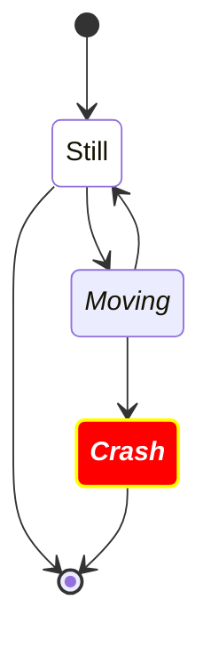
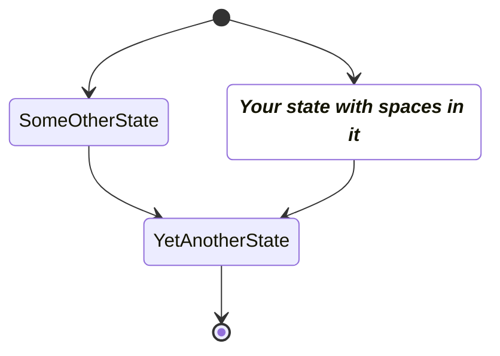
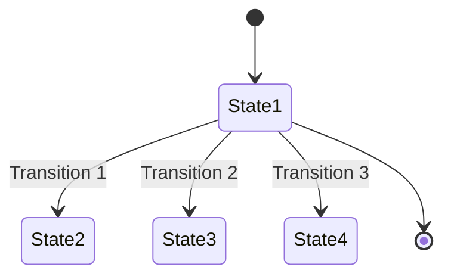
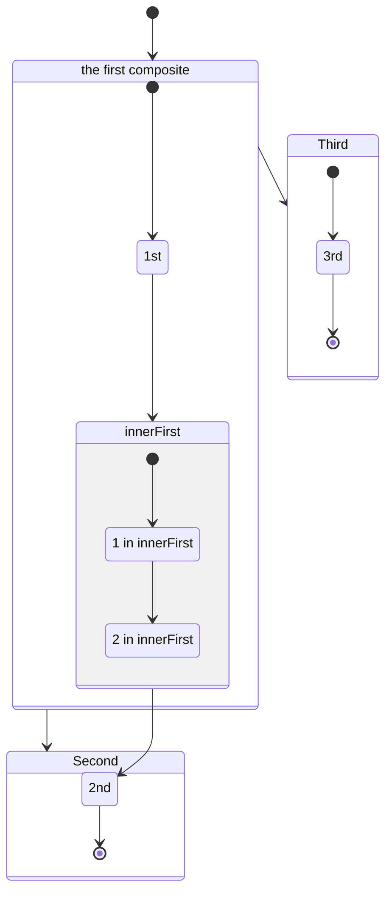
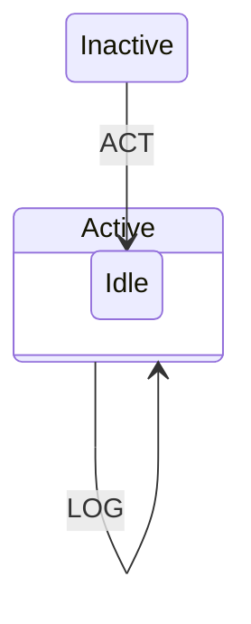
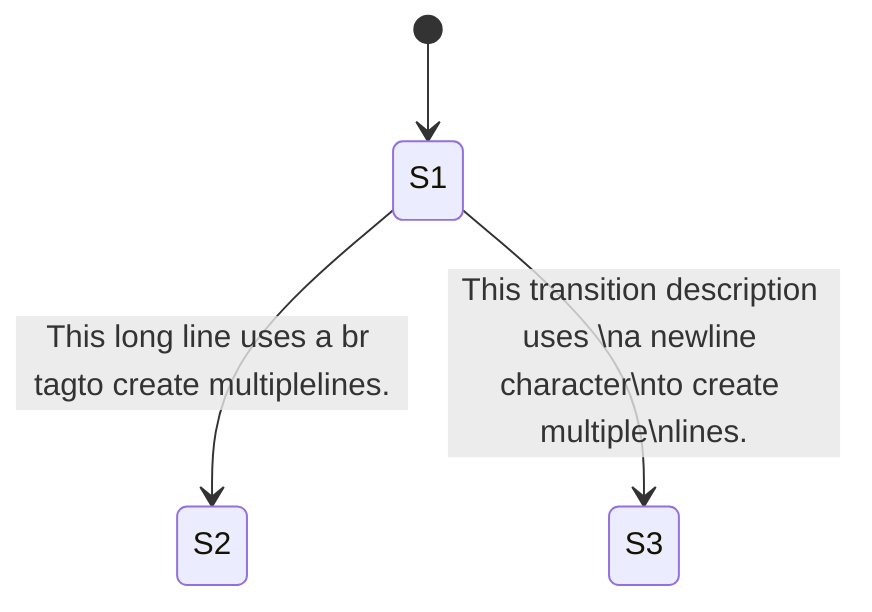
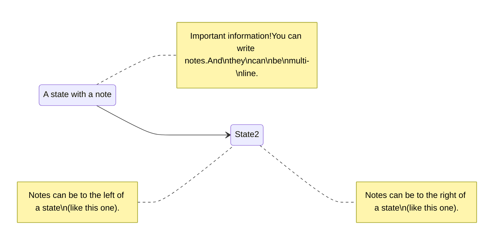

# state

## Example 1

**SebastianJS (SVG):**

> Render failed: Error: Diagrams beginning with --- are not valid. If you were trying to use a YAML front-matter, please ensure that you've correctly opened and closed the YAML front-matter with un-indented `---` blocks

**Mermaid Code (Browser Rendered):**

```mermaid
---
    title: Very simple diagram
    ---
    stateDiagram
      accTitle: This is the accessible title
      accDescr:This is an accessible description
      State1 --> State2
```

## Example 2

**SebastianJS (SVG):**

> Render failed: Error: Diagrams beginning with --- are not valid. If you were trying to use a YAML front-matter, please ensure that you've correctly opened and closed the YAML front-matter with un-indented `---` blocks

**Mermaid Code (Browser Rendered):**

```mermaid
---
    title: Very simple diagram
    ---
    stateDiagram
      direction TB

      accTitle: This is the accessible title
      accDescr: This is an accessible description

      classDef notMoving fill:white
      classDef movement font-style:italic
      classDef badBadEvent fill:#f00,color:white,font-weight:bold,stroke-width:2px,stroke:yellow

      [*]--> Still
      Still --> [*]
      Still --> Moving
      Moving --> Still
      Moving --> Crash
      Crash --> [*]

      class Still notMoving
      class Moving, Crash movement
      class Crash badBadEvent
      class end badBadEvent
```

## Example 3

**SebastianJS (SVG):**

<svg id="graph" xmlns="http://www.w3.org/2000/svg" xmlns:xlink="http://www.w3.org/1999/xlink" class="statediagram" style="max-width: 41066px;" viewBox="-4 -4 44 310" role="graphics-document document" aria-roledescription="stateDiagram" aria-describedby="chart-desc-graph" aria-labelledby="chart-title-graph"><title id="chart-title-graph">This is the accessible title</title><desc id="chart-desc-graph">This is an accessible description</desc><style>#graph{font-family:"trebuchet ms",verdana,arial,sans-serif;font-size:16px;fill:#333;}@keyframes edge-animation-frame{from{stroke-dashoffset:0;}}@keyframes dash{to{stroke-dashoffset:0;}}#graph .edge-animation-slow{stroke-dasharray:9,5!important;stroke-dashoffset:900;animation:dash 50s linear infinite;stroke-linecap:round;}#graph .edge-animation-fast{stroke-dasharray:9,5!important;stroke-dashoffset:900;animation:dash 20s linear infinite;stroke-linecap:round;}#graph .error-icon{fill:#552222;}#graph .error-text{fill:#552222;stroke:#552222;}#graph .edge-thickness-normal{stroke-width:1px;}#graph .edge-thickness-thick{stroke-width:3.5px;}#graph .edge-pattern-solid{stroke-dasharray:0;}#graph .edge-thickness-invisible{stroke-width:0;fill:none;}#graph .edge-pattern-dashed{stroke-dasharray:3;}#graph .edge-pattern-dotted{stroke-dasharray:2;}#graph .marker{fill:#333333;stroke:#333333;}#graph .marker.cross{stroke:#333333;}#graph svg{font-family:"trebuchet ms",verdana,arial,sans-serif;font-size:16px;}#graph p{margin:0;}#graph defs #statediagram-barbEnd{fill:#333333;stroke:#333333;}#graph g.stateGroup text{fill:#9370DB;stroke:none;font-size:10px;}#graph g.stateGroup text{fill:#333;stroke:none;font-size:10px;}#graph g.stateGroup .state-title{font-weight:bolder;fill:#131300;}#graph g.stateGroup rect{fill:#ECECFF;stroke:#9370DB;}#graph g.stateGroup line{stroke:#333333;stroke-width:1;}#graph .transition{stroke:#333333;stroke-width:1;fill:none;}#graph .stateGroup .composit{fill:white;border-bottom:1px;}#graph .stateGroup .alt-composit{fill:#e0e0e0;border-bottom:1px;}#graph .state-note{stroke:#aaaa33;fill:#fff5ad;}#graph .state-note text{fill:black;stroke:none;font-size:10px;}#graph .stateLabel .box{stroke:none;stroke-width:0;fill:#ECECFF;opacity:0.5;}#graph .edgeLabel .label rect{fill:#ECECFF;opacity:0.5;}#graph .edgeLabel{background-color:rgba(232,232,232, 0.8);text-align:center;}#graph .edgeLabel p{background-color:rgba(232,232,232, 0.8);}#graph .edgeLabel rect{opacity:0.5;background-color:rgba(232,232,232, 0.8);fill:rgba(232,232,232, 0.8);}#graph .edgeLabel .label text{fill:#333;}#graph .label div .edgeLabel{color:#333;}#graph .stateLabel text{fill:#131300;font-size:10px;font-weight:bold;}#graph .node circle.state-start{fill:#333333;stroke:#333333;}#graph .node .fork-join{fill:#333333;stroke:#333333;}#graph .node circle.state-end{fill:#9370DB;stroke:white;stroke-width:1.5;}#graph .end-state-inner{fill:white;stroke-width:1.5;}#graph .node rect{fill:#ECECFF;stroke:#9370DB;stroke-width:1px;}#graph .node polygon{fill:#ECECFF;stroke:#9370DB;stroke-width:1px;}#graph #statediagram-barbEnd{fill:#333333;}#graph .statediagram-cluster rect{fill:#ECECFF;stroke:#9370DB;stroke-width:1px;}#graph .cluster-label,#graph .nodeLabel{color:#131300;}#graph .statediagram-cluster rect.outer{rx:5px;ry:5px;}#graph .statediagram-state .divider{stroke:#9370DB;}#graph .statediagram-state .title-state{rx:5px;ry:5px;}#graph .statediagram-cluster.statediagram-cluster .inner{fill:white;}#graph .statediagram-cluster.statediagram-cluster-alt .inner{fill:#f0f0f0;}#graph .statediagram-cluster .inner{rx:0;ry:0;}#graph .statediagram-state rect.basic{rx:5px;ry:5px;}#graph .statediagram-state rect.divider{stroke-dasharray:10,10;fill:#f0f0f0;}#graph .note-edge{stroke-dasharray:5;}#graph .statediagram-note rect{fill:#fff5ad;stroke:#aaaa33;stroke-width:1px;rx:0;ry:0;}#graph .statediagram-note rect{fill:#fff5ad;stroke:#aaaa33;stroke-width:1px;rx:0;ry:0;}#graph .statediagram-note text{fill:black;}#graph .statediagram-note .nodeLabel{color:black;}#graph .statediagram .edgeLabel{color:red;}#graph #dependencyStart,#graph #dependencyEnd{fill:#333333;stroke:#333333;stroke-width:1;}#graph .statediagramTitleText{text-anchor:middle;font-size:18px;fill:#333;}#graph :root{--mermaid-font-family:"trebuchet ms",verdana,arial,sans-serif;}#graph .notMoving rect{fill:white!important;}#graph .notMoving polygon{fill:white!important;}#graph .notMoving ellipse{fill:white!important;}#graph .notMoving circle{fill:white!important;}#graph .notMoving path{fill:white!important;}#graph .movement rect{font-style:italic!important;}#graph .movement polygon{font-style:italic!important;}#graph .movement ellipse{font-style:italic!important;}#graph .movement circle{font-style:italic!important;}#graph .movement path{font-style:italic!important;}#graph .badBadEvent rect{fill:#f00!important;color:white!important;font-weight:bold!important;stroke-width:2px!important;stroke:yellow!important;}#graph .badBadEvent polygon{fill:#f00!important;color:white!important;font-weight:bold!important;stroke-width:2px!important;stroke:yellow!important;}#graph .badBadEvent ellipse{fill:#f00!important;color:white!important;font-weight:bold!important;stroke-width:2px!important;stroke:yellow!important;}#graph .badBadEvent circle{fill:#f00!important;color:white!important;font-weight:bold!important;stroke-width:2px!important;stroke:yellow!important;}#graph .badBadEvent path{fill:#f00!important;color:white!important;font-weight:bold!important;stroke-width:2px!important;stroke:yellow!important;}#graph .badBadEvent tspan{fill:white!important;}</style><g><defs><marker id="graph_stateDiagram-barbEnd" refX="19" refY="7" markerWidth="20" markerHeight="14" markerUnits="userSpaceOnUse" orient="auto"><path d="M 19,7 L9,13 L14,7 L9,1 Z"/></marker></defs><g class="root"><g class="clusters"/><g class="edgePaths"><path d="M45.5,27L45.5,34C45.5,41,45.5,55,45.583,68.25C45.667,81.5,45.833,94,45.917,100.25L46,106.5" id="edge0" class=" edge-thickness-normal edge-pattern-solid transition" style="fill:none;" marker-end="url(#graph_stateDiagram-barbEnd)"/><path d="M41,126.038L36.333,132.865C31.667,139.692,22.333,153.346,17.667,168.34C13,183.333,13,199.667,13,216C13,232.333,13,248.667,13,265C13,281.333,13,297.667,13,314C13,330.333,13,346.667,17.012,361.983C21.025,377.299,29.049,391.597,33.062,398.746L37.074,405.896" id="edge1" class=" edge-thickness-normal edge-pattern-solid transition" style="fill:none;" marker-end="url(#graph_stateDiagram-barbEnd)"/><path d="M46,146.5L45.917,149.917C45.833,153.333,45.667,160.167,47.618,170.04C49.569,179.914,53.638,192.828,55.672,199.285L57.707,205.742" id="edge2" class=" edge-thickness-normal edge-pattern-solid transition" style="fill:none;" marker-end="url(#graph_stateDiagram-barbEnd)"/><path d="M64.673,204.5L66.478,198.25C68.282,192,71.891,179.5,71.636,169.833C71.381,160.167,67.262,153.333,65.202,149.917L63.143,146.5" id="edge3" class=" edge-thickness-normal edge-pattern-solid transition" style="fill:none;" marker-end="url(#graph_stateDiagram-barbEnd)"/><path d="M61,244.5L60.917,247.917C60.833,251.333,60.667,258.167,60.667,267.833C60.667,277.5,60.833,290,60.917,296.25L61,302.5" id="edge4" class=" edge-thickness-normal edge-pattern-solid transition" style="fill:none;" marker-end="url(#graph_stateDiagram-barbEnd)"/><path d="M61,342.5L60.917,345.917C60.833,349.333,60.667,356.167,57.691,366.67C54.715,377.173,48.93,391.346,46.038,398.433L43.145,405.519" id="edge5" class=" edge-thickness-normal edge-pattern-solid transition" style="fill:none;" marker-end="url(#graph_stateDiagram-barbEnd)"/></g><g class="edgeLabels"><g><rect class="background" style="stroke: none"/></g><g><rect class="background" style="stroke: none"/></g><g><rect class="background" style="stroke: none"/></g><g><rect class="background" style="stroke: none"/></g><g><rect class="background" style="stroke: none"/></g><g><rect class="background" style="stroke: none"/></g><g class="edgeLabel"><g class="label" transform="translate(-5, -12)"><text y="-10.1"><tspan class="text-outer-tspan" x="0" y="-0.1em" dy="1.1em"/></text></g></g><g class="edgeLabel"><g class="label" transform="translate(-5, -12)"><text y="-10.1"><tspan class="text-outer-tspan" x="0" y="-0.1em" dy="1.1em"/></text></g></g><g class="edgeLabel"><g class="label" transform="translate(-5, -12)"><text y="-10.1"><tspan class="text-outer-tspan" x="0" y="-0.1em" dy="1.1em"/></text></g></g><g class="edgeLabel"><g class="label" transform="translate(-5, -12)"><text y="-10.1"><tspan class="text-outer-tspan" x="0" y="-0.1em" dy="1.1em"/></text></g></g><g class="edgeLabel"><g class="label" transform="translate(-5, -12)"><text y="-10.1"><tspan class="text-outer-tspan" x="0" y="-0.1em" dy="1.1em"/></text></g></g><g class="edgeLabel"><g class="label" transform="translate(-5, -12)"><text y="-10.1"><tspan class="text-outer-tspan" x="0" y="-0.1em" dy="1.1em"/></text></g></g></g><g class="nodes"><g class="node default" id="state-root_start-0" transform="translate(45.5, 20)"><circle class="state-start" r="7" width="14" height="14"/></g><g class="node notMoving statediagram-state " id="state-Still-3" transform="translate(45.5, 118)"><g class="basic label-container outer-path"><path d="M-28 -20 C-16.12608807107437 -20, -4.252176142148738 -20, 28 -20 C28 -20, 28 -20, 28 -20 C28.141055020567336 -19.9941659211945, 28.282110041134672 -19.988331842389, 28.412896727361662 -19.982922465033347 C28.535741030749513 -19.96760993858497, 28.658585334137364 -19.95229741213659, 28.82297295140367 -19.931806517013612 C28.983122581162867 -19.89822667088095, 29.143272210922067 -19.864646824748288, 29.227427435703998 -19.847001329696653 C29.381118220889967 -19.801245600494934, 29.534809006075935 -19.755489871293214, 29.623497346023417 -19.729086208503173 C29.70363243218783 -19.697817400851182, 29.783767518352242 -19.66654859319919, 30.008477123264846 -19.578866633275286 C30.11305041245799 -19.527743867326038, 30.217623701651135 -19.476621101376793, 30.37973696518537 -19.397368756032446 C30.482090810159185 -19.33637910259751, 30.584444655133005 -19.27538944916257, 30.734740790612136 -19.185832391312644 C30.859201468282357 -19.09696917547327, 30.98366214595258 -19.008105959633895, 31.07106356344834 -18.94570254698197 C31.153228053615752 -18.87611277360391, 31.235392543783163 -18.80652300022585, 31.386407858128706 -18.678619553365657 C31.459689547753822 -18.60533786374054, 31.53297123737894 -18.53205617411542, 31.678619553365657 -18.386407858128706 C31.740126203362504 -18.31378709370343, 31.80163285335935 -18.241166329278155, 31.94570254698197 -18.07106356344834 C32.03334651993966 -17.94831054168349, 32.12099049289736 -17.82555751991864, 32.185832391312644 -17.734740790612136 C32.23925949883616 -17.64507853524787, 32.29268660635968 -17.555416279883605, 32.39736875603245 -17.37973696518537 C32.44575578029456 -17.28075972505754, 32.494142804556674 -17.181782484929705, 32.57886663327529 -17.008477123264846 C32.61839128954488 -16.907184110399328, 32.65791594581447 -16.80589109753381, 32.729086208503176 -16.623497346023417 C32.77169545021341 -16.480375426017417, 32.81430469192364 -16.33725350601142, 32.84700132969665 -16.227427435703994 C32.8695251021858 -16.120006638995584, 32.892048874674934 -16.012585842287177, 32.93180651701361 -15.82297295140367 C32.94386999266809 -15.726194064640143, 32.95593346832258 -15.629415177876618, 32.98292246503335 -15.412896727361662 C32.98929868425646 -15.258733960000587, 32.995674903479575 -15.104571192639511, 33 -15 C33 -15, 33 -15, 33 -15 C33 -5.139523623835528, 33 4.7209527523289445, 33 15 C33 15, 33 15, 33 15 C32.99338393046173 15.15996181332278, 32.98676786092346 15.31992362664556, 32.98292246503335 15.412896727361662 C32.96251157561118 15.576642501192325, 32.94210068618902 15.740388275022989, 32.93180651701361 15.822972951403669 C32.913365174243104 15.910923748000275, 32.894923831472596 15.998874544596882, 32.84700132969665 16.227427435703994 C32.81400152932888 16.338271811216927, 32.78100172896111 16.449116186729864, 32.729086208503176 16.623497346023417 C32.69351830987384 16.714650058115005, 32.6579504112445 16.80580277020659, 32.57886663327529 17.008477123264846 C32.53792153719811 17.092231655978726, 32.49697644112093 17.1759861886926, 32.39736875603245 17.379736965185366 C32.329684140959074 17.493326405494663, 32.2619995258857 17.60691584580396, 32.185832391312644 17.734740790612133 C32.11099547951493 17.839556407165173, 32.03615856771722 17.94437202371821, 31.94570254698197 18.07106356344834 C31.87310971920429 18.156773753245343, 31.800516891426614 18.24248394304234, 31.678619553365657 18.386407858128706 C31.615281723504722 18.44974568798964, 31.551943893643784 18.51308351785058, 31.386407858128706 18.678619553365657 C31.28314071328807 18.766082363543347, 31.179873568447434 18.853545173721038, 31.07106356344834 18.94570254698197 C31.000466954631484 18.99610755685539, 30.92987034581463 19.04651256672881, 30.734740790612136 19.185832391312644 C30.632184830650882 19.246942479139086, 30.529628870689628 19.308052566965532, 30.37973696518537 19.397368756032446 C30.30415935852745 19.434316396543597, 30.228581751869527 19.471264037054752, 30.008477123264846 19.578866633275286 C29.89058622842642 19.624867803188057, 29.772695333587993 19.670868973100827, 29.623497346023417 19.729086208503173 C29.48930678627985 19.76903646905799, 29.355116226536282 19.808986729612805, 29.227427435703998 19.847001329696653 C29.12092056213859 19.869333472654304, 29.01441368857318 19.891665615611956, 28.82297295140367 19.931806517013612 C28.659446787712408 19.952190032060447, 28.495920624021146 19.97257354710728, 28.412896727361662 19.982922465033347 C28.290954124142583 19.98796604841001, 28.169011520923505 19.993009631786666, 28 20 C28 20, 28 20, 28 20 C13.53189994058632 20, -0.9362001188273616 20, -28 20 C-28 20, -28 20, -28 20 C-28.1072361997645 19.995564677969547, -28.214472399528997 19.991129355939094, -28.412896727361662 19.982922465033347 C-28.510354047117435 19.970774422794573, -28.607811366873207 19.958626380555803, -28.82297295140367 19.931806517013612 C-28.9402648266129 19.907212997015723, -29.057556701822133 19.882619477017833, -29.227427435703994 19.847001329696653 C-29.34000837724684 19.81348453122187, -29.452589318789688 19.77996773274709, -29.623497346023417 19.729086208503173 C-29.722925946276586 19.690289048292424, -29.82235454652976 19.651491888081672, -30.008477123264846 19.578866633275286 C-30.096746132576186 19.535714544071503, -30.185015141887522 19.492562454867723, -30.37973696518537 19.397368756032446 C-30.506344851419247 19.321926830958606, -30.632952737653124 19.246484905884763, -30.734740790612133 19.185832391312644 C-30.832982798095053 19.115688946179077, -30.93122480557797 19.045545501045506, -31.07106356344834 18.94570254698197 C-31.163358295315692 18.86753289654598, -31.255653027183047 18.789363246109993, -31.386407858128706 18.678619553365657 C-31.47326883438165 18.591758577112714, -31.560129810634592 18.50489760085977, -31.678619553365657 18.386407858128706 C-31.763260004444376 18.28647306637933, -31.847900455523092 18.18653827462995, -31.945702546981966 18.07106356344834 C-32.03186409892005 17.950386801505402, -32.11802565085814 17.82971003956246, -32.185832391312644 17.734740790612133 C-32.260918254646704 17.60873045307811, -32.33600411798076 17.48272011554409, -32.39736875603244 17.37973696518537 C-32.435881450728914 17.300957989022383, -32.47439414542539 17.2221790128594, -32.57886663327528 17.00847712326485 C-32.63523570112353 16.864015583211884, -32.69160476897177 16.719554043158915, -32.729086208503176 16.623497346023417 C-32.76470495261236 16.503856093551065, -32.800323696721556 16.384214841078713, -32.84700132969665 16.227427435703994 C-32.86826420043089 16.126020155210416, -32.88952707116513 16.024612874716833, -32.93180651701361 15.82297295140367 C-32.94256138498791 15.736692332148223, -32.95331625296222 15.650411712892774, -32.98292246503335 15.412896727361664 C-32.987692277207316 15.29757330155066, -32.992462089381284 15.182249875739656, -33 15 C-33 15, -33 15, -33 15 C-33 8.319884690204074, -33 1.639769380408147, -33 -15 C-33 -15, -33 -15, -33 -15 C-32.9956639777414 -15.10483535263366, -32.9913279554828 -15.209670705267323, -32.98292246503335 -15.41289672736166 C-32.967370750202285 -15.537659912675906, -32.95181903537122 -15.662423097990152, -32.93180651701361 -15.822972951403669 C-32.90129561330104 -15.968486123616643, -32.87078470958846 -16.113999295829615, -32.84700132969665 -16.227427435703994 C-32.815954998966944 -16.33171022236785, -32.78490866823724 -16.435993009031705, -32.729086208503176 -16.623497346023417 C-32.67572064371053 -16.76026156743111, -32.622355078917884 -16.897025788838803, -32.57886663327529 -17.008477123264846 C-32.52157344867778 -17.125672205543058, -32.464280264080266 -17.24286728782127, -32.39736875603245 -17.379736965185366 C-32.34103189569163 -17.474282415845902, -32.28469503535081 -17.568827866506435, -32.185832391312644 -17.734740790612133 C-32.12349511280894 -17.82204958147013, -32.06115783430523 -17.909358372328125, -31.94570254698197 -18.07106356344834 C-31.844801309618916 -18.190197429284588, -31.74390007225586 -18.309331295120835, -31.67861955336566 -18.386407858128706 C-31.598153877732464 -18.466873533761902, -31.517688202099265 -18.547339209395098, -31.386407858128706 -18.678619553365657 C-31.322596891530335 -18.732664685217237, -31.25878592493196 -18.786709817068814, -31.07106356344834 -18.945702546981966 C-30.95178653928813 -19.030864705352275, -30.832509515127914 -19.116026863722585, -30.734740790612136 -19.185832391312644 C-30.62163121813589 -19.253231067222327, -30.508521645659645 -19.320629743132006, -30.379736965185366 -19.397368756032446 C-30.30315585867452 -19.434806977728403, -30.226574752163668 -19.472245199424364, -30.00847712326485 -19.578866633275286 C-29.9079371544402 -19.618097450848314, -29.807397185615557 -19.65732826842134, -29.62349734602342 -19.729086208503173 C-29.536238125820972 -19.755064403910954, -29.448978905618528 -19.781042599318734, -29.227427435703994 -19.847001329696653 C-29.074006069197566 -19.87917040738041, -28.920584702691134 -19.911339485064172, -28.822972951403674 -19.931806517013612 C-28.675150457468323 -19.950232571666742, -28.52732796353297 -19.968658626319872, -28.412896727361662 -19.982922465033347 C-28.31309348076097 -19.987050357846883, -28.213290234160276 -19.99117825066042, -28 -20 C-28 -20, -28 -20, -28 -20" stroke="none" stroke-width="0" fill="white" style="fill:white !important"/><path d="M-28 -20 C-13.768902642119869 -20, 0.46219471576026194 -20, 28 -20 M-28 -20 C-13.778247520806294 -20, 0.4435049583874111 -20, 28 -20 M28 -20 C28 -20, 28 -20, 28 -20 M28 -20 C28 -20, 28 -20, 28 -20 M28 -20 C28.152846884541102 -19.993678206092905, 28.305693769082204 -19.987356412185807, 28.412896727361662 -19.982922465033347 M28 -20 C28.096082524574513 -19.996025997387797, 28.192165049149025 -19.992051994775593, 28.412896727361662 -19.982922465033347 M28.412896727361662 -19.982922465033347 C28.508006352973275 -19.971067062564458, 28.603115978584885 -19.959211660095573, 28.82297295140367 -19.931806517013612 M28.412896727361662 -19.982922465033347 C28.564084919865206 -19.96407687649121, 28.71527311236875 -19.945231287949074, 28.82297295140367 -19.931806517013612 M28.82297295140367 -19.931806517013612 C28.940574406749775 -19.907148084887123, 29.058175862095876 -19.882489652760636, 29.227427435703998 -19.847001329696653 M28.82297295140367 -19.931806517013612 C28.911907106245717 -19.913158985701646, 29.000841261087764 -19.89451145438968, 29.227427435703998 -19.847001329696653 M29.227427435703998 -19.847001329696653 C29.372669665915982 -19.80376084428829, 29.51791189612797 -19.76052035887993, 29.623497346023417 -19.729086208503173 M29.227427435703998 -19.847001329696653 C29.36474178668094 -19.80612107619799, 29.50205613765789 -19.765240822699326, 29.623497346023417 -19.729086208503173 M29.623497346023417 -19.729086208503173 C29.766911754126063 -19.673125732809854, 29.910326162228714 -19.617165257116532, 30.008477123264846 -19.578866633275286 M29.623497346023417 -19.729086208503173 C29.717955919024988 -19.692228358943897, 29.81241449202656 -19.65537050938462, 30.008477123264846 -19.578866633275286 M30.008477123264846 -19.578866633275286 C30.156724820557994 -19.506392750224382, 30.30497251785114 -19.433918867173475, 30.37973696518537 -19.397368756032446 M30.008477123264846 -19.578866633275286 C30.148216510801014 -19.51055220941024, 30.28795589833718 -19.442237785545192, 30.37973696518537 -19.397368756032446 M30.37973696518537 -19.397368756032446 C30.48474450787018 -19.334797841983843, 30.58975205055499 -19.272226927935236, 30.734740790612136 -19.185832391312644 M30.37973696518537 -19.397368756032446 C30.5129980233138 -19.31796240101271, 30.646259081442228 -19.238556045992976, 30.734740790612136 -19.185832391312644 M30.734740790612136 -19.185832391312644 C30.80600421497585 -19.13495128428971, 30.877267639339564 -19.08407017726677, 31.07106356344834 -18.94570254698197 M30.734740790612136 -19.185832391312644 C30.847507423259398 -19.105318563138216, 30.96027405590666 -19.02480473496379, 31.07106356344834 -18.94570254698197 M31.07106356344834 -18.94570254698197 C31.187694884770686 -18.846920856703502, 31.30432620609303 -18.748139166425034, 31.386407858128706 -18.678619553365657 M31.07106356344834 -18.94570254698197 C31.18482761586241 -18.849349309592753, 31.29859166827648 -18.752996072203533, 31.386407858128706 -18.678619553365657 M31.386407858128706 -18.678619553365657 C31.44604787993032 -18.618979531564044, 31.505687901731932 -18.55933950976243, 31.678619553365657 -18.386407858128706 M31.386407858128706 -18.678619553365657 C31.482259305169464 -18.5827681063249, 31.57811075221022 -18.486916659284145, 31.678619553365657 -18.386407858128706 M31.678619553365657 -18.386407858128706 C31.742887241878663 -18.310527141687487, 31.80715493039167 -18.23464642524627, 31.94570254698197 -18.07106356344834 M31.678619553365657 -18.386407858128706 C31.748716173977613 -18.303644934563046, 31.81881279458957 -18.22088201099739, 31.94570254698197 -18.07106356344834 M31.94570254698197 -18.07106356344834 C32.00912941705361 -17.982228704648207, 32.07255628712524 -17.89339384584807, 32.185832391312644 -17.734740790612136 M31.94570254698197 -18.07106356344834 C32.02065452875639 -17.96608678136528, 32.0956065105308 -17.86110999928222, 32.185832391312644 -17.734740790612136 M32.185832391312644 -17.734740790612136 C32.24314693690809 -17.638554572389413, 32.30046148250354 -17.54236835416669, 32.39736875603245 -17.37973696518537 M32.185832391312644 -17.734740790612136 C32.23646468360576 -17.64976884038509, 32.28709697589887 -17.564796890158043, 32.39736875603245 -17.37973696518537 M32.39736875603245 -17.37973696518537 C32.43535924408706 -17.302026179781716, 32.47334973214166 -17.22431539437806, 32.57886663327529 -17.008477123264846 M32.39736875603245 -17.37973696518537 C32.45074592263085 -17.270552225757406, 32.50412308922925 -17.161367486329443, 32.57886663327529 -17.008477123264846 M32.57886663327529 -17.008477123264846 C32.62647211318056 -16.886474734284583, 32.67407759308583 -16.76447234530432, 32.729086208503176 -16.623497346023417 M32.57886663327529 -17.008477123264846 C32.63577263901394 -16.862639529331226, 32.69267864475259 -16.716801935397605, 32.729086208503176 -16.623497346023417 M32.729086208503176 -16.623497346023417 C32.763524511813486 -16.50782112430045, 32.797962815123796 -16.392144902577485, 32.84700132969665 -16.227427435703994 M32.729086208503176 -16.623497346023417 C32.76066072404541 -16.51744041784818, 32.79223523958764 -16.411383489672946, 32.84700132969665 -16.227427435703994 M32.84700132969665 -16.227427435703994 C32.87247593023711 -16.105933494704388, 32.897950530777564 -15.984439553704782, 32.93180651701361 -15.82297295140367 M32.84700132969665 -16.227427435703994 C32.870930193772224 -16.11330544994143, 32.894859057847796 -15.999183464178863, 32.93180651701361 -15.82297295140367 M32.93180651701361 -15.82297295140367 C32.94791653773094 -15.693730773161182, 32.96402655844827 -15.564488594918695, 32.98292246503335 -15.412896727361662 M32.93180651701361 -15.82297295140367 C32.94379054307775 -15.726831446695439, 32.9557745691419 -15.630689941987207, 32.98292246503335 -15.412896727361662 M32.98292246503335 -15.412896727361662 C32.98711287024799 -15.311582070250855, 32.99130327546263 -15.21026741314005, 33 -15 M32.98292246503335 -15.412896727361662 C32.9895035255094 -15.253781355123428, 32.99608458598545 -15.094665982885193, 33 -15 M33 -15 C33 -15, 33 -15, 33 -15 M33 -15 C33 -15, 33 -15, 33 -15 M33 -15 C33 -8.793262731721287, 33 -2.586525463442573, 33 15 M33 -15 C33 -5.726032271398955, 33 3.5479354572020902, 33 15 M33 15 C33 15, 33 15, 33 15 M33 15 C33 15, 33 15, 33 15 M33 15 C32.99369229984809 15.152506128957615, 32.98738459969618 15.30501225791523, 32.98292246503335 15.412896727361662 M33 15 C32.99393623151072 15.146608405111685, 32.98787246302145 15.293216810223369, 32.98292246503335 15.412896727361662 M32.98292246503335 15.412896727361662 C32.97228362311433 15.498246530922916, 32.961644781195304 15.58359633448417, 32.93180651701361 15.822972951403669 M32.98292246503335 15.412896727361662 C32.969800809676116 15.518164830381055, 32.95667915431888 15.623432933400448, 32.93180651701361 15.822972951403669 M32.93180651701361 15.822972951403669 C32.9078922535134 15.93702530382936, 32.883977990013186 16.05107765625505, 32.84700132969665 16.227427435703994 M32.93180651701361 15.822972951403669 C32.90416787284557 15.954787689716374, 32.87652922867753 16.08660242802908, 32.84700132969665 16.227427435703994 M32.84700132969665 16.227427435703994 C32.805364723403116 16.367282330935176, 32.76372811710958 16.507137226166357, 32.729086208503176 16.623497346023417 M32.84700132969665 16.227427435703994 C32.815512745045616 16.333195727103696, 32.78402416039457 16.438964018503395, 32.729086208503176 16.623497346023417 M32.729086208503176 16.623497346023417 C32.68203042295125 16.744090989110337, 32.634974637399324 16.864684632197253, 32.57886663327529 17.008477123264846 M32.729086208503176 16.623497346023417 C32.69545358104953 16.709690383152626, 32.66182095359587 16.795883420281832, 32.57886663327529 17.008477123264846 M32.57886663327529 17.008477123264846 C32.52324440869465 17.122254202196995, 32.467622184114006 17.236031281129144, 32.39736875603245 17.379736965185366 M32.57886663327529 17.008477123264846 C32.51738931603361 17.134230985665706, 32.455911998791926 17.259984848066566, 32.39736875603245 17.379736965185366 M32.39736875603245 17.379736965185366 C32.31949125458577 17.510432275965005, 32.24161375313909 17.641127586744645, 32.185832391312644 17.734740790612133 M32.39736875603245 17.379736965185366 C32.33279948838079 17.48809817793337, 32.26823022072914 17.596459390681378, 32.185832391312644 17.734740790612133 M32.185832391312644 17.734740790612133 C32.12381612689671 17.821599973265773, 32.06179986248079 17.908459155919413, 31.94570254698197 18.07106356344834 M32.185832391312644 17.734740790612133 C32.13412178726197 17.807165997848806, 32.082411183211285 17.879591205085482, 31.94570254698197 18.07106356344834 M31.94570254698197 18.07106356344834 C31.884962495378613 18.142779206860762, 31.824222443775255 18.214494850273187, 31.678619553365657 18.386407858128706 M31.94570254698197 18.07106356344834 C31.873350892671557 18.156489000270618, 31.800999238361143 18.241914437092895, 31.678619553365657 18.386407858128706 M31.678619553365657 18.386407858128706 C31.60855633268643 18.456471078807933, 31.538493112007203 18.52653429948716, 31.386407858128706 18.678619553365657 M31.678619553365657 18.386407858128706 C31.56707052149022 18.497956890004144, 31.455521489614778 18.609505921879585, 31.386407858128706 18.678619553365657 M31.386407858128706 18.678619553365657 C31.268128155441328 18.77879735144446, 31.149848452753954 18.878975149523264, 31.07106356344834 18.94570254698197 M31.386407858128706 18.678619553365657 C31.27396366040369 18.77385493085559, 31.161519462678672 18.869090308345527, 31.07106356344834 18.94570254698197 M31.07106356344834 18.94570254698197 C30.9625365167138 19.023189368996025, 30.85400946997926 19.10067619101008, 30.734740790612136 19.185832391312644 M31.07106356344834 18.94570254698197 C30.959416933272053 19.025416708762307, 30.84777030309576 19.105130870542645, 30.734740790612136 19.185832391312644 M30.734740790612136 19.185832391312644 C30.615730404758594 19.256747188799952, 30.496720018905055 19.32766198628726, 30.37973696518537 19.397368756032446 M30.734740790612136 19.185832391312644 C30.63351677410145 19.246148813112512, 30.532292757590763 19.30646523491238, 30.37973696518537 19.397368756032446 M30.37973696518537 19.397368756032446 C30.291947096616887 19.440286607600186, 30.204157228048402 19.483204459167926, 30.008477123264846 19.578866633275286 M30.37973696518537 19.397368756032446 C30.28907681533332 19.441689802616814, 30.19841666548127 19.486010849201183, 30.008477123264846 19.578866633275286 M30.008477123264846 19.578866633275286 C29.905706997381127 19.61896766083312, 29.802936871497412 19.65906868839096, 29.623497346023417 19.729086208503173 M30.008477123264846 19.578866633275286 C29.895388676527045 19.622993882124206, 29.782300229789243 19.667121130973126, 29.623497346023417 19.729086208503173 M29.623497346023417 19.729086208503173 C29.540298550774466 19.753855563027024, 29.45709975552552 19.778624917550875, 29.227427435703998 19.847001329696653 M29.623497346023417 19.729086208503173 C29.510767268120816 19.762647406795956, 29.398037190218215 19.796208605088744, 29.227427435703998 19.847001329696653 M29.227427435703998 19.847001329696653 C29.112043394582 19.87119481895334, 28.99665935346 19.895388308210027, 28.82297295140367 19.931806517013612 M29.227427435703998 19.847001329696653 C29.133849237451898 19.86662261451262, 29.040271039199798 19.886243899328594, 28.82297295140367 19.931806517013612 M28.82297295140367 19.931806517013612 C28.668303867774398 19.95108599818208, 28.513634784145125 19.970365479350544, 28.412896727361662 19.982922465033347 M28.82297295140367 19.931806517013612 C28.73137798434643 19.943223817750578, 28.639783017289194 19.954641118487544, 28.412896727361662 19.982922465033347 M28.412896727361662 19.982922465033347 C28.264950777752592 19.989041554772246, 28.11700482814352 19.995160644511145, 28 20 M28.412896727361662 19.982922465033347 C28.314703115717823 19.98698378285261, 28.216509504073983 19.991045100671876, 28 20 M28 20 C28 20, 28 20, 28 20 M28 20 C28 20, 28 20, 28 20 M28 20 C9.489317853692686 20, -9.021364292614628 20, -28 20 M28 20 C9.519974163187975 20, -8.96005167362405 20, -28 20 M-28 20 C-28 20, -28 20, -28 20 M-28 20 C-28 20, -28 20, -28 20 M-28 20 C-28.1482073681171 19.99387009791163, -28.2964147362342 19.98774019582326, -28.412896727361662 19.982922465033347 M-28 20 C-28.099214685593935 19.99589645024977, -28.19842937118787 19.99179290049954, -28.412896727361662 19.982922465033347 M-28.412896727361662 19.982922465033347 C-28.515935640814252 19.970078677865835, -28.618974554266845 19.957234890698324, -28.82297295140367 19.931806517013612 M-28.412896727361662 19.982922465033347 C-28.534677079055726 19.967742560025293, -28.65645743074979 19.952562655017243, -28.82297295140367 19.931806517013612 M-28.82297295140367 19.931806517013612 C-28.94787294660727 19.905617742008552, -29.072772941810868 19.879428967003495, -29.227427435703994 19.847001329696653 M-28.82297295140367 19.931806517013612 C-28.968679113484846 19.901255147581015, -29.114385275566026 19.87070377814842, -29.227427435703994 19.847001329696653 M-29.227427435703994 19.847001329696653 C-29.366497551128266 19.80559836247448, -29.50556766655254 19.764195395252305, -29.623497346023417 19.729086208503173 M-29.227427435703994 19.847001329696653 C-29.350437235886318 19.81037972548343, -29.47344703606864 19.77375812127021, -29.623497346023417 19.729086208503173 M-29.623497346023417 19.729086208503173 C-29.768507283440297 19.672503155339513, -29.91351722085718 19.61592010217585, -30.008477123264846 19.578866633275286 M-29.623497346023417 19.729086208503173 C-29.701225917359253 19.698756425851194, -29.77895448869509 19.668426643199215, -30.008477123264846 19.578866633275286 M-30.008477123264846 19.578866633275286 C-30.112037362504584 19.52823911727048, -30.215597601744317 19.477611601265675, -30.37973696518537 19.397368756032446 M-30.008477123264846 19.578866633275286 C-30.108371291151894 19.530031350346086, -30.208265459038937 19.481196067416885, -30.37973696518537 19.397368756032446 M-30.37973696518537 19.397368756032446 C-30.457707363129852 19.350908483337907, -30.535677761074336 19.30444821064337, -30.734740790612133 19.185832391312644 M-30.37973696518537 19.397368756032446 C-30.482158522805488 19.336338754618083, -30.584580080425606 19.27530875320372, -30.734740790612133 19.185832391312644 M-30.734740790612133 19.185832391312644 C-30.84894856662418 19.104289606553074, -30.963156342636225 19.0227468217935, -31.07106356344834 18.94570254698197 M-30.734740790612133 19.185832391312644 C-30.842634654686584 19.108797653028507, -30.950528518761036 19.03176291474437, -31.07106356344834 18.94570254698197 M-31.07106356344834 18.94570254698197 C-31.139342492419924 18.8878732440319, -31.20762142139151 18.830043941081833, -31.386407858128706 18.678619553365657 M-31.07106356344834 18.94570254698197 C-31.155127276045402 18.87450421425906, -31.239190988642466 18.803305881536144, -31.386407858128706 18.678619553365657 M-31.386407858128706 18.678619553365657 C-31.46464498764116 18.6003824238532, -31.542882117153617 18.522145294340746, -31.678619553365657 18.386407858128706 M-31.386407858128706 18.678619553365657 C-31.452626659724544 18.61240075176982, -31.51884546132038 18.54618195017398, -31.678619553365657 18.386407858128706 M-31.678619553365657 18.386407858128706 C-31.761528289240143 18.288517698657376, -31.844437025114626 18.19062753918605, -31.945702546981966 18.07106356344834 M-31.678619553365657 18.386407858128706 C-31.73797817592991 18.31632326490068, -31.79733679849416 18.246238671672657, -31.945702546981966 18.07106356344834 M-31.945702546981966 18.07106356344834 C-32.034773540212825 17.946311875434816, -32.12384453344368 17.82156018742129, -32.185832391312644 17.734740790612133 M-31.945702546981966 18.07106356344834 C-32.026135093556796 17.958410772764513, -32.10656764013163 17.845757982080684, -32.185832391312644 17.734740790612133 M-32.185832391312644 17.734740790612133 C-32.26302783943292 17.605190113003896, -32.34022328755321 17.475639435395657, -32.39736875603244 17.37973696518537 M-32.185832391312644 17.734740790612133 C-32.247077468007035 17.631958290100393, -32.308322544701426 17.529175789588653, -32.39736875603244 17.37973696518537 M-32.39736875603244 17.37973696518537 C-32.46339305702335 17.244682098863148, -32.529417358014264 17.109627232540927, -32.57886663327528 17.00847712326485 M-32.39736875603244 17.37973696518537 C-32.44556900559965 17.28114177880251, -32.49376925516686 17.182546592419648, -32.57886663327528 17.00847712326485 M-32.57886663327528 17.00847712326485 C-32.60997615734682 16.928750245932253, -32.64108568141837 16.849023368599656, -32.729086208503176 16.623497346023417 M-32.57886663327528 17.00847712326485 C-32.6121866153644 16.923085327535844, -32.645506597453526 16.837693531806842, -32.729086208503176 16.623497346023417 M-32.729086208503176 16.623497346023417 C-32.75785363978797 16.526869247661104, -32.78662107107276 16.430241149298794, -32.84700132969665 16.227427435703994 M-32.729086208503176 16.623497346023417 C-32.76485193730057 16.503362380686376, -32.800617666097956 16.383227415349335, -32.84700132969665 16.227427435703994 M-32.84700132969665 16.227427435703994 C-32.86807380637862 16.126928186082857, -32.88914628306058 16.02642893646172, -32.93180651701361 15.82297295140367 M-32.84700132969665 16.227427435703994 C-32.8695847565142 16.11972213445765, -32.89216818333175 16.012016833211305, -32.93180651701361 15.82297295140367 M-32.93180651701361 15.82297295140367 C-32.95197892814232 15.661140362828977, -32.97215133927103 15.499307774254284, -32.98292246503335 15.412896727361664 M-32.93180651701361 15.82297295140367 C-32.950870194172175 15.670035149242157, -32.969933871330745 15.517097347080643, -32.98292246503335 15.412896727361664 M-32.98292246503335 15.412896727361664 C-32.987143796209054 15.310834349450424, -32.99136512738476 15.208771971539186, -33 15 M-32.98292246503335 15.412896727361664 C-32.98677934860921 15.319645880011677, -32.990636232185075 15.22639503266169, -33 15 M-33 15 C-33 15, -33 15, -33 15 M-33 15 C-33 15, -33 15, -33 15 M-33 15 C-33 4.152104010383958, -33 -6.695791979232084, -33 -15 M-33 15 C-33 4.600203107485683, -33 -5.799593785028634, -33 -15 M-33 -15 C-33 -15, -33 -15, -33 -15 M-33 -15 C-33 -15, -33 -15, -33 -15 M-33 -15 C-32.994683596163405 -15.128538793786728, -32.9893671923268 -15.257077587573455, -32.98292246503335 -15.41289672736166 M-33 -15 C-32.99328238668565 -15.162416915473685, -32.98656477337129 -15.324833830947368, -32.98292246503335 -15.41289672736166 M-32.98292246503335 -15.41289672736166 C-32.9647031933438 -15.559060310914116, -32.94648392165425 -15.705223894466572, -32.93180651701361 -15.822972951403669 M-32.98292246503335 -15.41289672736166 C-32.96705321086582 -15.54020736287741, -32.951183956698294 -15.66751799839316, -32.93180651701361 -15.822972951403669 M-32.93180651701361 -15.822972951403669 C-32.90683414893711 -15.94207163594981, -32.88186178086061 -16.061170320495954, -32.84700132969665 -16.227427435703994 M-32.93180651701361 -15.822972951403669 C-32.902979060860446 -15.960457394053886, -32.87415160470728 -16.097941836704106, -32.84700132969665 -16.227427435703994 M-32.84700132969665 -16.227427435703994 C-32.818488370340276 -16.32320077792607, -32.78997541098391 -16.418974120148143, -32.729086208503176 -16.623497346023417 M-32.84700132969665 -16.227427435703994 C-32.82169680507196 -16.312423835634185, -32.796392280447265 -16.397420235564375, -32.729086208503176 -16.623497346023417 M-32.729086208503176 -16.623497346023417 C-32.66951900560663 -16.776155003770214, -32.60995180271008 -16.92881266151701, -32.57886663327529 -17.008477123264846 M-32.729086208503176 -16.623497346023417 C-32.676774187483055 -16.75756156614135, -32.62446216646294 -16.891625786259286, -32.57886663327529 -17.008477123264846 M-32.57886663327529 -17.008477123264846 C-32.52128574639917 -17.126260709960288, -32.463704859523055 -17.24404429665573, -32.39736875603245 -17.379736965185366 M-32.57886663327529 -17.008477123264846 C-32.53264862859173 -17.103017562929292, -32.48643062390816 -17.197558002593734, -32.39736875603245 -17.379736965185366 M-32.39736875603245 -17.379736965185366 C-32.32022159683836 -17.509206603519115, -32.243074437644275 -17.638676241852863, -32.185832391312644 -17.734740790612133 M-32.39736875603245 -17.379736965185366 C-32.335052370286846 -17.484317354262966, -32.27273598454125 -17.588897743340567, -32.185832391312644 -17.734740790612133 M-32.185832391312644 -17.734740790612133 C-32.09849599411505 -17.85706302572161, -32.01115959691746 -17.979385260831087, -31.94570254698197 -18.07106356344834 M-32.185832391312644 -17.734740790612133 C-32.10086526679133 -17.853744652870823, -32.01589814227001 -17.972748515129513, -31.94570254698197 -18.07106356344834 M-31.94570254698197 -18.07106356344834 C-31.864051463720017 -18.16746881528597, -31.782400380458064 -18.2638740671236, -31.67861955336566 -18.386407858128706 M-31.94570254698197 -18.07106356344834 C-31.86720397706836 -18.163746649809077, -31.788705407154755 -18.25642973616981, -31.67861955336566 -18.386407858128706 M-31.67861955336566 -18.386407858128706 C-31.60500223691701 -18.460025174577357, -31.53138492046836 -18.533642491026004, -31.386407858128706 -18.678619553365657 M-31.67861955336566 -18.386407858128706 C-31.574880919057016 -18.490146492437347, -31.471142284748375 -18.593885126745988, -31.386407858128706 -18.678619553365657 M-31.386407858128706 -18.678619553365657 C-31.30742100412631 -18.745518006196956, -31.228434150123917 -18.812416459028256, -31.07106356344834 -18.945702546981966 M-31.386407858128706 -18.678619553365657 C-31.282650686903043 -18.76649739472061, -31.178893515677377 -18.854375236075562, -31.07106356344834 -18.945702546981966 M-31.07106356344834 -18.945702546981966 C-30.95865190832447 -19.025962926076172, -30.8462402532006 -19.10622330517038, -30.734740790612136 -19.185832391312644 M-31.07106356344834 -18.945702546981966 C-30.974614636815694 -19.014565756995516, -30.878165710183048 -19.083428967009063, -30.734740790612136 -19.185832391312644 M-30.734740790612136 -19.185832391312644 C-30.626996316610466 -19.2500341624388, -30.5192518426088 -19.314235933564962, -30.379736965185366 -19.397368756032446 M-30.734740790612136 -19.185832391312644 C-30.625549179119606 -19.250896469214506, -30.516357567627075 -19.31596054711637, -30.379736965185366 -19.397368756032446 M-30.379736965185366 -19.397368756032446 C-30.304868116293793 -19.433969905984842, -30.229999267402224 -19.470571055937235, -30.00847712326485 -19.578866633275286 M-30.379736965185366 -19.397368756032446 C-30.267618743240362 -19.45218001484782, -30.155500521295362 -19.50699127366319, -30.00847712326485 -19.578866633275286 M-30.00847712326485 -19.578866633275286 C-29.91023440810318 -19.617201059687417, -29.811991692941504 -19.655535486099552, -29.62349734602342 -19.729086208503173 M-30.00847712326485 -19.578866633275286 C-29.915410959023333 -19.615181163250405, -29.82234479478182 -19.651495693225527, -29.62349734602342 -19.729086208503173 M-29.62349734602342 -19.729086208503173 C-29.504944113225058 -19.76438103512109, -29.386390880426692 -19.799675861739004, -29.227427435703994 -19.847001329696653 M-29.62349734602342 -19.729086208503173 C-29.47257078556427 -19.774018992348083, -29.32164422510512 -19.818951776192993, -29.227427435703994 -19.847001329696653 M-29.227427435703994 -19.847001329696653 C-29.081268005416874 -19.877647739477673, -28.935108575129757 -19.908294149258694, -28.822972951403674 -19.931806517013612 M-29.227427435703994 -19.847001329696653 C-29.105690285908278 -19.872526925759008, -28.98395313611256 -19.898052521821366, -28.822972951403674 -19.931806517013612 M-28.822972951403674 -19.931806517013612 C-28.681628400225186 -19.949425096944186, -28.5402838490467 -19.967043676874763, -28.412896727361662 -19.982922465033347 M-28.822972951403674 -19.931806517013612 C-28.673615115662276 -19.950423951823282, -28.52425727992088 -19.96904138663295, -28.412896727361662 -19.982922465033347 M-28.412896727361662 -19.982922465033347 C-28.292271967283394 -19.98791154201452, -28.171647207205122 -19.992900618995687, -28 -20 M-28.412896727361662 -19.982922465033347 C-28.267003829208196 -19.988956639935925, -28.121110931054734 -19.994990814838502, -28 -20 M-28 -20 C-28 -20, -28 -20, -28 -20 M-28 -20 C-28 -20, -28 -20, -28 -20" stroke="#9370DB" stroke-width="1.3" fill="none" stroke-dasharray="0 0" style="fill:white !important"/></g><g class="label" style="" transform="translate(-25, -12)"><rect/><g><rect class="background" style="stroke: none"/><text y="-10.1" style=""><tspan class="text-outer-tspan" x="0" y="-0.1em" dy="1.1em"><tspan font-style="normal" class="text-inner-tspan" font-weight="normal">Still</tspan></tspan></text></g></g></g><g class="node default" id="state-root_end-5" transform="translate(40.5, 412)"><g><path d="M7 0 C7 0.40517908122283747, 6.964012880168563 0.816513743121899, 6.893654271085456 1.2155372436685123 C6.823295662002349 1.6145607442151257, 6.716427752933756 2.013397210557766, 6.5778483455013586 2.394141003279681 C6.439268938068961 2.7748847960015954, 6.26476736710249 3.149104622578984, 6.062177826491071 3.4999999999999996 C5.859588285879653 3.8508953774210153, 5.622755194947063 4.189128084166967, 5.362311101832846 4.499513267805774 C5.10186700871863 4.809898451444582, 4.809898451444583 5.10186700871863, 4.499513267805775 5.362311101832846 C4.189128084166968 5.622755194947063, 3.8508953774210166 5.859588285879652, 3.500000000000001 6.06217782649107 C3.149104622578985 6.264767367102489, 2.7748847960015963 6.439268938068961, 2.3941410032796817 6.5778483455013586 C2.013397210557767 6.716427752933756, 1.6145607442151264 6.823295662002349, 1.2155372436685128 6.893654271085456 C0.8165137431218992 6.964012880168563, 0.4051790812228379 7, 4.286263797015736e-16 7 C-0.405179081222837 7, -0.8165137431218985 6.964012880168563, -1.2155372436685121 6.893654271085456 C-1.6145607442151257 6.823295662002349, -2.0133972105577667 6.716427752933756, -2.394141003279681 6.5778483455013586 C-2.774884796001595 6.439268938068961, -3.149104622578983 6.26476736710249, -3.4999999999999982 6.062177826491071 C-3.8508953774210135 5.859588285879653, -4.189128084166966 5.6227551949470636, -4.499513267805773 5.362311101832848 C-4.809898451444581 5.101867008718632, -5.101867008718627 4.809898451444586, -5.362311101832843 4.499513267805779 C-5.622755194947058 4.189128084166971, -5.859588285879649 3.8508953774210206, -6.062177826491068 3.5000000000000053 C-6.264767367102486 3.14910462257899, -6.439268938068958 2.774884796001602, -6.577848345501356 2.394141003279688 C-6.716427752933754 2.0133972105577738, -6.823295662002347 1.614560744215134, -6.893654271085454 1.215537243668521 C-6.9640128801685615 0.816513743121908, -6.999999999999999 0.4051790812228472, -7 1.0183126166254463e-14 C-7.000000000000001 -0.40517908122282686, -6.964012880168565 -0.8165137431218878, -6.893654271085459 -1.215537243668501 C-6.823295662002352 -1.6145607442151142, -6.716427752933759 -2.0133972105577542, -6.577848345501363 -2.394141003279669 C-6.439268938068967 -2.7748847960015834, -6.264767367102496 -3.149104622578972, -6.062177826491078 -3.4999999999999876 C-5.859588285879661 -3.8508953774210033, -5.6227551949470715 -4.1891280841669545, -5.362311101832856 -4.499513267805763 C-5.10186700871864 -4.809898451444571, -4.809898451444594 -5.101867008718621, -4.499513267805787 -5.362311101832837 C-4.189128084166979 -5.622755194947054, -3.850895377421028 -5.859588285879643, -3.5000000000000133 -6.062177826491062 C-3.1491046225789985 -6.264767367102482, -2.774884796001611 -6.439268938068954, -2.3941410032796973 -6.577848345501353 C-2.0133972105577835 -6.716427752933752, -1.6145607442151435 -6.823295662002345, -1.2155372436685306 -6.893654271085453 C-0.8165137431219176 -6.9640128801685615, -0.40517908122285695 -6.999999999999999, -1.9937625952807352e-14 -7 C0.4051790812228171 -7.000000000000001, 0.8165137431218781 -6.964012880168565, 1.2155372436684913 -6.89365427108546 C1.6145607442151044 -6.823295662002354, 2.013397210557745 -6.716427752933763, 2.3941410032796595 -6.5778483455013665 C2.774884796001574 -6.43926893806897, 3.149104622578963 -6.2647673671025, 3.499999999999979 -6.062177826491083 C3.8508953774209953 -5.859588285879665, 4.189128084166947 -5.622755194947077, 4.499513267805756 -5.362311101832862 C4.809898451444564 -5.1018670087186475, 5.101867008718613 -4.809898451444602, 5.362311101832829 -4.499513267805796 C5.622755194947046 -4.189128084166989, 5.859588285879637 -3.8508953774210393, 6.062177826491056 -3.500000000000025 C6.2647673671024755 -3.1491046225790105, 6.439268938068949 -2.774884796001623, 6.577848345501348 -2.3941410032797092 C6.716427752933747 -2.0133972105577955, 6.823295662002342 -1.6145607442151562, 6.893654271085451 -1.2155372436685434 C6.96401288016856 -0.8165137431219307, 6.982275711847575 -0.2025895406114567, 7 -3.2800750208310675e-14 C7.017724288152425 0.2025895406113911, 7.017724288152424 -0.2025895406114242, 7 0" stroke="none" stroke-width="0" fill="#ECECFF" style=""/><path d="M7 0 C7 0.40517908122283747, 6.964012880168563 0.816513743121899, 6.893654271085456 1.2155372436685123 C6.823295662002349 1.6145607442151257, 6.716427752933756 2.013397210557766, 6.5778483455013586 2.394141003279681 C6.439268938068961 2.7748847960015954, 6.26476736710249 3.149104622578984, 6.062177826491071 3.4999999999999996 C5.859588285879653 3.8508953774210153, 5.622755194947063 4.189128084166967, 5.362311101832846 4.499513267805774 C5.10186700871863 4.809898451444582, 4.809898451444583 5.10186700871863, 4.499513267805775 5.362311101832846 C4.189128084166968 5.622755194947063, 3.8508953774210166 5.859588285879652, 3.500000000000001 6.06217782649107 C3.149104622578985 6.264767367102489, 2.7748847960015963 6.439268938068961, 2.3941410032796817 6.5778483455013586 C2.013397210557767 6.716427752933756, 1.6145607442151264 6.823295662002349, 1.2155372436685128 6.893654271085456 C0.8165137431218992 6.964012880168563, 0.4051790812228379 7, 4.286263797015736e-16 7 C-0.405179081222837 7, -0.8165137431218985 6.964012880168563, -1.2155372436685121 6.893654271085456 C-1.6145607442151257 6.823295662002349, -2.0133972105577667 6.716427752933756, -2.394141003279681 6.5778483455013586 C-2.774884796001595 6.439268938068961, -3.149104622578983 6.26476736710249, -3.4999999999999982 6.062177826491071 C-3.8508953774210135 5.859588285879653, -4.189128084166966 5.6227551949470636, -4.499513267805773 5.362311101832848 C-4.809898451444581 5.101867008718632, -5.101867008718627 4.809898451444586, -5.362311101832843 4.499513267805779 C-5.622755194947058 4.189128084166971, -5.859588285879649 3.8508953774210206, -6.062177826491068 3.5000000000000053 C-6.264767367102486 3.14910462257899, -6.439268938068958 2.774884796001602, -6.577848345501356 2.394141003279688 C-6.716427752933754 2.0133972105577738, -6.823295662002347 1.614560744215134, -6.893654271085454 1.215537243668521 C-6.9640128801685615 0.816513743121908, -6.999999999999999 0.4051790812228472, -7 1.0183126166254463e-14 C-7.000000000000001 -0.40517908122282686, -6.964012880168565 -0.8165137431218878, -6.893654271085459 -1.215537243668501 C-6.823295662002352 -1.6145607442151142, -6.716427752933759 -2.0133972105577542, -6.577848345501363 -2.394141003279669 C-6.439268938068967 -2.7748847960015834, -6.264767367102496 -3.149104622578972, -6.062177826491078 -3.4999999999999876 C-5.859588285879661 -3.8508953774210033, -5.6227551949470715 -4.1891280841669545, -5.362311101832856 -4.499513267805763 C-5.10186700871864 -4.809898451444571, -4.809898451444594 -5.101867008718621, -4.499513267805787 -5.362311101832837 C-4.189128084166979 -5.622755194947054, -3.850895377421028 -5.859588285879643, -3.5000000000000133 -6.062177826491062 C-3.1491046225789985 -6.264767367102482, -2.774884796001611 -6.439268938068954, -2.3941410032796973 -6.577848345501353 C-2.0133972105577835 -6.716427752933752, -1.6145607442151435 -6.823295662002345, -1.2155372436685306 -6.893654271085453 C-0.8165137431219176 -6.9640128801685615, -0.40517908122285695 -6.999999999999999, -1.9937625952807352e-14 -7 C0.4051790812228171 -7.000000000000001, 0.8165137431218781 -6.964012880168565, 1.2155372436684913 -6.89365427108546 C1.6145607442151044 -6.823295662002354, 2.013397210557745 -6.716427752933763, 2.3941410032796595 -6.5778483455013665 C2.774884796001574 -6.43926893806897, 3.149104622578963 -6.2647673671025, 3.499999999999979 -6.062177826491083 C3.8508953774209953 -5.859588285879665, 4.189128084166947 -5.622755194947077, 4.499513267805756 -5.362311101832862 C4.809898451444564 -5.1018670087186475, 5.101867008718613 -4.809898451444602, 5.362311101832829 -4.499513267805796 C5.622755194947046 -4.189128084166989, 5.859588285879637 -3.8508953774210393, 6.062177826491056 -3.500000000000025 C6.2647673671024755 -3.1491046225790105, 6.439268938068949 -2.774884796001623, 6.577848345501348 -2.3941410032797092 C6.716427752933747 -2.0133972105577955, 6.823295662002342 -1.6145607442151562, 6.893654271085451 -1.2155372436685434 C6.96401288016856 -0.8165137431219307, 6.982275711847575 -0.2025895406114567, 7 -3.2800750208310675e-14 C7.017724288152425 0.2025895406113911, 7.017724288152424 -0.2025895406114242, 7 0" stroke="#333333" stroke-width="2" fill="none" stroke-dasharray="0 0" style=""/><g><path d="M2.5 0 C2.5 0.14470681472244193, 2.487147457203058 0.29161205111496386, 2.46201938253052 0.4341204441673258 C2.436891307857982 0.5766288372196877, 2.3987241974763416 0.7190704323420595, 2.3492315519647713 0.8550503583141718 C2.299738906453201 0.991030284286284, 2.2374169168223177 1.124680222349637, 2.165063509461097 1.2499999999999998 C2.092710102099876 1.3753197776503625, 2.0081268553382365 1.496117172916774, 1.915111107797445 1.6069690242163481 C1.8220953602566536 1.7178208755159223, 1.7178208755159226 1.8220953602566536, 1.6069690242163484 1.915111107797445 C1.4961171729167742 2.0081268553382365, 1.375319777650363 2.0927101020998755, 1.2500000000000002 2.1650635094610964 C1.1246802223496375 2.2374169168223172, 0.9910302842862845 2.2997389064532, 0.8550503583141721 2.349231551964771 C0.7190704323420597 2.3987241974763416, 0.576628837219688 2.436891307857982, 0.43412044416732604 2.46201938253052 C0.291612051114964 2.487147457203058, 0.14470681472244212 2.5, 1.5308084989341916e-16 2.5 C-0.1447068147224418 2.5, -0.2916120511149638 2.487147457203058, -0.43412044416732576 2.46201938253052 C-0.5766288372196877 2.436891307857982, -0.7190704323420595 2.3987241974763416, -0.8550503583141718 2.3492315519647713 C-0.991030284286284 2.299738906453201, -1.124680222349637 2.2374169168223177, -1.2499999999999996 2.165063509461097 C-1.375319777650362 2.092710102099876, -1.4961171729167735 2.008126855338237, -1.6069690242163475 1.9151111077974459 C-1.7178208755159214 1.8220953602566548, -1.8220953602566525 1.7178208755159234, -1.9151111077974439 1.6069690242163495 C-2.008126855338235 1.4961171729167755, -2.0927101020998746 1.3753197776503645, -2.1650635094610955 1.250000000000002 C-2.2374169168223164 1.1246802223496395, -2.2997389064531992 0.9910302842862865, -2.34923155196477 0.8550503583141743 C-2.3987241974763407 0.7190704323420621, -2.436891307857981 0.5766288372196907, -2.4620193825305194 0.434120444167329 C-2.487147457203058 0.29161205111496724, -2.5 0.14470681472244545, -2.5 3.636830773662308e-15 C-2.5 -0.14470681472243818, -2.4871474572030587 -0.2916120511149599, -2.4620193825305208 -0.4341204441673218 C-2.436891307857983 -0.5766288372196837, -2.398724197476343 -0.7190704323420553, -2.3492315519647726 -0.8550503583141675 C-2.2997389064532023 -0.9910302842862798, -2.23741691682232 -1.1246802223496328, -2.165063509461099 -1.2499999999999956 C-2.092710102099878 -1.3753197776503583, -2.00812685533824 -1.4961171729167695, -1.9151111077974488 -1.606969024216344 C-1.8220953602566576 -1.7178208755159183, -1.7178208755159263 -1.8220953602566505, -1.6069690242163523 -1.915111107797442 C-1.4961171729167784 -2.008126855338234, -1.3753197776503672 -2.092710102099873, -1.2500000000000047 -2.1650635094610937 C-1.1246802223496422 -2.2374169168223146, -0.9910302842862897 -2.299738906453198, -0.8550503583141776 -2.3492315519647686 C-0.7190704323420656 -2.3987241974763394, -0.5766288372196942 -2.4368913078579806, -0.43412044416733236 -2.462019382530519 C-0.29161205111497057 -2.4871474572030574, -0.1447068147224489 -2.4999999999999996, -7.120580697431198e-15 -2.5 C0.14470681472243463 -2.5000000000000004, 0.29161205111495647 -2.487147457203059, 0.4341204441673183 -2.4620193825305217 C0.5766288372196802 -2.436891307857984, 0.7190704323420518 -2.3987241974763442, 0.8550503583141642 -2.349231551964774 C0.9910302842862766 -2.2997389064532037, 1.1246802223496295 -2.2374169168223212, 1.2499999999999925 -2.165063509461101 C1.3753197776503554 -2.0927101020998804, 1.4961171729167668 -2.008126855338242, 1.6069690242163412 -1.915111107797451 C1.7178208755159157 -1.82209536025666, 1.8220953602566472 -1.7178208755159294, 1.915111107797439 -1.6069690242163557 C2.0081268553382308 -1.496117172916782, 2.09271010209987 -1.3753197776503712, 2.1650635094610915 -1.2500000000000089 C2.237416916822313 -1.1246802223496466, 2.299738906453196 -0.9910302842862939, 2.3492315519647673 -0.855050358314182 C2.3987241974763385 -0.71907043234207, 2.4368913078579792 -0.5766288372196986, 2.462019382530518 -0.4341204441673369 C2.487147457203057 -0.29161205111497523, 2.4936698970884197 -0.07235340736123454, 2.5 -1.1714553645825241e-14 C2.5063301029115803 0.07235340736121111, 2.50633010291158 -0.07235340736122292, 2.5 0" stroke="none" stroke-width="0" fill="#9370DB" style=""/><path d="M2.5 0 C2.5 0.14470681472244193, 2.487147457203058 0.29161205111496386, 2.46201938253052 0.4341204441673258 C2.436891307857982 0.5766288372196877, 2.3987241974763416 0.7190704323420595, 2.3492315519647713 0.8550503583141718 C2.299738906453201 0.991030284286284, 2.2374169168223177 1.124680222349637, 2.165063509461097 1.2499999999999998 C2.092710102099876 1.3753197776503625, 2.0081268553382365 1.496117172916774, 1.915111107797445 1.6069690242163481 C1.8220953602566536 1.7178208755159223, 1.7178208755159226 1.8220953602566536, 1.6069690242163484 1.915111107797445 C1.4961171729167742 2.0081268553382365, 1.375319777650363 2.0927101020998755, 1.2500000000000002 2.1650635094610964 C1.1246802223496375 2.2374169168223172, 0.9910302842862845 2.2997389064532, 0.8550503583141721 2.349231551964771 C0.7190704323420597 2.3987241974763416, 0.576628837219688 2.436891307857982, 0.43412044416732604 2.46201938253052 C0.291612051114964 2.487147457203058, 0.14470681472244212 2.5, 1.5308084989341916e-16 2.5 C-0.1447068147224418 2.5, -0.2916120511149638 2.487147457203058, -0.43412044416732576 2.46201938253052 C-0.5766288372196877 2.436891307857982, -0.7190704323420595 2.3987241974763416, -0.8550503583141718 2.3492315519647713 C-0.991030284286284 2.299738906453201, -1.124680222349637 2.2374169168223177, -1.2499999999999996 2.165063509461097 C-1.375319777650362 2.092710102099876, -1.4961171729167735 2.008126855338237, -1.6069690242163475 1.9151111077974459 C-1.7178208755159214 1.8220953602566548, -1.8220953602566525 1.7178208755159234, -1.9151111077974439 1.6069690242163495 C-2.008126855338235 1.4961171729167755, -2.0927101020998746 1.3753197776503645, -2.1650635094610955 1.250000000000002 C-2.2374169168223164 1.1246802223496395, -2.2997389064531992 0.9910302842862865, -2.34923155196477 0.8550503583141743 C-2.3987241974763407 0.7190704323420621, -2.436891307857981 0.5766288372196907, -2.4620193825305194 0.434120444167329 C-2.487147457203058 0.29161205111496724, -2.5 0.14470681472244545, -2.5 3.636830773662308e-15 C-2.5 -0.14470681472243818, -2.4871474572030587 -0.2916120511149599, -2.4620193825305208 -0.4341204441673218 C-2.436891307857983 -0.5766288372196837, -2.398724197476343 -0.7190704323420553, -2.3492315519647726 -0.8550503583141675 C-2.2997389064532023 -0.9910302842862798, -2.23741691682232 -1.1246802223496328, -2.165063509461099 -1.2499999999999956 C-2.092710102099878 -1.3753197776503583, -2.00812685533824 -1.4961171729167695, -1.9151111077974488 -1.606969024216344 C-1.8220953602566576 -1.7178208755159183, -1.7178208755159263 -1.8220953602566505, -1.6069690242163523 -1.915111107797442 C-1.4961171729167784 -2.008126855338234, -1.3753197776503672 -2.092710102099873, -1.2500000000000047 -2.1650635094610937 C-1.1246802223496422 -2.2374169168223146, -0.9910302842862897 -2.299738906453198, -0.8550503583141776 -2.3492315519647686 C-0.7190704323420656 -2.3987241974763394, -0.5766288372196942 -2.4368913078579806, -0.43412044416733236 -2.462019382530519 C-0.29161205111497057 -2.4871474572030574, -0.1447068147224489 -2.4999999999999996, -7.120580697431198e-15 -2.5 C0.14470681472243463 -2.5000000000000004, 0.29161205111495647 -2.487147457203059, 0.4341204441673183 -2.4620193825305217 C0.5766288372196802 -2.436891307857984, 0.7190704323420518 -2.3987241974763442, 0.8550503583141642 -2.349231551964774 C0.9910302842862766 -2.2997389064532037, 1.1246802223496295 -2.2374169168223212, 1.2499999999999925 -2.165063509461101 C1.3753197776503554 -2.0927101020998804, 1.4961171729167668 -2.008126855338242, 1.6069690242163412 -1.915111107797451 C1.7178208755159157 -1.82209536025666, 1.8220953602566472 -1.7178208755159294, 1.915111107797439 -1.6069690242163557 C2.0081268553382308 -1.496117172916782, 2.09271010209987 -1.3753197776503712, 2.1650635094610915 -1.2500000000000089 C2.237416916822313 -1.1246802223496466, 2.299738906453196 -0.9910302842862939, 2.3492315519647673 -0.855050358314182 C2.3987241974763385 -0.71907043234207, 2.4368913078579792 -0.5766288372196986, 2.462019382530518 -0.4341204441673369 C2.487147457203057 -0.29161205111497523, 2.4936698970884197 -0.07235340736123454, 2.5 -1.1714553645825241e-14 C2.5063301029115803 0.07235340736121111, 2.50633010291158 -0.07235340736122292, 2.5 0" stroke="#9370DB" stroke-width="2" fill="none" stroke-dasharray="0 0" style=""/></g></g></g><g class="node movement statediagram-state " id="state-Moving-4" transform="translate(60.5, 216)"><g class="basic label-container outer-path"><path d="M-32 -20 C-8.900147132936429 -20, 14.199705734127143 -20, 32 -20 C32 -20, 32 -20, 32 -20 C32.14240313361746 -19.994110162826303, 32.28480626723492 -19.988220325652602, 32.41289672736166 -19.982922465033347 C32.52007431375379 -19.96956279282192, 32.627251900145914 -19.956203120610496, 32.82297295140367 -19.931806517013612 C32.90911620057545 -19.913744177082478, 32.995259449747216 -19.895681837151344, 33.227427435703994 -19.847001329696653 C33.31741598675904 -19.820210577288513, 33.40740453781408 -19.793419824880377, 33.62349734602342 -19.729086208503173 C33.738349874333295 -19.684270612888813, 33.85320240264317 -19.639455017274454, 34.008477123264846 -19.578866633275286 C34.130516812241225 -19.519205064779197, 34.2525565012176 -19.459543496283104, 34.379736965185366 -19.397368756032446 C34.46947306879294 -19.34389764450725, 34.55920917240051 -19.290426532982057, 34.734740790612136 -19.185832391312644 C34.83564398377641 -19.113788896122966, 34.936547176940685 -19.041745400933284, 35.07106356344834 -18.94570254698197 C35.15929207217105 -18.870976811874414, 35.247520580893756 -18.79625107676686, 35.386407858128706 -18.678619553365657 C35.47880462067335 -18.58622279082101, 35.571201383217996 -18.493826028276363, 35.67861955336566 -18.386407858128706 C35.737829650350655 -18.316498628720737, 35.79703974733565 -18.246589399312768, 35.94570254698197 -18.07106356344834 C36.01555560370165 -17.973228270244654, 36.08540866042133 -17.875392977040967, 36.185832391312644 -17.734740790612136 C36.2311674751461 -17.658658703221455, 36.27650255897955 -17.58257661583077, 36.39736875603245 -17.37973696518537 C36.43830727728915 -17.295995881481755, 36.47924579854584 -17.21225479777814, 36.57886663327529 -17.008477123264846 C36.63536661135969 -16.86368008902958, 36.691866589444096 -16.718883054794315, 36.729086208503176 -16.623497346023417 C36.77145937217394 -16.48116839817377, 36.81383253584471 -16.338839450324123, 36.84700132969665 -16.227427435703994 C36.877175801718394 -16.083518779798624, 36.90735027374013 -15.939610123893255, 36.93180651701361 -15.82297295140367 C36.94962355249395 -15.680036296280367, 36.96744058797428 -15.537099641157061, 36.98292246503335 -15.412896727361662 C36.98814436896986 -15.286642730505948, 36.99336627290637 -15.160388733650231, 37 -15 C37 -15, 37 -15, 37 -15 C37 -6.479118090635389, 37 2.0417638187292226, 37 15 C37 15, 37 15, 37 15 C36.9936686387263 15.153078202138646, 36.9873372774526 15.306156404277294, 36.98292246503335 15.412896727361662 C36.967050220384046 15.540231353931535, 36.95117797573474 15.667565980501406, 36.93180651701361 15.822972951403669 C36.90443002387229 15.953537434140344, 36.87705353073096 16.084101916877017, 36.84700132969665 16.227427435703994 C36.803694059712974 16.372893991350143, 36.7603867897293 16.51836054699629, 36.729086208503176 16.623497346023417 C36.68129563779845 16.745974082069537, 36.63350506709372 16.86845081811566, 36.57886663327529 17.008477123264846 C36.533396167431306 17.101488447792367, 36.48792570158732 17.194499772319883, 36.39736875603245 17.379736965185366 C36.3357739499635 17.483106387316916, 36.274179143894564 17.586475809448466, 36.185832391312644 17.734740790612133 C36.09941685452721 17.85577328046701, 36.01300131774178 17.976805770321885, 35.94570254698197 18.07106356344834 C35.875596950187884 18.153837085172214, 35.8054913533938 18.23661060689609, 35.67861955336566 18.386407858128706 C35.6023198892704 18.462707522223965, 35.52602022517514 18.53900718631922, 35.386407858128706 18.678619553365657 C35.2668965308161 18.779840484291537, 35.14738520350348 18.881061415217413, 35.07106356344834 18.94570254698197 C34.937440126344384 19.0411078473133, 34.80381668924042 19.136513147644628, 34.734740790612136 19.185832391312644 C34.59500269306986 19.269098224100276, 34.45526459552758 19.352364056887904, 34.379736965185366 19.397368756032446 C34.23548630830248 19.46788860509475, 34.09123565141959 19.538408454157054, 34.008477123264846 19.578866633275286 C33.88691007178692 19.626302243960023, 33.765343020309 19.673737854644756, 33.62349734602342 19.729086208503173 C33.50000739430335 19.76585076002264, 33.376517442583285 19.802615311542105, 33.227427435703994 19.847001329696653 C33.12514104953779 19.868448529506555, 33.022854663371575 19.889895729316457, 32.82297295140367 19.931806517013612 C32.71180862919493 19.94566313532633, 32.60064430698619 19.95951975363905, 32.41289672736166 19.982922465033347 C32.32920214485031 19.98638409857181, 32.245507562338965 19.989845732110275, 32 20 C32 20, 32 20, 32 20 C16.88955607585634 20, 1.7791121517126776 20, -32 20 C-32 20, -32 20, -32 20 C-32.109687990060756 19.995463271172785, -32.219375980121505 19.99092654234557, -32.41289672736166 19.982922465033347 C-32.547346191532846 19.966163356801918, -32.681795655704036 19.94940424857049, -32.82297295140367 19.931806517013612 C-32.928172240404066 19.909748545707586, -33.03337152940446 19.887690574401564, -33.227427435703994 19.847001329696653 C-33.31709742250612 19.820305417975757, -33.40676740930825 19.79360950625486, -33.62349734602342 19.729086208503173 C-33.73936316808943 19.683875224438232, -33.85522899015544 19.638664240373295, -34.008477123264846 19.578866633275286 C-34.102178061625445 19.53305903577124, -34.19587899998604 19.487251438267194, -34.379736965185366 19.397368756032446 C-34.46167866865173 19.34854209888478, -34.54362037211809 19.299715441737117, -34.734740790612136 19.185832391312644 C-34.82516477404079 19.121270908064353, -34.91558875746946 19.05670942481606, -35.07106356344834 18.94570254698197 C-35.182697957291765 18.851153038393377, -35.294332351135196 18.756603529804785, -35.386407858128706 18.678619553365657 C-35.44590231964937 18.619125091844992, -35.505396781170035 18.559630630324328, -35.67861955336566 18.386407858128706 C-35.74909436039379 18.303198410705225, -35.819569167421925 18.219988963281747, -35.94570254698197 18.07106356344834 C-36.006528748444204 17.985871167668073, -36.06735494990644 17.900678771887808, -36.185832391312644 17.734740790612133 C-36.24016093917444 17.64356572316515, -36.29448948703623 17.552390655718167, -36.39736875603244 17.37973696518537 C-36.434936254413245 17.30289141898901, -36.47250375279405 17.22604587279265, -36.57886663327528 17.00847712326485 C-36.61208484627125 16.92334613936914, -36.64530305926722 16.83821515547343, -36.729086208503176 16.623497346023417 C-36.76731719437962 16.49508172812602, -36.80554818025607 16.36666611022863, -36.84700132969665 16.227427435703994 C-36.88054700616674 16.067440768538148, -36.914092682636834 15.9074541013723, -36.93180651701361 15.82297295140367 C-36.94478956210653 15.71881684524645, -36.957772607199445 15.61466073908923, -36.98292246503335 15.412896727361664 C-36.989556076255305 15.252510795230158, -36.996189687477255 15.092124863098652, -37 15 C-37 15, -37 15, -37 15 C-37 5.351765403993939, -37 -4.296469192012122, -37 -15 C-37 -15, -37 -15, -37 -15 C-36.995388769744345 -15.111489268526755, -36.99077753948868 -15.22297853705351, -36.98292246503335 -15.41289672736166 C-36.96785730431987 -15.53375654624996, -36.952792143606395 -15.65461636513826, -36.93180651701361 -15.822972951403669 C-36.90739087267903 -15.939416498675076, -36.88297522834445 -16.055860045946485, -36.84700132969665 -16.227427435703994 C-36.817727194552546 -16.325757522327745, -36.78845305940844 -16.4240876089515, -36.729086208503176 -16.623497346023417 C-36.67040851186678 -16.773875394595645, -36.61173081523039 -16.924253443167874, -36.57886663327529 -17.008477123264846 C-36.51083704491719 -17.147633870458943, -36.44280745655909 -17.28679061765304, -36.39736875603245 -17.379736965185366 C-36.34535620332764 -17.467025291260537, -36.29334365062283 -17.554313617335705, -36.185832391312644 -17.734740790612133 C-36.10197439751242 -17.85219121864196, -36.01811640371219 -17.96964164667179, -35.94570254698197 -18.07106356344834 C-35.843322720430706 -18.19194319624026, -35.74094289387944 -18.312822829032175, -35.67861955336566 -18.386407858128706 C-35.56998729476829 -18.495040116726074, -35.46135503617092 -18.60367237532344, -35.386407858128706 -18.678619553365657 C-35.30634351020656 -18.746430596995477, -35.22627916228441 -18.814241640625294, -35.07106356344834 -18.945702546981966 C-34.991171593046396 -19.002744317463662, -34.91127962264445 -19.05978608794536, -34.734740790612136 -19.185832391312644 C-34.619285111756305 -19.254629043185506, -34.503829432900474 -19.323425695058365, -34.379736965185366 -19.397368756032446 C-34.2584629329902 -19.45665601773638, -34.13718890079503 -19.51594327944031, -34.008477123264846 -19.578866633275286 C-33.8907795403866 -19.624792372627127, -33.77308195750835 -19.670718111978967, -33.62349734602342 -19.729086208503173 C-33.47806170287129 -19.77238427543864, -33.33262605971915 -19.81568234237411, -33.227427435703994 -19.847001329696653 C-33.10568056525495 -19.872528963965674, -32.983933694805906 -19.8980565982347, -32.82297295140367 -19.931806517013612 C-32.70603399578015 -19.94638294263082, -32.58909504015663 -19.96095936824803, -32.41289672736166 -19.982922465033347 C-32.28357700844889 -19.988271168172076, -32.15425728953611 -19.993619871310806, -32 -20 C-32 -20, -32 -20, -32 -20" stroke="none" stroke-width="0" fill="#ECECFF" style=""/><path d="M-32 -20 C-12.34201040963032 -20, 7.315979180739362 -20, 32 -20 M-32 -20 C-18.67813804416194 -20, -5.3562760883238845 -20, 32 -20 M32 -20 C32 -20, 32 -20, 32 -20 M32 -20 C32 -20, 32 -20, 32 -20 M32 -20 C32.15107205680241 -19.993751613511172, 32.302144113604825 -19.987503227022348, 32.41289672736166 -19.982922465033347 M32 -20 C32.126440005320816 -19.994770402696464, 32.25288001064164 -19.989540805392924, 32.41289672736166 -19.982922465033347 M32.41289672736166 -19.982922465033347 C32.51131062618266 -19.970655185338444, 32.60972452500366 -19.958387905643537, 32.82297295140367 -19.931806517013612 M32.41289672736166 -19.982922465033347 C32.54094436138481 -19.966961344097676, 32.66899199540795 -19.95100022316201, 32.82297295140367 -19.931806517013612 M32.82297295140367 -19.931806517013612 C32.939768574482315 -19.90731705014537, 33.05656419756097 -19.882827583277123, 33.227427435703994 -19.847001329696653 M32.82297295140367 -19.931806517013612 C32.9751124345665 -19.899906222002052, 33.127251917729325 -19.86800592699049, 33.227427435703994 -19.847001329696653 M33.227427435703994 -19.847001329696653 C33.359965327694454 -19.807543089649638, 33.49250321968491 -19.768084849602623, 33.62349734602342 -19.729086208503173 M33.227427435703994 -19.847001329696653 C33.32591025896047 -19.81768172288684, 33.424393082216945 -19.788362116077028, 33.62349734602342 -19.729086208503173 M33.62349734602342 -19.729086208503173 C33.71420183783312 -19.693693205970547, 33.804906329642826 -19.658300203437925, 34.008477123264846 -19.578866633275286 M33.62349734602342 -19.729086208503173 C33.70820397550304 -19.69603357911419, 33.79291060498265 -19.662980949725206, 34.008477123264846 -19.578866633275286 M34.008477123264846 -19.578866633275286 C34.14059186705721 -19.51427967060581, 34.272706610849575 -19.449692707936336, 34.379736965185366 -19.397368756032446 M34.008477123264846 -19.578866633275286 C34.13890286905837 -19.515105371413824, 34.269328614851894 -19.451344109552362, 34.379736965185366 -19.397368756032446 M34.379736965185366 -19.397368756032446 C34.4587105306329 -19.35031072525306, 34.53768409608043 -19.303252694473677, 34.734740790612136 -19.185832391312644 M34.379736965185366 -19.397368756032446 C34.4597522709918 -19.349689982735036, 34.539767576798226 -19.30201120943763, 34.734740790612136 -19.185832391312644 M34.734740790612136 -19.185832391312644 C34.80340976788778 -19.13680368390609, 34.87207874516342 -19.08777497649954, 35.07106356344834 -18.94570254698197 M34.734740790612136 -19.185832391312644 C34.82048695093103 -19.124610809569337, 34.90623311124991 -19.06338922782603, 35.07106356344834 -18.94570254698197 M35.07106356344834 -18.94570254698197 C35.1461642103696 -18.88209554365064, 35.22126485729085 -18.818488540319304, 35.386407858128706 -18.678619553365657 M35.07106356344834 -18.94570254698197 C35.16699263834519 -18.864454765016344, 35.262921713242044 -18.783206983050714, 35.386407858128706 -18.678619553365657 M35.386407858128706 -18.678619553365657 C35.44655448503418 -18.61847292646019, 35.50670111193964 -18.558326299554718, 35.67861955336566 -18.386407858128706 M35.386407858128706 -18.678619553365657 C35.47592348214373 -18.589103929350635, 35.56543910615875 -18.499588305335617, 35.67861955336566 -18.386407858128706 M35.67861955336566 -18.386407858128706 C35.785149985322136 -18.26062761479517, 35.89168041727861 -18.13484737146163, 35.94570254698197 -18.07106356344834 M35.67861955336566 -18.386407858128706 C35.77029815429347 -18.278163138555147, 35.861976755221285 -18.169918418981588, 35.94570254698197 -18.07106356344834 M35.94570254698197 -18.07106356344834 C36.000972350294894 -17.993653387482386, 36.05624215360782 -17.916243211516434, 36.185832391312644 -17.734740790612136 M35.94570254698197 -18.07106356344834 C36.03822416159102 -17.94147897949406, 36.13074577620006 -17.811894395539777, 36.185832391312644 -17.734740790612136 M36.185832391312644 -17.734740790612136 C36.234376263241714 -17.65327366197601, 36.282920135170784 -17.57180653333988, 36.39736875603245 -17.37973696518537 M36.185832391312644 -17.734740790612136 C36.24894171968328 -17.62882967210839, 36.312051048053924 -17.522918553604644, 36.39736875603245 -17.37973696518537 M36.39736875603245 -17.37973696518537 C36.4690876316129 -17.23303366035779, 36.540806507193345 -17.086330355530208, 36.57886663327529 -17.008477123264846 M36.39736875603245 -17.37973696518537 C36.44384370090387 -17.28467094596608, 36.49031864577529 -17.18960492674679, 36.57886663327529 -17.008477123264846 M36.57886663327529 -17.008477123264846 C36.62952828352589 -16.87864244094349, 36.680189933776504 -16.748807758622135, 36.729086208503176 -16.623497346023417 M36.57886663327529 -17.008477123264846 C36.61000346949364 -16.92868025089879, 36.641140305711986 -16.848883378532733, 36.729086208503176 -16.623497346023417 M36.729086208503176 -16.623497346023417 C36.76214896133981 -16.512441516895, 36.795211714176446 -16.401385687766584, 36.84700132969665 -16.227427435703994 M36.729086208503176 -16.623497346023417 C36.76415574698059 -16.505700842749665, 36.799225285458 -16.387904339475913, 36.84700132969665 -16.227427435703994 M36.84700132969665 -16.227427435703994 C36.87751398751798 -16.081905897762773, 36.908026645339305 -15.936384359821552, 36.93180651701361 -15.82297295140367 M36.84700132969665 -16.227427435703994 C36.869785447982075 -16.118764992958287, 36.8925695662675 -16.010102550212583, 36.93180651701361 -15.82297295140367 M36.93180651701361 -15.82297295140367 C36.95104596930689 -15.668624998275282, 36.97028542160017 -15.514277045146894, 36.98292246503335 -15.412896727361662 M36.93180651701361 -15.82297295140367 C36.94217347474335 -15.739804330937648, 36.952540432473086 -15.656635710471628, 36.98292246503335 -15.412896727361662 M36.98292246503335 -15.412896727361662 C36.9868857621961 -15.317073036690957, 36.99084905935885 -15.22124934602025, 37 -15 M36.98292246503335 -15.412896727361662 C36.98884790803763 -15.269632724130998, 36.9947733510419 -15.126368720900334, 37 -15 M37 -15 C37 -15, 37 -15, 37 -15 M37 -15 C37 -15, 37 -15, 37 -15 M37 -15 C37 -4.624378332994297, 37 5.751243334011406, 37 15 M37 -15 C37 -4.176253266977122, 37 6.647493466045756, 37 15 M37 15 C37 15, 37 15, 37 15 M37 15 C37 15, 37 15, 37 15 M37 15 C36.99410849028846 15.142443571854063, 36.98821698057693 15.284887143708126, 36.98292246503335 15.412896727361662 M37 15 C36.99552779803663 15.108127874332046, 36.99105559607326 15.216255748664091, 36.98292246503335 15.412896727361662 M36.98292246503335 15.412896727361662 C36.96588816283358 15.549553927235442, 36.94885386063382 15.68621112710922, 36.93180651701361 15.822972951403669 M36.98292246503335 15.412896727361662 C36.968243306532806 15.53065985458945, 36.95356414803226 15.648422981817237, 36.93180651701361 15.822972951403669 M36.93180651701361 15.822972951403669 C36.90888833744893 15.93227476170794, 36.885970157884245 16.041576572012215, 36.84700132969665 16.227427435703994 M36.93180651701361 15.822972951403669 C36.9051326414826 15.950186497101802, 36.8784587659516 16.077400042799933, 36.84700132969665 16.227427435703994 M36.84700132969665 16.227427435703994 C36.82177784724504 16.31215161977334, 36.79655436479342 16.396875803842686, 36.729086208503176 16.623497346023417 M36.84700132969665 16.227427435703994 C36.81966123147396 16.319261206823306, 36.79232113325126 16.411094977942618, 36.729086208503176 16.623497346023417 M36.729086208503176 16.623497346023417 C36.669937416996305 16.775082707277914, 36.61078862548943 16.92666806853241, 36.57886663327529 17.008477123264846 M36.729086208503176 16.623497346023417 C36.69011945943504 16.723360565269758, 36.6511527103669 16.8232237845161, 36.57886663327529 17.008477123264846 M36.57886663327529 17.008477123264846 C36.515420471942065 17.138258320625745, 36.45197431060883 17.268039517986647, 36.39736875603245 17.379736965185366 M36.57886663327529 17.008477123264846 C36.53562956769961 17.096919954523177, 36.492392502123934 17.185362785781503, 36.39736875603245 17.379736965185366 M36.39736875603245 17.379736965185366 C36.35465958637101 17.451412199988113, 36.31195041670957 17.523087434790863, 36.185832391312644 17.734740790612133 M36.39736875603245 17.379736965185366 C36.32500167365672 17.50118459955493, 36.252634591280994 17.62263223392449, 36.185832391312644 17.734740790612133 M36.185832391312644 17.734740790612133 C36.103079856149016 17.850642927487428, 36.02032732098539 17.966545064362727, 35.94570254698197 18.07106356344834 M36.185832391312644 17.734740790612133 C36.10860087509587 17.842910259329244, 36.03136935887908 17.95107972804636, 35.94570254698197 18.07106356344834 M35.94570254698197 18.07106356344834 C35.88864139404527 18.138435539412942, 35.83158024110857 18.205807515377543, 35.67861955336566 18.386407858128706 M35.94570254698197 18.07106356344834 C35.86972015498185 18.1607758041604, 35.79373776298173 18.250488044872466, 35.67861955336566 18.386407858128706 M35.67861955336566 18.386407858128706 C35.604073735737124 18.460953675757242, 35.529527918108585 18.535499493385775, 35.386407858128706 18.678619553365657 M35.67861955336566 18.386407858128706 C35.59181858585515 18.473208825639215, 35.50501761834464 18.560009793149725, 35.386407858128706 18.678619553365657 M35.386407858128706 18.678619553365657 C35.28042218864201 18.76838483646878, 35.1744365191553 18.858150119571903, 35.07106356344834 18.94570254698197 M35.386407858128706 18.678619553365657 C35.28286315089088 18.766317446902097, 35.17931844365306 18.85401534043854, 35.07106356344834 18.94570254698197 M35.07106356344834 18.94570254698197 C34.941052992574626 19.038528310405525, 34.81104242170091 19.131354073829076, 34.734740790612136 19.185832391312644 M35.07106356344834 18.94570254698197 C34.99786561694041 18.99796487626776, 34.92466767043248 19.050227205553547, 34.734740790612136 19.185832391312644 M34.734740790612136 19.185832391312644 C34.594608333107054 19.269333211632656, 34.45447587560197 19.352834031952664, 34.379736965185366 19.397368756032446 M34.734740790612136 19.185832391312644 C34.63513083863159 19.245187039411288, 34.53552088665104 19.304541687509936, 34.379736965185366 19.397368756032446 M34.379736965185366 19.397368756032446 C34.26155690050033 19.45514346918698, 34.143376835815296 19.512918182341515, 34.008477123264846 19.578866633275286 M34.379736965185366 19.397368756032446 C34.28669056609175 19.442856368786956, 34.19364416699813 19.488343981541465, 34.008477123264846 19.578866633275286 M34.008477123264846 19.578866633275286 C33.887891481677435 19.625919296632414, 33.767305840090025 19.672971959989543, 33.62349734602342 19.729086208503173 M34.008477123264846 19.578866633275286 C33.88823551335818 19.62578505505402, 33.76799390345152 19.672703476832755, 33.62349734602342 19.729086208503173 M33.62349734602342 19.729086208503173 C33.503085654962796 19.76493432211795, 33.38267396390217 19.800782435732728, 33.227427435703994 19.847001329696653 M33.62349734602342 19.729086208503173 C33.52445701057843 19.758571793882833, 33.42541667513345 19.788057379262497, 33.227427435703994 19.847001329696653 M33.227427435703994 19.847001329696653 C33.11612517841759 19.870338958884528, 33.00482292113119 19.8936765880724, 32.82297295140367 19.931806517013612 M33.227427435703994 19.847001329696653 C33.104400102451194 19.87279744878199, 32.98137276919839 19.898593567867326, 32.82297295140367 19.931806517013612 M32.82297295140367 19.931806517013612 C32.69888352808784 19.947274247499156, 32.57479410477202 19.9627419779847, 32.41289672736166 19.982922465033347 M32.82297295140367 19.931806517013612 C32.68418501294343 19.9491064155012, 32.5453970744832 19.966406313988784, 32.41289672736166 19.982922465033347 M32.41289672736166 19.982922465033347 C32.28240140718723 19.988319791399928, 32.15190608701279 19.993717117766508, 32 20 M32.41289672736166 19.982922465033347 C32.2947436783158 19.987809311290015, 32.17659062926994 19.992696157546682, 32 20 M32 20 C32 20, 32 20, 32 20 M32 20 C32 20, 32 20, 32 20 M32 20 C14.072624972653202 20, -3.8547500546935964 20, -32 20 M32 20 C7.758596455051769 20, -16.48280708989646 20, -32 20 M-32 20 C-32 20, -32 20, -32 20 M-32 20 C-32 20, -32 20, -32 20 M-32 20 C-32.156452401259074 19.993529080818366, -32.31290480251815 19.98705816163673, -32.41289672736166 19.982922465033347 M-32 20 C-32.117449557495625 19.995142250369078, -32.23489911499125 19.99028450073816, -32.41289672736166 19.982922465033347 M-32.41289672736166 19.982922465033347 C-32.55038021841916 19.965785165744943, -32.687863709476645 19.94864786645654, -32.82297295140367 19.931806517013612 M-32.41289672736166 19.982922465033347 C-32.534743109791975 19.967734329302605, -32.65658949222229 19.952546193571862, -32.82297295140367 19.931806517013612 M-32.82297295140367 19.931806517013612 C-32.967122833914054 19.90158146509174, -33.11127271642444 19.87135641316987, -33.227427435703994 19.847001329696653 M-32.82297295140367 19.931806517013612 C-32.90551154251793 19.91449999439604, -32.988050133632186 19.897193471778465, -33.227427435703994 19.847001329696653 M-33.227427435703994 19.847001329696653 C-33.33712097182755 19.814344149059732, -33.44681450795111 19.78168696842281, -33.62349734602342 19.729086208503173 M-33.227427435703994 19.847001329696653 C-33.35177760594697 19.80998068002699, -33.47612777618995 19.77296003035733, -33.62349734602342 19.729086208503173 M-33.62349734602342 19.729086208503173 C-33.71329619495914 19.694046588916564, -33.80309504389486 19.659006969329955, -34.008477123264846 19.578866633275286 M-33.62349734602342 19.729086208503173 C-33.76394838301053 19.6742820438073, -33.90439941999763 19.61947787911143, -34.008477123264846 19.578866633275286 M-34.008477123264846 19.578866633275286 C-34.137388639827925 19.51584563297716, -34.26630015639101 19.45282463267904, -34.379736965185366 19.397368756032446 M-34.008477123264846 19.578866633275286 C-34.12206215655831 19.523338294086546, -34.235647189851775 19.467809954897803, -34.379736965185366 19.397368756032446 M-34.379736965185366 19.397368756032446 C-34.51963886834432 19.31400531628345, -34.65954077150329 19.230641876534452, -34.734740790612136 19.185832391312644 M-34.379736965185366 19.397368756032446 C-34.50382080832739 19.323430834188446, -34.627904651469414 19.249492912344444, -34.734740790612136 19.185832391312644 M-34.734740790612136 19.185832391312644 C-34.81725827557376 19.126916039466188, -34.899775760535384 19.067999687619732, -35.07106356344834 18.94570254698197 M-34.734740790612136 19.185832391312644 C-34.81560540081259 19.128096169362685, -34.89647001101306 19.070359947412726, -35.07106356344834 18.94570254698197 M-35.07106356344834 18.94570254698197 C-35.15327073240843 18.876076626510386, -35.235477901368526 18.8064507060388, -35.386407858128706 18.678619553365657 M-35.07106356344834 18.94570254698197 C-35.15050739323666 18.87841705540295, -35.229951223024976 18.811131563823928, -35.386407858128706 18.678619553365657 M-35.386407858128706 18.678619553365657 C-35.49781691647097 18.5672104950234, -35.60922597481322 18.455801436681142, -35.67861955336566 18.386407858128706 M-35.386407858128706 18.678619553365657 C-35.49928530567801 18.56574210581635, -35.61216275322732 18.452864658267046, -35.67861955336566 18.386407858128706 M-35.67861955336566 18.386407858128706 C-35.74528571106264 18.30769527447313, -35.81195186875963 18.228982690817553, -35.94570254698197 18.07106356344834 M-35.67861955336566 18.386407858128706 C-35.7458219545061 18.30706213303584, -35.81302435564655 18.227716407942967, -35.94570254698197 18.07106356344834 M-35.94570254698197 18.07106356344834 C-36.02535403900434 17.959504707729373, -36.105005531026706 17.847945852010405, -36.185832391312644 17.734740790612133 M-35.94570254698197 18.07106356344834 C-36.00173620104585 17.99258354794074, -36.05776985510973 17.91410353243314, -36.185832391312644 17.734740790612133 M-36.185832391312644 17.734740790612133 C-36.251977399717674 17.623735143673954, -36.31812240812271 17.512729496735773, -36.39736875603244 17.37973696518537 M-36.185832391312644 17.734740790612133 C-36.230228978821444 17.660233703273292, -36.27462556633025 17.585726615934455, -36.39736875603244 17.37973696518537 M-36.39736875603244 17.37973696518537 C-36.45241589161948 17.267136249592, -36.50746302720652 17.154535533998626, -36.57886663327528 17.00847712326485 M-36.39736875603244 17.37973696518537 C-36.43822002113231 17.296174366803363, -36.47907128623218 17.21261176842136, -36.57886663327528 17.00847712326485 M-36.57886663327528 17.00847712326485 C-36.63450947355264 16.86587674496822, -36.69015231382999 16.723276366671588, -36.729086208503176 16.623497346023417 M-36.57886663327528 17.00847712326485 C-36.63760607376481 16.857940838758406, -36.69634551425433 16.70740455425196, -36.729086208503176 16.623497346023417 M-36.729086208503176 16.623497346023417 C-36.75744466383832 16.528242973660443, -36.785803119173465 16.43298860129747, -36.84700132969665 16.227427435703994 M-36.729086208503176 16.623497346023417 C-36.75507388474397 16.53620628026423, -36.78106156098477 16.448915214505046, -36.84700132969665 16.227427435703994 M-36.84700132969665 16.227427435703994 C-36.86575220419453 16.138000414608314, -36.8845030786924 16.04857339351263, -36.93180651701361 15.82297295140367 M-36.84700132969665 16.227427435703994 C-36.873135140742015 16.102789575644216, -36.89926895178738 15.978151715584442, -36.93180651701361 15.82297295140367 M-36.93180651701361 15.82297295140367 C-36.951281277015326 15.666737248946523, -36.97075603701703 15.510501546489376, -36.98292246503335 15.412896727361664 M-36.93180651701361 15.82297295140367 C-36.95216977090018 15.659609332288431, -36.972533024786735 15.496245713173192, -36.98292246503335 15.412896727361664 M-36.98292246503335 15.412896727361664 C-36.988094589701895 15.287846282240634, -36.99326671437044 15.162795837119607, -37 15 M-36.98292246503335 15.412896727361664 C-36.98919177264409 15.261318844467239, -36.99546108025484 15.109740961572813, -37 15 M-37 15 C-37 15, -37 15, -37 15 M-37 15 C-37 15, -37 15, -37 15 M-37 15 C-37 6.117604531246846, -37 -2.7647909375063087, -37 -15 M-37 15 C-37 6.887783838078308, -37 -1.2244323238433843, -37 -15 M-37 -15 C-37 -15, -37 -15, -37 -15 M-37 -15 C-37 -15, -37 -15, -37 -15 M-37 -15 C-36.993301708258656 -15.161949762908637, -36.98660341651732 -15.323899525817277, -36.98292246503335 -15.41289672736166 M-37 -15 C-36.99627223648849 -15.090129012020101, -36.99254447297697 -15.180258024040205, -36.98292246503335 -15.41289672736166 M-36.98292246503335 -15.41289672736166 C-36.969534996662766 -15.52029730764181, -36.956147528292185 -15.62769788792196, -36.93180651701361 -15.822972951403669 M-36.98292246503335 -15.41289672736166 C-36.963003911152406 -15.572692753461363, -36.94308535727147 -15.732488779561065, -36.93180651701361 -15.822972951403669 M-36.93180651701361 -15.822972951403669 C-36.90769139188589 -15.93798325685722, -36.883576266758176 -16.05299356231077, -36.84700132969665 -16.227427435703994 M-36.93180651701361 -15.822972951403669 C-36.90500810356051 -15.950780445687386, -36.878209690107404 -16.0785879399711, -36.84700132969665 -16.227427435703994 M-36.84700132969665 -16.227427435703994 C-36.813132071798414 -16.341192267581057, -36.77926281390018 -16.454957099458124, -36.729086208503176 -16.623497346023417 M-36.84700132969665 -16.227427435703994 C-36.803183559272185 -16.37460873210396, -36.759365788847724 -16.521790028503926, -36.729086208503176 -16.623497346023417 M-36.729086208503176 -16.623497346023417 C-36.69792569173676 -16.703354906433002, -36.666765174970344 -16.78321246684259, -36.57886663327529 -17.008477123264846 M-36.729086208503176 -16.623497346023417 C-36.68802141930266 -16.72873738131774, -36.646956630102146 -16.833977416612058, -36.57886663327529 -17.008477123264846 M-36.57886663327529 -17.008477123264846 C-36.538433113767624 -17.091185209379933, -36.49799959425996 -17.173893295495017, -36.39736875603245 -17.379736965185366 M-36.57886663327529 -17.008477123264846 C-36.53953091406957 -17.088939622970035, -36.500195194863856 -17.169402122675226, -36.39736875603245 -17.379736965185366 M-36.39736875603245 -17.379736965185366 C-36.31986588006065 -17.50980357329793, -36.24236300408884 -17.639870181410494, -36.185832391312644 -17.734740790612133 M-36.39736875603245 -17.379736965185366 C-36.3219058196177 -17.506380112999025, -36.246442883202945 -17.63302326081268, -36.185832391312644 -17.734740790612133 M-36.185832391312644 -17.734740790612133 C-36.11625177997122 -17.832194500321616, -36.0466711686298 -17.9296482100311, -35.94570254698197 -18.07106356344834 M-36.185832391312644 -17.734740790612133 C-36.11746587981799 -17.830494047684823, -36.04909936832333 -17.926247304757517, -35.94570254698197 -18.07106356344834 M-35.94570254698197 -18.07106356344834 C-35.87637149299721 -18.15292258420531, -35.80704043901245 -18.23478160496228, -35.67861955336566 -18.386407858128706 M-35.94570254698197 -18.07106356344834 C-35.84817835572662 -18.186210158479668, -35.750654164471264 -18.301356753510994, -35.67861955336566 -18.386407858128706 M-35.67861955336566 -18.386407858128706 C-35.564302993058966 -18.500724418435397, -35.449986432752276 -18.61504097874209, -35.386407858128706 -18.678619553365657 M-35.67861955336566 -18.386407858128706 C-35.56800980532624 -18.49701760616812, -35.457400057286826 -18.607627354207533, -35.386407858128706 -18.678619553365657 M-35.386407858128706 -18.678619553365657 C-35.262705892542954 -18.783389773858637, -35.139003926957194 -18.888159994351618, -35.07106356344834 -18.945702546981966 M-35.386407858128706 -18.678619553365657 C-35.284380999985174 -18.76503189429563, -35.182354141841635 -18.851444235225603, -35.07106356344834 -18.945702546981966 M-35.07106356344834 -18.945702546981966 C-34.96555328247823 -19.021035439640343, -34.86004300150813 -19.09636833229872, -34.734740790612136 -19.185832391312644 M-35.07106356344834 -18.945702546981966 C-34.999237497479356 -18.99698537238974, -34.92741143151037 -19.048268197797515, -34.734740790612136 -19.185832391312644 M-34.734740790612136 -19.185832391312644 C-34.64154732242134 -19.241363644963254, -34.54835385423055 -19.296894898613864, -34.379736965185366 -19.397368756032446 M-34.734740790612136 -19.185832391312644 C-34.64411177515491 -19.239835562813425, -34.55348275969769 -19.29383873431421, -34.379736965185366 -19.397368756032446 M-34.379736965185366 -19.397368756032446 C-34.23447335099467 -19.468383809747515, -34.08920973680397 -19.539398863462587, -34.008477123264846 -19.578866633275286 M-34.379736965185366 -19.397368756032446 C-34.254460058676514 -19.45861290374658, -34.12918315216766 -19.51985705146071, -34.008477123264846 -19.578866633275286 M-34.008477123264846 -19.578866633275286 C-33.90004446271222 -19.621177188717343, -33.7916118021596 -19.6634877441594, -33.62349734602342 -19.729086208503173 M-34.008477123264846 -19.578866633275286 C-33.891438275509444 -19.62453533338457, -33.77439942775404 -19.670204033493853, -33.62349734602342 -19.729086208503173 M-33.62349734602342 -19.729086208503173 C-33.517556833549506 -19.76062606558948, -33.411616321075584 -19.79216592267579, -33.227427435703994 -19.847001329696653 M-33.62349734602342 -19.729086208503173 C-33.5276289041863 -19.75762748024163, -33.43176046234918 -19.786168751980092, -33.227427435703994 -19.847001329696653 M-33.227427435703994 -19.847001329696653 C-33.12074971714374 -19.86936929508267, -33.01407199858348 -19.891737260468684, -32.82297295140367 -19.931806517013612 M-33.227427435703994 -19.847001329696653 C-33.08207502923176 -19.87747852437821, -32.936722622759525 -19.90795571905976, -32.82297295140367 -19.931806517013612 M-32.82297295140367 -19.931806517013612 C-32.72256364892386 -19.944322523515197, -32.62215434644405 -19.956838530016785, -32.41289672736166 -19.982922465033347 M-32.82297295140367 -19.931806517013612 C-32.7040624582911 -19.946628694522545, -32.585151965178525 -19.961450872031477, -32.41289672736166 -19.982922465033347 M-32.41289672736166 -19.982922465033347 C-32.277475353540964 -19.98852353448583, -32.14205397972027 -19.99412460393831, -32 -20 M-32.41289672736166 -19.982922465033347 C-32.29110089518409 -19.987959977914826, -32.169305063006504 -19.992997490796306, -32 -20 M-32 -20 C-32 -20, -32 -20, -32 -20 M-32 -20 C-32 -20, -32 -20, -32 -20" stroke="#9370DB" stroke-width="1.3" fill="none" stroke-dasharray="0 0" style=""/></g><g class="label" style="font-style:italic !important" transform="translate(-29, -12)"><rect/><g><rect class="background" style="stroke: none"/><text y="-10.1" style="font-style:italic !important"><tspan class="text-outer-tspan" x="0" y="-0.1em" dy="1.1em"><tspan font-style="normal" class="text-inner-tspan" font-weight="normal">Moving</tspan></tspan></text></g></g></g><g class="node movement badBadEvent statediagram-state " id="state-Crash-5" transform="translate(60.5, 314)"><g class="basic label-container outer-path"><path d="M-28 -20 C-11.180741166682324 -20, 5.638517666635352 -20, 28 -20 C28 -20, 28 -20, 28 -20 C28.141115236350355 -19.99416343065129, 28.28223047270071 -19.988326861302586, 28.412896727361662 -19.982922465033347 C28.56110076719196 -19.964448850734012, 28.709304807022257 -19.945975236434673, 28.82297295140367 -19.931806517013612 C28.93334904055414 -19.90866308486225, 29.04372512970461 -19.885519652710887, 29.227427435703998 -19.847001329696653 C29.319710150594698 -19.819527575122304, 29.4119928654854 -19.792053820547956, 29.623497346023417 -19.729086208503173 C29.738256766759495 -19.684306943576846, 29.853016187495573 -19.63952767865052, 30.008477123264846 -19.578866633275286 C30.10231515766439 -19.53299201360176, 30.196153192063928 -19.487117393928234, 30.37973696518537 -19.397368756032446 C30.46989563153257 -19.343645851767555, 30.560054297879773 -19.28992294750266, 30.734740790612136 -19.185832391312644 C30.818253913668922 -19.12620516752973, 30.901767036725712 -19.066577943746815, 31.07106356344834 -18.94570254698197 C31.138356051458018 -18.888708716908933, 31.205648539467692 -18.831714886835897, 31.386407858128706 -18.678619553365657 C31.49165526293965 -18.573372148554714, 31.596902667750594 -18.46812474374377, 31.678619553365657 -18.386407858128706 C31.74692734592851 -18.305756999849613, 31.81523513849136 -18.22510614157052, 31.94570254698197 -18.07106356344834 C32.0218687088612 -17.964386216320104, 32.09803487074042 -17.85770886919187, 32.185832391312644 -17.734740790612136 C32.23472991386261 -17.65268015965574, 32.28362743641257 -17.570619528699346, 32.39736875603245 -17.37973696518537 C32.43969219582152 -17.29316298534427, 32.482015635610594 -17.206589005503176, 32.57886663327529 -17.008477123264846 C32.635384364398654 -16.863634591889976, 32.691902095522025 -16.718792060515106, 32.729086208503176 -16.623497346023417 C32.75426775472483 -16.53891402326748, 32.779449300946474 -16.454330700511544, 32.84700132969665 -16.227427435703994 C32.86587081686715 -16.137434724833223, 32.884740304037656 -16.04744201396245, 32.93180651701361 -15.82297295140367 C32.94239316746339 -15.73804185240451, 32.95297981791318 -15.65311075340535, 32.98292246503335 -15.412896727361662 C32.98752538075179 -15.301608485810538, 32.992128296470234 -15.190320244259416, 33 -15 C33 -15, 33 -15, 33 -15 C33 -8.830384155447987, 33 -2.660768310895973, 33 15 C33 15, 33 15, 33 15 C32.996079462047014 15.094789868294633, 32.99215892409402 15.189579736589268, 32.98292246503335 15.412896727361662 C32.963147812720734 15.571538307264838, 32.94337316040812 15.730179887168015, 32.93180651701361 15.822972951403669 C32.902629246234376 15.962125736506309, 32.87345197545515 16.101278521608947, 32.84700132969665 16.227427435703994 C32.806652423269895 16.36295702332753, 32.766303516843145 16.49848661095107, 32.729086208503176 16.623497346023417 C32.69667840892149 16.70655141833666, 32.66427060933981 16.7896054906499, 32.57886663327529 17.008477123264846 C32.52021311658572 17.128454809313016, 32.461559599896155 17.248432495361186, 32.39736875603245 17.379736965185366 C32.33443635067495 17.4853511685627, 32.271503945317455 17.590965371940033, 32.185832391312644 17.734740790612133 C32.09607726012737 17.860450673449268, 32.006322128942095 17.986160556286404, 31.94570254698197 18.07106356344834 C31.847119852488962 18.187459930890768, 31.74853715799595 18.303856298333194, 31.678619553365657 18.386407858128706 C31.59918024913609 18.465847162358273, 31.519740944906523 18.54528646658784, 31.386407858128706 18.678619553365657 C31.2930089789126 18.757724368903006, 31.199610099696493 18.836829184440358, 31.07106356344834 18.94570254698197 C30.99786014975842 18.99796877976067, 30.9246567360685 19.050235012539368, 30.734740790612136 19.185832391312644 C30.605932097334403 19.26258571273819, 30.477123404056673 19.339339034163736, 30.37973696518537 19.397368756032446 C30.283496393663835 19.444417904535655, 30.1872558221423 19.49146705303886, 30.008477123264846 19.578866633275286 C29.901494743284232 19.62061128748209, 29.79451236330362 19.662355941688894, 29.623497346023417 19.729086208503173 C29.51409245738468 19.761657455060607, 29.40468756874595 19.794228701618046, 29.227427435703998 19.847001329696653 C29.137283520842658 19.865902521009996, 29.04713960598132 19.88480371232334, 28.82297295140367 19.931806517013612 C28.733212156375966 19.942995188445526, 28.643451361348262 19.954183859877443, 28.412896727361662 19.982922465033347 C28.318844767939165 19.986812482849626, 28.22479280851667 19.990702500665904, 28 20 C28 20, 28 20, 28 20 C12.00373766301853 20, -3.99252467396294 20, -28 20 C-28 20, -28 20, -28 20 C-28.15659348338429 19.993523245618505, -28.31318696676858 19.987046491237006, -28.412896727361662 19.982922465033347 C-28.570716768497256 19.96325021742132, -28.72853680963285 19.943577969809294, -28.82297295140367 19.931806517013612 C-28.96974505545186 19.90103164305408, -29.11651715950005 19.870256769094542, -29.227427435703994 19.847001329696653 C-29.367860139330705 19.805192702390638, -29.508292842957413 19.763384075084623, -29.623497346023417 19.729086208503173 C-29.7692940449022 19.672196160064438, -29.915090743780983 19.6153061116257, -30.008477123264846 19.578866633275286 C-30.101202246059927 19.53353608293262, -30.193927368855004 19.488205532589955, -30.37973696518537 19.397368756032446 C-30.46281080248882 19.347867493545003, -30.545884639792273 19.29836623105756, -30.734740790612133 19.185832391312644 C-30.80253859893786 19.13742568658098, -30.870336407263586 19.08901898184931, -31.07106356344834 18.94570254698197 C-31.144030850407315 18.883902407370066, -31.21699813736629 18.822102267758165, -31.386407858128706 18.678619553365657 C-31.48600632874021 18.579021082754153, -31.585604799351714 18.47942261214265, -31.678619553365657 18.386407858128706 C-31.78239237745656 18.263883516249614, -31.886165201547463 18.141359174370525, -31.945702546981966 18.07106356344834 C-32.033396765918276 17.94824016781181, -32.12109098485458 17.82541677217528, -32.185832391312644 17.734740790612133 C-32.23715653134308 17.648607770071294, -32.28848067137352 17.562474749530452, -32.39736875603244 17.37973696518537 C-32.43545280957211 17.301834788522918, -32.47353686311179 17.223932611860466, -32.57886663327528 17.00847712326485 C-32.62685392323927 16.88549623896447, -32.674841213203244 16.762515354664092, -32.729086208503176 16.623497346023417 C-32.759032176552175 16.522910612451444, -32.788978144601174 16.42232387887947, -32.84700132969665 16.227427435703994 C-32.87818346377864 16.078713019068395, -32.90936559786063 15.9299986024328, -32.93180651701361 15.82297295140367 C-32.942743317701805 15.735232782179347, -32.95368011839 15.647492612955022, -32.98292246503335 15.412896727361664 C-32.986967038573155 15.315107955069852, -32.991011612112956 15.21731918277804, -33 15 C-33 15, -33 15, -33 15 C-33 5.369268125130125, -33 -4.26146374973975, -33 -15 C-33 -15, -33 -15, -33 -15 C-32.993305688605794 -15.161853526987667, -32.98661137721159 -15.323707053975335, -32.98292246503335 -15.41289672736166 C-32.96337869058158 -15.569686096261101, -32.9438349161298 -15.726475465160542, -32.93180651701361 -15.822972951403669 C-32.9097450023397 -15.92818913950044, -32.88768348766578 -16.033405327597208, -32.84700132969665 -16.227427435703994 C-32.80243654960676 -16.377117893339598, -32.75787176951686 -16.526808350975205, -32.729086208503176 -16.623497346023417 C-32.692473212653894 -16.717328412745676, -32.65586021680462 -16.811159479467932, -32.57886663327529 -17.008477123264846 C-32.5412795698299 -17.085362690440494, -32.50369250638451 -17.16224825761614, -32.39736875603245 -17.379736965185366 C-32.31866422644382 -17.51182020826929, -32.239959696855195 -17.64390345135322, -32.185832391312644 -17.734740790612133 C-32.108937032040814 -17.842439442233818, -32.032041672768976 -17.950138093855507, -31.94570254698197 -18.07106356344834 C-31.86037430568815 -18.171810427570176, -31.77504606439433 -18.27255729169201, -31.67861955336566 -18.386407858128706 C-31.565561493903434 -18.49946591759093, -31.452503434441212 -18.61252397705315, -31.386407858128706 -18.678619553365657 C-31.277523558509504 -18.770839850960034, -31.1686392588903 -18.86306014855441, -31.07106356344834 -18.945702546981966 C-30.974272603828087 -19.014809963854827, -30.877481644207837 -19.083917380727687, -30.734740790612136 -19.185832391312644 C-30.633362691254263 -19.246240626560777, -30.53198459189639 -19.30664886180891, -30.379736965185366 -19.397368756032446 C-30.24518710764241 -19.4631461732749, -30.110637250099455 -19.52892359051735, -30.00847712326485 -19.578866633275286 C-29.85494529888286 -19.638774937051362, -29.701413474500868 -19.698683240827435, -29.62349734602342 -19.729086208503173 C-29.47953679448837 -19.77194512163708, -29.335576242953326 -19.81480403477099, -29.227427435703994 -19.847001329696653 C-29.122622497143265 -19.86897661441073, -29.017817558582536 -19.890951899124808, -28.822972951403674 -19.931806517013612 C-28.71243138716159 -19.945585508626742, -28.601889822919507 -19.95936450023987, -28.412896727361662 -19.982922465033347 C-28.296879233546985 -19.987720984072293, -28.180861739732308 -19.99251950311124, -28 -20 C-28 -20, -28 -20, -28 -20" stroke="none" stroke-width="0" fill="#f00" style="fill:#f00 !important;stroke-width:2px !important;stroke:yellow !important"/><path d="M-28 -20 C-6.413991038782964 -20, 15.172017922434073 -20, 28 -20 M-28 -20 C-8.24303354225652 -20, 11.513932915486961 -20, 28 -20 M28 -20 C28 -20, 28 -20, 28 -20 M28 -20 C28 -20, 28 -20, 28 -20 M28 -20 C28.14088526698328 -19.99417294225467, 28.281770533966558 -19.988345884509346, 28.412896727361662 -19.982922465033347 M28 -20 C28.093595764904794 -19.996128850528542, 28.18719152980959 -19.99225770105709, 28.412896727361662 -19.982922465033347 M28.412896727361662 -19.982922465033347 C28.546939971954927 -19.9662139920195, 28.680983216548196 -19.949505519005655, 28.82297295140367 -19.931806517013612 M28.412896727361662 -19.982922465033347 C28.537190395619646 -19.967429275442313, 28.661484063877634 -19.951936085851283, 28.82297295140367 -19.931806517013612 M28.82297295140367 -19.931806517013612 C28.967961747436803 -19.90140556342369, 29.112950543469935 -19.87100460983377, 29.227427435703998 -19.847001329696653 M28.82297295140367 -19.931806517013612 C28.962214860517022 -19.902610558894477, 29.101456769630374 -19.87341460077534, 29.227427435703998 -19.847001329696653 M29.227427435703998 -19.847001329696653 C29.310801450833115 -19.82217980995432, 29.394175465962235 -19.79735829021199, 29.623497346023417 -19.729086208503173 M29.227427435703998 -19.847001329696653 C29.34523874735147 -19.81192738257537, 29.463050058998938 -19.77685343545409, 29.623497346023417 -19.729086208503173 M29.623497346023417 -19.729086208503173 C29.770617887126026 -19.67167959522574, 29.91773842822863 -19.61427298194831, 30.008477123264846 -19.578866633275286 M29.623497346023417 -19.729086208503173 C29.719644835661594 -19.691569341627286, 29.81579232529977 -19.654052474751403, 30.008477123264846 -19.578866633275286 M30.008477123264846 -19.578866633275286 C30.095817802026865 -19.536168377222996, 30.183158480788883 -19.493470121170706, 30.37973696518537 -19.397368756032446 M30.008477123264846 -19.578866633275286 C30.151377122983398 -19.509007080265857, 30.29427712270195 -19.439147527256424, 30.37973696518537 -19.397368756032446 M30.37973696518537 -19.397368756032446 C30.463200752180125 -19.347635133964026, 30.546664539174877 -19.297901511895606, 30.734740790612136 -19.185832391312644 M30.37973696518537 -19.397368756032446 C30.47925309435052 -19.338070014196987, 30.57876922351567 -19.278771272361528, 30.734740790612136 -19.185832391312644 M30.734740790612136 -19.185832391312644 C30.837149789083508 -19.112713771798386, 30.93955878755488 -19.03959515228413, 31.07106356344834 -18.94570254698197 M30.734740790612136 -19.185832391312644 C30.82766241030724 -19.11948763004604, 30.920584030002345 -19.05314286877944, 31.07106356344834 -18.94570254698197 M31.07106356344834 -18.94570254698197 C31.177511004627327 -18.855546163205638, 31.283958445806313 -18.765389779429302, 31.386407858128706 -18.678619553365657 M31.07106356344834 -18.94570254698197 C31.136235715021616 -18.890504550264605, 31.20140786659489 -18.83530655354724, 31.386407858128706 -18.678619553365657 M31.386407858128706 -18.678619553365657 C31.44677657987314 -18.61825083162122, 31.507145301617577 -18.557882109876786, 31.678619553365657 -18.386407858128706 M31.386407858128706 -18.678619553365657 C31.454041075098466 -18.610986336395897, 31.521674292068226 -18.543353119426136, 31.678619553365657 -18.386407858128706 M31.678619553365657 -18.386407858128706 C31.7848829427164 -18.260942911403966, 31.891146332067144 -18.13547796467922, 31.94570254698197 -18.07106356344834 M31.678619553365657 -18.386407858128706 C31.756550840501024 -18.294394561278587, 31.834482127636395 -18.20238126442847, 31.94570254698197 -18.07106356344834 M31.94570254698197 -18.07106356344834 C32.03500143470495 -17.945992689338983, 32.12430032242793 -17.82092181522962, 32.185832391312644 -17.734740790612136 M31.94570254698197 -18.07106356344834 C32.01760481108256 -17.97035817673176, 32.08950707518316 -17.86965279001518, 32.185832391312644 -17.734740790612136 M32.185832391312644 -17.734740790612136 C32.257616711905705 -17.61427115670331, 32.32940103249877 -17.493801522794485, 32.39736875603245 -17.37973696518537 M32.185832391312644 -17.734740790612136 C32.23453931869076 -17.653000019624994, 32.28324624606887 -17.571259248637855, 32.39736875603245 -17.37973696518537 M32.39736875603245 -17.37973696518537 C32.45924131294383 -17.253174627117893, 32.52111386985521 -17.126612289050414, 32.57886663327529 -17.008477123264846 M32.39736875603245 -17.37973696518537 C32.439946012554465 -17.292643794918575, 32.48252326907648 -17.205550624651778, 32.57886663327529 -17.008477123264846 M32.57886663327529 -17.008477123264846 C32.61706793421608 -16.910575579446682, 32.65526923515687 -16.81267403562852, 32.729086208503176 -16.623497346023417 M32.57886663327529 -17.008477123264846 C32.637642850501834 -16.857846588059015, 32.69641906772838 -16.70721605285318, 32.729086208503176 -16.623497346023417 M32.729086208503176 -16.623497346023417 C32.77200730159155 -16.47932793570301, 32.81492839467992 -16.335158525382603, 32.84700132969665 -16.227427435703994 M32.729086208503176 -16.623497346023417 C32.77229113590367 -16.478374553054454, 32.81549606330417 -16.33325176008549, 32.84700132969665 -16.227427435703994 M32.84700132969665 -16.227427435703994 C32.87491663487326 -16.094293240538626, 32.90283194004987 -15.961159045373257, 32.93180651701361 -15.82297295140367 M32.84700132969665 -16.227427435703994 C32.86927186728875 -16.121214371599354, 32.891542404880845 -16.015001307494714, 32.93180651701361 -15.82297295140367 M32.93180651701361 -15.82297295140367 C32.944566695896185 -15.720604783014311, 32.95732687477876 -15.61823661462495, 32.98292246503335 -15.412896727361662 M32.93180651701361 -15.82297295140367 C32.94288235629602 -15.734117349052907, 32.953958195578416 -15.645261746702143, 32.98292246503335 -15.412896727361662 M32.98292246503335 -15.412896727361662 C32.98654058764023 -15.32541858801118, 32.990158710247115 -15.237940448660696, 33 -15 M32.98292246503335 -15.412896727361662 C32.98812347329165 -15.287147941425838, 32.99332448154995 -15.161399155490013, 33 -15 M33 -15 C33 -15, 33 -15, 33 -15 M33 -15 C33 -15, 33 -15, 33 -15 M33 -15 C33 -6.557984734371715, 33 1.8840305312565704, 33 15 M33 -15 C33 -5.4904950039181735, 33 4.019009992163653, 33 15 M33 15 C33 15, 33 15, 33 15 M33 15 C33 15, 33 15, 33 15 M33 15 C32.99362925632338 15.154030380852472, 32.98725851264677 15.308060761704944, 32.98292246503335 15.412896727361662 M33 15 C32.99513182103837 15.117701715463808, 32.99026364207674 15.235403430927617, 32.98292246503335 15.412896727361662 M32.98292246503335 15.412896727361662 C32.97055234990515 15.512135620491023, 32.95818223477695 15.611374513620383, 32.93180651701361 15.822972951403669 M32.98292246503335 15.412896727361662 C32.970680772793344 15.511105351561046, 32.95843908055334 15.609313975760431, 32.93180651701361 15.822972951403669 M32.93180651701361 15.822972951403669 C32.90475047775034 15.952009119516077, 32.87769443848707 16.081045287628488, 32.84700132969665 16.227427435703994 M32.93180651701361 15.822972951403669 C32.89984911295804 15.975384800086536, 32.86789170890246 16.127796648769404, 32.84700132969665 16.227427435703994 M32.84700132969665 16.227427435703994 C32.80262205990067 16.376494775246446, 32.75824279010468 16.525562114788894, 32.729086208503176 16.623497346023417 M32.84700132969665 16.227427435703994 C32.821336056653344 16.313635568212344, 32.79567078361004 16.399843700720695, 32.729086208503176 16.623497346023417 M32.729086208503176 16.623497346023417 C32.69738025724487 16.704752735237047, 32.66567430598658 16.786008124450678, 32.57886663327529 17.008477123264846 M32.729086208503176 16.623497346023417 C32.6693408869972 16.776611482644395, 32.609595565491226 16.929725619265376, 32.57886663327529 17.008477123264846 M32.57886663327529 17.008477123264846 C32.51971807877429 17.129467425341424, 32.46056952427329 17.250457727418, 32.39736875603245 17.379736965185366 M32.57886663327529 17.008477123264846 C32.53776208495713 17.092557820750883, 32.49665753663898 17.176638518236917, 32.39736875603245 17.379736965185366 M32.39736875603245 17.379736965185366 C32.33579545523086 17.48307029682161, 32.27422215442927 17.586403628457855, 32.185832391312644 17.734740790612133 M32.39736875603245 17.379736965185366 C32.333218372235365 17.487395200121593, 32.26906798843828 17.59505343505782, 32.185832391312644 17.734740790612133 M32.185832391312644 17.734740790612133 C32.13312719355303 17.80855901301095, 32.08042199579341 17.882377235409766, 31.94570254698197 18.07106356344834 M32.185832391312644 17.734740790612133 C32.12056071204207 17.82615946545925, 32.0552890327715 17.917578140306365, 31.94570254698197 18.07106356344834 M31.94570254698197 18.07106356344834 C31.863219233153384 18.168451428059225, 31.780735919324794 18.26583929267011, 31.678619553365657 18.386407858128706 M31.94570254698197 18.07106356344834 C31.879911742385495 18.148742619651124, 31.814120937789017 18.22642167585391, 31.678619553365657 18.386407858128706 M31.678619553365657 18.386407858128706 C31.571046644755896 18.493980766738467, 31.463473736146135 18.601553675348228, 31.386407858128706 18.678619553365657 M31.678619553365657 18.386407858128706 C31.58190014428472 18.483127267209642, 31.485180735203784 18.57984667629058, 31.386407858128706 18.678619553365657 M31.386407858128706 18.678619553365657 C31.29884843564461 18.752778601335976, 31.21128901316052 18.82693764930629, 31.07106356344834 18.94570254698197 M31.386407858128706 18.678619553365657 C31.260383148633522 18.78535703759925, 31.134358439138342 18.892094521832846, 31.07106356344834 18.94570254698197 M31.07106356344834 18.94570254698197 C30.97278691783167 19.015870723267685, 30.874510272215 19.0860388995534, 30.734740790612136 19.185832391312644 M31.07106356344834 18.94570254698197 C30.938264760871576 19.040519069577627, 30.80546595829481 19.135335592173288, 30.734740790612136 19.185832391312644 M30.734740790612136 19.185832391312644 C30.63104092843338 19.2476240969115, 30.527341066254625 19.309415802510358, 30.37973696518537 19.397368756032446 M30.734740790612136 19.185832391312644 C30.648195831879704 19.237401993226303, 30.56165087314727 19.288971595139962, 30.37973696518537 19.397368756032446 M30.37973696518537 19.397368756032446 C30.24085791638507 19.465262585918186, 30.101978867584776 19.533156415803926, 30.008477123264846 19.578866633275286 M30.37973696518537 19.397368756032446 C30.259678536601093 19.456061745342673, 30.139620108016814 19.514754734652897, 30.008477123264846 19.578866633275286 M30.008477123264846 19.578866633275286 C29.87674575887075 19.63026837116725, 29.745014394476655 19.681670109059215, 29.623497346023417 19.729086208503173 M30.008477123264846 19.578866633275286 C29.919646791834253 19.613528336158677, 29.830816460403657 19.648190039042067, 29.623497346023417 19.729086208503173 M29.623497346023417 19.729086208503173 C29.47524765678518 19.773222053256752, 29.326997967546937 19.817357898010336, 29.227427435703998 19.847001329696653 M29.623497346023417 19.729086208503173 C29.541096207786637 19.753618090245553, 29.45869506954986 19.77814997198793, 29.227427435703998 19.847001329696653 M29.227427435703998 19.847001329696653 C29.134056971532367 19.86657905725639, 29.040686507360736 19.88615678481613, 28.82297295140367 19.931806517013612 M29.227427435703998 19.847001329696653 C29.139772896648164 19.865380553793205, 29.05211835759233 19.88375977788976, 28.82297295140367 19.931806517013612 M28.82297295140367 19.931806517013612 C28.679777588002285 19.94965580044718, 28.536582224600895 19.967505083880745, 28.412896727361662 19.982922465033347 M28.82297295140367 19.931806517013612 C28.669812603945964 19.950897934414417, 28.516652256488257 19.969989351815226, 28.412896727361662 19.982922465033347 M28.412896727361662 19.982922465033347 C28.28631916205161 19.988157751860125, 28.159741596741554 19.993393038686904, 28 20 M28.412896727361662 19.982922465033347 C28.295508926665203 19.98777766038416, 28.178121125968744 19.992632855734975, 28 20 M28 20 C28 20, 28 20, 28 20 M28 20 C28 20, 28 20, 28 20 M28 20 C13.97743900714392 20, -0.04512198571216075 20, -28 20 M28 20 C6.290454996088602 20, -15.419090007822795 20, -28 20 M-28 20 C-28 20, -28 20, -28 20 M-28 20 C-28 20, -28 20, -28 20 M-28 20 C-28.152227346139043 19.993703830390757, -28.30445469227808 19.987407660781514, -28.412896727361662 19.982922465033347 M-28 20 C-28.130256622801614 19.99461254622979, -28.26051324560323 19.989225092459577, -28.412896727361662 19.982922465033347 M-28.412896727361662 19.982922465033347 C-28.566323673763122 19.96379781610886, -28.719750620164582 19.94467316718437, -28.82297295140367 19.931806517013612 M-28.412896727361662 19.982922465033347 C-28.506068170743735 19.971308656727423, -28.599239614125807 19.959694848421496, -28.82297295140367 19.931806517013612 M-28.82297295140367 19.931806517013612 C-28.95759127325185 19.90358002319595, -29.09220959510003 19.875353529378284, -29.227427435703994 19.847001329696653 M-28.82297295140367 19.931806517013612 C-28.983745157297268 19.898096130393093, -29.14451736319086 19.864385743772573, -29.227427435703994 19.847001329696653 M-29.227427435703994 19.847001329696653 C-29.384842591875902 19.800136807211892, -29.542257748047813 19.753272284727135, -29.623497346023417 19.729086208503173 M-29.227427435703994 19.847001329696653 C-29.378339424427097 19.802072884045526, -29.5292514131502 19.757144438394395, -29.623497346023417 19.729086208503173 M-29.623497346023417 19.729086208503173 C-29.70352935710188 19.69785762087453, -29.78356136818034 19.666629033245883, -30.008477123264846 19.578866633275286 M-29.623497346023417 19.729086208503173 C-29.740553270966867 19.683410844854436, -29.857609195910317 19.637735481205695, -30.008477123264846 19.578866633275286 M-30.008477123264846 19.578866633275286 C-30.148352689892793 19.51048563550891, -30.28822825652074 19.44210463774254, -30.37973696518537 19.397368756032446 M-30.008477123264846 19.578866633275286 C-30.145611831921872 19.511825559323384, -30.282746540578895 19.444784485371482, -30.37973696518537 19.397368756032446 M-30.37973696518537 19.397368756032446 C-30.51903254039346 19.314366609321347, -30.65832811560155 19.23136446261025, -30.734740790612133 19.185832391312644 M-30.37973696518537 19.397368756032446 C-30.463722143886685 19.347324451942306, -30.547707322588 19.29728014785217, -30.734740790612133 19.185832391312644 M-30.734740790612133 19.185832391312644 C-30.856969553105035 19.09856273228053, -30.979198315597934 19.011293073248414, -31.07106356344834 18.94570254698197 M-30.734740790612133 19.185832391312644 C-30.810358376349505 19.131842472822587, -30.885975962086878 19.077852554332534, -31.07106356344834 18.94570254698197 M-31.07106356344834 18.94570254698197 C-31.18570659586604 18.848604851504692, -31.30034962828374 18.751507156027415, -31.386407858128706 18.678619553365657 M-31.07106356344834 18.94570254698197 C-31.184443696333005 18.84967447284749, -31.29782382921767 18.75364639871301, -31.386407858128706 18.678619553365657 M-31.386407858128706 18.678619553365657 C-31.47351528267159 18.591512128822774, -31.560622707214474 18.50440470427989, -31.678619553365657 18.386407858128706 M-31.386407858128706 18.678619553365657 C-31.480814139653194 18.58421327184117, -31.575220421177686 18.489806990316676, -31.678619553365657 18.386407858128706 M-31.678619553365657 18.386407858128706 C-31.782053624059337 18.26428348162993, -31.88548769475302 18.142159105131157, -31.945702546981966 18.07106356344834 M-31.678619553365657 18.386407858128706 C-31.767742285943196 18.281180846613978, -31.85686501852074 18.17595383509925, -31.945702546981966 18.07106356344834 M-31.945702546981966 18.07106356344834 C-32.03215847186287 17.949974506546173, -32.11861439674378 17.82888544964401, -32.185832391312644 17.734740790612133 M-31.945702546981966 18.07106356344834 C-32.014829519581596 17.974245214328587, -32.08395649218122 17.877426865208832, -32.185832391312644 17.734740790612133 M-32.185832391312644 17.734740790612133 C-32.263129825698016 17.605018957967285, -32.34042726008339 17.475297125322438, -32.39736875603244 17.37973696518537 M-32.185832391312644 17.734740790612133 C-32.26191374270148 17.607059808562305, -32.33799509409032 17.479378826512477, -32.39736875603244 17.37973696518537 M-32.39736875603244 17.37973696518537 C-32.45875674072849 17.254165835427305, -32.52014472542454 17.12859470566924, -32.57886663327528 17.00847712326485 M-32.39736875603244 17.37973696518537 C-32.460642533364435 17.250308384935042, -32.52391631069642 17.120879804684716, -32.57886663327528 17.00847712326485 M-32.57886663327528 17.00847712326485 C-32.6168770083149 16.91106488059664, -32.65488738335451 16.81365263792843, -32.729086208503176 16.623497346023417 M-32.57886663327528 17.00847712326485 C-32.637577371246856 16.858014397007725, -32.69628810921843 16.7075516707506, -32.729086208503176 16.623497346023417 M-32.729086208503176 16.623497346023417 C-32.762941850514245 16.509778249105157, -32.79679749252531 16.396059152186893, -32.84700132969665 16.227427435703994 M-32.729086208503176 16.623497346023417 C-32.761743281659804 16.51380417091981, -32.794400354816425 16.404110995816197, -32.84700132969665 16.227427435703994 M-32.84700132969665 16.227427435703994 C-32.86553109375838 16.13905493863279, -32.884060857820096 16.050682441561587, -32.93180651701361 15.82297295140367 M-32.84700132969665 16.227427435703994 C-32.86595817324351 16.137018103170462, -32.88491501679037 16.046608770636933, -32.93180651701361 15.82297295140367 M-32.93180651701361 15.82297295140367 C-32.94289023134182 15.734054171724246, -32.95397394567003 15.645135392044821, -32.98292246503335 15.412896727361664 M-32.93180651701361 15.82297295140367 C-32.94952091825874 15.680859676482823, -32.96723531950387 15.538746401561976, -32.98292246503335 15.412896727361664 M-32.98292246503335 15.412896727361664 C-32.988128110999966 15.287035811976752, -32.993333756966585 15.161174896591842, -33 15 M-32.98292246503335 15.412896727361664 C-32.9870666341211 15.312699956732505, -32.991210803208844 15.212503186103346, -33 15 M-33 15 C-33 15, -33 15, -33 15 M-33 15 C-33 15, -33 15, -33 15 M-33 15 C-33 8.821017134101863, -33 2.6420342682037266, -33 -15 M-33 15 C-33 8.134327553142413, -33 1.2686551062848235, -33 -15 M-33 -15 C-33 -15, -33 -15, -33 -15 M-33 -15 C-33 -15, -33 -15, -33 -15 M-33 -15 C-32.99582253321458 -15.101001834733713, -32.991645066429165 -15.202003669467427, -32.98292246503335 -15.41289672736166 M-33 -15 C-32.994426260501164 -15.134760596463765, -32.98885252100232 -15.269521192927533, -32.98292246503335 -15.41289672736166 M-32.98292246503335 -15.41289672736166 C-32.971408799755764 -15.50526477617674, -32.959895134478174 -15.597632824991816, -32.93180651701361 -15.822972951403669 M-32.98292246503335 -15.41289672736166 C-32.97076615149986 -15.510420403341591, -32.95860983796637 -15.60794407932152, -32.93180651701361 -15.822972951403669 M-32.93180651701361 -15.822972951403669 C-32.91097920107697 -15.922302975816336, -32.89015188514033 -16.021633000229006, -32.84700132969665 -16.227427435703994 M-32.93180651701361 -15.822972951403669 C-32.90463543506837 -15.952557783224997, -32.87746435312313 -16.082142615046326, -32.84700132969665 -16.227427435703994 M-32.84700132969665 -16.227427435703994 C-32.809912147686106 -16.35200780202219, -32.77282296567556 -16.47658816834038, -32.729086208503176 -16.623497346023417 M-32.84700132969665 -16.227427435703994 C-32.80397724132772 -16.371942801073427, -32.7609531529588 -16.51645816644286, -32.729086208503176 -16.623497346023417 M-32.729086208503176 -16.623497346023417 C-32.691902567639744 -16.71879085058109, -32.654718926776304 -16.814084355138768, -32.57886663327529 -17.008477123264846 M-32.729086208503176 -16.623497346023417 C-32.678002474730086 -16.754413735706922, -32.626918740956995 -16.885330125390425, -32.57886663327529 -17.008477123264846 M-32.57886663327529 -17.008477123264846 C-32.52197039849484 -17.124860231714106, -32.465074163714384 -17.24124334016337, -32.39736875603245 -17.379736965185366 M-32.57886663327529 -17.008477123264846 C-32.51272981479769 -17.143762147784813, -32.44659299632009 -17.279047172304782, -32.39736875603245 -17.379736965185366 M-32.39736875603245 -17.379736965185366 C-32.32882705561992 -17.494764780284367, -32.26028535520738 -17.60979259538337, -32.185832391312644 -17.734740790612133 M-32.39736875603245 -17.379736965185366 C-32.32271362793989 -17.50502443571408, -32.24805849984733 -17.630311906242795, -32.185832391312644 -17.734740790612133 M-32.185832391312644 -17.734740790612133 C-32.09968842046841 -17.855392928701043, -32.013544449624185 -17.976045066789954, -31.94570254698197 -18.07106356344834 M-32.185832391312644 -17.734740790612133 C-32.10422772116725 -17.849035242499955, -32.02262305102186 -17.963329694387777, -31.94570254698197 -18.07106356344834 M-31.94570254698197 -18.07106356344834 C-31.864175218987345 -18.167322697717946, -31.782647890992717 -18.26358183198755, -31.67861955336566 -18.386407858128706 M-31.94570254698197 -18.07106356344834 C-31.866716899618513 -18.164321741067408, -31.787731252255057 -18.25757991868647, -31.67861955336566 -18.386407858128706 M-31.67861955336566 -18.386407858128706 C-31.59688319502983 -18.468144216464538, -31.515146836693997 -18.54988057480037, -31.386407858128706 -18.678619553365657 M-31.67861955336566 -18.386407858128706 C-31.576585346976554 -18.488442064517812, -31.474551140587447 -18.590476270906915, -31.386407858128706 -18.678619553365657 M-31.386407858128706 -18.678619553365657 C-31.312998310644733 -18.74079426853503, -31.23958876316076 -18.8029689837044, -31.07106356344834 -18.945702546981966 M-31.386407858128706 -18.678619553365657 C-31.289996585129455 -18.76027573629137, -31.1935853121302 -18.84193191921708, -31.07106356344834 -18.945702546981966 M-31.07106356344834 -18.945702546981966 C-30.961372425081777 -19.024020514446054, -30.851681286715213 -19.102338481910145, -30.734740790612136 -19.185832391312644 M-31.07106356344834 -18.945702546981966 C-30.939307199226686 -19.039774782897823, -30.807550835005035 -19.133847018813675, -30.734740790612136 -19.185832391312644 M-30.734740790612136 -19.185832391312644 C-30.635102389862148 -19.24520399119839, -30.53546398911216 -19.304575591084134, -30.379736965185366 -19.397368756032446 M-30.734740790612136 -19.185832391312644 C-30.623285550699183 -19.252245298981503, -30.51183031078623 -19.31865820665036, -30.379736965185366 -19.397368756032446 M-30.379736965185366 -19.397368756032446 C-30.299600051747685 -19.436545305810878, -30.219463138310005 -19.47572185558931, -30.00847712326485 -19.578866633275286 M-30.379736965185366 -19.397368756032446 C-30.29725256814349 -19.4376929206157, -30.214768171101618 -19.478017085198953, -30.00847712326485 -19.578866633275286 M-30.00847712326485 -19.578866633275286 C-29.8571909119159 -19.637898696126793, -29.70590470056695 -19.6969307589783, -29.62349734602342 -19.729086208503173 M-30.00847712326485 -19.578866633275286 C-29.90669810495456 -19.6185809294579, -29.804919086644272 -19.658295225640515, -29.62349734602342 -19.729086208503173 M-29.62349734602342 -19.729086208503173 C-29.49660187886361 -19.76686462589667, -29.369706411703802 -19.804643043290167, -29.227427435703994 -19.847001329696653 M-29.62349734602342 -19.729086208503173 C-29.493203496198053 -19.76787636825182, -29.362909646372685 -19.80666652800047, -29.227427435703994 -19.847001329696653 M-29.227427435703994 -19.847001329696653 C-29.12906291498269 -19.867626200798142, -29.030698394261385 -19.88825107189963, -28.822972951403674 -19.931806517013612 M-29.227427435703994 -19.847001329696653 C-29.096565078034125 -19.87444028064346, -28.965702720364256 -19.901879231590264, -28.822972951403674 -19.931806517013612 M-28.822972951403674 -19.931806517013612 C-28.736488265760126 -19.942586821836663, -28.650003580116575 -19.953367126659714, -28.412896727361662 -19.982922465033347 M-28.822972951403674 -19.931806517013612 C-28.70236138310504 -19.94684073332336, -28.581749814806404 -19.961874949633106, -28.412896727361662 -19.982922465033347 M-28.412896727361662 -19.982922465033347 C-28.2667754236448 -19.988966086859907, -28.120654119927934 -19.995009708686464, -28 -20 M-28.412896727361662 -19.982922465033347 C-28.277256962252896 -19.988532567216318, -28.141617197144132 -19.99414266939929, -28 -20 M-28 -20 C-28 -20, -28 -20, -28 -20 M-28 -20 C-28 -20, -28 -20, -28 -20" stroke="yellow" stroke-width="2" fill="none" stroke-dasharray="0 0" style="fill:#f00 !important;stroke-width:2px !important;stroke:yellow !important"/></g><g class="label" style="font-style:italic !important;color:white !important;font-weight:bold !important" transform="translate(-25, -12)"><rect/><g><rect class="background" style="stroke: none"/><text y="-10.1" style="font-style:italic !important;fill:white !important;font-weight:bold !important"><tspan class="text-outer-tspan" x="0" y="-0.1em" dy="1.1em"><tspan font-style="normal" class="text-inner-tspan" font-weight="normal">Crash</tspan></tspan></text></g></g></g></g></g></g></svg>

**Mermaid Code (Browser Rendered):**



## Example 4

**SebastianJS (SVG):**

<svg id="graph" xmlns="http://www.w3.org/2000/svg" xmlns:xlink="http://www.w3.org/1999/xlink" class="statediagram" style="max-width: 30730px;" viewBox="-20 4 8 8" role="graphics-document document" aria-roledescription="stateDiagram" aria-describedby="chart-desc-graph" aria-labelledby="chart-title-graph"><title id="chart-title-graph">very very simple state</title><desc id="chart-desc-graph">This is a state diagram showing one state</desc><style>#graph{font-family:"trebuchet ms",verdana,arial,sans-serif;font-size:16px;fill:#333;}@keyframes edge-animation-frame{from{stroke-dashoffset:0;}}@keyframes dash{to{stroke-dashoffset:0;}}#graph .edge-animation-slow{stroke-dasharray:9,5!important;stroke-dashoffset:900;animation:dash 50s linear infinite;stroke-linecap:round;}#graph .edge-animation-fast{stroke-dasharray:9,5!important;stroke-dashoffset:900;animation:dash 20s linear infinite;stroke-linecap:round;}#graph .error-icon{fill:#552222;}#graph .error-text{fill:#552222;stroke:#552222;}#graph .edge-thickness-normal{stroke-width:1px;}#graph .edge-thickness-thick{stroke-width:3.5px;}#graph .edge-pattern-solid{stroke-dasharray:0;}#graph .edge-thickness-invisible{stroke-width:0;fill:none;}#graph .edge-pattern-dashed{stroke-dasharray:3;}#graph .edge-pattern-dotted{stroke-dasharray:2;}#graph .marker{fill:#333333;stroke:#333333;}#graph .marker.cross{stroke:#333333;}#graph svg{font-family:"trebuchet ms",verdana,arial,sans-serif;font-size:16px;}#graph p{margin:0;}#graph defs #statediagram-barbEnd{fill:#333333;stroke:#333333;}#graph g.stateGroup text{fill:#9370DB;stroke:none;font-size:10px;}#graph g.stateGroup text{fill:#333;stroke:none;font-size:10px;}#graph g.stateGroup .state-title{font-weight:bolder;fill:#131300;}#graph g.stateGroup rect{fill:#ECECFF;stroke:#9370DB;}#graph g.stateGroup line{stroke:#333333;stroke-width:1;}#graph .transition{stroke:#333333;stroke-width:1;fill:none;}#graph .stateGroup .composit{fill:white;border-bottom:1px;}#graph .stateGroup .alt-composit{fill:#e0e0e0;border-bottom:1px;}#graph .state-note{stroke:#aaaa33;fill:#fff5ad;}#graph .state-note text{fill:black;stroke:none;font-size:10px;}#graph .stateLabel .box{stroke:none;stroke-width:0;fill:#ECECFF;opacity:0.5;}#graph .edgeLabel .label rect{fill:#ECECFF;opacity:0.5;}#graph .edgeLabel{background-color:rgba(232,232,232, 0.8);text-align:center;}#graph .edgeLabel p{background-color:rgba(232,232,232, 0.8);}#graph .edgeLabel rect{opacity:0.5;background-color:rgba(232,232,232, 0.8);fill:rgba(232,232,232, 0.8);}#graph .edgeLabel .label text{fill:#333;}#graph .label div .edgeLabel{color:#333;}#graph .stateLabel text{fill:#131300;font-size:10px;font-weight:bold;}#graph .node circle.state-start{fill:#333333;stroke:#333333;}#graph .node .fork-join{fill:#333333;stroke:#333333;}#graph .node circle.state-end{fill:#9370DB;stroke:white;stroke-width:1.5;}#graph .end-state-inner{fill:white;stroke-width:1.5;}#graph .node rect{fill:#ECECFF;stroke:#9370DB;stroke-width:1px;}#graph .node polygon{fill:#ECECFF;stroke:#9370DB;stroke-width:1px;}#graph #statediagram-barbEnd{fill:#333333;}#graph .statediagram-cluster rect{fill:#ECECFF;stroke:#9370DB;stroke-width:1px;}#graph .cluster-label,#graph .nodeLabel{color:#131300;}#graph .statediagram-cluster rect.outer{rx:5px;ry:5px;}#graph .statediagram-state .divider{stroke:#9370DB;}#graph .statediagram-state .title-state{rx:5px;ry:5px;}#graph .statediagram-cluster.statediagram-cluster .inner{fill:white;}#graph .statediagram-cluster.statediagram-cluster-alt .inner{fill:#f0f0f0;}#graph .statediagram-cluster .inner{rx:0;ry:0;}#graph .statediagram-state rect.basic{rx:5px;ry:5px;}#graph .statediagram-state rect.divider{stroke-dasharray:10,10;fill:#f0f0f0;}#graph .note-edge{stroke-dasharray:5;}#graph .statediagram-note rect{fill:#fff5ad;stroke:#aaaa33;stroke-width:1px;rx:0;ry:0;}#graph .statediagram-note rect{fill:#fff5ad;stroke:#aaaa33;stroke-width:1px;rx:0;ry:0;}#graph .statediagram-note text{fill:black;}#graph .statediagram-note .nodeLabel{color:black;}#graph .statediagram .edgeLabel{color:red;}#graph #dependencyStart,#graph #dependencyEnd{fill:#333333;stroke:#333333;stroke-width:1;}#graph .statediagramTitleText{text-anchor:middle;font-size:18px;fill:#333;}#graph :root{--mermaid-font-family:"trebuchet ms",verdana,arial,sans-serif;}</style><g><defs><marker id="graph_stateDiagram-barbEnd" refX="19" refY="7" markerWidth="20" markerHeight="14" markerUnits="userSpaceOnUse" orient="auto"><path d="M 19,7 L9,13 L14,7 L9,1 Z"/></marker></defs><g class="root"><g class="clusters"/><g class="edgePaths"/><g class="edgeLabels"/><g class="nodes"><g class="node  statediagram-state " id="state-State1-0" transform="translate(13, 20)"><g class="basic label-container outer-path"><path d="M-32 -20 C-8.106181761733001 -20, 15.787636476533997 -20, 32 -20 C32 -20, 32 -20, 32 -20 C32.136805228062514 -19.994341693912695, 32.27361045612503 -19.988683387825393, 32.41289672736166 -19.982922465033347 C32.560676706640976 -19.964501709826568, 32.7084566859203 -19.946080954619784, 32.82297295140367 -19.931806517013612 C32.96794794516956 -19.901408457454796, 33.11292293893545 -19.87101039789598, 33.227427435703994 -19.847001329696653 C33.36003778689297 -19.80752151761159, 33.49264813808194 -19.76804170552653, 33.62349734602342 -19.729086208503173 C33.70905009535144 -19.69570342212483, 33.79460284467946 -19.662320635746486, 34.008477123264846 -19.578866633275286 C34.13438985282486 -19.517311650611994, 34.26030258238487 -19.455756667948705, 34.379736965185366 -19.397368756032446 C34.51791142587945 -19.31503464856978, 34.65608588657352 -19.232700541107118, 34.734740790612136 -19.185832391312644 C34.840585328252814 -19.110260843978597, 34.9464298658935 -19.03468929664455, 35.07106356344834 -18.94570254698197 C35.16413335607699 -18.866876453566505, 35.257203148705635 -18.78805036015104, 35.386407858128706 -18.678619553365657 C35.4860338968501 -18.57899351464426, 35.5856599355715 -18.479367475922864, 35.67861955336566 -18.386407858128706 C35.773747366675714 -18.274090661190886, 35.86887517998577 -18.161773464253066, 35.94570254698197 -18.07106356344834 C36.02405926438744 -17.96131815241205, 36.10241598179291 -17.85157274137576, 36.185832391312644 -17.734740790612136 C36.24687172637535 -17.63230356910902, 36.307911061438055 -17.5298663476059, 36.39736875603245 -17.37973696518537 C36.46939419305101 -17.2324065789132, 36.54141963006957 -17.08507619264103, 36.57886663327529 -17.008477123264846 C36.611278932178124 -16.925411520179715, 36.643691231080965 -16.842345917094587, 36.729086208503176 -16.623497346023417 C36.76961898451625 -16.487350151346366, 36.81015176052933 -16.351202956669315, 36.84700132969665 -16.227427435703994 C36.87665670675408 -16.0859944572039, 36.90631208381152 -15.944561478703802, 36.93180651701361 -15.82297295140367 C36.946931265169354 -15.701635093972202, 36.962056013325096 -15.580297236540734, 36.98292246503335 -15.412896727361662 C36.989135114965805 -15.262688700830642, 36.99534776489826 -15.11248067429962, 37 -15 C37 -15, 37 -15, 37 -15 C37 -3.549863940933612, 37 7.900272118132776, 37 15 C37 15, 37 15, 37 15 C36.99319549719512 15.164517709666312, 36.986390994390234 15.329035419332625, 36.98292246503335 15.412896727361662 C36.96697730250452 15.540816335524557, 36.95103213997569 15.66873594368745, 36.93180651701361 15.822972951403669 C36.90707603401992 15.940918033092222, 36.882345551026226 16.058863114780777, 36.84700132969665 16.227427435703994 C36.80737659377364 16.360524577483684, 36.767751857850634 16.493621719263373, 36.729086208503176 16.623497346023417 C36.69665054045395 16.70662283909797, 36.66421487240473 16.789748332172522, 36.57886663327529 17.008477123264846 C36.51786785842446 17.133252111559415, 36.45686908357363 17.258027099853987, 36.39736875603245 17.379736965185366 C36.34324721003333 17.470564638683236, 36.289125664034216 17.56139231218111, 36.185832391312644 17.734740790612133 C36.12195344000919 17.824208828573553, 36.058074488705735 17.913676866534974, 35.94570254698197 18.07106356344834 C35.8688838179571 18.161763265419594, 35.79206508893223 18.252462967390848, 35.67861955336566 18.386407858128706 C35.602013882054194 18.46301352944017, 35.52540821074273 18.539619200751627, 35.386407858128706 18.678619553365657 C35.288604452508054 18.76145481247669, 35.19080104688741 18.84429007158772, 35.07106356344834 18.94570254698197 C34.987536681189304 19.00533959464647, 34.90400979893026 19.06497664231097, 34.734740790612136 19.185832391312644 C34.59786309628987 19.267393793737963, 34.460985401967605 19.348955196163278, 34.379736965185366 19.397368756032446 C34.23279597115674 19.469203830782757, 34.085854977128115 19.541038905533064, 34.008477123264846 19.578866633275286 C33.931142867986196 19.609042553324297, 33.85380861270755 19.639218473373308, 33.62349734602342 19.729086208503173 C33.49656521194626 19.766875542110927, 33.36963307786911 19.804664875718686, 33.227427435703994 19.847001329696653 C33.06835133941297 19.880356079531975, 32.90927524312194 19.913710829367297, 32.82297295140367 19.931806517013612 C32.73118605350487 19.94324774190503, 32.639399155606064 19.954688966796446, 32.41289672736166 19.982922465033347 C32.32978528138967 19.986359979866137, 32.24667383541767 19.989797494698927, 32 20 C32 20, 32 20, 32 20 C16.157757896297937 20, 0.3155157925958747 20, -32 20 C-32 20, -32 20, -32 20 C-32.106711876583894 19.99558636413671, -32.21342375316778 19.99117272827342, -32.41289672736166 19.982922465033347 C-32.536518120272504 19.967513074476944, -32.66013951318335 19.952103683920544, -32.82297295140367 19.931806517013612 C-32.96050509931756 19.902969058118533, -33.09803724723144 19.874131599223457, -33.227427435703994 19.847001329696653 C-33.333367442911474 19.815461623034683, -33.43930745011895 19.78392191637271, -33.62349734602342 19.729086208503173 C-33.71718813988856 19.692527947292586, -33.81087893375371 19.655969686082, -34.008477123264846 19.578866633275286 C-34.14749580539447 19.51090454081438, -34.28651448752409 19.442942448353474, -34.379736965185366 19.397368756032446 C-34.48394149782837 19.33527633210961, -34.58814603047137 19.27318390818678, -34.734740790612136 19.185832391312644 C-34.838346522384825 19.111859320644434, -34.941952254157506 19.037886249976225, -35.07106356344834 18.94570254698197 C-35.14048870730262 18.886902449546753, -35.209913851156905 18.828102352111536, -35.386407858128706 18.678619553365657 C-35.476046922123054 18.588980489371313, -35.565685986117394 18.49934142537697, -35.67861955336566 18.386407858128706 C-35.76012483202946 18.290174757454814, -35.84163011069326 18.193941656780922, -35.94570254698197 18.07106356344834 C-35.99546813857972 18.00136251564797, -36.045233730177465 17.931661467847594, -36.185832391312644 17.734740790612133 C-36.23882100123329 17.64581442917639, -36.29180961115394 17.556888067740648, -36.39736875603244 17.37973696518537 C-36.44610444407103 17.28004652190329, -36.49484013210962 17.180356078621212, -36.57886663327528 17.00847712326485 C-36.62067273196639 16.901337274566576, -36.6624788306575 16.7941974258683, -36.729086208503176 16.623497346023417 C-36.7726828698885 16.477058741794043, -36.816279531273814 16.330620137564672, -36.84700132969665 16.227427435703994 C-36.877056447509496 16.084088006122347, -36.90711156532233 15.940748576540699, -36.93180651701361 15.82297295140367 C-36.94263614167736 15.736092598755448, -36.95346576634111 15.649212246107224, -36.98292246503335 15.412896727361664 C-36.98721566015024 15.309096839546935, -36.991508855267135 15.205296951732207, -37 15 C-37 15, -37 15, -37 15 C-37 8.38833997751586, -37 1.776679955031721, -37 -15 C-37 -15, -37 -15, -37 -15 C-36.99524225884034 -15.115031575592889, -36.990484517680684 -15.230063151185778, -36.98292246503335 -15.41289672736166 C-36.96378152086853 -15.566454401860367, -36.94464057670371 -15.720012076359072, -36.93180651701361 -15.822972951403669 C-36.908330596771236 -15.934934748971765, -36.88485467652886 -16.046896546539863, -36.84700132969665 -16.227427435703994 C-36.809039823733556 -16.3549378865284, -36.77107831777045 -16.48244833735281, -36.729086208503176 -16.623497346023417 C-36.69685234696263 -16.70610565334079, -36.66461848542208 -16.788713960658164, -36.57886663327529 -17.008477123264846 C-36.52959740907483 -17.10925893220983, -36.48032818487438 -17.21004074115481, -36.39736875603245 -17.379736965185366 C-36.31300590837831 -17.521316091217834, -36.22864306072417 -17.6628952172503, -36.185832391312644 -17.734740790612133 C-36.10406392556567 -17.849264652513757, -36.02229545981869 -17.96378851441538, -35.94570254698197 -18.07106356344834 C-35.85532815688066 -18.177768404208834, -35.76495376677936 -18.28447324496933, -35.67861955336566 -18.386407858128706 C-35.59023099701298 -18.47479641448138, -35.50184244066031 -18.56318497083405, -35.386407858128706 -18.678619553365657 C-35.31131198076897 -18.742222517084443, -35.236216103409234 -18.80582548080323, -35.07106356344834 -18.945702546981966 C-34.967055963711374 -19.0199625458617, -34.863048363974414 -19.09422254474143, -34.734740790612136 -19.185832391312644 C-34.61401303098265 -19.257770521449938, -34.49328527135316 -19.329708651587232, -34.379736965185366 -19.397368756032446 C-34.28280779989635 -19.444754537516037, -34.18587863460732 -19.492140318999624, -34.008477123264846 -19.578866633275286 C-33.92198740157992 -19.61261502740182, -33.83549767989499 -19.64636342152835, -33.62349734602342 -19.729086208503173 C-33.49114253851211 -19.768489941939144, -33.358787731000795 -19.807893675375116, -33.227427435703994 -19.847001329696653 C-33.106717513817394 -19.872311538716385, -32.98600759193079 -19.897621747736114, -32.82297295140367 -19.931806517013612 C-32.70395114056609 -19.946642570262497, -32.58492932972851 -19.96147862351138, -32.41289672736166 -19.982922465033347 C-32.25995347712771 -19.98924824465498, -32.107010226893756 -19.995574024276614, -32 -20 C-32 -20, -32 -20, -32 -20" stroke="none" stroke-width="0" fill="#ECECFF" style=""/><path d="M-32 -20 C-11.403420373039399 -20, 9.193159253921202 -20, 32 -20 M-32 -20 C-17.323291885194713 -20, -2.6465837703894266 -20, 32 -20 M32 -20 C32 -20, 32 -20, 32 -20 M32 -20 C32 -20, 32 -20, 32 -20 M32 -20 C32.09871216095423 -19.995917234822613, 32.19742432190846 -19.991834469645223, 32.41289672736166 -19.982922465033347 M32 -20 C32.13003541625146 -19.99462169540038, 32.26007083250292 -19.98924339080076, 32.41289672736166 -19.982922465033347 M32.41289672736166 -19.982922465033347 C32.50926808032168 -19.970909788414495, 32.6056394332817 -19.958897111795647, 32.82297295140367 -19.931806517013612 M32.41289672736166 -19.982922465033347 C32.51719204719742 -19.9699220669735, 32.621487367033176 -19.956921668913647, 32.82297295140367 -19.931806517013612 M32.82297295140367 -19.931806517013612 C32.93715751479703 -19.90786453178867, 33.05134207819039 -19.88392254656373, 33.227427435703994 -19.847001329696653 M32.82297295140367 -19.931806517013612 C32.96994805580745 -19.90098907835558, 33.11692316021123 -19.870171639697542, 33.227427435703994 -19.847001329696653 M33.227427435703994 -19.847001329696653 C33.319661072214124 -19.81954218638926, 33.411894708724255 -19.792083043081867, 33.62349734602342 -19.729086208503173 M33.227427435703994 -19.847001329696653 C33.37719810748053 -19.802412668822324, 33.52696877925706 -19.757824007947995, 33.62349734602342 -19.729086208503173 M33.62349734602342 -19.729086208503173 C33.74522220406373 -19.681589021506717, 33.866947062104046 -19.634091834510258, 34.008477123264846 -19.578866633275286 M33.62349734602342 -19.729086208503173 C33.73593821677026 -19.685211644590037, 33.8483790875171 -19.641337080676898, 34.008477123264846 -19.578866633275286 M34.008477123264846 -19.578866633275286 C34.11389940058879 -19.527328822319426, 34.219321677912745 -19.475791011363565, 34.379736965185366 -19.397368756032446 M34.008477123264846 -19.578866633275286 C34.08498345972193 -19.541464964431285, 34.16148979617902 -19.504063295587283, 34.379736965185366 -19.397368756032446 M34.379736965185366 -19.397368756032446 C34.4739482531823 -19.341231013419435, 34.56815954117924 -19.285093270806424, 34.734740790612136 -19.185832391312644 M34.379736965185366 -19.397368756032446 C34.47472357863025 -19.340769019730956, 34.56971019207512 -19.28416928342947, 34.734740790612136 -19.185832391312644 M34.734740790612136 -19.185832391312644 C34.8232781712477 -19.122617916568117, 34.91181555188326 -19.05940344182359, 35.07106356344834 -18.94570254698197 M34.734740790612136 -19.185832391312644 C34.81218813522013 -19.130536050099376, 34.88963547982813 -19.075239708886112, 35.07106356344834 -18.94570254698197 M35.07106356344834 -18.94570254698197 C35.162035729573205 -18.8686530525904, 35.25300789569806 -18.79160355819883, 35.386407858128706 -18.678619553365657 M35.07106356344834 -18.94570254698197 C35.17704572496189 -18.855940234980547, 35.283027886475445 -18.76617792297913, 35.386407858128706 -18.678619553365657 M35.386407858128706 -18.678619553365657 C35.450908535246604 -18.61411887624776, 35.5154092123645 -18.549618199129856, 35.67861955336566 -18.386407858128706 M35.386407858128706 -18.678619553365657 C35.48351818312473 -18.581509228369633, 35.58062850812075 -18.48439890337361, 35.67861955336566 -18.386407858128706 M35.67861955336566 -18.386407858128706 C35.77199725022576 -18.276157019778704, 35.86537494708587 -18.165906181428703, 35.94570254698197 -18.07106356344834 M35.67861955336566 -18.386407858128706 C35.775230977106474 -18.27233896566534, 35.871842400847285 -18.158270073201976, 35.94570254698197 -18.07106356344834 M35.94570254698197 -18.07106356344834 C36.02934489162927 -17.953915170849694, 36.112987236276574 -17.836766778251047, 36.185832391312644 -17.734740790612136 M35.94570254698197 -18.07106356344834 C36.00428183184834 -17.989018170165664, 36.0628611167147 -17.906972776882984, 36.185832391312644 -17.734740790612136 M36.185832391312644 -17.734740790612136 C36.25066809240816 -17.62593244485266, 36.31550379350368 -17.51712409909318, 36.39736875603245 -17.37973696518537 M36.185832391312644 -17.734740790612136 C36.26195714672433 -17.6069869672134, 36.33808190213601 -17.479233143814664, 36.39736875603245 -17.37973696518537 M36.39736875603245 -17.37973696518537 C36.45108296169045 -17.269862801341603, 36.50479716734845 -17.159988637497836, 36.57886663327529 -17.008477123264846 M36.39736875603245 -17.37973696518537 C36.45653988731765 -17.258700481558567, 36.51571101860286 -17.13766399793176, 36.57886663327529 -17.008477123264846 M36.57886663327529 -17.008477123264846 C36.635845426419 -16.862452991198996, 36.692824219562716 -16.716428859133146, 36.729086208503176 -16.623497346023417 M36.57886663327529 -17.008477123264846 C36.621391798034296 -16.899494466169443, 36.6639169627933 -16.79051180907404, 36.729086208503176 -16.623497346023417 M36.729086208503176 -16.623497346023417 C36.76548297852615 -16.50124275057367, 36.801879748549126 -16.378988155123924, 36.84700132969665 -16.227427435703994 M36.729086208503176 -16.623497346023417 C36.7571808980589 -16.52912894729593, 36.78527558761461 -16.43476054856844, 36.84700132969665 -16.227427435703994 M36.84700132969665 -16.227427435703994 C36.876043526197016 -16.088918849376576, 36.905085722697386 -15.950410263049156, 36.93180651701361 -15.82297295140367 M36.84700132969665 -16.227427435703994 C36.86696284223716 -16.132226617029435, 36.88692435477766 -16.037025798354875, 36.93180651701361 -15.82297295140367 M36.93180651701361 -15.82297295140367 C36.95068472111129 -15.671523101543116, 36.96956292520896 -15.520073251682561, 36.98292246503335 -15.412896727361662 M36.93180651701361 -15.82297295140367 C36.94323859101008 -15.731259466296644, 36.954670665006546 -15.639545981189617, 36.98292246503335 -15.412896727361662 M36.98292246503335 -15.412896727361662 C36.987376420498286 -15.305210012687716, 36.991830375963225 -15.19752329801377, 37 -15 M36.98292246503335 -15.412896727361662 C36.98797845578859 -15.290654141386051, 36.993034446543845 -15.168411555410438, 37 -15 M37 -15 C37 -15, 37 -15, 37 -15 M37 -15 C37 -15, 37 -15, 37 -15 M37 -15 C37 -8.631018175996623, 37 -2.2620363519932436, 37 15 M37 -15 C37 -8.94284708273079, 37 -2.8856941654615813, 37 15 M37 15 C37 15, 37 15, 37 15 M37 15 C37 15, 37 15, 37 15 M37 15 C36.995278403300894 15.114157683107658, 36.99055680660179 15.228315366215318, 36.98292246503335 15.412896727361662 M37 15 C36.99440287931983 15.135325901308601, 36.98880575863966 15.2706518026172, 36.98292246503335 15.412896727361662 M36.98292246503335 15.412896727361662 C36.96693554204157 15.541151357638476, 36.95094861904978 15.669405987915292, 36.93180651701361 15.822972951403669 M36.98292246503335 15.412896727361662 C36.97239936545808 15.497317991296322, 36.96187626588281 15.581739255230984, 36.93180651701361 15.822972951403669 M36.93180651701361 15.822972951403669 C36.90579563643981 15.947024529160977, 36.87978475586602 16.071076106918284, 36.84700132969665 16.227427435703994 M36.93180651701361 15.822972951403669 C36.89816684320129 15.983407912450833, 36.86452716938897 16.143842873497995, 36.84700132969665 16.227427435703994 M36.84700132969665 16.227427435703994 C36.801127028831736 16.381516496086007, 36.75525272796682 16.53560555646802, 36.729086208503176 16.623497346023417 M36.84700132969665 16.227427435703994 C36.801500952589265 16.380260508324543, 36.75600057548188 16.533093580945092, 36.729086208503176 16.623497346023417 M36.729086208503176 16.623497346023417 C36.67590650035824 16.759785257664394, 36.62272679221329 16.89607316930537, 36.57886663327529 17.008477123264846 M36.729086208503176 16.623497346023417 C36.69050245156926 16.722379040549725, 36.65191869463535 16.821260735076034, 36.57886663327529 17.008477123264846 M36.57886663327529 17.008477123264846 C36.506994851619524 17.155493202468712, 36.43512306996375 17.302509281672574, 36.39736875603245 17.379736965185366 M36.57886663327529 17.008477123264846 C36.51538920138879 17.138322285564836, 36.4519117695023 17.26816744786483, 36.39736875603245 17.379736965185366 M36.39736875603245 17.379736965185366 C36.320227180230845 17.509197233377513, 36.24308560442925 17.638657501569657, 36.185832391312644 17.734740790612133 M36.39736875603245 17.379736965185366 C36.3435207599625 17.47010556266844, 36.289672763892554 17.560474160151514, 36.185832391312644 17.734740790612133 M36.185832391312644 17.734740790612133 C36.11797824913805 17.829776429802223, 36.05012410696345 17.924812068992317, 35.94570254698197 18.07106356344834 M36.185832391312644 17.734740790612133 C36.097168367218195 17.858922482885244, 36.00850434312375 17.983104175158353, 35.94570254698197 18.07106356344834 M35.94570254698197 18.07106356344834 C35.86334743227911 18.1683000636375, 35.78099231757625 18.265536563826657, 35.67861955336566 18.386407858128706 M35.94570254698197 18.07106356344834 C35.85875248960918 18.173725302196218, 35.7718024322364 18.276387040944094, 35.67861955336566 18.386407858128706 M35.67861955336566 18.386407858128706 C35.60794070603502 18.457086705459343, 35.53726185870438 18.527765552789976, 35.386407858128706 18.678619553365657 M35.67861955336566 18.386407858128706 C35.6082595916502 18.45676781984416, 35.53789962993475 18.527127781559614, 35.386407858128706 18.678619553365657 M35.386407858128706 18.678619553365657 C35.32193105647816 18.73322861874002, 35.257454254827614 18.787837684114386, 35.07106356344834 18.94570254698197 M35.386407858128706 18.678619553365657 C35.30721407865958 18.74569326312738, 35.22802029919044 18.8127669728891, 35.07106356344834 18.94570254698197 M35.07106356344834 18.94570254698197 C34.959919411264686 19.02505794637125, 34.84877525908103 19.104413345760523, 34.734740790612136 19.185832391312644 M35.07106356344834 18.94570254698197 C34.953373596669174 19.02973156816195, 34.83568362989001 19.11376058934193, 34.734740790612136 19.185832391312644 M34.734740790612136 19.185832391312644 C34.625961211915055 19.250650950959628, 34.517181633217966 19.31546951060661, 34.379736965185366 19.397368756032446 M34.734740790612136 19.185832391312644 C34.60117310112074 19.265421458965832, 34.46760541162935 19.345010526619024, 34.379736965185366 19.397368756032446 M34.379736965185366 19.397368756032446 C34.293696488844304 19.439431381852906, 34.207656012503236 19.481494007673366, 34.008477123264846 19.578866633275286 M34.379736965185366 19.397368756032446 C34.23731456476797 19.46699482497076, 34.094892164350576 19.53662089390908, 34.008477123264846 19.578866633275286 M34.008477123264846 19.578866633275286 C33.89116825837576 19.624640694397083, 33.77385939348667 19.670414755518877, 33.62349734602342 19.729086208503173 M34.008477123264846 19.578866633275286 C33.87077203494959 19.6325993254745, 33.73306694663433 19.68633201767372, 33.62349734602342 19.729086208503173 M33.62349734602342 19.729086208503173 C33.542038257149784 19.753337629998683, 33.46057916827614 19.777589051494193, 33.227427435703994 19.847001329696653 M33.62349734602342 19.729086208503173 C33.52932276787565 19.757123195172227, 33.43514818972788 19.78516018184128, 33.227427435703994 19.847001329696653 M33.227427435703994 19.847001329696653 C33.10975803586289 19.8716740082856, 32.99208863602178 19.89634668687454, 32.82297295140367 19.931806517013612 M33.227427435703994 19.847001329696653 C33.13657223094162 19.866051662818617, 33.04571702617925 19.885101995940584, 32.82297295140367 19.931806517013612 M32.82297295140367 19.931806517013612 C32.672033356823555 19.95062111785691, 32.52109376224343 19.969435718700208, 32.41289672736166 19.982922465033347 M32.82297295140367 19.931806517013612 C32.738032763875125 19.942394300347402, 32.65309257634659 19.952982083681192, 32.41289672736166 19.982922465033347 M32.41289672736166 19.982922465033347 C32.28246659436667 19.98831709523824, 32.152036461371665 19.993711725443134, 32 20 M32.41289672736166 19.982922465033347 C32.31213919909831 19.987089827228406, 32.21138167083497 19.991257189423468, 32 20 M32 20 C32 20, 32 20, 32 20 M32 20 C32 20, 32 20, 32 20 M32 20 C15.853295163406571 20, -0.29340967318685784 20, -32 20 M32 20 C9.077662468340918 20, -13.844675063318164 20, -32 20 M-32 20 C-32 20, -32 20, -32 20 M-32 20 C-32 20, -32 20, -32 20 M-32 20 C-32.16038488587433 19.993366432051562, -32.32076977174865 19.986732864103125, -32.41289672736166 19.982922465033347 M-32 20 C-32.137452757791095 19.994314911885013, -32.2749055155822 19.98862982377003, -32.41289672736166 19.982922465033347 M-32.41289672736166 19.982922465033347 C-32.50440173609532 19.971516377589722, -32.595906744828966 19.960110290146098, -32.82297295140367 19.931806517013612 M-32.41289672736166 19.982922465033347 C-32.50138941514147 19.971891863005037, -32.58988210292128 19.960861260976728, -32.82297295140367 19.931806517013612 M-32.82297295140367 19.931806517013612 C-32.94299993873331 19.906639504312075, -33.06302692606294 19.881472491610538, -33.227427435703994 19.847001329696653 M-32.82297295140367 19.931806517013612 C-32.97759113807625 19.89938649253036, -33.13220932474883 19.866966468047114, -33.227427435703994 19.847001329696653 M-33.227427435703994 19.847001329696653 C-33.366177547048565 19.805693631816727, -33.50492765839314 19.7643859339368, -33.62349734602342 19.729086208503173 M-33.227427435703994 19.847001329696653 C-33.355427389203925 19.808894092472972, -33.483427342703855 19.77078685524929, -33.62349734602342 19.729086208503173 M-33.62349734602342 19.729086208503173 C-33.719944527354414 19.691452401565872, -33.816391708685416 19.653818594628568, -34.008477123264846 19.578866633275286 M-33.62349734602342 19.729086208503173 C-33.775133923059535 19.669917432536298, -33.92677050009565 19.61074865656942, -34.008477123264846 19.578866633275286 M-34.008477123264846 19.578866633275286 C-34.09283985108384 19.53762420872876, -34.17720257890283 19.496381784182233, -34.379736965185366 19.397368756032446 M-34.008477123264846 19.578866633275286 C-34.09355046070489 19.537276812853403, -34.178623798144926 19.49568699243152, -34.379736965185366 19.397368756032446 M-34.379736965185366 19.397368756032446 C-34.48325807806569 19.335683561896506, -34.586779190946004 19.27399836776057, -34.734740790612136 19.185832391312644 M-34.379736965185366 19.397368756032446 C-34.472968501640274 19.34181481862007, -34.56620003809519 19.28626088120769, -34.734740790612136 19.185832391312644 M-34.734740790612136 19.185832391312644 C-34.85674263685025 19.098724747372394, -34.97874448308836 19.011617103432148, -35.07106356344834 18.94570254698197 M-34.734740790612136 19.185832391312644 C-34.82783301054367 19.119365823818438, -34.920925230475206 19.05289925632423, -35.07106356344834 18.94570254698197 M-35.07106356344834 18.94570254698197 C-35.17895172707119 18.854325933539943, -35.28683989069403 18.762949320097917, -35.386407858128706 18.678619553365657 M-35.07106356344834 18.94570254698197 C-35.1831328905286 18.850784668732423, -35.295202217608846 18.75586679048288, -35.386407858128706 18.678619553365657 M-35.386407858128706 18.678619553365657 C-35.46865509861062 18.596372312883744, -35.55090233909253 18.514125072401832, -35.67861955336566 18.386407858128706 M-35.386407858128706 18.678619553365657 C-35.4700788481871 18.594948563307263, -35.553749838245494 18.511277573248872, -35.67861955336566 18.386407858128706 M-35.67861955336566 18.386407858128706 C-35.75593537066121 18.295121245145296, -35.83325118795677 18.203834632161886, -35.94570254698197 18.07106356344834 M-35.67861955336566 18.386407858128706 C-35.783063257228164 18.263091410000065, -35.88750696109067 18.139774961871428, -35.94570254698197 18.07106356344834 M-35.94570254698197 18.07106356344834 C-36.03789398944278 17.941941414360148, -36.130085431903595 17.812819265271955, -36.185832391312644 17.734740790612133 M-35.94570254698197 18.07106356344834 C-36.037198332107614 17.942915743080345, -36.12869411723326 17.814767922712345, -36.185832391312644 17.734740790612133 M-36.185832391312644 17.734740790612133 C-36.23669875374967 17.649376019998773, -36.2875651161867 17.564011249385416, -36.39736875603244 17.37973696518537 M-36.185832391312644 17.734740790612133 C-36.24506001950598 17.635344005537195, -36.30428764769931 17.53594722046226, -36.39736875603244 17.37973696518537 M-36.39736875603244 17.37973696518537 C-36.44641580412442 17.27940962473426, -36.4954628522164 17.17908228428315, -36.57886663327528 17.00847712326485 M-36.39736875603244 17.37973696518537 C-36.45564851800363 17.260523806633444, -36.51392827997482 17.141310648081515, -36.57886663327528 17.00847712326485 M-36.57886663327528 17.00847712326485 C-36.61553548761673 16.914502903495862, -36.65220434195818 16.820528683726877, -36.729086208503176 16.623497346023417 M-36.57886663327528 17.00847712326485 C-36.60933057707765 16.930404726367588, -36.63979452088002 16.852332329470325, -36.729086208503176 16.623497346023417 M-36.729086208503176 16.623497346023417 C-36.76402612035454 16.50613625091134, -36.79896603220591 16.388775155799262, -36.84700132969665 16.227427435703994 M-36.729086208503176 16.623497346023417 C-36.770119980820546 16.485667334424306, -36.81115375313791 16.347837322825196, -36.84700132969665 16.227427435703994 M-36.84700132969665 16.227427435703994 C-36.880557220201005 16.067392055575038, -36.914113110705365 15.907356675446081, -36.93180651701361 15.82297295140367 M-36.84700132969665 16.227427435703994 C-36.8760721710273 16.088782235916625, -36.905143012357954 15.950137036129256, -36.93180651701361 15.82297295140367 M-36.93180651701361 15.82297295140367 C-36.94799547779241 15.693097478786596, -36.9641844385712 15.563222006169521, -36.98292246503335 15.412896727361664 M-36.93180651701361 15.82297295140367 C-36.95061820828562 15.672056698775634, -36.969429899557625 15.521140446147596, -36.98292246503335 15.412896727361664 M-36.98292246503335 15.412896727361664 C-36.987825583628535 15.294350249443683, -36.992728702223715 15.1758037715257, -37 15 M-36.98292246503335 15.412896727361664 C-36.988005022028595 15.290011828922612, -36.99308757902384 15.16712693048356, -37 15 M-37 15 C-37 15, -37 15, -37 15 M-37 15 C-37 15, -37 15, -37 15 M-37 15 C-37 6.960819343632421, -37 -1.078361312735158, -37 -15 M-37 15 C-37 3.144978772156989, -37 -8.710042455686022, -37 -15 M-37 -15 C-37 -15, -37 -15, -37 -15 M-37 -15 C-37 -15, -37 -15, -37 -15 M-37 -15 C-36.99591384855062 -15.098794033462472, -36.99182769710124 -15.197588066924942, -36.98292246503335 -15.41289672736166 M-37 -15 C-36.99412037585582 -15.142156205329899, -36.98824075171164 -15.284312410659798, -36.98292246503335 -15.41289672736166 M-36.98292246503335 -15.41289672736166 C-36.9662244363879 -15.546856182309623, -36.94952640774245 -15.680815637257588, -36.93180651701361 -15.822972951403669 M-36.98292246503335 -15.41289672736166 C-36.97239753107448 -15.497332707586041, -36.96187259711561 -15.581768687810422, -36.93180651701361 -15.822972951403669 M-36.93180651701361 -15.822972951403669 C-36.913026235227306 -15.912540222288944, -36.894245953441 -16.00210749317422, -36.84700132969665 -16.227427435703994 M-36.93180651701361 -15.822972951403669 C-36.91212563698169 -15.916835372273459, -36.89244475694978 -16.01069779314325, -36.84700132969665 -16.227427435703994 M-36.84700132969665 -16.227427435703994 C-36.80051609750875 -16.38356857822661, -36.754030865320836 -16.539709720749222, -36.729086208503176 -16.623497346023417 M-36.84700132969665 -16.227427435703994 C-36.810913739363514 -16.34864351488215, -36.774826149030375 -16.469859594060303, -36.729086208503176 -16.623497346023417 M-36.729086208503176 -16.623497346023417 C-36.66952726219428 -16.776133843949538, -36.609968315885375 -16.928770341875662, -36.57886663327529 -17.008477123264846 M-36.729086208503176 -16.623497346023417 C-36.69452978830261 -16.712057861062103, -36.65997336810205 -16.80061837610079, -36.57886663327529 -17.008477123264846 M-36.57886663327529 -17.008477123264846 C-36.53529157279316 -17.09761133415496, -36.49171651231104 -17.18674554504507, -36.39736875603245 -17.379736965185366 M-36.57886663327529 -17.008477123264846 C-36.51935877450823 -17.130202393964996, -36.45985091574117 -17.251927664665146, -36.39736875603245 -17.379736965185366 M-36.39736875603245 -17.379736965185366 C-36.342629828254104 -17.47160073899471, -36.287890900475766 -17.563464512804053, -36.185832391312644 -17.734740790612133 M-36.39736875603245 -17.379736965185366 C-36.31619940143264 -17.515956718363604, -36.23503004683283 -17.65217647154184, -36.185832391312644 -17.734740790612133 M-36.185832391312644 -17.734740790612133 C-36.12381590199313 -17.82160028826284, -36.06179941267362 -17.90845978591355, -35.94570254698197 -18.07106356344834 M-36.185832391312644 -17.734740790612133 C-36.108564203010594 -17.84296162178041, -36.031296014708545 -17.951182452948693, -35.94570254698197 -18.07106356344834 M-35.94570254698197 -18.07106356344834 C-35.882658326924 -18.14549973341435, -35.81961410686603 -18.219935903380357, -35.67861955336566 -18.386407858128706 M-35.94570254698197 -18.07106356344834 C-35.86392880973052 -18.167613632577723, -35.78215507247906 -18.26416370170711, -35.67861955336566 -18.386407858128706 M-35.67861955336566 -18.386407858128706 C-35.56566472974148 -18.499362681752885, -35.4527099061173 -18.612317505377064, -35.386407858128706 -18.678619553365657 M-35.67861955336566 -18.386407858128706 C-35.58255602695085 -18.482471384543512, -35.486492500536045 -18.57853491095832, -35.386407858128706 -18.678619553365657 M-35.386407858128706 -18.678619553365657 C-35.28143778648247 -18.767524668975284, -35.17646771483624 -18.856429784584915, -35.07106356344834 -18.945702546981966 M-35.386407858128706 -18.678619553365657 C-35.309586919060365 -18.743683569822924, -35.232765979992024 -18.808747586280194, -35.07106356344834 -18.945702546981966 M-35.07106356344834 -18.945702546981966 C-34.99120460834426 -19.002720744994065, -34.91134565324019 -19.059738943006163, -34.734740790612136 -19.185832391312644 M-35.07106356344834 -18.945702546981966 C-34.97317136463134 -19.015596233528615, -34.87527916581435 -19.085489920075265, -34.734740790612136 -19.185832391312644 M-34.734740790612136 -19.185832391312644 C-34.657916091583935 -19.231609975634676, -34.58109139255574 -19.277387559956708, -34.379736965185366 -19.397368756032446 M-34.734740790612136 -19.185832391312644 C-34.65271553081274 -19.23470883722785, -34.57069027101334 -19.28358528314305, -34.379736965185366 -19.397368756032446 M-34.379736965185366 -19.397368756032446 C-34.28441388710676 -19.44396936932265, -34.18909080902815 -19.490569982612854, -34.008477123264846 -19.578866633275286 M-34.379736965185366 -19.397368756032446 C-34.279530024819444 -19.446356944109375, -34.17932308445353 -19.49534513218631, -34.008477123264846 -19.578866633275286 M-34.008477123264846 -19.578866633275286 C-33.86632192309611 -19.634335764508098, -33.72416672292737 -19.68980489574091, -33.62349734602342 -19.729086208503173 M-34.008477123264846 -19.578866633275286 C-33.865455441895705 -19.634673866521663, -33.72243376052657 -19.69048109976804, -33.62349734602342 -19.729086208503173 M-33.62349734602342 -19.729086208503173 C-33.530749036016715 -19.75669857674925, -33.43800072601001 -19.78431094499533, -33.227427435703994 -19.847001329696653 M-33.62349734602342 -19.729086208503173 C-33.47627407819859 -19.77291647436221, -33.329050810373765 -19.816746740221244, -33.227427435703994 -19.847001329696653 M-33.227427435703994 -19.847001329696653 C-33.09468439931057 -19.874834617503662, -32.96194136291716 -19.90266790531067, -32.82297295140367 -19.931806517013612 M-33.227427435703994 -19.847001329696653 C-33.108027622117916 -19.872036837893067, -32.98862780853184 -19.89707234608948, -32.82297295140367 -19.931806517013612 M-32.82297295140367 -19.931806517013612 C-32.73421743031848 -19.94286988117927, -32.64546190923329 -19.95393324534493, -32.41289672736166 -19.982922465033347 M-32.82297295140367 -19.931806517013612 C-32.67372281698679 -19.95041052686718, -32.5244726825699 -19.96901453672075, -32.41289672736166 -19.982922465033347 M-32.41289672736166 -19.982922465033347 C-32.27817968755359 -19.98849440301558, -32.143462647745515 -19.994066340997815, -32 -20 M-32.41289672736166 -19.982922465033347 C-32.25246900703252 -19.989557804627943, -32.09204128670339 -19.996193144222534, -32 -20 M-32 -20 C-32 -20, -32 -20, -32 -20 M-32 -20 C-32 -20, -32 -20, -32 -20" stroke="#9370DB" stroke-width="1.3" fill="none" stroke-dasharray="0 0" style=""/></g><g class="label" style="" transform="translate(-29, -12)"><rect/><g><rect class="background" style="stroke: none"/><text y="-10.1" style=""><tspan class="text-outer-tspan" x="0" y="-0.1em" dy="1.1em"><tspan font-style="normal" class="text-inner-tspan" font-weight="normal">State1</tspan></tspan></text></g></g></g></g></g></g></svg>

**Mermaid Code (Browser Rendered):**


## Example 5

**SebastianJS (SVG):**

<svg id="graph" xmlns="http://www.w3.org/2000/svg" xmlns:xlink="http://www.w3.org/1999/xlink" class="statediagram" style="max-width: 35194px;" viewBox="-52 -4 56 212" role="graphics-document document" aria-roledescription="stateDiagram"><style>#graph{font-family:"trebuchet ms",verdana,arial,sans-serif;font-size:16px;fill:#333;}@keyframes edge-animation-frame{from{stroke-dashoffset:0;}}@keyframes dash{to{stroke-dashoffset:0;}}#graph .edge-animation-slow{stroke-dasharray:9,5!important;stroke-dashoffset:900;animation:dash 50s linear infinite;stroke-linecap:round;}#graph .edge-animation-fast{stroke-dasharray:9,5!important;stroke-dashoffset:900;animation:dash 20s linear infinite;stroke-linecap:round;}#graph .error-icon{fill:#552222;}#graph .error-text{fill:#552222;stroke:#552222;}#graph .edge-thickness-normal{stroke-width:1px;}#graph .edge-thickness-thick{stroke-width:3.5px;}#graph .edge-pattern-solid{stroke-dasharray:0;}#graph .edge-thickness-invisible{stroke-width:0;fill:none;}#graph .edge-pattern-dashed{stroke-dasharray:3;}#graph .edge-pattern-dotted{stroke-dasharray:2;}#graph .marker{fill:#333333;stroke:#333333;}#graph .marker.cross{stroke:#333333;}#graph svg{font-family:"trebuchet ms",verdana,arial,sans-serif;font-size:16px;}#graph p{margin:0;}#graph defs #statediagram-barbEnd{fill:#333333;stroke:#333333;}#graph g.stateGroup text{fill:#9370DB;stroke:none;font-size:10px;}#graph g.stateGroup text{fill:#333;stroke:none;font-size:10px;}#graph g.stateGroup .state-title{font-weight:bolder;fill:#131300;}#graph g.stateGroup rect{fill:#ECECFF;stroke:#9370DB;}#graph g.stateGroup line{stroke:#333333;stroke-width:1;}#graph .transition{stroke:#333333;stroke-width:1;fill:none;}#graph .stateGroup .composit{fill:white;border-bottom:1px;}#graph .stateGroup .alt-composit{fill:#e0e0e0;border-bottom:1px;}#graph .state-note{stroke:#aaaa33;fill:#fff5ad;}#graph .state-note text{fill:black;stroke:none;font-size:10px;}#graph .stateLabel .box{stroke:none;stroke-width:0;fill:#ECECFF;opacity:0.5;}#graph .edgeLabel .label rect{fill:#ECECFF;opacity:0.5;}#graph .edgeLabel{background-color:rgba(232,232,232, 0.8);text-align:center;}#graph .edgeLabel p{background-color:rgba(232,232,232, 0.8);}#graph .edgeLabel rect{opacity:0.5;background-color:rgba(232,232,232, 0.8);fill:rgba(232,232,232, 0.8);}#graph .edgeLabel .label text{fill:#333;}#graph .label div .edgeLabel{color:#333;}#graph .stateLabel text{fill:#131300;font-size:10px;font-weight:bold;}#graph .node circle.state-start{fill:#333333;stroke:#333333;}#graph .node .fork-join{fill:#333333;stroke:#333333;}#graph .node circle.state-end{fill:#9370DB;stroke:white;stroke-width:1.5;}#graph .end-state-inner{fill:white;stroke-width:1.5;}#graph .node rect{fill:#ECECFF;stroke:#9370DB;stroke-width:1px;}#graph .node polygon{fill:#ECECFF;stroke:#9370DB;stroke-width:1px;}#graph #statediagram-barbEnd{fill:#333333;}#graph .statediagram-cluster rect{fill:#ECECFF;stroke:#9370DB;stroke-width:1px;}#graph .cluster-label,#graph .nodeLabel{color:#131300;}#graph .statediagram-cluster rect.outer{rx:5px;ry:5px;}#graph .statediagram-state .divider{stroke:#9370DB;}#graph .statediagram-state .title-state{rx:5px;ry:5px;}#graph .statediagram-cluster.statediagram-cluster .inner{fill:white;}#graph .statediagram-cluster.statediagram-cluster-alt .inner{fill:#f0f0f0;}#graph .statediagram-cluster .inner{rx:0;ry:0;}#graph .statediagram-state rect.basic{rx:5px;ry:5px;}#graph .statediagram-state rect.divider{stroke-dasharray:10,10;fill:#f0f0f0;}#graph .note-edge{stroke-dasharray:5;}#graph .statediagram-note rect{fill:#fff5ad;stroke:#aaaa33;stroke-width:1px;rx:0;ry:0;}#graph .statediagram-note rect{fill:#fff5ad;stroke:#aaaa33;stroke-width:1px;rx:0;ry:0;}#graph .statediagram-note text{fill:black;}#graph .statediagram-note .nodeLabel{color:black;}#graph .statediagram .edgeLabel{color:red;}#graph #dependencyStart,#graph #dependencyEnd{fill:#333333;stroke:#333333;stroke-width:1;}#graph .statediagramTitleText{text-anchor:middle;font-size:18px;fill:#333;}#graph :root{--mermaid-font-family:"trebuchet ms",verdana,arial,sans-serif;}#graph .yourState rect{font-style:italic!important;font-weight:bold!important;fill:white!important;}#graph .yourState polygon{font-style:italic!important;font-weight:bold!important;fill:white!important;}#graph .yourState ellipse{font-style:italic!important;font-weight:bold!important;fill:white!important;}#graph .yourState circle{font-style:italic!important;font-weight:bold!important;fill:white!important;}#graph .yourState path{font-style:italic!important;font-weight:bold!important;fill:white!important;}</style><g><defs><marker id="graph_stateDiagram-barbEnd" refX="19" refY="7" markerWidth="20" markerHeight="14" markerUnits="userSpaceOnUse" orient="auto"><path d="M 19,7 L9,13 L14,7 L9,1 Z"/></marker></defs><g class="root"><g class="clusters"/><g class="edgePaths"><path d="M46.655,25.97L51.046,33.142C55.437,40.313,64.218,54.657,68.693,68.078C73.167,81.5,73.333,94,73.417,100.25L73.5,106.5" id="edge0" class=" edge-thickness-normal edge-pattern-solid transition" style="fill:none;" marker-end="url(#graph_stateDiagram-barbEnd)"/><path d="M39.345,25.97L34.954,33.142C30.563,40.313,21.782,54.657,17.474,68.078C13.167,81.5,13.333,94,13.417,100.25L13.5,106.5" id="edge1" class=" edge-thickness-normal edge-pattern-solid transition" style="fill:none;" marker-end="url(#graph_stateDiagram-barbEnd)"/><path d="M13.5,146.5L13.417,149.917C13.333,153.333,13.167,160.167,17.351,170.501C21.535,180.835,30.07,194.669,34.337,201.587L38.604,208.504" id="edge2" class=" edge-thickness-normal edge-pattern-solid transition" style="fill:none;" marker-end="url(#graph_stateDiagram-barbEnd)"/><path d="M73.5,146.5L73.417,149.917C73.333,153.333,73.167,160.167,69.391,169.833C65.616,179.5,58.231,192,54.539,198.25L50.847,204.5" id="edge3" class=" edge-thickness-normal edge-pattern-solid transition" style="fill:none;" marker-end="url(#graph_stateDiagram-barbEnd)"/><path d="M43.5,244.5L43.417,247.917C43.333,251.333,43.167,258.167,43.083,268.583C43,279,43,293,43,300L43,307" id="edge4" class=" edge-thickness-normal edge-pattern-solid transition" style="fill:none;" marker-end="url(#graph_stateDiagram-barbEnd)"/></g><g class="edgeLabels"><g><rect class="background" style="stroke: none"/></g><g><rect class="background" style="stroke: none"/></g><g><rect class="background" style="stroke: none"/></g><g><rect class="background" style="stroke: none"/></g><g><rect class="background" style="stroke: none"/></g><g class="edgeLabel"><g class="label" transform="translate(-5, -12)"><text y="-10.1"><tspan class="text-outer-tspan" x="0" y="-0.1em" dy="1.1em"/></text></g></g><g class="edgeLabel"><g class="label" transform="translate(-5, -12)"><text y="-10.1"><tspan class="text-outer-tspan" x="0" y="-0.1em" dy="1.1em"/></text></g></g><g class="edgeLabel"><g class="label" transform="translate(-5, -12)"><text y="-10.1"><tspan class="text-outer-tspan" x="0" y="-0.1em" dy="1.1em"/></text></g></g><g class="edgeLabel"><g class="label" transform="translate(-5, -12)"><text y="-10.1"><tspan class="text-outer-tspan" x="0" y="-0.1em" dy="1.1em"/></text></g></g><g class="edgeLabel"><g class="label" transform="translate(-5, -12)"><text y="-10.1"><tspan class="text-outer-tspan" x="0" y="-0.1em" dy="1.1em"/></text></g></g></g><g class="nodes"><g class="node yourState statediagram-state " id="state-yswsii-3" transform="translate(73, 118)"><g class="basic label-container outer-path"><path d="M-116 -20 C-52.166487120892555 -20, 11.66702575821489 -20, 116 -20 C116 -20, 116 -20, 116 -20 C116.14067128649641 -19.994181792553075, 116.28134257299283 -19.98836358510615, 116.41289672736166 -19.982922465033347 C116.56530799485854 -19.96392442035228, 116.71771926235544 -19.944926375671216, 116.82297295140367 -19.931806517013612 C116.940054527142 -19.907257092177762, 117.05713610288032 -19.88270766734191, 117.227427435704 -19.847001329696653 C117.37258461351524 -19.803786165485082, 117.51774179132649 -19.760571001273508, 117.62349734602341 -19.729086208503173 C117.71932315632078 -19.69169486129557, 117.81514896661817 -19.65430351408797, 118.00847712326485 -19.578866633275286 C118.14758770535315 -19.5108596136622, 118.28669828744144 -19.44285259404911, 118.37973696518537 -19.397368756032446 C118.47339532615334 -19.34156048641462, 118.56705368712129 -19.28575221679679, 118.73474079061214 -19.185832391312644 C118.82366212054264 -19.122343782040605, 118.91258345047312 -19.058855172768563, 119.07106356344833 -18.94570254698197 C119.17151211585075 -18.86062696282639, 119.27196066825316 -18.77555137867081, 119.3864078581287 -18.678619553365657 C119.50260536691076 -18.562422044583602, 119.61880287569282 -18.446224535801548, 119.67861955336566 -18.386407858128706 C119.77221293245023 -18.275902364257476, 119.86580631153481 -18.165396870386243, 119.94570254698196 -18.07106356344834 C120.00156919751375 -17.992817450940787, 120.05743584804553 -17.914571338433234, 120.18583239131264 -17.734740790612136 C120.2363890169023 -17.649895825498135, 120.28694564249194 -17.565050860384133, 120.39736875603245 -17.37973696518537 C120.43834610902594 -17.295916449894527, 120.47932346201945 -17.212095934603685, 120.57886663327528 -17.008477123264846 C120.63660721770144 -16.860500687461126, 120.6943478021276 -16.712524251657406, 120.72908620850318 -16.623497346023417 C120.75470878266422 -16.537432636532344, 120.78033135682529 -16.451367927041275, 120.84700132969665 -16.227427435703994 C120.87217318055603 -16.107377374141535, 120.89734503141543 -15.987327312579078, 120.93180651701361 -15.82297295140367 C120.94775213926056 -15.695049655165404, 120.96369776150752 -15.567126358927137, 120.98292246503335 -15.412896727361662 C120.98960509143335 -15.251325717486505, 120.99628771783335 -15.08975470761135, 121 -15 C121 -15, 121 -15, 121 -15 C121 -3.6276064727748576, 121 7.744787054450285, 121 15 C121 15, 121 15, 121 15 C120.99558701635841 15.106696107317031, 120.99117403271683 15.21339221463406, 120.98292246503335 15.412896727361662 C120.96924814322165 15.52259858112972, 120.95557382140996 15.632300434897779, 120.93180651701361 15.822972951403669 C120.90347200641784 15.958106428888723, 120.87513749582209 16.09323990637378, 120.84700132969665 16.227427435703994 C120.81952076205195 16.319733035294604, 120.79204019440725 16.412038634885214, 120.72908620850318 16.623497346023417 C120.67008126015233 16.774714068862583, 120.61107631180147 16.925930791701745, 120.57886663327528 17.008477123264846 C120.52700159162703 17.11456876166881, 120.47513654997877 17.220660400072774, 120.39736875603245 17.379736965185366 C120.3497454677213 17.459659155170296, 120.30212217941016 17.539581345155227, 120.18583239131264 17.734740790612133 C120.12226139047266 17.82377751711346, 120.05869038963267 17.912814243614786, 119.94570254698196 18.07106356344834 C119.87731375246267 18.151810060556684, 119.80892495794338 18.23255655766503, 119.67861955336566 18.386407858128706 C119.59403107013071 18.47099634136366, 119.50944258689576 18.55558482459861, 119.3864078581287 18.678619553365657 C119.31204013363997 18.741605803061468, 119.23767240915122 18.804592052757275, 119.07106356344833 18.94570254698197 C118.97864993568817 19.01168460897838, 118.88623630792799 19.07766667097479, 118.73474079061214 19.185832391312644 C118.66362831289558 19.228206230536188, 118.59251583517903 19.270580069759735, 118.37973696518537 19.397368756032446 C118.23912459225237 19.466109956452616, 118.09851221931936 19.53485115687279, 118.00847712326485 19.578866633275286 C117.92463455285016 19.611582105770896, 117.84079198243548 19.64429757826651, 117.62349734602341 19.729086208503173 C117.51323175670433 19.761913696755297, 117.40296616738524 19.79474118500742, 117.227427435704 19.847001329696653 C117.08770071253095 19.876298942634175, 116.94797398935788 19.905596555571698, 116.82297295140367 19.931806517013612 C116.69040042165899 19.948331665612766, 116.55782789191431 19.964856814211917, 116.41289672736166 19.982922465033347 C116.25825005191537 19.989318698842915, 116.10360337646908 19.995714932652483, 116 20 C116 20, 116 20, 116 20 C23.819153840877846 20, -68.36169231824431 20, -116 20 C-116 20, -116 20, -116 20 C-116.12395672560932 19.994873111905072, -116.24791345121862 19.989746223810148, -116.41289672736166 19.982922465033347 C-116.55230794352755 19.965544875060772, -116.69171915969343 19.9481672850882, -116.82297295140367 19.931806517013612 C-116.9299517501396 19.909375421753445, -117.0369305488755 19.886944326493275, -117.227427435704 19.847001329696653 C-117.33917347100156 19.81373309358052, -117.45091950629912 19.780464857464388, -117.62349734602341 19.729086208503173 C-117.75789352926206 19.6766446550714, -117.89228971250071 19.62420310163963, -118.00847712326485 19.578866633275286 C-118.1204386375979 19.524131984143228, -118.23240015193095 19.469397335011173, -118.37973696518537 19.397368756032446 C-118.46858615112218 19.34442613272749, -118.557435337059 19.291483509422537, -118.73474079061214 19.185832391312644 C-118.82615131429169 19.120566531863847, -118.91756183797125 19.05530067241505, -119.07106356344833 18.94570254698197 C-119.18890288888643 18.845897729407476, -119.30674221432452 18.746092911832978, -119.3864078581287 18.678619553365657 C-119.46862383800082 18.596403573493546, -119.55083981787293 18.514187593621436, -119.67861955336566 18.386407858128706 C-119.76477360450788 18.284685962161316, -119.85092765565008 18.182964066193925, -119.94570254698196 18.07106356344834 C-120.0131443997028 17.976605371566762, -120.08058625242363 17.88214717968518, -120.18583239131264 17.734740790612133 C-120.24824064220367 17.630006231928327, -120.31064889309468 17.525271673244525, -120.39736875603245 17.37973696518537 C-120.45223528029298 17.267505695965394, -120.50710180455351 17.155274426745418, -120.57886663327528 17.00847712326485 C-120.6223371304675 16.897071786774926, -120.66580762765973 16.785666450285003, -120.72908620850318 16.623497346023417 C-120.75644455617645 16.53160227608016, -120.78380290384973 16.4397072061369, -120.84700132969665 16.227427435703994 C-120.87918271448974 16.073947373901742, -120.91136409928282 15.920467312099492, -120.93180651701361 15.82297295140367 C-120.94695483648823 15.701445993743894, -120.96210315596285 15.579919036084116, -120.98292246503335 15.412896727361664 C-120.98751202146967 15.301931483472726, -120.99210157790598 15.190966239583789, -121 15 C-121 15, -121 15, -121 15 C-121 6.10338508698508, -121 -2.7932298260298403, -121 -15 C-121 -15, -121 -15, -121 -15 C-120.99337832660888 -15.16009730199324, -120.98675665321774 -15.32019460398648, -120.98292246503335 -15.41289672736166 C-120.97216749057185 -15.499178200907595, -120.96141251611036 -15.585459674453531, -120.93180651701361 -15.822972951403669 C-120.90257827301117 -15.962368838955062, -120.87335002900873 -16.101764726506453, -120.84700132969665 -16.227427435703994 C-120.81341790807576 -16.340232160449847, -120.77983448645487 -16.4530368851957, -120.72908620850318 -16.623497346023417 C-120.68735811544657 -16.73043728341353, -120.64563002238997 -16.837377220803646, -120.57886663327528 -17.008477123264846 C-120.51780716415156 -17.133376263678993, -120.45674769502784 -17.258275404093144, -120.39736875603245 -17.379736965185366 C-120.32503888767174 -17.50112214637952, -120.25270901931103 -17.622507327573675, -120.18583239131264 -17.734740790612133 C-120.13131376015164 -17.81109888451925, -120.07679512899064 -17.887456978426368, -119.94570254698196 -18.07106356344834 C-119.87271821697293 -18.157235999056446, -119.79973388696388 -18.243408434664552, -119.67861955336566 -18.386407858128706 C-119.61277491353115 -18.45225249796322, -119.54693027369663 -18.518097137797735, -119.3864078581287 -18.678619553365657 C-119.31142550300987 -18.74212636865096, -119.23644314789102 -18.805633183936262, -119.07106356344833 -18.945702546981966 C-118.99574514599351 -18.999478863423878, -118.92042672853869 -19.053255179865786, -118.73474079061214 -19.185832391312644 C-118.65358556549442 -19.234190409085492, -118.57243034037673 -19.28254842685834, -118.37973696518537 -19.397368756032446 C-118.28152165174514 -19.445383297034052, -118.1833063383049 -19.493397838035662, -118.00847712326485 -19.578866633275286 C-117.86165165534143 -19.636158108640913, -117.71482618741801 -19.69344958400654, -117.62349734602341 -19.729086208503173 C-117.52099368018335 -19.75960287201482, -117.4184900143433 -19.79011953552647, -117.227427435704 -19.847001329696653 C-117.09860904353081 -19.874011706147332, -116.96979065135761 -19.90102208259801, -116.82297295140367 -19.931806517013612 C-116.7175054795341 -19.944953023672106, -116.61203800766452 -19.9580995303306, -116.41289672736167 -19.982922465033347 C-116.2528790829113 -19.989540843764136, -116.09286143846096 -19.996159222494924, -116 -20 C-116 -20, -116 -20, -116 -20" stroke="none" stroke-width="0" fill="white" style="fill:white !important"/><path d="M-116 -20 C-36.261978815125204 -20, 43.47604236974959 -20, 116 -20 M-116 -20 C-36.059566495118446 -20, 43.88086700976311 -20, 116 -20 M116 -20 C116 -20, 116 -20, 116 -20 M116 -20 C116 -20, 116 -20, 116 -20 M116 -20 C116.12671886846768 -19.99475886883139, 116.25343773693537 -19.989517737662784, 116.41289672736166 -19.982922465033347 M116 -20 C116.15038232239169 -19.99378014113742, 116.3007646447834 -19.98756028227484, 116.41289672736166 -19.982922465033347 M116.41289672736166 -19.982922465033347 C116.52216215823532 -19.969302543278705, 116.63142758910898 -19.95568262152406, 116.82297295140367 -19.931806517013612 M116.41289672736166 -19.982922465033347 C116.51045116714549 -19.970762316795703, 116.60800560692931 -19.95860216855806, 116.82297295140367 -19.931806517013612 M116.82297295140367 -19.931806517013612 C116.92287574311489 -19.910859104403727, 117.0227785348261 -19.889911691793845, 117.227427435704 -19.847001329696653 M116.82297295140367 -19.931806517013612 C116.91848434406997 -19.91177988395506, 117.01399573673628 -19.891753250896503, 117.227427435704 -19.847001329696653 M117.227427435704 -19.847001329696653 C117.36064806625896 -19.807339829572363, 117.49386869681393 -19.767678329448074, 117.62349734602341 -19.729086208503173 M117.227427435704 -19.847001329696653 C117.33626537436425 -19.81459887146088, 117.44510331302449 -19.78219641322511, 117.62349734602341 -19.729086208503173 M117.62349734602341 -19.729086208503173 C117.71520391548003 -19.69330219405937, 117.80691048493665 -19.657518179615565, 118.00847712326485 -19.578866633275286 M117.62349734602341 -19.729086208503173 C117.75574546197933 -19.677482833526085, 117.88799357793525 -19.625879458548997, 118.00847712326485 -19.578866633275286 M118.00847712326485 -19.578866633275286 C118.15099968239356 -19.509191599726634, 118.29352224152228 -19.439516566177986, 118.37973696518537 -19.397368756032446 M118.00847712326485 -19.578866633275286 C118.09906323250952 -19.534581782938268, 118.18964934175418 -19.490296932601254, 118.37973696518537 -19.397368756032446 M118.37973696518537 -19.397368756032446 C118.46060282835552 -19.349183160555054, 118.54146869152567 -19.30099756507766, 118.73474079061214 -19.185832391312644 M118.37973696518537 -19.397368756032446 C118.52091665860108 -19.31324391855636, 118.66209635201679 -19.229119081080274, 118.73474079061214 -19.185832391312644 M118.73474079061214 -19.185832391312644 C118.80409805696537 -19.136312254950315, 118.87345532331862 -19.086792118587987, 119.07106356344833 -18.94570254698197 M118.73474079061214 -19.185832391312644 C118.86332427960147 -19.094025544770197, 118.99190776859079 -19.002218698227754, 119.07106356344833 -18.94570254698197 M119.07106356344833 -18.94570254698197 C119.17194155387266 -18.86026324737506, 119.27281954429698 -18.774823947768148, 119.3864078581287 -18.678619553365657 M119.07106356344833 -18.94570254698197 C119.15642027140201 -18.873409103053937, 119.24177697935568 -18.8011156591259, 119.3864078581287 -18.678619553365657 M119.3864078581287 -18.678619553365657 C119.45057362633031 -18.61445378516405, 119.51473939453193 -18.550288016962437, 119.67861955336566 -18.386407858128706 M119.3864078581287 -18.678619553365657 C119.47624053321564 -18.588786878278714, 119.5660732083026 -18.498954203191776, 119.67861955336566 -18.386407858128706 M119.67861955336566 -18.386407858128706 C119.75952607426211 -18.290881709414858, 119.84043259515855 -18.195355560701007, 119.94570254698196 -18.07106356344834 M119.67861955336566 -18.386407858128706 C119.73652817094211 -18.318035282554717, 119.79443678851854 -18.249662706980732, 119.94570254698196 -18.07106356344834 M119.94570254698196 -18.07106356344834 C120.01459342894289 -17.974575879841957, 120.0834843109038 -17.878088196235574, 120.18583239131264 -17.734740790612136 M119.94570254698196 -18.07106356344834 C119.99802351857375 -17.997783483280543, 120.05034449016553 -17.924503403112748, 120.18583239131264 -17.734740790612136 M120.18583239131264 -17.734740790612136 C120.22949035846577 -17.661473268168677, 120.27314832561889 -17.588205745725215, 120.39736875603245 -17.37973696518537 M120.18583239131264 -17.734740790612136 C120.24085207219521 -17.64240585230049, 120.29587175307779 -17.55007091398885, 120.39736875603245 -17.37973696518537 M120.39736875603245 -17.37973696518537 C120.44129239593006 -17.289889723704178, 120.48521603582766 -17.200042482222987, 120.57886663327528 -17.008477123264846 M120.39736875603245 -17.37973696518537 C120.46892680075653 -17.2333626451328, 120.54048484548062 -17.086988325080227, 120.57886663327528 -17.008477123264846 M120.57886663327528 -17.008477123264846 C120.62758857878103 -16.883613478169895, 120.67631052428678 -16.75874983307494, 120.72908620850318 -16.623497346023417 M120.57886663327528 -17.008477123264846 C120.61068864666584 -16.926924292298036, 120.64251066005637 -16.845371461331222, 120.72908620850318 -16.623497346023417 M120.72908620850318 -16.623497346023417 C120.75920026931846 -16.522345998802315, 120.78931433013372 -16.421194651581214, 120.84700132969665 -16.227427435703994 M120.72908620850318 -16.623497346023417 C120.76530615440198 -16.501836692336962, 120.80152610030079 -16.380176038650504, 120.84700132969665 -16.227427435703994 M120.84700132969665 -16.227427435703994 C120.86549560371803 -16.13922419839652, 120.8839898777394 -16.05102096108904, 120.93180651701361 -15.82297295140367 M120.84700132969665 -16.227427435703994 C120.86951640461078 -16.120048119632933, 120.89203147952489 -16.012668803561873, 120.93180651701361 -15.82297295140367 M120.93180651701361 -15.82297295140367 C120.94992063272167 -15.677652978690828, 120.96803474842973 -15.532333005977984, 120.98292246503335 -15.412896727361662 M120.93180651701361 -15.82297295140367 C120.95040671405333 -15.67375340517635, 120.96900691109305 -15.524533858949031, 120.98292246503335 -15.412896727361662 M120.98292246503335 -15.412896727361662 C120.98689400100724 -15.316873840602936, 120.99086553698115 -15.220850953844211, 121 -15 M120.98292246503335 -15.412896727361662 C120.98891020230714 -15.268126587556546, 120.99489793958092 -15.123356447751428, 121 -15 M121 -15 C121 -15, 121 -15, 121 -15 M121 -15 C121 -15, 121 -15, 121 -15 M121 -15 C121 -3.9432983705923377, 121 7.113403258815325, 121 15 M121 -15 C121 -7.61300951906559, 121 -0.22601903813118085, 121 15 M121 15 C121 15, 121 15, 121 15 M121 15 C121 15, 121 15, 121 15 M121 15 C120.99581117997133 15.10127633084793, 120.99162235994264 15.202552661695863, 120.98292246503335 15.412896727361662 M121 15 C120.99474602405637 15.127029426495149, 120.98949204811272 15.254058852990298, 120.98292246503335 15.412896727361662 M120.98292246503335 15.412896727361662 C120.96300394103172 15.572692513755543, 120.94308541703008 15.732488300149422, 120.93180651701361 15.822972951403669 M120.98292246503335 15.412896727361662 C120.9721077502571 15.49965746586598, 120.96129303548084 15.586418204370297, 120.93180651701361 15.822972951403669 M120.93180651701361 15.822972951403669 C120.90778407295136 15.937541240587645, 120.88376162888912 16.05210952977162, 120.84700132969665 16.227427435703994 M120.93180651701361 15.822972951403669 C120.90296872729058 15.96050667710839, 120.87413093756756 16.098040402813112, 120.84700132969665 16.227427435703994 M120.84700132969665 16.227427435703994 C120.81134678876778 16.347188927574148, 120.7756922478389 16.4669504194443, 120.72908620850318 16.623497346023417 M120.84700132969665 16.227427435703994 C120.81648977212738 16.329913950985926, 120.78597821455811 16.43240046626786, 120.72908620850318 16.623497346023417 M120.72908620850318 16.623497346023417 C120.69647957325846 16.707060990468964, 120.66387293801374 16.79062463491451, 120.57886663327528 17.008477123264846 M120.72908620850318 16.623497346023417 C120.67864956641355 16.752755381848722, 120.62821292432393 16.882013417674024, 120.57886663327528 17.008477123264846 M120.57886663327528 17.008477123264846 C120.52786971627454 17.112792984319224, 120.4768727992738 17.217108845373602, 120.39736875603245 17.379736965185366 M120.57886663327528 17.008477123264846 C120.51506853524471 17.138978218646635, 120.45127043721415 17.269479314028427, 120.39736875603245 17.379736965185366 M120.39736875603245 17.379736965185366 C120.3208583548342 17.508137985720488, 120.24434795363597 17.63653900625561, 120.18583239131264 17.734740790612133 M120.39736875603245 17.379736965185366 C120.34057241312499 17.47505352708765, 120.28377607021753 17.570370088989936, 120.18583239131264 17.734740790612133 M120.18583239131264 17.734740790612133 C120.11840348938362 17.829180843781202, 120.0509745874546 17.923620896950272, 119.94570254698196 18.07106356344834 M120.18583239131264 17.734740790612133 C120.10930371429455 17.841925871783335, 120.03277503727645 17.94911095295454, 119.94570254698196 18.07106356344834 M119.94570254698196 18.07106356344834 C119.88073562651572 18.147769861496712, 119.81576870604948 18.22447615954508, 119.67861955336566 18.386407858128706 M119.94570254698196 18.07106356344834 C119.88738980385506 18.13991328915812, 119.82907706072817 18.208763014867902, 119.67861955336566 18.386407858128706 M119.67861955336566 18.386407858128706 C119.56475833255327 18.500269078941102, 119.45089711174087 18.614130299753498, 119.3864078581287 18.678619553365657 M119.67861955336566 18.386407858128706 C119.56603419830218 18.49899321319219, 119.45344884323869 18.61157856825567, 119.3864078581287 18.678619553365657 M119.3864078581287 18.678619553365657 C119.31365194275295 18.74024067037856, 119.2408960273772 18.80186178739147, 119.07106356344833 18.94570254698197 M119.3864078581287 18.678619553365657 C119.27405546029664 18.773777180312337, 119.16170306246458 18.868934807259016, 119.07106356344833 18.94570254698197 M119.07106356344833 18.94570254698197 C118.95253073763617 19.030333357944667, 118.833997911824 19.114964168907363, 118.73474079061214 19.185832391312644 M119.07106356344833 18.94570254698197 C118.94356036111904 19.036738083674305, 118.81605715878973 19.12777362036664, 118.73474079061214 19.185832391312644 M118.73474079061214 19.185832391312644 C118.61334189981694 19.258170428822407, 118.49194300902175 19.33050846633217, 118.37973696518537 19.397368756032446 M118.73474079061214 19.185832391312644 C118.6092432767586 19.260612678060355, 118.48374576290509 19.33539296480807, 118.37973696518537 19.397368756032446 M118.37973696518537 19.397368756032446 C118.25080079440393 19.4604018090435, 118.12186462362249 19.523434862054554, 118.00847712326485 19.578866633275286 M118.37973696518537 19.397368756032446 C118.2386463704933 19.46634374482486, 118.09755577580123 19.535318733617277, 118.00847712326485 19.578866633275286 M118.00847712326485 19.578866633275286 C117.91728042527667 19.61445169525473, 117.8260837272885 19.650036757234176, 117.62349734602341 19.729086208503173 M118.00847712326485 19.578866633275286 C117.8924906711663 19.624124687324986, 117.77650421906775 19.669382741374683, 117.62349734602341 19.729086208503173 M117.62349734602341 19.729086208503173 C117.50150645697245 19.765404469729695, 117.37951556792147 19.801722730956214, 117.227427435704 19.847001329696653 M117.62349734602341 19.729086208503173 C117.52034832990525 19.759795001116963, 117.41719931378708 19.790503793730753, 117.227427435704 19.847001329696653 M117.227427435704 19.847001329696653 C117.13036269738214 19.867353665088597, 117.03329795906029 19.887706000480545, 116.82297295140367 19.931806517013612 M117.227427435704 19.847001329696653 C117.13215284503214 19.866978310598352, 117.03687825436026 19.88695529150005, 116.82297295140367 19.931806517013612 M116.82297295140367 19.931806517013612 C116.67586036445995 19.950144081852518, 116.52874777751624 19.968481646691423, 116.41289672736166 19.982922465033347 M116.82297295140367 19.931806517013612 C116.69557896640843 19.947686160682924, 116.5681849814132 19.963565804352232, 116.41289672736166 19.982922465033347 M116.41289672736166 19.982922465033347 C116.25863850066258 19.989302632483888, 116.10438027396351 19.99568279993443, 116 20 M116.41289672736166 19.982922465033347 C116.29409267141683 19.987836237134527, 116.175288615472 19.992750009235706, 116 20 M116 20 C116 20, 116 20, 116 20 M116 20 C116 20, 116 20, 116 20 M116 20 C69.04137379794798 20, 22.082747595895967 20, -116 20 M116 20 C29.611158059529345 20, -56.77768388094131 20, -116 20 M-116 20 C-116 20, -116 20, -116 20 M-116 20 C-116 20, -116 20, -116 20 M-116 20 C-116.0910930724773 19.996232362653025, -116.18218614495463 19.992464725306053, -116.41289672736166 19.982922465033347 M-116 20 C-116.15596157726907 19.993549381448755, -116.31192315453812 19.987098762897514, -116.41289672736166 19.982922465033347 M-116.41289672736166 19.982922465033347 C-116.52183879268175 19.96934285075292, -116.63078085800186 19.955763236472492, -116.82297295140367 19.931806517013612 M-116.41289672736166 19.982922465033347 C-116.53653922514982 19.96751044375673, -116.66018172293799 19.952098422480113, -116.82297295140367 19.931806517013612 M-116.82297295140367 19.931806517013612 C-116.9816863729548 19.898527812074434, -117.14039979450591 19.865249107135256, -117.227427435704 19.847001329696653 M-116.82297295140367 19.931806517013612 C-116.9802754862541 19.898823643906148, -117.13757802110453 19.86584077079868, -117.227427435704 19.847001329696653 M-117.227427435704 19.847001329696653 C-117.38364283774995 19.800493989490775, -117.53985823979589 19.7539866492849, -117.62349734602341 19.729086208503173 M-117.227427435704 19.847001329696653 C-117.34616900961566 19.811650431499903, -117.46491058352733 19.77629953330315, -117.62349734602341 19.729086208503173 M-117.62349734602341 19.729086208503173 C-117.75385726621597 19.678219609799246, -117.88421718640853 19.62735301109532, -118.00847712326485 19.578866633275286 M-117.62349734602341 19.729086208503173 C-117.77702470565038 19.66917964687992, -117.93055206527734 19.609273085256664, -118.00847712326485 19.578866633275286 M-118.00847712326485 19.578866633275286 C-118.09383956568573 19.537135478040433, -118.1792020081066 19.495404322805577, -118.37973696518537 19.397368756032446 M-118.00847712326485 19.578866633275286 C-118.13983412841303 19.514650106456653, -118.2711911335612 19.450433579638016, -118.37973696518537 19.397368756032446 M-118.37973696518537 19.397368756032446 C-118.48574075003087 19.334204210507338, -118.59174453487636 19.271039664982233, -118.73474079061214 19.185832391312644 M-118.37973696518537 19.397368756032446 C-118.48055468063107 19.337294437117432, -118.58137239607676 19.27722011820242, -118.73474079061214 19.185832391312644 M-118.73474079061214 19.185832391312644 C-118.86703736061754 19.091374455880622, -118.99933393062294 18.9969165204486, -119.07106356344833 18.94570254698197 M-118.73474079061214 19.185832391312644 C-118.86728079321787 19.091200648344696, -118.99982079582361 18.996568905376748, -119.07106356344833 18.94570254698197 M-119.07106356344833 18.94570254698197 C-119.18887778598543 18.845918990480083, -119.30669200852253 18.746135433978193, -119.3864078581287 18.678619553365657 M-119.07106356344833 18.94570254698197 C-119.18746486287581 18.8471156753107, -119.30386616230331 18.748528803639427, -119.3864078581287 18.678619553365657 M-119.3864078581287 18.678619553365657 C-119.4639238127579 18.601103598736472, -119.54143976738708 18.52358764410729, -119.67861955336566 18.386407858128706 M-119.3864078581287 18.678619553365657 C-119.49409823167042 18.570929179823942, -119.60178860521214 18.46323880628223, -119.67861955336566 18.386407858128706 M-119.67861955336566 18.386407858128706 C-119.77734571379939 18.26984210077015, -119.87607187423312 18.15327634341159, -119.94570254698196 18.07106356344834 M-119.67861955336566 18.386407858128706 C-119.77160025939816 18.276625745963138, -119.86458096543066 18.16684363379757, -119.94570254698196 18.07106356344834 M-119.94570254698196 18.07106356344834 C-119.99386744980318 18.003604419769776, -120.04203235262437 17.93614527609121, -120.18583239131264 17.734740790612133 M-119.94570254698196 18.07106356344834 C-119.99593165413845 18.00071332171541, -120.04616076129493 17.930363079982474, -120.18583239131264 17.734740790612133 M-120.18583239131264 17.734740790612133 C-120.24304672315903 17.638722752760327, -120.3002610550054 17.54270471490852, -120.39736875603245 17.37973696518537 M-120.18583239131264 17.734740790612133 C-120.2530077457473 17.62200599992833, -120.32018310018195 17.509271209244528, -120.39736875603245 17.37973696518537 M-120.39736875603245 17.37973696518537 C-120.44443235846315 17.283466827682602, -120.49149596089383 17.18719669017983, -120.57886663327528 17.00847712326485 M-120.39736875603245 17.37973696518537 C-120.46272734620585 17.246043832105585, -120.52808593637926 17.1123506990258, -120.57886663327528 17.00847712326485 M-120.57886663327528 17.00847712326485 C-120.6187477285902 16.90627063541408, -120.6586288239051 16.80406414756331, -120.72908620850318 16.623497346023417 M-120.57886663327528 17.00847712326485 C-120.62092527206428 16.900690069763307, -120.66298391085328 16.79290301626176, -120.72908620850318 16.623497346023417 M-120.72908620850318 16.623497346023417 C-120.7562513172328 16.53225135425022, -120.7834164259624 16.44100536247702, -120.84700132969665 16.227427435703994 M-120.72908620850318 16.623497346023417 C-120.75698994300082 16.529770354029555, -120.78489367749845 16.436043362035694, -120.84700132969665 16.227427435703994 M-120.84700132969665 16.227427435703994 C-120.87749327338621 16.08200468798716, -120.90798521707576 15.93658194027032, -120.93180651701361 15.82297295140367 M-120.84700132969665 16.227427435703994 C-120.87326941567534 16.102149189122684, -120.89953750165404 15.976870942541373, -120.93180651701361 15.82297295140367 M-120.93180651701361 15.82297295140367 C-120.94551865473103 15.712967720618709, -120.95923079244845 15.602962489833747, -120.98292246503335 15.412896727361664 M-120.93180651701361 15.82297295140367 C-120.9501437553389 15.67586298390606, -120.9684809936642 15.528753016408448, -120.98292246503335 15.412896727361664 M-120.98292246503335 15.412896727361664 C-120.98841038061944 15.280211161795037, -120.99389829620553 15.14752559622841, -121 15 M-120.98292246503335 15.412896727361664 C-120.98834911878781 15.281692336323166, -120.99377577254225 15.150487945284668, -121 15 M-121 15 C-121 15, -121 15, -121 15 M-121 15 C-121 15, -121 15, -121 15 M-121 15 C-121 3.992474122790245, -121 -7.01505175441951, -121 -15 M-121 15 C-121 8.092015863214716, -121 1.1840317264294296, -121 -15 M-121 -15 C-121 -15, -121 -15, -121 -15 M-121 -15 C-121 -15, -121 -15, -121 -15 M-121 -15 C-120.99393480576124 -15.146642876556092, -120.98786961152248 -15.293285753112183, -120.98292246503335 -15.41289672736166 M-121 -15 C-120.99619498780223 -15.09199671305593, -120.99238997560447 -15.183993426111863, -120.98292246503335 -15.41289672736166 M-120.98292246503335 -15.41289672736166 C-120.96344542317205 -15.569150735971837, -120.94396838131074 -15.725404744582013, -120.93180651701361 -15.822972951403669 M-120.98292246503335 -15.41289672736166 C-120.96731073597823 -15.538141375063777, -120.9516990069231 -15.663386022765895, -120.93180651701361 -15.822972951403669 M-120.93180651701361 -15.822972951403669 C-120.90597811587695 -15.946154244818983, -120.88014971474028 -16.069335538234295, -120.84700132969665 -16.227427435703994 M-120.93180651701361 -15.822972951403669 C-120.90616090070671 -15.945282503992741, -120.88051528439982 -16.067592056581812, -120.84700132969665 -16.227427435703994 M-120.84700132969665 -16.227427435703994 C-120.80139516245349 -16.380615851126773, -120.75578899521032 -16.533804266549552, -120.72908620850318 -16.623497346023417 M-120.84700132969665 -16.227427435703994 C-120.80557169768508 -16.366587116577026, -120.76414206567351 -16.50574679745006, -120.72908620850318 -16.623497346023417 M-120.72908620850318 -16.623497346023417 C-120.67474260300125 -16.76276807095316, -120.62039899749932 -16.902038795882902, -120.57886663327528 -17.008477123264846 M-120.72908620850318 -16.623497346023417 C-120.6972467109644 -16.705094985021972, -120.6654072134256 -16.786692624020528, -120.57886663327528 -17.008477123264846 M-120.57886663327528 -17.008477123264846 C-120.50879726473994 -17.151806307501516, -120.4387278962046 -17.295135491738186, -120.39736875603245 -17.379736965185366 M-120.57886663327528 -17.008477123264846 C-120.52569240551324 -17.11724674466802, -120.4725181777512 -17.22601636607119, -120.39736875603245 -17.379736965185366 M-120.39736875603245 -17.379736965185366 C-120.35064120234306 -17.458155918515416, -120.30391364865365 -17.536574871845467, -120.18583239131264 -17.734740790612133 M-120.39736875603245 -17.379736965185366 C-120.3422866949022 -17.472176591060236, -120.28720463377195 -17.56461621693511, -120.18583239131264 -17.734740790612133 M-120.18583239131264 -17.734740790612133 C-120.13200274456523 -17.810133901807237, -120.0781730978178 -17.885527013002342, -119.94570254698196 -18.07106356344834 M-120.18583239131264 -17.734740790612133 C-120.13484918150829 -17.806147218818854, -120.08386597170394 -17.87755364702557, -119.94570254698196 -18.07106356344834 M-119.94570254698196 -18.07106356344834 C-119.86148984579286 -18.170493311857403, -119.77727714460374 -18.269923060266464, -119.67861955336566 -18.386407858128706 M-119.94570254698196 -18.07106356344834 C-119.86624659190849 -18.164877032331333, -119.78679063683502 -18.258690501214325, -119.67861955336566 -18.386407858128706 M-119.67861955336566 -18.386407858128706 C-119.58990380111985 -18.47512361037452, -119.50118804887403 -18.563839362620335, -119.3864078581287 -18.678619553365657 M-119.67861955336566 -18.386407858128706 C-119.61639831368096 -18.448629097813402, -119.55417707399627 -18.5108503374981, -119.3864078581287 -18.678619553365657 M-119.3864078581287 -18.678619553365657 C-119.28490208300103 -18.76459055949381, -119.18339630787335 -18.850561565621966, -119.07106356344833 -18.945702546981966 M-119.3864078581287 -18.678619553365657 C-119.26680862782898 -18.779914934323905, -119.14720939752924 -18.881210315282157, -119.07106356344833 -18.945702546981966 M-119.07106356344833 -18.945702546981966 C-118.9935518375868 -19.001044855526725, -118.91604011172528 -19.056387164071488, -118.73474079061214 -19.185832391312644 M-119.07106356344833 -18.945702546981966 C-118.98211664247506 -19.009209427907358, -118.89316972150178 -19.07271630883275, -118.73474079061214 -19.185832391312644 M-118.73474079061214 -19.185832391312644 C-118.65300022040154 -19.234539199053906, -118.57125965019094 -19.283246006795167, -118.37973696518537 -19.397368756032446 M-118.73474079061214 -19.185832391312644 C-118.6053828556325 -19.262912989755094, -118.47602492065285 -19.339993588197547, -118.37973696518537 -19.397368756032446 M-118.37973696518537 -19.397368756032446 C-118.27073666719957 -19.45065575470411, -118.16173636921376 -19.503942753375775, -118.00847712326485 -19.578866633275286 M-118.37973696518537 -19.397368756032446 C-118.27814519633519 -19.44703394550263, -118.17655342748502 -19.49669913497281, -118.00847712326485 -19.578866633275286 M-118.00847712326485 -19.578866633275286 C-117.90593767414445 -19.618877650480762, -117.80339822502405 -19.65888866768624, -117.62349734602341 -19.729086208503173 M-118.00847712326485 -19.578866633275286 C-117.88830853282772 -19.625756562768593, -117.76813994239059 -19.6726464922619, -117.62349734602341 -19.729086208503173 M-117.62349734602341 -19.729086208503173 C-117.52516244721372 -19.75836177629711, -117.426827548404 -19.78763734409105, -117.227427435704 -19.847001329696653 M-117.62349734602341 -19.729086208503173 C-117.52797095946538 -19.75752564597289, -117.43244457290734 -19.785965083442612, -117.227427435704 -19.847001329696653 M-117.227427435704 -19.847001329696653 C-117.06836537903382 -19.88035313573305, -116.90930332236364 -19.913704941769446, -116.82297295140367 -19.931806517013612 M-117.227427435704 -19.847001329696653 C-117.13983437808834 -19.86536766249084, -117.05224132047269 -19.883733995285027, -116.82297295140367 -19.931806517013612 M-116.82297295140367 -19.931806517013612 C-116.67173774765509 -19.950657965501332, -116.52050254390652 -19.96950941398905, -116.41289672736167 -19.982922465033347 M-116.82297295140367 -19.931806517013612 C-116.66727865706274 -19.95121379056402, -116.5115843627218 -19.970621064114425, -116.41289672736167 -19.982922465033347 M-116.41289672736167 -19.982922465033347 C-116.28775113389095 -19.988098525066746, -116.16260554042023 -19.99327458510015, -116 -20 M-116.41289672736167 -19.982922465033347 C-116.28906279347335 -19.988044274425125, -116.16522885958504 -19.993166083816906, -116 -20 M-116 -20 C-116 -20, -116 -20, -116 -20 M-116 -20 C-116 -20, -116 -20, -116 -20" stroke="#9370DB" stroke-width="1.3" fill="none" stroke-dasharray="0 0" style="fill:white !important"/></g><g class="label" style="font-style:italic !important;font-weight:bold !important" transform="translate(-113, -12)"><rect/><g><rect class="background" style="stroke: none"/><text y="-10.1" style="font-style:italic !important;font-weight:bold !important"><tspan class="text-outer-tspan" x="0" y="-0.1em" dy="1.1em"><tspan font-style="normal" class="text-inner-tspan" font-weight="normal">Your</tspan><tspan font-style="normal" class="text-inner-tspan" font-weight="normal"> state</tspan><tspan font-style="normal" class="text-inner-tspan" font-weight="normal"> with</tspan><tspan font-style="normal" class="text-inner-tspan" font-weight="normal"> spaces</tspan><tspan font-style="normal" class="text-inner-tspan" font-weight="normal"> in</tspan></tspan><tspan class="text-outer-tspan" x="0" y="1em" dy="1.1em"><tspan font-style="normal" class="text-inner-tspan" font-weight="normal">it</tspan></tspan></text></g></g></g><g class="node default" id="state-root_start-1" transform="translate(43, 20)"><circle class="state-start" r="7" width="14" height="14"/></g><g class="node  statediagram-state " id="state-SomeOtherState-2" transform="translate(13, 118)"><g class="basic label-container outer-path"><path d="M-64 -20 C-23.940505199100926 -20, 16.118989601798148 -20, 64 -20 C64 -20, 64 -20, 64 -20 C64.08531043839123 -19.996471534167984, 64.17062087678246 -19.99294306833597, 64.41289672736166 -19.982922465033347 C64.52702160501875 -19.968696813868842, 64.64114648267584 -19.95447116270434, 64.82297295140367 -19.931806517013612 C64.93441480075745 -19.90843961844715, 65.04585665011125 -19.88507271988069, 65.227427435704 -19.847001329696653 C65.37112858520682 -19.804219643893752, 65.51482973470965 -19.761437958090852, 65.62349734602341 -19.729086208503173 C65.74348150348196 -19.682268244981433, 65.86346566094049 -19.63545028145969, 66.00847712326485 -19.578866633275286 C66.08992953499414 -19.539046975569512, 66.17138194672341 -19.49922731786374, 66.37973696518537 -19.397368756032446 C66.50858528278428 -19.320591823636377, 66.63743360038319 -19.24381489124031, 66.73474079061214 -19.185832391312644 C66.80223428891864 -19.137642959758555, 66.86972778722513 -19.089453528204462, 67.07106356344833 -18.94570254698197 C67.13715232918258 -18.889728217671205, 67.20324109491683 -18.833753888360437, 67.3864078581287 -18.678619553365657 C67.50026636735089 -18.56476104414348, 67.61412487657306 -18.450902534921305, 67.67861955336566 -18.386407858128706 C67.74115203566456 -18.312575895793117, 67.80368451796343 -18.238743933457528, 67.94570254698196 -18.07106356344834 C68.02063818785655 -17.966109668219513, 68.09557382873112 -17.861155772990685, 68.18583239131264 -17.734740790612136 C68.23564128804483 -17.65115067643183, 68.28545018477703 -17.567560562251526, 68.39736875603245 -17.37973696518537 C68.46951474504776 -17.23215998586241, 68.54166073406309 -17.08458300653945, 68.57886663327528 -17.008477123264846 C68.63104968300388 -16.87474342823996, 68.68323273273249 -16.74100973321507, 68.72908620850318 -16.623497346023417 C68.76599276699862 -16.499530401279273, 68.80289932549407 -16.37556345653513, 68.84700132969665 -16.227427435703994 C68.87109039498681 -16.11254141531477, 68.89517946027698 -15.997655394925546, 68.93180651701361 -15.82297295140367 C68.95057344412665 -15.672415817954535, 68.9693403712397 -15.521858684505402, 68.98292246503335 -15.412896727361662 C68.98668016748354 -15.322043858542271, 68.99043786993374 -15.231190989722881, 69 -15 C69 -15, 69 -15, 69 -15 C69 -5.989186394494595, 69 3.0216272110108093, 69 15 C69 15, 69 15, 69 15 C68.99338899709221 15.159839313491972, 68.98677799418442 15.319678626983945, 68.98292246503335 15.412896727361662 C68.96791514888857 15.533292489859903, 68.95290783274379 15.653688252358144, 68.93180651701361 15.822972951403669 C68.913769418155 15.908995820380639, 68.89573231929639 15.99501868935761, 68.84700132969665 16.227427435703994 C68.80061014739756 16.38325267021878, 68.75421896509847 16.539077904733567, 68.72908620850318 16.623497346023417 C68.69329652212848 16.715218451393127, 68.65750683575378 16.80693955676284, 68.57886663327528 17.008477123264846 C68.51683857703654 17.13535754029047, 68.45481052079778 17.262237957316092, 68.39736875603245 17.379736965185366 C68.3538344636189 17.452796934635668, 68.31030017120536 17.52585690408597, 68.18583239131264 17.734740790612133 C68.13567090031184 17.804996330026718, 68.08550940931102 17.875251869441303, 67.94570254698196 18.07106356344834 C67.86178532976226 18.17014443459397, 67.77786811254256 18.2692253057396, 67.67861955336566 18.386407858128706 C67.59950768471847 18.465519726775895, 67.52039581607129 18.544631595423084, 67.3864078581287 18.678619553365657 C67.26695130745554 18.77979409084447, 67.14749475678236 18.880968628323277, 67.07106356344833 18.94570254698197 C66.94803712156691 19.033541738150653, 66.8250106796855 19.12138092931934, 66.73474079061214 19.185832391312644 C66.62705743458224 19.24999774403246, 66.51937407855235 19.314163096752278, 66.37973696518537 19.397368756032446 C66.30470277820481 19.434050734851283, 66.22966859122425 19.470732713670124, 66.00847712326485 19.578866633275286 C65.89912111354589 19.621537480680075, 65.78976510382692 19.664208328084865, 65.62349734602341 19.729086208503173 C65.50252691474083 19.7651006662892, 65.38155648345824 19.801115124075228, 65.227427435704 19.847001329696653 C65.14025417074684 19.865279641226593, 65.0530809057897 19.88355795275653, 64.82297295140367 19.931806517013612 C64.70228027390196 19.94685084357498, 64.58158759640025 19.961895170136344, 64.41289672736166 19.982922465033347 C64.28972722151596 19.988016793478007, 64.16655771567025 19.993111121922666, 64 20 C64 20, 64 20, 64 20 C15.920910852328916 20, -32.15817829534217 20, -64 20 C-64 20, -64 20, -64 20 C-64.08369679473873 19.996538274963136, -64.16739358947744 19.993076549926272, -64.41289672736166 19.982922465033347 C-64.52381642201266 19.9690963395139, -64.63473611666366 19.955270213994456, -64.82297295140367 19.931806517013612 C-64.96967966088053 19.901045354853764, -65.11638637035739 19.870284192693916, -65.227427435704 19.847001329696653 C-65.34257138858446 19.812721489686474, -65.45771534146492 19.778441649676296, -65.62349734602341 19.729086208503173 C-65.70610493217211 19.69685262836352, -65.7887125183208 19.664619048223866, -66.00847712326485 19.578866633275286 C-66.11911880063286 19.52477721311877, -66.22976047800087 19.470687792962252, -66.37973696518537 19.397368756032446 C-66.47961804357475 19.33785255166089, -66.57949912196413 19.27833634728934, -66.73474079061214 19.185832391312644 C-66.83122561139294 19.116943553369904, -66.92771043217374 19.048054715427163, -67.07106356344833 18.94570254698197 C-67.17148400371208 18.860650772593303, -67.27190444397581 18.775598998204636, -67.3864078581287 18.678619553365657 C-67.47405343635869 18.590973975135682, -67.56169901458867 18.503328396905705, -67.67861955336566 18.386407858128706 C-67.76876935919503 18.27996818351702, -67.8589191650244 18.173528508905335, -67.94570254698196 18.07106356344834 C-67.99592136323777 18.000727735018586, -68.04614017949359 17.93039190658883, -68.18583239131264 17.734740790612133 C-68.26302819959987 17.60518950856576, -68.34022400788712 17.47563822651939, -68.39736875603245 17.37973696518537 C-68.45043185436292 17.27119466266784, -68.50349495269337 17.162652360150307, -68.57886663327528 17.00847712326485 C-68.62500738581815 16.890228508803258, -68.67114813836103 16.771979894341666, -68.72908620850318 16.623497346023417 C-68.76619757191169 16.49884247370279, -68.80330893532022 16.37418760138216, -68.84700132969665 16.227427435703994 C-68.8722803263714 16.10686637231644, -68.89755932304614 15.986305308928886, -68.93180651701361 15.82297295140367 C-68.949803931216 15.678589213166399, -68.96780134541838 15.534205474929129, -68.98292246503335 15.412896727361664 C-68.98841607098858 15.280073581354143, -68.99390967694379 15.14725043534662, -69 15 C-69 15, -69 15, -69 15 C-69 4.214890083020151, -69 -6.5702198339596976, -69 -15 C-69 -15, -69 -15, -69 -15 C-68.9933506680406 -15.160766024519045, -68.98670133608123 -15.321532049038092, -68.98292246503335 -15.41289672736166 C-68.97198239452162 -15.500663128651398, -68.96104232400988 -15.588429529941134, -68.93180651701361 -15.822972951403669 C-68.91331202309024 -15.91117723747185, -68.89481752916687 -15.999381523540034, -68.84700132969665 -16.227427435703994 C-68.820045079725 -16.31797188327571, -68.79308882975337 -16.40851633084743, -68.72908620850318 -16.623497346023417 C-68.68429933612903 -16.738276262977372, -68.63951246375487 -16.85305517993133, -68.57886663327528 -17.008477123264846 C-68.54136381167407 -17.085190370993963, -68.50386099007287 -17.161903618723077, -68.39736875603245 -17.379736965185366 C-68.34266927863571 -17.471534532711924, -68.28796980123896 -17.563332100238483, -68.18583239131264 -17.734740790612133 C-68.12983004651973 -17.81317695475733, -68.07382770172681 -17.89161311890253, -67.94570254698196 -18.07106356344834 C-67.85290863822232 -18.180625124490614, -67.76011472946267 -18.29018668553289, -67.67861955336566 -18.386407858128706 C-67.60748423133134 -18.45754318016302, -67.53634890929703 -18.528678502197337, -67.3864078581287 -18.678619553365657 C-67.30913395011187 -18.744067214952448, -67.23186004209504 -18.80951487653924, -67.07106356344833 -18.945702546981966 C-66.93862101619857 -19.040264708163168, -66.8061784689488 -19.134826869344366, -66.73474079061214 -19.185832391312644 C-66.60086445849879 -19.265605370049517, -66.46698812638544 -19.34537834878639, -66.37973696518537 -19.397368756032446 C-66.28869135314167 -19.441878243599767, -66.19764574109796 -19.486387731167092, -66.00847712326485 -19.578866633275286 C-65.86692158785434 -19.63410177459334, -65.72536605244382 -19.689336915911394, -65.62349734602341 -19.729086208503173 C-65.5361931637338 -19.755077789704266, -65.44888898144418 -19.78106937090536, -65.227427435704 -19.847001329696653 C-65.11248383989721 -19.871102467282366, -64.9975402440904 -19.895203604868076, -64.82297295140367 -19.931806517013612 C-64.73249017008031 -19.943085183943428, -64.64200738875697 -19.95436385087324, -64.41289672736167 -19.982922465033347 C-64.27623245370302 -19.988574941203385, -64.13956818004436 -19.99422741737342, -64 -20 C-64 -20, -64 -20, -64 -20" stroke="none" stroke-width="0" fill="#ECECFF" style=""/><path d="M-64 -20 C-25.643725018558243 -20, 12.712549962883514 -20, 64 -20 M-64 -20 C-20.460189284832765 -20, 23.07962143033447 -20, 64 -20 M64 -20 C64 -20, 64 -20, 64 -20 M64 -20 C64 -20, 64 -20, 64 -20 M64 -20 C64.14634547812874 -19.99394710625118, 64.29269095625749 -19.98789421250236, 64.41289672736166 -19.982922465033347 M64 -20 C64.10939238171434 -19.995475497624433, 64.21878476342867 -19.990950995248863, 64.41289672736166 -19.982922465033347 M64.41289672736166 -19.982922465033347 C64.49533416317524 -19.972646649375488, 64.57777159898882 -19.962370833717625, 64.82297295140367 -19.931806517013612 M64.41289672736166 -19.982922465033347 C64.5170272834974 -19.969942604747285, 64.62115783963316 -19.956962744461222, 64.82297295140367 -19.931806517013612 M64.82297295140367 -19.931806517013612 C64.94824778916407 -19.9055391457895, 65.07352262692447 -19.879271774565392, 65.227427435704 -19.847001329696653 M64.82297295140367 -19.931806517013612 C64.90708583235214 -19.914169900530194, 64.9911987133006 -19.896533284046775, 65.227427435704 -19.847001329696653 M65.227427435704 -19.847001329696653 C65.31325822518292 -19.821448396540543, 65.39908901466183 -19.795895463384433, 65.62349734602341 -19.729086208503173 M65.227427435704 -19.847001329696653 C65.34007753820973 -19.81346394111112, 65.45272764071544 -19.779926552525584, 65.62349734602341 -19.729086208503173 M65.62349734602341 -19.729086208503173 C65.70204113073666 -19.698438328604237, 65.78058491544992 -19.667790448705297, 66.00847712326485 -19.578866633275286 M65.62349734602341 -19.729086208503173 C65.7593699593349 -19.676068550269257, 65.8952425726464 -19.623050892035344, 66.00847712326485 -19.578866633275286 M66.00847712326485 -19.578866633275286 C66.10878589390455 -19.52982866341093, 66.20909466454424 -19.480790693546577, 66.37973696518537 -19.397368756032446 M66.00847712326485 -19.578866633275286 C66.12423695697258 -19.52227509894922, 66.2399967906803 -19.46568356462315, 66.37973696518537 -19.397368756032446 M66.37973696518537 -19.397368756032446 C66.49413182573615 -19.329204214666028, 66.60852668628692 -19.26103967329961, 66.73474079061214 -19.185832391312644 M66.37973696518537 -19.397368756032446 C66.48656444593566 -19.333713394282686, 66.59339192668594 -19.270058032532926, 66.73474079061214 -19.185832391312644 M66.73474079061214 -19.185832391312644 C66.82847150751087 -19.118909945746175, 66.92220222440959 -19.051987500179706, 67.07106356344833 -18.94570254698197 M66.73474079061214 -19.185832391312644 C66.8575100486925 -19.098176825848483, 66.98027930677287 -19.010521260384323, 67.07106356344833 -18.94570254698197 M67.07106356344833 -18.94570254698197 C67.18000801064036 -18.85343130699199, 67.28895245783241 -18.76116006700201, 67.3864078581287 -18.678619553365657 M67.07106356344833 -18.94570254698197 C67.18489417279396 -18.849292938747215, 67.29872478213959 -18.75288333051246, 67.3864078581287 -18.678619553365657 M67.3864078581287 -18.678619553365657 C67.50148903256617 -18.56353837892819, 67.61657020700365 -18.448457204490722, 67.67861955336566 -18.386407858128706 M67.3864078581287 -18.678619553365657 C67.47529794228164 -18.589729469212724, 67.56418802643458 -18.50083938505979, 67.67861955336566 -18.386407858128706 M67.67861955336566 -18.386407858128706 C67.76003900833196 -18.29027608930298, 67.84145846329824 -18.194144320477257, 67.94570254698196 -18.07106356344834 M67.67861955336566 -18.386407858128706 C67.77007771264907 -18.278423413512876, 67.86153587193247 -18.17043896889704, 67.94570254698196 -18.07106356344834 M67.94570254698196 -18.07106356344834 C68.00028662269327 -17.994613808745445, 68.05487069840456 -17.91816405404255, 68.18583239131264 -17.734740790612136 M67.94570254698196 -18.07106356344834 C68.02795334120005 -17.955864158490943, 68.11020413541813 -17.84066475353355, 68.18583239131264 -17.734740790612136 M68.18583239131264 -17.734740790612136 C68.2314598932527 -17.658167962319265, 68.27708739519277 -17.58159513402639, 68.39736875603245 -17.37973696518537 M68.18583239131264 -17.734740790612136 C68.25786798727087 -17.613849462230174, 68.32990358322911 -17.49295813384821, 68.39736875603245 -17.37973696518537 M68.39736875603245 -17.37973696518537 C68.43596712244715 -17.300782744721733, 68.47456548886186 -17.221828524258093, 68.57886663327528 -17.008477123264846 M68.39736875603245 -17.37973696518537 C68.46279454167691 -17.24590638157259, 68.52822032732138 -17.112075797959804, 68.57886663327528 -17.008477123264846 M68.57886663327528 -17.008477123264846 C68.61330758409859 -16.920212530878494, 68.6477485349219 -16.83194793849214, 68.72908620850318 -16.623497346023417 M68.57886663327528 -17.008477123264846 C68.63744071452719 -16.858364618165105, 68.69601479577908 -16.70825211306536, 68.72908620850318 -16.623497346023417 M68.72908620850318 -16.623497346023417 C68.75535732055896 -16.535254236143974, 68.78162843261474 -16.44701112626453, 68.84700132969665 -16.227427435703994 M68.72908620850318 -16.623497346023417 C68.7602897733068 -16.518686419415125, 68.79149333811043 -16.41387549280683, 68.84700132969665 -16.227427435703994 M68.84700132969665 -16.227427435703994 C68.86810648063181 -16.12677235542388, 68.88921163156697 -16.026117275143765, 68.93180651701361 -15.82297295140367 M68.84700132969665 -16.227427435703994 C68.87621082224146 -16.088120977954805, 68.90542031478626 -15.948814520205612, 68.93180651701361 -15.82297295140367 M68.93180651701361 -15.82297295140367 C68.95033478398624 -15.67433046207248, 68.96886305095887 -15.52568797274129, 68.98292246503335 -15.412896727361662 M68.93180651701361 -15.82297295140367 C68.94372955708063 -15.727320705104857, 68.95565259714763 -15.631668458806043, 68.98292246503335 -15.412896727361662 M68.98292246503335 -15.412896727361662 C68.98821116568172 -15.28502773491237, 68.99349986633007 -15.157158742463077, 69 -15 M68.98292246503335 -15.412896727361662 C68.98708856997773 -15.312169596617345, 68.99125467492209 -15.211442465873029, 69 -15 M69 -15 C69 -15, 69 -15, 69 -15 M69 -15 C69 -15, 69 -15, 69 -15 M69 -15 C69 -8.518627904546053, 69 -2.0372558090921054, 69 15 M69 -15 C69 -6.23416432026122, 69 2.53167135947756, 69 15 M69 15 C69 15, 69 15, 69 15 M69 15 C69 15, 69 15, 69 15 M69 15 C68.99405751870509 15.14367595111759, 68.98811503741018 15.28735190223518, 68.98292246503335 15.412896727361662 M69 15 C68.99356128975006 15.1556736610888, 68.98712257950012 15.311347322177602, 68.98292246503335 15.412896727361662 M68.98292246503335 15.412896727361662 C68.96901167899802 15.524495608568465, 68.95510089296268 15.636094489775267, 68.93180651701361 15.822972951403669 M68.98292246503335 15.412896727361662 C68.96933102376276 15.521933674370443, 68.95573958249217 15.630970621379223, 68.93180651701361 15.822972951403669 M68.93180651701361 15.822972951403669 C68.91212836388331 15.916822367083306, 68.89245021075301 16.010671782762945, 68.84700132969665 16.227427435703994 M68.93180651701361 15.822972951403669 C68.90809292811421 15.936068242772684, 68.88437933921482 16.049163534141698, 68.84700132969665 16.227427435703994 M68.84700132969665 16.227427435703994 C68.8199923747344 16.318148916218515, 68.79298341977214 16.40887039673304, 68.72908620850318 16.623497346023417 M68.84700132969665 16.227427435703994 C68.80103313976953 16.38183186388678, 68.7550649498424 16.536236292069567, 68.72908620850318 16.623497346023417 M68.72908620850318 16.623497346023417 C68.67176456799305 16.77040012058675, 68.61444292748291 16.91730289515008, 68.57886663327528 17.008477123264846 M68.72908620850318 16.623497346023417 C68.69641941690155 16.707215157999034, 68.66375262529992 16.79093296997465, 68.57886663327528 17.008477123264846 M68.57886663327528 17.008477123264846 C68.51750822915557 17.133987744986907, 68.45614982503585 17.259498366708968, 68.39736875603245 17.379736965185366 M68.57886663327528 17.008477123264846 C68.52954817420785 17.109359643739964, 68.48022971514041 17.21024216421508, 68.39736875603245 17.379736965185366 M68.39736875603245 17.379736965185366 C68.34655579730988 17.465012112801993, 68.2957428385873 17.55028726041862, 68.18583239131264 17.734740790612133 M68.39736875603245 17.379736965185366 C68.32742250870194 17.49712191414895, 68.25747626137144 17.61450686311253, 68.18583239131264 17.734740790612133 M68.18583239131264 17.734740790612133 C68.10259796975306 17.85131785137842, 68.01936354819348 17.967894912144708, 67.94570254698196 18.07106356344834 M68.18583239131264 17.734740790612133 C68.12967696782131 17.813391354814335, 68.07352154432999 17.89204191901654, 67.94570254698196 18.07106356344834 M67.94570254698196 18.07106356344834 C67.88278175294826 18.14535400458287, 67.81986095891456 18.2196444457174, 67.67861955336566 18.386407858128706 M67.94570254698196 18.07106356344834 C67.88723137494603 18.14010034581756, 67.82876020291008 18.209137128186786, 67.67861955336566 18.386407858128706 M67.67861955336566 18.386407858128706 C67.56724457186813 18.49778283962624, 67.45586959037058 18.609157821123777, 67.3864078581287 18.678619553365657 M67.67861955336566 18.386407858128706 C67.5984710355257 18.466556375968665, 67.51832251768575 18.546704893808624, 67.3864078581287 18.678619553365657 M67.3864078581287 18.678619553365657 C67.3137062260605 18.74019469476229, 67.24100459399232 18.80176983615893, 67.07106356344833 18.94570254698197 M67.3864078581287 18.678619553365657 C67.28513736140134 18.76439128885359, 67.18386686467399 18.850163024341526, 67.07106356344833 18.94570254698197 M67.07106356344833 18.94570254698197 C66.94718838612054 19.03414772361187, 66.82331320879277 19.122592900241774, 66.73474079061214 19.185832391312644 M67.07106356344833 18.94570254698197 C66.97965764935697 19.01096511524806, 66.88825173526561 19.076227683514144, 66.73474079061214 19.185832391312644 M66.73474079061214 19.185832391312644 C66.64746385146864 19.23783815887893, 66.56018691232514 19.28984392644522, 66.37973696518537 19.397368756032446 M66.73474079061214 19.185832391312644 C66.60339840668586 19.264095464664035, 66.47205602275956 19.34235853801543, 66.37973696518537 19.397368756032446 M66.37973696518537 19.397368756032446 C66.29085196507728 19.440821984786993, 66.20196696496919 19.484275213541537, 66.00847712326485 19.578866633275286 M66.37973696518537 19.397368756032446 C66.2399964885542 19.465683712323603, 66.10025601192301 19.53399866861476, 66.00847712326485 19.578866633275286 M66.00847712326485 19.578866633275286 C65.88391352895809 19.627471498600162, 65.75934993465131 19.67607636392504, 65.62349734602341 19.729086208503173 M66.00847712326485 19.578866633275286 C65.90115899453997 19.62074229704864, 65.79384086581508 19.662617960821997, 65.62349734602341 19.729086208503173 M65.62349734602341 19.729086208503173 C65.5087846940761 19.76323764466222, 65.3940720421288 19.797389080821265, 65.227427435704 19.847001329696653 M65.62349734602341 19.729086208503173 C65.52519039785913 19.758353455029432, 65.42688344969487 19.78762070155569, 65.227427435704 19.847001329696653 M65.227427435704 19.847001329696653 C65.07879064956818 19.878167186374558, 64.93015386343234 19.909333043052463, 64.82297295140367 19.931806517013612 M65.227427435704 19.847001329696653 C65.06705711491372 19.880627449872392, 64.90668679412346 19.914253570048132, 64.82297295140367 19.931806517013612 M64.82297295140367 19.931806517013612 C64.73214751883276 19.94312789537689, 64.64132208626187 19.95444927374017, 64.41289672736166 19.982922465033347 M64.82297295140367 19.931806517013612 C64.68233714307436 19.949336752240168, 64.54170133474506 19.966866987466723, 64.41289672736166 19.982922465033347 M64.41289672736166 19.982922465033347 C64.29314831322792 19.98787529607814, 64.17339989909418 19.992828127122934, 64 20 M64.41289672736166 19.982922465033347 C64.30271823413977 19.987479481221374, 64.1925397409179 19.992036497409398, 64 20 M64 20 C64 20, 64 20, 64 20 M64 20 C64 20, 64 20, 64 20 M64 20 C32.42677270278334 20, 0.8535454055666776 20, -64 20 M64 20 C26.046606456086657 20, -11.906787087826686 20, -64 20 M-64 20 C-64 20, -64 20, -64 20 M-64 20 C-64 20, -64 20, -64 20 M-64 20 C-64.09258466355216 19.996170669989827, -64.18516932710432 19.992341339979657, -64.41289672736166 19.982922465033347 M-64 20 C-64.13764544208065 19.99430694240385, -64.27529088416132 19.988613884807695, -64.41289672736166 19.982922465033347 M-64.41289672736166 19.982922465033347 C-64.5130220655968 19.970441854637947, -64.61314740383193 19.957961244242544, -64.82297295140367 19.931806517013612 M-64.41289672736166 19.982922465033347 C-64.54232194710798 19.96678962821636, -64.6717471668543 19.950656791399375, -64.82297295140367 19.931806517013612 M-64.82297295140367 19.931806517013612 C-64.96739162226767 19.90152510610065, -65.11181029313167 19.87124369518769, -65.227427435704 19.847001329696653 M-64.82297295140367 19.931806517013612 C-64.91447212687848 19.91262115743252, -65.00597130235329 19.89343579785142, -65.227427435704 19.847001329696653 M-65.227427435704 19.847001329696653 C-65.3516419124438 19.81002107773319, -65.47585638918359 19.77304082576973, -65.62349734602341 19.729086208503173 M-65.227427435704 19.847001329696653 C-65.31808788713316 19.820010543880322, -65.40874833856232 19.793019758063988, -65.62349734602341 19.729086208503173 M-65.62349734602341 19.729086208503173 C-65.75836784413897 19.676459576832112, -65.89323834225452 19.623832945161052, -66.00847712326485 19.578866633275286 M-65.62349734602341 19.729086208503173 C-65.74057200504964 19.68340353479265, -65.85764666407587 19.63772086108213, -66.00847712326485 19.578866633275286 M-66.00847712326485 19.578866633275286 C-66.1344392778031 19.517287488212464, -66.26040143234133 19.455708343149638, -66.37973696518537 19.397368756032446 M-66.00847712326485 19.578866633275286 C-66.13336823058617 19.517811091291353, -66.25825933790749 19.45675554930742, -66.37973696518537 19.397368756032446 M-66.37973696518537 19.397368756032446 C-66.5059687398375 19.322150944816077, -66.63220051448961 19.246933133599708, -66.73474079061214 19.185832391312644 M-66.37973696518537 19.397368756032446 C-66.45899290971764 19.350142463840708, -66.53824885424989 19.302916171648974, -66.73474079061214 19.185832391312644 M-66.73474079061214 19.185832391312644 C-66.84669780539183 19.105896619184993, -66.95865482017152 19.025960847057345, -67.07106356344833 18.94570254698197 M-66.73474079061214 19.185832391312644 C-66.83009537704581 19.117750525183148, -66.9254499634795 19.04966865905365, -67.07106356344833 18.94570254698197 M-67.07106356344833 18.94570254698197 C-67.18621097175847 18.848177666914605, -67.3013583800686 18.750652786847244, -67.3864078581287 18.678619553365657 M-67.07106356344833 18.94570254698197 C-67.1707134312729 18.86130341415786, -67.27036329909747 18.776904281333746, -67.3864078581287 18.678619553365657 M-67.3864078581287 18.678619553365657 C-67.45516485065522 18.609862560839147, -67.52392184318172 18.54110556831264, -67.67861955336566 18.386407858128706 M-67.3864078581287 18.678619553365657 C-67.474160124008 18.59086728748637, -67.5619123898873 18.503115021607076, -67.67861955336566 18.386407858128706 M-67.67861955336566 18.386407858128706 C-67.7458572000931 18.30702051864991, -67.81309484682053 18.227633179171114, -67.94570254698196 18.07106356344834 M-67.67861955336566 18.386407858128706 C-67.74724820627775 18.305378160751133, -67.81587685918983 18.224348463373563, -67.94570254698196 18.07106356344834 M-67.94570254698196 18.07106356344834 C-68.01693240091564 17.971299945766983, -68.08816225484931 17.87153632808562, -68.18583239131264 17.734740790612133 M-67.94570254698196 18.07106356344834 C-68.00997044749528 17.98105076822397, -68.07423834800858 17.891037972999598, -68.18583239131264 17.734740790612133 M-68.18583239131264 17.734740790612133 C-68.25971180108661 17.610755143393646, -68.33359121086059 17.48676949617516, -68.39736875603245 17.37973696518537 M-68.18583239131264 17.734740790612133 C-68.25503404056869 17.61860543845045, -68.32423568982473 17.50247008628877, -68.39736875603245 17.37973696518537 M-68.39736875603245 17.37973696518537 C-68.45563504719469 17.26055136161358, -68.51390133835692 17.141365758041786, -68.57886663327528 17.00847712326485 M-68.39736875603245 17.37973696518537 C-68.4417030191452 17.289049780492412, -68.48603728225794 17.19836259579946, -68.57886663327528 17.00847712326485 M-68.57886663327528 17.00847712326485 C-68.61081585391106 16.92659828806817, -68.64276507454684 16.844719452871487, -68.72908620850318 16.623497346023417 M-68.57886663327528 17.00847712326485 C-68.6139629797806 16.918532895695936, -68.64905932628591 16.828588668127022, -68.72908620850318 16.623497346023417 M-68.72908620850318 16.623497346023417 C-68.75769259828624 16.527410176530132, -68.78629898806929 16.431323007036845, -68.84700132969665 16.227427435703994 M-68.72908620850318 16.623497346023417 C-68.77602346776254 16.46583787133235, -68.82296072702191 16.30817839664129, -68.84700132969665 16.227427435703994 M-68.84700132969665 16.227427435703994 C-68.87974153997529 16.07128221295203, -68.91248175025392 15.915136990200066, -68.93180651701361 15.82297295140367 M-68.84700132969665 16.227427435703994 C-68.8650238072571 16.14147429889548, -68.88304628481755 16.05552116208697, -68.93180651701361 15.82297295140367 M-68.93180651701361 15.82297295140367 C-68.94363530717801 15.728076822240036, -68.95546409734241 15.6331806930764, -68.98292246503335 15.412896727361664 M-68.93180651701361 15.82297295140367 C-68.94992946372737 15.677582132201389, -68.96805241044112 15.532191312999107, -68.98292246503335 15.412896727361664 M-68.98292246503335 15.412896727361664 C-68.98899309027861 15.266122541174825, -68.99506371552387 15.119348354987986, -69 15 M-68.98292246503335 15.412896727361664 C-68.98719169781961 15.309676195286315, -68.99146093060588 15.206455663210965, -69 15 M-69 15 C-69 15, -69 15, -69 15 M-69 15 C-69 15, -69 15, -69 15 M-69 15 C-69 6.3788907524273615, -69 -2.242218495145277, -69 -15 M-69 15 C-69 6.820879154808024, -69 -1.3582416903839523, -69 -15 M-69 -15 C-69 -15, -69 -15, -69 -15 M-69 -15 C-69 -15, -69 -15, -69 -15 M-69 -15 C-68.99526832255728 -15.114401413016926, -68.99053664511456 -15.228802826033851, -68.98292246503335 -15.41289672736166 M-69 -15 C-68.99351123491724 -15.156883875367633, -68.98702246983446 -15.313767750735266, -68.98292246503335 -15.41289672736166 M-68.98292246503335 -15.41289672736166 C-68.96362835917091 -15.567683137178063, -68.94433425330847 -15.722469546994466, -68.93180651701361 -15.822972951403669 M-68.98292246503335 -15.41289672736166 C-68.96522873433892 -15.554844173383557, -68.94753500364449 -15.696791619405456, -68.93180651701361 -15.822972951403669 M-68.93180651701361 -15.822972951403669 C-68.90961841009177 -15.928792885615174, -68.88743030316992 -16.034612819826677, -68.84700132969665 -16.227427435703994 M-68.93180651701361 -15.822972951403669 C-68.90722545574769 -15.940205408195537, -68.88264439448177 -16.057437864987406, -68.84700132969665 -16.227427435703994 M-68.84700132969665 -16.227427435703994 C-68.80746541462659 -16.360226233497734, -68.76792949955652 -16.493025031291477, -68.72908620850318 -16.623497346023417 M-68.84700132969665 -16.227427435703994 C-68.80893172379237 -16.35530098783021, -68.7708621178881 -16.483174539956423, -68.72908620850318 -16.623497346023417 M-68.72908620850318 -16.623497346023417 C-68.6890371844751 -16.726134198282377, -68.648988160447 -16.828771050541334, -68.57886663327528 -17.008477123264846 M-68.72908620850318 -16.623497346023417 C-68.67414500954855 -16.764299571717633, -68.61920381059393 -16.90510179741185, -68.57886663327528 -17.008477123264846 M-68.57886663327528 -17.008477123264846 C-68.5391210732728 -17.089777965719446, -68.49937551327032 -17.17107880817404, -68.39736875603245 -17.379736965185366 M-68.57886663327528 -17.008477123264846 C-68.5086569905151 -17.152093243014637, -68.43844734775493 -17.295709362764427, -68.39736875603245 -17.379736965185366 M-68.39736875603245 -17.379736965185366 C-68.3244617394196 -17.502090726120482, -68.25155472280677 -17.624444487055598, -68.18583239131264 -17.734740790612133 M-68.39736875603245 -17.379736965185366 C-68.34616661687761 -17.46566524183925, -68.29496447772277 -17.551593518493135, -68.18583239131264 -17.734740790612133 M-68.18583239131264 -17.734740790612133 C-68.12106546806699 -17.82545251065994, -68.05629854482133 -17.91616423070775, -67.94570254698196 -18.07106356344834 M-68.18583239131264 -17.734740790612133 C-68.11522422194902 -17.833633684877125, -68.0446160525854 -17.932526579142117, -67.94570254698196 -18.07106356344834 M-67.94570254698196 -18.07106356344834 C-67.8667826802629 -18.164244074007335, -67.78786281354384 -18.257424584566326, -67.67861955336566 -18.386407858128706 M-67.94570254698196 -18.07106356344834 C-67.88795086608705 -18.139250844232585, -67.83019918519214 -18.20743812501683, -67.67861955336566 -18.386407858128706 M-67.67861955336566 -18.386407858128706 C-67.5846563914591 -18.480371020035257, -67.49069322955256 -18.574334181941808, -67.3864078581287 -18.678619553365657 M-67.67861955336566 -18.386407858128706 C-67.59606173255582 -18.468965678938538, -67.513503911746 -18.55152349974837, -67.3864078581287 -18.678619553365657 M-67.3864078581287 -18.678619553365657 C-67.27658822291023 -18.771632039802842, -67.16676858769175 -18.864644526240028, -67.07106356344833 -18.945702546981966 M-67.3864078581287 -18.678619553365657 C-67.30820133234414 -18.744857101909364, -67.22999480655957 -18.811094650453068, -67.07106356344833 -18.945702546981966 M-67.07106356344833 -18.945702546981966 C-66.94207119756658 -19.03780132601445, -66.8130788316848 -19.129900105046936, -66.73474079061214 -19.185832391312644 M-67.07106356344833 -18.945702546981966 C-66.97396346250454 -19.015030686517385, -66.87686336156074 -19.084358826052803, -66.73474079061214 -19.185832391312644 M-66.73474079061214 -19.185832391312644 C-66.6510222132912 -19.23571783546158, -66.56730363597026 -19.285603279610513, -66.37973696518537 -19.397368756032446 M-66.73474079061214 -19.185832391312644 C-66.6302396981221 -19.248101526548062, -66.52573860563207 -19.31037066178348, -66.37973696518537 -19.397368756032446 M-66.37973696518537 -19.397368756032446 C-66.24277842263565 -19.46432370762231, -66.10581988008592 -19.53127865921217, -66.00847712326485 -19.578866633275286 M-66.37973696518537 -19.397368756032446 C-66.29072777402223 -19.44088269809427, -66.2017185828591 -19.484396640156096, -66.00847712326485 -19.578866633275286 M-66.00847712326485 -19.578866633275286 C-65.88065383418908 -19.628743435445994, -65.7528305451133 -19.678620237616705, -65.62349734602341 -19.729086208503173 M-66.00847712326485 -19.578866633275286 C-65.89498952856495 -19.62314963014232, -65.78150193386504 -19.66743262700935, -65.62349734602341 -19.729086208503173 M-65.62349734602341 -19.729086208503173 C-65.53055581487017 -19.75675610117693, -65.43761428371693 -19.784425993850686, -65.227427435704 -19.847001329696653 M-65.62349734602341 -19.729086208503173 C-65.50060906311676 -19.765671635455984, -65.37772078021008 -19.802257062408795, -65.227427435704 -19.847001329696653 M-65.227427435704 -19.847001329696653 C-65.08999749529261 -19.87581735793209, -64.95256755488121 -19.90463338616752, -64.82297295140367 -19.931806517013612 M-65.227427435704 -19.847001329696653 C-65.08373269654119 -19.877130948094244, -64.9400379573784 -19.907260566491836, -64.82297295140367 -19.931806517013612 M-64.82297295140367 -19.931806517013612 C-64.7317994396339 -19.94317128340378, -64.64062592786412 -19.95453604979395, -64.41289672736167 -19.982922465033347 M-64.82297295140367 -19.931806517013612 C-64.69845970042364 -19.947327077562402, -64.57394644944362 -19.962847638111192, -64.41289672736167 -19.982922465033347 M-64.41289672736167 -19.982922465033347 C-64.27741508981954 -19.988526027011783, -64.14193345227741 -19.994129588990223, -64 -20 M-64.41289672736167 -19.982922465033347 C-64.28137702252543 -19.98836216026294, -64.14985731768921 -19.99380185549254, -64 -20 M-64 -20 C-64 -20, -64 -20, -64 -20 M-64 -20 C-64 -20, -64 -20, -64 -20" stroke="#9370DB" stroke-width="1.3" fill="none" stroke-dasharray="0 0" style=""/></g><g class="label" style="" transform="translate(-61, -12)"><rect/><g><rect class="background" style="stroke: none"/><text y="-10.1" style=""><tspan class="text-outer-tspan" x="0" y="-0.1em" dy="1.1em"><tspan font-style="normal" class="text-inner-tspan" font-weight="normal">SomeOtherState</tspan></tspan></text></g></g></g><g class="node  statediagram-state " id="state-YetAnotherState-4" transform="translate(43, 216)"><g class="basic label-container outer-path"><path d="M-68 -20 C-29.68129577977757 -20, 8.637408440444858 -20, 68 -20 C68 -20, 68 -20, 68 -20 C68.1064161246113 -19.99559859652878, 68.21283224922261 -19.99119719305756, 68.41289672736166 -19.982922465033347 C68.54062274594617 -19.967001433420297, 68.66834876453068 -19.951080401807246, 68.82297295140367 -19.931806517013612 C68.93331869633126 -19.908669447376713, 69.04366444125883 -19.885532377739814, 69.227427435704 -19.847001329696653 C69.382213873093 -19.800919410701315, 69.53700031048199 -19.754837491705977, 69.62349734602341 -19.729086208503173 C69.74911476070245 -19.68007014119303, 69.87473217538148 -19.631054073882886, 70.00847712326485 -19.578866633275286 C70.09338148485351 -19.537359420113518, 70.17828584644217 -19.495852206951746, 70.37973696518537 -19.397368756032446 C70.45802533106138 -19.350719015575834, 70.53631369693737 -19.30406927511922, 70.73474079061214 -19.185832391312644 C70.85663269325715 -19.098803245589068, 70.97852459590219 -19.011774099865487, 71.07106356344833 -18.94570254698197 C71.19506492427413 -18.8406787516556, 71.31906628509992 -18.73565495632923, 71.3864078581287 -18.678619553365657 C71.46018392127934 -18.604843490215025, 71.53395998442997 -18.531067427064396, 71.67861955336566 -18.386407858128706 C71.73527336640544 -18.3195168274716, 71.79192717944521 -18.252625796814492, 71.94570254698196 -18.07106356344834 C72.03928844245804 -17.939988361394192, 72.13287433793413 -17.808913159340047, 72.18583239131264 -17.734740790612136 C72.22960272772505 -17.661284688219503, 72.27337306413747 -17.587828585826873, 72.39736875603245 -17.37973696518537 C72.4442679159937 -17.28380320013021, 72.49116707595498 -17.187869435075054, 72.57886663327528 -17.008477123264846 C72.60959173841057 -16.92973542723251, 72.64031684354585 -16.850993731200177, 72.72908620850318 -16.623497346023417 C72.77107266802115 -16.482467314526218, 72.81305912753912 -16.34143728302902, 72.84700132969665 -16.227427435703994 C72.87226626216713 -16.10693344758228, 72.89753119463761 -15.986439459460563, 72.93180651701361 -15.82297295140367 C72.9502245970227 -15.675214433820992, 72.96864267703178 -15.527455916238313, 72.98292246503335 -15.412896727361662 C72.98903767859007 -15.265044495197403, 72.99515289214676 -15.117192263033143, 73 -15 C73 -15, 73 -15, 73 -15 C73 -6.7680460905071165, 73 1.463907818985767, 73 15 C73 15, 73 15, 73 15 C72.99442661273909 15.134752080136051, 72.98885322547817 15.269504160272103, 72.98292246503335 15.412896727361662 C72.96301136297627 15.57263297141854, 72.94310026091921 15.732369215475417, 72.93180651701361 15.822972951403669 C72.90721336526889 15.940263070333037, 72.88262021352416 16.057553189262407, 72.84700132969665 16.227427435703994 C72.81864069939361 16.322689113655358, 72.79028006909057 16.41795079160672, 72.72908620850318 16.623497346023417 C72.68560734380533 16.734924126592436, 72.64212847910747 16.846350907161455, 72.57886663327528 17.008477123264846 C72.52585783921914 17.116908344613798, 72.47284904516299 17.22533956596275, 72.39736875603245 17.379736965185366 C72.34050151209621 17.475172514366616, 72.28363426815999 17.570608063547866, 72.18583239131264 17.734740790612133 C72.12055705896776 17.826164581908166, 72.05528172662287 17.917588373204204, 71.94570254698196 18.07106356344834 C71.87481881081672 18.154755832591665, 71.80393507465146 18.23844810173499, 71.67861955336566 18.386407858128706 C71.60898989618698 18.45603751530738, 71.53936023900832 18.525667172486052, 71.3864078581287 18.678619553365657 C71.31172012143561 18.741876839572907, 71.2370323847425 18.805134125780157, 71.07106356344833 18.94570254698197 C70.96111688802065 19.02420296440087, 70.85117021259298 19.102703381819776, 70.73474079061214 19.185832391312644 C70.60751329394591 19.261643524065427, 70.48028579727968 19.33745465681821, 70.37973696518537 19.397368756032446 C70.26047949056749 19.45567018280815, 70.1412220159496 19.51397160958385, 70.00847712326485 19.578866633275286 C69.87058014691218 19.632674200419046, 69.7326831705595 19.68648176756281, 69.62349734602341 19.729086208503173 C69.52874104014748 19.757296383020588, 69.43398473427155 19.785506557538, 69.227427435704 19.847001329696653 C69.12333406309624 19.868827414720105, 69.01924069048849 19.890653499743554, 68.82297295140367 19.931806517013612 C68.70288971483906 19.946774876841392, 68.58280647827443 19.961743236669175, 68.41289672736166 19.982922465033347 C68.32065902129153 19.986737444775912, 68.22842131522142 19.990552424518476, 68 20 C68 20, 68 20, 68 20 C19.149769020222557 20, -29.700461959554886 20, -68 20 C-68 20, -68 20, -68 20 C-68.15099692079376 19.99375472115948, -68.3019938415875 19.987509442318956, -68.41289672736166 19.982922465033347 C-68.51862702719784 19.969743196902982, -68.62435732703402 19.956563928772617, -68.82297295140367 19.931806517013612 C-68.98049318759504 19.89877799673517, -69.1380134237864 19.865749476456728, -69.227427435704 19.847001329696653 C-69.32387774352632 19.818286828948928, -69.42032805134866 19.789572328201203, -69.62349734602341 19.729086208503173 C-69.76665553906284 19.673225708237762, -69.90981373210225 19.61736520797235, -70.00847712326485 19.578866633275286 C-70.09652905693468 19.535820665886163, -70.18458099060452 19.492774698497037, -70.37973696518537 19.397368756032446 C-70.48568511997632 19.334237358824804, -70.59163327476729 19.27110596161716, -70.73474079061214 19.185832391312644 C-70.80517400780279 19.135544040818047, -70.87560722499344 19.085255690323454, -71.07106356344833 18.94570254698197 C-71.13723552885045 18.889657751147034, -71.20340749425257 18.8336129553121, -71.3864078581287 18.678619553365657 C-71.48910064937557 18.575926762118797, -71.59179344062242 18.473233970871938, -71.67861955336566 18.386407858128706 C-71.7640931899249 18.285489326141374, -71.84956682648414 18.18457079415404, -71.94570254698196 18.07106356344834 C-72.03676266710673 17.943525929879616, -72.12782278723151 17.815988296310888, -72.18583239131264 17.734740790612133 C-72.23479388694142 17.65257279897697, -72.28375538257019 17.57040480734181, -72.39736875603245 17.37973696518537 C-72.44223144039455 17.28796887755027, -72.48709412475665 17.196200789915174, -72.57886663327528 17.00847712326485 C-72.6287089211482 16.88074228675362, -72.67855120902112 16.75300745024239, -72.72908620850318 16.623497346023417 C-72.7607316481766 16.517202187890906, -72.79237708785004 16.410907029758395, -72.84700132969665 16.227427435703994 C-72.86789717102975 16.12777059868982, -72.88879301236287 16.028113761675648, -72.93180651701361 15.82297295140367 C-72.94525173266022 15.71510909526111, -72.95869694830684 15.607245239118548, -72.98292246503335 15.412896727361664 C-72.98922117192595 15.260608035366953, -72.99551987881856 15.10831934337224, -73 15 C-73 15, -73 15, -73 15 C-73 5.727685908191038, -73 -3.544628183617924, -73 -15 C-73 -15, -73 -15, -73 -15 C-72.99540092217819 -15.111195449765594, -72.9908018443564 -15.22239089953119, -72.98292246503335 -15.41289672736166 C-72.96854932494406 -15.52820483067936, -72.95417618485477 -15.64351293399706, -72.93180651701361 -15.822972951403669 C-72.9126622140651 -15.914276318819086, -72.89351791111658 -16.0055796862345, -72.84700132969665 -16.227427435703994 C-72.80207388401857 -16.378336065576853, -72.75714643834048 -16.52924469544971, -72.72908620850318 -16.623497346023417 C-72.6817760581375 -16.744742870259554, -72.63446590777183 -16.865988394495687, -72.57886663327528 -17.008477123264846 C-72.51211374277483 -17.145022343249856, -72.44536085227438 -17.28156756323487, -72.39736875603245 -17.379736965185366 C-72.32407276538004 -17.502743508786114, -72.25077677472763 -17.625750052386863, -72.18583239131264 -17.734740790612133 C-72.12730744133329 -17.8167100831506, -72.06878249135393 -17.898679375689067, -71.94570254698196 -18.07106356344834 C-71.8722032758692 -18.157843988868745, -71.79870400475642 -18.244624414289152, -71.67861955336566 -18.386407858128706 C-71.6012290280822 -18.463798383412172, -71.52383850279872 -18.541188908695634, -71.3864078581287 -18.678619553365657 C-71.26260132667443 -18.783478336631667, -71.13879479522014 -18.888337119897677, -71.07106356344833 -18.945702546981966 C-70.95789307734226 -19.026504720983763, -70.84472259123619 -19.10730689498556, -70.73474079061214 -19.185832391312644 C-70.64271491615598 -19.240667910110826, -70.55068904169983 -19.29550342890901, -70.37973696518537 -19.397368756032446 C-70.29194524220479 -19.44028751416702, -70.20415351922419 -19.4832062723016, -70.00847712326485 -19.578866633275286 C-69.91594726181394 -19.61497189725214, -69.82341740036301 -19.65107716122899, -69.62349734602341 -19.729086208503173 C-69.53131119795403 -19.756531213889208, -69.43912504988464 -19.78397621927524, -69.227427435704 -19.847001329696653 C-69.09783480560105 -19.8741740467696, -68.9682421754981 -19.90134676384255, -68.82297295140367 -19.931806517013612 C-68.68271851588243 -19.94928921416922, -68.5424640803612 -19.966771911324823, -68.41289672736167 -19.982922465033347 C-68.26350535828038 -19.989101337763834, -68.1141139891991 -19.995280210494318, -68 -20 C-68 -20, -68 -20, -68 -20" stroke="none" stroke-width="0" fill="#ECECFF" style=""/><path d="M-68 -20 C-16.054766233638574 -20, 35.89046753272285 -20, 68 -20 M-68 -20 C-39.17454461413598 -20, -10.349089228271971 -20, 68 -20 M68 -20 C68 -20, 68 -20, 68 -20 M68 -20 C68 -20, 68 -20, 68 -20 M68 -20 C68.13652332890838 -19.994353353347957, 68.27304665781676 -19.98870670669591, 68.41289672736166 -19.982922465033347 M68 -20 C68.08486470051795 -19.996489970022793, 68.1697294010359 -19.992979940045586, 68.41289672736166 -19.982922465033347 M68.41289672736166 -19.982922465033347 C68.54824177349363 -19.966051722626926, 68.68358681962559 -19.949180980220508, 68.82297295140367 -19.931806517013612 M68.41289672736166 -19.982922465033347 C68.56796092690612 -19.963593732717413, 68.72302512645061 -19.94426500040148, 68.82297295140367 -19.931806517013612 M68.82297295140367 -19.931806517013612 C68.90660697771357 -19.91427030578937, 68.99024100402347 -19.896734094565126, 69.227427435704 -19.847001329696653 M68.82297295140367 -19.931806517013612 C68.97418159663164 -19.900101398192433, 69.1253902418596 -19.86839627937125, 69.227427435704 -19.847001329696653 M69.227427435704 -19.847001329696653 C69.33225380015355 -19.815793168848554, 69.43708016460309 -19.784585008000455, 69.62349734602341 -19.729086208503173 M69.227427435704 -19.847001329696653 C69.35564974250201 -19.808827895028006, 69.4838720493 -19.770654460359363, 69.62349734602341 -19.729086208503173 M69.62349734602341 -19.729086208503173 C69.77226617286071 -19.67103643213626, 69.92103499969801 -19.612986655769344, 70.00847712326485 -19.578866633275286 M69.62349734602341 -19.729086208503173 C69.74920338177348 -19.680035561143804, 69.87490941752357 -19.630984913784438, 70.00847712326485 -19.578866633275286 M70.00847712326485 -19.578866633275286 C70.08926068614367 -19.53937395584814, 70.1700442490225 -19.499881278421, 70.37973696518537 -19.397368756032446 M70.00847712326485 -19.578866633275286 C70.13265333437091 -19.518160582754927, 70.25682954547696 -19.457454532234568, 70.37973696518537 -19.397368756032446 M70.37973696518537 -19.397368756032446 C70.48705354723262 -19.333421953168735, 70.59437012927987 -19.269475150305023, 70.73474079061214 -19.185832391312644 M70.37973696518537 -19.397368756032446 C70.46862271346964 -19.34440434629728, 70.55750846175391 -19.291439936562117, 70.73474079061214 -19.185832391312644 M70.73474079061214 -19.185832391312644 C70.80555454689961 -19.135272341125187, 70.87636830318709 -19.084712290937727, 71.07106356344833 -18.94570254698197 M70.73474079061214 -19.185832391312644 C70.80427297291791 -19.136187367360634, 70.87380515522369 -19.086542343408627, 71.07106356344833 -18.94570254698197 M71.07106356344833 -18.94570254698197 C71.14993468619511 -18.87890211352418, 71.2288058089419 -18.812101680066387, 71.3864078581287 -18.678619553365657 M71.07106356344833 -18.94570254698197 C71.19338933009975 -18.84209790752976, 71.31571509675116 -18.73849326807755, 71.3864078581287 -18.678619553365657 M71.3864078581287 -18.678619553365657 C71.48919438439722 -18.57583302709714, 71.59198091066575 -18.47304650082862, 71.67861955336566 -18.386407858128706 M71.3864078581287 -18.678619553365657 C71.45874816584757 -18.6062792456468, 71.53108847356643 -18.533938937927942, 71.67861955336566 -18.386407858128706 M71.67861955336566 -18.386407858128706 C71.74033320206482 -18.31354269079744, 71.80204685076397 -18.24067752346618, 71.94570254698196 -18.07106356344834 M71.67861955336566 -18.386407858128706 C71.75826770917841 -18.292367458261662, 71.83791586499116 -18.19832705839462, 71.94570254698196 -18.07106356344834 M71.94570254698196 -18.07106356344834 C72.03097038443353 -17.95163852652554, 72.1162382218851 -17.832213489602733, 72.18583239131264 -17.734740790612136 M71.94570254698196 -18.07106356344834 C72.02701334188275 -17.957180709450036, 72.10832413678352 -17.84329785545173, 72.18583239131264 -17.734740790612136 M72.18583239131264 -17.734740790612136 C72.26390223249712 -17.603722692103833, 72.34197207368159 -17.472704593595527, 72.39736875603245 -17.37973696518537 M72.18583239131264 -17.734740790612136 C72.26768174913566 -17.597379844779574, 72.34953110695868 -17.460018898947013, 72.39736875603245 -17.37973696518537 M72.39736875603245 -17.37973696518537 C72.45690016098857 -17.25796352998567, 72.51643156594467 -17.136190094785967, 72.57886663327528 -17.008477123264846 M72.39736875603245 -17.37973696518537 C72.44415165167737 -17.284041022590504, 72.4909345473223 -17.18834507999564, 72.57886663327528 -17.008477123264846 M72.57886663327528 -17.008477123264846 C72.62331157121695 -16.894574509159234, 72.66775650915861 -16.780671895053622, 72.72908620850318 -16.623497346023417 M72.57886663327528 -17.008477123264846 C72.63297731593133 -16.869803328430184, 72.68708799858736 -16.73112953359552, 72.72908620850318 -16.623497346023417 M72.72908620850318 -16.623497346023417 C72.76403589341855 -16.506103423767982, 72.79898557833394 -16.388709501512544, 72.84700132969665 -16.227427435703994 M72.72908620850318 -16.623497346023417 C72.77023867398935 -16.485268651098085, 72.81139113947555 -16.347039956172758, 72.84700132969665 -16.227427435703994 M72.84700132969665 -16.227427435703994 C72.87053788436221 -16.115176459311638, 72.89407443902778 -16.002925482919277, 72.93180651701361 -15.82297295140367 M72.84700132969665 -16.227427435703994 C72.86782410247392 -16.128119078611963, 72.88864687525117 -16.028810721519932, 72.93180651701361 -15.82297295140367 M72.93180651701361 -15.82297295140367 C72.94599238636687 -15.709167222184098, 72.96017825572012 -15.595361492964525, 72.98292246503335 -15.412896727361662 M72.93180651701361 -15.82297295140367 C72.94763543686018 -15.695985896818758, 72.96346435670674 -15.568998842233846, 72.98292246503335 -15.412896727361662 M72.98292246503335 -15.412896727361662 C72.9895954029849 -15.251559962573182, 72.99626834093645 -15.090223197784704, 73 -15 M72.98292246503335 -15.412896727361662 C72.98882287487059 -15.270237970307631, 72.99472328470783 -15.127579213253599, 73 -15 M73 -15 C73 -15, 73 -15, 73 -15 M73 -15 C73 -15, 73 -15, 73 -15 M73 -15 C73 -7.725681877693651, 73 -0.4513637553873018, 73 15 M73 -15 C73 -8.643099740163056, 73 -2.2861994803261094, 73 15 M73 15 C73 15, 73 15, 73 15 M73 15 C73 15, 73 15, 73 15 M73 15 C72.99359409090935 15.154880602175338, 72.98718818181871 15.309761204350673, 72.98292246503335 15.412896727361662 M73 15 C72.99515908232877 15.117042598231238, 72.99031816465752 15.234085196462477, 72.98292246503335 15.412896727361662 M72.98292246503335 15.412896727361662 C72.9646225234198 15.559707483061187, 72.94632258180624 15.706518238760712, 72.93180651701361 15.822972951403669 M72.98292246503335 15.412896727361662 C72.96292524814504 15.57332382517739, 72.94292803125674 15.733750922993119, 72.93180651701361 15.822972951403669 M72.93180651701361 15.822972951403669 C72.9045092928751 15.953159382930615, 72.8772120687366 16.083345814457562, 72.84700132969665 16.227427435703994 M72.93180651701361 15.822972951403669 C72.90363265827206 15.957340245063143, 72.8754587995305 16.091707538722616, 72.84700132969665 16.227427435703994 M72.84700132969665 16.227427435703994 C72.80036491544301 16.3840763898339, 72.75372850118937 16.540725343963807, 72.72908620850318 16.623497346023417 M72.84700132969665 16.227427435703994 C72.81845790299127 16.3233031159474, 72.7899144762859 16.419178796190803, 72.72908620850318 16.623497346023417 M72.72908620850318 16.623497346023417 C72.67204784964514 16.769674131932128, 72.61500949078709 16.915850917840842, 72.57886663327528 17.008477123264846 M72.72908620850318 16.623497346023417 C72.69707668005165 16.705530736905892, 72.66506715160014 16.787564127788364, 72.57886663327528 17.008477123264846 M72.57886663327528 17.008477123264846 C72.51147347029021 17.14633204155067, 72.44408030730514 17.284186959836493, 72.39736875603245 17.379736965185366 M72.57886663327528 17.008477123264846 C72.51060196437008 17.148114735403926, 72.44233729546488 17.287752347543005, 72.39736875603245 17.379736965185366 M72.39736875603245 17.379736965185366 C72.33171029499701 17.489926080281915, 72.26605183396157 17.60011519537846, 72.18583239131264 17.734740790612133 M72.39736875603245 17.379736965185366 C72.32615464789757 17.499249659117336, 72.25494053976269 17.618762353049306, 72.18583239131264 17.734740790612133 M72.18583239131264 17.734740790612133 C72.10145760218829 17.852915035528948, 72.01708281306395 17.971089280445767, 71.94570254698196 18.07106356344834 M72.18583239131264 17.734740790612133 C72.12947041789317 17.813680645988267, 72.0731084444737 17.892620501364405, 71.94570254698196 18.07106356344834 M71.94570254698196 18.07106356344834 C71.88150894807909 18.14685680245218, 71.81731534917621 18.222650041456017, 71.67861955336566 18.386407858128706 M71.94570254698196 18.07106356344834 C71.87444817901613 18.1551934367317, 71.8031938110503 18.23932331001506, 71.67861955336566 18.386407858128706 M71.67861955336566 18.386407858128706 C71.61330592187697 18.451721489617395, 71.54799229038828 18.517035121106083, 71.3864078581287 18.678619553365657 M71.67861955336566 18.386407858128706 C71.59356592547937 18.471461486015006, 71.50851229759306 18.556515113901305, 71.3864078581287 18.678619553365657 M71.3864078581287 18.678619553365657 C71.30660433870004 18.746209686530197, 71.22680081927139 18.813799819694736, 71.07106356344833 18.94570254698197 M71.3864078581287 18.678619553365657 C71.27781785836099 18.77059059170061, 71.16922785859326 18.862561630035565, 71.07106356344833 18.94570254698197 M71.07106356344833 18.94570254698197 C70.95684063910545 19.027256147441875, 70.84261771476257 19.10880974790178, 70.73474079061214 19.185832391312644 M71.07106356344833 18.94570254698197 C70.94138561787989 19.038290820502294, 70.81170767231144 19.13087909402262, 70.73474079061214 19.185832391312644 M70.73474079061214 19.185832391312644 C70.65441309526778 19.23369730837104, 70.57408539992342 19.281562225429436, 70.37973696518537 19.397368756032446 M70.73474079061214 19.185832391312644 C70.63299182021142 19.246461617734855, 70.53124284981071 19.307090844157063, 70.37973696518537 19.397368756032446 M70.37973696518537 19.397368756032446 C70.23518013345874 19.468038284855204, 70.0906233017321 19.538707813677963, 70.00847712326485 19.578866633275286 M70.37973696518537 19.397368756032446 C70.25498839941075 19.45835461370038, 70.13023983363611 19.519340471368313, 70.00847712326485 19.578866633275286 M70.00847712326485 19.578866633275286 C69.92372055083712 19.611938750463096, 69.83896397840938 19.645010867650907, 69.62349734602341 19.729086208503173 M70.00847712326485 19.578866633275286 C69.8936952487729 19.62365465968434, 69.77891337428095 19.668442686093396, 69.62349734602341 19.729086208503173 M69.62349734602341 19.729086208503173 C69.5381542497194 19.75449394911038, 69.45281115341538 19.779901689717583, 69.227427435704 19.847001329696653 M69.62349734602341 19.729086208503173 C69.50407158016303 19.764640799468427, 69.38464581430264 19.800195390433682, 69.227427435704 19.847001329696653 M69.227427435704 19.847001329696653 C69.10557598620755 19.872550891885997, 68.9837245367111 19.898100454075337, 68.82297295140367 19.931806517013612 M69.227427435704 19.847001329696653 C69.10353677642823 19.872978469213056, 68.97964611715244 19.898955608729455, 68.82297295140367 19.931806517013612 M68.82297295140367 19.931806517013612 C68.73226377949462 19.943113403500504, 68.64155460758556 19.954420289987397, 68.41289672736166 19.982922465033347 M68.82297295140367 19.931806517013612 C68.67130746657165 19.950711599982448, 68.51964198173962 19.969616682951287, 68.41289672736166 19.982922465033347 M68.41289672736166 19.982922465033347 C68.3117017548732 19.98710792005539, 68.21050678238475 19.991293375077433, 68 20 M68.41289672736166 19.982922465033347 C68.27194303657083 19.988752352808287, 68.13098934578002 19.99458224058323, 68 20 M68 20 C68 20, 68 20, 68 20 M68 20 C68 20, 68 20, 68 20 M68 20 C31.714463194242562 20, -4.571073611514876 20, -68 20 M68 20 C20.06186546773189 20, -27.876269064536217 20, -68 20 M-68 20 C-68 20, -68 20, -68 20 M-68 20 C-68 20, -68 20, -68 20 M-68 20 C-68.13097459337968 19.994582850747022, -68.26194918675937 19.98916570149404, -68.41289672736166 19.982922465033347 M-68 20 C-68.1354142662234 19.994399224519917, -68.27082853244681 19.988798449039834, -68.41289672736166 19.982922465033347 M-68.41289672736166 19.982922465033347 C-68.56887593609731 19.963479676940675, -68.72485514483299 19.944036888848007, -68.82297295140367 19.931806517013612 M-68.41289672736166 19.982922465033347 C-68.56750418656318 19.96365066534179, -68.72211164576471 19.94437886565023, -68.82297295140367 19.931806517013612 M-68.82297295140367 19.931806517013612 C-68.9147505811619 19.912562771709077, -69.00652821092012 19.89331902640454, -69.227427435704 19.847001329696653 M-68.82297295140367 19.931806517013612 C-68.9624679503943 19.90255749152773, -69.10196294938494 19.87330846604185, -69.227427435704 19.847001329696653 M-69.227427435704 19.847001329696653 C-69.36534718762243 19.805940840528663, -69.50326693954086 19.764880351360674, -69.62349734602341 19.729086208503173 M-69.227427435704 19.847001329696653 C-69.35610725161379 19.808691688664034, -69.4847870675236 19.770382047631415, -69.62349734602341 19.729086208503173 M-69.62349734602341 19.729086208503173 C-69.70470163903288 19.69740019504561, -69.78590593204233 19.665714181588047, -70.00847712326485 19.578866633275286 M-69.62349734602341 19.729086208503173 C-69.75682204662552 19.677062748893572, -69.89014674722762 19.62503928928397, -70.00847712326485 19.578866633275286 M-70.00847712326485 19.578866633275286 C-70.14376464715156 19.512728592931747, -70.27905217103824 19.446590552588205, -70.37973696518537 19.397368756032446 M-70.00847712326485 19.578866633275286 C-70.12882754881873 19.52003089534493, -70.24917797437261 19.461195157414572, -70.37973696518537 19.397368756032446 M-70.37973696518537 19.397368756032446 C-70.4680777976754 19.344729045632707, -70.55641863016545 19.29208933523297, -70.73474079061214 19.185832391312644 M-70.37973696518537 19.397368756032446 C-70.50840629038822 19.320698479954036, -70.63707561559107 19.244028203875626, -70.73474079061214 19.185832391312644 M-70.73474079061214 19.185832391312644 C-70.82696624931235 19.119984679442737, -70.91919170801255 19.054136967572834, -71.07106356344833 18.94570254698197 M-70.73474079061214 19.185832391312644 C-70.86121839535325 19.09552911722364, -70.98769600009436 19.00522584313464, -71.07106356344833 18.94570254698197 M-71.07106356344833 18.94570254698197 C-71.13498010557097 18.891567997222566, -71.19889664769363 18.83743344746316, -71.3864078581287 18.678619553365657 M-71.07106356344833 18.94570254698197 C-71.16740287445279 18.864107312756843, -71.26374218545723 18.782512078531717, -71.3864078581287 18.678619553365657 M-71.3864078581287 18.678619553365657 C-71.48835012351505 18.576677287979315, -71.59029238890139 18.474735022592974, -71.67861955336566 18.386407858128706 M-71.3864078581287 18.678619553365657 C-71.49378115750643 18.57124625398793, -71.60115445688416 18.463872954610203, -71.67861955336566 18.386407858128706 M-71.67861955336566 18.386407858128706 C-71.78063191282419 18.265962092913334, -71.8826442722827 18.145516327697965, -71.94570254698196 18.07106356344834 M-71.67861955336566 18.386407858128706 C-71.75218657455217 18.299547440347407, -71.82575359573866 18.212687022566104, -71.94570254698196 18.07106356344834 M-71.94570254698196 18.07106356344834 C-72.02486468154284 17.96019009549872, -72.1040268161037 17.8493166275491, -72.18583239131264 17.734740790612133 M-71.94570254698196 18.07106356344834 C-72.01399281130587 17.97541709718275, -72.08228307562979 17.87977063091716, -72.18583239131264 17.734740790612133 M-72.18583239131264 17.734740790612133 C-72.23786078195823 17.647425885042843, -72.28988917260381 17.560110979473553, -72.39736875603245 17.37973696518537 M-72.18583239131264 17.734740790612133 C-72.26181425282675 17.60722677411534, -72.33779611434085 17.479712757618543, -72.39736875603245 17.37973696518537 M-72.39736875603245 17.37973696518537 C-72.45231697289381 17.267338591079486, -72.50726518975517 17.154940216973603, -72.57886663327528 17.00847712326485 M-72.39736875603245 17.37973696518537 C-72.44842817716246 17.275293249891007, -72.49948759829248 17.170849534596645, -72.57886663327528 17.00847712326485 M-72.57886663327528 17.00847712326485 C-72.61338558255787 16.92001263795888, -72.64790453184045 16.83154815265291, -72.72908620850318 16.623497346023417 M-72.57886663327528 17.00847712326485 C-72.62498909330887 16.890275388486817, -72.67111155334246 16.772073653708784, -72.72908620850318 16.623497346023417 M-72.72908620850318 16.623497346023417 C-72.76430260768679 16.505207546333192, -72.7995190068704 16.386917746642965, -72.84700132969665 16.227427435703994 M-72.72908620850318 16.623497346023417 C-72.75378729622079 16.54052785493451, -72.77848838393841 16.457558363845607, -72.84700132969665 16.227427435703994 M-72.84700132969665 16.227427435703994 C-72.88012400394325 16.069458158647997, -72.91324667818986 15.911488881592, -72.93180651701361 15.82297295140367 M-72.84700132969665 16.227427435703994 C-72.86421912709031 16.145311994585825, -72.88143692448398 16.063196553467655, -72.93180651701361 15.82297295140367 M-72.93180651701361 15.82297295140367 C-72.94320533937825 15.731526226557392, -72.95460416174289 15.640079501711114, -72.98292246503335 15.412896727361664 M-72.93180651701361 15.82297295140367 C-72.94311390875151 15.732259726132936, -72.95442130048941 15.641546500862203, -72.98292246503335 15.412896727361664 M-72.98292246503335 15.412896727361664 C-72.98958526770201 15.251805011120467, -72.99624807037067 15.090713294879269, -73 15 M-72.98292246503335 15.412896727361664 C-72.98873141387902 15.272449293204806, -72.9945403627247 15.132001859047948, -73 15 M-73 15 C-73 15, -73 15, -73 15 M-73 15 C-73 15, -73 15, -73 15 M-73 15 C-73 4.484629972440658, -73 -6.0307400551186845, -73 -15 M-73 15 C-73 5.446234023682631, -73 -4.107531952634737, -73 -15 M-73 -15 C-73 -15, -73 -15, -73 -15 M-73 -15 C-73 -15, -73 -15, -73 -15 M-73 -15 C-72.99420640103263 -15.140076308316456, -72.98841280206526 -15.280152616632913, -72.98292246503335 -15.41289672736166 M-73 -15 C-72.99323304816103 -15.163609811016558, -72.98646609632208 -15.327219622033116, -72.98292246503335 -15.41289672736166 M-72.98292246503335 -15.41289672736166 C-72.96248019143688 -15.57689427982879, -72.94203791784041 -15.74089183229592, -72.93180651701361 -15.822972951403669 M-72.98292246503335 -15.41289672736166 C-72.96935109285305 -15.52177267067045, -72.95577972067272 -15.630648613979238, -72.93180651701361 -15.822972951403669 M-72.93180651701361 -15.822972951403669 C-72.91012735723777 -15.92636560537459, -72.88844819746193 -16.02975825934551, -72.84700132969665 -16.227427435703994 M-72.93180651701361 -15.822972951403669 C-72.89852121654827 -15.98171782846143, -72.86523591608292 -16.140462705519194, -72.84700132969665 -16.227427435703994 M-72.84700132969665 -16.227427435703994 C-72.81508597716609 -16.33462921514202, -72.78317062463553 -16.441830994580044, -72.72908620850318 -16.623497346023417 M-72.84700132969665 -16.227427435703994 C-72.813253009485 -16.340786045052603, -72.77950468927332 -16.454144654401208, -72.72908620850318 -16.623497346023417 M-72.72908620850318 -16.623497346023417 C-72.69848254289087 -16.701927819231216, -72.66787887727855 -16.780358292439015, -72.57886663327528 -17.008477123264846 M-72.72908620850318 -16.623497346023417 C-72.6831292037419 -16.74127505527896, -72.63717219898061 -16.859052764534507, -72.57886663327528 -17.008477123264846 M-72.57886663327528 -17.008477123264846 C-72.51696502162324 -17.13509889375429, -72.45506340997119 -17.261720664243732, -72.39736875603245 -17.379736965185366 M-72.57886663327528 -17.008477123264846 C-72.52850500246063 -17.111493485655075, -72.478143371646 -17.214509848045303, -72.39736875603245 -17.379736965185366 M-72.39736875603245 -17.379736965185366 C-72.31931665577103 -17.51072529058322, -72.24126455550962 -17.641713615981075, -72.18583239131264 -17.734740790612133 M-72.39736875603245 -17.379736965185366 C-72.32470661942948 -17.50167976443838, -72.25204448282649 -17.623622563691395, -72.18583239131264 -17.734740790612133 M-72.18583239131264 -17.734740790612133 C-72.11334848908474 -17.836260812212217, -72.04086458685684 -17.9377808338123, -71.94570254698196 -18.07106356344834 M-72.18583239131264 -17.734740790612133 C-72.13260232569633 -17.8092941361833, -72.07937226007999 -17.883847481754465, -71.94570254698196 -18.07106356344834 M-71.94570254698196 -18.07106356344834 C-71.84787277429393 -18.186570957795464, -71.7500430016059 -18.302078352142587, -71.67861955336566 -18.386407858128706 M-71.94570254698196 -18.07106356344834 C-71.86204422896347 -18.169838752884736, -71.77838591094496 -18.268613942321128, -71.67861955336566 -18.386407858128706 M-71.67861955336566 -18.386407858128706 C-71.5770700225955 -18.487957388898856, -71.47552049182536 -18.589506919669002, -71.3864078581287 -18.678619553365657 M-71.67861955336566 -18.386407858128706 C-71.58980275547995 -18.47522465601442, -71.50098595759424 -18.56404145390013, -71.3864078581287 -18.678619553365657 M-71.3864078581287 -18.678619553365657 C-71.30346480697821 -18.748868734259823, -71.22052175582772 -18.81911791515399, -71.07106356344833 -18.945702546981966 M-71.3864078581287 -18.678619553365657 C-71.32129607969401 -18.733766416642972, -71.25618430125932 -18.788913279920287, -71.07106356344833 -18.945702546981966 M-71.07106356344833 -18.945702546981966 C-70.98897728150759 -19.00431102578906, -70.90689099956685 -19.06291950459616, -70.73474079061214 -19.185832391312644 M-71.07106356344833 -18.945702546981966 C-70.94989902331051 -19.03221236585725, -70.8287344831727 -19.118722184732533, -70.73474079061214 -19.185832391312644 M-70.73474079061214 -19.185832391312644 C-70.63058741668446 -19.247894331257868, -70.5264340427568 -19.30995627120309, -70.37973696518537 -19.397368756032446 M-70.73474079061214 -19.185832391312644 C-70.61737875002387 -19.255764988214363, -70.50001670943563 -19.325697585116078, -70.37973696518537 -19.397368756032446 M-70.37973696518537 -19.397368756032446 C-70.25616263506161 -19.457780564870017, -70.13258830493784 -19.51819237370759, -70.00847712326485 -19.578866633275286 M-70.37973696518537 -19.397368756032446 C-70.253719753652 -19.458974816820096, -70.12770254211864 -19.520580877607742, -70.00847712326485 -19.578866633275286 M-70.00847712326485 -19.578866633275286 C-69.85503054396722 -19.638741674316226, -69.70158396466958 -19.698616715357165, -69.62349734602341 -19.729086208503173 M-70.00847712326485 -19.578866633275286 C-69.9245366739756 -19.61162029822627, -69.84059622468632 -19.644373963177255, -69.62349734602341 -19.729086208503173 M-69.62349734602341 -19.729086208503173 C-69.47785847689113 -19.77244477843434, -69.33221960775883 -19.815803348365506, -69.227427435704 -19.847001329696653 M-69.62349734602341 -19.729086208503173 C-69.51737301771959 -19.76068078993308, -69.41124868941576 -19.792275371362987, -69.227427435704 -19.847001329696653 M-69.227427435704 -19.847001329696653 C-69.10920116475903 -19.87179077187732, -68.99097489381406 -19.896580214057984, -68.82297295140367 -19.931806517013612 M-69.227427435704 -19.847001329696653 C-69.08889352006096 -19.876048837196002, -68.95035960441793 -19.90509634469535, -68.82297295140367 -19.931806517013612 M-68.82297295140367 -19.931806517013612 C-68.70627375970003 -19.946353056089375, -68.58957456799638 -19.96089959516514, -68.41289672736167 -19.982922465033347 M-68.82297295140367 -19.931806517013612 C-68.67293865579126 -19.95050827245827, -68.52290436017884 -19.969210027902925, -68.41289672736167 -19.982922465033347 M-68.41289672736167 -19.982922465033347 C-68.30443712561163 -19.987408387344214, -68.1959775238616 -19.99189430965508, -68 -20 M-68.41289672736167 -19.982922465033347 C-68.29671671383798 -19.98772770593718, -68.18053670031429 -19.992532946841013, -68 -20 M-68 -20 C-68 -20, -68 -20, -68 -20 M-68 -20 C-68 -20, -68 -20, -68 -20" stroke="#9370DB" stroke-width="1.3" fill="none" stroke-dasharray="0 0" style=""/></g><g class="label" style="" transform="translate(-65, -12)"><rect/><g><rect class="background" style="stroke: none"/><text y="-10.1" style=""><tspan class="text-outer-tspan" x="0" y="-0.1em" dy="1.1em"><tspan font-style="normal" class="text-inner-tspan" font-weight="normal">YetAnotherState</tspan></tspan></text></g></g></g><g class="node default" id="state-root_end-4" transform="translate(43, 314)"><g><path d="M7 0 C7 0.40517908122283747, 6.964012880168563 0.816513743121899, 6.893654271085456 1.2155372436685123 C6.823295662002349 1.6145607442151257, 6.716427752933756 2.013397210557766, 6.5778483455013586 2.394141003279681 C6.439268938068961 2.7748847960015954, 6.26476736710249 3.149104622578984, 6.062177826491071 3.4999999999999996 C5.859588285879653 3.8508953774210153, 5.622755194947063 4.189128084166967, 5.362311101832846 4.499513267805774 C5.10186700871863 4.809898451444582, 4.809898451444583 5.10186700871863, 4.499513267805775 5.362311101832846 C4.189128084166968 5.622755194947063, 3.8508953774210166 5.859588285879652, 3.500000000000001 6.06217782649107 C3.149104622578985 6.264767367102489, 2.7748847960015963 6.439268938068961, 2.3941410032796817 6.5778483455013586 C2.013397210557767 6.716427752933756, 1.6145607442151264 6.823295662002349, 1.2155372436685128 6.893654271085456 C0.8165137431218992 6.964012880168563, 0.4051790812228379 7, 4.286263797015736e-16 7 C-0.405179081222837 7, -0.8165137431218985 6.964012880168563, -1.2155372436685121 6.893654271085456 C-1.6145607442151257 6.823295662002349, -2.0133972105577667 6.716427752933756, -2.394141003279681 6.5778483455013586 C-2.774884796001595 6.439268938068961, -3.149104622578983 6.26476736710249, -3.4999999999999982 6.062177826491071 C-3.8508953774210135 5.859588285879653, -4.189128084166966 5.6227551949470636, -4.499513267805773 5.362311101832848 C-4.809898451444581 5.101867008718632, -5.101867008718627 4.809898451444586, -5.362311101832843 4.499513267805779 C-5.622755194947058 4.189128084166971, -5.859588285879649 3.8508953774210206, -6.062177826491068 3.5000000000000053 C-6.264767367102486 3.14910462257899, -6.439268938068958 2.774884796001602, -6.577848345501356 2.394141003279688 C-6.716427752933754 2.0133972105577738, -6.823295662002347 1.614560744215134, -6.893654271085454 1.215537243668521 C-6.9640128801685615 0.816513743121908, -6.999999999999999 0.4051790812228472, -7 1.0183126166254463e-14 C-7.000000000000001 -0.40517908122282686, -6.964012880168565 -0.8165137431218878, -6.893654271085459 -1.215537243668501 C-6.823295662002352 -1.6145607442151142, -6.716427752933759 -2.0133972105577542, -6.577848345501363 -2.394141003279669 C-6.439268938068967 -2.7748847960015834, -6.264767367102496 -3.149104622578972, -6.062177826491078 -3.4999999999999876 C-5.859588285879661 -3.8508953774210033, -5.6227551949470715 -4.1891280841669545, -5.362311101832856 -4.499513267805763 C-5.10186700871864 -4.809898451444571, -4.809898451444594 -5.101867008718621, -4.499513267805787 -5.362311101832837 C-4.189128084166979 -5.622755194947054, -3.850895377421028 -5.859588285879643, -3.5000000000000133 -6.062177826491062 C-3.1491046225789985 -6.264767367102482, -2.774884796001611 -6.439268938068954, -2.3941410032796973 -6.577848345501353 C-2.0133972105577835 -6.716427752933752, -1.6145607442151435 -6.823295662002345, -1.2155372436685306 -6.893654271085453 C-0.8165137431219176 -6.9640128801685615, -0.40517908122285695 -6.999999999999999, -1.9937625952807352e-14 -7 C0.4051790812228171 -7.000000000000001, 0.8165137431218781 -6.964012880168565, 1.2155372436684913 -6.89365427108546 C1.6145607442151044 -6.823295662002354, 2.013397210557745 -6.716427752933763, 2.3941410032796595 -6.5778483455013665 C2.774884796001574 -6.43926893806897, 3.149104622578963 -6.2647673671025, 3.499999999999979 -6.062177826491083 C3.8508953774209953 -5.859588285879665, 4.189128084166947 -5.622755194947077, 4.499513267805756 -5.362311101832862 C4.809898451444564 -5.1018670087186475, 5.101867008718613 -4.809898451444602, 5.362311101832829 -4.499513267805796 C5.622755194947046 -4.189128084166989, 5.859588285879637 -3.8508953774210393, 6.062177826491056 -3.500000000000025 C6.2647673671024755 -3.1491046225790105, 6.439268938068949 -2.774884796001623, 6.577848345501348 -2.3941410032797092 C6.716427752933747 -2.0133972105577955, 6.823295662002342 -1.6145607442151562, 6.893654271085451 -1.2155372436685434 C6.96401288016856 -0.8165137431219307, 6.982275711847575 -0.2025895406114567, 7 -3.2800750208310675e-14 C7.017724288152425 0.2025895406113911, 7.017724288152424 -0.2025895406114242, 7 0" stroke="none" stroke-width="0" fill="#ECECFF" style=""/><path d="M7 0 C7 0.40517908122283747, 6.964012880168563 0.816513743121899, 6.893654271085456 1.2155372436685123 C6.823295662002349 1.6145607442151257, 6.716427752933756 2.013397210557766, 6.5778483455013586 2.394141003279681 C6.439268938068961 2.7748847960015954, 6.26476736710249 3.149104622578984, 6.062177826491071 3.4999999999999996 C5.859588285879653 3.8508953774210153, 5.622755194947063 4.189128084166967, 5.362311101832846 4.499513267805774 C5.10186700871863 4.809898451444582, 4.809898451444583 5.10186700871863, 4.499513267805775 5.362311101832846 C4.189128084166968 5.622755194947063, 3.8508953774210166 5.859588285879652, 3.500000000000001 6.06217782649107 C3.149104622578985 6.264767367102489, 2.7748847960015963 6.439268938068961, 2.3941410032796817 6.5778483455013586 C2.013397210557767 6.716427752933756, 1.6145607442151264 6.823295662002349, 1.2155372436685128 6.893654271085456 C0.8165137431218992 6.964012880168563, 0.4051790812228379 7, 4.286263797015736e-16 7 C-0.405179081222837 7, -0.8165137431218985 6.964012880168563, -1.2155372436685121 6.893654271085456 C-1.6145607442151257 6.823295662002349, -2.0133972105577667 6.716427752933756, -2.394141003279681 6.5778483455013586 C-2.774884796001595 6.439268938068961, -3.149104622578983 6.26476736710249, -3.4999999999999982 6.062177826491071 C-3.8508953774210135 5.859588285879653, -4.189128084166966 5.6227551949470636, -4.499513267805773 5.362311101832848 C-4.809898451444581 5.101867008718632, -5.101867008718627 4.809898451444586, -5.362311101832843 4.499513267805779 C-5.622755194947058 4.189128084166971, -5.859588285879649 3.8508953774210206, -6.062177826491068 3.5000000000000053 C-6.264767367102486 3.14910462257899, -6.439268938068958 2.774884796001602, -6.577848345501356 2.394141003279688 C-6.716427752933754 2.0133972105577738, -6.823295662002347 1.614560744215134, -6.893654271085454 1.215537243668521 C-6.9640128801685615 0.816513743121908, -6.999999999999999 0.4051790812228472, -7 1.0183126166254463e-14 C-7.000000000000001 -0.40517908122282686, -6.964012880168565 -0.8165137431218878, -6.893654271085459 -1.215537243668501 C-6.823295662002352 -1.6145607442151142, -6.716427752933759 -2.0133972105577542, -6.577848345501363 -2.394141003279669 C-6.439268938068967 -2.7748847960015834, -6.264767367102496 -3.149104622578972, -6.062177826491078 -3.4999999999999876 C-5.859588285879661 -3.8508953774210033, -5.6227551949470715 -4.1891280841669545, -5.362311101832856 -4.499513267805763 C-5.10186700871864 -4.809898451444571, -4.809898451444594 -5.101867008718621, -4.499513267805787 -5.362311101832837 C-4.189128084166979 -5.622755194947054, -3.850895377421028 -5.859588285879643, -3.5000000000000133 -6.062177826491062 C-3.1491046225789985 -6.264767367102482, -2.774884796001611 -6.439268938068954, -2.3941410032796973 -6.577848345501353 C-2.0133972105577835 -6.716427752933752, -1.6145607442151435 -6.823295662002345, -1.2155372436685306 -6.893654271085453 C-0.8165137431219176 -6.9640128801685615, -0.40517908122285695 -6.999999999999999, -1.9937625952807352e-14 -7 C0.4051790812228171 -7.000000000000001, 0.8165137431218781 -6.964012880168565, 1.2155372436684913 -6.89365427108546 C1.6145607442151044 -6.823295662002354, 2.013397210557745 -6.716427752933763, 2.3941410032796595 -6.5778483455013665 C2.774884796001574 -6.43926893806897, 3.149104622578963 -6.2647673671025, 3.499999999999979 -6.062177826491083 C3.8508953774209953 -5.859588285879665, 4.189128084166947 -5.622755194947077, 4.499513267805756 -5.362311101832862 C4.809898451444564 -5.1018670087186475, 5.101867008718613 -4.809898451444602, 5.362311101832829 -4.499513267805796 C5.622755194947046 -4.189128084166989, 5.859588285879637 -3.8508953774210393, 6.062177826491056 -3.500000000000025 C6.2647673671024755 -3.1491046225790105, 6.439268938068949 -2.774884796001623, 6.577848345501348 -2.3941410032797092 C6.716427752933747 -2.0133972105577955, 6.823295662002342 -1.6145607442151562, 6.893654271085451 -1.2155372436685434 C6.96401288016856 -0.8165137431219307, 6.982275711847575 -0.2025895406114567, 7 -3.2800750208310675e-14 C7.017724288152425 0.2025895406113911, 7.017724288152424 -0.2025895406114242, 7 0" stroke="#333333" stroke-width="2" fill="none" stroke-dasharray="0 0" style=""/><g><path d="M2.5 0 C2.5 0.14470681472244193, 2.487147457203058 0.29161205111496386, 2.46201938253052 0.4341204441673258 C2.436891307857982 0.5766288372196877, 2.3987241974763416 0.7190704323420595, 2.3492315519647713 0.8550503583141718 C2.299738906453201 0.991030284286284, 2.2374169168223177 1.124680222349637, 2.165063509461097 1.2499999999999998 C2.092710102099876 1.3753197776503625, 2.0081268553382365 1.496117172916774, 1.915111107797445 1.6069690242163481 C1.8220953602566536 1.7178208755159223, 1.7178208755159226 1.8220953602566536, 1.6069690242163484 1.915111107797445 C1.4961171729167742 2.0081268553382365, 1.375319777650363 2.0927101020998755, 1.2500000000000002 2.1650635094610964 C1.1246802223496375 2.2374169168223172, 0.9910302842862845 2.2997389064532, 0.8550503583141721 2.349231551964771 C0.7190704323420597 2.3987241974763416, 0.576628837219688 2.436891307857982, 0.43412044416732604 2.46201938253052 C0.291612051114964 2.487147457203058, 0.14470681472244212 2.5, 1.5308084989341916e-16 2.5 C-0.1447068147224418 2.5, -0.2916120511149638 2.487147457203058, -0.43412044416732576 2.46201938253052 C-0.5766288372196877 2.436891307857982, -0.7190704323420595 2.3987241974763416, -0.8550503583141718 2.3492315519647713 C-0.991030284286284 2.299738906453201, -1.124680222349637 2.2374169168223177, -1.2499999999999996 2.165063509461097 C-1.375319777650362 2.092710102099876, -1.4961171729167735 2.008126855338237, -1.6069690242163475 1.9151111077974459 C-1.7178208755159214 1.8220953602566548, -1.8220953602566525 1.7178208755159234, -1.9151111077974439 1.6069690242163495 C-2.008126855338235 1.4961171729167755, -2.0927101020998746 1.3753197776503645, -2.1650635094610955 1.250000000000002 C-2.2374169168223164 1.1246802223496395, -2.2997389064531992 0.9910302842862865, -2.34923155196477 0.8550503583141743 C-2.3987241974763407 0.7190704323420621, -2.436891307857981 0.5766288372196907, -2.4620193825305194 0.434120444167329 C-2.487147457203058 0.29161205111496724, -2.5 0.14470681472244545, -2.5 3.636830773662308e-15 C-2.5 -0.14470681472243818, -2.4871474572030587 -0.2916120511149599, -2.4620193825305208 -0.4341204441673218 C-2.436891307857983 -0.5766288372196837, -2.398724197476343 -0.7190704323420553, -2.3492315519647726 -0.8550503583141675 C-2.2997389064532023 -0.9910302842862798, -2.23741691682232 -1.1246802223496328, -2.165063509461099 -1.2499999999999956 C-2.092710102099878 -1.3753197776503583, -2.00812685533824 -1.4961171729167695, -1.9151111077974488 -1.606969024216344 C-1.8220953602566576 -1.7178208755159183, -1.7178208755159263 -1.8220953602566505, -1.6069690242163523 -1.915111107797442 C-1.4961171729167784 -2.008126855338234, -1.3753197776503672 -2.092710102099873, -1.2500000000000047 -2.1650635094610937 C-1.1246802223496422 -2.2374169168223146, -0.9910302842862897 -2.299738906453198, -0.8550503583141776 -2.3492315519647686 C-0.7190704323420656 -2.3987241974763394, -0.5766288372196942 -2.4368913078579806, -0.43412044416733236 -2.462019382530519 C-0.29161205111497057 -2.4871474572030574, -0.1447068147224489 -2.4999999999999996, -7.120580697431198e-15 -2.5 C0.14470681472243463 -2.5000000000000004, 0.29161205111495647 -2.487147457203059, 0.4341204441673183 -2.4620193825305217 C0.5766288372196802 -2.436891307857984, 0.7190704323420518 -2.3987241974763442, 0.8550503583141642 -2.349231551964774 C0.9910302842862766 -2.2997389064532037, 1.1246802223496295 -2.2374169168223212, 1.2499999999999925 -2.165063509461101 C1.3753197776503554 -2.0927101020998804, 1.4961171729167668 -2.008126855338242, 1.6069690242163412 -1.915111107797451 C1.7178208755159157 -1.82209536025666, 1.8220953602566472 -1.7178208755159294, 1.915111107797439 -1.6069690242163557 C2.0081268553382308 -1.496117172916782, 2.09271010209987 -1.3753197776503712, 2.1650635094610915 -1.2500000000000089 C2.237416916822313 -1.1246802223496466, 2.299738906453196 -0.9910302842862939, 2.3492315519647673 -0.855050358314182 C2.3987241974763385 -0.71907043234207, 2.4368913078579792 -0.5766288372196986, 2.462019382530518 -0.4341204441673369 C2.487147457203057 -0.29161205111497523, 2.4936698970884197 -0.07235340736123454, 2.5 -1.1714553645825241e-14 C2.5063301029115803 0.07235340736121111, 2.50633010291158 -0.07235340736122292, 2.5 0" stroke="none" stroke-width="0" fill="#9370DB" style=""/><path d="M2.5 0 C2.5 0.14470681472244193, 2.487147457203058 0.29161205111496386, 2.46201938253052 0.4341204441673258 C2.436891307857982 0.5766288372196877, 2.3987241974763416 0.7190704323420595, 2.3492315519647713 0.8550503583141718 C2.299738906453201 0.991030284286284, 2.2374169168223177 1.124680222349637, 2.165063509461097 1.2499999999999998 C2.092710102099876 1.3753197776503625, 2.0081268553382365 1.496117172916774, 1.915111107797445 1.6069690242163481 C1.8220953602566536 1.7178208755159223, 1.7178208755159226 1.8220953602566536, 1.6069690242163484 1.915111107797445 C1.4961171729167742 2.0081268553382365, 1.375319777650363 2.0927101020998755, 1.2500000000000002 2.1650635094610964 C1.1246802223496375 2.2374169168223172, 0.9910302842862845 2.2997389064532, 0.8550503583141721 2.349231551964771 C0.7190704323420597 2.3987241974763416, 0.576628837219688 2.436891307857982, 0.43412044416732604 2.46201938253052 C0.291612051114964 2.487147457203058, 0.14470681472244212 2.5, 1.5308084989341916e-16 2.5 C-0.1447068147224418 2.5, -0.2916120511149638 2.487147457203058, -0.43412044416732576 2.46201938253052 C-0.5766288372196877 2.436891307857982, -0.7190704323420595 2.3987241974763416, -0.8550503583141718 2.3492315519647713 C-0.991030284286284 2.299738906453201, -1.124680222349637 2.2374169168223177, -1.2499999999999996 2.165063509461097 C-1.375319777650362 2.092710102099876, -1.4961171729167735 2.008126855338237, -1.6069690242163475 1.9151111077974459 C-1.7178208755159214 1.8220953602566548, -1.8220953602566525 1.7178208755159234, -1.9151111077974439 1.6069690242163495 C-2.008126855338235 1.4961171729167755, -2.0927101020998746 1.3753197776503645, -2.1650635094610955 1.250000000000002 C-2.2374169168223164 1.1246802223496395, -2.2997389064531992 0.9910302842862865, -2.34923155196477 0.8550503583141743 C-2.3987241974763407 0.7190704323420621, -2.436891307857981 0.5766288372196907, -2.4620193825305194 0.434120444167329 C-2.487147457203058 0.29161205111496724, -2.5 0.14470681472244545, -2.5 3.636830773662308e-15 C-2.5 -0.14470681472243818, -2.4871474572030587 -0.2916120511149599, -2.4620193825305208 -0.4341204441673218 C-2.436891307857983 -0.5766288372196837, -2.398724197476343 -0.7190704323420553, -2.3492315519647726 -0.8550503583141675 C-2.2997389064532023 -0.9910302842862798, -2.23741691682232 -1.1246802223496328, -2.165063509461099 -1.2499999999999956 C-2.092710102099878 -1.3753197776503583, -2.00812685533824 -1.4961171729167695, -1.9151111077974488 -1.606969024216344 C-1.8220953602566576 -1.7178208755159183, -1.7178208755159263 -1.8220953602566505, -1.6069690242163523 -1.915111107797442 C-1.4961171729167784 -2.008126855338234, -1.3753197776503672 -2.092710102099873, -1.2500000000000047 -2.1650635094610937 C-1.1246802223496422 -2.2374169168223146, -0.9910302842862897 -2.299738906453198, -0.8550503583141776 -2.3492315519647686 C-0.7190704323420656 -2.3987241974763394, -0.5766288372196942 -2.4368913078579806, -0.43412044416733236 -2.462019382530519 C-0.29161205111497057 -2.4871474572030574, -0.1447068147224489 -2.4999999999999996, -7.120580697431198e-15 -2.5 C0.14470681472243463 -2.5000000000000004, 0.29161205111495647 -2.487147457203059, 0.4341204441673183 -2.4620193825305217 C0.5766288372196802 -2.436891307857984, 0.7190704323420518 -2.3987241974763442, 0.8550503583141642 -2.349231551964774 C0.9910302842862766 -2.2997389064532037, 1.1246802223496295 -2.2374169168223212, 1.2499999999999925 -2.165063509461101 C1.3753197776503554 -2.0927101020998804, 1.4961171729167668 -2.008126855338242, 1.6069690242163412 -1.915111107797451 C1.7178208755159157 -1.82209536025666, 1.8220953602566472 -1.7178208755159294, 1.915111107797439 -1.6069690242163557 C2.0081268553382308 -1.496117172916782, 2.09271010209987 -1.3753197776503712, 2.1650635094610915 -1.2500000000000089 C2.237416916822313 -1.1246802223496466, 2.299738906453196 -0.9910302842862939, 2.3492315519647673 -0.855050358314182 C2.3987241974763385 -0.71907043234207, 2.4368913078579792 -0.5766288372196986, 2.462019382530518 -0.4341204441673369 C2.487147457203057 -0.29161205111497523, 2.4936698970884197 -0.07235340736123454, 2.5 -1.1714553645825241e-14 C2.5063301029115803 0.07235340736121111, 2.50633010291158 -0.07235340736122292, 2.5 0" stroke="#9370DB" stroke-width="2" fill="none" stroke-dasharray="0 0" style=""/></g></g></g></g></g></g></svg>

**Mermaid Code (Browser Rendered):**



## Example 6

**SebastianJS (SVG):**

<svg id="graph" xmlns="http://www.w3.org/2000/svg" xmlns:xlink="http://www.w3.org/1999/xlink" class="statediagram" style="max-width: 31162px;" viewBox="-4 -4 376 212" role="graphics-document document" aria-roledescription="stateDiagram"><style>#graph{font-family:"trebuchet ms",verdana,arial,sans-serif;font-size:16px;fill:#333;}@keyframes edge-animation-frame{from{stroke-dashoffset:0;}}@keyframes dash{to{stroke-dashoffset:0;}}#graph .edge-animation-slow{stroke-dasharray:9,5!important;stroke-dashoffset:900;animation:dash 50s linear infinite;stroke-linecap:round;}#graph .edge-animation-fast{stroke-dasharray:9,5!important;stroke-dashoffset:900;animation:dash 20s linear infinite;stroke-linecap:round;}#graph .error-icon{fill:#552222;}#graph .error-text{fill:#552222;stroke:#552222;}#graph .edge-thickness-normal{stroke-width:1px;}#graph .edge-thickness-thick{stroke-width:3.5px;}#graph .edge-pattern-solid{stroke-dasharray:0;}#graph .edge-thickness-invisible{stroke-width:0;fill:none;}#graph .edge-pattern-dashed{stroke-dasharray:3;}#graph .edge-pattern-dotted{stroke-dasharray:2;}#graph .marker{fill:#333333;stroke:#333333;}#graph .marker.cross{stroke:#333333;}#graph svg{font-family:"trebuchet ms",verdana,arial,sans-serif;font-size:16px;}#graph p{margin:0;}#graph defs #statediagram-barbEnd{fill:#333333;stroke:#333333;}#graph g.stateGroup text{fill:#9370DB;stroke:none;font-size:10px;}#graph g.stateGroup text{fill:#333;stroke:none;font-size:10px;}#graph g.stateGroup .state-title{font-weight:bolder;fill:#131300;}#graph g.stateGroup rect{fill:#ECECFF;stroke:#9370DB;}#graph g.stateGroup line{stroke:#333333;stroke-width:1;}#graph .transition{stroke:#333333;stroke-width:1;fill:none;}#graph .stateGroup .composit{fill:white;border-bottom:1px;}#graph .stateGroup .alt-composit{fill:#e0e0e0;border-bottom:1px;}#graph .state-note{stroke:#aaaa33;fill:#fff5ad;}#graph .state-note text{fill:black;stroke:none;font-size:10px;}#graph .stateLabel .box{stroke:none;stroke-width:0;fill:#ECECFF;opacity:0.5;}#graph .edgeLabel .label rect{fill:#ECECFF;opacity:0.5;}#graph .edgeLabel{background-color:rgba(232,232,232, 0.8);text-align:center;}#graph .edgeLabel p{background-color:rgba(232,232,232, 0.8);}#graph .edgeLabel rect{opacity:0.5;background-color:rgba(232,232,232, 0.8);fill:rgba(232,232,232, 0.8);}#graph .edgeLabel .label text{fill:#333;}#graph .label div .edgeLabel{color:#333;}#graph .stateLabel text{fill:#131300;font-size:10px;font-weight:bold;}#graph .node circle.state-start{fill:#333333;stroke:#333333;}#graph .node .fork-join{fill:#333333;stroke:#333333;}#graph .node circle.state-end{fill:#9370DB;stroke:white;stroke-width:1.5;}#graph .end-state-inner{fill:white;stroke-width:1.5;}#graph .node rect{fill:#ECECFF;stroke:#9370DB;stroke-width:1px;}#graph .node polygon{fill:#ECECFF;stroke:#9370DB;stroke-width:1px;}#graph #statediagram-barbEnd{fill:#333333;}#graph .statediagram-cluster rect{fill:#ECECFF;stroke:#9370DB;stroke-width:1px;}#graph .cluster-label,#graph .nodeLabel{color:#131300;}#graph .statediagram-cluster rect.outer{rx:5px;ry:5px;}#graph .statediagram-state .divider{stroke:#9370DB;}#graph .statediagram-state .title-state{rx:5px;ry:5px;}#graph .statediagram-cluster.statediagram-cluster .inner{fill:white;}#graph .statediagram-cluster.statediagram-cluster-alt .inner{fill:#f0f0f0;}#graph .statediagram-cluster .inner{rx:0;ry:0;}#graph .statediagram-state rect.basic{rx:5px;ry:5px;}#graph .statediagram-state rect.divider{stroke-dasharray:10,10;fill:#f0f0f0;}#graph .note-edge{stroke-dasharray:5;}#graph .statediagram-note rect{fill:#fff5ad;stroke:#aaaa33;stroke-width:1px;rx:0;ry:0;}#graph .statediagram-note rect{fill:#fff5ad;stroke:#aaaa33;stroke-width:1px;rx:0;ry:0;}#graph .statediagram-note text{fill:black;}#graph .statediagram-note .nodeLabel{color:black;}#graph .statediagram .edgeLabel{color:red;}#graph #dependencyStart,#graph #dependencyEnd{fill:#333333;stroke:#333333;stroke-width:1;}#graph .statediagramTitleText{text-anchor:middle;font-size:18px;fill:#333;}#graph :root{--mermaid-font-family:"trebuchet ms",verdana,arial,sans-serif;}</style><g><defs><marker id="graph_stateDiagram-barbEnd" refX="19" refY="7" markerWidth="20" markerHeight="14" markerUnits="userSpaceOnUse" orient="auto"><path d="M 19,7 L9,13 L14,7 L9,1 Z"/></marker></defs><g class="root"><g class="clusters"/><g class="edgePaths"><path d="M250,27L250,34C250,41,250,55,250.083,68.25C250.167,81.5,250.333,94,250.417,100.25L250.5,106.5" id="edge0" class=" edge-thickness-normal edge-pattern-solid transition" style="fill:none;" marker-end="url(#graph_stateDiagram-barbEnd)"/><path d="M245.5,119.796L214.75,127.664C184,135.531,122.5,151.265,91.833,165.383C61.167,179.5,61.333,192,61.417,198.25L61.5,204.5" id="edge1" class=" edge-thickness-normal edge-pattern-solid transition" style="fill:none;" marker-end="url(#graph_stateDiagram-barbEnd)"/><path d="M245.5,122.389L235.75,129.824C226,137.259,206.5,152.13,196.833,165.815C187.167,179.5,187.333,192,187.417,198.25L187.5,204.5" id="edge2" class=" edge-thickness-normal edge-pattern-solid transition" style="fill:none;" marker-end="url(#graph_stateDiagram-barbEnd)"/><path d="M286.5,146.5L290.917,149.917C295.333,153.333,304.167,160.167,308.667,169.833C313.167,179.5,313.333,192,313.417,198.25L313.5,204.5" id="edge3" class=" edge-thickness-normal edge-pattern-solid transition" style="fill:none;" marker-end="url(#graph_stateDiagram-barbEnd)"/><path d="M319.406,142.446L331.338,146.538C343.271,150.631,367.135,158.815,379.068,169.908C391,181,391,195,391,202L391,209" id="edge4" class=" edge-thickness-normal edge-pattern-solid transition" style="fill:none;" marker-end="url(#graph_stateDiagram-barbEnd)"/></g><g class="edgeLabels"><g><rect class="background" style="stroke: none"/></g><g><rect class="background" style="stroke: none"/></g><g class="edgeLabel"><g class="label" transform="translate(-5, -12)"><text y="-10.1"><tspan class="text-outer-tspan" x="0" y="-0.1em" dy="1.1em"/></text></g></g><g class="edgeLabel" transform="translate(61, 167)"><g class="label" transform="translate(-53, -12)"><g><rect class="background" style="" x="-2" y="-2" width="110" height="28"/><text y="-10.1" style=""><tspan class="text-outer-tspan" x="0" y="-0.1em" dy="1.1em"><tspan font-style="normal" class="text-inner-tspan" font-weight="normal">Transition</tspan><tspan font-style="normal" class="text-inner-tspan" font-weight="normal"> 1</tspan></tspan></text></g></g></g><g class="edgeLabel" transform="translate(187, 167)"><g class="label" transform="translate(-53, -12)"><g><rect class="background" style="" x="-2" y="-2" width="110" height="28"/><text y="-10.1" style=""><tspan class="text-outer-tspan" x="0" y="-0.1em" dy="1.1em"><tspan font-style="normal" class="text-inner-tspan" font-weight="normal">Transition</tspan><tspan font-style="normal" class="text-inner-tspan" font-weight="normal"> 2</tspan></tspan></text></g></g></g><g class="edgeLabel" transform="translate(313, 167)"><g class="label" transform="translate(-53, -12)"><g><rect class="background" style="" x="-2" y="-2" width="110" height="28"/><text y="-10.1" style=""><tspan class="text-outer-tspan" x="0" y="-0.1em" dy="1.1em"><tspan font-style="normal" class="text-inner-tspan" font-weight="normal">Transition</tspan><tspan font-style="normal" class="text-inner-tspan" font-weight="normal"> 3</tspan></tspan></text></g></g></g><g class="edgeLabel"><g class="label" transform="translate(-5, -12)"><text y="-10.1"><tspan class="text-outer-tspan" x="0" y="-0.1em" dy="1.1em"/></text></g></g></g><g class="nodes"><g class="node default" id="state-root_start-0" transform="translate(250, 20)"><circle class="state-start" r="7" width="14" height="14"/></g><g class="node  statediagram-state " id="state-State1-4" transform="translate(250, 118)"><g class="basic label-container outer-path"><path d="M-32 -20 C-7.463871033699746 -20, 17.072257932600508 -20, 32 -20 C32 -20, 32 -20, 32 -20 C32.092720564029555 -19.996165049104505, 32.18544112805911 -19.99233009820901, 32.41289672736166 -19.982922465033347 C32.551238756911474 -19.96567814903348, 32.689580786461285 -19.94843383303361, 32.82297295140367 -19.931806517013612 C32.913955107803865 -19.912729564932423, 33.00493726420407 -19.893652612851234, 33.227427435703994 -19.847001329696653 C33.376777894682824 -19.802537771592508, 33.52612835366166 -19.758074213488364, 33.62349734602342 -19.729086208503173 C33.76980648478297 -19.67199620540248, 33.91611562354252 -19.614906202301785, 34.008477123264846 -19.578866633275286 C34.11493400204915 -19.52682303648524, 34.22139088083344 -19.47477943969519, 34.379736965185366 -19.397368756032446 C34.518819314729676 -19.314493664238935, 34.65790166427398 -19.231618572445424, 34.734740790612136 -19.185832391312644 C34.826457360518624 -19.120348019057797, 34.91817393042511 -19.05486364680295, 35.07106356344834 -18.94570254698197 C35.15387396181747 -18.875565717262557, 35.236684360186594 -18.80542888754314, 35.386407858128706 -18.678619553365657 C35.484391851463464 -18.580635560030895, 35.58237584479823 -18.482651566696134, 35.67861955336566 -18.386407858128706 C35.77409555918092 -18.273679551076835, 35.869571564996185 -18.160951244024965, 35.94570254698197 -18.07106356344834 C36.00335464489916 -17.990316776286676, 36.061006742816346 -17.909569989125007, 36.185832391312644 -17.734740790612136 C36.23214137626919 -17.657024286251385, 36.27845036122574 -17.579307781890634, 36.39736875603245 -17.37973696518537 C36.448447650282425 -17.275253416987464, 36.499526544532394 -17.17076986878956, 36.57886663327529 -17.008477123264846 C36.628705270548366 -16.880751642439208, 36.67854390782144 -16.75302616161357, 36.729086208503176 -16.623497346023417 C36.768610060750525 -16.49073906653693, 36.80813391299788 -16.357980787050444, 36.84700132969665 -16.227427435703994 C36.87997507279138 -16.070168443880952, 36.91294881588611 -15.91290945205791, 36.93180651701361 -15.82297295140367 C36.94597909661622 -15.709273838826732, 36.96015167621883 -15.595574726249795, 36.98292246503335 -15.412896727361662 C36.98960736948493 -15.251270639277257, 36.99629227393652 -15.089644551192851, 37 -15 C37 -15, 37 -15, 37 -15 C37 -3.1043412256027985, 37 8.791317548794403, 37 15 C37 15, 37 15, 37 15 C36.99363169693738 15.153971372246595, 36.98726339387475 15.307942744493191, 36.98292246503335 15.412896727361662 C36.96651501570175 15.544525018114717, 36.950107566370164 15.67615330886777, 36.93180651701361 15.822972951403669 C36.90132693950482 15.968336722100101, 36.87084736199603 16.113700492796536, 36.84700132969665 16.227427435703994 C36.81225709612092 16.344131259074345, 36.777512862545194 16.460835082444692, 36.729086208503176 16.623497346023417 C36.69694082954089 16.705878891926925, 36.6647954505786 16.788260437830438, 36.57886663327529 17.008477123264846 C36.53825530411262 17.09154892484268, 36.497643974949945 17.174620726420518, 36.39736875603245 17.379736965185366 C36.31458672141997 17.518663144629578, 36.2318046868075 17.65758932407379, 36.185832391312644 17.734740790612133 C36.09332647105415 17.864303393260805, 36.00082055079565 17.993865995909477, 35.94570254698197 18.07106356344834 C35.887898974932654 18.139312112002816, 35.83009540288334 18.20756066055729, 35.67861955336566 18.386407858128706 C35.60637364165493 18.45865376983943, 35.53412772994421 18.53089968155015, 35.386407858128706 18.678619553365657 C35.31402419682372 18.7399253872633, 35.24164053551875 18.80123122116094, 35.07106356344834 18.94570254698197 C34.983832891509586 19.007984049649394, 34.89660221957083 19.070265552316815, 34.734740790612136 19.185832391312644 C34.608183395284364 19.2612442303368, 34.4816259999566 19.336656069360956, 34.379736965185366 19.397368756032446 C34.28939277689761 19.44153533842022, 34.199048588609855 19.485701920807998, 34.008477123264846 19.578866633275286 C33.879005182992174 19.629386741139275, 33.749533242719494 19.679906849003267, 33.62349734602342 19.729086208503173 C33.520624470258056 19.75971279057201, 33.41775159449269 19.790339372640847, 33.227427435703994 19.847001329696653 C33.08300827743063 19.87728284280861, 32.938589119157264 19.90756435592057, 32.82297295140367 19.931806517013612 C32.732109115364096 19.94313268236427, 32.64124527932453 19.954458847714925, 32.41289672736166 19.982922465033347 C32.25292597185412 19.989538904423114, 32.092955216346574 19.996155343812884, 32 20 C32 20, 32 20, 32 20 C7.712060074838021 20, -16.575879850323957 20, -32 20 C-32 20, -32 20, -32 20 C-32.15489736150013 19.99359339773855, -32.30979472300027 19.987186795477097, -32.41289672736166 19.982922465033347 C-32.575768502290764 19.96262051946065, -32.738640277219865 19.942318573887952, -32.82297295140367 19.931806517013612 C-32.92442477967226 19.91053430559321, -33.02587660794085 19.88926209417281, -33.227427435703994 19.847001329696653 C-33.36007777823285 19.80750961167386, -33.49272812076171 19.76801789365107, -33.62349734602342 19.729086208503173 C-33.762338693910934 19.674910146443036, -33.90118004179845 19.620734084382896, -34.008477123264846 19.578866633275286 C-34.13024057491133 19.519340108980934, -34.25200402655783 19.459813584686582, -34.379736965185366 19.397368756032446 C-34.47217049708116 19.342290326125553, -34.56460402897695 19.287211896218658, -34.734740790612136 19.185832391312644 C-34.853498804882584 19.101040798881076, -34.972256819153024 19.016249206449512, -35.07106356344834 18.94570254698197 C-35.161388351528764 18.86920135382504, -35.25171313960918 18.79270016066811, -35.386407858128706 18.678619553365657 C-35.47882044770026 18.5862069637941, -35.57123303727182 18.49379437422255, -35.67861955336566 18.386407858128706 C-35.768033832949286 18.280836617714357, -35.85744811253291 18.17526537730001, -35.94570254698197 18.07106356344834 C-36.00952972097884 17.981668044116866, -36.07335689497571 17.892272524785394, -36.185832391312644 17.734740790612133 C-36.23296879283747 17.6556357020836, -36.280105194362285 17.576530613555068, -36.39736875603244 17.37973696518537 C-36.46298635443883 17.24551402229681, -36.52860395284522 17.11129107940825, -36.57886663327528 17.00847712326485 C-36.63452356560019 16.8658406301455, -36.6901804979251 16.723204137026148, -36.729086208503176 16.623497346023417 C-36.763355290808995 16.508389527634936, -36.797624373114814 16.393281709246455, -36.84700132969665 16.227427435703994 C-36.879286937625885 16.073450310972984, -36.91157254555512 15.919473186241975, -36.93180651701361 15.82297295140367 C-36.94408588646739 15.724462062839555, -36.95636525592116 15.62595117427544, -36.98292246503335 15.412896727361664 C-36.98787927207128 15.293052182576755, -36.99283607910922 15.173207637791844, -37 15 C-37 15, -37 15, -37 15 C-37 8.509584609168225, -37 2.019169218336449, -37 -15 C-37 -15, -37 -15, -37 -15 C-36.994667098541825 -15.128937669501036, -36.98933419708365 -15.257875339002073, -36.98292246503335 -15.41289672736166 C-36.96323484599479 -15.570840085324834, -36.94354722695624 -15.728783443288005, -36.93180651701361 -15.822972951403669 C-36.905499640163214 -15.948436200135312, -36.87919276331281 -16.073899448866953, -36.84700132969665 -16.227427435703994 C-36.82240935924197 -16.310030408367535, -36.797817388787294 -16.392633381031075, -36.729086208503176 -16.623497346023417 C-36.69721394848943 -16.70517894804938, -36.665341688475685 -16.78686055007534, -36.57886663327529 -17.008477123264846 C-36.509101183993124 -17.15118463073258, -36.439335734710966 -17.29389213820031, -36.39736875603245 -17.379736965185366 C-36.3416272344962 -17.473283308419017, -36.285885712959946 -17.566829651652665, -36.185832391312644 -17.734740790612133 C-36.133952989145016 -17.80740241432132, -36.08207358697739 -17.880064038030508, -35.94570254698197 -18.07106356344834 C-35.88670833080803 -18.140717902864345, -35.827714114634084 -18.21037224228035, -35.67861955336566 -18.386407858128706 C-35.59917326680531 -18.465854144689054, -35.51972698024496 -18.545300431249405, -35.386407858128706 -18.678619553365657 C-35.28197559022648 -18.76706917243912, -35.17754332232425 -18.85551879151258, -35.07106356344834 -18.945702546981966 C-34.94039247996635 -19.03899990734339, -34.809721396484356 -19.13229726770481, -34.734740790612136 -19.185832391312644 C-34.61315417420133 -19.25828228900939, -34.49156755779052 -19.330732186706136, -34.379736965185366 -19.397368756032446 C-34.25261156524759 -19.459516577119146, -34.12548616530982 -19.521664398205843, -34.008477123264846 -19.578866633275286 C-33.868869490333545 -19.633341700687357, -33.729261857402236 -19.68781676809943, -33.62349734602342 -19.729086208503173 C-33.50546291519706 -19.764226581082017, -33.387428484370695 -19.79936695366086, -33.227427435703994 -19.847001329696653 C-33.069734506894044 -19.88006605980942, -32.9120415780841 -19.91313078992218, -32.82297295140367 -19.931806517013612 C-32.709691801325505 -19.94592699764508, -32.59641065124734 -19.96004747827655, -32.41289672736166 -19.982922465033347 C-32.266458281240425 -19.988979203966778, -32.12001983511919 -19.99503594290021, -32 -20 C-32 -20, -32 -20, -32 -20" stroke="none" stroke-width="0" fill="#ECECFF" style=""/><path d="M-32 -20 C-11.913196904611727 -20, 8.173606190776546 -20, 32 -20 M-32 -20 C-10.160687568096016 -20, 11.678624863807968 -20, 32 -20 M32 -20 C32 -20, 32 -20, 32 -20 M32 -20 C32 -20, 32 -20, 32 -20 M32 -20 C32.092753120420745 -19.996163702562207, 32.18550624084149 -19.99232740512441, 32.41289672736166 -19.982922465033347 M32 -20 C32.10515519435869 -19.9956507489898, 32.21031038871738 -19.991301497979602, 32.41289672736166 -19.982922465033347 M32.41289672736166 -19.982922465033347 C32.56074424078168 -19.964493291704706, 32.70859175420169 -19.946064118376068, 32.82297295140367 -19.931806517013612 M32.41289672736166 -19.982922465033347 C32.50154529729378 -19.971872432315017, 32.59019386722589 -19.960822399596683, 32.82297295140367 -19.931806517013612 M32.82297295140367 -19.931806517013612 C32.978606955621174 -19.899173497989516, 33.13424095983868 -19.86654047896542, 33.227427435703994 -19.847001329696653 M32.82297295140367 -19.931806517013612 C32.97326913802165 -19.90029272064364, 33.12356532463963 -19.86877892427367, 33.227427435703994 -19.847001329696653 M33.227427435703994 -19.847001329696653 C33.335024067674304 -19.814968424474046, 33.44262069964461 -19.782935519251435, 33.62349734602342 -19.729086208503173 M33.227427435703994 -19.847001329696653 C33.35565316903881 -19.8088268749038, 33.483878902373625 -19.77065242011095, 33.62349734602342 -19.729086208503173 M33.62349734602342 -19.729086208503173 C33.76670681925814 -19.67320569864346, 33.909916292492866 -19.61732518878375, 34.008477123264846 -19.578866633275286 M33.62349734602342 -19.729086208503173 C33.7183422988601 -19.692077593064393, 33.81318725169678 -19.655068977625614, 34.008477123264846 -19.578866633275286 M34.008477123264846 -19.578866633275286 C34.15456079113218 -19.507450679746317, 34.30064445899951 -19.436034726217347, 34.379736965185366 -19.397368756032446 M34.008477123264846 -19.578866633275286 C34.08941297049872 -19.53929950856336, 34.17034881773259 -19.499732383851438, 34.379736965185366 -19.397368756032446 M34.379736965185366 -19.397368756032446 C34.480184796474134 -19.337514840235144, 34.5806326277629 -19.27766092443784, 34.734740790612136 -19.185832391312644 M34.379736965185366 -19.397368756032446 C34.46404563760006 -19.347131691528936, 34.54835431001475 -19.296894627025427, 34.734740790612136 -19.185832391312644 M34.734740790612136 -19.185832391312644 C34.814558867348566 -19.12884337989406, 34.894376944084996 -19.071854368475474, 35.07106356344834 -18.94570254698197 M34.734740790612136 -19.185832391312644 C34.86855891774427 -19.090288084972997, 35.002377044876404 -18.994743778633353, 35.07106356344834 -18.94570254698197 M35.07106356344834 -18.94570254698197 C35.16192956092732 -18.868742972846604, 35.252795558406305 -18.791783398711235, 35.386407858128706 -18.678619553365657 M35.07106356344834 -18.94570254698197 C35.16465587984602 -18.86643389850899, 35.258248196243706 -18.787165250036008, 35.386407858128706 -18.678619553365657 M35.386407858128706 -18.678619553365657 C35.50081265744153 -18.564214754052834, 35.61521745675435 -18.449809954740015, 35.67861955336566 -18.386407858128706 M35.386407858128706 -18.678619553365657 C35.44688926808499 -18.618138143409375, 35.50737067804127 -18.557656733453094, 35.67861955336566 -18.386407858128706 M35.67861955336566 -18.386407858128706 C35.74151780485126 -18.31214403293042, 35.80441605633687 -18.237880207732132, 35.94570254698197 -18.07106356344834 M35.67861955336566 -18.386407858128706 C35.7849884461794 -18.26081834370059, 35.89135733899314 -18.135228829272474, 35.94570254698197 -18.07106356344834 M35.94570254698197 -18.07106356344834 C35.99601295986947 -18.000599445953814, 36.04632337275697 -17.93013532845929, 36.185832391312644 -17.734740790612136 M35.94570254698197 -18.07106356344834 C36.001838799296095 -17.992439850150465, 36.057975051610214 -17.91381613685259, 36.185832391312644 -17.734740790612136 M36.185832391312644 -17.734740790612136 C36.249622951496725 -17.62768641761361, 36.31341351168081 -17.520632044615088, 36.39736875603245 -17.37973696518537 M36.185832391312644 -17.734740790612136 C36.25049986175769 -17.626214772312295, 36.31516733220273 -17.51768875401245, 36.39736875603245 -17.37973696518537 M36.39736875603245 -17.37973696518537 C36.45426215277813 -17.26335966202903, 36.51115554952381 -17.146982358872684, 36.57886663327529 -17.008477123264846 M36.39736875603245 -17.37973696518537 C36.43946210552131 -17.293633642576086, 36.481555455010174 -17.207530319966807, 36.57886663327529 -17.008477123264846 M36.57886663327529 -17.008477123264846 C36.61206987790211 -16.92338450001163, 36.64527312252893 -16.83829187675841, 36.729086208503176 -16.623497346023417 M36.57886663327529 -17.008477123264846 C36.627267970467855 -16.884435126858484, 36.67566930766043 -16.760393130452126, 36.729086208503176 -16.623497346023417 M36.729086208503176 -16.623497346023417 C36.76452977031992 -16.504444520498836, 36.79997333213665 -16.38539169497426, 36.84700132969665 -16.227427435703994 M36.729086208503176 -16.623497346023417 C36.753862761046584 -16.540274373052963, 36.77863931358999 -16.45705140008251, 36.84700132969665 -16.227427435703994 M36.84700132969665 -16.227427435703994 C36.876226249922134 -16.088047399971764, 36.90545117014762 -15.948667364239533, 36.93180651701361 -15.82297295140367 M36.84700132969665 -16.227427435703994 C36.87846905630538 -16.077350965852375, 36.9099367829141 -15.927274496000754, 36.93180651701361 -15.82297295140367 M36.93180651701361 -15.82297295140367 C36.942485076093774 -15.73730451805853, 36.95316363517394 -15.651636084713388, 36.98292246503335 -15.412896727361662 M36.93180651701361 -15.82297295140367 C36.94416813149733 -15.72380225445041, 36.95652974598104 -15.624631557497151, 36.98292246503335 -15.412896727361662 M36.98292246503335 -15.412896727361662 C36.98676120917216 -15.320084451164396, 36.99059995331097 -15.227272174967132, 37 -15 M36.98292246503335 -15.412896727361662 C36.988675877155174 -15.27379204738851, 36.99442928927701 -15.134687367415356, 37 -15 M37 -15 C37 -15, 37 -15, 37 -15 M37 -15 C37 -15, 37 -15, 37 -15 M37 -15 C37 -6.872004732439553, 37 1.255990535120894, 37 15 M37 -15 C37 -4.8325625075271255, 37 5.334874984945749, 37 15 M37 15 C37 15, 37 15, 37 15 M37 15 C37 15, 37 15, 37 15 M37 15 C36.99328201630414 15.162425870472772, 36.986564032608285 15.324851740945544, 36.98292246503335 15.412896727361662 M37 15 C36.99567939167004 15.104462678199024, 36.99135878334007 15.20892535639805, 36.98292246503335 15.412896727361662 M36.98292246503335 15.412896727361662 C36.9684747578954 15.528803042684336, 36.95402705075746 15.64470935800701, 36.93180651701361 15.822972951403669 M36.98292246503335 15.412896727361662 C36.96840680058271 15.529348228272482, 36.95389113613208 15.645799729183302, 36.93180651701361 15.822972951403669 M36.93180651701361 15.822972951403669 C36.91399180077271 15.907935229044071, 36.896177084531814 15.992897506684473, 36.84700132969665 16.227427435703994 M36.93180651701361 15.822972951403669 C36.89971372938046 15.976030473974946, 36.867620941747305 16.12908799654622, 36.84700132969665 16.227427435703994 M36.84700132969665 16.227427435703994 C36.8206180397313 16.316047344539623, 36.79423474976595 16.40466725337525, 36.729086208503176 16.623497346023417 M36.84700132969665 16.227427435703994 C36.801525683630004 16.38017743822302, 36.75605003756336 16.53292744074204, 36.729086208503176 16.623497346023417 M36.729086208503176 16.623497346023417 C36.671133398186285 16.77201767017202, 36.613180587869394 16.920537994320622, 36.57886663327529 17.008477123264846 M36.729086208503176 16.623497346023417 C36.67106103504675 16.772203121004896, 36.61303586159032 16.92090889598638, 36.57886663327529 17.008477123264846 M36.57886663327529 17.008477123264846 C36.51223421221116 17.144775919079137, 36.445601791147034 17.28107471489343, 36.39736875603245 17.379736965185366 M36.57886663327529 17.008477123264846 C36.52722817180079 17.1141052845154, 36.4755897103263 17.219733445765954, 36.39736875603245 17.379736965185366 M36.39736875603245 17.379736965185366 C36.33919182675922 17.477370449957284, 36.281014897485996 17.575003934729203, 36.185832391312644 17.734740790612133 M36.39736875603245 17.379736965185366 C36.32918493287214 17.494164184761512, 36.26100110971183 17.60859140433766, 36.185832391312644 17.734740790612133 M36.185832391312644 17.734740790612133 C36.104012337423356 17.849336906202655, 36.022192283534075 17.963933021793178, 35.94570254698197 18.07106356344834 M36.185832391312644 17.734740790612133 C36.09775937901647 17.85809471935868, 36.0096863667203 17.981448648105225, 35.94570254698197 18.07106356344834 M35.94570254698197 18.07106356344834 C35.84580426318757 18.189013244243746, 35.745905979393164 18.30696292503915, 35.67861955336566 18.386407858128706 M35.94570254698197 18.07106356344834 C35.883978314204285 18.143941227377507, 35.82225408142661 18.216818891306673, 35.67861955336566 18.386407858128706 M35.67861955336566 18.386407858128706 C35.56985687362332 18.495170537871044, 35.46109419388098 18.60393321761338, 35.386407858128706 18.678619553365657 M35.67861955336566 18.386407858128706 C35.57667863253132 18.488348778963044, 35.47473771169698 18.590289699797378, 35.386407858128706 18.678619553365657 M35.386407858128706 18.678619553365657 C35.28667744661636 18.76308690321355, 35.18694703510401 18.847554253061446, 35.07106356344834 18.94570254698197 M35.386407858128706 18.678619553365657 C35.26960953801342 18.77754268440681, 35.15281121789814 18.876465815447965, 35.07106356344834 18.94570254698197 M35.07106356344834 18.94570254698197 C34.9958402221396 18.999410980360338, 34.920616880830856 19.05311941373871, 34.734740790612136 19.185832391312644 M35.07106356344834 18.94570254698197 C34.974865604849775 19.014386569263305, 34.87866764625121 19.08307059154464, 34.734740790612136 19.185832391312644 M34.734740790612136 19.185832391312644 C34.61423448936259 19.25763856089832, 34.49372818811304 19.329444730483996, 34.379736965185366 19.397368756032446 M34.734740790612136 19.185832391312644 C34.61045865957561 19.25988846709575, 34.48617652853908 19.333944542878854, 34.379736965185366 19.397368756032446 M34.379736965185366 19.397368756032446 C34.25064842084862 19.460476299935628, 34.12155987651188 19.523583843838807, 34.008477123264846 19.578866633275286 M34.379736965185366 19.397368756032446 C34.23910075332826 19.46612161059247, 34.09846454147116 19.53487446515249, 34.008477123264846 19.578866633275286 M34.008477123264846 19.578866633275286 C33.91651895775914 19.614748820802088, 33.824560792253436 19.650631008328887, 33.62349734602342 19.729086208503173 M34.008477123264846 19.578866633275286 C33.86919798956691 19.633213519888738, 33.72991885586898 19.68756040650219, 33.62349734602342 19.729086208503173 M33.62349734602342 19.729086208503173 C33.47958242716466 19.77193153620074, 33.335667508305896 19.814776863898302, 33.227427435703994 19.847001329696653 M33.62349734602342 19.729086208503173 C33.51343223851018 19.76185401073569, 33.40336713099694 19.794621812968202, 33.227427435703994 19.847001329696653 M33.227427435703994 19.847001329696653 C33.11306754412208 19.870980077376824, 32.99870765254016 19.894958825056996, 32.82297295140367 19.931806517013612 M33.227427435703994 19.847001329696653 C33.07453176009594 19.879060181590273, 32.92163608448788 19.911119033483892, 32.82297295140367 19.931806517013612 M32.82297295140367 19.931806517013612 C32.70657650327681 19.946315319141885, 32.59018005514994 19.960824121270157, 32.41289672736166 19.982922465033347 M32.82297295140367 19.931806517013612 C32.708637977234076 19.94605835668109, 32.59430300306448 19.960310196348566, 32.41289672736166 19.982922465033347 M32.41289672736166 19.982922465033347 C32.3050252200522 19.98738406357823, 32.19715371274274 19.991845662123108, 32 20 M32.41289672736166 19.982922465033347 C32.289895409975024 19.988009837151886, 32.166894092588386 19.99309720927042, 32 20 M32 20 C32 20, 32 20, 32 20 M32 20 C32 20, 32 20, 32 20 M32 20 C11.078975067827145 20, -9.84204986434571 20, -32 20 M32 20 C12.52591707211922 20, -6.948165855761559 20, -32 20 M-32 20 C-32 20, -32 20, -32 20 M-32 20 C-32 20, -32 20, -32 20 M-32 20 C-32.134788204747174 19.994425118614114, -32.26957640949435 19.988850237228228, -32.41289672736166 19.982922465033347 M-32 20 C-32.11138006307508 19.995393286515235, -32.222760126150156 19.99078657303047, -32.41289672736166 19.982922465033347 M-32.41289672736166 19.982922465033347 C-32.50651043381547 19.97125352869302, -32.60012414026928 19.959584592352694, -32.82297295140367 19.931806517013612 M-32.41289672736166 19.982922465033347 C-32.5769164765436 19.962477424619262, -32.74093622572554 19.942032384205177, -32.82297295140367 19.931806517013612 M-32.82297295140367 19.931806517013612 C-32.92299179041946 19.91083477184275, -33.02301062943525 19.88986302667189, -33.227427435703994 19.847001329696653 M-32.82297295140367 19.931806517013612 C-32.96982901840065 19.90101403787506, -33.11668508539764 19.87022155873651, -33.227427435703994 19.847001329696653 M-33.227427435703994 19.847001329696653 C-33.33340948813055 19.815449105630623, -33.439391540557104 19.783896881564594, -33.62349734602342 19.729086208503173 M-33.227427435703994 19.847001329696653 C-33.321740746780584 19.818923040445178, -33.41605405785718 19.790844751193703, -33.62349734602342 19.729086208503173 M-33.62349734602342 19.729086208503173 C-33.75516687082752 19.6777086004941, -33.886836395631626 19.62633099248503, -34.008477123264846 19.578866633275286 M-33.62349734602342 19.729086208503173 C-33.74134558366249 19.68310168348124, -33.85919382130157 19.637117158459308, -34.008477123264846 19.578866633275286 M-34.008477123264846 19.578866633275286 C-34.12312447782145 19.522818956866523, -34.23777183237805 19.466771280457756, -34.379736965185366 19.397368756032446 M-34.008477123264846 19.578866633275286 C-34.13694277717896 19.516063601944428, -34.26540843109307 19.453260570613566, -34.379736965185366 19.397368756032446 M-34.379736965185366 19.397368756032446 C-34.48383137235277 19.33534195264974, -34.58792577952017 19.273315149267034, -34.734740790612136 19.185832391312644 M-34.379736965185366 19.397368756032446 C-34.514378358468825 19.31713989978913, -34.64901975175228 19.236911043545813, -34.734740790612136 19.185832391312644 M-34.734740790612136 19.185832391312644 C-34.835687727487205 19.113757663713766, -34.93663466436228 19.041682936114885, -35.07106356344834 18.94570254698197 M-34.734740790612136 19.185832391312644 C-34.808761165246565 19.132982859631007, -34.88278153988099 19.08013332794937, -35.07106356344834 18.94570254698197 M-35.07106356344834 18.94570254698197 C-35.17188266584314 18.860313122991897, -35.27270176823794 18.77492369900182, -35.386407858128706 18.678619553365657 M-35.07106356344834 18.94570254698197 C-35.1968406139849 18.8391748191866, -35.32261766452145 18.73264709139123, -35.386407858128706 18.678619553365657 M-35.386407858128706 18.678619553365657 C-35.48229758699886 18.582729824495498, -35.57818731586902 18.486840095625343, -35.67861955336566 18.386407858128706 M-35.386407858128706 18.678619553365657 C-35.48826185620219 18.576765555292173, -35.59011585427567 18.474911557218686, -35.67861955336566 18.386407858128706 M-35.67861955336566 18.386407858128706 C-35.78481457784018 18.261023629660794, -35.891009602314696 18.135639401192883, -35.94570254698197 18.07106356344834 M-35.67861955336566 18.386407858128706 C-35.735522349986134 18.319222853113367, -35.79242514660661 18.252037848098027, -35.94570254698197 18.07106356344834 M-35.94570254698197 18.07106356344834 C-36.02656690250274 17.9578059867062, -36.10743125802352 17.844548409964062, -36.185832391312644 17.734740790612133 M-35.94570254698197 18.07106356344834 C-35.99504628599174 18.00195335695931, -36.04439002500151 17.932843150470273, -36.185832391312644 17.734740790612133 M-36.185832391312644 17.734740790612133 C-36.2390843298018 17.645372506818077, -36.29233626829096 17.556004223024026, -36.39736875603244 17.37973696518537 M-36.185832391312644 17.734740790612133 C-36.25012891000923 17.626837309670936, -36.314425428705825 17.518933828729743, -36.39736875603244 17.37973696518537 M-36.39736875603244 17.37973696518537 C-36.44896219942749 17.27420088988817, -36.50055564282255 17.168664814590972, -36.57886663327528 17.00847712326485 M-36.39736875603244 17.37973696518537 C-36.43927755398993 17.294011148767368, -36.48118635194742 17.208285332349362, -36.57886663327528 17.00847712326485 M-36.57886663327528 17.00847712326485 C-36.619000126484295 16.9056237950479, -36.6591336196933 16.802770466830953, -36.729086208503176 16.623497346023417 M-36.57886663327528 17.00847712326485 C-36.611325038848534 16.925293358910274, -36.64378344442178 16.842109594555698, -36.729086208503176 16.623497346023417 M-36.729086208503176 16.623497346023417 C-36.75493902246129 16.536659274686546, -36.780791836419404 16.449821203349675, -36.84700132969665 16.227427435703994 M-36.729086208503176 16.623497346023417 C-36.77395737399906 16.4727777579502, -36.81882853949495 16.322058169876986, -36.84700132969665 16.227427435703994 M-36.84700132969665 16.227427435703994 C-36.879154814168146 16.074080436636933, -36.91130829863964 15.920733437569874, -36.93180651701361 15.82297295140367 M-36.84700132969665 16.227427435703994 C-36.87463677049203 16.095627974976047, -36.90227221128741 15.963828514248103, -36.93180651701361 15.82297295140367 M-36.93180651701361 15.82297295140367 C-36.94549005937185 15.713197126065996, -36.959173601730086 15.603421300728321, -36.98292246503335 15.412896727361664 M-36.93180651701361 15.82297295140367 C-36.95033884958379 15.674297845933019, -36.968871182153954 15.525622740462367, -36.98292246503335 15.412896727361664 M-36.98292246503335 15.412896727361664 C-36.98897345289152 15.266597329420179, -36.9950244407497 15.120297931478694, -37 15 M-36.98292246503335 15.412896727361664 C-36.9885311169785 15.277292025770576, -36.99413976892365 15.141687324179488, -37 15 M-37 15 C-37 15, -37 15, -37 15 M-37 15 C-37 15, -37 15, -37 15 M-37 15 C-37 3.584128132556934, -37 -7.831743734886132, -37 -15 M-37 15 C-37 8.325848995755596, -37 1.6516979915111918, -37 -15 M-37 -15 C-37 -15, -37 -15, -37 -15 M-37 -15 C-37 -15, -37 -15, -37 -15 M-37 -15 C-36.99576957601902 -15.102282221673631, -36.991539152038044 -15.20456444334726, -36.98292246503335 -15.41289672736166 M-37 -15 C-36.99375418186385 -15.151009959759966, -36.98750836372769 -15.302019919519934, -36.98292246503335 -15.41289672736166 M-36.98292246503335 -15.41289672736166 C-36.964644599643535 -15.559530377190674, -36.946366734253715 -15.706164027019687, -36.93180651701361 -15.822972951403669 M-36.98292246503335 -15.41289672736166 C-36.96689618762064 -15.54146707734939, -36.950869910207935 -15.67003742733712, -36.93180651701361 -15.822972951403669 M-36.93180651701361 -15.822972951403669 C-36.909725320337145 -15.928283007274835, -36.887644123660685 -16.033593063146, -36.84700132969665 -16.227427435703994 M-36.93180651701361 -15.822972951403669 C-36.91462562348259 -15.904912389930423, -36.89744472995157 -15.986851828457178, -36.84700132969665 -16.227427435703994 M-36.84700132969665 -16.227427435703994 C-36.8049106219291 -16.36880763089898, -36.762819914161554 -16.510187826093972, -36.729086208503176 -16.623497346023417 M-36.84700132969665 -16.227427435703994 C-36.82037238195941 -16.31687249444997, -36.79374343422217 -16.40631755319595, -36.729086208503176 -16.623497346023417 M-36.729086208503176 -16.623497346023417 C-36.68124253321457 -16.746110177454188, -36.63339885792596 -16.86872300888496, -36.57886663327529 -17.008477123264846 M-36.729086208503176 -16.623497346023417 C-36.67654462482042 -16.758149884824785, -36.62400304113767 -16.892802423626158, -36.57886663327529 -17.008477123264846 M-36.57886663327529 -17.008477123264846 C-36.506970838719596 -17.155542321640603, -36.4350750441639 -17.30260752001636, -36.39736875603245 -17.379736965185366 M-36.57886663327529 -17.008477123264846 C-36.50778386004079 -17.153879259946606, -36.43670108680629 -17.299281396628366, -36.39736875603245 -17.379736965185366 M-36.39736875603245 -17.379736965185366 C-36.32146743959787 -17.50711580959774, -36.24556612316329 -17.634494654010112, -36.185832391312644 -17.734740790612133 M-36.39736875603245 -17.379736965185366 C-36.31281320716429 -17.521639485581883, -36.22825765829613 -17.6635420059784, -36.185832391312644 -17.734740790612133 M-36.185832391312644 -17.734740790612133 C-36.134908599157434 -17.806063999223344, -36.083984807002224 -17.87738720783456, -35.94570254698197 -18.07106356344834 M-36.185832391312644 -17.734740790612133 C-36.100222913971855 -17.854644323971623, -36.014613436631066 -17.974547857331114, -35.94570254698197 -18.07106356344834 M-35.94570254698197 -18.07106356344834 C-35.88268450146667 -18.145468829190218, -35.81966645595137 -18.219874094932095, -35.67861955336566 -18.386407858128706 M-35.94570254698197 -18.07106356344834 C-35.840589868751835 -18.195169868120303, -35.7354771905217 -18.319276172792264, -35.67861955336566 -18.386407858128706 M-35.67861955336566 -18.386407858128706 C-35.58566624360599 -18.479361167888367, -35.492712933846335 -18.57231447764803, -35.386407858128706 -18.678619553365657 M-35.67861955336566 -18.386407858128706 C-35.59026692996547 -18.47476048152889, -35.50191430656529 -18.56311310492907, -35.386407858128706 -18.678619553365657 M-35.386407858128706 -18.678619553365657 C-35.286394670490644 -18.763326402375114, -35.186381482852575 -18.848033251384575, -35.07106356344834 -18.945702546981966 M-35.386407858128706 -18.678619553365657 C-35.266951904356546 -18.779793585295103, -35.14749595058439 -18.880967617224545, -35.07106356344834 -18.945702546981966 M-35.07106356344834 -18.945702546981966 C-34.99736802457735 -18.998320150386345, -34.92367248570636 -19.050937753790723, -34.734740790612136 -19.185832391312644 M-35.07106356344834 -18.945702546981966 C-35.0031584537265 -18.994185863437924, -34.93525334400466 -19.042669179893885, -34.734740790612136 -19.185832391312644 M-34.734740790612136 -19.185832391312644 C-34.641974212223886 -19.24110927385371, -34.549207633835636 -19.296386156394775, -34.379736965185366 -19.397368756032446 M-34.734740790612136 -19.185832391312644 C-34.61002596425907 -19.26014629754076, -34.48531113790602 -19.334460203768877, -34.379736965185366 -19.397368756032446 M-34.379736965185366 -19.397368756032446 C-34.28252028934798 -19.44489509285847, -34.185303613510584 -19.492421429684498, -34.008477123264846 -19.578866633275286 M-34.379736965185366 -19.397368756032446 C-34.30493577798502 -19.433936828199577, -34.23013459078467 -19.47050490036671, -34.008477123264846 -19.578866633275286 M-34.008477123264846 -19.578866633275286 C-33.86099472429027 -19.636414443932512, -33.71351232531569 -19.69396225458974, -33.62349734602342 -19.729086208503173 M-34.008477123264846 -19.578866633275286 C-33.91339874863603 -19.615966330179994, -33.81832037400721 -19.6530660270847, -33.62349734602342 -19.729086208503173 M-33.62349734602342 -19.729086208503173 C-33.4794657953843 -19.77196625898618, -33.33543424474517 -19.814846309469186, -33.227427435703994 -19.847001329696653 M-33.62349734602342 -19.729086208503173 C-33.499934775714706 -19.765872379513183, -33.37637220540599 -19.802658550523194, -33.227427435703994 -19.847001329696653 M-33.227427435703994 -19.847001329696653 C-33.099023700930175 -19.873924761633695, -32.970619966156356 -19.900848193570734, -32.82297295140367 -19.931806517013612 M-33.227427435703994 -19.847001329696653 C-33.06592104168177 -19.88086565937923, -32.904414647659536 -19.9147299890618, -32.82297295140367 -19.931806517013612 M-32.82297295140367 -19.931806517013612 C-32.677762007764436 -19.949907042261813, -32.5325510641252 -19.968007567510018, -32.41289672736166 -19.982922465033347 M-32.82297295140367 -19.931806517013612 C-32.679304235929564 -19.94971480372151, -32.53563552045546 -19.96762309042941, -32.41289672736166 -19.982922465033347 M-32.41289672736166 -19.982922465033347 C-32.289784184879736 -19.988014437455853, -32.16667164239781 -19.993106409878358, -32 -20 M-32.41289672736166 -19.982922465033347 C-32.30716862299265 -19.987295411776852, -32.201440518623635 -19.991668358520357, -32 -20 M-32 -20 C-32 -20, -32 -20, -32 -20 M-32 -20 C-32 -20, -32 -20, -32 -20" stroke="#9370DB" stroke-width="1.3" fill="none" stroke-dasharray="0 0" style=""/></g><g class="label" style="" transform="translate(-29, -12)"><rect/><g><rect class="background" style="stroke: none"/><text y="-10.1" style=""><tspan class="text-outer-tspan" x="0" y="-0.1em" dy="1.1em"><tspan font-style="normal" class="text-inner-tspan" font-weight="normal">State1</tspan></tspan></text></g></g></g><g class="node  statediagram-state " id="state-State2-1" transform="translate(61, 216)"><g class="basic label-container outer-path"><path d="M-32 -20 C-8.454498109306794 -20, 15.091003781386412 -20, 32 -20 C32 -20, 32 -20, 32 -20 C32.116551105027646 -19.99517941063803, 32.23310221005529 -19.99035882127606, 32.41289672736166 -19.982922465033347 C32.518009671043856 -19.969820150267324, 32.62312261472605 -19.9567178355013, 32.82297295140367 -19.931806517013612 C32.97895149485154 -19.899101255709844, 33.134930038299416 -19.866395994406073, 33.227427435703994 -19.847001329696653 C33.340399850897015 -19.81336798446661, 33.453372266090035 -19.77973463923657, 33.62349734602342 -19.729086208503173 C33.76930691509259 -19.672191138100562, 33.915116484161764 -19.61529606769795, 34.008477123264846 -19.578866633275286 C34.11705766104737 -19.52578484286276, 34.225638198829884 -19.472703052450232, 34.379736965185366 -19.397368756032446 C34.51553726925882 -19.316449338848678, 34.65133757333228 -19.23552992166491, 34.734740790612136 -19.185832391312644 C34.80273119670548 -19.137288174417986, 34.87072160279882 -19.08874395752333, 35.07106356344834 -18.94570254698197 C35.18724210272028 -18.847304343538422, 35.30342064199222 -18.748906140094878, 35.386407858128706 -18.678619553365657 C35.46427525273477 -18.60075215875959, 35.54214264734084 -18.522884764153524, 35.67861955336566 -18.386407858128706 C35.75363868446508 -18.297832937412984, 35.82865781556451 -18.209258016697262, 35.94570254698197 -18.07106356344834 C36.02350498390602 -17.96209447052844, 36.10130742083007 -17.853125377608542, 36.185832391312644 -17.734740790612136 C36.262515124173554 -17.60605056023089, 36.33919785703447 -17.477360329849645, 36.39736875603245 -17.37973696518537 C36.44677143168043 -17.278682176941313, 36.496174107328414 -17.177627388697253, 36.57886663327529 -17.008477123264846 C36.62960774256682 -16.878438804873912, 36.68034885185834 -16.748400486482975, 36.729086208503176 -16.623497346023417 C36.75790238929484 -16.526705500953973, 36.78671857008651 -16.42991365588453, 36.84700132969665 -16.227427435703994 C36.87870712295708 -16.07621557392778, 36.9104129162175 -15.925003712151566, 36.93180651701361 -15.82297295140367 C36.95118363605718 -15.667520570727262, 36.97056075510075 -15.512068190050853, 36.98292246503335 -15.412896727361662 C36.989425673015404 -15.255663654884543, 36.995928880997454 -15.098430582407422, 37 -15 C37 -15, 37 -15, 37 -15 C37 -7.5151675945239305, 37 -0.030335189047860922, 37 15 C37 15, 37 15, 37 15 C36.9934022820577 15.159518112640427, 36.986804564115396 15.319036225280854, 36.98292246503335 15.412896727361662 C36.969023247051595 15.52440280419103, 36.955124029069836 15.6359088810204, 36.93180651701361 15.822972951403669 C36.91424728423376 15.906716772546838, 36.89668805145391 15.99046059369001, 36.84700132969665 16.227427435703994 C36.815835815546386 16.332110552420634, 36.784670301396126 16.436793669137277, 36.729086208503176 16.623497346023417 C36.67516412364939 16.761687806114335, 36.62124203879561 16.899878266205253, 36.57886663327529 17.008477123264846 C36.51739000360864 17.1342295792085, 36.45591337394199 17.259982035152152, 36.39736875603245 17.379736965185366 C36.349270430657256 17.460456370226822, 36.301172105282056 17.541175775268282, 36.185832391312644 17.734740790612133 C36.10604413795621 17.846491192497375, 36.02625588459978 17.958241594382613, 35.94570254698197 18.07106356344834 C35.88543484651084 18.142221502932795, 35.82516714603971 18.21337944241725, 35.67861955336566 18.386407858128706 C35.607435030754594 18.457592380739772, 35.536250508143524 18.52877690335084, 35.386407858128706 18.678619553365657 C35.30209850297159 18.75002593472432, 35.217789147814464 18.821432316082984, 35.07106356344834 18.94570254698197 C34.99847411457748 18.997530417305512, 34.92588466570662 19.049358287629055, 34.734740790612136 19.185832391312644 C34.61776544899016 19.255534565645053, 34.50079010736819 19.325236739977463, 34.379736965185366 19.397368756032446 C34.26000359170767 19.45590283558414, 34.14027021822998 19.51443691513584, 34.008477123264846 19.578866633275286 C33.92383753068928 19.611893104783135, 33.83919793811373 19.644919576290985, 33.62349734602342 19.729086208503173 C33.51070649006152 19.762665501208183, 33.39791563409963 19.796244793913193, 33.227427435703994 19.847001329696653 C33.1289150901824 19.867657196399293, 33.030402744660805 19.88831306310193, 32.82297295140367 19.931806517013612 C32.73152022477876 19.943206087499178, 32.640067498153854 19.954605657984747, 32.41289672736166 19.982922465033347 C32.294008381519326 19.987839723390476, 32.175120035677 19.992756981747604, 32 20 C32 20, 32 20, 32 20 C13.616398289254601 20, -4.767203421490798 20, -32 20 C-32 20, -32 20, -32 20 C-32.13428237838683 19.99444603974713, -32.26856475677366 19.988892079494263, -32.41289672736166 19.982922465033347 C-32.526927304188 19.96870856845514, -32.64095788101434 19.95449467187693, -32.82297295140367 19.931806517013612 C-32.91417405351887 19.912683656843644, -33.00537515563406 19.893560796673672, -33.227427435703994 19.847001329696653 C-33.34915551842876 19.810761309303373, -33.470883601153524 19.77452128891009, -33.62349734602342 19.729086208503173 C-33.75579852659074 19.67746212765046, -33.88809970715805 19.62583804679775, -34.008477123264846 19.578866633275286 C-34.11916835077134 19.524752989532114, -34.22985957827784 19.470639345788943, -34.379736965185366 19.397368756032446 C-34.46628312176286 19.34579844035806, -34.55282927834035 19.294228124683674, -34.734740790612136 19.185832391312644 C-34.828684838278946 19.118757630505378, -34.92262888594576 19.051682869698112, -35.07106356344834 18.94570254698197 C-35.181050238007096 18.85254858544025, -35.29103691256585 18.759394623898526, -35.386407858128706 18.678619553365657 C-35.488236815973444 18.57679059552092, -35.59006577381818 18.474961637676184, -35.67861955336566 18.386407858128706 C-35.770943366940564 18.277401337422248, -35.863267180515464 18.168394816715786, -35.94570254698197 18.07106356344834 C-36.00151007209201 17.99290026124635, -36.05731759720205 17.914736959044365, -36.185832391312644 17.734740790612133 C-36.239256050529356 17.64508432225337, -36.29267970974607 17.55542785389461, -36.39736875603244 17.37973696518537 C-36.44130875833772 17.28985625386433, -36.485248760643 17.19997554254329, -36.57886663327528 17.00847712326485 C-36.6332118306234 16.86920231878294, -36.68755702797152 16.72992751430103, -36.729086208503176 16.623497346023417 C-36.76879690559993 16.4901114657509, -36.80850760269668 16.356725585478383, -36.84700132969665 16.227427435703994 C-36.87831718934942 16.078075252577, -36.90963304900219 15.92872306945001, -36.93180651701361 15.82297295140367 C-36.94435484447319 15.722304354967198, -36.956903171932765 15.621635758530726, -36.98292246503335 15.412896727361664 C-36.988478733791275 15.278558534468498, -36.994035002549204 15.14422034157533, -37 15 C-37 15, -37 15, -37 15 C-37 5.565592852273957, -37 -3.8688142954520863, -37 -15 C-37 -15, -37 -15, -37 -15 C-36.99328101731897 -15.162450023707411, -36.98656203463794 -15.324900047414822, -36.98292246503335 -15.41289672736166 C-36.964396045830775 -15.561524393010691, -36.9458696266282 -15.710152058659723, -36.93180651701361 -15.822972951403669 C-36.91356273942057 -15.909981516463562, -36.89531896182753 -15.996990081523455, -36.84700132969665 -16.227427435703994 C-36.8076136205881 -16.359728418448302, -36.768225911479554 -16.492029401192607, -36.729086208503176 -16.623497346023417 C-36.676129592184495 -16.759213522313335, -36.62317297586582 -16.894929698603256, -36.57886663327529 -17.008477123264846 C-36.52300437284877 -17.12274520336765, -36.467142112422245 -17.237013283470457, -36.39736875603245 -17.379736965185366 C-36.339760206978895 -17.476416584873387, -36.28215165792534 -17.573096204561413, -36.185832391312644 -17.734740790612133 C-36.091463930127446 -17.866912044137727, -35.99709546894225 -17.999083297663322, -35.94570254698197 -18.07106356344834 C-35.855390070174266 -18.177695303321215, -35.765077593366556 -18.284327043194086, -35.67861955336566 -18.386407858128706 C-35.60413873350741 -18.46088867798695, -35.52965791364917 -18.535369497845195, -35.386407858128706 -18.678619553365657 C-35.309556033873214 -18.74370972824209, -35.23270420961772 -18.808799903118526, -35.07106356344834 -18.945702546981966 C-34.94229896893315 -19.037638700384502, -34.813534374417955 -19.12957485378704, -34.734740790612136 -19.185832391312644 C-34.603666920552165 -19.263935465128565, -34.47259305049219 -19.342038538944486, -34.379736965185366 -19.397368756032446 C-34.259411382542716 -19.45619234900355, -34.13908579990006 -19.515015941974656, -34.008477123264846 -19.578866633275286 C-33.8914076265421 -19.62454729264874, -33.77433812981935 -19.670227952022195, -33.62349734602342 -19.729086208503173 C-33.52252052891034 -19.759148309454034, -33.42154371179726 -19.789210410404895, -33.227427435703994 -19.847001329696653 C-33.12400831517082 -19.86868603892702, -33.020589194637644 -19.890370748157387, -32.82297295140367 -19.931806517013612 C-32.73903776083545 -19.94226902760694, -32.65510257026723 -19.95273153820027, -32.41289672736166 -19.982922465033347 C-32.32908423353131 -19.986388975420038, -32.24527173970096 -19.989855485806732, -32 -20 C-32 -20, -32 -20, -32 -20" stroke="none" stroke-width="0" fill="#ECECFF" style=""/><path d="M-32 -20 C-14.270156056425073 -20, 3.4596878871498546 -20, 32 -20 M-32 -20 C-18.03889303224555 -20, -4.0777860644911 -20, 32 -20 M32 -20 C32 -20, 32 -20, 32 -20 M32 -20 C32 -20, 32 -20, 32 -20 M32 -20 C32.1444895097586 -19.99402386967079, 32.28897901951721 -19.98804773934158, 32.41289672736166 -19.982922465033347 M32 -20 C32.1592610064086 -19.993412916050108, 32.3185220128172 -19.986825832100216, 32.41289672736166 -19.982922465033347 M32.41289672736166 -19.982922465033347 C32.57617800900619 -19.962569474501805, 32.73945929065072 -19.942216483970263, 32.82297295140367 -19.931806517013612 M32.41289672736166 -19.982922465033347 C32.49903057851685 -19.972185891683665, 32.58516442967205 -19.96144931833398, 32.82297295140367 -19.931806517013612 M32.82297295140367 -19.931806517013612 C32.98127156215013 -19.89861478875378, 33.13957017289658 -19.865423060493946, 33.227427435703994 -19.847001329696653 M32.82297295140367 -19.931806517013612 C32.95456316281533 -19.904214951186002, 33.086153374226996 -19.876623385358393, 33.227427435703994 -19.847001329696653 M33.227427435703994 -19.847001329696653 C33.374006187862136 -19.803362944465174, 33.52058494002028 -19.759724559233696, 33.62349734602342 -19.729086208503173 M33.227427435703994 -19.847001329696653 C33.370528688728896 -19.804398240813274, 33.5136299417538 -19.761795151929896, 33.62349734602342 -19.729086208503173 M33.62349734602342 -19.729086208503173 C33.715328131860744 -19.69325372467721, 33.80715891769807 -19.65742124085125, 34.008477123264846 -19.578866633275286 M33.62349734602342 -19.729086208503173 C33.74223225168556 -19.68275570454503, 33.86096715734769 -19.636425200586885, 34.008477123264846 -19.578866633275286 M34.008477123264846 -19.578866633275286 C34.13419044879749 -19.51740913330092, 34.25990377433014 -19.455951633326553, 34.379736965185366 -19.397368756032446 M34.008477123264846 -19.578866633275286 C34.09903655014978 -19.534594827149096, 34.18959597703472 -19.49032302102291, 34.379736965185366 -19.397368756032446 M34.379736965185366 -19.397368756032446 C34.496194505457176 -19.327975124333705, 34.61265204572899 -19.258581492634963, 34.734740790612136 -19.185832391312644 M34.379736965185366 -19.397368756032446 C34.52052314896552 -19.313478399403678, 34.66130933274568 -19.22958804277491, 34.734740790612136 -19.185832391312644 M34.734740790612136 -19.185832391312644 C34.83586013047373 -19.113634570347333, 34.93697947033533 -19.04143674938202, 35.07106356344834 -18.94570254698197 M34.734740790612136 -19.185832391312644 C34.86882982273663 -19.090094662526177, 35.00291885486112 -18.994356933739713, 35.07106356344834 -18.94570254698197 M35.07106356344834 -18.94570254698197 C35.161448107669955 -18.869150742955124, 35.251832651891576 -18.792598938928275, 35.386407858128706 -18.678619553365657 M35.07106356344834 -18.94570254698197 C35.152113605833584 -18.87705666272736, 35.23316364821883 -18.80841077847275, 35.386407858128706 -18.678619553365657 M35.386407858128706 -18.678619553365657 C35.489141875389194 -18.575885536105172, 35.591875892649675 -18.473151518844684, 35.67861955336566 -18.386407858128706 M35.386407858128706 -18.678619553365657 C35.45565621533453 -18.60937119615983, 35.52490457254036 -18.54012283895401, 35.67861955336566 -18.386407858128706 M35.67861955336566 -18.386407858128706 C35.77019562519344 -18.278284194434807, 35.86177169702122 -18.170160530740905, 35.94570254698197 -18.07106356344834 M35.67861955336566 -18.386407858128706 C35.7580625556523 -18.292609682572227, 35.83750555793895 -18.19881150701575, 35.94570254698197 -18.07106356344834 M35.94570254698197 -18.07106356344834 C36.006288466817466 -17.986207703025404, 36.066874386652955 -17.901351842602466, 36.185832391312644 -17.734740790612136 M35.94570254698197 -18.07106356344834 C36.02734198018796 -17.95672042286476, 36.10898141339396 -17.842377282281173, 36.185832391312644 -17.734740790612136 M36.185832391312644 -17.734740790612136 C36.25687083947488 -17.615522892151134, 36.32790928763712 -17.49630499369013, 36.39736875603245 -17.37973696518537 M36.185832391312644 -17.734740790612136 C36.24683166452319 -17.63237080157181, 36.30783093773374 -17.530000812531483, 36.39736875603245 -17.37973696518537 M36.39736875603245 -17.37973696518537 C36.45943242536772 -17.252783700406454, 36.521496094703 -17.125830435627535, 36.57886663327529 -17.008477123264846 M36.39736875603245 -17.37973696518537 C36.44637239943261 -17.27949841045047, 36.49537604283278 -17.179259855715564, 36.57886663327529 -17.008477123264846 M36.57886663327529 -17.008477123264846 C36.62766817183924 -16.88340949864344, 36.67646971040319 -16.758341874022037, 36.729086208503176 -16.623497346023417 M36.57886663327529 -17.008477123264846 C36.62163884903916 -16.898861328706005, 36.664411064803026 -16.789245534147163, 36.729086208503176 -16.623497346023417 M36.729086208503176 -16.623497346023417 C36.76164748491853 -16.51412594650161, 36.79420876133388 -16.404754546979806, 36.84700132969665 -16.227427435703994 M36.729086208503176 -16.623497346023417 C36.77484803868073 -16.469786068020863, 36.82060986885828 -16.31607479001831, 36.84700132969665 -16.227427435703994 M36.84700132969665 -16.227427435703994 C36.8798609727577 -16.070712611894038, 36.91272061581874 -15.91399778808408, 36.93180651701361 -15.82297295140367 M36.84700132969665 -16.227427435703994 C36.87662996830407 -16.086121978719436, 36.906258606911486 -15.94481652173488, 36.93180651701361 -15.82297295140367 M36.93180651701361 -15.82297295140367 C36.95120961530542 -15.667312152954851, 36.97061271359723 -15.51165135450603, 36.98292246503335 -15.412896727361662 M36.93180651701361 -15.82297295140367 C36.94763934791969 -15.695954520456207, 36.96347217882576 -15.568936089508743, 36.98292246503335 -15.412896727361662 M36.98292246503335 -15.412896727361662 C36.98646990506637 -15.327127535086177, 36.99001734509939 -15.24135834281069, 37 -15 M36.98292246503335 -15.412896727361662 C36.98897534680941 -15.266551538707452, 36.995028228585475 -15.120206350053241, 37 -15 M37 -15 C37 -15, 37 -15, 37 -15 M37 -15 C37 -15, 37 -15, 37 -15 M37 -15 C37 -6.740761799864533, 37 1.5184764002709343, 37 15 M37 -15 C37 -7.083606644963143, 37 0.8327867100737141, 37 15 M37 15 C37 15, 37 15, 37 15 M37 15 C37 15, 37 15, 37 15 M37 15 C36.9933970219228 15.159645290976712, 36.9867940438456 15.319290581953426, 36.98292246503335 15.412896727361662 M37 15 C36.99517552714463 15.116644999241236, 36.99035105428926 15.233289998482473, 36.98292246503335 15.412896727361662 M36.98292246503335 15.412896727361662 C36.96829668925935 15.530231593199824, 36.953670913485354 15.647566459037984, 36.93180651701361 15.822972951403669 M36.98292246503335 15.412896727361662 C36.971230257661645 15.506697124995904, 36.95953805028995 15.600497522630146, 36.93180651701361 15.822972951403669 M36.93180651701361 15.822972951403669 C36.912130632268024 15.916811548660538, 36.892454747522436 16.010650145917406, 36.84700132969665 16.227427435703994 M36.93180651701361 15.822972951403669 C36.9144875370125 15.905570954504329, 36.89716855701138 15.988168957604987, 36.84700132969665 16.227427435703994 M36.84700132969665 16.227427435703994 C36.81405055224763 16.338107146135492, 36.78109977479861 16.448786856566993, 36.729086208503176 16.623497346023417 M36.84700132969665 16.227427435703994 C36.80518290271386 16.367893055864773, 36.76336447573106 16.50835867602555, 36.729086208503176 16.623497346023417 M36.729086208503176 16.623497346023417 C36.69299182794667 16.71599931565841, 36.65689744739016 16.808501285293406, 36.57886663327529 17.008477123264846 M36.729086208503176 16.623497346023417 C36.68631619850635 16.733107487685803, 36.643546188509525 16.84271762934819, 36.57886663327529 17.008477123264846 M36.57886663327529 17.008477123264846 C36.51319295551766 17.142814778299858, 36.44751927776004 17.277152433334873, 36.39736875603245 17.379736965185366 M36.57886663327529 17.008477123264846 C36.528857782654725 17.110771862234024, 36.47884893203417 17.213066601203202, 36.39736875603245 17.379736965185366 M36.39736875603245 17.379736965185366 C36.324457560903916 17.502097738574626, 36.251546365775376 17.624458511963883, 36.185832391312644 17.734740790612133 M36.39736875603245 17.379736965185366 C36.328958153352104 17.494544769902266, 36.26054755067175 17.609352574619162, 36.185832391312644 17.734740790612133 M36.185832391312644 17.734740790612133 C36.118852959927125 17.828551321116407, 36.05187352854161 17.922361851620682, 35.94570254698197 18.07106356344834 M36.185832391312644 17.734740790612133 C36.11332960598089 17.836287259644724, 36.04082682064913 17.93783372867731, 35.94570254698197 18.07106356344834 M35.94570254698197 18.07106356344834 C35.87591890725585 18.153456951180377, 35.80613526752973 18.235850338912414, 35.67861955336566 18.386407858128706 M35.94570254698197 18.07106356344834 C35.85765207777017 18.17502455599944, 35.76960160855837 18.278985548550537, 35.67861955336566 18.386407858128706 M35.67861955336566 18.386407858128706 C35.580180951000784 18.48484646049358, 35.48174234863591 18.58328506285845, 35.386407858128706 18.678619553365657 M35.67861955336566 18.386407858128706 C35.58042744553086 18.484599965963504, 35.48223533769606 18.582792073798302, 35.386407858128706 18.678619553365657 M35.386407858128706 18.678619553365657 C35.27861015206472 18.76991955316341, 35.17081244600074 18.861219552961163, 35.07106356344834 18.94570254698197 M35.386407858128706 18.678619553365657 C35.27994526232954 18.768788772450545, 35.17348266653038 18.858957991535437, 35.07106356344834 18.94570254698197 M35.07106356344834 18.94570254698197 C34.98987627529906 19.003669156559166, 34.90868898714978 19.061635766136362, 34.734740790612136 19.185832391312644 M35.07106356344834 18.94570254698197 C34.99786302591503 18.99796672622432, 34.92466248838172 19.050230905466666, 34.734740790612136 19.185832391312644 M34.734740790612136 19.185832391312644 C34.611893415248794 19.259033538281948, 34.48904603988545 19.332234685251255, 34.379736965185366 19.397368756032446 M34.734740790612136 19.185832391312644 C34.628741800261885 19.24899407993869, 34.522742809911634 19.31215576856474, 34.379736965185366 19.397368756032446 M34.379736965185366 19.397368756032446 C34.29161160528507 19.440450619318348, 34.203486245384774 19.483532482604247, 34.008477123264846 19.578866633275286 M34.379736965185366 19.397368756032446 C34.2326932280943 19.46925405880537, 34.085649491003224 19.54113936157829, 34.008477123264846 19.578866633275286 M34.008477123264846 19.578866633275286 C33.85779668844157 19.63766232139298, 33.70711625361828 19.69645800951068, 33.62349734602342 19.729086208503173 M34.008477123264846 19.578866633275286 C33.881464930983014 19.628426944494894, 33.754452738701175 19.6779872557145, 33.62349734602342 19.729086208503173 M33.62349734602342 19.729086208503173 C33.50972954824702 19.7629563493879, 33.395961750470626 19.796826490272622, 33.227427435703994 19.847001329696653 M33.62349734602342 19.729086208503173 C33.51046609361243 19.762737070331944, 33.39743484120144 19.796387932160716, 33.227427435703994 19.847001329696653 M33.227427435703994 19.847001329696653 C33.08886645182033 19.87605451280922, 32.950305467936666 19.90510769592179, 32.82297295140367 19.931806517013612 M33.227427435703994 19.847001329696653 C33.14083615821272 19.86515761128756, 33.054244880721456 19.88331389287847, 32.82297295140367 19.931806517013612 M32.82297295140367 19.931806517013612 C32.68325599830088 19.949222217055627, 32.543539045198095 19.966637917097643, 32.41289672736166 19.982922465033347 M32.82297295140367 19.931806517013612 C32.71175630387342 19.945669657670855, 32.60053965634317 19.959532798328098, 32.41289672736166 19.982922465033347 M32.41289672736166 19.982922465033347 C32.308891466422104 19.987224154445517, 32.20488620548254 19.991525843857687, 32 20 M32.41289672736166 19.982922465033347 C32.26135554146244 19.989190254845145, 32.10981435556322 19.995458044656942, 32 20 M32 20 C32 20, 32 20, 32 20 M32 20 C32 20, 32 20, 32 20 M32 20 C11.605818096674824 20, -8.788363806650352 20, -32 20 M32 20 C12.741903247948073 20, -6.516193504103853 20, -32 20 M-32 20 C-32 20, -32 20, -32 20 M-32 20 C-32 20, -32 20, -32 20 M-32 20 C-32.1629634722217 19.993259780931332, -32.3259269444434 19.986519561862668, -32.41289672736166 19.982922465033347 M-32 20 C-32.09712585763875 19.99598284481306, -32.1942517152775 19.991965689626117, -32.41289672736166 19.982922465033347 M-32.41289672736166 19.982922465033347 C-32.5651222596836 19.963947572217695, -32.717347792005526 19.944972679402042, -32.82297295140367 19.931806517013612 M-32.41289672736166 19.982922465033347 C-32.542877297667815 19.96672040384127, -32.67285786797397 19.950518342649193, -32.82297295140367 19.931806517013612 M-32.82297295140367 19.931806517013612 C-32.94846726898277 19.905493125710954, -33.07396158656187 19.879179734408293, -33.227427435703994 19.847001329696653 M-32.82297295140367 19.931806517013612 C-32.94323539643507 19.90659013402375, -33.06349784146647 19.88137375103389, -33.227427435703994 19.847001329696653 M-33.227427435703994 19.847001329696653 C-33.35442216497294 19.809193360692888, -33.481416894241875 19.771385391689126, -33.62349734602342 19.729086208503173 M-33.227427435703994 19.847001329696653 C-33.35192653334036 19.80993634242097, -33.476425630976735 19.77287135514528, -33.62349734602342 19.729086208503173 M-33.62349734602342 19.729086208503173 C-33.72515452720611 19.689419453315274, -33.826811708388796 19.649752698127372, -34.008477123264846 19.578866633275286 M-33.62349734602342 19.729086208503173 C-33.73263646478105 19.686499992214113, -33.841775583538684 19.643913775925053, -34.008477123264846 19.578866633275286 M-34.008477123264846 19.578866633275286 C-34.10366954959009 19.532329891735312, -34.19886197591532 19.48579315019534, -34.379736965185366 19.397368756032446 M-34.008477123264846 19.578866633275286 C-34.129926612932294 19.519493595639865, -34.251376102599735 19.460120558004444, -34.379736965185366 19.397368756032446 M-34.379736965185366 19.397368756032446 C-34.49201421267872 19.330466038161905, -34.60429146017207 19.263563320291365, -34.734740790612136 19.185832391312644 M-34.379736965185366 19.397368756032446 C-34.46987972770219 19.3436553283935, -34.56002249021901 19.289941900754556, -34.734740790612136 19.185832391312644 M-34.734740790612136 19.185832391312644 C-34.85855022932987 19.097434151148164, -34.982359668047614 19.009035910983684, -35.07106356344834 18.94570254698197 M-34.734740790612136 19.185832391312644 C-34.84093768430383 19.11000926659368, -34.94713457799553 19.03418614187471, -35.07106356344834 18.94570254698197 M-35.07106356344834 18.94570254698197 C-35.16677028567104 18.864643088124936, -35.26247700789374 18.783583629267902, -35.386407858128706 18.678619553365657 M-35.07106356344834 18.94570254698197 C-35.17675563254015 18.856185930728756, -35.28244770163196 18.766669314475543, -35.386407858128706 18.678619553365657 M-35.386407858128706 18.678619553365657 C-35.497861784885394 18.56716562660897, -35.60931571164208 18.45571169985228, -35.67861955336566 18.386407858128706 M-35.386407858128706 18.678619553365657 C-35.475789111904824 18.589238299589542, -35.565170365680935 18.499857045813428, -35.67861955336566 18.386407858128706 M-35.67861955336566 18.386407858128706 C-35.75398314809634 18.297426229972082, -35.82934674282703 18.208444601815458, -35.94570254698197 18.07106356344834 M-35.67861955336566 18.386407858128706 C-35.770657829853306 18.27773847042411, -35.86269610634096 18.169069082719517, -35.94570254698197 18.07106356344834 M-35.94570254698197 18.07106356344834 C-36.02090036033927 17.965742472810735, -36.09609817369656 17.860421382173126, -36.185832391312644 17.734740790612133 M-35.94570254698197 18.07106356344834 C-36.03605114192458 17.944522482902304, -36.1263997368672 17.817981402356267, -36.185832391312644 17.734740790612133 M-36.185832391312644 17.734740790612133 C-36.25991252626892 17.610418283073326, -36.333992661225196 17.486095775534515, -36.39736875603244 17.37973696518537 M-36.185832391312644 17.734740790612133 C-36.23220084118294 17.65692449124976, -36.27856929105324 17.579108191887386, -36.39736875603244 17.37973696518537 M-36.39736875603244 17.37973696518537 C-36.46203851912555 17.247452850419325, -36.526708282218664 17.11516873565328, -36.57886663327528 17.00847712326485 M-36.39736875603244 17.37973696518537 C-36.450921561179285 17.270192951364116, -36.50447436632613 17.160648937542863, -36.57886663327528 17.00847712326485 M-36.57886663327528 17.00847712326485 C-36.63102024347129 16.87481887529593, -36.6831738536673 16.74116062732701, -36.729086208503176 16.623497346023417 M-36.57886663327528 17.00847712326485 C-36.61219253011108 16.923070169339216, -36.64551842694688 16.837663215413585, -36.729086208503176 16.623497346023417 M-36.729086208503176 16.623497346023417 C-36.75898082776001 16.523083090003936, -36.788875447016856 16.42266883398446, -36.84700132969665 16.227427435703994 M-36.729086208503176 16.623497346023417 C-36.75271784086877 16.544120092139384, -36.776349473234355 16.46474283825535, -36.84700132969665 16.227427435703994 M-36.84700132969665 16.227427435703994 C-36.86951198792867 16.120069183755767, -36.89202264616068 16.012710931807536, -36.93180651701361 15.82297295140367 M-36.84700132969665 16.227427435703994 C-36.88008528652737 16.069642810471446, -36.91316924335809 15.911858185238895, -36.93180651701361 15.82297295140367 M-36.93180651701361 15.82297295140367 C-36.94322289821815 15.731385361268872, -36.9546392794227 15.639797771134074, -36.98292246503335 15.412896727361664 M-36.93180651701361 15.82297295140367 C-36.95221140491146 15.659275324629343, -36.97261629280931 15.495577697855015, -36.98292246503335 15.412896727361664 M-36.98292246503335 15.412896727361664 C-36.98925469192523 15.259797596504901, -36.99558691881712 15.106698465648138, -37 15 M-36.98292246503335 15.412896727361664 C-36.989122622627924 15.26299073771352, -36.9953227802225 15.113084748065376, -37 15 M-37 15 C-37 15, -37 15, -37 15 M-37 15 C-37 15, -37 15, -37 15 M-37 15 C-37 5.548437474921386, -37 -3.9031250501572288, -37 -15 M-37 15 C-37 7.406872765233477, -37 -0.18625446953304525, -37 -15 M-37 -15 C-37 -15, -37 -15, -37 -15 M-37 -15 C-37 -15, -37 -15, -37 -15 M-37 -15 C-36.99332850201617 -15.16130194957896, -36.98665700403234 -15.32260389915792, -36.98292246503335 -15.41289672736166 M-37 -15 C-36.993530100591975 -15.156427745406454, -36.987060201183944 -15.312855490812908, -36.98292246503335 -15.41289672736166 M-36.98292246503335 -15.41289672736166 C-36.96402898267545 -15.564469146625767, -36.94513550031756 -15.716041565889872, -36.93180651701361 -15.822972951403669 M-36.98292246503335 -15.41289672736166 C-36.96271646018019 -15.574998820625357, -36.94251045532703 -15.737100913889051, -36.93180651701361 -15.822972951403669 M-36.93180651701361 -15.822972951403669 C-36.90802131623832 -15.936409775469588, -36.884236115463025 -16.04984659953551, -36.84700132969665 -16.227427435703994 M-36.93180651701361 -15.822972951403669 C-36.89939277974775 -15.977561152961574, -36.86697904248189 -16.132149354519477, -36.84700132969665 -16.227427435703994 M-36.84700132969665 -16.227427435703994 C-36.817081936104856 -16.3279249072477, -36.787162542513066 -16.4284223787914, -36.729086208503176 -16.623497346023417 M-36.84700132969665 -16.227427435703994 C-36.82217671544764 -16.310811845097824, -36.79735210119863 -16.394196254491654, -36.729086208503176 -16.623497346023417 M-36.729086208503176 -16.623497346023417 C-36.695234587706274 -16.710251614991915, -36.661382966909365 -16.797005883960413, -36.57886663327529 -17.008477123264846 M-36.729086208503176 -16.623497346023417 C-36.68805643840607 -16.728647635047256, -36.64702666830897 -16.8337979240711, -36.57886663327529 -17.008477123264846 M-36.57886663327529 -17.008477123264846 C-36.510579097899026 -17.1481615095181, -36.442291562522755 -17.287845895771355, -36.39736875603245 -17.379736965185366 M-36.57886663327529 -17.008477123264846 C-36.5386657320062 -17.09070938116753, -36.49846483073712 -17.172941639070213, -36.39736875603245 -17.379736965185366 M-36.39736875603245 -17.379736965185366 C-36.318927769967104 -17.51137792517034, -36.24048678390175 -17.64301888515531, -36.185832391312644 -17.734740790612133 M-36.39736875603245 -17.379736965185366 C-36.3278591869107 -17.49638907355771, -36.25834961778895 -17.613041181930058, -36.185832391312644 -17.734740790612133 M-36.185832391312644 -17.734740790612133 C-36.107080799783326 -17.845039257269747, -36.02832920825401 -17.955337723927357, -35.94570254698197 -18.07106356344834 M-36.185832391312644 -17.734740790612133 C-36.12181590437534 -17.824401459214158, -36.05779941743803 -17.914062127816184, -35.94570254698197 -18.07106356344834 M-35.94570254698197 -18.07106356344834 C-35.84077529313015 -18.194950937970525, -35.73584803927832 -18.318838312492712, -35.67861955336566 -18.386407858128706 M-35.94570254698197 -18.07106356344834 C-35.89203911422648 -18.13442385877556, -35.838375681470986 -18.197784154102777, -35.67861955336566 -18.386407858128706 M-35.67861955336566 -18.386407858128706 C-35.59487638182741 -18.47015102966695, -35.51113321028917 -18.553894201205196, -35.386407858128706 -18.678619553365657 M-35.67861955336566 -18.386407858128706 C-35.58601444099208 -18.47901297050228, -35.49340932861851 -18.571618082875855, -35.386407858128706 -18.678619553365657 M-35.386407858128706 -18.678619553365657 C-35.260982876921425 -18.78484909364976, -35.135557895714136 -18.891078633933866, -35.07106356344834 -18.945702546981966 M-35.386407858128706 -18.678619553365657 C-35.284659672312735 -18.764795870873805, -35.182911486496764 -18.850972188381956, -35.07106356344834 -18.945702546981966 M-35.07106356344834 -18.945702546981966 C-34.942922979525314 -19.03719316538521, -34.814782395602286 -19.128683783788457, -34.734740790612136 -19.185832391312644 M-35.07106356344834 -18.945702546981966 C-34.94903949105041 -19.032826060095314, -34.827015418652465 -19.119949573208658, -34.734740790612136 -19.185832391312644 M-34.734740790612136 -19.185832391312644 C-34.660280825140504 -19.230200900283204, -34.58582085966888 -19.274569409253765, -34.379736965185366 -19.397368756032446 M-34.734740790612136 -19.185832391312644 C-34.62114637135883 -19.253519973192677, -34.50755195210554 -19.321207555072714, -34.379736965185366 -19.397368756032446 M-34.379736965185366 -19.397368756032446 C-34.23615460715364 -19.467561893694395, -34.09257224912191 -19.537755031356344, -34.008477123264846 -19.578866633275286 M-34.379736965185366 -19.397368756032446 C-34.26056607965152 -19.455627851984367, -34.14139519411768 -19.513886947936285, -34.008477123264846 -19.578866633275286 M-34.008477123264846 -19.578866633275286 C-33.9204756265845 -19.613204923835546, -33.83247412990415 -19.647543214395807, -33.62349734602342 -19.729086208503173 M-34.008477123264846 -19.578866633275286 C-33.864631975023165 -19.634995184292414, -33.72078682678148 -19.691123735309542, -33.62349734602342 -19.729086208503173 M-33.62349734602342 -19.729086208503173 C-33.4681696745901 -19.775329259854864, -33.312842003156774 -19.821572311206555, -33.227427435703994 -19.847001329696653 M-33.62349734602342 -19.729086208503173 C-33.489001344243036 -19.769127403092234, -33.35450534246265 -19.809168597681296, -33.227427435703994 -19.847001329696653 M-33.227427435703994 -19.847001329696653 C-33.10586324277111 -19.872490660518494, -32.984299049838214 -19.89797999134034, -32.82297295140367 -19.931806517013612 M-33.227427435703994 -19.847001329696653 C-33.08351041125659 -19.877177556417134, -32.93959338680919 -19.907353783137612, -32.82297295140367 -19.931806517013612 M-32.82297295140367 -19.931806517013612 C-32.738735905008774 -19.942306653896498, -32.65449885861387 -19.95280679077938, -32.41289672736166 -19.982922465033347 M-32.82297295140367 -19.931806517013612 C-32.670453140457994 -19.95081809162146, -32.51793332951232 -19.96982966622931, -32.41289672736166 -19.982922465033347 M-32.41289672736166 -19.982922465033347 C-32.312170568280216 -19.987088529789446, -32.21144440919877 -19.991254594545545, -32 -20 M-32.41289672736166 -19.982922465033347 C-32.32873250286882 -19.98640352310785, -32.24456827837597 -19.989884581182352, -32 -20 M-32 -20 C-32 -20, -32 -20, -32 -20 M-32 -20 C-32 -20, -32 -20, -32 -20" stroke="#9370DB" stroke-width="1.3" fill="none" stroke-dasharray="0 0" style=""/></g><g class="label" style="" transform="translate(-29, -12)"><rect/><g><rect class="background" style="stroke: none"/><text y="-10.1" style=""><tspan class="text-outer-tspan" x="0" y="-0.1em" dy="1.1em"><tspan font-style="normal" class="text-inner-tspan" font-weight="normal">State2</tspan></tspan></text></g></g></g><g class="node  statediagram-state " id="state-State3-2" transform="translate(187, 216)"><g class="basic label-container outer-path"><path d="M-32 -20 C-15.706019630895018 -20, 0.587960738209965 -20, 32 -20 C32 -20, 32 -20, 32 -20 C32.13329543711162 -19.99448685994022, 32.26659087422323 -19.988973719880445, 32.41289672736166 -19.982922465033347 C32.51448482790316 -19.970259521506605, 32.616072928444666 -19.957596577979867, 32.82297295140367 -19.931806517013612 C32.90890181292295 -19.913789129446055, 32.99483067444222 -19.895771741878498, 33.227427435703994 -19.847001329696653 C33.37563243193405 -19.802878790628103, 33.5238374281641 -19.758756251559554, 33.62349734602342 -19.729086208503173 C33.72607498254768 -19.68906029052647, 33.82865261907193 -19.649034372549767, 34.008477123264846 -19.578866633275286 C34.13547062522208 -19.51678329318216, 34.26246412717931 -19.454699953089033, 34.379736965185366 -19.397368756032446 C34.48382049195203 -19.335348435961336, 34.58790401871869 -19.27332811589023, 34.734740790612136 -19.185832391312644 C34.82694998168624 -19.119996294304528, 34.91915917276035 -19.05416019729641, 35.07106356344834 -18.94570254698197 C35.18544582343051 -18.848825714491298, 35.29982808341269 -18.751948882000626, 35.386407858128706 -18.678619553365657 C35.474054118864395 -18.59097329262997, 35.56170037960008 -18.503327031894276, 35.67861955336566 -18.386407858128706 C35.76893660596205 -18.279770715632342, 35.85925365855844 -18.173133573135978, 35.94570254698197 -18.07106356344834 C36.01819950901468 -17.969525250453536, 36.09069647104739 -17.867986937458728, 36.185832391312644 -17.734740790612136 C36.267379290554246 -17.59788743577263, 36.34892618979584 -17.461034080933125, 36.39736875603245 -17.37973696518537 C36.45694930007168 -17.25786301438458, 36.5165298441109 -17.13598906358379, 36.57886663327529 -17.008477123264846 C36.622068946769666 -16.89775908268893, 36.665271260264035 -16.787041042113007, 36.729086208503176 -16.623497346023417 C36.75382163488593 -16.540412513391527, 36.77855706126868 -16.457327680759636, 36.84700132969665 -16.227427435703994 C36.87358193070507 -16.100658736602213, 36.9001625317135 -15.97389003750043, 36.93180651701361 -15.82297295140367 C36.94729053662149 -15.69875284907204, 36.96277455622936 -15.574532746740411, 36.98292246503335 -15.412896727361662 C36.987437375337166 -15.303736260560218, 36.991952285640984 -15.194575793758773, 37 -15 C37 -15, 37 -15, 37 -15 C37 -6.83253675993585, 37 1.3349264801282992, 37 15 C37 15, 37 15, 37 15 C36.99540992010216 15.110977900021618, 36.99081984020433 15.221955800043236, 36.98292246503335 15.412896727361662 C36.9697897374358 15.518253657110762, 36.95665700983825 15.623610586859863, 36.93180651701361 15.822972951403669 C36.90050741372649 15.972245219758491, 36.869208310439355 16.121517488113316, 36.84700132969665 16.227427435703994 C36.82230660235286 16.310375562673812, 36.79761187500907 16.39332368964363, 36.729086208503176 16.623497346023417 C36.6765342444926 16.758176487325063, 36.62398228048203 16.89285562862671, 36.57886663327529 17.008477123264846 C36.51335273931574 17.142487935316808, 36.44783884535619 17.27649874736877, 36.39736875603245 17.379736965185366 C36.332143458906714 17.489199137445453, 36.266918161780985 17.598661309705545, 36.185832391312644 17.734740790612133 C36.107894535175014 17.843899549941618, 36.029956679037376 17.9530583092711, 35.94570254698197 18.07106356344834 C35.88071949429749 18.147788908770792, 35.815736441613 18.224514254093247, 35.67861955336566 18.386407858128706 C35.61407801018679 18.45094940130758, 35.54953646700791 18.51549094448645, 35.386407858128706 18.678619553365657 C35.26626378862987 18.78037638958659, 35.146119719131036 18.88213322580752, 35.07106356344834 18.94570254698197 C34.954269928400436 19.029091599606502, 34.83747629335253 19.11248065223104, 34.734740790612136 19.185832391312644 C34.597398958506865 19.26767035982631, 34.46005712640159 19.349508328339976, 34.379736965185366 19.397368756032446 C34.238326041991826 19.46650034388695, 34.096915118798286 19.535631931741452, 34.008477123264846 19.578866633275286 C33.88340269393771 19.62767082704365, 33.75832826461057 19.676475020812017, 33.62349734602342 19.729086208503173 C33.51330510240768 19.761891860793327, 33.403112858791935 19.79469751308348, 33.227427435703994 19.847001329696653 C33.06824668026578 19.880378024247452, 32.90906592482756 19.913754718798252, 32.82297295140367 19.931806517013612 C32.729092463473464 19.94350870763029, 32.635211975543264 19.95521089824697, 32.41289672736166 19.982922465033347 C32.25915945690795 19.989281085574195, 32.105422186454234 19.995639706115046, 32 20 C32 20, 32 20, 32 20 C6.481519677126812 20, -19.036960645746376 20, -32 20 C-32 20, -32 20, -32 20 C-32.08531426000561 19.996471376104843, -32.17062852001123 19.99294275220969, -32.41289672736166 19.982922465033347 C-32.57567865356466 19.96263171909268, -32.738460579767654 19.94234097315201, -32.82297295140367 19.931806517013612 C-32.97618350407522 19.899681642342678, -33.12939405674677 19.86755676767174, -33.227427435703994 19.847001329696653 C-33.36314334627922 19.806596952523805, -33.49885925685446 19.76619257535096, -33.62349734602342 19.729086208503173 C-33.70475337234987 19.69738000864268, -33.78600939867631 19.665673808782184, -34.008477123264846 19.578866633275286 C-34.14391472339294 19.512655225127954, -34.27935232352103 19.446443816980622, -34.379736965185366 19.397368756032446 C-34.51897210276727 19.314402622329716, -34.65820724034918 19.231436488626986, -34.734740790612136 19.185832391312644 C-34.85434183351024 19.1004388880101, -34.97394287640835 19.01504538470756, -35.07106356344834 18.94570254698197 C-35.165669432151546 18.86557546349522, -35.26027530085476 18.785448380008464, -35.386407858128706 18.678619553365657 C-35.44610046044628 18.618926951048085, -35.50579306276385 18.55923434873051, -35.67861955336566 18.386407858128706 C-35.73900778909571 18.315107602932965, -35.79939602482576 18.243807347737228, -35.94570254698197 18.07106356344834 C-36.02274614516826 17.963157290308832, -36.09978974335456 17.85525101716932, -36.185832391312644 17.734740790612133 C-36.24943496755718 17.628001895369625, -36.31303754380172 17.521263000127114, -36.39736875603244 17.37973696518537 C-36.46802042205557 17.2352166723994, -36.5386720880787 17.09069637961343, -36.57886663327528 17.00847712326485 C-36.63341433413289 16.868683346765792, -36.687962034990484 16.72888957026673, -36.729086208503176 16.623497346023417 C-36.76330558607225 16.50855648290263, -36.79752496364133 16.393615619781844, -36.84700132969665 16.227427435703994 C-36.864314710008685 16.144856138745144, -36.881628090320724 16.062284841786294, -36.93180651701361 15.82297295140367 C-36.95096313683169 15.669289519427183, -36.970119756649765 15.515606087450696, -36.98292246503335 15.412896727361664 C-36.98783708656397 15.294072134106365, -36.992751708094595 15.175247540851066, -37 15 C-37 15, -37 15, -37 15 C-37 4.945484405777888, -37 -5.109031188444224, -37 -15 C-37 -15, -37 -15, -37 -15 C-36.9962315692115 -15.091112256124742, -36.992463138423 -15.182224512249483, -36.98292246503335 -15.41289672736166 C-36.97050904448648 -15.512483036967831, -36.958095623939606 -15.612069346574003, -36.93180651701361 -15.822972951403669 C-36.90948508409003 -15.929428746474446, -36.88716365116644 -16.035884541545222, -36.84700132969665 -16.227427435703994 C-36.80551640686069 -16.366772835182392, -36.76403148402472 -16.506118234660793, -36.729086208503176 -16.623497346023417 C-36.68567997431909 -16.73473799053813, -36.64227374013502 -16.84597863505284, -36.57886663327529 -17.008477123264846 C-36.527508222928105 -17.113532430778296, -36.47614981258092 -17.218587738291745, -36.39736875603245 -17.379736965185366 C-36.35252609528842 -17.454992660004233, -36.30768343454438 -17.530248354823105, -36.185832391312644 -17.734740790612133 C-36.11744400034739 -17.830524691790064, -36.04905560938213 -17.926308592968, -35.94570254698197 -18.07106356344834 C-35.86974741605942 -18.16074361706694, -35.79379228513687 -18.25042367068554, -35.67861955336566 -18.386407858128706 C-35.60832441050918 -18.456703000985183, -35.5380292676527 -18.526998143841663, -35.386407858128706 -18.678619553365657 C-35.293070194754954 -18.757672521729273, -35.1997325313812 -18.836725490092885, -35.07106356344834 -18.945702546981966 C-34.99280377140311 -19.001578964515918, -34.91454397935788 -19.057455382049874, -34.734740790612136 -19.185832391312644 C-34.62220962404108 -19.252886412112286, -34.509678457470024 -19.31994043291193, -34.379736965185366 -19.397368756032446 C-34.234719970794764 -19.468263244673818, -34.08970297640416 -19.53915773331519, -34.008477123264846 -19.578866633275286 C-33.92870029953097 -19.609995646493083, -33.84892347579709 -19.64112465971088, -33.62349734602342 -19.729086208503173 C-33.518709624366544 -19.76028286489344, -33.41392190270966 -19.79147952128371, -33.227427435703994 -19.847001329696653 C-33.11617046750105 -19.870329462762328, -33.00491349929811 -19.893657595828007, -32.82297295140367 -19.931806517013612 C-32.70141011152958 -19.94695930920158, -32.5798472716555 -19.962112101389547, -32.41289672736166 -19.982922465033347 C-32.31251555419776 -19.98707426106635, -32.212134381033856 -19.991226057099354, -32 -20 C-32 -20, -32 -20, -32 -20" stroke="none" stroke-width="0" fill="#ECECFF" style=""/><path d="M-32 -20 C-19.082411672420204 -20, -6.164823344840407 -20, 32 -20 M-32 -20 C-7.453500616466371 -20, 17.092998767067257 -20, 32 -20 M32 -20 C32 -20, 32 -20, 32 -20 M32 -20 C32 -20, 32 -20, 32 -20 M32 -20 C32.10679039672332 -19.99558311651972, 32.213580793446646 -19.99116623303944, 32.41289672736166 -19.982922465033347 M32 -20 C32.126687368213794 -19.99476017169153, 32.25337473642758 -19.98952034338306, 32.41289672736166 -19.982922465033347 M32.41289672736166 -19.982922465033347 C32.52933770178849 -19.96840811270757, 32.64577867621532 -19.9538937603818, 32.82297295140367 -19.931806517013612 M32.41289672736166 -19.982922465033347 C32.55491732644931 -19.965219615818775, 32.69693792553697 -19.947516766604206, 32.82297295140367 -19.931806517013612 M32.82297295140367 -19.931806517013612 C32.94184076438025 -19.906882557614633, 33.06070857735683 -19.881958598215654, 33.227427435703994 -19.847001329696653 M32.82297295140367 -19.931806517013612 C32.98176205545502 -19.8985119431229, 33.140551159506366 -19.865217369232187, 33.227427435703994 -19.847001329696653 M33.227427435703994 -19.847001329696653 C33.379466688651505 -19.80173728294538, 33.531505941599015 -19.756473236194104, 33.62349734602342 -19.729086208503173 M33.227427435703994 -19.847001329696653 C33.31909602132551 -19.819710409327374, 33.41076460694701 -19.792419488958092, 33.62349734602342 -19.729086208503173 M33.62349734602342 -19.729086208503173 C33.74406980427558 -19.68203868929942, 33.864642262527745 -19.63499117009567, 34.008477123264846 -19.578866633275286 M33.62349734602342 -19.729086208503173 C33.752894039822046 -19.678595461904468, 33.882290733620664 -19.628104715305767, 34.008477123264846 -19.578866633275286 M34.008477123264846 -19.578866633275286 C34.12540421074244 -19.52170446335249, 34.24233129822004 -19.464542293429695, 34.379736965185366 -19.397368756032446 M34.008477123264846 -19.578866633275286 C34.11668079843614 -19.525969079767012, 34.22488447360743 -19.47307152625874, 34.379736965185366 -19.397368756032446 M34.379736965185366 -19.397368756032446 C34.512081701762995 -19.31850841014244, 34.64442643834062 -19.239648064252428, 34.734740790612136 -19.185832391312644 M34.379736965185366 -19.397368756032446 C34.518382531306884 -19.314753930666527, 34.65702809742841 -19.23213910530061, 34.734740790612136 -19.185832391312644 M34.734740790612136 -19.185832391312644 C34.82093063107163 -19.12429402803772, 34.90712047153113 -19.062755664762797, 35.07106356344834 -18.94570254698197 M34.734740790612136 -19.185832391312644 C34.82141396224585 -19.12394893621225, 34.90808713387956 -19.062065481111855, 35.07106356344834 -18.94570254698197 M35.07106356344834 -18.94570254698197 C35.19460581511595 -18.841067597277462, 35.31814806678355 -18.73643264757295, 35.386407858128706 -18.678619553365657 M35.07106356344834 -18.94570254698197 C35.16728938978194 -18.864203429370114, 35.26351521611555 -18.782704311758263, 35.386407858128706 -18.678619553365657 M35.386407858128706 -18.678619553365657 C35.456725877180304 -18.60830153431406, 35.5270438962319 -18.53798351526246, 35.67861955336566 -18.386407858128706 M35.386407858128706 -18.678619553365657 C35.44735806151736 -18.617669349976996, 35.50830826490603 -18.556719146588335, 35.67861955336566 -18.386407858128706 M35.67861955336566 -18.386407858128706 C35.7741696715565 -18.273592046760335, 35.86971978974735 -18.160776235391964, 35.94570254698197 -18.07106356344834 M35.67861955336566 -18.386407858128706 C35.73898952043173 -18.31512917270377, 35.799359487497796 -18.243850487278838, 35.94570254698197 -18.07106356344834 M35.94570254698197 -18.07106356344834 C36.02728740694013 -17.956796857454073, 36.10887226689829 -17.84253015145981, 36.185832391312644 -17.734740790612136 M35.94570254698197 -18.07106356344834 C35.99471042626257 -18.002423757778136, 36.04371830554317 -17.933783952107934, 36.185832391312644 -17.734740790612136 M36.185832391312644 -17.734740790612136 C36.24426321260746 -17.636681220051003, 36.30269403390228 -17.538621649489873, 36.39736875603245 -17.37973696518537 M36.185832391312644 -17.734740790612136 C36.2614264493744 -17.60787759228214, 36.337020507436144 -17.481014393952144, 36.39736875603245 -17.37973696518537 M36.39736875603245 -17.37973696518537 C36.46248630332954 -17.246536893189898, 36.52760385062664 -17.11333682119443, 36.57886663327529 -17.008477123264846 M36.39736875603245 -17.37973696518537 C36.43892344058703 -17.29473549931064, 36.48047812514162 -17.209734033435915, 36.57886663327529 -17.008477123264846 M36.57886663327529 -17.008477123264846 C36.62331031808202 -16.894577720668828, 36.667754002888756 -16.78067831807281, 36.729086208503176 -16.623497346023417 M36.57886663327529 -17.008477123264846 C36.633942031390525 -16.86733097459733, 36.68901742950576 -16.726184825929817, 36.729086208503176 -16.623497346023417 M36.729086208503176 -16.623497346023417 C36.75659611431101 -16.53109320127997, 36.784106020118834 -16.43868905653652, 36.84700132969665 -16.227427435703994 M36.729086208503176 -16.623497346023417 C36.75687179757778 -16.530167197510107, 36.78465738665239 -16.436837048996797, 36.84700132969665 -16.227427435703994 M36.84700132969665 -16.227427435703994 C36.87790543501967 -16.080038999021827, 36.908809540342695 -15.93265056233966, 36.93180651701361 -15.82297295140367 M36.84700132969665 -16.227427435703994 C36.87368411871969 -16.100171379613087, 36.90036690774273 -15.972915323522182, 36.93180651701361 -15.82297295140367 M36.93180651701361 -15.82297295140367 C36.94591743106789 -15.709768548916092, 36.96002834512217 -15.596564146428513, 36.98292246503335 -15.412896727361662 M36.93180651701361 -15.82297295140367 C36.94678753947696 -15.702788129209148, 36.961768561940296 -15.582603307014626, 36.98292246503335 -15.412896727361662 M36.98292246503335 -15.412896727361662 C36.98972217480631 -15.248494902522884, 36.99652188457927 -15.084093077684104, 37 -15 M36.98292246503335 -15.412896727361662 C36.98672692946437 -15.320913258084637, 36.99053139389539 -15.228929788807612, 37 -15 M37 -15 C37 -15, 37 -15, 37 -15 M37 -15 C37 -15, 37 -15, 37 -15 M37 -15 C37 -8.949486980768327, 37 -2.8989739615366545, 37 15 M37 -15 C37 -3.107872412002253, 37 8.784255175995494, 37 15 M37 15 C37 15, 37 15, 37 15 M37 15 C37 15, 37 15, 37 15 M37 15 C36.99496902560076 15.121637746252187, 36.98993805120152 15.243275492504372, 36.98292246503335 15.412896727361662 M37 15 C36.996391210051044 15.087252496485613, 36.99278242010208 15.174504992971226, 36.98292246503335 15.412896727361662 M36.98292246503335 15.412896727361662 C36.96504739605012 15.556298954594206, 36.94717232706689 15.69970118182675, 36.93180651701361 15.822972951403669 M36.98292246503335 15.412896727361662 C36.96833899810229 15.52989217172319, 36.95375553117123 15.646887616084719, 36.93180651701361 15.822972951403669 M36.93180651701361 15.822972951403669 C36.91019295189739 15.926052770098021, 36.88857938678117 16.029132588792375, 36.84700132969665 16.227427435703994 M36.93180651701361 15.822972951403669 C36.90522010939637 15.949769343492772, 36.87863370177912 16.076565735581877, 36.84700132969665 16.227427435703994 M36.84700132969665 16.227427435703994 C36.810266302048305 16.350818218489092, 36.77353127439996 16.474209001274193, 36.729086208503176 16.623497346023417 M36.84700132969665 16.227427435703994 C36.821093781155206 16.314449357265442, 36.79518623261376 16.40147127882689, 36.729086208503176 16.623497346023417 M36.729086208503176 16.623497346023417 C36.6987257805018 16.701304454658846, 36.66836535250042 16.779111563294272, 36.57886663327529 17.008477123264846 M36.729086208503176 16.623497346023417 C36.67500557280751 16.76209413709815, 36.62092493711183 16.90069092817288, 36.57886663327529 17.008477123264846 M36.57886663327529 17.008477123264846 C36.52750992511185 17.11352894890579, 36.47615321694841 17.218580774546734, 36.39736875603245 17.379736965185366 M36.57886663327529 17.008477123264846 C36.5394659569845 17.089072494811298, 36.50006528069372 17.169667866357752, 36.39736875603245 17.379736965185366 M36.39736875603245 17.379736965185366 C36.34841214725716 17.461896755622206, 36.299455538481865 17.544056546059043, 36.185832391312644 17.734740790612133 M36.39736875603245 17.379736965185366 C36.34509273387552 17.467467450052055, 36.29281671171859 17.555197934918745, 36.185832391312644 17.734740790612133 M36.185832391312644 17.734740790612133 C36.09500134481289 17.86195758660665, 36.00417029831314 17.989174382601167, 35.94570254698197 18.07106356344834 M36.185832391312644 17.734740790612133 C36.10541184135819 17.847376778983698, 36.02499129140373 17.960012767355263, 35.94570254698197 18.07106356344834 M35.94570254698197 18.07106356344834 C35.885551606774165 18.14208364435039, 35.82540066656636 18.213103725252438, 35.67861955336566 18.386407858128706 M35.94570254698197 18.07106356344834 C35.8638659269803 18.167687878100605, 35.782029306978636 18.264312192752865, 35.67861955336566 18.386407858128706 M35.67861955336566 18.386407858128706 C35.569724070008185 18.495303341486178, 35.46082858665071 18.60419882484365, 35.386407858128706 18.678619553365657 M35.67861955336566 18.386407858128706 C35.61659721255635 18.44843019893801, 35.55457487174705 18.510452539747313, 35.386407858128706 18.678619553365657 M35.386407858128706 18.678619553365657 C35.28445150060079 18.76497218332008, 35.18249514307287 18.851324813274502, 35.07106356344834 18.94570254698197 M35.386407858128706 18.678619553365657 C35.281808296949585 18.767210862616988, 35.17720873577047 18.855802171868323, 35.07106356344834 18.94570254698197 M35.07106356344834 18.94570254698197 C34.95647534417426 19.02751696300968, 34.841887124900175 19.109331379037396, 34.734740790612136 19.185832391312644 M35.07106356344834 18.94570254698197 C34.9531074853016 19.02992156802646, 34.83515140715486 19.11414058907095, 34.734740790612136 19.185832391312644 M34.734740790612136 19.185832391312644 C34.659386751929325 19.230733652280055, 34.584032713246515 19.27563491324747, 34.379736965185366 19.397368756032446 M34.734740790612136 19.185832391312644 C34.63433739860763 19.245659827044182, 34.533934006603126 19.30548726277572, 34.379736965185366 19.397368756032446 M34.379736965185366 19.397368756032446 C34.28932324790971 19.441569329071207, 34.19890953063405 19.48576990210997, 34.008477123264846 19.578866633275286 M34.379736965185366 19.397368756032446 C34.25758216757999 19.45708659770828, 34.13542736997461 19.516804439384114, 34.008477123264846 19.578866633275286 M34.008477123264846 19.578866633275286 C33.91320588004863 19.61604158773633, 33.81793463683242 19.65321654219737, 33.62349734602342 19.729086208503173 M34.008477123264846 19.578866633275286 C33.880978293094266 19.62861683118832, 33.75347946292368 19.67836702910136, 33.62349734602342 19.729086208503173 M33.62349734602342 19.729086208503173 C33.46669776138255 19.775767467402908, 33.309898176741676 19.822448726302643, 33.227427435703994 19.847001329696653 M33.62349734602342 19.729086208503173 C33.53338616607252 19.75591346911539, 33.44327498612162 19.782740729727614, 33.227427435703994 19.847001329696653 M33.227427435703994 19.847001329696653 C33.08909444570451 19.876006707518872, 32.95076145570502 19.905012085341088, 32.82297295140367 19.931806517013612 M33.227427435703994 19.847001329696653 C33.137717361529965 19.86581155418386, 33.04800728735593 19.884621778671068, 32.82297295140367 19.931806517013612 M32.82297295140367 19.931806517013612 C32.664895424491434 19.951510860194226, 32.5068178975792 19.97121520337484, 32.41289672736166 19.982922465033347 M32.82297295140367 19.931806517013612 C32.71040875227338 19.94583762980263, 32.597844553143084 19.959868742591645, 32.41289672736166 19.982922465033347 M32.41289672736166 19.982922465033347 C32.29010742594689 19.988001068106424, 32.16731812453212 19.993079671179498, 32 20 M32.41289672736166 19.982922465033347 C32.26518539160051 19.98903185107172, 32.11747405583937 19.995141237110087, 32 20 M32 20 C32 20, 32 20, 32 20 M32 20 C32 20, 32 20, 32 20 M32 20 C12.102986319711473 20, -7.794027360577054 20, -32 20 M32 20 C12.106670758800234 20, -7.786658482399531 20, -32 20 M-32 20 C-32 20, -32 20, -32 20 M-32 20 C-32 20, -32 20, -32 20 M-32 20 C-32.14779914639278 19.99388698208704, -32.295598292785556 19.98777396417408, -32.41289672736166 19.982922465033347 M-32 20 C-32.14521421610258 19.993993895594684, -32.29042843220516 19.987987791189372, -32.41289672736166 19.982922465033347 M-32.41289672736166 19.982922465033347 C-32.505503847646146 19.971378999528177, -32.59811096793064 19.959835534023007, -32.82297295140367 19.931806517013612 M-32.41289672736166 19.982922465033347 C-32.567191909313 19.96368959066043, -32.72148709126435 19.94445671628751, -32.82297295140367 19.931806517013612 M-32.82297295140367 19.931806517013612 C-32.932771990867536 19.908784079457842, -33.04257103033141 19.88576164190207, -33.227427435703994 19.847001329696653 M-32.82297295140367 19.931806517013612 C-32.91910176060878 19.911650425320627, -33.0152305698139 19.891494333627644, -33.227427435703994 19.847001329696653 M-33.227427435703994 19.847001329696653 C-33.3831442450145 19.800642426979447, -33.53886105432501 19.75428352426224, -33.62349734602342 19.729086208503173 M-33.227427435703994 19.847001329696653 C-33.338951015693134 19.813799321395276, -33.45047459568228 19.780597313093903, -33.62349734602342 19.729086208503173 M-33.62349734602342 19.729086208503173 C-33.711693415397804 19.694671995442103, -33.799889484772194 19.660257782381034, -34.008477123264846 19.578866633275286 M-33.62349734602342 19.729086208503173 C-33.735106290716196 19.68553626314366, -33.846715235408965 19.64198631778415, -34.008477123264846 19.578866633275286 M-34.008477123264846 19.578866633275286 C-34.11424015223809 19.527162238988748, -34.22000318121133 19.47545784470221, -34.379736965185366 19.397368756032446 M-34.008477123264846 19.578866633275286 C-34.14276525095126 19.513217167963017, -34.277053378637675 19.447567702650748, -34.379736965185366 19.397368756032446 M-34.379736965185366 19.397368756032446 C-34.485374941971294 19.334422184798218, -34.59101291875722 19.271475613563986, -34.734740790612136 19.185832391312644 M-34.379736965185366 19.397368756032446 C-34.473003139206895 19.341794179110295, -34.56626931322842 19.286219602188144, -34.734740790612136 19.185832391312644 M-34.734740790612136 19.185832391312644 C-34.83473641720937 19.114436886196977, -34.934732043806605 19.043041381081313, -35.07106356344834 18.94570254698197 M-34.734740790612136 19.185832391312644 C-34.8470470269022 19.105647279819078, -34.95935326319226 19.025462168325507, -35.07106356344834 18.94570254698197 M-35.07106356344834 18.94570254698197 C-35.16235718036552 18.86838079765711, -35.253650797282695 18.791059048332247, -35.386407858128706 18.678619553365657 M-35.07106356344834 18.94570254698197 C-35.17166853584305 18.860494481850807, -35.27227350823776 18.775286416719645, -35.386407858128706 18.678619553365657 M-35.386407858128706 18.678619553365657 C-35.49624450643435 18.568782905060008, -35.606081154740004 18.45894625675436, -35.67861955336566 18.386407858128706 M-35.386407858128706 18.678619553365657 C-35.48416910876702 18.58085830272734, -35.58193035940534 18.483097052089022, -35.67861955336566 18.386407858128706 M-35.67861955336566 18.386407858128706 C-35.732105602748845 18.323256998953408, -35.785591652132034 18.26010613977811, -35.94570254698197 18.07106356344834 M-35.67861955336566 18.386407858128706 C-35.75238188607101 18.299316836472855, -35.82614421877636 18.212225814817003, -35.94570254698197 18.07106356344834 M-35.94570254698197 18.07106356344834 C-36.02456790297518 17.96060575974517, -36.10343325896839 17.850147956042, -36.185832391312644 17.734740790612133 M-35.94570254698197 18.07106356344834 C-36.026625054411106 17.957724539890954, -36.10754756184024 17.844385516333567, -36.185832391312644 17.734740790612133 M-36.185832391312644 17.734740790612133 C-36.23458633979916 17.65292110802329, -36.28334028828567 17.571101425434446, -36.39736875603244 17.37973696518537 M-36.185832391312644 17.734740790612133 C-36.231166427960744 17.658660460625224, -36.27650046460885 17.582580130638313, -36.39736875603244 17.37973696518537 M-36.39736875603244 17.37973696518537 C-36.457305495995676 17.2571344039763, -36.51724223595891 17.13453184276723, -36.57886663327528 17.00847712326485 M-36.39736875603244 17.37973696518537 C-36.464517168446854 17.242382692193885, -36.531665580861265 17.105028419202398, -36.57886663327528 17.00847712326485 M-36.57886663327528 17.00847712326485 C-36.63716661837114 16.859067066410866, -36.69546660346699 16.709657009556878, -36.729086208503176 16.623497346023417 M-36.57886663327528 17.00847712326485 C-36.616983992855666 16.91079070271662, -36.65510135243605 16.813104282168396, -36.729086208503176 16.623497346023417 M-36.729086208503176 16.623497346023417 C-36.76388873924354 16.506597705928854, -36.7986912699839 16.389698065834292, -36.84700132969665 16.227427435703994 M-36.729086208503176 16.623497346023417 C-36.77499442222877 16.469294374350365, -36.82090263595437 16.315091402677318, -36.84700132969665 16.227427435703994 M-36.84700132969665 16.227427435703994 C-36.865198898958795 16.140639248279445, -36.88339646822093 16.0538510608549, -36.93180651701361 15.82297295140367 M-36.84700132969665 16.227427435703994 C-36.87296309840791 16.103610083159392, -36.89892486711916 15.979792730614788, -36.93180651701361 15.82297295140367 M-36.93180651701361 15.82297295140367 C-36.94387385497159 15.726163079421292, -36.95594119292958 15.629353207438914, -36.98292246503335 15.412896727361664 M-36.93180651701361 15.82297295140367 C-36.946904883482446 15.701846740297283, -36.96200324995128 15.580720529190895, -36.98292246503335 15.412896727361664 M-36.98292246503335 15.412896727361664 C-36.98884059048237 15.269809646305237, -36.9947587159314 15.12672256524881, -37 15 M-36.98292246503335 15.412896727361664 C-36.988693461518544 15.273366896680283, -36.99446445800373 15.133837065998904, -37 15 M-37 15 C-37 15, -37 15, -37 15 M-37 15 C-37 15, -37 15, -37 15 M-37 15 C-37 6.150818240389556, -37 -2.6983635192208872, -37 -15 M-37 15 C-37 3.4571986919821605, -37 -8.085602616035679, -37 -15 M-37 -15 C-37 -15, -37 -15, -37 -15 M-37 -15 C-37 -15, -37 -15, -37 -15 M-37 -15 C-36.99419768188081 -15.140287117971186, -36.988395363761626 -15.280574235942371, -36.98292246503335 -15.41289672736166 M-37 -15 C-36.99585485089696 -15.100220465214196, -36.99170970179393 -15.200440930428393, -36.98292246503335 -15.41289672736166 M-36.98292246503335 -15.41289672736166 C-36.97159700233491 -15.50375492639397, -36.96027153963648 -15.59461312542628, -36.93180651701361 -15.822972951403669 M-36.98292246503335 -15.41289672736166 C-36.96437762711214 -15.561672156651603, -36.94583278919094 -15.710447585941548, -36.93180651701361 -15.822972951403669 M-36.93180651701361 -15.822972951403669 C-36.9083491928254 -15.93484606032272, -36.884891868637176 -16.04671916924177, -36.84700132969665 -16.227427435703994 M-36.93180651701361 -15.822972951403669 C-36.90141740623062 -15.967905266500637, -36.87102829544764 -16.112837581597603, -36.84700132969665 -16.227427435703994 M-36.84700132969665 -16.227427435703994 C-36.80124724572129 -16.38111269467204, -36.75549316174593 -16.534797953640084, -36.729086208503176 -16.623497346023417 M-36.84700132969665 -16.227427435703994 C-36.80512462777278 -16.368088797941397, -36.7632479258489 -16.508750160178803, -36.729086208503176 -16.623497346023417 M-36.729086208503176 -16.623497346023417 C-36.698853535905734 -16.700977045618618, -36.6686208633083 -16.77845674521382, -36.57886663327529 -17.008477123264846 M-36.729086208503176 -16.623497346023417 C-36.676190545004616 -16.759057313622993, -36.62329488150605 -16.89461728122257, -36.57886663327529 -17.008477123264846 M-36.57886663327529 -17.008477123264846 C-36.51332985603559 -17.14253474381451, -36.4477930787959 -17.276592364364173, -36.39736875603245 -17.379736965185366 M-36.57886663327529 -17.008477123264846 C-36.50686503599372 -17.15575874457557, -36.43486343871215 -17.303040365886297, -36.39736875603245 -17.379736965185366 M-36.39736875603245 -17.379736965185366 C-36.313174585741066 -17.521033014078252, -36.22898041544968 -17.662329062971143, -36.185832391312644 -17.734740790612133 M-36.39736875603245 -17.379736965185366 C-36.33160646396195 -17.490100331241997, -36.26584417189144 -17.600463697298633, -36.185832391312644 -17.734740790612133 M-36.185832391312644 -17.734740790612133 C-36.101576845448115 -17.852748024952252, -36.01732129958359 -17.970755259292368, -35.94570254698197 -18.07106356344834 M-36.185832391312644 -17.734740790612133 C-36.09283858858133 -17.864986715179963, -35.99984478585002 -17.995232639747794, -35.94570254698197 -18.07106356344834 M-35.94570254698197 -18.07106356344834 C-35.86349669555464 -18.1681238288211, -35.78129084412731 -18.26518409419386, -35.67861955336566 -18.386407858128706 M-35.94570254698197 -18.07106356344834 C-35.87427389490427 -18.15539921359374, -35.80284524282658 -18.239734863739134, -35.67861955336566 -18.386407858128706 M-35.67861955336566 -18.386407858128706 C-35.57814988846802 -18.486877523026344, -35.47768022357038 -18.587347187923978, -35.386407858128706 -18.678619553365657 M-35.67861955336566 -18.386407858128706 C-35.56176366521117 -18.503263746283196, -35.44490777705668 -18.620119634437685, -35.386407858128706 -18.678619553365657 M-35.386407858128706 -18.678619553365657 C-35.26858045986485 -18.77841426913887, -35.150753061600994 -18.878208984912085, -35.07106356344834 -18.945702546981966 M-35.386407858128706 -18.678619553365657 C-35.26154771038651 -18.784370704107616, -35.13668756264432 -18.890121854849575, -35.07106356344834 -18.945702546981966 M-35.07106356344834 -18.945702546981966 C-34.97185973638933 -19.016532718093483, -34.87265590933031 -19.087362889205, -34.734740790612136 -19.185832391312644 M-35.07106356344834 -18.945702546981966 C-34.98647892064145 -19.006094821161618, -34.90189427783456 -19.06648709534127, -34.734740790612136 -19.185832391312644 M-34.734740790612136 -19.185832391312644 C-34.64171173140563 -19.241265678472832, -34.54868267219912 -19.296698965633023, -34.379736965185366 -19.397368756032446 M-34.734740790612136 -19.185832391312644 C-34.660539734750216 -19.230046623642483, -34.586338678888296 -19.274260855972326, -34.379736965185366 -19.397368756032446 M-34.379736965185366 -19.397368756032446 C-34.26506561383664 -19.45342816375804, -34.150394262487914 -19.509487571483632, -34.008477123264846 -19.578866633275286 M-34.379736965185366 -19.397368756032446 C-34.275704113104645 -19.44822731837653, -34.17167126102392 -19.499085880720614, -34.008477123264846 -19.578866633275286 M-34.008477123264846 -19.578866633275286 C-33.914835235416135 -19.61540581129904, -33.82119334756742 -19.6519449893228, -33.62349734602342 -19.729086208503173 M-34.008477123264846 -19.578866633275286 C-33.8558480467615 -19.63842268373603, -33.703218970258156 -19.697978734196777, -33.62349734602342 -19.729086208503173 M-33.62349734602342 -19.729086208503173 C-33.4858372878498 -19.770069383493553, -33.34817722967617 -19.81105255848393, -33.227427435703994 -19.847001329696653 M-33.62349734602342 -19.729086208503173 C-33.511416621161096 -19.762454086019886, -33.399335896298766 -19.7958219635366, -33.227427435703994 -19.847001329696653 M-33.227427435703994 -19.847001329696653 C-33.06814832470208 -19.88039864724046, -32.90886921370017 -19.913795964784274, -32.82297295140367 -19.931806517013612 M-33.227427435703994 -19.847001329696653 C-33.14076358750501 -19.865172827764816, -33.05409973930603 -19.88334432583298, -32.82297295140367 -19.931806517013612 M-32.82297295140367 -19.931806517013612 C-32.73813219639939 -19.942381906096177, -32.65329144139511 -19.952957295178745, -32.41289672736166 -19.982922465033347 M-32.82297295140367 -19.931806517013612 C-32.66177823628972 -19.951899417298357, -32.50058352117577 -19.9719923175831, -32.41289672736166 -19.982922465033347 M-32.41289672736166 -19.982922465033347 C-32.24829053163944 -19.989730627648576, -32.08368433591722 -19.996538790263806, -32 -20 M-32.41289672736166 -19.982922465033347 C-32.30482814398236 -19.98739221470477, -32.19675956060306 -19.991861964376195, -32 -20 M-32 -20 C-32 -20, -32 -20, -32 -20 M-32 -20 C-32 -20, -32 -20, -32 -20" stroke="#9370DB" stroke-width="1.3" fill="none" stroke-dasharray="0 0" style=""/></g><g class="label" style="" transform="translate(-29, -12)"><rect/><g><rect class="background" style="stroke: none"/><text y="-10.1" style=""><tspan class="text-outer-tspan" x="0" y="-0.1em" dy="1.1em"><tspan font-style="normal" class="text-inner-tspan" font-weight="normal">State3</tspan></tspan></text></g></g></g><g class="node  statediagram-state " id="state-State4-3" transform="translate(313, 216)"><g class="basic label-container outer-path"><path d="M-32 -20 C-18.788760400011277 -20, -5.577520800022555 -20, 32 -20 C32 -20, 32 -20, 32 -20 C32.13681552470896 -19.994341268040248, 32.27363104941792 -19.988682536080496, 32.41289672736166 -19.982922465033347 C32.56745025978229 -19.963657387308018, 32.72200379220292 -19.944392309582685, 32.82297295140367 -19.931806517013612 C32.918848886359356 -19.91170344747497, 33.014724821315035 -19.891600377936328, 33.227427435703994 -19.847001329696653 C33.31101147314824 -19.822117283602037, 33.39459551059248 -19.797233237507424, 33.62349734602342 -19.729086208503173 C33.72570476438131 -19.689204750103258, 33.82791218273921 -19.649323291703347, 34.008477123264846 -19.578866633275286 C34.13540798156449 -19.51681391780026, 34.262338839864135 -19.454761202325233, 34.379736965185366 -19.397368756032446 C34.466481528804835 -19.345680215422473, 34.553226092424296 -19.2939916748125, 34.734740790612136 -19.185832391312644 C34.85400576739815 -19.100678834602185, 34.97327074418416 -19.015525277891726, 35.07106356344834 -18.94570254698197 C35.17760875351912 -18.855463374117384, 35.2841539435899 -18.765224201252796, 35.386407858128706 -18.678619553365657 C35.48342185499568 -18.581605556498683, 35.58043585186265 -18.48459155963171, 35.67861955336566 -18.386407858128706 C35.776152371997476 -18.271251076773236, 35.87368519062929 -18.156094295417763, 35.94570254698197 -18.07106356344834 C36.0262012163041 -17.958318162094717, 36.10669988562624 -17.845572760741096, 36.185832391312644 -17.734740790612136 C36.244772306806006 -17.635826849748163, 36.303712222299374 -17.53691290888419, 36.39736875603245 -17.37973696518537 C36.46572717269815 -17.239907588937132, 36.53408558936385 -17.1000782126889, 36.57886663327529 -17.008477123264846 C36.61672673602493 -16.91144999547019, 36.65458683877458 -16.814422867675535, 36.729086208503176 -16.623497346023417 C36.75779224392267 -16.527075472737362, 36.786498279342176 -16.430653599451308, 36.84700132969665 -16.227427435703994 C36.8664724086349 -16.13456560213119, 36.88594348757314 -16.04170376855838, 36.93180651701361 -15.82297295140367 C36.95071340763936 -15.671292964696017, 36.96962029826511 -15.519612977988363, 36.98292246503335 -15.412896727361662 C36.98648789449099 -15.326692590899642, 36.990053323948636 -15.24048845443762, 37 -15 C37 -15, 37 -15, 37 -15 C37 -5.3845197838192185, 37 4.230960432361563, 37 15 C37 15, 37 15, 37 15 C36.99338525120616 15.159929880666539, 36.98677050241232 15.319859761333078, 36.98292246503335 15.412896727361662 C36.96457151612862 15.560116687588794, 36.9462205672239 15.707336647815923, 36.93180651701361 15.822972951403669 C36.89914116547624 15.978761156447753, 36.86647581393887 16.13454936149184, 36.84700132969665 16.227427435703994 C36.80802190601756 16.358357011865397, 36.76904248233846 16.489286588026797, 36.729086208503176 16.623497346023417 C36.67579117685122 16.760080806483348, 36.62249614519926 16.896664266943283, 36.57886663327529 17.008477123264846 C36.531080607035925 17.106225002287694, 36.48329458079656 17.20397288131054, 36.39736875603245 17.379736965185366 C36.32221184666615 17.50586653334558, 36.24705493729984 17.631996101505788, 36.185832391312644 17.734740790612133 C36.090236493987476 17.86863117541533, 35.99464059666231 18.00252156021853, 35.94570254698197 18.07106356344834 C35.85571194989538 18.17731526065263, 35.76572135280879 18.28356695785692, 35.67861955336566 18.386407858128706 C35.60405190660491 18.460975504889454, 35.52948425984416 18.535543151650202, 35.386407858128706 18.678619553365657 C35.28265216201413 18.766496145365245, 35.178896465899555 18.854372737364837, 35.07106356344834 18.94570254698197 C34.961060284085896 19.024243378833496, 34.85105700472345 19.102784210685023, 34.734740790612136 19.185832391312644 C34.61332251581479 19.25818197918062, 34.49190424101744 19.33053156704859, 34.379736965185366 19.397368756032446 C34.25673556989911 19.457500474095138, 34.13373417461285 19.517632192157826, 34.008477123264846 19.578866633275286 C33.89386453869532 19.62358860255163, 33.77925195412579 19.668310571827973, 33.62349734602342 19.729086208503173 C33.509904132595445 19.762904373375413, 33.396310919167476 19.796722538247657, 33.227427435703994 19.847001329696653 C33.099599398817325 19.87380405048064, 32.97177136193066 19.900606771264627, 32.82297295140367 19.931806517013612 C32.66348106145336 19.951687160363065, 32.50398917150306 19.971567803712517, 32.41289672736166 19.982922465033347 C32.263176581568885 19.989114936069207, 32.11345643577611 19.995307407105066, 32 20 C32 20, 32 20, 32 20 C14.19133267900402 20, -3.6173346419919596 20, -32 20 C-32 20, -32 20, -32 20 C-32.124851285163615 19.994836112648223, -32.24970257032722 19.989672225296445, -32.41289672736166 19.982922465033347 C-32.515042140472964 19.97019005256723, -32.61718755358426 19.957457640101108, -32.82297295140367 19.931806517013612 C-32.97839220494951 19.899218526470207, -33.13381145849534 19.866630535926802, -33.227427435703994 19.847001329696653 C-33.33184628893493 19.815914490194807, -33.43626514216588 19.78482765069296, -33.62349734602342 19.729086208503173 C-33.756692402425855 19.677113336217257, -33.8898874588283 19.62514046393134, -34.008477123264846 19.578866633275286 C-34.14297945731112 19.51311244885468, -34.277481791357395 19.44735826443408, -34.379736965185366 19.397368756032446 C-34.4869847239723 19.33346296293047, -34.594232482759224 19.26955716982849, -34.734740790612136 19.185832391312644 C-34.84872456603072 19.104449539902767, -34.9627083414493 19.02306668849289, -35.07106356344834 18.94570254698197 C-35.185351793125214 18.84890535409745, -35.299640022802095 18.752108161212927, -35.386407858128706 18.678619553365657 C-35.5026613418205 18.562366069673867, -35.618914825512284 18.446112585982075, -35.67861955336566 18.386407858128706 C-35.75340398255732 18.298110049431838, -35.82818841174899 18.20981224073497, -35.94570254698197 18.07106356344834 C-35.99659011240534 17.999791093532004, -36.04747767782872 17.928518623615666, -36.185832391312644 17.734740790612133 C-36.24395389800581 17.63720031693058, -36.30207540469898 17.539659843249034, -36.39736875603244 17.37973696518537 C-36.46253284828599 17.246441683959706, -36.527696940539535 17.113146402734046, -36.57886663327528 17.00847712326485 C-36.634771812656936 16.865204427463777, -36.6906769920386 16.721931731662703, -36.729086208503176 16.623497346023417 C-36.75901437964488 16.522970391209288, -36.78894255078659 16.422443436395156, -36.84700132969665 16.227427435703994 C-36.88036669248584 16.068300723915026, -36.913732055275034 15.90917401212606, -36.93180651701361 15.82297295140367 C-36.94959294325167 15.680281858046879, -36.96737936948973 15.537590764690087, -36.98292246503335 15.412896727361664 C-36.98664929335426 15.322790326165569, -36.99037612167518 15.232683924969471, -37 15 C-37 15, -37 15, -37 15 C-37 7.753875272581042, -37 0.5077505451620841, -37 -15 C-37 -15, -37 -15, -37 -15 C-36.993867077596384 -15.14828039260713, -36.98773415519276 -15.296560785214261, -36.98292246503335 -15.41289672736166 C-36.96745203331746 -15.537007821220339, -36.95198160160157 -15.661118915079017, -36.93180651701361 -15.822972951403669 C-36.91305131653889 -15.912420604028986, -36.89429611606417 -16.001868256654305, -36.84700132969665 -16.227427435703994 C-36.803867260808595 -16.372312219125217, -36.760733191920544 -16.517197002546443, -36.729086208503176 -16.623497346023417 C-36.689221083431775 -16.725662905647773, -36.649355958360374 -16.82782846527213, -36.57886663327529 -17.008477123264846 C-36.52334453895279 -17.12204938248024, -36.467822444630286 -17.235621641695637, -36.39736875603245 -17.379736965185366 C-36.32485964858352 -17.501422948381432, -36.25235054113458 -17.623108931577498, -36.185832391312644 -17.734740790612133 C-36.103908104051996 -17.849482894122556, -36.02198381679134 -17.96422499763298, -35.94570254698197 -18.07106356344834 C-35.86587366234031 -18.16531734944045, -35.786044777698656 -18.25957113543256, -35.67861955336566 -18.386407858128706 C-35.58955826247828 -18.47546914901609, -35.50049697159089 -18.56453043990347, -35.386407858128706 -18.678619553365657 C-35.312242296168364 -18.74143458013404, -35.23807673420802 -18.804249606902424, -35.07106356344834 -18.945702546981966 C-34.95739491794333 -19.026860399958192, -34.843726272438325 -19.108018252934414, -34.734740790612136 -19.185832391312644 C-34.644149810623105 -19.23981289859379, -34.55355883063407 -19.293793405874936, -34.379736965185366 -19.397368756032446 C-34.24581142505867 -19.462840963087903, -34.11188588493197 -19.52831317014336, -34.008477123264846 -19.578866633275286 C-33.92209306363999 -19.612573797938037, -33.835709004015136 -19.64628096260079, -33.62349734602342 -19.729086208503173 C-33.4938567944157 -19.76768187294556, -33.36421624280798 -19.806277537387942, -33.227427435703994 -19.847001329696653 C-33.08389382926633 -19.877097162114687, -32.94036022282866 -19.90719299453272, -32.82297295140367 -19.931806517013612 C-32.66010768816393 -19.952107650905077, -32.4972424249242 -19.97240878479654, -32.41289672736166 -19.982922465033347 C-32.295586699782326 -19.987774443664243, -32.17827667220299 -19.992626422295135, -32 -20 C-32 -20, -32 -20, -32 -20" stroke="none" stroke-width="0" fill="#ECECFF" style=""/><path d="M-32 -20 C-12.216058813757993 -20, 7.567882372484014 -20, 32 -20 M-32 -20 C-12.247711929629858 -20, 7.504576140740284 -20, 32 -20 M32 -20 C32 -20, 32 -20, 32 -20 M32 -20 C32 -20, 32 -20, 32 -20 M32 -20 C32.14875163021424 -19.993847587064778, 32.297503260428485 -19.98769517412956, 32.41289672736166 -19.982922465033347 M32 -20 C32.10020043071656 -19.995855679529914, 32.20040086143313 -19.99171135905983, 32.41289672736166 -19.982922465033347 M32.41289672736166 -19.982922465033347 C32.51230231832166 -19.97053157104223, 32.61170790928165 -19.958140677051112, 32.82297295140367 -19.931806517013612 M32.41289672736166 -19.982922465033347 C32.54692572533143 -19.966215767859268, 32.68095472330119 -19.94950907068519, 32.82297295140367 -19.931806517013612 M32.82297295140367 -19.931806517013612 C32.982151858967796 -19.898430209921266, 33.14133076653193 -19.865053902828915, 33.227427435703994 -19.847001329696653 M32.82297295140367 -19.931806517013612 C32.90542800575486 -19.914517510213308, 32.98788306010604 -19.897228503413, 33.227427435703994 -19.847001329696653 M33.227427435703994 -19.847001329696653 C33.355402863917284 -19.808901393967158, 33.48337829213057 -19.77080145823766, 33.62349734602342 -19.729086208503173 M33.227427435703994 -19.847001329696653 C33.34985614988811 -19.8105527222805, 33.472284864072236 -19.774104114864354, 33.62349734602342 -19.729086208503173 M33.62349734602342 -19.729086208503173 C33.736957979438024 -19.684813731962308, 33.85041861285262 -19.640541255421443, 34.008477123264846 -19.578866633275286 M33.62349734602342 -19.729086208503173 C33.70410712531471 -19.6976321750183, 33.784716904606 -19.666178141533425, 34.008477123264846 -19.578866633275286 M34.008477123264846 -19.578866633275286 C34.12641598647745 -19.521209836335466, 34.24435484969005 -19.46355303939565, 34.379736965185366 -19.397368756032446 M34.008477123264846 -19.578866633275286 C34.08668223861757 -19.54063448203419, 34.1648873539703 -19.502402330793092, 34.379736965185366 -19.397368756032446 M34.379736965185366 -19.397368756032446 C34.454265186562 -19.352959575370537, 34.52879340793863 -19.308550394708632, 34.734740790612136 -19.185832391312644 M34.379736965185366 -19.397368756032446 C34.51284813441065 -19.318051715412757, 34.64595930363594 -19.238734674793072, 34.734740790612136 -19.185832391312644 M34.734740790612136 -19.185832391312644 C34.82099289151149 -19.124249574938084, 34.90724499241084 -19.062666758563527, 35.07106356344834 -18.94570254698197 M34.734740790612136 -19.185832391312644 C34.860969626377745 -19.09570673485821, 34.98719846214335 -19.005581078403782, 35.07106356344834 -18.94570254698197 M35.07106356344834 -18.94570254698197 C35.16053094666957 -18.869927538697883, 35.2499983298908 -18.794152530413797, 35.386407858128706 -18.678619553365657 M35.07106356344834 -18.94570254698197 C35.135182582786115 -18.891396507769073, 35.19930160212389 -18.837090468556173, 35.386407858128706 -18.678619553365657 M35.386407858128706 -18.678619553365657 C35.48890115593475 -18.57612625555962, 35.59139445374078 -18.473632957753576, 35.67861955336566 -18.386407858128706 M35.386407858128706 -18.678619553365657 C35.49431300317652 -18.57071440831784, 35.60221814822434 -18.462809263270024, 35.67861955336566 -18.386407858128706 M35.67861955336566 -18.386407858128706 C35.73410027278187 -18.32090189649567, 35.78958099219809 -18.255395934862637, 35.94570254698197 -18.07106356344834 M35.67861955336566 -18.386407858128706 C35.77548295680317 -18.27204145379964, 35.87234636024067 -18.157675049470576, 35.94570254698197 -18.07106356344834 M35.94570254698197 -18.07106356344834 C36.007713030047135 -17.984212478080256, 36.069723513112294 -17.897361392712174, 36.185832391312644 -17.734740790612136 M35.94570254698197 -18.07106356344834 C36.028262013522045 -17.955431836005083, 36.11082148006212 -17.839800108561825, 36.185832391312644 -17.734740790612136 M36.185832391312644 -17.734740790612136 C36.26734244463487 -17.597949271203834, 36.348852497957104 -17.461157751795533, 36.39736875603245 -17.37973696518537 M36.185832391312644 -17.734740790612136 C36.230715225429655 -17.659417676174396, 36.27559805954667 -17.584094561736656, 36.39736875603245 -17.37973696518537 M36.39736875603245 -17.37973696518537 C36.45112102565936 -17.26978494024871, 36.50487329528627 -17.15983291531205, 36.57886663327529 -17.008477123264846 M36.39736875603245 -17.37973696518537 C36.44322437379611 -17.285937799813716, 36.48907999155977 -17.192138634442067, 36.57886663327529 -17.008477123264846 M36.57886663327529 -17.008477123264846 C36.61330223824896 -16.920226231116953, 36.647737843222636 -16.831975338969063, 36.729086208503176 -16.623497346023417 M36.57886663327529 -17.008477123264846 C36.61909444664491 -16.905382073192634, 36.65932226001453 -16.80228702312042, 36.729086208503176 -16.623497346023417 M36.729086208503176 -16.623497346023417 C36.756455327813754 -16.53156609478826, 36.78382444712433 -16.439634843553105, 36.84700132969665 -16.227427435703994 M36.729086208503176 -16.623497346023417 C36.764988390073434 -16.5029040439017, 36.80089057164369 -16.382310741779985, 36.84700132969665 -16.227427435703994 M36.84700132969665 -16.227427435703994 C36.87335143017046 -16.10175804405979, 36.899701530644265 -15.976088652415582, 36.93180651701361 -15.82297295140367 M36.84700132969665 -16.227427435703994 C36.86616679915773 -16.136023120561312, 36.88533226861881 -16.044618805418626, 36.93180651701361 -15.82297295140367 M36.93180651701361 -15.82297295140367 C36.950273601699955 -15.674821295205948, 36.968740686386305 -15.526669639008226, 36.98292246503335 -15.412896727361662 M36.93180651701361 -15.82297295140367 C36.94585834713308 -15.710242548085159, 36.95991017725255 -15.597512144766647, 36.98292246503335 -15.412896727361662 M36.98292246503335 -15.412896727361662 C36.988076819876994 -15.28827591699539, 36.99323117472064 -15.163655106629118, 37 -15 M36.98292246503335 -15.412896727361662 C36.98870907244819 -15.272989459200335, 36.99449567986303 -15.13308219103901, 37 -15 M37 -15 C37 -15, 37 -15, 37 -15 M37 -15 C37 -15, 37 -15, 37 -15 M37 -15 C37 -7.311235823456375, 37 0.37752835308724997, 37 15 M37 -15 C37 -8.917705342365672, 37 -2.835410684731345, 37 15 M37 15 C37 15, 37 15, 37 15 M37 15 C37 15, 37 15, 37 15 M37 15 C36.99359368727725 15.154890361099852, 36.987187374554495 15.309780722199706, 36.98292246503335 15.412896727361662 M37 15 C36.99338215935237 15.160004634798952, 36.98676431870475 15.320009269597904, 36.98292246503335 15.412896727361662 M36.98292246503335 15.412896727361662 C36.96602306721384 15.548471660721612, 36.94912366939434 15.684046594081563, 36.93180651701361 15.822972951403669 M36.98292246503335 15.412896727361662 C36.97059657466186 15.511780828651188, 36.95827068429038 15.610664929940716, 36.93180651701361 15.822972951403669 M36.93180651701361 15.822972951403669 C36.90259870206645 15.96227140832285, 36.873390887119285 16.10156986524203, 36.84700132969665 16.227427435703994 M36.93180651701361 15.822972951403669 C36.90852899639549 15.933988537775841, 36.88525147577736 16.04500412414801, 36.84700132969665 16.227427435703994 M36.84700132969665 16.227427435703994 C36.80682809627907 16.36236694809135, 36.766654862861486 16.497306460478704, 36.729086208503176 16.623497346023417 M36.84700132969665 16.227427435703994 C36.82326846109857 16.307144736098746, 36.7995355925005 16.386862036493497, 36.729086208503176 16.623497346023417 M36.729086208503176 16.623497346023417 C36.67435390173999 16.76376422691185, 36.619621594976806 16.904031107800282, 36.57886663327529 17.008477123264846 M36.729086208503176 16.623497346023417 C36.679118660920565 16.751553195658673, 36.629151113337954 16.87960904529393, 36.57886663327529 17.008477123264846 M36.57886663327529 17.008477123264846 C36.528458526579776 17.111588553588895, 36.47805041988427 17.214699983912947, 36.39736875603245 17.379736965185366 M36.57886663327529 17.008477123264846 C36.529138765274524 17.110197103098592, 36.47941089727376 17.211917082932334, 36.39736875603245 17.379736965185366 M36.39736875603245 17.379736965185366 C36.335000087492816 17.484405096112507, 36.27263141895318 17.58907322703965, 36.185832391312644 17.734740790612133 M36.39736875603245 17.379736965185366 C36.31540035907739 17.517297684457873, 36.23343196212232 17.65485840373038, 36.185832391312644 17.734740790612133 M36.185832391312644 17.734740790612133 C36.118447306992 17.829119473402226, 36.05106222267136 17.923498156192323, 35.94570254698197 18.07106356344834 M36.185832391312644 17.734740790612133 C36.13369571404673 17.80776275051642, 36.081559036780824 17.88078471042071, 35.94570254698197 18.07106356344834 M35.94570254698197 18.07106356344834 C35.871635445451304 18.15851442497628, 35.79756834392063 18.24596528650422, 35.67861955336566 18.386407858128706 M35.94570254698197 18.07106356344834 C35.86435453304773 18.167110982006907, 35.78300651911349 18.263158400565473, 35.67861955336566 18.386407858128706 M35.67861955336566 18.386407858128706 C35.57583549895071 18.489191912543657, 35.473051444535756 18.591975966958604, 35.386407858128706 18.678619553365657 M35.67861955336566 18.386407858128706 C35.614350812288876 18.450676599205487, 35.550082071212096 18.51494534028227, 35.386407858128706 18.678619553365657 M35.386407858128706 18.678619553365657 C35.267172279020514 18.77960693747568, 35.14793669991232 18.880594321585708, 35.07106356344834 18.94570254698197 M35.386407858128706 18.678619553365657 C35.28904279068999 18.761083558974335, 35.191677723251274 18.843547564583016, 35.07106356344834 18.94570254698197 M35.07106356344834 18.94570254698197 C34.93797507564672 19.040725900852728, 34.80488658784509 19.135749254723486, 34.734740790612136 19.185832391312644 M35.07106356344834 18.94570254698197 C34.94741738281513 19.033984223114544, 34.823771202181916 19.12226589924712, 34.734740790612136 19.185832391312644 M34.734740790612136 19.185832391312644 C34.662812840189076 19.22869214679823, 34.59088488976602 19.271551902283818, 34.379736965185366 19.397368756032446 M34.734740790612136 19.185832391312644 C34.630284412831294 19.248074882364662, 34.52582803505045 19.31031737341668, 34.379736965185366 19.397368756032446 M34.379736965185366 19.397368756032446 C34.282945996149756 19.444686977484476, 34.18615502711414 19.492005198936507, 34.008477123264846 19.578866633275286 M34.379736965185366 19.397368756032446 C34.24591853960764 19.462788597975745, 34.11210011402993 19.528208439919045, 34.008477123264846 19.578866633275286 M34.008477123264846 19.578866633275286 C33.89238344690033 19.624166526363396, 33.77628977053582 19.669466419451506, 33.62349734602342 19.729086208503173 M34.008477123264846 19.578866633275286 C33.908916623111445 19.617715260986817, 33.809356122958036 19.656563888698347, 33.62349734602342 19.729086208503173 M33.62349734602342 19.729086208503173 C33.46601471360376 19.77597081953726, 33.308532081184104 19.822855430571348, 33.227427435703994 19.847001329696653 M33.62349734602342 19.729086208503173 C33.4964971181592 19.766895814509677, 33.369496890294975 19.804705420516182, 33.227427435703994 19.847001329696653 M33.227427435703994 19.847001329696653 C33.14241045395395 19.864827516183144, 33.0573934722039 19.882653702669636, 32.82297295140367 19.931806517013612 M33.227427435703994 19.847001329696653 C33.12788457519397 19.86787327266997, 33.02834171468394 19.888745215643286, 32.82297295140367 19.931806517013612 M32.82297295140367 19.931806517013612 C32.668579261171026 19.95105167043099, 32.51418557093838 19.970296823848365, 32.41289672736166 19.982922465033347 M32.82297295140367 19.931806517013612 C32.685415714030505 19.94895300877068, 32.547858476657346 19.966099500527744, 32.41289672736166 19.982922465033347 M32.41289672736166 19.982922465033347 C32.303409243352945 19.987450900868907, 32.193921759344235 19.991979336704464, 32 20 M32.41289672736166 19.982922465033347 C32.26035321879826 19.98923171121719, 32.107809710234854 19.99554095740103, 32 20 M32 20 C32 20, 32 20, 32 20 M32 20 C32 20, 32 20, 32 20 M32 20 C17.212385054272907 20, 2.4247701085458147 20, -32 20 M32 20 C10.835811979255894 20, -10.328376041488212 20, -32 20 M-32 20 C-32 20, -32 20, -32 20 M-32 20 C-32 20, -32 20, -32 20 M-32 20 C-32.1534487621482 19.993653312250935, -32.30689752429641 19.98730662450187, -32.41289672736166 19.982922465033347 M-32 20 C-32.14126413433441 19.994157272185117, -32.28252826866882 19.988314544370237, -32.41289672736166 19.982922465033347 M-32.41289672736166 19.982922465033347 C-32.54305750656035 19.96669794082624, -32.67321828575904 19.950473416619133, -32.82297295140367 19.931806517013612 M-32.41289672736166 19.982922465033347 C-32.507080658023355 19.971182450319635, -32.60126458868505 19.95944243560592, -32.82297295140367 19.931806517013612 M-32.82297295140367 19.931806517013612 C-32.97766623803067 19.89937074572584, -33.13235952465768 19.866934974438067, -33.227427435703994 19.847001329696653 M-32.82297295140367 19.931806517013612 C-32.90416504024319 19.914782326233276, -32.985357129082715 19.897758135452943, -33.227427435703994 19.847001329696653 M-33.227427435703994 19.847001329696653 C-33.36979794499109 19.804615792649855, -33.51216845427819 19.762230255603058, -33.62349734602342 19.729086208503173 M-33.227427435703994 19.847001329696653 C-33.32478395681868 19.818017037562583, -33.422140477933354 19.789032745428514, -33.62349734602342 19.729086208503173 M-33.62349734602342 19.729086208503173 C-33.77583489456413 19.669643912606443, -33.928172443104835 19.610201616709713, -34.008477123264846 19.578866633275286 M-33.62349734602342 19.729086208503173 C-33.770311633243146 19.671799095861665, -33.91712592046288 19.614511983220154, -34.008477123264846 19.578866633275286 M-34.008477123264846 19.578866633275286 C-34.10606805741228 19.531157332710276, -34.203658991559706 19.483448032145265, -34.379736965185366 19.397368756032446 M-34.008477123264846 19.578866633275286 C-34.08630779340606 19.540817537143738, -34.16413846354726 19.502768441012194, -34.379736965185366 19.397368756032446 M-34.379736965185366 19.397368756032446 C-34.50515102527673 19.3226381969333, -34.63056508536809 19.247907637834157, -34.734740790612136 19.185832391312644 M-34.379736965185366 19.397368756032446 C-34.495050674132095 19.32865669986341, -34.61036438307882 19.259944643694368, -34.734740790612136 19.185832391312644 M-34.734740790612136 19.185832391312644 C-34.82939537663881 19.118250315867403, -34.92404996266548 19.050668240422166, -35.07106356344834 18.94570254698197 M-34.734740790612136 19.185832391312644 C-34.81832345889378 19.126155513193574, -34.90190612717542 19.066478635074503, -35.07106356344834 18.94570254698197 M-35.07106356344834 18.94570254698197 C-35.19050484107981 18.844540945109625, -35.30994611871128 18.743379343237283, -35.386407858128706 18.678619553365657 M-35.07106356344834 18.94570254698197 C-35.15463984910102 18.874917043822403, -35.238216134753685 18.80413154066284, -35.386407858128706 18.678619553365657 M-35.386407858128706 18.678619553365657 C-35.49164345113357 18.573383960360793, -35.59687904413843 18.468148367355933, -35.67861955336566 18.386407858128706 M-35.386407858128706 18.678619553365657 C-35.496112875761675 18.568914535732684, -35.60581789339465 18.459209518099712, -35.67861955336566 18.386407858128706 M-35.67861955336566 18.386407858128706 C-35.78167279826244 18.264733121798674, -35.88472604315923 18.143058385468642, -35.94570254698197 18.07106356344834 M-35.67861955336566 18.386407858128706 C-35.7408927730551 18.312882006577652, -35.80316599274455 18.2393561550266, -35.94570254698197 18.07106356344834 M-35.94570254698197 18.07106356344834 C-36.013544094691945 17.97604556390348, -36.081385642401926 17.881027564358618, -36.185832391312644 17.734740790612133 M-35.94570254698197 18.07106356344834 C-36.02020994459687 17.966709460223473, -36.09471734221178 17.862355356998606, -36.185832391312644 17.734740790612133 M-36.185832391312644 17.734740790612133 C-36.24773921702921 17.630847731948105, -36.30964604274578 17.526954673284074, -36.39736875603244 17.37973696518537 M-36.185832391312644 17.734740790612133 C-36.24878902285195 17.629085930455858, -36.31174565439125 17.523431070299583, -36.39736875603244 17.37973696518537 M-36.39736875603244 17.37973696518537 C-36.4346680966915 17.303439944376162, -36.47196743735057 17.227142923566955, -36.57886663327528 17.00847712326485 M-36.39736875603244 17.37973696518537 C-36.43489988460528 17.302965814620297, -36.472431013178124 17.22619466405522, -36.57886663327528 17.00847712326485 M-36.57886663327528 17.00847712326485 C-36.61635696081992 16.91239764810359, -36.65384728836456 16.81631817294233, -36.729086208503176 16.623497346023417 M-36.57886663327528 17.00847712326485 C-36.6155993078392 16.914339346283096, -36.652331982403105 16.820201569301343, -36.729086208503176 16.623497346023417 M-36.729086208503176 16.623497346023417 C-36.75486286552911 16.536915081312472, -36.78063952255505 16.450332816601527, -36.84700132969665 16.227427435703994 M-36.729086208503176 16.623497346023417 C-36.75897444761336 16.523104520538787, -36.78886268672354 16.422711695054158, -36.84700132969665 16.227427435703994 M-36.84700132969665 16.227427435703994 C-36.87480076999823 16.09484582546604, -36.902600210299816 15.962264215228087, -36.93180651701361 15.82297295140367 M-36.84700132969665 16.227427435703994 C-36.8701289923803 16.11712655459365, -36.89325665506396 16.006825673483306, -36.93180651701361 15.82297295140367 M-36.93180651701361 15.82297295140367 C-36.942713754867064 15.735469949171488, -36.953620992720516 15.647966946939306, -36.98292246503335 15.412896727361664 M-36.93180651701361 15.82297295140367 C-36.942262006794415 15.73909408510216, -36.952717496575225 15.655215218800649, -36.98292246503335 15.412896727361664 M-36.98292246503335 15.412896727361664 C-36.986687422983145 15.321868436735272, -36.99045238093295 15.23084014610888, -37 15 M-36.98292246503335 15.412896727361664 C-36.98829286577088 15.283052408876722, -36.99366326650841 15.15320809039178, -37 15 M-37 15 C-37 15, -37 15, -37 15 M-37 15 C-37 15, -37 15, -37 15 M-37 15 C-37 4.724354103057006, -37 -5.551291793885987, -37 -15 M-37 15 C-37 4.4261819225362835, -37 -6.147636154927433, -37 -15 M-37 -15 C-37 -15, -37 -15, -37 -15 M-37 -15 C-37 -15, -37 -15, -37 -15 M-37 -15 C-36.99510128996208 -15.118439888830592, -36.99020257992416 -15.236879777661184, -36.98292246503335 -15.41289672736166 M-37 -15 C-36.99604582918152 -15.09560303601012, -36.99209165836303 -15.191206072020242, -36.98292246503335 -15.41289672736166 M-36.98292246503335 -15.41289672736166 C-36.96949260639142 -15.520637382375494, -36.95606274774949 -15.628378037389327, -36.93180651701361 -15.822972951403669 M-36.98292246503335 -15.41289672736166 C-36.962735564154066 -15.574845559543936, -36.942548663274785 -15.73679439172621, -36.93180651701361 -15.822972951403669 M-36.93180651701361 -15.822972951403669 C-36.90286937710433 -15.960980499873452, -36.87393223719505 -16.098988048343237, -36.84700132969665 -16.227427435703994 M-36.93180651701361 -15.822972951403669 C-36.90201398169684 -15.965060067637593, -36.87222144638007 -16.107147183871515, -36.84700132969665 -16.227427435703994 M-36.84700132969665 -16.227427435703994 C-36.820260760556074 -16.31724742413466, -36.7935201914155 -16.407067412565322, -36.729086208503176 -16.623497346023417 M-36.84700132969665 -16.227427435703994 C-36.80991341030769 -16.35200356095104, -36.772825490918734 -16.476579686198086, -36.729086208503176 -16.623497346023417 M-36.729086208503176 -16.623497346023417 C-36.69534240526115 -16.709975302279698, -36.66159860201912 -16.79645325853598, -36.57886663327529 -17.008477123264846 M-36.729086208503176 -16.623497346023417 C-36.68943655834591 -16.725110690769515, -36.64978690818865 -16.826724035515618, -36.57886663327529 -17.008477123264846 M-36.57886663327529 -17.008477123264846 C-36.54142492492269 -17.085065361845864, -36.50398321657008 -17.161653600426877, -36.39736875603245 -17.379736965185366 M-36.57886663327529 -17.008477123264846 C-36.50803699905183 -17.15336145582321, -36.437207364828375 -17.29824578838157, -36.39736875603245 -17.379736965185366 M-36.39736875603245 -17.379736965185366 C-36.35435970596794 -17.451915464239644, -36.31135065590342 -17.52409396329392, -36.185832391312644 -17.734740790612133 M-36.39736875603245 -17.379736965185366 C-36.33758362345159 -17.480069363342828, -36.277798490870744 -17.58040176150029, -36.185832391312644 -17.734740790612133 M-36.185832391312644 -17.734740790612133 C-36.09507058781726 -17.861860605744926, -36.00430878432188 -17.98898042087772, -35.94570254698197 -18.07106356344834 M-36.185832391312644 -17.734740790612133 C-36.12490725642601 -17.820071751274714, -36.063982121539375 -17.905402711937295, -35.94570254698197 -18.07106356344834 M-35.94570254698197 -18.07106356344834 C-35.845888648671604 -18.18891361049101, -35.746074750361245 -18.306763657533676, -35.67861955336566 -18.386407858128706 M-35.94570254698197 -18.07106356344834 C-35.8841755271525 -18.143708378489546, -35.82264850732303 -18.216353193530754, -35.67861955336566 -18.386407858128706 M-35.67861955336566 -18.386407858128706 C-35.61539869467346 -18.449628716820904, -35.55217783598126 -18.512849575513098, -35.386407858128706 -18.678619553365657 M-35.67861955336566 -18.386407858128706 C-35.599256247287485 -18.465771164206878, -35.519892941209314 -18.54513447028505, -35.386407858128706 -18.678619553365657 M-35.386407858128706 -18.678619553365657 C-35.28386566302149 -18.765468362439506, -35.181323467914275 -18.852317171513356, -35.07106356344834 -18.945702546981966 M-35.386407858128706 -18.678619553365657 C-35.26757591112693 -18.779265078519863, -35.14874396412516 -18.87991060367407, -35.07106356344834 -18.945702546981966 M-35.07106356344834 -18.945702546981966 C-35.0001411686481 -18.99634016357665, -34.92921877384785 -19.04697778017134, -34.734740790612136 -19.185832391312644 M-35.07106356344834 -18.945702546981966 C-34.980373749962354 -19.010453829243115, -34.88968393647636 -19.07520511150426, -34.734740790612136 -19.185832391312644 M-34.734740790612136 -19.185832391312644 C-34.596536814315286 -19.268184086257094, -34.458332838018435 -19.35053578120154, -34.379736965185366 -19.397368756032446 M-34.734740790612136 -19.185832391312644 C-34.611094151356816 -19.259509796186936, -34.4874475121015 -19.33318720106123, -34.379736965185366 -19.397368756032446 M-34.379736965185366 -19.397368756032446 C-34.29075086254499 -19.440871410803275, -34.20176475990461 -19.48437406557411, -34.008477123264846 -19.578866633275286 M-34.379736965185366 -19.397368756032446 C-34.262429221281494 -19.454717017542663, -34.145121477377614 -19.51206527905288, -34.008477123264846 -19.578866633275286 M-34.008477123264846 -19.578866633275286 C-33.915395668142146 -19.61518712977076, -33.82231421301945 -19.65150762626623, -33.62349734602342 -19.729086208503173 M-34.008477123264846 -19.578866633275286 C-33.898648894736766 -19.621721741031177, -33.78882066620868 -19.664576848787068, -33.62349734602342 -19.729086208503173 M-33.62349734602342 -19.729086208503173 C-33.52917678949341 -19.75716665481959, -33.434856232963405 -19.785247101136004, -33.227427435703994 -19.847001329696653 M-33.62349734602342 -19.729086208503173 C-33.524168154403284 -19.758657790092123, -33.42483896278315 -19.788229371681073, -33.227427435703994 -19.847001329696653 M-33.227427435703994 -19.847001329696653 C-33.119116205018685 -19.869711806557078, -33.010804974333375 -19.892422283417506, -32.82297295140367 -19.931806517013612 M-33.227427435703994 -19.847001329696653 C-33.068255777797724 -19.8803761166956, -32.90908411989145 -19.913750903694545, -32.82297295140367 -19.931806517013612 M-32.82297295140367 -19.931806517013612 C-32.681727841415686 -19.94941270161272, -32.5404827314277 -19.96701888621182, -32.41289672736166 -19.982922465033347 M-32.82297295140367 -19.931806517013612 C-32.67856634076367 -19.949806782258015, -32.53415973012368 -19.967807047502422, -32.41289672736166 -19.982922465033347 M-32.41289672736166 -19.982922465033347 C-32.30970331288998 -19.987190576227228, -32.2065098984183 -19.991458687421105, -32 -20 M-32.41289672736166 -19.982922465033347 C-32.29935014429022 -19.987618786447996, -32.18580356121878 -19.99231510786264, -32 -20 M-32 -20 C-32 -20, -32 -20, -32 -20 M-32 -20 C-32 -20, -32 -20, -32 -20" stroke="#9370DB" stroke-width="1.3" fill="none" stroke-dasharray="0 0" style=""/></g><g class="label" style="" transform="translate(-29, -12)"><rect/><g><rect class="background" style="stroke: none"/><text y="-10.1" style=""><tspan class="text-outer-tspan" x="0" y="-0.1em" dy="1.1em"><tspan font-style="normal" class="text-inner-tspan" font-weight="normal">State4</tspan></tspan></text></g></g></g><g class="node default" id="state-root_end-4" transform="translate(391, 216)"><g><path d="M7 0 C7 0.40517908122283747, 6.964012880168563 0.816513743121899, 6.893654271085456 1.2155372436685123 C6.823295662002349 1.6145607442151257, 6.716427752933756 2.013397210557766, 6.5778483455013586 2.394141003279681 C6.439268938068961 2.7748847960015954, 6.26476736710249 3.149104622578984, 6.062177826491071 3.4999999999999996 C5.859588285879653 3.8508953774210153, 5.622755194947063 4.189128084166967, 5.362311101832846 4.499513267805774 C5.10186700871863 4.809898451444582, 4.809898451444583 5.10186700871863, 4.499513267805775 5.362311101832846 C4.189128084166968 5.622755194947063, 3.8508953774210166 5.859588285879652, 3.500000000000001 6.06217782649107 C3.149104622578985 6.264767367102489, 2.7748847960015963 6.439268938068961, 2.3941410032796817 6.5778483455013586 C2.013397210557767 6.716427752933756, 1.6145607442151264 6.823295662002349, 1.2155372436685128 6.893654271085456 C0.8165137431218992 6.964012880168563, 0.4051790812228379 7, 4.286263797015736e-16 7 C-0.405179081222837 7, -0.8165137431218985 6.964012880168563, -1.2155372436685121 6.893654271085456 C-1.6145607442151257 6.823295662002349, -2.0133972105577667 6.716427752933756, -2.394141003279681 6.5778483455013586 C-2.774884796001595 6.439268938068961, -3.149104622578983 6.26476736710249, -3.4999999999999982 6.062177826491071 C-3.8508953774210135 5.859588285879653, -4.189128084166966 5.6227551949470636, -4.499513267805773 5.362311101832848 C-4.809898451444581 5.101867008718632, -5.101867008718627 4.809898451444586, -5.362311101832843 4.499513267805779 C-5.622755194947058 4.189128084166971, -5.859588285879649 3.8508953774210206, -6.062177826491068 3.5000000000000053 C-6.264767367102486 3.14910462257899, -6.439268938068958 2.774884796001602, -6.577848345501356 2.394141003279688 C-6.716427752933754 2.0133972105577738, -6.823295662002347 1.614560744215134, -6.893654271085454 1.215537243668521 C-6.9640128801685615 0.816513743121908, -6.999999999999999 0.4051790812228472, -7 1.0183126166254463e-14 C-7.000000000000001 -0.40517908122282686, -6.964012880168565 -0.8165137431218878, -6.893654271085459 -1.215537243668501 C-6.823295662002352 -1.6145607442151142, -6.716427752933759 -2.0133972105577542, -6.577848345501363 -2.394141003279669 C-6.439268938068967 -2.7748847960015834, -6.264767367102496 -3.149104622578972, -6.062177826491078 -3.4999999999999876 C-5.859588285879661 -3.8508953774210033, -5.6227551949470715 -4.1891280841669545, -5.362311101832856 -4.499513267805763 C-5.10186700871864 -4.809898451444571, -4.809898451444594 -5.101867008718621, -4.499513267805787 -5.362311101832837 C-4.189128084166979 -5.622755194947054, -3.850895377421028 -5.859588285879643, -3.5000000000000133 -6.062177826491062 C-3.1491046225789985 -6.264767367102482, -2.774884796001611 -6.439268938068954, -2.3941410032796973 -6.577848345501353 C-2.0133972105577835 -6.716427752933752, -1.6145607442151435 -6.823295662002345, -1.2155372436685306 -6.893654271085453 C-0.8165137431219176 -6.9640128801685615, -0.40517908122285695 -6.999999999999999, -1.9937625952807352e-14 -7 C0.4051790812228171 -7.000000000000001, 0.8165137431218781 -6.964012880168565, 1.2155372436684913 -6.89365427108546 C1.6145607442151044 -6.823295662002354, 2.013397210557745 -6.716427752933763, 2.3941410032796595 -6.5778483455013665 C2.774884796001574 -6.43926893806897, 3.149104622578963 -6.2647673671025, 3.499999999999979 -6.062177826491083 C3.8508953774209953 -5.859588285879665, 4.189128084166947 -5.622755194947077, 4.499513267805756 -5.362311101832862 C4.809898451444564 -5.1018670087186475, 5.101867008718613 -4.809898451444602, 5.362311101832829 -4.499513267805796 C5.622755194947046 -4.189128084166989, 5.859588285879637 -3.8508953774210393, 6.062177826491056 -3.500000000000025 C6.2647673671024755 -3.1491046225790105, 6.439268938068949 -2.774884796001623, 6.577848345501348 -2.3941410032797092 C6.716427752933747 -2.0133972105577955, 6.823295662002342 -1.6145607442151562, 6.893654271085451 -1.2155372436685434 C6.96401288016856 -0.8165137431219307, 6.982275711847575 -0.2025895406114567, 7 -3.2800750208310675e-14 C7.017724288152425 0.2025895406113911, 7.017724288152424 -0.2025895406114242, 7 0" stroke="none" stroke-width="0" fill="#ECECFF" style=""/><path d="M7 0 C7 0.40517908122283747, 6.964012880168563 0.816513743121899, 6.893654271085456 1.2155372436685123 C6.823295662002349 1.6145607442151257, 6.716427752933756 2.013397210557766, 6.5778483455013586 2.394141003279681 C6.439268938068961 2.7748847960015954, 6.26476736710249 3.149104622578984, 6.062177826491071 3.4999999999999996 C5.859588285879653 3.8508953774210153, 5.622755194947063 4.189128084166967, 5.362311101832846 4.499513267805774 C5.10186700871863 4.809898451444582, 4.809898451444583 5.10186700871863, 4.499513267805775 5.362311101832846 C4.189128084166968 5.622755194947063, 3.8508953774210166 5.859588285879652, 3.500000000000001 6.06217782649107 C3.149104622578985 6.264767367102489, 2.7748847960015963 6.439268938068961, 2.3941410032796817 6.5778483455013586 C2.013397210557767 6.716427752933756, 1.6145607442151264 6.823295662002349, 1.2155372436685128 6.893654271085456 C0.8165137431218992 6.964012880168563, 0.4051790812228379 7, 4.286263797015736e-16 7 C-0.405179081222837 7, -0.8165137431218985 6.964012880168563, -1.2155372436685121 6.893654271085456 C-1.6145607442151257 6.823295662002349, -2.0133972105577667 6.716427752933756, -2.394141003279681 6.5778483455013586 C-2.774884796001595 6.439268938068961, -3.149104622578983 6.26476736710249, -3.4999999999999982 6.062177826491071 C-3.8508953774210135 5.859588285879653, -4.189128084166966 5.6227551949470636, -4.499513267805773 5.362311101832848 C-4.809898451444581 5.101867008718632, -5.101867008718627 4.809898451444586, -5.362311101832843 4.499513267805779 C-5.622755194947058 4.189128084166971, -5.859588285879649 3.8508953774210206, -6.062177826491068 3.5000000000000053 C-6.264767367102486 3.14910462257899, -6.439268938068958 2.774884796001602, -6.577848345501356 2.394141003279688 C-6.716427752933754 2.0133972105577738, -6.823295662002347 1.614560744215134, -6.893654271085454 1.215537243668521 C-6.9640128801685615 0.816513743121908, -6.999999999999999 0.4051790812228472, -7 1.0183126166254463e-14 C-7.000000000000001 -0.40517908122282686, -6.964012880168565 -0.8165137431218878, -6.893654271085459 -1.215537243668501 C-6.823295662002352 -1.6145607442151142, -6.716427752933759 -2.0133972105577542, -6.577848345501363 -2.394141003279669 C-6.439268938068967 -2.7748847960015834, -6.264767367102496 -3.149104622578972, -6.062177826491078 -3.4999999999999876 C-5.859588285879661 -3.8508953774210033, -5.6227551949470715 -4.1891280841669545, -5.362311101832856 -4.499513267805763 C-5.10186700871864 -4.809898451444571, -4.809898451444594 -5.101867008718621, -4.499513267805787 -5.362311101832837 C-4.189128084166979 -5.622755194947054, -3.850895377421028 -5.859588285879643, -3.5000000000000133 -6.062177826491062 C-3.1491046225789985 -6.264767367102482, -2.774884796001611 -6.439268938068954, -2.3941410032796973 -6.577848345501353 C-2.0133972105577835 -6.716427752933752, -1.6145607442151435 -6.823295662002345, -1.2155372436685306 -6.893654271085453 C-0.8165137431219176 -6.9640128801685615, -0.40517908122285695 -6.999999999999999, -1.9937625952807352e-14 -7 C0.4051790812228171 -7.000000000000001, 0.8165137431218781 -6.964012880168565, 1.2155372436684913 -6.89365427108546 C1.6145607442151044 -6.823295662002354, 2.013397210557745 -6.716427752933763, 2.3941410032796595 -6.5778483455013665 C2.774884796001574 -6.43926893806897, 3.149104622578963 -6.2647673671025, 3.499999999999979 -6.062177826491083 C3.8508953774209953 -5.859588285879665, 4.189128084166947 -5.622755194947077, 4.499513267805756 -5.362311101832862 C4.809898451444564 -5.1018670087186475, 5.101867008718613 -4.809898451444602, 5.362311101832829 -4.499513267805796 C5.622755194947046 -4.189128084166989, 5.859588285879637 -3.8508953774210393, 6.062177826491056 -3.500000000000025 C6.2647673671024755 -3.1491046225790105, 6.439268938068949 -2.774884796001623, 6.577848345501348 -2.3941410032797092 C6.716427752933747 -2.0133972105577955, 6.823295662002342 -1.6145607442151562, 6.893654271085451 -1.2155372436685434 C6.96401288016856 -0.8165137431219307, 6.982275711847575 -0.2025895406114567, 7 -3.2800750208310675e-14 C7.017724288152425 0.2025895406113911, 7.017724288152424 -0.2025895406114242, 7 0" stroke="#333333" stroke-width="2" fill="none" stroke-dasharray="0 0" style=""/><g><path d="M2.5 0 C2.5 0.14470681472244193, 2.487147457203058 0.29161205111496386, 2.46201938253052 0.4341204441673258 C2.436891307857982 0.5766288372196877, 2.3987241974763416 0.7190704323420595, 2.3492315519647713 0.8550503583141718 C2.299738906453201 0.991030284286284, 2.2374169168223177 1.124680222349637, 2.165063509461097 1.2499999999999998 C2.092710102099876 1.3753197776503625, 2.0081268553382365 1.496117172916774, 1.915111107797445 1.6069690242163481 C1.8220953602566536 1.7178208755159223, 1.7178208755159226 1.8220953602566536, 1.6069690242163484 1.915111107797445 C1.4961171729167742 2.0081268553382365, 1.375319777650363 2.0927101020998755, 1.2500000000000002 2.1650635094610964 C1.1246802223496375 2.2374169168223172, 0.9910302842862845 2.2997389064532, 0.8550503583141721 2.349231551964771 C0.7190704323420597 2.3987241974763416, 0.576628837219688 2.436891307857982, 0.43412044416732604 2.46201938253052 C0.291612051114964 2.487147457203058, 0.14470681472244212 2.5, 1.5308084989341916e-16 2.5 C-0.1447068147224418 2.5, -0.2916120511149638 2.487147457203058, -0.43412044416732576 2.46201938253052 C-0.5766288372196877 2.436891307857982, -0.7190704323420595 2.3987241974763416, -0.8550503583141718 2.3492315519647713 C-0.991030284286284 2.299738906453201, -1.124680222349637 2.2374169168223177, -1.2499999999999996 2.165063509461097 C-1.375319777650362 2.092710102099876, -1.4961171729167735 2.008126855338237, -1.6069690242163475 1.9151111077974459 C-1.7178208755159214 1.8220953602566548, -1.8220953602566525 1.7178208755159234, -1.9151111077974439 1.6069690242163495 C-2.008126855338235 1.4961171729167755, -2.0927101020998746 1.3753197776503645, -2.1650635094610955 1.250000000000002 C-2.2374169168223164 1.1246802223496395, -2.2997389064531992 0.9910302842862865, -2.34923155196477 0.8550503583141743 C-2.3987241974763407 0.7190704323420621, -2.436891307857981 0.5766288372196907, -2.4620193825305194 0.434120444167329 C-2.487147457203058 0.29161205111496724, -2.5 0.14470681472244545, -2.5 3.636830773662308e-15 C-2.5 -0.14470681472243818, -2.4871474572030587 -0.2916120511149599, -2.4620193825305208 -0.4341204441673218 C-2.436891307857983 -0.5766288372196837, -2.398724197476343 -0.7190704323420553, -2.3492315519647726 -0.8550503583141675 C-2.2997389064532023 -0.9910302842862798, -2.23741691682232 -1.1246802223496328, -2.165063509461099 -1.2499999999999956 C-2.092710102099878 -1.3753197776503583, -2.00812685533824 -1.4961171729167695, -1.9151111077974488 -1.606969024216344 C-1.8220953602566576 -1.7178208755159183, -1.7178208755159263 -1.8220953602566505, -1.6069690242163523 -1.915111107797442 C-1.4961171729167784 -2.008126855338234, -1.3753197776503672 -2.092710102099873, -1.2500000000000047 -2.1650635094610937 C-1.1246802223496422 -2.2374169168223146, -0.9910302842862897 -2.299738906453198, -0.8550503583141776 -2.3492315519647686 C-0.7190704323420656 -2.3987241974763394, -0.5766288372196942 -2.4368913078579806, -0.43412044416733236 -2.462019382530519 C-0.29161205111497057 -2.4871474572030574, -0.1447068147224489 -2.4999999999999996, -7.120580697431198e-15 -2.5 C0.14470681472243463 -2.5000000000000004, 0.29161205111495647 -2.487147457203059, 0.4341204441673183 -2.4620193825305217 C0.5766288372196802 -2.436891307857984, 0.7190704323420518 -2.3987241974763442, 0.8550503583141642 -2.349231551964774 C0.9910302842862766 -2.2997389064532037, 1.1246802223496295 -2.2374169168223212, 1.2499999999999925 -2.165063509461101 C1.3753197776503554 -2.0927101020998804, 1.4961171729167668 -2.008126855338242, 1.6069690242163412 -1.915111107797451 C1.7178208755159157 -1.82209536025666, 1.8220953602566472 -1.7178208755159294, 1.915111107797439 -1.6069690242163557 C2.0081268553382308 -1.496117172916782, 2.09271010209987 -1.3753197776503712, 2.1650635094610915 -1.2500000000000089 C2.237416916822313 -1.1246802223496466, 2.299738906453196 -0.9910302842862939, 2.3492315519647673 -0.855050358314182 C2.3987241974763385 -0.71907043234207, 2.4368913078579792 -0.5766288372196986, 2.462019382530518 -0.4341204441673369 C2.487147457203057 -0.29161205111497523, 2.4936698970884197 -0.07235340736123454, 2.5 -1.1714553645825241e-14 C2.5063301029115803 0.07235340736121111, 2.50633010291158 -0.07235340736122292, 2.5 0" stroke="none" stroke-width="0" fill="#9370DB" style=""/><path d="M2.5 0 C2.5 0.14470681472244193, 2.487147457203058 0.29161205111496386, 2.46201938253052 0.4341204441673258 C2.436891307857982 0.5766288372196877, 2.3987241974763416 0.7190704323420595, 2.3492315519647713 0.8550503583141718 C2.299738906453201 0.991030284286284, 2.2374169168223177 1.124680222349637, 2.165063509461097 1.2499999999999998 C2.092710102099876 1.3753197776503625, 2.0081268553382365 1.496117172916774, 1.915111107797445 1.6069690242163481 C1.8220953602566536 1.7178208755159223, 1.7178208755159226 1.8220953602566536, 1.6069690242163484 1.915111107797445 C1.4961171729167742 2.0081268553382365, 1.375319777650363 2.0927101020998755, 1.2500000000000002 2.1650635094610964 C1.1246802223496375 2.2374169168223172, 0.9910302842862845 2.2997389064532, 0.8550503583141721 2.349231551964771 C0.7190704323420597 2.3987241974763416, 0.576628837219688 2.436891307857982, 0.43412044416732604 2.46201938253052 C0.291612051114964 2.487147457203058, 0.14470681472244212 2.5, 1.5308084989341916e-16 2.5 C-0.1447068147224418 2.5, -0.2916120511149638 2.487147457203058, -0.43412044416732576 2.46201938253052 C-0.5766288372196877 2.436891307857982, -0.7190704323420595 2.3987241974763416, -0.8550503583141718 2.3492315519647713 C-0.991030284286284 2.299738906453201, -1.124680222349637 2.2374169168223177, -1.2499999999999996 2.165063509461097 C-1.375319777650362 2.092710102099876, -1.4961171729167735 2.008126855338237, -1.6069690242163475 1.9151111077974459 C-1.7178208755159214 1.8220953602566548, -1.8220953602566525 1.7178208755159234, -1.9151111077974439 1.6069690242163495 C-2.008126855338235 1.4961171729167755, -2.0927101020998746 1.3753197776503645, -2.1650635094610955 1.250000000000002 C-2.2374169168223164 1.1246802223496395, -2.2997389064531992 0.9910302842862865, -2.34923155196477 0.8550503583141743 C-2.3987241974763407 0.7190704323420621, -2.436891307857981 0.5766288372196907, -2.4620193825305194 0.434120444167329 C-2.487147457203058 0.29161205111496724, -2.5 0.14470681472244545, -2.5 3.636830773662308e-15 C-2.5 -0.14470681472243818, -2.4871474572030587 -0.2916120511149599, -2.4620193825305208 -0.4341204441673218 C-2.436891307857983 -0.5766288372196837, -2.398724197476343 -0.7190704323420553, -2.3492315519647726 -0.8550503583141675 C-2.2997389064532023 -0.9910302842862798, -2.23741691682232 -1.1246802223496328, -2.165063509461099 -1.2499999999999956 C-2.092710102099878 -1.3753197776503583, -2.00812685533824 -1.4961171729167695, -1.9151111077974488 -1.606969024216344 C-1.8220953602566576 -1.7178208755159183, -1.7178208755159263 -1.8220953602566505, -1.6069690242163523 -1.915111107797442 C-1.4961171729167784 -2.008126855338234, -1.3753197776503672 -2.092710102099873, -1.2500000000000047 -2.1650635094610937 C-1.1246802223496422 -2.2374169168223146, -0.9910302842862897 -2.299738906453198, -0.8550503583141776 -2.3492315519647686 C-0.7190704323420656 -2.3987241974763394, -0.5766288372196942 -2.4368913078579806, -0.43412044416733236 -2.462019382530519 C-0.29161205111497057 -2.4871474572030574, -0.1447068147224489 -2.4999999999999996, -7.120580697431198e-15 -2.5 C0.14470681472243463 -2.5000000000000004, 0.29161205111495647 -2.487147457203059, 0.4341204441673183 -2.4620193825305217 C0.5766288372196802 -2.436891307857984, 0.7190704323420518 -2.3987241974763442, 0.8550503583141642 -2.349231551964774 C0.9910302842862766 -2.2997389064532037, 1.1246802223496295 -2.2374169168223212, 1.2499999999999925 -2.165063509461101 C1.3753197776503554 -2.0927101020998804, 1.4961171729167668 -2.008126855338242, 1.6069690242163412 -1.915111107797451 C1.7178208755159157 -1.82209536025666, 1.8220953602566472 -1.7178208755159294, 1.915111107797439 -1.6069690242163557 C2.0081268553382308 -1.496117172916782, 2.09271010209987 -1.3753197776503712, 2.1650635094610915 -1.2500000000000089 C2.237416916822313 -1.1246802223496466, 2.299738906453196 -0.9910302842862939, 2.3492315519647673 -0.855050358314182 C2.3987241974763385 -0.71907043234207, 2.4368913078579792 -0.5766288372196986, 2.462019382530518 -0.4341204441673369 C2.487147457203057 -0.29161205111497523, 2.4936698970884197 -0.07235340736123454, 2.5 -1.1714553645825241e-14 C2.5063301029115803 0.07235340736121111, 2.50633010291158 -0.07235340736122292, 2.5 0" stroke="#9370DB" stroke-width="2" fill="none" stroke-dasharray="0 0" style=""/></g></g></g></g></g></g></svg>

**Mermaid Code (Browser Rendered):**



## Example 7

**SebastianJS (SVG):**

<svg id="graph" xmlns="http://www.w3.org/2000/svg" xmlns:xlink="http://www.w3.org/1999/xlink" class="statediagram" style="max-width: 31314px;" viewBox="-4 -4 571 680" role="graphics-document document" aria-roledescription="stateDiagram"><style>#graph{font-family:"trebuchet ms",verdana,arial,sans-serif;font-size:16px;fill:#333;}@keyframes edge-animation-frame{from{stroke-dashoffset:0;}}@keyframes dash{to{stroke-dashoffset:0;}}#graph .edge-animation-slow{stroke-dasharray:9,5!important;stroke-dashoffset:900;animation:dash 50s linear infinite;stroke-linecap:round;}#graph .edge-animation-fast{stroke-dasharray:9,5!important;stroke-dashoffset:900;animation:dash 20s linear infinite;stroke-linecap:round;}#graph .error-icon{fill:#552222;}#graph .error-text{fill:#552222;stroke:#552222;}#graph .edge-thickness-normal{stroke-width:1px;}#graph .edge-thickness-thick{stroke-width:3.5px;}#graph .edge-pattern-solid{stroke-dasharray:0;}#graph .edge-thickness-invisible{stroke-width:0;fill:none;}#graph .edge-pattern-dashed{stroke-dasharray:3;}#graph .edge-pattern-dotted{stroke-dasharray:2;}#graph .marker{fill:#333333;stroke:#333333;}#graph .marker.cross{stroke:#333333;}#graph svg{font-family:"trebuchet ms",verdana,arial,sans-serif;font-size:16px;}#graph p{margin:0;}#graph defs #statediagram-barbEnd{fill:#333333;stroke:#333333;}#graph g.stateGroup text{fill:#9370DB;stroke:none;font-size:10px;}#graph g.stateGroup text{fill:#333;stroke:none;font-size:10px;}#graph g.stateGroup .state-title{font-weight:bolder;fill:#131300;}#graph g.stateGroup rect{fill:#ECECFF;stroke:#9370DB;}#graph g.stateGroup line{stroke:#333333;stroke-width:1;}#graph .transition{stroke:#333333;stroke-width:1;fill:none;}#graph .stateGroup .composit{fill:white;border-bottom:1px;}#graph .stateGroup .alt-composit{fill:#e0e0e0;border-bottom:1px;}#graph .state-note{stroke:#aaaa33;fill:#fff5ad;}#graph .state-note text{fill:black;stroke:none;font-size:10px;}#graph .stateLabel .box{stroke:none;stroke-width:0;fill:#ECECFF;opacity:0.5;}#graph .edgeLabel .label rect{fill:#ECECFF;opacity:0.5;}#graph .edgeLabel{background-color:rgba(232,232,232, 0.8);text-align:center;}#graph .edgeLabel p{background-color:rgba(232,232,232, 0.8);}#graph .edgeLabel rect{opacity:0.5;background-color:rgba(232,232,232, 0.8);fill:rgba(232,232,232, 0.8);}#graph .edgeLabel .label text{fill:#333;}#graph .label div .edgeLabel{color:#333;}#graph .stateLabel text{fill:#131300;font-size:10px;font-weight:bold;}#graph .node circle.state-start{fill:#333333;stroke:#333333;}#graph .node .fork-join{fill:#333333;stroke:#333333;}#graph .node circle.state-end{fill:#9370DB;stroke:white;stroke-width:1.5;}#graph .end-state-inner{fill:white;stroke-width:1.5;}#graph .node rect{fill:#ECECFF;stroke:#9370DB;stroke-width:1px;}#graph .node polygon{fill:#ECECFF;stroke:#9370DB;stroke-width:1px;}#graph #statediagram-barbEnd{fill:#333333;}#graph .statediagram-cluster rect{fill:#ECECFF;stroke:#9370DB;stroke-width:1px;}#graph .cluster-label,#graph .nodeLabel{color:#131300;}#graph .statediagram-cluster rect.outer{rx:5px;ry:5px;}#graph .statediagram-state .divider{stroke:#9370DB;}#graph .statediagram-state .title-state{rx:5px;ry:5px;}#graph .statediagram-cluster.statediagram-cluster .inner{fill:white;}#graph .statediagram-cluster.statediagram-cluster-alt .inner{fill:#f0f0f0;}#graph .statediagram-cluster .inner{rx:0;ry:0;}#graph .statediagram-state rect.basic{rx:5px;ry:5px;}#graph .statediagram-state rect.divider{stroke-dasharray:10,10;fill:#f0f0f0;}#graph .note-edge{stroke-dasharray:5;}#graph .statediagram-note rect{fill:#fff5ad;stroke:#aaaa33;stroke-width:1px;rx:0;ry:0;}#graph .statediagram-note rect{fill:#fff5ad;stroke:#aaaa33;stroke-width:1px;rx:0;ry:0;}#graph .statediagram-note text{fill:black;}#graph .statediagram-note .nodeLabel{color:black;}#graph .statediagram .edgeLabel{color:red;}#graph #dependencyStart,#graph #dependencyEnd{fill:#333333;stroke:#333333;stroke-width:1;}#graph .statediagramTitleText{text-anchor:middle;font-size:18px;fill:#333;}#graph :root{--mermaid-font-family:"trebuchet ms",verdana,arial,sans-serif;}</style><g><defs><marker id="graph_stateDiagram-barbEnd" refX="19" refY="7" markerWidth="20" markerHeight="14" markerUnits="userSpaceOnUse" orient="auto"><path d="M 19,7 L9,13 L14,7 L9,1 Z"/></marker></defs><g class="root"><g class="clusters"><g class=" statediagram-state statediagram-cluster " id="First" data-id="First" data-look="classic"><g><rect class="outer" x="8" y="106" width="440" height="270" data-look="classic"/></g><g class="cluster-label" transform="translate(147, 104)"><text style=""><tspan xml:space="preserve" dy="1em" x="0" class="row">the first composite</tspan></text></g><rect class="inner" x="8" y="132" width="440" height="240"/></g><g class=" statediagram-state statediagram-cluster " id="Second" data-id="Second" data-look="classic"><g><rect class="outer" x="8" y="450" width="270" height="172" data-look="classic"/></g><g class="cluster-label" transform="translate(114, 448)"><text style=""><tspan xml:space="preserve" dy="1em" x="0" class="row">Second</tspan></text></g><rect class="inner" x="8" y="476" width="270" height="142"/></g></g><g class="edgePaths"><path d="M248,150L248,157C248,164,248,178,248.083,191.25C248.167,204.5,248.333,217,248.417,223.25L248.5,229.5" id="edge3" class=" edge-thickness-normal edge-pattern-solid transition" style="fill:none;" marker-end="url(#graph_stateDiagram-barbEnd)"/><path d="M148.5,515.5L148.417,518.917C148.333,522.333,148.167,529.167,148.083,539.583C148,550,148,564,148,571L148,578" id="edge8" class=" edge-thickness-normal edge-pattern-solid transition" style="fill:none;" marker-end="url(#graph_stateDiagram-barbEnd)"/><path d="M248,32L248,38.167C248,44.333,248,56.667,248,69C248,81.333,248,93.667,248,104C248,114.333,248,122.667,248,126.833L248,131" id="edge0" class=" edge-thickness-normal edge-pattern-solid transition" style="fill:none;" marker-end="url(#graph_stateDiagram-barbEnd)"/><path d="M48,290L48,298.167C48,306.333,48,322.667,48,337C48,351.333,48,363.667,48,376C48,388.333,48,400.667,48,413C48,425.333,48,437.667,63.833,449.692C79.667,461.717,111.333,473.433,127.167,479.292L143,485.15" id="edge1" class=" edge-thickness-normal edge-pattern-solid transition" style="fill:none;" marker-end="url(#graph_stateDiagram-barbEnd)"/><path d="M253,145.39L269.25,153.159C285.5,160.927,318,176.463,356.333,190.616C394.667,204.768,438.833,217.536,460.917,223.92L483,230.304" id="edge2" class=" edge-thickness-normal edge-pattern-solid transition" style="fill:none;" marker-end="url(#graph_stateDiagram-barbEnd)"/><path d="M248,253L248,259.167C248,265.333,248,277.667,248,290C248,302.333,248,314.667,248,320.833L248,327" id="edge6" class=" edge-thickness-normal edge-pattern-solid transition" style="fill:none;" marker-end="url(#graph_stateDiagram-barbEnd)"/><path d="M248,351L248,355.167C248,359.333,248,367.667,248,378C248,388.333,248,400.667,248,413C248,425.333,248,437.667,232.167,449.692C216.333,461.717,184.667,473.433,168.833,479.292L153,485.15" id="edge7" class=" edge-thickness-normal edge-pattern-solid transition" style="fill:none;" marker-end="url(#graph_stateDiagram-barbEnd)"/></g><g class="edgeLabels"><g><rect class="background" style="stroke: none"/></g><g><rect class="background" style="stroke: none"/></g><g><rect class="background" style="stroke: none"/></g><g><rect class="background" style="stroke: none"/></g><g><rect class="background" style="stroke: none"/></g><g><rect class="background" style="stroke: none"/></g><g><rect class="background" style="stroke: none"/></g><g class="edgeLabel"><g class="label" transform="translate(-5, -12)"><text y="-10.1"><tspan class="text-outer-tspan" x="0" y="-0.1em" dy="1.1em"/></text></g></g><g class="edgeLabel"><g class="label" transform="translate(-5, -12)"><text y="-10.1"><tspan class="text-outer-tspan" x="0" y="-0.1em" dy="1.1em"/></text></g></g><g class="edgeLabel"><g class="label" transform="translate(-5, -12)"><text y="-10.1"><tspan class="text-outer-tspan" x="0" y="-0.1em" dy="1.1em"/></text></g></g><g class="edgeLabel"><g class="label" transform="translate(-5, -12)"><text y="-10.1"><tspan class="text-outer-tspan" x="0" y="-0.1em" dy="1.1em"/></text></g></g><g class="edgeLabel"><g class="label" transform="translate(-5, -12)"><text y="-10.1"><tspan class="text-outer-tspan" x="0" y="-0.1em" dy="1.1em"/></text></g></g><g class="edgeLabel"><g class="label" transform="translate(-5, -12)"><text y="-10.1"><tspan class="text-outer-tspan" x="0" y="-0.1em" dy="1.1em"/></text></g></g><g class="edgeLabel"><g class="label" transform="translate(-5, -12)"><text y="-10.1"><tspan class="text-outer-tspan" x="0" y="-0.1em" dy="1.1em"/></text></g></g></g><g class="nodes"><g class="node default" id="state-root_start-0" transform="translate(248, 20)"><circle class="state-start" r="7" width="14" height="14"/></g><g class="root" transform="translate(475, 221)"><g class="clusters"><g class=" statediagram-state statediagram-cluster " id="Third" data-id="Third" data-look="classic"><g><rect class="outer" x="8" y="8" width="80" height="345" data-look="classic"/></g><g class="cluster-label" transform="translate(23, 6)"><text style=""><tspan xml:space="preserve" dy="1em" x="0" class="row">Third</tspan></text></g><rect class="inner" x="8" y="34" width="80" height="315"/></g></g><g class="edgePaths"><path d="M48,64.5L48,73.583C48,82.667,48,100.833,48.083,118.25C48.167,135.667,48.333,152.333,48.417,160.667L48.5,169" id="edge9" class=" edge-thickness-normal edge-pattern-solid transition" style="fill:none;" marker-end="url(#graph_stateDiagram-barbEnd)"/><path d="M48.5,209L48.417,214.5C48.333,220,48.167,231,48.083,245.583C48,260.167,48,278.333,48,287.417L48,296.5" id="edge10" class=" edge-thickness-normal edge-pattern-solid transition" style="fill:none;" marker-end="url(#graph_stateDiagram-barbEnd)"/></g><g class="edgeLabels"><g><rect class="background" style="stroke: none"/></g><g><rect class="background" style="stroke: none"/></g><g class="edgeLabel"><g class="label" transform="translate(-5, -12)"><text y="-10.1"><tspan class="text-outer-tspan" x="0" y="-0.1em" dy="1.1em"/></text></g></g><g class="edgeLabel"><g class="label" transform="translate(-5, -12)"><text y="-10.1"><tspan class="text-outer-tspan" x="0" y="-0.1em" dy="1.1em"/></text></g></g></g><g class="nodes"><g class="node default" id="state-Third_start-9" transform="translate(48, 57.5)"><circle class="state-start" r="7" width="14" height="14"/></g><g class="node  statediagram-state " id="state-3rd-10" transform="translate(48, 180.5)"><g class="basic label-container outer-path"><path d="M-20 -20 C-5.527930824245793 -20, 8.944138351508414 -20, 20 -20 C20 -20, 20 -20, 20 -20 C20.142232271431546 -19.994117229738585, 20.284464542863095 -19.98823445947717, 20.412896727361662 -19.982922465033347 C20.502679207159986 -19.971731090597594, 20.592461686958305 -19.96053971616184, 20.82297295140367 -19.931806517013612 C20.960601951961415 -19.902948750254673, 21.098230952519163 -19.874090983495734, 21.227427435703998 -19.847001329696653 C21.36897696976102 -19.80486020756558, 21.510526503818046 -19.762719085434505, 21.623497346023417 -19.729086208503173 C21.740615531099188 -19.683386550875415, 21.85773371617496 -19.637686893247658, 22.008477123264846 -19.578866633275286 C22.14165546208394 -19.513759710680713, 22.274833800903032 -19.44865278808614, 22.37973696518537 -19.397368756032446 C22.474921467433976 -19.340651103598336, 22.570105969682587 -19.283933451164227, 22.734740790612136 -19.185832391312644 C22.828031784650666 -19.11922390183389, 22.921322778689195 -19.052615412355134, 23.07106356344834 -18.94570254698197 C23.1655059458916 -18.865713929294216, 23.259948328334858 -18.785725311606463, 23.386407858128706 -18.678619553365657 C23.466794282486596 -18.598233129007767, 23.547180706844486 -18.517846704649877, 23.678619553365657 -18.386407858128706 C23.759817473234445 -18.290537655298344, 23.841015393103234 -18.194667452467986, 23.94570254698197 -18.07106356344834 C23.999834082665497 -17.99524763049044, 24.05396561834902 -17.919431697532538, 24.185832391312644 -17.734740790612136 C24.267828793844682 -17.597133071917224, 24.34982519637672 -17.459525353222315, 24.397368756032446 -17.37973696518537 C24.45544153639455 -17.260947194282032, 24.51351431675665 -17.14215742337869, 24.578866633275286 -17.008477123264846 C24.630396766670277 -16.87641670939715, 24.681926900065264 -16.744356295529457, 24.729086208503173 -16.623497346023417 C24.775635492464506 -16.467141057386385, 24.822184776425836 -16.310784768749357, 24.847001329696653 -16.227427435703994 C24.869709053861197 -16.119129333227338, 24.892416778025737 -16.010831230750682, 24.931806517013612 -15.82297295140367 C24.94977044512061 -15.678857854404272, 24.96773437322761 -15.534742757404874, 24.982922465033347 -15.412896727361662 C24.987594419517215 -15.299939282359306, 24.992266374001083 -15.18698183735695, 25 -15 C25 -15, 25 -15, 25 -15 C25 -7.853398752700842, 25 -0.7067975054016848, 25 15 C25 15, 25 15, 25 15 C24.996451400703275 15.08579722068766, 24.99290280140655 15.171594441375321, 24.982922465033347 15.412896727361662 C24.96761249123604 15.535720552179672, 24.952302517438728 15.658544376997684, 24.931806517013612 15.822972951403669 C24.910025951448066 15.926849231762066, 24.888245385882517 16.030725512120465, 24.847001329696653 16.227427435703994 C24.811598428940144 16.34634368313481, 24.776195528183635 16.465259930565622, 24.729086208503173 16.623497346023417 C24.680536206784552 16.747920336957534, 24.631986205065928 16.87234332789165, 24.578866633275286 17.008477123264846 C24.529242622757067 17.109984659222444, 24.479618612238852 17.211492195180043, 24.397368756032446 17.379736965185366 C24.331121447074928 17.490914294602458, 24.26487413811741 17.602091624019554, 24.185832391312644 17.734740790612133 C24.091291401537656 17.867153685462547, 23.996750411762665 17.999566580312962, 23.94570254698197 18.07106356344834 C23.86279755968763 18.168949296979456, 23.77989257239329 18.266835030510567, 23.678619553365657 18.386407858128706 C23.56898927755471 18.496038133939653, 23.459359001743767 18.605668409750596, 23.386407858128706 18.678619553365657 C23.270570364474494 18.776728905905355, 23.15473287082028 18.87483825844505, 23.07106356344834 18.94570254698197 C22.979882260375184 19.01080474606347, 22.888700957302028 19.075906945144972, 22.734740790612136 19.185832391312644 C22.60277255740997 19.264468389886805, 22.470804324207805 19.34310438846097, 22.37973696518537 19.397368756032446 C22.242799680685682 19.4643133151949, 22.10586239618599 19.531257874357358, 22.008477123264846 19.578866633275286 C21.91618242356059 19.61488013685385, 21.82388772385633 19.650893640432415, 21.623497346023417 19.729086208503173 C21.531090551439185 19.756596903202787, 21.438683756854953 19.7841075979024, 21.227427435703998 19.847001329696653 C21.145300581158942 19.86422152023427, 21.063173726613886 19.88144171077189, 20.82297295140367 19.931806517013612 C20.664868692538846 19.95151419232864, 20.506764433674018 19.97122186764367, 20.412896727361662 19.982922465033347 C20.254391088919554 19.989478306733044, 20.095885450477446 19.996034148432745, 20 20 C20 20, 20 20, 20 20 C7.220830113300655 20, -5.558339773398689 20, -20 20 C-20 20, -20 20, -20 20 C-20.122112725138933 19.994949380328688, -20.24422545027787 19.989898760657375, -20.412896727361662 19.982922465033347 C-20.505567604000888 19.971371052306846, -20.598238480640116 19.959819639580346, -20.82297295140367 19.931806517013612 C-20.941318840567714 19.906991993529935, -21.059664729731757 19.88217747004626, -21.227427435703994 19.847001329696653 C-21.35641039398936 19.808601439268607, -21.485393352274727 19.770201548840557, -21.623497346023417 19.729086208503173 C-21.762260544656293 19.67494064037682, -21.901023743289166 19.62079507225047, -22.008477123264846 19.578866633275286 C-22.152172127378428 19.508618426299538, -22.29586713149201 19.43837021932379, -22.37973696518537 19.397368756032446 C-22.452216267902106 19.354180465890238, -22.52469557061884 19.310992175748034, -22.734740790612133 19.185832391312644 C-22.845896469410278 19.106468762078805, -22.957052148208426 19.027105132844966, -23.07106356344834 18.94570254698197 C-23.13608097646614 18.890635607135845, -23.201098389483942 18.83556866728972, -23.386407858128706 18.678619553365657 C-23.47694291182087 18.588084499673492, -23.56747796551303 18.49754944598133, -23.678619553365657 18.386407858128706 C-23.73498790100157 18.31985387583704, -23.791356248637484 18.25329989354538, -23.945702546981966 18.07106356344834 C-24.02872639097545 17.954781434913926, -24.11175023496893 17.83849930637951, -24.185832391312644 17.734740790612133 C-24.242252257555727 17.640056038073762, -24.298672123798813 17.54537128553539, -24.397368756032446 17.37973696518537 C-24.436081179394183 17.300549437507517, -24.47479360275592 17.221361909829668, -24.578866633275286 17.00847712326485 C-24.61568166835717 16.914128274365115, -24.65249670343905 16.819779425465377, -24.729086208503173 16.623497346023417 C-24.760028550826526 16.51956385025934, -24.79097089314988 16.415630354495256, -24.847001329696653 16.227427435703994 C-24.872137096500417 16.107549466893982, -24.89727286330418 15.987671498083966, -24.931806517013612 15.82297295140367 C-24.9422150000642 15.739471195244496, -24.95262348311478 15.655969439085322, -24.982922465033347 15.412896727361664 C-24.986729023426943 15.32086263073736, -24.990535581820534 15.228828534113054, -25 15 C-25 15, -25 15, -25 15 C-25 8.832113250133984, -25 2.6642265002679686, -25 -15 C-25 -15, -25 -15, -25 -15 C-24.9939315686306 -15.146721143158953, -24.9878631372612 -15.293442286317903, -24.982922465033347 -15.41289672736166 C-24.97240877528639 -15.49724250121912, -24.961895085539428 -15.581588275076578, -24.931806517013612 -15.822972951403669 C-24.91133868939377 -15.920588497417278, -24.890870861773926 -16.018204043430885, -24.847001329696653 -16.227427435703994 C-24.813237775623783 -16.340837214690392, -24.77947422155091 -16.45424699367679, -24.729086208503173 -16.623497346023417 C-24.669221577521082 -16.77691724662668, -24.609356946538988 -16.93033714722994, -24.57886663327529 -17.008477123264846 C-24.526524268971475 -17.115545140766667, -24.474181904667663 -17.222613158268487, -24.397368756032446 -17.379736965185366 C-24.317089093469935 -17.514463622473873, -24.236809430907428 -17.649190279762376, -24.185832391312644 -17.734740790612133 C-24.128655771494362 -17.814821629261267, -24.071479151676076 -17.894902467910406, -23.94570254698197 -18.07106356344834 C-23.879599852733854 -18.149110867066966, -23.81349715848574 -18.227158170685595, -23.67861955336566 -18.386407858128706 C-23.575400764829403 -18.48962664666496, -23.472181976293147 -18.592845435201216, -23.386407858128706 -18.678619553365657 C-23.27571679854657 -18.772370098590283, -23.165025738964427 -18.866120643814906, -23.07106356344834 -18.945702546981966 C-22.98385421818111 -19.007968822698594, -22.896644872913882 -19.070235098415225, -22.734740790612136 -19.185832391312644 C-22.62393572774555 -19.251857877554006, -22.513130664878968 -19.31788336379537, -22.379736965185366 -19.397368756032446 C-22.295203584225426 -19.43869460781599, -22.210670203265483 -19.480020459599537, -22.00847712326485 -19.578866633275286 C-21.856401661510933 -19.638206662590466, -21.704326199757013 -19.697546691905647, -21.62349734602342 -19.729086208503173 C-21.508009378045305 -19.763468466245364, -21.392521410067186 -19.79785072398755, -21.227427435703994 -19.847001329696653 C-21.130833673643043 -19.867254911751502, -21.03423991158209 -19.887508493806354, -20.822972951403674 -19.931806517013612 C-20.73119165829292 -19.94324704326893, -20.63941036518217 -19.954687569524243, -20.412896727361662 -19.982922465033347 C-20.288492411361712 -19.988067865603767, -20.164088095361762 -19.993213266174187, -20 -20 C-20 -20, -20 -20, -20 -20" stroke="none" stroke-width="0" fill="#ECECFF" style=""/><path d="M-20 -20 C-4.512233213193607 -20, 10.975533573612786 -20, 20 -20 M-20 -20 C-5.2280585352141316 -20, 9.543882929571737 -20, 20 -20 M20 -20 C20 -20, 20 -20, 20 -20 M20 -20 C20 -20, 20 -20, 20 -20 M20 -20 C20.14882222035082 -19.993844667435134, 20.29764444070164 -19.987689334870268, 20.412896727361662 -19.982922465033347 M20 -20 C20.150349316119982 -19.993781506286915, 20.300698632239964 -19.987563012573833, 20.412896727361662 -19.982922465033347 M20.412896727361662 -19.982922465033347 C20.53834023847075 -19.9672859476804, 20.66378374957983 -19.951649430327446, 20.82297295140367 -19.931806517013612 M20.412896727361662 -19.982922465033347 C20.516945616758363 -19.969952784495693, 20.620994506155064 -19.956983103958038, 20.82297295140367 -19.931806517013612 M20.82297295140367 -19.931806517013612 C20.981802993109483 -19.898503359399417, 21.140633034815295 -19.86520020178522, 21.227427435703998 -19.847001329696653 M20.82297295140367 -19.931806517013612 C20.941566721682378 -19.90694001832586, 21.060160491961085 -19.882073519638105, 21.227427435703998 -19.847001329696653 M21.227427435703998 -19.847001329696653 C21.321960450966735 -19.818857631675005, 21.416493466229472 -19.790713933653358, 21.623497346023417 -19.729086208503173 M21.227427435703998 -19.847001329696653 C21.37266662666187 -19.803761749113445, 21.517905817619745 -19.760522168530237, 21.623497346023417 -19.729086208503173 M21.623497346023417 -19.729086208503173 C21.724054262923506 -19.689848777770585, 21.824611179823595 -19.650611347037998, 22.008477123264846 -19.578866633275286 M21.623497346023417 -19.729086208503173 C21.721973955074787 -19.690660516412073, 21.820450564126155 -19.652234824320974, 22.008477123264846 -19.578866633275286 M22.008477123264846 -19.578866633275286 C22.151299729136145 -19.50904491581229, 22.294122335007444 -19.439223198349293, 22.37973696518537 -19.397368756032446 M22.008477123264846 -19.578866633275286 C22.085739020341574 -19.541095593351763, 22.1630009174183 -19.50332455342824, 22.37973696518537 -19.397368756032446 M22.37973696518537 -19.397368756032446 C22.471345494700103 -19.342781920841084, 22.562954024214836 -19.288195085649726, 22.734740790612136 -19.185832391312644 M22.37973696518537 -19.397368756032446 C22.473296220893353 -19.341619540331557, 22.566855476601333 -19.28587032463067, 22.734740790612136 -19.185832391312644 M22.734740790612136 -19.185832391312644 C22.85878584562886 -19.097265924344132, 22.982830900645585 -19.00869945737562, 23.07106356344834 -18.94570254698197 M22.734740790612136 -19.185832391312644 C22.845813161738196 -19.106528242613415, 22.95688553286426 -19.02722409391418, 23.07106356344834 -18.94570254698197 M23.07106356344834 -18.94570254698197 C23.196884230217655 -18.839137878121825, 23.322704896986966 -18.73257320926168, 23.386407858128706 -18.678619553365657 M23.07106356344834 -18.94570254698197 C23.134671450470755 -18.891829414757478, 23.198279337493165 -18.837956282532986, 23.386407858128706 -18.678619553365657 M23.386407858128706 -18.678619553365657 C23.475150715042417 -18.589876696451945, 23.563893571956125 -18.501133839538237, 23.678619553365657 -18.386407858128706 M23.386407858128706 -18.678619553365657 C23.44858977075126 -18.616437640743104, 23.51077168337381 -18.554255728120552, 23.678619553365657 -18.386407858128706 M23.678619553365657 -18.386407858128706 C23.764534595391684 -18.28496815969155, 23.850449637417707 -18.1835284612544, 23.94570254698197 -18.07106356344834 M23.678619553365657 -18.386407858128706 C23.741876503315872 -18.31172051845354, 23.805133453266087 -18.237033178778375, 23.94570254698197 -18.07106356344834 M23.94570254698197 -18.07106356344834 C24.02060242782003 -17.966159753266925, 24.09550230865809 -17.86125594308551, 24.185832391312644 -17.734740790612136 M23.94570254698197 -18.07106356344834 C24.03881797687016 -17.94064728944824, 24.131933406758346 -17.81023101544814, 24.185832391312644 -17.734740790612136 M24.185832391312644 -17.734740790612136 C24.263336383353888 -17.604672309493385, 24.340840375395132 -17.47460382837463, 24.397368756032446 -17.37973696518537 M24.185832391312644 -17.734740790612136 C24.26579886117456 -17.600539738493, 24.34576533103648 -17.466338686373867, 24.397368756032446 -17.37973696518537 M24.397368756032446 -17.37973696518537 C24.466392494699814 -17.23854665103021, 24.535416233367187 -17.097356336875052, 24.578866633275286 -17.008477123264846 M24.397368756032446 -17.37973696518537 C24.449169149009865 -17.27377756775128, 24.500969541987285 -17.167818170317194, 24.578866633275286 -17.008477123264846 M24.578866633275286 -17.008477123264846 C24.61397431834898 -16.91850383743556, 24.649082003422674 -16.82853055160627, 24.729086208503173 -16.623497346023417 M24.578866633275286 -17.008477123264846 C24.63273028107855 -16.870436424499356, 24.68659392888182 -16.73239572573387, 24.729086208503173 -16.623497346023417 M24.729086208503173 -16.623497346023417 C24.766516695108322 -16.49777055778064, 24.803947181713472 -16.372043769537864, 24.847001329696653 -16.227427435703994 M24.729086208503173 -16.623497346023417 C24.77069837132934 -16.48372455495183, 24.812310534155504 -16.34395176388025, 24.847001329696653 -16.227427435703994 M24.847001329696653 -16.227427435703994 C24.879526988774636 -16.07230545454798, 24.91205264785262 -15.917183473391963, 24.931806517013612 -15.82297295140367 M24.847001329696653 -16.227427435703994 C24.879138244416147 -16.07415946140784, 24.91127515913564 -15.920891487111687, 24.931806517013612 -15.82297295140367 M24.931806517013612 -15.82297295140367 C24.946759930216942 -15.70300962370418, 24.96171334342027 -15.583046296004689, 24.982922465033347 -15.412896727361662 M24.931806517013612 -15.82297295140367 C24.943064254433125 -15.732658076475232, 24.95432199185264 -15.642343201546796, 24.982922465033347 -15.412896727361662 M24.982922465033347 -15.412896727361662 C24.988894780506246 -15.268499452324809, 24.994867095979146 -15.124102177287956, 25 -15 M24.982922465033347 -15.412896727361662 C24.98739365638295 -15.30479328741774, 24.991864847732547 -15.196689847473815, 25 -15 M25 -15 C25 -15, 25 -15, 25 -15 M25 -15 C25 -15, 25 -15, 25 -15 M25 -15 C25 -7.62129901484896, 25 -0.24259802969791977, 25 15 M25 -15 C25 -4.694154245629681, 25 5.611691508740638, 25 15 M25 15 C25 15, 25 15, 25 15 M25 15 C25 15, 25 15, 25 15 M25 15 C24.99445975789653 15.133950704113978, 24.98891951579306 15.267901408227958, 24.982922465033347 15.412896727361662 M25 15 C24.995868628828358 15.099887345545973, 24.991737257656716 15.199774691091944, 24.982922465033347 15.412896727361662 M24.982922465033347 15.412896727361662 C24.96458767703047 15.559987037218143, 24.946252889027594 15.707077347074625, 24.931806517013612 15.822972951403669 M24.982922465033347 15.412896727361662 C24.965287322211594 15.554374153858662, 24.947652179389838 15.695851580355663, 24.931806517013612 15.822972951403669 M24.931806517013612 15.822972951403669 C24.90508678378418 15.95040520249417, 24.87836705055475 16.07783745358467, 24.847001329696653 16.227427435703994 M24.931806517013612 15.822972951403669 C24.9054091613303 15.948867713476206, 24.879011805646993 16.074762475548745, 24.847001329696653 16.227427435703994 M24.847001329696653 16.227427435703994 C24.81107267455211 16.348109660994222, 24.77514401940757 16.46879188628445, 24.729086208503173 16.623497346023417 M24.847001329696653 16.227427435703994 C24.800143563541972 16.384819897763208, 24.753285797387292 16.54221235982242, 24.729086208503173 16.623497346023417 M24.729086208503173 16.623497346023417 C24.687480663746975 16.730123219035978, 24.645875118990777 16.83674909204854, 24.578866633275286 17.008477123264846 M24.729086208503173 16.623497346023417 C24.69200954861984 16.718516681826276, 24.654932888736507 16.81353601762914, 24.578866633275286 17.008477123264846 M24.578866633275286 17.008477123264846 C24.522805235418826 17.12315254549133, 24.466743837562362 17.237827967717816, 24.397368756032446 17.379736965185366 M24.578866633275286 17.008477123264846 C24.51036571739022 17.14859798632527, 24.441864801505147 17.288718849385692, 24.397368756032446 17.379736965185366 M24.397368756032446 17.379736965185366 C24.320183042263633 17.50927130644399, 24.242997328494823 17.638805647702615, 24.185832391312644 17.734740790612133 M24.397368756032446 17.379736965185366 C24.31425570095644 17.519218668645525, 24.231142645880436 17.658700372105685, 24.185832391312644 17.734740790612133 M24.185832391312644 17.734740790612133 C24.127519093280128 17.816413646154874, 24.069205795247612 17.898086501697616, 23.94570254698197 18.07106356344834 M24.185832391312644 17.734740790612133 C24.136588994146802 17.803710459604567, 24.087345596980956 17.872680128596997, 23.94570254698197 18.07106356344834 M23.94570254698197 18.07106356344834 C23.871031674123063 18.159227296436473, 23.796360801264154 18.247391029424605, 23.678619553365657 18.386407858128706 M23.94570254698197 18.07106356344834 C23.85347972419396 18.179950844558032, 23.761256901405947 18.288838125667727, 23.678619553365657 18.386407858128706 M23.678619553365657 18.386407858128706 C23.588666383973205 18.476361027521158, 23.49871321458075 18.566314196913613, 23.386407858128706 18.678619553365657 M23.678619553365657 18.386407858128706 C23.605270926359566 18.459756485134797, 23.53192229935348 18.533105112140884, 23.386407858128706 18.678619553365657 M23.386407858128706 18.678619553365657 C23.27811687007797 18.77033734169468, 23.16982588202723 18.86205513002371, 23.07106356344834 18.94570254698197 M23.386407858128706 18.678619553365657 C23.26563701259616 18.780907241808226, 23.144866167063608 18.88319493025079, 23.07106356344834 18.94570254698197 M23.07106356344834 18.94570254698197 C22.958265204289845 19.026239027450025, 22.845466845131348 19.10677550791808, 22.734740790612136 19.185832391312644 M23.07106356344834 18.94570254698197 C22.997524932513155 18.998208120273485, 22.923986301577965 19.050713693565, 22.734740790612136 19.185832391312644 M22.734740790612136 19.185832391312644 C22.628967247090486 19.24885974278753, 22.523193703568836 19.311887094262413, 22.37973696518537 19.397368756032446 M22.734740790612136 19.185832391312644 C22.637365449859413 19.24385550013808, 22.539990109106686 19.301878608963516, 22.37973696518537 19.397368756032446 M22.37973696518537 19.397368756032446 C22.296860020706955 19.437884825363813, 22.21398307622854 19.478400894695184, 22.008477123264846 19.578866633275286 M22.37973696518537 19.397368756032446 C22.287933658070784 19.442248658148916, 22.1961303509562 19.48712856026539, 22.008477123264846 19.578866633275286 M22.008477123264846 19.578866633275286 C21.930971026111454 19.609109606231897, 21.853464928958058 19.639352579188504, 21.623497346023417 19.729086208503173 M22.008477123264846 19.578866633275286 C21.910278540065047 19.61718383934246, 21.812079956865244 19.655501045409633, 21.623497346023417 19.729086208503173 M21.623497346023417 19.729086208503173 C21.484266214142007 19.77053711240158, 21.345035082260598 19.811988016299992, 21.227427435703998 19.847001329696653 M21.623497346023417 19.729086208503173 C21.52514535055724 19.758366866192272, 21.426793355091064 19.78764752388137, 21.227427435703998 19.847001329696653 M21.227427435703998 19.847001329696653 C21.09975306163964 19.873771830775, 20.972078687575284 19.90054233185334, 20.82297295140367 19.931806517013612 M21.227427435703998 19.847001329696653 C21.104252803317824 19.872828334162378, 20.98107817093165 19.898655338628103, 20.82297295140367 19.931806517013612 M20.82297295140367 19.931806517013612 C20.678307525181637 19.949839043586675, 20.5336420989596 19.967871570159737, 20.412896727361662 19.982922465033347 M20.82297295140367 19.931806517013612 C20.6738309110545 19.950397052955694, 20.524688870705333 19.96898758889777, 20.412896727361662 19.982922465033347 M20.412896727361662 19.982922465033347 C20.3282565704923 19.98642320781655, 20.24361641362294 19.989923950599753, 20 20 M20.412896727361662 19.982922465033347 C20.26308116917493 19.98911888235501, 20.113265610988197 19.995315299676676, 20 20 M20 20 C20 20, 20 20, 20 20 M20 20 C20 20, 20 20, 20 20 M20 20 C7.114067044003981 20, -5.7718659119920375 20, -20 20 M20 20 C9.870705849738261 20, -0.2585883005234777 20, -20 20 M-20 20 C-20 20, -20 20, -20 20 M-20 20 C-20 20, -20 20, -20 20 M-20 20 C-20.153131781004326 19.993666422688023, -20.306263562008652 19.98733284537605, -20.412896727361662 19.982922465033347 M-20 20 C-20.103447100155556 19.995721396288623, -20.20689420031111 19.991442792577246, -20.412896727361662 19.982922465033347 M-20.412896727361662 19.982922465033347 C-20.49614689154395 19.972545342889976, -20.57939705572624 19.962168220746605, -20.82297295140367 19.931806517013612 M-20.412896727361662 19.982922465033347 C-20.510016157882756 19.970816540643753, -20.60713558840385 19.95871061625416, -20.82297295140367 19.931806517013612 M-20.82297295140367 19.931806517013612 C-20.91464839592852 19.912584197699378, -21.00632384045337 19.89336187838514, -21.227427435703994 19.847001329696653 M-20.82297295140367 19.931806517013612 C-20.97351189335839 19.900241820202172, -21.124050835313103 19.868677123390736, -21.227427435703994 19.847001329696653 M-21.227427435703994 19.847001329696653 C-21.344632582029554 19.81210784581061, -21.46183772835511 19.777214361924564, -21.623497346023417 19.729086208503173 M-21.227427435703994 19.847001329696653 C-21.320757986573156 19.819215620835518, -21.414088537442314 19.791429911974383, -21.623497346023417 19.729086208503173 M-21.623497346023417 19.729086208503173 C-21.77321159592998 19.670667526909877, -21.92292584583654 19.61224884531658, -22.008477123264846 19.578866633275286 M-21.623497346023417 19.729086208503173 C-21.765158737926875 19.673809761853395, -21.906820129830333 19.61853331520362, -22.008477123264846 19.578866633275286 M-22.008477123264846 19.578866633275286 C-22.152779282194167 19.508321606396677, -22.29708144112349 19.437776579518072, -22.37973696518537 19.397368756032446 M-22.008477123264846 19.578866633275286 C-22.096904544412794 19.53563710124352, -22.185331965560746 19.492407569211757, -22.37973696518537 19.397368756032446 M-22.37973696518537 19.397368756032446 C-22.507054513868354 19.32150396392476, -22.63437206255134 19.24563917181707, -22.734740790612133 19.185832391312644 M-22.37973696518537 19.397368756032446 C-22.49446844585153 19.32900363261479, -22.609199926517697 19.260638509197136, -22.734740790612133 19.185832391312644 M-22.734740790612133 19.185832391312644 C-22.830267761150907 19.1176274452978, -22.925794731689685 19.04942249928295, -23.07106356344834 18.94570254698197 M-22.734740790612133 19.185832391312644 C-22.837818996008824 19.112235967237467, -22.940897201405516 19.03863954316229, -23.07106356344834 18.94570254698197 M-23.07106356344834 18.94570254698197 C-23.162500479108413 18.868259429812884, -23.253937394768485 18.790816312643795, -23.386407858128706 18.678619553365657 M-23.07106356344834 18.94570254698197 C-23.15251577627472 18.87671604173889, -23.233967989101096 18.807729536495813, -23.386407858128706 18.678619553365657 M-23.386407858128706 18.678619553365657 C-23.491230495424038 18.573796916070325, -23.59605313271937 18.468974278774994, -23.678619553365657 18.386407858128706 M-23.386407858128706 18.678619553365657 C-23.47713399116548 18.587893420328882, -23.567860124202255 18.497167287292108, -23.678619553365657 18.386407858128706 M-23.678619553365657 18.386407858128706 C-23.740692263875687 18.313118747318438, -23.80276497438572 18.239829636508166, -23.945702546981966 18.07106356344834 M-23.678619553365657 18.386407858128706 C-23.73425247971238 18.320722186112405, -23.789885406059103 18.25503651409611, -23.945702546981966 18.07106356344834 M-23.945702546981966 18.07106356344834 C-24.001644833265605 17.992711516479115, -24.057587119549243 17.914359469509886, -24.185832391312644 17.734740790612133 M-23.945702546981966 18.07106356344834 C-24.034568023152865 17.946599719986846, -24.123433499323763 17.82213587652535, -24.185832391312644 17.734740790612133 M-24.185832391312644 17.734740790612133 C-24.247858255177047 17.63064796015989, -24.309884119041445 17.52655512970765, -24.397368756032446 17.37973696518537 M-24.185832391312644 17.734740790612133 C-24.252521641673255 17.62282178782403, -24.31921089203387 17.510902785035928, -24.397368756032446 17.37973696518537 M-24.397368756032446 17.37973696518537 C-24.459159975020345 17.253341006499692, -24.520951194008248 17.126945047814015, -24.578866633275286 17.00847712326485 M-24.397368756032446 17.37973696518537 C-24.457250318425917 17.257247271499264, -24.517131880819388 17.134757577813158, -24.578866633275286 17.00847712326485 M-24.578866633275286 17.00847712326485 C-24.63748991368474 16.858238531530347, -24.69611319409419 16.707999939795847, -24.729086208503173 16.623497346023417 M-24.578866633275286 17.00847712326485 C-24.6309206960574 16.875073993453245, -24.682974758839514 16.741670863641637, -24.729086208503173 16.623497346023417 M-24.729086208503173 16.623497346023417 C-24.759126692720677 16.522593138237745, -24.789167176938186 16.42168893045207, -24.847001329696653 16.227427435703994 M-24.729086208503173 16.623497346023417 C-24.769838026315036 16.48661440291374, -24.810589844126895 16.34973145980407, -24.847001329696653 16.227427435703994 M-24.847001329696653 16.227427435703994 C-24.87796600552779 16.0797501250225, -24.908930681358925 15.932072814341003, -24.931806517013612 15.82297295140367 M-24.847001329696653 16.227427435703994 C-24.87988649198775 16.07059090510513, -24.91277165427885 15.913754374506269, -24.931806517013612 15.82297295140367 M-24.931806517013612 15.82297295140367 C-24.950617913140576 15.672059066568254, -24.96942930926754 15.521145181732837, -24.982922465033347 15.412896727361664 M-24.931806517013612 15.82297295140367 C-24.94465262335155 15.719915432472977, -24.95749872968949 15.616857913542283, -24.982922465033347 15.412896727361664 M-24.982922465033347 15.412896727361664 C-24.986499806748554 15.326404579065795, -24.99007714846376 15.239912430769925, -25 15 M-24.982922465033347 15.412896727361664 C-24.98681214574288 15.3188529184288, -24.990701826452415 15.224809109495935, -25 15 M-25 15 C-25 15, -25 15, -25 15 M-25 15 C-25 15, -25 15, -25 15 M-25 15 C-25 6.794876404440268, -25 -1.4102471911194634, -25 -15 M-25 15 C-25 7.549207469979553, -25 0.0984149399591061, -25 -15 M-25 -15 C-25 -15, -25 -15, -25 -15 M-25 -15 C-25 -15, -25 -15, -25 -15 M-25 -15 C-24.9950172474175 -15.12047185021636, -24.990034494835 -15.240943700432721, -24.982922465033347 -15.41289672736166 M-25 -15 C-24.995022803122875 -15.120337525644828, -24.990045606245747 -15.240675051289656, -24.982922465033347 -15.41289672736166 M-24.982922465033347 -15.41289672736166 C-24.96524164791746 -15.554740574570781, -24.94756083080157 -15.6965844217799, -24.931806517013612 -15.822972951403669 M-24.982922465033347 -15.41289672736166 C-24.962514937985116 -15.576615526644076, -24.942107410936888 -15.74033432592649, -24.931806517013612 -15.822972951403669 M-24.931806517013612 -15.822972951403669 C-24.910920585675495 -15.92258252548454, -24.890034654337374 -16.022192099565412, -24.847001329696653 -16.227427435703994 M-24.931806517013612 -15.822972951403669 C-24.89870426781512 -15.98084481693848, -24.865602018616624 -16.138716682473294, -24.847001329696653 -16.227427435703994 M-24.847001329696653 -16.227427435703994 C-24.810628829474123 -16.34960051033106, -24.774256329251592 -16.47177358495813, -24.729086208503173 -16.623497346023417 M-24.847001329696653 -16.227427435703994 C-24.807080169875448 -16.36152024780642, -24.767159010054243 -16.495613059908848, -24.729086208503173 -16.623497346023417 M-24.729086208503173 -16.623497346023417 C-24.68776265232567 -16.729400544244456, -24.646439096148168 -16.83530374246549, -24.57886663327529 -17.008477123264846 M-24.729086208503173 -16.623497346023417 C-24.682259144208867 -16.743504826763157, -24.635432079914562 -16.863512307502894, -24.57886663327529 -17.008477123264846 M-24.57886663327529 -17.008477123264846 C-24.53797747586536 -17.092117231605958, -24.497088318455436 -17.175757339947065, -24.397368756032446 -17.379736965185366 M-24.57886663327529 -17.008477123264846 C-24.52324804660352 -17.122246760735457, -24.46762945993175 -17.23601639820607, -24.397368756032446 -17.379736965185366 M-24.397368756032446 -17.379736965185366 C-24.325702364917653 -17.500008687893576, -24.254035973802857 -17.620280410601783, -24.185832391312644 -17.734740790612133 M-24.397368756032446 -17.379736965185366 C-24.348709497343368 -17.461397737790275, -24.300050238654293 -17.543058510395184, -24.185832391312644 -17.734740790612133 M-24.185832391312644 -17.734740790612133 C-24.131308161880767 -17.811106725385464, -24.07678393244889 -17.887472660158792, -23.94570254698197 -18.07106356344834 M-24.185832391312644 -17.734740790612133 C-24.120065750517114 -17.82685270220783, -24.054299109721583 -17.918964613803528, -23.94570254698197 -18.07106356344834 M-23.94570254698197 -18.07106356344834 C-23.862829390424693 -18.16891171449922, -23.779956233867416 -18.266759865550103, -23.67861955336566 -18.386407858128706 M-23.94570254698197 -18.07106356344834 C-23.864984626371356 -18.16636703222549, -23.78426670576074 -18.261670501002644, -23.67861955336566 -18.386407858128706 M-23.67861955336566 -18.386407858128706 C-23.571428746698587 -18.49359866479578, -23.46423794003151 -18.600789471462853, -23.386407858128706 -18.678619553365657 M-23.67861955336566 -18.386407858128706 C-23.567479997203645 -18.49754741429072, -23.456340441041625 -18.608686970452737, -23.386407858128706 -18.678619553365657 M-23.386407858128706 -18.678619553365657 C-23.28001636574298 -18.768728550931282, -23.17362487335725 -18.858837548496904, -23.07106356344834 -18.945702546981966 M-23.386407858128706 -18.678619553365657 C-23.313951905915907 -18.739986614539, -23.241495953703105 -18.801353675712345, -23.07106356344834 -18.945702546981966 M-23.07106356344834 -18.945702546981966 C-22.980075972227286 -19.01066643845944, -22.889088381006232 -19.07563032993692, -22.734740790612136 -19.185832391312644 M-23.07106356344834 -18.945702546981966 C-22.96918049399692 -19.01844566039349, -22.867297424545498 -19.09118877380501, -22.734740790612136 -19.185832391312644 M-22.734740790612136 -19.185832391312644 C-22.627546804850866 -19.249706142646186, -22.52035281908959 -19.31357989397973, -22.379736965185366 -19.397368756032446 M-22.734740790612136 -19.185832391312644 C-22.651098860354935 -19.235672163724914, -22.567456930097737 -19.285511936137183, -22.379736965185366 -19.397368756032446 M-22.379736965185366 -19.397368756032446 C-22.296711773089505 -19.43795729920783, -22.213686580993645 -19.478545842383216, -22.00847712326485 -19.578866633275286 M-22.379736965185366 -19.397368756032446 C-22.245515292695583 -19.46298573337872, -22.111293620205803 -19.52860271072499, -22.00847712326485 -19.578866633275286 M-22.00847712326485 -19.578866633275286 C-21.91683199946215 -19.61462667155053, -21.82518687565945 -19.650386709825774, -21.62349734602342 -19.729086208503173 M-22.00847712326485 -19.578866633275286 C-21.88946682206107 -19.625304596907238, -21.77045652085729 -19.67174256053919, -21.62349734602342 -19.729086208503173 M-21.62349734602342 -19.729086208503173 C-21.52365928989605 -19.75880928561975, -21.423821233768678 -19.78853236273633, -21.227427435703994 -19.847001329696653 M-21.62349734602342 -19.729086208503173 C-21.529022265561032 -19.757212658587456, -21.43454718509864 -19.785339108671742, -21.227427435703994 -19.847001329696653 M-21.227427435703994 -19.847001329696653 C-21.08708595856076 -19.876427842986672, -20.94674448141752 -19.905854356276688, -20.822972951403674 -19.931806517013612 M-21.227427435703994 -19.847001329696653 C-21.077907772104275 -19.878352306311683, -20.928388108504556 -19.90970328292671, -20.822972951403674 -19.931806517013612 M-20.822972951403674 -19.931806517013612 C-20.708709832404388 -19.94604939994345, -20.594446713405098 -19.960292282873286, -20.412896727361662 -19.982922465033347 M-20.822972951403674 -19.931806517013612 C-20.712432477660467 -19.945585372696197, -20.601892003917257 -19.959364228378785, -20.412896727361662 -19.982922465033347 M-20.412896727361662 -19.982922465033347 C-20.289508229769496 -19.988025851043638, -20.166119732177332 -19.99312923705393, -20 -20 M-20.412896727361662 -19.982922465033347 C-20.28214551718981 -19.98833037508851, -20.15139430701796 -19.993738285143667, -20 -20 M-20 -20 C-20 -20, -20 -20, -20 -20 M-20 -20 C-20 -20, -20 -20, -20 -20" stroke="#9370DB" stroke-width="1.3" fill="none" stroke-dasharray="0 0" style=""/></g><g class="label" style="" transform="translate(-17, -12)"><rect/><g><rect class="background" style="stroke: none"/><text y="-10.1" style=""><tspan class="text-outer-tspan" x="0" y="-0.1em" dy="1.1em"><tspan font-style="normal" class="text-inner-tspan" font-weight="normal">3rd</tspan></tspan></text></g></g></g><g class="node default" id="state-Third_end-10" transform="translate(48, 303.5)"><g><path d="M7 0 C7 0.40517908122283747, 6.964012880168563 0.816513743121899, 6.893654271085456 1.2155372436685123 C6.823295662002349 1.6145607442151257, 6.716427752933756 2.013397210557766, 6.5778483455013586 2.394141003279681 C6.439268938068961 2.7748847960015954, 6.26476736710249 3.149104622578984, 6.062177826491071 3.4999999999999996 C5.859588285879653 3.8508953774210153, 5.622755194947063 4.189128084166967, 5.362311101832846 4.499513267805774 C5.10186700871863 4.809898451444582, 4.809898451444583 5.10186700871863, 4.499513267805775 5.362311101832846 C4.189128084166968 5.622755194947063, 3.8508953774210166 5.859588285879652, 3.500000000000001 6.06217782649107 C3.149104622578985 6.264767367102489, 2.7748847960015963 6.439268938068961, 2.3941410032796817 6.5778483455013586 C2.013397210557767 6.716427752933756, 1.6145607442151264 6.823295662002349, 1.2155372436685128 6.893654271085456 C0.8165137431218992 6.964012880168563, 0.4051790812228379 7, 4.286263797015736e-16 7 C-0.405179081222837 7, -0.8165137431218985 6.964012880168563, -1.2155372436685121 6.893654271085456 C-1.6145607442151257 6.823295662002349, -2.0133972105577667 6.716427752933756, -2.394141003279681 6.5778483455013586 C-2.774884796001595 6.439268938068961, -3.149104622578983 6.26476736710249, -3.4999999999999982 6.062177826491071 C-3.8508953774210135 5.859588285879653, -4.189128084166966 5.6227551949470636, -4.499513267805773 5.362311101832848 C-4.809898451444581 5.101867008718632, -5.101867008718627 4.809898451444586, -5.362311101832843 4.499513267805779 C-5.622755194947058 4.189128084166971, -5.859588285879649 3.8508953774210206, -6.062177826491068 3.5000000000000053 C-6.264767367102486 3.14910462257899, -6.439268938068958 2.774884796001602, -6.577848345501356 2.394141003279688 C-6.716427752933754 2.0133972105577738, -6.823295662002347 1.614560744215134, -6.893654271085454 1.215537243668521 C-6.9640128801685615 0.816513743121908, -6.999999999999999 0.4051790812228472, -7 1.0183126166254463e-14 C-7.000000000000001 -0.40517908122282686, -6.964012880168565 -0.8165137431218878, -6.893654271085459 -1.215537243668501 C-6.823295662002352 -1.6145607442151142, -6.716427752933759 -2.0133972105577542, -6.577848345501363 -2.394141003279669 C-6.439268938068967 -2.7748847960015834, -6.264767367102496 -3.149104622578972, -6.062177826491078 -3.4999999999999876 C-5.859588285879661 -3.8508953774210033, -5.6227551949470715 -4.1891280841669545, -5.362311101832856 -4.499513267805763 C-5.10186700871864 -4.809898451444571, -4.809898451444594 -5.101867008718621, -4.499513267805787 -5.362311101832837 C-4.189128084166979 -5.622755194947054, -3.850895377421028 -5.859588285879643, -3.5000000000000133 -6.062177826491062 C-3.1491046225789985 -6.264767367102482, -2.774884796001611 -6.439268938068954, -2.3941410032796973 -6.577848345501353 C-2.0133972105577835 -6.716427752933752, -1.6145607442151435 -6.823295662002345, -1.2155372436685306 -6.893654271085453 C-0.8165137431219176 -6.9640128801685615, -0.40517908122285695 -6.999999999999999, -1.9937625952807352e-14 -7 C0.4051790812228171 -7.000000000000001, 0.8165137431218781 -6.964012880168565, 1.2155372436684913 -6.89365427108546 C1.6145607442151044 -6.823295662002354, 2.013397210557745 -6.716427752933763, 2.3941410032796595 -6.5778483455013665 C2.774884796001574 -6.43926893806897, 3.149104622578963 -6.2647673671025, 3.499999999999979 -6.062177826491083 C3.8508953774209953 -5.859588285879665, 4.189128084166947 -5.622755194947077, 4.499513267805756 -5.362311101832862 C4.809898451444564 -5.1018670087186475, 5.101867008718613 -4.809898451444602, 5.362311101832829 -4.499513267805796 C5.622755194947046 -4.189128084166989, 5.859588285879637 -3.8508953774210393, 6.062177826491056 -3.500000000000025 C6.2647673671024755 -3.1491046225790105, 6.439268938068949 -2.774884796001623, 6.577848345501348 -2.3941410032797092 C6.716427752933747 -2.0133972105577955, 6.823295662002342 -1.6145607442151562, 6.893654271085451 -1.2155372436685434 C6.96401288016856 -0.8165137431219307, 6.982275711847575 -0.2025895406114567, 7 -3.2800750208310675e-14 C7.017724288152425 0.2025895406113911, 7.017724288152424 -0.2025895406114242, 7 0" stroke="none" stroke-width="0" fill="#ECECFF" style=""/><path d="M7 0 C7 0.40517908122283747, 6.964012880168563 0.816513743121899, 6.893654271085456 1.2155372436685123 C6.823295662002349 1.6145607442151257, 6.716427752933756 2.013397210557766, 6.5778483455013586 2.394141003279681 C6.439268938068961 2.7748847960015954, 6.26476736710249 3.149104622578984, 6.062177826491071 3.4999999999999996 C5.859588285879653 3.8508953774210153, 5.622755194947063 4.189128084166967, 5.362311101832846 4.499513267805774 C5.10186700871863 4.809898451444582, 4.809898451444583 5.10186700871863, 4.499513267805775 5.362311101832846 C4.189128084166968 5.622755194947063, 3.8508953774210166 5.859588285879652, 3.500000000000001 6.06217782649107 C3.149104622578985 6.264767367102489, 2.7748847960015963 6.439268938068961, 2.3941410032796817 6.5778483455013586 C2.013397210557767 6.716427752933756, 1.6145607442151264 6.823295662002349, 1.2155372436685128 6.893654271085456 C0.8165137431218992 6.964012880168563, 0.4051790812228379 7, 4.286263797015736e-16 7 C-0.405179081222837 7, -0.8165137431218985 6.964012880168563, -1.2155372436685121 6.893654271085456 C-1.6145607442151257 6.823295662002349, -2.0133972105577667 6.716427752933756, -2.394141003279681 6.5778483455013586 C-2.774884796001595 6.439268938068961, -3.149104622578983 6.26476736710249, -3.4999999999999982 6.062177826491071 C-3.8508953774210135 5.859588285879653, -4.189128084166966 5.6227551949470636, -4.499513267805773 5.362311101832848 C-4.809898451444581 5.101867008718632, -5.101867008718627 4.809898451444586, -5.362311101832843 4.499513267805779 C-5.622755194947058 4.189128084166971, -5.859588285879649 3.8508953774210206, -6.062177826491068 3.5000000000000053 C-6.264767367102486 3.14910462257899, -6.439268938068958 2.774884796001602, -6.577848345501356 2.394141003279688 C-6.716427752933754 2.0133972105577738, -6.823295662002347 1.614560744215134, -6.893654271085454 1.215537243668521 C-6.9640128801685615 0.816513743121908, -6.999999999999999 0.4051790812228472, -7 1.0183126166254463e-14 C-7.000000000000001 -0.40517908122282686, -6.964012880168565 -0.8165137431218878, -6.893654271085459 -1.215537243668501 C-6.823295662002352 -1.6145607442151142, -6.716427752933759 -2.0133972105577542, -6.577848345501363 -2.394141003279669 C-6.439268938068967 -2.7748847960015834, -6.264767367102496 -3.149104622578972, -6.062177826491078 -3.4999999999999876 C-5.859588285879661 -3.8508953774210033, -5.6227551949470715 -4.1891280841669545, -5.362311101832856 -4.499513267805763 C-5.10186700871864 -4.809898451444571, -4.809898451444594 -5.101867008718621, -4.499513267805787 -5.362311101832837 C-4.189128084166979 -5.622755194947054, -3.850895377421028 -5.859588285879643, -3.5000000000000133 -6.062177826491062 C-3.1491046225789985 -6.264767367102482, -2.774884796001611 -6.439268938068954, -2.3941410032796973 -6.577848345501353 C-2.0133972105577835 -6.716427752933752, -1.6145607442151435 -6.823295662002345, -1.2155372436685306 -6.893654271085453 C-0.8165137431219176 -6.9640128801685615, -0.40517908122285695 -6.999999999999999, -1.9937625952807352e-14 -7 C0.4051790812228171 -7.000000000000001, 0.8165137431218781 -6.964012880168565, 1.2155372436684913 -6.89365427108546 C1.6145607442151044 -6.823295662002354, 2.013397210557745 -6.716427752933763, 2.3941410032796595 -6.5778483455013665 C2.774884796001574 -6.43926893806897, 3.149104622578963 -6.2647673671025, 3.499999999999979 -6.062177826491083 C3.8508953774209953 -5.859588285879665, 4.189128084166947 -5.622755194947077, 4.499513267805756 -5.362311101832862 C4.809898451444564 -5.1018670087186475, 5.101867008718613 -4.809898451444602, 5.362311101832829 -4.499513267805796 C5.622755194947046 -4.189128084166989, 5.859588285879637 -3.8508953774210393, 6.062177826491056 -3.500000000000025 C6.2647673671024755 -3.1491046225790105, 6.439268938068949 -2.774884796001623, 6.577848345501348 -2.3941410032797092 C6.716427752933747 -2.0133972105577955, 6.823295662002342 -1.6145607442151562, 6.893654271085451 -1.2155372436685434 C6.96401288016856 -0.8165137431219307, 6.982275711847575 -0.2025895406114567, 7 -3.2800750208310675e-14 C7.017724288152425 0.2025895406113911, 7.017724288152424 -0.2025895406114242, 7 0" stroke="#333333" stroke-width="2" fill="none" stroke-dasharray="0 0" style=""/><g><path d="M2.5 0 C2.5 0.14470681472244193, 2.487147457203058 0.29161205111496386, 2.46201938253052 0.4341204441673258 C2.436891307857982 0.5766288372196877, 2.3987241974763416 0.7190704323420595, 2.3492315519647713 0.8550503583141718 C2.299738906453201 0.991030284286284, 2.2374169168223177 1.124680222349637, 2.165063509461097 1.2499999999999998 C2.092710102099876 1.3753197776503625, 2.0081268553382365 1.496117172916774, 1.915111107797445 1.6069690242163481 C1.8220953602566536 1.7178208755159223, 1.7178208755159226 1.8220953602566536, 1.6069690242163484 1.915111107797445 C1.4961171729167742 2.0081268553382365, 1.375319777650363 2.0927101020998755, 1.2500000000000002 2.1650635094610964 C1.1246802223496375 2.2374169168223172, 0.9910302842862845 2.2997389064532, 0.8550503583141721 2.349231551964771 C0.7190704323420597 2.3987241974763416, 0.576628837219688 2.436891307857982, 0.43412044416732604 2.46201938253052 C0.291612051114964 2.487147457203058, 0.14470681472244212 2.5, 1.5308084989341916e-16 2.5 C-0.1447068147224418 2.5, -0.2916120511149638 2.487147457203058, -0.43412044416732576 2.46201938253052 C-0.5766288372196877 2.436891307857982, -0.7190704323420595 2.3987241974763416, -0.8550503583141718 2.3492315519647713 C-0.991030284286284 2.299738906453201, -1.124680222349637 2.2374169168223177, -1.2499999999999996 2.165063509461097 C-1.375319777650362 2.092710102099876, -1.4961171729167735 2.008126855338237, -1.6069690242163475 1.9151111077974459 C-1.7178208755159214 1.8220953602566548, -1.8220953602566525 1.7178208755159234, -1.9151111077974439 1.6069690242163495 C-2.008126855338235 1.4961171729167755, -2.0927101020998746 1.3753197776503645, -2.1650635094610955 1.250000000000002 C-2.2374169168223164 1.1246802223496395, -2.2997389064531992 0.9910302842862865, -2.34923155196477 0.8550503583141743 C-2.3987241974763407 0.7190704323420621, -2.436891307857981 0.5766288372196907, -2.4620193825305194 0.434120444167329 C-2.487147457203058 0.29161205111496724, -2.5 0.14470681472244545, -2.5 3.636830773662308e-15 C-2.5 -0.14470681472243818, -2.4871474572030587 -0.2916120511149599, -2.4620193825305208 -0.4341204441673218 C-2.436891307857983 -0.5766288372196837, -2.398724197476343 -0.7190704323420553, -2.3492315519647726 -0.8550503583141675 C-2.2997389064532023 -0.9910302842862798, -2.23741691682232 -1.1246802223496328, -2.165063509461099 -1.2499999999999956 C-2.092710102099878 -1.3753197776503583, -2.00812685533824 -1.4961171729167695, -1.9151111077974488 -1.606969024216344 C-1.8220953602566576 -1.7178208755159183, -1.7178208755159263 -1.8220953602566505, -1.6069690242163523 -1.915111107797442 C-1.4961171729167784 -2.008126855338234, -1.3753197776503672 -2.092710102099873, -1.2500000000000047 -2.1650635094610937 C-1.1246802223496422 -2.2374169168223146, -0.9910302842862897 -2.299738906453198, -0.8550503583141776 -2.3492315519647686 C-0.7190704323420656 -2.3987241974763394, -0.5766288372196942 -2.4368913078579806, -0.43412044416733236 -2.462019382530519 C-0.29161205111497057 -2.4871474572030574, -0.1447068147224489 -2.4999999999999996, -7.120580697431198e-15 -2.5 C0.14470681472243463 -2.5000000000000004, 0.29161205111495647 -2.487147457203059, 0.4341204441673183 -2.4620193825305217 C0.5766288372196802 -2.436891307857984, 0.7190704323420518 -2.3987241974763442, 0.8550503583141642 -2.349231551964774 C0.9910302842862766 -2.2997389064532037, 1.1246802223496295 -2.2374169168223212, 1.2499999999999925 -2.165063509461101 C1.3753197776503554 -2.0927101020998804, 1.4961171729167668 -2.008126855338242, 1.6069690242163412 -1.915111107797451 C1.7178208755159157 -1.82209536025666, 1.8220953602566472 -1.7178208755159294, 1.915111107797439 -1.6069690242163557 C2.0081268553382308 -1.496117172916782, 2.09271010209987 -1.3753197776503712, 2.1650635094610915 -1.2500000000000089 C2.237416916822313 -1.1246802223496466, 2.299738906453196 -0.9910302842862939, 2.3492315519647673 -0.855050358314182 C2.3987241974763385 -0.71907043234207, 2.4368913078579792 -0.5766288372196986, 2.462019382530518 -0.4341204441673369 C2.487147457203057 -0.29161205111497523, 2.4936698970884197 -0.07235340736123454, 2.5 -1.1714553645825241e-14 C2.5063301029115803 0.07235340736121111, 2.50633010291158 -0.07235340736122292, 2.5 0" stroke="none" stroke-width="0" fill="#9370DB" style=""/><path d="M2.5 0 C2.5 0.14470681472244193, 2.487147457203058 0.29161205111496386, 2.46201938253052 0.4341204441673258 C2.436891307857982 0.5766288372196877, 2.3987241974763416 0.7190704323420595, 2.3492315519647713 0.8550503583141718 C2.299738906453201 0.991030284286284, 2.2374169168223177 1.124680222349637, 2.165063509461097 1.2499999999999998 C2.092710102099876 1.3753197776503625, 2.0081268553382365 1.496117172916774, 1.915111107797445 1.6069690242163481 C1.8220953602566536 1.7178208755159223, 1.7178208755159226 1.8220953602566536, 1.6069690242163484 1.915111107797445 C1.4961171729167742 2.0081268553382365, 1.375319777650363 2.0927101020998755, 1.2500000000000002 2.1650635094610964 C1.1246802223496375 2.2374169168223172, 0.9910302842862845 2.2997389064532, 0.8550503583141721 2.349231551964771 C0.7190704323420597 2.3987241974763416, 0.576628837219688 2.436891307857982, 0.43412044416732604 2.46201938253052 C0.291612051114964 2.487147457203058, 0.14470681472244212 2.5, 1.5308084989341916e-16 2.5 C-0.1447068147224418 2.5, -0.2916120511149638 2.487147457203058, -0.43412044416732576 2.46201938253052 C-0.5766288372196877 2.436891307857982, -0.7190704323420595 2.3987241974763416, -0.8550503583141718 2.3492315519647713 C-0.991030284286284 2.299738906453201, -1.124680222349637 2.2374169168223177, -1.2499999999999996 2.165063509461097 C-1.375319777650362 2.092710102099876, -1.4961171729167735 2.008126855338237, -1.6069690242163475 1.9151111077974459 C-1.7178208755159214 1.8220953602566548, -1.8220953602566525 1.7178208755159234, -1.9151111077974439 1.6069690242163495 C-2.008126855338235 1.4961171729167755, -2.0927101020998746 1.3753197776503645, -2.1650635094610955 1.250000000000002 C-2.2374169168223164 1.1246802223496395, -2.2997389064531992 0.9910302842862865, -2.34923155196477 0.8550503583141743 C-2.3987241974763407 0.7190704323420621, -2.436891307857981 0.5766288372196907, -2.4620193825305194 0.434120444167329 C-2.487147457203058 0.29161205111496724, -2.5 0.14470681472244545, -2.5 3.636830773662308e-15 C-2.5 -0.14470681472243818, -2.4871474572030587 -0.2916120511149599, -2.4620193825305208 -0.4341204441673218 C-2.436891307857983 -0.5766288372196837, -2.398724197476343 -0.7190704323420553, -2.3492315519647726 -0.8550503583141675 C-2.2997389064532023 -0.9910302842862798, -2.23741691682232 -1.1246802223496328, -2.165063509461099 -1.2499999999999956 C-2.092710102099878 -1.3753197776503583, -2.00812685533824 -1.4961171729167695, -1.9151111077974488 -1.606969024216344 C-1.8220953602566576 -1.7178208755159183, -1.7178208755159263 -1.8220953602566505, -1.6069690242163523 -1.915111107797442 C-1.4961171729167784 -2.008126855338234, -1.3753197776503672 -2.092710102099873, -1.2500000000000047 -2.1650635094610937 C-1.1246802223496422 -2.2374169168223146, -0.9910302842862897 -2.299738906453198, -0.8550503583141776 -2.3492315519647686 C-0.7190704323420656 -2.3987241974763394, -0.5766288372196942 -2.4368913078579806, -0.43412044416733236 -2.462019382530519 C-0.29161205111497057 -2.4871474572030574, -0.1447068147224489 -2.4999999999999996, -7.120580697431198e-15 -2.5 C0.14470681472243463 -2.5000000000000004, 0.29161205111495647 -2.487147457203059, 0.4341204441673183 -2.4620193825305217 C0.5766288372196802 -2.436891307857984, 0.7190704323420518 -2.3987241974763442, 0.8550503583141642 -2.349231551964774 C0.9910302842862766 -2.2997389064532037, 1.1246802223496295 -2.2374169168223212, 1.2499999999999925 -2.165063509461101 C1.3753197776503554 -2.0927101020998804, 1.4961171729167668 -2.008126855338242, 1.6069690242163412 -1.915111107797451 C1.7178208755159157 -1.82209536025666, 1.8220953602566472 -1.7178208755159294, 1.915111107797439 -1.6069690242163557 C2.0081268553382308 -1.496117172916782, 2.09271010209987 -1.3753197776503712, 2.1650635094610915 -1.2500000000000089 C2.237416916822313 -1.1246802223496466, 2.299738906453196 -0.9910302842862939, 2.3492315519647673 -0.855050358314182 C2.3987241974763385 -0.71907043234207, 2.4368913078579792 -0.5766288372196986, 2.462019382530518 -0.4341204441673369 C2.487147457203057 -0.29161205111497523, 2.4936698970884197 -0.07235340736123454, 2.5 -1.1714553645825241e-14 C2.5063301029115803 0.07235340736121111, 2.50633010291158 -0.07235340736122292, 2.5 0" stroke="#9370DB" stroke-width="2" fill="none" stroke-dasharray="0 0" style=""/></g></g></g></g></g><g class="node default" id="state-First_start-3" transform="translate(248, 143)"><circle class="state-start" r="7" width="14" height="14"/></g><g class="node  statediagram-state " id="state-1st-6" transform="translate(248, 241)"><g class="basic label-container outer-path"><path d="M-20 -20 C-8.857532068636598 -20, 2.2849358627268046 -20, 20 -20 C20 -20, 20 -20, 20 -20 C20.150472848755054 -19.993776396939335, 20.300945697510105 -19.98755279387867, 20.412896727361662 -19.982922465033347 C20.51998124742418 -19.969574393527807, 20.627065767486698 -19.95622632202227, 20.82297295140367 -19.931806517013612 C20.979990128978407 -19.898883477034857, 21.13700730655314 -19.865960437056106, 21.227427435703998 -19.847001329696653 C21.331809972293023 -19.81592530212755, 21.436192508882048 -19.78484927455845, 21.623497346023417 -19.729086208503173 C21.706242090223604 -19.69679910912575, 21.788986834423792 -19.664512009748325, 22.008477123264846 -19.578866633275286 C22.153644660705982 -19.507898548621043, 22.298812198147115 -19.4369304639668, 22.37973696518537 -19.397368756032446 C22.460937443560073 -19.348983773171362, 22.542137921934774 -19.30059879031028, 22.734740790612136 -19.185832391312644 C22.837956962452747 -19.11213746108987, 22.941173134293354 -19.038442530867098, 23.07106356344834 -18.94570254698197 C23.18022819538381 -18.853244820027054, 23.289392827319272 -18.760787093072143, 23.386407858128706 -18.678619553365657 C23.45730043959943 -18.607726971894934, 23.52819302107015 -18.53683439042421, 23.678619553365657 -18.386407858128706 C23.73259160825393 -18.32268317333787, 23.7865636631422 -18.258958488547037, 23.94570254698197 -18.07106356344834 C23.995497129415366 -18.001321911456266, 24.045291711848762 -17.931580259464194, 24.185832391312644 -17.734740790612136 C24.26247140297498 -17.60612393386935, 24.33911041463732 -17.47750707712656, 24.397368756032446 -17.37973696518537 C24.451118419882945 -17.26979027044955, 24.504868083733445 -17.159843575713733, 24.578866633275286 -17.008477123264846 C24.634382615115857 -16.866201855278632, 24.689898596956432 -16.723926587292418, 24.729086208503173 -16.623497346023417 C24.76855656713289 -16.4909187484312, 24.808026925762608 -16.358340150838984, 24.847001329696653 -16.227427435703994 C24.86659709541969 -16.133970943586846, 24.886192861142725 -16.040514451469697, 24.931806517013612 -15.82297295140367 C24.94750033490406 -15.697069748379189, 24.963194152794507 -15.571166545354707, 24.982922465033347 -15.412896727361662 C24.988388777112558 -15.280733486434302, 24.993855089191765 -15.148570245506944, 25 -15 C25 -15, 25 -15, 25 -15 C25 -4.305576080591196, 25 6.3888478388176075, 25 15 C25 15, 25 15, 25 15 C24.99407600608491 15.143228967484358, 24.988152012169817 15.286457934968716, 24.982922465033347 15.412896727361662 C24.968538462985453 15.52829197043015, 24.954154460937556 15.643687213498639, 24.931806517013612 15.822972951403669 C24.898711105721002 15.980812205469945, 24.865615694428392 16.138651459536224, 24.847001329696653 16.227427435703994 C24.8078617071576 16.3588951103506, 24.768722084618545 16.4903627849972, 24.729086208503173 16.623497346023417 C24.681354680628488 16.745822768264244, 24.633623152753806 16.86814819050507, 24.578866633275286 17.008477123264846 C24.528936145339614 17.11061156880004, 24.479005657403942 17.21274601433523, 24.397368756032446 17.379736965185366 C24.326926037640877 17.497955100093716, 24.25648331924931 17.616173235002066, 24.185832391312644 17.734740790612133 C24.122013513055606 17.824124691037046, 24.05819463479857 17.913508591461962, 23.94570254698197 18.07106356344834 C23.855996441600514 18.176979361931103, 23.766290336219058 18.28289516041386, 23.678619553365657 18.386407858128706 C23.574577787656377 18.490449623837986, 23.470536021947094 18.59449138954727, 23.386407858128706 18.678619553365657 C23.302908776179237 18.74933966832408, 23.219409694229768 18.820059783282503, 23.07106356344834 18.94570254698197 C22.949868462429936 19.03223418590659, 22.828673361411536 19.11876582483121, 22.734740790612136 19.185832391312644 C22.637459322441853 19.24379956422017, 22.540177854271572 19.301766737127696, 22.37973696518537 19.397368756032446 C22.301431333660926 19.435650046635615, 22.223125702136482 19.47393133723879, 22.008477123264846 19.578866633275286 C21.8774308422838 19.630001050789954, 21.746384561302754 19.68113546830462, 21.623497346023417 19.729086208503173 C21.524966105409398 19.75842022978486, 21.426434864795382 19.78775425106655, 21.227427435703998 19.847001329696653 C21.09213129443738 19.875369947300747, 20.956835153170765 19.90373856490484, 20.82297295140367 19.931806517013612 C20.725150893688816 19.94400002379157, 20.627328835973966 19.95619353056953, 20.412896727361662 19.982922465033347 C20.312370703852178 19.98708025212096, 20.211844680342697 19.99123803920857, 20 20 C20 20, 20 20, 20 20 C8.501598074280992 20, -2.996803851438017 20, -20 20 C-20 20, -20 20, -20 20 C-20.157620754978396 19.993480757351083, -20.315241509956792 19.98696151470217, -20.412896727361662 19.982922465033347 C-20.57483483603602 19.962736900837935, -20.73677294471037 19.94255133664252, -20.82297295140367 19.931806517013612 C-20.916870664079923 19.912118237068047, -21.01076837675618 19.892429957122484, -21.227427435703994 19.847001329696653 C-21.308285884747015 19.822928726426348, -21.38914433379004 19.798856123156042, -21.623497346023417 19.729086208503173 C-21.74601224400945 19.681280746963285, -21.868527141995486 19.633475285423398, -22.008477123264846 19.578866633275286 C-22.084527577092484 19.54168783186852, -22.16057803092012 19.50450903046175, -22.37973696518537 19.397368756032446 C-22.487373750834514 19.33323115323627, -22.59501053648366 19.269093550440093, -22.734740790612133 19.185832391312644 C-22.810669034472507 19.131620667186034, -22.886597278332882 19.077408943059424, -23.07106356344834 18.94570254698197 C-23.18441155452437 18.849701695570765, -23.297759545600396 18.75370084415956, -23.386407858128706 18.678619553365657 C-23.46556354720418 18.599463864290183, -23.544719236279658 18.520308175214705, -23.678619553365657 18.386407858128706 C-23.765977930578238 18.283264017056975, -23.853336307790816 18.180120175985248, -23.945702546981966 18.07106356344834 C-24.040100855844035 17.938850505650244, -24.134499164706103 17.80663744785215, -24.185832391312644 17.734740790612133 C-24.234605594462593 17.6528887945287, -24.283378797612546 17.571036798445263, -24.397368756032446 17.37973696518537 C-24.45839640625109 17.254902911381865, -24.51942405646973 17.130068857578365, -24.578866633275286 17.00847712326485 C-24.632183377275474 16.871838018825276, -24.685500121275666 16.735198914385702, -24.729086208503173 16.623497346023417 C-24.75943007185711 16.52157410568159, -24.789773935211045 16.41965086533977, -24.847001329696653 16.227427435703994 C-24.870571320975117 16.115016992792473, -24.89414131225358 16.002606549880948, -24.931806517013612 15.82297295140367 C-24.950094183394334 15.676260673406768, -24.968381849775056 15.529548395409863, -24.982922465033347 15.412896727361664 C-24.98648998825904 15.326641968255473, -24.990057511484736 15.240387209149281, -25 15 C-25 15, -25 15, -25 15 C-25 7.913549744293578, -25 0.8270994885871552, -25 -15 C-25 -15, -25 -15, -25 -15 C-24.995591435174084 -15.106589270204221, -24.99118287034817 -15.21317854040844, -24.982922465033347 -15.41289672736166 C-24.968692451570252 -15.527056601433834, -24.954462438107157 -15.641216475506008, -24.931806517013612 -15.822972951403669 C-24.913524716457676 -15.910162856288816, -24.89524291590174 -15.997352761173962, -24.847001329696653 -16.227427435703994 C-24.818386132567635 -16.32354418855087, -24.789770935438614 -16.419660941397748, -24.729086208503173 -16.623497346023417 C-24.68718936032157 -16.730869765733708, -24.645292512139974 -16.838242185444003, -24.57886663327529 -17.008477123264846 C-24.514103864552215 -17.140951484087772, -24.44934109582914 -17.2734258449107, -24.397368756032446 -17.379736965185366 C-24.318569221500383 -17.511979647136457, -24.23976968696832 -17.64422232908755, -24.185832391312644 -17.734740790612133 C-24.106944110891703 -17.845230701974067, -24.02805583047076 -17.955720613336005, -23.94570254698197 -18.07106356344834 C-23.850560603405373 -18.183397443960338, -23.755418659828777 -18.295731324472335, -23.67861955336566 -18.386407858128706 C-23.56627380563199 -18.498753605862376, -23.453928057898317 -18.611099353596046, -23.386407858128706 -18.678619553365657 C-23.26143784959357 -18.784463751452865, -23.136467841058437 -18.890307949540073, -23.07106356344834 -18.945702546981966 C-22.955827544178604 -19.027979483316592, -22.840591524908866 -19.11025641965122, -22.734740790612136 -19.185832391312644 C-22.65635965419823 -19.232537411011155, -22.577978517784327 -19.27924243070967, -22.379736965185366 -19.397368756032446 C-22.275822027474685 -19.448169673553572, -22.17190708976401 -19.498970591074695, -22.00847712326485 -19.578866633275286 C-21.86322936089607 -19.635542486023144, -21.717981598527288 -19.692218338771006, -21.62349734602342 -19.729086208503173 C-21.51557733208915 -19.761215388707743, -21.407657318154882 -19.793344568912318, -21.227427435703994 -19.847001329696653 C-21.109115437678362 -19.87180874695589, -20.990803439652733 -19.896616164215125, -20.822972951403674 -19.931806517013612 C-20.69711164675684 -19.947495112276734, -20.57125034211001 -19.96318370753985, -20.412896727361662 -19.982922465033347 C-20.25630044455862 -19.98939933519966, -20.099704161755575 -19.995876205365974, -20 -20 C-20 -20, -20 -20, -20 -20" stroke="none" stroke-width="0" fill="#ECECFF" style=""/><path d="M-20 -20 C-7.832402606739137 -20, 4.3351947865217255 -20, 20 -20 M-20 -20 C-9.622330897913532 -20, 0.7553382041729364 -20, 20 -20 M20 -20 C20 -20, 20 -20, 20 -20 M20 -20 C20 -20, 20 -20, 20 -20 M20 -20 C20.139213860319128 -19.994242072145656, 20.278427720638255 -19.988484144291316, 20.412896727361662 -19.982922465033347 M20 -20 C20.097783535279575 -19.995955643064622, 20.195567070559154 -19.991911286129245, 20.412896727361662 -19.982922465033347 M20.412896727361662 -19.982922465033347 C20.506132927895795 -19.971300584756836, 20.599369128429924 -19.959678704480325, 20.82297295140367 -19.931806517013612 M20.412896727361662 -19.982922465033347 C20.505486643253608 -19.97138114405347, 20.598076559145557 -19.959839823073594, 20.82297295140367 -19.931806517013612 M20.82297295140367 -19.931806517013612 C20.92154444810521 -19.911138247612797, 21.02011594480675 -19.890469978211982, 21.227427435703998 -19.847001329696653 M20.82297295140367 -19.931806517013612 C20.91295151732239 -19.912939995727665, 21.002930083241107 -19.894073474441722, 21.227427435703998 -19.847001329696653 M21.227427435703998 -19.847001329696653 C21.30668196279312 -19.823406234680956, 21.385936489882244 -19.799811139665255, 21.623497346023417 -19.729086208503173 M21.227427435703998 -19.847001329696653 C21.371827646182215 -19.80401152442422, 21.51622785666043 -19.76102171915178, 21.623497346023417 -19.729086208503173 M21.623497346023417 -19.729086208503173 C21.770308260433723 -19.671800411935983, 21.917119174844032 -19.614514615368797, 22.008477123264846 -19.578866633275286 M21.623497346023417 -19.729086208503173 C21.763560988727843 -19.674433205525474, 21.903624631432265 -19.619780202547776, 22.008477123264846 -19.578866633275286 M22.008477123264846 -19.578866633275286 C22.113330780487328 -19.527606803748387, 22.218184437709812 -19.47634697422149, 22.37973696518537 -19.397368756032446 M22.008477123264846 -19.578866633275286 C22.119602122031267 -19.524540931684765, 22.230727120797685 -19.470215230094244, 22.37973696518537 -19.397368756032446 M22.37973696518537 -19.397368756032446 C22.500818893576163 -19.325219587120642, 22.621900821966957 -19.25307041820884, 22.734740790612136 -19.185832391312644 M22.37973696518537 -19.397368756032446 C22.476943457245827 -19.339446259189167, 22.574149949306285 -19.28152376234589, 22.734740790612136 -19.185832391312644 M22.734740790612136 -19.185832391312644 C22.813971856460324 -19.12926249761251, 22.89320292230851 -19.072692603912376, 23.07106356344834 -18.94570254698197 M22.734740790612136 -19.185832391312644 C22.81468880131081 -19.12875060882815, 22.894636812009477 -19.07166882634365, 23.07106356344834 -18.94570254698197 M23.07106356344834 -18.94570254698197 C23.149615338271797 -18.879172587418285, 23.22816711309525 -18.812642627854604, 23.386407858128706 -18.678619553365657 M23.07106356344834 -18.94570254698197 C23.14543389062823 -18.882714092919205, 23.219804217808118 -18.81972563885644, 23.386407858128706 -18.678619553365657 M23.386407858128706 -18.678619553365657 C23.46858464034322 -18.596442771151143, 23.550761422557738 -18.514265988936625, 23.678619553365657 -18.386407858128706 M23.386407858128706 -18.678619553365657 C23.460938703176847 -18.604088708317516, 23.535469548224984 -18.52955786326938, 23.678619553365657 -18.386407858128706 M23.678619553365657 -18.386407858128706 C23.751361363162424 -18.30052176559416, 23.82410317295919 -18.21463567305961, 23.94570254698197 -18.07106356344834 M23.678619553365657 -18.386407858128706 C23.758746121475806 -18.291802597929504, 23.838872689585955 -18.1971973377303, 23.94570254698197 -18.07106356344834 M23.94570254698197 -18.07106356344834 C23.99989456954202 -17.99516291334881, 24.054086592102063 -17.91926226324928, 24.185832391312644 -17.734740790612136 M23.94570254698197 -18.07106356344834 C23.99406265890713 -18.003331012408406, 24.04242277083229 -17.93559846136847, 24.185832391312644 -17.734740790612136 M24.185832391312644 -17.734740790612136 C24.249299737141936 -17.62822884128878, 24.312767082971227 -17.52171689196543, 24.397368756032446 -17.37973696518537 M24.185832391312644 -17.734740790612136 C24.247353607290385 -17.631494868588593, 24.308874823268123 -17.528248946565054, 24.397368756032446 -17.37973696518537 M24.397368756032446 -17.37973696518537 C24.445145177313524 -17.28200873341873, 24.492921598594602 -17.18428050165209, 24.578866633275286 -17.008477123264846 M24.397368756032446 -17.37973696518537 C24.45509821549963 -17.261649468397362, 24.512827674966815 -17.143561971609355, 24.578866633275286 -17.008477123264846 M24.578866633275286 -17.008477123264846 C24.62561128280881 -16.888680853455504, 24.672355932342334 -16.76888458364616, 24.729086208503173 -16.623497346023417 M24.578866633275286 -17.008477123264846 C24.617452129576893 -16.909590971121176, 24.656037625878497 -16.810704818977506, 24.729086208503173 -16.623497346023417 M24.729086208503173 -16.623497346023417 C24.770211086338474 -16.485361316383937, 24.811335964173775 -16.34722528674446, 24.847001329696653 -16.227427435703994 M24.729086208503173 -16.623497346023417 C24.760261889580214 -16.518780079201722, 24.79143757065725 -16.414062812380028, 24.847001329696653 -16.227427435703994 M24.847001329696653 -16.227427435703994 C24.87973503365593 -16.071313243011904, 24.912468737615207 -15.915199050319814, 24.931806517013612 -15.82297295140367 M24.847001329696653 -16.227427435703994 C24.86542785453651 -16.13954730905919, 24.883854379376363 -16.051667182414384, 24.931806517013612 -15.82297295140367 M24.931806517013612 -15.82297295140367 C24.94674750203327 -15.703109328450552, 24.961688487052925 -15.583245705497434, 24.982922465033347 -15.412896727361662 M24.931806517013612 -15.82297295140367 C24.947754432005212 -15.69503126168731, 24.963702346996815 -15.567089571970952, 24.982922465033347 -15.412896727361662 M24.982922465033347 -15.412896727361662 C24.9896087912147 -15.251236265020745, 24.99629511739605 -15.089575802679827, 25 -15 M24.982922465033347 -15.412896727361662 C24.987025823260737 -15.313686672363096, 24.991129181488127 -15.21447661736453, 25 -15 M25 -15 C25 -15, 25 -15, 25 -15 M25 -15 C25 -15, 25 -15, 25 -15 M25 -15 C25 -5.56884734061941, 25 3.86230531876118, 25 15 M25 -15 C25 -7.464729260400608, 25 0.07054147919878417, 25 15 M25 15 C25 15, 25 15, 25 15 M25 15 C25 15, 25 15, 25 15 M25 15 C24.996377776816058 15.087577282163016, 24.992755553632115 15.175154564326032, 24.982922465033347 15.412896727361662 M25 15 C24.995603131229714 15.10630648565113, 24.991206262459432 15.21261297130226, 24.982922465033347 15.412896727361662 M24.982922465033347 15.412896727361662 C24.97017281350059 15.515180440389674, 24.957423161967828 15.617464153417684, 24.931806517013612 15.822972951403669 M24.982922465033347 15.412896727361662 C24.963904087599293 15.565471113785103, 24.944885710165234 15.718045500208543, 24.931806517013612 15.822972951403669 M24.931806517013612 15.822972951403669 C24.913710448728246 15.909277058472801, 24.895614380442883 15.995581165541935, 24.847001329696653 16.227427435703994 M24.931806517013612 15.822972951403669 C24.905079054303155 15.95044206607954, 24.878351591592697 16.07791118075541, 24.847001329696653 16.227427435703994 M24.847001329696653 16.227427435703994 C24.817027234355706 16.3281086471842, 24.78705313901476 16.428789858664405, 24.729086208503173 16.623497346023417 M24.847001329696653 16.227427435703994 C24.811113074266157 16.34797396074682, 24.775224818835657 16.46852048578965, 24.729086208503173 16.623497346023417 M24.729086208503173 16.623497346023417 C24.680394231627638 16.74828418810143, 24.6317022547521 16.873071030179446, 24.578866633275286 17.008477123264846 M24.729086208503173 16.623497346023417 C24.672245747516875 16.769166963152934, 24.615405286530578 16.91483658028245, 24.578866633275286 17.008477123264846 M24.578866633275286 17.008477123264846 C24.539236880173014 17.089541078918792, 24.49960712707074 17.17060503457274, 24.397368756032446 17.379736965185366 M24.578866633275286 17.008477123264846 C24.50933206804245 17.150712349860992, 24.439797502809615 17.292947576457138, 24.397368756032446 17.379736965185366 M24.397368756032446 17.379736965185366 C24.325382220050468 17.500545960303885, 24.25339568406849 17.6213549554224, 24.185832391312644 17.734740790612133 M24.397368756032446 17.379736965185366 C24.337623561400818 17.480002338815986, 24.27787836676919 17.58026771244661, 24.185832391312644 17.734740790612133 M24.185832391312644 17.734740790612133 C24.10167355045911 17.8526125811571, 24.01751470960558 17.970484371702067, 23.94570254698197 18.07106356344834 M24.185832391312644 17.734740790612133 C24.118659233225525 17.828822652244103, 24.051486075138406 17.92290451387607, 23.94570254698197 18.07106356344834 M23.94570254698197 18.07106356344834 C23.85280070153736 18.180752565093727, 23.759898856092754 18.290441566739112, 23.678619553365657 18.386407858128706 M23.94570254698197 18.07106356344834 C23.877111593614284 18.15204874905795, 23.808520640246595 18.233033934667557, 23.678619553365657 18.386407858128706 M23.678619553365657 18.386407858128706 C23.570140561383663 18.4948868501107, 23.461661569401674 18.60336584209269, 23.386407858128706 18.678619553365657 M23.678619553365657 18.386407858128706 C23.58049275743754 18.484534654056823, 23.482365961509426 18.582661449984936, 23.386407858128706 18.678619553365657 M23.386407858128706 18.678619553365657 C23.31079074990835 18.742663977104392, 23.235173641687993 18.806708400843128, 23.07106356344834 18.94570254698197 M23.386407858128706 18.678619553365657 C23.278948376726152 18.76963309148767, 23.171488895323595 18.860646629609683, 23.07106356344834 18.94570254698197 M23.07106356344834 18.94570254698197 C22.961787725800498 19.023723995432206, 22.852511888152655 19.101745443882443, 22.734740790612136 19.185832391312644 M23.07106356344834 18.94570254698197 C22.961411858789944 19.02399235931959, 22.851760154131547 19.102282171657208, 22.734740790612136 19.185832391312644 M22.734740790612136 19.185832391312644 C22.606033069481207 19.262525546398162, 22.477325348350277 19.339218701483677, 22.37973696518537 19.397368756032446 M22.734740790612136 19.185832391312644 C22.60726580196741 19.26179099727467, 22.479790813322683 19.337749603236695, 22.37973696518537 19.397368756032446 M22.37973696518537 19.397368756032446 C22.300344768970476 19.436181235745064, 22.220952572755582 19.474993715457682, 22.008477123264846 19.578866633275286 M22.37973696518537 19.397368756032446 C22.248236342694035 19.461655493091925, 22.116735720202705 19.525942230151408, 22.008477123264846 19.578866633275286 M22.008477123264846 19.578866633275286 C21.91151708292687 19.6167005584181, 21.814557042588895 19.654534483560912, 21.623497346023417 19.729086208503173 M22.008477123264846 19.578866633275286 C21.91719262813294 19.614485953806525, 21.825908133001036 19.65010527433776, 21.623497346023417 19.729086208503173 M21.623497346023417 19.729086208503173 C21.525813654643393 19.758167903445393, 21.42812996326337 19.787249598387614, 21.227427435703998 19.847001329696653 M21.623497346023417 19.729086208503173 C21.507755501380053 19.763544048603354, 21.39201365673669 19.79800188870353, 21.227427435703998 19.847001329696653 M21.227427435703998 19.847001329696653 C21.067199976356875 19.880597494977795, 20.906972517009756 19.914193660258938, 20.82297295140367 19.931806517013612 M21.227427435703998 19.847001329696653 C21.123061019987578 19.868884665839513, 21.018694604271158 19.89076800198237, 20.82297295140367 19.931806517013612 M20.82297295140367 19.931806517013612 C20.684340419623148 19.949087044078773, 20.545707887842628 19.966367571143937, 20.412896727361662 19.982922465033347 M20.82297295140367 19.931806517013612 C20.720721255577512 19.944552177606322, 20.618469559751354 19.957297838199032, 20.412896727361662 19.982922465033347 M20.412896727361662 19.982922465033347 C20.280265673481512 19.98840812599941, 20.147634619601362 19.99389378696547, 20 20 M20.412896727361662 19.982922465033347 C20.27306835868387 19.988705809141408, 20.13323999000608 19.99448915324947, 20 20 M20 20 C20 20, 20 20, 20 20 M20 20 C20 20, 20 20, 20 20 M20 20 C5.700766261051086 20, -8.598467477897827 20, -20 20 M20 20 C11.192184144898679 20, 2.384368289797358 20, -20 20 M-20 20 C-20 20, -20 20, -20 20 M-20 20 C-20 20, -20 20, -20 20 M-20 20 C-20.11690744967279 19.995164672114488, -20.233814899345578 19.99032934422897, -20.412896727361662 19.982922465033347 M-20 20 C-20.123740015017653 19.994882075121446, -20.2474800300353 19.98976415024289, -20.412896727361662 19.982922465033347 M-20.412896727361662 19.982922465033347 C-20.505897082522203 19.971329982851994, -20.598897437682744 19.95973750067064, -20.82297295140367 19.931806517013612 M-20.412896727361662 19.982922465033347 C-20.516846785183944 19.969965103838597, -20.62079684300623 19.957007742643842, -20.82297295140367 19.931806517013612 M-20.82297295140367 19.931806517013612 C-20.909885989046245 19.913582769413644, -20.99679902668882 19.895359021813675, -21.227427435703994 19.847001329696653 M-20.82297295140367 19.931806517013612 C-20.90797794198216 19.913982844811397, -20.99298293256065 19.89615917260918, -21.227427435703994 19.847001329696653 M-21.227427435703994 19.847001329696653 C-21.34315360003492 19.812548157827745, -21.458879764365843 19.778094985958838, -21.623497346023417 19.729086208503173 M-21.227427435703994 19.847001329696653 C-21.358769311108187 19.807899159214745, -21.49011118651238 19.768796988732834, -21.623497346023417 19.729086208503173 M-21.623497346023417 19.729086208503173 C-21.74376313063656 19.6821583537247, -21.8640289152497 19.635230498946225, -22.008477123264846 19.578866633275286 M-21.623497346023417 19.729086208503173 C-21.77327418904061 19.670643103002316, -21.923051032057803 19.612199997501463, -22.008477123264846 19.578866633275286 M-22.008477123264846 19.578866633275286 C-22.104621763600296 19.531864382671255, -22.20076640393575 19.484862132067228, -22.37973696518537 19.397368756032446 M-22.008477123264846 19.578866633275286 C-22.1367886486742 19.516138950779062, -22.265100174083557 19.45341126828284, -22.37973696518537 19.397368756032446 M-22.37973696518537 19.397368756032446 C-22.47542269445483 19.340352437121254, -22.571108423724297 19.283336118210062, -22.734740790612133 19.185832391312644 M-22.37973696518537 19.397368756032446 C-22.499776094047732 19.325840960766715, -22.619815222910095 19.25431316550099, -22.734740790612133 19.185832391312644 M-22.734740790612133 19.185832391312644 C-22.808870903865763 19.132904507762877, -22.883001017119398 19.07997662421311, -23.07106356344834 18.94570254698197 M-22.734740790612133 19.185832391312644 C-22.850586589130476 19.10312008096273, -22.96643238764882 19.020407770612813, -23.07106356344834 18.94570254698197 M-23.07106356344834 18.94570254698197 C-23.152068856940048 18.877094563106876, -23.233074150431758 18.80848657923178, -23.386407858128706 18.678619553365657 M-23.07106356344834 18.94570254698197 C-23.14613623748487 18.88211923547547, -23.2212089115214 18.818535923968977, -23.386407858128706 18.678619553365657 M-23.386407858128706 18.678619553365657 C-23.45750189505605 18.60752551643831, -23.528595931983396 18.536431479510966, -23.678619553365657 18.386407858128706 M-23.386407858128706 18.678619553365657 C-23.457823387489476 18.607204024004886, -23.529238916850243 18.53578849464412, -23.678619553365657 18.386407858128706 M-23.678619553365657 18.386407858128706 C-23.78507665640285 18.26071419408656, -23.891533759440048 18.13502053004441, -23.945702546981966 18.07106356344834 M-23.678619553365657 18.386407858128706 C-23.73852744887968 18.315674739554357, -23.798435344393702 18.244941620980008, -23.945702546981966 18.07106356344834 M-23.945702546981966 18.07106356344834 C-24.025811023977898 17.95886466045045, -24.105919500973826 17.846665757452556, -24.185832391312644 17.734740790612133 M-23.945702546981966 18.07106356344834 C-23.998257456349446 17.997455833039428, -24.05081236571693 17.923848102630515, -24.185832391312644 17.734740790612133 M-24.185832391312644 17.734740790612133 C-24.270353430192447 17.592896185448765, -24.354874469072254 17.451051580285394, -24.397368756032446 17.37973696518537 M-24.185832391312644 17.734740790612133 C-24.266076215262267 17.600074278276434, -24.346320039211893 17.465407765940732, -24.397368756032446 17.37973696518537 M-24.397368756032446 17.37973696518537 C-24.453007106005224 17.26592690123639, -24.508645455978 17.15211683728741, -24.578866633275286 17.00847712326485 M-24.397368756032446 17.37973696518537 C-24.463060250780714 17.245362864913478, -24.528751745528982 17.11098876464159, -24.578866633275286 17.00847712326485 M-24.578866633275286 17.00847712326485 C-24.609747121477678 16.92933721455968, -24.640627609680074 16.85019730585451, -24.729086208503173 16.623497346023417 M-24.578866633275286 17.00847712326485 C-24.62348749779462 16.894123647980994, -24.668108362313955 16.779770172697134, -24.729086208503173 16.623497346023417 M-24.729086208503173 16.623497346023417 C-24.77534227800711 16.46812594738751, -24.82159834751105 16.312754548751602, -24.847001329696653 16.227427435703994 M-24.729086208503173 16.623497346023417 C-24.755297858046674 16.535453967201928, -24.78150950759018 16.44741058838044, -24.847001329696653 16.227427435703994 M-24.847001329696653 16.227427435703994 C-24.870512560787773 16.11529723297614, -24.89402379187889 16.00316703024829, -24.931806517013612 15.82297295140367 M-24.847001329696653 16.227427435703994 C-24.869789548366818 16.118745437326737, -24.892577767036983 16.01006343894948, -24.931806517013612 15.82297295140367 M-24.931806517013612 15.82297295140367 C-24.943402116104167 15.729947590928612, -24.954997715194725 15.636922230453555, -24.982922465033347 15.412896727361664 M-24.931806517013612 15.82297295140367 C-24.945174576648483 15.715728077147993, -24.958542636283354 15.608483202892314, -24.982922465033347 15.412896727361664 M-24.982922465033347 15.412896727361664 C-24.988339173722586 15.28193278583112, -24.993755882411826 15.150968844300579, -25 15 M-24.982922465033347 15.412896727361664 C-24.989013783340962 15.265622229054731, -24.99510510164858 15.118347730747796, -25 15 M-25 15 C-25 15, -25 15, -25 15 M-25 15 C-25 15, -25 15, -25 15 M-25 15 C-25 7.920852256291447, -25 0.8417045125828935, -25 -15 M-25 15 C-25 6.238186654853251, -25 -2.523626690293497, -25 -15 M-25 -15 C-25 -15, -25 -15, -25 -15 M-25 -15 C-25 -15, -25 -15, -25 -15 M-25 -15 C-24.99502618269475 -15.120255815130387, -24.9900523653895 -15.240511630260771, -24.982922465033347 -15.41289672736166 M-25 -15 C-24.994367462931013 -15.136182190642192, -24.98873492586203 -15.272364381284385, -24.982922465033347 -15.41289672736166 M-24.982922465033347 -15.41289672736166 C-24.96492105618934 -15.557312512496598, -24.946919647345332 -15.701728297631535, -24.931806517013612 -15.822972951403669 M-24.982922465033347 -15.41289672736166 C-24.963507757828403 -15.568650657982518, -24.944093050623458 -15.724404588603376, -24.931806517013612 -15.822972951403669 M-24.931806517013612 -15.822972951403669 C-24.913087792626133 -15.912246641592, -24.894369068238653 -16.001520331780334, -24.847001329696653 -16.227427435703994 M-24.931806517013612 -15.822972951403669 C-24.907664181667432 -15.938113028339643, -24.883521846321255 -16.05325310527562, -24.847001329696653 -16.227427435703994 M-24.847001329696653 -16.227427435703994 C-24.81954721264865 -16.31964418930643, -24.792093095600652 -16.411860942908863, -24.729086208503173 -16.623497346023417 M-24.847001329696653 -16.227427435703994 C-24.82197375891919 -16.311493564059816, -24.796946188141725 -16.395559692415635, -24.729086208503173 -16.623497346023417 M-24.729086208503173 -16.623497346023417 C-24.69267727160616 -16.7168054544703, -24.656268334709154 -16.810113562917184, -24.57886663327529 -17.008477123264846 M-24.729086208503173 -16.623497346023417 C-24.67916745160596 -16.75142815584833, -24.62924869470875 -16.879358965673248, -24.57886663327529 -17.008477123264846 M-24.57886663327529 -17.008477123264846 C-24.521576742410886 -17.125665468104295, -24.464286851546483 -17.242853812943746, -24.397368756032446 -17.379736965185366 M-24.57886663327529 -17.008477123264846 C-24.54002390189405 -17.08793120025697, -24.50118117051281 -17.167385277249096, -24.397368756032446 -17.379736965185366 M-24.397368756032446 -17.379736965185366 C-24.331325423850412 -17.490571977404702, -24.265282091668375 -17.601406989624035, -24.185832391312644 -17.734740790612133 M-24.397368756032446 -17.379736965185366 C-24.3295670783661 -17.49352286187404, -24.261765400699755 -17.607308758562716, -24.185832391312644 -17.734740790612133 M-24.185832391312644 -17.734740790612133 C-24.104105109756468 -17.849206970465595, -24.02237782820029 -17.96367315031906, -23.94570254698197 -18.07106356344834 M-24.185832391312644 -17.734740790612133 C-24.10647883303216 -17.845882364162485, -24.027125274751672 -17.95702393771284, -23.94570254698197 -18.07106356344834 M-23.94570254698197 -18.07106356344834 C-23.8886532313692 -18.138421563110988, -23.83160391575643 -18.20577956277364, -23.67861955336566 -18.386407858128706 M-23.94570254698197 -18.07106356344834 C-23.887864301186863 -18.139353051217114, -23.830026055391752 -18.207642538985887, -23.67861955336566 -18.386407858128706 M-23.67861955336566 -18.386407858128706 C-23.602567352771953 -18.462460058722414, -23.526515152178245 -18.53851225931612, -23.386407858128706 -18.678619553365657 M-23.67861955336566 -18.386407858128706 C-23.57656107569736 -18.488466335797007, -23.47450259802906 -18.590524813465304, -23.386407858128706 -18.678619553365657 M-23.386407858128706 -18.678619553365657 C-23.31262989189863 -18.741106303295997, -23.238851925668556 -18.803593053226336, -23.07106356344834 -18.945702546981966 M-23.386407858128706 -18.678619553365657 C-23.27306837725325 -18.774613197004644, -23.159728896377793 -18.870606840643635, -23.07106356344834 -18.945702546981966 M-23.07106356344834 -18.945702546981966 C-22.97478364011248 -19.014445090960898, -22.878503716776624 -19.083187634939833, -22.734740790612136 -19.185832391312644 M-23.07106356344834 -18.945702546981966 C-23.00106493241356 -18.995680608925245, -22.931066301378777 -19.04565867086852, -22.734740790612136 -19.185832391312644 M-22.734740790612136 -19.185832391312644 C-22.595215953711833 -19.268971148340214, -22.455691116811526 -19.352109905367783, -22.379736965185366 -19.397368756032446 M-22.734740790612136 -19.185832391312644 C-22.628238087747235 -19.24929422744861, -22.52173538488233 -19.312756063584576, -22.379736965185366 -19.397368756032446 M-22.379736965185366 -19.397368756032446 C-22.28258893822343 -19.444861532468245, -22.18544091126149 -19.492354308904048, -22.00847712326485 -19.578866633275286 M-22.379736965185366 -19.397368756032446 C-22.28761632534931 -19.44240379266341, -22.19549568551325 -19.487438829294376, -22.00847712326485 -19.578866633275286 M-22.00847712326485 -19.578866633275286 C-21.877903922150995 -19.629816454452953, -21.74733072103714 -19.680766275630617, -21.62349734602342 -19.729086208503173 M-22.00847712326485 -19.578866633275286 C-21.892390703150813 -19.624163694965674, -21.776304283036776 -19.66946075665606, -21.62349734602342 -19.729086208503173 M-21.62349734602342 -19.729086208503173 C-21.48670755308559 -19.769810294307334, -21.349917760147758 -19.8105343801115, -21.227427435703994 -19.847001329696653 M-21.62349734602342 -19.729086208503173 C-21.534203625321023 -19.755670100952738, -21.444909904618623 -19.7822539934023, -21.227427435703994 -19.847001329696653 M-21.227427435703994 -19.847001329696653 C-21.132444206840788 -19.866917218451473, -21.037460977977585 -19.886833107206296, -20.822972951403674 -19.931806517013612 M-21.227427435703994 -19.847001329696653 C-21.066401161311713 -19.88076498887925, -20.905374886919436 -19.91452864806185, -20.822972951403674 -19.931806517013612 M-20.822972951403674 -19.931806517013612 C-20.675248817978563 -19.950220311041928, -20.52752468455345 -19.96863410507024, -20.412896727361662 -19.982922465033347 M-20.822972951403674 -19.931806517013612 C-20.710896090858967 -19.945776883111286, -20.59881923031426 -19.95974724920896, -20.412896727361662 -19.982922465033347 M-20.412896727361662 -19.982922465033347 C-20.26861766383169 -19.988889891242156, -20.124338600301723 -19.994857317450965, -20 -20 M-20.412896727361662 -19.982922465033347 C-20.308457621342466 -19.987242098410743, -20.20401851532327 -19.99156173178814, -20 -20 M-20 -20 C-20 -20, -20 -20, -20 -20 M-20 -20 C-20 -20, -20 -20, -20 -20" stroke="#9370DB" stroke-width="1.3" fill="none" stroke-dasharray="0 0" style=""/></g><g class="label" style="" transform="translate(-17, -12)"><rect/><g><rect class="background" style="stroke: none"/><text y="-10.1" style=""><tspan class="text-outer-tspan" x="0" y="-0.1em" dy="1.1em"><tspan font-style="normal" class="text-inner-tspan" font-weight="normal">1st</tspan></tspan></text></g></g></g><g class="root" transform="translate(84, 319)"><g class="clusters"><g class=" statediagram-state statediagram-cluster statediagram-cluster-alt" id="innerFirst" data-id="innerFirst" data-look="classic"><g><rect class="outer" x="-1" y="8" width="98" height="345" data-look="classic"/></g><g class="cluster-label" transform="translate(3, 6)"><text style=""><tspan xml:space="preserve" dy="1em" x="0" class="row">innerFirst</tspan></text></g><rect class="inner" x="-1" y="34" width="98" height="315"/></g></g><g class="edgePaths"><path d="M48,64.5L48,73.583C48,82.667,48,100.833,48.083,118.25C48.167,135.667,48.333,152.333,48.417,160.667L48.5,169" id="edge4" class=" edge-thickness-normal edge-pattern-solid transition" style="fill:none;" marker-end="url(#graph_stateDiagram-barbEnd)"/><path d="M48.5,209L48.417,214.5C48.333,220,48.167,231,48.167,244.833C48.167,258.667,48.333,275.333,48.417,283.667L48.5,292" id="edge5" class=" edge-thickness-normal edge-pattern-solid transition" style="fill:none;" marker-end="url(#graph_stateDiagram-barbEnd)"/></g><g class="edgeLabels"><g><rect class="background" style="stroke: none"/></g><g><rect class="background" style="stroke: none"/></g><g class="edgeLabel"><g class="label" transform="translate(-5, -12)"><text y="-10.1"><tspan class="text-outer-tspan" x="0" y="-0.1em" dy="1.1em"/></text></g></g><g class="edgeLabel"><g class="label" transform="translate(-5, -12)"><text y="-10.1"><tspan class="text-outer-tspan" x="0" y="-0.1em" dy="1.1em"/></text></g></g></g><g class="nodes"><g class="node  statediagram-state " id="state-1st1st-5" transform="translate(48, 180.5)"><g class="basic label-container outer-path"><path d="M-68 -20 C-26.191998019112646 -20, 15.616003961774709 -20, 68 -20 C68 -20, 68 -20, 68 -20 C68.09408273361008 -19.99610870935391, 68.18816546722016 -19.992217418707817, 68.41289672736166 -19.982922465033347 C68.54259103772472 -19.966756086105963, 68.67228534808778 -19.95058970717858, 68.82297295140367 -19.931806517013612 C68.92042226921826 -19.911373543781846, 69.01787158703286 -19.89094057055008, 69.227427435704 -19.847001329696653 C69.33278829766606 -19.815634042044618, 69.43814915962811 -19.784266754392583, 69.62349734602341 -19.729086208503173 C69.7707440776843 -19.671630355517106, 69.91799080934518 -19.61417450253104, 70.00847712326485 -19.578866633275286 C70.10214593160461 -19.533074743181306, 70.19581473994438 -19.487282853087322, 70.37973696518537 -19.397368756032446 C70.48613201647794 -19.33397106631023, 70.5925270677705 -19.27057337658801, 70.73474079061214 -19.185832391312644 C70.81604088747332 -19.12778523786326, 70.8973409843345 -19.069738084413874, 71.07106356344833 -18.94570254698197 C71.15888560488375 -18.87132107210594, 71.24670764631918 -18.79693959722991, 71.3864078581287 -18.678619553365657 C71.47644851117711 -18.588578900317252, 71.56648916422552 -18.498538247268847, 71.67861955336566 -18.386407858128706 C71.75265433433836 -18.298995157411444, 71.82668911531107 -18.21158245669418, 71.94570254698196 -18.07106356344834 C72.03908199625435 -17.940277507292993, 72.13246144552674 -17.80949145113765, 72.18583239131264 -17.734740790612136 C72.23533705344074 -17.651661247975518, 72.28484171556885 -17.568581705338897, 72.39736875603245 -17.37973696518537 C72.45548727205451 -17.260853640494275, 72.51360578807656 -17.141970315803178, 72.57886663327528 -17.008477123264846 C72.62283329094575 -16.895800236445364, 72.6667999486162 -16.783123349625882, 72.72908620850318 -16.623497346023417 C72.76756012170239 -16.49426574963262, 72.80603403490159 -16.36503415324183, 72.84700132969665 -16.227427435703994 C72.86686731339982 -16.132682214945795, 72.886733297103 -16.037936994187593, 72.93180651701361 -15.82297295140367 C72.94985859785358 -15.678150651637383, 72.96791067869354 -15.533328351871095, 72.98292246503335 -15.412896727361662 C72.98879822293699 -15.270833999109694, 72.99467398084062 -15.128771270857726, 73 -15 C73 -15, 73 -15, 73 -15 C73 -3.9606635756831317, 73 7.078672848633737, 73 15 C73 15, 73 15, 73 15 C72.9955148266003 15.108441494747531, 72.9910296532006 15.216882989495064, 72.98292246503335 15.412896727361662 C72.96779638146279 15.534245298120094, 72.95267029789224 15.655593868878524, 72.93180651701361 15.822972951403669 C72.89841481285964 15.982225290921846, 72.86502310870567 16.141477630440026, 72.84700132969665 16.227427435703994 C72.81359920001803 16.339623211550087, 72.78019707033941 16.451818987396184, 72.72908620850318 16.623497346023417 C72.69425571849973 16.71276024177048, 72.65942522849629 16.80202313751754, 72.57886663327528 17.008477123264846 C72.52703967393622 17.114490863060258, 72.47521271459716 17.22050460285567, 72.39736875603245 17.379736965185366 C72.33028628768658 17.492315872898928, 72.26320381934072 17.604894780612494, 72.18583239131264 17.734740790612133 C72.09399095596878 17.86337272423205, 72.00214952062493 17.992004657851965, 71.94570254698196 18.07106356344834 C71.84994182329534 18.1841280362557, 71.75418109960873 18.29719250906306, 71.67861955336566 18.386407858128706 C71.5806767929618 18.48435061853257, 71.48273403255793 18.58229337893643, 71.3864078581287 18.678619553365657 C71.26500991850398 18.781438363411638, 71.14361197887925 18.88425717345762, 71.07106356344833 18.94570254698197 C71.00187212089135 18.99510428742943, 70.93268067833435 19.044506027876892, 70.73474079061214 19.185832391312644 C70.65878142480463 19.231094348955008, 70.58282205899711 19.276356306597368, 70.37973696518537 19.397368756032446 C70.26315737010789 19.45436104727229, 70.14657777503041 19.511353338512134, 70.00847712326485 19.578866633275286 C69.92937004037354 19.60973431280537, 69.85026295748222 19.640601992335448, 69.62349734602341 19.729086208503173 C69.53788553244073 19.754573949710412, 69.45227371885805 19.780061690917652, 69.227427435704 19.847001329696653 C69.13154282382078 19.867106218595676, 69.03565821193757 19.8872111074947, 68.82297295140367 19.931806517013612 C68.67280527090469 19.95052489886704, 68.52263759040571 19.969243280720466, 68.41289672736166 19.982922465033347 C68.261827934474 19.98917071652566, 68.11075914158636 19.995418968017976, 68 20 C68 20, 68 20, 68 20 C16.101192662431053 20, -35.79761467513789 20, -68 20 C-68 20, -68 20, -68 20 C-68.1063530695776 19.995601204504265, -68.21270613915517 19.99120240900853, -68.41289672736166 19.982922465033347 C-68.5621334443503 19.964320127660464, -68.71137016133895 19.94571779028758, -68.82297295140367 19.931806517013612 C-68.95685163952022 19.903735108080877, -69.09073032763676 19.875663699148145, -69.227427435704 19.847001329696653 C-69.35866729796062 19.80792952984464, -69.48990716021726 19.76885772999262, -69.62349734602341 19.729086208503173 C-69.72835290295261 19.688171443226274, -69.83320845988179 19.647256677949375, -70.00847712326485 19.578866633275286 C-70.1476858912976 19.51081161347882, -70.28689465933034 19.442756593682354, -70.37973696518537 19.397368756032446 C-70.45798370091019 19.350743821761604, -70.53623043663501 19.304118887490766, -70.73474079061214 19.185832391312644 C-70.84343817123886 19.108223953237122, -70.95213555186557 19.0306155151616, -71.07106356344833 18.94570254698197 C-71.15620240182027 18.873593629176938, -71.24134124019221 18.801484711371906, -71.3864078581287 18.678619553365657 C-71.50216272906685 18.562864682427506, -71.61791760000501 18.44710981148936, -71.67861955336566 18.386407858128706 C-71.78365006700193 18.26239856500941, -71.88868058063818 18.138389271890112, -71.94570254698196 18.07106356344834 C-72.00912050433435 17.982241187688214, -72.07253846168672 17.89341881192809, -72.18583239131264 17.734740790612133 C-72.22983577540755 17.66089358374486, -72.27383915950246 17.587046376877584, -72.39736875603245 17.37973696518537 C-72.44104589679226 17.290393945749752, -72.48472303755209 17.201050926314135, -72.57886663327528 17.00847712326485 C-72.63536438561665 16.863685793120126, -72.69186213795803 16.718894462975406, -72.72908620850318 16.623497346023417 C-72.77377528774149 16.473389374908038, -72.81846436697981 16.32328140379266, -72.84700132969665 16.227427435703994 C-72.88006673217748 16.069731300223694, -72.91313213465831 15.912035164743395, -72.93180651701361 15.82297295140367 C-72.94952187841167 15.68085197368353, -72.96723723980973 15.53873099596339, -72.98292246503335 15.412896727361664 C-72.9896897640447 15.24927852249094, -72.99645706305603 15.085660317620215, -73 15 C-73 15, -73 15, -73 15 C-73 6.595618441354237, -73 -1.8087631172915266, -73 -15 C-73 -15, -73 -15, -73 -15 C-72.99557822225043 -15.106908729244852, -72.99115644450086 -15.213817458489705, -72.98292246503335 -15.41289672736166 C-72.96311616258059 -15.57179221960465, -72.94330986012783 -15.730687711847638, -72.93180651701361 -15.822972951403669 C-72.90212337842605 -15.964538330712086, -72.8724402398385 -16.106103710020506, -72.84700132969665 -16.227427435703994 C-72.82048372389849 -16.31649850346919, -72.79396611810031 -16.405569571234388, -72.72908620850318 -16.623497346023417 C-72.6738740731894 -16.76499392209799, -72.61866193787561 -16.906490498172566, -72.57886663327528 -17.008477123264846 C-72.51952445878763 -17.129863481354466, -72.46018228429999 -17.25124983944409, -72.39736875603245 -17.379736965185366 C-72.34748222578617 -17.46345736521284, -72.29759569553988 -17.54717776524031, -72.18583239131264 -17.734740790612133 C-72.09146836723177 -17.866905829586457, -71.9971043431509 -17.99907086856078, -71.94570254698196 -18.07106356344834 C-71.87653103723433 -18.15273421068049, -71.8073595274867 -18.234404857912637, -71.67861955336566 -18.386407858128706 C-71.60866588952597 -18.4563615219684, -71.53871222568627 -18.526315185808095, -71.3864078581287 -18.678619553365657 C-71.31860201509035 -18.736048172969248, -71.25079617205199 -18.793476792572836, -71.07106356344833 -18.945702546981966 C-70.971304242874 -19.016929332840196, -70.87154492229966 -19.08815611869842, -70.73474079061214 -19.185832391312644 C-70.61536656317176 -19.25696399132742, -70.49599233573137 -19.328095591342198, -70.37973696518537 -19.397368756032446 C-70.29041157746381 -19.44103727717249, -70.20108618974226 -19.484705798312536, -70.00847712326485 -19.578866633275286 C-69.88632734134424 -19.626529626084352, -69.76417755942362 -19.674192618893414, -69.62349734602341 -19.729086208503173 C-69.52390608508296 -19.758735811509208, -69.42431482414248 -19.78838541451524, -69.227427435704 -19.847001329696653 C-69.07902474261061 -19.878118102225205, -68.93062204951723 -19.909234874753757, -68.82297295140367 -19.931806517013612 C-68.69127082679445 -19.94822316972578, -68.55956870218523 -19.96463982243794, -68.41289672736167 -19.982922465033347 C-68.29011166123861 -19.98800089293346, -68.16732659511554 -19.993079320833576, -68 -20 C-68 -20, -68 -20, -68 -20" stroke="none" stroke-width="0" fill="#ECECFF" style=""/><path d="M-68 -20 C-37.66016453702127 -20, -7.320329074042533 -20, 68 -20 M-68 -20 C-30.084856226667874 -20, 7.830287546664252 -20, 68 -20 M68 -20 C68 -20, 68 -20, 68 -20 M68 -20 C68 -20, 68 -20, 68 -20 M68 -20 C68.14934661957327 -19.993822978122857, 68.29869323914653 -19.987645956245714, 68.41289672736166 -19.982922465033347 M68 -20 C68.09618831606304 -19.996021621819466, 68.19237663212607 -19.992043243638932, 68.41289672736166 -19.982922465033347 M68.41289672736166 -19.982922465033347 C68.53398284912008 -19.967829095696526, 68.65506897087849 -19.95273572635971, 68.82297295140367 -19.931806517013612 M68.41289672736166 -19.982922465033347 C68.54094568131528 -19.966961179568514, 68.6689946352689 -19.950999894103685, 68.82297295140367 -19.931806517013612 M68.82297295140367 -19.931806517013612 C68.92418835374194 -19.910583878897715, 69.02540375608021 -19.889361240781813, 69.227427435704 -19.847001329696653 M68.82297295140367 -19.931806517013612 C68.9303585615599 -19.909290122368617, 69.03774417171611 -19.88677372772362, 69.227427435704 -19.847001329696653 M69.227427435704 -19.847001329696653 C69.3443399436703 -19.81219496802489, 69.4612524516366 -19.777388606353128, 69.62349734602341 -19.729086208503173 M69.227427435704 -19.847001329696653 C69.36574499292301 -19.805822408759408, 69.50406255014201 -19.76464348782216, 69.62349734602341 -19.729086208503173 M69.62349734602341 -19.729086208503173 C69.75390766611957 -19.678199943695837, 69.88431798621573 -19.6273136788885, 70.00847712326485 -19.578866633275286 M69.62349734602341 -19.729086208503173 C69.73865532500712 -19.684151425666034, 69.85381330399083 -19.639216642828895, 70.00847712326485 -19.578866633275286 M70.00847712326485 -19.578866633275286 C70.138115070932 -19.515490502450064, 70.26775301859915 -19.45211437162484, 70.37973696518537 -19.397368756032446 M70.00847712326485 -19.578866633275286 C70.10489085593359 -19.53173283144551, 70.20130458860234 -19.484599029615737, 70.37973696518537 -19.397368756032446 M70.37973696518537 -19.397368756032446 C70.51067348557226 -19.319347524857246, 70.64161000595914 -19.241326293682047, 70.73474079061214 -19.185832391312644 M70.37973696518537 -19.397368756032446 C70.47927971660755 -19.33805415077505, 70.57882246802973 -19.278739545517652, 70.73474079061214 -19.185832391312644 M70.73474079061214 -19.185832391312644 C70.86421482515077 -19.09338970746926, 70.99368885968941 -19.000947023625876, 71.07106356344833 -18.94570254698197 M70.73474079061214 -19.185832391312644 C70.84984064392428 -19.103652675603087, 70.96494049723643 -19.02147295989353, 71.07106356344833 -18.94570254698197 M71.07106356344833 -18.94570254698197 C71.18743568444886 -18.847140388177724, 71.30380780544938 -18.748578229373475, 71.3864078581287 -18.678619553365657 M71.07106356344833 -18.94570254698197 C71.15266321745699 -18.87659116542748, 71.23426287146563 -18.807479783872996, 71.3864078581287 -18.678619553365657 M71.3864078581287 -18.678619553365657 C71.4614738981042 -18.603553513390167, 71.53653993807968 -18.52848747341468, 71.67861955336566 -18.386407858128706 M71.3864078581287 -18.678619553365657 C71.48776349179388 -18.57726391970048, 71.58911912545906 -18.47590828603531, 71.67861955336566 -18.386407858128706 M71.67861955336566 -18.386407858128706 C71.73645183092754 -18.318125417039603, 71.7942841084894 -18.249842975950497, 71.94570254698196 -18.07106356344834 M71.67861955336566 -18.386407858128706 C71.76300193006367 -18.286777774224845, 71.84738430676168 -18.187147690320984, 71.94570254698196 -18.07106356344834 M71.94570254698196 -18.07106356344834 C72.02241774910813 -17.963617237608766, 72.0991329512343 -17.856170911769187, 72.18583239131264 -17.734740790612136 M71.94570254698196 -18.07106356344834 C72.03260053652119 -17.94935535646896, 72.11949852606043 -17.82764714948958, 72.18583239131264 -17.734740790612136 M72.18583239131264 -17.734740790612136 C72.24607449440401 -17.633641496987057, 72.30631659749538 -17.532542203361977, 72.39736875603245 -17.37973696518537 M72.18583239131264 -17.734740790612136 C72.24866744942052 -17.629289956998935, 72.3115025075284 -17.52383912338573, 72.39736875603245 -17.37973696518537 M72.39736875603245 -17.37973696518537 C72.46097091710618 -17.249636665254883, 72.52457307817993 -17.1195363653244, 72.57886663327528 -17.008477123264846 M72.39736875603245 -17.37973696518537 C72.46807509775051 -17.23510483147779, 72.53878143946858 -17.090472697770217, 72.57886663327528 -17.008477123264846 M72.57886663327528 -17.008477123264846 C72.63696057513205 -16.85959510997753, 72.69505451698882 -16.710713096690213, 72.72908620850318 -16.623497346023417 M72.57886663327528 -17.008477123264846 C72.62563700473854 -16.888614933799136, 72.6724073762018 -16.768752744333426, 72.72908620850318 -16.623497346023417 M72.72908620850318 -16.623497346023417 C72.7559317810981 -16.533324657206872, 72.78277735369302 -16.443151968390325, 72.84700132969665 -16.227427435703994 M72.72908620850318 -16.623497346023417 C72.75434241956943 -16.538663228475386, 72.77959863063568 -16.45382911092735, 72.84700132969665 -16.227427435703994 M72.84700132969665 -16.227427435703994 C72.8657605914009 -16.137960414186892, 72.88451985310516 -16.048493392669794, 72.93180651701361 -15.82297295140367 M72.84700132969665 -16.227427435703994 C72.87159128114268 -16.110152579699008, 72.8961812325887 -15.992877723694018, 72.93180651701361 -15.82297295140367 M72.93180651701361 -15.82297295140367 C72.94588165104427 -15.71005559312733, 72.95995678507494 -15.597138234850988, 72.98292246503335 -15.412896727361662 M72.93180651701361 -15.82297295140367 C72.94303045528994 -15.732929229130182, 72.95425439356626 -15.642885506856691, 72.98292246503335 -15.412896727361662 M72.98292246503335 -15.412896727361662 C72.98746263593465 -15.303125515622531, 72.99200280683594 -15.1933543038834, 73 -15 M72.98292246503335 -15.412896727361662 C72.98668201402458 -15.321999213296246, 72.9904415630158 -15.231101699230832, 73 -15 M73 -15 C73 -15, 73 -15, 73 -15 M73 -15 C73 -15, 73 -15, 73 -15 M73 -15 C73 -6.734898990697557, 73 1.5302020186048857, 73 15 M73 -15 C73 -7.413701023829718, 73 0.1725979523405634, 73 15 M73 15 C73 15, 73 15, 73 15 M73 15 C73 15, 73 15, 73 15 M73 15 C72.99473486612912 15.127299200303455, 72.98946973225823 15.25459840060691, 72.98292246503335 15.412896727361662 M73 15 C72.99613896626585 15.093351188926222, 72.99227793253169 15.186702377852445, 72.98292246503335 15.412896727361662 M72.98292246503335 15.412896727361662 C72.97241064333852 15.497227514824583, 72.9618988216437 15.581558302287506, 72.93180651701361 15.822972951403669 M72.98292246503335 15.412896727361662 C72.96263126164003 15.575682323465452, 72.9423400582467 15.738467919569244, 72.93180651701361 15.822972951403669 M72.93180651701361 15.822972951403669 C72.89995943073208 15.974858670496808, 72.86811234445055 16.126744389589945, 72.84700132969665 16.227427435703994 M72.93180651701361 15.822972951403669 C72.90823200498157 15.935404954777631, 72.88465749294953 16.047836958151592, 72.84700132969665 16.227427435703994 M72.84700132969665 16.227427435703994 C72.81193393496442 16.34521673826465, 72.77686654023216 16.463006040825302, 72.72908620850318 16.623497346023417 M72.84700132969665 16.227427435703994 C72.81187977024085 16.345398674363967, 72.77675821078506 16.463369913023943, 72.72908620850318 16.623497346023417 M72.72908620850318 16.623497346023417 C72.68701945650609 16.73130519189529, 72.64495270450901 16.839113037767167, 72.57886663327528 17.008477123264846 M72.72908620850318 16.623497346023417 C72.67367741641905 16.7654979102069, 72.61826862433492 16.907498474390383, 72.57886663327528 17.008477123264846 M72.57886663327528 17.008477123264846 C72.53169469527195 17.10496886472344, 72.48452275726864 17.20146060618203, 72.39736875603245 17.379736965185366 M72.57886663327528 17.008477123264846 C72.5294552838589 17.109549653985777, 72.48004393444249 17.210622184706708, 72.39736875603245 17.379736965185366 M72.39736875603245 17.379736965185366 C72.34878200750771 17.461276050033387, 72.30019525898297 17.54281513488141, 72.18583239131264 17.734740790612133 M72.39736875603245 17.379736965185366 C72.34226655820078 17.472210384805567, 72.2871643603691 17.564683804425773, 72.18583239131264 17.734740790612133 M72.18583239131264 17.734740790612133 C72.12298138247583 17.822769105570103, 72.06013037363901 17.910797420528077, 71.94570254698196 18.07106356344834 M72.18583239131264 17.734740790612133 C72.11481152929883 17.834211696897352, 72.04379066728504 17.933682603182568, 71.94570254698196 18.07106356344834 M71.94570254698196 18.07106356344834 C71.87659659444502 18.152656807428098, 71.80749064190806 18.234250051407855, 71.67861955336566 18.386407858128706 M71.94570254698196 18.07106356344834 C71.89066527144612 18.136045951881176, 71.83562799591029 18.201028340314007, 71.67861955336566 18.386407858128706 M71.67861955336566 18.386407858128706 C71.61387387364756 18.451153537846803, 71.54912819392946 18.5158992175649, 71.3864078581287 18.678619553365657 M71.67861955336566 18.386407858128706 C71.56423576951703 18.50079164197734, 71.44985198566839 18.615175425825978, 71.3864078581287 18.678619553365657 M71.3864078581287 18.678619553365657 C71.26043780726648 18.785310744098574, 71.13446775640426 18.892001934831494, 71.07106356344833 18.94570254698197 M71.3864078581287 18.678619553365657 C71.32015747885113 18.73473076236535, 71.25390709957355 18.79084197136504, 71.07106356344833 18.94570254698197 M71.07106356344833 18.94570254698197 C70.93742361788571 19.041119634126233, 70.80378367232309 19.136536721270495, 70.73474079061214 19.185832391312644 M71.07106356344833 18.94570254698197 C70.94291650158645 19.03719779054466, 70.81476943972457 19.128693034107346, 70.73474079061214 19.185832391312644 M70.73474079061214 19.185832391312644 C70.60714145037069 19.261865094743015, 70.47954211012924 19.33789779817339, 70.37973696518537 19.397368756032446 M70.73474079061214 19.185832391312644 C70.59835335228605 19.267101664572625, 70.46196591395997 19.348370937832605, 70.37973696518537 19.397368756032446 M70.37973696518537 19.397368756032446 C70.2365605565039 19.46736343714989, 70.09338414782245 19.53735811826733, 70.00847712326485 19.578866633275286 M70.37973696518537 19.397368756032446 C70.28970593365996 19.44138224540775, 70.19967490213455 19.48539573478305, 70.00847712326485 19.578866633275286 M70.00847712326485 19.578866633275286 C69.87559814611123 19.63071617105559, 69.74271916895762 19.68256570883589, 69.62349734602341 19.729086208503173 M70.00847712326485 19.578866633275286 C69.87162758767603 19.63226548776471, 69.73477805208722 19.685664342254128, 69.62349734602341 19.729086208503173 M69.62349734602341 19.729086208503173 C69.4763381951954 19.772897385905218, 69.32917904436736 19.816708563307262, 69.227427435704 19.847001329696653 M69.62349734602341 19.729086208503173 C69.48550797761041 19.770167423399574, 69.34751860919742 19.811248638295975, 69.227427435704 19.847001329696653 M69.227427435704 19.847001329696653 C69.11127914881077 19.87135506444029, 68.99513086191753 19.895708799183925, 68.82297295140367 19.931806517013612 M69.227427435704 19.847001329696653 C69.10222202232842 19.873254144158043, 68.97701660895282 19.899506958619433, 68.82297295140367 19.931806517013612 M68.82297295140367 19.931806517013612 C68.72790588180567 19.943656614880936, 68.63283881220767 19.955506712748257, 68.41289672736166 19.982922465033347 M68.82297295140367 19.931806517013612 C68.66311381011893 19.951732938194162, 68.50325466883419 19.971659359374712, 68.41289672736166 19.982922465033347 M68.41289672736166 19.982922465033347 C68.26032268129161 19.989232974257806, 68.10774863522155 19.995543483482265, 68 20 M68.41289672736166 19.982922465033347 C68.27066298022578 19.988805296330344, 68.1284292330899 19.99468812762734, 68 20 M68 20 C68 20, 68 20, 68 20 M68 20 C68 20, 68 20, 68 20 M68 20 C37.97352019701461 20, 7.947040394029216 20, -68 20 M68 20 C36.97782018417353 20, 5.955640368347062 20, -68 20 M-68 20 C-68 20, -68 20, -68 20 M-68 20 C-68 20, -68 20, -68 20 M-68 20 C-68.09451633292944 19.9960907755534, -68.18903266585889 19.992181551106803, -68.41289672736166 19.982922465033347 M-68 20 C-68.11608507079416 19.995198685956506, -68.23217014158833 19.990397371913016, -68.41289672736166 19.982922465033347 M-68.41289672736166 19.982922465033347 C-68.54319911241738 19.96668028967457, -68.6735014974731 19.95043811431579, -68.82297295140367 19.931806517013612 M-68.41289672736166 19.982922465033347 C-68.54865575252258 19.96600012019478, -68.6844147776835 19.94907777535622, -68.82297295140367 19.931806517013612 M-68.82297295140367 19.931806517013612 C-68.92547928421277 19.91031319924242, -69.02798561702187 19.88881988147123, -69.227427435704 19.847001329696653 M-68.82297295140367 19.931806517013612 C-68.94896583346254 19.90538858773267, -69.0749587155214 19.87897065845173, -69.227427435704 19.847001329696653 M-69.227427435704 19.847001329696653 C-69.32856786773058 19.81689051847558, -69.42970829975715 19.78677970725451, -69.62349734602341 19.729086208503173 M-69.227427435704 19.847001329696653 C-69.37357548887422 19.80349116910945, -69.51972354204443 19.759981008522242, -69.62349734602341 19.729086208503173 M-69.62349734602341 19.729086208503173 C-69.72817692931235 19.68824010835377, -69.83285651260131 19.64739400820437, -70.00847712326485 19.578866633275286 M-69.62349734602341 19.729086208503173 C-69.7319663176856 19.686761484422195, -69.8404352893478 19.644436760341218, -70.00847712326485 19.578866633275286 M-70.00847712326485 19.578866633275286 C-70.08857461394746 19.539709356107444, -70.16867210463006 19.500552078939602, -70.37973696518537 19.397368756032446 M-70.00847712326485 19.578866633275286 C-70.15356950761353 19.507935288729207, -70.2986618919622 19.43700394418313, -70.37973696518537 19.397368756032446 M-70.37973696518537 19.397368756032446 C-70.46784560218043 19.344867404116176, -70.55595423917549 19.29236605219991, -70.73474079061214 19.185832391312644 M-70.37973696518537 19.397368756032446 C-70.49071011682992 19.331243110619564, -70.60168326847447 19.265117465206682, -70.73474079061214 19.185832391312644 M-70.73474079061214 19.185832391312644 C-70.8382417639583 19.11193411672334, -70.94174273730445 19.038035842134033, -71.07106356344833 18.94570254698197 M-70.73474079061214 19.185832391312644 C-70.84985942838377 19.1036392637568, -70.9649780661554 19.02144613620096, -71.07106356344833 18.94570254698197 M-71.07106356344833 18.94570254698197 C-71.14850499185009 18.880113002866615, -71.22594642025184 18.81452345875126, -71.3864078581287 18.678619553365657 M-71.07106356344833 18.94570254698197 C-71.1777353791937 18.85535612764168, -71.28440719493906 18.765009708301395, -71.3864078581287 18.678619553365657 M-71.3864078581287 18.678619553365657 C-71.49010019148864 18.57492722000573, -71.59379252484857 18.471234886645803, -71.67861955336566 18.386407858128706 M-71.3864078581287 18.678619553365657 C-71.4851271296639 18.579900281830472, -71.58384640119908 18.481181010295288, -71.67861955336566 18.386407858128706 M-71.67861955336566 18.386407858128706 C-71.75568063734173 18.295422008207282, -71.8327417213178 18.20443615828586, -71.94570254698196 18.07106356344834 M-71.67861955336566 18.386407858128706 C-71.78204904379261 18.264288889540644, -71.88547853421954 18.142169920952586, -71.94570254698196 18.07106356344834 M-71.94570254698196 18.07106356344834 C-72.00204012436735 17.9921578768439, -72.05837770175275 17.91325219023946, -72.18583239131264 17.734740790612133 M-71.94570254698196 18.07106356344834 C-72.01358503630242 17.975988221610205, -72.08146752562286 17.880912879772072, -72.18583239131264 17.734740790612133 M-72.18583239131264 17.734740790612133 C-72.25365294215975 17.62092322063941, -72.32147349300685 17.507105650666688, -72.39736875603245 17.37973696518537 M-72.18583239131264 17.734740790612133 C-72.24413333314055 17.63689918592017, -72.30243427496846 17.53905758122821, -72.39736875603245 17.37973696518537 M-72.39736875603245 17.37973696518537 C-72.4601896723252 17.251234726996973, -72.52301058861794 17.12273248880858, -72.57886663327528 17.00847712326485 M-72.39736875603245 17.37973696518537 C-72.46949296159488 17.232204544627493, -72.54161716715731 17.084672124069616, -72.57886663327528 17.00847712326485 M-72.57886663327528 17.00847712326485 C-72.62227701475408 16.897225850144682, -72.66568739623288 16.785974577024515, -72.72908620850318 16.623497346023417 M-72.57886663327528 17.00847712326485 C-72.61573360127895 16.9139951816931, -72.6526005692826 16.819513240121346, -72.72908620850318 16.623497346023417 M-72.72908620850318 16.623497346023417 C-72.76138914191078 16.514993705368084, -72.7936920753184 16.406490064712752, -72.84700132969665 16.227427435703994 M-72.72908620850318 16.623497346023417 C-72.7655783857889 16.50092228322719, -72.80207056307461 16.378347220430964, -72.84700132969665 16.227427435703994 M-72.84700132969665 16.227427435703994 C-72.87489561832493 16.09439347305372, -72.9027899069532 15.961359510403444, -72.93180651701361 15.82297295140367 M-72.84700132969665 16.227427435703994 C-72.8670913156215 16.131613899363753, -72.88718130154635 16.035800363023508, -72.93180651701361 15.82297295140367 M-72.93180651701361 15.82297295140367 C-72.9423580956599 15.738323214940225, -72.95290967430618 15.65367347847678, -72.98292246503335 15.412896727361664 M-72.93180651701361 15.82297295140367 C-72.9451395212535 15.716009308046917, -72.95847252549338 15.609045664690166, -72.98292246503335 15.412896727361664 M-72.98292246503335 15.412896727361664 C-72.98821753398133 15.284873763623384, -72.99351260292931 15.156850799885103, -73 15 M-72.98292246503335 15.412896727361664 C-72.98752640638031 15.301583688399349, -72.99213034772727 15.190270649437036, -73 15 M-73 15 C-73 15, -73 15, -73 15 M-73 15 C-73 15, -73 15, -73 15 M-73 15 C-73 8.73818724894049, -73 2.476374497880979, -73 -15 M-73 15 C-73 5.686051006987418, -73 -3.6278979860251646, -73 -15 M-73 -15 C-73 -15, -73 -15, -73 -15 M-73 -15 C-73 -15, -73 -15, -73 -15 M-73 -15 C-72.99456370185106 -15.131437570998559, -72.98912740370213 -15.262875141997116, -72.98292246503335 -15.41289672736166 M-73 -15 C-72.9934178084479 -15.159142719135762, -72.9868356168958 -15.318285438271523, -72.98292246503335 -15.41289672736166 M-72.98292246503335 -15.41289672736166 C-72.96297115206319 -15.57295556231326, -72.94301983909303 -15.733014397264858, -72.93180651701361 -15.822972951403669 M-72.98292246503335 -15.41289672736166 C-72.96419840516613 -15.563109959563125, -72.9454743452989 -15.713323191764587, -72.93180651701361 -15.822972951403669 M-72.93180651701361 -15.822972951403669 C-72.91384406693341 -15.908639804031518, -72.8958816168532 -15.994306656659367, -72.84700132969665 -16.227427435703994 M-72.93180651701361 -15.822972951403669 C-72.90764113839462 -15.938222926746974, -72.88347575977564 -16.053472902090277, -72.84700132969665 -16.227427435703994 M-72.84700132969665 -16.227427435703994 C-72.80235651185625 -16.377386735404542, -72.75771169401582 -16.527346035105094, -72.72908620850318 -16.623497346023417 M-72.84700132969665 -16.227427435703994 C-72.80060392304065 -16.383273577465072, -72.75420651638467 -16.53911971922615, -72.72908620850318 -16.623497346023417 M-72.72908620850318 -16.623497346023417 C-72.68882416897816 -16.72668011021452, -72.64856212945314 -16.829862874405627, -72.57886663327528 -17.008477123264846 M-72.72908620850318 -16.623497346023417 C-72.68781871736047 -16.729256861874312, -72.64655122621778 -16.835016377725207, -72.57886663327528 -17.008477123264846 M-72.57886663327528 -17.008477123264846 C-72.51622133517799 -17.136620128692662, -72.4535760370807 -17.26476313412048, -72.39736875603245 -17.379736965185366 M-72.57886663327528 -17.008477123264846 C-72.52496211605232 -17.118740575636917, -72.47105759882936 -17.229004028008987, -72.39736875603245 -17.379736965185366 M-72.39736875603245 -17.379736965185366 C-72.32696119979929 -17.497896090378013, -72.25655364356611 -17.616055215570658, -72.18583239131264 -17.734740790612133 M-72.39736875603245 -17.379736965185366 C-72.33949859206379 -17.476855631350205, -72.28162842809515 -17.57397429751504, -72.18583239131264 -17.734740790612133 M-72.18583239131264 -17.734740790612133 C-72.11684387341052 -17.831365221862555, -72.04785535550839 -17.927989653112977, -71.94570254698196 -18.07106356344834 M-72.18583239131264 -17.734740790612133 C-72.12468193820415 -17.820387329079548, -72.06353148509564 -17.906033867546963, -71.94570254698196 -18.07106356344834 M-71.94570254698196 -18.07106356344834 C-71.85686053298278 -18.175959131163907, -71.76801851898361 -18.280854698879473, -71.67861955336566 -18.386407858128706 M-71.94570254698196 -18.07106356344834 C-71.8859103510299 -18.141660075808012, -71.82611815507785 -18.21225658816768, -71.67861955336566 -18.386407858128706 M-71.67861955336566 -18.386407858128706 C-71.58831747607525 -18.47670993541912, -71.49801539878483 -18.567012012709533, -71.3864078581287 -18.678619553365657 M-71.67861955336566 -18.386407858128706 C-71.61558321449532 -18.44944419699905, -71.55254687562497 -18.512480535869393, -71.3864078581287 -18.678619553365657 M-71.3864078581287 -18.678619553365657 C-71.28524272144404 -18.76430205344936, -71.18407758475935 -18.849984553533066, -71.07106356344833 -18.945702546981966 M-71.3864078581287 -18.678619553365657 C-71.27522943609321 -18.772782873532506, -71.16405101405772 -18.866946193699356, -71.07106356344833 -18.945702546981966 M-71.07106356344833 -18.945702546981966 C-70.97850883108389 -19.0117853557294, -70.88595409871945 -19.077868164476836, -70.73474079061214 -19.185832391312644 M-71.07106356344833 -18.945702546981966 C-70.99587282042368 -18.999387705632856, -70.92068207739902 -19.05307286428374, -70.73474079061214 -19.185832391312644 M-70.73474079061214 -19.185832391312644 C-70.61879303410117 -19.25492225782397, -70.50284527759021 -19.324012124335297, -70.37973696518537 -19.397368756032446 M-70.73474079061214 -19.185832391312644 C-70.65517470277035 -19.233243488803762, -70.57560861492856 -19.280654586294883, -70.37973696518537 -19.397368756032446 M-70.37973696518537 -19.397368756032446 C-70.29006090415383 -19.441208710907524, -70.20038484312228 -19.485048665782603, -70.00847712326485 -19.578866633275286 M-70.37973696518537 -19.397368756032446 C-70.23841615064244 -19.46645629245192, -70.0970953360995 -19.535543828871393, -70.00847712326485 -19.578866633275286 M-70.00847712326485 -19.578866633275286 C-69.88518470859717 -19.626975482765804, -69.76189229392946 -19.675084332256322, -69.62349734602341 -19.729086208503173 M-70.00847712326485 -19.578866633275286 C-69.8843205461045 -19.627312680016797, -69.76016396894417 -19.675758726758307, -69.62349734602341 -19.729086208503173 M-69.62349734602341 -19.729086208503173 C-69.53173638696417 -19.75640462963639, -69.43997542790493 -19.783723050769602, -69.227427435704 -19.847001329696653 M-69.62349734602341 -19.729086208503173 C-69.52574416682484 -19.758188590865295, -69.42799098762627 -19.78729097322742, -69.227427435704 -19.847001329696653 M-69.227427435704 -19.847001329696653 C-69.14276190031717 -19.86475382563001, -69.05809636493035 -19.882506321563373, -68.82297295140367 -19.931806517013612 M-69.227427435704 -19.847001329696653 C-69.11619997035965 -19.87032327666341, -69.00497250501529 -19.893645223630163, -68.82297295140367 -19.931806517013612 M-68.82297295140367 -19.931806517013612 C-68.72435569915268 -19.94409914468713, -68.6257384469017 -19.956391772360647, -68.41289672736167 -19.982922465033347 M-68.82297295140367 -19.931806517013612 C-68.70191411672437 -19.94689648501957, -68.58085528204505 -19.961986453025524, -68.41289672736167 -19.982922465033347 M-68.41289672736167 -19.982922465033347 C-68.28362803735283 -19.988269057601, -68.15435934734398 -19.99361565016865, -68 -20 M-68.41289672736167 -19.982922465033347 C-68.2748892020418 -19.98863049850305, -68.13688167672194 -19.994338531972755, -68 -20 M-68 -20 C-68 -20, -68 -20, -68 -20 M-68 -20 C-68 -20, -68 -20, -68 -20" stroke="#9370DB" stroke-width="1.3" fill="none" stroke-dasharray="0 0" style=""/></g><g class="label" style="" transform="translate(-65, -12)"><rect/><g><rect class="background" style="stroke: none"/><text y="-10.1" style=""><tspan class="text-outer-tspan" x="0" y="-0.1em" dy="1.1em"><tspan font-style="normal" class="text-inner-tspan" font-weight="normal">1</tspan><tspan font-style="normal" class="text-inner-tspan" font-weight="normal"> in</tspan><tspan font-style="normal" class="text-inner-tspan" font-weight="normal"> innerFirst</tspan></tspan></text></g></g></g><g class="node default" id="state-innerFirst_start-4" transform="translate(48, 57.5)"><circle class="state-start" r="7" width="14" height="14"/></g><g class="node  statediagram-state " id="state-1st2nd-5" transform="translate(48, 303.5)"><g class="basic label-container outer-path"><path d="M-68 -20 C-16.22685869787339 -20, 35.54628260425322 -20, 68 -20 C68 -20, 68 -20, 68 -20 C68.10533690499419 -19.995643233382324, 68.21067380998838 -19.991286466764645, 68.41289672736166 -19.982922465033347 C68.50904185584162 -19.970937987266527, 68.60518698432158 -19.95895350949971, 68.82297295140367 -19.931806517013612 C68.91607819560367 -19.912284400233943, 69.00918343980366 -19.892762283454275, 69.227427435704 -19.847001329696653 C69.36571020234312 -19.8058327663638, 69.50399296898226 -19.764664203030947, 69.62349734602341 -19.729086208503173 C69.74064276845617 -19.68337592282574, 69.85778819088894 -19.637665637148306, 70.00847712326485 -19.578866633275286 C70.09906585245287 -19.534580502126015, 70.18965458164087 -19.490294370976745, 70.37973696518537 -19.397368756032446 C70.50402932807812 -19.323306583386398, 70.62832169097085 -19.24924441074035, 70.73474079061214 -19.185832391312644 C70.85012023407837 -19.103453052069973, 70.96549967754463 -19.021073712827302, 71.07106356344833 -18.94570254698197 C71.15694447856026 -18.872965122238483, 71.24282539367218 -18.800227697495, 71.3864078581287 -18.678619553365657 C71.4916760600449 -18.57335135144947, 71.59694426196108 -18.468083149533282, 71.67861955336566 -18.386407858128706 C71.77898146072485 -18.26791077802474, 71.87934336808404 -18.14941369792077, 71.94570254698196 -18.07106356344834 C72.03748142726697 -17.942519243639644, 72.12926030755197 -17.813974923830948, 72.18583239131264 -17.734740790612136 C72.23124309200462 -17.65853180175903, 72.27665379269658 -17.582322812905918, 72.39736875603245 -17.37973696518537 C72.45504098145803 -17.26176654250071, 72.5127132068836 -17.14379611981605, 72.57886663327528 -17.008477123264846 C72.62552260183904 -16.888908123303228, 72.67217857040279 -16.76933912334161, 72.72908620850318 -16.623497346023417 C72.75289844101424 -16.543513466944102, 72.7767106735253 -16.46352958786479, 72.84700132969665 -16.227427435703994 C72.87768071334922 -16.08111074581245, 72.90836009700178 -15.934794055920907, 72.93180651701361 -15.82297295140367 C72.9433880258956 -15.730060629221883, 72.9549695347776 -15.637148307040095, 72.98292246503335 -15.412896727361662 C72.98962016764621 -15.250961208266428, 72.99631787025908 -15.089025689171192, 73 -15 C73 -15, 73 -15, 73 -15 C73 -3.7835446185944477, 73 7.432910762811105, 73 15 C73 15, 73 15, 73 15 C72.99423041147962 15.139495789230647, 72.98846082295925 15.278991578461296, 72.98292246503335 15.412896727361662 C72.9656666466706 15.551331034287232, 72.94841082830783 15.689765341212803, 72.93180651701361 15.822972951403669 C72.8987202753833 15.980768473345185, 72.86563403375297 16.1385639952867, 72.84700132969665 16.227427435703994 C72.82039461412124 16.31679781793474, 72.79378789854584 16.406168200165492, 72.72908620850318 16.623497346023417 C72.67745275247269 16.755822553112203, 72.6258192964422 16.888147760200994, 72.57886663327528 17.008477123264846 C72.52188397403896 17.12503701576421, 72.46490131480265 17.241596908263574, 72.39736875603245 17.379736965185366 C72.35204141441956 17.455806059453476, 72.30671407280666 17.531875153721582, 72.18583239131264 17.734740790612133 C72.13444918075837 17.80670745472676, 72.08306597020407 17.878674118841385, 71.94570254698196 18.07106356344834 C71.880382961395 18.14818625241792, 71.81506337580804 18.225308941387496, 71.67861955336566 18.386407858128706 C71.56350934854443 18.501518062949938, 71.4483991437232 18.616628267771166, 71.3864078581287 18.678619553365657 C71.27948588240704 18.769177847398076, 71.17256390668538 18.859736141430496, 71.07106356344833 18.94570254698197 C71.00279919353093 18.994442370287306, 70.93453482361353 19.043182193592642, 70.73474079061214 19.185832391312644 C70.63013153610054 19.24816597712353, 70.52552228158893 19.31049956293442, 70.37973696518537 19.397368756032446 C70.28115992603075 19.445560133960356, 70.18258288687613 19.49375151188827, 70.00847712326485 19.578866633275286 C69.90987364321954 19.617341830581843, 69.81127016317423 19.6558170278884, 69.62349734602341 19.729086208503173 C69.52748222560147 19.757671148348336, 69.43146710517954 19.7862560881935, 69.227427435704 19.847001329696653 C69.06722024652407 19.880593244770683, 68.90701305734414 19.914185159844713, 68.82297295140367 19.931806517013612 C68.6909095462178 19.948268203302693, 68.55884614103194 19.964729889591773, 68.41289672736166 19.982922465033347 C68.2627107992921 19.989134200966678, 68.11252487122253 19.99534593690001, 68 20 C68 20, 68 20, 68 20 C16.536868438014892 20, -34.926263123970216 20, -68 20 C-68 20, -68 20, -68 20 C-68.09143215372211 19.996218338149003, -68.18286430744423 19.992436676298002, -68.41289672736166 19.982922465033347 C-68.54902001062857 19.96595471546922, -68.68514329389549 19.948986965905096, -68.82297295140367 19.931806517013612 C-68.96700846484237 19.90160544576429, -69.11104397828106 19.871404374514967, -69.227427435704 19.847001329696653 C-69.36618303971326 19.805691996579597, -69.50493864372254 19.764382663462538, -69.62349734602341 19.729086208503173 C-69.77142478030018 19.671364744532166, -69.91935221457696 19.61364328056116, -70.00847712326485 19.578866633275286 C-70.11044116707278 19.52901944966797, -70.21240521088072 19.47917226606065, -70.37973696518537 19.397368756032446 C-70.4872672180386 19.333294633003973, -70.59479747089182 19.2692205099755, -70.73474079061214 19.185832391312644 C-70.81650102654156 19.12745670488319, -70.89826126247097 19.069081018453737, -71.07106356344833 18.94570254698197 C-71.1964471647695 18.83950805367366, -71.32183076609064 18.733313560365353, -71.3864078581287 18.678619553365657 C-71.47418225865412 18.590845152840245, -71.56195665917953 18.503070752314837, -71.67861955336566 18.386407858128706 C-71.7541123114447 18.297273727094858, -71.82960506952372 18.208139596061013, -71.94570254698196 18.07106356344834 C-72.02340129604102 17.962239694419132, -72.10110004510007 17.853415825389924, -72.18583239131264 17.734740790612133 C-72.25037165907293 17.62642992417793, -72.3149109268332 17.51811905774373, -72.39736875603245 17.37973696518537 C-72.44035382357923 17.29180960413416, -72.483338891126 17.203882243082944, -72.57886663327528 17.00847712326485 C-72.61066649452084 16.92698106338015, -72.64246635576642 16.845485003495455, -72.72908620850318 16.623497346023417 C-72.77332730389273 16.474894126130867, -72.81756839928227 16.32629090623832, -72.84700132969665 16.227427435703994 C-72.86994401960818 16.118008730195445, -72.89288670951971 16.008590024686896, -72.93180651701361 15.82297295140367 C-72.94953783837053 15.680723935372251, -72.96726915972745 15.538474919340834, -72.98292246503335 15.412896727361664 C-72.9872164780916 15.309077063548559, -72.99151049114982 15.205257399735451, -73 15 C-73 15, -73 15, -73 15 C-73 4.0245699149147836, -73 -6.950860170170433, -73 -15 C-73 -15, -73 -15, -73 -15 C-72.99426168389066 -15.138739692042355, -72.98852336778131 -15.27747938408471, -72.98292246503335 -15.41289672736166 C-72.96672227252813 -15.542862306181194, -72.9505220800229 -15.672827885000727, -72.93180651701361 -15.822972951403669 C-72.91090703497457 -15.922647151740643, -72.89000755293553 -16.022321352077615, -72.84700132969665 -16.227427435703994 C-72.813057587764 -16.341442455042426, -72.77911384583136 -16.455457474380857, -72.72908620850318 -16.623497346023417 C-72.67138897768443 -16.771362676053467, -72.6136917468657 -16.91922800608352, -72.57886663327528 -17.008477123264846 C-72.50940115914533 -17.150571021751155, -72.43993568501536 -17.29266492023746, -72.39736875603245 -17.379736965185366 C-72.34098418421638 -17.47436248603266, -72.28459961240031 -17.568988006879955, -72.18583239131264 -17.734740790612133 C-72.12641719030088 -17.817956957301426, -72.06700198928912 -17.901173123990716, -71.94570254698196 -18.07106356344834 C-71.86000572958477 -18.17224560455311, -71.77430891218758 -18.273427645657886, -71.67861955336566 -18.386407858128706 C-71.58902601534882 -18.47600139614554, -71.499432477332 -18.565594934162377, -71.3864078581287 -18.678619553365657 C-71.31314106540873 -18.740673361417432, -71.23987427268874 -18.80272716946921, -71.07106356344833 -18.945702546981966 C-70.97844955464707 -19.01182767829182, -70.88583554584581 -19.07795280960167, -70.73474079061214 -19.185832391312644 C-70.64608677215226 -19.238658720043777, -70.55743275369238 -19.291485048774913, -70.37973696518537 -19.397368756032446 C-70.2961561368389 -19.438228933218888, -70.21257530849243 -19.47908911040533, -70.00847712326485 -19.578866633275286 C-69.90636051818703 -19.618712656223355, -69.80424391310919 -19.658558679171428, -69.62349734602341 -19.729086208503173 C-69.50238391311537 -19.76514323971767, -69.38127048020733 -19.801200270932167, -69.227427435704 -19.847001329696653 C-69.0957435710508 -19.874612532544, -68.96405970639762 -19.902223735391345, -68.82297295140367 -19.931806517013612 C-68.67503112520548 -19.950247446417794, -68.52708929900729 -19.968688375821973, -68.41289672736167 -19.982922465033347 C-68.28424779802421 -19.988243424110017, -68.15559886868674 -19.99356438318669, -68 -20 C-68 -20, -68 -20, -68 -20" stroke="none" stroke-width="0" fill="#ECECFF" style=""/><path d="M-68 -20 C-39.99788860947373 -20, -11.99577721894746 -20, 68 -20 M-68 -20 C-34.65269276455762 -20, -1.3053855291152416 -20, 68 -20 M68 -20 C68 -20, 68 -20, 68 -20 M68 -20 C68 -20, 68 -20, 68 -20 M68 -20 C68.11159034052122 -19.99538458937573, 68.22318068104244 -19.990769178751457, 68.41289672736166 -19.982922465033347 M68 -20 C68.11823957226812 -19.995109575116388, 68.23647914453625 -19.99021915023278, 68.41289672736166 -19.982922465033347 M68.41289672736166 -19.982922465033347 C68.50941857699834 -19.970891029023313, 68.60594042663502 -19.958859593013283, 68.82297295140367 -19.931806517013612 M68.41289672736166 -19.982922465033347 C68.56000618549936 -19.964585290199704, 68.70711564363707 -19.94624811536606, 68.82297295140367 -19.931806517013612 M68.82297295140367 -19.931806517013612 C68.95137010427742 -19.904884465155888, 69.07976725715116 -19.877962413298164, 69.227427435704 -19.847001329696653 M68.82297295140367 -19.931806517013612 C68.96567563615176 -19.90188491055243, 69.10837832089986 -19.871963304091246, 69.227427435704 -19.847001329696653 M69.227427435704 -19.847001329696653 C69.38236388254654 -19.80087475095203, 69.53730032938907 -19.754748172207403, 69.62349734602341 -19.729086208503173 M69.227427435704 -19.847001329696653 C69.34339027692613 -19.81247769606435, 69.45935311814824 -19.777954062432045, 69.62349734602341 -19.729086208503173 M69.62349734602341 -19.729086208503173 C69.71196829362965 -19.6945647376232, 69.80043924123589 -19.66004326674323, 70.00847712326485 -19.578866633275286 M69.62349734602341 -19.729086208503173 C69.71018645116142 -19.69526001471183, 69.79687555629941 -19.66143382092049, 70.00847712326485 -19.578866633275286 M70.00847712326485 -19.578866633275286 C70.13232680389787 -19.51832021377617, 70.25617648453088 -19.457773794277053, 70.37973696518537 -19.397368756032446 M70.00847712326485 -19.578866633275286 C70.09831707059413 -19.53494655927126, 70.18815701792342 -19.491026485267227, 70.37973696518537 -19.397368756032446 M70.37973696518537 -19.397368756032446 C70.45145968295706 -19.354631292662837, 70.52318240072876 -19.311893829293226, 70.73474079061214 -19.185832391312644 M70.37973696518537 -19.397368756032446 C70.4953659834548 -19.32846881628833, 70.61099500172423 -19.259568876544208, 70.73474079061214 -19.185832391312644 M70.73474079061214 -19.185832391312644 C70.84382437334328 -19.107948210234547, 70.95290795607443 -19.03006402915645, 71.07106356344833 -18.94570254698197 M70.73474079061214 -19.185832391312644 C70.82272335843558 -19.12301404530208, 70.91070592625903 -19.060195699291516, 71.07106356344833 -18.94570254698197 M71.07106356344833 -18.94570254698197 C71.15940060931422 -18.870884885603324, 71.24773765518012 -18.79606722422468, 71.3864078581287 -18.678619553365657 M71.07106356344833 -18.94570254698197 C71.18210614797704 -18.85165427531471, 71.29314873250574 -18.757606003647453, 71.3864078581287 -18.678619553365657 M71.3864078581287 -18.678619553365657 C71.4670464214408 -18.597980990053568, 71.54768498475289 -18.51734242674148, 71.67861955336566 -18.386407858128706 M71.3864078581287 -18.678619553365657 C71.46724487552491 -18.597782535969447, 71.54808189292113 -18.516945518573237, 71.67861955336566 -18.386407858128706 M71.67861955336566 -18.386407858128706 C71.77135672674258 -18.276913284426236, 71.86409390011951 -18.167418710723766, 71.94570254698196 -18.07106356344834 M71.67861955336566 -18.386407858128706 C71.74376423489004 -18.309491677995602, 71.80890891641441 -18.2325754978625, 71.94570254698196 -18.07106356344834 M71.94570254698196 -18.07106356344834 C71.99698014734362 -17.999244815611767, 72.04825774770528 -17.927426067775194, 72.18583239131264 -17.734740790612136 M71.94570254698196 -18.07106356344834 C72.03610515965417 -17.944446826364704, 72.12650777232636 -17.817830089281067, 72.18583239131264 -17.734740790612136 M72.18583239131264 -17.734740790612136 C72.23101981273344 -17.658906512724254, 72.27620723415423 -17.583072234836376, 72.39736875603245 -17.37973696518537 M72.18583239131264 -17.734740790612136 C72.2562155915271 -17.616622540092877, 72.32659879174155 -17.49850428957362, 72.39736875603245 -17.37973696518537 M72.39736875603245 -17.37973696518537 C72.44957327837668 -17.272950907918577, 72.5017778007209 -17.16616485065179, 72.57886663327528 -17.008477123264846 M72.39736875603245 -17.37973696518537 C72.45334660429225 -17.26523244639048, 72.50932445255205 -17.150727927595593, 72.57886663327528 -17.008477123264846 M72.57886663327528 -17.008477123264846 C72.61320182392403 -16.920483570976863, 72.64753701457276 -16.83249001868888, 72.72908620850318 -16.623497346023417 M72.57886663327528 -17.008477123264846 C72.61121177387007 -16.925583632172664, 72.64355691446487 -16.84269014108048, 72.72908620850318 -16.623497346023417 M72.72908620850318 -16.623497346023417 C72.75835066936197 -16.525199754751206, 72.78761513022077 -16.426902163478996, 72.84700132969665 -16.227427435703994 M72.72908620850318 -16.623497346023417 C72.75992264388898 -16.519919585391804, 72.79075907927478 -16.41634182476019, 72.84700132969665 -16.227427435703994 M72.84700132969665 -16.227427435703994 C72.87582648867415 -16.089953948786924, 72.90465164765165 -15.952480461869856, 72.93180651701361 -15.82297295140367 M72.84700132969665 -16.227427435703994 C72.86622946634857 -16.13572424702354, 72.88545760300049 -16.044021058343084, 72.93180651701361 -15.82297295140367 M72.93180651701361 -15.82297295140367 C72.94899427374379 -15.68508466696957, 72.96618203047397 -15.547196382535466, 72.98292246503335 -15.412896727361662 M72.93180651701361 -15.82297295140367 C72.94774270070027 -15.695125375744063, 72.96367888438694 -15.567277800084456, 72.98292246503335 -15.412896727361662 M72.98292246503335 -15.412896727361662 C72.98885016224027 -15.269578222536108, 72.99477785944718 -15.126259717710553, 73 -15 M72.98292246503335 -15.412896727361662 C72.9871793822428 -15.309973958480597, 72.99143629945225 -15.20705118959953, 73 -15 M73 -15 C73 -15, 73 -15, 73 -15 M73 -15 C73 -15, 73 -15, 73 -15 M73 -15 C73 -4.678553224549972, 73 5.642893550900055, 73 15 M73 -15 C73 -7.553676086403711, 73 -0.10735217280742226, 73 15 M73 15 C73 15, 73 15, 73 15 M73 15 C73 15, 73 15, 73 15 M73 15 C72.99487688614808 15.123865472826726, 72.98975377229617 15.24773094565345, 72.98292246503335 15.412896727361662 M73 15 C72.9962924818514 15.089639524274606, 72.9925849637028 15.17927904854921, 72.98292246503335 15.412896727361662 M72.98292246503335 15.412896727361662 C72.96634796084467 15.545865210904978, 72.94977345665599 15.678833694448294, 72.93180651701361 15.822972951403669 M72.98292246503335 15.412896727361662 C72.96923639728696 15.522692812553176, 72.95555032954059 15.63248889774469, 72.93180651701361 15.822972951403669 M72.93180651701361 15.822972951403669 C72.91388708723625 15.908434630799215, 72.89596765745888 15.993896310194762, 72.84700132969665 16.227427435703994 M72.93180651701361 15.822972951403669 C72.90365895812192 15.957214815327621, 72.87551139923025 16.091456679251575, 72.84700132969665 16.227427435703994 M72.84700132969665 16.227427435703994 C72.81972242814977 16.319055650812675, 72.79244352660291 16.410683865921353, 72.72908620850318 16.623497346023417 M72.84700132969665 16.227427435703994 C72.8202865013865 16.31716096220938, 72.79357167307636 16.40689448871476, 72.72908620850318 16.623497346023417 M72.72908620850318 16.623497346023417 C72.69766198012337 16.704030741376783, 72.66623775174355 16.784564136730154, 72.57886663327528 17.008477123264846 M72.72908620850318 16.623497346023417 C72.67333445492217 16.766376845195694, 72.61758270134116 16.90925634436797, 72.57886663327528 17.008477123264846 M72.57886663327528 17.008477123264846 C72.51576311917428 17.13755742450949, 72.45265960507326 17.266637725754137, 72.39736875603245 17.379736965185366 M72.57886663327528 17.008477123264846 C72.53610008033549 17.095957505543193, 72.4933335273957 17.18343788782154, 72.39736875603245 17.379736965185366 M72.39736875603245 17.379736965185366 C72.33301564842887 17.487735414566078, 72.26866254082529 17.595733863946787, 72.18583239131264 17.734740790612133 M72.39736875603245 17.379736965185366 C72.32647978881069 17.498704002260112, 72.25559082158892 17.617671039334855, 72.18583239131264 17.734740790612133 M72.18583239131264 17.734740790612133 C72.12794692710908 17.815814427594322, 72.0700614629055 17.896888064576512, 71.94570254698196 18.07106356344834 M72.18583239131264 17.734740790612133 C72.12154028427472 17.824787489183677, 72.0572481772368 17.914834187755222, 71.94570254698196 18.07106356344834 M71.94570254698196 18.07106356344834 C71.84135021185598 18.19427213271361, 71.73699787673002 18.317480701978884, 71.67861955336566 18.386407858128706 M71.94570254698196 18.07106356344834 C71.88250930861332 18.145675679001293, 71.81931607024468 18.220287794554245, 71.67861955336566 18.386407858128706 M71.67861955336566 18.386407858128706 C71.5992218799729 18.46580553152146, 71.51982420658015 18.545203204914216, 71.3864078581287 18.678619553365657 M71.67861955336566 18.386407858128706 C71.5895778225243 18.475449588970058, 71.50053609168296 18.564491319811413, 71.3864078581287 18.678619553365657 M71.3864078581287 18.678619553365657 C71.27956715675842 18.7691090115338, 71.17272645538813 18.859598469701943, 71.07106356344833 18.94570254698197 M71.3864078581287 18.678619553365657 C71.29636507592036 18.75488189973257, 71.20632229371203 18.83114424609948, 71.07106356344833 18.94570254698197 M71.07106356344833 18.94570254698197 C70.99996086601135 18.996468897184936, 70.92885816857435 19.047235247387903, 70.73474079061214 19.185832391312644 M71.07106356344833 18.94570254698197 C70.97112834996788 19.017054917961318, 70.87119313648745 19.08840728894067, 70.73474079061214 19.185832391312644 M70.73474079061214 19.185832391312644 C70.62810837310221 19.249371520600107, 70.52147595559227 19.312910649887574, 70.37973696518537 19.397368756032446 M70.73474079061214 19.185832391312644 C70.6368179753653 19.2441817241277, 70.53889516011846 19.302531056942758, 70.37973696518537 19.397368756032446 M70.37973696518537 19.397368756032446 C70.28173323618452 19.445279859704538, 70.18372950718366 19.493190963376627, 70.00847712326485 19.578866633275286 M70.37973696518537 19.397368756032446 C70.24584738789223 19.46282338192988, 70.11195781059908 19.52827800782731, 70.00847712326485 19.578866633275286 M70.00847712326485 19.578866633275286 C69.87424193334283 19.631245366919977, 69.7400067434208 19.683624100564664, 69.62349734602341 19.729086208503173 M70.00847712326485 19.578866633275286 C69.91655327396323 19.614735430577703, 69.8246294246616 19.65060422788012, 69.62349734602341 19.729086208503173 M69.62349734602341 19.729086208503173 C69.50587745971015 19.764103165833273, 69.3882575733969 19.799120123163373, 69.227427435704 19.847001329696653 M69.62349734602341 19.729086208503173 C69.46607012788533 19.77595432199085, 69.30864290974726 19.822822435478525, 69.227427435704 19.847001329696653 M69.227427435704 19.847001329696653 C69.10793787344777 19.872055656210282, 68.98844831119153 19.897109982723908, 68.82297295140367 19.931806517013612 M69.227427435704 19.847001329696653 C69.106980971789 19.87225629738887, 68.986534507874 19.897511265081086, 68.82297295140367 19.931806517013612 M68.82297295140367 19.931806517013612 C68.6682407417644 19.95109386683102, 68.51350853212512 19.970381216648427, 68.41289672736166 19.982922465033347 M68.82297295140367 19.931806517013612 C68.71602287248237 19.945137830448374, 68.60907279356105 19.958469143883136, 68.41289672736166 19.982922465033347 M68.41289672736166 19.982922465033347 C68.3199957741547 19.986764876880407, 68.22709482094776 19.990607288727468, 68 20 M68.41289672736166 19.982922465033347 C68.3265525908802 19.986493684934626, 68.24020845439875 19.990064904835908, 68 20 M68 20 C68 20, 68 20, 68 20 M68 20 C68 20, 68 20, 68 20 M68 20 C36.72696088583766 20, 5.453921771675326 20, -68 20 M68 20 C21.678771876133347 20, -24.642456247733307 20, -68 20 M-68 20 C-68 20, -68 20, -68 20 M-68 20 C-68 20, -68 20, -68 20 M-68 20 C-68.15078566531332 19.99376345875078, -68.30157133062666 19.98752691750156, -68.41289672736166 19.982922465033347 M-68 20 C-68.10962297691678 19.99546596013631, -68.21924595383355 19.99093192027262, -68.41289672736166 19.982922465033347 M-68.41289672736166 19.982922465033347 C-68.5726663004486 19.96300720851701, -68.73243587353555 19.943091952000675, -68.82297295140367 19.931806517013612 M-68.41289672736166 19.982922465033347 C-68.53315935887129 19.96793174364899, -68.6534219903809 19.952941022264636, -68.82297295140367 19.931806517013612 M-68.82297295140367 19.931806517013612 C-68.92906173236271 19.909562038856762, -69.03515051332174 19.887317560699913, -69.227427435704 19.847001329696653 M-68.82297295140367 19.931806517013612 C-68.98069842443043 19.89873496309617, -69.13842389745717 19.865663409178726, -69.227427435704 19.847001329696653 M-69.227427435704 19.847001329696653 C-69.3284908171872 19.816913457416216, -69.42955419867039 19.78682558513578, -69.62349734602341 19.729086208503173 M-69.227427435704 19.847001329696653 C-69.37922250019356 19.801809980999085, -69.53101756468313 19.756618632301517, -69.62349734602341 19.729086208503173 M-69.62349734602341 19.729086208503173 C-69.74584655736925 19.68134539809091, -69.86819576871507 19.633604587678654, -70.00847712326485 19.578866633275286 M-69.62349734602341 19.729086208503173 C-69.71784316588108 19.69227235535718, -69.81218898573873 19.655458502211182, -70.00847712326485 19.578866633275286 M-70.00847712326485 19.578866633275286 C-70.08862341887136 19.539685496833997, -70.16876971447788 19.500504360392707, -70.37973696518537 19.397368756032446 M-70.00847712326485 19.578866633275286 C-70.13375752489982 19.51762077689811, -70.25903792653479 19.456374920520933, -70.37973696518537 19.397368756032446 M-70.37973696518537 19.397368756032446 C-70.47749201127148 19.339119391938375, -70.57524705735759 19.2808700278443, -70.73474079061214 19.185832391312644 M-70.37973696518537 19.397368756032446 C-70.52093781636061 19.31323131126817, -70.66213866753586 19.229093866503888, -70.73474079061214 19.185832391312644 M-70.73474079061214 19.185832391312644 C-70.82835178327441 19.118995427207988, -70.92196277593668 19.05215846310333, -71.07106356344833 18.94570254698197 M-70.73474079061214 19.185832391312644 C-70.81838842345421 19.12610912938896, -70.90203605629628 19.066385867465275, -71.07106356344833 18.94570254698197 M-71.07106356344833 18.94570254698197 C-71.18248317403737 18.851334950530457, -71.29390278462641 18.756967354078945, -71.3864078581287 18.678619553365657 M-71.07106356344833 18.94570254698197 C-71.15762463193033 18.87238906171904, -71.24418570041232 18.799075576456115, -71.3864078581287 18.678619553365657 M-71.3864078581287 18.678619553365657 C-71.45942011528884 18.605607296205527, -71.53243237244897 18.5325950390454, -71.67861955336566 18.386407858128706 M-71.3864078581287 18.678619553365657 C-71.46141368378673 18.603613727707632, -71.53641950944476 18.528607902049608, -71.67861955336566 18.386407858128706 M-71.67861955336566 18.386407858128706 C-71.77329380595698 18.274626179319572, -71.8679680585483 18.16284450051044, -71.94570254698196 18.07106356344834 M-71.67861955336566 18.386407858128706 C-71.73392670532418 18.32110682720574, -71.78923385728268 18.255805796282775, -71.94570254698196 18.07106356344834 M-71.94570254698196 18.07106356344834 C-72.0311228122252 17.951425038120135, -72.11654307746846 17.831786512791933, -72.18583239131264 17.734740790612133 M-71.94570254698196 18.07106356344834 C-72.0224560025345 17.96356366035158, -72.09920945808703 17.85606375725482, -72.18583239131264 17.734740790612133 M-72.18583239131264 17.734740790612133 C-72.23976307899474 17.644233418698093, -72.29369376667682 17.553726046784057, -72.39736875603245 17.37973696518537 M-72.18583239131264 17.734740790612133 C-72.25073900073184 17.625813445331264, -72.31564561015102 17.516886100050396, -72.39736875603245 17.37973696518537 M-72.39736875603245 17.37973696518537 C-72.4596238975322 17.252392037833893, -72.52187903903194 17.125047110482416, -72.57886663327528 17.00847712326485 M-72.39736875603245 17.37973696518537 C-72.46707544044095 17.237149663188017, -72.53678212484944 17.09456236119066, -72.57886663327528 17.00847712326485 M-72.57886663327528 17.00847712326485 C-72.63265035868403 16.870641248042457, -72.68643408409277 16.732805372820064, -72.72908620850318 16.623497346023417 M-72.57886663327528 17.00847712326485 C-72.61898831258048 16.905654071488584, -72.65910999188567 16.802831019712322, -72.72908620850318 16.623497346023417 M-72.72908620850318 16.623497346023417 C-72.762833310948 16.510142827081534, -72.79658041339282 16.396788308139648, -72.84700132969665 16.227427435703994 M-72.72908620850318 16.623497346023417 C-72.76275702930424 16.51039905260629, -72.79642785010529 16.39730075918916, -72.84700132969665 16.227427435703994 M-72.84700132969665 16.227427435703994 C-72.87633566705975 16.087525565714166, -72.90567000442283 15.947623695724337, -72.93180651701361 15.82297295140367 M-72.84700132969665 16.227427435703994 C-72.87707915669453 16.083979701052655, -72.9071569836924 15.94053196640132, -72.93180651701361 15.82297295140367 M-72.93180651701361 15.82297295140367 C-72.94804615904071 15.692690889928496, -72.96428580106783 15.56240882845332, -72.98292246503335 15.412896727361664 M-72.93180651701361 15.82297295140367 C-72.94322226443263 15.731390445794958, -72.95463801185167 15.639807940186245, -72.98292246503335 15.412896727361664 M-72.98292246503335 15.412896727361664 C-72.98851214977823 15.277750610392875, -72.9941018345231 15.142604493424088, -73 15 M-72.98292246503335 15.412896727361664 C-72.98953435184191 15.253036043119288, -72.99614623865048 15.093175358876913, -73 15 M-73 15 C-73 15, -73 15, -73 15 M-73 15 C-73 15, -73 15, -73 15 M-73 15 C-73 7.99518536450681, -73 0.9903707290136197, -73 -15 M-73 15 C-73 8.589155119607256, -73 2.1783102392145093, -73 -15 M-73 -15 C-73 -15, -73 -15, -73 -15 M-73 -15 C-73 -15, -73 -15, -73 -15 M-73 -15 C-72.99365062410516 -15.15351375552076, -72.98730124821033 -15.307027511041522, -72.98292246503335 -15.41289672736166 M-73 -15 C-72.99650956035931 -15.084391049850298, -72.99301912071864 -15.168782099700596, -72.98292246503335 -15.41289672736166 M-72.98292246503335 -15.41289672736166 C-72.96410115169019 -15.563890172779024, -72.94527983834703 -15.714883618196389, -72.93180651701361 -15.822972951403669 M-72.98292246503335 -15.41289672736166 C-72.96431432944439 -15.562179960372129, -72.94570619385543 -15.711463193382597, -72.93180651701361 -15.822972951403669 M-72.93180651701361 -15.822972951403669 C-72.91317688857082 -15.911821723547444, -72.89454726012804 -16.000670495691217, -72.84700132969665 -16.227427435703994 M-72.93180651701361 -15.822972951403669 C-72.91035836265672 -15.925263890013202, -72.88891020829983 -16.027554828622733, -72.84700132969665 -16.227427435703994 M-72.84700132969665 -16.227427435703994 C-72.81044588798311 -16.350214999967417, -72.77389044626955 -16.47300256423084, -72.72908620850318 -16.623497346023417 M-72.84700132969665 -16.227427435703994 C-72.82055516035037 -16.31625855265708, -72.79410899100408 -16.40508966961016, -72.72908620850318 -16.623497346023417 M-72.72908620850318 -16.623497346023417 C-72.69143521499518 -16.71998857276025, -72.65378422148719 -16.81647979949708, -72.57886663327528 -17.008477123264846 M-72.72908620850318 -16.623497346023417 C-72.67333889115801 -16.76636547609763, -72.61759157381283 -16.90923360617184, -72.57886663327528 -17.008477123264846 M-72.57886663327528 -17.008477123264846 C-72.53661549447503 -17.094903209069454, -72.49436435567478 -17.181329294874065, -72.39736875603245 -17.379736965185366 M-72.57886663327528 -17.008477123264846 C-72.53329057697559 -17.10170443652179, -72.48771452067588 -17.194931749778732, -72.39736875603245 -17.379736965185366 M-72.39736875603245 -17.379736965185366 C-72.34681648815416 -17.464574617116106, -72.29626422027586 -17.549412269046847, -72.18583239131264 -17.734740790612133 M-72.39736875603245 -17.379736965185366 C-72.31537201970832 -17.517345244055672, -72.2333752833842 -17.65495352292598, -72.18583239131264 -17.734740790612133 M-72.18583239131264 -17.734740790612133 C-72.11563416669625 -17.833059521534434, -72.04543594207988 -17.931378252456735, -71.94570254698196 -18.07106356344834 M-72.18583239131264 -17.734740790612133 C-72.13498838868442 -17.805952247037638, -72.08414438605618 -17.877163703463143, -71.94570254698196 -18.07106356344834 M-71.94570254698196 -18.07106356344834 C-71.87243222941476 -18.15757366392831, -71.79916191184755 -18.244083764408277, -71.67861955336566 -18.386407858128706 M-71.94570254698196 -18.07106356344834 C-71.86911058515254 -18.16149552189787, -71.79251862332312 -18.251927480347398, -71.67861955336566 -18.386407858128706 M-71.67861955336566 -18.386407858128706 C-71.57821942020453 -18.48680799128984, -71.47781928704339 -18.587208124450974, -71.3864078581287 -18.678619553365657 M-71.67861955336566 -18.386407858128706 C-71.56899252853054 -18.496034882963826, -71.45936550369542 -18.605661907798947, -71.3864078581287 -18.678619553365657 M-71.3864078581287 -18.678619553365657 C-71.29289014666402 -18.75782501468358, -71.19937243519934 -18.8370304760015, -71.07106356344833 -18.945702546981966 M-71.3864078581287 -18.678619553365657 C-71.29701242712558 -18.754333621229595, -71.20761699612245 -18.83004768909353, -71.07106356344833 -18.945702546981966 M-71.07106356344833 -18.945702546981966 C-70.9589319061638 -19.025763011461393, -70.84680024887928 -19.10582347594082, -70.73474079061214 -19.185832391312644 M-71.07106356344833 -18.945702546981966 C-70.99075585137716 -19.00304115131013, -70.91044813930597 -19.060379755638294, -70.73474079061214 -19.185832391312644 M-70.73474079061214 -19.185832391312644 C-70.6521658131901 -19.23503639783195, -70.56959083576805 -19.284240404351262, -70.37973696518537 -19.397368756032446 M-70.73474079061214 -19.185832391312644 C-70.61887544078473 -19.25487315409883, -70.50301009095732 -19.32391391688502, -70.37973696518537 -19.397368756032446 M-70.37973696518537 -19.397368756032446 C-70.2877213147926 -19.44235246645212, -70.19570566439984 -19.487336176871796, -70.00847712326485 -19.578866633275286 M-70.37973696518537 -19.397368756032446 C-70.28533856898392 -19.44351731989829, -70.19094017278246 -19.489665883764136, -70.00847712326485 -19.578866633275286 M-70.00847712326485 -19.578866633275286 C-69.88498131368286 -19.62705484770764, -69.76148550410086 -19.675243062139998, -69.62349734602341 -19.729086208503173 M-70.00847712326485 -19.578866633275286 C-69.9033163111367 -19.619900509500432, -69.79815549900857 -19.660934385725575, -69.62349734602341 -19.729086208503173 M-69.62349734602341 -19.729086208503173 C-69.49910432647253 -19.766119614964513, -69.37471130692165 -19.80315302142585, -69.227427435704 -19.847001329696653 M-69.62349734602341 -19.729086208503173 C-69.47472032482573 -19.77337904678312, -69.32594330362804 -19.817671885063064, -69.227427435704 -19.847001329696653 M-69.227427435704 -19.847001329696653 C-69.1072173244185 -19.872206739453933, -68.987007213133 -19.897412149211213, -68.82297295140367 -19.931806517013612 M-69.227427435704 -19.847001329696653 C-69.14334283954419 -19.864632015483558, -69.05925824338438 -19.88226270127046, -68.82297295140367 -19.931806517013612 M-68.82297295140367 -19.931806517013612 C-68.6851147004335 -19.948990530076415, -68.54725644946332 -19.96617454313922, -68.41289672736167 -19.982922465033347 M-68.82297295140367 -19.931806517013612 C-68.660794924158 -19.952021987027752, -68.49861689691232 -19.972237457041892, -68.41289672736167 -19.982922465033347 M-68.41289672736167 -19.982922465033347 C-68.29868284102572 -19.987646386315173, -68.18446895468976 -19.992370307596996, -68 -20 M-68.41289672736167 -19.982922465033347 C-68.25190217962886 -19.989581248782773, -68.09090763189604 -19.996240032532203, -68 -20 M-68 -20 C-68 -20, -68 -20, -68 -20 M-68 -20 C-68 -20, -68 -20, -68 -20" stroke="#9370DB" stroke-width="1.3" fill="none" stroke-dasharray="0 0" style=""/></g><g class="label" style="" transform="translate(-65, -12)"><rect/><g><rect class="background" style="stroke: none"/><text y="-10.1" style=""><tspan class="text-outer-tspan" x="0" y="-0.1em" dy="1.1em"><tspan font-style="normal" class="text-inner-tspan" font-weight="normal">2</tspan><tspan font-style="normal" class="text-inner-tspan" font-weight="normal"> in</tspan><tspan font-style="normal" class="text-inner-tspan" font-weight="normal"> innerFirst</tspan></tspan></text></g></g></g></g></g><g class="node  statediagram-state " id="state-2nd-8" transform="translate(148, 487)"><g class="basic label-container outer-path"><path d="M-20 -20 C-5.079323348142257 -20, 9.841353303715486 -20, 20 -20 C20 -20, 20 -20, 20 -20 C20.145207126549444 -19.99399418882077, 20.290414253098888 -19.987988377641543, 20.412896727361662 -19.982922465033347 C20.54770108790079 -19.96611911901579, 20.68250544843992 -19.94931577299823, 20.82297295140367 -19.931806517013612 C20.934396803753774 -19.908443392021997, 21.045820656103878 -19.885080267030382, 21.227427435703998 -19.847001329696653 C21.314121775372968 -19.821191306510062, 21.400816115041934 -19.795381283323472, 21.623497346023417 -19.729086208503173 C21.764680073880495 -19.67399653714388, 21.905862801737573 -19.618906865784584, 22.008477123264846 -19.578866633275286 C22.083247287375055 -19.542313727372775, 22.158017451485264 -19.505760821470265, 22.37973696518537 -19.397368756032446 C22.519193471018188 -19.314270715483342, 22.65864997685101 -19.23117267493424, 22.734740790612136 -19.185832391312644 C22.809360219284876 -19.13255514326868, 22.883979647957617 -19.079277895224713, 23.07106356344834 -18.94570254698197 C23.144021722621446 -18.883910138210346, 23.21697988179455 -18.822117729438723, 23.386407858128706 -18.678619553365657 C23.459446891756915 -18.605580519737448, 23.532485925385124 -18.53254148610924, 23.678619553365657 -18.386407858128706 C23.736820500382674 -18.317690129836443, 23.795021447399687 -18.24897240154418, 23.94570254698197 -18.07106356344834 C24.036403202176114 -17.944029391840132, 24.12710385737026 -17.816995220231927, 24.185832391312644 -17.734740790612136 C24.250654477539946 -17.625955293549644, 24.31547656376725 -17.517169796487156, 24.397368756032446 -17.37973696518537 C24.460551350730515 -17.250494901993914, 24.523733945428585 -17.12125283880246, 24.578866633275286 -17.008477123264846 C24.62554643985311 -16.88884703170892, 24.672226246430938 -16.769216940152997, 24.729086208503173 -16.623497346023417 C24.775521743997466 -16.46752313175211, 24.82195727949176 -16.311548917480803, 24.847001329696653 -16.227427435703994 C24.87078996691036 -16.11397422251178, 24.894578604124064 -16.000521009319563, 24.931806517013612 -15.82297295140367 C24.94575327879369 -15.71108545581855, 24.959700040573765 -15.599197960233429, 24.982922465033347 -15.412896727361662 C24.98958181811581 -15.251888414425183, 24.99624117119827 -15.090880101488706, 25 -15 C25 -15, 25 -15, 25 -15 C25 -4.718619961037398, 25 5.562760077925205, 25 15 C25 15, 25 15, 25 15 C24.994420110258442 15.13490929562299, 24.988840220516884 15.26981859124598, 24.982922465033347 15.412896727361662 C24.96707707943339 15.540015877979988, 24.95123169383344 15.667135028598311, 24.931806517013612 15.822972951403669 C24.914123388712298 15.907307657383306, 24.896440260410987 15.991642363362946, 24.847001329696653 16.227427435703994 C24.81420875864008 16.337575740230672, 24.78141618758351 16.44772404475735, 24.729086208503173 16.623497346023417 C24.67744983402637 16.755830032449126, 24.625813459549565 16.88816271887483, 24.578866633275286 17.008477123264846 C24.520327361273587 17.12822111806879, 24.461788089271888 17.24796511287273, 24.397368756032446 17.379736965185366 C24.325219147212742 17.500819631836873, 24.25306953839304 17.621902298488383, 24.185832391312644 17.734740790612133 C24.090699205466194 17.867983107666902, 23.995566019619748 18.00122542472167, 23.94570254698197 18.07106356344834 C23.845944643626652 18.188847497372517, 23.746186740271334 18.30663143129669, 23.678619553365657 18.386407858128706 C23.61674705518418 18.448280356310182, 23.554874557002705 18.510152854491658, 23.386407858128706 18.678619553365657 C23.311845587273783 18.74177057542854, 23.23728331641886 18.80492159749142, 23.07106356344834 18.94570254698197 C22.965061099552855 19.02138685149467, 22.85905863565737 19.09707115600737, 22.734740790612136 19.185832391312644 C22.62796492912799 19.249456994656082, 22.52118906764385 19.313081597999517, 22.37973696518537 19.397368756032446 C22.280880993083095 19.44569649596932, 22.18202502098082 19.494024235906195, 22.008477123264846 19.578866633275286 C21.893931159802744 19.623562606914845, 21.779385196340638 19.668258580554404, 21.623497346023417 19.729086208503173 C21.50200944107624 19.765254724874023, 21.380521536129063 19.80142324124487, 21.227427435703998 19.847001329696653 C21.077441418639044 19.878450090350455, 20.927455401574093 19.909898851004257, 20.82297295140367 19.931806517013612 C20.73439340696888 19.942847945712675, 20.64581386253409 19.953889374411737, 20.412896727361662 19.982922465033347 C20.26719084860352 19.988948904756516, 20.121484969845376 19.994975344479688, 20 20 C20 20, 20 20, 20 20 C4.965930091788284 20, -10.068139816423432 20, -20 20 C-20 20, -20 20, -20 20 C-20.112810480502933 19.995334124012793, -20.225620961005866 19.99066824802558, -20.412896727361662 19.982922465033347 C-20.54563295417245 19.966376911616184, -20.67836918098324 19.94983135819902, -20.82297295140367 19.931806517013612 C-20.960191853963828 19.90303473876229, -21.097410756523985 19.87426296051097, -21.227427435703994 19.847001329696653 C-21.378434339047303 19.802044626738788, -21.52944124239061 19.757087923780926, -21.623497346023417 19.729086208503173 C-21.733691831430647 19.68608818686956, -21.843886316837878 19.64309016523595, -22.008477123264846 19.578866633275286 C-22.11506798472341 19.526757536347002, -22.221658846181978 19.474648439418722, -22.37973696518537 19.397368756032446 C-22.476971499323806 19.339429549737577, -22.574206033462243 19.281490343442712, -22.734740790612133 19.185832391312644 C-22.832262755457432 19.116203046740942, -22.92978472030273 19.046573702169237, -23.07106356344834 18.94570254698197 C-23.172356402460036 18.859911888544467, -23.273649241471727 18.774121230106964, -23.386407858128706 18.678619553365657 C-23.48853633716571 18.576491074328654, -23.590664816202707 18.474362595291655, -23.678619553365657 18.386407858128706 C-23.778937276510945 18.26796294622751, -23.879254999656236 18.149518034326313, -23.945702546981966 18.07106356344834 C-24.03531689001799 17.945550866683053, -24.12493123305402 17.82003816991777, -24.185832391312644 17.734740790612133 C-24.260450605283054 17.609515269973652, -24.335068819253465 17.484289749335172, -24.397368756032446 17.37973696518537 C-24.447504140571453 17.277183396949017, -24.49763952511046 17.174629828712664, -24.578866633275286 17.00847712326485 C-24.613209137665677 16.92046482746339, -24.647551642056072 16.832452531661932, -24.729086208503173 16.623497346023417 C-24.760880371040084 16.516702636598378, -24.792674533576996 16.409907927173343, -24.847001329696653 16.227427435703994 C-24.86576380336167 16.137945095643587, -24.884526277026687 16.04846275558318, -24.931806517013612 15.82297295140367 C-24.950243597081826 15.675062006392636, -24.968680677150044 15.5271510613816, -24.982922465033347 15.412896727361664 C-24.988886558349222 15.268698245753317, -24.9948506516651 15.12449976414497, -25 15 C-25 15, -25 15, -25 15 C-25 3.2239010864905673, -25 -8.552197827018865, -25 -15 C-25 -15, -25 -15, -25 -15 C-24.995885012091428 -15.099491234765447, -24.991770024182856 -15.198982469530893, -24.982922465033347 -15.41289672736166 C-24.965625461002332 -15.551661445127232, -24.948328456971318 -15.690426162892805, -24.931806517013612 -15.822972951403669 C-24.901424999033868 -15.967869054761495, -24.871043481054127 -16.112765158119323, -24.847001329696653 -16.227427435703994 C-24.807741377214064 -16.359299291506176, -24.768481424731476 -16.49117114730836, -24.729086208503173 -16.623497346023417 C-24.677952381114746 -16.754542114640522, -24.626818553726324 -16.885586883257627, -24.57886663327529 -17.008477123264846 C-24.517694248913507 -17.13360723549018, -24.45652186455172 -17.258737347715513, -24.397368756032446 -17.379736965185366 C-24.344157507589152 -17.469036962271563, -24.290946259145862 -17.55833695935776, -24.185832391312644 -17.734740790612133 C-24.114823828392613 -17.83419447094473, -24.043815265472578 -17.933648151277332, -23.94570254698197 -18.07106356344834 C-23.86381045898866 -18.167753369034585, -23.78191837099535 -18.26444317462083, -23.67861955336566 -18.386407858128706 C-23.6042573689025 -18.460770042591868, -23.529895184439336 -18.53513222705503, -23.386407858128706 -18.678619553365657 C-23.292826591180223 -18.75787884343254, -23.199245324231743 -18.837138133499423, -23.07106356344834 -18.945702546981966 C-22.966203427102545 -19.020571245300744, -22.861343290756754 -19.095439943619525, -22.734740790612136 -19.185832391312644 C-22.620476919515617 -19.25391887990615, -22.506213048419095 -19.322005368499653, -22.379736965185366 -19.397368756032446 C-22.271767466458662 -19.45015182765285, -22.16379796773196 -19.502934899273253, -22.00847712326485 -19.578866633275286 C-21.919714383883154 -19.613501961659352, -21.830951644501457 -19.648137290043422, -21.62349734602342 -19.729086208503173 C-21.47335222644339 -19.77378634731859, -21.323207106863357 -19.81848648613401, -21.227427435703994 -19.847001329696653 C-21.12241784518635 -19.869019525413613, -21.017408254668705 -19.89103772113057, -20.822972951403674 -19.931806517013612 C-20.676052523142896 -19.95012012929767, -20.529132094882122 -19.968433741581723, -20.412896727361662 -19.982922465033347 C-20.30229130287569 -19.98749713922907, -20.191685878389723 -19.992071813424797, -20 -20 C-20 -20, -20 -20, -20 -20" stroke="none" stroke-width="0" fill="#ECECFF" style=""/><path d="M-20 -20 C-11.50093833795128 -20, -3.0018766759025617 -20, 20 -20 M-20 -20 C-8.198770809606156 -20, 3.602458380787688 -20, 20 -20 M20 -20 C20 -20, 20 -20, 20 -20 M20 -20 C20 -20, 20 -20, 20 -20 M20 -20 C20.083365989238334 -19.99655195717984, 20.16673197847667 -19.99310391435968, 20.412896727361662 -19.982922465033347 M20 -20 C20.086006930250665 -19.99644272705159, 20.17201386050133 -19.99288545410318, 20.412896727361662 -19.982922465033347 M20.412896727361662 -19.982922465033347 C20.527336606261848 -19.96865754900484, 20.641776485162033 -19.954392632976333, 20.82297295140367 -19.931806517013612 M20.412896727361662 -19.982922465033347 C20.52078201614204 -19.969474577811223, 20.62866730492242 -19.9560266905891, 20.82297295140367 -19.931806517013612 M20.82297295140367 -19.931806517013612 C20.926147221922406 -19.910173147432438, 21.029321492441138 -19.888539777851264, 21.227427435703998 -19.847001329696653 M20.82297295140367 -19.931806517013612 C20.9565381813314 -19.90380083335146, 21.090103411259133 -19.875795149689306, 21.227427435703998 -19.847001329696653 M21.227427435703998 -19.847001329696653 C21.31195673226124 -19.821835867771235, 21.39648602881848 -19.79667040584582, 21.623497346023417 -19.729086208503173 M21.227427435703998 -19.847001329696653 C21.37656806077374 -19.802600241853884, 21.525708685843476 -19.758199154011116, 21.623497346023417 -19.729086208503173 M21.623497346023417 -19.729086208503173 C21.74421878332125 -19.68198055749541, 21.86494022061909 -19.63487490648765, 22.008477123264846 -19.578866633275286 M21.623497346023417 -19.729086208503173 C21.731629247248463 -19.686893009714908, 21.83976114847351 -19.64469981092664, 22.008477123264846 -19.578866633275286 M22.008477123264846 -19.578866633275286 C22.10126924302553 -19.53350333011191, 22.19406136278622 -19.488140026948532, 22.37973696518537 -19.397368756032446 M22.008477123264846 -19.578866633275286 C22.086820161477497 -19.54056705565656, 22.16516319969015 -19.502267478037833, 22.37973696518537 -19.397368756032446 M22.37973696518537 -19.397368756032446 C22.510070850804794 -19.3197066172355, 22.64040473642422 -19.242044478438558, 22.734740790612136 -19.185832391312644 M22.37973696518537 -19.397368756032446 C22.452063882839425 -19.354271267678524, 22.52439080049348 -19.311173779324605, 22.734740790612136 -19.185832391312644 M22.734740790612136 -19.185832391312644 C22.8173281854364 -19.12686612478366, 22.89991558026066 -19.06789985825468, 23.07106356344834 -18.94570254698197 M22.734740790612136 -19.185832391312644 C22.804143259960696 -19.136279980631993, 22.87354572930926 -19.086727569951343, 23.07106356344834 -18.94570254698197 M23.07106356344834 -18.94570254698197 C23.196243421904498 -18.839680615077906, 23.321423280360655 -18.73365868317384, 23.386407858128706 -18.678619553365657 M23.07106356344834 -18.94570254698197 C23.169132376716792 -18.862642499059792, 23.26720118998524 -18.779582451137614, 23.386407858128706 -18.678619553365657 M23.386407858128706 -18.678619553365657 C23.444908662971578 -18.620118748522785, 23.503409467814446 -18.561617943679916, 23.678619553365657 -18.386407858128706 M23.386407858128706 -18.678619553365657 C23.477578942315034 -18.58744846917933, 23.568750026501366 -18.496277384992997, 23.678619553365657 -18.386407858128706 M23.678619553365657 -18.386407858128706 C23.75826478479342 -18.2923709110765, 23.83791001622118 -18.198333964024297, 23.94570254698197 -18.07106356344834 M23.678619553365657 -18.386407858128706 C23.750480850277683 -18.30156138519268, 23.82234214718971 -18.216714912256656, 23.94570254698197 -18.07106356344834 M23.94570254698197 -18.07106356344834 C24.022881417005717 -17.962967830312365, 24.100060287029464 -17.854872097176393, 24.185832391312644 -17.734740790612136 M23.94570254698197 -18.07106356344834 C24.038669619657675 -17.940855076652745, 24.131636692333384 -17.810646589857154, 24.185832391312644 -17.734740790612136 M24.185832391312644 -17.734740790612136 C24.24459829293793 -17.636118882699222, 24.303364194563216 -17.537496974786304, 24.397368756032446 -17.37973696518537 M24.185832391312644 -17.734740790612136 C24.2696837333445 -17.594020081773696, 24.353535075376357 -17.45329937293526, 24.397368756032446 -17.37973696518537 M24.397368756032446 -17.37973696518537 C24.434213484908717 -17.304369867641267, 24.471058213784985 -17.229002770097164, 24.578866633275286 -17.008477123264846 M24.397368756032446 -17.37973696518537 C24.456132544011147 -17.259533715609983, 24.51489633198985 -17.139330466034593, 24.578866633275286 -17.008477123264846 M24.578866633275286 -17.008477123264846 C24.634256139198797 -16.866525985275025, 24.689645645122308 -16.724574847285208, 24.729086208503173 -16.623497346023417 M24.578866633275286 -17.008477123264846 C24.609622362139955 -16.929656945340255, 24.640378091004628 -16.850836767415664, 24.729086208503173 -16.623497346023417 M24.729086208503173 -16.623497346023417 C24.762950267446303 -16.509749977128717, 24.796814326389438 -16.396002608234017, 24.847001329696653 -16.227427435703994 M24.729086208503173 -16.623497346023417 C24.757381007252782 -16.528456792362153, 24.785675806002388 -16.43341623870089, 24.847001329696653 -16.227427435703994 M24.847001329696653 -16.227427435703994 C24.867155988696815 -16.131305459324256, 24.88731064769698 -16.035183482944515, 24.931806517013612 -15.82297295140367 M24.847001329696653 -16.227427435703994 C24.868566410018843 -16.124578851595487, 24.89013149034103 -16.021730267486983, 24.931806517013612 -15.82297295140367 M24.931806517013612 -15.82297295140367 C24.946189507555168 -15.707585823115723, 24.960572498096724 -15.592198694827777, 24.982922465033347 -15.412896727361662 M24.931806517013612 -15.82297295140367 C24.949904178966147 -15.677784978471644, 24.96800184091868 -15.532597005539618, 24.982922465033347 -15.412896727361662 M24.982922465033347 -15.412896727361662 C24.989537564820555 -15.252958360457887, 24.99615266460776 -15.093019993554114, 25 -15 M24.982922465033347 -15.412896727361662 C24.986853700655722 -15.317848213267823, 24.990784936278096 -15.222799699173983, 25 -15 M25 -15 C25 -15, 25 -15, 25 -15 M25 -15 C25 -15, 25 -15, 25 -15 M25 -15 C25 -4.736252853413092, 25 5.527494293173817, 25 15 M25 -15 C25 -4.6017326959867955, 25 5.796534608026409, 25 15 M25 15 C25 15, 25 15, 25 15 M25 15 C25 15, 25 15, 25 15 M25 15 C24.994590615095884 15.130786868731924, 24.98918123019177 15.26157373746385, 24.982922465033347 15.412896727361662 M25 15 C24.994866488533876 15.124116863960431, 24.989732977067757 15.24823372792086, 24.982922465033347 15.412896727361662 M24.982922465033347 15.412896727361662 C24.963038437375833 15.572415767826158, 24.943154409718314 15.731934808290653, 24.931806517013612 15.822972951403669 M24.982922465033347 15.412896727361662 C24.96567111809675 15.551295162399342, 24.94841977116015 15.68969359743702, 24.931806517013612 15.822972951403669 M24.931806517013612 15.822972951403669 C24.914476508596003 15.905623551434388, 24.897146500178394 15.988274151465108, 24.847001329696653 16.227427435703994 M24.931806517013612 15.822972951403669 C24.900136561140155 15.974013896844191, 24.868466605266693 16.12505484228471, 24.847001329696653 16.227427435703994 M24.847001329696653 16.227427435703994 C24.817948146968487 16.32501535624522, 24.78889496424032 16.422603276786447, 24.729086208503173 16.623497346023417 M24.847001329696653 16.227427435703994 C24.823253750612725 16.307194147749694, 24.7995061715288 16.386960859795398, 24.729086208503173 16.623497346023417 M24.729086208503173 16.623497346023417 C24.67941110248835 16.750803732151983, 24.629735996473528 16.878110118280553, 24.578866633275286 17.008477123264846 M24.729086208503173 16.623497346023417 C24.69712850258844 16.70539792712636, 24.665170796673706 16.787298508229302, 24.578866633275286 17.008477123264846 M24.578866633275286 17.008477123264846 C24.537314040399533 17.09347431054214, 24.495761447523776 17.178471497819427, 24.397368756032446 17.379736965185366 M24.578866633275286 17.008477123264846 C24.514819537746327 17.139487551170486, 24.450772442217367 17.27049797907613, 24.397368756032446 17.379736965185366 M24.397368756032446 17.379736965185366 C24.327910220498914 17.49630342814603, 24.258451684965383 17.612869891106698, 24.185832391312644 17.734740790612133 M24.397368756032446 17.379736965185366 C24.32509268319926 17.501031865835625, 24.252816610366068 17.622326766485887, 24.185832391312644 17.734740790612133 M24.185832391312644 17.734740790612133 C24.12978821330915 17.81323554581426, 24.07374403530566 17.891730301016384, 23.94570254698197 18.07106356344834 M24.185832391312644 17.734740790612133 C24.108038460107807 17.843697970531053, 24.03024452890297 17.952655150449978, 23.94570254698197 18.07106356344834 M23.94570254698197 18.07106356344834 C23.863303669701498 18.16835173401525, 23.780904792421026 18.265639904582155, 23.678619553365657 18.386407858128706 M23.94570254698197 18.07106356344834 C23.88231453002489 18.145905653646096, 23.818926513067805 18.220747743843848, 23.678619553365657 18.386407858128706 M23.678619553365657 18.386407858128706 C23.565505393730398 18.499522017763965, 23.45239123409514 18.612636177399224, 23.386407858128706 18.678619553365657 M23.678619553365657 18.386407858128706 C23.58594751533861 18.479079896155753, 23.49327547731156 18.571751934182803, 23.386407858128706 18.678619553365657 M23.386407858128706 18.678619553365657 C23.321915046287792 18.733242178679568, 23.25742223444688 18.787864803993475, 23.07106356344834 18.94570254698197 M23.386407858128706 18.678619553365657 C23.27609348785093 18.772051059023784, 23.165779117573155 18.865482564681912, 23.07106356344834 18.94570254698197 M23.07106356344834 18.94570254698197 C22.984132894968052 19.007769851297102, 22.897202226487764 19.06983715561223, 22.734740790612136 19.185832391312644 M23.07106356344834 18.94570254698197 C22.936889916809783 19.041500689370288, 22.80271627017122 19.137298831758603, 22.734740790612136 19.185832391312644 M22.734740790612136 19.185832391312644 C22.652176086630877 19.23503027618999, 22.569611382649615 19.28422816106733, 22.37973696518537 19.397368756032446 M22.734740790612136 19.185832391312644 C22.61925028659179 19.254649794479363, 22.503759782571443 19.323467197646085, 22.37973696518537 19.397368756032446 M22.37973696518537 19.397368756032446 C22.253620499015078 19.459023339455385, 22.127504032844787 19.520677922878324, 22.008477123264846 19.578866633275286 M22.37973696518537 19.397368756032446 C22.257963334027863 19.456900256786493, 22.13618970287036 19.516431757540545, 22.008477123264846 19.578866633275286 M22.008477123264846 19.578866633275286 C21.899309258366152 19.621464066343396, 21.790141393467458 19.664061499411503, 21.623497346023417 19.729086208503173 M22.008477123264846 19.578866633275286 C21.927851963279196 19.610326668325722, 21.847226803293548 19.64178670337616, 21.623497346023417 19.729086208503173 M21.623497346023417 19.729086208503173 C21.522370590827 19.75919294795549, 21.42124383563058 19.789299687407805, 21.227427435703998 19.847001329696653 M21.623497346023417 19.729086208503173 C21.522318516425422 19.759208451176544, 21.42113968682743 19.789330693849916, 21.227427435703998 19.847001329696653 M21.227427435703998 19.847001329696653 C21.07956461799341 19.87800490226144, 20.93170180028282 19.909008474826233, 20.82297295140367 19.931806517013612 M21.227427435703998 19.847001329696653 C21.116403574823632 19.870280585296697, 21.005379713943267 19.893559840896742, 20.82297295140367 19.931806517013612 M20.82297295140367 19.931806517013612 C20.722615365194713 19.94431607708876, 20.622257778985755 19.956825637163906, 20.412896727361662 19.982922465033347 M20.82297295140367 19.931806517013612 C20.692319451093297 19.94809245884324, 20.561665950782924 19.964378400672867, 20.412896727361662 19.982922465033347 M20.412896727361662 19.982922465033347 C20.320059183822064 19.986762254237167, 20.227221640282465 19.990602043440987, 20 20 M20.412896727361662 19.982922465033347 C20.272945522884555 19.98871088966765, 20.132994318407448 19.99449931430195, 20 20 M20 20 C20 20, 20 20, 20 20 M20 20 C20 20, 20 20, 20 20 M20 20 C7.013569174227657 20, -5.972861651544687 20, -20 20 M20 20 C11.965387069871316 20, 3.9307741397426312 20, -20 20 M-20 20 C-20 20, -20 20, -20 20 M-20 20 C-20 20, -20 20, -20 20 M-20 20 C-20.127236708151116 19.994737450823656, -20.254473416302233 19.98947490164731, -20.412896727361662 19.982922465033347 M-20 20 C-20.14455170067256 19.994021297435562, -20.28910340134512 19.988042594871125, -20.412896727361662 19.982922465033347 M-20.412896727361662 19.982922465033347 C-20.515688407794773 19.970109495429575, -20.618480088227887 19.9572965258258, -20.82297295140367 19.931806517013612 M-20.412896727361662 19.982922465033347 C-20.505257865685078 19.97140966114765, -20.597619004008493 19.959896857261953, -20.82297295140367 19.931806517013612 M-20.82297295140367 19.931806517013612 C-20.918459898698405 19.911785009610465, -21.01394684599314 19.89176350220732, -21.227427435703994 19.847001329696653 M-20.82297295140367 19.931806517013612 C-20.96134193772387 19.90279359155664, -21.09971092404407 19.873780666099673, -21.227427435703994 19.847001329696653 M-21.227427435703994 19.847001329696653 C-21.377392470228784 19.802354804525088, -21.527357504753574 19.757708279353526, -21.623497346023417 19.729086208503173 M-21.227427435703994 19.847001329696653 C-21.345210205374162 19.811935879890175, -21.46299297504433 19.776870430083697, -21.623497346023417 19.729086208503173 M-21.623497346023417 19.729086208503173 C-21.716486164589256 19.692801858904353, -21.80947498315509 19.656517509305537, -22.008477123264846 19.578866633275286 M-21.623497346023417 19.729086208503173 C-21.754416480726448 19.67800140362014, -21.885335615429483 19.626916598737107, -22.008477123264846 19.578866633275286 M-22.008477123264846 19.578866633275286 C-22.13557474699806 19.51673239114757, -22.262672370731277 19.45459814901985, -22.37973696518537 19.397368756032446 M-22.008477123264846 19.578866633275286 C-22.116215066927516 19.526196762027887, -22.22395301059019 19.473526890780487, -22.37973696518537 19.397368756032446 M-22.37973696518537 19.397368756032446 C-22.4617485704227 19.34850044647019, -22.543760175660033 19.29963213690793, -22.734740790612133 19.185832391312644 M-22.37973696518537 19.397368756032446 C-22.49051028679076 19.331362183477424, -22.601283608396148 19.265355610922402, -22.734740790612133 19.185832391312644 M-22.734740790612133 19.185832391312644 C-22.83573458870939 19.113724205444218, -22.936728386806646 19.04161601957579, -23.07106356344834 18.94570254698197 M-22.734740790612133 19.185832391312644 C-22.845934199505578 19.106441823308547, -22.957127608399023 19.027051255304446, -23.07106356344834 18.94570254698197 M-23.07106356344834 18.94570254698197 C-23.18396797621156 18.85007738723758, -23.296872388974776 18.754452227493186, -23.386407858128706 18.678619553365657 M-23.07106356344834 18.94570254698197 C-23.179110350606454 18.854191586258665, -23.28715713776457 18.762680625535356, -23.386407858128706 18.678619553365657 M-23.386407858128706 18.678619553365657 C-23.502977790281026 18.562049621213337, -23.61954772243335 18.445479689061013, -23.678619553365657 18.386407858128706 M-23.386407858128706 18.678619553365657 C-23.448991652305832 18.61603575918853, -23.511575446482958 18.553451965011405, -23.678619553365657 18.386407858128706 M-23.678619553365657 18.386407858128706 C-23.747745144465036 18.304791426942103, -23.816870735564418 18.2231749957555, -23.945702546981966 18.07106356344834 M-23.678619553365657 18.386407858128706 C-23.756909966391827 18.293970542140553, -23.835200379418 18.2015332261524, -23.945702546981966 18.07106356344834 M-23.945702546981966 18.07106356344834 C-24.0060401114135 17.986555546411306, -24.066377675845036 17.902047529374272, -24.185832391312644 17.734740790612133 M-23.945702546981966 18.07106356344834 C-24.033436139118866 17.948185022213252, -24.121169731255762 17.825306480978163, -24.185832391312644 17.734740790612133 M-24.185832391312644 17.734740790612133 C-24.261143709094593 17.608352091695345, -24.336455026876546 17.481963392778557, -24.397368756032446 17.37973696518537 M-24.185832391312644 17.734740790612133 C-24.266525772073486 17.599319824601572, -24.347219152834327 17.463898858591016, -24.397368756032446 17.37973696518537 M-24.397368756032446 17.37973696518537 C-24.469701328583664 17.231778323139437, -24.542033901134882 17.083819681093505, -24.578866633275286 17.00847712326485 M-24.397368756032446 17.37973696518537 C-24.45174415387001 17.268510311120824, -24.50611955170757 17.157283657056276, -24.578866633275286 17.00847712326485 M-24.578866633275286 17.00847712326485 C-24.615784487692185 16.91386477099259, -24.652702342109087 16.819252418720332, -24.729086208503173 16.623497346023417 M-24.578866633275286 17.00847712326485 C-24.6336019573744 16.868202509607155, -24.688337281473515 16.727927895949463, -24.729086208503173 16.623497346023417 M-24.729086208503173 16.623497346023417 C-24.767551151809986 16.49429587897006, -24.806016095116803 16.365094411916704, -24.847001329696653 16.227427435703994 M-24.729086208503173 16.623497346023417 C-24.767347536399196 16.49497981107882, -24.805608864295216 16.366462276134225, -24.847001329696653 16.227427435703994 M-24.847001329696653 16.227427435703994 C-24.878684407150885 16.076323910575216, -24.910367484605118 15.925220385446435, -24.931806517013612 15.82297295140367 M-24.847001329696653 16.227427435703994 C-24.874319420727325 16.097141485404926, -24.901637511758 15.966855535105859, -24.931806517013612 15.82297295140367 M-24.931806517013612 15.82297295140367 C-24.945236500877154 15.715231291803041, -24.958666484740693 15.607489632202414, -24.982922465033347 15.412896727361664 M-24.931806517013612 15.82297295140367 C-24.948406528660996 15.689799835005926, -24.965006540308384 15.55662671860818, -24.982922465033347 15.412896727361664 M-24.982922465033347 15.412896727361664 C-24.987834849887395 15.294126211960144, -24.99274723474144 15.175355696558624, -25 15 M-24.982922465033347 15.412896727361664 C-24.987414658522322 15.304285502504234, -24.9919068520113 15.195674277646805, -25 15 M-25 15 C-25 15, -25 15, -25 15 M-25 15 C-25 15, -25 15, -25 15 M-25 15 C-25 6.474992927677169, -25 -2.0500141446456617, -25 -15 M-25 15 C-25 6.404001531874201, -25 -2.1919969362515985, -25 -15 M-25 -15 C-25 -15, -25 -15, -25 -15 M-25 -15 C-25 -15, -25 -15, -25 -15 M-25 -15 C-24.996407793620655 -15.086851542739351, -24.99281558724131 -15.173703085478701, -24.982922465033347 -15.41289672736166 M-25 -15 C-24.993914290781575 -15.147138883033746, -24.987828581563146 -15.294277766067491, -24.982922465033347 -15.41289672736166 M-24.982922465033347 -15.41289672736166 C-24.966006703839383 -15.548602935422968, -24.94909094264542 -15.684309143484276, -24.931806517013612 -15.822972951403669 M-24.982922465033347 -15.41289672736166 C-24.972373111097774 -15.49752861614739, -24.961823757162197 -15.58216050493312, -24.931806517013612 -15.822972951403669 M-24.931806517013612 -15.822972951403669 C-24.913321986754575 -15.911129718577719, -24.894837456495537 -15.999286485751771, -24.847001329696653 -16.227427435703994 M-24.931806517013612 -15.822972951403669 C-24.908259256607593 -15.935274985813509, -24.884711996201574 -16.047577020223347, -24.847001329696653 -16.227427435703994 M-24.847001329696653 -16.227427435703994 C-24.81888660485162 -16.32186313178198, -24.79077188000659 -16.41629882785997, -24.729086208503173 -16.623497346023417 M-24.847001329696653 -16.227427435703994 C-24.816685858741042 -16.32925530766096, -24.78637038778543 -16.431083179617932, -24.729086208503173 -16.623497346023417 M-24.729086208503173 -16.623497346023417 C-24.669302654892384 -16.776709463131773, -24.609519101281595 -16.929921580240133, -24.57886663327529 -17.008477123264846 M-24.729086208503173 -16.623497346023417 C-24.684478389795363 -16.737817387757705, -24.639870571087556 -16.85213742949199, -24.57886663327529 -17.008477123264846 M-24.57886663327529 -17.008477123264846 C-24.529994059690193 -17.108447570407733, -24.481121486105096 -17.20841801755062, -24.397368756032446 -17.379736965185366 M-24.57886663327529 -17.008477123264846 C-24.525516243455716 -17.117607089916252, -24.472165853636145 -17.226737056567657, -24.397368756032446 -17.379736965185366 M-24.397368756032446 -17.379736965185366 C-24.31839560505324 -17.51227101312913, -24.239422454074035 -17.64480506107289, -24.185832391312644 -17.734740790612133 M-24.397368756032446 -17.379736965185366 C-24.315690577235564 -17.516810635545507, -24.23401239843868 -17.65388430590565, -24.185832391312644 -17.734740790612133 M-24.185832391312644 -17.734740790612133 C-24.132609615149256 -17.80928392666923, -24.07938683898587 -17.88382706272633, -23.94570254698197 -18.07106356344834 M-24.185832391312644 -17.734740790612133 C-24.123974073840518 -17.821378754806865, -24.062115756368396 -17.908016719001598, -23.94570254698197 -18.07106356344834 M-23.94570254698197 -18.07106356344834 C-23.858435058926762 -18.17410009189474, -23.771167570871555 -18.277136620341143, -23.67861955336566 -18.386407858128706 M-23.94570254698197 -18.07106356344834 C-23.840998272621608 -18.194687666582446, -23.736293998261246 -18.31831176971655, -23.67861955336566 -18.386407858128706 M-23.67861955336566 -18.386407858128706 C-23.570590213243783 -18.494437198250584, -23.462560873121905 -18.602466538372457, -23.386407858128706 -18.678619553365657 M-23.67861955336566 -18.386407858128706 C-23.615985460828615 -18.449041950665748, -23.553351368291572 -18.511676043202794, -23.386407858128706 -18.678619553365657 M-23.386407858128706 -18.678619553365657 C-23.285434335716666 -18.76413976443885, -23.184460813304625 -18.849659975512036, -23.07106356344834 -18.945702546981966 M-23.386407858128706 -18.678619553365657 C-23.28722761254941 -18.762620936437354, -23.188047366970114 -18.84662231950905, -23.07106356344834 -18.945702546981966 M-23.07106356344834 -18.945702546981966 C-22.953577397154852 -19.029586057412, -22.83609123086136 -19.113469567842035, -22.734740790612136 -19.185832391312644 M-23.07106356344834 -18.945702546981966 C-22.98882408099471 -19.00442040885284, -22.906584598541077 -19.063138270723716, -22.734740790612136 -19.185832391312644 M-22.734740790612136 -19.185832391312644 C-22.633421187976513 -19.246205770080124, -22.53210158534089 -19.306579148847604, -22.379736965185366 -19.397368756032446 M-22.734740790612136 -19.185832391312644 C-22.59493645198683 -19.26913769521832, -22.45513211336152 -19.35244299912399, -22.379736965185366 -19.397368756032446 M-22.379736965185366 -19.397368756032446 C-22.277119062802033 -19.44753559161946, -22.1745011604187 -19.497702427206477, -22.00847712326485 -19.578866633275286 M-22.379736965185366 -19.397368756032446 C-22.24816475532017 -19.46169049002649, -22.11659254545497 -19.526012224020537, -22.00847712326485 -19.578866633275286 M-22.00847712326485 -19.578866633275286 C-21.90950793221291 -19.617484531459446, -21.810538741160972 -19.656102429643607, -21.62349734602342 -19.729086208503173 M-22.00847712326485 -19.578866633275286 C-21.896186593608988 -19.622682533912684, -21.783896063953126 -19.666498434550082, -21.62349734602342 -19.729086208503173 M-21.62349734602342 -19.729086208503173 C-21.497808841914626 -19.76650529742781, -21.37212033780583 -19.80392438635245, -21.227427435703994 -19.847001329696653 M-21.62349734602342 -19.729086208503173 C-21.475951839455547 -19.77301240899256, -21.32840633288767 -19.816938609481944, -21.227427435703994 -19.847001329696653 M-21.227427435703994 -19.847001329696653 C-21.116330568754954 -19.87029589305955, -21.005233701805913 -19.89359045642244, -20.822972951403674 -19.931806517013612 M-21.227427435703994 -19.847001329696653 C-21.105138463540857 -19.87264263074202, -20.982849491377724 -19.898283931787386, -20.822972951403674 -19.931806517013612 M-20.822972951403674 -19.931806517013612 C-20.690153436150297 -19.948362452324318, -20.55733392089692 -19.964918387635024, -20.412896727361662 -19.982922465033347 M-20.822972951403674 -19.931806517013612 C-20.68316477517382 -19.949233588006557, -20.54335659894397 -19.9666606589995, -20.412896727361662 -19.982922465033347 M-20.412896727361662 -19.982922465033347 C-20.256251806559902 -19.98940134688217, -20.099606885758142 -19.995880228730986, -20 -20 M-20.412896727361662 -19.982922465033347 C-20.274351387890377 -19.988652742660893, -20.13580604841909 -19.99438302028844, -20 -20 M-20 -20 C-20 -20, -20 -20, -20 -20 M-20 -20 C-20 -20, -20 -20, -20 -20" stroke="#9370DB" stroke-width="1.3" fill="none" stroke-dasharray="0 0" style=""/></g><g class="label" style="" transform="translate(-17, -12)"><rect/><g><rect class="background" style="stroke: none"/><text y="-10.1" style=""><tspan class="text-outer-tspan" x="0" y="-0.1em" dy="1.1em"><tspan font-style="normal" class="text-inner-tspan" font-weight="normal">2nd</tspan></tspan></text></g></g></g><g class="node default" id="state-Second_end-8" transform="translate(148, 585)"><g><path d="M7 0 C7 0.40517908122283747, 6.964012880168563 0.816513743121899, 6.893654271085456 1.2155372436685123 C6.823295662002349 1.6145607442151257, 6.716427752933756 2.013397210557766, 6.5778483455013586 2.394141003279681 C6.439268938068961 2.7748847960015954, 6.26476736710249 3.149104622578984, 6.062177826491071 3.4999999999999996 C5.859588285879653 3.8508953774210153, 5.622755194947063 4.189128084166967, 5.362311101832846 4.499513267805774 C5.10186700871863 4.809898451444582, 4.809898451444583 5.10186700871863, 4.499513267805775 5.362311101832846 C4.189128084166968 5.622755194947063, 3.8508953774210166 5.859588285879652, 3.500000000000001 6.06217782649107 C3.149104622578985 6.264767367102489, 2.7748847960015963 6.439268938068961, 2.3941410032796817 6.5778483455013586 C2.013397210557767 6.716427752933756, 1.6145607442151264 6.823295662002349, 1.2155372436685128 6.893654271085456 C0.8165137431218992 6.964012880168563, 0.4051790812228379 7, 4.286263797015736e-16 7 C-0.405179081222837 7, -0.8165137431218985 6.964012880168563, -1.2155372436685121 6.893654271085456 C-1.6145607442151257 6.823295662002349, -2.0133972105577667 6.716427752933756, -2.394141003279681 6.5778483455013586 C-2.774884796001595 6.439268938068961, -3.149104622578983 6.26476736710249, -3.4999999999999982 6.062177826491071 C-3.8508953774210135 5.859588285879653, -4.189128084166966 5.6227551949470636, -4.499513267805773 5.362311101832848 C-4.809898451444581 5.101867008718632, -5.101867008718627 4.809898451444586, -5.362311101832843 4.499513267805779 C-5.622755194947058 4.189128084166971, -5.859588285879649 3.8508953774210206, -6.062177826491068 3.5000000000000053 C-6.264767367102486 3.14910462257899, -6.439268938068958 2.774884796001602, -6.577848345501356 2.394141003279688 C-6.716427752933754 2.0133972105577738, -6.823295662002347 1.614560744215134, -6.893654271085454 1.215537243668521 C-6.9640128801685615 0.816513743121908, -6.999999999999999 0.4051790812228472, -7 1.0183126166254463e-14 C-7.000000000000001 -0.40517908122282686, -6.964012880168565 -0.8165137431218878, -6.893654271085459 -1.215537243668501 C-6.823295662002352 -1.6145607442151142, -6.716427752933759 -2.0133972105577542, -6.577848345501363 -2.394141003279669 C-6.439268938068967 -2.7748847960015834, -6.264767367102496 -3.149104622578972, -6.062177826491078 -3.4999999999999876 C-5.859588285879661 -3.8508953774210033, -5.6227551949470715 -4.1891280841669545, -5.362311101832856 -4.499513267805763 C-5.10186700871864 -4.809898451444571, -4.809898451444594 -5.101867008718621, -4.499513267805787 -5.362311101832837 C-4.189128084166979 -5.622755194947054, -3.850895377421028 -5.859588285879643, -3.5000000000000133 -6.062177826491062 C-3.1491046225789985 -6.264767367102482, -2.774884796001611 -6.439268938068954, -2.3941410032796973 -6.577848345501353 C-2.0133972105577835 -6.716427752933752, -1.6145607442151435 -6.823295662002345, -1.2155372436685306 -6.893654271085453 C-0.8165137431219176 -6.9640128801685615, -0.40517908122285695 -6.999999999999999, -1.9937625952807352e-14 -7 C0.4051790812228171 -7.000000000000001, 0.8165137431218781 -6.964012880168565, 1.2155372436684913 -6.89365427108546 C1.6145607442151044 -6.823295662002354, 2.013397210557745 -6.716427752933763, 2.3941410032796595 -6.5778483455013665 C2.774884796001574 -6.43926893806897, 3.149104622578963 -6.2647673671025, 3.499999999999979 -6.062177826491083 C3.8508953774209953 -5.859588285879665, 4.189128084166947 -5.622755194947077, 4.499513267805756 -5.362311101832862 C4.809898451444564 -5.1018670087186475, 5.101867008718613 -4.809898451444602, 5.362311101832829 -4.499513267805796 C5.622755194947046 -4.189128084166989, 5.859588285879637 -3.8508953774210393, 6.062177826491056 -3.500000000000025 C6.2647673671024755 -3.1491046225790105, 6.439268938068949 -2.774884796001623, 6.577848345501348 -2.3941410032797092 C6.716427752933747 -2.0133972105577955, 6.823295662002342 -1.6145607442151562, 6.893654271085451 -1.2155372436685434 C6.96401288016856 -0.8165137431219307, 6.982275711847575 -0.2025895406114567, 7 -3.2800750208310675e-14 C7.017724288152425 0.2025895406113911, 7.017724288152424 -0.2025895406114242, 7 0" stroke="none" stroke-width="0" fill="#ECECFF" style=""/><path d="M7 0 C7 0.40517908122283747, 6.964012880168563 0.816513743121899, 6.893654271085456 1.2155372436685123 C6.823295662002349 1.6145607442151257, 6.716427752933756 2.013397210557766, 6.5778483455013586 2.394141003279681 C6.439268938068961 2.7748847960015954, 6.26476736710249 3.149104622578984, 6.062177826491071 3.4999999999999996 C5.859588285879653 3.8508953774210153, 5.622755194947063 4.189128084166967, 5.362311101832846 4.499513267805774 C5.10186700871863 4.809898451444582, 4.809898451444583 5.10186700871863, 4.499513267805775 5.362311101832846 C4.189128084166968 5.622755194947063, 3.8508953774210166 5.859588285879652, 3.500000000000001 6.06217782649107 C3.149104622578985 6.264767367102489, 2.7748847960015963 6.439268938068961, 2.3941410032796817 6.5778483455013586 C2.013397210557767 6.716427752933756, 1.6145607442151264 6.823295662002349, 1.2155372436685128 6.893654271085456 C0.8165137431218992 6.964012880168563, 0.4051790812228379 7, 4.286263797015736e-16 7 C-0.405179081222837 7, -0.8165137431218985 6.964012880168563, -1.2155372436685121 6.893654271085456 C-1.6145607442151257 6.823295662002349, -2.0133972105577667 6.716427752933756, -2.394141003279681 6.5778483455013586 C-2.774884796001595 6.439268938068961, -3.149104622578983 6.26476736710249, -3.4999999999999982 6.062177826491071 C-3.8508953774210135 5.859588285879653, -4.189128084166966 5.6227551949470636, -4.499513267805773 5.362311101832848 C-4.809898451444581 5.101867008718632, -5.101867008718627 4.809898451444586, -5.362311101832843 4.499513267805779 C-5.622755194947058 4.189128084166971, -5.859588285879649 3.8508953774210206, -6.062177826491068 3.5000000000000053 C-6.264767367102486 3.14910462257899, -6.439268938068958 2.774884796001602, -6.577848345501356 2.394141003279688 C-6.716427752933754 2.0133972105577738, -6.823295662002347 1.614560744215134, -6.893654271085454 1.215537243668521 C-6.9640128801685615 0.816513743121908, -6.999999999999999 0.4051790812228472, -7 1.0183126166254463e-14 C-7.000000000000001 -0.40517908122282686, -6.964012880168565 -0.8165137431218878, -6.893654271085459 -1.215537243668501 C-6.823295662002352 -1.6145607442151142, -6.716427752933759 -2.0133972105577542, -6.577848345501363 -2.394141003279669 C-6.439268938068967 -2.7748847960015834, -6.264767367102496 -3.149104622578972, -6.062177826491078 -3.4999999999999876 C-5.859588285879661 -3.8508953774210033, -5.6227551949470715 -4.1891280841669545, -5.362311101832856 -4.499513267805763 C-5.10186700871864 -4.809898451444571, -4.809898451444594 -5.101867008718621, -4.499513267805787 -5.362311101832837 C-4.189128084166979 -5.622755194947054, -3.850895377421028 -5.859588285879643, -3.5000000000000133 -6.062177826491062 C-3.1491046225789985 -6.264767367102482, -2.774884796001611 -6.439268938068954, -2.3941410032796973 -6.577848345501353 C-2.0133972105577835 -6.716427752933752, -1.6145607442151435 -6.823295662002345, -1.2155372436685306 -6.893654271085453 C-0.8165137431219176 -6.9640128801685615, -0.40517908122285695 -6.999999999999999, -1.9937625952807352e-14 -7 C0.4051790812228171 -7.000000000000001, 0.8165137431218781 -6.964012880168565, 1.2155372436684913 -6.89365427108546 C1.6145607442151044 -6.823295662002354, 2.013397210557745 -6.716427752933763, 2.3941410032796595 -6.5778483455013665 C2.774884796001574 -6.43926893806897, 3.149104622578963 -6.2647673671025, 3.499999999999979 -6.062177826491083 C3.8508953774209953 -5.859588285879665, 4.189128084166947 -5.622755194947077, 4.499513267805756 -5.362311101832862 C4.809898451444564 -5.1018670087186475, 5.101867008718613 -4.809898451444602, 5.362311101832829 -4.499513267805796 C5.622755194947046 -4.189128084166989, 5.859588285879637 -3.8508953774210393, 6.062177826491056 -3.500000000000025 C6.2647673671024755 -3.1491046225790105, 6.439268938068949 -2.774884796001623, 6.577848345501348 -2.3941410032797092 C6.716427752933747 -2.0133972105577955, 6.823295662002342 -1.6145607442151562, 6.893654271085451 -1.2155372436685434 C6.96401288016856 -0.8165137431219307, 6.982275711847575 -0.2025895406114567, 7 -3.2800750208310675e-14 C7.017724288152425 0.2025895406113911, 7.017724288152424 -0.2025895406114242, 7 0" stroke="#333333" stroke-width="2" fill="none" stroke-dasharray="0 0" style=""/><g><path d="M2.5 0 C2.5 0.14470681472244193, 2.487147457203058 0.29161205111496386, 2.46201938253052 0.4341204441673258 C2.436891307857982 0.5766288372196877, 2.3987241974763416 0.7190704323420595, 2.3492315519647713 0.8550503583141718 C2.299738906453201 0.991030284286284, 2.2374169168223177 1.124680222349637, 2.165063509461097 1.2499999999999998 C2.092710102099876 1.3753197776503625, 2.0081268553382365 1.496117172916774, 1.915111107797445 1.6069690242163481 C1.8220953602566536 1.7178208755159223, 1.7178208755159226 1.8220953602566536, 1.6069690242163484 1.915111107797445 C1.4961171729167742 2.0081268553382365, 1.375319777650363 2.0927101020998755, 1.2500000000000002 2.1650635094610964 C1.1246802223496375 2.2374169168223172, 0.9910302842862845 2.2997389064532, 0.8550503583141721 2.349231551964771 C0.7190704323420597 2.3987241974763416, 0.576628837219688 2.436891307857982, 0.43412044416732604 2.46201938253052 C0.291612051114964 2.487147457203058, 0.14470681472244212 2.5, 1.5308084989341916e-16 2.5 C-0.1447068147224418 2.5, -0.2916120511149638 2.487147457203058, -0.43412044416732576 2.46201938253052 C-0.5766288372196877 2.436891307857982, -0.7190704323420595 2.3987241974763416, -0.8550503583141718 2.3492315519647713 C-0.991030284286284 2.299738906453201, -1.124680222349637 2.2374169168223177, -1.2499999999999996 2.165063509461097 C-1.375319777650362 2.092710102099876, -1.4961171729167735 2.008126855338237, -1.6069690242163475 1.9151111077974459 C-1.7178208755159214 1.8220953602566548, -1.8220953602566525 1.7178208755159234, -1.9151111077974439 1.6069690242163495 C-2.008126855338235 1.4961171729167755, -2.0927101020998746 1.3753197776503645, -2.1650635094610955 1.250000000000002 C-2.2374169168223164 1.1246802223496395, -2.2997389064531992 0.9910302842862865, -2.34923155196477 0.8550503583141743 C-2.3987241974763407 0.7190704323420621, -2.436891307857981 0.5766288372196907, -2.4620193825305194 0.434120444167329 C-2.487147457203058 0.29161205111496724, -2.5 0.14470681472244545, -2.5 3.636830773662308e-15 C-2.5 -0.14470681472243818, -2.4871474572030587 -0.2916120511149599, -2.4620193825305208 -0.4341204441673218 C-2.436891307857983 -0.5766288372196837, -2.398724197476343 -0.7190704323420553, -2.3492315519647726 -0.8550503583141675 C-2.2997389064532023 -0.9910302842862798, -2.23741691682232 -1.1246802223496328, -2.165063509461099 -1.2499999999999956 C-2.092710102099878 -1.3753197776503583, -2.00812685533824 -1.4961171729167695, -1.9151111077974488 -1.606969024216344 C-1.8220953602566576 -1.7178208755159183, -1.7178208755159263 -1.8220953602566505, -1.6069690242163523 -1.915111107797442 C-1.4961171729167784 -2.008126855338234, -1.3753197776503672 -2.092710102099873, -1.2500000000000047 -2.1650635094610937 C-1.1246802223496422 -2.2374169168223146, -0.9910302842862897 -2.299738906453198, -0.8550503583141776 -2.3492315519647686 C-0.7190704323420656 -2.3987241974763394, -0.5766288372196942 -2.4368913078579806, -0.43412044416733236 -2.462019382530519 C-0.29161205111497057 -2.4871474572030574, -0.1447068147224489 -2.4999999999999996, -7.120580697431198e-15 -2.5 C0.14470681472243463 -2.5000000000000004, 0.29161205111495647 -2.487147457203059, 0.4341204441673183 -2.4620193825305217 C0.5766288372196802 -2.436891307857984, 0.7190704323420518 -2.3987241974763442, 0.8550503583141642 -2.349231551964774 C0.9910302842862766 -2.2997389064532037, 1.1246802223496295 -2.2374169168223212, 1.2499999999999925 -2.165063509461101 C1.3753197776503554 -2.0927101020998804, 1.4961171729167668 -2.008126855338242, 1.6069690242163412 -1.915111107797451 C1.7178208755159157 -1.82209536025666, 1.8220953602566472 -1.7178208755159294, 1.915111107797439 -1.6069690242163557 C2.0081268553382308 -1.496117172916782, 2.09271010209987 -1.3753197776503712, 2.1650635094610915 -1.2500000000000089 C2.237416916822313 -1.1246802223496466, 2.299738906453196 -0.9910302842862939, 2.3492315519647673 -0.855050358314182 C2.3987241974763385 -0.71907043234207, 2.4368913078579792 -0.5766288372196986, 2.462019382530518 -0.4341204441673369 C2.487147457203057 -0.29161205111497523, 2.4936698970884197 -0.07235340736123454, 2.5 -1.1714553645825241e-14 C2.5063301029115803 0.07235340736121111, 2.50633010291158 -0.07235340736122292, 2.5 0" stroke="none" stroke-width="0" fill="#9370DB" style=""/><path d="M2.5 0 C2.5 0.14470681472244193, 2.487147457203058 0.29161205111496386, 2.46201938253052 0.4341204441673258 C2.436891307857982 0.5766288372196877, 2.3987241974763416 0.7190704323420595, 2.3492315519647713 0.8550503583141718 C2.299738906453201 0.991030284286284, 2.2374169168223177 1.124680222349637, 2.165063509461097 1.2499999999999998 C2.092710102099876 1.3753197776503625, 2.0081268553382365 1.496117172916774, 1.915111107797445 1.6069690242163481 C1.8220953602566536 1.7178208755159223, 1.7178208755159226 1.8220953602566536, 1.6069690242163484 1.915111107797445 C1.4961171729167742 2.0081268553382365, 1.375319777650363 2.0927101020998755, 1.2500000000000002 2.1650635094610964 C1.1246802223496375 2.2374169168223172, 0.9910302842862845 2.2997389064532, 0.8550503583141721 2.349231551964771 C0.7190704323420597 2.3987241974763416, 0.576628837219688 2.436891307857982, 0.43412044416732604 2.46201938253052 C0.291612051114964 2.487147457203058, 0.14470681472244212 2.5, 1.5308084989341916e-16 2.5 C-0.1447068147224418 2.5, -0.2916120511149638 2.487147457203058, -0.43412044416732576 2.46201938253052 C-0.5766288372196877 2.436891307857982, -0.7190704323420595 2.3987241974763416, -0.8550503583141718 2.3492315519647713 C-0.991030284286284 2.299738906453201, -1.124680222349637 2.2374169168223177, -1.2499999999999996 2.165063509461097 C-1.375319777650362 2.092710102099876, -1.4961171729167735 2.008126855338237, -1.6069690242163475 1.9151111077974459 C-1.7178208755159214 1.8220953602566548, -1.8220953602566525 1.7178208755159234, -1.9151111077974439 1.6069690242163495 C-2.008126855338235 1.4961171729167755, -2.0927101020998746 1.3753197776503645, -2.1650635094610955 1.250000000000002 C-2.2374169168223164 1.1246802223496395, -2.2997389064531992 0.9910302842862865, -2.34923155196477 0.8550503583141743 C-2.3987241974763407 0.7190704323420621, -2.436891307857981 0.5766288372196907, -2.4620193825305194 0.434120444167329 C-2.487147457203058 0.29161205111496724, -2.5 0.14470681472244545, -2.5 3.636830773662308e-15 C-2.5 -0.14470681472243818, -2.4871474572030587 -0.2916120511149599, -2.4620193825305208 -0.4341204441673218 C-2.436891307857983 -0.5766288372196837, -2.398724197476343 -0.7190704323420553, -2.3492315519647726 -0.8550503583141675 C-2.2997389064532023 -0.9910302842862798, -2.23741691682232 -1.1246802223496328, -2.165063509461099 -1.2499999999999956 C-2.092710102099878 -1.3753197776503583, -2.00812685533824 -1.4961171729167695, -1.9151111077974488 -1.606969024216344 C-1.8220953602566576 -1.7178208755159183, -1.7178208755159263 -1.8220953602566505, -1.6069690242163523 -1.915111107797442 C-1.4961171729167784 -2.008126855338234, -1.3753197776503672 -2.092710102099873, -1.2500000000000047 -2.1650635094610937 C-1.1246802223496422 -2.2374169168223146, -0.9910302842862897 -2.299738906453198, -0.8550503583141776 -2.3492315519647686 C-0.7190704323420656 -2.3987241974763394, -0.5766288372196942 -2.4368913078579806, -0.43412044416733236 -2.462019382530519 C-0.29161205111497057 -2.4871474572030574, -0.1447068147224489 -2.4999999999999996, -7.120580697431198e-15 -2.5 C0.14470681472243463 -2.5000000000000004, 0.29161205111495647 -2.487147457203059, 0.4341204441673183 -2.4620193825305217 C0.5766288372196802 -2.436891307857984, 0.7190704323420518 -2.3987241974763442, 0.8550503583141642 -2.349231551964774 C0.9910302842862766 -2.2997389064532037, 1.1246802223496295 -2.2374169168223212, 1.2499999999999925 -2.165063509461101 C1.3753197776503554 -2.0927101020998804, 1.4961171729167668 -2.008126855338242, 1.6069690242163412 -1.915111107797451 C1.7178208755159157 -1.82209536025666, 1.8220953602566472 -1.7178208755159294, 1.915111107797439 -1.6069690242163557 C2.0081268553382308 -1.496117172916782, 2.09271010209987 -1.3753197776503712, 2.1650635094610915 -1.2500000000000089 C2.237416916822313 -1.1246802223496466, 2.299738906453196 -0.9910302842862939, 2.3492315519647673 -0.855050358314182 C2.3987241974763385 -0.71907043234207, 2.4368913078579792 -0.5766288372196986, 2.462019382530518 -0.4341204441673369 C2.487147457203057 -0.29161205111497523, 2.4936698970884197 -0.07235340736123454, 2.5 -1.1714553645825241e-14 C2.5063301029115803 0.07235340736121111, 2.50633010291158 -0.07235340736122292, 2.5 0" stroke="#9370DB" stroke-width="2" fill="none" stroke-dasharray="0 0" style=""/></g></g></g></g></g></g></svg>

**Mermaid Code (Browser Rendered):**



## Example 8

**SebastianJS (SVG):**

<svg id="graph" xmlns="http://www.w3.org/2000/svg" xmlns:xlink="http://www.w3.org/1999/xlink" class="statediagram" style="max-width: 30874px;" viewBox="-4 -4 131 373" role="graphics-document document" aria-roledescription="stateDiagram"><style>#graph{font-family:"trebuchet ms",verdana,arial,sans-serif;font-size:16px;fill:#333;}@keyframes edge-animation-frame{from{stroke-dashoffset:0;}}@keyframes dash{to{stroke-dashoffset:0;}}#graph .edge-animation-slow{stroke-dasharray:9,5!important;stroke-dashoffset:900;animation:dash 50s linear infinite;stroke-linecap:round;}#graph .edge-animation-fast{stroke-dasharray:9,5!important;stroke-dashoffset:900;animation:dash 20s linear infinite;stroke-linecap:round;}#graph .error-icon{fill:#552222;}#graph .error-text{fill:#552222;stroke:#552222;}#graph .edge-thickness-normal{stroke-width:1px;}#graph .edge-thickness-thick{stroke-width:3.5px;}#graph .edge-pattern-solid{stroke-dasharray:0;}#graph .edge-thickness-invisible{stroke-width:0;fill:none;}#graph .edge-pattern-dashed{stroke-dasharray:3;}#graph .edge-pattern-dotted{stroke-dasharray:2;}#graph .marker{fill:#333333;stroke:#333333;}#graph .marker.cross{stroke:#333333;}#graph svg{font-family:"trebuchet ms",verdana,arial,sans-serif;font-size:16px;}#graph p{margin:0;}#graph defs #statediagram-barbEnd{fill:#333333;stroke:#333333;}#graph g.stateGroup text{fill:#9370DB;stroke:none;font-size:10px;}#graph g.stateGroup text{fill:#333;stroke:none;font-size:10px;}#graph g.stateGroup .state-title{font-weight:bolder;fill:#131300;}#graph g.stateGroup rect{fill:#ECECFF;stroke:#9370DB;}#graph g.stateGroup line{stroke:#333333;stroke-width:1;}#graph .transition{stroke:#333333;stroke-width:1;fill:none;}#graph .stateGroup .composit{fill:white;border-bottom:1px;}#graph .stateGroup .alt-composit{fill:#e0e0e0;border-bottom:1px;}#graph .state-note{stroke:#aaaa33;fill:#fff5ad;}#graph .state-note text{fill:black;stroke:none;font-size:10px;}#graph .stateLabel .box{stroke:none;stroke-width:0;fill:#ECECFF;opacity:0.5;}#graph .edgeLabel .label rect{fill:#ECECFF;opacity:0.5;}#graph .edgeLabel{background-color:rgba(232,232,232, 0.8);text-align:center;}#graph .edgeLabel p{background-color:rgba(232,232,232, 0.8);}#graph .edgeLabel rect{opacity:0.5;background-color:rgba(232,232,232, 0.8);fill:rgba(232,232,232, 0.8);}#graph .edgeLabel .label text{fill:#333;}#graph .label div .edgeLabel{color:#333;}#graph .stateLabel text{fill:#131300;font-size:10px;font-weight:bold;}#graph .node circle.state-start{fill:#333333;stroke:#333333;}#graph .node .fork-join{fill:#333333;stroke:#333333;}#graph .node circle.state-end{fill:#9370DB;stroke:white;stroke-width:1.5;}#graph .end-state-inner{fill:white;stroke-width:1.5;}#graph .node rect{fill:#ECECFF;stroke:#9370DB;stroke-width:1px;}#graph .node polygon{fill:#ECECFF;stroke:#9370DB;stroke-width:1px;}#graph #statediagram-barbEnd{fill:#333333;}#graph .statediagram-cluster rect{fill:#ECECFF;stroke:#9370DB;stroke-width:1px;}#graph .cluster-label,#graph .nodeLabel{color:#131300;}#graph .statediagram-cluster rect.outer{rx:5px;ry:5px;}#graph .statediagram-state .divider{stroke:#9370DB;}#graph .statediagram-state .title-state{rx:5px;ry:5px;}#graph .statediagram-cluster.statediagram-cluster .inner{fill:white;}#graph .statediagram-cluster.statediagram-cluster-alt .inner{fill:#f0f0f0;}#graph .statediagram-cluster .inner{rx:0;ry:0;}#graph .statediagram-state rect.basic{rx:5px;ry:5px;}#graph .statediagram-state rect.divider{stroke-dasharray:10,10;fill:#f0f0f0;}#graph .note-edge{stroke-dasharray:5;}#graph .statediagram-note rect{fill:#fff5ad;stroke:#aaaa33;stroke-width:1px;rx:0;ry:0;}#graph .statediagram-note rect{fill:#fff5ad;stroke:#aaaa33;stroke-width:1px;rx:0;ry:0;}#graph .statediagram-note text{fill:black;}#graph .statediagram-note .nodeLabel{color:black;}#graph .statediagram .edgeLabel{color:red;}#graph #dependencyStart,#graph #dependencyEnd{fill:#333333;stroke:#333333;stroke-width:1;}#graph .statediagramTitleText{text-anchor:middle;font-size:18px;fill:#333;}#graph :root{--mermaid-font-family:"trebuchet ms",verdana,arial,sans-serif;}</style><g><defs><marker id="graph_stateDiagram-barbEnd" refX="19" refY="7" markerWidth="20" markerHeight="14" markerUnits="userSpaceOnUse" orient="auto"><path d="M 19,7 L9,13 L14,7 L9,1 Z"/></marker></defs><g class="root"><g class="clusters"><g class=" statediagram-state statediagram-cluster " id="Active" data-id="Active" data-look="classic"><g><rect class="outer" x="8" y="106" width="115" height="74" data-look="classic"/></g><g class="cluster-label" transform="translate(36.5, 104)"><text style=""><tspan xml:space="preserve" dy="1em" x="0" class="row">Active</tspan></text></g><rect class="inner" x="8" y="132" width="115" height="44"/></g></g><g class="edgePaths"><path d="M71,48.5L70.917,51.917C70.833,55.333,70.667,62.167,70.583,71.75C70.5,81.333,70.5,93.667,70.583,104.083C70.667,114.5,70.833,123,70.917,127.25L71,131.5" id="edge0" class=" edge-thickness-normal edge-pattern-solid transition" style="fill:none;" marker-end="url(#graph_stateDiagram-barbEnd)"/><path d="M48,278L48,284.167C48,290.333,48,302.667,50.917,315.185C53.833,327.704,59.667,340.407,62.583,346.759L65.5,353.111" id="Active-cyclic-special-mid" class=" edge-thickness-normal edge-pattern-solid transition" style="fill:none;"/><path d="M63.914,155L61.261,159.167C58.609,163.333,53.305,171.667,50.652,182C48,192.333,48,204.667,48,217C48,229.333,48,241.667,48,247.833L48,254" id="Active-cyclic-special-1" class=" edge-thickness-normal edge-pattern-solid transition" style="fill:none;"/><path d="M75.5,353.111L78.417,346.759C81.333,340.407,87.167,327.704,90.083,313.185C93,298.667,93,282.333,93,266C93,249.667,93,233.333,93,219C93,204.667,93,192.333,92.617,182C92.234,171.667,91.468,163.333,91.086,159.167L90.703,155" id="Active-cyclic-special-2" class=" edge-thickness-normal edge-pattern-solid transition" style="fill:none;" marker-end="url(#graph_stateDiagram-barbEnd)"/></g><g class="edgeLabels"><g><rect class="background" style="stroke: none"/></g><g><rect class="background" style="stroke: none"/></g><g class="edgeLabel" transform="translate(70.5, 69)"><g class="label" transform="translate(-17, -12)"><g><rect class="background" style="" x="-2" y="-2" width="38" height="28"/><text y="-10.1" style=""><tspan class="text-outer-tspan" x="0" y="-0.1em" dy="1.1em"><tspan font-style="normal" class="text-inner-tspan" font-weight="normal">ACT</tspan></tspan></text></g></g></g><g class="edgeLabel" transform="translate(48, 315)"><g class="label" transform="translate(-17, -12)"><g><rect class="background" style="" x="-2" y="-2" width="38" height="28"/><text y="-10.1" style=""><tspan class="text-outer-tspan" x="0" y="-0.1em" dy="1.1em"><tspan font-style="normal" class="text-inner-tspan" font-weight="normal">LOG</tspan></tspan></text></g></g></g><g class="edgeLabel"><g class="label" transform="translate(-5, -12)"><text y="-10.1"><tspan class="text-outer-tspan" x="0" y="-0.1em" dy="1.1em"/></text></g></g><g class="edgeLabel"><g class="label" transform="translate(-5, -12)"><text y="-10.1"><tspan class="text-outer-tspan" x="0" y="-0.1em" dy="1.1em"/></text></g></g></g><g class="nodes"><g class="node  statediagram-state " id="state-Idle-0" transform="translate(70.5, 143)"><g class="basic label-container outer-path"><path d="M-24 -20 C-8.334388928514272 -20, 7.3312221429714555 -20, 24 -20 C24 -20, 24 -20, 24 -20 C24.090910848108326 -19.996239899508677, 24.18182169621665 -19.992479799017357, 24.412896727361662 -19.982922465033347 C24.550062919347468 -19.965824717032984, 24.687229111333274 -19.948726969032617, 24.82297295140367 -19.931806517013612 C24.933019751082625 -19.90873212960374, 25.04306655076158 -19.885657742193867, 25.227427435703998 -19.847001329696653 C25.33070767936649 -19.816253468950215, 25.43398792302898 -19.78550560820378, 25.623497346023417 -19.729086208503173 C25.758485009806627 -19.676413858646722, 25.893472673589834 -19.623741508790275, 26.008477123264846 -19.578866633275286 C26.125628140041993 -19.521594990988575, 26.24277915681914 -19.464323348701868, 26.37973696518537 -19.397368756032446 C26.504552344792994 -19.322994933069893, 26.629367724400616 -19.248621110107344, 26.734740790612136 -19.185832391312644 C26.830103534431686 -19.117744700921584, 26.925466278251232 -19.049657010530527, 27.07106356344834 -18.94570254698197 C27.169433999816395 -18.8623870373256, 27.267804436184452 -18.779071527669227, 27.386407858128706 -18.678619553365657 C27.46740338534056 -18.597624026153802, 27.548398912552415 -18.516628498941948, 27.678619553365657 -18.386407858128706 C27.759995590967215 -18.290327352088656, 27.841371628568776 -18.194246846048607, 27.94570254698197 -18.07106356344834 C28.04170860114098 -17.936598718256683, 28.137714655299987 -17.802133873065028, 28.185832391312644 -17.734740790612136 C28.24285269866366 -17.639048367877, 28.299873006014682 -17.543355945141858, 28.397368756032446 -17.37973696518537 C28.462564319539993 -17.2463773084807, 28.52775988304754 -17.11301765177603, 28.578866633275286 -17.008477123264846 C28.615644173923762 -16.91422436436269, 28.65242171457224 -16.81997160546053, 28.729086208503173 -16.623497346023417 C28.755489299228845 -16.534810927606276, 28.781892389954518 -16.44612450918914, 28.847001329696653 -16.227427435703994 C28.873958725431756 -16.098861720149706, 28.900916121166855 -15.970296004595417, 28.931806517013612 -15.82297295140367 C28.94924314061556 -15.683088139642605, 28.96667976421751 -15.543203327881539, 28.982922465033347 -15.412896727361662 C28.988820474130044 -15.270296014862431, 28.99471848322674 -15.1276953023632, 29 -15 C29 -15, 29 -15, 29 -15 C29 -4.564126222816462, 29 5.871747554367076, 29 15 C29 15, 29 15, 29 15 C28.996522885131213 15.084068886568549, 28.99304577026243 15.168137773137099, 28.982922465033347 15.412896727361662 C28.972340644837054 15.497789075791005, 28.96175882464076 15.582681424220349, 28.931806517013612 15.822972951403669 C28.90463148147682 15.952576638767708, 28.87745644594003 16.082180326131745, 28.847001329696653 16.227427435703994 C28.802853671207323 16.375716806581124, 28.758706012717994 16.52400617745825, 28.729086208503173 16.623497346023417 C28.679695724058316 16.750074309582143, 28.630305239613456 16.87665127314087, 28.578866633275286 17.008477123264846 C28.512945365113875 17.143321232565693, 28.447024096952465 17.27816534186654, 28.397368756032446 17.379736965185366 C28.33023488009507 17.492402145969116, 28.263101004157697 17.605067326752867, 28.185832391312644 17.734740790612133 C28.117320115542103 17.83069820325567, 28.048807839771566 17.926655615899207, 27.94570254698197 18.07106356344834 C27.884664709968877 18.143130801429653, 27.82362687295579 18.215198039410968, 27.678619553365657 18.386407858128706 C27.609411564051797 18.455615847442566, 27.540203574737937 18.524823836756426, 27.386407858128706 18.678619553365657 C27.282942949327133 18.766249861074165, 27.179478040525563 18.853880168782673, 27.07106356344834 18.94570254698197 C26.991576170657943 19.00245545460118, 26.91208877786755 19.059208362220385, 26.734740790612136 19.185832391312644 C26.61309223252893 19.25831919823477, 26.49144367444573 19.330806005156898, 26.37973696518537 19.397368756032446 C26.290722442219568 19.44088530465376, 26.20170791925377 19.484401853275077, 26.008477123264846 19.578866633275286 C25.915982264532484 19.614958239148976, 25.823487405800122 19.651049845022666, 25.623497346023417 19.729086208503173 C25.541089570774986 19.753620066169532, 25.458681795526555 19.778153923835887, 25.227427435703998 19.847001329696653 C25.079434742266315 19.87803213433771, 24.93144204882863 19.909062938978774, 24.82297295140367 19.931806517013612 C24.6991963713077 19.947235251632467, 24.575419791211733 19.96266398625132, 24.412896727361662 19.982922465033347 C24.329393239272182 19.98637619484806, 24.245889751182702 19.989829924662768, 24 20 C24 20, 24 20, 24 20 C10.316287153959138 20, -3.3674256920817243 20, -24 20 C-24 20, -24 20, -24 20 C-24.135575918766698 19.994392538521268, -24.27115183753339 19.98878507704254, -24.412896727361662 19.982922465033347 C-24.543149086147647 19.96668652544259, -24.673401444933635 19.95045058585183, -24.82297295140367 19.931806517013612 C-24.9326328236172 19.90881325976166, -25.042292695830735 19.88582000250971, -25.227427435703994 19.847001329696653 C-25.36243164383727 19.806808835521, -25.497435851970547 19.766616341345344, -25.623497346023417 19.729086208503173 C-25.756130602104612 19.677332551382857, -25.88876385818581 19.62557889426254, -26.008477123264846 19.578866633275286 C-26.118940106964917 19.524864571129914, -26.229403090664984 19.470862508984542, -26.37973696518537 19.397368756032446 C-26.467559333137157 19.345037983440704, -26.55538170108894 19.292707210848967, -26.734740790612133 19.185832391312644 C-26.843748844991634 19.108002136441122, -26.952756899371135 19.0301718815696, -27.07106356344834 18.94570254698197 C-27.169187738053232 18.86259561039963, -27.267311912658123 18.779488673817287, -27.386407858128706 18.678619553365657 C-27.480932431648874 18.58409497984549, -27.575457005169042 18.48957040632532, -27.678619553365657 18.386407858128706 C-27.76602938655837 18.283203263096034, -27.85343921975108 18.179998668063366, -27.945702546981966 18.07106356344834 C-28.004156902429006 17.989193144704267, -28.062611257876046 17.907322725960196, -28.185832391312644 17.734740790612133 C-28.26663720711399 17.59913281247381, -28.347442022915338 17.463524834335484, -28.397368756032446 17.37973696518537 C-28.463624475253447 17.24420872530735, -28.529880194474448 17.10868048542933, -28.578866633275286 17.00847712326485 C-28.61483422440886 16.916300087072944, -28.65080181554243 16.82412305088104, -28.729086208503173 16.623497346023417 C-28.776197727930363 16.465252541746608, -28.82330924735755 16.3070077374698, -28.847001329696653 16.227427435703994 C-28.87390358441294 16.099124699727177, -28.90080583912923 15.970821963750364, -28.931806517013612 15.82297295140367 C-28.949715717528704 15.6792969049376, -28.9676249180438 15.535620858471528, -28.982922465033347 15.412896727361664 C-28.98959100426213 15.251666313884305, -28.996259543490915 15.090435900406947, -29 15 C-29 15, -29 15, -29 15 C-29 8.512051996535053, -29 2.0241039930701064, -29 -15 C-29 -15, -29 -15, -29 -15 C-28.993490810370492 -15.15737769537864, -28.986981620740984 -15.314755390757282, -28.982922465033347 -15.41289672736166 C-28.96456166151913 -15.560195745910232, -28.946200858004914 -15.707494764458804, -28.931806517013612 -15.822972951403669 C-28.89906014627724 -15.979147554725813, -28.86631377554087 -16.13532215804796, -28.847001329696653 -16.227427435703994 C-28.800442607312657 -16.3838154274439, -28.753883884928662 -16.5402034191838, -28.729086208503173 -16.623497346023417 C-28.68834925475044 -16.727897211070495, -28.647612300997714 -16.83229707611757, -28.57886663327529 -17.008477123264846 C-28.53408267570187 -17.100084172679736, -28.489298718128452 -17.191691222094626, -28.397368756032446 -17.379736965185366 C-28.34271063805368 -17.471465122652717, -28.288052520074917 -17.563193280120068, -28.185832391312644 -17.734740790612133 C-28.113735785136406 -17.83571837034138, -28.04163917896017 -17.936695950070625, -27.94570254698197 -18.07106356344834 C-27.8487467466337 -18.185539060603798, -27.751790946285432 -18.30001455775926, -27.67861955336566 -18.386407858128706 C-27.598426456655744 -18.466600954838622, -27.518233359945825 -18.546794051548538, -27.386407858128706 -18.678619553365657 C-27.270450684733543 -18.776830269475354, -27.154493511338377 -18.875040985585052, -27.07106356344834 -18.945702546981966 C-27.002669910252806 -18.99453467677369, -26.934276257057274 -19.043366806565412, -26.734740790612136 -19.185832391312644 C-26.626029624742795 -19.250610185762625, -26.517318458873454 -19.315387980212602, -26.379736965185366 -19.397368756032446 C-26.262332493172575 -19.454764305033677, -26.14492802115978 -19.512159854034905, -26.00847712326485 -19.578866633275286 C-25.8712726078506 -19.632404001322417, -25.734068092436345 -19.685941369369548, -25.62349734602342 -19.729086208503173 C-25.50191978993131 -19.765281415176275, -25.380342233839198 -19.801476621849375, -25.227427435703994 -19.847001329696653 C-25.06817386204564 -19.880393292622607, -24.908920288387282 -19.91378525554856, -24.822972951403674 -19.931806517013612 C-24.670372203948936 -19.950828180346793, -24.5177714564942 -19.969849843679974, -24.412896727361662 -19.982922465033347 C-24.30765121132139 -19.98727545177593, -24.20240569528111 -19.991628438518514, -24 -20 C-24 -20, -24 -20, -24 -20" stroke="none" stroke-width="0" fill="#ECECFF" style=""/><path d="M-24 -20 C-12.159727176283843 -20, -0.3194543525676856 -20, 24 -20 M-24 -20 C-13.684240009522087 -20, -3.368480019044174 -20, 24 -20 M24 -20 C24 -20, 24 -20, 24 -20 M24 -20 C24 -20, 24 -20, 24 -20 M24 -20 C24.086302497086354 -19.99643050231684, 24.17260499417271 -19.99286100463368, 24.412896727361662 -19.982922465033347 M24 -20 C24.130912377914953 -19.994585423997677, 24.26182475582991 -19.989170847995354, 24.412896727361662 -19.982922465033347 M24.412896727361662 -19.982922465033347 C24.50873218734057 -19.97097658740493, 24.604567647319474 -19.959030709776513, 24.82297295140367 -19.931806517013612 M24.412896727361662 -19.982922465033347 C24.497370490555756 -19.972392821432216, 24.58184425374985 -19.96186317783108, 24.82297295140367 -19.931806517013612 M24.82297295140367 -19.931806517013612 C24.910453110936007 -19.913463856458144, 24.997933270468348 -19.89512119590268, 25.227427435703998 -19.847001329696653 M24.82297295140367 -19.931806517013612 C24.943217479796324 -19.906593890747843, 25.063462008188974 -19.881381264482076, 25.227427435703998 -19.847001329696653 M25.227427435703998 -19.847001329696653 C25.322396052083118 -19.818727947603854, 25.417364668462238 -19.790454565511055, 25.623497346023417 -19.729086208503173 M25.227427435703998 -19.847001329696653 C25.37810104581352 -19.802143852433623, 25.528774655923044 -19.757286375170594, 25.623497346023417 -19.729086208503173 M25.623497346023417 -19.729086208503173 C25.709982723140556 -19.69533950963225, 25.796468100257695 -19.661592810761334, 26.008477123264846 -19.578866633275286 M25.623497346023417 -19.729086208503173 C25.713319563206987 -19.69403747059796, 25.80314178039056 -19.65898873269274, 26.008477123264846 -19.578866633275286 M26.008477123264846 -19.578866633275286 C26.112140822043916 -19.52818853898366, 26.21580452082299 -19.477510444692033, 26.37973696518537 -19.397368756032446 M26.008477123264846 -19.578866633275286 C26.146443023163293 -19.511419214685837, 26.284408923061743 -19.443971796096385, 26.37973696518537 -19.397368756032446 M26.37973696518537 -19.397368756032446 C26.49252722753596 -19.330160347658946, 26.60531748988655 -19.26295193928545, 26.734740790612136 -19.185832391312644 M26.37973696518537 -19.397368756032446 C26.47439390506482 -19.340965462536865, 26.569050844944268 -19.284562169041287, 26.734740790612136 -19.185832391312644 M26.734740790612136 -19.185832391312644 C26.834196914157378 -19.114822083972314, 26.933653037702616 -19.043811776631983, 27.07106356344834 -18.94570254698197 M26.734740790612136 -19.185832391312644 C26.854009551257143 -19.10067613297879, 26.97327831190215 -19.015519874644937, 27.07106356344834 -18.94570254698197 M27.07106356344834 -18.94570254698197 C27.161455892407094 -18.869144149619096, 27.251848221365847 -18.792585752256226, 27.386407858128706 -18.678619553365657 M27.07106356344834 -18.94570254698197 C27.173713440616467 -18.85876253585477, 27.276363317784593 -18.77182252472757, 27.386407858128706 -18.678619553365657 M27.386407858128706 -18.678619553365657 C27.44819104808195 -18.616836363412414, 27.509974238035188 -18.555053173459175, 27.678619553365657 -18.386407858128706 M27.386407858128706 -18.678619553365657 C27.46175458671768 -18.60327282477668, 27.537101315306657 -18.527926096187706, 27.678619553365657 -18.386407858128706 M27.678619553365657 -18.386407858128706 C27.784521666135934 -18.261369469856483, 27.890423778906214 -18.136331081584263, 27.94570254698197 -18.07106356344834 M27.678619553365657 -18.386407858128706 C27.764409642298833 -18.2851156915295, 27.850199731232006 -18.183823524930297, 27.94570254698197 -18.07106356344834 M27.94570254698197 -18.07106356344834 C28.04118576322316 -17.93733099832272, 28.136668979464353 -17.803598433197102, 28.185832391312644 -17.734740790612136 M27.94570254698197 -18.07106356344834 C28.017444697539595 -17.970582429701604, 28.089186848097224 -17.870101295954868, 28.185832391312644 -17.734740790612136 M28.185832391312644 -17.734740790612136 C28.2345408185609 -17.652997502518115, 28.283249245809156 -17.571254214424098, 28.397368756032446 -17.37973696518537 M28.185832391312644 -17.734740790612136 C28.25336886913341 -17.621399956689896, 28.320905346954177 -17.50805912276765, 28.397368756032446 -17.37973696518537 M28.397368756032446 -17.37973696518537 C28.4589089428127 -17.25385450108786, 28.52044912959295 -17.127972036990354, 28.578866633275286 -17.008477123264846 M28.397368756032446 -17.37973696518537 C28.45796303463149 -17.255789387198718, 28.518557313230534 -17.131841809212062, 28.578866633275286 -17.008477123264846 M28.578866633275286 -17.008477123264846 C28.610260368743752 -16.92802187454582, 28.64165410421222 -16.84756662582679, 28.729086208503173 -16.623497346023417 M28.578866633275286 -17.008477123264846 C28.609521628027338 -16.929915104745763, 28.64017662277939 -16.851353086226677, 28.729086208503173 -16.623497346023417 M28.729086208503173 -16.623497346023417 C28.772698856651136 -16.477005043204908, 28.8163115047991 -16.3305127403864, 28.847001329696653 -16.227427435703994 M28.729086208503173 -16.623497346023417 C28.76393436966941 -16.50644443603012, 28.798782530835652 -16.38939152603682, 28.847001329696653 -16.227427435703994 M28.847001329696653 -16.227427435703994 C28.86723026886761 -16.130951200945468, 28.887459208038567 -16.034474966186938, 28.931806517013612 -15.82297295140367 M28.847001329696653 -16.227427435703994 C28.87540098765505 -16.091983256199523, 28.903800645613444 -15.956539076695053, 28.931806517013612 -15.82297295140367 M28.931806517013612 -15.82297295140367 C28.952078089681958 -15.66034484222687, 28.972349662350307 -15.497716733050071, 28.982922465033347 -15.412896727361662 M28.931806517013612 -15.82297295140367 C28.944447086721336 -15.721564344182262, 28.95708765642906 -15.620155736960854, 28.982922465033347 -15.412896727361662 M28.982922465033347 -15.412896727361662 C28.98681388693842 -15.318810820202007, 28.990705308843495 -15.224724913042351, 29 -15 M28.982922465033347 -15.412896727361662 C28.988150133877806 -15.286503347882585, 28.993377802722264 -15.160109968403505, 29 -15 M29 -15 C29 -15, 29 -15, 29 -15 M29 -15 C29 -15, 29 -15, 29 -15 M29 -15 C29 -8.619339594967958, 29 -2.238679189935917, 29 15 M29 -15 C29 -4.441585812874255, 29 6.11682837425149, 29 15 M29 15 C29 15, 29 15, 29 15 M29 15 C29 15, 29 15, 29 15 M29 15 C28.99554560710064 15.107697290863056, 28.991091214201287 15.215394581726112, 28.982922465033347 15.412896727361662 M29 15 C28.993965483292165 15.1459011622427, 28.987930966584326 15.2918023244854, 28.982922465033347 15.412896727361662 M28.982922465033347 15.412896727361662 C28.96585491114478 15.549820687953261, 28.948787357256215 15.686744648544858, 28.931806517013612 15.822972951403669 M28.982922465033347 15.412896727361662 C28.966577449008863 15.544024148702626, 28.95023243298438 15.67515157004359, 28.931806517013612 15.822972951403669 M28.931806517013612 15.822972951403669 C28.911850830038315 15.918145986683774, 28.891895143063017 16.013319021963877, 28.847001329696653 16.227427435703994 M28.931806517013612 15.822972951403669 C28.90688154045304 15.94184561544634, 28.881956563892462 16.060718279489013, 28.847001329696653 16.227427435703994 M28.847001329696653 16.227427435703994 C28.801638758182257 16.379797627497158, 28.756276186667865 16.532167819290322, 28.729086208503173 16.623497346023417 M28.847001329696653 16.227427435703994 C28.81340364743741 16.340280061089707, 28.779805965178166 16.453132686475417, 28.729086208503173 16.623497346023417 M28.729086208503173 16.623497346023417 C28.687860559266518 16.729149630259236, 28.646634910029864 16.834801914495056, 28.578866633275286 17.008477123264846 M28.729086208503173 16.623497346023417 C28.68103971828058 16.74662994758394, 28.632993228057988 16.869762549144465, 28.578866633275286 17.008477123264846 M28.578866633275286 17.008477123264846 C28.50770080831019 17.154049144976888, 28.436534983345098 17.29962116668893, 28.397368756032446 17.379736965185366 M28.578866633275286 17.008477123264846 C28.52469257441912 17.11929193186023, 28.470518515562954 17.230106740455607, 28.397368756032446 17.379736965185366 M28.397368756032446 17.379736965185366 C28.345221983016565 17.467250542006163, 28.293075210000687 17.554764118826963, 28.185832391312644 17.734740790612133 M28.397368756032446 17.379736965185366 C28.32999046738548 17.492812323420182, 28.26261217873851 17.605887681654995, 28.185832391312644 17.734740790612133 M28.185832391312644 17.734740790612133 C28.097389773946034 17.858612383468657, 28.008947156579424 17.98248397632518, 27.94570254698197 18.07106356344834 M28.185832391312644 17.734740790612133 C28.11359043842438 17.835921941077647, 28.041348485536123 17.937103091543165, 27.94570254698197 18.07106356344834 M27.94570254698197 18.07106356344834 C27.867010582311952 18.163974990566487, 27.788318617641938 18.256886417684637, 27.678619553365657 18.386407858128706 M27.94570254698197 18.07106356344834 C27.888420999924758 18.138695758259317, 27.831139452867543 18.206327953070293, 27.678619553365657 18.386407858128706 M27.678619553365657 18.386407858128706 C27.57976123613159 18.485266175362774, 27.480902918897517 18.584124492596846, 27.386407858128706 18.678619553365657 M27.678619553365657 18.386407858128706 C27.60121689830122 18.463810513193142, 27.523814243236785 18.541213168257578, 27.386407858128706 18.678619553365657 M27.386407858128706 18.678619553365657 C27.287979071931126 18.761984482806717, 27.189550285733542 18.84534941224778, 27.07106356344834 18.94570254698197 M27.386407858128706 18.678619553365657 C27.31468609205791 18.739364790596134, 27.242964325987117 18.800110027826616, 27.07106356344834 18.94570254698197 M27.07106356344834 18.94570254698197 C26.950854920155606 19.031529868627963, 26.830646276862872 19.11735719027396, 26.734740790612136 19.185832391312644 M27.07106356344834 18.94570254698197 C26.95478565379663 19.0287233787511, 26.838507744144916 19.11174421052023, 26.734740790612136 19.185832391312644 M26.734740790612136 19.185832391312644 C26.646986995591586 19.238122303306405, 26.559233200571033 19.290412215300165, 26.37973696518537 19.397368756032446 M26.734740790612136 19.185832391312644 C26.634634415882886 19.245482843163543, 26.53452804115363 19.305133295014443, 26.37973696518537 19.397368756032446 M26.37973696518537 19.397368756032446 C26.278671222850303 19.44677678680921, 26.17760548051524 19.496184817585977, 26.008477123264846 19.578866633275286 M26.37973696518537 19.397368756032446 C26.291275500196335 19.440614931083985, 26.202814035207297 19.483861106135524, 26.008477123264846 19.578866633275286 M26.008477123264846 19.578866633275286 C25.864100143854333 19.635202705458454, 25.71972316444382 19.691538777641618, 25.623497346023417 19.729086208503173 M26.008477123264846 19.578866633275286 C25.907637488756666 19.618214380760875, 25.806797854248487 19.657562128246465, 25.623497346023417 19.729086208503173 M25.623497346023417 19.729086208503173 C25.538503960653003 19.754389835654536, 25.45351057528259 19.7796934628059, 25.227427435703998 19.847001329696653 M25.623497346023417 19.729086208503173 C25.49338296180177 19.767822939026672, 25.363268577580126 19.806559669550175, 25.227427435703998 19.847001329696653 M25.227427435703998 19.847001329696653 C25.095334373195257 19.874698332311677, 24.963241310686517 19.9023953349267, 24.82297295140367 19.931806517013612 M25.227427435703998 19.847001329696653 C25.104237221239572 19.87283160138061, 24.981047006775142 19.898661873064565, 24.82297295140367 19.931806517013612 M24.82297295140367 19.931806517013612 C24.696888729106657 19.94752289893285, 24.570804506809644 19.963239280852086, 24.412896727361662 19.982922465033347 M24.82297295140367 19.931806517013612 C24.69604716881345 19.947627799314, 24.56912138622323 19.96344908161439, 24.412896727361662 19.982922465033347 M24.412896727361662 19.982922465033347 C24.28874980035978 19.98805721991606, 24.1646028733579 19.993191974798776, 24 20 M24.412896727361662 19.982922465033347 C24.3078816333777 19.987265921449186, 24.20286653939374 19.99160937786502, 24 20 M24 20 C24 20, 24 20, 24 20 M24 20 C24 20, 24 20, 24 20 M24 20 C5.492388576717371 20, -13.015222846565258 20, -24 20 M24 20 C9.735531821301203 20, -4.528936357397594 20, -24 20 M-24 20 C-24 20, -24 20, -24 20 M-24 20 C-24 20, -24 20, -24 20 M-24 20 C-24.093448580860773 19.996134938105634, -24.186897161721546 19.992269876211267, -24.412896727361662 19.982922465033347 M-24 20 C-24.100930785773752 19.995825471821302, -24.201861571547504 19.991650943642608, -24.412896727361662 19.982922465033347 M-24.412896727361662 19.982922465033347 C-24.519040418014914 19.969691667791373, -24.625184108668165 19.956460870549396, -24.82297295140367 19.931806517013612 M-24.412896727361662 19.982922465033347 C-24.503671335888004 19.971607421880616, -24.59444594441435 19.960292378727885, -24.82297295140367 19.931806517013612 M-24.82297295140367 19.931806517013612 C-24.95891270200739 19.903302948722825, -25.094852452611107 19.87479938043204, -25.227427435703994 19.847001329696653 M-24.82297295140367 19.931806517013612 C-24.975498126540366 19.899825350899466, -25.12802330167706 19.867844184785323, -25.227427435703994 19.847001329696653 M-25.227427435703994 19.847001329696653 C-25.37510286975268 19.8030364481203, -25.522778303801367 19.759071566543945, -25.623497346023417 19.729086208503173 M-25.227427435703994 19.847001329696653 C-25.324464795146202 19.81811205610933, -25.42150215458841 19.789222782522014, -25.623497346023417 19.729086208503173 M-25.623497346023417 19.729086208503173 C-25.704506444123822 19.69747636033547, -25.78551554222423 19.66586651216777, -26.008477123264846 19.578866633275286 M-25.623497346023417 19.729086208503173 C-25.70730935148691 19.696382662488528, -25.7911213569504 19.663679116473883, -26.008477123264846 19.578866633275286 M-26.008477123264846 19.578866633275286 C-26.086548938807333 19.540699648340542, -26.164620754349823 19.5025326634058, -26.37973696518537 19.397368756032446 M-26.008477123264846 19.578866633275286 C-26.099467781373903 19.53438401104959, -26.19045843948296 19.489901388823892, -26.37973696518537 19.397368756032446 M-26.37973696518537 19.397368756032446 C-26.509243640898614 19.320199527350493, -26.63875031661186 19.24303029866854, -26.734740790612133 19.185832391312644 M-26.37973696518537 19.397368756032446 C-26.454102560386126 19.35305647953773, -26.52846815558688 19.308744203043016, -26.734740790612133 19.185832391312644 M-26.734740790612133 19.185832391312644 C-26.817310043857375 19.126879077622117, -26.899879297102622 19.06792576393159, -27.07106356344834 18.94570254698197 M-26.734740790612133 19.185832391312644 C-26.820662729886084 19.124485305807696, -26.906584669160036 19.06313822030275, -27.07106356344834 18.94570254698197 M-27.07106356344834 18.94570254698197 C-27.146976544565785 18.881407531682147, -27.22288952568323 18.817112516382327, -27.386407858128706 18.678619553365657 M-27.07106356344834 18.94570254698197 C-27.134920833741216 18.89161819790163, -27.198778104034087 18.837533848821288, -27.386407858128706 18.678619553365657 M-27.386407858128706 18.678619553365657 C-27.498087191919435 18.566940219574928, -27.609766525710167 18.455260885784195, -27.678619553365657 18.386407858128706 M-27.386407858128706 18.678619553365657 C-27.484168448179084 18.58085896331528, -27.58192903822946 18.4830983732649, -27.678619553365657 18.386407858128706 M-27.678619553365657 18.386407858128706 C-27.774422740560333 18.273293248752125, -27.870225927755012 18.160178639375548, -27.945702546981966 18.07106356344834 M-27.678619553365657 18.386407858128706 C-27.772081554553044 18.27605748184757, -27.865543555740434 18.16570710556643, -27.945702546981966 18.07106356344834 M-27.945702546981966 18.07106356344834 C-27.999412531368982 17.995838049816825, -28.053122515756 17.92061253618531, -28.185832391312644 17.734740790612133 M-27.945702546981966 18.07106356344834 C-28.03410194933254 17.9472524969877, -28.122501351683113 17.823441430527062, -28.185832391312644 17.734740790612133 M-28.185832391312644 17.734740790612133 C-28.2514251962251 17.624661860706926, -28.31701800113756 17.514582930801716, -28.397368756032446 17.37973696518537 M-28.185832391312644 17.734740790612133 C-28.26457132691287 17.602599806790575, -28.34331026251309 17.470458822969015, -28.397368756032446 17.37973696518537 M-28.397368756032446 17.37973696518537 C-28.444332714542224 17.28367065258066, -28.491296673052002 17.187604339975948, -28.578866633275286 17.00847712326485 M-28.397368756032446 17.37973696518537 C-28.460012641252312 17.251596849844532, -28.52265652647218 17.123456734503694, -28.578866633275286 17.00847712326485 M-28.578866633275286 17.00847712326485 C-28.632838926966812 16.87015798895062, -28.68681122065834 16.731838854636386, -28.729086208503173 16.623497346023417 M-28.578866633275286 17.00847712326485 C-28.62786683771928 16.882900361627648, -28.676867042163277 16.757323599990446, -28.729086208503173 16.623497346023417 M-28.729086208503173 16.623497346023417 C-28.773788877250563 16.473343728551693, -28.818491545997954 16.323190111079967, -28.847001329696653 16.227427435703994 M-28.729086208503173 16.623497346023417 C-28.763934833128218 16.506442879299428, -28.798783457753267 16.389388412575435, -28.847001329696653 16.227427435703994 M-28.847001329696653 16.227427435703994 C-28.874362464635766 16.096936199592342, -28.90172359957488 15.96644496348069, -28.931806517013612 15.82297295140367 M-28.847001329696653 16.227427435703994 C-28.87561022924499 16.09098533729819, -28.90421912879333 15.954543238892388, -28.931806517013612 15.82297295140367 M-28.931806517013612 15.82297295140367 C-28.949461284894497 15.681338083433774, -28.96711605277538 15.539703215463877, -28.982922465033347 15.412896727361664 M-28.931806517013612 15.82297295140367 C-28.947478957298216 15.697241249607739, -28.963151397582816 15.571509547811807, -28.982922465033347 15.412896727361664 M-28.982922465033347 15.412896727361664 C-28.986478451114667 15.326920910688637, -28.990034437195984 15.240945094015608, -29 15 M-28.982922465033347 15.412896727361664 C-28.987330539954105 15.306319301972112, -28.991738614874862 15.199741876582559, -29 15 M-29 15 C-29 15, -29 15, -29 15 M-29 15 C-29 15, -29 15, -29 15 M-29 15 C-29 8.249443660287735, -29 1.4988873205754683, -29 -15 M-29 15 C-29 8.792400884566234, -29 2.5848017691324685, -29 -15 M-29 -15 C-29 -15, -29 -15, -29 -15 M-29 -15 C-29 -15, -29 -15, -29 -15 M-29 -15 C-28.993259667048495 -15.162966225654888, -28.98651933409699 -15.325932451309775, -28.982922465033347 -15.41289672736166 M-29 -15 C-28.99639374606385 -15.087191181349077, -28.992787492127693 -15.174382362698154, -28.982922465033347 -15.41289672736166 M-28.982922465033347 -15.41289672736166 C-28.970867834421384 -15.50960465502577, -28.95881320380942 -15.60631258268988, -28.931806517013612 -15.822972951403669 M-28.982922465033347 -15.41289672736166 C-28.96947963371853 -15.520741455270954, -28.956036802403712 -15.628586183180248, -28.931806517013612 -15.822972951403669 M-28.931806517013612 -15.822972951403669 C-28.908175749480638 -15.93567324956407, -28.884544981947663 -16.048373547724474, -28.847001329696653 -16.227427435703994 M-28.931806517013612 -15.822972951403669 C-28.905334273294983 -15.94922487089385, -28.878862029576354 -16.07547679038403, -28.847001329696653 -16.227427435703994 M-28.847001329696653 -16.227427435703994 C-28.803743715102968 -16.372727201835264, -28.760486100509283 -16.518026967966534, -28.729086208503173 -16.623497346023417 M-28.847001329696653 -16.227427435703994 C-28.819094282729587 -16.32116555408653, -28.79118723576252 -16.414903672469066, -28.729086208503173 -16.623497346023417 M-28.729086208503173 -16.623497346023417 C-28.673086512838665 -16.76701226629799, -28.617086817174158 -16.910527186572562, -28.57886663327529 -17.008477123264846 M-28.729086208503173 -16.623497346023417 C-28.685104013453355 -16.736214051733587, -28.641121818403537 -16.848930757443757, -28.57886663327529 -17.008477123264846 M-28.57886663327529 -17.008477123264846 C-28.53229243432353 -17.10374616995055, -28.48571823537177 -17.19901521663626, -28.397368756032446 -17.379736965185366 M-28.57886663327529 -17.008477123264846 C-28.514456184782578 -17.140230801537562, -28.450045736289866 -17.271984479810275, -28.397368756032446 -17.379736965185366 M-28.397368756032446 -17.379736965185366 C-28.337552615589924 -17.480121401249054, -28.277736475147403 -17.580505837312742, -28.185832391312644 -17.734740790612133 M-28.397368756032446 -17.379736965185366 C-28.323062869809835 -17.504438332232557, -28.248756983587228 -17.629139699279747, -28.185832391312644 -17.734740790612133 M-28.185832391312644 -17.734740790612133 C-28.10760933158292 -17.844299002426087, -28.029386271853202 -17.953857214240045, -27.94570254698197 -18.07106356344834 M-28.185832391312644 -17.734740790612133 C-28.136512329643253 -17.803817834922626, -28.08719226797386 -17.872894879233122, -27.94570254698197 -18.07106356344834 M-27.94570254698197 -18.07106356344834 C-27.853192777337668 -18.180289642071056, -27.76068300769337 -18.28951572069377, -27.67861955336566 -18.386407858128706 M-27.94570254698197 -18.07106356344834 C-27.860632333905578 -18.17150577422954, -27.77556212082919 -18.271947985010737, -27.67861955336566 -18.386407858128706 M-27.67861955336566 -18.386407858128706 C-27.587371648497975 -18.477655762996392, -27.496123743630285 -18.568903667864078, -27.386407858128706 -18.678619553365657 M-27.67861955336566 -18.386407858128706 C-27.585966630880666 -18.4790607806137, -27.49331370839567 -18.571713703098695, -27.386407858128706 -18.678619553365657 M-27.386407858128706 -18.678619553365657 C-27.30165669572306 -18.7504001263762, -27.216905533317416 -18.822180699386738, -27.07106356344834 -18.945702546981966 M-27.386407858128706 -18.678619553365657 C-27.316506601540944 -18.73782289771639, -27.246605344953178 -18.79702624206713, -27.07106356344834 -18.945702546981966 M-27.07106356344834 -18.945702546981966 C-26.9837380233568 -19.008051784208572, -26.896412483265262 -19.070401021435174, -26.734740790612136 -19.185832391312644 M-27.07106356344834 -18.945702546981966 C-27.000449938470453 -18.996119706160844, -26.92983631349257 -19.046536865339725, -26.734740790612136 -19.185832391312644 M-26.734740790612136 -19.185832391312644 C-26.60087219314495 -19.265600761200783, -26.467003595677763 -19.345369131088923, -26.379736965185366 -19.397368756032446 M-26.734740790612136 -19.185832391312644 C-26.618827006256215 -19.254902014813432, -26.502913221900293 -19.32397163831422, -26.379736965185366 -19.397368756032446 M-26.379736965185366 -19.397368756032446 C-26.28064457073087 -19.445812075814526, -26.181552176276377 -19.49425539559661, -26.00847712326485 -19.578866633275286 M-26.379736965185366 -19.397368756032446 C-26.27874959317811 -19.446738473890523, -26.177762221170852 -19.4961081917486, -26.00847712326485 -19.578866633275286 M-26.00847712326485 -19.578866633275286 C-25.88969232715562 -19.625216604546296, -25.770907531046383 -19.671566575817305, -25.62349734602342 -19.729086208503173 M-26.00847712326485 -19.578866633275286 C-25.88661142683888 -19.62641877558036, -25.764745730412905 -19.673970917885434, -25.62349734602342 -19.729086208503173 M-25.62349734602342 -19.729086208503173 C-25.52623040642987 -19.758043831062892, -25.428963466836322 -19.78700145362261, -25.227427435703994 -19.847001329696653 M-25.62349734602342 -19.729086208503173 C-25.49778275906535 -19.76651306262848, -25.372068172107276 -19.80393991675379, -25.227427435703994 -19.847001329696653 M-25.227427435703994 -19.847001329696653 C-25.099315510421686 -19.873863575617595, -24.971203585139374 -19.900725821538536, -24.822972951403674 -19.931806517013612 M-25.227427435703994 -19.847001329696653 C-25.10972899392668 -19.871680097739258, -24.992030552149362 -19.896358865781867, -24.822972951403674 -19.931806517013612 M-24.822972951403674 -19.931806517013612 C-24.664865762372113 -19.951514557573546, -24.506758573340548 -19.971222598133476, -24.412896727361662 -19.982922465033347 M-24.822972951403674 -19.931806517013612 C-24.728287078825144 -19.94360909872201, -24.633601206246617 -19.95541168043041, -24.412896727361662 -19.982922465033347 M-24.412896727361662 -19.982922465033347 C-24.283935278397934 -19.988256350017373, -24.154973829434205 -19.993590235001403, -24 -20 M-24.412896727361662 -19.982922465033347 C-24.28627693962227 -19.98815949819272, -24.15965715188287 -19.993396531352094, -24 -20 M-24 -20 C-24 -20, -24 -20, -24 -20 M-24 -20 C-24 -20, -24 -20, -24 -20" stroke="#9370DB" stroke-width="1.3" fill="none" stroke-dasharray="0 0" style=""/></g><g class="label" style="" transform="translate(-21, -12)"><rect/><g><rect class="background" style="stroke: none"/><text y="-10.1" style=""><tspan class="text-outer-tspan" x="0" y="-0.1em" dy="1.1em"><tspan font-style="normal" class="text-inner-tspan" font-weight="normal">Idle</tspan></tspan></text></g></g></g><g class="node  statediagram-state " id="state-Inactive-0" transform="translate(70.5, 20)"><g class="basic label-container outer-path"><path d="M-40 -20 C-20.496507028249194 -20, -0.9930140564983887 -20, 40 -20 C40 -20, 40 -20, 40 -20 C40.10258532721443 -19.99575703948112, 40.20517065442886 -19.991514078962243, 40.41289672736166 -19.982922465033347 C40.521375153430284 -19.969400643325347, 40.62985357949891 -19.955878821617343, 40.82297295140367 -19.931806517013612 C40.905190536748854 -19.91456730222778, 40.98740812209404 -19.89732808744195, 41.227427435703994 -19.847001329696653 C41.344181728264154 -19.812242070792117, 41.460936020824306 -19.777482811887577, 41.62349734602342 -19.729086208503173 C41.73788216969836 -19.68445311180368, 41.8522669933733 -19.639820015104185, 42.008477123264846 -19.578866633275286 C42.145671810007194 -19.51179623782416, 42.282866496749534 -19.444725842373032, 42.379736965185366 -19.397368756032446 C42.47060348507511 -19.343224062608062, 42.56147000496485 -19.28907936918368, 42.734740790612136 -19.185832391312644 C42.85432459553367 -19.100451195688816, 42.9739084004552 -19.015070000064984, 43.07106356344834 -18.94570254698197 C43.15037880687224 -18.878525962498227, 43.229694050296146 -18.811349378014484, 43.386407858128706 -18.678619553365657 C43.46992245994419 -18.595104951550166, 43.55343706175969 -18.51159034973468, 43.67861955336566 -18.386407858128706 C43.78543586280295 -18.26029007989138, 43.89225217224025 -18.134172301654054, 43.94570254698197 -18.07106356344834 C44.03040268234461 -17.952433642772856, 44.115102817707246 -17.83380372209737, 44.185832391312644 -17.734740790612136 C44.23147468550849 -17.658143137710987, 44.27711697970433 -17.58154548480984, 44.39736875603245 -17.37973696518537 C44.45844319084359 -17.254807211968306, 44.51951762565473 -17.129877458751245, 44.57886663327529 -17.008477123264846 C44.61068644056877 -16.92692994604027, 44.64250624786225 -16.8453827688157, 44.729086208503176 -16.623497346023417 C44.760675522862705 -16.517390709497107, 44.79226483722224 -16.411284072970798, 44.84700132969665 -16.227427435703994 C44.86476234945818 -16.142721248316544, 44.88252336921972 -16.05801506092909, 44.93180651701361 -15.82297295140367 C44.949396006422724 -15.681861778097632, 44.966985495831835 -15.540750604791592, 44.98292246503335 -15.412896727361662 C44.989600959633734 -15.251425615190849, 44.99627945423412 -15.089954503020033, 45 -15 C45 -15, 45 -15, 45 -15 C45 -4.944033624098097, 45 5.111932751803806, 45 15 C45 15, 45 15, 45 15 C44.99633629337196 15.088580259369136, 44.992672586743915 15.177160518738273, 44.98292246503335 15.412896727361662 C44.9699332661691 15.517102201972538, 44.95694406730485 15.621307676583415, 44.93180651701361 15.822972951403669 C44.91207106759438 15.917095625615307, 44.892335618175146 16.011218299826943, 44.84700132969665 16.227427435703994 C44.80520304149018 16.36782541090752, 44.76340475328371 16.50822338611105, 44.729086208503176 16.623497346023417 C44.66963027439039 16.775869846316386, 44.61017434027761 16.928242346609355, 44.57886663327529 17.008477123264846 C44.51094158018355 17.14742004015385, 44.44301652709181 17.286362957042854, 44.39736875603245 17.379736965185366 C44.31290033377466 17.521493268263566, 44.22843191151686 17.663249571341762, 44.185832391312644 17.734740790612133 C44.128106922839486 17.81559033963123, 44.070381454366334 17.896439888650328, 43.94570254698197 18.07106356344834 C43.86870319641919 18.161976524866425, 43.791703845856404 18.25288948628451, 43.67861955336566 18.386407858128706 C43.61890724951541 18.446120161978957, 43.559194945665155 18.505832465829208, 43.386407858128706 18.678619553365657 C43.26156694288909 18.78435441500885, 43.136726027649466 18.890089276652038, 43.07106356344834 18.94570254698197 C42.969786838351496 19.0180127388454, 42.868510113254644 19.09032293070883, 42.734740790612136 19.185832391312644 C42.61637604873446 19.256362468496185, 42.498011306856775 19.326892545679723, 42.379736965185366 19.397368756032446 C42.253480478023164 19.45909179154724, 42.12722399086096 19.520814827062036, 42.008477123264846 19.578866633275286 C41.89693018038937 19.622392385450617, 41.78538323751389 19.665918137625944, 41.62349734602342 19.729086208503173 C41.5204751677637 19.759757239850426, 41.41745298950398 19.79042827119768, 41.227427435703994 19.847001329696653 C41.09785512870917 19.87416978546194, 40.968282821714354 19.901338241227233, 40.82297295140367 19.931806517013612 C40.70837311875923 19.946091371255548, 40.593773286114796 19.960376225497484, 40.41289672736166 19.982922465033347 C40.27616834056421 19.98857759294242, 40.13943995376676 19.994232720851493, 40 20 C40 20, 40 20, 40 20 C14.166165612821338 20, -11.667668774357324 20, -40 20 C-40 20, -40 20, -40 20 C-40.10868069209499 19.995504933324824, -40.21736138418998 19.99100986664965, -40.41289672736166 19.982922465033347 C-40.536990823561474 19.967454152073422, -40.66108491976129 19.9519858391135, -40.82297295140367 19.931806517013612 C-40.960788281125545 19.90290968113743, -41.09860361084741 19.87401284526125, -41.227427435703994 19.847001329696653 C-41.34123660686528 19.813118871421572, -41.45504577802657 19.779236413146492, -41.62349734602342 19.729086208503173 C-41.728297511735974 19.688193056946073, -41.833097677448535 19.647299905388973, -42.008477123264846 19.578866633275286 C-42.091045772589155 19.538501280260945, -42.17361442191346 19.498135927246604, -42.379736965185366 19.397368756032446 C-42.50249335467748 19.324221824874524, -42.62524974416961 19.251074893716602, -42.734740790612136 19.185832391312644 C-42.854927770141394 19.10002053729647, -42.97511474967065 19.014208683280298, -43.07106356344834 18.94570254698197 C-43.1768025916951 18.85614615835331, -43.28254161994186 18.766589769724657, -43.386407858128706 18.678619553365657 C-43.46230874791582 18.60271866357854, -43.53820963770294 18.52681777379142, -43.67861955336566 18.386407858128706 C-43.75478408433278 18.296480566344663, -43.83094861529992 18.20655327456062, -43.94570254698197 18.07106356344834 C-44.022690345002765 17.96323544330326, -44.09967814302355 17.855407323158186, -44.185832391312644 17.734740790612133 C-44.24322228199975 17.638428127010613, -44.300612172686854 17.542115463409097, -44.39736875603244 17.37973696518537 C-44.45408769405093 17.263716523059372, -44.51080663206942 17.147696080933375, -44.57886663327528 17.00847712326485 C-44.636943468217176 16.85963895124301, -44.69502030315906 16.710800779221174, -44.729086208503176 16.623497346023417 C-44.76992567735484 16.486319988260863, -44.810765146206506 16.34914263049831, -44.84700132969665 16.227427435703994 C-44.87220087421656 16.107245297018185, -44.89740041873647 15.987063158332377, -44.93180651701361 15.82297295140367 C-44.94814400123194 15.69190595376116, -44.964481485450264 15.56083895611865, -44.98292246503335 15.412896727361664 C-44.98778113235848 15.295424982065624, -44.992639799683616 15.177953236769582, -45 15 C-45 15, -45 15, -45 15 C-45 3.7565530668123532, -45 -7.4868938663752935, -45 -15 C-45 -15, -45 -15, -45 -15 C-44.99350896875724 -15.156938666064622, -44.98701793751448 -15.313877332129247, -44.98292246503335 -15.41289672736166 C-44.969490514684274 -15.520654163035957, -44.9560585643352 -15.628411598710253, -44.93180651701361 -15.822972951403669 C-44.90957307873769 -15.929009080756279, -44.887339640461754 -16.03504521010889, -44.84700132969665 -16.227427435703994 C-44.80603288796951 -16.365038005718773, -44.76506444624237 -16.502648575733552, -44.729086208503176 -16.623497346023417 C-44.68525305645156 -16.73583208726484, -44.641419904399946 -16.84816682850626, -44.57886663327529 -17.008477123264846 C-44.50992827874942 -17.14949278136695, -44.44098992422356 -17.290508439469054, -44.39736875603245 -17.379736965185366 C-44.31670137512234 -17.515114297816467, -44.23603399421223 -17.65049163044757, -44.185832391312644 -17.734740790612133 C-44.09560300491633 -17.861114909200786, -44.005373618520004 -17.98748902778944, -43.94570254698197 -18.07106356344834 C-43.84608688081417 -18.188679558242555, -43.74647121464637 -18.30629555303677, -43.67861955336566 -18.386407858128706 C-43.589736356739216 -18.47529105475515, -43.50085316011277 -18.56417425138159, -43.386407858128706 -18.678619553365657 C-43.28254054732606 -18.7665906781839, -43.17867323652341 -18.85456180300214, -43.07106356344834 -18.945702546981966 C-42.993937513144125 -19.00076948847157, -42.9168114628399 -19.05583642996117, -42.734740790612136 -19.185832391312644 C-42.645157985478875 -19.239212156774357, -42.55557518034561 -19.29259192223607, -42.379736965185366 -19.397368756032446 C-42.24213917243392 -19.46463621800328, -42.10454137968248 -19.531903679974118, -42.008477123264846 -19.578866633275286 C-41.91105881369288 -19.616879375628095, -41.81364050412091 -19.6548921179809, -41.62349734602342 -19.729086208503173 C-41.50676939225918 -19.763837626008424, -41.39004143849493 -19.798589043513676, -41.227427435703994 -19.847001329696653 C-41.13388489050777 -19.86661513885294, -41.040342345311544 -19.886228948009226, -40.82297295140367 -19.931806517013612 C-40.697859013741756 -19.947401953079215, -40.57274507607984 -19.962997389144817, -40.41289672736166 -19.982922465033347 C-40.252850071512775 -19.989542043684455, -40.09280341566389 -19.99616162233556, -40 -20 C-40 -20, -40 -20, -40 -20" stroke="none" stroke-width="0" fill="#ECECFF" style=""/><path d="M-40 -20 C-19.279556673897652 -20, 1.4408866522046964 -20, 40 -20 M-40 -20 C-19.083184764762166 -20, 1.8336304704756685 -20, 40 -20 M40 -20 C40 -20, 40 -20, 40 -20 M40 -20 C40 -20, 40 -20, 40 -20 M40 -20 C40.096994332001636 -19.99598828475365, 40.19398866400327 -19.991976569507298, 40.41289672736166 -19.982922465033347 M40 -20 C40.10032899046636 -19.995850362259333, 40.20065798093272 -19.991700724518665, 40.41289672736166 -19.982922465033347 M40.41289672736166 -19.982922465033347 C40.52986405006112 -19.968342503463813, 40.64683137276057 -19.953762541894275, 40.82297295140367 -19.931806517013612 M40.41289672736166 -19.982922465033347 C40.55164305721713 -19.965627753052935, 40.6903893870726 -19.948333041072527, 40.82297295140367 -19.931806517013612 M40.82297295140367 -19.931806517013612 C40.95034926610547 -19.90509851241152, 41.07772558080726 -19.878390507809428, 41.227427435703994 -19.847001329696653 M40.82297295140367 -19.931806517013612 C40.97165682221632 -19.900630787717173, 41.12034069302897 -19.869455058420737, 41.227427435703994 -19.847001329696653 M41.227427435703994 -19.847001329696653 C41.36111862730958 -19.807199737477845, 41.49480981891517 -19.767398145259037, 41.62349734602342 -19.729086208503173 M41.227427435703994 -19.847001329696653 C41.37233438143297 -19.803860662803707, 41.51724132716195 -19.760719995910762, 41.62349734602342 -19.729086208503173 M41.62349734602342 -19.729086208503173 C41.75315202867561 -19.678494794341425, 41.8828067113278 -19.627903380179678, 42.008477123264846 -19.578866633275286 M41.62349734602342 -19.729086208503173 C41.753151254407506 -19.678495096461777, 41.88280516279159 -19.62790398442038, 42.008477123264846 -19.578866633275286 M42.008477123264846 -19.578866633275286 C42.09554593491439 -19.536301284955627, 42.18261474656393 -19.493735936635968, 42.379736965185366 -19.397368756032446 M42.008477123264846 -19.578866633275286 C42.09950684465676 -19.534364914174255, 42.19053656604868 -19.489863195073227, 42.379736965185366 -19.397368756032446 M42.379736965185366 -19.397368756032446 C42.46436253139851 -19.34694286381125, 42.54898809761165 -19.296516971590055, 42.734740790612136 -19.185832391312644 M42.379736965185366 -19.397368756032446 C42.47736269008352 -19.339196450640344, 42.57498841498167 -19.281024145248246, 42.734740790612136 -19.185832391312644 M42.734740790612136 -19.185832391312644 C42.825184131359194 -19.12125708720466, 42.91562747210625 -19.056681783096682, 43.07106356344834 -18.94570254698197 M42.734740790612136 -19.185832391312644 C42.85760205971888 -19.098111131238355, 42.98046332882562 -19.010389871164065, 43.07106356344834 -18.94570254698197 M43.07106356344834 -18.94570254698197 C43.1435241509333 -18.884331559933365, 43.215984738418264 -18.822960572884757, 43.386407858128706 -18.678619553365657 M43.07106356344834 -18.94570254698197 C43.148361090505034 -18.88023488108884, 43.22565861756172 -18.814767215195708, 43.386407858128706 -18.678619553365657 M43.386407858128706 -18.678619553365657 C43.49308653510032 -18.57194087639404, 43.59976521207194 -18.46526219942243, 43.67861955336566 -18.386407858128706 M43.386407858128706 -18.678619553365657 C43.47781817888169 -18.587209232612672, 43.569228499634676 -18.495798911859687, 43.67861955336566 -18.386407858128706 M43.67861955336566 -18.386407858128706 C43.78515952777271 -18.260616348045055, 43.891699502179776 -18.134824837961407, 43.94570254698197 -18.07106356344834 M43.67861955336566 -18.386407858128706 C43.74948849798021 -18.302733053336294, 43.82035744259476 -18.219058248543885, 43.94570254698197 -18.07106356344834 M43.94570254698197 -18.07106356344834 C44.00311440404089 -17.990653254544196, 44.060526261099824 -17.91024294564005, 44.185832391312644 -17.734740790612136 M43.94570254698197 -18.07106356344834 C44.033692743908844 -17.947825624843343, 44.121682940835726 -17.824587686238345, 44.185832391312644 -17.734740790612136 M44.185832391312644 -17.734740790612136 C44.25687495019683 -17.615515993469582, 44.32791750908102 -17.496291196327025, 44.39736875603245 -17.37973696518537 M44.185832391312644 -17.734740790612136 C44.25634765412136 -17.616400910463263, 44.32686291693009 -17.49806103031439, 44.39736875603245 -17.37973696518537 M44.39736875603245 -17.37973696518537 C44.45687075741659 -17.258023675953492, 44.51637275880072 -17.136310386721618, 44.57886663327529 -17.008477123264846 M44.39736875603245 -17.37973696518537 C44.435122095220834 -17.302511275541093, 44.47287543440921 -17.225285585896817, 44.57886663327529 -17.008477123264846 M44.57886663327529 -17.008477123264846 C44.625474320062786 -16.889031858891215, 44.67208200685028 -16.769586594517587, 44.729086208503176 -16.623497346023417 M44.57886663327529 -17.008477123264846 C44.63561962808875 -16.86303166272534, 44.692372622902205 -16.717586202185835, 44.729086208503176 -16.623497346023417 M44.729086208503176 -16.623497346023417 C44.768598910907805 -16.49077651819846, 44.80811161331243 -16.3580556903735, 44.84700132969665 -16.227427435703994 M44.729086208503176 -16.623497346023417 C44.76372272731925 -16.50715533015297, 44.79835924613531 -16.39081331428252, 44.84700132969665 -16.227427435703994 M44.84700132969665 -16.227427435703994 C44.86987575973222 -16.118334276471646, 44.89275018976778 -16.0092411172393, 44.93180651701361 -15.82297295140367 M44.84700132969665 -16.227427435703994 C44.87626578185644 -16.08785886353186, 44.905530234016226 -15.948290291359724, 44.93180651701361 -15.82297295140367 M44.93180651701361 -15.82297295140367 C44.95203425390977 -15.660696513449505, 44.97226199080593 -15.498420075495337, 44.98292246503335 -15.412896727361662 M44.93180651701361 -15.82297295140367 C44.94947705708447 -15.681211551492934, 44.96714759715534 -15.5394501515822, 44.98292246503335 -15.412896727361662 M44.98292246503335 -15.412896727361662 C44.98879564338996 -15.270896366806417, 44.994668821746586 -15.128896006251171, 45 -15 M44.98292246503335 -15.412896727361662 C44.98867437027381 -15.27382848042092, 44.99442627551427 -15.134760233480181, 45 -15 M45 -15 C45 -15, 45 -15, 45 -15 M45 -15 C45 -15, 45 -15, 45 -15 M45 -15 C45 -4.125594350283713, 45 6.748811299432575, 45 15 M45 -15 C45 -6.411270652936633, 45 2.1774586941267344, 45 15 M45 15 C45 15, 45 15, 45 15 M45 15 C45 15, 45 15, 45 15 M45 15 C44.99325790765977 15.163008763752401, 44.986515815319535 15.326017527504803, 44.98292246503335 15.412896727361662 M45 15 C44.99456707174223 15.131356094541886, 44.98913414348447 15.262712189083773, 44.98292246503335 15.412896727361662 M44.98292246503335 15.412896727361662 C44.967586605381165 15.535928220706523, 44.952250745728975 15.658959714051386, 44.93180651701361 15.822972951403669 M44.98292246503335 15.412896727361662 C44.96848306368446 15.528736409730334, 44.95404366233557 15.644576092099003, 44.93180651701361 15.822972951403669 M44.93180651701361 15.822972951403669 C44.90745028791886 15.939133134402832, 44.88309405882412 16.055293317401993, 44.84700132969665 16.227427435703994 M44.93180651701361 15.822972951403669 C44.910707483038294 15.923598858564597, 44.88960844906298 16.024224765725524, 44.84700132969665 16.227427435703994 M44.84700132969665 16.227427435703994 C44.80581081306633 16.365783942169482, 44.764620296436 16.50414044863497, 44.729086208503176 16.623497346023417 M44.84700132969665 16.227427435703994 C44.80363207531361 16.37310219327753, 44.760262820930556 16.51877695085106, 44.729086208503176 16.623497346023417 M44.729086208503176 16.623497346023417 C44.68962767855251 16.724620891657445, 44.65016914860185 16.825744437291476, 44.57886663327529 17.008477123264846 M44.729086208503176 16.623497346023417 C44.69160249549143 16.719559869589684, 44.654118782479685 16.815622393155955, 44.57886663327529 17.008477123264846 M44.57886663327529 17.008477123264846 C44.51886346711376 17.131215561434313, 44.45886030095223 17.25395399960378, 44.39736875603245 17.379736965185366 M44.57886663327529 17.008477123264846 C44.53970785514045 17.088577684224518, 44.50054907700561 17.16867824518419, 44.39736875603245 17.379736965185366 M44.39736875603245 17.379736965185366 C44.32924140412915 17.494069413764137, 44.26111405222585 17.60840186234291, 44.185832391312644 17.734740790612133 M44.39736875603245 17.379736965185366 C44.32485429300819 17.501431936196518, 44.252339829983924 17.62312690720767, 44.185832391312644 17.734740790612133 M44.185832391312644 17.734740790612133 C44.13166953042344 17.810600597250392, 44.07750666953423 17.886460403888652, 43.94570254698197 18.07106356344834 M44.185832391312644 17.734740790612133 C44.128475171125956 17.815074575815434, 44.071117950939275 17.895408361018738, 43.94570254698197 18.07106356344834 M43.94570254698197 18.07106356344834 C43.8598635393439 18.172413488253277, 43.77402453170583 18.27376341305821, 43.67861955336566 18.386407858128706 M43.94570254698197 18.07106356344834 C43.845222275726854 18.18970039554015, 43.74474200447174 18.30833722763196, 43.67861955336566 18.386407858128706 M43.67861955336566 18.386407858128706 C43.60524490481591 18.45978250667845, 43.53187025626617 18.533157155228196, 43.386407858128706 18.678619553365657 M43.67861955336566 18.386407858128706 C43.562798982489554 18.50222842900481, 43.44697841161345 18.618048999880912, 43.386407858128706 18.678619553365657 M43.386407858128706 18.678619553365657 C43.27868621461838 18.76985513146663, 43.17096457110806 18.861090709567602, 43.07106356344834 18.94570254698197 M43.386407858128706 18.678619553365657 C43.27387319318674 18.773931552679848, 43.16133852824477 18.869243551994042, 43.07106356344834 18.94570254698197 M43.07106356344834 18.94570254698197 C42.99381140806895 19.00085952576466, 42.91655925268956 19.05601650454735, 42.734740790612136 19.185832391312644 M43.07106356344834 18.94570254698197 C42.943014287089355 19.037127973037535, 42.81496501073036 19.1285533990931, 42.734740790612136 19.185832391312644 M42.734740790612136 19.185832391312644 C42.62293501124988 19.252454175155464, 42.511129231887615 19.319075958998283, 42.379736965185366 19.397368756032446 M42.734740790612136 19.185832391312644 C42.60639671232484 19.26230886229594, 42.47805263403753 19.338785333279233, 42.379736965185366 19.397368756032446 M42.379736965185366 19.397368756032446 C42.2326321750425 19.46928390582368, 42.08552738489963 19.541199055614914, 42.008477123264846 19.578866633275286 M42.379736965185366 19.397368756032446 C42.28535996650042 19.44350685928988, 42.19098296781547 19.489644962547317, 42.008477123264846 19.578866633275286 M42.008477123264846 19.578866633275286 C41.90485344409932 19.619300718357202, 41.80122976493378 19.659734803439118, 41.62349734602342 19.729086208503173 M42.008477123264846 19.578866633275286 C41.92772523203407 19.610376119011022, 41.84697334080329 19.64188560474676, 41.62349734602342 19.729086208503173 M41.62349734602342 19.729086208503173 C41.5024704453308 19.765117477960963, 41.381443544638174 19.801148747418754, 41.227427435703994 19.847001329696653 M41.62349734602342 19.729086208503173 C41.53522449724978 19.755366174211353, 41.446951648476144 19.781646139919538, 41.227427435703994 19.847001329696653 M41.227427435703994 19.847001329696653 C41.08898437866227 19.8760297861507, 40.95054132162054 19.90505824260475, 40.82297295140367 19.931806517013612 M41.227427435703994 19.847001329696653 C41.10726189797805 19.872197393361322, 40.98709636025211 19.89739345702599, 40.82297295140367 19.931806517013612 M40.82297295140367 19.931806517013612 C40.70786349668928 19.94615489558032, 40.592754041974885 19.96050327414703, 40.41289672736166 19.982922465033347 M40.82297295140367 19.931806517013612 C40.724563036704886 19.9440733000882, 40.6261531220061 19.95634008316279, 40.41289672736166 19.982922465033347 M40.41289672736166 19.982922465033347 C40.32726424172723 19.98646425083787, 40.241631756092794 19.99000603664239, 40 20 M40.41289672736166 19.982922465033347 C40.26966808510187 19.98884644549705, 40.12643944284207 19.994770425960755, 40 20 M40 20 C40 20, 40 20, 40 20 M40 20 C40 20, 40 20, 40 20 M40 20 C16.766173015235207 20, -6.467653969529586 20, -40 20 M40 20 C10.82887859621809 20, -18.34224280756382 20, -40 20 M-40 20 C-40 20, -40 20, -40 20 M-40 20 C-40 20, -40 20, -40 20 M-40 20 C-40.107498493051075 19.99555382943897, -40.21499698610216 19.991107658877933, -40.41289672736166 19.982922465033347 M-40 20 C-40.10922996385713 19.9954822152767, -40.218459927714264 19.990964430553394, -40.41289672736166 19.982922465033347 M-40.41289672736166 19.982922465033347 C-40.56331078252009 19.964173372610645, -40.71372483767852 19.945424280187947, -40.82297295140367 19.931806517013612 M-40.41289672736166 19.982922465033347 C-40.52797537888234 19.96857792608073, -40.64305403040302 19.954233387128117, -40.82297295140367 19.931806517013612 M-40.82297295140367 19.931806517013612 C-40.94409885133372 19.9064090865703, -41.06522475126378 19.881011656126987, -41.227427435703994 19.847001329696653 M-40.82297295140367 19.931806517013612 C-40.94910374971719 19.905359669735063, -41.0752345480307 19.878912822456513, -41.227427435703994 19.847001329696653 M-41.227427435703994 19.847001329696653 C-41.373164984427994 19.80361338157817, -41.51890253315199 19.76022543345969, -41.62349734602342 19.729086208503173 M-41.227427435703994 19.847001329696653 C-41.36591597641708 19.805771504767712, -41.50440451713017 19.764541679838768, -41.62349734602342 19.729086208503173 M-41.62349734602342 19.729086208503173 C-41.731226996243606 19.687049968544063, -41.8389566464638 19.645013728584953, -42.008477123264846 19.578866633275286 M-41.62349734602342 19.729086208503173 C-41.76264809644772 19.674789417198543, -41.901798846872026 19.620492625893913, -42.008477123264846 19.578866633275286 M-42.008477123264846 19.578866633275286 C-42.1512204640034 19.509083666174455, -42.293963804741956 19.439300699073623, -42.379736965185366 19.397368756032446 M-42.008477123264846 19.578866633275286 C-42.13696776389563 19.516051386682975, -42.26545840452641 19.453236140090663, -42.379736965185366 19.397368756032446 M-42.379736965185366 19.397368756032446 C-42.47342984042504 19.34153992037266, -42.567122715664716 19.285711084712872, -42.734740790612136 19.185832391312644 M-42.379736965185366 19.397368756032446 C-42.48860221523037 19.3324991473426, -42.597467465275386 19.267629538652752, -42.734740790612136 19.185832391312644 M-42.734740790612136 19.185832391312644 C-42.8331701543083 19.115555176413974, -42.93159951800446 19.045277961515303, -43.07106356344834 18.94570254698197 M-42.734740790612136 19.185832391312644 C-42.85414862428685 19.100576836744125, -42.97355645796157 19.015321282175606, -43.07106356344834 18.94570254698197 M-43.07106356344834 18.94570254698197 C-43.14257133429435 18.885138554461538, -43.21407910514037 18.824574561941105, -43.386407858128706 18.678619553365657 M-43.07106356344834 18.94570254698197 C-43.14843385717697 18.880173250861482, -43.225804150905596 18.814643954740998, -43.386407858128706 18.678619553365657 M-43.386407858128706 18.678619553365657 C-43.478032981329854 18.58699443016451, -43.569658104531 18.49536930696336, -43.67861955336566 18.386407858128706 M-43.386407858128706 18.678619553365657 C-43.48276940644727 18.582258005047095, -43.57913095476583 18.485896456728536, -43.67861955336566 18.386407858128706 M-43.67861955336566 18.386407858128706 C-43.74697466704204 18.305701127916446, -43.815329780718415 18.224994397704187, -43.94570254698197 18.07106356344834 M-43.67861955336566 18.386407858128706 C-43.732244409517946 18.32309311011082, -43.78586926567024 18.259778362092927, -43.94570254698197 18.07106356344834 M-43.94570254698197 18.07106356344834 C-44.03732570033644 17.94273735277651, -44.12894885369091 17.81441114210468, -44.185832391312644 17.734740790612133 M-43.94570254698197 18.07106356344834 C-44.02737965968785 17.95666764944162, -44.10905677239374 17.8422717354349, -44.185832391312644 17.734740790612133 M-44.185832391312644 17.734740790612133 C-44.27030530583638 17.592976948538947, -44.35477822036011 17.451213106465758, -44.39736875603244 17.37973696518537 M-44.185832391312644 17.734740790612133 C-44.23150830612318 17.658086715039417, -44.27718422093373 17.581432639466705, -44.39736875603244 17.37973696518537 M-44.39736875603244 17.37973696518537 C-44.46540066711505 17.240575466782364, -44.53343257819765 17.101413968379358, -44.57886663327528 17.00847712326485 M-44.39736875603244 17.37973696518537 C-44.46792834368002 17.23540502172706, -44.5384879313276 17.09107307826875, -44.57886663327528 17.00847712326485 M-44.57886663327528 17.00847712326485 C-44.63893748967713 16.85452871220588, -44.69900834607899 16.700580301146907, -44.729086208503176 16.623497346023417 M-44.57886663327528 17.00847712326485 C-44.631534848061456 16.873500056758537, -44.68420306284763 16.73852299025223, -44.729086208503176 16.623497346023417 M-44.729086208503176 16.623497346023417 C-44.76326984265574 16.508676542922334, -44.79745347680829 16.39385573982125, -44.84700132969665 16.227427435703994 M-44.729086208503176 16.623497346023417 C-44.76516646924002 16.502305886525217, -44.80124672997687 16.38111442702702, -44.84700132969665 16.227427435703994 M-44.84700132969665 16.227427435703994 C-44.87930747468354 16.073352365253783, -44.91161361967043 15.919277294803573, -44.93180651701361 15.82297295140367 M-44.84700132969665 16.227427435703994 C-44.86722596908002 16.130971707572797, -44.88745060846339 16.0345159794416, -44.93180651701361 15.82297295140367 M-44.93180651701361 15.82297295140367 C-44.9517243998544 15.663182308704306, -44.971642282695186 15.503391666004939, -44.98292246503335 15.412896727361664 M-44.93180651701361 15.82297295140367 C-44.94394695470228 15.725576638932633, -44.956087392390934 15.628180326461596, -44.98292246503335 15.412896727361664 M-44.98292246503335 15.412896727361664 C-44.987324590631005 15.3064631433428, -44.99172671622866 15.200029559323937, -45 15 M-44.98292246503335 15.412896727361664 C-44.98634556117049 15.330133893309162, -44.989768657307636 15.247371059256658, -45 15 M-45 15 C-45 15, -45 15, -45 15 M-45 15 C-45 15, -45 15, -45 15 M-45 15 C-45 5.7530014820108875, -45 -3.493997035978225, -45 -15 M-45 15 C-45 6.469460988458113, -45 -2.0610780230837733, -45 -15 M-45 -15 C-45 -15, -45 -15, -45 -15 M-45 -15 C-45 -15, -45 -15, -45 -15 M-45 -15 C-44.996545040530755 -15.083533218395091, -44.9930900810615 -15.167066436790181, -44.98292246503335 -15.41289672736166 M-45 -15 C-44.99469551874638 -15.128250532307336, -44.989391037492766 -15.256501064614671, -44.98292246503335 -15.41289672736166 M-44.98292246503335 -15.41289672736166 C-44.97208587709397 -15.499832942688512, -44.96124928915459 -15.586769158015363, -44.93180651701361 -15.822972951403669 M-44.98292246503335 -15.41289672736166 C-44.964493712029864 -15.5607408687352, -44.94606495902637 -15.70858501010874, -44.93180651701361 -15.822972951403669 M-44.93180651701361 -15.822972951403669 C-44.91241827414362 -15.915439721651627, -44.893030031273625 -16.007906491899586, -44.84700132969665 -16.227427435703994 M-44.93180651701361 -15.822972951403669 C-44.91474884530872 -15.904324718094298, -44.89769117360384 -15.985676484784927, -44.84700132969665 -16.227427435703994 M-44.84700132969665 -16.227427435703994 C-44.81520832421172 -16.334218258659956, -44.78341531872678 -16.441009081615917, -44.729086208503176 -16.623497346023417 M-44.84700132969665 -16.227427435703994 C-44.82032614733141 -16.317027793827886, -44.79365096496616 -16.406628151951775, -44.729086208503176 -16.623497346023417 M-44.729086208503176 -16.623497346023417 C-44.69631571143136 -16.707480932341383, -44.66354521435954 -16.791464518659353, -44.57886663327529 -17.008477123264846 M-44.729086208503176 -16.623497346023417 C-44.6863622157523 -16.732989555591626, -44.64363822300141 -16.84248176515983, -44.57886663327529 -17.008477123264846 M-44.57886663327529 -17.008477123264846 C-44.532718659701345 -17.10287431200492, -44.4865706861274 -17.197271500744993, -44.39736875603245 -17.379736965185366 M-44.57886663327529 -17.008477123264846 C-44.532815379422544 -17.10267646865298, -44.4867641255698 -17.196875814041118, -44.39736875603245 -17.379736965185366 M-44.39736875603245 -17.379736965185366 C-44.32432331982003 -17.50232302418153, -44.251277883607614 -17.62490908317769, -44.185832391312644 -17.734740790612133 M-44.39736875603245 -17.379736965185366 C-44.33921720508841 -17.47732785962556, -44.28106565414437 -17.574918754065756, -44.185832391312644 -17.734740790612133 M-44.185832391312644 -17.734740790612133 C-44.11958570561285 -17.82752504692924, -44.053339019913054 -17.92030930324634, -43.94570254698197 -18.07106356344834 M-44.185832391312644 -17.734740790612133 C-44.0996448898159 -17.855453897173316, -44.01345738831916 -17.9761670037345, -43.94570254698197 -18.07106356344834 M-43.94570254698197 -18.07106356344834 C-43.87240979378175 -18.157600153630153, -43.79911704058153 -18.244136743811964, -43.67861955336566 -18.386407858128706 M-43.94570254698197 -18.07106356344834 C-43.87013570497589 -18.16028516520957, -43.794568862969804 -18.249506766970796, -43.67861955336566 -18.386407858128706 M-43.67861955336566 -18.386407858128706 C-43.59484143698566 -18.470185974508706, -43.51106332060566 -18.553964090888705, -43.386407858128706 -18.678619553365657 M-43.67861955336566 -18.386407858128706 C-43.576121864210535 -18.488905547283828, -43.47362417505541 -18.591403236438953, -43.386407858128706 -18.678619553365657 M-43.386407858128706 -18.678619553365657 C-43.31254322965069 -18.74117970247589, -43.23867860117268 -18.80373985158612, -43.07106356344834 -18.945702546981966 M-43.386407858128706 -18.678619553365657 C-43.298805985173665 -18.752814555050858, -43.211204112218624 -18.82700955673606, -43.07106356344834 -18.945702546981966 M-43.07106356344834 -18.945702546981966 C-42.969085057644214 -19.01851380063961, -42.867106551840095 -19.091325054297254, -42.734740790612136 -19.185832391312644 M-43.07106356344834 -18.945702546981966 C-42.9439648610326 -19.03644927628711, -42.81686615861686 -19.127196005592257, -42.734740790612136 -19.185832391312644 M-42.734740790612136 -19.185832391312644 C-42.65436858083118 -19.233723833217873, -42.573996371050235 -19.281615275123098, -42.379736965185366 -19.397368756032446 M-42.734740790612136 -19.185832391312644 C-42.60587175291842 -19.262621670205334, -42.47700271522471 -19.33941094909802, -42.379736965185366 -19.397368756032446 M-42.379736965185366 -19.397368756032446 C-42.25523815307012 -19.458232516576228, -42.130739340954875 -19.519096277120006, -42.008477123264846 -19.578866633275286 M-42.379736965185366 -19.397368756032446 C-42.2629827589915 -19.454446409445595, -42.14622855279762 -19.511524062858747, -42.008477123264846 -19.578866633275286 M-42.008477123264846 -19.578866633275286 C-41.92390048550179 -19.611868539739067, -41.83932384773873 -19.644870446202848, -41.62349734602342 -19.729086208503173 M-42.008477123264846 -19.578866633275286 C-41.88973856507635 -19.62519856245364, -41.77100000688785 -19.67153049163199, -41.62349734602342 -19.729086208503173 M-41.62349734602342 -19.729086208503173 C-41.51837696959184 -19.76038190051077, -41.41325659316027 -19.79167759251837, -41.227427435703994 -19.847001329696653 M-41.62349734602342 -19.729086208503173 C-41.51070552274144 -19.76266578919185, -41.39791369945946 -19.796245369880527, -41.227427435703994 -19.847001329696653 M-41.227427435703994 -19.847001329696653 C-41.146370897174016 -19.8639970985659, -41.06531435864404 -19.88099286743515, -40.82297295140367 -19.931806517013612 M-41.227427435703994 -19.847001329696653 C-41.13733019058033 -19.865892735395054, -41.04723294545666 -19.88478414109345, -40.82297295140367 -19.931806517013612 M-40.82297295140367 -19.931806517013612 C-40.68057710259049 -19.94955614105769, -40.53818125377731 -19.967305765101766, -40.41289672736166 -19.982922465033347 M-40.82297295140367 -19.931806517013612 C-40.73653965573367 -19.94258041608314, -40.65010636006368 -19.95335431515267, -40.41289672736166 -19.982922465033347 M-40.41289672736166 -19.982922465033347 C-40.2847863499696 -19.98822114943679, -40.15667597257754 -19.993519833840235, -40 -20 M-40.41289672736166 -19.982922465033347 C-40.28912865083944 -19.988041550544317, -40.16536057431721 -19.993160636055286, -40 -20 M-40 -20 C-40 -20, -40 -20, -40 -20 M-40 -20 C-40 -20, -40 -20, -40 -20" stroke="#9370DB" stroke-width="1.3" fill="none" stroke-dasharray="0 0" style=""/></g><g class="label" style="" transform="translate(-37, -12)"><rect/><g><rect class="background" style="stroke: none"/><text y="-10.1" style=""><tspan class="text-outer-tspan" x="0" y="-0.1em" dy="1.1em"><tspan font-style="normal" class="text-inner-tspan" font-weight="normal">Inactive</tspan></tspan></text></g></g></g><g class="label edgeLabel" id="Active---Active---1" transform="translate(48, 266)"><rect width="0.1" height="0.1"/><g class="label" style="" transform="translate(-5, -12)"><rect/><g><rect class="background" style="stroke: none"/><text y="-10.1" style=""><tspan class="text-outer-tspan" x="0" y="-0.1em" dy="1.1em"/></text></g></g></g><g class="label edgeLabel" id="Active---Active---2" transform="translate(70.5, 364)"><rect width="0.1" height="0.1"/><g class="label" style="" transform="translate(-5, -12)"><rect/><g><rect class="background" style="stroke: none"/><text y="-10.1" style=""><tspan class="text-outer-tspan" x="0" y="-0.1em" dy="1.1em"/></text></g></g></g></g></g></g></svg>

**Mermaid Code (Browser Rendered):**



## Example 9

**SebastianJS (SVG):**

<svg id="graph" xmlns="http://www.w3.org/2000/svg" xmlns:xlink="http://www.w3.org/1999/xlink" class="statediagram" style="max-width: 31762px;" viewBox="-4 -4 1090 212" role="graphics-document document" aria-roledescription="stateDiagram"><style>#graph{font-family:"trebuchet ms",verdana,arial,sans-serif;font-size:16px;fill:#333;}@keyframes edge-animation-frame{from{stroke-dashoffset:0;}}@keyframes dash{to{stroke-dashoffset:0;}}#graph .edge-animation-slow{stroke-dasharray:9,5!important;stroke-dashoffset:900;animation:dash 50s linear infinite;stroke-linecap:round;}#graph .edge-animation-fast{stroke-dasharray:9,5!important;stroke-dashoffset:900;animation:dash 20s linear infinite;stroke-linecap:round;}#graph .error-icon{fill:#552222;}#graph .error-text{fill:#552222;stroke:#552222;}#graph .edge-thickness-normal{stroke-width:1px;}#graph .edge-thickness-thick{stroke-width:3.5px;}#graph .edge-pattern-solid{stroke-dasharray:0;}#graph .edge-thickness-invisible{stroke-width:0;fill:none;}#graph .edge-pattern-dashed{stroke-dasharray:3;}#graph .edge-pattern-dotted{stroke-dasharray:2;}#graph .marker{fill:#333333;stroke:#333333;}#graph .marker.cross{stroke:#333333;}#graph svg{font-family:"trebuchet ms",verdana,arial,sans-serif;font-size:16px;}#graph p{margin:0;}#graph defs #statediagram-barbEnd{fill:#333333;stroke:#333333;}#graph g.stateGroup text{fill:#9370DB;stroke:none;font-size:10px;}#graph g.stateGroup text{fill:#333;stroke:none;font-size:10px;}#graph g.stateGroup .state-title{font-weight:bolder;fill:#131300;}#graph g.stateGroup rect{fill:#ECECFF;stroke:#9370DB;}#graph g.stateGroup line{stroke:#333333;stroke-width:1;}#graph .transition{stroke:#333333;stroke-width:1;fill:none;}#graph .stateGroup .composit{fill:white;border-bottom:1px;}#graph .stateGroup .alt-composit{fill:#e0e0e0;border-bottom:1px;}#graph .state-note{stroke:#aaaa33;fill:#fff5ad;}#graph .state-note text{fill:black;stroke:none;font-size:10px;}#graph .stateLabel .box{stroke:none;stroke-width:0;fill:#ECECFF;opacity:0.5;}#graph .edgeLabel .label rect{fill:#ECECFF;opacity:0.5;}#graph .edgeLabel{background-color:rgba(232,232,232, 0.8);text-align:center;}#graph .edgeLabel p{background-color:rgba(232,232,232, 0.8);}#graph .edgeLabel rect{opacity:0.5;background-color:rgba(232,232,232, 0.8);fill:rgba(232,232,232, 0.8);}#graph .edgeLabel .label text{fill:#333;}#graph .label div .edgeLabel{color:#333;}#graph .stateLabel text{fill:#131300;font-size:10px;font-weight:bold;}#graph .node circle.state-start{fill:#333333;stroke:#333333;}#graph .node .fork-join{fill:#333333;stroke:#333333;}#graph .node circle.state-end{fill:#9370DB;stroke:white;stroke-width:1.5;}#graph .end-state-inner{fill:white;stroke-width:1.5;}#graph .node rect{fill:#ECECFF;stroke:#9370DB;stroke-width:1px;}#graph .node polygon{fill:#ECECFF;stroke:#9370DB;stroke-width:1px;}#graph #statediagram-barbEnd{fill:#333333;}#graph .statediagram-cluster rect{fill:#ECECFF;stroke:#9370DB;stroke-width:1px;}#graph .cluster-label,#graph .nodeLabel{color:#131300;}#graph .statediagram-cluster rect.outer{rx:5px;ry:5px;}#graph .statediagram-state .divider{stroke:#9370DB;}#graph .statediagram-state .title-state{rx:5px;ry:5px;}#graph .statediagram-cluster.statediagram-cluster .inner{fill:white;}#graph .statediagram-cluster.statediagram-cluster-alt .inner{fill:#f0f0f0;}#graph .statediagram-cluster .inner{rx:0;ry:0;}#graph .statediagram-state rect.basic{rx:5px;ry:5px;}#graph .statediagram-state rect.divider{stroke-dasharray:10,10;fill:#f0f0f0;}#graph .note-edge{stroke-dasharray:5;}#graph .statediagram-note rect{fill:#fff5ad;stroke:#aaaa33;stroke-width:1px;rx:0;ry:0;}#graph .statediagram-note rect{fill:#fff5ad;stroke:#aaaa33;stroke-width:1px;rx:0;ry:0;}#graph .statediagram-note text{fill:black;}#graph .statediagram-note .nodeLabel{color:black;}#graph .statediagram .edgeLabel{color:red;}#graph #dependencyStart,#graph #dependencyEnd{fill:#333333;stroke:#333333;stroke-width:1;}#graph .statediagramTitleText{text-anchor:middle;font-size:18px;fill:#333;}#graph :root{--mermaid-font-family:"trebuchet ms",verdana,arial,sans-serif;}</style><g><defs><marker id="graph_stateDiagram-barbEnd" refX="19" refY="7" markerWidth="20" markerHeight="14" markerUnits="userSpaceOnUse" orient="auto"><path d="M 19,7 L9,13 L14,7 L9,1 Z"/></marker></defs><g class="root"><g class="clusters"/><g class="edgePaths"><path d="M486,27L486,34C486,41,486,55,486.083,68.25C486.167,81.5,486.333,94,486.417,100.25L486.5,106.5" id="edge0" class=" edge-thickness-normal edge-pattern-solid transition" style="fill:none;" marker-end="url(#graph_stateDiagram-barbEnd)"/><path d="M481.5,119.397L436.75,127.331C392,135.265,302.5,151.132,257.833,165.316C213.167,179.5,213.333,192,213.417,198.25L213.5,204.5" id="edge1" class=" edge-thickness-normal edge-pattern-solid transition" style="fill:none;" marker-end="url(#graph_stateDiagram-barbEnd)"/><path d="M523.5,125.141L562.75,132.118C602,139.094,680.5,153.047,719.833,166.274C759.167,179.5,759.333,192,759.417,198.25L759.5,204.5" id="edge2" class=" edge-thickness-normal edge-pattern-solid transition" style="fill:none;" marker-end="url(#graph_stateDiagram-barbEnd)"/></g><g class="edgeLabels"><g><rect class="background" style="stroke: none"/></g><g class="edgeLabel"><g class="label" transform="translate(-5, -12)"><text y="-10.1"><tspan class="text-outer-tspan" x="0" y="-0.1em" dy="1.1em"/></text></g></g><g class="edgeLabel" transform="translate(213, 167)"><g class="label" transform="translate(-205, -12)"><g><rect class="background" style="" x="-2" y="-2" width="414" height="28"/><text y="-10.1" style=""><tspan class="text-outer-tspan" x="0" y="-0.1em" dy="1.1em"><tspan font-style="normal" class="text-inner-tspan" font-weight="normal">This</tspan><tspan font-style="normal" class="text-inner-tspan" font-weight="normal"> long</tspan><tspan font-style="normal" class="text-inner-tspan" font-weight="normal"> line</tspan><tspan font-style="normal" class="text-inner-tspan" font-weight="normal"> uses</tspan><tspan font-style="normal" class="text-inner-tspan" font-weight="normal"> a</tspan><tspan font-style="normal" class="text-inner-tspan" font-weight="normal"> br</tspan></tspan><tspan class="text-outer-tspan" x="0" y="1em" dy="1.1em"><tspan font-style="normal" class="text-inner-tspan" font-weight="normal">tagto</tspan><tspan font-style="normal" class="text-inner-tspan" font-weight="normal"> create</tspan></tspan><tspan class="text-outer-tspan" x="0" y="2.1em" dy="1.1em"><tspan font-style="normal" class="text-inner-tspan" font-weight="normal">multiplelines.</tspan></tspan></text></g></g></g><g class="edgeLabel" transform="translate(759, 167)"><g class="label" transform="translate(-321, -12)"><g><rect class="background" style="" x="-2" y="-2" width="646" height="28"/><text y="-10.1" style=""><tspan class="text-outer-tspan" x="0" y="-0.1em" dy="1.1em"><tspan font-style="normal" class="text-inner-tspan" font-weight="normal">This</tspan><tspan font-style="normal" class="text-inner-tspan" font-weight="normal"> transition</tspan></tspan><tspan class="text-outer-tspan" x="0" y="1em" dy="1.1em"><tspan font-style="normal" class="text-inner-tspan" font-weight="normal">description</tspan><tspan font-style="normal" class="text-inner-tspan" font-weight="normal"> uses</tspan><tspan font-style="normal" class="text-inner-tspan" font-weight="normal"> \na</tspan></tspan><tspan class="text-outer-tspan" x="0" y="2.1em" dy="1.1em"><tspan font-style="normal" class="text-inner-tspan" font-weight="normal">newline</tspan><tspan font-style="normal" class="text-inner-tspan" font-weight="normal"> character\nto</tspan></tspan><tspan class="text-outer-tspan" x="0" y="3.2em" dy="1.1em"><tspan font-style="normal" class="text-inner-tspan" font-weight="normal">create</tspan><tspan font-style="normal" class="text-inner-tspan" font-weight="normal"> multiple\nlines.</tspan></tspan></text></g></g></g></g><g class="nodes"><g class="node default" id="state-root_start-0" transform="translate(486, 20)"><circle class="state-start" r="7" width="14" height="14"/></g><g class="node  statediagram-state " id="state-S1-2" transform="translate(486, 118)"><g class="basic label-container outer-path"><path d="M-16 -20 C-3.7773168506217942 -20, 8.445366298756412 -20, 16 -20 C16 -20, 16 -20, 16 -20 C16.130258768496102 -19.994612457483207, 16.260517536992204 -19.989224914966414, 16.412896727361662 -19.982922465033347 C16.538800477310936 -19.967228578968797, 16.66470422726021 -19.951534692904243, 16.82297295140367 -19.931806517013612 C16.953653648759015 -19.904405656229233, 17.08433434611436 -19.877004795444854, 17.227427435703998 -19.847001329696653 C17.328727446320514 -19.816843009870958, 17.430027456937026 -19.786684690045263, 17.623497346023417 -19.729086208503173 C17.721990411944528 -19.690654094921573, 17.820483477865643 -19.652221981339974, 18.008477123264846 -19.578866633275286 C18.13740962907153 -19.515835371961213, 18.266342134878215 -19.452804110647143, 18.37973696518537 -19.397368756032446 C18.494359758005576 -19.329068396513588, 18.608982550825786 -19.26076803699473, 18.734740790612136 -19.185832391312644 C18.82012278947658 -19.124870815850294, 18.90550478834103 -19.063909240387943, 19.07106356344834 -18.94570254698197 C19.14828297536421 -18.880301041238265, 19.22550238728008 -18.814899535494565, 19.386407858128706 -18.678619553365657 C19.467704184632073 -18.59732322686229, 19.54900051113544 -18.516026900358924, 19.678619553365657 -18.386407858128706 C19.75145201152241 -18.300414737277766, 19.824284469679164 -18.214421616426822, 19.94570254698197 -18.07106356344834 C19.996527288624055 -17.999879083712408, 20.047352030266136 -17.928694603976478, 20.185832391312644 -17.734740790612136 C20.258297164495055 -17.613129209915297, 20.330761937677465 -17.491517629218453, 20.397368756032446 -17.37973696518537 C20.436953531955776 -17.298765011821466, 20.476538307879103 -17.217793058457566, 20.578866633275286 -17.008477123264846 C20.61048971196011 -16.927434118254993, 20.642112790644934 -16.84639111324514, 20.729086208503173 -16.623497346023417 C20.76085228011608 -16.516796992348848, 20.792618351728983 -16.410096638674283, 20.847001329696653 -16.227427435703994 C20.865849727257608 -16.137535305793225, 20.88469812481856 -16.04764317588246, 20.931806517013612 -15.82297295140367 C20.944217903347592 -15.723402961211955, 20.956629289681572 -15.623832971020239, 20.982922465033347 -15.412896727361662 C20.989366569653182 -15.257092642433662, 20.995810674273013 -15.101288557505663, 21 -15 C21 -15, 21 -15, 21 -15 C21 -8.34640748752791, 21 -1.6928149750558212, 21 15 C21 15, 21 15, 21 15 C20.99600026281754 15.096704729117505, 20.992000525635078 15.19340945823501, 20.982922465033347 15.412896727361662 C20.963653439168862 15.567481933615205, 20.944384413304377 15.722067139868749, 20.931806517013612 15.822972951403669 C20.913323913840156 15.911120527885156, 20.894841310666695 15.999268104366644, 20.847001329696653 16.227427435703994 C20.814341856312232 16.337128673030648, 20.781682382927812 16.446829910357305, 20.729086208503173 16.623497346023417 C20.69720628305687 16.705198592869383, 20.665326357610574 16.78689983971535, 20.578866633275286 17.008477123264846 C20.528977125123497 17.110527743312286, 20.479087616971707 17.212578363359725, 20.397368756032446 17.379736965185366 C20.31409825535451 17.51948289645835, 20.230827754676568 17.659228827731333, 20.185832391312644 17.734740790612133 C20.11616306812113 17.83231874899837, 20.046493744929613 17.929896707384607, 19.94570254698197 18.07106356344834 C19.86371638776234 18.16786443872162, 19.781730228542713 18.264665313994893, 19.678619553365657 18.386407858128706 C19.563894140384736 18.501133271109627, 19.44916872740382 18.615858684090544, 19.386407858128706 18.678619553365657 C19.277741255306506 18.770655471178237, 19.1690746524843 18.862691388990818, 19.07106356344834 18.94570254698197 C18.95563123679667 19.0281196440933, 18.840198910145 19.11053674120463, 18.734740790612136 19.185832391312644 C18.646306924526105 19.23852753770288, 18.557873058440077 19.29122268409311, 18.37973696518537 19.397368756032446 C18.277385465367626 19.44740535534102, 18.17503396554988 19.49744195464959, 18.008477123264846 19.578866633275286 C17.855585516535225 19.638525123348206, 17.702693909805603 19.698183613421126, 17.623497346023417 19.729086208503173 C17.50627471543639 19.763984897679386, 17.389052084849368 19.798883586855595, 17.227427435703998 19.847001329696653 C17.134508152129786 19.866484454633444, 17.04158886855557 19.885967579570234, 16.82297295140367 19.931806517013612 C16.73633636909937 19.94260575573568, 16.649699786795072 19.95340499445775, 16.412896727361662 19.982922465033347 C16.321001317204857 19.986723287312216, 16.22910590704805 19.99052410959108, 16 20 C16 20, 16 20, 16 20 C6.496332659995899 20, -3.007334680008203 20, -16 20 C-16 20, -16 20, -16 20 C-16.140669135980644 19.994181881499067, -16.28133827196129 19.98836376299813, -16.412896727361662 19.982922465033347 C-16.53139299579097 19.968151920577338, -16.649889264220278 19.953381376121328, -16.82297295140367 19.931806517013612 C-16.93878738126278 19.90752278472863, -17.054601811121895 19.883239052443653, -17.227427435703994 19.847001329696653 C-17.37903442783552 19.801865972566013, -17.530641419967044 19.756730615435373, -17.623497346023417 19.729086208503173 C-17.73585721527726 19.685243251470684, -17.848217084531104 19.641400294438196, -18.008477123264846 19.578866633275286 C-18.09156275593829 19.538248542501986, -18.174648388611736 19.497630451728686, -18.37973696518537 19.397368756032446 C-18.463143751902045 19.3476690987575, -18.54655053861872 19.29796944148255, -18.734740790612133 19.185832391312644 C-18.83636406513514 19.113274767914756, -18.937987339658147 19.04071714451687, -19.07106356344834 18.94570254698197 C-19.170487737319476 18.86149456718564, -19.26991191119061 18.777286587389312, -19.386407858128706 18.678619553365657 C-19.49350994201227 18.571517469482092, -19.600612025895835 18.464415385598528, -19.678619553365657 18.386407858128706 C-19.776393135986332 18.270966807268753, -19.874166718607004 18.1555257564088, -19.945702546981966 18.07106356344834 C-20.03866107807738 17.9408670398803, -20.131619609172787 17.810670516312253, -20.185832391312644 17.734740790612133 C-20.23755102479729 17.64794572463275, -20.289269658281935 17.561150658653368, -20.397368756032446 17.37973696518537 C-20.451787287622572 17.268422079619704, -20.506205819212703 17.157107194054042, -20.578866633275286 17.00847712326485 C-20.63574118300461 16.862720144174176, -20.69261573273393 16.716963165083502, -20.729086208503173 16.623497346023417 C-20.772278890254885 16.47841568546365, -20.8154715720066 16.333334024903877, -20.847001329696653 16.227427435703994 C-20.875082513060644 16.093502131187215, -20.903163696424638 15.959576826670432, -20.931806517013612 15.82297295140367 C-20.943245384427726 15.731204966298774, -20.954684251841844 15.639436981193878, -20.982922465033347 15.412896727361664 C-20.987901045073237 15.29252575992449, -20.992879625113126 15.172154792487317, -21 15 C-21 15, -21 15, -21 15 C-21 4.190145117950626, -21 -6.619709764098747, -21 -15 C-21 -15, -21 -15, -21 -15 C-20.994775209803446 -15.126323780189654, -20.989550419606893 -15.25264756037931, -20.982922465033347 -15.41289672736166 C-20.972346767953084 -15.497739953268614, -20.96177107087282 -15.582583179175566, -20.931806517013612 -15.822972951403669 C-20.91375123295525 -15.90908254957515, -20.89569594889689 -15.99519214774663, -20.847001329696653 -16.227427435703994 C-20.80247751654316 -16.37698028782588, -20.757953703389667 -16.526533139947762, -20.729086208503173 -16.623497346023417 C-20.67930984421194 -16.75106323487417, -20.629533479920706 -16.878629123724924, -20.57886663327529 -17.008477123264846 C-20.541648043297467 -17.08460896591545, -20.50442945331965 -17.16074080856605, -20.397368756032446 -17.379736965185366 C-20.327978373061388 -17.496189053388655, -20.25858799009033 -17.612641141591947, -20.185832391312644 -17.734740790612133 C-20.1117855537794 -17.83844983930764, -20.03773871624615 -17.942158888003142, -19.94570254698197 -18.07106356344834 C-19.871557061246776 -18.15860697303168, -19.797411575511585 -18.24615038261502, -19.67861955336566 -18.386407858128706 C-19.594142860653296 -18.47088455084107, -19.509666167940928 -18.555361243553435, -19.386407858128706 -18.678619553365657 C-19.289186524777737 -18.76096182241183, -19.191965191426764 -18.843304091458005, -19.07106356344834 -18.945702546981966 C-18.943557326227154 -19.03674025054546, -18.816051089005963 -19.127777954108954, -18.734740790612136 -19.185832391312644 C-18.640843752298473 -19.241782881758628, -18.546946713984813 -19.29773337220461, -18.379736965185366 -19.397368756032446 C-18.233871500881612 -19.46867803633926, -18.088006036577855 -19.53998731664607, -18.00847712326485 -19.578866633275286 C-17.85652996811027 -19.638156597200048, -17.70458281295569 -19.697446561124806, -17.62349734602342 -19.729086208503173 C-17.499106180078602 -19.766119063122076, -17.374715014133784 -19.80315191774098, -17.227427435703994 -19.847001329696653 C-17.141856337672014 -19.86494370214945, -17.056285239640033 -19.882886074602244, -16.822972951403674 -19.931806517013612 C-16.704754382515258 -19.946542446257947, -16.586535813626842 -19.961278375502285, -16.412896727361662 -19.982922465033347 C-16.25098189807974 -19.9896193119092, -16.089067068797814 -19.996316158785053, -16 -20 C-16 -20, -16 -20, -16 -20" stroke="none" stroke-width="0" fill="#ECECFF" style=""/><path d="M-16 -20 C-9.06554317333546 -20, -2.1310863466709176 -20, 16 -20 M-16 -20 C-7.345322917101072 -20, 1.3093541657978562 -20, 16 -20 M16 -20 C16 -20, 16 -20, 16 -20 M16 -20 C16 -20, 16 -20, 16 -20 M16 -20 C16.091819693250894 -19.996202309395525, 16.18363938650179 -19.992404618791053, 16.412896727361662 -19.982922465033347 M16 -20 C16.161400360665297 -19.99332443170353, 16.32280072133059 -19.98664886340706, 16.412896727361662 -19.982922465033347 M16.412896727361662 -19.982922465033347 C16.543001505051695 -19.966704921407015, 16.673106282741728 -19.950487377780682, 16.82297295140367 -19.931806517013612 M16.412896727361662 -19.982922465033347 C16.57148252337987 -19.963154766174746, 16.730068319398082 -19.94338706731614, 16.82297295140367 -19.931806517013612 M16.82297295140367 -19.931806517013612 C16.957722521999173 -19.903552503227612, 17.092472092594676 -19.87529848944161, 17.227427435703998 -19.847001329696653 M16.82297295140367 -19.931806517013612 C16.915859103879765 -19.91233033893757, 17.008745256355862 -19.89285416086153, 17.227427435703998 -19.847001329696653 M17.227427435703998 -19.847001329696653 C17.37830365749488 -19.8020835323226, 17.529179879285756 -19.75716573494855, 17.623497346023417 -19.729086208503173 M17.227427435703998 -19.847001329696653 C17.333027854733885 -19.815562722815486, 17.438628273763772 -19.78412411593432, 17.623497346023417 -19.729086208503173 M17.623497346023417 -19.729086208503173 C17.7079858634575 -19.69611868669846, 17.79247438089158 -19.66315116489374, 18.008477123264846 -19.578866633275286 M17.623497346023417 -19.729086208503173 C17.760869326039487 -19.67548349556564, 17.898241306055553 -19.621880782628107, 18.008477123264846 -19.578866633275286 M18.008477123264846 -19.578866633275286 C18.10796444685349 -19.530230244404077, 18.207451770442137 -19.481593855532864, 18.37973696518537 -19.397368756032446 M18.008477123264846 -19.578866633275286 C18.125916576222657 -19.521453983132087, 18.243356029180465 -19.464041332988884, 18.37973696518537 -19.397368756032446 M18.37973696518537 -19.397368756032446 C18.459256409851417 -19.349985451841366, 18.538775854517468 -19.302602147650287, 18.734740790612136 -19.185832391312644 M18.37973696518537 -19.397368756032446 C18.491713372271224 -19.33064530013489, 18.60368977935708 -19.263921844237334, 18.734740790612136 -19.185832391312644 M18.734740790612136 -19.185832391312644 C18.86107381695995 -19.09563234421236, 18.98740684330777 -19.005432297112073, 19.07106356344834 -18.94570254698197 M18.734740790612136 -19.185832391312644 C18.851734747744118 -19.102300311469172, 18.9687287048761 -19.018768231625696, 19.07106356344834 -18.94570254698197 M19.07106356344834 -18.94570254698197 C19.15800543736098 -18.872066535971413, 19.24494731127362 -18.798430524960857, 19.386407858128706 -18.678619553365657 M19.07106356344834 -18.94570254698197 C19.172333829399822 -18.859931006951232, 19.2736040953513 -18.774159466920498, 19.386407858128706 -18.678619553365657 M19.386407858128706 -18.678619553365657 C19.482797691782213 -18.58222971971215, 19.579187525435724 -18.48583988605864, 19.678619553365657 -18.386407858128706 M19.386407858128706 -18.678619553365657 C19.48057211514218 -18.584455296352182, 19.574736372155655 -18.490291039338707, 19.678619553365657 -18.386407858128706 M19.678619553365657 -18.386407858128706 C19.77230756955526 -18.275790626438713, 19.865995585744862 -18.16517339474872, 19.94570254698197 -18.07106356344834 M19.678619553365657 -18.386407858128706 C19.744781533346817 -18.308290555977344, 19.81094351332798 -18.23017325382598, 19.94570254698197 -18.07106356344834 M19.94570254698197 -18.07106356344834 C20.026007058956836 -17.958590096379194, 20.106311570931705 -17.846116629310046, 20.185832391312644 -17.734740790612136 M19.94570254698197 -18.07106356344834 C20.02130061658012 -17.965181879065526, 20.096898686178275 -17.859300194682714, 20.185832391312644 -17.734740790612136 M20.185832391312644 -17.734740790612136 C20.256961625427138 -17.615370533664738, 20.328090859541632 -17.49600027671734, 20.397368756032446 -17.37973696518537 M20.185832391312644 -17.734740790612136 C20.24692521145494 -17.63221380956397, 20.308018031597236 -17.529686828515807, 20.397368756032446 -17.37973696518537 M20.397368756032446 -17.37973696518537 C20.438853025758828 -17.294879535143927, 20.48033729548521 -17.21002210510248, 20.578866633275286 -17.008477123264846 M20.397368756032446 -17.37973696518537 C20.438258050685604 -17.29609657610874, 20.479147345338763 -17.212456187032114, 20.578866633275286 -17.008477123264846 M20.578866633275286 -17.008477123264846 C20.63688558613034 -16.85978729031841, 20.69490453898539 -16.711097457371974, 20.729086208503173 -16.623497346023417 M20.578866633275286 -17.008477123264846 C20.613090479629783 -16.920768921947467, 20.64731432598428 -16.833060720630083, 20.729086208503173 -16.623497346023417 M20.729086208503173 -16.623497346023417 C20.765781323355924 -16.50024062795549, 20.802476438208675 -16.37698390988756, 20.847001329696653 -16.227427435703994 M20.729086208503173 -16.623497346023417 C20.77421136269713 -16.471924624952088, 20.81933651689109 -16.32035190388076, 20.847001329696653 -16.227427435703994 M20.847001329696653 -16.227427435703994 C20.865558222643532 -16.138925555046683, 20.88411511559041 -16.050423674389368, 20.931806517013612 -15.82297295140367 M20.847001329696653 -16.227427435703994 C20.870178322022518 -16.116891290742068, 20.893355314348387 -16.00635514578014, 20.931806517013612 -15.82297295140367 M20.931806517013612 -15.82297295140367 C20.94660312158261 -15.704267616466826, 20.961399726151605 -15.585562281529981, 20.982922465033347 -15.412896727361662 M20.931806517013612 -15.82297295140367 C20.948295703111654 -15.690688929790687, 20.964784889209696 -15.558404908177705, 20.982922465033347 -15.412896727361662 M20.982922465033347 -15.412896727361662 C20.98655889741761 -15.324975898409157, 20.99019532980187 -15.237055069456652, 21 -15 M20.982922465033347 -15.412896727361662 C20.98710000778494 -15.31189305593519, 20.99127755053653 -15.210889384508718, 21 -15 M21 -15 C21 -15, 21 -15, 21 -15 M21 -15 C21 -15, 21 -15, 21 -15 M21 -15 C21 -8.712133062937953, 21 -2.4242661258759064, 21 15 M21 -15 C21 -3.1471915502065038, 21 8.705616899586992, 21 15 M21 15 C21 15, 21 15, 21 15 M21 15 C21 15, 21 15, 21 15 M21 15 C20.99417259332096 15.140893703422579, 20.988345186641926 15.281787406845158, 20.982922465033347 15.412896727361662 M21 15 C20.996266582848378 15.090265704435106, 20.99253316569676 15.180531408870214, 20.982922465033347 15.412896727361662 M20.982922465033347 15.412896727361662 C20.965440823776703 15.553142691963831, 20.947959182520055 15.693388656566, 20.931806517013612 15.822972951403669 M20.982922465033347 15.412896727361662 C20.969036680936764 15.524295031233311, 20.955150896840177 15.635693335104962, 20.931806517013612 15.822972951403669 M20.931806517013612 15.822972951403669 C20.901191481928265 15.968982748905812, 20.870576446842918 16.114992546407954, 20.847001329696653 16.227427435703994 M20.931806517013612 15.822972951403669 C20.91021732755431 15.925936517259473, 20.88862813809501 16.02890008311528, 20.847001329696653 16.227427435703994 M20.847001329696653 16.227427435703994 C20.808994219808277 16.35509106741319, 20.7709871099199 16.482754699122385, 20.729086208503173 16.623497346023417 M20.847001329696653 16.227427435703994 C20.81471393942973 16.33587886787006, 20.782426549162807 16.444330300036125, 20.729086208503173 16.623497346023417 M20.729086208503173 16.623497346023417 C20.695796211430014 16.708812296742387, 20.66250621435686 16.794127247461358, 20.578866633275286 17.008477123264846 M20.729086208503173 16.623497346023417 C20.679164211403577 16.751436459775363, 20.629242214303982 16.879375573527305, 20.578866633275286 17.008477123264846 M20.578866633275286 17.008477123264846 C20.515513664476334 17.138067692249987, 20.452160695677378 17.26765826123513, 20.397368756032446 17.379736965185366 M20.578866633275286 17.008477123264846 C20.516631681548386 17.13578075177586, 20.454396729821482 17.26308438028688, 20.397368756032446 17.379736965185366 M20.397368756032446 17.379736965185366 C20.344713663346415 17.46810361248264, 20.29205857066038 17.556470259779918, 20.185832391312644 17.734740790612133 M20.397368756032446 17.379736965185366 C20.3276638449915 17.496716899596862, 20.25795893395055 17.61369683400836, 20.185832391312644 17.734740790612133 M20.185832391312644 17.734740790612133 C20.09023061198781 17.868639413668443, 19.994628832662976 18.002538036724758, 19.94570254698197 18.07106356344834 M20.185832391312644 17.734740790612133 C20.118041725137857 17.82968752613294, 20.050251058963074 17.92463426165375, 19.94570254698197 18.07106356344834 M19.94570254698197 18.07106356344834 C19.87734428830332 18.151774006957762, 19.80898602962467 18.232484450467187, 19.678619553365657 18.386407858128706 M19.94570254698197 18.07106356344834 C19.84978314827146 18.184315383502387, 19.75386374956095 18.297567203556433, 19.678619553365657 18.386407858128706 M19.678619553365657 18.386407858128706 C19.56990517072261 18.495122240771753, 19.46119078807956 18.603836623414804, 19.386407858128706 18.678619553365657 M19.678619553365657 18.386407858128706 C19.570916841594773 18.49411056989959, 19.46321412982389 18.601813281670474, 19.386407858128706 18.678619553365657 M19.386407858128706 18.678619553365657 C19.31738049740608 18.737082745673984, 19.248353136683452 18.79554593798231, 19.07106356344834 18.94570254698197 M19.386407858128706 18.678619553365657 C19.32191701682027 18.733240509723693, 19.257426175511828 18.787861466081733, 19.07106356344834 18.94570254698197 M19.07106356344834 18.94570254698197 C18.980877843672054 19.01009391325224, 18.890692123895768 19.074485279522513, 18.734740790612136 19.185832391312644 M19.07106356344834 18.94570254698197 C18.952457781394266 19.030385447700183, 18.83385199934019 19.115068348418397, 18.734740790612136 19.185832391312644 M18.734740790612136 19.185832391312644 C18.635423133313033 19.245012869585754, 18.53610547601393 19.30419334785886, 18.37973696518537 19.397368756032446 M18.734740790612136 19.185832391312644 C18.647526990298854 19.237800536302327, 18.560313189985575 19.28976868129201, 18.37973696518537 19.397368756032446 M18.37973696518537 19.397368756032446 C18.293806390067946 19.439377654418518, 18.207875814950526 19.48138655280459, 18.008477123264846 19.578866633275286 M18.37973696518537 19.397368756032446 C18.25948867723332 19.45615456193185, 18.13924038928127 19.51494036783125, 18.008477123264846 19.578866633275286 M18.008477123264846 19.578866633275286 C17.882972862985415 19.62783854760169, 17.757468602705984 19.6768104619281, 17.623497346023417 19.729086208503173 M18.008477123264846 19.578866633275286 C17.924237664798063 19.611736971969393, 17.83999820633128 19.6446073106635, 17.623497346023417 19.729086208503173 M17.623497346023417 19.729086208503173 C17.528771932666174 19.757287185919292, 17.434046519308932 19.78548816333541, 17.227427435703998 19.847001329696653 M17.623497346023417 19.729086208503173 C17.533693557410622 19.75582195474901, 17.443889768797824 19.782557700994847, 17.227427435703998 19.847001329696653 M17.227427435703998 19.847001329696653 C17.133464503215535 19.86670328479877, 17.03950157072707 19.88640523990089, 16.82297295140367 19.931806517013612 M17.227427435703998 19.847001329696653 C17.10833178356819 19.87197306194357, 16.98923613143238 19.896944794190485, 16.82297295140367 19.931806517013612 M16.82297295140367 19.931806517013612 C16.712421320024173 19.945586763494113, 16.601869688644673 19.95936700997461, 16.412896727361662 19.982922465033347 M16.82297295140367 19.931806517013612 C16.68959477971753 19.94843208877604, 16.556216608031388 19.96505766053847, 16.412896727361662 19.982922465033347 M16.412896727361662 19.982922465033347 C16.25027862905089 19.989648399331394, 16.08766053074012 19.99637433362944, 16 20 M16.412896727361662 19.982922465033347 C16.301383714029004 19.987534677381444, 16.189870700696346 19.992146889729536, 16 20 M16 20 C16 20, 16 20, 16 20 M16 20 C16 20, 16 20, 16 20 M16 20 C5.27322833935094 20, -5.45354332129812 20, -16 20 M16 20 C5.064720154164217 20, -5.870559691671566 20, -16 20 M-16 20 C-16 20, -16 20, -16 20 M-16 20 C-16 20, -16 20, -16 20 M-16 20 C-16.14649380479183 19.993940971415018, -16.292987609583662 19.987881942830033, -16.412896727361662 19.982922465033347 M-16 20 C-16.15390882183252 19.99363428404164, -16.307817643665043 19.987268568083277, -16.412896727361662 19.982922465033347 M-16.412896727361662 19.982922465033347 C-16.51424876927972 19.970288946183334, -16.61560081119778 19.957655427333318, -16.82297295140367 19.931806517013612 M-16.412896727361662 19.982922465033347 C-16.560303741970504 19.964548199824257, -16.707710756579345 19.946173934615167, -16.82297295140367 19.931806517013612 M-16.82297295140367 19.931806517013612 C-16.961120636136712 19.902839993619867, -17.099268320869758 19.873873470226123, -17.227427435703994 19.847001329696653 M-16.82297295140367 19.931806517013612 C-16.973714215689288 19.9001993976705, -17.124455479974905 19.868592278327387, -17.227427435703994 19.847001329696653 M-17.227427435703994 19.847001329696653 C-17.309884682407603 19.82245274373996, -17.39234192911121 19.797904157783265, -17.623497346023417 19.729086208503173 M-17.227427435703994 19.847001329696653 C-17.34895874528416 19.810819891206688, -17.470490054864324 19.774638452716726, -17.623497346023417 19.729086208503173 M-17.623497346023417 19.729086208503173 C-17.716935938955807 19.69262635640192, -17.810374531888197 19.65616650430067, -18.008477123264846 19.578866633275286 M-17.623497346023417 19.729086208503173 C-17.763716638482418 19.674372470802773, -17.903935930941422 19.619658733102373, -18.008477123264846 19.578866633275286 M-18.008477123264846 19.578866633275286 C-18.14077958219177 19.51418790226838, -18.27308204111869 19.44950917126147, -18.37973696518537 19.397368756032446 M-18.008477123264846 19.578866633275286 C-18.108878818069755 19.52978323555468, -18.20928051287466 19.480699837834074, -18.37973696518537 19.397368756032446 M-18.37973696518537 19.397368756032446 C-18.49522329806931 19.32855383832354, -18.610709630953252 19.259738920614634, -18.734740790612133 19.185832391312644 M-18.37973696518537 19.397368756032446 C-18.510131711716973 19.319670352003428, -18.640526458248576 19.241971947974413, -18.734740790612133 19.185832391312644 M-18.734740790612133 19.185832391312644 C-18.80201529923369 19.137799315388328, -18.869289807855253 19.089766239464012, -19.07106356344834 18.94570254698197 M-18.734740790612133 19.185832391312644 C-18.808068086371744 19.133477708436263, -18.881395382131355 19.081123025559883, -19.07106356344834 18.94570254698197 M-19.07106356344834 18.94570254698197 C-19.15691691873685 18.872988464218235, -19.24277027402536 18.800274381454496, -19.386407858128706 18.678619553365657 M-19.07106356344834 18.94570254698197 C-19.13864601363451 18.888463131472825, -19.206228463820676 18.831223715963684, -19.386407858128706 18.678619553365657 M-19.386407858128706 18.678619553365657 C-19.462690660416886 18.602336751077477, -19.53897346270507 18.526053948789293, -19.678619553365657 18.386407858128706 M-19.386407858128706 18.678619553365657 C-19.461233851353047 18.603793560141316, -19.536059844577387 18.528967566916975, -19.678619553365657 18.386407858128706 M-19.678619553365657 18.386407858128706 C-19.74880244097597 18.30354307931055, -19.81898532858629 18.220678300492395, -19.945702546981966 18.07106356344834 M-19.678619553365657 18.386407858128706 C-19.76692837417207 18.282141830426248, -19.855237194978486 18.17787580272379, -19.945702546981966 18.07106356344834 M-19.945702546981966 18.07106356344834 C-20.041699278792848 17.93661177501762, -20.137696010603733 17.8021599865869, -20.185832391312644 17.734740790612133 M-19.945702546981966 18.07106356344834 C-20.011803588059124 17.97848329511728, -20.077904629136285 17.88590302678622, -20.185832391312644 17.734740790612133 M-20.185832391312644 17.734740790612133 C-20.247510967252914 17.63123078449723, -20.309189543193185 17.527720778382324, -20.397368756032446 17.37973696518537 M-20.185832391312644 17.734740790612133 C-20.239765447158952 17.644229444405745, -20.29369850300526 17.553718098199358, -20.397368756032446 17.37973696518537 M-20.397368756032446 17.37973696518537 C-20.469470536761463 17.23225041535742, -20.54157231749048 17.084763865529474, -20.578866633275286 17.00847712326485 M-20.397368756032446 17.37973696518537 C-20.453438160350277 17.265045165480387, -20.509507564668105 17.150353365775402, -20.578866633275286 17.00847712326485 M-20.578866633275286 17.00847712326485 C-20.632046797870977 16.872188041840854, -20.685226962466665 16.73589896041686, -20.729086208503173 16.623497346023417 M-20.578866633275286 17.00847712326485 C-20.618514777798843 16.906867637127238, -20.658162922322404 16.80525815098963, -20.729086208503173 16.623497346023417 M-20.729086208503173 16.623497346023417 C-20.764259695049653 16.505351687340443, -20.799433181596136 16.38720602865747, -20.847001329696653 16.227427435703994 M-20.729086208503173 16.623497346023417 C-20.763946710856537 16.506402982713286, -20.798807213209905 16.389308619403153, -20.847001329696653 16.227427435703994 M-20.847001329696653 16.227427435703994 C-20.880288628158105 16.068673029765836, -20.913575926619558 15.90991862382768, -20.931806517013612 15.82297295140367 M-20.847001329696653 16.227427435703994 C-20.871196980929 16.112033083647276, -20.895392632161347 15.996638731590556, -20.931806517013612 15.82297295140367 M-20.931806517013612 15.82297295140367 C-20.94638957112565 15.705980818870856, -20.96097262523769 15.588988686338041, -20.982922465033347 15.412896727361664 M-20.931806517013612 15.82297295140367 C-20.949663306430207 15.679717371469136, -20.9675200958468 15.536461791534602, -20.982922465033347 15.412896727361664 M-20.982922465033347 15.412896727361664 C-20.98972491122215 15.248428742087704, -20.996527357410955 15.083960756813745, -21 15 M-20.982922465033347 15.412896727361664 C-20.98800004661058 15.290132123439289, -20.993077628187816 15.167367519516914, -21 15 M-21 15 C-21 15, -21 15, -21 15 M-21 15 C-21 15, -21 15, -21 15 M-21 15 C-21 8.986445857269011, -21 2.9728917145380223, -21 -15 M-21 15 C-21 6.334761033909453, -21 -2.3304779321810933, -21 -15 M-21 -15 C-21 -15, -21 -15, -21 -15 M-21 -15 C-21 -15, -21 -15, -21 -15 M-21 -15 C-20.99656206732056 -15.083121548572542, -20.99312413464112 -15.166243097145085, -20.982922465033347 -15.41289672736166 M-21 -15 C-20.996305272463648 -15.089330275782288, -20.992610544927295 -15.178660551564576, -20.982922465033347 -15.41289672736166 M-20.982922465033347 -15.41289672736166 C-20.968204535274012 -15.53097089589891, -20.953486605514676 -15.64904506443616, -20.931806517013612 -15.822972951403669 M-20.982922465033347 -15.41289672736166 C-20.96277681166389 -15.574514652581733, -20.94263115829443 -15.736132577801806, -20.931806517013612 -15.822972951403669 M-20.931806517013612 -15.822972951403669 C-20.898690124809807 -15.980912268023731, -20.865573732606006 -16.138851584643792, -20.847001329696653 -16.227427435703994 M-20.931806517013612 -15.822972951403669 C-20.906474082531165 -15.943788871382425, -20.88114164804872 -16.064604791361184, -20.847001329696653 -16.227427435703994 M-20.847001329696653 -16.227427435703994 C-20.81986660625461 -16.318571365095348, -20.79273188281257 -16.409715294486706, -20.729086208503173 -16.623497346023417 M-20.847001329696653 -16.227427435703994 C-20.816269913563186 -16.330652442885214, -20.78553849742972 -16.43387745006643, -20.729086208503173 -16.623497346023417 M-20.729086208503173 -16.623497346023417 C-20.690718763061227 -16.721824681706238, -20.65235131761928 -16.820152017389056, -20.57886663327529 -17.008477123264846 M-20.729086208503173 -16.623497346023417 C-20.68847865707643 -16.727565581330776, -20.64787110564969 -16.831633816638135, -20.57886663327529 -17.008477123264846 M-20.57886663327529 -17.008477123264846 C-20.530525013660764 -17.107361486701546, -20.482183394046235 -17.20624585013825, -20.397368756032446 -17.379736965185366 M-20.57886663327529 -17.008477123264846 C-20.514911698766056 -17.13929903279146, -20.45095676425682 -17.270120942318073, -20.397368756032446 -17.379736965185366 M-20.397368756032446 -17.379736965185366 C-20.33793321302966 -17.479482676331788, -20.278497670026876 -17.579228387478214, -20.185832391312644 -17.734740790612133 M-20.397368756032446 -17.379736965185366 C-20.340448907394364 -17.47526079644718, -20.28352905875628 -17.570784627708992, -20.185832391312644 -17.734740790612133 M-20.185832391312644 -17.734740790612133 C-20.096420285220812 -17.859970236913355, -20.007008179128984 -17.98519968321458, -19.94570254698197 -18.07106356344834 M-20.185832391312644 -17.734740790612133 C-20.117344967195283 -17.830663396349724, -20.048857543077922 -17.926586002087312, -19.94570254698197 -18.07106356344834 M-19.94570254698197 -18.07106356344834 C-19.89092796339141 -18.135735792087466, -19.836153379800848 -18.20040802072659, -19.67861955336566 -18.386407858128706 M-19.94570254698197 -18.07106356344834 C-19.869770424447964 -18.160716451113917, -19.79383830191396 -18.250369338779493, -19.67861955336566 -18.386407858128706 M-19.67861955336566 -18.386407858128706 C-19.60749192463142 -18.457535486862945, -19.536364295897183 -18.528663115597183, -19.386407858128706 -18.678619553365657 M-19.67861955336566 -18.386407858128706 C-19.564767468533958 -18.500259942960408, -19.450915383702252 -18.61411202779211, -19.386407858128706 -18.678619553365657 M-19.386407858128706 -18.678619553365657 C-19.28999957852277 -18.760273201016552, -19.19359129891684 -18.84192684866745, -19.07106356344834 -18.945702546981966 M-19.386407858128706 -18.678619553365657 C-19.283522562708917 -18.76575895358112, -19.18063726728913 -18.852898353796583, -19.07106356344834 -18.945702546981966 M-19.07106356344834 -18.945702546981966 C-18.975961449290818 -19.01360415137105, -18.880859335133298 -19.081505755760137, -18.734740790612136 -19.185832391312644 M-19.07106356344834 -18.945702546981966 C-18.98506797920211 -19.007102213986467, -18.89907239495588 -19.068501880990965, -18.734740790612136 -19.185832391312644 M-18.734740790612136 -19.185832391312644 C-18.65504495607543 -19.233320801052848, -18.575349121538718 -19.280809210793052, -18.379736965185366 -19.397368756032446 M-18.734740790612136 -19.185832391312644 C-18.633617255857843 -19.246088938981742, -18.53249372110355 -19.306345486650837, -18.379736965185366 -19.397368756032446 M-18.379736965185366 -19.397368756032446 C-18.23585481227529 -19.46770845447982, -18.091972659365208 -19.538048152927196, -18.00847712326485 -19.578866633275286 M-18.379736965185366 -19.397368756032446 C-18.259894637127584 -19.455956100232697, -18.140052309069798 -19.514543444432945, -18.00847712326485 -19.578866633275286 M-18.00847712326485 -19.578866633275286 C-17.887297430787026 -19.626151096009153, -17.7661177383092 -19.67343555874302, -17.62349734602342 -19.729086208503173 M-18.00847712326485 -19.578866633275286 C-17.873449732839937 -19.63155448451543, -17.738422342415024 -19.684242335755574, -17.62349734602342 -19.729086208503173 M-17.62349734602342 -19.729086208503173 C-17.508751385139952 -19.763247561162164, -17.394005424256484 -19.79740891382115, -17.227427435703994 -19.847001329696653 M-17.62349734602342 -19.729086208503173 C-17.466017799135415 -19.775969900934687, -17.308538252247413 -19.8228535933662, -17.227427435703994 -19.847001329696653 M-17.227427435703994 -19.847001329696653 C-17.077760297051373 -19.878383228578517, -16.928093158398756 -19.90976512746038, -16.822972951403674 -19.931806517013612 M-17.227427435703994 -19.847001329696653 C-17.097132214516837 -19.87432136462814, -16.96683699332968 -19.90164139955963, -16.822972951403674 -19.931806517013612 M-16.822972951403674 -19.931806517013612 C-16.72934607208078 -19.943477095350357, -16.635719192757886 -19.955147673687105, -16.412896727361662 -19.982922465033347 M-16.822972951403674 -19.931806517013612 C-16.725411800693838 -19.94396750176731, -16.627850649984005 -19.95612848652101, -16.412896727361662 -19.982922465033347 M-16.412896727361662 -19.982922465033347 C-16.32912701103204 -19.98638720612952, -16.245357294702412 -19.989851947225695, -16 -20 M-16.412896727361662 -19.982922465033347 C-16.29474646602275 -19.987809195989602, -16.17659620468384 -19.992695926945856, -16 -20 M-16 -20 C-16 -20, -16 -20, -16 -20 M-16 -20 C-16 -20, -16 -20, -16 -20" stroke="#9370DB" stroke-width="1.3" fill="none" stroke-dasharray="0 0" style=""/></g><g class="label" style="" transform="translate(-13, -12)"><rect/><g><rect class="background" style="stroke: none"/><text y="-10.1" style=""><tspan class="text-outer-tspan" x="0" y="-0.1em" dy="1.1em"><tspan font-style="normal" class="text-inner-tspan" font-weight="normal">S1</tspan></tspan></text></g></g></g><g class="node  statediagram-state " id="state-S2-1" transform="translate(213, 216)"><g class="basic label-container outer-path"><path d="M-16 -20 C-8.438866118158256 -20, -0.8777322363165094 -20, 16 -20 C16 -20, 16 -20, 16 -20 C16.103901767907605 -19.995702591091295, 16.20780353581521 -19.99140518218259, 16.412896727361662 -19.982922465033347 C16.50300977623701 -19.971689885205116, 16.59312282511236 -19.96045730537688, 16.82297295140367 -19.931806517013612 C16.931586192992622 -19.9090327151259, 17.040199434581574 -19.886258913238184, 17.227427435703998 -19.847001329696653 C17.32566041217581 -19.8177561054974, 17.423893388647624 -19.788510881298144, 17.623497346023417 -19.729086208503173 C17.770035508174 -19.671906840197988, 17.916573670324585 -19.614727471892802, 18.008477123264846 -19.578866633275286 C18.153075278236187 -19.50817690274917, 18.29767343320753 -19.437487172223054, 18.37973696518537 -19.397368756032446 C18.466990646671984 -19.34537684702158, 18.5542443281586 -19.293384938010714, 18.734740790612136 -19.185832391312644 C18.837483698720625 -19.112475364899844, 18.940226606829114 -19.03911833848704, 19.07106356344834 -18.94570254698197 C19.147038142989512 -18.88135536047852, 19.22301272253068 -18.817008173975072, 19.386407858128706 -18.678619553365657 C19.502506036836465 -18.562521374657898, 19.618604215544224 -18.44642319595014, 19.678619553365657 -18.386407858128706 C19.768243120554125 -18.280589512306257, 19.857866687742597 -18.174771166483808, 19.94570254698197 -18.07106356344834 C20.016921804569805 -17.971314786872732, 20.08814106215764 -17.871566010297123, 20.185832391312644 -17.734740790612136 C20.26084213758469 -17.608858193990326, 20.335851883856733 -17.482975597368515, 20.397368756032446 -17.37973696518537 C20.434181799184984 -17.304434681825118, 20.47099484233752 -17.229132398464866, 20.578866633275286 -17.008477123264846 C20.638858329246148 -16.85473158300379, 20.69885002521701 -16.700986042742738, 20.729086208503173 -16.623497346023417 C20.754328063068115 -16.538711451113222, 20.77956991763306 -16.45392555620303, 20.847001329696653 -16.227427435703994 C20.870714354338514 -16.114334835402566, 20.894427378980374 -16.001242235101135, 20.931806517013612 -15.82297295140367 C20.943120281383035 -15.732208601879668, 20.954434045752457 -15.641444252355663, 20.982922465033347 -15.412896727361662 C20.986686804038442 -15.321883401438518, 20.99045114304354 -15.230870075515373, 21 -15 C21 -15, 21 -15, 21 -15 C21 -8.80845114724109, 21 -2.6169022944821805, 21 15 C21 15, 21 15, 21 15 C20.99508876375396 15.118742744620375, 20.990177527507917 15.237485489240749, 20.982922465033347 15.412896727361662 C20.9718384340677 15.501818047255844, 20.960754403102055 15.590739367150025, 20.931806517013612 15.822972951403669 C20.912470031363124 15.915192880153052, 20.89313354571264 16.007412808902433, 20.847001329696653 16.227427435703994 C20.813431508880814 16.340186476150993, 20.779861688064976 16.452945516597993, 20.729086208503173 16.623497346023417 C20.674853285846115 16.762484415132032, 20.62062036318906 16.901471484240645, 20.578866633275286 17.008477123264846 C20.512376656154697 17.144484545335466, 20.44588667903411 17.280491967406086, 20.397368756032446 17.379736965185366 C20.3416871685636 17.473182726075976, 20.286005581094752 17.56662848696659, 20.185832391312644 17.734740790612133 C20.120325321796248 17.826489150011348, 20.05481825227985 17.918237509410563, 19.94570254698197 18.07106356344834 C19.87194748494185 18.158146000645974, 19.79819242290173 18.245228437843604, 19.678619553365657 18.386407858128706 C19.568950786193724 18.49607662530064, 19.45928201902179 18.605745392472574, 19.386407858128706 18.678619553365657 C19.266771266537305 18.779946577723813, 19.147134674945907 18.881273602081972, 19.07106356344834 18.94570254698197 C18.963614899624115 19.022419418397085, 18.856166235799893 19.0991362898122, 18.734740790612136 19.185832391312644 C18.639035821014154 19.24286017497114, 18.543330851416176 19.299887958629636, 18.37973696518537 19.397368756032446 C18.232256052621672 19.4694677808709, 18.084775140057975 19.54156680570935, 18.008477123264846 19.578866633275286 C17.925104961442237 19.61139855176868, 17.841732799619624 19.643930470262074, 17.623497346023417 19.729086208503173 C17.495147929659712 19.767297485329106, 17.36679851329601 19.805508762155043, 17.227427435703998 19.847001329696653 C17.075447103967814 19.878868254163265, 16.92346677223163 19.910735178629874, 16.82297295140367 19.931806517013612 C16.732749677327355 19.943052836398817, 16.64252640325104 19.95429915578402, 16.412896727361662 19.982922465033347 C16.292429334628693 19.98790503325297, 16.171961941895724 19.992887601472596, 16 20 C16 20, 16 20, 16 20 C7.560607651587464 20, -0.8787846968250719 20, -16 20 C-16 20, -16 20, -16 20 C-16.106263731520794 19.995604899553626, -16.21252746304159 19.991209799107253, -16.412896727361662 19.982922465033347 C-16.512409049563907 19.970518267006756, -16.61192137176615 19.95811406898017, -16.82297295140367 19.931806517013612 C-16.933356408876463 19.908661539887525, -17.043739866349256 19.885516562761442, -17.227427435703994 19.847001329696653 C-17.339095473895018 19.813756314325214, -17.450763512086045 19.78051129895378, -17.623497346023417 19.729086208503173 C-17.770352594164894 19.6717831128604, -17.91720784230637 19.61448001721763, -18.008477123264846 19.578866633275286 C-18.099592641617406 19.534322970596005, -18.19070815996997 19.489779307916724, -18.37973696518537 19.397368756032446 C-18.505638610503702 19.32234765920098, -18.631540255822035 19.247326562369516, -18.734740790612133 19.185832391312644 C-18.82026631769739 19.12476833867032, -18.905791844782648 19.063704286028003, -19.07106356344834 18.94570254698197 C-19.152635992587292 18.876614223715904, -19.234208421726247 18.807525900449843, -19.386407858128706 18.678619553365657 C-19.48047195070953 18.584555460784834, -19.57453604329035 18.49049136820401, -19.678619553365657 18.386407858128706 C-19.760114080617775 18.290187451622597, -19.841608607869897 18.19396704511649, -19.945702546981966 18.07106356344834 C-20.02182225710437 17.964451276053527, -20.09794196722677 17.85783898865871, -20.185832391312644 17.734740790612133 C-20.26744207463118 17.597782070496457, -20.349051757949717 17.46082335038078, -20.397368756032446 17.37973696518537 C-20.460374306586296 17.250857051579327, -20.523379857140146 17.121977137973282, -20.578866633275286 17.00847712326485 C-20.61165840955434 16.92443900301248, -20.644450185833392 16.84040088276011, -20.729086208503173 16.623497346023417 C-20.771264555798144 16.481822774844968, -20.813442903093115 16.340148203666523, -20.847001329696653 16.227427435703994 C-20.8809032457206 16.065741784200025, -20.91480516174455 15.904056132696057, -20.931806517013612 15.82297295140367 C-20.94637067029815 15.706132450216302, -20.960934823582694 15.589291949028931, -20.982922465033347 15.412896727361664 C-20.98961816317832 15.25100967183169, -20.996313861323298 15.089122616301715, -21 15 C-21 15, -21 15, -21 15 C-21 4.158823946664462, -21 -6.682352106671075, -21 -15 C-21 -15, -21 -15, -21 -15 C-20.993381777512422 -15.160013866837835, -20.986763555024844 -15.320027733675671, -20.982922465033347 -15.41289672736166 C-20.963446083266145 -15.569145440385839, -20.943969701498947 -15.725394153410017, -20.931806517013612 -15.822972951403669 C-20.91192893710518 -15.9177734770007, -20.892051357196753 -16.012574002597734, -20.847001329696653 -16.227427435703994 C-20.81141691550518 -16.34695337601541, -20.77583250131371 -16.466479316326822, -20.729086208503173 -16.623497346023417 C-20.669700357173895 -16.77569023953517, -20.610314505844617 -16.927883133046922, -20.57886663327529 -17.008477123264846 C-20.533024674325485 -17.10224834908618, -20.487182715375678 -17.196019574907517, -20.397368756032446 -17.379736965185366 C-20.352225473462173 -17.45549716852438, -20.3070821908919 -17.531257371863394, -20.185832391312644 -17.734740790612133 C-20.092520946284065 -17.865431600897875, -19.999209501255486 -17.99612241118362, -19.94570254698197 -18.07106356344834 C-19.879250919830152 -18.14952285136787, -19.81279929267834 -18.227982139287402, -19.67861955336566 -18.386407858128706 C-19.60361806826761 -18.461409343226755, -19.528616583169562 -18.536410828324804, -19.386407858128706 -18.678619553365657 C-19.303409387210042 -18.748915672409137, -19.220410916291375 -18.819211791452616, -19.07106356344834 -18.945702546981966 C-18.970379710445805 -19.01758943630625, -18.869695857443265 -19.08947632563053, -18.734740790612136 -19.185832391312644 C-18.626560611228918 -19.250293786493252, -18.5183804318457 -19.314755181673856, -18.379736965185366 -19.397368756032446 C-18.259612917941716 -19.45609382435052, -18.13948887069807 -19.5148188926686, -18.00847712326485 -19.578866633275286 C-17.860801403267736 -19.636489878029586, -17.713125683270622 -19.694113122783886, -17.62349734602342 -19.729086208503173 C-17.541397646997233 -19.753528347904304, -17.45929794797105 -19.777970487305435, -17.227427435703994 -19.847001329696653 C-17.131549320149134 -19.867104856458862, -17.035671204594276 -19.887208383221072, -16.822972951403674 -19.931806517013612 C-16.673394891565398 -19.95045140272833, -16.52381683172712 -19.969096288443048, -16.412896727361662 -19.982922465033347 C-16.289105865702535 -19.98804249294455, -16.165315004043407 -19.99316252085575, -16 -20 C-16 -20, -16 -20, -16 -20" stroke="none" stroke-width="0" fill="#ECECFF" style=""/><path d="M-16 -20 C-6.373846405260123 -20, 3.2523071894797546 -20, 16 -20 M-16 -20 C-6.4533674311412135 -20, 3.093265137717573 -20, 16 -20 M16 -20 C16 -20, 16 -20, 16 -20 M16 -20 C16 -20, 16 -20, 16 -20 M16 -20 C16.109474139170914 -19.995472116111014, 16.218948278341827 -19.99094423222203, 16.412896727361662 -19.982922465033347 M16 -20 C16.14683198238769 -19.993926984286187, 16.293663964775373 -19.987853968572377, 16.412896727361662 -19.982922465033347 M16.412896727361662 -19.982922465033347 C16.53800408501414 -19.967327849165066, 16.66311144266662 -19.951733233296785, 16.82297295140367 -19.931806517013612 M16.412896727361662 -19.982922465033347 C16.516984894707925 -19.969947888504386, 16.62107306205419 -19.95697331197542, 16.82297295140367 -19.931806517013612 M16.82297295140367 -19.931806517013612 C16.96269989104874 -19.902508858686684, 17.102426830693805 -19.873211200359755, 17.227427435703998 -19.847001329696653 M16.82297295140367 -19.931806517013612 C16.916059207520483 -19.912288381616307, 17.009145463637296 -19.892770246219005, 17.227427435703998 -19.847001329696653 M17.227427435703998 -19.847001329696653 C17.354168501728033 -19.80926887951289, 17.480909567752068 -19.771536429329128, 17.623497346023417 -19.729086208503173 M17.227427435703998 -19.847001329696653 C17.310916695963346 -19.82214549999251, 17.394405956222695 -19.797289670288365, 17.623497346023417 -19.729086208503173 M17.623497346023417 -19.729086208503173 C17.71860208994012 -19.691976222270405, 17.81370683385682 -19.654866236037634, 18.008477123264846 -19.578866633275286 M17.623497346023417 -19.729086208503173 C17.74679477182617 -19.680975403661684, 17.870092197628924 -19.6328645988202, 18.008477123264846 -19.578866633275286 M18.008477123264846 -19.578866633275286 C18.14696892940856 -19.511162114788764, 18.285460735552274 -19.443457596302245, 18.37973696518537 -19.397368756032446 M18.008477123264846 -19.578866633275286 C18.145092596182742 -19.512079398208712, 18.28170806910064 -19.44529216314214, 18.37973696518537 -19.397368756032446 M18.37973696518537 -19.397368756032446 C18.473538162904788 -19.341475374184867, 18.567339360624207 -19.28558199233729, 18.734740790612136 -19.185832391312644 M18.37973696518537 -19.397368756032446 C18.45456491288469 -19.35278097724801, 18.529392860584007 -19.308193198463574, 18.734740790612136 -19.185832391312644 M18.734740790612136 -19.185832391312644 C18.815177005023138 -19.128402038077333, 18.89561321943414 -19.07097168484202, 19.07106356344834 -18.94570254698197 M18.734740790612136 -19.185832391312644 C18.823217968252713 -19.12266090068035, 18.91169514589329 -19.05948941004806, 19.07106356344834 -18.94570254698197 M19.07106356344834 -18.94570254698197 C19.158684315085218 -18.87149155586888, 19.246305066722094 -18.797280564755788, 19.386407858128706 -18.678619553365657 M19.07106356344834 -18.94570254698197 C19.135831413144107 -18.890846976487598, 19.20059926283987 -18.83599140599323, 19.386407858128706 -18.678619553365657 M19.386407858128706 -18.678619553365657 C19.450877651341393 -18.61414976015297, 19.51534744455408 -18.549679966940282, 19.678619553365657 -18.386407858128706 M19.386407858128706 -18.678619553365657 C19.46827267680095 -18.596754734693413, 19.550137495473194 -18.51488991602117, 19.678619553365657 -18.386407858128706 M19.678619553365657 -18.386407858128706 C19.762293471533287 -18.28761424963104, 19.845967389700917 -18.18882064113338, 19.94570254698197 -18.07106356344834 M19.678619553365657 -18.386407858128706 C19.76459653862305 -18.284895023456475, 19.850573523880445 -18.183382188784247, 19.94570254698197 -18.07106356344834 M19.94570254698197 -18.07106356344834 C20.030426834589278 -17.952399815449475, 20.115151122196586 -17.833736067450612, 20.185832391312644 -17.734740790612136 M19.94570254698197 -18.07106356344834 C20.015309402678835 -17.973573096232023, 20.0849162583757 -17.876082629015702, 20.185832391312644 -17.734740790612136 M20.185832391312644 -17.734740790612136 C20.246708868056608 -17.6325768806327, 20.30758534480057 -17.530412970653266, 20.397368756032446 -17.37973696518537 M20.185832391312644 -17.734740790612136 C20.25584209314828 -17.6172493512487, 20.325851794983915 -17.499757911885265, 20.397368756032446 -17.37973696518537 M20.397368756032446 -17.37973696518537 C20.462497757388725 -17.24651346353735, 20.527626758745004 -17.11328996188933, 20.578866633275286 -17.008477123264846 M20.397368756032446 -17.37973696518537 C20.4599275631588 -17.251770879866413, 20.522486370285154 -17.12380479454746, 20.578866633275286 -17.008477123264846 M20.578866633275286 -17.008477123264846 C20.621437179980163 -16.89937816220982, 20.66400772668504 -16.7902792011548, 20.729086208503173 -16.623497346023417 M20.578866633275286 -17.008477123264846 C20.634726190996016 -16.86532134576043, 20.690585748716746 -16.722165568256013, 20.729086208503173 -16.623497346023417 M20.729086208503173 -16.623497346023417 C20.768637095483676 -16.49064825846901, 20.808187982464176 -16.357799170914603, 20.847001329696653 -16.227427435703994 M20.729086208503173 -16.623497346023417 C20.75756650629797 -16.52783371205279, 20.786046804092763 -16.432170078082166, 20.847001329696653 -16.227427435703994 M20.847001329696653 -16.227427435703994 C20.87967338830116 -16.071607243189977, 20.912345446905668 -15.915787050675961, 20.931806517013612 -15.82297295140367 M20.847001329696653 -16.227427435703994 C20.878971701676132 -16.074953740156086, 20.910942073655608 -15.922480044608175, 20.931806517013612 -15.82297295140367 M20.931806517013612 -15.82297295140367 C20.943104353459535 -15.732336383188217, 20.95440218990546 -15.641699814972766, 20.982922465033347 -15.412896727361662 M20.931806517013612 -15.82297295140367 C20.95212205448276 -15.659992135875873, 20.972437591951913 -15.497011320348076, 20.982922465033347 -15.412896727361662 M20.982922465033347 -15.412896727361662 C20.987212871258286 -15.309164268737577, 20.991503277483226 -15.205431810113494, 21 -15 M20.982922465033347 -15.412896727361662 C20.9883261349276 -15.282248034828635, 20.993729804821854 -15.15159934229561, 21 -15 M21 -15 C21 -15, 21 -15, 21 -15 M21 -15 C21 -15, 21 -15, 21 -15 M21 -15 C21 -8.137672693658992, 21 -1.2753453873179854, 21 15 M21 -15 C21 -3.289090569461994, 21 8.421818861076012, 21 15 M21 15 C21 15, 21 15, 21 15 M21 15 C21 15, 21 15, 21 15 M21 15 C20.996191445411142 15.092082360175963, 20.992382890822288 15.184164720351927, 20.982922465033347 15.412896727361662 M21 15 C20.99327999563354 15.162474725783648, 20.98655999126708 15.324949451567294, 20.982922465033347 15.412896727361662 M20.982922465033347 15.412896727361662 C20.965348240760513 15.553885436550596, 20.947774016487678 15.694874145739531, 20.931806517013612 15.822972951403669 M20.982922465033347 15.412896727361662 C20.9695647771705 15.520058394374336, 20.956207089307654 15.627220061387009, 20.931806517013612 15.822972951403669 M20.931806517013612 15.822972951403669 C20.901973736820384 15.965252004254534, 20.872140956627156 16.107531057105398, 20.847001329696653 16.227427435703994 M20.931806517013612 15.822972951403669 C20.904676033967682 15.952364158195643, 20.87754555092175 16.081755364987615, 20.847001329696653 16.227427435703994 M20.847001329696653 16.227427435703994 C20.803460978412367 16.37367689763811, 20.759920627128086 16.519926359572228, 20.729086208503173 16.623497346023417 M20.847001329696653 16.227427435703994 C20.807478542857936 16.360182136545955, 20.76795575601922 16.492936837387916, 20.729086208503173 16.623497346023417 M20.729086208503173 16.623497346023417 C20.690393947983615 16.722657111408115, 20.651701687464058 16.821816876792816, 20.578866633275286 17.008477123264846 M20.729086208503173 16.623497346023417 C20.687574690253278 16.729882249752205, 20.646063172003384 16.836267153480993, 20.578866633275286 17.008477123264846 M20.578866633275286 17.008477123264846 C20.524453741898853 17.119780471588992, 20.47004085052242 17.231083819913135, 20.397368756032446 17.379736965185366 M20.578866633275286 17.008477123264846 C20.531341757701203 17.105690810063614, 20.48381688212712 17.20290449686238, 20.397368756032446 17.379736965185366 M20.397368756032446 17.379736965185366 C20.31824832529514 17.512518180454723, 20.239127894557836 17.64529939572408, 20.185832391312644 17.734740790612133 M20.397368756032446 17.379736965185366 C20.317742360599063 17.513367298774764, 20.23811596516568 17.646997632364158, 20.185832391312644 17.734740790612133 M20.185832391312644 17.734740790612133 C20.10041398909829 17.854376706606022, 20.014995586883934 17.974012622599915, 19.94570254698197 18.07106356344834 M20.185832391312644 17.734740790612133 C20.10197365991891 17.852192251705944, 20.01811492852518 17.96964371279975, 19.94570254698197 18.07106356344834 M19.94570254698197 18.07106356344834 C19.87243965269127 18.1575648992823, 19.799176758400566 18.244066235116254, 19.678619553365657 18.386407858128706 M19.94570254698197 18.07106356344834 C19.871322944316848 18.158883394368516, 19.796943341651723 18.246703225288694, 19.678619553365657 18.386407858128706 M19.678619553365657 18.386407858128706 C19.613900545400043 18.45112686609432, 19.549181537434425 18.515845874059938, 19.386407858128706 18.678619553365657 M19.678619553365657 18.386407858128706 C19.60264799002081 18.462379421473553, 19.526676426675966 18.538350984818397, 19.386407858128706 18.678619553365657 M19.386407858128706 18.678619553365657 C19.299870403692136 18.75191303855232, 19.213332949255566 18.825206523738988, 19.07106356344834 18.94570254698197 M19.386407858128706 18.678619553365657 C19.319959604849686 18.734898353095726, 19.253511351570666 18.791177152825792, 19.07106356344834 18.94570254698197 M19.07106356344834 18.94570254698197 C18.981365626453663 19.009745643040187, 18.891667689458988 19.0737887390984, 18.734740790612136 19.185832391312644 M19.07106356344834 18.94570254698197 C18.99420914278374 19.00057554863655, 18.91735472211914 19.055448550291135, 18.734740790612136 19.185832391312644 M18.734740790612136 19.185832391312644 C18.616996511295444 19.255992753058784, 18.499252231978755 19.326153114804924, 18.37973696518537 19.397368756032446 M18.734740790612136 19.185832391312644 C18.633206961703582 19.246333421231345, 18.531673132795024 19.306834451150046, 18.37973696518537 19.397368756032446 M18.37973696518537 19.397368756032446 C18.23552431771567 19.467870023424904, 18.09131167024597 19.538371290817363, 18.008477123264846 19.578866633275286 M18.37973696518537 19.397368756032446 C18.283663643524672 19.4443361410609, 18.18759032186398 19.491303526089357, 18.008477123264846 19.578866633275286 M18.008477123264846 19.578866633275286 C17.870451926475234 19.632724232188796, 17.73242672968562 19.686581831102306, 17.623497346023417 19.729086208503173 M18.008477123264846 19.578866633275286 C17.86378465036139 19.63532581140141, 17.719092177457927 19.691784989527537, 17.623497346023417 19.729086208503173 M17.623497346023417 19.729086208503173 C17.495890819271718 19.767076317509108, 17.36828429252002 19.805066426515044, 17.227427435703998 19.847001329696653 M17.623497346023417 19.729086208503173 C17.49636674413222 19.7669346285392, 17.36923614224102 19.804783048575224, 17.227427435703998 19.847001329696653 M17.227427435703998 19.847001329696653 C17.078731220597323 19.87817964731936, 16.930035005490645 19.90935796494207, 16.82297295140367 19.931806517013612 M17.227427435703998 19.847001329696653 C17.104995906329773 19.87267252184586, 16.982564376955548 19.89834371399507, 16.82297295140367 19.931806517013612 M16.82297295140367 19.931806517013612 C16.73722268422289 19.942495276670748, 16.651472417042104 19.953184036327887, 16.412896727361662 19.982922465033347 M16.82297295140367 19.931806517013612 C16.69106964254265 19.948248247316613, 16.559166333681627 19.96468997761961, 16.412896727361662 19.982922465033347 M16.412896727361662 19.982922465033347 C16.313438893477187 19.987036071471262, 16.21398105959271 19.99114967790918, 16 20 M16.412896727361662 19.982922465033347 C16.304407638338272 19.987409606946862, 16.19591854931488 19.991896748860377, 16 20 M16 20 C16 20, 16 20, 16 20 M16 20 C16 20, 16 20, 16 20 M16 20 C8.080956560183346 20, 0.16191312036669103 20, -16 20 M16 20 C4.983911911601407 20, -6.032176176797186 20, -16 20 M-16 20 C-16 20, -16 20, -16 20 M-16 20 C-16 20, -16 20, -16 20 M-16 20 C-16.114995999211217 19.995243730290372, -16.229991998422435 19.990487460580745, -16.412896727361662 19.982922465033347 M-16 20 C-16.156144618276347 19.993541810816694, -16.312289236552694 19.987083621633392, -16.412896727361662 19.982922465033347 M-16.412896727361662 19.982922465033347 C-16.53087967717629 19.96821590567593, -16.64886262699092 19.953509346318512, -16.82297295140367 19.931806517013612 M-16.412896727361662 19.982922465033347 C-16.556874312770812 19.964975677728198, -16.700851898179963 19.947028890423045, -16.82297295140367 19.931806517013612 M-16.82297295140367 19.931806517013612 C-16.913815677562805 19.9127588003796, -17.00465840372194 19.893711083745586, -17.227427435703994 19.847001329696653 M-16.82297295140367 19.931806517013612 C-16.922399229021153 19.91095901890226, -17.02182550663863 19.89011152079091, -17.227427435703994 19.847001329696653 M-17.227427435703994 19.847001329696653 C-17.313028727831643 19.821516720862295, -17.39863001995929 19.796032112027934, -17.623497346023417 19.729086208503173 M-17.227427435703994 19.847001329696653 C-17.365903261979692 19.805775290019724, -17.50437908825539 19.764549250342796, -17.623497346023417 19.729086208503173 M-17.623497346023417 19.729086208503173 C-17.740800876256735 19.68331422897052, -17.85810440649005 19.637542249437864, -18.008477123264846 19.578866633275286 M-17.623497346023417 19.729086208503173 C-17.756768574539986 19.67708361376609, -17.89003980305656 19.62508101902901, -18.008477123264846 19.578866633275286 M-18.008477123264846 19.578866633275286 C-18.083496838193923 19.542191729411307, -18.158516553123004 19.505516825547332, -18.37973696518537 19.397368756032446 M-18.008477123264846 19.578866633275286 C-18.093933106515653 19.537089748715168, -18.179389089766463 19.49531286415505, -18.37973696518537 19.397368756032446 M-18.37973696518537 19.397368756032446 C-18.50507061803415 19.322686109250224, -18.63040427088293 19.248003462468002, -18.734740790612133 19.185832391312644 M-18.37973696518537 19.397368756032446 C-18.511945155306744 19.318589774169816, -18.644153345428116 19.239810792307182, -18.734740790612133 19.185832391312644 M-18.734740790612133 19.185832391312644 C-18.808993037774226 19.132817305828322, -18.883245284936315 19.079802220344, -19.07106356344834 18.94570254698197 M-18.734740790612133 19.185832391312644 C-18.821199543803537 19.12410202803752, -18.907658296994942 19.062371664762395, -19.07106356344834 18.94570254698197 M-19.07106356344834 18.94570254698197 C-19.155405648903823 18.87426844447466, -19.239747734359305 18.802834341967348, -19.386407858128706 18.678619553365657 M-19.07106356344834 18.94570254698197 C-19.138259619316184 18.888790390766857, -19.20545567518403 18.83187823455175, -19.386407858128706 18.678619553365657 M-19.386407858128706 18.678619553365657 C-19.485516619364905 18.579510792129458, -19.5846253806011 18.480402030893263, -19.678619553365657 18.386407858128706 M-19.386407858128706 18.678619553365657 C-19.472162990345407 18.592864421148956, -19.557918122562107 18.507109288932256, -19.678619553365657 18.386407858128706 M-19.678619553365657 18.386407858128706 C-19.784070779304667 18.2619018309322, -19.889522005243677 18.13739580373569, -19.945702546981966 18.07106356344834 M-19.678619553365657 18.386407858128706 C-19.73416364991009 18.320827067261785, -19.789707746454525 18.255246276394864, -19.945702546981966 18.07106356344834 M-19.945702546981966 18.07106356344834 C-20.00723196888521 17.984886246159068, -20.068761390788456 17.898708928869794, -20.185832391312644 17.734740790612133 M-19.945702546981966 18.07106356344834 C-20.019485589652582 17.967723982446067, -20.093268632323195 17.864384401443793, -20.185832391312644 17.734740790612133 M-20.185832391312644 17.734740790612133 C-20.246364805227806 17.63315429256172, -20.30689721914297 17.53156779451131, -20.397368756032446 17.37973696518537 M-20.185832391312644 17.734740790612133 C-20.244044547298582 17.6370481877884, -20.30225670328452 17.53935558496467, -20.397368756032446 17.37973696518537 M-20.397368756032446 17.37973696518537 C-20.459877516725406 17.25187325148217, -20.52238627741837 17.124009537778974, -20.578866633275286 17.00847712326485 M-20.397368756032446 17.37973696518537 C-20.44121214770384 17.290053874074598, -20.485055539375235 17.200370782963827, -20.578866633275286 17.00847712326485 M-20.578866633275286 17.00847712326485 C-20.618624284519356 16.906586995454507, -20.658381935763426 16.804696867644164, -20.729086208503173 16.623497346023417 M-20.578866633275286 17.00847712326485 C-20.6360077578471 16.862036971403086, -20.69314888241891 16.71559681954132, -20.729086208503173 16.623497346023417 M-20.729086208503173 16.623497346023417 C-20.75337943026946 16.54189785251523, -20.777672652035754 16.46029835900704, -20.847001329696653 16.227427435703994 M-20.729086208503173 16.623497346023417 C-20.770547571850575 16.484231081472142, -20.812008935197976 16.34496481692087, -20.847001329696653 16.227427435703994 M-20.847001329696653 16.227427435703994 C-20.87949791446817 16.072444116273747, -20.91199449923969 15.917460796843502, -20.931806517013612 15.82297295140367 M-20.847001329696653 16.227427435703994 C-20.865465715670286 16.13936674103238, -20.88393010164392 16.051306046360764, -20.931806517013612 15.82297295140367 M-20.931806517013612 15.82297295140367 C-20.94269305377859 15.735636023058856, -20.95357959054357 15.64829909471404, -20.982922465033347 15.412896727361664 M-20.931806517013612 15.82297295140367 C-20.942239175758548 15.739277246431303, -20.952671834503487 15.655581541458936, -20.982922465033347 15.412896727361664 M-20.982922465033347 15.412896727361664 C-20.989552244907745 15.25260342867351, -20.996182024782144 15.092310129985353, -21 15 M-20.982922465033347 15.412896727361664 C-20.98822559979474 15.284678750234917, -20.993528734556126 15.156460773108172, -21 15 M-21 15 C-21 15, -21 15, -21 15 M-21 15 C-21 15, -21 15, -21 15 M-21 15 C-21 6.5942904544817065, -21 -1.811419091036587, -21 -15 M-21 15 C-21 3.861947290662247, -21 -7.276105418675506, -21 -15 M-21 -15 C-21 -15, -21 -15, -21 -15 M-21 -15 C-21 -15, -21 -15, -21 -15 M-21 -15 C-20.99576240523826 -15.102455595167768, -20.991524810476523 -15.204911190335539, -20.982922465033347 -15.41289672736166 M-21 -15 C-20.99525567531833 -15.114707195062326, -20.990511350636655 -15.229414390124653, -20.982922465033347 -15.41289672736166 M-20.982922465033347 -15.41289672736166 C-20.967372995353774 -15.537641901012616, -20.9518235256742 -15.66238707466357, -20.931806517013612 -15.822972951403669 M-20.982922465033347 -15.41289672736166 C-20.969369395692446 -15.521625836667235, -20.955816326351545 -15.63035494597281, -20.931806517013612 -15.822972951403669 M-20.931806517013612 -15.822972951403669 C-20.90117488504219 -15.969061903085054, -20.87054325307077 -16.115150854766437, -20.847001329696653 -16.227427435703994 M-20.931806517013612 -15.822972951403669 C-20.91460445280805 -15.905013357507114, -20.897402388602487 -15.98705376361056, -20.847001329696653 -16.227427435703994 M-20.847001329696653 -16.227427435703994 C-20.823334026690755 -16.306924505156754, -20.799666723684854 -16.386421574609514, -20.729086208503173 -16.623497346023417 M-20.847001329696653 -16.227427435703994 C-20.8165188656145 -16.329816227685328, -20.786036401532346 -16.432205019666664, -20.729086208503173 -16.623497346023417 M-20.729086208503173 -16.623497346023417 C-20.69471611787708 -16.711580339287966, -20.660346027250984 -16.799663332552516, -20.57886663327529 -17.008477123264846 M-20.729086208503173 -16.623497346023417 C-20.674635356932892 -16.763042919070955, -20.620184505362612 -16.902588492118493, -20.57886663327529 -17.008477123264846 M-20.57886663327529 -17.008477123264846 C-20.521423969112128 -17.125977970881788, -20.463981304948963 -17.243478818498726, -20.397368756032446 -17.379736965185366 M-20.57886663327529 -17.008477123264846 C-20.50722055583012 -17.155031517126595, -20.43557447838495 -17.301585910988344, -20.397368756032446 -17.379736965185366 M-20.397368756032446 -17.379736965185366 C-20.340504031075525 -17.47516828697388, -20.283639306118605 -17.57059960876239, -20.185832391312644 -17.734740790612133 M-20.397368756032446 -17.379736965185366 C-20.324969602593274 -17.50123842174396, -20.252570449154103 -17.62273987830255, -20.185832391312644 -17.734740790612133 M-20.185832391312644 -17.734740790612133 C-20.129420797795547 -17.813750143259078, -20.073009204278453 -17.892759495906027, -19.94570254698197 -18.07106356344834 M-20.185832391312644 -17.734740790612133 C-20.124175365533027 -17.821096828250163, -20.06251833975341 -17.907452865888192, -19.94570254698197 -18.07106356344834 M-19.94570254698197 -18.07106356344834 C-19.888408422058923 -18.138710608917446, -19.831114297135876 -18.206357654386547, -19.67861955336566 -18.386407858128706 M-19.94570254698197 -18.07106356344834 C-19.84942466540106 -18.184738643427664, -19.753146783820153 -18.298413723406988, -19.67861955336566 -18.386407858128706 M-19.67861955336566 -18.386407858128706 C-19.573242727297913 -18.491784684196453, -19.467865901230162 -18.5971615102642, -19.386407858128706 -18.678619553365657 M-19.67861955336566 -18.386407858128706 C-19.601845025125137 -18.46318238636923, -19.525070496884613 -18.53995691460975, -19.386407858128706 -18.678619553365657 M-19.386407858128706 -18.678619553365657 C-19.28518169058031 -18.764353743954185, -19.183955523031916 -18.850087934542714, -19.07106356344834 -18.945702546981966 M-19.386407858128706 -18.678619553365657 C-19.289234600312263 -18.76092110451112, -19.192061342495816 -18.84322265565658, -19.07106356344834 -18.945702546981966 M-19.07106356344834 -18.945702546981966 C-19.002820462550638 -18.99442718449912, -18.93457736165293 -19.043151822016277, -18.734740790612136 -19.185832391312644 M-19.07106356344834 -18.945702546981966 C-18.985816583275582 -19.00656772095136, -18.900569603102827 -19.067432894920753, -18.734740790612136 -19.185832391312644 M-18.734740790612136 -19.185832391312644 C-18.600667542630262 -19.265722706438595, -18.466594294648385 -19.345613021564546, -18.379736965185366 -19.397368756032446 M-18.734740790612136 -19.185832391312644 C-18.63148077025535 -19.247362008073555, -18.528220749898566 -19.30889162483447, -18.379736965185366 -19.397368756032446 M-18.379736965185366 -19.397368756032446 C-18.281838531659396 -19.445228383883517, -18.183940098133423 -19.493088011734585, -18.00847712326485 -19.578866633275286 M-18.379736965185366 -19.397368756032446 C-18.27179532340612 -19.45013820922107, -18.163853681626872 -19.502907662409694, -18.00847712326485 -19.578866633275286 M-18.00847712326485 -19.578866633275286 C-17.914374009874315 -19.61558578206393, -17.82027089648378 -19.652304930852576, -17.62349734602342 -19.729086208503173 M-18.00847712326485 -19.578866633275286 C-17.90240176253964 -19.620257367470376, -17.796326401814433 -19.66164810166547, -17.62349734602342 -19.729086208503173 M-17.62349734602342 -19.729086208503173 C-17.476337044173206 -19.77289772857937, -17.329176742322993 -19.816709248655567, -17.227427435703994 -19.847001329696653 M-17.62349734602342 -19.729086208503173 C-17.514961628915373 -19.761398691484512, -17.40642591180733 -19.793711174465848, -17.227427435703994 -19.847001329696653 M-17.227427435703994 -19.847001329696653 C-17.129048969316518 -19.86762912489684, -17.030670502929045 -19.88825692009703, -16.822972951403674 -19.931806517013612 M-17.227427435703994 -19.847001329696653 C-17.09306911284629 -19.875173307458876, -16.958710789988586 -19.9033452852211, -16.822972951403674 -19.931806517013612 M-16.822972951403674 -19.931806517013612 C-16.71569768421315 -19.945178365123862, -16.608422417022627 -19.95855021323411, -16.412896727361662 -19.982922465033347 M-16.822972951403674 -19.931806517013612 C-16.67446535924107 -19.950317969071712, -16.525957767078463 -19.968829421129808, -16.412896727361662 -19.982922465033347 M-16.412896727361662 -19.982922465033347 C-16.323309598189372 -19.98662781610449, -16.23372246901708 -19.99033316717564, -16 -20 M-16.412896727361662 -19.982922465033347 C-16.26012890429578 -19.989240988933638, -16.107361081229897 -19.995559512833932, -16 -20 M-16 -20 C-16 -20, -16 -20, -16 -20 M-16 -20 C-16 -20, -16 -20, -16 -20" stroke="#9370DB" stroke-width="1.3" fill="none" stroke-dasharray="0 0" style=""/></g><g class="label" style="" transform="translate(-13, -12)"><rect/><g><rect class="background" style="stroke: none"/><text y="-10.1" style=""><tspan class="text-outer-tspan" x="0" y="-0.1em" dy="1.1em"><tspan font-style="normal" class="text-inner-tspan" font-weight="normal">S2</tspan></tspan></text></g></g></g><g class="node  statediagram-state " id="state-S3-2" transform="translate(759, 216)"><g class="basic label-container outer-path"><path d="M-16 -20 C-4.8365942625217535 -20, 6.326811474956493 -20, 16 -20 C16 -20, 16 -20, 16 -20 C16.08956956154074 -19.99629537553147, 16.179139123081477 -19.99259075106294, 16.412896727361662 -19.982922465033347 C16.495154195471162 -19.972669082326405, 16.577411663580666 -19.962415699619463, 16.82297295140367 -19.931806517013612 C16.982437976385953 -19.89837021740744, 17.141903001368235 -19.864933917801267, 17.227427435703998 -19.847001329696653 C17.380121299905426 -19.80154239673128, 17.532815164106854 -19.756083463765904, 17.623497346023417 -19.729086208503173 C17.733378221488575 -19.68621055784869, 17.843259096953737 -19.643334907194205, 18.008477123264846 -19.578866633275286 C18.139321000648646 -19.514900959335076, 18.270164878032443 -19.450935285394866, 18.37973696518537 -19.397368756032446 C18.51463939824329 -19.316984353845726, 18.64954183130121 -19.236599951659006, 18.734740790612136 -19.185832391312644 C18.848300802822283 -19.10475210101814, 18.96186081503243 -19.023671810723634, 19.07106356344834 -18.94570254698197 C19.182206687305797 -18.85156912284691, 19.293349811163253 -18.757435698711852, 19.386407858128706 -18.678619553365657 C19.49487458288523 -18.57015282860913, 19.603341307641756 -18.461686103852607, 19.678619553365657 -18.386407858128706 C19.762185859858274 -18.28774130649564, 19.845752166350895 -18.18907475486257, 19.94570254698197 -18.07106356344834 C20.00784633763045 -17.98402576919288, 20.06999012827893 -17.896987974937417, 20.185832391312644 -17.734740790612136 C20.233041486012564 -17.655513707195034, 20.280250580712483 -17.576286623777936, 20.397368756032446 -17.37973696518537 C20.438989614636483 -17.29460013812895, 20.48061047324052 -17.209463311072525, 20.578866633275286 -17.008477123264846 C20.613205362559786 -16.920474502230633, 20.647544091844285 -16.832471881196415, 20.729086208503173 -16.623497346023417 C20.75883893278319 -16.523559706829474, 20.788591657063204 -16.423622067635527, 20.847001329696653 -16.227427435703994 C20.873300818561045 -16.101999421893304, 20.899600307425438 -15.976571408082613, 20.931806517013612 -15.82297295140367 C20.94375907246086 -15.727083918815088, 20.95571162790811 -15.631194886226508, 20.982922465033347 -15.412896727361662 C20.987427819737192 -15.303967293666808, 20.99193317444104 -15.195037859971954, 21 -15 C21 -15, 21 -15, 21 -15 C21 -4.4740444038687475, 21 6.051911192262505, 21 15 C21 15, 21 15, 21 15 C20.995013601844647 15.120559992041487, 20.99002720368929 15.241119984082975, 20.982922465033347 15.412896727361662 C20.966858447489464 15.541769846467213, 20.950794429945578 15.670642965572766, 20.931806517013612 15.822972951403669 C20.89880563805148 15.980361360112688, 20.865804759089347 16.137749768821706, 20.847001329696653 16.227427435703994 C20.82225224201547 16.31055815582843, 20.797503154334283 16.39368887595287, 20.729086208503173 16.623497346023417 C20.675168452802296 16.761676711446277, 20.621250697101424 16.899856076869135, 20.578866633275286 17.008477123264846 C20.529750878723583 17.10894500502566, 20.48063512417188 17.209412886786474, 20.397368756032446 17.379736965185366 C20.34127418121384 17.473875808275867, 20.28517960639524 17.568014651366365, 20.185832391312644 17.734740790612133 C20.13050555543662 17.812230845652746, 20.075178719560597 17.88972090069336, 19.94570254698197 18.07106356344834 C19.87596259499727 18.153405369161554, 19.806222643012568 18.23574717487477, 19.678619553365657 18.386407858128706 C19.58176425896711 18.483263152527254, 19.484908964568564 18.5801184469258, 19.386407858128706 18.678619553365657 C19.3202962114363 18.734613261859444, 19.2541845647439 18.79060697035323, 19.07106356344834 18.94570254698197 C19.001950402639757 18.995048395335356, 18.932837241831173 19.044394243688743, 18.734740790612136 19.185832391312644 C18.642589941538418 19.240742378819014, 18.550439092464696 19.29565236632539, 18.37973696518537 19.397368756032446 C18.23603810069352 19.46761885023213, 18.09233923620167 19.537868944431818, 18.008477123264846 19.578866633275286 C17.917615718094368 19.61432086359128, 17.82675431292389 19.649775093907277, 17.623497346023417 19.729086208503173 C17.49345480975782 19.767801548963394, 17.363412273492226 19.806516889423612, 17.227427435703998 19.847001329696653 C17.124271564654478 19.868630841314832, 17.021115693604955 19.890260352933012, 16.82297295140367 19.931806517013612 C16.67846915717702 19.949818896179462, 16.533965362950372 19.967831275345308, 16.412896727361662 19.982922465033347 C16.27802623173395 19.98850074999523, 16.143155736106234 19.994079034957114, 16 20 C16 20, 16 20, 16 20 C6.430318320758232 20, -3.1393633584835356 20, -16 20 C-16 20, -16 20, -16 20 C-16.098164379009905 19.99593989125142, -16.19632875801981 19.99187978250284, -16.412896727361662 19.982922465033347 C-16.560435649176096 19.964531757608228, -16.70797457099053 19.94614105018311, -16.82297295140367 19.931806517013612 C-16.974404482825566 19.900054663872105, -17.125836014247458 19.868302810730597, -17.227427435703994 19.847001329696653 C-17.330102665076964 19.816433589508264, -17.432777894449934 19.785865849319876, -17.623497346023417 19.729086208503173 C-17.740202687134907 19.683547643090165, -17.8569080282464 19.638009077677157, -18.008477123264846 19.578866633275286 C-18.14642637588427 19.511427353044645, -18.2843756285037 19.443988072814, -18.37973696518537 19.397368756032446 C-18.51317158642385 19.3178589798473, -18.646606207662334 19.238349203662157, -18.734740790612133 19.185832391312644 C-18.827072258472516 19.119908990357175, -18.919403726332902 19.053985589401705, -19.07106356344834 18.94570254698197 C-19.148060375061203 18.880489574077803, -19.225057186674064 18.815276601173633, -19.386407858128706 18.678619553365657 C-19.457756600004874 18.60727081148949, -19.52910534188104 18.535922069613324, -19.678619553365657 18.386407858128706 C-19.76398943082627 18.285611834277628, -19.849359308286886 18.184815810426553, -19.945702546981966 18.07106356344834 C-20.039194361436362 17.940120130063647, -20.13268617589076 17.809176696678954, -20.185832391312644 17.734740790612133 C-20.254522945909862 17.61946316595881, -20.323213500507077 17.504185541305485, -20.397368756032446 17.37973696518537 C-20.460931947267046 17.24971637933495, -20.52449513850165 17.11969579348453, -20.578866633275286 17.00847712326485 C-20.626325640583595 16.886850111379513, -20.673784647891907 16.765223099494175, -20.729086208503173 16.623497346023417 C-20.757813775611712 16.52700314906877, -20.786541342720255 16.430508952114117, -20.847001329696653 16.227427435703994 C-20.867310001848754 16.130570936921643, -20.887618674000855 16.03371443813929, -20.931806517013612 15.82297295140367 C-20.950981541492155 15.669141868567479, -20.9701565659707 15.515310785731286, -20.982922465033347 15.412896727361664 C-20.986388742045527 15.329089876006801, -20.989855019057707 15.24528302465194, -21 15 C-21 15, -21 15, -21 15 C-21 5.187552061798643, -21 -4.624895876402714, -21 -15 C-21 -15, -21 -15, -21 -15 C-20.996449791922018 -15.085836117432295, -20.992899583844036 -15.171672234864593, -20.982922465033347 -15.41289672736166 C-20.96312243035939 -15.571741936529301, -20.943322395685435 -15.730587145696942, -20.931806517013612 -15.822972951403669 C-20.898074394074047 -15.983848822556295, -20.86434227113448 -16.14472469370892, -20.847001329696653 -16.227427435703994 C-20.81428783816234 -16.337310116797717, -20.781574346628023 -16.447192797891443, -20.729086208503173 -16.623497346023417 C-20.69694272989001 -16.705874021749516, -20.664799251276847 -16.78825069747562, -20.57886663327529 -17.008477123264846 C-20.524817118572216 -17.119037172723143, -20.470767603869138 -17.229597222181436, -20.397368756032446 -17.379736965185366 C-20.353670662121452 -17.45307182901745, -20.309972568210462 -17.52640669284953, -20.185832391312644 -17.734740790612133 C-20.12866636735286 -17.814806788838077, -20.071500343393073 -17.89487278706402, -19.94570254698197 -18.07106356344834 C-19.86173147235422 -18.17020802391549, -19.77776039772647 -18.26935248438264, -19.67861955336566 -18.386407858128706 C-19.581672220629986 -18.48335519086438, -19.48472488789431 -18.580302523600054, -19.386407858128706 -18.678619553365657 C-19.27558465671177 -18.772482017015363, -19.164761455294837 -18.86634448066507, -19.07106356344834 -18.945702546981966 C-18.989988829181446 -19.003588794631757, -18.908914094914554 -19.061475042281543, -18.734740790612136 -19.185832391312644 C-18.612676802880774 -19.258566740574526, -18.490612815149415 -19.331301089836405, -18.379736965185366 -19.397368756032446 C-18.27492545491098 -19.448607981171936, -18.1701139446366 -19.499847206311426, -18.00847712326485 -19.578866633275286 C-17.877039432650648 -19.630153779302745, -17.745601742036445 -19.681440925330204, -17.62349734602342 -19.729086208503173 C-17.501917077430267 -19.76528222272282, -17.380336808837118 -19.801478236942472, -17.227427435703994 -19.847001329696653 C-17.120299026230906 -19.869463795029557, -17.013170616757822 -19.89192626036246, -16.822972951403674 -19.931806517013612 C-16.66250662412039 -19.95180862384995, -16.5020402968371 -19.971810730686286, -16.412896727361662 -19.982922465033347 C-16.284206335783743 -19.98824513900097, -16.15551594420582 -19.993567812968593, -16 -20 C-16 -20, -16 -20, -16 -20" stroke="none" stroke-width="0" fill="#ECECFF" style=""/><path d="M-16 -20 C-7.571527140701317 -20, 0.8569457185973661 -20, 16 -20 M-16 -20 C-3.981938943317914 -20, 8.036122113364172 -20, 16 -20 M16 -20 C16 -20, 16 -20, 16 -20 M16 -20 C16 -20, 16 -20, 16 -20 M16 -20 C16.146328871667933 -19.99394779309948, 16.29265774333587 -19.987895586198963, 16.412896727361662 -19.982922465033347 M16 -20 C16.10932512721888 -19.99547827929094, 16.21865025443776 -19.990956558581882, 16.412896727361662 -19.982922465033347 M16.412896727361662 -19.982922465033347 C16.540592755382505 -19.96700517174016, 16.668288783403348 -19.95108787844697, 16.82297295140367 -19.931806517013612 M16.412896727361662 -19.982922465033347 C16.54566511782637 -19.966372902420904, 16.678433508291075 -19.94982333980846, 16.82297295140367 -19.931806517013612 M16.82297295140367 -19.931806517013612 C16.932154147079704 -19.90891362767697, 17.041335342755737 -19.88602073834033, 17.227427435703998 -19.847001329696653 M16.82297295140367 -19.931806517013612 C16.953268634203496 -19.904486385292127, 17.083564317003322 -19.877166253570643, 17.227427435703998 -19.847001329696653 M17.227427435703998 -19.847001329696653 C17.357629149567018 -19.80823860001245, 17.487830863430037 -19.769475870328254, 17.623497346023417 -19.729086208503173 M17.227427435703998 -19.847001329696653 C17.323513662863725 -19.81839522045845, 17.419599890023452 -19.78978911122024, 17.623497346023417 -19.729086208503173 M17.623497346023417 -19.729086208503173 C17.75441987601517 -19.67800007877437, 17.88534240600692 -19.626913949045566, 18.008477123264846 -19.578866633275286 M17.623497346023417 -19.729086208503173 C17.705166138528472 -19.697218946779994, 17.786834931033532 -19.665351685056812, 18.008477123264846 -19.578866633275286 M18.008477123264846 -19.578866633275286 C18.112396222816376 -19.528063681154148, 18.216315322367905 -19.47726072903301, 18.37973696518537 -19.397368756032446 M18.008477123264846 -19.578866633275286 C18.089264360958985 -19.539372159340402, 18.17005159865312 -19.49987768540552, 18.37973696518537 -19.397368756032446 M18.37973696518537 -19.397368756032446 C18.518365216019898 -19.31476424833806, 18.656993466854427 -19.232159740643677, 18.734740790612136 -19.185832391312644 M18.37973696518537 -19.397368756032446 C18.462162703163973 -19.3482536769192, 18.54458844114258 -19.299138597805953, 18.734740790612136 -19.185832391312644 M18.734740790612136 -19.185832391312644 C18.808378424130094 -19.133256131535674, 18.882016057648055 -19.080679871758708, 19.07106356344834 -18.94570254698197 M18.734740790612136 -19.185832391312644 C18.841077566634798 -19.109909392529023, 18.94741434265746 -19.0339863937454, 19.07106356344834 -18.94570254698197 M19.07106356344834 -18.94570254698197 C19.186284288929304 -18.84811557043847, 19.301505014410267 -18.75052859389497, 19.386407858128706 -18.678619553365657 M19.07106356344834 -18.94570254698197 C19.185106427754373 -18.849113167965907, 19.299149292060406 -18.752523788949848, 19.386407858128706 -18.678619553365657 M19.386407858128706 -18.678619553365657 C19.487037015440553 -18.57799039605381, 19.587666172752396 -18.477361238741967, 19.678619553365657 -18.386407858128706 M19.386407858128706 -18.678619553365657 C19.463709154921165 -18.601318256573197, 19.54101045171362 -18.52401695978074, 19.678619553365657 -18.386407858128706 M19.678619553365657 -18.386407858128706 C19.782543568870373 -18.263705004884645, 19.886467584375094 -18.141002151640585, 19.94570254698197 -18.07106356344834 M19.678619553365657 -18.386407858128706 C19.736211599279653 -18.318409058010275, 19.79380364519365 -18.250410257891843, 19.94570254698197 -18.07106356344834 M19.94570254698197 -18.07106356344834 C20.04139878378814 -17.93703264445803, 20.13709502059431 -17.803001725467716, 20.185832391312644 -17.734740790612136 M19.94570254698197 -18.07106356344834 C19.998495523052465 -17.997122399875796, 20.05128849912296 -17.92318123630325, 20.185832391312644 -17.734740790612136 M20.185832391312644 -17.734740790612136 C20.253856497346515 -17.620581610958805, 20.321880603380386 -17.506422431305474, 20.397368756032446 -17.37973696518537 M20.185832391312644 -17.734740790612136 C20.268083933238007 -17.596704892768134, 20.35033547516337 -17.458668994924135, 20.397368756032446 -17.37973696518537 M20.397368756032446 -17.37973696518537 C20.441528806401262 -17.289406138355954, 20.48568885677008 -17.199075311526542, 20.578866633275286 -17.008477123264846 M20.397368756032446 -17.37973696518537 C20.453462178672464 -17.26499603521708, 20.50955560131248 -17.150255105248792, 20.578866633275286 -17.008477123264846 M20.578866633275286 -17.008477123264846 C20.610384842323786 -16.927702876099435, 20.641903051372285 -16.846928628934027, 20.729086208503173 -16.623497346023417 M20.578866633275286 -17.008477123264846 C20.623504896986883 -16.89407905767276, 20.668143160698484 -16.77968099208067, 20.729086208503173 -16.623497346023417 M20.729086208503173 -16.623497346023417 C20.76513586409076 -16.502408687409453, 20.801185519678345 -16.381320028795486, 20.847001329696653 -16.227427435703994 M20.729086208503173 -16.623497346023417 C20.75462163617196 -16.53772535643991, 20.780157063840747 -16.451953366856404, 20.847001329696653 -16.227427435703994 M20.847001329696653 -16.227427435703994 C20.87124968352937 -16.111781733420607, 20.89549803736209 -15.996136031137219, 20.931806517013612 -15.82297295140367 M20.847001329696653 -16.227427435703994 C20.878156878323484 -16.078839810917998, 20.909312426950315 -15.930252186132, 20.931806517013612 -15.82297295140367 M20.931806517013612 -15.82297295140367 C20.94438850670623 -15.722034300670002, 20.95697049639885 -15.621095649936333, 20.982922465033347 -15.412896727361662 M20.931806517013612 -15.82297295140367 C20.944429306699316 -15.721706983897969, 20.95705209638502 -15.620441016392265, 20.982922465033347 -15.412896727361662 M20.982922465033347 -15.412896727361662 C20.986414481830195 -15.328467545390971, 20.989906498627043 -15.24403836342028, 21 -15 M20.982922465033347 -15.412896727361662 C20.988708026731388 -15.273014742301488, 20.994493588429428 -15.133132757241315, 21 -15 M21 -15 C21 -15, 21 -15, 21 -15 M21 -15 C21 -15, 21 -15, 21 -15 M21 -15 C21 -5.0339549817993205, 21 4.932090036401359, 21 15 M21 -15 C21 -4.167515706254463, 21 6.6649685874910745, 21 15 M21 15 C21 15, 21 15, 21 15 M21 15 C21 15, 21 15, 21 15 M21 15 C20.995025999504094 15.12026024427206, 20.99005199900819 15.24052048854412, 20.982922465033347 15.412896727361662 M21 15 C20.99545444998663 15.109901266678287, 20.990908899973267 15.219802533356573, 20.982922465033347 15.412896727361662 M20.982922465033347 15.412896727361662 C20.969870154673195 15.51760851213476, 20.956817844313044 15.62232029690786, 20.931806517013612 15.822972951403669 M20.982922465033347 15.412896727361662 C20.965847516017494 15.549880015149416, 20.94877256700164 15.686863302937168, 20.931806517013612 15.822972951403669 M20.931806517013612 15.822972951403669 C20.908298702638533 15.935086859065539, 20.88479088826345 16.04720076672741, 20.847001329696653 16.227427435703994 M20.931806517013612 15.822972951403669 C20.9051355525214 15.950172613721175, 20.878464588029185 16.077372276038684, 20.847001329696653 16.227427435703994 M20.847001329696653 16.227427435703994 C20.814135832127214 16.337820696069404, 20.781270334557775 16.448213956434813, 20.729086208503173 16.623497346023417 M20.847001329696653 16.227427435703994 C20.809699391153767 16.35272243861697, 20.772397452610885 16.47801744152994, 20.729086208503173 16.623497346023417 M20.729086208503173 16.623497346023417 C20.684062396314054 16.738883487681925, 20.63903858412494 16.854269629340436, 20.578866633275286 17.008477123264846 M20.729086208503173 16.623497346023417 C20.68308469997796 16.741389108651155, 20.63708319145275 16.85928087127889, 20.578866633275286 17.008477123264846 M20.578866633275286 17.008477123264846 C20.530102299197022 17.108226162957653, 20.481337965118758 17.207975202650456, 20.397368756032446 17.379736965185366 M20.578866633275286 17.008477123264846 C20.528503837410693 17.11149586880283, 20.4781410415461 17.214514614340814, 20.397368756032446 17.379736965185366 M20.397368756032446 17.379736965185366 C20.32140542355097 17.507219885953198, 20.245442091069492 17.634702806721027, 20.185832391312644 17.734740790612133 M20.397368756032446 17.379736965185366 C20.34715910286966 17.463999635434757, 20.296949449706876 17.54826230568415, 20.185832391312644 17.734740790612133 M20.185832391312644 17.734740790612133 C20.09212172232477 17.865990748842805, 19.99841105333689 17.997240707073473, 19.94570254698197 18.07106356344834 M20.185832391312644 17.734740790612133 C20.106932857780496 17.845246462936956, 20.028033324248344 17.955752135261775, 19.94570254698197 18.07106356344834 M19.94570254698197 18.07106356344834 C19.878229184808376 18.150729211628516, 19.810755822634782 18.230394859808687, 19.678619553365657 18.386407858128706 M19.94570254698197 18.07106356344834 C19.881406749691383 18.146977467860538, 19.817110952400796 18.22289137227273, 19.678619553365657 18.386407858128706 M19.678619553365657 18.386407858128706 C19.614520952564398 18.450506458929965, 19.550422351763135 18.514605059731227, 19.386407858128706 18.678619553365657 M19.678619553365657 18.386407858128706 C19.59405166113935 18.470975750355013, 19.509483768913043 18.55554364258132, 19.386407858128706 18.678619553365657 M19.386407858128706 18.678619553365657 C19.306910690595473 18.745950219710245, 19.227413523062243 18.813280886054834, 19.07106356344834 18.94570254698197 M19.386407858128706 18.678619553365657 C19.285487159415823 18.764095025047833, 19.18456646070294 18.849570496730006, 19.07106356344834 18.94570254698197 M19.07106356344834 18.94570254698197 C18.93895027940179 19.040029618754666, 18.806836995355237 19.13435669052736, 18.734740790612136 19.185832391312644 M19.07106356344834 18.94570254698197 C18.977705865971814 19.01235866180006, 18.884348168495286 19.079014776618152, 18.734740790612136 19.185832391312644 M18.734740790612136 19.185832391312644 C18.663093407430352 19.22852496501024, 18.591446024248565 19.27121753870784, 18.37973696518537 19.397368756032446 M18.734740790612136 19.185832391312644 C18.647328600925533 19.23791875070968, 18.55991641123893 19.29000511010672, 18.37973696518537 19.397368756032446 M18.37973696518537 19.397368756032446 C18.2399243832667 19.46571896245071, 18.100111801348028 19.53406916886897, 18.008477123264846 19.578866633275286 M18.37973696518537 19.397368756032446 C18.25614819919242 19.45778762213643, 18.132559433199468 19.518206488240416, 18.008477123264846 19.578866633275286 M18.008477123264846 19.578866633275286 C17.888198544043323 19.62579948052544, 17.767919964821797 19.6727323277756, 17.623497346023417 19.729086208503173 M18.008477123264846 19.578866633275286 C17.870938372055065 19.632534420534537, 17.733399620845287 19.68620220779379, 17.623497346023417 19.729086208503173 M17.623497346023417 19.729086208503173 C17.50883189799232 19.76322359144748, 17.39416644996122 19.79736097439179, 17.227427435703998 19.847001329696653 M17.623497346023417 19.729086208503173 C17.49218949410655 19.768178249754037, 17.360881642189682 19.8072702910049, 17.227427435703998 19.847001329696653 M17.227427435703998 19.847001329696653 C17.130691012702034 19.867284824605225, 17.03395458970007 19.887568319513793, 16.82297295140367 19.931806517013612 M17.227427435703998 19.847001329696653 C17.14184318781714 19.86494645938407, 17.05625893993028 19.882891589071484, 16.82297295140367 19.931806517013612 M16.82297295140367 19.931806517013612 C16.734152437147642 19.942877982569566, 16.64533192289161 19.953949448125524, 16.412896727361662 19.982922465033347 M16.82297295140367 19.931806517013612 C16.734702149481606 19.942809460998596, 16.646431347559545 19.953812404983584, 16.412896727361662 19.982922465033347 M16.412896727361662 19.982922465033347 C16.27558991077866 19.988601516975315, 16.138283094195653 19.994280568917286, 16 20 M16.412896727361662 19.982922465033347 C16.29344247508901 19.98786312945357, 16.17398822281636 19.99280379387379, 16 20 M16 20 C16 20, 16 20, 16 20 M16 20 C16 20, 16 20, 16 20 M16 20 C7.194264373545778 20, -1.6114712529084443 20, -16 20 M16 20 C9.285202262325583 20, 2.5704045246511686 20, -16 20 M-16 20 C-16 20, -16 20, -16 20 M-16 20 C-16 20, -16 20, -16 20 M-16 20 C-16.124039798192094 19.994869675997634, -16.248079596384187 19.98973935199527, -16.412896727361662 19.982922465033347 M-16 20 C-16.140944666238834 19.99417048548329, -16.28188933247767 19.98834097096658, -16.412896727361662 19.982922465033347 M-16.412896727361662 19.982922465033347 C-16.511687039427642 19.970608265476386, -16.610477351493618 19.95829406591943, -16.82297295140367 19.931806517013612 M-16.412896727361662 19.982922465033347 C-16.558514516365527 19.964771226563332, -16.704132305369395 19.946619988093314, -16.82297295140367 19.931806517013612 M-16.82297295140367 19.931806517013612 C-16.952309091723883 19.90468758019262, -17.081645232044096 19.877568643371625, -17.227427435703994 19.847001329696653 M-16.82297295140367 19.931806517013612 C-16.908980819794266 19.913772563447207, -16.99498868818486 19.895738609880798, -17.227427435703994 19.847001329696653 M-17.227427435703994 19.847001329696653 C-17.376538809022303 19.802608950477605, -17.52565018234061 19.758216571258554, -17.623497346023417 19.729086208503173 M-17.227427435703994 19.847001329696653 C-17.377778926629652 19.802239751469664, -17.528130417555307 19.757478173242674, -17.623497346023417 19.729086208503173 M-17.623497346023417 19.729086208503173 C-17.752099665671494 19.67890542765987, -17.880701985319575 19.62872464681657, -18.008477123264846 19.578866633275286 M-17.623497346023417 19.729086208503173 C-17.77697051486239 19.669200792191006, -17.93044368370137 19.609315375878836, -18.008477123264846 19.578866633275286 M-18.008477123264846 19.578866633275286 C-18.09706280581314 19.535559731959346, -18.185648488361437 19.492252830643405, -18.37973696518537 19.397368756032446 M-18.008477123264846 19.578866633275286 C-18.1129856905557 19.527775507936067, -18.21749425784655 19.476684382596847, -18.37973696518537 19.397368756032446 M-18.37973696518537 19.397368756032446 C-18.47261763224369 19.342023891399936, -18.565498299302014 19.286679026767423, -18.734740790612133 19.185832391312644 M-18.37973696518537 19.397368756032446 C-18.494027142951833 19.329266592066087, -18.608317320718296 19.261164428099733, -18.734740790612133 19.185832391312644 M-18.734740790612133 19.185832391312644 C-18.83672451287795 19.113017413172937, -18.93870823514377 19.040202435033233, -19.07106356344834 18.94570254698197 M-18.734740790612133 19.185832391312644 C-18.81952190409088 19.12529983976952, -18.904303017569628 19.064767288226403, -19.07106356344834 18.94570254698197 M-19.07106356344834 18.94570254698197 C-19.154934238362465 18.8746677088366, -19.238804913276592 18.80363287069123, -19.386407858128706 18.678619553365657 M-19.07106356344834 18.94570254698197 C-19.166472753897487 18.864895084682722, -19.26188194434663 18.784087622383474, -19.386407858128706 18.678619553365657 M-19.386407858128706 18.678619553365657 C-19.485754292948958 18.579273118545405, -19.58510072776921 18.479926683725154, -19.678619553365657 18.386407858128706 M-19.386407858128706 18.678619553365657 C-19.479928954021823 18.58509845747254, -19.573450049914936 18.491577361579427, -19.678619553365657 18.386407858128706 M-19.678619553365657 18.386407858128706 C-19.780062771696855 18.266634076572572, -19.881505990028053 18.146860295016438, -19.945702546981966 18.07106356344834 M-19.678619553365657 18.386407858128706 C-19.770075087809577 18.278426512655003, -19.8615306222535 18.170445167181295, -19.945702546981966 18.07106356344834 M-19.945702546981966 18.07106356344834 C-20.037448712152607 17.942565064008235, -20.129194877323247 17.81406656456813, -20.185832391312644 17.734740790612133 M-19.945702546981966 18.07106356344834 C-20.03357434533816 17.9479914523593, -20.121446143694353 17.82491934127026, -20.185832391312644 17.734740790612133 M-20.185832391312644 17.734740790612133 C-20.229716303852427 17.661094082884354, -20.273600216392207 17.58744737515657, -20.397368756032446 17.37973696518537 M-20.185832391312644 17.734740790612133 C-20.236359663088514 17.649945087553835, -20.286886934864384 17.565149384495538, -20.397368756032446 17.37973696518537 M-20.397368756032446 17.37973696518537 C-20.456765830181844 17.258238308042717, -20.516162904331246 17.13673965090006, -20.578866633275286 17.00847712326485 M-20.397368756032446 17.37973696518537 C-20.436779445934764 17.299121110469137, -20.476190135837083 17.218505255752905, -20.578866633275286 17.00847712326485 M-20.578866633275286 17.00847712326485 C-20.611239848596533 16.92551168281506, -20.643613063917776 16.84254624236527, -20.729086208503173 16.623497346023417 M-20.578866633275286 17.00847712326485 C-20.621524332739423 16.89915480882998, -20.66418203220356 16.789832494395114, -20.729086208503173 16.623497346023417 M-20.729086208503173 16.623497346023417 C-20.77322223101281 16.47524705971311, -20.81735825352245 16.326996773402797, -20.847001329696653 16.227427435703994 M-20.729086208503173 16.623497346023417 C-20.764012029291777 16.50618358195683, -20.79893785008038 16.388869817890242, -20.847001329696653 16.227427435703994 M-20.847001329696653 16.227427435703994 C-20.87180864378131 16.10911592974049, -20.89661595786597 15.99080442377699, -20.931806517013612 15.82297295140367 M-20.847001329696653 16.227427435703994 C-20.878810417260848 16.07572294080375, -20.91061950482504 15.924018445903506, -20.931806517013612 15.82297295140367 M-20.931806517013612 15.82297295140367 C-20.943080239315343 15.732529838217019, -20.954353961617073 15.642086725030365, -20.982922465033347 15.412896727361664 M-20.931806517013612 15.82297295140367 C-20.94596493697523 15.709387434139668, -20.96012335693685 15.595801916875663, -20.982922465033347 15.412896727361664 M-20.982922465033347 15.412896727361664 C-20.98918951989661 15.261373310879716, -20.995456574759874 15.109849894397769, -21 15 M-20.982922465033347 15.412896727361664 C-20.98911674069762 15.263132949676566, -20.9953110163619 15.113369171991467, -21 15 M-21 15 C-21 15, -21 15, -21 15 M-21 15 C-21 15, -21 15, -21 15 M-21 15 C-21 3.9101288869780237, -21 -7.1797422260439525, -21 -15 M-21 15 C-21 3.378067248305678, -21 -8.243865503388644, -21 -15 M-21 -15 C-21 -15, -21 -15, -21 -15 M-21 -15 C-21 -15, -21 -15, -21 -15 M-21 -15 C-20.995878125306515 -15.099657741873044, -20.99175625061303 -15.199315483746085, -20.982922465033347 -15.41289672736166 M-21 -15 C-20.99558992065909 -15.10662588780073, -20.99117984131818 -15.213251775601458, -20.982922465033347 -15.41289672736166 M-20.982922465033347 -15.41289672736166 C-20.96478183999732 -15.55842937039638, -20.946641214961286 -15.7039620134311, -20.931806517013612 -15.822972951403669 M-20.982922465033347 -15.41289672736166 C-20.965834677345878 -15.549983013023482, -20.948746889658413 -15.687069298685302, -20.931806517013612 -15.822972951403669 M-20.931806517013612 -15.822972951403669 C-20.90593997472425 -15.946336148317254, -20.880073432434894 -16.069699345230838, -20.847001329696653 -16.227427435703994 M-20.931806517013612 -15.822972951403669 C-20.900549279102055 -15.972045554626886, -20.869292041190498 -16.121118157850105, -20.847001329696653 -16.227427435703994 M-20.847001329696653 -16.227427435703994 C-20.81995790485225 -16.318264698511687, -20.792914480007845 -16.409101961319376, -20.729086208503173 -16.623497346023417 M-20.847001329696653 -16.227427435703994 C-20.811175910249997 -16.34776289839762, -20.77535049080334 -16.468098361091247, -20.729086208503173 -16.623497346023417 M-20.729086208503173 -16.623497346023417 C-20.696535487871408 -16.70691769359699, -20.663984767239647 -16.79033804117056, -20.57886663327529 -17.008477123264846 M-20.729086208503173 -16.623497346023417 C-20.682842738281867 -16.742009203334035, -20.63659926806056 -16.860521060644658, -20.57886663327529 -17.008477123264846 M-20.57886663327529 -17.008477123264846 C-20.51143616838953 -17.146408343808098, -20.44400570350377 -17.284339564351345, -20.397368756032446 -17.379736965185366 M-20.57886663327529 -17.008477123264846 C-20.53410459835627 -17.10003932917341, -20.489342563437248 -17.191601535081972, -20.397368756032446 -17.379736965185366 M-20.397368756032446 -17.379736965185366 C-20.324320450796442 -17.502327839024353, -20.251272145560442 -17.624918712863337, -20.185832391312644 -17.734740790612133 M-20.397368756032446 -17.379736965185366 C-20.350977289731485 -17.457591891102297, -20.30458582343053 -17.53544681701923, -20.185832391312644 -17.734740790612133 M-20.185832391312644 -17.734740790612133 C-20.104947826795577 -17.848026671814672, -20.02406326227851 -17.961312553017212, -19.94570254698197 -18.07106356344834 M-20.185832391312644 -17.734740790612133 C-20.11388358347349 -17.83551136589057, -20.041934775634335 -17.93628194116901, -19.94570254698197 -18.07106356344834 M-19.94570254698197 -18.07106356344834 C-19.849892222305158 -18.184186600034153, -19.754081897628346 -18.297309636619964, -19.67861955336566 -18.386407858128706 M-19.94570254698197 -18.07106356344834 C-19.890521148290357 -18.136216117769642, -19.835339749598745 -18.201368672090943, -19.67861955336566 -18.386407858128706 M-19.67861955336566 -18.386407858128706 C-19.571666892652164 -18.4933605188422, -19.46471423193867 -18.60031317955569, -19.386407858128706 -18.678619553365657 M-19.67861955336566 -18.386407858128706 C-19.58800176191519 -18.477025649579172, -19.49738397046472 -18.56764344102964, -19.386407858128706 -18.678619553365657 M-19.386407858128706 -18.678619553365657 C-19.28538171229065 -18.764184334207165, -19.18435556645259 -18.849749115048677, -19.07106356344834 -18.945702546981966 M-19.386407858128706 -18.678619553365657 C-19.30844239546253 -18.744652931862863, -19.230476932796353 -18.81068631036007, -19.07106356344834 -18.945702546981966 M-19.07106356344834 -18.945702546981966 C-18.990315191689128 -19.003355776280056, -18.909566819929914 -19.06100900557815, -18.734740790612136 -19.185832391312644 M-19.07106356344834 -18.945702546981966 C-18.94579079543062 -19.035145584184857, -18.820518027412906 -19.124588621387748, -18.734740790612136 -19.185832391312644 M-18.734740790612136 -19.185832391312644 C-18.620982607078616 -19.25361755552286, -18.507224423545097 -19.32140271973308, -18.379736965185366 -19.397368756032446 M-18.734740790612136 -19.185832391312644 C-18.617230278548814 -19.255853458010602, -18.499719766485487 -19.32587452470856, -18.379736965185366 -19.397368756032446 M-18.379736965185366 -19.397368756032446 C-18.30517241393346 -19.433821143933542, -18.230607862681552 -19.47027353183464, -18.00847712326485 -19.578866633275286 M-18.379736965185366 -19.397368756032446 C-18.251866308606697 -19.459880910890405, -18.123995652028025 -19.522393065748364, -18.00847712326485 -19.578866633275286 M-18.00847712326485 -19.578866633275286 C-17.8678741798252 -19.633730072052874, -17.727271236385555 -19.68859351083046, -17.62349734602342 -19.729086208503173 M-18.00847712326485 -19.578866633275286 C-17.89716559678694 -19.622300525687233, -17.785854070309032 -19.665734418099177, -17.62349734602342 -19.729086208503173 M-17.62349734602342 -19.729086208503173 C-17.510187567021447 -19.762819991290783, -17.396877788019474 -19.796553774078394, -17.227427435703994 -19.847001329696653 M-17.62349734602342 -19.729086208503173 C-17.53758387030206 -19.754663758420225, -17.451670394580702 -19.780241308337274, -17.227427435703994 -19.847001329696653 M-17.227427435703994 -19.847001329696653 C-17.129938367507613 -19.867442637707, -17.03244929931123 -19.887883945717352, -16.822972951403674 -19.931806517013612 M-17.227427435703994 -19.847001329696653 C-17.133550901186737 -19.866685169049244, -17.039674366669477 -19.886369008401836, -16.822972951403674 -19.931806517013612 M-16.822972951403674 -19.931806517013612 C-16.727264186538562 -19.943736602112565, -16.63155542167345 -19.955666687211515, -16.412896727361662 -19.982922465033347 M-16.822972951403674 -19.931806517013612 C-16.69597759287222 -19.94763647194603, -16.56898223434077 -19.963466426878448, -16.412896727361662 -19.982922465033347 M-16.412896727361662 -19.982922465033347 C-16.264362848598683 -19.989065871701925, -16.115828969835704 -19.995209278370503, -16 -20 M-16.412896727361662 -19.982922465033347 C-16.28655575982159 -19.988147966103973, -16.16021479228151 -19.9933734671746, -16 -20 M-16 -20 C-16 -20, -16 -20, -16 -20 M-16 -20 C-16 -20, -16 -20, -16 -20" stroke="#9370DB" stroke-width="1.3" fill="none" stroke-dasharray="0 0" style=""/></g><g class="label" style="" transform="translate(-13, -12)"><rect/><g><rect class="background" style="stroke: none"/><text y="-10.1" style=""><tspan class="text-outer-tspan" x="0" y="-0.1em" dy="1.1em"><tspan font-style="normal" class="text-inner-tspan" font-weight="normal">S3</tspan></tspan></text></g></g></g></g></g></g></svg>

**Mermaid Code (Browser Rendered):**



## Example 10

**SebastianJS (SVG):**

<svg id="graph" xmlns="http://www.w3.org/2000/svg" xmlns:xlink="http://www.w3.org/1999/xlink" class="statediagram" style="max-width: 32290px;" viewBox="-175 -4 437 298" role="graphics-document document" aria-roledescription="stateDiagram"><style>#graph{font-family:"trebuchet ms",verdana,arial,sans-serif;font-size:16px;fill:#333;}@keyframes edge-animation-frame{from{stroke-dashoffset:0;}}@keyframes dash{to{stroke-dashoffset:0;}}#graph .edge-animation-slow{stroke-dasharray:9,5!important;stroke-dashoffset:900;animation:dash 50s linear infinite;stroke-linecap:round;}#graph .edge-animation-fast{stroke-dasharray:9,5!important;stroke-dashoffset:900;animation:dash 20s linear infinite;stroke-linecap:round;}#graph .error-icon{fill:#552222;}#graph .error-text{fill:#552222;stroke:#552222;}#graph .edge-thickness-normal{stroke-width:1px;}#graph .edge-thickness-thick{stroke-width:3.5px;}#graph .edge-pattern-solid{stroke-dasharray:0;}#graph .edge-thickness-invisible{stroke-width:0;fill:none;}#graph .edge-pattern-dashed{stroke-dasharray:3;}#graph .edge-pattern-dotted{stroke-dasharray:2;}#graph .marker{fill:#333333;stroke:#333333;}#graph .marker.cross{stroke:#333333;}#graph svg{font-family:"trebuchet ms",verdana,arial,sans-serif;font-size:16px;}#graph p{margin:0;}#graph defs #statediagram-barbEnd{fill:#333333;stroke:#333333;}#graph g.stateGroup text{fill:#9370DB;stroke:none;font-size:10px;}#graph g.stateGroup text{fill:#333;stroke:none;font-size:10px;}#graph g.stateGroup .state-title{font-weight:bolder;fill:#131300;}#graph g.stateGroup rect{fill:#ECECFF;stroke:#9370DB;}#graph g.stateGroup line{stroke:#333333;stroke-width:1;}#graph .transition{stroke:#333333;stroke-width:1;fill:none;}#graph .stateGroup .composit{fill:white;border-bottom:1px;}#graph .stateGroup .alt-composit{fill:#e0e0e0;border-bottom:1px;}#graph .state-note{stroke:#aaaa33;fill:#fff5ad;}#graph .state-note text{fill:black;stroke:none;font-size:10px;}#graph .stateLabel .box{stroke:none;stroke-width:0;fill:#ECECFF;opacity:0.5;}#graph .edgeLabel .label rect{fill:#ECECFF;opacity:0.5;}#graph .edgeLabel{background-color:rgba(232,232,232, 0.8);text-align:center;}#graph .edgeLabel p{background-color:rgba(232,232,232, 0.8);}#graph .edgeLabel rect{opacity:0.5;background-color:rgba(232,232,232, 0.8);fill:rgba(232,232,232, 0.8);}#graph .edgeLabel .label text{fill:#333;}#graph .label div .edgeLabel{color:#333;}#graph .stateLabel text{fill:#131300;font-size:10px;font-weight:bold;}#graph .node circle.state-start{fill:#333333;stroke:#333333;}#graph .node .fork-join{fill:#333333;stroke:#333333;}#graph .node circle.state-end{fill:#9370DB;stroke:white;stroke-width:1.5;}#graph .end-state-inner{fill:white;stroke-width:1.5;}#graph .node rect{fill:#ECECFF;stroke:#9370DB;stroke-width:1px;}#graph .node polygon{fill:#ECECFF;stroke:#9370DB;stroke-width:1px;}#graph #statediagram-barbEnd{fill:#333333;}#graph .statediagram-cluster rect{fill:#ECECFF;stroke:#9370DB;stroke-width:1px;}#graph .cluster-label,#graph .nodeLabel{color:#131300;}#graph .statediagram-cluster rect.outer{rx:5px;ry:5px;}#graph .statediagram-state .divider{stroke:#9370DB;}#graph .statediagram-state .title-state{rx:5px;ry:5px;}#graph .statediagram-cluster.statediagram-cluster .inner{fill:white;}#graph .statediagram-cluster.statediagram-cluster-alt .inner{fill:#f0f0f0;}#graph .statediagram-cluster .inner{rx:0;ry:0;}#graph .statediagram-state rect.basic{rx:5px;ry:5px;}#graph .statediagram-state rect.divider{stroke-dasharray:10,10;fill:#f0f0f0;}#graph .note-edge{stroke-dasharray:5;}#graph .statediagram-note rect{fill:#fff5ad;stroke:#aaaa33;stroke-width:1px;rx:0;ry:0;}#graph .statediagram-note rect{fill:#fff5ad;stroke:#aaaa33;stroke-width:1px;rx:0;ry:0;}#graph .statediagram-note text{fill:black;}#graph .statediagram-note .nodeLabel{color:black;}#graph .statediagram .edgeLabel{color:red;}#graph #dependencyStart,#graph #dependencyEnd{fill:#333333;stroke:#333333;stroke-width:1;}#graph .statediagramTitleText{text-anchor:middle;font-size:18px;fill:#333;}#graph :root{--mermaid-font-family:"trebuchet ms",verdana,arial,sans-serif;}</style><g><defs><marker id="graph_stateDiagram-barbEnd" refX="19" refY="7" markerWidth="20" markerHeight="14" markerUnits="userSpaceOnUse" orient="auto"><path d="M 19,7 L9,13 L14,7 L9,1 Z"/></marker></defs><g class="root"><g class="clusters"><g class="note-cluster" id="State1----parent"><rect x="103" y="8" width="60" height="94" fill="none"/></g><g class="note-cluster" id="State2----parent"><rect x="8" y="196" width="250" height="94" fill="none"/></g></g><g class="edgePaths"><path d="M47.436,90.5L51.697,84.583C55.957,78.667,64.479,66.833,73.739,60.917C83,55,93,55,102.167,55C111.333,55,119.667,55,123.833,55L128,55" id="State1-State1----note-0" class=" edge-thickness-normal edge-pattern-solid transition note-edge" style="fill:none;"/><path d="M59.351,130.5L61.626,133.583C63.901,136.667,68.45,142.833,75.725,145.917C83,149,93,149,102.25,149.083C111.5,149.167,120,149.333,124.25,149.417L128.5,149.5" id="edge1" class=" edge-thickness-normal edge-pattern-solid transition" style="fill:none;" marker-end="url(#graph_stateDiagram-barbEnd)"/><path d="M43,243L48,243C53,243,63,243,73,243C83,243,93,243,102.25,230.028C111.5,217.056,120,191.111,124.25,178.139L128.5,165.167" id="State2----note-2-State2" class=" edge-thickness-normal edge-pattern-solid transition note-edge" style="fill:none;"/><path d="M142.436,177.5L145.863,188.417C149.291,199.333,156.145,221.167,164.573,232.083C173,243,183,243,193,243C203,243,213,243,218,243L223,243" id="State2-State2----note-3" class=" edge-thickness-normal edge-pattern-solid transition note-edge" style="fill:none;"/></g><g class="edgeLabels"><g><rect class="background" style="stroke: none"/></g><g><rect class="background" style="stroke: none"/></g><g><rect class="background" style="stroke: none"/></g><g><rect class="background" style="stroke: none"/></g><g class="edgeLabel"><g class="label" transform="translate(-5, -12)"><text y="-10.1"><tspan class="text-outer-tspan" x="0" y="-0.1em" dy="1.1em"/></text></g></g><g class="edgeLabel"><g class="label" transform="translate(-5, -12)"><text y="-10.1"><tspan class="text-outer-tspan" x="0" y="-0.1em" dy="1.1em"/></text></g></g><g class="edgeLabel"><g class="label" transform="translate(-5, -12)"><text y="-10.1"><tspan class="text-outer-tspan" x="0" y="-0.1em" dy="1.1em"/></text></g></g><g class="edgeLabel"><g class="label" transform="translate(-5, -12)"><text y="-10.1"><tspan class="text-outer-tspan" x="0" y="-0.1em" dy="1.1em"/></text></g></g></g><g class="nodes"><g class="node  statediagram-state " id="state-State1-1" transform="translate(38, 102)"><g class="basic label-container outer-path"><path d="M-84 -20 C-39.97018949020556 -20, 4.0596210195888744 -20, 84 -20 C84 -20, 84 -20, 84 -20 C84.1127045596273 -19.99533850493261, 84.22540911925462 -19.990677009865227, 84.41289672736166 -19.982922465033347 C84.52505784486911 -19.96894159631622, 84.63721896237656 -19.954960727599094, 84.82297295140367 -19.931806517013612 C84.96828940024017 -19.901336861855423, 85.11360584907668 -19.87086720669723, 85.227427435704 -19.847001329696653 C85.32482414296715 -19.818005073627827, 85.42222085023029 -19.789008817558997, 85.62349734602341 -19.729086208503173 C85.75172762086724 -19.67905059999298, 85.87995789571106 -19.629014991482784, 86.00847712326485 -19.578866633275286 C86.14891398760918 -19.51021123377589, 86.2893508519535 -19.441555834276496, 86.37973696518537 -19.397368756032446 C86.47934791938454 -19.338013510741128, 86.5789588735837 -19.27865826544981, 86.73474079061214 -19.185832391312644 C86.86052345352167 -19.096025296154462, 86.98630611643121 -19.006218200996276, 87.07106356344833 -18.94570254698197 C87.17753686102316 -18.855524263955456, 87.28401015859797 -18.765345980928945, 87.3864078581287 -18.678619553365657 C87.48758937517616 -18.577438036318206, 87.58877089222362 -18.476256519270752, 87.67861955336566 -18.386407858128706 C87.736820568496 -18.317690049415184, 87.79502158362635 -18.248972240701665, 87.94570254698196 -18.07106356344834 C88.0139677188732 -17.975452241321367, 88.08223289076443 -17.879840919194397, 88.18583239131264 -17.734740790612136 C88.23821798588746 -17.646826419501778, 88.29060358046226 -17.55891204839142, 88.39736875603245 -17.37973696518537 C88.44058912931624 -17.291328278555845, 88.48380950260002 -17.20291959192632, 88.57886663327528 -17.008477123264846 C88.617869995833 -16.908520071686464, 88.65687335839071 -16.808563020108085, 88.72908620850318 -16.623497346023417 C88.75664225606985 -16.530938213844053, 88.78419830363654 -16.43837908166469, 88.84700132969665 -16.227427435703994 C88.86796623882485 -16.127441199270656, 88.88893114795304 -16.027454962837314, 88.93180651701361 -15.82297295140367 C88.94563071785713 -15.71206869741003, 88.95945491870064 -15.601164443416389, 88.98292246503335 -15.412896727361662 C88.98738176885784 -15.305080701275807, 88.99184107268235 -15.197264675189954, 89 -15 C89 -15, 89 -15, 89 -15 C89 -3.9588071131562064, 89 7.082385773687587, 89 15 C89 15, 89 15, 89 15 C88.99440664511559 15.13523485276158, 88.98881329023118 15.270469705523158, 88.98292246503335 15.412896727361662 C88.96831800711887 15.53006057128448, 88.95371354920438 15.647224415207297, 88.93180651701361 15.822972951403669 C88.91183251688436 15.91823332611989, 88.89185851675511 16.01349370083611, 88.84700132969665 16.227427435703994 C88.82277310503761 16.308808607777433, 88.79854488037856 16.39018977985087, 88.72908620850318 16.623497346023417 C88.6712038380305 16.77183714832264, 88.61332146755781 16.920176950621865, 88.57886663327528 17.008477123264846 C88.51025414301216 17.148826215363464, 88.44164165274906 17.28917530746208, 88.39736875603245 17.379736965185366 C88.35253475858345 17.454978121119254, 88.30770076113444 17.530219277053142, 88.18583239131264 17.734740790612133 C88.10516595780474 17.84772116032754, 88.02449952429684 17.960701530042947, 87.94570254698196 18.07106356344834 C87.86375234790681 18.167821980659262, 87.78180214883167 18.26458039787018, 87.67861955336566 18.386407858128706 C87.56949854671443 18.495528864779942, 87.46037754006319 18.604649871431175, 87.3864078581287 18.678619553365657 C87.31731307973149 18.737139845531683, 87.24821830133426 18.79566013769771, 87.07106356344833 18.94570254698197 C86.96444078969897 19.021829744217612, 86.8578180159496 19.09795694145325, 86.73474079061214 19.185832391312644 C86.65785586914954 19.231645860416567, 86.58097094768696 19.27745932952049, 86.37973696518537 19.397368756032446 C86.2609680007153 19.45543136474913, 86.14219903624522 19.513493973465817, 86.00847712326485 19.578866633275286 C85.9021256926477 19.620365090276486, 85.79577426203056 19.66186354727769, 85.62349734602341 19.729086208503173 C85.53323640379023 19.755958055278608, 85.44297546155704 19.782829902054047, 85.227427435704 19.847001329696653 C85.06839484004021 19.88034695840961, 84.90936224437644 19.91369258712257, 84.82297295140367 19.931806517013612 C84.69910674661394 19.947246423338896, 84.57524054182419 19.962686329664177, 84.41289672736166 19.982922465033347 C84.30847209447474 19.987241499797562, 84.2040474615878 19.99156053456178, 84 20 C84 20, 84 20, 84 20 C32.48753043880226 20, -19.02493912239548 20, -84 20 C-84 20, -84 20, -84 20 C-84.09037568651036 19.9962620339561, -84.18075137302071 19.992524067912196, -84.41289672736166 19.982922465033347 C-84.51158063816523 19.970621528379915, -84.6102645489688 19.958320591726483, -84.82297295140367 19.931806517013612 C-84.9787607966154 19.89914124092515, -85.13454864182714 19.866475964836688, -85.227427435704 19.847001329696653 C-85.32652258467802 19.81749942562236, -85.42561773365205 19.787997521548064, -85.62349734602341 19.729086208503173 C-85.75099121320613 19.67933794715401, -85.87848508038886 19.629589685804852, -86.00847712326485 19.578866633275286 C-86.15049343993067 19.509439086586273, -86.29250975659649 19.440011539897256, -86.37973696518537 19.397368756032446 C-86.46124596298958 19.34879993549444, -86.5427549607938 19.300231114956436, -86.73474079061214 19.185832391312644 C-86.81944689843543 19.125353392778184, -86.90415300625874 19.064874394243724, -87.07106356344833 18.94570254698197 C-87.13581505873583 18.890860827964833, -87.20056655402334 18.836019108947692, -87.3864078581287 18.678619553365657 C-87.4487456218868 18.61628178960757, -87.51108338564488 18.553944025849482, -87.67861955336566 18.386407858128706 C-87.75473255197198 18.296541410488093, -87.8308455505783 18.20667496284748, -87.94570254698196 18.07106356344834 C-88.02351140683754 17.962085474653108, -88.10132026669314 17.85310738585788, -88.18583239131264 17.734740790612133 C-88.26088879256613 17.608779896828946, -88.33594519381961 17.48281900304576, -88.39736875603245 17.37973696518537 C-88.46322337233255 17.245029194445976, -88.52907798863266 17.110321423706583, -88.57886663327528 17.00847712326485 C-88.60995790580068 16.92879702063626, -88.64104917832609 16.84911691800767, -88.72908620850318 16.623497346023417 C-88.76599992122694 16.499506370649986, -88.8029136339507 16.375515395276558, -88.84700132969665 16.227427435703994 C-88.87157310398544 16.110239270537033, -88.89614487827423 15.99305110537007, -88.93180651701361 15.82297295140367 C-88.94374930123846 15.727162308166008, -88.95569208546331 15.631351664928347, -88.98292246503335 15.412896727361664 C-88.98769172276936 15.297586706624864, -88.99246098050534 15.182276685888064, -89 15 C-89 15, -89 15, -89 15 C-89 5.400489336657772, -89 -4.199021326684456, -89 -15 C-89 -15, -89 -15, -89 -15 C-88.99498025539361 -15.121366234893786, -88.98996051078723 -15.242732469787573, -88.98292246503335 -15.41289672736166 C-88.96482186148135 -15.558108299190842, -88.94672125792935 -15.703319871020021, -88.93180651701361 -15.822972951403669 C-88.90250573349475 -15.962714795772492, -88.8732049499759 -16.102456640141316, -88.84700132969665 -16.227427435703994 C-88.80573349782735 -16.366043639479383, -88.76446566595803 -16.50465984325477, -88.72908620850318 -16.623497346023417 C-88.68262570019554 -16.742565424279267, -88.63616519188791 -16.861633502535113, -88.57886663327528 -17.008477123264846 C-88.53540928580435 -17.09737054834197, -88.49195193833341 -17.1862639734191, -88.39736875603245 -17.379736965185366 C-88.33671246728512 -17.481531352027616, -88.2760561785378 -17.583325738869867, -88.18583239131264 -17.734740790612133 C-88.12329262496596 -17.822333183339808, -88.06075285861925 -17.90992557606748, -87.94570254698196 -18.07106356344834 C-87.87196167908155 -18.158129241656894, -87.79822081118114 -18.245194919865448, -87.67861955336566 -18.386407858128706 C-87.61940860247698 -18.445618809017382, -87.56019765158831 -18.50482975990606, -87.3864078581287 -18.678619553365657 C-87.3207495602034 -18.734229295039974, -87.25509126227807 -18.78983903671429, -87.07106356344833 -18.945702546981966 C-86.97129264189813 -19.01693761577776, -86.87152172034793 -19.088172684573557, -86.73474079061214 -19.185832391312644 C-86.65441483587037 -19.233696271197022, -86.57408888112859 -19.281560151081404, -86.37973696518537 -19.397368756032446 C-86.30180591895578 -19.435466923043496, -86.22387487272619 -19.47356509005455, -86.00847712326485 -19.578866633275286 C-85.91902238321808 -19.613771981156766, -85.8295676431713 -19.648677329038247, -85.62349734602341 -19.729086208503173 C-85.47657958464752 -19.772825521151642, -85.32966182327164 -19.816564833800115, -85.227427435704 -19.847001329696653 C-85.14420864527202 -19.864450475113063, -85.06098985484003 -19.88189962052947, -84.82297295140367 -19.931806517013612 C-84.6790302427176 -19.949748956939764, -84.53508753403153 -19.967691396865916, -84.41289672736167 -19.982922465033347 C-84.31342658924174 -19.987036580378206, -84.2139564511218 -19.991150695723068, -84 -20 C-84 -20, -84 -20, -84 -20" stroke="none" stroke-width="0" fill="#ECECFF" style=""/><path d="M-84 -20 C-23.865594010738704 -20, 36.26881197852259 -20, 84 -20 M-84 -20 C-33.61576400424771 -20, 16.768471991504583 -20, 84 -20 M84 -20 C84 -20, 84 -20, 84 -20 M84 -20 C84 -20, 84 -20, 84 -20 M84 -20 C84.08435180331396 -19.996511183608067, 84.16870360662794 -19.993022367216135, 84.41289672736166 -19.982922465033347 M84 -20 C84.08372385920418 -19.996537155568564, 84.16744771840837 -19.99307431113713, 84.41289672736166 -19.982922465033347 M84.41289672736166 -19.982922465033347 C84.55854636313424 -19.96476725686775, 84.70419599890683 -19.946612048702153, 84.82297295140367 -19.931806517013612 M84.41289672736166 -19.982922465033347 C84.57241877998007 -19.963038061911234, 84.7319408325985 -19.943153658789125, 84.82297295140367 -19.931806517013612 M84.82297295140367 -19.931806517013612 C84.9567836453115 -19.903749364967204, 85.09059433921934 -19.875692212920796, 85.227427435704 -19.847001329696653 M84.82297295140367 -19.931806517013612 C84.90583676133012 -19.91443180318205, 84.98870057125659 -19.89705708935049, 85.227427435704 -19.847001329696653 M85.227427435704 -19.847001329696653 C85.38012184021372 -19.801542235874532, 85.53281624472343 -19.75608314205241, 85.62349734602341 -19.729086208503173 M85.227427435704 -19.847001329696653 C85.37477735765054 -19.803133357271875, 85.52212727959709 -19.759265384847097, 85.62349734602341 -19.729086208503173 M85.62349734602341 -19.729086208503173 C85.71999473930488 -19.691432808802002, 85.81649213258635 -19.65377940910083, 86.00847712326485 -19.578866633275286 M85.62349734602341 -19.729086208503173 C85.70912984577076 -19.695672303414643, 85.79476234551811 -19.662258398326117, 86.00847712326485 -19.578866633275286 M86.00847712326485 -19.578866633275286 C86.13864531342585 -19.515231282690234, 86.26881350358686 -19.451595932105178, 86.37973696518537 -19.397368756032446 M86.00847712326485 -19.578866633275286 C86.09833225377747 -19.53493913666522, 86.18818738429009 -19.49101164005515, 86.37973696518537 -19.397368756032446 M86.37973696518537 -19.397368756032446 C86.46973945578846 -19.343738912311697, 86.55974194639154 -19.29010906859095, 86.73474079061214 -19.185832391312644 M86.37973696518537 -19.397368756032446 C86.47802205460503 -19.338803554665947, 86.5763071440247 -19.280238353299445, 86.73474079061214 -19.185832391312644 M86.73474079061214 -19.185832391312644 C86.86422101278566 -19.093385289582866, 86.99370123495919 -19.000938187853087, 87.07106356344833 -18.94570254698197 M86.73474079061214 -19.185832391312644 C86.85586971498063 -19.099348001607897, 86.97699863934912 -19.012863611903146, 87.07106356344833 -18.94570254698197 M87.07106356344833 -18.94570254698197 C87.1347991100005 -18.891721292651113, 87.19853465655267 -18.83774003832026, 87.3864078581287 -18.678619553365657 M87.07106356344833 -18.94570254698197 C87.19710099228746 -18.838954290013582, 87.32313842112657 -18.732206033045195, 87.3864078581287 -18.678619553365657 M87.3864078581287 -18.678619553365657 C87.4880131862926 -18.577014225201765, 87.5896185144565 -18.47540889703787, 87.67861955336566 -18.386407858128706 M87.3864078581287 -18.678619553365657 C87.44796511261406 -18.61706229888031, 87.50952236709941 -18.555505044394966, 87.67861955336566 -18.386407858128706 M87.67861955336566 -18.386407858128706 C87.76326468566211 -18.286467539276, 87.84790981795855 -18.186527220423294, 87.94570254698196 -18.07106356344834 M87.67861955336566 -18.386407858128706 C87.73627167789068 -18.318338123328278, 87.79392380241569 -18.250268388527854, 87.94570254698196 -18.07106356344834 M87.94570254698196 -18.07106356344834 C88.0363569926357 -17.94409411232835, 88.12701143828944 -17.81712466120836, 88.18583239131264 -17.734740790612136 M87.94570254698196 -18.07106356344834 C88.0058737512836 -17.986788548270507, 88.06604495558523 -17.90251353309267, 88.18583239131264 -17.734740790612136 M88.18583239131264 -17.734740790612136 C88.24193366236418 -17.640590709792797, 88.2980349334157 -17.54644062897346, 88.39736875603245 -17.37973696518537 M88.18583239131264 -17.734740790612136 C88.23178424472209 -17.657623630319577, 88.27773609813153 -17.580506470027014, 88.39736875603245 -17.37973696518537 M88.39736875603245 -17.37973696518537 C88.4603465756081 -17.250913776201887, 88.52332439518375 -17.122090587218405, 88.57886663327528 -17.008477123264846 M88.39736875603245 -17.37973696518537 C88.46745419896175 -17.23637490025032, 88.53753964189104 -17.093012835315267, 88.57886663327528 -17.008477123264846 M88.57886663327528 -17.008477123264846 C88.6096341446605 -16.929626749327994, 88.64040165604573 -16.850776375391142, 88.72908620850318 -16.623497346023417 M88.57886663327528 -17.008477123264846 C88.6311065398667 -16.874597716588514, 88.68334644645813 -16.740718309912182, 88.72908620850318 -16.623497346023417 M88.72908620850318 -16.623497346023417 C88.75523469191721 -16.535666138490758, 88.78138317533123 -16.4478349309581, 88.84700132969665 -16.227427435703994 M88.72908620850318 -16.623497346023417 C88.76354661068201 -16.50774689550952, 88.79800701286086 -16.391996444995623, 88.84700132969665 -16.227427435703994 M88.84700132969665 -16.227427435703994 C88.87871593533576 -16.07617354576668, 88.91043054097486 -15.924919655829367, 88.93180651701361 -15.82297295140367 M88.84700132969665 -16.227427435703994 C88.87376878133355 -16.099767605092758, 88.90053623297045 -15.972107774481522, 88.93180651701361 -15.82297295140367 M88.93180651701361 -15.82297295140367 C88.94479937526131 -15.718738119494224, 88.95779223350901 -15.61450328758478, 88.98292246503335 -15.412896727361662 M88.93180651701361 -15.82297295140367 C88.94232632428204 -15.73857809990607, 88.95284613155046 -15.654183248408469, 88.98292246503335 -15.412896727361662 M88.98292246503335 -15.412896727361662 C88.98709162086055 -15.312095833071242, 88.99126077668777 -15.21129493878082, 89 -15 M88.98292246503335 -15.412896727361662 C88.98875418142171 -15.271898824774482, 88.99458589781008 -15.1309009221873, 89 -15 M89 -15 C89 -15, 89 -15, 89 -15 M89 -15 C89 -15, 89 -15, 89 -15 M89 -15 C89 -5.838667789610652, 89 3.322664420778697, 89 15 M89 -15 C89 -6.004651673620275, 89 2.99069665275945, 89 15 M89 15 C89 15, 89 15, 89 15 M89 15 C89 15, 89 15, 89 15 M89 15 C88.99431711730477 15.137399435657398, 88.98863423460956 15.274798871314799, 88.98292246503335 15.412896727361662 M89 15 C88.99537092074002 15.111920817663496, 88.99074184148004 15.223841635326993, 88.98292246503335 15.412896727361662 M88.98292246503335 15.412896727361662 C88.96509348864463 15.55592917807942, 88.94726451225588 15.698961628797178, 88.93180651701361 15.822972951403669 M88.98292246503335 15.412896727361662 C88.96579515962193 15.550300042828201, 88.94866785421053 15.68770335829474, 88.93180651701361 15.822972951403669 M88.93180651701361 15.822972951403669 C88.90117093541635 15.96908073971444, 88.87053535381908 16.115188528025215, 88.84700132969665 16.227427435703994 M88.93180651701361 15.822972951403669 C88.90525618680333 15.949597282449213, 88.87870585659306 16.07622161349476, 88.84700132969665 16.227427435703994 M88.84700132969665 16.227427435703994 C88.81097657755022 16.348432445133657, 88.77495182540379 16.46943745456332, 88.72908620850318 16.623497346023417 M88.84700132969665 16.227427435703994 C88.80839401819415 16.35710710909702, 88.76978670669165 16.486786782490043, 88.72908620850318 16.623497346023417 M88.72908620850318 16.623497346023417 C88.6791218533412 16.751545014185755, 88.62915749817923 16.87959268234809, 88.57886663327528 17.008477123264846 M88.72908620850318 16.623497346023417 C88.67674343060317 16.757640389269095, 88.62440065270316 16.891783432514774, 88.57886663327528 17.008477123264846 M88.57886663327528 17.008477123264846 C88.52194285071565 17.124916581597095, 88.46501906815601 17.24135603992934, 88.39736875603245 17.379736965185366 M88.57886663327528 17.008477123264846 C88.53430139037012 17.099636784675024, 88.48973614746494 17.190796446085198, 88.39736875603245 17.379736965185366 M88.39736875603245 17.379736965185366 C88.31643588308604 17.515559850942182, 88.23550301013965 17.651382736698995, 88.18583239131264 17.734740790612133 M88.39736875603245 17.379736965185366 C88.31957453797746 17.510292508399832, 88.24178031992246 17.6408480516143, 88.18583239131264 17.734740790612133 M88.18583239131264 17.734740790612133 C88.09148328133195 17.866884941089477, 87.99713417135126 17.999029091566822, 87.94570254698196 18.07106356344834 M88.18583239131264 17.734740790612133 C88.12573589234857 17.818911174454605, 88.06563939338449 17.903081558297075, 87.94570254698196 18.07106356344834 M87.94570254698196 18.07106356344834 C87.87115333035378 18.15908365719629, 87.79660411372559 18.247103750944238, 87.67861955336566 18.386407858128706 M87.94570254698196 18.07106356344834 C87.88950281103021 18.137418466300712, 87.83330307507845 18.20377336915308, 87.67861955336566 18.386407858128706 M87.67861955336566 18.386407858128706 C87.5790728019462 18.485954609548173, 87.47952605052673 18.585501360967644, 87.3864078581287 18.678619553365657 M87.67861955336566 18.386407858128706 C87.57104386444851 18.493983547045858, 87.46346817553136 18.60155923596301, 87.3864078581287 18.678619553365657 M87.3864078581287 18.678619553365657 C87.26224129824645 18.783783265155673, 87.1380747383642 18.888946976945686, 87.07106356344833 18.94570254698197 M87.3864078581287 18.678619553365657 C87.29554975612476 18.755572440374777, 87.20469165412082 18.8325253273839, 87.07106356344833 18.94570254698197 M87.07106356344833 18.94570254698197 C86.98542831607222 19.006844938406243, 86.89979306869608 19.067987329830515, 86.73474079061214 19.185832391312644 M87.07106356344833 18.94570254698197 C86.96179499255882 19.023718807066487, 86.8525264216693 19.101735067151004, 86.73474079061214 19.185832391312644 M86.73474079061214 19.185832391312644 C86.60902309771177 19.260743876294907, 86.48330540481142 19.335655361277173, 86.37973696518537 19.397368756032446 M86.73474079061214 19.185832391312644 C86.64630889299055 19.238526364752666, 86.55787699536897 19.291220338192684, 86.37973696518537 19.397368756032446 M86.37973696518537 19.397368756032446 C86.2915409478344 19.440485161641163, 86.20334493048344 19.48360156724988, 86.00847712326485 19.578866633275286 M86.37973696518537 19.397368756032446 C86.27536665129992 19.448392293400204, 86.17099633741446 19.499415830767962, 86.00847712326485 19.578866633275286 M86.00847712326485 19.578866633275286 C85.89596154524925 19.62277034805515, 85.78344596723366 19.66667406283501, 85.62349734602341 19.729086208503173 M86.00847712326485 19.578866633275286 C85.90559498681274 19.619011367492533, 85.80271285036063 19.659156101709783, 85.62349734602341 19.729086208503173 M85.62349734602341 19.729086208503173 C85.48561113931582 19.770136710829195, 85.34772493260823 19.811187213155222, 85.227427435704 19.847001329696653 M85.62349734602341 19.729086208503173 C85.52291755758012 19.75903010889778, 85.42233776913683 19.788974009292385, 85.227427435704 19.847001329696653 M85.227427435704 19.847001329696653 C85.11976886644783 19.869574957846282, 85.01211029719164 19.892148585995912, 84.82297295140367 19.931806517013612 M85.227427435704 19.847001329696653 C85.14280094486756 19.864745638848714, 85.0581744540311 19.88248994800077, 84.82297295140367 19.931806517013612 M84.82297295140367 19.931806517013612 C84.68477418401237 19.949032975404045, 84.54657541662107 19.966259433794477, 84.41289672736166 19.982922465033347 M84.82297295140367 19.931806517013612 C84.6741048573216 19.95036290558911, 84.52523676323952 19.968919294164607, 84.41289672736166 19.982922465033347 M84.41289672736166 19.982922465033347 C84.3056591879436 19.98735784247228, 84.19842164852555 19.991793219911216, 84 20 M84.41289672736166 19.982922465033347 C84.29186011940205 19.98792857616889, 84.17082351144244 19.992934687304437, 84 20 M84 20 C84 20, 84 20, 84 20 M84 20 C84 20, 84 20, 84 20 M84 20 C20.005478255067786 20, -43.98904348986443 20, -84 20 M84 20 C36.02188671707913 20, -11.956226565841746 20, -84 20 M-84 20 C-84 20, -84 20, -84 20 M-84 20 C-84 20, -84 20, -84 20 M-84 20 C-84.08940575165465 19.996302150758474, -84.17881150330929 19.992604301516952, -84.41289672736166 19.982922465033347 M-84 20 C-84.12939780900189 19.994648067031292, -84.25879561800377 19.989296134062588, -84.41289672736166 19.982922465033347 M-84.41289672736166 19.982922465033347 C-84.57495752157165 19.962721608101866, -84.73701831578163 19.942520751170385, -84.82297295140367 19.931806517013612 M-84.41289672736166 19.982922465033347 C-84.56968105981659 19.96337931837373, -84.72646539227154 19.94383617171411, -84.82297295140367 19.931806517013612 M-84.82297295140367 19.931806517013612 C-84.94845432075184 19.905495840669477, -85.0739356901 19.879185164325342, -85.227427435704 19.847001329696653 M-84.82297295140367 19.931806517013612 C-84.97611840005719 19.899695293219743, -85.12926384871072 19.867584069425874, -85.227427435704 19.847001329696653 M-85.227427435704 19.847001329696653 C-85.35238907416442 19.80979863805135, -85.47735071262483 19.77259594640605, -85.62349734602341 19.729086208503173 M-85.227427435704 19.847001329696653 C-85.31440751849374 19.82110623709722, -85.40138760128347 19.795211144497785, -85.62349734602341 19.729086208503173 M-85.62349734602341 19.729086208503173 C-85.73945775762603 19.68383831548652, -85.85541816922864 19.638590422469864, -86.00847712326485 19.578866633275286 M-85.62349734602341 19.729086208503173 C-85.73466556335833 19.685708235492346, -85.84583378069325 19.64233026248152, -86.00847712326485 19.578866633275286 M-86.00847712326485 19.578866633275286 C-86.12301475748939 19.522872595868407, -86.23755239171393 19.466878558461524, -86.37973696518537 19.397368756032446 M-86.00847712326485 19.578866633275286 C-86.14393846876011 19.5126436167253, -86.27939981425536 19.446420600175315, -86.37973696518537 19.397368756032446 M-86.37973696518537 19.397368756032446 C-86.52159464411311 19.312839926880006, -86.66345232304084 19.228311097727566, -86.73474079061214 19.185832391312644 M-86.37973696518537 19.397368756032446 C-86.48109090029018 19.3369749195538, -86.582444835395 19.276581083075154, -86.73474079061214 19.185832391312644 M-86.73474079061214 19.185832391312644 C-86.81304379300514 19.129925122183373, -86.89134679539814 19.0740178530541, -87.07106356344833 18.94570254698197 M-86.73474079061214 19.185832391312644 C-86.81309726424143 19.12988694445446, -86.89145373787073 19.073941497596273, -87.07106356344833 18.94570254698197 M-87.07106356344833 18.94570254698197 C-87.14387712754701 18.88403260399137, -87.21669069164571 18.822362661000763, -87.3864078581287 18.678619553365657 M-87.07106356344833 18.94570254698197 C-87.17979919613337 18.853608163857892, -87.28853482881843 18.761513780733814, -87.3864078581287 18.678619553365657 M-87.3864078581287 18.678619553365657 C-87.47592852802846 18.589098883465905, -87.56544919792822 18.499578213566156, -87.67861955336566 18.386407858128706 M-87.3864078581287 18.678619553365657 C-87.45597932562664 18.609048085867716, -87.5255507931246 18.539476618369775, -87.67861955336566 18.386407858128706 M-87.67861955336566 18.386407858128706 C-87.75359217069985 18.297887856111828, -87.82856478803403 18.20936785409495, -87.94570254698196 18.07106356344834 M-87.67861955336566 18.386407858128706 C-87.73815743514932 18.31611161394027, -87.79769531693297 18.24581536975183, -87.94570254698196 18.07106356344834 M-87.94570254698196 18.07106356344834 C-88.03233586979482 17.94972604528333, -88.11896919260768 17.82838852711832, -88.18583239131264 17.734740790612133 M-87.94570254698196 18.07106356344834 C-88.00348569720954 17.990133226105566, -88.06126884743712 17.90920288876279, -88.18583239131264 17.734740790612133 M-88.18583239131264 17.734740790612133 C-88.2294632004982 17.661518845118962, -88.27309400968375 17.588296899625792, -88.39736875603245 17.37973696518537 M-88.18583239131264 17.734740790612133 C-88.23027167791727 17.660162044944574, -88.2747109645219 17.585583299277012, -88.39736875603245 17.37973696518537 M-88.39736875603245 17.37973696518537 C-88.46467274134412 17.242064462746143, -88.53197672665577 17.10439196030692, -88.57886663327528 17.00847712326485 M-88.39736875603245 17.37973696518537 C-88.44964994141937 17.27279409115828, -88.50193112680628 17.165851217131184, -88.57886663327528 17.00847712326485 M-88.57886663327528 17.00847712326485 C-88.63370633073937 16.86793502359717, -88.68854602820348 16.727392923929493, -88.72908620850318 16.623497346023417 M-88.57886663327528 17.00847712326485 C-88.63666696029755 16.86034758030912, -88.69446728731981 16.71221803735339, -88.72908620850318 16.623497346023417 M-88.72908620850318 16.623497346023417 C-88.7569850479516 16.529786796210043, -88.78488388740001 16.43607624639667, -88.84700132969665 16.227427435703994 M-88.72908620850318 16.623497346023417 C-88.76779973338967 16.493460908162476, -88.80651325827615 16.363424470301535, -88.84700132969665 16.227427435703994 M-88.84700132969665 16.227427435703994 C-88.86932223944856 16.12097413575336, -88.89164314920048 16.014520835802724, -88.93180651701361 15.82297295140367 M-88.84700132969665 16.227427435703994 C-88.87391723349408 16.099059604274327, -88.9008331372915 15.970691772844663, -88.93180651701361 15.82297295140367 M-88.93180651701361 15.82297295140367 C-88.94723093772873 15.69923097947645, -88.96265535844385 15.57548900754923, -88.98292246503335 15.412896727361664 M-88.93180651701361 15.82297295140367 C-88.94440829644715 15.721875538042235, -88.95701007588067 15.620778124680799, -88.98292246503335 15.412896727361664 M-88.98292246503335 15.412896727361664 C-88.98703308516701 15.313511095657345, -88.99114370530066 15.214125463953028, -89 15 M-88.98292246503335 15.412896727361664 C-88.98689773898616 15.316783464605521, -88.99087301293895 15.220670201849378, -89 15 M-89 15 C-89 15, -89 15, -89 15 M-89 15 C-89 15, -89 15, -89 15 M-89 15 C-89 5.983280811261011, -89 -3.033438377477978, -89 -15 M-89 15 C-89 3.9690977091971824, -89 -7.061804581605635, -89 -15 M-89 -15 C-89 -15, -89 -15, -89 -15 M-89 -15 C-89 -15, -89 -15, -89 -15 M-89 -15 C-88.99320049047333 -15.164396983329823, -88.98640098094666 -15.328793966659646, -88.98292246503335 -15.41289672736166 M-89 -15 C-88.99492516985336 -15.122698080463955, -88.98985033970672 -15.245396160927909, -88.98292246503335 -15.41289672736166 M-88.98292246503335 -15.41289672736166 C-88.96355269643999 -15.568290139262508, -88.94418292784663 -15.723683551163356, -88.93180651701361 -15.822972951403669 M-88.98292246503335 -15.41289672736166 C-88.9670231514529 -15.540448513653766, -88.95112383787244 -15.66800029994587, -88.93180651701361 -15.822972951403669 M-88.93180651701361 -15.822972951403669 C-88.91415975976653 -15.907134195871702, -88.89651300251946 -15.991295440339737, -88.84700132969665 -16.227427435703994 M-88.93180651701361 -15.822972951403669 C-88.90746495656336 -15.93906317642936, -88.8831233961131 -16.05515340145505, -88.84700132969665 -16.227427435703994 M-88.84700132969665 -16.227427435703994 C-88.8181813880325 -16.324231913321437, -88.78936144636835 -16.421036390938877, -88.72908620850318 -16.623497346023417 M-88.84700132969665 -16.227427435703994 C-88.8145397676899 -16.336463900431426, -88.78207820568315 -16.445500365158857, -88.72908620850318 -16.623497346023417 M-88.72908620850318 -16.623497346023417 C-88.69262158569286 -16.716948165235294, -88.65615696288255 -16.810398984447176, -88.57886663327528 -17.008477123264846 M-88.72908620850318 -16.623497346023417 C-88.69276887255458 -16.71657070135865, -88.65645153660599 -16.80964405669388, -88.57886663327528 -17.008477123264846 M-88.57886663327528 -17.008477123264846 C-88.53450019367656 -17.099230126011857, -88.49013375407785 -17.189983128758865, -88.39736875603245 -17.379736965185366 M-88.57886663327528 -17.008477123264846 C-88.5283927482428 -17.111723105327794, -88.4779188632103 -17.214969087390738, -88.39736875603245 -17.379736965185366 M-88.39736875603245 -17.379736965185366 C-88.33320941727833 -17.487410228478584, -88.2690500785242 -17.595083491771806, -88.18583239131264 -17.734740790612133 M-88.39736875603245 -17.379736965185366 C-88.31700780097736 -17.51460004887923, -88.23664684592228 -17.649463132573096, -88.18583239131264 -17.734740790612133 M-88.18583239131264 -17.734740790612133 C-88.11386437439003 -17.835538269885905, -88.04189635746742 -17.93633574915968, -87.94570254698196 -18.07106356344834 M-88.18583239131264 -17.734740790612133 C-88.12383173726919 -17.821578109578777, -88.06183108322573 -17.90841542854542, -87.94570254698196 -18.07106356344834 M-87.94570254698196 -18.07106356344834 C-87.84244567579269 -18.192978720887613, -87.73918880460342 -18.314893878326888, -87.67861955336566 -18.386407858128706 M-87.94570254698196 -18.07106356344834 C-87.8920111102252 -18.134456923037384, -87.83831967346845 -18.197850282626423, -87.67861955336566 -18.386407858128706 M-87.67861955336566 -18.386407858128706 C-87.5676329616479 -18.497394449846464, -87.45664636993014 -18.608381041564222, -87.3864078581287 -18.678619553365657 M-87.67861955336566 -18.386407858128706 C-87.61440685537592 -18.450620556118448, -87.55019415738617 -18.514833254108186, -87.3864078581287 -18.678619553365657 M-87.3864078581287 -18.678619553365657 C-87.29362929519269 -18.75719898781361, -87.20085073225665 -18.835778422261562, -87.07106356344833 -18.945702546981966 M-87.3864078581287 -18.678619553365657 C-87.30297020199761 -18.749287643309728, -87.2195325458665 -18.819955733253803, -87.07106356344833 -18.945702546981966 M-87.07106356344833 -18.945702546981966 C-86.9962642575804 -18.99910822487478, -86.92146495171248 -19.052513902767593, -86.73474079061214 -19.185832391312644 M-87.07106356344833 -18.945702546981966 C-86.96540482224106 -19.021141438212315, -86.85974608103378 -19.09658032944266, -86.73474079061214 -19.185832391312644 M-86.73474079061214 -19.185832391312644 C-86.64793444283048 -19.237557747292293, -86.5611280950488 -19.28928310327194, -86.37973696518537 -19.397368756032446 M-86.73474079061214 -19.185832391312644 C-86.66036075348437 -19.23015327332798, -86.5859807163566 -19.27447415534331, -86.37973696518537 -19.397368756032446 M-86.37973696518537 -19.397368756032446 C-86.24691084911174 -19.46230348741914, -86.11408473303811 -19.52723821880583, -86.00847712326485 -19.578866633275286 M-86.37973696518537 -19.397368756032446 C-86.2995476995796 -19.436570899226332, -86.21935843397385 -19.475773042420222, -86.00847712326485 -19.578866633275286 M-86.00847712326485 -19.578866633275286 C-85.88088710907903 -19.62865241130148, -85.75329709489318 -19.67843818932767, -85.62349734602341 -19.729086208503173 M-86.00847712326485 -19.578866633275286 C-85.86937383786123 -19.633144903671372, -85.7302705524576 -19.687423174067458, -85.62349734602341 -19.729086208503173 M-85.62349734602341 -19.729086208503173 C-85.50199427421427 -19.765259240244465, -85.38049120240512 -19.80143227198576, -85.227427435704 -19.847001329696653 M-85.62349734602341 -19.729086208503173 C-85.53619693653606 -19.755076666492368, -85.44889652704872 -19.781067124481563, -85.227427435704 -19.847001329696653 M-85.227427435704 -19.847001329696653 C-85.11813550335476 -19.86991743807197, -85.00884357100554 -19.892833546447285, -84.82297295140367 -19.931806517013612 M-85.227427435704 -19.847001329696653 C-85.09694545233627 -19.87436052453938, -84.96646346896856 -19.90171971938211, -84.82297295140367 -19.931806517013612 M-84.82297295140367 -19.931806517013612 C-84.67943138286654 -19.949698954872346, -84.53588981432941 -19.967591392731077, -84.41289672736167 -19.982922465033347 M-84.82297295140367 -19.931806517013612 C-84.72915252575588 -19.943501220874598, -84.63533210010809 -19.95519592473558, -84.41289672736167 -19.982922465033347 M-84.41289672736167 -19.982922465033347 C-84.2950671046085 -19.9877959342796, -84.17723748185533 -19.99266940352585, -84 -20 M-84.41289672736167 -19.982922465033347 C-84.32928984488112 -19.986380471271705, -84.24568296240056 -19.989838477510066, -84 -20 M-84 -20 C-84 -20, -84 -20, -84 -20 M-84 -20 C-84 -20, -84 -20, -84 -20" stroke="#9370DB" stroke-width="1.3" fill="none" stroke-dasharray="0 0" style=""/></g><g class="label" style="" transform="translate(-81, -12)"><rect/><g><rect class="background" style="stroke: none"/><text y="-10.1" style=""><tspan class="text-outer-tspan" x="0" y="-0.1em" dy="1.1em"><tspan font-style="normal" class="text-inner-tspan" font-weight="normal">A</tspan><tspan font-style="normal" class="text-inner-tspan" font-weight="normal"> state</tspan><tspan font-style="normal" class="text-inner-tspan" font-weight="normal"> with</tspan><tspan font-style="normal" class="text-inner-tspan" font-weight="normal"> a</tspan><tspan font-style="normal" class="text-inner-tspan" font-weight="normal"> note</tspan></tspan></text></g></g></g><g class="node statediagram-note " id="state-State1----note-0" transform="translate(133, 55)"><g class="basic label-container"><path d="M-312 -27 L312 -27 L312 27 L-312 27" stroke="none" stroke-width="0" fill="#fff5ad" style=""/><path d="M-312 -27 C-149.21636615144257 -27, 13.567267697114858 -27, 312 -27 M-312 -27 C-125.6025245482684 -27, 60.79495090346319 -27, 312 -27 M312 -27 C312 -15.99887482007876, 312 -4.997749640157519, 312 27 M312 -27 C312 -12.403287470739437, 312 2.1934250585211252, 312 27 M312 27 C128.44861248558914 27, -55.102775028821725 27, -312 27 M312 27 C96.94993664137476 27, -118.10012671725048 27, -312 27 M-312 27 C-312 14.902653565278662, -312 2.805307130557324, -312 -27 M-312 27 C-312 11.479848382620583, -312 -4.040303234758834, -312 -27" stroke="#aaaa33" stroke-width="1.3" fill="none" stroke-dasharray="0 0" style=""/></g><g class="label" style="" transform="translate(-297, -12)"><rect/><g><rect class="background" style="stroke: none"/><text y="-10.1" style=""><tspan class="text-outer-tspan" x="0" y="-0.1em" dy="1.1em"><tspan font-style="normal" class="text-inner-tspan" font-weight="normal">Important</tspan><tspan font-style="normal" class="text-inner-tspan" font-weight="normal"> information!You</tspan></tspan><tspan class="text-outer-tspan" x="0" y="1em" dy="1.1em"><tspan font-style="normal" class="text-inner-tspan" font-weight="normal">can</tspan><tspan font-style="normal" class="text-inner-tspan" font-weight="normal"> write</tspan></tspan><tspan class="text-outer-tspan" x="0" y="2.1em" dy="1.1em"><tspan font-style="normal" class="text-inner-tspan" font-weight="normal">notes.And\nthey\ncan\nbe\</tspan></tspan><tspan class="text-outer-tspan" x="0" y="3.2em" dy="1.1em"><tspan font-style="normal" class="text-inner-tspan" font-weight="normal">nmulti-\nline.</tspan></tspan></text></g></g></g><g class="node  statediagram-state " id="state-State2-3" transform="translate(133, 149)"><g class="basic label-container outer-path"><path d="M-32 -20 C-6.723869140485817 -20, 18.552261719028365 -20, 32 -20 C32 -20, 32 -20, 32 -20 C32.13598934442014 -19.99437543910976, 32.27197868884028 -19.988750878219516, 32.41289672736166 -19.982922465033347 C32.56042039031319 -19.964533659623505, 32.70794405326471 -19.946144854213664, 32.82297295140367 -19.931806517013612 C32.94746961465397 -19.90570231182587, 33.07196627790427 -19.879598106638127, 33.227427435703994 -19.847001329696653 C33.32907905889356 -19.81673833027252, 33.43073068208314 -19.786475330848393, 33.62349734602342 -19.729086208503173 C33.729690268576036 -19.68764960154068, 33.835883191128644 -19.646212994578185, 34.008477123264846 -19.578866633275286 C34.11463165521982 -19.526970844843476, 34.22078618717479 -19.475075056411665, 34.379736965185366 -19.397368756032446 C34.49800151136065 -19.32689838252849, 34.61626605753594 -19.256428009024535, 34.734740790612136 -19.185832391312644 C34.81874808498445 -19.125852335992132, 34.902755379356755 -19.065872280671616, 35.07106356344834 -18.94570254698197 C35.19450070079228 -18.8411566245683, 35.31793783813622 -18.73661070215463, 35.386407858128706 -18.678619553365657 C35.44853054734515 -18.61649686414921, 35.5106532365616 -18.55437417493276, 35.67861955336566 -18.386407858128706 C35.74320242190841 -18.31015500932956, 35.80778529045116 -18.233902160530413, 35.94570254698197 -18.07106356344834 C36.028012680413866 -17.955781048750943, 36.11032281384577 -17.84049853405355, 36.185832391312644 -17.734740790612136 C36.25226135718693 -17.623258601553278, 36.318690323061226 -17.511776412494417, 36.39736875603245 -17.37973696518537 C36.45775946961287 -17.25620578609981, 36.518150183193285 -17.132674607014252, 36.57886663327529 -17.008477123264846 C36.62127471229879 -16.899794531192963, 36.66368279132229 -16.791111939121084, 36.729086208503176 -16.623497346023417 C36.761652131859826 -16.514110337700934, 36.794218055216476 -16.404723329378452, 36.84700132969665 -16.227427435703994 C36.873785804983285 -16.09968641558432, 36.90057028026991 -15.97194539546464, 36.93180651701361 -15.82297295140367 C36.95059828981398 -15.672216494141923, 36.96939006261435 -15.521460036880177, 36.98292246503335 -15.412896727361662 C36.98747151499842 -15.302910839653025, 36.99202056496349 -15.192924951944388, 37 -15 C37 -15, 37 -15, 37 -15 C37 -7.718520795465405, 37 -0.43704159093081074, 37 15 C37 15, 37 15, 37 15 C36.99634902095246 15.088272534844076, 36.99269804190492 15.176545069688155, 36.98292246503335 15.412896727361662 C36.966982192832724 15.540777103007036, 36.9510419206321 15.66865747865241, 36.93180651701361 15.822972951403669 C36.90254420052719 15.96253133808248, 36.873281884040765 16.102089724761292, 36.84700132969665 16.227427435703994 C36.81051881174265 16.349970053376925, 36.77403629378864 16.472512671049852, 36.729086208503176 16.623497346023417 C36.68630396080735 16.73313885022047, 36.64352171311152 16.842780354417524, 36.57886663327529 17.008477123264846 C36.52813666847596 17.112246924863314, 36.47740670367663 17.216016726461778, 36.39736875603245 17.379736965185366 C36.31635044945629 17.515703227072457, 36.235332142880125 17.65166948895955, 36.185832391312644 17.734740790612133 C36.134309452330214 17.80690315656686, 36.082786513347784 17.879065522521586, 35.94570254698197 18.07106356344834 C35.88053156770009 18.148010793285057, 35.815360588418216 18.224958023121772, 35.67861955336566 18.386407858128706 C35.576148353439194 18.488879058055165, 35.47367715351274 18.591350257981627, 35.386407858128706 18.678619553365657 C35.26939049502878 18.77772820435138, 35.152373131928854 18.876836855337103, 35.07106356344834 18.94570254698197 C34.956237048608756 19.027687102773235, 34.84141053376918 19.1096716585645, 34.734740790612136 19.185832391312644 C34.65707683646073 19.232110063141118, 34.57941288230933 19.27838773496959, 34.379736965185366 19.397368756032446 C34.25837281396799 19.45670007424178, 34.1370086627506 19.516031392451115, 34.008477123264846 19.578866633275286 C33.85786462635315 19.63763581193762, 33.70725212944145 19.69640499059995, 33.62349734602342 19.729086208503173 C33.52895489900124 19.757232714481265, 33.434412451979064 19.785379220459358, 33.227427435703994 19.847001329696653 C33.13311036819007 19.86677753910509, 33.03879330067613 19.886553748513528, 32.82297295140367 19.931806517013612 C32.727485312756784 19.943709038758207, 32.6319976741099 19.955611560502803, 32.41289672736166 19.982922465033347 C32.32010216251725 19.986760476625186, 32.22730759767285 19.99059848821702, 32 20 C32 20, 32 20, 32 20 C18.696051802653685 20, 5.392103605307369 20, -32 20 C-32 20, -32 20, -32 20 C-32.12801097645811 19.994705426849595, -32.25602195291622 19.98941085369919, -32.41289672736166 19.982922465033347 C-32.52366781898964 19.969114862861403, -32.63443891061761 19.95530726068946, -32.82297295140367 19.931806517013612 C-32.980390121166636 19.898799607492638, -33.137807290929594 19.86579269797166, -33.227427435703994 19.847001329696653 C-33.321610850416405 19.818961712268322, -33.41579426512882 19.790922094839992, -33.62349734602342 19.729086208503173 C-33.70161923767636 19.698602951787212, -33.7797411293293 19.66811969507125, -34.008477123264846 19.578866633275286 C-34.08349086899473 19.542194647574977, -34.15850461472461 19.50552266187467, -34.379736965185366 19.397368756032446 C-34.48888667621216 19.332329645388867, -34.598036387238956 19.267290534745293, -34.734740790612136 19.185832391312644 C-34.86506937388367 19.092779571401238, -34.99539795715521 18.999726751489835, -35.07106356344834 18.94570254698197 C-35.16425463948232 18.866773731762052, -35.25744571551631 18.787844916542134, -35.386407858128706 18.678619553365657 C-35.46159019218115 18.603437219313218, -35.536772526233584 18.528254885260775, -35.67861955336566 18.386407858128706 C-35.75238617080669 18.299311777495, -35.82615278824772 18.212215696861293, -35.94570254698197 18.07106356344834 C-36.01106268705223 17.97952099154244, -36.07642282712249 17.88797841963654, -36.185832391312644 17.734740790612133 C-36.26119019885934 17.608274071803347, -36.33654800640604 17.481807352994558, -36.39736875603244 17.37973696518537 C-36.45457850937385 17.26271254426927, -36.511788262715264 17.14568812335317, -36.57886663327528 17.00847712326485 C-36.635131823481245 16.864281798793474, -36.69139701368721 16.7200864743221, -36.729086208503176 16.623497346023417 C-36.773287893087144 16.475026504693282, -36.81748957767112 16.326555663363145, -36.84700132969665 16.227427435703994 C-36.877773592924214 16.080667782807534, -36.90854585615177 15.933908129911073, -36.93180651701361 15.82297295140367 C-36.94223988495302 15.739271556939084, -36.95267325289242 15.655570162474497, -36.98292246503335 15.412896727361664 C-36.98800841076624 15.289929896800235, -36.993094356499135 15.166963066238806, -37 15 C-37 15, -37 15, -37 15 C-37 4.024804572323969, -37 -6.950390855352062, -37 -15 C-37 -15, -37 -15, -37 -15 C-36.993247815190735 -15.163252777156053, -36.98649563038148 -15.326505554312106, -36.98292246503335 -15.41289672736166 C-36.97240590168132 -15.497265554633206, -36.96188933832929 -15.58163438190475, -36.93180651701361 -15.822972951403669 C-36.898461011075156 -15.982004961528997, -36.86511550513671 -16.141036971654323, -36.84700132969665 -16.227427435703994 C-36.81000922382958 -16.35168172900414, -36.77301711796252 -16.475936022304285, -36.729086208503176 -16.623497346023417 C-36.67334592659176 -16.766347445826185, -36.61760564468033 -16.909197545628956, -36.57886663327529 -17.008477123264846 C-36.53924785240879 -17.089518634851785, -36.49962907154229 -17.170560146438728, -36.39736875603245 -17.379736965185366 C-36.344988522249025 -17.467642339726968, -36.2926082884656 -17.555547714268574, -36.185832391312644 -17.734740790612133 C-36.12854147510032 -17.81498171132136, -36.071250558887996 -17.89522263203058, -35.94570254698197 -18.07106356344834 C-35.888811369226566 -18.13823485009561, -35.83192019147117 -18.20540613674288, -35.67861955336566 -18.386407858128706 C-35.56671525641049 -18.498312155083873, -35.45481095945532 -18.61021645203904, -35.386407858128706 -18.678619553365657 C-35.28319157050379 -18.766039289678844, -35.17997528287887 -18.853459025992027, -35.07106356344834 -18.945702546981966 C-34.97290849720059 -19.01578391726675, -34.87475343095285 -19.08586528755153, -34.734740790612136 -19.185832391312644 C-34.61173695568082 -19.259126767948402, -34.48873312074951 -19.33242114458416, -34.379736965185366 -19.397368756032446 C-34.29001513788518 -19.441231084672932, -34.20029331058499 -19.485093413313418, -34.008477123264846 -19.578866633275286 C-33.858444172771286 -19.637409672223527, -33.708411222277725 -19.695952711171763, -33.62349734602342 -19.729086208503173 C-33.53165438737718 -19.756429041971145, -33.43981142873094 -19.78377187543912, -33.227427435703994 -19.847001329696653 C-33.11934656730543 -19.869663504664935, -33.01126569890686 -19.892325679633217, -32.82297295140367 -19.931806517013612 C-32.69704989203376 -19.947502809994937, -32.57112683266385 -19.96319910297626, -32.41289672736166 -19.982922465033347 C-32.328184203206625 -19.986426200949627, -32.243471679051595 -19.989929936865906, -32 -20 C-32 -20, -32 -20, -32 -20" stroke="none" stroke-width="0" fill="#ECECFF" style=""/><path d="M-32 -20 C-12.369788839570894 -20, 7.260422320858211 -20, 32 -20 M-32 -20 C-18.299894380403227 -20, -4.5997887608064545 -20, 32 -20 M32 -20 C32 -20, 32 -20, 32 -20 M32 -20 C32 -20, 32 -20, 32 -20 M32 -20 C32.15375209119753 -19.99364076646865, 32.307504182395064 -19.987281532937306, 32.41289672736166 -19.982922465033347 M32 -20 C32.14053787469602 -19.994187310505957, 32.28107574939205 -19.98837462101191, 32.41289672736166 -19.982922465033347 M32.41289672736166 -19.982922465033347 C32.54168179973179 -19.96686942250359, 32.67046687210192 -19.95081637997383, 32.82297295140367 -19.931806517013612 M32.41289672736166 -19.982922465033347 C32.51041096154964 -19.970767328418, 32.60792519573762 -19.95861219180265, 32.82297295140367 -19.931806517013612 M32.82297295140367 -19.931806517013612 C32.92952863983279 -19.909464138655387, 33.03608432826191 -19.88712176029716, 33.227427435703994 -19.847001329696653 M32.82297295140367 -19.931806517013612 C32.980584802009915 -19.898758787212426, 33.13819665261616 -19.86571105741124, 33.227427435703994 -19.847001329696653 M33.227427435703994 -19.847001329696653 C33.3588560037637 -19.807873349692954, 33.490284571823395 -19.768745369689256, 33.62349734602342 -19.729086208503173 M33.227427435703994 -19.847001329696653 C33.33390754344062 -19.81530082814042, 33.44038765117724 -19.78360032658418, 33.62349734602342 -19.729086208503173 M33.62349734602342 -19.729086208503173 C33.745577227887296 -19.681450490780882, 33.86765710975117 -19.633814773058596, 34.008477123264846 -19.578866633275286 M33.62349734602342 -19.729086208503173 C33.74042842716777 -19.683459559056008, 33.85735950831212 -19.637832909608843, 34.008477123264846 -19.578866633275286 M34.008477123264846 -19.578866633275286 C34.10120322987464 -19.53353560197491, 34.19392933648444 -19.488204570674537, 34.379736965185366 -19.397368756032446 M34.008477123264846 -19.578866633275286 C34.09075350623036 -19.53864416057743, 34.17302988919587 -19.49842168787957, 34.379736965185366 -19.397368756032446 M34.379736965185366 -19.397368756032446 C34.49235583509705 -19.330262475385098, 34.604974705008736 -19.263156194737753, 34.734740790612136 -19.185832391312644 M34.379736965185366 -19.397368756032446 C34.50103031032026 -19.32509361008523, 34.62232365545516 -19.25281846413801, 34.734740790612136 -19.185832391312644 M34.734740790612136 -19.185832391312644 C34.84021908060142 -19.110522339775553, 34.94569737059071 -19.03521228823846, 35.07106356344834 -18.94570254698197 M34.734740790612136 -19.185832391312644 C34.80721072982392 -19.13408984924561, 34.87968066903571 -19.082347307178573, 35.07106356344834 -18.94570254698197 M35.07106356344834 -18.94570254698197 C35.141607241317026 -18.885955099561144, 35.2121509191857 -18.82620765214032, 35.386407858128706 -18.678619553365657 M35.07106356344834 -18.94570254698197 C35.186282458243596 -18.84811712095017, 35.30150135303885 -18.750531694918376, 35.386407858128706 -18.678619553365657 M35.386407858128706 -18.678619553365657 C35.48139005340106 -18.58363735809331, 35.5763722486734 -18.48865516282096, 35.67861955336566 -18.386407858128706 M35.386407858128706 -18.678619553365657 C35.46583049290404 -18.59919691859032, 35.54525312767938 -18.519774283814982, 35.67861955336566 -18.386407858128706 M35.67861955336566 -18.386407858128706 C35.78482741817103 -18.261008469110806, 35.891035282976404 -18.1356090800929, 35.94570254698197 -18.07106356344834 M35.67861955336566 -18.386407858128706 C35.77814054058663 -18.26890365055578, 35.87766152780759 -18.151399442982857, 35.94570254698197 -18.07106356344834 M35.94570254698197 -18.07106356344834 C36.00159504943895 -17.992781243066705, 36.05748755189593 -17.91449892268507, 36.185832391312644 -17.734740790612136 M35.94570254698197 -18.07106356344834 C36.01909485224905 -17.9682712442301, 36.092487157516125 -17.86547892501186, 36.185832391312644 -17.734740790612136 M36.185832391312644 -17.734740790612136 C36.26971791501699 -17.593962717525663, 36.35360343872134 -17.453184644439187, 36.39736875603245 -17.37973696518537 M36.185832391312644 -17.734740790612136 C36.23949947061053 -17.644675810647737, 36.29316654990841 -17.55461083068334, 36.39736875603245 -17.37973696518537 M36.39736875603245 -17.37973696518537 C36.46809497379371 -17.23506417438159, 36.53882119155498 -17.09039138357781, 36.57886663327529 -17.008477123264846 M36.39736875603245 -17.37973696518537 C36.436470120826044 -17.29975384509232, 36.475571485619646 -17.21977072499927, 36.57886663327529 -17.008477123264846 M36.57886663327529 -17.008477123264846 C36.625300235749734 -16.88947799874989, 36.67173383822417 -16.77047887423493, 36.729086208503176 -16.623497346023417 M36.57886663327529 -17.008477123264846 C36.616875536615986 -16.91106865223772, 36.65488443995668 -16.813660181210594, 36.729086208503176 -16.623497346023417 M36.729086208503176 -16.623497346023417 C36.76256001197829 -16.511060822138713, 36.796033815453406 -16.398624298254006, 36.84700132969665 -16.227427435703994 M36.729086208503176 -16.623497346023417 C36.77428456986131 -16.471678726422223, 36.81948293121945 -16.319860106821032, 36.84700132969665 -16.227427435703994 M36.84700132969665 -16.227427435703994 C36.86479721451994 -16.142554969212412, 36.88259309934323 -16.057682502720834, 36.93180651701361 -15.82297295140367 M36.84700132969665 -16.227427435703994 C36.874545710151175 -16.09606226165552, 36.9020900906057 -15.964697087607044, 36.93180651701361 -15.82297295140367 M36.93180651701361 -15.82297295140367 C36.945816214595226 -15.710580555159348, 36.95982591217684 -15.598188158915024, 36.98292246503335 -15.412896727361662 M36.93180651701361 -15.82297295140367 C36.94366239987191 -15.727859471881795, 36.95551828273021 -15.63274599235992, 36.98292246503335 -15.412896727361662 M36.98292246503335 -15.412896727361662 C36.98891860539884 -15.267923419530792, 36.99491474576433 -15.122950111699923, 37 -15 M36.98292246503335 -15.412896727361662 C36.98754183428328 -15.30121067609625, 36.992161203533215 -15.189524624830836, 37 -15 M37 -15 C37 -15, 37 -15, 37 -15 M37 -15 C37 -15, 37 -15, 37 -15 M37 -15 C37 -3.4424575108906446, 37 8.11508497821871, 37 15 M37 -15 C37 -4.330616465983965, 37 6.33876706803207, 37 15 M37 15 C37 15, 37 15, 37 15 M37 15 C37 15, 37 15, 37 15 M37 15 C36.99319531972103 15.164522000593992, 36.98639063944207 15.329044001187983, 36.98292246503335 15.412896727361662 M37 15 C36.995166715164274 15.116858053283243, 36.99033343032854 15.233716106566487, 36.98292246503335 15.412896727361662 M36.98292246503335 15.412896727361662 C36.96862446413586 15.527602028672495, 36.95432646323837 15.642307329983327, 36.93180651701361 15.822972951403669 M36.98292246503335 15.412896727361662 C36.96606109896317 15.548166552105524, 36.94919973289301 15.683436376849388, 36.93180651701361 15.822972951403669 M36.93180651701361 15.822972951403669 C36.90619010955388 15.945143200612938, 36.88057370209415 16.067313449822205, 36.84700132969665 16.227427435703994 M36.93180651701361 15.822972951403669 C36.9138411077644 15.908653916955682, 36.89587569851518 15.994334882507696, 36.84700132969665 16.227427435703994 M36.84700132969665 16.227427435703994 C36.81175067818088 16.34583228694988, 36.776500026665104 16.464237138195763, 36.729086208503176 16.623497346023417 M36.84700132969665 16.227427435703994 C36.82216074724627 16.310865481340745, 36.79732016479589 16.3943035269775, 36.729086208503176 16.623497346023417 M36.729086208503176 16.623497346023417 C36.683570016692585 16.740145348506037, 36.638053824881986 16.856793350988656, 36.57886663327529 17.008477123264846 M36.729086208503176 16.623497346023417 C36.68762718048343 16.729747728821227, 36.64616815246369 16.83599811161904, 36.57886663327529 17.008477123264846 M36.57886663327529 17.008477123264846 C36.540270730014875 17.087426305265847, 36.50167482675447 17.16637548726685, 36.39736875603245 17.379736965185366 M36.57886663327529 17.008477123264846 C36.51257054311293 17.144087943223333, 36.44627445295057 17.27969876318182, 36.39736875603245 17.379736965185366 M36.39736875603245 17.379736965185366 C36.34705391632356 17.464176161235887, 36.29673907661467 17.54861535728641, 36.185832391312644 17.734740790612133 M36.39736875603245 17.379736965185366 C36.33276431892799 17.48815719989065, 36.26815988182354 17.59657743459594, 36.185832391312644 17.734740790612133 M36.185832391312644 17.734740790612133 C36.12203351879023 17.824096671262325, 36.05823464626782 17.91345255191252, 35.94570254698197 18.07106356344834 M36.185832391312644 17.734740790612133 C36.11049467621207 17.840257825832783, 36.0351569611115 17.945774861053433, 35.94570254698197 18.07106356344834 M35.94570254698197 18.07106356344834 C35.86301827983911 18.16868869318904, 35.78033401269626 18.26631382292974, 35.67861955336566 18.386407858128706 M35.94570254698197 18.07106356344834 C35.86235004058894 18.169477681780823, 35.778997534195916 18.267891800113304, 35.67861955336566 18.386407858128706 M35.67861955336566 18.386407858128706 C35.604184355601 18.460843055893363, 35.52974915783634 18.53527825365802, 35.386407858128706 18.678619553365657 M35.67861955336566 18.386407858128706 C35.57743913039074 18.487588281103626, 35.476258707415816 18.588768704078547, 35.386407858128706 18.678619553365657 M35.386407858128706 18.678619553365657 C35.27667581476343 18.771557853287458, 35.16694377139815 18.86449615320926, 35.07106356344834 18.94570254698197 M35.386407858128706 18.678619553365657 C35.26348649290817 18.782728639073962, 35.140565127687644 18.88683772478227, 35.07106356344834 18.94570254698197 M35.07106356344834 18.94570254698197 C34.99157163625175 19.002458692104973, 34.912079709055156 19.05921483722798, 34.734740790612136 19.185832391312644 M35.07106356344834 18.94570254698197 C34.99136353188937 19.002607275763822, 34.911663500330405 19.059512004545674, 34.734740790612136 19.185832391312644 M34.734740790612136 19.185832391312644 C34.6047591231571 19.263284653638554, 34.474777455702075 19.340736915964463, 34.379736965185366 19.397368756032446 M34.734740790612136 19.185832391312644 C34.6052120673761 19.263014757466614, 34.47568334414006 19.340197123620584, 34.379736965185366 19.397368756032446 M34.379736965185366 19.397368756032446 C34.28426053150409 19.444044340308483, 34.188784097822804 19.490719924584518, 34.008477123264846 19.578866633275286 M34.379736965185366 19.397368756032446 C34.25152253769468 19.460048970248685, 34.123308110204 19.52272918446492, 34.008477123264846 19.578866633275286 M34.008477123264846 19.578866633275286 C33.9288559393458 19.609934915648882, 33.84923475542675 19.641003198022478, 33.62349734602342 19.729086208503173 M34.008477123264846 19.578866633275286 C33.85481893722913 19.638824243521647, 33.70116075119343 19.698781853768008, 33.62349734602342 19.729086208503173 M33.62349734602342 19.729086208503173 C33.47644675307566 19.77286506682398, 33.32939616012791 19.81664392514478, 33.227427435703994 19.847001329696653 M33.62349734602342 19.729086208503173 C33.499943340492095 19.76586982966848, 33.37638933496078 19.80265345083378, 33.227427435703994 19.847001329696653 M33.227427435703994 19.847001329696653 C33.11355863733576 19.8708771059583, 32.99968983896753 19.89475288221995, 32.82297295140367 19.931806517013612 M33.227427435703994 19.847001329696653 C33.08884228750351 19.876059579533646, 32.95025713930303 19.90511782937064, 32.82297295140367 19.931806517013612 M32.82297295140367 19.931806517013612 C32.686125187839544 19.94886457295261, 32.54927742427541 19.965922628891605, 32.41289672736166 19.982922465033347 M32.82297295140367 19.931806517013612 C32.683812137723756 19.94915289434886, 32.54465132404384 19.96649927168411, 32.41289672736166 19.982922465033347 M32.41289672736166 19.982922465033347 C32.327798992394044 19.98644213338669, 32.242701257426425 19.989961801740026, 32 20 M32.41289672736166 19.982922465033347 C32.271520365136496 19.988769834628126, 32.13014400291133 19.994617204222905, 32 20 M32 20 C32 20, 32 20, 32 20 M32 20 C32 20, 32 20, 32 20 M32 20 C14.369646063092482 20, -3.2607078738150364 20, -32 20 M32 20 C8.530912848331567 20, -14.938174303336865 20, -32 20 M-32 20 C-32 20, -32 20, -32 20 M-32 20 C-32 20, -32 20, -32 20 M-32 20 C-32.11824219295748 19.995109466723875, -32.23648438591496 19.99021893344775, -32.41289672736166 19.982922465033347 M-32 20 C-32.131382184017085 19.994565992673557, -32.262764368034176 19.989131985347118, -32.41289672736166 19.982922465033347 M-32.41289672736166 19.982922465033347 C-32.54706510532641 19.96619839416101, -32.68123348329116 19.949474323288676, -32.82297295140367 19.931806517013612 M-32.41289672736166 19.982922465033347 C-32.55385719856596 19.965351760621626, -32.69481766977025 19.94778105620991, -32.82297295140367 19.931806517013612 M-32.82297295140367 19.931806517013612 C-32.95154251126451 19.904848315212192, -33.08011207112535 19.87789011341077, -33.227427435703994 19.847001329696653 M-32.82297295140367 19.931806517013612 C-32.94548108847097 19.90611926192033, -33.06798922553828 19.880432006827046, -33.227427435703994 19.847001329696653 M-33.227427435703994 19.847001329696653 C-33.34102101367357 19.813183056295674, -33.45461459164314 19.779364782894696, -33.62349734602342 19.729086208503173 M-33.227427435703994 19.847001329696653 C-33.37250753690873 19.80380911218505, -33.517587638113454 19.760616894673444, -33.62349734602342 19.729086208503173 M-33.62349734602342 19.729086208503173 C-33.73265283856259 19.68649360314473, -33.84180833110177 19.64390099778629, -34.008477123264846 19.578866633275286 M-33.62349734602342 19.729086208503173 C-33.75181544480567 19.67901633098586, -33.880133543587924 19.62894645346855, -34.008477123264846 19.578866633275286 M-34.008477123264846 19.578866633275286 C-34.12365358788402 19.52256029071861, -34.23883005250319 19.466253948161928, -34.379736965185366 19.397368756032446 M-34.008477123264846 19.578866633275286 C-34.12018619140463 19.52425539756699, -34.231895259544416 19.469644161858692, -34.379736965185366 19.397368756032446 M-34.379736965185366 19.397368756032446 C-34.49052867768194 19.33135122488491, -34.60132039017851 19.265333693737375, -34.734740790612136 19.185832391312644 M-34.379736965185366 19.397368756032446 C-34.5163799666583 19.31594720019079, -34.653022968131225 19.23452564434914, -34.734740790612136 19.185832391312644 M-34.734740790612136 19.185832391312644 C-34.83866031921381 19.11163527401488, -34.94257984781548 19.03743815671712, -35.07106356344834 18.94570254698197 M-34.734740790612136 19.185832391312644 C-34.84167923031131 19.109479812920835, -34.94861767001048 19.033127234529026, -35.07106356344834 18.94570254698197 M-35.07106356344834 18.94570254698197 C-35.17751296978316 18.855544498803546, -35.283962376117984 18.765386450625126, -35.386407858128706 18.678619553365657 M-35.07106356344834 18.94570254698197 C-35.138885177482244 18.888260570026514, -35.20670679151614 18.830818593071054, -35.386407858128706 18.678619553365657 M-35.386407858128706 18.678619553365657 C-35.501864437063325 18.563162974431037, -35.617321015997945 18.447706395496414, -35.67861955336566 18.386407858128706 M-35.386407858128706 18.678619553365657 C-35.4732598271151 18.59176758437926, -35.5601117961015 18.504915615392864, -35.67861955336566 18.386407858128706 M-35.67861955336566 18.386407858128706 C-35.734938539822714 18.319912156470785, -35.79125752627978 18.253416454812868, -35.94570254698197 18.07106356344834 M-35.67861955336566 18.386407858128706 C-35.735855248183036 18.318829800955005, -35.79309094300041 18.251251743781303, -35.94570254698197 18.07106356344834 M-35.94570254698197 18.07106356344834 C-36.01105764274851 17.97952805652938, -36.07641273851505 17.887992549610416, -36.185832391312644 17.734740790612133 M-35.94570254698197 18.07106356344834 C-36.01214981521187 17.977998373818277, -36.07859708344178 17.88493318418821, -36.185832391312644 17.734740790612133 M-36.185832391312644 17.734740790612133 C-36.260165962968706 17.609992961412686, -36.33449953462477 17.485245132213244, -36.39736875603244 17.37973696518537 M-36.185832391312644 17.734740790612133 C-36.251711794016124 17.624180887554587, -36.31759119671961 17.513620984497038, -36.39736875603244 17.37973696518537 M-36.39736875603244 17.37973696518537 C-36.45264348483159 17.266670700235537, -36.50791821363074 17.153604435285704, -36.57886663327528 17.00847712326485 M-36.39736875603244 17.37973696518537 C-36.464201060826696 17.243029300665963, -36.53103336562095 17.106321636146557, -36.57886663327528 17.00847712326485 M-36.57886663327528 17.00847712326485 C-36.63500994689224 16.864594141722254, -36.691153260509196 16.720711160179654, -36.729086208503176 16.623497346023417 M-36.57886663327528 17.00847712326485 C-36.62054362807862 16.901668139474683, -36.66222062288196 16.79485915568452, -36.729086208503176 16.623497346023417 M-36.729086208503176 16.623497346023417 C-36.76795956418346 16.492924045989735, -36.80683291986374 16.362350745956057, -36.84700132969665 16.227427435703994 M-36.729086208503176 16.623497346023417 C-36.77197457875622 16.479437849769337, -36.814862949009274 16.335378353515257, -36.84700132969665 16.227427435703994 M-36.84700132969665 16.227427435703994 C-36.8694023650251 16.12059199935624, -36.891803400353545 16.013756563008485, -36.93180651701361 15.82297295140367 M-36.84700132969665 16.227427435703994 C-36.875559004878525 16.091229637504103, -36.90411668006039 15.95503183930421, -36.93180651701361 15.82297295140367 M-36.93180651701361 15.82297295140367 C-36.943051749774455 15.73275839474006, -36.954296982535304 15.642543838076449, -36.98292246503335 15.412896727361664 M-36.93180651701361 15.82297295140367 C-36.94698462476623 15.701207018139671, -36.962162732518856 15.579441084875674, -36.98292246503335 15.412896727361664 M-36.98292246503335 15.412896727361664 C-36.98948639637709 15.254195499359549, -36.99605032772083 15.095494271357431, -37 15 M-36.98292246503335 15.412896727361664 C-36.98975269120894 15.247757083932475, -36.996582917384536 15.082617440503286, -37 15 M-37 15 C-37 15, -37 15, -37 15 M-37 15 C-37 15, -37 15, -37 15 M-37 15 C-37 4.353154782403795, -37 -6.29369043519241, -37 -15 M-37 15 C-37 4.558433790362368, -37 -5.883132419275263, -37 -15 M-37 -15 C-37 -15, -37 -15, -37 -15 M-37 -15 C-37 -15, -37 -15, -37 -15 M-37 -15 C-36.99354748052004 -15.156007537488009, -36.98709496104008 -15.312015074976015, -36.98292246503335 -15.41289672736166 M-37 -15 C-36.9947421132031 -15.127123982209241, -36.9894842264062 -15.254247964418484, -36.98292246503335 -15.41289672736166 M-36.98292246503335 -15.41289672736166 C-36.96847223601228 -15.528823274419214, -36.95402200699122 -15.644749821476768, -36.93180651701361 -15.822972951403669 M-36.98292246503335 -15.41289672736166 C-36.9692293733196 -15.522749162129521, -36.955536281605845 -15.632601596897382, -36.93180651701361 -15.822972951403669 M-36.93180651701361 -15.822972951403669 C-36.90051292710755 -15.972218925238478, -36.869219337201486 -16.12146489907329, -36.84700132969665 -16.227427435703994 M-36.93180651701361 -15.822972951403669 C-36.899151843640134 -15.97871022994896, -36.86649717026665 -16.13444750849425, -36.84700132969665 -16.227427435703994 M-36.84700132969665 -16.227427435703994 C-36.81295611360912 -16.34178330072042, -36.77891089752158 -16.456139165736843, -36.729086208503176 -16.623497346023417 M-36.84700132969665 -16.227427435703994 C-36.80385372425197 -16.37235768761741, -36.7607061188073 -16.51728793953082, -36.729086208503176 -16.623497346023417 M-36.729086208503176 -16.623497346023417 C-36.67229115813923 -16.76905058570179, -36.615496107775286 -16.914603825380162, -36.57886663327529 -17.008477123264846 M-36.729086208503176 -16.623497346023417 C-36.67965551931871 -16.750177345499242, -36.63022483013424 -16.876857344975065, -36.57886663327529 -17.008477123264846 M-36.57886663327529 -17.008477123264846 C-36.5411714350202 -17.085583883729168, -36.50347623676512 -17.16269064419349, -36.39736875603245 -17.379736965185366 M-36.57886663327529 -17.008477123264846 C-36.53342694365262 -17.101425494025445, -36.48798725402995 -17.194373864786048, -36.39736875603245 -17.379736965185366 M-36.39736875603245 -17.379736965185366 C-36.34725011015377 -17.463846905505584, -36.297131464275104 -17.5479568458258, -36.185832391312644 -17.734740790612133 M-36.39736875603245 -17.379736965185366 C-36.33640119553564 -17.482053733425065, -36.27543363503883 -17.58437050166477, -36.185832391312644 -17.734740790612133 M-36.185832391312644 -17.734740790612133 C-36.1003185976618 -17.85451031062561, -36.01480480401096 -17.974279830639084, -35.94570254698197 -18.07106356344834 M-36.185832391312644 -17.734740790612133 C-36.09696070294025 -17.859213334803176, -36.00808901456786 -17.98368587899422, -35.94570254698197 -18.07106356344834 M-35.94570254698197 -18.07106356344834 C-35.8403146068924 -18.195494869183612, -35.73492666680283 -18.31992617491888, -35.67861955336566 -18.386407858128706 M-35.94570254698197 -18.07106356344834 C-35.87693170361219 -18.15226114478207, -35.80816086024241 -18.233458726115803, -35.67861955336566 -18.386407858128706 M-35.67861955336566 -18.386407858128706 C-35.60945966544713 -18.455567746047233, -35.5402997775286 -18.52472763396576, -35.386407858128706 -18.678619553365657 M-35.67861955336566 -18.386407858128706 C-35.61187940492914 -18.453148006565222, -35.545139256492625 -18.519888155001734, -35.386407858128706 -18.678619553365657 M-35.386407858128706 -18.678619553365657 C-35.26736127284343 -18.779446867872863, -35.148314687558155 -18.88027418238007, -35.07106356344834 -18.945702546981966 M-35.386407858128706 -18.678619553365657 C-35.31326170157661 -18.740571187795144, -35.2401155450245 -18.80252282222463, -35.07106356344834 -18.945702546981966 M-35.07106356344834 -18.945702546981966 C-34.96331701803868 -19.02263210176115, -34.85557047262902 -19.099561656540335, -34.734740790612136 -19.185832391312644 M-35.07106356344834 -18.945702546981966 C-34.966693468170796 -19.02022136270302, -34.86232337289325 -19.094740178424072, -34.734740790612136 -19.185832391312644 M-34.734740790612136 -19.185832391312644 C-34.59705737950004 -19.267873896735466, -34.45937396838796 -19.34991540215829, -34.379736965185366 -19.397368756032446 M-34.734740790612136 -19.185832391312644 C-34.61965606871551 -19.25440800081639, -34.50457134681888 -19.322983610320136, -34.379736965185366 -19.397368756032446 M-34.379736965185366 -19.397368756032446 C-34.29185206754917 -19.440333064480566, -34.203967169912985 -19.483297372928686, -34.008477123264846 -19.578866633275286 M-34.379736965185366 -19.397368756032446 C-34.2892308066038 -19.441614520871926, -34.19872464802223 -19.48586028571141, -34.008477123264846 -19.578866633275286 M-34.008477123264846 -19.578866633275286 C-33.86864284871745 -19.633430136520385, -33.728808574170046 -19.687993639765484, -33.62349734602342 -19.729086208503173 M-34.008477123264846 -19.578866633275286 C-33.89141460408807 -19.624544570001852, -33.77435208491129 -19.67022250672842, -33.62349734602342 -19.729086208503173 M-33.62349734602342 -19.729086208503173 C-33.50678247095629 -19.76383373231159, -33.390067595889164 -19.79858125612001, -33.227427435703994 -19.847001329696653 M-33.62349734602342 -19.729086208503173 C-33.484713468872 -19.77040395889934, -33.345929591720584 -19.811721709295508, -33.227427435703994 -19.847001329696653 M-33.227427435703994 -19.847001329696653 C-33.14200583032259 -19.86491235683687, -33.056584224941176 -19.882823383977087, -32.82297295140367 -19.931806517013612 M-33.227427435703994 -19.847001329696653 C-33.08897957971768 -19.876030792383567, -32.950531723731366 -19.905060255070477, -32.82297295140367 -19.931806517013612 M-32.82297295140367 -19.931806517013612 C-32.70762395233161 -19.946184754753364, -32.59227495325954 -19.960562992493116, -32.41289672736166 -19.982922465033347 M-32.82297295140367 -19.931806517013612 C-32.718114854467174 -19.94487706516591, -32.61325675753068 -19.95794761331821, -32.41289672736166 -19.982922465033347 M-32.41289672736166 -19.982922465033347 C-32.31674604757785 -19.98689928656586, -32.22059536779403 -19.99087610809837, -32 -20 M-32.41289672736166 -19.982922465033347 C-32.27234114961152 -19.988735886731124, -32.131785571861386 -19.994549308428905, -32 -20 M-32 -20 C-32 -20, -32 -20, -32 -20 M-32 -20 C-32 -20, -32 -20, -32 -20" stroke="#9370DB" stroke-width="1.3" fill="none" stroke-dasharray="0 0" style=""/></g><g class="label" style="" transform="translate(-29, -12)"><rect/><g><rect class="background" style="stroke: none"/><text y="-10.1" style=""><tspan class="text-outer-tspan" x="0" y="-0.1em" dy="1.1em"><tspan font-style="normal" class="text-inner-tspan" font-weight="normal">State2</tspan></tspan></text></g></g></g><g class="node statediagram-note " id="state-State2----note-2" transform="translate(38, 243)"><g class="basic label-container"><path d="M-224 -27 L224 -27 L224 27 L-224 27" stroke="none" stroke-width="0" fill="#fff5ad" style=""/><path d="M-224 -27 C-108.00998904389894 -27, 7.980021912202119 -27, 224 -27 M-224 -27 C-131.39247268687114 -27, -38.78494537374232 -27, 224 -27 M224 -27 C224 -6.742516557166745, 224 13.51496688566651, 224 27 M224 -27 C224 -15.707585286057547, 224 -4.415170572115095, 224 27 M224 27 C101.23992743526392 27, -21.520145129472155 27, -224 27 M224 27 C99.19331321742962 27, -25.613373565140762 27, -224 27 M-224 27 C-224 13.55418939052258, -224 0.10837878104516108, -224 -27 M-224 27 C-224 5.809457499301303, -224 -15.381085001397395, -224 -27" stroke="#aaaa33" stroke-width="1.3" fill="none" stroke-dasharray="0 0" style=""/></g><g class="label" style="" transform="translate(-209, -12)"><rect/><g><rect class="background" style="stroke: none"/><text y="-10.1" style=""><tspan class="text-outer-tspan" x="0" y="-0.1em" dy="1.1em"><tspan font-style="normal" class="text-inner-tspan" font-weight="normal">Notes</tspan><tspan font-style="normal" class="text-inner-tspan" font-weight="normal"> can</tspan><tspan font-style="normal" class="text-inner-tspan" font-weight="normal"> be</tspan><tspan font-style="normal" class="text-inner-tspan" font-weight="normal"> to</tspan><tspan font-style="normal" class="text-inner-tspan" font-weight="normal"> the</tspan><tspan font-style="normal" class="text-inner-tspan" font-weight="normal"> left</tspan></tspan><tspan class="text-outer-tspan" x="0" y="1em" dy="1.1em"><tspan font-style="normal" class="text-inner-tspan" font-weight="normal">of</tspan><tspan font-style="normal" class="text-inner-tspan" font-weight="normal"> a</tspan><tspan font-style="normal" class="text-inner-tspan" font-weight="normal"> state\n(like</tspan><tspan font-style="normal" class="text-inner-tspan" font-weight="normal"> this</tspan></tspan><tspan class="text-outer-tspan" x="0" y="2.1em" dy="1.1em"><tspan font-style="normal" class="text-inner-tspan" font-weight="normal">one).</tspan></tspan></text></g></g></g><g class="node statediagram-note " id="state-State2----note-3" transform="translate(228, 243)"><g class="basic label-container"><path d="M-228 -27 L228 -27 L228 27 L-228 27" stroke="none" stroke-width="0" fill="#fff5ad" style=""/><path d="M-228 -27 C-69.29716768475876 -27, 89.40566463048248 -27, 228 -27 M-228 -27 C-95.58946928128395 -27, 36.82106143743209 -27, 228 -27 M228 -27 C228 -11.83992629953416, 228 3.320147400931681, 228 27 M228 -27 C228 -10.222102790223442, 228 6.555794419553116, 228 27 M228 27 C67.77838863712279 27, -92.44322272575442 27, -228 27 M228 27 C67.49591018779495 27, -93.0081796244101 27, -228 27 M-228 27 C-228 11.247025539958564, -228 -4.505948920082872, -228 -27 M-228 27 C-228 14.94880030810652, -228 2.8976006162130403, -228 -27" stroke="#aaaa33" stroke-width="1.3" fill="none" stroke-dasharray="0 0" style=""/></g><g class="label" style="" transform="translate(-213, -12)"><rect/><g><rect class="background" style="stroke: none"/><text y="-10.1" style=""><tspan class="text-outer-tspan" x="0" y="-0.1em" dy="1.1em"><tspan font-style="normal" class="text-inner-tspan" font-weight="normal">Notes</tspan><tspan font-style="normal" class="text-inner-tspan" font-weight="normal"> can</tspan><tspan font-style="normal" class="text-inner-tspan" font-weight="normal"> be</tspan><tspan font-style="normal" class="text-inner-tspan" font-weight="normal"> to</tspan><tspan font-style="normal" class="text-inner-tspan" font-weight="normal"> the</tspan><tspan font-style="normal" class="text-inner-tspan" font-weight="normal"> right</tspan></tspan><tspan class="text-outer-tspan" x="0" y="1em" dy="1.1em"><tspan font-style="normal" class="text-inner-tspan" font-weight="normal">of</tspan><tspan font-style="normal" class="text-inner-tspan" font-weight="normal"> a</tspan><tspan font-style="normal" class="text-inner-tspan" font-weight="normal"> state\n(like</tspan><tspan font-style="normal" class="text-inner-tspan" font-weight="normal"> this</tspan></tspan><tspan class="text-outer-tspan" x="0" y="2.1em" dy="1.1em"><tspan font-style="normal" class="text-inner-tspan" font-weight="normal">one).</tspan></tspan></text></g></g></g></g></g></g></svg>

**Mermaid Code (Browser Rendered):**



