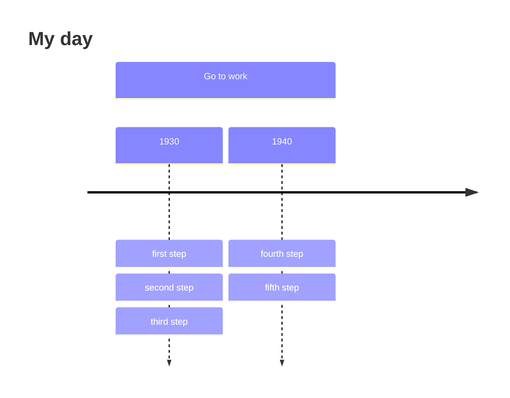
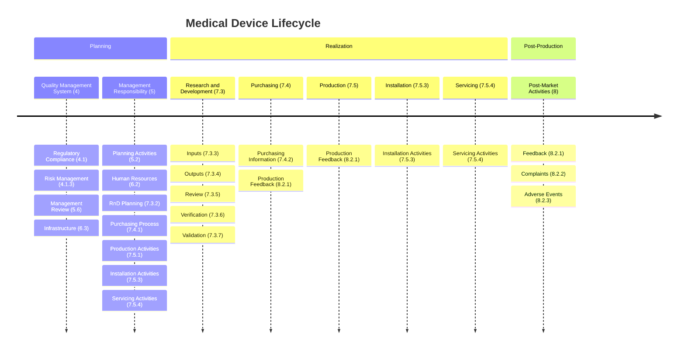

# timeline

## Example 1

**SebastianJS (SVG):**

<svg id="graph" width="100%" xmlns="http://www.w3.org/2000/svg" xmlns:xlink="http://www.w3.org/1999/xlink" style="max-width: 64798px;" viewBox="-50 -50 64798 124" role="graphics-document document" aria-roledescription="timeline"><g></g><g></g><defs><marker id="arrowhead" refX="5" refY="2" markerWidth="6" markerHeight="4" orient="auto"><path d="M 0,0 V 4 L6,2 Z"></path></marker></defs><g transform="translate(200, 50)"><g class="timeline-node section--1"><g><path id="node-undefined" class="node-bkg node-undefined" d="M0 67.8 v-62.8 q0,-5 5,-5 h380 q5,0 5,5 v67.8 H0 Z"></path><line class="node-line--1" x1="0" y1="72.8" x2="390" y2="72.8"></line></g><g transform="translate(195, 10)"><text dy="1em" alignment-baseline="middle" dominant-baseline="middle" text-anchor="middle"><tspan x="0" dy="1em">Go   to   work</tspan></text></g></g></g><g class="taskWrapper" transform="translate(200, 172.8)"><g class="timeline-node section--1"><g><path id="node-undefined" class="node-bkg node-undefined" d="M0 67.8 v-62.8 q0,-5 5,-5 h180 q5,0 5,5 v67.8 H0 Z"></path><line class="node-line--1" x1="0" y1="72.8" x2="190" y2="72.8"></line></g><g transform="translate(95, 10)"><text dy="1em" alignment-baseline="middle" dominant-baseline="middle" text-anchor="middle"><tspan x="0" dy="1em">1930</tspan></text></g></g></g><g class="lineWrapper"><line x1="295" y1="245.60000000000002" x2="295" y2="624" stroke-width="2" stroke="black" marker-end="url(#arrowhead)" stroke-dasharray="5,5"></line></g><g class="eventWrapper" transform="translate(200, 372.8)"><g class="timeline-node section--1"><g><path id="node-undefined" class="node-bkg node-undefined" d="M0 47.8 v-42.8 q0,-5 5,-5 h180 q5,0 5,5 v47.8 H0 Z"></path><line class="node-line--1" x1="0" y1="52.8" x2="190" y2="52.8"></line></g><g transform="translate(95, 10)"><text dy="1em" alignment-baseline="middle" dominant-baseline="middle" text-anchor="middle"><tspan x="0" dy="1em">first   step</tspan></text></g></g></g><g class="eventWrapper" transform="translate(200, 435.6)"><g class="timeline-node section--1"><g><path id="node-undefined" class="node-bkg node-undefined" d="M0 47.8 v-42.8 q0,-5 5,-5 h180 q5,0 5,5 v47.8 H0 Z"></path><line class="node-line--1" x1="0" y1="52.8" x2="190" y2="52.8"></line></g><g transform="translate(95, 10)"><text dy="1em" alignment-baseline="middle" dominant-baseline="middle" text-anchor="middle"><tspan x="0" dy="1em">second   step</tspan></text></g></g></g><g class="eventWrapper" transform="translate(200, 498.40000000000003)"><g class="timeline-node section--1"><g><path id="node-undefined" class="node-bkg node-undefined" d="M0 47.8 v-42.8 q0,-5 5,-5 h180 q5,0 5,5 v47.8 H0 Z"></path><line class="node-line--1" x1="0" y1="52.8" x2="190" y2="52.8"></line></g><g transform="translate(95, 10)"><text dy="1em" alignment-baseline="middle" dominant-baseline="middle" text-anchor="middle"><tspan x="0" dy="1em">third   step</tspan></text></g></g></g><g class="taskWrapper" transform="translate(400, 172.8)"><g class="timeline-node section--1"><g><path id="node-undefined" class="node-bkg node-undefined" d="M0 67.8 v-62.8 q0,-5 5,-5 h180 q5,0 5,5 v67.8 H0 Z"></path><line class="node-line--1" x1="0" y1="72.8" x2="190" y2="72.8"></line></g><g transform="translate(95, 10)"><text dy="1em" alignment-baseline="middle" dominant-baseline="middle" text-anchor="middle"><tspan x="0" dy="1em">1940</tspan></text></g></g></g><g class="lineWrapper"><line x1="495" y1="245.60000000000002" x2="495" y2="624" stroke-width="2" stroke="black" marker-end="url(#arrowhead)" stroke-dasharray="5,5"></line></g><g class="eventWrapper" transform="translate(400, 372.8)"><g class="timeline-node section--1"><g><path id="node-undefined" class="node-bkg node-undefined" d="M0 47.8 v-42.8 q0,-5 5,-5 h180 q5,0 5,5 v47.8 H0 Z"></path><line class="node-line--1" x1="0" y1="52.8" x2="190" y2="52.8"></line></g><g transform="translate(95, 10)"><text dy="1em" alignment-baseline="middle" dominant-baseline="middle" text-anchor="middle"><tspan x="0" dy="1em">fourth   step</tspan></text></g></g></g><g class="eventWrapper" transform="translate(400, 435.6)"><g class="timeline-node section--1"><g><path id="node-undefined" class="node-bkg node-undefined" d="M0 47.8 v-42.8 q0,-5 5,-5 h180 q5,0 5,5 v47.8 H0 Z"></path><line class="node-line--1" x1="0" y1="52.8" x2="190" y2="52.8"></line></g><g transform="translate(95, 10)"><text dy="1em" alignment-baseline="middle" dominant-baseline="middle" text-anchor="middle"><tspan x="0" dy="1em">fifth   step</tspan></text></g></g></g><text x="32175" font-size="4ex" font-weight="bold" y="20">My day</text><g class="lineWrapper"><line x1="150" y1="295.6" x2="65100" y2="295.6" stroke-width="4" stroke="black" marker-end="url(#arrowhead)"></line></g></svg>

**Mermaid Code (Browser Rendered):**

## Example 2

**SebastianJS (SVG):**

<svg id="graph" width="100%" xmlns="http://www.w3.org/2000/svg" xmlns:xlink="http://www.w3.org/1999/xlink" style="max-width: 70454px;" viewBox="-50 -50 70454 124" role="graphics-document document" aria-roledescription="timeline"><g></g><g></g><defs><marker id="arrowhead" refX="5" refY="2" markerWidth="6" markerHeight="4" orient="auto"><path d="M 0,0 V 4 L6,2 Z"></path></marker></defs><g transform="translate(200, 50)"><g class="timeline-node section--1"><g><path id="node-undefined" class="node-bkg node-undefined" d="M0 67.8 v-62.8 q0,-5 5,-5 h380 q5,0 5,5 v67.8 H0 Z"></path><line class="node-line--1" x1="0" y1="72.8" x2="390" y2="72.8"></line></g><g transform="translate(195, 10)"><text dy="1em" alignment-baseline="middle" dominant-baseline="middle" text-anchor="middle"><tspan x="0" dy="1em">Planning</tspan></text></g></g></g><g class="taskWrapper" transform="translate(200, 172.8)"><g class="timeline-node section--1"><g><path id="node-undefined" class="node-bkg node-undefined" d="M0 67.8 v-62.8 q0,-5 5,-5 h180 q5,0 5,5 v67.8 H0 Z"></path><line class="node-line--1" x1="0" y1="72.8" x2="190" y2="72.8"></line></g><g transform="translate(95, 10)"><text dy="1em" alignment-baseline="middle" dominant-baseline="middle" text-anchor="middle"><tspan x="0" dy="1em">Quality</tspan><tspan x="0" dy="1.1em">Management</tspan><tspan x="0" dy="1.1em">System   (4)</tspan></text></g></g></g><g class="lineWrapper"><line x1="295" y1="245.60000000000002" x2="295" y2="875.2" stroke-width="2" stroke="black" marker-end="url(#arrowhead)" stroke-dasharray="5,5"></line></g><g class="eventWrapper" transform="translate(200, 372.8)"><g class="timeline-node section--1"><g><path id="node-undefined" class="node-bkg node-undefined" d="M0 47.8 v-42.8 q0,-5 5,-5 h180 q5,0 5,5 v47.8 H0 Z"></path><line class="node-line--1" x1="0" y1="52.8" x2="190" y2="52.8"></line></g><g transform="translate(95, 10)"><text dy="1em" alignment-baseline="middle" dominant-baseline="middle" text-anchor="middle"><tspan x="0" dy="1em">Regulatory</tspan><tspan x="0" dy="1.1em">Compliance   (4.1)</tspan></text></g></g></g><g class="eventWrapper" transform="translate(200, 435.6)"><g class="timeline-node section--1"><g><path id="node-undefined" class="node-bkg node-undefined" d="M0 47.8 v-42.8 q0,-5 5,-5 h180 q5,0 5,5 v47.8 H0 Z"></path><line class="node-line--1" x1="0" y1="52.8" x2="190" y2="52.8"></line></g><g transform="translate(95, 10)"><text dy="1em" alignment-baseline="middle" dominant-baseline="middle" text-anchor="middle"><tspan x="0" dy="1em">Risk   Management</tspan><tspan x="0" dy="1.1em">(4.1.3)</tspan></text></g></g></g><g class="eventWrapper" transform="translate(200, 498.40000000000003)"><g class="timeline-node section--1"><g><path id="node-undefined" class="node-bkg node-undefined" d="M0 47.8 v-42.8 q0,-5 5,-5 h180 q5,0 5,5 v47.8 H0 Z"></path><line class="node-line--1" x1="0" y1="52.8" x2="190" y2="52.8"></line></g><g transform="translate(95, 10)"><text dy="1em" alignment-baseline="middle" dominant-baseline="middle" text-anchor="middle"><tspan x="0" dy="1em">Management</tspan><tspan x="0" dy="1.1em">Review   (5.6)</tspan></text></g></g></g><g class="eventWrapper" transform="translate(200, 561.2)"><g class="timeline-node section--1"><g><path id="node-undefined" class="node-bkg node-undefined" d="M0 47.8 v-42.8 q0,-5 5,-5 h180 q5,0 5,5 v47.8 H0 Z"></path><line class="node-line--1" x1="0" y1="52.8" x2="190" y2="52.8"></line></g><g transform="translate(95, 10)"><text dy="1em" alignment-baseline="middle" dominant-baseline="middle" text-anchor="middle"><tspan x="0" dy="1em">Infrastructure</tspan><tspan x="0" dy="1.1em">(6.3)</tspan></text></g></g></g><g class="taskWrapper" transform="translate(400, 172.8)"><g class="timeline-node section--1"><g><path id="node-undefined" class="node-bkg node-undefined" d="M0 67.8 v-62.8 q0,-5 5,-5 h180 q5,0 5,5 v67.8 H0 Z"></path><line class="node-line--1" x1="0" y1="72.8" x2="190" y2="72.8"></line></g><g transform="translate(95, 10)"><text dy="1em" alignment-baseline="middle" dominant-baseline="middle" text-anchor="middle"><tspan x="0" dy="1em">Management</tspan><tspan x="0" dy="1.1em">Responsibility</tspan><tspan x="0" dy="1.1em">(5)</tspan></text></g></g></g><g class="lineWrapper"><line x1="495" y1="245.60000000000002" x2="495" y2="875.2" stroke-width="2" stroke="black" marker-end="url(#arrowhead)" stroke-dasharray="5,5"></line></g><g class="eventWrapper" transform="translate(400, 372.8)"><g class="timeline-node section--1"><g><path id="node-undefined" class="node-bkg node-undefined" d="M0 47.8 v-42.8 q0,-5 5,-5 h180 q5,0 5,5 v47.8 H0 Z"></path><line class="node-line--1" x1="0" y1="52.8" x2="190" y2="52.8"></line></g><g transform="translate(95, 10)"><text dy="1em" alignment-baseline="middle" dominant-baseline="middle" text-anchor="middle"><tspan x="0" dy="1em">Planning</tspan><tspan x="0" dy="1.1em">Activities   (5.2)</tspan></text></g></g></g><g class="eventWrapper" transform="translate(400, 435.6)"><g class="timeline-node section--1"><g><path id="node-undefined" class="node-bkg node-undefined" d="M0 47.8 v-42.8 q0,-5 5,-5 h180 q5,0 5,5 v47.8 H0 Z"></path><line class="node-line--1" x1="0" y1="52.8" x2="190" y2="52.8"></line></g><g transform="translate(95, 10)"><text dy="1em" alignment-baseline="middle" dominant-baseline="middle" text-anchor="middle"><tspan x="0" dy="1em">Human   Resources</tspan><tspan x="0" dy="1.1em">(6.2)</tspan></text></g></g></g><g class="eventWrapper" transform="translate(400, 498.40000000000003)"><g class="timeline-node section--1"><g><path id="node-undefined" class="node-bkg node-undefined" d="M0 47.8 v-42.8 q0,-5 5,-5 h180 q5,0 5,5 v47.8 H0 Z"></path><line class="node-line--1" x1="0" y1="52.8" x2="190" y2="52.8"></line></g><g transform="translate(95, 10)"><text dy="1em" alignment-baseline="middle" dominant-baseline="middle" text-anchor="middle"><tspan x="0" dy="1em">RnD   Planning</tspan><tspan x="0" dy="1.1em">(7.3.2)</tspan></text></g></g></g><g class="eventWrapper" transform="translate(400, 561.2)"><g class="timeline-node section--1"><g><path id="node-undefined" class="node-bkg node-undefined" d="M0 47.8 v-42.8 q0,-5 5,-5 h180 q5,0 5,5 v47.8 H0 Z"></path><line class="node-line--1" x1="0" y1="52.8" x2="190" y2="52.8"></line></g><g transform="translate(95, 10)"><text dy="1em" alignment-baseline="middle" dominant-baseline="middle" text-anchor="middle"><tspan x="0" dy="1em">Purchasing</tspan><tspan x="0" dy="1.1em">Process   (7.4.1)</tspan></text></g></g></g><g class="eventWrapper" transform="translate(400, 624)"><g class="timeline-node section--1"><g><path id="node-undefined" class="node-bkg node-undefined" d="M0 47.8 v-42.8 q0,-5 5,-5 h180 q5,0 5,5 v47.8 H0 Z"></path><line class="node-line--1" x1="0" y1="52.8" x2="190" y2="52.8"></line></g><g transform="translate(95, 10)"><text dy="1em" alignment-baseline="middle" dominant-baseline="middle" text-anchor="middle"><tspan x="0" dy="1em">Production</tspan><tspan x="0" dy="1.1em">Activities</tspan><tspan x="0" dy="1.1em">(7.5.1)</tspan></text></g></g></g><g class="eventWrapper" transform="translate(400, 686.8)"><g class="timeline-node section--1"><g><path id="node-undefined" class="node-bkg node-undefined" d="M0 47.8 v-42.8 q0,-5 5,-5 h180 q5,0 5,5 v47.8 H0 Z"></path><line class="node-line--1" x1="0" y1="52.8" x2="190" y2="52.8"></line></g><g transform="translate(95, 10)"><text dy="1em" alignment-baseline="middle" dominant-baseline="middle" text-anchor="middle"><tspan x="0" dy="1em">Installation</tspan><tspan x="0" dy="1.1em">Activities</tspan><tspan x="0" dy="1.1em">(7.5.3)</tspan></text></g></g></g><g class="eventWrapper" transform="translate(400, 749.5999999999999)"><g class="timeline-node section--1"><g><path id="node-undefined" class="node-bkg node-undefined" d="M0 47.8 v-42.8 q0,-5 5,-5 h180 q5,0 5,5 v47.8 H0 Z"></path><line class="node-line--1" x1="0" y1="52.8" x2="190" y2="52.8"></line></g><g transform="translate(95, 10)"><text dy="1em" alignment-baseline="middle" dominant-baseline="middle" text-anchor="middle"><tspan x="0" dy="1em">Servicing</tspan><tspan x="0" dy="1.1em">Activities</tspan><tspan x="0" dy="1.1em">(7.5.4)</tspan></text></g></g></g><g transform="translate(600, 50)"><g class="timeline-node section-0"><g><path id="node-undefined" class="node-bkg node-undefined" d="M0 67.8 v-62.8 q0,-5 5,-5 h980 q5,0 5,5 v67.8 H0 Z"></path><line class="node-line-0" x1="0" y1="72.8" x2="990" y2="72.8"></line></g><g transform="translate(495, 10)"><text dy="1em" alignment-baseline="middle" dominant-baseline="middle" text-anchor="middle"><tspan x="0" dy="1em">Realization</tspan></text></g></g></g><g class="taskWrapper" transform="translate(600, 172.8)"><g class="timeline-node section-0"><g><path id="node-undefined" class="node-bkg node-undefined" d="M0 67.8 v-62.8 q0,-5 5,-5 h180 q5,0 5,5 v67.8 H0 Z"></path><line class="node-line-0" x1="0" y1="72.8" x2="190" y2="72.8"></line></g><g transform="translate(95, 10)"><text dy="1em" alignment-baseline="middle" dominant-baseline="middle" text-anchor="middle"><tspan x="0" dy="1em">Research   and</tspan><tspan x="0" dy="1.1em">Development</tspan><tspan x="0" dy="1.1em">(7.3)</tspan></text></g></g></g><g class="lineWrapper"><line x1="695" y1="245.60000000000002" x2="695" y2="875.2" stroke-width="2" stroke="black" marker-end="url(#arrowhead)" stroke-dasharray="5,5"></line></g><g class="eventWrapper" transform="translate(600, 372.8)"><g class="timeline-node section-0"><g><path id="node-undefined" class="node-bkg node-undefined" d="M0 47.8 v-42.8 q0,-5 5,-5 h180 q5,0 5,5 v47.8 H0 Z"></path><line class="node-line-0" x1="0" y1="52.8" x2="190" y2="52.8"></line></g><g transform="translate(95, 10)"><text dy="1em" alignment-baseline="middle" dominant-baseline="middle" text-anchor="middle"><tspan x="0" dy="1em">Inputs   (7.3.3)</tspan></text></g></g></g><g class="eventWrapper" transform="translate(600, 435.6)"><g class="timeline-node section-0"><g><path id="node-undefined" class="node-bkg node-undefined" d="M0 47.8 v-42.8 q0,-5 5,-5 h180 q5,0 5,5 v47.8 H0 Z"></path><line class="node-line-0" x1="0" y1="52.8" x2="190" y2="52.8"></line></g><g transform="translate(95, 10)"><text dy="1em" alignment-baseline="middle" dominant-baseline="middle" text-anchor="middle"><tspan x="0" dy="1em">Outputs   (7.3.4)</tspan></text></g></g></g><g class="eventWrapper" transform="translate(600, 498.40000000000003)"><g class="timeline-node section-0"><g><path id="node-undefined" class="node-bkg node-undefined" d="M0 47.8 v-42.8 q0,-5 5,-5 h180 q5,0 5,5 v47.8 H0 Z"></path><line class="node-line-0" x1="0" y1="52.8" x2="190" y2="52.8"></line></g><g transform="translate(95, 10)"><text dy="1em" alignment-baseline="middle" dominant-baseline="middle" text-anchor="middle"><tspan x="0" dy="1em">Review   (7.3.5)</tspan></text></g></g></g><g class="eventWrapper" transform="translate(600, 561.2)"><g class="timeline-node section-0"><g><path id="node-undefined" class="node-bkg node-undefined" d="M0 47.8 v-42.8 q0,-5 5,-5 h180 q5,0 5,5 v47.8 H0 Z"></path><line class="node-line-0" x1="0" y1="52.8" x2="190" y2="52.8"></line></g><g transform="translate(95, 10)"><text dy="1em" alignment-baseline="middle" dominant-baseline="middle" text-anchor="middle"><tspan x="0" dy="1em">Verification</tspan><tspan x="0" dy="1.1em">(7.3.6)</tspan></text></g></g></g><g class="eventWrapper" transform="translate(600, 624)"><g class="timeline-node section-0"><g><path id="node-undefined" class="node-bkg node-undefined" d="M0 47.8 v-42.8 q0,-5 5,-5 h180 q5,0 5,5 v47.8 H0 Z"></path><line class="node-line-0" x1="0" y1="52.8" x2="190" y2="52.8"></line></g><g transform="translate(95, 10)"><text dy="1em" alignment-baseline="middle" dominant-baseline="middle" text-anchor="middle"><tspan x="0" dy="1em">Validation</tspan><tspan x="0" dy="1.1em">(7.3.7)</tspan></text></g></g></g><g class="taskWrapper" transform="translate(800, 172.8)"><g class="timeline-node section-0"><g><path id="node-undefined" class="node-bkg node-undefined" d="M0 67.8 v-62.8 q0,-5 5,-5 h180 q5,0 5,5 v67.8 H0 Z"></path><line class="node-line-0" x1="0" y1="72.8" x2="190" y2="72.8"></line></g><g transform="translate(95, 10)"><text dy="1em" alignment-baseline="middle" dominant-baseline="middle" text-anchor="middle"><tspan x="0" dy="1em">Purchasing   (7.4)</tspan></text></g></g></g><g class="lineWrapper"><line x1="895" y1="245.60000000000002" x2="895" y2="875.2" stroke-width="2" stroke="black" marker-end="url(#arrowhead)" stroke-dasharray="5,5"></line></g><g class="eventWrapper" transform="translate(800, 372.8)"><g class="timeline-node section-0"><g><path id="node-undefined" class="node-bkg node-undefined" d="M0 47.8 v-42.8 q0,-5 5,-5 h180 q5,0 5,5 v47.8 H0 Z"></path><line class="node-line-0" x1="0" y1="52.8" x2="190" y2="52.8"></line></g><g transform="translate(95, 10)"><text dy="1em" alignment-baseline="middle" dominant-baseline="middle" text-anchor="middle"><tspan x="0" dy="1em">Purchasing</tspan><tspan x="0" dy="1.1em">Information</tspan><tspan x="0" dy="1.1em">(7.4.2)</tspan></text></g></g></g><g class="eventWrapper" transform="translate(800, 435.6)"><g class="timeline-node section-0"><g><path id="node-undefined" class="node-bkg node-undefined" d="M0 47.8 v-42.8 q0,-5 5,-5 h180 q5,0 5,5 v47.8 H0 Z"></path><line class="node-line-0" x1="0" y1="52.8" x2="190" y2="52.8"></line></g><g transform="translate(95, 10)"><text dy="1em" alignment-baseline="middle" dominant-baseline="middle" text-anchor="middle"><tspan x="0" dy="1em">Production</tspan><tspan x="0" dy="1.1em">Feedback   (8.2.1)</tspan></text></g></g></g><g class="taskWrapper" transform="translate(1000, 172.8)"><g class="timeline-node section-0"><g><path id="node-undefined" class="node-bkg node-undefined" d="M0 67.8 v-62.8 q0,-5 5,-5 h180 q5,0 5,5 v67.8 H0 Z"></path><line class="node-line-0" x1="0" y1="72.8" x2="190" y2="72.8"></line></g><g transform="translate(95, 10)"><text dy="1em" alignment-baseline="middle" dominant-baseline="middle" text-anchor="middle"><tspan x="0" dy="1em">Production   (7.5)</tspan></text></g></g></g><g class="lineWrapper"><line x1="1095" y1="245.60000000000002" x2="1095" y2="875.2" stroke-width="2" stroke="black" marker-end="url(#arrowhead)" stroke-dasharray="5,5"></line></g><g class="eventWrapper" transform="translate(1000, 372.8)"><g class="timeline-node section-0"><g><path id="node-undefined" class="node-bkg node-undefined" d="M0 47.8 v-42.8 q0,-5 5,-5 h180 q5,0 5,5 v47.8 H0 Z"></path><line class="node-line-0" x1="0" y1="52.8" x2="190" y2="52.8"></line></g><g transform="translate(95, 10)"><text dy="1em" alignment-baseline="middle" dominant-baseline="middle" text-anchor="middle"><tspan x="0" dy="1em">Production</tspan><tspan x="0" dy="1.1em">Feedback   (8.2.1)</tspan></text></g></g></g><g class="taskWrapper" transform="translate(1200, 172.8)"><g class="timeline-node section-0"><g><path id="node-undefined" class="node-bkg node-undefined" d="M0 67.8 v-62.8 q0,-5 5,-5 h180 q5,0 5,5 v67.8 H0 Z"></path><line class="node-line-0" x1="0" y1="72.8" x2="190" y2="72.8"></line></g><g transform="translate(95, 10)"><text dy="1em" alignment-baseline="middle" dominant-baseline="middle" text-anchor="middle"><tspan x="0" dy="1em">Installation</tspan><tspan x="0" dy="1.1em">(7.5.3)</tspan></text></g></g></g><g class="lineWrapper"><line x1="1295" y1="245.60000000000002" x2="1295" y2="875.2" stroke-width="2" stroke="black" marker-end="url(#arrowhead)" stroke-dasharray="5,5"></line></g><g class="eventWrapper" transform="translate(1200, 372.8)"><g class="timeline-node section-0"><g><path id="node-undefined" class="node-bkg node-undefined" d="M0 47.8 v-42.8 q0,-5 5,-5 h180 q5,0 5,5 v47.8 H0 Z"></path><line class="node-line-0" x1="0" y1="52.8" x2="190" y2="52.8"></line></g><g transform="translate(95, 10)"><text dy="1em" alignment-baseline="middle" dominant-baseline="middle" text-anchor="middle"><tspan x="0" dy="1em">Installation</tspan><tspan x="0" dy="1.1em">Activities</tspan><tspan x="0" dy="1.1em">(7.5.3)</tspan></text></g></g></g><g class="taskWrapper" transform="translate(1400, 172.8)"><g class="timeline-node section-0"><g><path id="node-undefined" class="node-bkg node-undefined" d="M0 67.8 v-62.8 q0,-5 5,-5 h180 q5,0 5,5 v67.8 H0 Z"></path><line class="node-line-0" x1="0" y1="72.8" x2="190" y2="72.8"></line></g><g transform="translate(95, 10)"><text dy="1em" alignment-baseline="middle" dominant-baseline="middle" text-anchor="middle"><tspan x="0" dy="1em">Servicing</tspan><tspan x="0" dy="1.1em">(7.5.4)</tspan></text></g></g></g><g class="lineWrapper"><line x1="1495" y1="245.60000000000002" x2="1495" y2="875.2" stroke-width="2" stroke="black" marker-end="url(#arrowhead)" stroke-dasharray="5,5"></line></g><g class="eventWrapper" transform="translate(1400, 372.8)"><g class="timeline-node section-0"><g><path id="node-undefined" class="node-bkg node-undefined" d="M0 47.8 v-42.8 q0,-5 5,-5 h180 q5,0 5,5 v47.8 H0 Z"></path><line class="node-line-0" x1="0" y1="52.8" x2="190" y2="52.8"></line></g><g transform="translate(95, 10)"><text dy="1em" alignment-baseline="middle" dominant-baseline="middle" text-anchor="middle"><tspan x="0" dy="1em">Servicing</tspan><tspan x="0" dy="1.1em">Activities</tspan><tspan x="0" dy="1.1em">(7.5.4)</tspan></text></g></g></g><g transform="translate(1600, 50)"><g class="timeline-node section-1"><g><path id="node-undefined" class="node-bkg node-undefined" d="M0 67.8 v-62.8 q0,-5 5,-5 h180 q5,0 5,5 v67.8 H0 Z"></path><line class="node-line-1" x1="0" y1="72.8" x2="190" y2="72.8"></line></g><g transform="translate(95, 10)"><text dy="1em" alignment-baseline="middle" dominant-baseline="middle" text-anchor="middle"><tspan x="0" dy="1em">Post-Production</tspan></text></g></g></g><g class="taskWrapper" transform="translate(1600, 172.8)"><g class="timeline-node section-1"><g><path id="node-undefined" class="node-bkg node-undefined" d="M0 67.8 v-62.8 q0,-5 5,-5 h180 q5,0 5,5 v67.8 H0 Z"></path><line class="node-line-1" x1="0" y1="72.8" x2="190" y2="72.8"></line></g><g transform="translate(95, 10)"><text dy="1em" alignment-baseline="middle" dominant-baseline="middle" text-anchor="middle"><tspan x="0" dy="1em">Post-Market</tspan><tspan x="0" dy="1.1em">Activities   (8)</tspan></text></g></g></g><g class="lineWrapper"><line x1="1695" y1="245.60000000000002" x2="1695" y2="875.2" stroke-width="2" stroke="black" marker-end="url(#arrowhead)" stroke-dasharray="5,5"></line></g><g class="eventWrapper" transform="translate(1600, 372.8)"><g class="timeline-node section-1"><g><path id="node-undefined" class="node-bkg node-undefined" d="M0 47.8 v-42.8 q0,-5 5,-5 h180 q5,0 5,5 v47.8 H0 Z"></path><line class="node-line-1" x1="0" y1="52.8" x2="190" y2="52.8"></line></g><g transform="translate(95, 10)"><text dy="1em" alignment-baseline="middle" dominant-baseline="middle" text-anchor="middle"><tspan x="0" dy="1em">Feedback   (8.2.1)</tspan></text></g></g></g><g class="eventWrapper" transform="translate(1600, 435.6)"><g class="timeline-node section-1"><g><path id="node-undefined" class="node-bkg node-undefined" d="M0 47.8 v-42.8 q0,-5 5,-5 h180 q5,0 5,5 v47.8 H0 Z"></path><line class="node-line-1" x1="0" y1="52.8" x2="190" y2="52.8"></line></g><g transform="translate(95, 10)"><text dy="1em" alignment-baseline="middle" dominant-baseline="middle" text-anchor="middle"><tspan x="0" dy="1em">Complaints</tspan><tspan x="0" dy="1.1em">(8.2.2)</tspan></text></g></g></g><g class="eventWrapper" transform="translate(1600, 498.40000000000003)"><g class="timeline-node section-1"><g><path id="node-undefined" class="node-bkg node-undefined" d="M0 47.8 v-42.8 q0,-5 5,-5 h180 q5,0 5,5 v47.8 H0 Z"></path><line class="node-line-1" x1="0" y1="52.8" x2="190" y2="52.8"></line></g><g transform="translate(95, 10)"><text dy="1em" alignment-baseline="middle" dominant-baseline="middle" text-anchor="middle"><tspan x="0" dy="1em">Adverse   Events</tspan><tspan x="0" dy="1.1em">(8.2.3)</tspan></text></g></g></g><text x="34931" font-size="4ex" font-weight="bold" y="20">Medical Device Lifecycle</text><g class="lineWrapper"><line x1="150" y1="295.6" x2="70612" y2="295.6" stroke-width="4" stroke="black" marker-end="url(#arrowhead)"></line></g></svg>

**Mermaid Code (Browser Rendered):**

