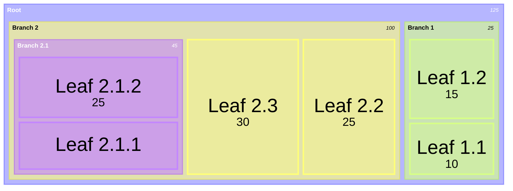
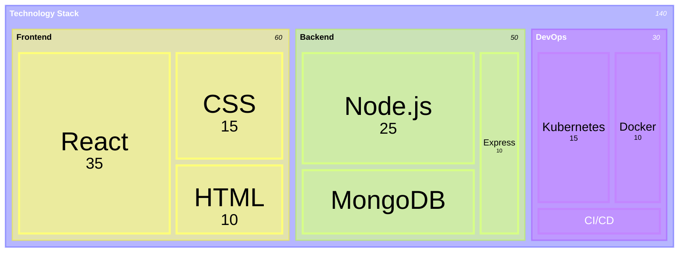

# treemap

## Example 1

**SebastianJS (SVG):**

<svg id="graph" xmlns="http://www.w3.org/2000/svg" xmlns:xlink="http://www.w3.org/1999/xlink" viewBox="-4 -4 1008 408" style="max-width: 11898px;" class="flowchart" role="graphics-document document" aria-roledescription="treemap"><g/><g transform="translate(0, 0)" class="treemapContainer"><g class="treemapSection" transform="translate(0,0)"><rect width="1000" height="25" class="treemapSectionHeader" fill="none" fill-opacity="0.6" stroke-width="0.6" style="display: none;"/><clipPath id="clip-section-graph-0"><rect width="988" height="25"/></clipPath><rect width="1000" height="400" class="treemapSection section0" fill="transparent" fill-opacity="0.6" stroke="transparent" stroke-width="2" stroke-opacity="0.4" style="display: none;"/><text class="treemapSectionLabel" x="6" y="12.5" dominant-baseline="middle" font-weight="bold" style="display: none;"/><text class="treemapSectionValue" x="990" y="12.5" text-anchor="end" dominant-baseline="middle" font-style="italic" style="display: none;">125</text></g><g class="treemapSection" transform="translate(10,35)"><rect width="980" height="25" class="treemapSectionHeader" fill="none" fill-opacity="0.6" stroke-width="0.6" style=""/><clipPath id="clip-section-graph-1"><rect width="968" height="25"/></clipPath><rect width="980" height="355" class="treemapSection section1" fill="hsl(240, 100%, 76.2745098039%)" fill-opacity="0.6" stroke="hsl(240, 100%, 61.2745098039%)" stroke-width="2" stroke-opacity="0.4" style=";"/><text class="treemapSectionLabel" x="6" y="12.5" dominant-baseline="middle" font-weight="bold" style="dominant-baseline: middle; font-size: 12px; fill:#ffffff; white-space: nowrap; overflow: hidden; text-overflow: ellipsis;">Root</text><text class="treemapSectionValue" x="970" y="12.5" text-anchor="end" dominant-baseline="middle" font-style="italic" style="text-anchor: end; dominant-baseline: middle; font-size: 10px; fill:#ffffff; white-space: nowrap; overflow: hidden; text-overflow: ellipsis;">125</text></g><g class="treemapSection" transform="translate(20,70)"><rect width="766" height="25" class="treemapSectionHeader" fill="none" fill-opacity="0.6" stroke-width="0.6" style=""/><clipPath id="clip-section-graph-2"><rect width="754" height="25"/></clipPath><rect width="766" height="310" class="treemapSection section2" fill="hsl(60, 100%, 73.5294117647%)" fill-opacity="0.6" stroke="hsl(60, 100%, 48.5294117647%)" stroke-width="2" stroke-opacity="0.4" style=";"/><text class="treemapSectionLabel" x="6" y="12.5" dominant-baseline="middle" font-weight="bold" style="dominant-baseline: middle; font-size: 12px; fill:black; white-space: nowrap; overflow: hidden; text-overflow: ellipsis;">Branch 2</text><text class="treemapSectionValue" x="756" y="12.5" text-anchor="end" dominant-baseline="middle" font-style="italic" style="text-anchor: end; dominant-baseline: middle; font-size: 10px; fill:black; white-space: nowrap; overflow: hidden; text-overflow: ellipsis;">100</text></g><g class="treemapSection" transform="translate(796,70)"><rect width="184" height="25" class="treemapSectionHeader" fill="none" fill-opacity="0.6" stroke-width="0.6" style=""/><clipPath id="clip-section-graph-3"><rect width="172" height="25"/></clipPath><rect width="184" height="310" class="treemapSection section3" fill="hsl(80, 100%, 76.2745098039%)" fill-opacity="0.6" stroke="hsl(80, 100%, 56.2745098039%)" stroke-width="2" stroke-opacity="0.4" style=";"/><text class="treemapSectionLabel" x="6" y="12.5" dominant-baseline="middle" font-weight="bold" style="dominant-baseline: middle; font-size: 12px; fill:black; white-space: nowrap; overflow: hidden; text-overflow: ellipsis;">Branch 1</text><text class="treemapSectionValue" x="174" y="12.5" text-anchor="end" dominant-baseline="middle" font-style="italic" style="text-anchor: end; dominant-baseline: middle; font-size: 10px; fill:black; white-space: nowrap; overflow: hidden; text-overflow: ellipsis;">25</text></g><g class="treemapSection" transform="translate(30,105)"><rect width="330" height="25" class="treemapSectionHeader" fill="none" fill-opacity="0.6" stroke-width="0.6" style=""/><clipPath id="clip-section-graph-4"><rect width="318" height="25"/></clipPath><rect width="330" height="265" class="treemapSection section4" fill="hsl(270, 100%, 76.2745098039%)" fill-opacity="0.6" stroke="hsl(270, 100%, 61.2745098039%)" stroke-width="2" stroke-opacity="0.4" style=";"/><text class="treemapSectionLabel" x="6" y="12.5" dominant-baseline="middle" font-weight="bold" style="dominant-baseline: middle; font-size: 12px; fill:#ffffff; white-space: nowrap; overflow: hidden; text-overflow: ellipsis;">Branch 2.1</text><text class="treemapSectionValue" x="320" y="12.5" text-anchor="end" dominant-baseline="middle" font-style="italic" style="text-anchor: end; dominant-baseline: middle; font-size: 10px; fill:#ffffff; white-space: nowrap; overflow: hidden; text-overflow: ellipsis;">45</text></g><g class="treemapNode treemapLeafGroup leaf0x" transform="translate(40,140)"><rect width="310" height="118" class="treemapLeaf" fill="hsl(270, 100%, 76.2745098039%)" style="" fill-opacity="0.3" stroke="hsl(270, 100%, 76.2745098039%)" stroke-width="3"/><clipPath id="clip-graph-0"><rect width="306" height="114"/></clipPath><text class="treemapLabel" x="155" y="59" style="text-anchor: middle; dominant-baseline: middle; font-size: 38px;fill:black;" clip-path="url(#clip-graph-0)">Leaf 2.1.2</text><text class="treemapValue" x="155" y="80" style="text-anchor: middle; dominant-baseline: hanging; font-size: 23px; fill: black;" clip-path="url(#clip-graph-0)">25</text></g><g class="treemapNode treemapLeafGroup leaf1x" transform="translate(40,268)"><rect width="310" height="92" class="treemapLeaf" fill="hsl(270, 100%, 76.2745098039%)" style="" fill-opacity="0.3" stroke="hsl(270, 100%, 76.2745098039%)" stroke-width="3"/><clipPath id="clip-graph-1"><rect width="306" height="88"/></clipPath><text class="treemapLabel" x="155" y="46" style="text-anchor: middle; dominant-baseline: middle; font-size: 38px;fill:black;" clip-path="url(#clip-graph-1)">Leaf 2.1.1</text><text class="treemapValue" x="155" y="67" style="text-anchor: middle; dominant-baseline: hanging; font-size: 23px; fill: black; display: none;" clip-path="url(#clip-graph-1)">20</text></g><g class="treemapNode treemapLeafGroup leaf2x" transform="translate(370,105)"><rect width="217" height="265" class="treemapLeaf" fill="hsl(60, 100%, 73.5294117647%)" style="" fill-opacity="0.3" stroke="hsl(60, 100%, 73.5294117647%)" stroke-width="3"/><clipPath id="clip-graph-2"><rect width="213" height="261"/></clipPath><text class="treemapLabel" x="108.5" y="132.5" style="text-anchor: middle; dominant-baseline: middle; font-size: 38px;fill:black;" clip-path="url(#clip-graph-2)">Leaf 2.3</text><text class="treemapValue" x="108.5" y="153.5" style="text-anchor: middle; dominant-baseline: hanging; font-size: 23px; fill: black;" clip-path="url(#clip-graph-2)">30</text></g><g class="treemapNode treemapLeafGroup leaf3x" transform="translate(597,105)"><rect width="179" height="265" class="treemapLeaf" fill="hsl(60, 100%, 73.5294117647%)" style="" fill-opacity="0.3" stroke="hsl(60, 100%, 73.5294117647%)" stroke-width="3"/><clipPath id="clip-graph-3"><rect width="175" height="261"/></clipPath><text class="treemapLabel" x="89.5" y="132.5" style="text-anchor: middle; dominant-baseline: middle; font-size: 38px;fill:black;" clip-path="url(#clip-graph-3)">Leaf 2.2</text><text class="treemapValue" x="89.5" y="153.5" style="text-anchor: middle; dominant-baseline: hanging; font-size: 23px; fill: black;" clip-path="url(#clip-graph-3)">25</text></g><g class="treemapNode treemapLeafGroup leaf4x" transform="translate(806,105)"><rect width="164" height="155" class="treemapLeaf" fill="hsl(80, 100%, 76.2745098039%)" style="" fill-opacity="0.3" stroke="hsl(80, 100%, 76.2745098039%)" stroke-width="3"/><clipPath id="clip-graph-4"><rect width="160" height="151"/></clipPath><text class="treemapLabel" x="82" y="77.5" style="text-anchor: middle; dominant-baseline: middle; font-size: 38px;fill:black;" clip-path="url(#clip-graph-4)">Leaf 1.2</text><text class="treemapValue" x="82" y="98.5" style="text-anchor: middle; dominant-baseline: hanging; font-size: 23px; fill: black;" clip-path="url(#clip-graph-4)">15</text></g><g class="treemapNode treemapLeafGroup leaf5x" transform="translate(806,270)"><rect width="164" height="100" class="treemapLeaf" fill="hsl(80, 100%, 76.2745098039%)" style="" fill-opacity="0.3" stroke="hsl(80, 100%, 76.2745098039%)" stroke-width="3"/><clipPath id="clip-graph-5"><rect width="160" height="96"/></clipPath><text class="treemapLabel" x="82" y="50" style="text-anchor: middle; dominant-baseline: middle; font-size: 38px;fill:black;" clip-path="url(#clip-graph-5)">Leaf 1.1</text><text class="treemapValue" x="82" y="71" style="text-anchor: middle; dominant-baseline: hanging; font-size: 23px; fill: black;" clip-path="url(#clip-graph-5)">10</text></g></g></svg>

**Mermaid Code (Browser Rendered):**

## Example 2

**SebastianJS (SVG):**

<svg id="graph" xmlns="http://www.w3.org/2000/svg" xmlns:xlink="http://www.w3.org/1999/xlink" viewBox="-4 -4 1008 408" style="max-width: 12002px;" class="flowchart" role="graphics-document document" aria-roledescription="treemap"><g/><g transform="translate(0, 0)" class="treemapContainer"><g class="treemapSection" transform="translate(0,0)"><rect width="1000" height="25" class="treemapSectionHeader" fill="none" fill-opacity="0.6" stroke-width="0.6" style="display: none;"/><clipPath id="clip-section-graph-0"><rect width="988" height="25"/></clipPath><rect width="1000" height="400" class="treemapSection section0" fill="transparent" fill-opacity="0.6" stroke="transparent" stroke-width="2" stroke-opacity="0.4" style="display: none;"/><text class="treemapSectionLabel" x="6" y="12.5" dominant-baseline="middle" font-weight="bold" style="display: none;"/><text class="treemapSectionValue" x="990" y="12.5" text-anchor="end" dominant-baseline="middle" font-style="italic" style="display: none;">140</text></g><g class="treemapSection" transform="translate(10,35)"><rect width="980" height="25" class="treemapSectionHeader" fill="none" fill-opacity="0.6" stroke-width="0.6" style=""/><clipPath id="clip-section-graph-1"><rect width="968" height="25"/></clipPath><rect width="980" height="355" class="treemapSection section1" fill="hsl(240, 100%, 76.2745098039%)" fill-opacity="0.6" stroke="hsl(240, 100%, 61.2745098039%)" stroke-width="2" stroke-opacity="0.4" style=";"/><text class="treemapSectionLabel" x="6" y="12.5" dominant-baseline="middle" font-weight="bold" style="dominant-baseline: middle; font-size: 12px; fill:#ffffff; white-space: nowrap; overflow: hidden; text-overflow: ellipsis;">Technology Stack</text><text class="treemapSectionValue" x="970" y="12.5" text-anchor="end" dominant-baseline="middle" font-style="italic" style="text-anchor: end; dominant-baseline: middle; font-size: 10px; fill:#ffffff; white-space: nowrap; overflow: hidden; text-overflow: ellipsis;">140</text></g><g class="treemapSection" transform="translate(20,70)"><rect width="406" height="25" class="treemapSectionHeader" fill="none" fill-opacity="0.6" stroke-width="0.6" style=""/><clipPath id="clip-section-graph-2"><rect width="394" height="25"/></clipPath><rect width="406" height="310" class="treemapSection section2" fill="hsl(60, 100%, 73.5294117647%)" fill-opacity="0.6" stroke="hsl(60, 100%, 48.5294117647%)" stroke-width="2" stroke-opacity="0.4" style=";"/><text class="treemapSectionLabel" x="6" y="12.5" dominant-baseline="middle" font-weight="bold" style="dominant-baseline: middle; font-size: 12px; fill:black; white-space: nowrap; overflow: hidden; text-overflow: ellipsis;">Frontend</text><text class="treemapSectionValue" x="396" y="12.5" text-anchor="end" dominant-baseline="middle" font-style="italic" style="text-anchor: end; dominant-baseline: middle; font-size: 10px; fill:black; white-space: nowrap; overflow: hidden; text-overflow: ellipsis;">60</text></g><g class="treemapSection" transform="translate(436,70)"><rect width="336" height="25" class="treemapSectionHeader" fill="none" fill-opacity="0.6" stroke-width="0.6" style=""/><clipPath id="clip-section-graph-3"><rect width="324" height="25"/></clipPath><rect width="336" height="310" class="treemapSection section3" fill="hsl(80, 100%, 76.2745098039%)" fill-opacity="0.6" stroke="hsl(80, 100%, 56.2745098039%)" stroke-width="2" stroke-opacity="0.4" style=";"/><text class="treemapSectionLabel" x="6" y="12.5" dominant-baseline="middle" font-weight="bold" style="dominant-baseline: middle; font-size: 12px; fill:black; white-space: nowrap; overflow: hidden; text-overflow: ellipsis;">Backend</text><text class="treemapSectionValue" x="326" y="12.5" text-anchor="end" dominant-baseline="middle" font-style="italic" style="text-anchor: end; dominant-baseline: middle; font-size: 10px; fill:black; white-space: nowrap; overflow: hidden; text-overflow: ellipsis;">50</text></g><g class="treemapSection" transform="translate(782,70)"><rect width="198" height="25" class="treemapSectionHeader" fill="none" fill-opacity="0.6" stroke-width="0.6" style=""/><clipPath id="clip-section-graph-4"><rect width="186" height="25"/></clipPath><rect width="198" height="310" class="treemapSection section4" fill="hsl(270, 100%, 76.2745098039%)" fill-opacity="0.6" stroke="hsl(270, 100%, 61.2745098039%)" stroke-width="2" stroke-opacity="0.4" style=";"/><text class="treemapSectionLabel" x="6" y="12.5" dominant-baseline="middle" font-weight="bold" style="dominant-baseline: middle; font-size: 12px; fill:#ffffff; white-space: nowrap; overflow: hidden; text-overflow: ellipsis;">DevOps</text><text class="treemapSectionValue" x="188" y="12.5" text-anchor="end" dominant-baseline="middle" font-style="italic" style="text-anchor: end; dominant-baseline: middle; font-size: 10px; fill:#ffffff; white-space: nowrap; overflow: hidden; text-overflow: ellipsis;">30</text></g><g class="treemapNode treemapLeafGroup leaf0x" transform="translate(30,105)"><rect width="221" height="265" class="treemapLeaf" fill="hsl(60, 100%, 73.5294117647%)" style="" fill-opacity="0.3" stroke="hsl(60, 100%, 73.5294117647%)" stroke-width="3"/><clipPath id="clip-graph-0"><rect width="217" height="261"/></clipPath><text class="treemapLabel" x="110.5" y="132.5" style="text-anchor: middle; dominant-baseline: middle; font-size: 38px;fill:black;" clip-path="url(#clip-graph-0)">React</text><text class="treemapValue" x="110.5" y="153.5" style="text-anchor: middle; dominant-baseline: hanging; font-size: 23px; fill: black;" clip-path="url(#clip-graph-0)">35</text></g><g class="treemapNode treemapLeafGroup leaf1x" transform="translate(261,105)"><rect width="155" height="155" class="treemapLeaf" fill="hsl(60, 100%, 73.5294117647%)" style="" fill-opacity="0.3" stroke="hsl(60, 100%, 73.5294117647%)" stroke-width="3"/><clipPath id="clip-graph-1"><rect width="151" height="151"/></clipPath><text class="treemapLabel" x="77.5" y="77.5" style="text-anchor: middle; dominant-baseline: middle; font-size: 38px;fill:black;" clip-path="url(#clip-graph-1)">CSS</text><text class="treemapValue" x="77.5" y="98.5" style="text-anchor: middle; dominant-baseline: hanging; font-size: 23px; fill: black;" clip-path="url(#clip-graph-1)">15</text></g><g class="treemapNode treemapLeafGroup leaf2x" transform="translate(261,270)"><rect width="155" height="100" class="treemapLeaf" fill="hsl(60, 100%, 73.5294117647%)" style="" fill-opacity="0.3" stroke="hsl(60, 100%, 73.5294117647%)" stroke-width="3"/><clipPath id="clip-graph-2"><rect width="151" height="96"/></clipPath><text class="treemapLabel" x="77.5" y="50" style="text-anchor: middle; dominant-baseline: middle; font-size: 38px;fill:black;" clip-path="url(#clip-graph-2)">HTML</text><text class="treemapValue" x="77.5" y="71" style="text-anchor: middle; dominant-baseline: hanging; font-size: 23px; fill: black;" clip-path="url(#clip-graph-2)">10</text></g><g class="treemapNode treemapLeafGroup leaf3x" transform="translate(446,105)"><rect width="251" height="162" class="treemapLeaf" fill="hsl(80, 100%, 76.2745098039%)" style="" fill-opacity="0.3" stroke="hsl(80, 100%, 76.2745098039%)" stroke-width="3"/><clipPath id="clip-graph-3"><rect width="247" height="158"/></clipPath><text class="treemapLabel" x="125.5" y="81" style="text-anchor: middle; dominant-baseline: middle; font-size: 38px;fill:black;" clip-path="url(#clip-graph-3)">Node.js</text><text class="treemapValue" x="125.5" y="102" style="text-anchor: middle; dominant-baseline: hanging; font-size: 23px; fill: black;" clip-path="url(#clip-graph-3)">25</text></g><g class="treemapNode treemapLeafGroup leaf4x" transform="translate(446,277)"><rect width="251" height="93" class="treemapLeaf" fill="hsl(80, 100%, 76.2745098039%)" style="" fill-opacity="0.3" stroke="hsl(80, 100%, 76.2745098039%)" stroke-width="3"/><clipPath id="clip-graph-4"><rect width="247" height="89"/></clipPath><text class="treemapLabel" x="125.5" y="46.5" style="text-anchor: middle; dominant-baseline: middle; font-size: 38px;fill:black;" clip-path="url(#clip-graph-4)">MongoDB</text><text class="treemapValue" x="125.5" y="67.5" style="text-anchor: middle; dominant-baseline: hanging; font-size: 23px; fill: black; display: none;" clip-path="url(#clip-graph-4)">15</text></g><g class="treemapNode treemapLeafGroup leaf5x" transform="translate(707,105)"><rect width="55" height="265" class="treemapLeaf" fill="hsl(80, 100%, 76.2745098039%)" style="" fill-opacity="0.3" stroke="hsl(80, 100%, 76.2745098039%)" stroke-width="3"/><clipPath id="clip-graph-5"><rect width="51" height="261"/></clipPath><text class="treemapLabel" x="27.5" y="132.5" style="text-anchor: middle; dominant-baseline: middle; font-size: 8px; fill: black; display: none;" clip-path="url(#clip-graph-5)">Express</text><text class="treemapValue" x="27.5" y="132.5" style="text-anchor: middle; dominant-baseline: hanging; font-size: 28px; fill: black; display: none;" clip-path="url(#clip-graph-5)">10</text></g><g class="treemapNode treemapLeafGroup leaf6x" transform="translate(792,105)"><rect width="103" height="219" class="treemapLeaf" fill="hsl(270, 100%, 76.2745098039%)" style="" fill-opacity="0.3" stroke="hsl(270, 100%, 76.2745098039%)" stroke-width="3"/><clipPath id="clip-graph-6"><rect width="99" height="215"/></clipPath><text class="treemapLabel" x="51.5" y="109.5" style="text-anchor: middle; dominant-baseline: middle; font-size: 38px;fill:black;" clip-path="url(#clip-graph-6)">Kubernetes</text><text class="treemapValue" x="51.5" y="130.5" style="text-anchor: middle; dominant-baseline: hanging; font-size: 23px; fill: black;" clip-path="url(#clip-graph-6)">15</text></g><g class="treemapNode treemapLeafGroup leaf7x" transform="translate(905,105)"><rect width="65" height="219" class="treemapLeaf" fill="hsl(270, 100%, 76.2745098039%)" style="" fill-opacity="0.3" stroke="hsl(270, 100%, 76.2745098039%)" stroke-width="3"/><clipPath id="clip-graph-7"><rect width="61" height="215"/></clipPath><text class="treemapLabel" x="32.5" y="109.5" style="text-anchor: middle; dominant-baseline: middle; font-size: 38px;fill:black;" clip-path="url(#clip-graph-7)">Docker</text><text class="treemapValue" x="32.5" y="130.5" style="text-anchor: middle; dominant-baseline: hanging; font-size: 23px; fill: black;" clip-path="url(#clip-graph-7)">10</text></g><g class="treemapNode treemapLeafGroup leaf8x" transform="translate(792,334)"><rect width="178" height="36" class="treemapLeaf" fill="hsl(270, 100%, 76.2745098039%)" style="" fill-opacity="0.3" stroke="hsl(270, 100%, 76.2745098039%)" stroke-width="3"/><clipPath id="clip-graph-8"><rect width="174" height="32"/></clipPath><text class="treemapLabel" x="89" y="18" style="text-anchor: middle; dominant-baseline: middle; font-size: 16px; fill: #ffffff;" clip-path="url(#clip-graph-8)">CI/CD</text><text class="treemapValue" x="89" y="28" style="text-anchor: middle; dominant-baseline: hanging; font-size: 10px; fill: #ffffff; display: none;" clip-path="url(#clip-graph-8)">5</text></g></g></svg>

**Mermaid Code (Browser Rendered):**

