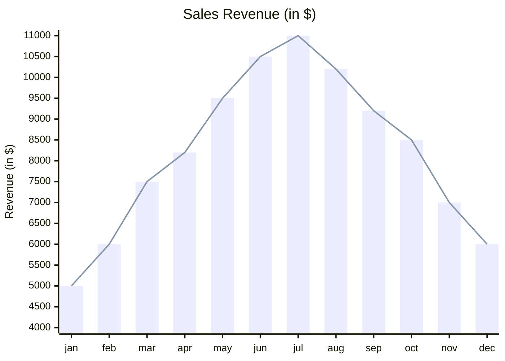
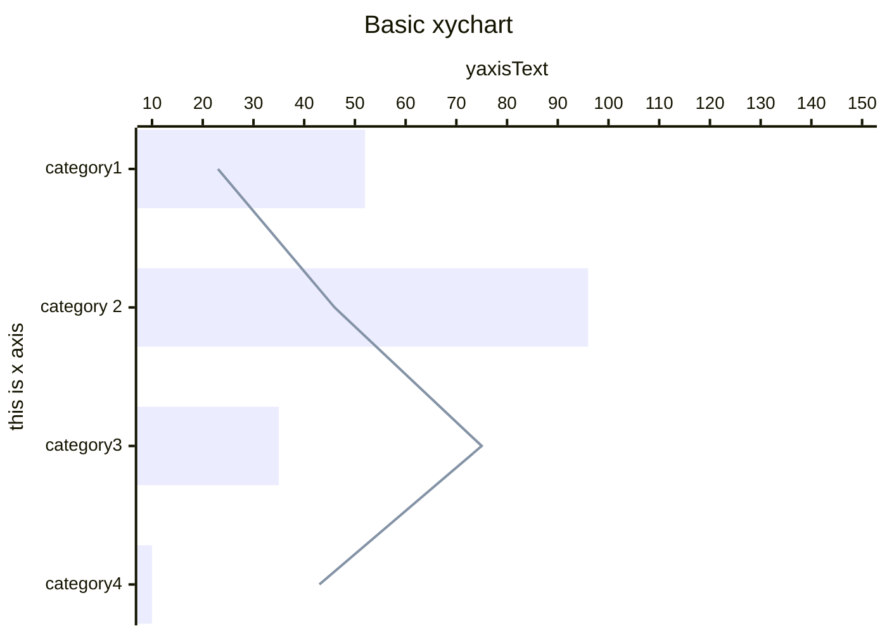
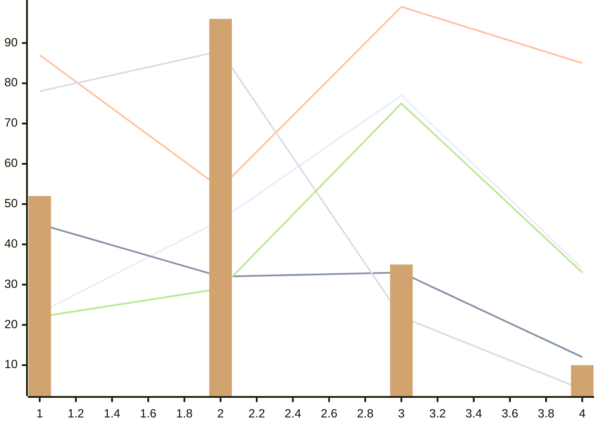
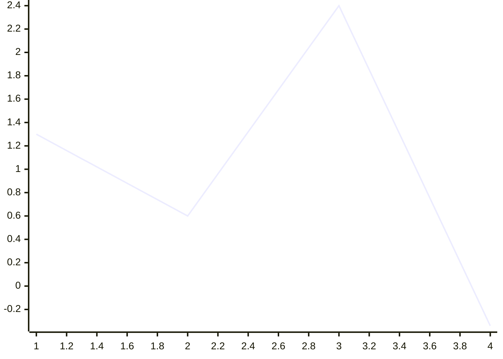
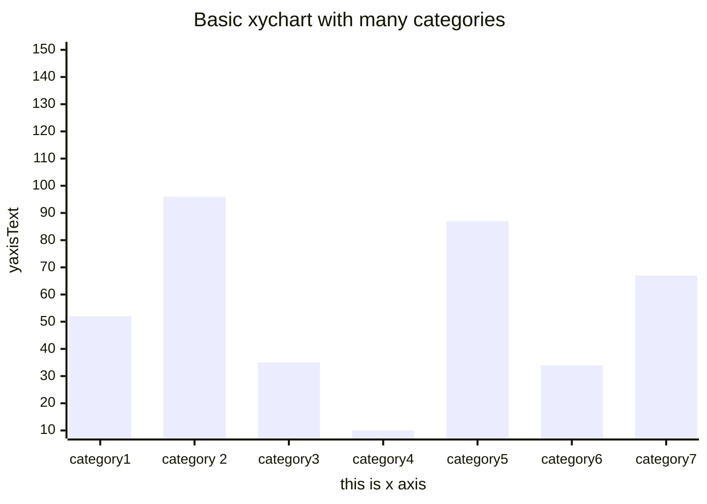
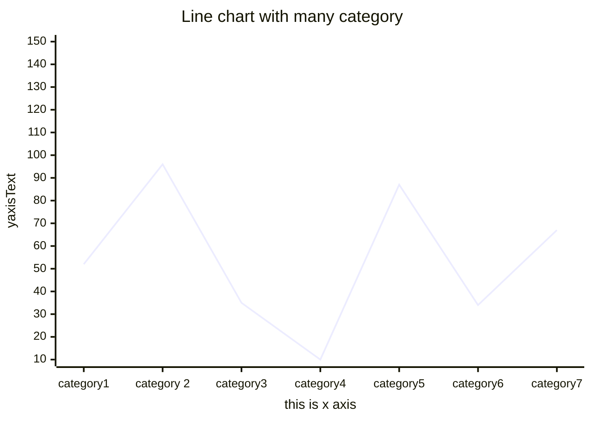
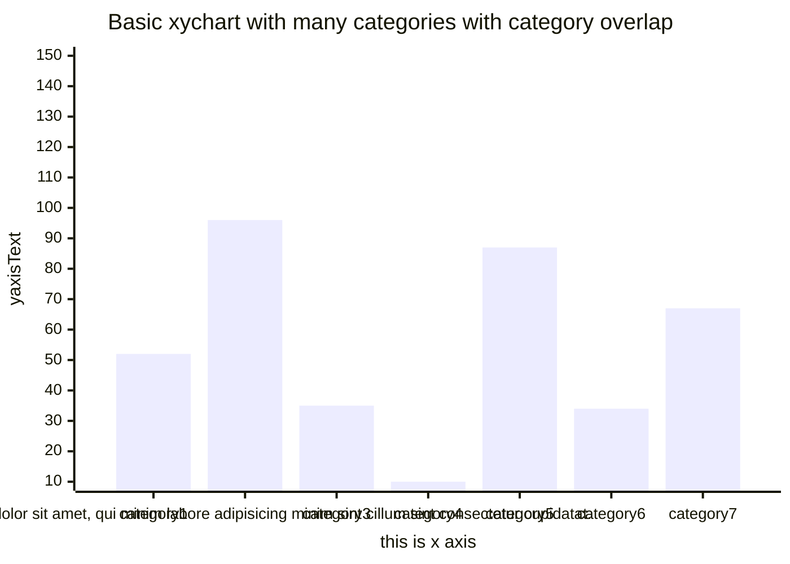
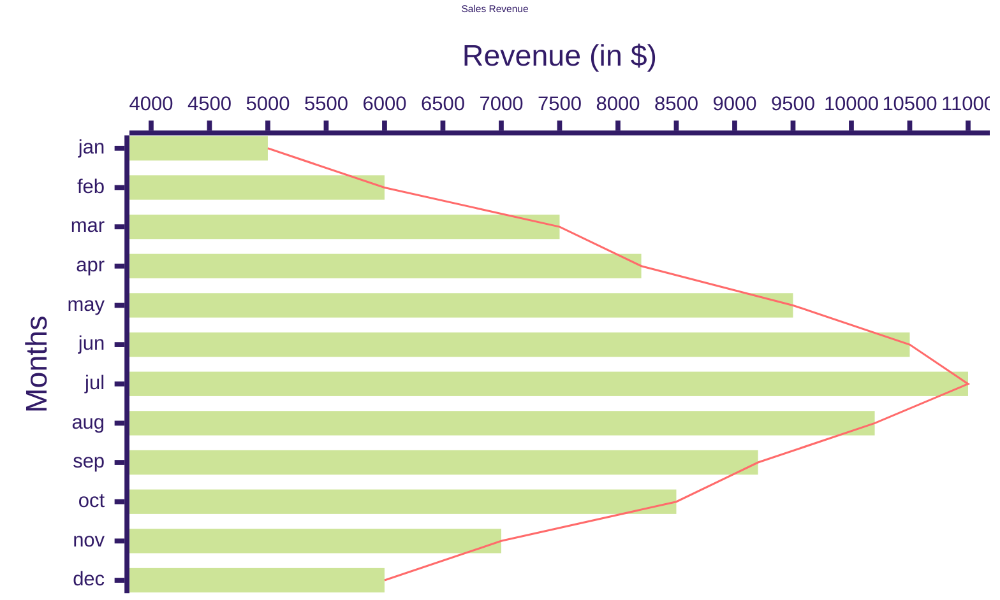
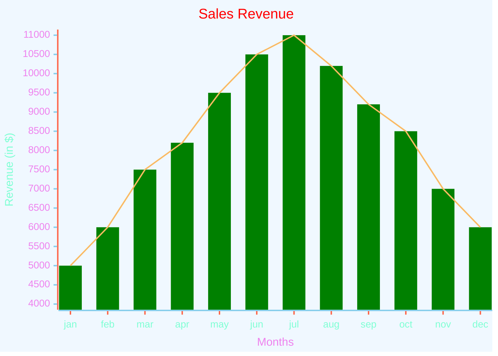

# xychart

## Example 1

**SebastianJS (SVG):**

> Render failed: TypeError: DOMPurify.sanitize is not a function

**Mermaid Code (Browser Rendered):**

## Example 2

**SebastianJS (SVG):**

> Render failed: TypeError: DOMPurify.sanitize is not a function

**Mermaid Code (Browser Rendered):**

## Example 3

**SebastianJS (SVG):**

<svg id="graph" xmlns="http://www.w3.org/2000/svg" xmlns:xlink="http://www.w3.org/1999/xlink" style="max-width: 700px;" viewBox="-4 -4 708 508" role="graphics-document document" aria-roledescription="xychart"><g/><g class="main"><rect width="700" height="500" class="background" fill="white"/><g class="plot"><g class="line-plot-0"><path d="M31,386.4L249.333,269.463L467.667,111.853L686,330.474" fill="none" stroke="#ECECFF" stroke-width="2"/></g><g class="line-plot-1"><path d="M31,274.547L249.333,340.642L467.667,335.558L686,442.326" fill="none" stroke="#8493A6" stroke-width="2"/></g><g class="line-plot-2"><path d="M31,61.011L249.333,228.789L467.667,0L686,71.179" fill="none" stroke="#FFC3A0" stroke-width="2"/></g><g class="line-plot-3"><path d="M31,106.768L249.333,55.926L467.667,391.484L686,483" fill="none" stroke="#DCDDE1" stroke-width="2"/></g><g class="line-plot-4"><path d="M31,391.484L249.333,355.895L467.667,122.021L686,335.558" fill="none" stroke="#B8E994" stroke-width="2"/></g><g class="bar-plot-5"><rect x="17.700000000000003" y="238.9578947368421" width="26.599999999999998" height="244.0421052631579" fill="#D1A36F" stroke="#D1A36F" stroke-width="0"/><rect x="236.0333333333333" y="15.252631578947362" width="26.599999999999998" height="467.7473684210526" fill="#D1A36F" stroke="#D1A36F" stroke-width="0"/><rect x="454.3666666666666" y="325.38947368421054" width="26.599999999999998" height="157.61052631578946" fill="#D1A36F" stroke="#D1A36F" stroke-width="0"/><rect x="672.7" y="452.4947368421053" width="26.599999999999998" height="30.505263157894717" fill="#D1A36F" stroke="#D1A36F" stroke-width="0"/></g></g><g class="bottom-axis"><g class="axis-line"><path d="M 17,484 L 700,484" fill="none" stroke="#131300" stroke-width="2"/></g><g class="label"><text x="0" y="0" fill="#131300" font-size="14" dominant-baseline="text-before-edge" text-anchor="middle" transform="translate(31, 495) rotate(0)">1</text><text x="0" y="0" fill="#131300" font-size="14" dominant-baseline="text-before-edge" text-anchor="middle" transform="translate(74.66666666666666, 495) rotate(0)">1.2</text><text x="0" y="0" fill="#131300" font-size="14" dominant-baseline="text-before-edge" text-anchor="middle" transform="translate(118.33333333333331, 495) rotate(0)">1.4</text><text x="0" y="0" fill="#131300" font-size="14" dominant-baseline="text-before-edge" text-anchor="middle" transform="translate(162, 495) rotate(0)">1.6</text><text x="0" y="0" fill="#131300" font-size="14" dominant-baseline="text-before-edge" text-anchor="middle" transform="translate(205.66666666666669, 495) rotate(0)">1.8</text><text x="0" y="0" fill="#131300" font-size="14" dominant-baseline="text-before-edge" text-anchor="middle" transform="translate(249.33333333333331, 495) rotate(0)">2</text><text x="0" y="0" fill="#131300" font-size="14" dominant-baseline="text-before-edge" text-anchor="middle" transform="translate(293, 495) rotate(0)">2.2</text><text x="0" y="0" fill="#131300" font-size="14" dominant-baseline="text-before-edge" text-anchor="middle" transform="translate(336.6666666666667, 495) rotate(0)">2.4</text><text x="0" y="0" fill="#131300" font-size="14" dominant-baseline="text-before-edge" text-anchor="middle" transform="translate(380.3333333333333, 495) rotate(0)">2.6</text><text x="0" y="0" fill="#131300" font-size="14" dominant-baseline="text-before-edge" text-anchor="middle" transform="translate(423.99999999999994, 495) rotate(0)">2.8</text><text x="0" y="0" fill="#131300" font-size="14" dominant-baseline="text-before-edge" text-anchor="middle" transform="translate(467.66666666666663, 495) rotate(0)">3</text><text x="0" y="0" fill="#131300" font-size="14" dominant-baseline="text-before-edge" text-anchor="middle" transform="translate(511.33333333333337, 495) rotate(0)">3.2</text><text x="0" y="0" fill="#131300" font-size="14" dominant-baseline="text-before-edge" text-anchor="middle" transform="translate(555, 495) rotate(0)">3.4</text><text x="0" y="0" fill="#131300" font-size="14" dominant-baseline="text-before-edge" text-anchor="middle" transform="translate(598.6666666666666, 495) rotate(0)">3.6</text><text x="0" y="0" fill="#131300" font-size="14" dominant-baseline="text-before-edge" text-anchor="middle" transform="translate(642.3333333333334, 495) rotate(0)">3.8</text><text x="0" y="0" fill="#131300" font-size="14" dominant-baseline="text-before-edge" text-anchor="middle" transform="translate(686, 495) rotate(0)">4</text></g><g class="ticks"><path d="M 31,485 L 31,490" fill="none" stroke="#131300" stroke-width="2"/><path d="M 74.66666666666666,485 L 74.66666666666666,490" fill="none" stroke="#131300" stroke-width="2"/><path d="M 118.33333333333331,485 L 118.33333333333331,490" fill="none" stroke="#131300" stroke-width="2"/><path d="M 162,485 L 162,490" fill="none" stroke="#131300" stroke-width="2"/><path d="M 205.66666666666669,485 L 205.66666666666669,490" fill="none" stroke="#131300" stroke-width="2"/><path d="M 249.33333333333331,485 L 249.33333333333331,490" fill="none" stroke="#131300" stroke-width="2"/><path d="M 293,485 L 293,490" fill="none" stroke="#131300" stroke-width="2"/><path d="M 336.6666666666667,485 L 336.6666666666667,490" fill="none" stroke="#131300" stroke-width="2"/><path d="M 380.3333333333333,485 L 380.3333333333333,490" fill="none" stroke="#131300" stroke-width="2"/><path d="M 423.99999999999994,485 L 423.99999999999994,490" fill="none" stroke="#131300" stroke-width="2"/><path d="M 467.66666666666663,485 L 467.66666666666663,490" fill="none" stroke="#131300" stroke-width="2"/><path d="M 511.33333333333337,485 L 511.33333333333337,490" fill="none" stroke="#131300" stroke-width="2"/><path d="M 555,485 L 555,490" fill="none" stroke="#131300" stroke-width="2"/><path d="M 598.6666666666666,485 L 598.6666666666666,490" fill="none" stroke="#131300" stroke-width="2"/><path d="M 642.3333333333334,485 L 642.3333333333334,490" fill="none" stroke="#131300" stroke-width="2"/><path d="M 686,485 L 686,490" fill="none" stroke="#131300" stroke-width="2"/></g></g><g class="left-axis"><g class="axisl-line"><path d="M 16,0 L 16,483 " fill="none" stroke="#131300" stroke-width="2"/></g><g class="label"><text x="0" y="0" fill="#131300" font-size="14" dominant-baseline="middle" text-anchor="end" transform="translate(5, 45.75789473684209) rotate(0)">90</text><text x="0" y="0" fill="#131300" font-size="14" dominant-baseline="middle" text-anchor="end" transform="translate(5, 96.59999999999998) rotate(0)">80</text><text x="0" y="0" fill="#131300" font-size="14" dominant-baseline="middle" text-anchor="end" transform="translate(5, 147.44210526315788) rotate(0)">70</text><text x="0" y="0" fill="#131300" font-size="14" dominant-baseline="middle" text-anchor="end" transform="translate(5, 198.2842105263158) rotate(0)">60</text><text x="0" y="0" fill="#131300" font-size="14" dominant-baseline="middle" text-anchor="end" transform="translate(5, 249.12631578947372) rotate(0)">50</text><text x="0" y="0" fill="#131300" font-size="14" dominant-baseline="middle" text-anchor="end" transform="translate(5, 299.9684210526315) rotate(0)">40</text><text x="0" y="0" fill="#131300" font-size="14" dominant-baseline="middle" text-anchor="end" transform="translate(5, 350.8105263157895) rotate(0)">30</text><text x="0" y="0" fill="#131300" font-size="14" dominant-baseline="middle" text-anchor="end" transform="translate(5, 401.65263157894736) rotate(0)">20</text><text x="0" y="0" fill="#131300" font-size="14" dominant-baseline="middle" text-anchor="end" transform="translate(5, 452.4947368421053) rotate(0)">10</text></g><g class="ticks"><path d="M 15,45.75789473684209 L 10,45.75789473684209" fill="none" stroke="#131300" stroke-width="2"/><path d="M 15,96.59999999999998 L 10,96.59999999999998" fill="none" stroke="#131300" stroke-width="2"/><path d="M 15,147.44210526315788 L 10,147.44210526315788" fill="none" stroke="#131300" stroke-width="2"/><path d="M 15,198.2842105263158 L 10,198.2842105263158" fill="none" stroke="#131300" stroke-width="2"/><path d="M 15,249.12631578947372 L 10,249.12631578947372" fill="none" stroke="#131300" stroke-width="2"/><path d="M 15,299.9684210526315 L 10,299.9684210526315" fill="none" stroke="#131300" stroke-width="2"/><path d="M 15,350.8105263157895 L 10,350.8105263157895" fill="none" stroke="#131300" stroke-width="2"/><path d="M 15,401.65263157894736 L 10,401.65263157894736" fill="none" stroke="#131300" stroke-width="2"/><path d="M 15,452.4947368421053 L 10,452.4947368421053" fill="none" stroke="#131300" stroke-width="2"/></g></g></g><g class="mermaid-tmp-group"/></svg>

**Mermaid Code (Browser Rendered):**

## Example 4

**SebastianJS (SVG):**

<svg id="graph" xmlns="http://www.w3.org/2000/svg" xmlns:xlink="http://www.w3.org/1999/xlink" style="max-width: 700px;" viewBox="-4 -4 708 508" role="graphics-document document" aria-roledescription="xychart"><g/><g class="main"><rect width="700" height="500" class="background" fill="white"/><g class="plot"><g class="line-plot-0"><path d="M17,193.905L244.667,317.299L472.333,0L700,483" fill="none" stroke="#ECECFF" stroke-width="2"/></g></g><g class="bottom-axis"><g class="axis-line"><path d="M 17,484 L 700,484" fill="none" stroke="#131300" stroke-width="2"/></g><g class="label"><text x="0" y="0" fill="#131300" font-size="14" dominant-baseline="text-before-edge" text-anchor="middle" transform="translate(17, 495) rotate(0)">1</text><text x="0" y="0" fill="#131300" font-size="14" dominant-baseline="text-before-edge" text-anchor="middle" transform="translate(62.533333333333324, 495) rotate(0)">1.2</text><text x="0" y="0" fill="#131300" font-size="14" dominant-baseline="text-before-edge" text-anchor="middle" transform="translate(108.06666666666665, 495) rotate(0)">1.4</text><text x="0" y="0" fill="#131300" font-size="14" dominant-baseline="text-before-edge" text-anchor="middle" transform="translate(153.60000000000002, 495) rotate(0)">1.6</text><text x="0" y="0" fill="#131300" font-size="14" dominant-baseline="text-before-edge" text-anchor="middle" transform="translate(199.13333333333333, 495) rotate(0)">1.8</text><text x="0" y="0" fill="#131300" font-size="14" dominant-baseline="text-before-edge" text-anchor="middle" transform="translate(244.66666666666666, 495) rotate(0)">2</text><text x="0" y="0" fill="#131300" font-size="14" dominant-baseline="text-before-edge" text-anchor="middle" transform="translate(290.20000000000005, 495) rotate(0)">2.2</text><text x="0" y="0" fill="#131300" font-size="14" dominant-baseline="text-before-edge" text-anchor="middle" transform="translate(335.7333333333333, 495) rotate(0)">2.4</text><text x="0" y="0" fill="#131300" font-size="14" dominant-baseline="text-before-edge" text-anchor="middle" transform="translate(381.26666666666665, 495) rotate(0)">2.6</text><text x="0" y="0" fill="#131300" font-size="14" dominant-baseline="text-before-edge" text-anchor="middle" transform="translate(426.8, 495) rotate(0)">2.8</text><text x="0" y="0" fill="#131300" font-size="14" dominant-baseline="text-before-edge" text-anchor="middle" transform="translate(472.3333333333333, 495) rotate(0)">3</text><text x="0" y="0" fill="#131300" font-size="14" dominant-baseline="text-before-edge" text-anchor="middle" transform="translate(517.8666666666667, 495) rotate(0)">3.2</text><text x="0" y="0" fill="#131300" font-size="14" dominant-baseline="text-before-edge" text-anchor="middle" transform="translate(563.4, 495) rotate(0)">3.4</text><text x="0" y="0" fill="#131300" font-size="14" dominant-baseline="text-before-edge" text-anchor="middle" transform="translate(608.9333333333334, 495) rotate(0)">3.6</text><text x="0" y="0" fill="#131300" font-size="14" dominant-baseline="text-before-edge" text-anchor="middle" transform="translate(654.4666666666666, 495) rotate(0)">3.8</text><text x="0" y="0" fill="#131300" font-size="14" dominant-baseline="text-before-edge" text-anchor="middle" transform="translate(700, 495) rotate(0)">4</text></g><g class="ticks"><path d="M 17,485 L 17,490" fill="none" stroke="#131300" stroke-width="2"/><path d="M 62.533333333333324,485 L 62.533333333333324,490" fill="none" stroke="#131300" stroke-width="2"/><path d="M 108.06666666666665,485 L 108.06666666666665,490" fill="none" stroke="#131300" stroke-width="2"/><path d="M 153.60000000000002,485 L 153.60000000000002,490" fill="none" stroke="#131300" stroke-width="2"/><path d="M 199.13333333333333,485 L 199.13333333333333,490" fill="none" stroke="#131300" stroke-width="2"/><path d="M 244.66666666666666,485 L 244.66666666666666,490" fill="none" stroke="#131300" stroke-width="2"/><path d="M 290.20000000000005,485 L 290.20000000000005,490" fill="none" stroke="#131300" stroke-width="2"/><path d="M 335.7333333333333,485 L 335.7333333333333,490" fill="none" stroke="#131300" stroke-width="2"/><path d="M 381.26666666666665,485 L 381.26666666666665,490" fill="none" stroke="#131300" stroke-width="2"/><path d="M 426.8,485 L 426.8,490" fill="none" stroke="#131300" stroke-width="2"/><path d="M 472.3333333333333,485 L 472.3333333333333,490" fill="none" stroke="#131300" stroke-width="2"/><path d="M 517.8666666666667,485 L 517.8666666666667,490" fill="none" stroke="#131300" stroke-width="2"/><path d="M 563.4,485 L 563.4,490" fill="none" stroke="#131300" stroke-width="2"/><path d="M 608.9333333333334,485 L 608.9333333333334,490" fill="none" stroke="#131300" stroke-width="2"/><path d="M 654.4666666666666,485 L 654.4666666666666,490" fill="none" stroke="#131300" stroke-width="2"/><path d="M 700,485 L 700,490" fill="none" stroke="#131300" stroke-width="2"/></g></g><g class="left-axis"><g class="axisl-line"><path d="M 16,0 L 16,483 " fill="none" stroke="#131300" stroke-width="2"/></g><g class="label"><text x="0" y="0" fill="#131300" font-size="14" dominant-baseline="middle" text-anchor="end" transform="translate(5, 0) rotate(0)">2.4</text><text x="0" y="0" fill="#131300" font-size="14" dominant-baseline="middle" text-anchor="end" transform="translate(5, 35.2554744525547) rotate(0)">2.2</text><text x="0" y="0" fill="#131300" font-size="14" dominant-baseline="middle" text-anchor="end" transform="translate(5, 70.51094890510946) rotate(0)">2</text><text x="0" y="0" fill="#131300" font-size="14" dominant-baseline="middle" text-anchor="end" transform="translate(5, 105.76642335766415) rotate(0)">1.8</text><text x="0" y="0" fill="#131300" font-size="14" dominant-baseline="middle" text-anchor="end" transform="translate(5, 141.02189781021892) rotate(0)">1.6</text><text x="0" y="0" fill="#131300" font-size="14" dominant-baseline="middle" text-anchor="end" transform="translate(5, 176.27737226277372) rotate(0)">1.4</text><text x="0" y="0" fill="#131300" font-size="14" dominant-baseline="middle" text-anchor="end" transform="translate(5, 211.53284671532842) rotate(0)">1.2</text><text x="0" y="0" fill="#131300" font-size="14" dominant-baseline="middle" text-anchor="end" transform="translate(5, 246.78832116788317) rotate(0)">1</text><text x="0" y="0" fill="#131300" font-size="14" dominant-baseline="middle" text-anchor="end" transform="translate(5, 282.04379562043795) rotate(0)">0.8</text><text x="0" y="0" fill="#131300" font-size="14" dominant-baseline="middle" text-anchor="end" transform="translate(5, 317.29927007299267) rotate(0)">0.6</text><text x="0" y="0" fill="#131300" font-size="14" dominant-baseline="middle" text-anchor="end" transform="translate(5, 352.55474452554745) rotate(0)">0.4</text><text x="0" y="0" fill="#131300" font-size="14" dominant-baseline="middle" text-anchor="end" transform="translate(5, 387.81021897810217) rotate(0)">0.2</text><text x="0" y="0" fill="#131300" font-size="14" dominant-baseline="middle" text-anchor="end" transform="translate(5, 423.06569343065695) rotate(0)">0</text><text x="0" y="0" fill="#131300" font-size="14" dominant-baseline="middle" text-anchor="end" transform="translate(5, 458.3211678832117) rotate(0)">-0.2</text></g><g class="ticks"><path d="M 15,0 L 10,0" fill="none" stroke="#131300" stroke-width="2"/><path d="M 15,35.2554744525547 L 10,35.2554744525547" fill="none" stroke="#131300" stroke-width="2"/><path d="M 15,70.51094890510946 L 10,70.51094890510946" fill="none" stroke="#131300" stroke-width="2"/><path d="M 15,105.76642335766415 L 10,105.76642335766415" fill="none" stroke="#131300" stroke-width="2"/><path d="M 15,141.02189781021892 L 10,141.02189781021892" fill="none" stroke="#131300" stroke-width="2"/><path d="M 15,176.27737226277372 L 10,176.27737226277372" fill="none" stroke="#131300" stroke-width="2"/><path d="M 15,211.53284671532842 L 10,211.53284671532842" fill="none" stroke="#131300" stroke-width="2"/><path d="M 15,246.78832116788317 L 10,246.78832116788317" fill="none" stroke="#131300" stroke-width="2"/><path d="M 15,282.04379562043795 L 10,282.04379562043795" fill="none" stroke="#131300" stroke-width="2"/><path d="M 15,317.29927007299267 L 10,317.29927007299267" fill="none" stroke="#131300" stroke-width="2"/><path d="M 15,352.55474452554745 L 10,352.55474452554745" fill="none" stroke="#131300" stroke-width="2"/><path d="M 15,387.81021897810217 L 10,387.81021897810217" fill="none" stroke="#131300" stroke-width="2"/><path d="M 15,423.06569343065695 L 10,423.06569343065695" fill="none" stroke="#131300" stroke-width="2"/><path d="M 15,458.3211678832117 L 10,458.3211678832117" fill="none" stroke="#131300" stroke-width="2"/></g></g></g><g class="mermaid-tmp-group"/></svg>

**Mermaid Code (Browser Rendered):**

## Example 5

**SebastianJS (SVG):**

> Render failed: TypeError: DOMPurify.sanitize is not a function

**Mermaid Code (Browser Rendered):**

## Example 6

**SebastianJS (SVG):**

> Render failed: TypeError: DOMPurify.sanitize is not a function

**Mermaid Code (Browser Rendered):**

## Example 7

**SebastianJS (SVG):**

> Render failed: TypeError: DOMPurify.sanitize is not a function

**Mermaid Code (Browser Rendered):**

## Example 8

**SebastianJS (SVG):**

<svg id="graph" xmlns="http://www.w3.org/2000/svg" xmlns:xlink="http://www.w3.org/1999/xlink" style="max-width: 200px;" viewBox="-4 -4 208 28" role="graphics-document document" aria-roledescription="xychart"><g/><g class="main"><rect width="200" height="20" class="background" fill="#333"/><g class="plot"><g class="line-plot-0"><path d="M0,20L18.182,6.667L36.364,11.667L54.545,16L72.727,5L90.909,18.333L109.091,0L127.273,9.333L145.455,6L163.636,5L181.818,13.333L200,7.333" fill="none" stroke="#3498db" stroke-width="2"/></g></g></g><g class="mermaid-tmp-group"/></svg>

**Mermaid Code (Browser Rendered):**

## Example 9

**SebastianJS (SVG):**

<svg id="graph" xmlns="http://www.w3.org/2000/svg" xmlns:xlink="http://www.w3.org/1999/xlink" style="max-width: 200px;" viewBox="-4 -4 208 28" role="graphics-document document" aria-roledescription="xychart"><g/><g class="main"><rect width="200" height="20" class="background" fill="#333"/><g class="plot"><g class="bar-plot-0"><rect x="0.25" y="20" width="9.5" height="0" fill="#3498db" stroke="#3498db" stroke-width="0"/><rect x="17.522727272727273" y="6.666666666666668" width="9.5" height="13.333333333333332" fill="#3498db" stroke="#3498db" stroke-width="0"/><rect x="34.79545454545455" y="11.666666666666664" width="9.5" height="8.333333333333336" fill="#3498db" stroke="#3498db" stroke-width="0"/><rect x="52.06818181818181" y="16" width="9.5" height="4" fill="#3498db" stroke="#3498db" stroke-width="0"/><rect x="69.3409090909091" y="5" width="9.5" height="15" fill="#3498db" stroke="#3498db" stroke-width="0"/><rect x="86.61363636363637" y="18.333333333333332" width="9.5" height="1.6666666666666679" fill="#3498db" stroke="#3498db" stroke-width="0"/><rect x="103.88636363636363" y="0" width="9.5" height="20" fill="#3498db" stroke="#3498db" stroke-width="0"/><rect x="121.1590909090909" y="9.333333333333334" width="9.5" height="10.666666666666666" fill="#3498db" stroke="#3498db" stroke-width="0"/><rect x="138.4318181818182" y="6.000000000000001" width="9.5" height="14" fill="#3498db" stroke="#3498db" stroke-width="0"/><rect x="155.70454545454547" y="5" width="9.5" height="15" fill="#3498db" stroke="#3498db" stroke-width="0"/><rect x="172.97727272727275" y="13.333333333333336" width="9.5" height="6.666666666666664" fill="#3498db" stroke="#3498db" stroke-width="0"/><rect x="190.25" y="7.333333333333334" width="9.5" height="12.666666666666666" fill="#3498db" stroke="#3498db" stroke-width="0"/></g></g></g><g class="mermaid-tmp-group"/></svg>

**Mermaid Code (Browser Rendered):**

## Example 10

**SebastianJS (SVG):**

> Render failed: TypeError: DOMPurify.sanitize is not a function

**Mermaid Code (Browser Rendered):**

## Example 11

**SebastianJS (SVG):**

> Render failed: TypeError: DOMPurify.sanitize is not a function

**Mermaid Code (Browser Rendered):**

