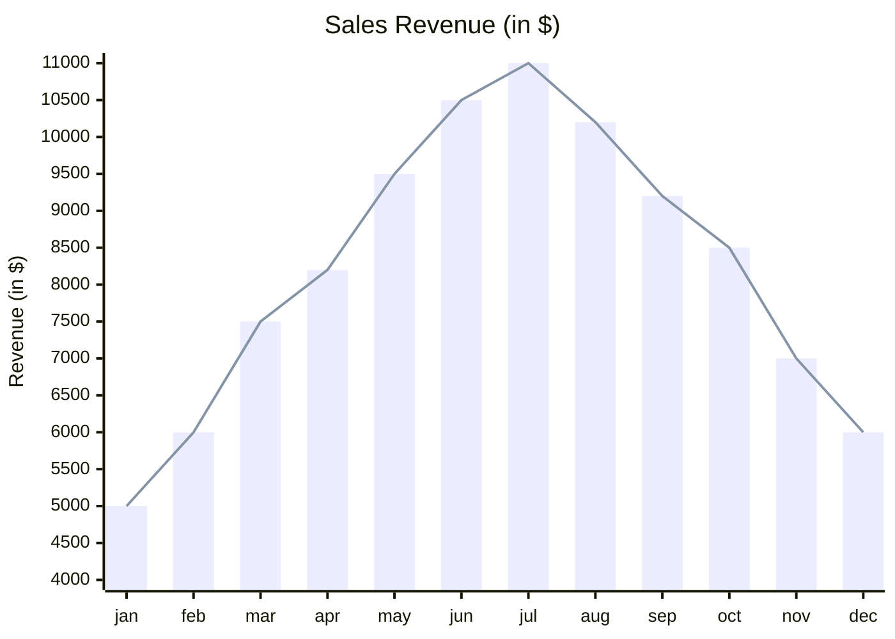
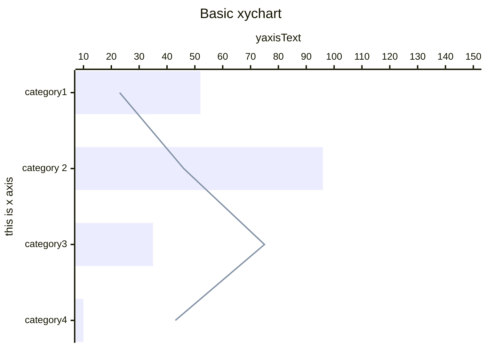
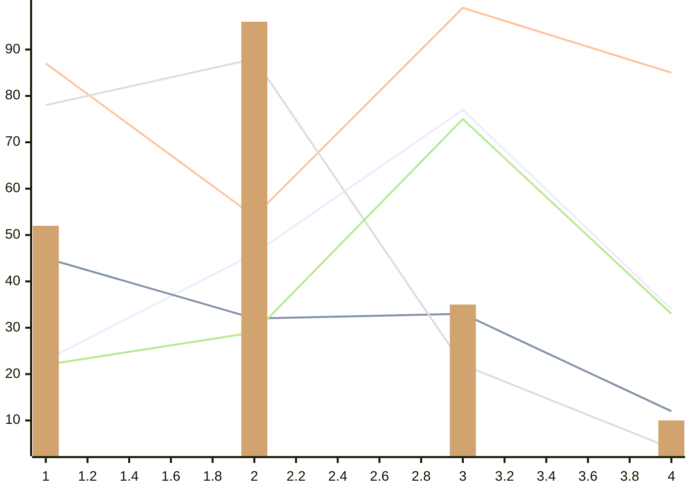
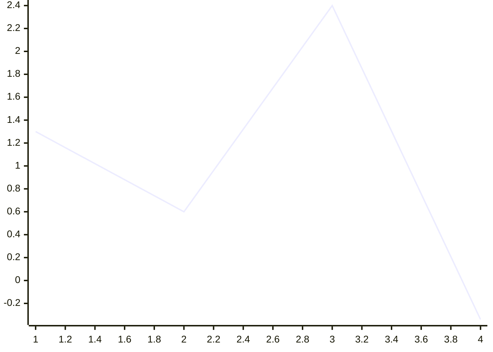
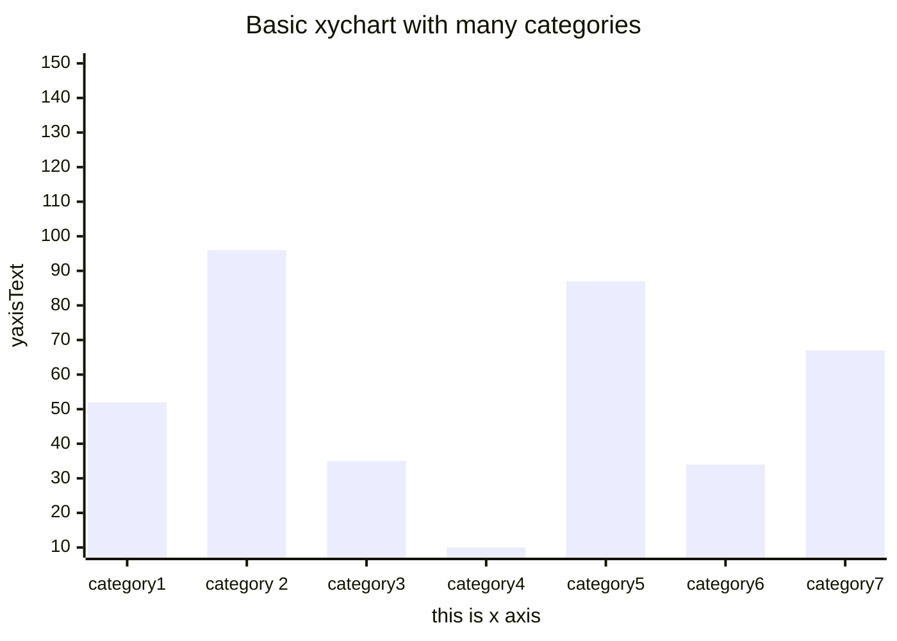
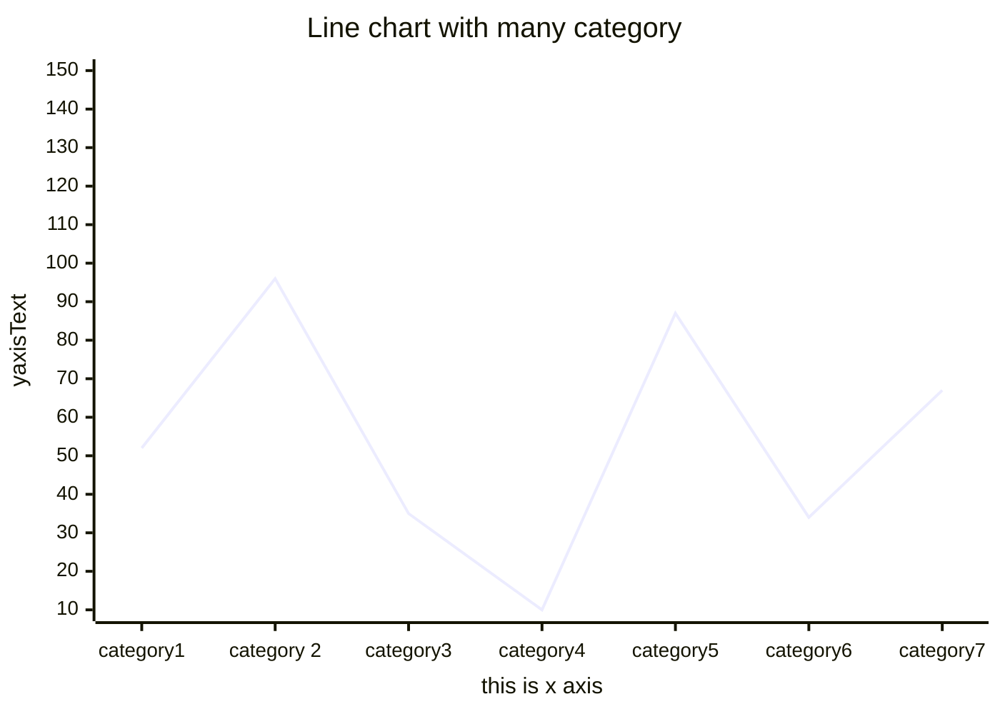
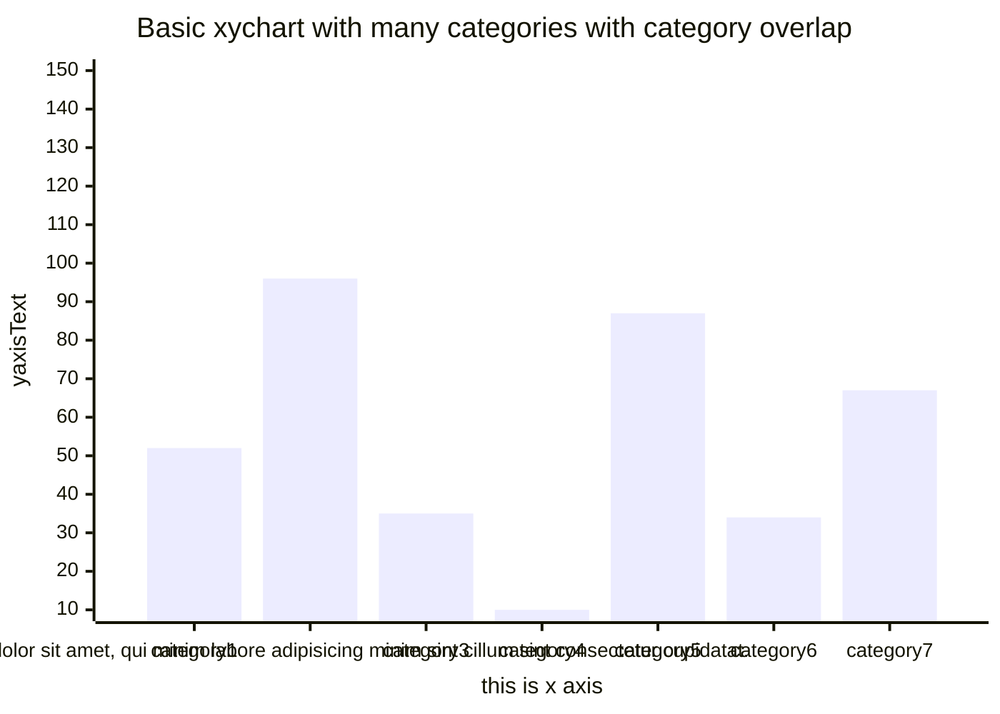
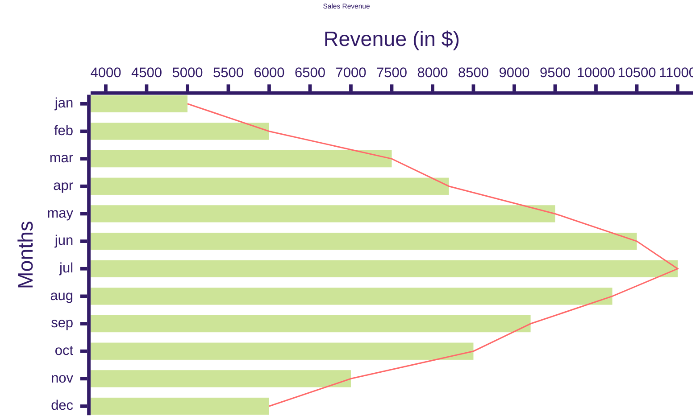
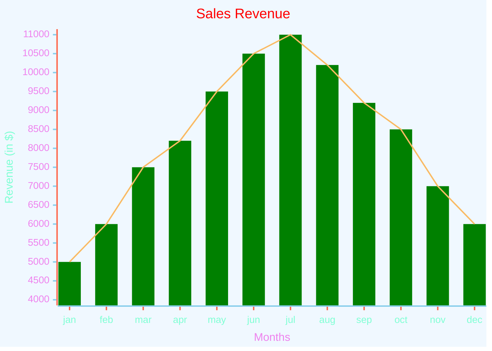

# xychart

## Example 1

**SebastianJS (SVG):**

<svg id="graph" xmlns="http://www.w3.org/2000/svg" xmlns:xlink="http://www.w3.org/1999/xlink" style="max-width: 700px;" viewBox="-4 -4 708 508" role="graphics-document document" aria-roledescription="xychart"><g/><g class="main"><rect width="700" height="500" class="background" fill="white"/><g class="chart-title"><text x="0" y="0" fill="#131300" font-size="20" dominant-baseline="middle" text-anchor="middle" transform="translate(350, 10) rotate(0)">Sales Revenue (in $)</text></g><g class="plot"><g class="bar-plot-0"><rect x="27.95" y="416.8571428571429" width="36.1" height="66.14285714285711" fill="#ECECFF" stroke="#ECECFF" stroke-width="0"/><rect x="85.67727272727272" y="350.7142857142857" width="36.1" height="132.28571428571428" fill="#ECECFF" stroke="#ECECFF" stroke-width="0"/><rect x="143.40454545454543" y="251.5" width="36.1" height="231.5" fill="#ECECFF" stroke="#ECECFF" stroke-width="0"/><rect x="201.13181818181818" y="205.20000000000002" width="36.1" height="277.79999999999995" fill="#ECECFF" stroke="#ECECFF" stroke-width="0"/><rect x="258.85909090909087" y="119.21428571428572" width="36.1" height="363.7857142857143" fill="#ECECFF" stroke="#ECECFF" stroke-width="0"/><rect x="316.5863636363636" y="53.071428571428555" width="36.1" height="429.92857142857144" fill="#ECECFF" stroke="#ECECFF" stroke-width="0"/><rect x="374.31363636363636" y="20" width="36.1" height="463" fill="#ECECFF" stroke="#ECECFF" stroke-width="0"/><rect x="432.04090909090905" y="72.91428571428574" width="36.1" height="410.0857142857143" fill="#ECECFF" stroke="#ECECFF" stroke-width="0"/><rect x="489.7681818181818" y="139.05714285714285" width="36.1" height="343.9428571428572" fill="#ECECFF" stroke="#ECECFF" stroke-width="0"/><rect x="547.4954545454545" y="185.35714285714283" width="36.1" height="297.64285714285717" fill="#ECECFF" stroke="#ECECFF" stroke-width="0"/><rect x="605.2227272727273" y="284.57142857142856" width="36.1" height="198.42857142857144" fill="#ECECFF" stroke="#ECECFF" stroke-width="0"/><rect x="662.95" y="350.7142857142857" width="36.1" height="132.28571428571428" fill="#ECECFF" stroke="#ECECFF" stroke-width="0"/></g><g class="line-plot-1"><path d="M46,416.857L103.727,350.714L161.455,251.5L219.182,205.2L276.909,119.214L334.636,53.071L392.364,20L450.091,72.914L507.818,139.057L565.545,185.357L623.273,284.571L681,350.714" fill="none" stroke="#8493A6" stroke-width="2"/></g></g><g class="bottom-axis"><g class="axis-line"><path d="M 27,484 L 700,484" fill="none" stroke="#131300" stroke-width="2"/></g><g class="label"><text x="0" y="0" fill="#131300" font-size="14" dominant-baseline="text-before-edge" text-anchor="middle" transform="translate(46, 495) rotate(0)">jan</text><text x="0" y="0" fill="#131300" font-size="14" dominant-baseline="text-before-edge" text-anchor="middle" transform="translate(103.72727272727272, 495) rotate(0)">feb</text><text x="0" y="0" fill="#131300" font-size="14" dominant-baseline="text-before-edge" text-anchor="middle" transform="translate(161.45454545454544, 495) rotate(0)">mar</text><text x="0" y="0" fill="#131300" font-size="14" dominant-baseline="text-before-edge" text-anchor="middle" transform="translate(219.1818181818182, 495) rotate(0)">apr</text><text x="0" y="0" fill="#131300" font-size="14" dominant-baseline="text-before-edge" text-anchor="middle" transform="translate(276.9090909090909, 495) rotate(0)">may</text><text x="0" y="0" fill="#131300" font-size="14" dominant-baseline="text-before-edge" text-anchor="middle" transform="translate(334.6363636363636, 495) rotate(0)">jun</text><text x="0" y="0" fill="#131300" font-size="14" dominant-baseline="text-before-edge" text-anchor="middle" transform="translate(392.3636363636364, 495) rotate(0)">jul</text><text x="0" y="0" fill="#131300" font-size="14" dominant-baseline="text-before-edge" text-anchor="middle" transform="translate(450.09090909090907, 495) rotate(0)">aug</text><text x="0" y="0" fill="#131300" font-size="14" dominant-baseline="text-before-edge" text-anchor="middle" transform="translate(507.8181818181818, 495) rotate(0)">sep</text><text x="0" y="0" fill="#131300" font-size="14" dominant-baseline="text-before-edge" text-anchor="middle" transform="translate(565.5454545454545, 495) rotate(0)">oct</text><text x="0" y="0" fill="#131300" font-size="14" dominant-baseline="text-before-edge" text-anchor="middle" transform="translate(623.2727272727273, 495) rotate(0)">nov</text><text x="0" y="0" fill="#131300" font-size="14" dominant-baseline="text-before-edge" text-anchor="middle" transform="translate(681, 495) rotate(0)">dec</text></g><g class="ticks"><path d="M 46,485 L 46,490" fill="none" stroke="#131300" stroke-width="2"/><path d="M 103.72727272727272,485 L 103.72727272727272,490" fill="none" stroke="#131300" stroke-width="2"/><path d="M 161.45454545454544,485 L 161.45454545454544,490" fill="none" stroke="#131300" stroke-width="2"/><path d="M 219.1818181818182,485 L 219.1818181818182,490" fill="none" stroke="#131300" stroke-width="2"/><path d="M 276.9090909090909,485 L 276.9090909090909,490" fill="none" stroke="#131300" stroke-width="2"/><path d="M 334.6363636363636,485 L 334.6363636363636,490" fill="none" stroke="#131300" stroke-width="2"/><path d="M 392.3636363636364,485 L 392.3636363636364,490" fill="none" stroke="#131300" stroke-width="2"/><path d="M 450.09090909090907,485 L 450.09090909090907,490" fill="none" stroke="#131300" stroke-width="2"/><path d="M 507.8181818181818,485 L 507.8181818181818,490" fill="none" stroke="#131300" stroke-width="2"/><path d="M 565.5454545454545,485 L 565.5454545454545,490" fill="none" stroke="#131300" stroke-width="2"/><path d="M 623.2727272727273,485 L 623.2727272727273,490" fill="none" stroke="#131300" stroke-width="2"/><path d="M 681,485 L 681,490" fill="none" stroke="#131300" stroke-width="2"/></g></g><g class="left-axis"><g class="axisl-line"><path d="M 26,20 L 26,483 " fill="none" stroke="#131300" stroke-width="2"/></g><g class="label"><text x="0" y="0" fill="#131300" font-size="14" dominant-baseline="middle" text-anchor="end" transform="translate(15, 20) rotate(0)">11000</text><text x="0" y="0" fill="#131300" font-size="14" dominant-baseline="middle" text-anchor="end" transform="translate(15, 53.071428571428555) rotate(0)">10500</text><text x="0" y="0" fill="#131300" font-size="14" dominant-baseline="middle" text-anchor="end" transform="translate(15, 86.14285714285717) rotate(0)">10000</text><text x="0" y="0" fill="#131300" font-size="14" dominant-baseline="middle" text-anchor="end" transform="translate(15, 119.21428571428572) rotate(0)">9500</text><text x="0" y="0" fill="#131300" font-size="14" dominant-baseline="middle" text-anchor="end" transform="translate(15, 152.28571428571428) rotate(0)">9000</text><text x="0" y="0" fill="#131300" font-size="14" dominant-baseline="middle" text-anchor="end" transform="translate(15, 185.35714285714283) rotate(0)">8500</text><text x="0" y="0" fill="#131300" font-size="14" dominant-baseline="middle" text-anchor="end" transform="translate(15, 218.42857142857144) rotate(0)">8000</text><text x="0" y="0" fill="#131300" font-size="14" dominant-baseline="middle" text-anchor="end" transform="translate(15, 251.5) rotate(0)">7500</text><text x="0" y="0" fill="#131300" font-size="14" dominant-baseline="middle" text-anchor="end" transform="translate(15, 284.57142857142856) rotate(0)">7000</text><text x="0" y="0" fill="#131300" font-size="14" dominant-baseline="middle" text-anchor="end" transform="translate(15, 317.6428571428571) rotate(0)">6500</text><text x="0" y="0" fill="#131300" font-size="14" dominant-baseline="middle" text-anchor="end" transform="translate(15, 350.7142857142857) rotate(0)">6000</text><text x="0" y="0" fill="#131300" font-size="14" dominant-baseline="middle" text-anchor="end" transform="translate(15, 383.7857142857143) rotate(0)">5500</text><text x="0" y="0" fill="#131300" font-size="14" dominant-baseline="middle" text-anchor="end" transform="translate(15, 416.8571428571429) rotate(0)">5000</text><text x="0" y="0" fill="#131300" font-size="14" dominant-baseline="middle" text-anchor="end" transform="translate(15, 449.92857142857144) rotate(0)">4500</text><text x="0" y="0" fill="#131300" font-size="14" dominant-baseline="middle" text-anchor="end" transform="translate(15, 483) rotate(0)">4000</text></g><g class="ticks"><path d="M 25,20 L 20,20" fill="none" stroke="#131300" stroke-width="2"/><path d="M 25,53.071428571428555 L 20,53.071428571428555" fill="none" stroke="#131300" stroke-width="2"/><path d="M 25,86.14285714285717 L 20,86.14285714285717" fill="none" stroke="#131300" stroke-width="2"/><path d="M 25,119.21428571428572 L 20,119.21428571428572" fill="none" stroke="#131300" stroke-width="2"/><path d="M 25,152.28571428571428 L 20,152.28571428571428" fill="none" stroke="#131300" stroke-width="2"/><path d="M 25,185.35714285714283 L 20,185.35714285714283" fill="none" stroke="#131300" stroke-width="2"/><path d="M 25,218.42857142857144 L 20,218.42857142857144" fill="none" stroke="#131300" stroke-width="2"/><path d="M 25,251.5 L 20,251.5" fill="none" stroke="#131300" stroke-width="2"/><path d="M 25,284.57142857142856 L 20,284.57142857142856" fill="none" stroke="#131300" stroke-width="2"/><path d="M 25,317.6428571428571 L 20,317.6428571428571" fill="none" stroke="#131300" stroke-width="2"/><path d="M 25,350.7142857142857 L 20,350.7142857142857" fill="none" stroke="#131300" stroke-width="2"/><path d="M 25,383.7857142857143 L 20,383.7857142857143" fill="none" stroke="#131300" stroke-width="2"/><path d="M 25,416.8571428571429 L 20,416.8571428571429" fill="none" stroke="#131300" stroke-width="2"/><path d="M 25,449.92857142857144 L 20,449.92857142857144" fill="none" stroke="#131300" stroke-width="2"/><path d="M 25,483 L 20,483" fill="none" stroke="#131300" stroke-width="2"/></g><g class="title"><text x="0" y="0" fill="#131300" font-size="16" dominant-baseline="text-before-edge" text-anchor="middle" transform="translate(5, 251.5) rotate(270)">Revenue (in $)</text></g></g></g><g class="mermaid-tmp-group"/></svg>

**Mermaid Code (Browser Rendered):**

## Example 2

**SebastianJS (SVG):**

<svg id="graph" xmlns="http://www.w3.org/2000/svg" xmlns:xlink="http://www.w3.org/1999/xlink" style="max-width: 700px;" viewBox="-4 -4 708 508" role="graphics-document document" aria-roledescription="xychart"><g/><g class="main"><rect width="700" height="500" class="background" fill="white"/><g class="chart-title"><text x="0" y="0" fill="#131300" font-size="20" dominant-baseline="middle" text-anchor="middle" transform="translate(350, 10) rotate(0)">Basic xychart</text></g><g class="plot"><g class="bar-plot-0"><rect x="27" y="48.95" width="201.9" height="74.1" fill="#ECECFF" stroke="#ECECFF" stroke-width="0"/><rect x="27" y="173.95" width="413.4142857142857" height="74.1" fill="#ECECFF" stroke="#ECECFF" stroke-width="0"/><rect x="27" y="298.95" width="120.17857142857142" height="74.1" fill="#ECECFF" stroke="#ECECFF" stroke-width="0"/><rect x="27" y="423.95" width="0" height="74.1" fill="#ECECFF" stroke="#ECECFF" stroke-width="0"/></g><g class="line-plot-1"><path d="M89.493,86L200.057,211L339.464,336L185.636,461" fill="none" stroke="#8493A6" stroke-width="2"/></g></g><g class="left-axis"><g class="axisl-line"><path d="M 26,47 L 26,500 " fill="none" stroke="#131300" stroke-width="2"/></g><g class="label"><text x="0" y="0" fill="#131300" font-size="14" dominant-baseline="middle" text-anchor="end" transform="translate(15, 86) rotate(0)">category1</text><text x="0" y="0" fill="#131300" font-size="14" dominant-baseline="middle" text-anchor="end" transform="translate(15, 211) rotate(0)">category 2</text><text x="0" y="0" fill="#131300" font-size="14" dominant-baseline="middle" text-anchor="end" transform="translate(15, 336) rotate(0)">category3</text><text x="0" y="0" fill="#131300" font-size="14" dominant-baseline="middle" text-anchor="end" transform="translate(15, 461) rotate(0)">category4</text></g><g class="ticks"><path d="M 25,86 L 20,86" fill="none" stroke="#131300" stroke-width="2"/><path d="M 25,211 L 20,211" fill="none" stroke="#131300" stroke-width="2"/><path d="M 25,336 L 20,336" fill="none" stroke="#131300" stroke-width="2"/><path d="M 25,461 L 20,461" fill="none" stroke="#131300" stroke-width="2"/></g><g class="title"><text x="0" y="0" fill="#131300" font-size="16" dominant-baseline="text-before-edge" text-anchor="middle" transform="translate(5, 273.5) rotate(270)">this is x axis</text></g></g><g class="top-axis"><g class="axis-line"><path d="M 27,46 L 700,46" fill="none" stroke="#131300" stroke-width="2"/></g><g class="label"><text x="0" y="0" fill="#131300" font-size="14" dominant-baseline="text-before-edge" text-anchor="middle" transform="translate(27, 35) rotate(0)">10</text><text x="0" y="0" fill="#131300" font-size="14" dominant-baseline="text-before-edge" text-anchor="middle" transform="translate(75.07142857142857, 35) rotate(0)">20</text><text x="0" y="0" fill="#131300" font-size="14" dominant-baseline="text-before-edge" text-anchor="middle" transform="translate(123.14285714285714, 35) rotate(0)">30</text><text x="0" y="0" fill="#131300" font-size="14" dominant-baseline="text-before-edge" text-anchor="middle" transform="translate(171.21428571428572, 35) rotate(0)">40</text><text x="0" y="0" fill="#131300" font-size="14" dominant-baseline="text-before-edge" text-anchor="middle" transform="translate(219.28571428571428, 35) rotate(0)">50</text><text x="0" y="0" fill="#131300" font-size="14" dominant-baseline="text-before-edge" text-anchor="middle" transform="translate(267.35714285714283, 35) rotate(0)">60</text><text x="0" y="0" fill="#131300" font-size="14" dominant-baseline="text-before-edge" text-anchor="middle" transform="translate(315.42857142857144, 35) rotate(0)">70</text><text x="0" y="0" fill="#131300" font-size="14" dominant-baseline="text-before-edge" text-anchor="middle" transform="translate(363.5, 35) rotate(0)">80</text><text x="0" y="0" fill="#131300" font-size="14" dominant-baseline="text-before-edge" text-anchor="middle" transform="translate(411.57142857142856, 35) rotate(0)">90</text><text x="0" y="0" fill="#131300" font-size="14" dominant-baseline="text-before-edge" text-anchor="middle" transform="translate(459.6428571428572, 35) rotate(0)">100</text><text x="0" y="0" fill="#131300" font-size="14" dominant-baseline="text-before-edge" text-anchor="middle" transform="translate(507.7142857142857, 35) rotate(0)">110</text><text x="0" y="0" fill="#131300" font-size="14" dominant-baseline="text-before-edge" text-anchor="middle" transform="translate(555.7857142857143, 35) rotate(0)">120</text><text x="0" y="0" fill="#131300" font-size="14" dominant-baseline="text-before-edge" text-anchor="middle" transform="translate(603.8571428571429, 35) rotate(0)">130</text><text x="0" y="0" fill="#131300" font-size="14" dominant-baseline="text-before-edge" text-anchor="middle" transform="translate(651.9285714285714, 35) rotate(0)">140</text><text x="0" y="0" fill="#131300" font-size="14" dominant-baseline="text-before-edge" text-anchor="middle" transform="translate(700, 35) rotate(0)">150</text></g><g class="ticks"><path d="M 27,45 L 27,40" fill="none" stroke="#131300" stroke-width="2"/><path d="M 75.07142857142857,45 L 75.07142857142857,40" fill="none" stroke="#131300" stroke-width="2"/><path d="M 123.14285714285714,45 L 123.14285714285714,40" fill="none" stroke="#131300" stroke-width="2"/><path d="M 171.21428571428572,45 L 171.21428571428572,40" fill="none" stroke="#131300" stroke-width="2"/><path d="M 219.28571428571428,45 L 219.28571428571428,40" fill="none" stroke="#131300" stroke-width="2"/><path d="M 267.35714285714283,45 L 267.35714285714283,40" fill="none" stroke="#131300" stroke-width="2"/><path d="M 315.42857142857144,45 L 315.42857142857144,40" fill="none" stroke="#131300" stroke-width="2"/><path d="M 363.5,45 L 363.5,40" fill="none" stroke="#131300" stroke-width="2"/><path d="M 411.57142857142856,45 L 411.57142857142856,40" fill="none" stroke="#131300" stroke-width="2"/><path d="M 459.6428571428572,45 L 459.6428571428572,40" fill="none" stroke="#131300" stroke-width="2"/><path d="M 507.7142857142857,45 L 507.7142857142857,40" fill="none" stroke="#131300" stroke-width="2"/><path d="M 555.7857142857143,45 L 555.7857142857143,40" fill="none" stroke="#131300" stroke-width="2"/><path d="M 603.8571428571429,45 L 603.8571428571429,40" fill="none" stroke="#131300" stroke-width="2"/><path d="M 651.9285714285714,45 L 651.9285714285714,40" fill="none" stroke="#131300" stroke-width="2"/><path d="M 700,45 L 700,40" fill="none" stroke="#131300" stroke-width="2"/></g><g class="title"><text x="0" y="0" fill="#131300" font-size="16" dominant-baseline="text-before-edge" text-anchor="middle" transform="translate(363.5, 25) rotate(0)">yaxisText</text></g></g></g><g class="mermaid-tmp-group"/></svg>

**Mermaid Code (Browser Rendered):**

## Example 3

**SebastianJS (SVG):**

<svg id="graph" xmlns="http://www.w3.org/2000/svg" xmlns:xlink="http://www.w3.org/1999/xlink" style="max-width: 700px;" viewBox="-4 -4 708 508" role="graphics-document document" aria-roledescription="xychart"><g/><g class="main"><rect width="700" height="500" class="background" fill="white"/><g class="plot"><g class="line-plot-0"><path d="M31,386.4L249.333,269.463L467.667,111.853L686,330.474" fill="none" stroke="#ECECFF" stroke-width="2"/></g><g class="line-plot-1"><path d="M31,274.547L249.333,340.642L467.667,335.558L686,442.326" fill="none" stroke="#8493A6" stroke-width="2"/></g><g class="line-plot-2"><path d="M31,61.011L249.333,228.789L467.667,0L686,71.179" fill="none" stroke="#FFC3A0" stroke-width="2"/></g><g class="line-plot-3"><path d="M31,106.768L249.333,55.926L467.667,391.484L686,483" fill="none" stroke="#DCDDE1" stroke-width="2"/></g><g class="line-plot-4"><path d="M31,391.484L249.333,355.895L467.667,122.021L686,335.558" fill="none" stroke="#B8E994" stroke-width="2"/></g><g class="bar-plot-5"><rect x="17.700000000000003" y="238.9578947368421" width="26.599999999999998" height="244.0421052631579" fill="#D1A36F" stroke="#D1A36F" stroke-width="0"/><rect x="236.0333333333333" y="15.252631578947362" width="26.599999999999998" height="467.7473684210526" fill="#D1A36F" stroke="#D1A36F" stroke-width="0"/><rect x="454.3666666666666" y="325.38947368421054" width="26.599999999999998" height="157.61052631578946" fill="#D1A36F" stroke="#D1A36F" stroke-width="0"/><rect x="672.7" y="452.4947368421053" width="26.599999999999998" height="30.505263157894717" fill="#D1A36F" stroke="#D1A36F" stroke-width="0"/></g></g><g class="bottom-axis"><g class="axis-line"><path d="M 17,484 L 700,484" fill="none" stroke="#131300" stroke-width="2"/></g><g class="label"><text x="0" y="0" fill="#131300" font-size="14" dominant-baseline="text-before-edge" text-anchor="middle" transform="translate(31, 495) rotate(0)">1</text><text x="0" y="0" fill="#131300" font-size="14" dominant-baseline="text-before-edge" text-anchor="middle" transform="translate(74.66666666666666, 495) rotate(0)">1.2</text><text x="0" y="0" fill="#131300" font-size="14" dominant-baseline="text-before-edge" text-anchor="middle" transform="translate(118.33333333333331, 495) rotate(0)">1.4</text><text x="0" y="0" fill="#131300" font-size="14" dominant-baseline="text-before-edge" text-anchor="middle" transform="translate(162, 495) rotate(0)">1.6</text><text x="0" y="0" fill="#131300" font-size="14" dominant-baseline="text-before-edge" text-anchor="middle" transform="translate(205.66666666666669, 495) rotate(0)">1.8</text><text x="0" y="0" fill="#131300" font-size="14" dominant-baseline="text-before-edge" text-anchor="middle" transform="translate(249.33333333333331, 495) rotate(0)">2</text><text x="0" y="0" fill="#131300" font-size="14" dominant-baseline="text-before-edge" text-anchor="middle" transform="translate(293, 495) rotate(0)">2.2</text><text x="0" y="0" fill="#131300" font-size="14" dominant-baseline="text-before-edge" text-anchor="middle" transform="translate(336.6666666666667, 495) rotate(0)">2.4</text><text x="0" y="0" fill="#131300" font-size="14" dominant-baseline="text-before-edge" text-anchor="middle" transform="translate(380.3333333333333, 495) rotate(0)">2.6</text><text x="0" y="0" fill="#131300" font-size="14" dominant-baseline="text-before-edge" text-anchor="middle" transform="translate(423.99999999999994, 495) rotate(0)">2.8</text><text x="0" y="0" fill="#131300" font-size="14" dominant-baseline="text-before-edge" text-anchor="middle" transform="translate(467.66666666666663, 495) rotate(0)">3</text><text x="0" y="0" fill="#131300" font-size="14" dominant-baseline="text-before-edge" text-anchor="middle" transform="translate(511.33333333333337, 495) rotate(0)">3.2</text><text x="0" y="0" fill="#131300" font-size="14" dominant-baseline="text-before-edge" text-anchor="middle" transform="translate(555, 495) rotate(0)">3.4</text><text x="0" y="0" fill="#131300" font-size="14" dominant-baseline="text-before-edge" text-anchor="middle" transform="translate(598.6666666666666, 495) rotate(0)">3.6</text><text x="0" y="0" fill="#131300" font-size="14" dominant-baseline="text-before-edge" text-anchor="middle" transform="translate(642.3333333333334, 495) rotate(0)">3.8</text><text x="0" y="0" fill="#131300" font-size="14" dominant-baseline="text-before-edge" text-anchor="middle" transform="translate(686, 495) rotate(0)">4</text></g><g class="ticks"><path d="M 31,485 L 31,490" fill="none" stroke="#131300" stroke-width="2"/><path d="M 74.66666666666666,485 L 74.66666666666666,490" fill="none" stroke="#131300" stroke-width="2"/><path d="M 118.33333333333331,485 L 118.33333333333331,490" fill="none" stroke="#131300" stroke-width="2"/><path d="M 162,485 L 162,490" fill="none" stroke="#131300" stroke-width="2"/><path d="M 205.66666666666669,485 L 205.66666666666669,490" fill="none" stroke="#131300" stroke-width="2"/><path d="M 249.33333333333331,485 L 249.33333333333331,490" fill="none" stroke="#131300" stroke-width="2"/><path d="M 293,485 L 293,490" fill="none" stroke="#131300" stroke-width="2"/><path d="M 336.6666666666667,485 L 336.6666666666667,490" fill="none" stroke="#131300" stroke-width="2"/><path d="M 380.3333333333333,485 L 380.3333333333333,490" fill="none" stroke="#131300" stroke-width="2"/><path d="M 423.99999999999994,485 L 423.99999999999994,490" fill="none" stroke="#131300" stroke-width="2"/><path d="M 467.66666666666663,485 L 467.66666666666663,490" fill="none" stroke="#131300" stroke-width="2"/><path d="M 511.33333333333337,485 L 511.33333333333337,490" fill="none" stroke="#131300" stroke-width="2"/><path d="M 555,485 L 555,490" fill="none" stroke="#131300" stroke-width="2"/><path d="M 598.6666666666666,485 L 598.6666666666666,490" fill="none" stroke="#131300" stroke-width="2"/><path d="M 642.3333333333334,485 L 642.3333333333334,490" fill="none" stroke="#131300" stroke-width="2"/><path d="M 686,485 L 686,490" fill="none" stroke="#131300" stroke-width="2"/></g></g><g class="left-axis"><g class="axisl-line"><path d="M 16,0 L 16,483 " fill="none" stroke="#131300" stroke-width="2"/></g><g class="label"><text x="0" y="0" fill="#131300" font-size="14" dominant-baseline="middle" text-anchor="end" transform="translate(5, 45.75789473684209) rotate(0)">90</text><text x="0" y="0" fill="#131300" font-size="14" dominant-baseline="middle" text-anchor="end" transform="translate(5, 96.59999999999998) rotate(0)">80</text><text x="0" y="0" fill="#131300" font-size="14" dominant-baseline="middle" text-anchor="end" transform="translate(5, 147.44210526315788) rotate(0)">70</text><text x="0" y="0" fill="#131300" font-size="14" dominant-baseline="middle" text-anchor="end" transform="translate(5, 198.2842105263158) rotate(0)">60</text><text x="0" y="0" fill="#131300" font-size="14" dominant-baseline="middle" text-anchor="end" transform="translate(5, 249.12631578947372) rotate(0)">50</text><text x="0" y="0" fill="#131300" font-size="14" dominant-baseline="middle" text-anchor="end" transform="translate(5, 299.9684210526315) rotate(0)">40</text><text x="0" y="0" fill="#131300" font-size="14" dominant-baseline="middle" text-anchor="end" transform="translate(5, 350.8105263157895) rotate(0)">30</text><text x="0" y="0" fill="#131300" font-size="14" dominant-baseline="middle" text-anchor="end" transform="translate(5, 401.65263157894736) rotate(0)">20</text><text x="0" y="0" fill="#131300" font-size="14" dominant-baseline="middle" text-anchor="end" transform="translate(5, 452.4947368421053) rotate(0)">10</text></g><g class="ticks"><path d="M 15,45.75789473684209 L 10,45.75789473684209" fill="none" stroke="#131300" stroke-width="2"/><path d="M 15,96.59999999999998 L 10,96.59999999999998" fill="none" stroke="#131300" stroke-width="2"/><path d="M 15,147.44210526315788 L 10,147.44210526315788" fill="none" stroke="#131300" stroke-width="2"/><path d="M 15,198.2842105263158 L 10,198.2842105263158" fill="none" stroke="#131300" stroke-width="2"/><path d="M 15,249.12631578947372 L 10,249.12631578947372" fill="none" stroke="#131300" stroke-width="2"/><path d="M 15,299.9684210526315 L 10,299.9684210526315" fill="none" stroke="#131300" stroke-width="2"/><path d="M 15,350.8105263157895 L 10,350.8105263157895" fill="none" stroke="#131300" stroke-width="2"/><path d="M 15,401.65263157894736 L 10,401.65263157894736" fill="none" stroke="#131300" stroke-width="2"/><path d="M 15,452.4947368421053 L 10,452.4947368421053" fill="none" stroke="#131300" stroke-width="2"/></g></g></g><g class="mermaid-tmp-group"/></svg>

**Mermaid Code (Browser Rendered):**

## Example 4

**SebastianJS (SVG):**

<svg id="graph" xmlns="http://www.w3.org/2000/svg" xmlns:xlink="http://www.w3.org/1999/xlink" style="max-width: 700px;" viewBox="-4 -4 708 508" role="graphics-document document" aria-roledescription="xychart"><g/><g class="main"><rect width="700" height="500" class="background" fill="white"/><g class="plot"><g class="line-plot-0"><path d="M17,193.905L244.667,317.299L472.333,0L700,483" fill="none" stroke="#ECECFF" stroke-width="2"/></g></g><g class="bottom-axis"><g class="axis-line"><path d="M 17,484 L 700,484" fill="none" stroke="#131300" stroke-width="2"/></g><g class="label"><text x="0" y="0" fill="#131300" font-size="14" dominant-baseline="text-before-edge" text-anchor="middle" transform="translate(17, 495) rotate(0)">1</text><text x="0" y="0" fill="#131300" font-size="14" dominant-baseline="text-before-edge" text-anchor="middle" transform="translate(62.533333333333324, 495) rotate(0)">1.2</text><text x="0" y="0" fill="#131300" font-size="14" dominant-baseline="text-before-edge" text-anchor="middle" transform="translate(108.06666666666665, 495) rotate(0)">1.4</text><text x="0" y="0" fill="#131300" font-size="14" dominant-baseline="text-before-edge" text-anchor="middle" transform="translate(153.60000000000002, 495) rotate(0)">1.6</text><text x="0" y="0" fill="#131300" font-size="14" dominant-baseline="text-before-edge" text-anchor="middle" transform="translate(199.13333333333333, 495) rotate(0)">1.8</text><text x="0" y="0" fill="#131300" font-size="14" dominant-baseline="text-before-edge" text-anchor="middle" transform="translate(244.66666666666666, 495) rotate(0)">2</text><text x="0" y="0" fill="#131300" font-size="14" dominant-baseline="text-before-edge" text-anchor="middle" transform="translate(290.20000000000005, 495) rotate(0)">2.2</text><text x="0" y="0" fill="#131300" font-size="14" dominant-baseline="text-before-edge" text-anchor="middle" transform="translate(335.7333333333333, 495) rotate(0)">2.4</text><text x="0" y="0" fill="#131300" font-size="14" dominant-baseline="text-before-edge" text-anchor="middle" transform="translate(381.26666666666665, 495) rotate(0)">2.6</text><text x="0" y="0" fill="#131300" font-size="14" dominant-baseline="text-before-edge" text-anchor="middle" transform="translate(426.8, 495) rotate(0)">2.8</text><text x="0" y="0" fill="#131300" font-size="14" dominant-baseline="text-before-edge" text-anchor="middle" transform="translate(472.3333333333333, 495) rotate(0)">3</text><text x="0" y="0" fill="#131300" font-size="14" dominant-baseline="text-before-edge" text-anchor="middle" transform="translate(517.8666666666667, 495) rotate(0)">3.2</text><text x="0" y="0" fill="#131300" font-size="14" dominant-baseline="text-before-edge" text-anchor="middle" transform="translate(563.4, 495) rotate(0)">3.4</text><text x="0" y="0" fill="#131300" font-size="14" dominant-baseline="text-before-edge" text-anchor="middle" transform="translate(608.9333333333334, 495) rotate(0)">3.6</text><text x="0" y="0" fill="#131300" font-size="14" dominant-baseline="text-before-edge" text-anchor="middle" transform="translate(654.4666666666666, 495) rotate(0)">3.8</text><text x="0" y="0" fill="#131300" font-size="14" dominant-baseline="text-before-edge" text-anchor="middle" transform="translate(700, 495) rotate(0)">4</text></g><g class="ticks"><path d="M 17,485 L 17,490" fill="none" stroke="#131300" stroke-width="2"/><path d="M 62.533333333333324,485 L 62.533333333333324,490" fill="none" stroke="#131300" stroke-width="2"/><path d="M 108.06666666666665,485 L 108.06666666666665,490" fill="none" stroke="#131300" stroke-width="2"/><path d="M 153.60000000000002,485 L 153.60000000000002,490" fill="none" stroke="#131300" stroke-width="2"/><path d="M 199.13333333333333,485 L 199.13333333333333,490" fill="none" stroke="#131300" stroke-width="2"/><path d="M 244.66666666666666,485 L 244.66666666666666,490" fill="none" stroke="#131300" stroke-width="2"/><path d="M 290.20000000000005,485 L 290.20000000000005,490" fill="none" stroke="#131300" stroke-width="2"/><path d="M 335.7333333333333,485 L 335.7333333333333,490" fill="none" stroke="#131300" stroke-width="2"/><path d="M 381.26666666666665,485 L 381.26666666666665,490" fill="none" stroke="#131300" stroke-width="2"/><path d="M 426.8,485 L 426.8,490" fill="none" stroke="#131300" stroke-width="2"/><path d="M 472.3333333333333,485 L 472.3333333333333,490" fill="none" stroke="#131300" stroke-width="2"/><path d="M 517.8666666666667,485 L 517.8666666666667,490" fill="none" stroke="#131300" stroke-width="2"/><path d="M 563.4,485 L 563.4,490" fill="none" stroke="#131300" stroke-width="2"/><path d="M 608.9333333333334,485 L 608.9333333333334,490" fill="none" stroke="#131300" stroke-width="2"/><path d="M 654.4666666666666,485 L 654.4666666666666,490" fill="none" stroke="#131300" stroke-width="2"/><path d="M 700,485 L 700,490" fill="none" stroke="#131300" stroke-width="2"/></g></g><g class="left-axis"><g class="axisl-line"><path d="M 16,0 L 16,483 " fill="none" stroke="#131300" stroke-width="2"/></g><g class="label"><text x="0" y="0" fill="#131300" font-size="14" dominant-baseline="middle" text-anchor="end" transform="translate(5, 0) rotate(0)">2.4</text><text x="0" y="0" fill="#131300" font-size="14" dominant-baseline="middle" text-anchor="end" transform="translate(5, 35.2554744525547) rotate(0)">2.2</text><text x="0" y="0" fill="#131300" font-size="14" dominant-baseline="middle" text-anchor="end" transform="translate(5, 70.51094890510946) rotate(0)">2</text><text x="0" y="0" fill="#131300" font-size="14" dominant-baseline="middle" text-anchor="end" transform="translate(5, 105.76642335766415) rotate(0)">1.8</text><text x="0" y="0" fill="#131300" font-size="14" dominant-baseline="middle" text-anchor="end" transform="translate(5, 141.02189781021892) rotate(0)">1.6</text><text x="0" y="0" fill="#131300" font-size="14" dominant-baseline="middle" text-anchor="end" transform="translate(5, 176.27737226277372) rotate(0)">1.4</text><text x="0" y="0" fill="#131300" font-size="14" dominant-baseline="middle" text-anchor="end" transform="translate(5, 211.53284671532842) rotate(0)">1.2</text><text x="0" y="0" fill="#131300" font-size="14" dominant-baseline="middle" text-anchor="end" transform="translate(5, 246.78832116788317) rotate(0)">1</text><text x="0" y="0" fill="#131300" font-size="14" dominant-baseline="middle" text-anchor="end" transform="translate(5, 282.04379562043795) rotate(0)">0.8</text><text x="0" y="0" fill="#131300" font-size="14" dominant-baseline="middle" text-anchor="end" transform="translate(5, 317.29927007299267) rotate(0)">0.6</text><text x="0" y="0" fill="#131300" font-size="14" dominant-baseline="middle" text-anchor="end" transform="translate(5, 352.55474452554745) rotate(0)">0.4</text><text x="0" y="0" fill="#131300" font-size="14" dominant-baseline="middle" text-anchor="end" transform="translate(5, 387.81021897810217) rotate(0)">0.2</text><text x="0" y="0" fill="#131300" font-size="14" dominant-baseline="middle" text-anchor="end" transform="translate(5, 423.06569343065695) rotate(0)">0</text><text x="0" y="0" fill="#131300" font-size="14" dominant-baseline="middle" text-anchor="end" transform="translate(5, 458.3211678832117) rotate(0)">-0.2</text></g><g class="ticks"><path d="M 15,0 L 10,0" fill="none" stroke="#131300" stroke-width="2"/><path d="M 15,35.2554744525547 L 10,35.2554744525547" fill="none" stroke="#131300" stroke-width="2"/><path d="M 15,70.51094890510946 L 10,70.51094890510946" fill="none" stroke="#131300" stroke-width="2"/><path d="M 15,105.76642335766415 L 10,105.76642335766415" fill="none" stroke="#131300" stroke-width="2"/><path d="M 15,141.02189781021892 L 10,141.02189781021892" fill="none" stroke="#131300" stroke-width="2"/><path d="M 15,176.27737226277372 L 10,176.27737226277372" fill="none" stroke="#131300" stroke-width="2"/><path d="M 15,211.53284671532842 L 10,211.53284671532842" fill="none" stroke="#131300" stroke-width="2"/><path d="M 15,246.78832116788317 L 10,246.78832116788317" fill="none" stroke="#131300" stroke-width="2"/><path d="M 15,282.04379562043795 L 10,282.04379562043795" fill="none" stroke="#131300" stroke-width="2"/><path d="M 15,317.29927007299267 L 10,317.29927007299267" fill="none" stroke="#131300" stroke-width="2"/><path d="M 15,352.55474452554745 L 10,352.55474452554745" fill="none" stroke="#131300" stroke-width="2"/><path d="M 15,387.81021897810217 L 10,387.81021897810217" fill="none" stroke="#131300" stroke-width="2"/><path d="M 15,423.06569343065695 L 10,423.06569343065695" fill="none" stroke="#131300" stroke-width="2"/><path d="M 15,458.3211678832117 L 10,458.3211678832117" fill="none" stroke="#131300" stroke-width="2"/></g></g></g><g class="mermaid-tmp-group"/></svg>

**Mermaid Code (Browser Rendered):**

## Example 5

**SebastianJS (SVG):**

<svg id="graph" xmlns="http://www.w3.org/2000/svg" xmlns:xlink="http://www.w3.org/1999/xlink" style="max-width: 700px;" viewBox="-4 -4 708 508" role="graphics-document document" aria-roledescription="xychart"><g/><g class="main"><rect width="700" height="500" class="background" fill="white"/><g class="chart-title"><text x="0" y="0" fill="#131300" font-size="20" dominant-baseline="middle" text-anchor="middle" transform="translate(350, 10) rotate(0)">Basic xychart with many categories</text></g><g class="plot"><g class="bar-plot-0"><rect x="28.650000000000002" y="337.09999999999997" width="62.699999999999996" height="135.90000000000003" fill="#ECECFF" stroke="#ECECFF" stroke-width="0"/><rect x="129.8166666666667" y="194.7285714285714" width="62.699999999999996" height="278.2714285714286" fill="#ECECFF" stroke="#ECECFF" stroke-width="0"/><rect x="230.98333333333338" y="392.10714285714283" width="62.699999999999996" height="80.89285714285717" fill="#ECECFF" stroke="#ECECFF" stroke-width="0"/><rect x="332.15" y="473" width="62.699999999999996" height="0" fill="#ECECFF" stroke="#ECECFF" stroke-width="0"/><rect x="433.31666666666666" y="223.84999999999997" width="62.699999999999996" height="249.15000000000003" fill="#ECECFF" stroke="#ECECFF" stroke-width="0"/><rect x="534.4833333333333" y="395.34285714285716" width="62.699999999999996" height="77.65714285714284" fill="#ECECFF" stroke="#ECECFF" stroke-width="0"/><rect x="635.65" y="288.56428571428575" width="62.699999999999996" height="184.43571428571425" fill="#ECECFF" stroke="#ECECFF" stroke-width="0"/></g></g><g class="bottom-axis"><g class="axis-line"><path d="M 27,474 L 700,474" fill="none" stroke="#131300" stroke-width="2"/></g><g class="label"><text x="0" y="0" fill="#131300" font-size="14" dominant-baseline="text-before-edge" text-anchor="middle" transform="translate(60, 485) rotate(0)">category1</text><text x="0" y="0" fill="#131300" font-size="14" dominant-baseline="text-before-edge" text-anchor="middle" transform="translate(161.16666666666669, 485) rotate(0)">category 2</text><text x="0" y="0" fill="#131300" font-size="14" dominant-baseline="text-before-edge" text-anchor="middle" transform="translate(262.33333333333337, 485) rotate(0)">category3</text><text x="0" y="0" fill="#131300" font-size="14" dominant-baseline="text-before-edge" text-anchor="middle" transform="translate(363.5, 485) rotate(0)">category4</text><text x="0" y="0" fill="#131300" font-size="14" dominant-baseline="text-before-edge" text-anchor="middle" transform="translate(464.6666666666667, 485) rotate(0)">category5</text><text x="0" y="0" fill="#131300" font-size="14" dominant-baseline="text-before-edge" text-anchor="middle" transform="translate(565.8333333333334, 485) rotate(0)">category6</text><text x="0" y="0" fill="#131300" font-size="14" dominant-baseline="text-before-edge" text-anchor="middle" transform="translate(667, 485) rotate(0)">category7</text></g><g class="ticks"><path d="M 60,475 L 60,480" fill="none" stroke="#131300" stroke-width="2"/><path d="M 161.16666666666669,475 L 161.16666666666669,480" fill="none" stroke="#131300" stroke-width="2"/><path d="M 262.33333333333337,475 L 262.33333333333337,480" fill="none" stroke="#131300" stroke-width="2"/><path d="M 363.5,475 L 363.5,480" fill="none" stroke="#131300" stroke-width="2"/><path d="M 464.6666666666667,475 L 464.6666666666667,480" fill="none" stroke="#131300" stroke-width="2"/><path d="M 565.8333333333334,475 L 565.8333333333334,480" fill="none" stroke="#131300" stroke-width="2"/><path d="M 667,475 L 667,480" fill="none" stroke="#131300" stroke-width="2"/></g><g class="title"><text x="0" y="0" fill="#131300" font-size="16" dominant-baseline="text-before-edge" text-anchor="middle" transform="translate(363.5, 495) rotate(0)">this is x axis</text></g></g><g class="left-axis"><g class="axisl-line"><path d="M 26,20 L 26,473 " fill="none" stroke="#131300" stroke-width="2"/></g><g class="label"><text x="0" y="0" fill="#131300" font-size="14" dominant-baseline="middle" text-anchor="end" transform="translate(15, 20) rotate(0)">150</text><text x="0" y="0" fill="#131300" font-size="14" dominant-baseline="middle" text-anchor="end" transform="translate(15, 52.35714285714285) rotate(0)">140</text><text x="0" y="0" fill="#131300" font-size="14" dominant-baseline="middle" text-anchor="end" transform="translate(15, 84.71428571428574) rotate(0)">130</text><text x="0" y="0" fill="#131300" font-size="14" dominant-baseline="middle" text-anchor="end" transform="translate(15, 117.07142857142857) rotate(0)">120</text><text x="0" y="0" fill="#131300" font-size="14" dominant-baseline="middle" text-anchor="end" transform="translate(15, 149.42857142857142) rotate(0)">110</text><text x="0" y="0" fill="#131300" font-size="14" dominant-baseline="middle" text-anchor="end" transform="translate(15, 181.78571428571428) rotate(0)">100</text><text x="0" y="0" fill="#131300" font-size="14" dominant-baseline="middle" text-anchor="end" transform="translate(15, 214.14285714285714) rotate(0)">90</text><text x="0" y="0" fill="#131300" font-size="14" dominant-baseline="middle" text-anchor="end" transform="translate(15, 246.5) rotate(0)">80</text><text x="0" y="0" fill="#131300" font-size="14" dominant-baseline="middle" text-anchor="end" transform="translate(15, 278.85714285714283) rotate(0)">70</text><text x="0" y="0" fill="#131300" font-size="14" dominant-baseline="middle" text-anchor="end" transform="translate(15, 311.2142857142857) rotate(0)">60</text><text x="0" y="0" fill="#131300" font-size="14" dominant-baseline="middle" text-anchor="end" transform="translate(15, 343.5714285714286) rotate(0)">50</text><text x="0" y="0" fill="#131300" font-size="14" dominant-baseline="middle" text-anchor="end" transform="translate(15, 375.9285714285714) rotate(0)">40</text><text x="0" y="0" fill="#131300" font-size="14" dominant-baseline="middle" text-anchor="end" transform="translate(15, 408.2857142857143) rotate(0)">30</text><text x="0" y="0" fill="#131300" font-size="14" dominant-baseline="middle" text-anchor="end" transform="translate(15, 440.64285714285717) rotate(0)">20</text><text x="0" y="0" fill="#131300" font-size="14" dominant-baseline="middle" text-anchor="end" transform="translate(15, 473) rotate(0)">10</text></g><g class="ticks"><path d="M 25,20 L 20,20" fill="none" stroke="#131300" stroke-width="2"/><path d="M 25,52.35714285714285 L 20,52.35714285714285" fill="none" stroke="#131300" stroke-width="2"/><path d="M 25,84.71428571428574 L 20,84.71428571428574" fill="none" stroke="#131300" stroke-width="2"/><path d="M 25,117.07142857142857 L 20,117.07142857142857" fill="none" stroke="#131300" stroke-width="2"/><path d="M 25,149.42857142857142 L 20,149.42857142857142" fill="none" stroke="#131300" stroke-width="2"/><path d="M 25,181.78571428571428 L 20,181.78571428571428" fill="none" stroke="#131300" stroke-width="2"/><path d="M 25,214.14285714285714 L 20,214.14285714285714" fill="none" stroke="#131300" stroke-width="2"/><path d="M 25,246.5 L 20,246.5" fill="none" stroke="#131300" stroke-width="2"/><path d="M 25,278.85714285714283 L 20,278.85714285714283" fill="none" stroke="#131300" stroke-width="2"/><path d="M 25,311.2142857142857 L 20,311.2142857142857" fill="none" stroke="#131300" stroke-width="2"/><path d="M 25,343.5714285714286 L 20,343.5714285714286" fill="none" stroke="#131300" stroke-width="2"/><path d="M 25,375.9285714285714 L 20,375.9285714285714" fill="none" stroke="#131300" stroke-width="2"/><path d="M 25,408.2857142857143 L 20,408.2857142857143" fill="none" stroke="#131300" stroke-width="2"/><path d="M 25,440.64285714285717 L 20,440.64285714285717" fill="none" stroke="#131300" stroke-width="2"/><path d="M 25,473 L 20,473" fill="none" stroke="#131300" stroke-width="2"/></g><g class="title"><text x="0" y="0" fill="#131300" font-size="16" dominant-baseline="text-before-edge" text-anchor="middle" transform="translate(5, 246.5) rotate(270)">yaxisText</text></g></g></g><g class="mermaid-tmp-group"/></svg>

**Mermaid Code (Browser Rendered):**

## Example 6

**SebastianJS (SVG):**

<svg id="graph" xmlns="http://www.w3.org/2000/svg" xmlns:xlink="http://www.w3.org/1999/xlink" style="max-width: 700px;" viewBox="-4 -4 708 508" role="graphics-document document" aria-roledescription="xychart"><g/><g class="main"><rect width="700" height="500" class="background" fill="white"/><g class="chart-title"><text x="0" y="0" fill="#131300" font-size="20" dominant-baseline="middle" text-anchor="middle" transform="translate(350, 10) rotate(0)">Line chart with many category</text></g><g class="plot"><g class="line-plot-0"><path d="M27,337.1L139.167,194.729L251.333,392.107L363.5,473L475.667,223.85L587.833,395.343L700,288.564" fill="none" stroke="#ECECFF" stroke-width="2"/></g></g><g class="bottom-axis"><g class="axis-line"><path d="M 27,474 L 700,474" fill="none" stroke="#131300" stroke-width="2"/></g><g class="label"><text x="0" y="0" fill="#131300" font-size="14" dominant-baseline="text-before-edge" text-anchor="middle" transform="translate(27, 485) rotate(0)">category1</text><text x="0" y="0" fill="#131300" font-size="14" dominant-baseline="text-before-edge" text-anchor="middle" transform="translate(139.16666666666669, 485) rotate(0)">category 2</text><text x="0" y="0" fill="#131300" font-size="14" dominant-baseline="text-before-edge" text-anchor="middle" transform="translate(251.33333333333334, 485) rotate(0)">category3</text><text x="0" y="0" fill="#131300" font-size="14" dominant-baseline="text-before-edge" text-anchor="middle" transform="translate(363.5, 485) rotate(0)">category4</text><text x="0" y="0" fill="#131300" font-size="14" dominant-baseline="text-before-edge" text-anchor="middle" transform="translate(475.6666666666667, 485) rotate(0)">category5</text><text x="0" y="0" fill="#131300" font-size="14" dominant-baseline="text-before-edge" text-anchor="middle" transform="translate(587.8333333333334, 485) rotate(0)">category6</text><text x="0" y="0" fill="#131300" font-size="14" dominant-baseline="text-before-edge" text-anchor="middle" transform="translate(700, 485) rotate(0)">category7</text></g><g class="ticks"><path d="M 27,475 L 27,480" fill="none" stroke="#131300" stroke-width="2"/><path d="M 139.16666666666669,475 L 139.16666666666669,480" fill="none" stroke="#131300" stroke-width="2"/><path d="M 251.33333333333334,475 L 251.33333333333334,480" fill="none" stroke="#131300" stroke-width="2"/><path d="M 363.5,475 L 363.5,480" fill="none" stroke="#131300" stroke-width="2"/><path d="M 475.6666666666667,475 L 475.6666666666667,480" fill="none" stroke="#131300" stroke-width="2"/><path d="M 587.8333333333334,475 L 587.8333333333334,480" fill="none" stroke="#131300" stroke-width="2"/><path d="M 700,475 L 700,480" fill="none" stroke="#131300" stroke-width="2"/></g><g class="title"><text x="0" y="0" fill="#131300" font-size="16" dominant-baseline="text-before-edge" text-anchor="middle" transform="translate(363.5, 495) rotate(0)">this is x axis</text></g></g><g class="left-axis"><g class="axisl-line"><path d="M 26,20 L 26,473 " fill="none" stroke="#131300" stroke-width="2"/></g><g class="label"><text x="0" y="0" fill="#131300" font-size="14" dominant-baseline="middle" text-anchor="end" transform="translate(15, 20) rotate(0)">150</text><text x="0" y="0" fill="#131300" font-size="14" dominant-baseline="middle" text-anchor="end" transform="translate(15, 52.35714285714285) rotate(0)">140</text><text x="0" y="0" fill="#131300" font-size="14" dominant-baseline="middle" text-anchor="end" transform="translate(15, 84.71428571428574) rotate(0)">130</text><text x="0" y="0" fill="#131300" font-size="14" dominant-baseline="middle" text-anchor="end" transform="translate(15, 117.07142857142857) rotate(0)">120</text><text x="0" y="0" fill="#131300" font-size="14" dominant-baseline="middle" text-anchor="end" transform="translate(15, 149.42857142857142) rotate(0)">110</text><text x="0" y="0" fill="#131300" font-size="14" dominant-baseline="middle" text-anchor="end" transform="translate(15, 181.78571428571428) rotate(0)">100</text><text x="0" y="0" fill="#131300" font-size="14" dominant-baseline="middle" text-anchor="end" transform="translate(15, 214.14285714285714) rotate(0)">90</text><text x="0" y="0" fill="#131300" font-size="14" dominant-baseline="middle" text-anchor="end" transform="translate(15, 246.5) rotate(0)">80</text><text x="0" y="0" fill="#131300" font-size="14" dominant-baseline="middle" text-anchor="end" transform="translate(15, 278.85714285714283) rotate(0)">70</text><text x="0" y="0" fill="#131300" font-size="14" dominant-baseline="middle" text-anchor="end" transform="translate(15, 311.2142857142857) rotate(0)">60</text><text x="0" y="0" fill="#131300" font-size="14" dominant-baseline="middle" text-anchor="end" transform="translate(15, 343.5714285714286) rotate(0)">50</text><text x="0" y="0" fill="#131300" font-size="14" dominant-baseline="middle" text-anchor="end" transform="translate(15, 375.9285714285714) rotate(0)">40</text><text x="0" y="0" fill="#131300" font-size="14" dominant-baseline="middle" text-anchor="end" transform="translate(15, 408.2857142857143) rotate(0)">30</text><text x="0" y="0" fill="#131300" font-size="14" dominant-baseline="middle" text-anchor="end" transform="translate(15, 440.64285714285717) rotate(0)">20</text><text x="0" y="0" fill="#131300" font-size="14" dominant-baseline="middle" text-anchor="end" transform="translate(15, 473) rotate(0)">10</text></g><g class="ticks"><path d="M 25,20 L 20,20" fill="none" stroke="#131300" stroke-width="2"/><path d="M 25,52.35714285714285 L 20,52.35714285714285" fill="none" stroke="#131300" stroke-width="2"/><path d="M 25,84.71428571428574 L 20,84.71428571428574" fill="none" stroke="#131300" stroke-width="2"/><path d="M 25,117.07142857142857 L 20,117.07142857142857" fill="none" stroke="#131300" stroke-width="2"/><path d="M 25,149.42857142857142 L 20,149.42857142857142" fill="none" stroke="#131300" stroke-width="2"/><path d="M 25,181.78571428571428 L 20,181.78571428571428" fill="none" stroke="#131300" stroke-width="2"/><path d="M 25,214.14285714285714 L 20,214.14285714285714" fill="none" stroke="#131300" stroke-width="2"/><path d="M 25,246.5 L 20,246.5" fill="none" stroke="#131300" stroke-width="2"/><path d="M 25,278.85714285714283 L 20,278.85714285714283" fill="none" stroke="#131300" stroke-width="2"/><path d="M 25,311.2142857142857 L 20,311.2142857142857" fill="none" stroke="#131300" stroke-width="2"/><path d="M 25,343.5714285714286 L 20,343.5714285714286" fill="none" stroke="#131300" stroke-width="2"/><path d="M 25,375.9285714285714 L 20,375.9285714285714" fill="none" stroke="#131300" stroke-width="2"/><path d="M 25,408.2857142857143 L 20,408.2857142857143" fill="none" stroke="#131300" stroke-width="2"/><path d="M 25,440.64285714285717 L 20,440.64285714285717" fill="none" stroke="#131300" stroke-width="2"/><path d="M 25,473 L 20,473" fill="none" stroke="#131300" stroke-width="2"/></g><g class="title"><text x="0" y="0" fill="#131300" font-size="16" dominant-baseline="text-before-edge" text-anchor="middle" transform="translate(5, 246.5) rotate(270)">yaxisText</text></g></g></g><g class="mermaid-tmp-group"/></svg>

**Mermaid Code (Browser Rendered):**

## Example 7

**SebastianJS (SVG):**

<svg id="graph" xmlns="http://www.w3.org/2000/svg" xmlns:xlink="http://www.w3.org/1999/xlink" style="max-width: 700px;" viewBox="-4 -4 708 508" role="graphics-document document" aria-roledescription="xychart"><g/><g class="main"><rect width="700" height="500" class="background" fill="white"/><g class="chart-title"><text x="0" y="0" fill="#131300" font-size="20" dominant-baseline="middle" text-anchor="middle" transform="translate(350, 10) rotate(0)">Basic xychart with many categories with category overlap</text></g><g class="plot"><g class="bar-plot-0"><rect x="28.650000000000002" y="337.09999999999997" width="62.699999999999996" height="135.90000000000003" fill="#ECECFF" stroke="#ECECFF" stroke-width="0"/><rect x="129.8166666666667" y="194.7285714285714" width="62.699999999999996" height="278.2714285714286" fill="#ECECFF" stroke="#ECECFF" stroke-width="0"/><rect x="230.98333333333338" y="392.10714285714283" width="62.699999999999996" height="80.89285714285717" fill="#ECECFF" stroke="#ECECFF" stroke-width="0"/><rect x="332.15" y="473" width="62.699999999999996" height="0" fill="#ECECFF" stroke="#ECECFF" stroke-width="0"/><rect x="433.31666666666666" y="223.84999999999997" width="62.699999999999996" height="249.15000000000003" fill="#ECECFF" stroke="#ECECFF" stroke-width="0"/><rect x="534.4833333333333" y="395.34285714285716" width="62.699999999999996" height="77.65714285714284" fill="#ECECFF" stroke="#ECECFF" stroke-width="0"/><rect x="635.65" y="288.56428571428575" width="62.699999999999996" height="184.43571428571425" fill="#ECECFF" stroke="#ECECFF" stroke-width="0"/></g></g><g class="bottom-axis"><g class="axis-line"><path d="M 27,474 L 700,474" fill="none" stroke="#131300" stroke-width="2"/></g><g class="label"><text x="0" y="0" fill="#131300" font-size="14" dominant-baseline="text-before-edge" text-anchor="middle" transform="translate(60, 485) rotate(0)">category1</text><text x="0" y="0" fill="#131300" font-size="14" dominant-baseline="text-before-edge" text-anchor="middle" transform="translate(161.16666666666669, 485) rotate(0)">Lorem ipsum dolor sit amet, qui minim labore adipisicing minim sint cillum sint consectetur cupidatat.</text><text x="0" y="0" fill="#131300" font-size="14" dominant-baseline="text-before-edge" text-anchor="middle" transform="translate(262.33333333333337, 485) rotate(0)">category3</text><text x="0" y="0" fill="#131300" font-size="14" dominant-baseline="text-before-edge" text-anchor="middle" transform="translate(363.5, 485) rotate(0)">category4</text><text x="0" y="0" fill="#131300" font-size="14" dominant-baseline="text-before-edge" text-anchor="middle" transform="translate(464.6666666666667, 485) rotate(0)">category5</text><text x="0" y="0" fill="#131300" font-size="14" dominant-baseline="text-before-edge" text-anchor="middle" transform="translate(565.8333333333334, 485) rotate(0)">category6</text><text x="0" y="0" fill="#131300" font-size="14" dominant-baseline="text-before-edge" text-anchor="middle" transform="translate(667, 485) rotate(0)">category7</text></g><g class="ticks"><path d="M 60,475 L 60,480" fill="none" stroke="#131300" stroke-width="2"/><path d="M 161.16666666666669,475 L 161.16666666666669,480" fill="none" stroke="#131300" stroke-width="2"/><path d="M 262.33333333333337,475 L 262.33333333333337,480" fill="none" stroke="#131300" stroke-width="2"/><path d="M 363.5,475 L 363.5,480" fill="none" stroke="#131300" stroke-width="2"/><path d="M 464.6666666666667,475 L 464.6666666666667,480" fill="none" stroke="#131300" stroke-width="2"/><path d="M 565.8333333333334,475 L 565.8333333333334,480" fill="none" stroke="#131300" stroke-width="2"/><path d="M 667,475 L 667,480" fill="none" stroke="#131300" stroke-width="2"/></g><g class="title"><text x="0" y="0" fill="#131300" font-size="16" dominant-baseline="text-before-edge" text-anchor="middle" transform="translate(363.5, 495) rotate(0)">this is x axis</text></g></g><g class="left-axis"><g class="axisl-line"><path d="M 26,20 L 26,473 " fill="none" stroke="#131300" stroke-width="2"/></g><g class="label"><text x="0" y="0" fill="#131300" font-size="14" dominant-baseline="middle" text-anchor="end" transform="translate(15, 20) rotate(0)">150</text><text x="0" y="0" fill="#131300" font-size="14" dominant-baseline="middle" text-anchor="end" transform="translate(15, 52.35714285714285) rotate(0)">140</text><text x="0" y="0" fill="#131300" font-size="14" dominant-baseline="middle" text-anchor="end" transform="translate(15, 84.71428571428574) rotate(0)">130</text><text x="0" y="0" fill="#131300" font-size="14" dominant-baseline="middle" text-anchor="end" transform="translate(15, 117.07142857142857) rotate(0)">120</text><text x="0" y="0" fill="#131300" font-size="14" dominant-baseline="middle" text-anchor="end" transform="translate(15, 149.42857142857142) rotate(0)">110</text><text x="0" y="0" fill="#131300" font-size="14" dominant-baseline="middle" text-anchor="end" transform="translate(15, 181.78571428571428) rotate(0)">100</text><text x="0" y="0" fill="#131300" font-size="14" dominant-baseline="middle" text-anchor="end" transform="translate(15, 214.14285714285714) rotate(0)">90</text><text x="0" y="0" fill="#131300" font-size="14" dominant-baseline="middle" text-anchor="end" transform="translate(15, 246.5) rotate(0)">80</text><text x="0" y="0" fill="#131300" font-size="14" dominant-baseline="middle" text-anchor="end" transform="translate(15, 278.85714285714283) rotate(0)">70</text><text x="0" y="0" fill="#131300" font-size="14" dominant-baseline="middle" text-anchor="end" transform="translate(15, 311.2142857142857) rotate(0)">60</text><text x="0" y="0" fill="#131300" font-size="14" dominant-baseline="middle" text-anchor="end" transform="translate(15, 343.5714285714286) rotate(0)">50</text><text x="0" y="0" fill="#131300" font-size="14" dominant-baseline="middle" text-anchor="end" transform="translate(15, 375.9285714285714) rotate(0)">40</text><text x="0" y="0" fill="#131300" font-size="14" dominant-baseline="middle" text-anchor="end" transform="translate(15, 408.2857142857143) rotate(0)">30</text><text x="0" y="0" fill="#131300" font-size="14" dominant-baseline="middle" text-anchor="end" transform="translate(15, 440.64285714285717) rotate(0)">20</text><text x="0" y="0" fill="#131300" font-size="14" dominant-baseline="middle" text-anchor="end" transform="translate(15, 473) rotate(0)">10</text></g><g class="ticks"><path d="M 25,20 L 20,20" fill="none" stroke="#131300" stroke-width="2"/><path d="M 25,52.35714285714285 L 20,52.35714285714285" fill="none" stroke="#131300" stroke-width="2"/><path d="M 25,84.71428571428574 L 20,84.71428571428574" fill="none" stroke="#131300" stroke-width="2"/><path d="M 25,117.07142857142857 L 20,117.07142857142857" fill="none" stroke="#131300" stroke-width="2"/><path d="M 25,149.42857142857142 L 20,149.42857142857142" fill="none" stroke="#131300" stroke-width="2"/><path d="M 25,181.78571428571428 L 20,181.78571428571428" fill="none" stroke="#131300" stroke-width="2"/><path d="M 25,214.14285714285714 L 20,214.14285714285714" fill="none" stroke="#131300" stroke-width="2"/><path d="M 25,246.5 L 20,246.5" fill="none" stroke="#131300" stroke-width="2"/><path d="M 25,278.85714285714283 L 20,278.85714285714283" fill="none" stroke="#131300" stroke-width="2"/><path d="M 25,311.2142857142857 L 20,311.2142857142857" fill="none" stroke="#131300" stroke-width="2"/><path d="M 25,343.5714285714286 L 20,343.5714285714286" fill="none" stroke="#131300" stroke-width="2"/><path d="M 25,375.9285714285714 L 20,375.9285714285714" fill="none" stroke="#131300" stroke-width="2"/><path d="M 25,408.2857142857143 L 20,408.2857142857143" fill="none" stroke="#131300" stroke-width="2"/><path d="M 25,440.64285714285717 L 20,440.64285714285717" fill="none" stroke="#131300" stroke-width="2"/><path d="M 25,473 L 20,473" fill="none" stroke="#131300" stroke-width="2"/></g><g class="title"><text x="0" y="0" fill="#131300" font-size="16" dominant-baseline="text-before-edge" text-anchor="middle" transform="translate(5, 246.5) rotate(270)">yaxisText</text></g></g></g><g class="mermaid-tmp-group"/></svg>

**Mermaid Code (Browser Rendered):**

## Example 8

**SebastianJS (SVG):**

<svg id="graph" xmlns="http://www.w3.org/2000/svg" xmlns:xlink="http://www.w3.org/1999/xlink" style="max-width: 200px;" viewBox="-4 -4 208 28" role="graphics-document document" aria-roledescription="xychart"><g/><g class="main"><rect width="200" height="20" class="background" fill="#333"/><g class="plot"><g class="line-plot-0"><path d="M0,20L18.182,6.667L36.364,11.667L54.545,16L72.727,5L90.909,18.333L109.091,0L127.273,9.333L145.455,6L163.636,5L181.818,13.333L200,7.333" fill="none" stroke="#3498db" stroke-width="2"/></g></g></g><g class="mermaid-tmp-group"/></svg>

**Mermaid Code (Browser Rendered):**

## Example 9

**SebastianJS (SVG):**

<svg id="graph" xmlns="http://www.w3.org/2000/svg" xmlns:xlink="http://www.w3.org/1999/xlink" style="max-width: 200px;" viewBox="-4 -4 208 28" role="graphics-document document" aria-roledescription="xychart"><g/><g class="main"><rect width="200" height="20" class="background" fill="#333"/><g class="plot"><g class="bar-plot-0"><rect x="0.25" y="20" width="9.5" height="0" fill="#3498db" stroke="#3498db" stroke-width="0"/><rect x="17.522727272727273" y="6.666666666666668" width="9.5" height="13.333333333333332" fill="#3498db" stroke="#3498db" stroke-width="0"/><rect x="34.79545454545455" y="11.666666666666664" width="9.5" height="8.333333333333336" fill="#3498db" stroke="#3498db" stroke-width="0"/><rect x="52.06818181818181" y="16" width="9.5" height="4" fill="#3498db" stroke="#3498db" stroke-width="0"/><rect x="69.3409090909091" y="5" width="9.5" height="15" fill="#3498db" stroke="#3498db" stroke-width="0"/><rect x="86.61363636363637" y="18.333333333333332" width="9.5" height="1.6666666666666679" fill="#3498db" stroke="#3498db" stroke-width="0"/><rect x="103.88636363636363" y="0" width="9.5" height="20" fill="#3498db" stroke="#3498db" stroke-width="0"/><rect x="121.1590909090909" y="9.333333333333334" width="9.5" height="10.666666666666666" fill="#3498db" stroke="#3498db" stroke-width="0"/><rect x="138.4318181818182" y="6.000000000000001" width="9.5" height="14" fill="#3498db" stroke="#3498db" stroke-width="0"/><rect x="155.70454545454547" y="5" width="9.5" height="15" fill="#3498db" stroke="#3498db" stroke-width="0"/><rect x="172.97727272727275" y="13.333333333333336" width="9.5" height="6.666666666666664" fill="#3498db" stroke="#3498db" stroke-width="0"/><rect x="190.25" y="7.333333333333334" width="9.5" height="12.666666666666666" fill="#3498db" stroke="#3498db" stroke-width="0"/></g></g></g><g class="mermaid-tmp-group"/></svg>

**Mermaid Code (Browser Rendered):**

## Example 10

**SebastianJS (SVG):**

<svg id="graph" xmlns="http://www.w3.org/2000/svg" xmlns:xlink="http://www.w3.org/1999/xlink" style="max-width: 1000px;" viewBox="-4 -4 1008 608" role="graphics-document document" aria-roledescription="xychart"><g/><g class="main"><rect width="1000" height="600" class="background" fill="white"/><g class="chart-title"><text x="0" y="0" fill="#321b67" font-size="10" dominant-baseline="middle" text-anchor="middle" transform="translate(500, 5) rotate(0)">Sales Revenue</text></g><g class="plot"><g class="bar-plot-0"><rect x="75" y="85.75" width="132.14285714285717" height="28.5" fill="#CDE498" stroke="#CDE498" stroke-width="0"/><rect x="75" y="129.8409090909091" width="264.2857142857143" height="28.5" fill="#CDE498" stroke="#CDE498" stroke-width="0"/><rect x="75" y="173.9318181818182" width="462.5" height="28.5" fill="#CDE498" stroke="#CDE498" stroke-width="0"/><rect x="75" y="218.02272727272728" width="555" height="28.5" fill="#CDE498" stroke="#CDE498" stroke-width="0"/><rect x="75" y="262.1136363636364" width="726.7857142857142" height="28.5" fill="#CDE498" stroke="#CDE498" stroke-width="0"/><rect x="75" y="306.2045454545455" width="858.9285714285714" height="28.5" fill="#CDE498" stroke="#CDE498" stroke-width="0"/><rect x="75" y="350.29545454545456" width="925" height="28.5" fill="#CDE498" stroke="#CDE498" stroke-width="0"/><rect x="75" y="394.3863636363636" width="819.2857142857142" height="28.5" fill="#CDE498" stroke="#CDE498" stroke-width="0"/><rect x="75" y="438.47727272727275" width="687.1428571428572" height="28.5" fill="#CDE498" stroke="#CDE498" stroke-width="0"/><rect x="75" y="482.56818181818187" width="594.6428571428572" height="28.5" fill="#CDE498" stroke="#CDE498" stroke-width="0"/><rect x="75" y="526.659090909091" width="396.4285714285714" height="28.5" fill="#CDE498" stroke="#CDE498" stroke-width="0"/><rect x="75" y="570.75" width="264.2857142857143" height="28.5" fill="#CDE498" stroke="#CDE498" stroke-width="0"/></g><g class="line-plot-1"><path d="M207.143,100L339.286,144.091L537.5,188.182L630,232.273L801.786,276.364L933.929,320.455L1000,364.545L894.286,408.636L762.143,452.727L669.643,496.818L471.429,540.909L339.286,585" fill="none" stroke="#FF6B6B" stroke-width="2"/></g></g><g class="left-axis"><g class="axisl-line"><path d="M 72.5,85 L 72.5,600 " fill="none" stroke="#321b67" stroke-width="5"/></g><g class="label"><text x="0" y="0" fill="#321b67" font-size="20" dominant-baseline="middle" text-anchor="end" transform="translate(50, 100) rotate(0)">jan</text><text x="0" y="0" fill="#321b67" font-size="20" dominant-baseline="middle" text-anchor="end" transform="translate(50, 144.0909090909091) rotate(0)">feb</text><text x="0" y="0" fill="#321b67" font-size="20" dominant-baseline="middle" text-anchor="end" transform="translate(50, 188.1818181818182) rotate(0)">mar</text><text x="0" y="0" fill="#321b67" font-size="20" dominant-baseline="middle" text-anchor="end" transform="translate(50, 232.27272727272728) rotate(0)">apr</text><text x="0" y="0" fill="#321b67" font-size="20" dominant-baseline="middle" text-anchor="end" transform="translate(50, 276.3636363636364) rotate(0)">may</text><text x="0" y="0" fill="#321b67" font-size="20" dominant-baseline="middle" text-anchor="end" transform="translate(50, 320.4545454545455) rotate(0)">jun</text><text x="0" y="0" fill="#321b67" font-size="20" dominant-baseline="middle" text-anchor="end" transform="translate(50, 364.54545454545456) rotate(0)">jul</text><text x="0" y="0" fill="#321b67" font-size="20" dominant-baseline="middle" text-anchor="end" transform="translate(50, 408.6363636363636) rotate(0)">aug</text><text x="0" y="0" fill="#321b67" font-size="20" dominant-baseline="middle" text-anchor="end" transform="translate(50, 452.72727272727275) rotate(0)">sep</text><text x="0" y="0" fill="#321b67" font-size="20" dominant-baseline="middle" text-anchor="end" transform="translate(50, 496.81818181818187) rotate(0)">oct</text><text x="0" y="0" fill="#321b67" font-size="20" dominant-baseline="middle" text-anchor="end" transform="translate(50, 540.909090909091) rotate(0)">nov</text><text x="0" y="0" fill="#321b67" font-size="20" dominant-baseline="middle" text-anchor="end" transform="translate(50, 585) rotate(0)">dec</text></g><g class="ticks"><path d="M 70,100 L 60,100" fill="none" stroke="#321b67" stroke-width="5"/><path d="M 70,144.0909090909091 L 60,144.0909090909091" fill="none" stroke="#321b67" stroke-width="5"/><path d="M 70,188.1818181818182 L 60,188.1818181818182" fill="none" stroke="#321b67" stroke-width="5"/><path d="M 70,232.27272727272728 L 60,232.27272727272728" fill="none" stroke="#321b67" stroke-width="5"/><path d="M 70,276.3636363636364 L 60,276.3636363636364" fill="none" stroke="#321b67" stroke-width="5"/><path d="M 70,320.4545454545455 L 60,320.4545454545455" fill="none" stroke="#321b67" stroke-width="5"/><path d="M 70,364.54545454545456 L 60,364.54545454545456" fill="none" stroke="#321b67" stroke-width="5"/><path d="M 70,408.6363636363636 L 60,408.6363636363636" fill="none" stroke="#321b67" stroke-width="5"/><path d="M 70,452.72727272727275 L 60,452.72727272727275" fill="none" stroke="#321b67" stroke-width="5"/><path d="M 70,496.81818181818187 L 60,496.81818181818187" fill="none" stroke="#321b67" stroke-width="5"/><path d="M 70,540.909090909091 L 60,540.909090909091" fill="none" stroke="#321b67" stroke-width="5"/><path d="M 70,585 L 60,585" fill="none" stroke="#321b67" stroke-width="5"/></g><g class="title"><text x="0" y="0" fill="#321b67" font-size="30" dominant-baseline="text-before-edge" text-anchor="middle" transform="translate(20, 342.5) rotate(270)">Months</text></g></g><g class="top-axis"><g class="axis-line"><path d="M 75,82.5 L 1000,82.5" fill="none" stroke="#321b67" stroke-width="5"/></g><g class="label"><text x="0" y="0" fill="#321b67" font-size="20" dominant-baseline="text-before-edge" text-anchor="middle" transform="translate(75, 60) rotate(0)">4000</text><text x="0" y="0" fill="#321b67" font-size="20" dominant-baseline="text-before-edge" text-anchor="middle" transform="translate(141.07142857142856, 60) rotate(0)">4500</text><text x="0" y="0" fill="#321b67" font-size="20" dominant-baseline="text-before-edge" text-anchor="middle" transform="translate(207.14285714285717, 60) rotate(0)">5000</text><text x="0" y="0" fill="#321b67" font-size="20" dominant-baseline="text-before-edge" text-anchor="middle" transform="translate(273.2142857142857, 60) rotate(0)">5500</text><text x="0" y="0" fill="#321b67" font-size="20" dominant-baseline="text-before-edge" text-anchor="middle" transform="translate(339.2857142857143, 60) rotate(0)">6000</text><text x="0" y="0" fill="#321b67" font-size="20" dominant-baseline="text-before-edge" text-anchor="middle" transform="translate(405.3571428571429, 60) rotate(0)">6500</text><text x="0" y="0" fill="#321b67" font-size="20" dominant-baseline="text-before-edge" text-anchor="middle" transform="translate(471.4285714285714, 60) rotate(0)">7000</text><text x="0" y="0" fill="#321b67" font-size="20" dominant-baseline="text-before-edge" text-anchor="middle" transform="translate(537.5, 60) rotate(0)">7500</text><text x="0" y="0" fill="#321b67" font-size="20" dominant-baseline="text-before-edge" text-anchor="middle" transform="translate(603.5714285714286, 60) rotate(0)">8000</text><text x="0" y="0" fill="#321b67" font-size="20" dominant-baseline="text-before-edge" text-anchor="middle" transform="translate(669.6428571428572, 60) rotate(0)">8500</text><text x="0" y="0" fill="#321b67" font-size="20" dominant-baseline="text-before-edge" text-anchor="middle" transform="translate(735.7142857142858, 60) rotate(0)">9000</text><text x="0" y="0" fill="#321b67" font-size="20" dominant-baseline="text-before-edge" text-anchor="middle" transform="translate(801.7857142857142, 60) rotate(0)">9500</text><text x="0" y="0" fill="#321b67" font-size="20" dominant-baseline="text-before-edge" text-anchor="middle" transform="translate(867.8571428571428, 60) rotate(0)">10000</text><text x="0" y="0" fill="#321b67" font-size="20" dominant-baseline="text-before-edge" text-anchor="middle" transform="translate(933.9285714285714, 60) rotate(0)">10500</text><text x="0" y="0" fill="#321b67" font-size="20" dominant-baseline="text-before-edge" text-anchor="middle" transform="translate(1000, 60) rotate(0)">11000</text></g><g class="ticks"><path d="M 75,80 L 75,70" fill="none" stroke="#321b67" stroke-width="5"/><path d="M 141.07142857142856,80 L 141.07142857142856,70" fill="none" stroke="#321b67" stroke-width="5"/><path d="M 207.14285714285717,80 L 207.14285714285717,70" fill="none" stroke="#321b67" stroke-width="5"/><path d="M 273.2142857142857,80 L 273.2142857142857,70" fill="none" stroke="#321b67" stroke-width="5"/><path d="M 339.2857142857143,80 L 339.2857142857143,70" fill="none" stroke="#321b67" stroke-width="5"/><path d="M 405.3571428571429,80 L 405.3571428571429,70" fill="none" stroke="#321b67" stroke-width="5"/><path d="M 471.4285714285714,80 L 471.4285714285714,70" fill="none" stroke="#321b67" stroke-width="5"/><path d="M 537.5,80 L 537.5,70" fill="none" stroke="#321b67" stroke-width="5"/><path d="M 603.5714285714286,80 L 603.5714285714286,70" fill="none" stroke="#321b67" stroke-width="5"/><path d="M 669.6428571428572,80 L 669.6428571428572,70" fill="none" stroke="#321b67" stroke-width="5"/><path d="M 735.7142857142858,80 L 735.7142857142858,70" fill="none" stroke="#321b67" stroke-width="5"/><path d="M 801.7857142857142,80 L 801.7857142857142,70" fill="none" stroke="#321b67" stroke-width="5"/><path d="M 867.8571428571428,80 L 867.8571428571428,70" fill="none" stroke="#321b67" stroke-width="5"/><path d="M 933.9285714285714,80 L 933.9285714285714,70" fill="none" stroke="#321b67" stroke-width="5"/><path d="M 1000,80 L 1000,70" fill="none" stroke="#321b67" stroke-width="5"/></g><g class="title"><text x="0" y="0" fill="#321b67" font-size="30" dominant-baseline="text-before-edge" text-anchor="middle" transform="translate(537.5, 30) rotate(0)">Revenue (in $)</text></g></g></g><g class="mermaid-tmp-group"/></svg>

**Mermaid Code (Browser Rendered):**

## Example 11

**SebastianJS (SVG):**

<svg id="graph" xmlns="http://www.w3.org/2000/svg" xmlns:xlink="http://www.w3.org/1999/xlink" style="max-width: 700px;" viewBox="-4 -4 708 508" role="graphics-document document" aria-roledescription="xychart"><g/><g class="main"><rect width="700" height="500" class="background" fill="#f0f8ff"/><g class="chart-title"><text x="0" y="0" fill="#ff0000" font-size="20" dominant-baseline="middle" text-anchor="middle" transform="translate(350, 10) rotate(0)">Sales Revenue</text></g><g class="plot"><g class="bar-plot-0"><rect x="27.95" y="408.2857142857143" width="36.1" height="64.71428571428572" fill="#008000" stroke="#008000" stroke-width="0"/><rect x="85.67727272727272" y="343.5714285714286" width="36.1" height="129.4285714285714" fill="#008000" stroke="#008000" stroke-width="0"/><rect x="143.40454545454543" y="246.5" width="36.1" height="226.5" fill="#008000" stroke="#008000" stroke-width="0"/><rect x="201.13181818181818" y="201.20000000000002" width="36.1" height="271.79999999999995" fill="#008000" stroke="#008000" stroke-width="0"/><rect x="258.85909090909087" y="117.07142857142857" width="36.1" height="355.92857142857144" fill="#008000" stroke="#008000" stroke-width="0"/><rect x="316.5863636363636" y="52.35714285714285" width="36.1" height="420.64285714285717" fill="#008000" stroke="#008000" stroke-width="0"/><rect x="374.31363636363636" y="20" width="36.1" height="453" fill="#008000" stroke="#008000" stroke-width="0"/><rect x="432.04090909090905" y="71.7714285714286" width="36.1" height="401.2285714285714" fill="#008000" stroke="#008000" stroke-width="0"/><rect x="489.7681818181818" y="136.48571428571427" width="36.1" height="336.51428571428573" fill="#008000" stroke="#008000" stroke-width="0"/><rect x="547.4954545454545" y="181.78571428571428" width="36.1" height="291.2142857142857" fill="#008000" stroke="#008000" stroke-width="0"/><rect x="605.2227272727273" y="278.85714285714283" width="36.1" height="194.14285714285717" fill="#008000" stroke="#008000" stroke-width="0"/><rect x="662.95" y="343.5714285714286" width="36.1" height="129.4285714285714" fill="#008000" stroke="#008000" stroke-width="0"/></g><g class="line-plot-1"><path d="M46,408.286L103.727,343.571L161.455,246.5L219.182,201.2L276.909,117.071L334.636,52.357L392.364,20L450.091,71.771L507.818,136.486L565.545,181.786L623.273,278.857L681,343.571" fill="none" stroke="#faba63" stroke-width="2"/></g></g><g class="bottom-axis"><g class="axis-line"><path d="M 27,474 L 700,474" fill="none" stroke="#87ceeb" stroke-width="2"/></g><g class="label"><text x="0" y="0" fill="#7fffd4" font-size="14" dominant-baseline="text-before-edge" text-anchor="middle" transform="translate(46, 485) rotate(0)">jan</text><text x="0" y="0" fill="#7fffd4" font-size="14" dominant-baseline="text-before-edge" text-anchor="middle" transform="translate(103.72727272727272, 485) rotate(0)">feb</text><text x="0" y="0" fill="#7fffd4" font-size="14" dominant-baseline="text-before-edge" text-anchor="middle" transform="translate(161.45454545454544, 485) rotate(0)">mar</text><text x="0" y="0" fill="#7fffd4" font-size="14" dominant-baseline="text-before-edge" text-anchor="middle" transform="translate(219.1818181818182, 485) rotate(0)">apr</text><text x="0" y="0" fill="#7fffd4" font-size="14" dominant-baseline="text-before-edge" text-anchor="middle" transform="translate(276.9090909090909, 485) rotate(0)">may</text><text x="0" y="0" fill="#7fffd4" font-size="14" dominant-baseline="text-before-edge" text-anchor="middle" transform="translate(334.6363636363636, 485) rotate(0)">jun</text><text x="0" y="0" fill="#7fffd4" font-size="14" dominant-baseline="text-before-edge" text-anchor="middle" transform="translate(392.3636363636364, 485) rotate(0)">jul</text><text x="0" y="0" fill="#7fffd4" font-size="14" dominant-baseline="text-before-edge" text-anchor="middle" transform="translate(450.09090909090907, 485) rotate(0)">aug</text><text x="0" y="0" fill="#7fffd4" font-size="14" dominant-baseline="text-before-edge" text-anchor="middle" transform="translate(507.8181818181818, 485) rotate(0)">sep</text><text x="0" y="0" fill="#7fffd4" font-size="14" dominant-baseline="text-before-edge" text-anchor="middle" transform="translate(565.5454545454545, 485) rotate(0)">oct</text><text x="0" y="0" fill="#7fffd4" font-size="14" dominant-baseline="text-before-edge" text-anchor="middle" transform="translate(623.2727272727273, 485) rotate(0)">nov</text><text x="0" y="0" fill="#7fffd4" font-size="14" dominant-baseline="text-before-edge" text-anchor="middle" transform="translate(681, 485) rotate(0)">dec</text></g><g class="ticks"><path d="M 46,475 L 46,480" fill="none" stroke="#ff6347" stroke-width="2"/><path d="M 103.72727272727272,475 L 103.72727272727272,480" fill="none" stroke="#ff6347" stroke-width="2"/><path d="M 161.45454545454544,475 L 161.45454545454544,480" fill="none" stroke="#ff6347" stroke-width="2"/><path d="M 219.1818181818182,475 L 219.1818181818182,480" fill="none" stroke="#ff6347" stroke-width="2"/><path d="M 276.9090909090909,475 L 276.9090909090909,480" fill="none" stroke="#ff6347" stroke-width="2"/><path d="M 334.6363636363636,475 L 334.6363636363636,480" fill="none" stroke="#ff6347" stroke-width="2"/><path d="M 392.3636363636364,475 L 392.3636363636364,480" fill="none" stroke="#ff6347" stroke-width="2"/><path d="M 450.09090909090907,475 L 450.09090909090907,480" fill="none" stroke="#ff6347" stroke-width="2"/><path d="M 507.8181818181818,475 L 507.8181818181818,480" fill="none" stroke="#ff6347" stroke-width="2"/><path d="M 565.5454545454545,475 L 565.5454545454545,480" fill="none" stroke="#ff6347" stroke-width="2"/><path d="M 623.2727272727273,475 L 623.2727272727273,480" fill="none" stroke="#ff6347" stroke-width="2"/><path d="M 681,475 L 681,480" fill="none" stroke="#ff6347" stroke-width="2"/></g><g class="title"><text x="0" y="0" fill="#ee82ee" font-size="16" dominant-baseline="text-before-edge" text-anchor="middle" transform="translate(363.5, 495) rotate(0)">Months</text></g></g><g class="left-axis"><g class="axisl-line"><path d="M 26,20 L 26,473 " fill="none" stroke="#ff6347" stroke-width="2"/></g><g class="label"><text x="0" y="0" fill="#ee82ee" font-size="14" dominant-baseline="middle" text-anchor="end" transform="translate(15, 20) rotate(0)">11000</text><text x="0" y="0" fill="#ee82ee" font-size="14" dominant-baseline="middle" text-anchor="end" transform="translate(15, 52.35714285714285) rotate(0)">10500</text><text x="0" y="0" fill="#ee82ee" font-size="14" dominant-baseline="middle" text-anchor="end" transform="translate(15, 84.71428571428574) rotate(0)">10000</text><text x="0" y="0" fill="#ee82ee" font-size="14" dominant-baseline="middle" text-anchor="end" transform="translate(15, 117.07142857142857) rotate(0)">9500</text><text x="0" y="0" fill="#ee82ee" font-size="14" dominant-baseline="middle" text-anchor="end" transform="translate(15, 149.42857142857142) rotate(0)">9000</text><text x="0" y="0" fill="#ee82ee" font-size="14" dominant-baseline="middle" text-anchor="end" transform="translate(15, 181.78571428571428) rotate(0)">8500</text><text x="0" y="0" fill="#ee82ee" font-size="14" dominant-baseline="middle" text-anchor="end" transform="translate(15, 214.14285714285714) rotate(0)">8000</text><text x="0" y="0" fill="#ee82ee" font-size="14" dominant-baseline="middle" text-anchor="end" transform="translate(15, 246.5) rotate(0)">7500</text><text x="0" y="0" fill="#ee82ee" font-size="14" dominant-baseline="middle" text-anchor="end" transform="translate(15, 278.85714285714283) rotate(0)">7000</text><text x="0" y="0" fill="#ee82ee" font-size="14" dominant-baseline="middle" text-anchor="end" transform="translate(15, 311.2142857142857) rotate(0)">6500</text><text x="0" y="0" fill="#ee82ee" font-size="14" dominant-baseline="middle" text-anchor="end" transform="translate(15, 343.5714285714286) rotate(0)">6000</text><text x="0" y="0" fill="#ee82ee" font-size="14" dominant-baseline="middle" text-anchor="end" transform="translate(15, 375.9285714285714) rotate(0)">5500</text><text x="0" y="0" fill="#ee82ee" font-size="14" dominant-baseline="middle" text-anchor="end" transform="translate(15, 408.2857142857143) rotate(0)">5000</text><text x="0" y="0" fill="#ee82ee" font-size="14" dominant-baseline="middle" text-anchor="end" transform="translate(15, 440.64285714285717) rotate(0)">4500</text><text x="0" y="0" fill="#ee82ee" font-size="14" dominant-baseline="middle" text-anchor="end" transform="translate(15, 473) rotate(0)">4000</text></g><g class="ticks"><path d="M 25,20 L 20,20" fill="none" stroke="#87ceeb" stroke-width="2"/><path d="M 25,52.35714285714285 L 20,52.35714285714285" fill="none" stroke="#87ceeb" stroke-width="2"/><path d="M 25,84.71428571428574 L 20,84.71428571428574" fill="none" stroke="#87ceeb" stroke-width="2"/><path d="M 25,117.07142857142857 L 20,117.07142857142857" fill="none" stroke="#87ceeb" stroke-width="2"/><path d="M 25,149.42857142857142 L 20,149.42857142857142" fill="none" stroke="#87ceeb" stroke-width="2"/><path d="M 25,181.78571428571428 L 20,181.78571428571428" fill="none" stroke="#87ceeb" stroke-width="2"/><path d="M 25,214.14285714285714 L 20,214.14285714285714" fill="none" stroke="#87ceeb" stroke-width="2"/><path d="M 25,246.5 L 20,246.5" fill="none" stroke="#87ceeb" stroke-width="2"/><path d="M 25,278.85714285714283 L 20,278.85714285714283" fill="none" stroke="#87ceeb" stroke-width="2"/><path d="M 25,311.2142857142857 L 20,311.2142857142857" fill="none" stroke="#87ceeb" stroke-width="2"/><path d="M 25,343.5714285714286 L 20,343.5714285714286" fill="none" stroke="#87ceeb" stroke-width="2"/><path d="M 25,375.9285714285714 L 20,375.9285714285714" fill="none" stroke="#87ceeb" stroke-width="2"/><path d="M 25,408.2857142857143 L 20,408.2857142857143" fill="none" stroke="#87ceeb" stroke-width="2"/><path d="M 25,440.64285714285717 L 20,440.64285714285717" fill="none" stroke="#87ceeb" stroke-width="2"/><path d="M 25,473 L 20,473" fill="none" stroke="#87ceeb" stroke-width="2"/></g><g class="title"><text x="0" y="0" fill="#7fffd4" font-size="16" dominant-baseline="text-before-edge" text-anchor="middle" transform="translate(5, 246.5) rotate(270)">Revenue (in $)</text></g></g></g><g class="mermaid-tmp-group"/></svg>

**Mermaid Code (Browser Rendered):**

