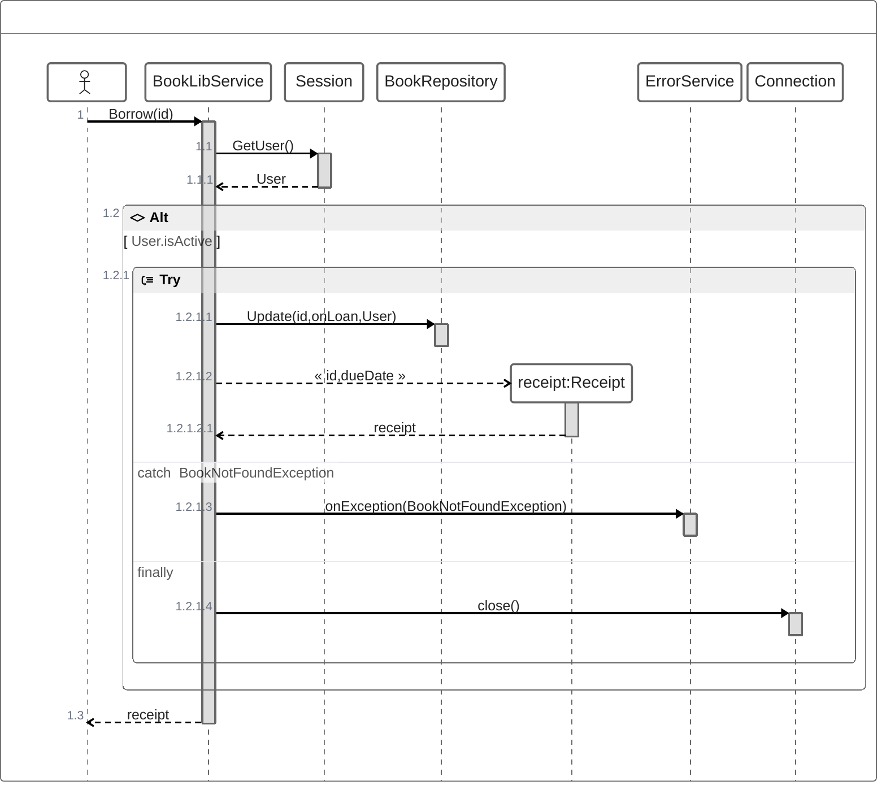
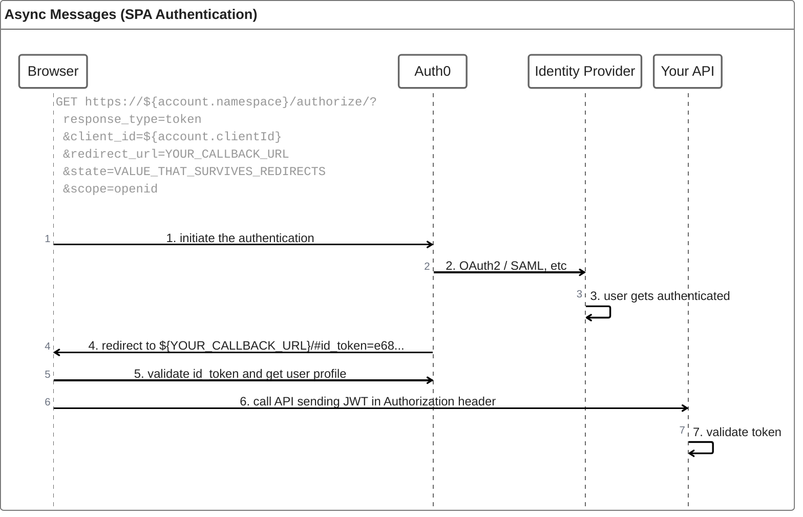

# zenuml

## Example 1

**SebastianJS (SVG):**

> Render failed: UnknownDiagramError: No diagram type detected matching given configuration for text: zenuml
BookLibService.Borrow(id) {
  User = Session.GetUser()
  if(User.isActive) {
    try {
      BookRepository.Update(id, onLoan, User)
      receipt = new Receipt(id, dueDate)
    } catch (BookNotFoundException) {
      ErrorService.onException(BookNotFoundException)
    } finally {
      Connection.close()
    }
  }
  return receipt
}

**Mermaid Code (Browser Rendered):**



## Example 2

**SebastianJS (SVG):**

> Render failed: UnknownDiagramError: No diagram type detected matching given configuration for text: zenuml
      title Async Messages (SPA Authentication)
      // ```
      // GET https://${account.namespace}/authorize/?
      // response_type=token
      // &client_id=${account.clientId}
      // &redirect_url=YOUR_CALLBACK_URL
      // &state=VALUE_THAT_SURVIVES_REDIRECTS
      // &scope=openid
      // ```
      Browser->Auth0: 1. initiate the authentication
      Auth0->"Identity Provider": 2. OAuth2 / SAML, etc
      "Identity Provider"->"Identity Provider": 3. user gets authenticated
      Auth0->Browser: 4. redirect to ${YOUR_CALLBACK_URL}/#id_token=e68...
      Browser->Auth0: 5. validate id_token and get user profile
      Browser->"Your API": 6. call API sending JWT in Authorization header
      "Your API"->"Your API": 7. validate token

**Mermaid Code (Browser Rendered):**



